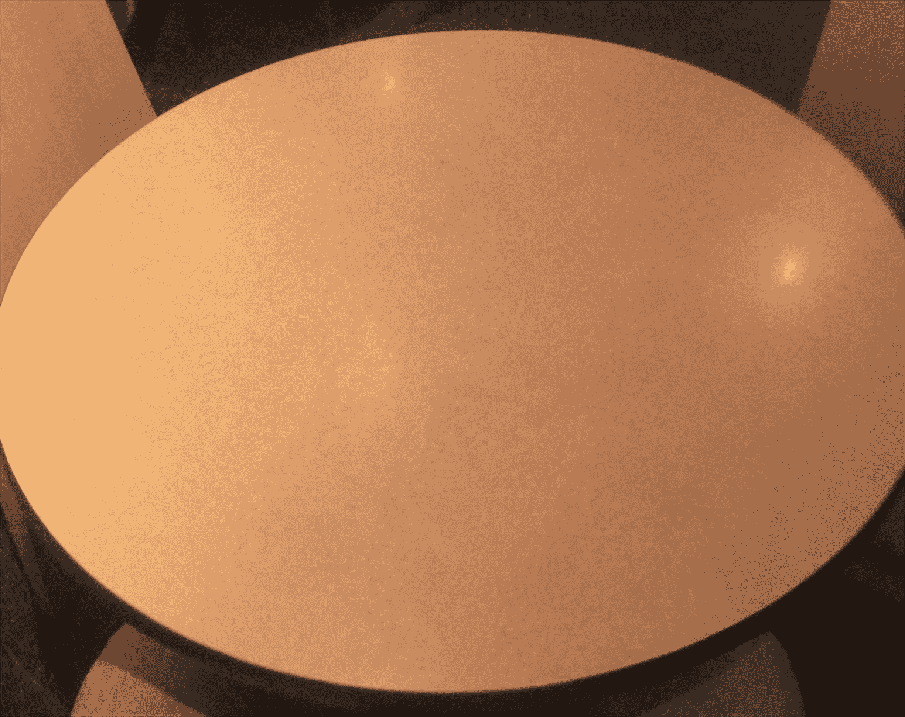
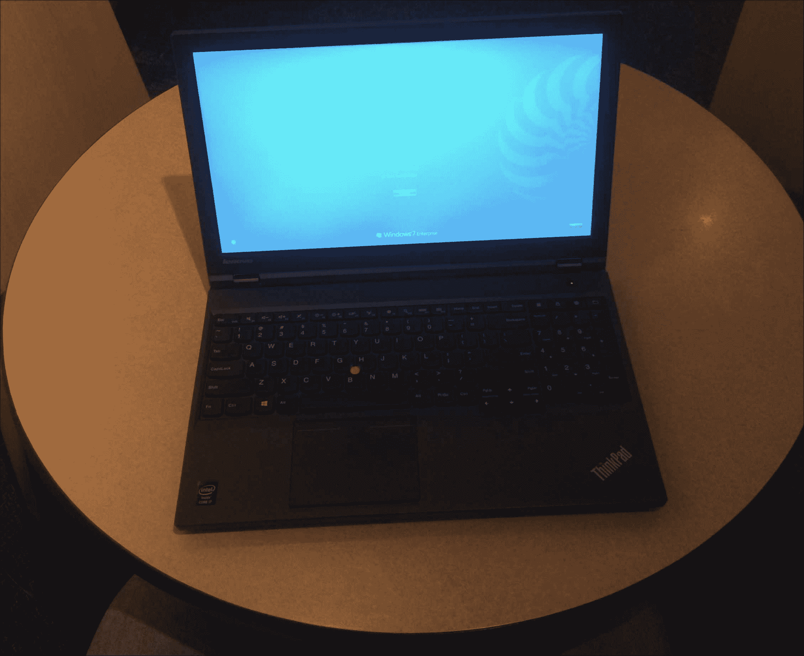
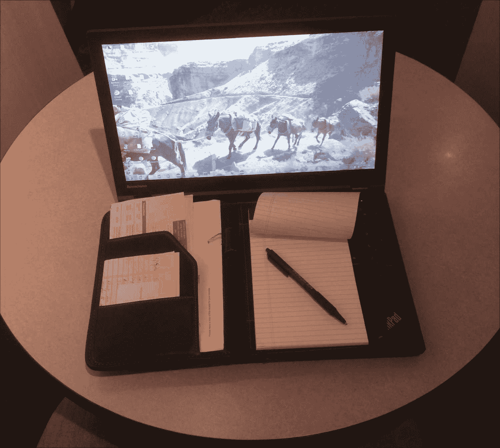
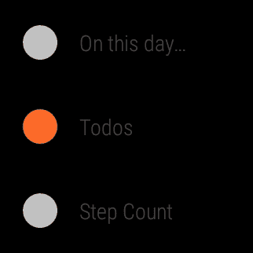
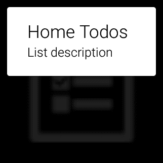
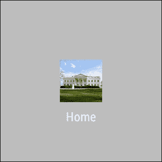
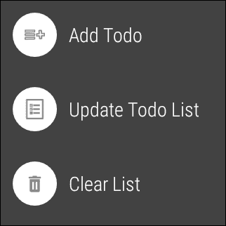
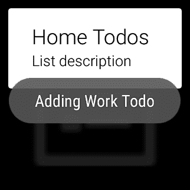
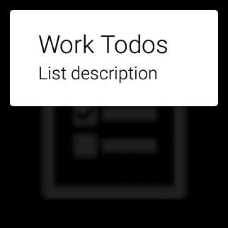

# 第九章. 材料设计

> *"这个世界只是我们想象力的画布。" - 亨利·大卫·梭罗*

在本章中，我们提供了对材料设计的概念理解，并简要介绍了适用于可穿戴应用设计和开发的几个关键原则。通过将前几章的`Todo`应用扩展，我们巩固了对材料设计的理解，以包含一个导航抽屉，使我们能够在`Todo`类别之间切换，查看项目并执行每个类别的特定操作。

### 注意

本章的代码可在 GitHub 上参考（[`github.com/siddii/mastering-android-wear/tree/master/Chapter_9`](https://github.com/siddii/mastering-android-wear/tree/master/Chapter_9)）。为了简洁起见，仅包含所需的代码片段。鼓励读者从 GitHub 下载引用的代码，并在阅读章节时跟随。

# 接近材料设计

您理解材料设计的首要资源是[material.google.com](http://material.google.com)，这是概述材料设计原则和信条的活在线文档。它真的应该被任何热衷于材料设计的认真设计师或开发者收藏。

虽然我们鼓励您阅读谷歌的文档，但我们认为如果我们提出一种思考材料设计的方法，那将不会是多余的。我们的目标是向您，一个对材料设计哲学感兴趣的人，提供一个直观和象征性的范式理解。我们希望这个简短的介绍为您准备好一种心态，这将加快您通过材料设计在线文档的旅程，并激发一种创造力，这将使您能够将想象力投射到您可穿戴应用的实体设计理念上。

本节仅针对那些可能对这一概念较新，可能需要一本希望足够充分的入门指南，以便点燃火花并让我们重新思考的人。

## 与世界互动

我们可以讨论材料设计的正式定义，也许甚至更多。但这不会是我们的时间的好用途。谷歌的文档在这方面做得很好，还有更多。与其陷入对材料设计是什么的表述，不如退一步，了解其背后的动机是什么。

在我们的目的上，让我们考虑这样一个场景：您在一家咖啡馆，坐在桌旁。看看下面图中的空桌面：



您的桌面有很大的潜力成为您的工作空间。让我们称这种潜力为**可用性**。这个术语通常意味着一个对象或环境动作的可能性。例如，看一辆汽车的方向盘，自然会想到应该旋转它以使其运作，而不是拉或推。

让我们花一点时间研究我们的工作空间：

+   它是平的

+   它有清晰的边界；在这种情况下，定义我们桌子形状的圆形的连续边缘

+   在其初始状态下，它不持有任何物体

让我们停下来，与我们的桌子稍微互动一下。下面是：



现在桌子不再空了。让我们继续我们的观察：

+   放在桌子上的物体会留在桌子上；它们不会自己滑落，也不会飘走（感谢重力）。

+   物体可以在桌子上移动，但受限于其边界。

+   只有我们关心的物体在桌子上。我们不关心的物体，我们倾向于把它们从桌子上拿下来。你看到我的记事本了吗？还没有，因为我还没有足够关心它。

让我们改变一下：



好吧，现在看起来开始有点熟悉了。这里有一些更多的观察：

+   如果需要方便地访问，物体可以共享空间。

+   当一个物体吸引我的注意力时，它就在上面。

+   在任何给定的时间，桌子上每个物体都占据一个特定的（我该如何表达）高度，这取决于它是否在所有其他物体之上，在底部（即直接在桌子上），还是位于其他物体之间。

+   随着桌子上物体的数量增加，可用性可以增加。可用性是人在机交互（HCI）中用来描述用户在交互过程中可以采取的可能行动的术语。

我们可以继续下去，对关于我们的表面（桌子）和上面的物体可能做到和做不到的事情做出各种智能的观察。然而，重要的是，所有这些观察对我们成功使用桌子以及堆放在上面的物体堆，无论是为了完成工作还是为了玩耍，都是完全不必要的。

原因可能更适合于关于人机交互（HCI）或更广泛地说，感知/认知/环境心理学的讨论。我们只需要理解和欣赏的是，我们对如何使用表面及其交互的直观理解，可能是用户界面高效和有效设计的钥匙。

## 一种视觉语言

我们需要问的问题是，所有这些如何帮助我们设计更好的用户界面？

谷歌的设计师们将我们对现实世界中与表面交互的知识和经验提炼成一套原则和信条，统称为**材料设计**。这些原则和信条在[material.google.com](http://material.google.com)上列出，这应该是我们所有关于材料设计的首要参考资料。

### 小贴士

我们所说的“材料”是什么意思？

值得明确的是，当谷歌文档使用“材料”一词时，它本质上是指您视觉设计中任何图形对象。这些可能包括导航对象、操作栏、对话框等。您可以与之交互的每个材料对象都有尺寸（高度和宽度），它具有标准厚度，并且位于一个假想表面上，在特定高度（沿*z*轴）的三维空间中。

为了理解什么是材料设计，我们需要采取必要的材料设计思维方式。当然，我们与真实世界的互动方式并不总是直接转化为我们与设备的互动方式。但是，在存在重叠的地方，我们必须利用用户的直观能力来提高系统的可用性。在我们与真实世界的互动相当有限的情况下，软件通过扩展可能性领域来丰富用户体验，使其超越物理世界，同时始终尊重和调动用户直觉。

当您阅读[material.google.com](http://material.google.com)上的教条时，您将遇到以下内容的详细讨论，仅举几例：

+   受纸张和墨水启发的材料理念

+   关键光和周围光作为高度（阴影大小和锐度）的视觉线索

+   运动尊重用户作为主要运动发起者的角色

+   每个材料对象都有三个维度（*x*、*y*和*z*坐标）并且始终占据一个固定的 z 轴位置

+   尽可能无缝地向用户展示对象

+   物理规则得到尊重

+   当规则被违反时，它们是有意为之的，例如，为了吸引用户的注意

+   对象可以如何以及应该如何被操作，以及它们不应该如何操作

+   材料运动和转换

+   核心图标和字体设计

+   导航组件和模式

当我们与可穿戴设备应用一起工作时，由于形式因素显著降低，因此我们的可用性挑战增加，此时采用材料设计哲学在我们的设计和开发实践中变得更加重要。建立在广泛认可隐喻的基础上是确保我们可穿戴应用可用性和持久性的关键。

现在，让我们编写一些代码。

# 待办事项菜单

让我们通过一个强大的设计隐喻——*导航抽屉*——来增强“今日待办”应用。

我们需要做的第一件事是在我们的`arrays.xml`文件中添加一个`Todos`操作，如下所示：

```java
<?xml version="1.0" encoding="utf-8"?> 
<resources> 
  <string-array name="actions"> 
    <item>Day of Year</item> 
    <item>On this day...</item> 
    <item>Todos</item> 
    <item>Step Count</item> 
  </string-array> 
</resources> 

```

这就是它在列表菜单中的显示方式。请点击“待办事项”菜单项，我们将在以下部分与之交互：



接下来，我们将使用 Android Wear API 中的 `WearableNavigationDrawer` 组件实现我们的 `Todo` 应用程序的菜单。该菜单将允许我们选择与待办事项类型（例如，家庭、工作等）对应的不同的视图（标签），并在选择抽屉标签时列出该类型的待办事项。

## 关于导航抽屉

导航抽屉是从屏幕顶部边缘向下滑动的纸上的材料对象。导航抽屉非常适合具有多个视图的应用程序。分页点通过左右滑动在视图之间引导用户。

导航抽屉提供了一种功能，即当用户滚动到视图顶部时，每个视图的内容变得可见。如果空闲，抽屉将保持打开五秒钟，之后将其隐藏。

补充导航抽屉的是可从屏幕底部边缘向上滑动的材料纸上的操作抽屉对象。向上滑动会显示包含额外可执行内容的操作抽屉。

# TodosActivity 类

实现导航抽屉涉及使用 `WearableDrawerLayout` 类创建抽屉布局，并向其中添加一个包含屏幕主要内容的视图。这个主要视图包含包含抽屉内容的子视图。`TodosActivity` 类将控制导航抽屉并初始化抽屉布局：

```java
public class TodosActivity extends WearableActivity implements  WearableActionDrawer.OnMenuItemClickListener  
{ 
  private static final String TAG = TodosActivity.class.getName(); 
  private WearableDrawerLayout mWearableDrawerLayout; 
  private WearableNavigationDrawer mWearableNavigationDrawer; 
  private WearableActionDrawer mWearableActionDrawer; 
  private List<TodoItemType> todoItemTypes =  Arrays.asList(TodoItemType.HOME, TodoItemType.WORK); 
  private TodoItemType mSelectedTodoItemType; 
  private TodoItemTypeFragment mTodoItemTypeFragment; 

  @Override 
  protected void onCreate(Bundle savedInstanceState)  
  { 
    super.onCreate(savedInstanceState); 
    Log.d(TAG, "onCreate()"); 
    setContentView(R.layout.activity_todo_main); 
    setAmbientEnabled(); 

    //defaulted to Home todo item type 
    mSelectedTodoItemType = TodoItemType.HOME; 

    // Initialize content 
    mTodoItemTypeFragment = new TodoItemTypeFragment(); 
    Bundle args = new Bundle(); 
    args.putString(TodoItemTypeFragment.ARG_TODO_TYPE,  mSelectedTodoItemType.toString()); 
    mTodoItemTypeFragment.setArguments(args); 
    FragmentManager fragmentManager = getFragmentManager(); 
    fragmentManager.beginTransaction().replace(R.id.content_frame,  mTodoItemTypeFragment).commit(); 

    // Main Wearable Drawer Layout that wraps all content 
    mWearableDrawerLayout = (WearableDrawerLayout)  findViewById(R.id.drawer_layout); 

    //Top Navigation Drawer 
    mWearableNavigationDrawer = (WearableNavigationDrawer)  findViewById(R.id.top_navigation_drawer); 

    Log.i(TAG, "mWearableNavigationDrawer  = " +  mWearableNavigationDrawer); 
    mWearableNavigationDrawer.setAdapter(new  NavigationAdapter(this)); 

    // Peeks Navigation drawer on the top. 
    mWearableDrawerLayout.peekDrawer(Gravity.TOP); 

    // Bottom Action Drawer 
    mWearableActionDrawer = (WearableActionDrawer)  findViewById(R.id.bottom_action_drawer); 
    mWearableActionDrawer.setOnMenuItemClickListener(this); 

    // Peeks action drawer on the bottom. 
    mWearableDrawerLayout.peekDrawer(Gravity.BOTTOM); 
  } 
} 

```

# TodoItemTypeFragment 类

`TodoItemTypeFragment` 类是 `TodosActivity` 活动的内部类，包含每种类型待办事项的内容。为了简化，我们展示了以下代码中突出显示的一些静态内容。有关在可穿戴设备和手持设备之间同步数据的更多信息，请参阅第五章，*同步数据*：

```java
public static class TodoItemTypeFragment extends Fragment  
{ 
  public static final String ARG_TODO_TYPE = "todo_type"; 
  TextView titleView = null; 
  TextView descView = null; 
  public TodoItemTypeFragment()  
  { 
    // Empty constructor required for fragment subclasses 
  } 
  @Override 
  public View onCreateView(LayoutInflater inflater, ViewGroup  container, Bundle savedInstanceState)  
  { 
    View rootView = inflater.inflate(R.layout.fragment_todo_item,  container, false); 
    titleView = (TextView)  rootView.findViewById(R.id.todo_card_title); 
    descView = (TextView)  rootView.findViewById(R.id.todo_card_desc); 
    String todoType = getArguments().getString(ARG_TODO_TYPE); 
    TodoItemType todoItemType = TodoItemType.valueOf(todoType); 
    updateFragment(todoItemType); 
    return rootView; 
  } 
  public void updateFragment(TodoItemType todoItemType)  
  { 
       titleView.setText(todoItemType.getTypeValue() + " Todos"); 
       //The following line is hardcoded on purpose for simplicity 
       descView.setText("List description"); 
    } 
} 

```

这就是待办事项卡片的外观。请注意，`Home` 待办事项项被默认选中，如前述代码示例中所述：



# NavigationAdapter 类

导航适配器控制导航状态中显示的内容。我们实现 `WearableNavigationDrawerAdapter` 类来填充导航抽屉的内容：

```java
private final class NavigationAdapter extends WearableNavigationDrawer.WearableNavigationDrawerAdapter  
{ 
  private final Context mContext; 
  public NavigationAdapter(Context context)  
  { 
    mContext = context; 
  } 

  @Override 
  public int getCount()  
  { 
    return todoItemTypes.size(); 
  } 

  @Override 
  public void onItemSelected(int position)  
  { 
    Log.d(TAG, "WearableNavigationDrawerAdapter.onItemSelected():  " + position); 
    mSelectedTodoItemType = todoItemTypes.get(position); 
    String selectedTodoImage =  mSelectedTodoItemType.getBackgroundImage(); 
    int drawableId =  getResources().getIdentifier(selectedTodoImage, "drawable",  getPackageName()); 
    mTodoItemTypeFragment.updateFragment(mSelectedTodoItemType); 
  } 

  @Override 
  public String getItemText(int pos)  
  { 
    return todoItemTypes.get(pos).getTypeValue(); 
  } 

  @Override 
  public Drawable getItemDrawable(int position)  
  { 
    mSelectedTodoItemType = todoItemTypes.get(position); 
    String navigationIcon =  mSelectedTodoItemType.getBackgroundImage() 
    int drawableNavigationIconId =  getResources().getIdentifier(navigationIcon, "drawable",  getPackageName()) 
    return mContext.getDrawable(drawableNavigationIconId); 
  } 
} 

```

# 导航项

当在 **首页 Todos** 屏幕上（如果你还记得，`Home` 是默认类型），从顶部向下滑动。正如预期的那样，`Home` 待办事项类型被预先选中：



# WearableDrawerLayout 类

`activity_todo_main.xml` 文件包含定义根抽屉布局的代码，该布局包含顶部导航抽屉和底部操作抽屉。请注意高亮的菜单布局：

```java
<android.support.wearable.view.drawer.WearableDrawerLayout 
  android:id="@+id/drawer_layout" 

  android:layout_width="match_parent" 
  android:layout_height="match_parent" 
  android:background="@color/black" 
  tools:context=".TodosActivity" 
  tools:deviceIds="wear"> 

  <FrameLayout 
    android:layout_width="match_parent" 
    android:layout_height="match_parent" 
    android:id="@+id/content_frame"/> 

<android.support.wearable.view.drawer.WearableNavigationDrawer 
  android:id="@+id/top_navigation_drawer" 
  android:layout_width="match_parent" 
  android:layout_height="match_parent" 
  android:background="@color/light_grey" /> 

<android.support.wearable.view.drawer.WearableActionDrawer 
  android:id="@+id/bottom_action_drawer" 
  android:layout_width="match_parent" 
  android:layout_height="match_parent" 
  app:action_menu="@menu/action_todo_drawer_menu" 
  android:background="@color/dark_grey"/> 

</android.support.wearable.view.drawer.WearableDrawerLayout> 

```

# 菜单项

`activity_todo_drawer_menu.xml` 文件包含各个抽屉的定义：

```java
<menu > 
  <item android:id="@+id/menu_add_todo" 
  android:icon="@drawable/ic_add_to_list" 
  android:/> 

  <item android:id="@+id/menu_update_todo" 
  android:icon="@drawable/ic_todo_list" 
  android: /> 

  <item android:id="@+id/menu_clear_todos" 

  android:icon="@drawable/ic_clear_list" 
  android: /> 
</menu> 

```

当在 `Home Todos` 索引卡片（在之前的图像中显示）上时，从底部向上滑动将显示操作抽屉：



# 菜单监听器

点击单个菜单项，我们只显示提示信息。正如我们之前所说的，我们希望代码简洁且易于阅读。基于我们之前覆盖的章节，我们应该对如何执行这些单个菜单动作的数据同步有所了解。我们使用了`onMenuItemClick`类来执行菜单监听活动，如下所示：

```java
@Override 
public boolean onMenuItemClick(MenuItem menuItem)  
{ 
  Log.d(TAG, "onMenuItemClick(): " + menuItem); 
  final int itemId = menuItem.getItemId(); 
  String toastMessage = ""; 
  switch (itemId)  
  { 
    case R.id.menu_add_todo: 
    toastMessage = "Adding " +  mSelectedTodoItemType.getTypeValue() + " Todo"; 
    break; 

    case R.id.menu_update_todo: 
    toastMessage = "Updating " +  mSelectedTodoItemType.getTypeValue() + " Todo"; 
    break; 

    case R.id.menu_clear_todos: 
    toastMessage = "Clearing " +  mSelectedTodoItemType.getTypeValue() + " Todos"; 
    break; 
  } 
  mWearableDrawerLayout.closeDrawer(mWearableActionDrawer); 
  if (toastMessage.length() > 0)  
  { 
    Toast toast = Toast.makeText(getApplicationContext(), toastMessage, Toast.LENGTH_SHORT); 
    toast.show(); 
    return true; 
  }  
  else  
  { 
    return false; 
  } 
} 

```

点击**添加待办**选项执行以下操作：



# 切换待办类型

现在如果我们从屏幕顶部边缘向下拉抽屉并向左滑动，我们将切换到不同的待办项，如下面的图像所示，这实际上显示了一个新的导航项：


如果我们将抽屉拉回顶部，它将导航项设置为当前选择。这是通过`TodosActivity`活动实现的`WearableActionDrawer.OnMenuItemClickListener`类的`onItemSelected`方法来实现的：

```java
@Override 
public void onItemSelected(int position)  
{ 
  Log.d(TAG, "WearableNavigationDrawerAdapter.onItemSelected(): "  + position); 
  mSelectedTodoItemType = todoItemTypes.get(position); 
  String selectedTodoImage =  mSelectedTodoItemType.getBackgroundImage(); 
  int drawableId = getResources().getIdentifier(selectedTodoImage,  "drawable", getPackageName()); 
  mTodoItemTypeFragment.updateFragment(mSelectedTodoItemType); 
} 

```

下面是我们看到的内容：



从底部向上拉，我们看到菜单项如**添加待办**、**更新待办列表**和**清除列表**等。当我们点击**清除列表**菜单项时，我们看到以下内容：


# 摘要

在本章中，我们获得了对什么是真正材料设计的直观理解，并探讨了与 Android Wear 设计和开发相关的几个关键原则。我们在`Todo`应用中实现了导航抽屉，增加了切换待办类型和查看针对每种类型执行特定动作的待办项的功能。
