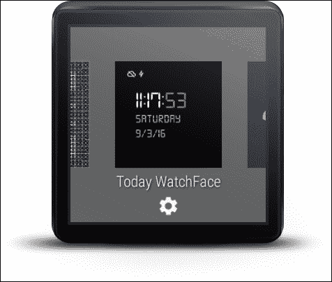
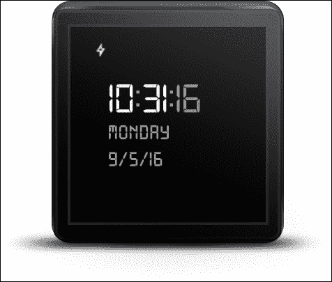
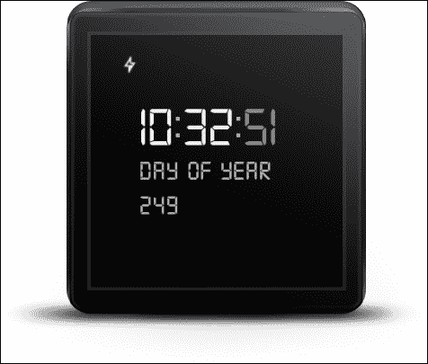
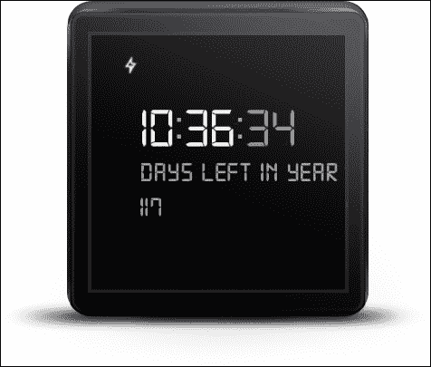
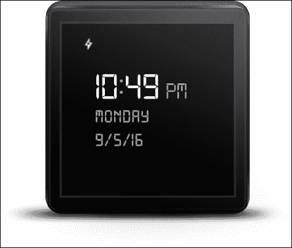
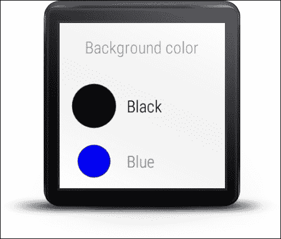

# 第十章. 手表表盘

> "如果你花太多时间去思考一件事情，你永远也完成不了。" - 李小龙*

我们将从这个章节开始，介绍手表表盘的概念，并概述可用于帮助我们开发它们的 Android Wear API。然后，我们将开发一个简单的交互式手表表盘，除了显示时间外，还会通过触摸动作显示年内已过去的天数和剩余的天数。

### 注意

本章附带代码可在 GitHub 上参考（[`github.com/siddii/mastering-android-wear/tree/master/Chapter_10`](https://github.com/siddii/mastering-android-wear/tree/master/Chapter_10)）。

为了简洁起见，代码片段仅按需包含。鼓励读者从 GitHub 下载引用的代码，并在阅读章节时跟随。

# 显示时间

当我们提到可穿戴设备时，我们主要是指智能手表，一个不能显示时间的手表实际上并不算手表。这就像拥有一艘配备最先进 GPS 技术的豪华游艇，但难以浮在水面上。为了打一个更贴近生活的比喻，考虑一下一部难以作为电话使用的智能手机。（等等！这实际上发生过！）

## 什么是手表表盘？

“手表表盘”这个术语用来指代可穿戴设备上当前时间的数字显示，以便用户可以一眼看出时间，这与佩戴手表时的情况非常相似。

然而，与传统手表不同，我们的可穿戴设备拥有众多额外的功能，这些功能仅受其自身内部内存及其与一个或多个配对的便携式伴侣设备的通信限制。因此，在可穿戴设备上显示时间，涉及到比为可能具有特定功能列表（如时间、日期、双时和闹钟模式等）的数字手表编写的软件更为复杂的软件。

不言而喻，手表表盘本身就是可更换的组件。你可以随心所欲地更换你喜欢的表盘。拥有各种风格和形状的手表表盘，一些提供相关上下文数据，可以通过 Android Wear 伴侣应用获取。用户只需在可穿戴设备或伴侣应用中选择一个可用的表盘，可穿戴设备就会显示表盘的预览，并允许用户进行配置。如果你找不到你喜欢的，你可以继续编写你自己的。因此，有了这一章。当我们进入下一节构建一个表盘时，我们的手表表盘实现之旅将更加真实。让我们首先谈谈手表表盘设计包含的内容，以及哪些 Wear API 类在手表表盘的开发中发挥作用。

## 设计考虑因素

虽然 Android Wear 可以通过提供各种功能，如吸引人的颜色、动态背景、动画和数据集成等，在您的设计工作中提供巨大的帮助，但您的设计中还有一些非 API 方面需要考虑。以下是一些在 Android 开发社区中得到广泛认可的要点：

+   考虑您想向用户展示的内容以及这些内容如何适应表盘的上下文。信息过多可能会分散注意力。

+   您的表盘应在方形和圆形设备上可靠运行。

+   为环境模式提供合适的实现。当设备空闲时，用户会感谢您没有耗尽他们的可穿戴设备的电池寿命。

+   UI 指示器（如通知卡片）仍然应该显示，而不会使读取时间变得不可能。

+   通过智能查询和显示通过伴侣手持设备可用的上下文相关信息来丰富您的表盘。记住，伴侣应用承担了所有繁重的工作，因此您的可穿戴应用（在这种情况下，您的表盘）应将任何计算密集型工作或第三方数据查找（如天气信息）委托给伴侣应用。

允许用户配置表盘。

我们强烈建议您阅读 Android 开发者网站上关于“Android Wear 表盘”的部分，它将作为设计指南帮助您，链接为 [`developer.android.com/design/wear/watchfaces.html`](https://developer.android.com/design/wear/watchfaces.html)。

## 实现考虑

考虑背景图像。在交互模式下，背景图像可能与环境模式中使用的不同。此外，如果设备的分辨率低于图像，背景图像应缩小（作为一次性操作）。

获取上下文相关数据的应用程序代码应仅在需要时运行，并将结果存储以供重用时重绘表盘使用。

在环境模式下更新表盘应尽可能简单，通过使用有限的颜色、固定的黑色背景以及仅绘制轮廓来最小化工作并节省电池寿命。

## 表盘服务

表盘是通过服务实现的，并打包在可穿戴应用中。您已经知道，可穿戴应用反过来又打包在手持应用中。当用户安装包含一个或多个表盘的手持应用时，这些表盘在可穿戴设备上的表盘选择器中变为可选。它们也将在手持设备上的 Android Wear 伴侣应用中可用。当选择其中一个表盘（无论是在手持设备上还是在可穿戴设备的选择器上）时，表盘将在可穿戴设备上显示，这会根据表盘的生命周期调用所需的服务回调方法。

要创建手表表盘实现，我们扩展了 Wearable 支持库中提供的类（`android.support.wearable.watchface` 包）。当手表表盘变为活跃状态时，系统会在各种事件发生时调用其服务类中的方法，例如时间变化、切换到环境模式以及通知警报。相应的处理程序实现随后通过绘制手表表盘来响应，使用更新后的时间或通知数据或事件可能消耗的其他数据。可能需要在手表表盘服务中实现的关键方法包括以下内容：

+   `onCreate` 方法

+   `onPropertiesChanged` 方法

+   `onTimeTick` 方法

+   `onAmbientModeChanged` 方法

+   `onDraw` 方法

+   `onVisibilityChanged` 方法

查看 Wearable 支持库[`developer.android.com/reference/android/support/wearable/watchface/package-summary.html`](https://developer.android.com/reference/android/support/wearable/watchface/package-summary.html)，以详细了解可用的手表表服务类对象模型。

一旦实现，手表表盘服务必须在可穿戴应用的清单文件（`AndroidManifest.xml`）中注册。这样，当用户安装应用时，系统就可以在 Android Wear 伴侣应用和可穿戴设备上的手表表盘选择器中提供手表表盘。

## 交互式手表表盘

手表表盘支持有限的用户交互。只要不与另一个也监听该手势的 UI 元素冲突，手表表盘上特定位置的单一轻点手势就会被接受。在我们下一节的示例代码中，我们支持一个轻点手势，该手势显示当前年份已过去的天数以及剩余的天数。

处理轻点事件涉及实现 `WatchFaceService.Engine` 类所有扩展中都可用的 `setWatchFaceStyle` 方法。应用通知系统手表表盘接收到了轻点事件，如下面的代码片段所示：

```java
setWatchFaceStyle(new WatchFaceStyle.Builder(mService) 
  .setAcceptsTapEvents(true) 

  // other style customizations 
  .build()); 

```

## 性能考虑

在手表表盘的上下文中，节省电量非常关键，因为手表表盘始终处于活跃状态。以下是 Wear 开发社区针对手表表盘开发提出的几项最佳实践：

+   确保手表表盘仅在活跃时执行操作。使用 `WatchFaceService.Engine` 类的 `onVisibilityChanged` 和 `isVisible` 方法来确定这一点。

+   避免使用 `WearableListenerService` 元素来监听事件，因为它无论手表表盘是否活跃都会被调用。相反，使用与 `DataApi.addListener` 元素注册的监听器。

+   关注我们可穿戴应用的实际功耗。Android Wear 伴侣应用让我们可以看到可穿戴设备上不同进程消耗了多少电量。

+   在使用动画时，请注意降低帧率。每秒 30 帧足以提供平滑的动画体验。我们应该尽可能少地使用动画，并且当我们使用它们时，我们应该利用每个机会让 CPU 在动画运行之间休眠。每个空闲周期都有助于更大程度地节省电池寿命。

+   保持位图小。在合理的地方，将多个位图合并成一个。减少我们绘制的图形资源数量有助于节省电力。

+   仅使用 `Engine.onDraw` 方法执行绘图操作。将任何加载资源、调整图像大小或执行绘图外计算的工作移出 `onDraw` 方法。考虑将这些代码放在 `onCreate` 方法中。

# 让我们构建一个表盘

是时候看到之前介绍的概念的实际应用了。我们将构建一个简单的表盘，使用相当标准的时、分、秒显示来显示时间。轻触表盘会显示当前年份已过去的天数。第二次轻触会显示当前年份剩余的天数。

在接下来的小节中，我们将定义一个 `WatchFaceService` 类，它扩展了 API `CanvasWatchFaceService` 类，并重写了与我们的示例应用程序相关的相关事件处理程序。

## Android 的清单文件

我们首先声明 `TodayWatchFaceService` 服务和 `WatchFaceConfigActivity` 活动，这有助于为表盘选择背景颜色：

```java
<!— Required to act as a custom watch face. —> 
<uses-permission android:name="android.permission.WAKE_LOCK" /> 

<service 
  android:name=".TodayWatchFaceService" 
  android:label="@string/digital_name" 
  android:permission="android.permission.BIND_WALLPAPER" > 
  <meta-data 
    android:name="android.service.wallpaper" 
    android:resource="@xml/watch_face" /> 

  <meta-data 
    android:name="com.google.android.wearable.watchface.preview" 
    android:resource="@drawable/preview_digital" /> 

  <meta-data 
    android:name="com.google.android.wearable.watchface.preview_circular" 
    android:resource="@drawable/preview_digital_circular" /> 

  <meta-data 
    android:name="com.google.android.wearable.watchface.companionConfigurationAction" 
    android:value="com.siddique.androidwear.today.CONFIG_DIGITAL"/> 

  <meta-data 
    android:name="com.google.android.wearable.watchface.wearableConfigurationAction" 
    android:value="com.siddique.androidwear.today.CONFIG_DIGITAL"/>  
  <intent-filter> 
    <action android:name="android.service.wallpaper.WallpaperService" /> 

    <category android:name="com.google.android.wearable.watchface.category.WATCH_FACE" /> 
  </intent-filter> 
</service> 

<activity 
  android:name=".WatchFaceConfigActivity" 
  android:label="@string/digital_config_name" > 
  <intent-filter> 
    <action android:name="com.siddique.androidwear.today.CONFIG_DIGITAL" /> 

      <category android:name="com.google.android.wearable.watchface.category.WEARABLE_CONFIGURATION" /> 
      <category android:name="android.intent.category.DEFAULT" /> 
    </intent-filter> 
</activity> 

```

# TodayWatchFace 服务

在我们仔细查看 `TodayWatchFaceService` 类的实现之前，让我们运行我们的示例代码，看看它的行为如何，这样我们可以从用户的角度观察应用程序。

注意，长按设备屏幕会导致已安装的表盘显示：



注意，在自定义表盘的标签 `TodayWatchFace` 下面出现了一个 *齿轮* 图标，因为我们为 `WatchFace` 元素定义了一个配置活动。让我们选择我们的自定义表盘。以下是它的渲染效果。默认情况下，它显示星期和完整的日期，*秒* 分针闪烁：



在表盘上轻触一次会显示年份中的某一天，如下面的图片所示：



在表盘上第二次轻触会显示当年剩余的天数。



再次轻触会返回默认显示。

# TodayWatchFaceService 类

`TodayWatchFaceService` 类执行所有工作，包括设置布局、读取配置值以及为每秒的每个滴答绘制 UI。在本章中讨论超过 700 行代码是不现实的。因此，我们将查看从这个类定义中提取的重要片段：

```java
public class TodayWatchFaceService extends CanvasWatchFaceService { 
  @Override 
  public Engine onCreateEngine()  
  { 
    return new Engine(); 
  } 
  private class Engine extends CanvasWatchFaceService.Engine  implements DataApi.DataListener,  GoogleApiClient.ConnectionCallbacks,  GoogleApiClient.OnConnectionFailedListener  
  { 
    ... 
  } 
} 

```

### 提示

总是如此，本章以及所有其他章节的示例源代码，都可以在每章开头提供的 GitHub 链接中找到。GitHub 上托管的是我们深入了解该服务如何工作的主要参考。

# `onTimeTick` 方法

每次时间滴答时都会调用此方法。我们使 UI 无效（请参阅对 `invalidate()` 方法的调用），以强制调用 `onDraw` 方法。实际上，我们在正常模式下每 500 毫秒重新渲染一次 UI，在环境或静音模式下每分钟重新渲染一次：

```java
@Override 
public void onTimeTick()  
  { 
    super.onTimeTick(); 
    if (Log.isLoggable(TAG, Log.DEBUG))  
    { 
      Log.d(TAG, "onTimeTick: ambient = " + isInAmbientMode()); 
    } 
  invalidate(); 
} 

```

# 绘制手表表盘

`onDraw()` 方法用所有必要的信息绘制手表表盘。遵循代码中的注释，以便完全理解以下代码片段：

```java
@Override 
public void onDraw(Canvas canvas, Rect bounds)  
{ 
  long now = System.currentTimeMillis(); 
  mCalendar.setTimeInMillis(now); 
  mDate.setTime(now); 
  boolean is24Hour =  DateFormat.is24HourFormat(TodayWatchFaceService.this); 

  // Show colons for the first half of each second so the colons blink on when the time 
  // updates. 
  mShouldDrawColons = (System.currentTimeMillis() % 1000) < 500; 

  // Draw the background. 
  canvas.drawRect(0, 0, bounds.width(), bounds.height(), mBackgroundPaint); 

  // Draw the hours. 
  float x = mXOffset; 
  String hourString; 
  if (is24Hour)  
  { 
    hourString =  formatTwoDigitNumber(mCalendar.get(Calendar.HOUR_OF_DAY));   }  
  else  
  { 
    int hour = mCalendar.get(Calendar.HOUR); 
    if (hour == 0)  
    { 
      hour = 12; 
    } 
    hourString = String.valueOf(hour); 
  } 
  canvas.drawText(hourString, x, mYOffset, mHourPaint); 
  x += mHourPaint.measureText(hourString); 

  // In ambient and mute modes, always draw the first colon.  Otherwise, draw the 
  // first colon for the first half of each second. 
  if (isInAmbientMode() || mMute || mShouldDrawColons)  
  { 
    canvas.drawText(COLON_STRING, x, mYOffset, mColonPaint); 
  } 
  x += mColonWidth; 

  // Draw the minutes. 
  String minuteString =  formatTwoDigitNumber(mCalendar.get(Calendar.MINUTE)); 
  canvas.drawText(minuteString, x, mYOffset, mMinutePaint); 
  x += mMinutePaint.measureText(minuteString); 

  // In unmuted interactive mode, draw a second blinking colon  followed by the seconds. 
  // Otherwise, if we're in 12-hour mode, draw AM/PM 
  if (!isInAmbientMode() && !mMute)  
  { 
    if (mShouldDrawColons)  
    { 
      canvas.drawText(COLON_STRING, x, mYOffset, mColonPaint); 
    } 
  x += mColonWidth; 
  canvas.drawText(formatTwoDigitNumber(mCalendar.get(Calendar.SECOND)), x, mYOffset, mSecondPaint); 
  }  
  else if (!is24Hour)  
  { 
    x += mColonWidth; 
    canvas.drawText(getAmPmString(  mCalendar.get(Calendar.AM_PM)), x, mYOffset, mAmPmPaint); 
  } 

  // Only render the day of week and date if there is no peek card, so they do not bleed 
  // into each other in ambient mode. 
  if (getPeekCardPosition().isEmpty())  
  { 
    if (tapCount == 0)  
    { 
      // Day of week 
      canvas.drawText(mDayOfWeekFormat.format(mDate), mXOffset, mYOffset + mLineHeight, mDatePaint); 
      canvas.drawText(mDateFormat.format(mDate), mXOffset, mYOffset + mLineHeight * 2, mDatePaint); 
    }  
    else if (tapCount == 1)  
    { 
      // Day of Year 
      canvas.drawText("Day of year", mXOffset, mYOffset + mLineHeight, mDatePaint); 
      canvas.drawText(Integer.toString(TodayUtil.getDayOfYear()), mXOffset, mYOffset + mLineHeight * 2, mDatePaint); 
    } 
    else if (tapCount == 2)  
    { 
      // Days left in Year 
       canvas.drawText("Days left in year", mXOffset, mYOffset + mLineHeight, mDatePaint); 
     canvas.drawText(Integer.toString(TodayUtil.getDaysLeftInYear()), mXOffset, mYOffset + mLineHeight * 2, mDatePaint); 
    } 
  } 
} 

```

# 环境模式

与交互模式相比，环境模式是节能模式。根据手表及其配置，例如点击表盘的操作，将手表表盘渲染为环境模式：



由于我们的应用程序非常简单，这可能一眼看不出来，但如果我们将前面的截图与交互模式下手表表盘的截图进行比较，我们会看到秒针没有显示，冒号符号也没有闪烁。

这是当手表表盘从交互模式切换到环境模式时被调用的监听器：

```java
@Override 
public void onAmbientModeChanged(boolean inAmbientMode)  
{ 
  super.onAmbientModeChanged(inAmbientMode); 
  if (Log.isLoggable(TAG, Log.DEBUG))  
  { 
    Log.d(TAG, "onAmbientModeChanged: " + inAmbientMode); 
  } 
  adjustPaintColorToCurrentMode(mBackgroundPaint, mInteractiveBackgroundColor,WatchFaceUtil.COLOR_VALUE_DEFAULT_AND_AMBIENT_BACKGROUND); 
  adjustPaintColorToCurrentMode(mHourPaint, mInteractiveHourDigitsColor,WatchFaceUtil.COLOR_VALUE_DEFAULT_AND_AMBIENT_HOUR_DIGITS); 
  adjustPaintColorToCurrentMode(mMinutePaint, mInteractiveMinuteDigitsColor, WatchFaceUtil.COLOR_VALUE_DEFAULT_AND_AMBIENT_MINUTE_DIGITS); 

  // Actually, the seconds are not rendered in the ambient mode, so we could pass just any 
  // value as ambientColor here. 
  adjustPaintColorToCurrentMode(mSecondPaint,  mInteractiveSecondDigitsColor, WatchFaceUtil.COLOR_VALUE_DEFAULT_AND_AMBIENT_SECOND_DIGITS); 

  if (mLowBitAmbient)  
  { 
    boolean antiAlias = !inAmbientMode; 
    mDatePaint.setAntiAlias(antiAlias); 
    mHourPaint.setAntiAlias(antiAlias); 
    mMinutePaint.setAntiAlias(antiAlias); 
    mSecondPaint.setAntiAlias(antiAlias); 
    mAmPmPaint.setAntiAlias(antiAlias); 
    mColonPaint.setAntiAlias(antiAlias); 
  } 
  invalidate(); 
  // Whether the timer should be running depends on whether we're in ambient mode (as well 
  // as whether we're visible), so we may need to start or stop the timer. 
  updateTimer(); 
} 

```

# 定制手表表盘

我们不想将这个例子做得太复杂，因此出于简单起见，我们决定提供一个可配置的手表表盘背景色。点击手表表盘设置中的齿轮图标，我们可以选择背景色，如图所示：



## `WatchFaceConfigActivity` 类

`WatchFaceConfigActivity` 类渲染了一个简单的颜色选择器，以确定背景色：

```java
public class WatchFaceConfigActivity extends Activity implements WearableListView.ClickListener, WearableListView.OnScrollListener  
{ 
  @Override 
  protected void onCreate(Bundle savedInstanceState)  
  { 
    super.onCreate(savedInstanceState); 
    setContentView(R.layout.activity_digital_config); 
    mHeader = (TextView) findViewById(R.id.header); 
    WearableListView listView = (WearableListView) findViewById(R.id.color_picker); 
    BoxInsetLayout content = (BoxInsetLayout) findViewById(R.id.content); 
  } 
} 

```

这是我们选择海军蓝背景色时的手表表盘截图：


我们只是刚刚触及了手表表盘设计和开发的表面，但希望这里的基本处理已经让我们尝到了这项工作的味道，并激发了我们的兴趣。对于给定的一天，我们可以更加富有创意地展示相关的上下文信息，例如待办事项的数量、与天气相关的信息等等。正如所有知识获取一样，我们看到当我们完成时，我们实际上才刚刚开始。

# 摘要

在本章中，我们介绍了手表表盘的概念，并探讨了它们的设计、实现和性能考虑。然后我们调查了 `WatchFaceService.Engine` 类，在实现一个简单的交互式手表表盘并看到这些概念和 API 类的实际应用之前。
