# 第十二章。将应用发布到 Google Play

> *"我一直相信，天空是极限的开始。" - MC Hammer*

测试是应用通过 Google Play 商店分发的重要前提。在本章中，我们将概述测试我们的 Android Wear 应用的重要性以及可用的工具，以及如何自动化 UI 测试。我们将以逐步指导结束本章，说明如何使应用准备好发布。

# 测试

任何程序员学习到测试代码与编码本身一样重要的艰难而有价值的教训都不会花费太多时间。忽视这个教训，一个有价值的 QA 团队肯定会让你屈服。测试本身就是一个值得大量关注的主题。有无数的资源，包括书籍，会向你推销各种各样的测试方法和哲学。如果你是测试的新手，**测试驱动开发**（**TDD**）值得研究。

然而，所有这些都超出了本书的范围。在本章中，我们更关注的是针对 Wear 开发提供的 Android 平台测试工具，以及可用的测试 API。让我们在接下来的部分中更详细地看看这些。

## 测试的需求

测试代码的最有说服力的理由是在应用开发生命周期中尽早捕捉回归。随着每次代码更改，都有可能影响系统其他部分的工作方式，通常是负面的。但是，通过为每个独立的、尽可能小的代码单元精心设计的（可重复的）测试，我们有一种确保它继续按预期工作的手段。这些单元测试是关键验证点，通过它们的失败，会引发代码不稳定性的红旗。

由于每一块代码都需要单独测试，因此通常有必要模拟与待测试代码单元外部的作用力。与单元测试一起使用的模拟框架使这变得容易；例如，模拟被测试单元调用的外部服务。

## 单元测试类型

根据代码单元是否独立于 Android 平台运行，有两种测试类型，本地测试和仪器化测试：

+   **本地测试**：这些测试是在本地 **Java 虚拟机**（**JVM**）上运行的单元测试。任何作为本地测试运行的代码都将无需依赖 Android 系统，或者至少能够通过模拟框架模拟这种依赖。

    +   关于单元测试的逐步指导的在线文档可以在 [`developer.android.com/training/testing/unit-testing/index.html`](https://developer.android.com/training/testing/unit-testing/index.html) 找到。

+   **仪器化测试**：相比之下，这些测试在 Android 设备或模拟器上运行，是运行具有过于复杂或涉及 Android 依赖关系的单元测试的推荐方法。这些测试提供了对仪器化信息的直接访问，例如通过`android.content.Context`类访问关于应用程序环境的全局信息。

    +   关于构建仪器化测试的逐步说明，请参阅[`developer.android.com/training/testing/unit-testing/instrumented-unit-tests.html`](https://developer.android.com/training/testing/unit-testing/instrumented-unit-tests.html)上的文档。

一个会立即引起你注意的区别是，在你的 Android Studio 项目中，本地单元测试的源文件存储在`module-name/src/test/java`文件夹中，而仪器化单元测试的源文件存储在`module-name/src/androidTest/java`文件夹中。

## 自动化用户界面测试

对于特定于 Wear 的应用，有一些开发方面需要非常仔细地测试，单元测试在这些情况下可能不足以满足需求。复杂的 UI 交互就是一个例子。理想情况下，人类测试员能够捕捉到许多这些问题，但很快就会证明这在时间和成本上效率低下，更不用说容易受到人为错误和疏忽的影响。

通过编写我们的 UI 测试来模拟人类交互，我们可以节省时间并提高我们对测试质量的信心。自动化的 UI 测试是用与我们的仪器化单元测试相同的指定 Android 测试文件夹编写的，即`module-name/src/androidTest/java`文件夹。

在此文件夹中实现的代码是由 Android 插件为 Gradle 构建的，并在应用打算运行的同一设备上执行。这使得我们可以使用 UI 测试框架来模拟目标应用上的用户交互。此外，自动化的 UI 测试可以跨越单个应用或多个应用。

单应用测试，使用如**Espresso**这样的 UI 测试框架，允许我们以编程方式模拟用户交互，例如在特定活动上输入特定的输入。它们还允许我们通过测试正确的 UI 输出是否在用户交互后呈现来锻炼用户交互对应用各种活动的影响。

多应用测试（也称为跨应用功能测试），使用如 UI Automator 这样的 UI 测试框架，使我们能够验证应用之间的交互。例如，如果我们想使我们的测试启动（比如说）计算器应用并执行一个计算，这个计算反过来将被用来驱动我们应用中的一个字段输入，**UI Automator**使这成为可能。

## 测试 API

Android 测试基于**JUnit**。我们编写我们的单元或集成测试类作为 JUnit 4 类。

### JUnit

JUnit 是单元测试框架的 **xUnit** 架构的一个实例。它为我们提供了在单元测试中执行常见设置、拆解和断言操作的方法。一个测试类可以包含一个或多个方法。常见的 JUnit 注解可以用来标记执行设置工作（`@Before` 类）或拆解工作（`@After` 类）的方法。`@Test` 注解标记测试方法。

在 JUnit 测试类内部，我们可以使用 `AndroidJUnitRunner` 测试运行器类来调用 Espresso 或 UI Automator API 以实现我们的用户交互和应用程序间模拟。

### `AndroidJUnitRunner` 类

`AndroidJUnitRunner` 类是一个测试运行器，它允许我们在 Android 设备上运行 JUnit 测试类。测试运行器将我们的测试包和我们的应用到设备上加载，然后运行我们的测试并报告结果。除了 JUnit 支持，`AndroidJUnitRunner` 类还包括以下功能：

+   **访问仪器信息**：`InstrumentationRegistry` 类提供了对仪器对象、目标应用的 `Context` 对象和测试应用的 `Context` 对象的便捷访问。当我们的测试使用 UI Automator 框架时，这些数据变得特别有用。

+   **测试过滤**：除了 JUnit 4 支持的标准注解外，还有一些特定于 Android 的注解也可用。`@RequiresDevice` 注解指定测试应在物理设备上运行（而不是在模拟器上）。`@SdkSuppress` 注解阻止测试在低于指定级别的 Android API 级别上运行；例如，`@SDKSupress(minSdkVersion=18)` 注解将抑制所有低于 18 的 API 级别的测试。

+   **测试分片**：`AndroidJUnitRunner` 类提供了将测试套件拆分为多个分片的支持，从而允许通过任何给定的分片（通过索引号识别）对测试进行分组。

### Espresso

Espresso 是一个针对测试应用内部用户流程的测试框架。它提供了一套 API，使我们能够创建使用正在测试的应用的实现细节的测试。功能包括视图和适配器匹配、动作 API 和 UI 线程同步，这些内容将在以下各节中简要介绍。

#### 视图和适配器匹配

`Expresso.onView()` 方法让我们能够访问目标应用中的特定 UI 组件。该方法在视图层次结构中搜索匹配项，并返回一个满足指定标准（作为方法传递的匹配器参数的一部分提供）的 View 引用。考虑以下示例：

```java
onView(withId(R.id.my_button)); 

```

返回的引用可以用来执行用户操作或对其执行断言。

当 View 匹配让您能够恢复 View 引用时，Adapter 匹配在目标 View 位于继承自 `AdapterView` 类的布局内部时非常有用。在这种情况下，当前视图层次结构中可能只加载布局的子集视图。可以使用 `Espresso.onData()` 方法来访问目标视图元素。

### 动作 API

使用 `android.support.test.espresso.action.ViewActions` API，我们可以执行用户操作，如点击、滑动、按钮按下、文本输入和超链接。

### UI Automator

Google 的 UI Automator 提供了一套 API，它使 UI 测试能够与用户应用和系统应用交互。UI Automator API 允许我们以编程方式在测试设备上打开 **设置** 菜单或应用启动器。如果测试代码不依赖于目标应用的实现细节，那么 UI Automator 框架可以是一个编写自动化测试的好选择。

此框架包括以下组件：

+   UI Automator 查看器用于检查设备前台可见的 UI 组件的布局层次结构和视图属性。此工具位于 `<android-sdk>/tools` 目录中。

+   `android.support.test.uiautomator.UiDevice` API 用于检索目标应用运行设备的状态信息并执行操作。`UiDevice` 类支持更改设备旋转、按下后退、主页或菜单按钮以及截取当前视图的屏幕截图等操作。

    以下代码片段演示了如何轻松使用 `UiDevice` 类来模拟对主按钮的短按：

    ```java
    mDevice = UiDevice.getInstance(getInstrumentation()); 
    mDevice.pressHome(); 

    ```

+   支持跨应用 UI 测试的 UI Automator API。这些 API 允许我们捕获和操作多个应用中的 UI 组件。

### Monkey 和 monkeyrunner

Monkey 是一个命令行工具，它向设备发送伪随机的手势、按键和触摸流。它通过 **Android 调试桥**（**ADB**）工具运行，主要用于对您的应用进行压力测试。

Monkeyrunner 是一个用于测试程序员的 API 和执行环境，这些程序是用 Python 编写的。它包括连接到设备、安装和卸载包、截图等功能。Monkeyrunner 命令行工具可用于运行使用 monkeyrunner API 的程序。

要深入了解这些主题，以及如何衡量 UI 性能和自动化 UI 性能测试，我们应该查看开发者网站上关于这些主题的在线文档（[`developer.android.com/training/testing/start/index.html`](https://developer.android.com/training/testing/start/index.html)）作为我们的主要参考。

## 人的触摸

无论我们的自动化测试策略多么稳固，我们直到使用它之前都没有真正测试过我们的应用。这就是为什么在开发周期中留出时间来测试我们应用的各种功能和用户交互至关重要。每个 UI 实现代码路径都必须进行测试。在确认我们的屏幕在方形和圆形手表表面上都能良好渲染时，视觉验证是无可替代的。

我们也可能获得有价值的见解，帮助我们改进用户交互的实现方式。我们应该利用我们在前几章中介绍的材料设计概念，并尽可能多地利用它们。

# 应用分发

在上一节中，我们详细介绍了如何测试我们的应用。测试是分发的先决条件，了解在质量方面区分 Wear 应用的不同之处对我们大有裨益。查看在线文档中的文章[`developer.android.com/distribute/essentials/quality/wear.html`](https://developer.android.com/distribute/essentials/quality/wear.html)，这可以作为这方面的提醒。

一旦我们实现了精心设计的应用并尽可能多地进行了测试，我们就可以开始准备将其分发给潜在用户。本节的重点是检查如何通过 Google Play 准备和分发我们的可穿戴应用给用户。

## 打包

在我们使用 Android Studio 构建发布 APK 的过程中，我们发现生成了两个不同的 APK，一个用于移动，一个用于可穿戴。

在 Android Studio 中打包可穿戴应用涉及以下步骤：

1.  将可穿戴应用模块的清单文件中的所有权限复制到手持应用模块的清单文件中。

1.  确保可穿戴和手持应用模块具有相同的包名和版本号。

1.  在手持应用的`build.gradle`文件中指定一个 Gradle 依赖项到可穿戴应用模块。

1.  导航到**构建** | **生成签名 APK...**。

这些步骤在以下屏幕截图中进行了说明：

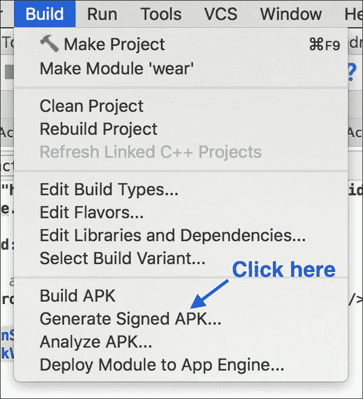

选择一个模块来生成移动或可穿戴的 APK，如图所示：

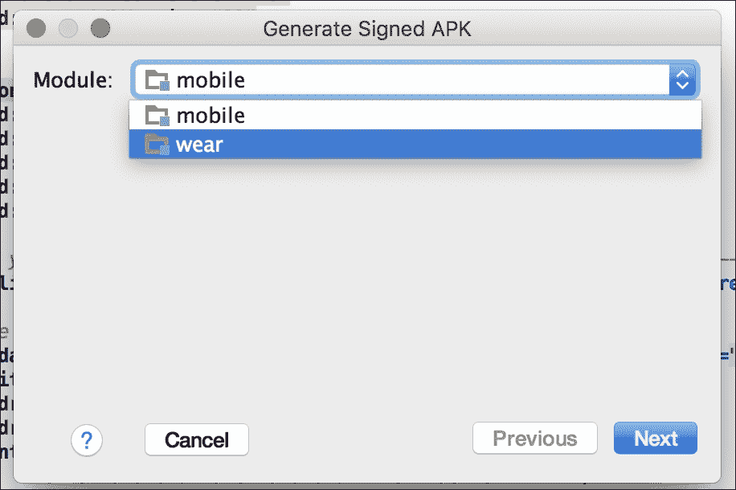

通过创建一个新的或选择你已有的一个来指定你的发布密钥库：

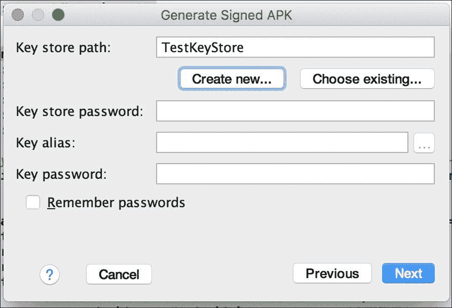

在这里，我们创建一个新的密钥库路径，并使用它对我们的应用进行签名：

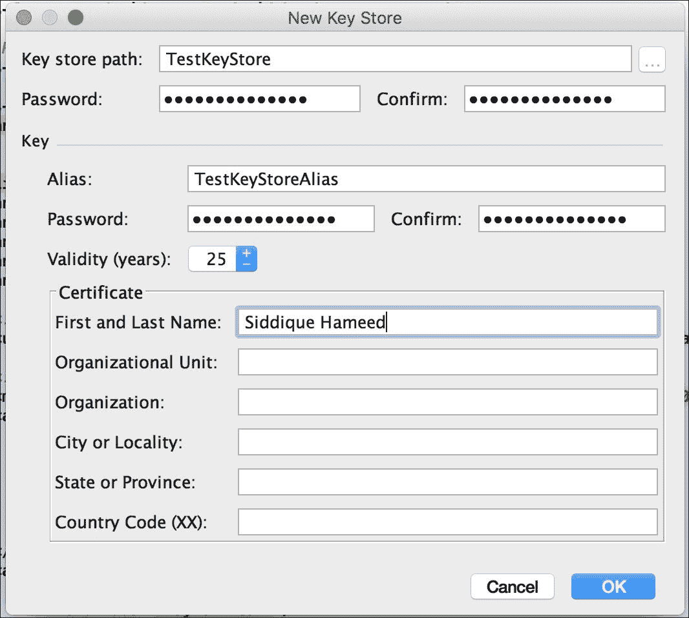

指定 APK 文件的目标文件夹，然后点击**完成**，如图所示：

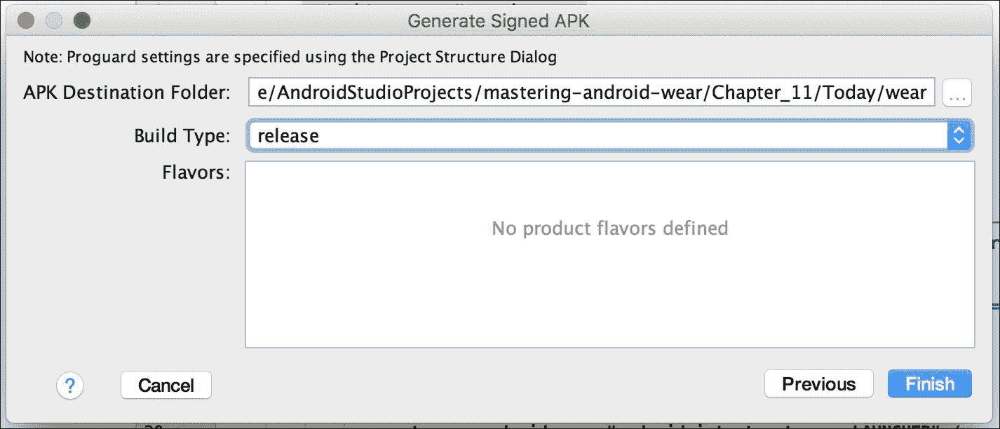

我们现在应该找到我们在指定文件夹中可用的两个 APK 文件：

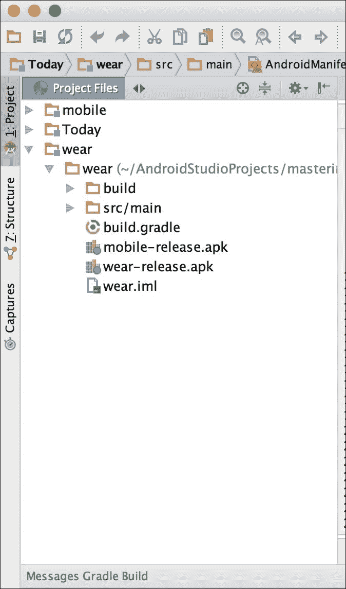

## 发布和同意

一旦我们构建了 APK 文件，通过 Wear app 质量测试并确定其已准备好发布，我们将其上传到**开发者控制台**。这是我们设置分发选项并更新 Wear app 商店列表的截图。详细的发布清单可在在线文档中找到（[`developer.android.com/distribute/tools/launch-checklist.html`](https://developer.android.com/distribute/tools/launch-checklist.html)），建议在发布前阅读。

一旦我们的 app 准备就绪，我们可以在开发者控制台的**定价和分发**部分选择 Android Wear。自愿参与意味着我们的 app 符合 Wear app 质量标准，并且是我们希望通过 Google Play 使我们的 app 对 Android Wear 用户更具可发现性的确认。以下图表展示了该过程：

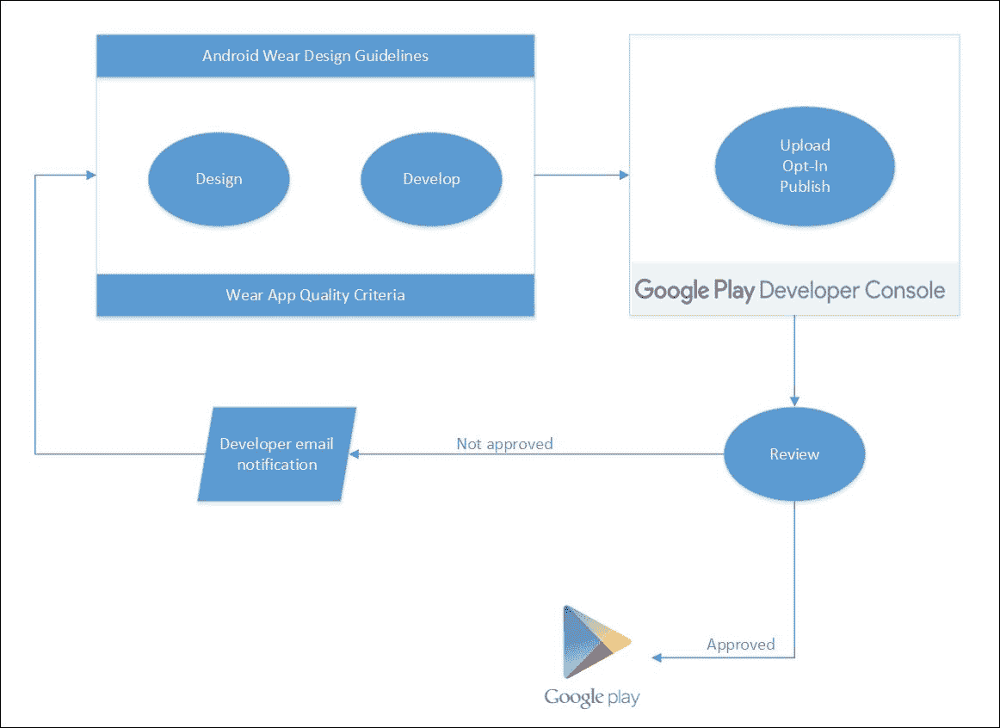

一旦我们自愿参与，我们就可以像往常一样发布我们的 app，此时 Google Play 会根据**Wear App 质量标准**对我们的 app 进行审查。一旦结果可用，我们会收到通知。如果发现 app 符合所有 Wear App 质量标准，Google Play 将采取措施使其对 Android Wear 用户更具可发现性。

然而，如果发现应用存在不足，则会向我们的开发者账户地址发送电子邮件通知，其中突出显示需要我们注意的区域。一旦我们解决了这些问题，我们就可以将新版本的 app 上传到开发者控制台，以启动另一轮的自愿参与和审查。

**Google Play 开发者控制台**中**Android Wear**部分的**定价和分发**页面持有我们 app 在任何给定时间的审查和批准状态。

如下截图所示，我们点击**添加新应用**按钮来上传我们的 app：

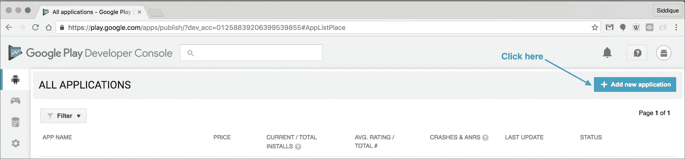

在上传 APK 之前，我们指定一个默认语言和标题：

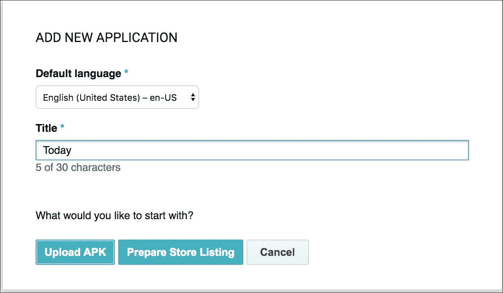

选择发布类型，即**生产**、**Beta**或**Alpha 测试**，然后点击相应的**上传**按钮：

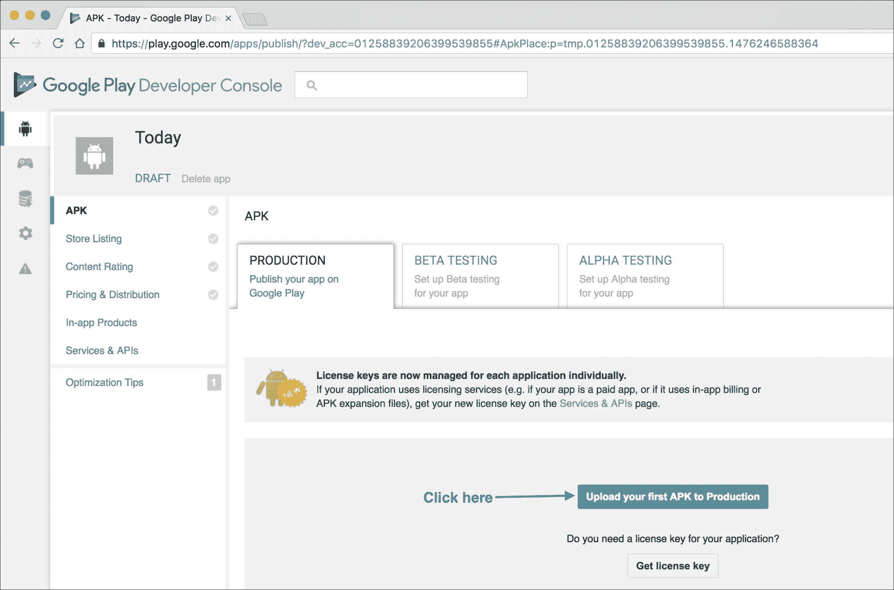

我们随后选择我们的穿戴（或移动）APK 文件并尝试上传，如下截图所示：

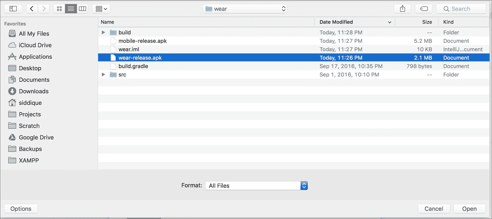

在此阶段，我们会提示填写必要的 app 元数据以进行发布：

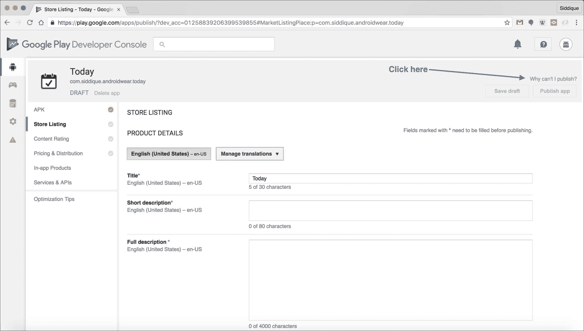

我们可以点击右上角的**为什么我无法发布？**链接以显示任何缺失的项目。以下是需要发布 app 的所有项目的示例。一旦添加，app 应准备好发布：

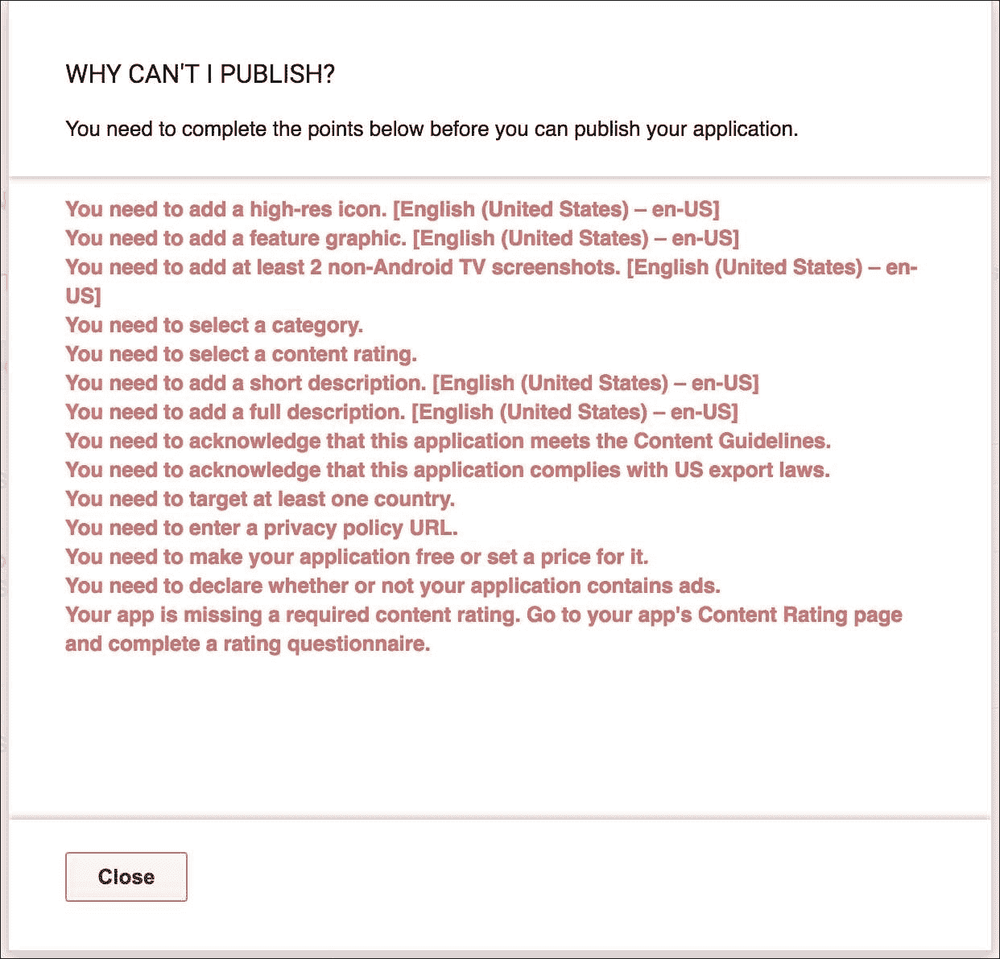

# 摘要

在本章中，我们介绍了 Android 测试，并区分了本地单元测试和仪器化测试。然后，在我们简要了解如何通过 UI 测试实现自动化之前，我们总结了在 Android Studio 中测试我们的可穿戴应用可用的工具。最后，我们讨论了在准备通过 Google Play 分发我们的应用时必须跨越的阶段。
