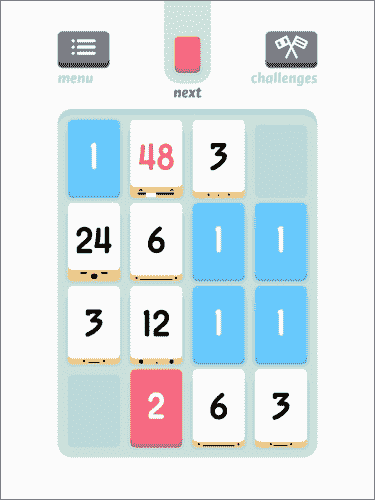

# 第一章。刷新你的 Cocos2d 知识

在本章中，我们将通过刷新高级用户的记忆来让你跟上进度。本章还将涵盖在项目创建之前的项目规划。你将看到为什么早期确定你想要的功能可以帮助加快游戏创建的过程。项目示例、下载参考和设置信息将在这里找到。然后我们将深入研究 Cocos2d 生态系统中的各种第三方库和工具，你可能想要考虑。

在本章中，我们将涵盖以下主题：

+   规划成功游戏

+   你可能还想考虑的其他工具

+   设定灵活、专注的目标

# 准备心态

首先，我们将讨论如何从开始到结束构建你的项目，以及为什么你应该这样做而不是直接跳进去。我们将讨论一些理论，并问你一些问题，帮助你确定在写代码之前你的项目到底需要什么。

在开始规划之前，你需要对你的游戏所需的关键功能提出问题，因为它们将需要额外的支持和开发。例如，是否涉及到物理引擎？你打算实现 Game Center 或 In-App Purchases，或者可能连接到数据库来存储用户信息？机制有多复杂？开始思考这些答案以及类似的问题，因为知道答案将帮助你更快地移动，同时仍然保持高效。

## 物理引擎

虽然这并不是大多数人在刚开始规划项目时会立刻想到的事情，但了解这一点很重要。幸运的是，使用 Cocos2d，代码中已经内置了物理引擎，这很好，因为你不需要额外努力去实现一个。

如果你发现你的项目确实需要物理引擎（或者有了它会显得更加“真实”），你可以参考本书后面的第五章，了解如何实现它，以及示例代码的使用。

如果你不确定是否应该使用物理引擎，这里有一些使用 Box2D（Cocos2d 内置的物理引擎之一）的游戏示例。看看 Rovio 的*Angry Birds*中的物理效果：


在前面的截图中，每只鸟和每头猪都是一个圆形的物理对象，地面是一个矩形，右手边（除了猪）的所有障碍物都是矩形。当鸟从左侧被弹到右侧时，重力开始作用于鸟，并开始将其向下拉。一旦发生碰撞，它推动物体并基于 incoming 和 colliding 物体的速度进行一些复杂的“伤害”计算。

以下截图展示了 KeitGames 开发的*Crescent Ridge Mini Golf*中的物理效果：


在前面的截图中，球是一个圆形的物理对象，每个墙壁都有一组顶点，这些顶点充当球不能通过的边界。这里没有重力作用，否则球会不断落到屏幕底部。如果球在墙上弹跳，物理引擎会确切地知道球将转向的角度以及它将向后移动的速度。能够确定高尔夫球的反射角度是使用物理引擎创建简单迷你高尔夫游戏的主要原因。

如果你仍然不确定，那么对以下任何问题的回答是“是”，意味着你应该考虑使用物理引擎。如果你对以下任何问题的回答是“是”，请参考第三章，*关注物理*，了解如何实现物理引擎。如果你对所有这些问题的回答都是“否”，那么我建议你现在暂时不要使用，因为你的游戏可能不需要引擎，而可以通过编码的方式给人一种物理的感觉，但实际上并不使用物理引擎：

+   你是否需要非圆形或非矩形的物体来碰撞？

+   物体是否需要相互弹跳或推动其他物体？

+   你的游戏是否使用了实时重力？

如果你感兴趣，想在游戏中使用任何液体物理或使用软体，请随意查看 LiquidFun。然而，这本书不会涵盖如何实现或使用该引擎。

## 应用内购买

**应用内购买**（**IAPs**）是设计决策的结果，可能是为了使游戏更便宜，或者包括游戏中的扩展或额外内容。你可以利用 IAPs 的很多方式，但如果你将它们强加到游戏中而不是将其设计为体验的有机部分，可能会让你的玩家要么不使用你花费了大量时间实现的 IAPs，要么完全停止玩游戏。

关于 IAPs 的问题在于，苹果要求你的项目配置文件中添加 IAPs 权限——这是容易的部分。困难的部分是让它们包含在你的代码中。以下是一些各种游戏中应用内购买的例子。以下截图是 Supercell 的*Clash of Clans*中的商店：


在前面的截图中，你可以看到*Clash of Clans*中可用的各种 IAPs。你可以看到它们有一个分层结构，即玩家一次性花更多的钱，每美元可以获得的宝石就越多。以下截图是 KeitGames 的*Bina Blocks*中的银行：


你刚才看到的是*Bina Blocks*中银行的截图。你可以看到与*Clash of Clans*中相似的定价层级。

尽管这本书没有涵盖 IAP 的实现，但它仍然可以是你的游戏的一个重要组成部分。如果你希望继续学习如何实现自己的 IAP，你可以从以下这些来源了解它们：

+   [`www.raywenderlich.com/21081/introduction-to-in-app-purchases-in-ios-6-tutorial`](http://www.raywenderlich.com/21081/introduction-to-in-app-purchases-in-ios-6-tutorial)

+   [`www.playngive.com/blog/2010/3/6/adding-in-app-store-to-cocos2d.html`](http://www.playngive.com/blog/2010/3/6/adding-in-app-store-to-cocos2d.html)

+   [`troybrant.net/blog/2010/01/in-app-purchases-a-full-walkthrough/`](http://troybrant.net/blog/2010/01/in-app-purchases-a-full-walkthrough/)

## 利用数据分析

分析工具包是任何开发者都可以利用的伟大工具。如果你想了解用户在哪个关卡上遇到的最大困难，你可以跟踪每个关卡被击败的次数，以查看掉落发生的地方。或者，你可能想跟踪人们如何使用你刚刚添加的新角色。在第七章“到达我们的目的地”中，你将学习如何实现 Flurry Analytics，它使用一个简单的事件驱动系统来跟踪某些方法何时被调用。基本上，你可以跟踪从按钮点击和屏幕加载到用户在问题上的花费时间。所有这些数据都发送到 Flurry 的服务器，并编译成易于阅读的图表和图形。

虽然你的用户不会注意到任何区别，但长远来看，这肯定会让你的游戏变得更好，因为你可以看到玩家与你的游戏互动时发生了什么。因此，随着时间的推移，你可以提交更好的更新。

## 复杂机制和特效

术语“复杂机制”有时可能有些模糊或过于笼统。然而，它可能从游戏场景之间非常平滑的过渡到玩家游戏方式的独特控制系统。如果你觉得你的游戏需要这些复杂机制来获得成功，那么请确保你做得正确。如果你只是计划添加额外的功能，因为你觉得你必须这样做，而不是因为它能让你游戏变得更好，那么提前考虑这一点可以帮助你以某种方式构建项目计划，以便在开发后期添加额外的（或奖励）功能。这样做比试图在中途添加东西并延迟必要功能要好，如果你不能立即找到正确编码它们的方法。

有些游戏因其独特的游戏机制而非常特别，结合使用触摸屏（我们将在第四章“声音和音乐”中详细讨论），例如，如果你看看《Smash Hit》、《Blek》、《Tiny Wings》或《Threes!》，你会发现它们并不完全符合任何传统类型。

注意，如果你相对较新手游戏设计（尤其是移动设计），尝试完全新颖或独特的东西可能并不完全符合你的最佳利益。相反，至少尝试复制已经存在的机制，并可能对其进行轻微调整，以更好地适应你试图制作的游戏。以下截图是 *Smash Hit*：


下一个截图是 *Blek*：


以下截图展示了 *Tiny Wings*：


这个截图是 *Threes!*：



这些游戏依靠其复杂的力学和特效而繁荣。它们规划得非常周密，设计得也很恰当。如果你只想要特效（例如，粒子爆炸或 *Threes!* 卡牌上的面部表情），那么你应该查看第七章，*达到我们的目的地*，这是你应该查找的地方。那一章详细介绍了如何润色你的游戏并提高其受欢迎程度。但就目前而言，只需知道，如果你计划将独特、创新或前所未有的东西作为你设计的一个组成部分，你应该相应地计划。

如果你只是因为觉得有它会很酷而添加机制，而这些机制对游戏进程并不必要，那么你应该在最后计划。没有什么比因为一个一开始就并不重要的功能而推迟游戏发布日期更糟糕的了。

# 选择工具和开始

在开始工作之前就知道你的项目需要哪些工具是一个好的开始。这样，当需要实现某个特定功能的时候，你可以轻松打开程序并使用你事先获取的工具。在项目中途获取工具也不是太糟糕，但根据经验，最好在开始工作之前就考虑好。

有一些第三方程序可以使使用 Cocos2d 开发游戏的速度大大加快。以下列出了这样的产品，有关如何下载和安装它们的信息，以及它们的成本（如果有）以及其他你需要了解的事情。

### 小贴士

注意，这里列出的产品并不意味着在用 Cocos2d 创建游戏时是必需的。本节仅作为“以防你有所疑问”的指南，用于在尝试开发更好、更精致的游戏时考虑的事项。

本节还假设您要么有专门的人为您的游戏制作艺术作品，要么您将在任何图像编辑软件中自行完成，例如 Photoshop。这是假设的，因为这里没有列出图像编辑器，因为编辑器的数量很大。在制作游戏时，任何一种都可以使用。然而，这里列出的程序在它们所追求的方面都是最好的，尽管可能还有其他类似的程序。

+   **纹理打包器（Texture Packer**）: 这是一个图像压缩工具，用于将所有图像放置在一个精灵图上。这有助于优化绘图（提高游戏每秒帧数）以及减少游戏整体大小的空间（这可能是用户是否需要通过 Wi-Fi 下载的区别）。

+   **粒子设计师（Particle Designer**）: 这是一个可视化粒子编辑器，允许快速创建粒子效果，从激光和烟雾效果到爆炸和蜡烛效果。

+   **符号设计师（Glyph Designer**）: 这是一个自定义字体创建器，允许您创建看起来漂亮的字体，而不是使用带有文本的预渲染图像或仅具有填充颜色的普通字体。

+   **顶点助手专业版（VertexHelper Pro**）: 这是一个用于与物理引擎一起使用的可视化顶点计算器。它可以用于其他目的，但主要用于与物理引擎一起使用，以确定碰撞的确切坐标，而不是使用标准的长方体或圆形来计算对象的碰撞边界。

+   **GAF**: 这是一种将 Flash 动画存储在开放跨平台格式中的方法，以便在多种游戏开发框架和设备中进一步播放。GAF 使艺术家和动画师能够使用 Flash CS 创建复杂的动画，并能够无缝地与各种游戏开发框架（如 Cocos2d、Cocos2d-x、Unity3D 和 Starling 等）一起使用。

+   **Git 和 GitHub/Bitbucket**: 在项目开发中，有许多使用源控制的方法。目前最好的解决方案，以及许多开发者使用的解决方案，是 Git。您可以管理代码随时间的变化，如果出现错误，您总是可以回滚到代码的最新版本，而无需在试图找出更改了什么时浪费宝贵的发展时间。这也是在计算机故障时备份项目的好方法。

## TexturePacker

TexturePacker 允许您轻松地为游戏创建精灵图。它将单个图像压缩成一个大图像，这样您可以在不牺牲质量的情况下有效地提高游戏的优化。

最终的图集可以在各种游戏引擎中使用，如 Cocos2d、Unity、Corona SDK、SpriteKit 等。以下截图显示了 TexturePacker 的用户界面：


专业版的价格为 39.95 美元（提供免费试用）。

要下载 TexturePacker，请访问[`www.codeandweb.com/texturepacker/download`](http://www.codeandweb.com/texturepacker/download)。在那里，您可以点击您正在使用的操作系统名称，然后您就可以开始了！

TexturePacker 支持 Mac 10.7/8/9、Linux（Ubuntu 64 位）、以及 Windows 32 位和 64 位（XP/Vista/7/8）。

## Particle Designer

如果您想要实时生成的美丽爆炸、令人惊叹的烟雾效果或闪亮的激光束，那么 Particle Designer 就是您需要的。导入您自己的自定义“粒子”，调整大量参数以获得您想要的效果，然后将文件导出到您的游戏项目中。以下截图显示了 Particle Designer 的用户界面：


价格为 74.99 美元（提供免费试用）。

要下载 Particle Designer，请访问[`71squared.com/particledesigner`](https://71squared.com/particledesigner)。在那里，您将看到一个购买链接。然而，您可以通过点击他们网站上的**试用**按钮并输入您的电子邮件地址来获取试用版。

Particle Designer 支持 Mac 10.8、9 和 10。

从技术上讲，您可以在代码中手动创建每个粒子，但这非常低效。此外，在您设计粒子时能够实时看到粒子可以使整个过程更加顺畅，因为将粒子效果导入 Cocos2d 非常简单。

如果您拥有 Particle Designer 但之前从未使用过，建议您只需打开它，并开始尝试调整一些设置。只需拖动一些滑块，您就可以获得一些非常酷的效果。

## Glyph Designer

如果您想要花哨的字体而不是可用的正常 TrueType 字体，或者例如在 Photoshop 中预渲染的文本图像，您可以使用 Glyph Designer。它基本上允许您获得一个样式优美的字符集，可以与 BMFont 标签（位图字体）一起使用。这实际上意味着您可以在保持使用 Glyph Designer 创建的彩色、样式化字体的情况下生成自定义文本标签。


其价格为 39.99 美元（提供免费试用）。

要下载 Glyph Designer，请访问[`71squared.com/en/glyphdesigner`](https://71squared.com/en/glyphdesigner)。在那里，您将看到一个购买链接。然而，您可以通过点击他们网站上的**试用**按钮并输入您的电子邮件地址来获取试用版。

Glyph Designer 支持 Mac 10.8、9 和 10。

如果您想要像您之前看到的某些游戏（如*Clash of Clans*、*Angry Birds*、*Crescent Ridge Mini Golf*和*Bina Blocks*）中使用的字体，而不是其他游戏中显示的纯色字体，您需要一个好的位图字体创建工具。就像粒子一样，如果您想要漂亮的字体，市面上只有少数几个程序。其中之一就是由创建 Particle Designer 的同一群人制作的 Glyph Designer。

如果你已经安装了 Glyph Designer 但还没有开始使用它，请打开它，并在各种字体上测试一些不同的样式，以了解程序的工作方式以及你可以使用 Glyph Designer 创建的一些东西。

在设计你的美学（尤其是在选择自定义字体时）时，需要考虑的是，这种字体/风格是否适合整个项目的整体美学？如果它感觉不协调，或者感觉像两种不同的风格冲突，那么选择一个更适合你游戏的字体可能对你更有利。不用担心；它可能不会立刻出现在你的脑海中，但如果你找到了合适的字体，它将为你的游戏增添额外的磨光层，这对于使你的游戏成功至关重要（我们将在第六章[part0049.xhtml "第六章. 整理和磨光"]中更多关于磨光的内容）。

## VertexHelper

你在游戏中使用物理（或碰撞）吗？你需要一个比盒子或圆形更好的形状来表示复杂物体吗？VertexHelper 可以通过导入图片并允许你点击想要顶点所在的位置来帮助你找到组成复杂物体形状的坐标。如果你真的想的话，你可以手动猜测并程序化地测试坐标，但 VertexHelper 使这个过程变得更快，并保持坐标的准确性（假设代码中物理实现得正确）。

如果你打算使用物理（或碰撞），你应该知道顶点碰撞可能非常昂贵。如果可能的话，最好坚持使用原语（例如，圆形或正方形），如果那样的话，你可能甚至不需要物理引擎。因此，仔细考虑你的选项。


它的价格是 $7.99。

下载请访问 [`itunes.apple.com/us/app/vertexhelper-pro/id411684411`](https://itunes.apple.com/us/app/vertexhelper-pro/id411684411)，或搜索 `VertexHelper Pro`，你应该能在搜索结果的第一页找到前往 Mac App Store 的链接。

就像任何其他 Mac 应用程序一样，一旦完全安装，你就可以运行它。

为任何物理对象生成边界有两种方法：

+   使用 `b2Vec2` 数组手动编写值，并希望它是正确的。

+   使用 VertexHelper 等程序快速为每个对象创建边界。

在你的游戏中使用物理引擎时了解这个程序并准备好它是有好处的，因为几乎每个物体都需要与另一个物体发生碰撞（除了少数背景图像）。话虽如此，每个物体可能不是正方形或圆形，因此能够快速创建自定义形状的物理边界是很好的。

如果你已经在你的电脑上安装了 VertexHelper，请继续；打开它并导入一张图片。然后开始点击操作，感受一下程序的工作方式。这在你开始实现每个物体的物理特性时会有很大帮助。

## GAF

如果你想要将任何 Flash 动画转换为用于 Cocos2d 游戏的格式，你可以使用 GAF，它本质上是一种单一格式，可以转换为各个框架和设备的要求。


其费用如下：免费版为 $0；工作室版为 $995；企业版为 $2,995。免费使用每年限制为 $50,000，并且只能开发你自己的游戏，不能进行合同工作。你可以在[`gafmedia.com/pricing`](http://gafmedia.com/pricing)了解更多关于他们的定价选项。

要下载 GAF，请访问[`gafmedia.com/downloads`](http://gafmedia.com/downloads)，选择操作系统。然后按照说明进行安装。

GAF 可在 Windows 和 OSX 上使用。

如果你有一个熟悉 SWF 文件动画的艺术开发者，并且可以将它们转换为适用于多个游戏引擎的平台无关格式，GAF 会很有帮助。如果你正在移植已经使用 SWF 文件的游戏（例如你希望在移动设备上实现的在线 Flash 游戏），它也会很有帮助。

## Git 和 GitHub/Bitbucket

如果你曾经处理过代码，那么很可能会出现一些问题。幸运的是，存在源代码管理软件来管理你的代码版本，并确保在出现问题时，你可以回滚到之前的版本。

这是一张 Cocos2d-Swift GitHub 仓库（简称 repo）的截图[`github.com/cocos2d/cocos2d-swift`](https://github.com/cocos2d/cocos2d-swift)：


这是免费的。

如果你已经在你的 Mac 上安装了 Xcode，要下载这个，只需转到 **Xcode** | **Preferences** | **Downloads**。然后安装命令行工具。有了这个，你可以使用 Xcode 内置的 **Source Control** 菜单，或者通过终端使用你的 Git 命令。

如果你希望手动安装 Git，只需访问他们的网站，按照链接下载和安装，详情请见[`git-scm.com/`](http://git-scm.com/)。

注意，如果你以前从未使用过任何源代码管理，你可以自由地阅读它是如何工作的[`help.github.com/`](https://help.github.com/)。

实际上，你只需要在 Mac 上安装 Git，因为代码就在那里。然而，你可以在任何桌面操作系统上安装它。

GitHub 和 Bitbucket 都是免费的。然而，关键的区别在于 GitHub 提供无限量的公共仓库，而 Bitbucket 提供无限量的私有仓库。所以如果你想隐藏你的代码不让别人看到，同时仍然使用列出的服务，建议选择 Bitbucket。

这两项服务都使用 Git，并使用相同的命令和工具。这只是一个选择，即你想要使用公共仓库还是私有仓库（或者你合作的人有偏好的情况）。

# 设定灵活、专注的目标

当你最初想制作游戏时，你可能认为这是有史以来最好的游戏想法。诚然，可能真的是这样；不要让我说的话阻碍了你。然而，随着时间的推移，你对这个游戏的看法可能会改变，你的方向可能会在项目生命周期的整个过程中有所改变或很大。最好是提出一个既专注又有点灵活的目标，这样可以在保持方向的同时留出改进的空间。

## 扩展

如果你正苦于想出一个原创的想法，我建议你拿一块白板（越大越好；相信我），在电脑上打开图像编辑软件，或者甚至拿出一些笔和纸，开始写下你想要制作的游戏内容。选择与游戏类型相关的主题，或者与主要机制相关的同义词，并开始制作一个想法图（类似于蜘蛛网），这些想法可以在你游戏创建的初始阶段使用。

然而，仅仅产生最初的想法本身可能就很有挑战性；例如，何时一个项目真正准备好开始编码或艺术创作过程呢？是在第一次实现力学之后吗？还是当 27 个级别都被系统地从开始到结束规划好之后？重要的是要意识到那一刻，当你停止扩展和改进游戏时，随着你产生更多想法，游戏也在变得更好，而你只是因为可以而提出想法。

## 专注

一旦你对想要制作的类型有了良好的想法，就需要将这个最终目标集中起来，以便在以后保持灵活性。坦白说，制作游戏就是关于流程和随着时间的推移产生想法。所以，如果你正在制作游戏，并且认为添加另一种敌人类型或几个支线任务可能会使游戏更有趣，那么请不要犹豫，去做吧。

话虽如此，你不能从一个想法跳到另一个想法，否则你的游戏在玩家体验过程中会缺乏方向感。他们可能会觉得剧情从未解决最初提出的冲突。

此外，如果你的游戏缺乏一个明确的目标，并且随着时间的推移不断变化，那么开发时间将会更长。所以，从经验的角度来看，如果你想创造两个不同的游戏想法，第二个想法是在第一个游戏开发过程中的一半时产生的，那么你可以在第一个游戏发布后将其作为更新或扩展添加进去，或者将其变成一个独立的项目，但不要让开发时间比原本更长。

那么，在专注的目标中，你应该有哪些东西呢？如果你的游戏有叙事或以某种方式是情节驱动的，尽量确保这一点在整个开发过程中保持不变。或者，如果你的游戏依赖于某个机制的单个特性，你希望在游戏中途添加另一个特性，确保新添加的特性不会影响最初构思游戏时考虑到的初始用户体验。然而，如果你想要添加的功能对游戏最初的部分并不是非常重要，那么现在不必担心，只需在更新中包含它即可。相信我；除非添加新功能需要几分钟时间，否则它可能不值得你花费时间在那些对游戏按最初设计意图工作并不非常必要的事情上。或者，如果游戏的艺术风格并不非常吸引人或者可以用另一种方式表示，考虑一下艺术对你游戏的重要性。如果它是低质量的艺术，例如像 MS Paint 那样，那么考虑获取一些高质量的艺术。然而，如果它已经非常完善，那么在发布后不必麻烦去改变它。

## 弹性

我在上一节中提到过：在游戏机制、叙事、艺术风格等方面，不要犹豫，要有点宽容。随着游戏的进展，你几乎不可避免地会想，“哦，天哪，如果我们只是在游戏结束时添加一个额外的 Boss，那岂不是世界上最好的游戏？”也许吧。这就是你需要灵活的地方。

但请记住，要尽量保持我们在上一节中提到的那个专注目标。这关乎在每一步都保持激光般的专注目标和自由流动的创造力之间的平衡。

# 下载 IDE 和源代码

如果你的电脑上还没有安装 Xcode 和 Cocos2d 库，现在可能是一个安装的好时机。本节将指导你完成这个过程。

## 步骤 1 – 通过苹果的 iOS 计划成为开发者

现在，这本书并不完全需要支付每年 99 美元的费用来成为官方苹果 iOS 开发者。但如果你希望在设备上测试应用程序和游戏或发布应用程序到 App Store，这是必需的。

如果你现在想跳过这一步，请随意。当你准备好时，可以回到这里。

首先，前往[`developer.apple.com/programs/start/standard/`](https://developer.apple.com/programs/start/standard/)开始你的 iOS 应用开发者计划的注册流程。如果你已经有了苹果账户，你可以使用它。否则，创建一个账户。

接下来，选择**个人**或**公司**。苹果在其网站上提供了很好的描述，所以我觉得如果你需要帮助确定选择哪一个，他们的网站可以帮助你做出决定。


按照步骤输入一些联系信息，然后选择**iOS 开发者计划**，并点击**继续**。

同意许可协议，输入您的购买信息，然后您就可以开始了！

## 第 2 步 – 下载并安装 Xcode

前往[`developer.apple.com/xcode/downloads/`](https://developer.apple.com/xcode/downloads/)并点击下载 Xcode 的链接。在撰写本书时，它说**在 Mac App Store 中查看**，本书中引用的 Xcode 版本是 Xcode 6。它需要 OS X 10.9.3。

就像 Mac App Store 中的普通应用程序一样，它应该安装到您的`Applications`文件夹中，并且您应该在安装后能够运行它。

### 添加设备

注意，如果您想在设备上运行您的应用程序，需要一个开发者账户（这在*步骤 1 – 通过 Apple 的 iOS 程序成为开发者*部分中提到过）。如果您已经设置好了，您应该能够通过在 Xcode 中转到**窗口** | **组织者**，然后点击**设备**来将您的设备添加到您的开发者账户中。

在下面，您应该能看到您的设备名称，以及主视图中一个写着**用于开发**的按钮。

如果它没有显示，而是显示类似**“Brian 的 iPhone”上的 iOS 版本不支持此安装...**的消息，这意味着您必须安装 Xcode 的最新版本以获取最新版本的 SDK，以便您的设备能够得到适当的支持。

## 第 3 步 – 通过 SpriteBuilder 下载 Cocos2d

前往[`www.cocos2d-swift.org/download`](http://www.cocos2d-swift.org/download)并点击最新发布下的下载链接，标记为 SpriteBuilder（这应该会打开 Mac App Store）。在撰写本书时，最新版本是**Cocos2D 3.2.1**，所以除非另有说明（例如，版本 2.1），本书中的所有内容都将遵循该版本。

截至 3.2 版本，Cocos2d 只能通过 SpriteBuilder 进行安装。对于那些不熟悉 SpriteBuilder 的人来说，让我告诉您，它用于通过拖放界面创建项目。您不需要完全通过 SpriteBuilder 创建您的游戏。然而，截至 Cocos2D 3.2.1 版本，项目创建只能通过 SpriteBuilder 进行。

就像任何 Mac 应用程序一样，它将被下载到您的`Applications`文件夹中，并在完全安装后运行。

## 通过 SpriteBuilder 创建新项目

一旦安装了 Xcode 和 SpriteBuilder，我们就可以设置一个初始项目，以便看到所有操作。Cocos2d 足够好，在项目创建时给我们一些初始临时文件，这样我们可以有一个更好的开始。它很棒，因为一旦我们需要，我们基本上可以用自己的文件替换它们。

打开**SpriteBuilder**。它可能会要求您加入他们的邮件列表，但在这本书中，无论您是否注册都没有关系。

之后，它可能看起来像已经启动了一个新项目（这可能是真的，但让我们确保我们从零开始）。转到**文件** | **新建** | **项目**，并选择一个您会记住的文件夹位置（例如，`桌面`或`文档`）。然后，它应该打开一个带有蓝色背景和 SpriteBuilder 文本的预览，如下面的截图所示：


如果您没有看到这条确切的消息，请不要感到惊讶。这仅仅是本书编写时 SpriteBuilder 1.2.1 版本中发生的情况。

恭喜！您的项目现在已经设置好了。

如果您想使用 SpriteBuilder 视觉编辑器为 Cocos2d 创建项目，您现在可以这样做。然而，本书不包括如何使用该程序的教程，所以如果您想了解这个程序的工作原理以及视觉编辑器的全部潜力，请查看[`www.makegameswith.us/tutorials/getting-started-with-spritebuilder/`](https://www.makegameswith.us/tutorials/getting-started-with-spritebuilder/)。他们有一套很好的 SpriteBuilder 教程。

如果您想开始编写代码而不是拖放，请按照下一节的步骤操作。

## 将 SpriteBuilder 项目导出至 Xcode

在 SpriteBuilder 中，转到**文件** | **发布**。这将显示一个进度条，如果您的项目是全新的，它将非常快地完成。

默认情况下，当按下**发布**按钮时生成的 Xcode 文件将保存在您首次创建项目时选择的与项目位置相同的文件夹中。记得我告诉您要保存到一个您会记住的地方吗？回到那个位置，无论是在**查找器**中还是在**Xcode** | **打开查看器**中。

找到与您的项目同名文件。它看起来可能像这样：

```swift
ProjectName.xcodeproj
```

如果您没有看到`.xcodeproj`文件扩展名，请不要担心。它应该被标记为 Xcode 项目，并在旁边有一个蓝图图标。

点击它打开。它应该会打开 Xcode。

您可以自由地选择在您选择的模拟器中运行应用程序，或者连接设备并尝试一下。到目前为止看起来不错！如果您想在设备上运行应用程序，请转到本章标题为*添加设备*的部分。

# 摘要

我们探讨了如何根据您希望在游戏中包含的具体元素来规划您的游戏，如何在创建游戏的过程中选择所需的工具，以及在实际创建想法并在项目整个生命周期中前进时的一些最佳实践。

最后，我们介绍了如何下载和安装 Xcode，下载和安装 SpriteBuilder，以及下载各种使您生活更轻松的第三方应用程序。

下一章将深入探讨原型对于优秀游戏设计的重要性，为什么快速迭代原型以更快地失败是关键，以及为什么创建一个人们可以实际玩的游戏最小可行产品（即使它比您见过的任何东西都更易出 bug）对于您游戏长期成功非常关键。
