# 第二章. 使用原型快速失败

本章全部关于让项目的线框开始运行，这样你就可以在稍后填充游戏的“内容”。你将获得基线图形、菜单和游戏的流程结构，以便快速测试。测试越早，失败越快——这是你作为游戏开发者的新座右铭。尽管编写代码可能看起来非常简单，但我们的意图是尽快创建最小可行产品——一个有形且可工作的产品，以便对整个项目有一个感觉。在本章中，我们将涵盖以下内容：

+   为什么使用原型？

+   让场景运行起来

+   创建文本（标签）

+   开始使用 TexturePacker 中的精灵表

+   创建按钮

+   创建菜单、场景和场景转换

+   创建节点和单位（精灵）

在本书中，从头到尾创建一个完整游戏，从本章开始。创建一个持续的项目有两个目的，如下：

+   展示每个部分如何适合整个项目，而不仅仅是作为单独的代码片段

+   从头到尾可视化整个项目的流程，不跳过任何步骤

在本书附带文件中，你可以找到完成的项目，看看它将看起来和感觉如何。此外，在每一章的开头，都会有一个关于到那时为止书中项目版本的参考，这样你就可以跟随书中的完整解释/示例。 

### 小贴士

到目前为止，项目是通过遵循第一章中的教程创建为一个全新项目的，即*刷新我们的 Cocos2d 知识*。如果你更愿意使用默认的起点，你可以使用本书附带文件中的空白`Project`文件夹中的项目。

你也可以从[`github.com/keitzer/MasteringCocos2d`](https://github.com/keitzer/MasteringCocos2d)下载代码。

# 文件后缀与目录

当 Cocos2d 和 SpriteBuilder 在 Cocos2d 3.0 中集成时，它们改变了 Cocos2d 读取纹理的方式。在之前的版本中，如果你想为 iPhone 和 iPad 制作游戏，你必须给你的文件添加各种后缀。例如，如果你的图像命名为`btnPlay.png`，你必须在你项目中创建不同尺寸的文件，其命名如下：

+   `btnPlay.png`

+   `btnPlay-hd.png`

+   `btnPlay-ipad.png`

+   `btnPlay-ipadhd.png`

将文件保存的方法通常被称为使用**文件后缀**。

在带有 SpriteBuilder 的 Cocos2d 新版本中，你可以通过将最大尺寸的文件（例如，Retina iPad）拖入 SpriteBuilder 来管理你的纹理。当你点击**发布**时，SpriteBuilder 会为你处理文件大小的变化。这种处理文件的方式被称为使用**目录**。

### 注意

这里有一个警告：如果你决定手动将文件添加到`Published-iOS`文件夹中，请不要在 SpriteBuilder 中点击**Clean Cache**，否则你将丢失所有这些文件。

然而，使用目录有其缺点。例如，你可能想使用 TexturePacker（我们将在本章后面以及整本书中用到它），但是没有简单的方法来使用它和新的文件保存目录风格。技术上你可以做到，但这样做太麻烦了，以至于 TexturePacker 的任何优势都被你额外要做的工作所抵消。因此，TexturePacker 可以与文件读取的目录风格一起工作。所以，如果你打算使用目录风格，直接将文件拖入 SpriteBuilder 会更容易。

那么，如果我们想利用 TexturePacker，我们将如何解决这个问题？嗯，直到存在一个集成 TexturePacker 使用的 Cocos2d 和 SpriteBuilder 版本，我们不得不回到文件后缀方法。

### 小贴士

注意，如果你不想购买 TexturePacker，不用担心；它不是必需的。后面的代码将保持不变，因为 Cocos2d 搜索图像，无论它是通过精灵图集还是作为单个文件加载的。如果你不想使用 TexturePacker，请随意避免更改你的搜索模式（如后文所述），并继续使用目录方法。每当这本书提到将文件添加到精灵图集时，那就是你将其添加到 SpriteBuilder 的信号。

由于 Cocos2d 3.0 及以上版本默认使用目录方法，并且我们将切换到使用文件扩展名，我们必须查找**CCFileUtilsSearchModeDirectory**的 Xcode 项目。其中一个结果应该是一个名为`CCBReader.m`的文件。点击结果，它应该带你到大约第 109 行，在那里你会看到以下代码行：

```swift
sharedFileUtils.searchMode = CCFileUtilsSearchModeDirectory;
```

你将要更改这一行以使用后缀搜索模式：

```swift
sharedFileUtils.searchMode = CCFileUtilsSearchModeSuffix;//CCFileUtilsSearchModeDirectory;
```

在此基础上，我们准备开始项目的原型阶段。但首先，为什么制作原型很重要？为什么快速制作原型很重要？为什么不慢慢编写代码，最终在适当的时候实现游戏的核心机制呢？

# 为什么需要原型？

除了在游戏完全完成之前询问朋友“好玩吗？！”的明显原因之外，在开发初期快速进行游戏原型，尤其是对于几个不同的原因非常有用：

+   你可以从最终用户的视角来询问你游戏的原创性/创新性，而不仅仅是你的个人观点

+   你可以在游戏还来得及做出改变之前，就生成如何改进游戏的点子

+   你可以感受到游戏从一阶段到下一阶段是如何实际流转的，并构想出一个具体的产品，而不仅仅是想法

+   如果向公众展示，这可能是开始游戏营销和开始成功在 iOS 上取得成功所需曝光的雪球效应的绝佳方式。

此外，这是开始一个项目，尤其是包含可能难以完全编码并按预期工作的新概念或想法的项目，最好的方式。你可能听说过“概念验证”这个术语；这一章正是这个意思。这是对你整个游戏的一个非常快速的概述，你可以向其他人展示并询问：“这是我能够将这个概念制作成完整游戏的一个证明。你有什么看法？”

现在你已经理解为什么为你的游戏制作原型是一个好主意，让我们快速了解一下这本书将要介绍的项目。

## 游戏测试和反馈分析

当你的原型准备好供其他人体验时，最好是走出去，实际上找一些人来玩你的游戏。理想情况下，你应该找到对该游戏类型以及你的游戏目标受众年龄范围都有所了解的游戏测试者，这样他们才能提供高质量的反馈。

你收到的反馈将各不相同，从“哇！这太棒了！”到“我不懂怎么玩这个游戏。”你必须准备好听到各种各样的回应。此外，即使有人说你的游戏不好，也不一定意味着它真的不好。然而，如果他们说的是客观真实的，并且实施他们的建议将改善玩家的体验，那么你应该听取他们的意见，因为这不仅会使你的当前游戏变得更好，也会使未来的游戏变得更好。

总之，让我们开始制作一个其他人可以玩的项目。

## 书籍的项目

为了了解这本书将要介绍的项目，想象一个 9 x 9 的网格，你的“基地”位于中心，敌人围绕着边缘的方块生成。这是一个回合制游戏。在每一回合，每个单位移动一个方块。每个单位在每个回合的数字增加 1。如果你的单位与敌人的单位相撞，两个数字相减，结果为正的单位存活。你的目标是保护你的主要基地免受敌人单位的攻击，尽可能多地在主要基地上存活回合。

以下是完成的游戏（到第七章，*抵达目的地*）的一些截图：

当游戏首次启动时，它将看起来像以下截图所示：

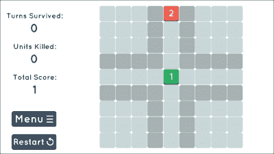

游戏进行到一半时的样子如下：


当中央广场被占领时，游戏结束屏幕将看起来像以下截图所示：

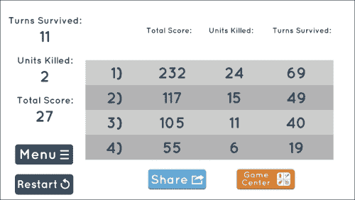

## 快速原型

不论是 Photoshop、Illustrator、MS Paint、一张纸和一支铅笔、白板、蜡笔，还是任何其他创造性方式来绘制你的想法，最好是将项目的视觉形象化，这样当你开始编码时，至少有一个基础来解释你选择这些颜色和文本位置的原因。

此外，尽管我们有了我们刚才看到的最终产品的截图，但我们仍需要想象从哪里开始。例如，在下面的截图中，你会看到一个为本书项目快速制作的草图，如之前所述。尺寸为 2048 x 1536（iPad 横屏）。这是为了展示游戏作为一个概念，而不是作为用于营销目的的成品。不用担心；如果你的艺术技能不足，你的作品不必像这样好。

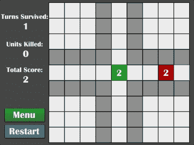

这是一个很好的起点示例，因为它没有任何菜单或花哨的过渡；只有游戏。我知道有一个写着 **菜单** 的按钮，但那是为了稍后使用，当我们真正实现菜单时。记住，原型应该是快速的。图形、颜色、字体，甚至是菜单位置或文字选择的变化都不重要。重点是尽可能快地完成。*尽早测试，快速失败*。

## Cocos2d 引擎工作概述

在我们深入代码之前，让我们快速了解一下 Cocos2d 引擎的工作原理。如果你是第一次使用 Cocos2d，这将很有帮助。如果你之前使用过 Cocos2d，请随意阅读，因为这可能对你来说是一个复习。

Cocos2d 实质上是一系列父节点和子节点的集合。基础父节点是当前正在运行的场景。在任何给定时间，你只能显示一个场景。在场景内部，将会有子节点，所有这些子节点都必须是 `CCNode` 类型。一个 `CCNode` 对象是一个具有位置、旋转、缩放、颜色和其他各种属性的实体。一个 `CCNode` 对象可以添加其他 `CCNode` 对象到它上面。

每个 `CCNode` 的子类都继承自它，并在 `CCNode` 类之上添加功能。例如，如果我们想在屏幕上绘制图像，我们会使用 `CCSprite`，它本质上是一个带有图像附加的 `CCNode` 对象。甚至场景（类型为 `CCScene`）也是 `CCNode` 的子类（这就是每个场景可以拥有子节点的原因）。

这里有一张图片，用来描述 Cocos2d 中父节点和子节点之间的关系。首先，我们有我们想在屏幕上显示的单独的图像，在一个非常简单的纹理图集中。

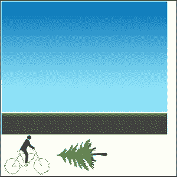

接下来，我们有一个 `CCScene` 的示例图。场景中添加了五个 `CCSprite` 对象：天空、两棵树、道路和玩家。

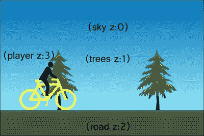

天空位于 z-index 等于 0 的位置，树木位于 z-index 等于 1（这意味着它们将显示在天空前面），道路位于 z-index 等于 2（这意味着它将显示在天空和树木前面），玩家位于 z-index 等于 3（这意味着它将显示在所有内容前面）。默认的 z-index 是 0。

Cocos2d 中的其他一切都很简单——只是一个带有其他`CCNode`对象作为子对象的`CCNode`对象。

关于 Cocos2d 使用的父子关系，有一件事需要记住：例如，如果你移动一个父节点 20 个单位，那么子节点也会以相同的量移动。

现在我们简要地介绍了 Cocos2d 的工作原理，让我们开始制作我们的原型。

# 启动场景并运行

在我们开始向屏幕添加任何内容之前，我们需要确保我们有一个可以在我们的设备或模拟器上查看的游戏。一旦你在 SpriteBuilder 中创建了项目（或获取了前面列出的空白项目）并在 Xcode 中打开了项目，就进行下一步。

## 创建打开场景的初始代码

你应该看到一个名为`MainScene.h`的文件和另一个名为`MainScene.m`的文件。打开头文件（它具有`.h`扩展名）。

在头文件中，在`@interface`行和`@end`行之间添加几行代码。头文件应该看起来像这样：

```swift
@interface MainScene : CCNode
{
  CGSize winSize;
}
+(CCScene*)scene;
@end
```

然后，在主文件（它具有`.m`扩展名）中，应在`@implementation`和`@end`行之间添加一些代码。它应该看起来如下：

```swift
#import "MainScene.h"

@implementation MainScene

+(CCScene *)scene
{
  return [[self alloc] init];
}

-(id)init
{
  if ((self=[super init]))
  {
   //used for positioning items on screen
    winSize = [[CCDirector sharedDirector] viewSize];

    float grey = 70 / 255.f;
   //these values range 0 to 1.0, so use float to get ratio
    CCNode *background = [CCNodeColor nodeWithColor:[CCColor colorWithRed:grey green:grey blue:grey]];
    [self addChild:background];
  }
  return self;
}

@end
```

最后，打开`AppDelegate.m`文件，滚动到文件底部，你应该在`startScene`方法中看到一行看起来像这样的代码：

```swift
return [CCBReader loadAsScene:@"MainScene"];
```

我们将把它改为以下内容：

```swift
return [MainScene scene];
```

代码可能会在这一行给出错误。这可以通过将`MainScene`头文件导入到 AppDelegate 的主文件中来解决。只需将以下内容添加到`AppDelegate.m`文件的顶部：

```swift
#import "MainScene.h"
```

一旦所有这些设置都到位，你就可以自由地在你的设备或 Xcode 内置的模拟器上运行你的项目了。你可以在接下来的章节中了解更多关于每个选项的信息。

## 在模拟器上运行它 – 不需要 iOS 开发者许可证

在模拟器上运行适用于测试你拥有的设备。例如，如果你拥有一部 iPhone 5s，并想测试你的游戏在 iPhone 6 或 6 Plus 上的外观，只需加载该模拟器并测试游戏的外观。

### 小贴士

注意，最好只在设备上测试性能。不要在模拟器上测试性能。当在模拟器上运行时，你永远不会得到设备能力的完美表示。此外，你应该只测试游戏的外观。

对于在模拟器上的测试，只需从 Xcode 中可用的模拟器中选择你想要模拟的设备，如以下截图所示：

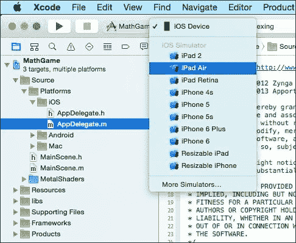

选择你想要的任何模拟器，最好是最终支持游戏的模拟器，然后按左边的播放按钮，或者按*command* + *R*来运行。打开模拟器可能需要几分钟，所以请耐心等待。但是一旦打开，它应该会自动在模拟器上打开。如果它没有，只需尝试在模拟器已经打开的情况下重新运行它。

恭喜！如果您使用了模拟器，现在您有一个可以运行的项目了！接下来，我们将介绍如何在设备上运行它。

## 在设备上运行 – 需要 iOS 开发者许可证

如果您不确定是想在设备上还是模拟器上运行您的游戏，让我来解释一下为什么在测试目的上设备是王。您不仅可以像其他用户一样看到和感受项目，还可以体验设备的实际性能，而不是它的模拟版本。此外，如果您的项目在触摸屏使用上很重（这确实应该如此，否则可能不应该是一个 iOS 游戏），那么您可以有效地测试游戏的触感。

对于设备测试，只需将您的设备连接即可。其名称应列在 Xcode 中，如下所示：

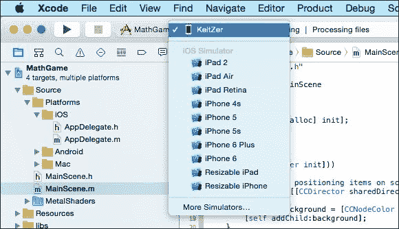

如果您看不到您的设备名称，请确保您选择了 iOS 设备目标，而不是任何模拟器。如果您的设备已连接，但仍然显示**iOS Device**，请确保您在 Xcode 中有一个开发者账户订阅。有关此问题的更多详细信息，请参阅第一章，*刷新我们的 Cocos2d 知识*。

一旦您看到您的设备名称，您可以按下左侧的**播放**按钮，或者按*command* + *R*来运行它。构建可能需要一分钟左右，但一旦完成，项目将自动在您的设备上打开。

恭喜！您现在有一个可以运行的项目了。现在我们可以开始添加一些内容，例如文本和按钮，然后继续创建另一个场景并过渡到该场景，再返回到原始场景。

# 创建按钮和文本（标签）

如果您想在屏幕上放置一行文本，您需要创建一个标签。Cocos2d 中有两种标签类型：`CCLabelBMFont`和`CCLabelTTF`。位图字体标签是使用前面在这本书中提到的 Glyph Designer 创建的精美标签。TrueType 字体标签是常规的、未格式化的文本标签，它使用手机上已有的字体文件或您添加到项目中的文件。

### 小贴士

注意，如果您有一个经常需要更新的标签，例如分数计数器或健康值，在这种情况下使用 BM 字体会更有效率，即使字体是纯白色且在 TTF 格式下看起来完全相同。

## 让我们显示一些文本 – CCLabelTTF

如前所述，TTF 标签是简单、未格式化的标签。这些有什么用呢？答案是，您可以快速启动游戏的原型，这样您可以更好地理解游戏的流程。然后，一旦准备好，您就可以切换到使用 BM 字体来使其看起来更美观。有关改进游戏美学的更多方法，请参阅第六章，*整理和抛光*。

### 小贴士

下面是一些关于 BMFonts 的简要说明：如果您想在游戏中使用它们，出于性能考虑您应该这样做，请注意 BMFonts 的各种限制，而 TTF 字体则没有。首先是标签放大时的质量较差。然后，BMFonts 只能使用字体图集中的字符，任何外语支持可能意味着需要很多额外的 BMFonts，这可能会在空间上迅速增加。

我们将要做的第一件事是让左侧的标签动起来。以下代码应添加到`MainScene.h`中（变量前面的`lbl`前缀将指示我们这是一个标签；同样，`btn`用于按钮，`num`用于数字等）：

```swift
@interface MainScene : CCNode
{
  CGSize winSize;
  //Add the following:
  //the labels used for displaying the game info
  CCLabelTTF *lblTurnsSurvived, *lblUnitsKilled, *lblTotalScore;
}
```

以下代码将放入`MainScene.m`的`init`方法中，并将创建标签。然后我们想要为每个标签设置位置，因为默认位置在左下角。最后，我们将每个标签添加到场景中。记住，场景只是一个可以有任意多个子节点的节点：

```swift
CCLabelTTF *lblTurnsSurvivedDesc = [CCLabelTTF labelWithString:@"Turns Survived:" fontName:@"Arial" fontSize:12];
lblTurnsSurvivedDesc.position = ccp(winSize.width * 0.1, winSize.height * 0.8);
[self addChild:lblTurnsSurvivedDesc];

lblTurnsSurvived = [CCLabelTTF labelWithString:@"0" fontName:@"Arial" fontSize:22];
lblTurnsSurvived.position = ccp(winSize.width * 0.1, winSize.height * 0.75);
[self addChild:lblTurnsSurvived];

CCLabelTTF *lblUnitsKilledDesc = [CCLabelTTF labelWithString:@"Units Killed:" fontName:@"Arial" fontSize:12];
lblUnitsKilledDesc.position = ccp(winSize.width * 0.1, winSize.height * 0.6);
[self addChild:lblUnitsKilledDesc];

lblUnitsKilled = [CCLabelTTF labelWithString:@"0" fontName:@"Arial" fontSize:22];
lblUnitsKilled.position = ccp(winSize.width * 0.1, winSize.height * 0.55);
[self addChild:lblUnitsKilled];

CCLabelTTF *lblTotalScoreDesc = [CCLabelTTF labelWithString:@"Total Score:" fontName:@"Arial" fontSize:12];
lblTotalScoreDesc.position = ccp(winSize.width * 0.1, winSize.height * 0.4);
[self addChild:lblTotalScoreDesc];

lblTotalScore = [CCLabelTTF labelWithString:@"1" fontName:@"Arial" fontSize:22];
lblTotalScore.position = ccp(winSize.width * 0.1, winSize.height * 0.35);
[self addChild:lblTotalScore];
```

注意，我们使用了`winSize`变量进行定位。这很有用，因为它不仅保持了屏幕上的相对位置，而且在为不同屏幕尺寸的多个设备编写代码时也很有帮助（例如，iPhone 4、iPhone 5、iPad 等具有不同的尺寸）。

另一种处理方式是将我们标签的`positionType`设置为`CCPositionTypeNormalized`。然后我们可以将位置值设置在`0`到`1`之间，其中`0`代表屏幕的左侧（或底部），而`1`代表屏幕的右侧（或顶部）。

## 显示一些文本 - CCLabelBMFont

如果您还不熟悉，让我们回顾一下：BMFonts 是那些美观、风格化的字体，它们可以为您的游戏增添额外的打磨效果，而无需您付出太多努力。请参考第六章，*整理与打磨*，以提升您游戏的美观度。要创建 BMFont，您必须使用 BMFont 创建器。我们将使用 Glyph Designer，如第一章中提到的，*刷新我们的 Cocos2d 知识*。

### 小贴士

如果您已经遵循了前面的 TTF 部分，那么您只需注释掉或删除那些代码行即可，因为我们将在本节中重新制作这些字体，并将它们制作成 BMFont 标签。

我们将要做的第一件事是在场景的左侧创建字体。在 Glyph Designer 打开的情况下，从左侧面板中选择一个字体（我选择了**Britannic Bold**，这是原型中的字体）。您可以在右侧的设置中调整以获得适合您项目的字体，但请记住，这只是一个原型，您不应该在上面花费太多时间。看看下面的截图：

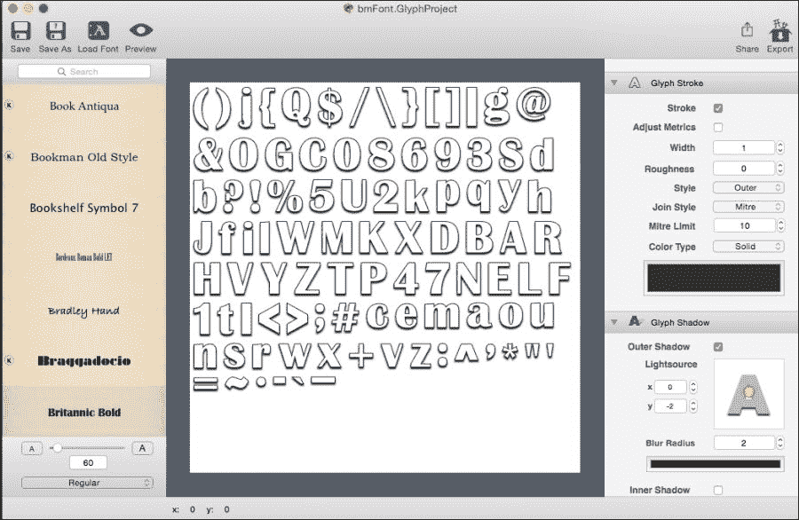

### 小贴士

确保字体大小不要太大或太小。如前一个截图所示，它设置为 60。这对于项目来说是一个合适的大小。如果它变得太大或太小，调整它相对简单。

当你对所选择的设置满意时，点击顶部的 **另存为**，并选择你想要保存 Glyph Designer 文件的位置（而不是实际的字体文件）。现在，如果决定稍后编辑字体，我们已经保存了它，接下来让我们继续导出字体，以便我们可以在 Cocos2d 中使用它。

根据你决定采用的文件读取方式，你需要以两种不同的方式导出字体。确保你遵循相同的风格，因为你可以在同一个项目中只使用一种风格（但不能同时使用两种）。无论你选择哪条路线，都要从你需要的最大字体大小开始；例如，前一个截图显示字体大小为 60，因为它将在 Retina iPad 上显示。如果它只用于 iPhone，60 就太大了。

### 使用文件后缀保存你的 BMFont

在 Glyph Designer 中，点击顶部的 **导出** 并导航到项目目录中的 `Resources/Published-iOS` 文件夹（见以下截图）。这就是你将导出字体以用于 Cocos2d 的位置。请注意，因为这个字体是最大的，用于 Retina 尺寸的 iPad，所以文件名后的后缀是 `-ipadhd`。如果你不是为 iPad 设计，你最大的文件名后缀将是 `-hd`。

### 小贴士

注意，你应该保留 `.fnt`/`.png` 扩展名（见以下截图）不变。Glyph Designer 将自动为你添加它。

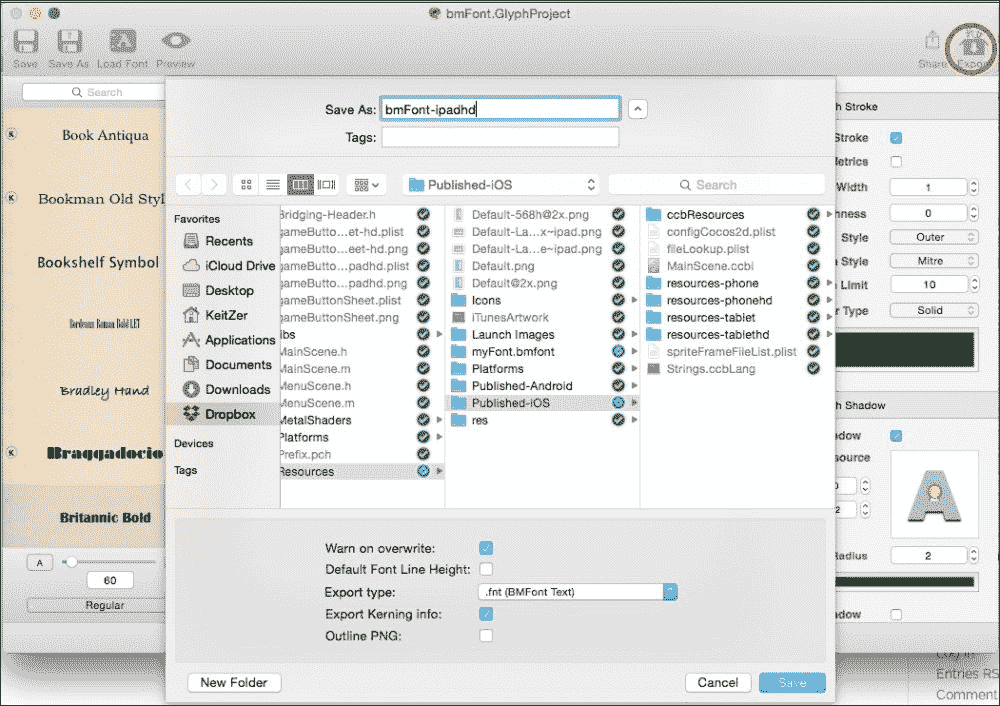

一旦导出了最大的手机字体，接下来调整每个层级所需的设置。例如，由于我们正在以 60 点字体导出 `-ipadhd`，我们还想为较小的设备制作 30 点和 15 点大小的字体。除了减小字体大小外，我们还可以修改笔触和阴影设置，以使所有大小看起来相对一致。

总体来说，如果你将你的字体命名为 `bmFont`，你应该有以下文件（每个 `.fnt` 文件都将附带一个 `.png` 文件），其中最大的字体大小为 60：

+   `bmFont-ipadhd.fnt - 60-pt`

+   `bmFont-ipad.fnt - 30-pt`

+   `bmFont-hd.fnt - 30-pt`

+   `bmFont.fnt - 15-pt`

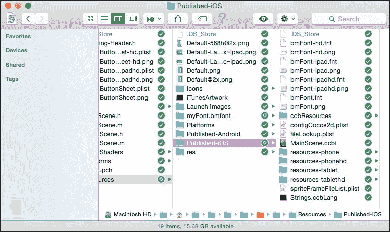

当使用文件扩展名方法时，只要将你的文件导出到 `Published-iOS` 文件夹，Xcode 项目就会以包含你的字体在项目中的方式设置。通过这种方式，你不需要担心复制任何内容。话虽如此，让我们开始使用我们刚刚创建的新字体显示标签。

### 使用目录保存你的 BMFont

如果你选择使用目录，那么将字体文件拖入 SpriteBuilder 并不是那么简单（在撰写本书时）。相反，你必须在项目目录的 `Published-iOS` 文件夹内创建四个文件夹：

+   `resources-phone`

+   `resources-phonehd`

+   `resources-tablet`

+   `resources-tablethd`


在 Glyph Designer 中，点击顶部的 **导出** 并导航到项目目录中的 `Published-iOS/resources-tablethd` 文件夹（见以下截图）。这就是你将导出用于 Cocos2d 的字体的地方。这里的文件名将是字体的名称。

### 小贴士

保持 `.fnt`/`.png` 扩展名不变（见以下截图）。Glyph Designer 将自动为你添加它。

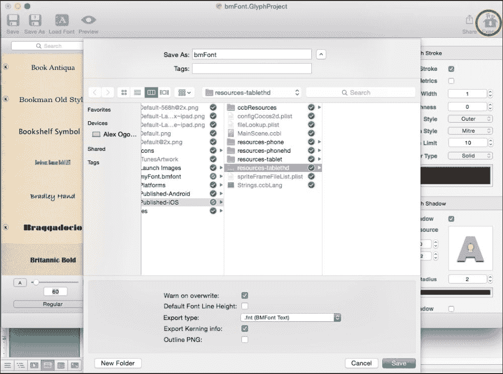

一旦导出了 `tablethd` 版本，执行相同的导出操作，但修改字体大小和任何其他你希望修改的设置。例如，由于我们正在导出 `tablethd` 大小为 60 点的字体，我们还想创建 30 点和 15 点的大小以适应较小的设备。除了减小字体大小外，我们还可以修改描边和阴影设置，以使所有大小看起来相对一致。

因此，总的来说，如果你的字体名为 `bmFont`，你应该有以下文件（每个 `.fnt` 文件都将附带一个 `.png` 文件），其中最大的字体大小为 60：

+   `resources-tablethd/bmFont.fnt - 60-pt`

+   `resources-tablet/bmFont.fnt - 30-pt`

+   `resources-phonehd/bmFont.fnt - 30-pt`

+   `resources-phone/bmFont.fnt - 15-pt`

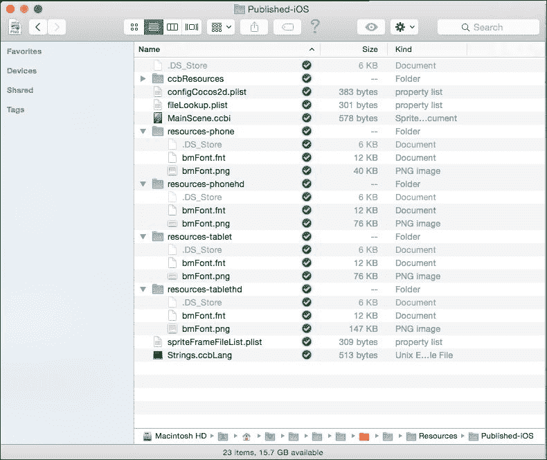

当使用目录方法时，如果你已经将字体文件导出到之前提到的文件夹中，Xcode 项目将自动设置以包含这些文件，因此你不需要担心复制任何内容。话虽如此，让我们开始使用我们刚刚创建的新字体来显示标签。

### 导出 BMFont 并导入到 Xcode

打开 Xcode 并打开 `MainScene.h` 文件。你将在 `CGSize winSize` 这一行下面添加以下变量。再次提醒，如果你已经按照前面的 TTF 教程操作，你可以删除或注释掉在那个教程中创建的变量，因为我们在这里将使用相同的变量名。我们再次使用 `lbl` 来声明变量，这样我们就可以很容易地将其识别为标签：

```swift
@interface MainScene : CCNode
{
  CGSize winSize;
//the labels used for displaying the game info
//this line now uses CCLabelBMFont instead of CCLabelTTFFont
CCLabelBMFont *lblTurnsSurvived, *lblUnitsKilled, *lblTotalScore;
}
```

然后打开 `MainScene.m` 文件，在背景层的代码下面添加以下代码行以显示标签。如果你选择以不同的名称导出你的字体，你必须将 `fntFile` 参数更改为你选择的名称：

```swift
CCLabelBMFont *lblTurnsSurvivedDesc = [CCLabelBMFont labelWithString:@"Turns Survived:" fntFile:@"bmFont.fnt"];
lblTurnsSurvivedDesc.position = ccp(winSize.width * 0.125, winSize.height * 0.8);
[self addChild:lblTurnsSurvivedDesc];

lblTurnsSurvived = [CCLabelBMFont labelWithString:@"0" fntFile:@"bmFont.fnt"];
lblTurnsSurvived.position = ccp(winSize.width * 0.125, winSize.height * 0.75);
[self addChild:lblTurnsSurvived];

CCLabelBMFont *lblUnitsKilledDesc = [CCLabelBMFont labelWithString:@"Units Killed:" fntFile:@"bmFont.fnt"];
lblUnitsKilledDesc.position = ccp(winSize.width * 0.125, winSize.height * 0.6);
[self addChild:lblUnitsKilledDesc];

lblUnitsKilled = [CCLabelBMFont labelWithString:@"0" fntFile:@"bmFont.fnt"];
lblUnitsKilled.position = ccp(winSize.width * 0.125, winSize.height * 0.55);
[self addChild:lblUnitsKilled];

CCLabelBMFont *lblTotalScoreDesc = [CCLabelBMFont labelWithString:@"Total Score:" fntFile:@"bmFont.fnt"];
lblTotalScoreDesc.position = ccp(winSize.width * 0.125, winSize.height * 0.4);
[self addChild:lblTotalScoreDesc];

lblTotalScore = [CCLabelBMFont labelWithString:@"1" fntFile:@"bmFont.fnt"];
lblTotalScore.position = ccp(winSize.width * 0.125, winSize.height * 0.35);
[self addChild:lblTotalScore];
```

添加这些行后，你应该能够运行游戏并在屏幕左侧看到一些看起来很酷的标签，如下所示（这是在 iPhone 5 上运行的）：

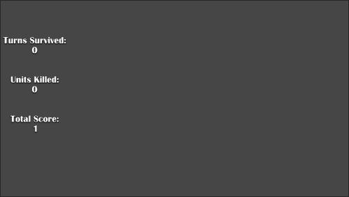

如果只是显示文本，那就不算是一个游戏，所以让我们添加一些按钮。但首先，我们必须了解如何使用 TexturePacker 创建精灵表。

如果你决定不使用 TexturePacker，请阅读*不使用 TexturePacker – 简要说明*部分，并可以自由跳过关于使用 TexturePacker 的精灵表的部分。如果是这样，你也应该使用文件读取的目录方法，因为除了使用像 TexturePacker 这样的自动维护它们的程序之外，文件扩展名几乎没有任何好处。

## 不使用 TexturePacker – 简要说明

如前所述，如果你选择不使用 TexturePacker，每次提到将其图像添加到精灵表时，那就是你将其添加到 SpriteBuilder 并重新发布的信号，因为它假定你将使用文件读取的目录模式。

要这样做，将 iPad 视网膜分辨率的图像拖入 SpriteBuilder，然后点击**发布**。SpriteBuilder 将自动缩放。

### 小贴士

然而，请注意，本书的后续章节中，将提供精灵表（以及如果你想自己完成，也可以提供单个图像）。

# 开始使用 TexturePacker 的精灵表

Sprite sheets 用于提高游戏性能，不仅减少了游戏加载所需的时间，而且在游戏运行时也能提高性能。

### 小贴士

不幸的是，截至本书编写时，TexturePacker 与 Cocos2d 兼容，但 SpriteBuilder 并不直接支持其使用。然而，当需要有效地构建精灵表时，TexturePacker 是一个很好的解决方案。如果你希望使用 TexturePacker，但目前正在使用目录方法（截至本书编写时的 SpriteBuilder 默认设置），请返回并更改你的样式为文件扩展名。

如第一章中提到的，*刷新我们的 Cocos2d 知识*，我们将使用 TexturePacker 作为我们的精灵表创建者的首选。TexturePacker 有几个优点：

+   它允许一键导出到 Cocos2d

+   它具有自动缩放（向上或向下）以支持所有分辨率类型

+   它使得以后更新图像时更容易导入图像

首先，打开 TexturePacker。然后转到`Images Pre-Chapter 6`文件夹，在那里你会看到`btnMenu.png`图像（我们的菜单按钮图像）。将其拖入 TexturePacker 的右侧列。它应该看起来像这样：


在更改任何文件位置之前，请确保你做了以下操作：

1.  在**纹理格式**下拉框中，确保已选择**PNG**。这种格式应该适用于您将要制作的多数游戏。然而，如果您发现自己想要在不牺牲质量的情况下使游戏最终项目的大小更小，建议切换到**zlib pvr.ccz 压缩**。这是 Cocos2d 最优化格式，不仅适用于每像素的压缩，而且在屏幕上绘制图像时的性能也是最佳的。

1.  选中表示**预乘 Alpha**的复选框。现在不需要完全了解它是如何工作的细节。目前只需知道，在 Cocos2d 中，勾选此选项可以使纹理渲染更快。

## 保存到项目位置

现在我们已经将图像放入 TexturePacker 中，让我们修改一些设置以确保我们可以有效地管理此精灵表的任何未来版本。点击**数据文件**文本框旁边的文件夹图标，进入项目的`Resources/Published-iOS`目录。您可以随意命名文件，但尽量保持相关性。在这个例子中，我们将它命名为`buttonSheet`，因为它将包含游戏中所有按钮的精灵表。准备好后，点击**保存**。

### 小贴士

注意，尽管文件被命名为`buttonSheet.plist`，但文件名末尾有`{v}`。这很重要，也是 TexturePacker 为我们进行自动缩放的原因。

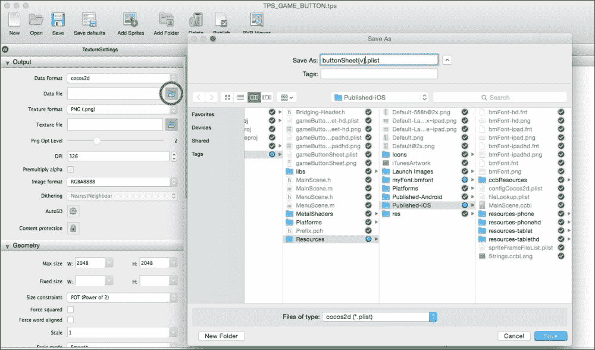

至于图像格式，通常保持为**RGBA8888**是合适的。但是，如果您的游戏在屏幕上有大量艺术资产并且性能不佳，将其更改为较低的设置可能会有所帮助。

## 调整图像并发布精灵表

现在我们需要确保 TexturePacker 将正确缩放我们需要的内容。点击**AutoSD**旁边的齿轮图标，然后打开顶部标有**预设**的顶部下拉框。选择最适合您需求的选项，然后点击**应用**。

### 小贴士

如果您只制作 iPhone 游戏（而不是 iPad 版本），选择**cocos2d hd/sd**。

否则（如果您正在制作 iPad 版本，本书的项目就是这样），选择**cocos2d ipad/hd/sd**。

最后，在屏幕的左上角，我们点击**保存默认设置**按钮，因为它允许我们在需要再次创建 TexturePacker 精灵表时保存这些设置。然后点击**保存**（或按*command* +*S*）。这将询问您希望将 TexturePacker 文件（而不是精灵表）保存的位置。通常，您会将与所有其他艺术资产相同的文件夹保存此文件。例如，我们将为项目以及稍后要复制的单个艺术资产创建一个单独的目录。

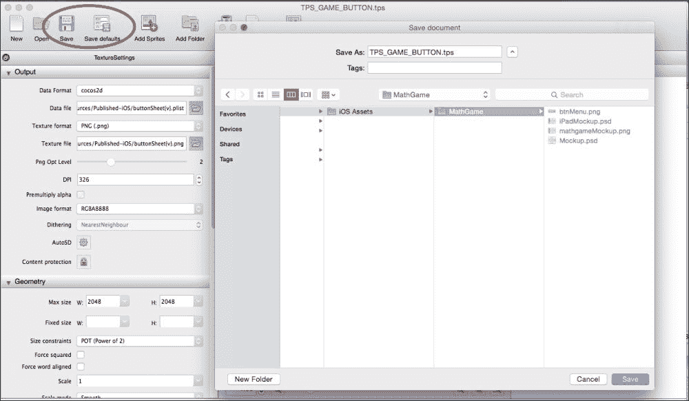

一旦你在选择的位置保存了 TPS 文件，请继续点击 **发布**。发布将根据我们之前输入的各种设置生成项目所需的精灵表。

## 导入精灵表并将其加载到内存中

最后，一旦你在项目目录中（或者实际上任何地方，但最好位于项目目录中以便于稍后更新），Xcode 项目的设置应该会导致它们自动添加到你的项目中。

一旦发布了精灵表，打开 Xcode 并转到 `AppDelegate.m` 文件。在 `startScene` 方法中的返回语句上方添加一行代码，使其看起来像这样：

```swift
- (CCScene*) startScene
{
  [[CCSpriteFrameCache sharedSpriteFrameCache] addSpriteFramesWithFile:@"buttonSheet.plist"];

  return [MainScene scene];//[CCBReader loadAsScene:@"MainScene"];
}
```

现在你已经准备好开始使用精灵表了。设置它花了一些时间，但到目前为止，你所需要做的就是将图像添加到 TexturePacker 文件中，点击 **保存**，然后点击 **发布**。你的更改将在你下次运行项目时自动反映出来。话虽如此，让我们通过将菜单按钮图像转换为实际按钮来利用精灵表。

# 通过 CCButton 和 CCLayout 创建按钮

Cocos2d 3.0 改变了按钮的显示方式。如果你之前使用过 Cocos2d 的早期版本，你可能对 `CCMenu` 很熟悉。在 Cocos2d 中，这不再是创建和显示可点击按钮的方式。相反，我们将使用 `CCButton` 并将它们放置在 `CCLayout` 类型的节点中。如果你跳过了精灵表部分，我强烈建议你回去阅读它。这将帮助你避免在项目进展过程中遇到许多令人沮丧的时刻。

对于本书的项目，我们将在左下角添加菜单按钮。就像我说的，一旦你将图像包含到项目中，添加按钮就极其简单。

打开 `MainScene.m` 文件，并在 `init` 方法中的标签代码下方添加这些代码行：

```swift
CCButton *btnMenu = [CCButton buttonWithTitle:@""
  spriteFrame:[CCSpriteFrame frameWithImageNamed:@"btnMenu.png"]];
btnMenu.position = ccp(winSize.width * 0.125, winSize.height * 0.1);
[self addChild:btnMenu];
```

当你运行它时，你应该在左下角看到菜单按钮出现。如果你使用了 `pvr.ccz` 格式，并且按钮水平翻转，不要担心。只需回到 TexturePacker，勾选 **Flip PVR** 的复选框，保存文件，然后发布。回到 Xcode 并重新运行项目。它应该看起来像这样：

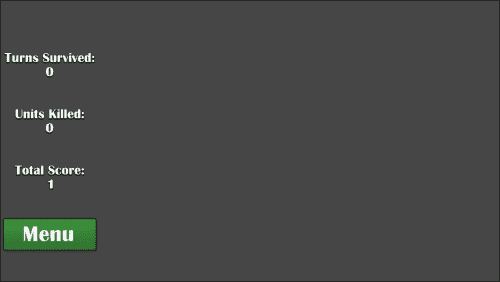

## 添加重启按钮

根据你使用的方法，将 **重启** 按钮（在这种情况下，`btnRestart.png`）添加到 TexturePacker 或 SpriteBuilder 中，点击 **保存**，然后发布以更新文件，以便 **重启** 按钮可以使用。添加了 **重启** 按钮的图像后，你可以修改 `MainScene.m` 文件的代码，使其看起来像这样：

```swift
CCButton *btnMenu = [CCButton buttonWithTitle:@"" spriteFrame:[CCSpriteFrame frameWithImageNamed:@"btnMenu.png"]];

CCButton *btnRestart = [CCButton buttonWithTitle:@"" spriteFrame:[CCSpriteFrame frameWithImageNamed:@"btnRestart.png"]];

CCLayoutBox *layoutButtons = [[CCLayoutBox alloc] init];
[layoutButtons addChild:btnRestart];
[layoutButtons addChild:btnMenu];
layoutButtons.spacing = 10.f;
layoutButtons.anchorPoint = ccp(0.5f, 0.5f);
layoutButtons.direction = CCLayoutBoxDirectionVertical;
[layoutButtons layout];
layoutButtons.position = ccp(winSize.width * 0.125, winSize.height * 0.15);
[self addChild:layoutButtons];
```

这将使重启按钮和菜单按钮完美对齐。此外，如果你决定移动两个按钮，但希望它们相对于彼此的距离相同，只需重新定位布局框。然后，Voilà！

你可以作为一个快速的学习体验，尝试调整间距值；或者改变方向，甚至锚点。当你尝试测试不同的值时，你会更好地理解为什么每一行代码对于创建这个效果是绝对必要的。

好吧，修改一些值。你总是可以恢复到前面的代码。

到目前为止，使用你刚才看到的初始代码，如果你运行项目，它看起来会是这样：

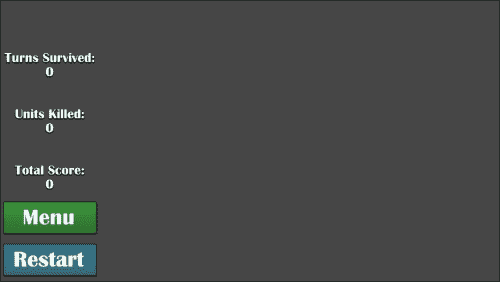

# 创建节点和单位（精灵）

记住，Cocos2d 中的所有内容，在其基础层面，都是一个`CCNode`对象。节点可以有其他节点作为子节点。例如，如果你想创建一个带有喷气背包的角色，角色可以是一个`CCSprite`对象（一个带有图像的节点对象），喷气背包可以是一个作为角色子节点的`CCSprite`对象。

无论如何，这是一章关于原型的内容，我们还没有创建任何真正的游戏玩法。让我们通过一些图像、一些触摸控制和更多内容来开始。

## 设置背景

将背景图像添加到精灵图中（或 SpriteBuilder），保存、发布，然后在`MainScene.m`文件的`init`方法中，将图像作为`CCSprite`对象添加到屏幕上，位于`CCLayoutBox`代码下方：

```swift
CCSprite *board = [CCSprite spriteWithImageNamed:@"imgBoard.png"];
board.position = ccp(winSize.width * 0.625, winSize.height/2);
[self addChild:board];
```

让我们运行游戏，哎呀！我们似乎遇到了原型中的第一个问题。虽然在这个阶段完全不需要找出所有的错误和问题，但这个问题对于游戏玩法来说很重要。此外，这是一个了解设备特定缩放的好机会。如果你查看以下截图，其中一个是 iPhone 5 拍摄的，另一个是 iPad Retina 拍摄的，你会注意到游戏板在手机上有点太大。以下是 iPhone 5 上的游戏截图：

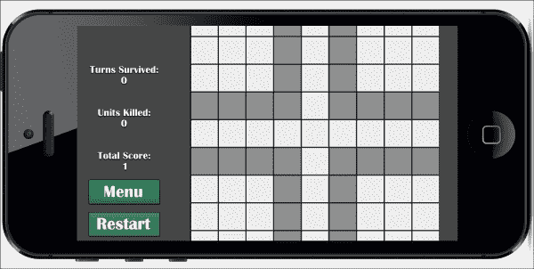

游戏的 iPad Retina 截图如下：

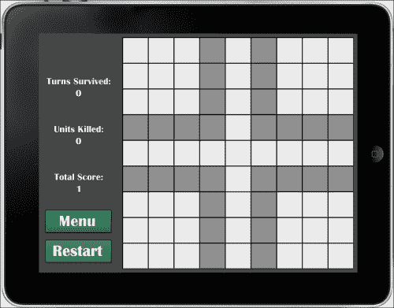

幸运的是，它并不太离谱，因为从 TexturePacker 或 SpriteBuilder 的自动缩放已经为我们提供了游戏板的相对准确的缩放。我们唯一需要做的是仅对手机上的板进行非常轻微的缩放修改，而不是平板电脑。这可以通过在声明板变量后添加以下代码来完成：

```swift
if (UI_USER_INTERFACE_IDIOM() == UIUserInterfaceIdiomPhone)
  board.scale = 0.8;
```

相反，如果你想检测 iPad，只需使用`UIUserInterfaceIdiomPad`即可。

现在，如果你在手机上运行它（无论是你的手机还是模拟器），你会看到网格很好地位于屏幕边界内。

## 定义并添加屏幕上的单位

由于每个单位基本上是相同的，只是颜色和数字不同，我们应该为自己定义一个类。为此，我们遵循有关新场景的相同说明，但这次，我们将调用`Unit`类并将子类设置为`CCSprite`类型。

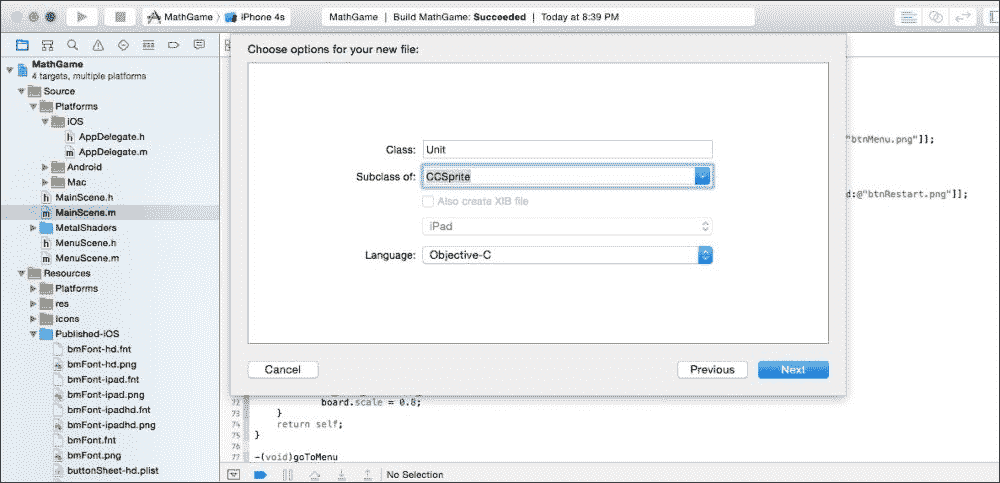

打开 `Unit.h` 文件，使其看起来如下：

```swift
#import "CCSprite.h"

NS_ENUM(NSInteger, UnitDirection)
{
  DirUp,
  DirDown,
  DirLeft,
  DirRight,
  DirStanding //for when a new one spawns at the center
};

@interface Unit : CCSprite

@property (nonatomic, assign) NSInteger unitValue;
@property (nonatomic, assign) BOOL isFriendly;
@property (nonatomic, assign) enum UnitDirection direction;
//9x9 grid, 1,1 is top left, 9,9 is bottom right
@property (nonatomic, assign) CGPoint gridPos;
@property (nonatomic, strong) CCColor *color;
@property (nonatomic, strong) CCLabelBMFont *lblValue;

+(Unit*)friendlyUnit;
+(Unit*)enemyUnitWithNumber:(NSInteger)value atGridPosition:(CGPoint)pos;
@end
```

这基本上允许我们给我们的单位一个移动方向。我们还得到了与它们相关的一个值，一个布尔值用来确定它是否是友军单位（这对于移动和碰撞都是必需的），以及各种其他内容。

现在，打开 `Unit.m` 文件，并在 `@implementation` 和 `@end` 之间添加以下代码：

```swift
+(Unit*)friendlyUnit
{
  return [[self alloc] initWithFriendlyUnit];
}

+(Unit*)enemyUnitWithNumber:(NSInteger)num atGridPosition:(CGPoint)pos
{
  return [[self alloc] initWithEnemyWithNumber:num atPos:pos];
}

-(id)initCommon
{
  if ((self=[super initWithImageNamed:@"imgUnit.png"]))
  {
    if (UI_USER_INTERFACE_IDIOM() == UIUserInterfaceIdiomPhone)
      self.scale = 0.8;

    self.lblValue = [CCLabelBMFont labelWithString:@"1" fntFile:@"bmFont.fnt"];
    self.lblValue.scale = 1.5;
    self.lblValue.position = ccp(self.contentSize.width/2, self.contentSize.height/1.75);
    [self addChild:self.lblValue];
  }
  return self;
}

-(id)initWithFriendlyUnit
{
  if ((self=[self initCommon]))
  {
    self.isFriendly = YES;
    self.unitValue = 1;
    self.direction = DirStanding;
    self.color = [CCColor colorWithRed:0 green:0.8f blue:0]; //green for friendly
    self.gridPos = ccp(5,5);
  }
  return self;
}

-(id)initWithEnemyWithNumber:(NSInteger)num atPos:(CGPoint)p
{
  if ((self=[self initCommon]))
  {
    self.isFriendly = NO;
    self.unitValue = num;
    self.lblValue.string = [NSString stringWithFormat:@"%ld", (long)num];
    self.direction = DirLeft;
    self.color = [CCColor colorWithRed:0.8f green:0 blue:0]; //red for enemy
    self.gridPos = p;
  }
  return self;
}
```

`init` 方法设置了一些重要内容：网格上的位置、颜色、是否为友军单位、单位首次生成时的值、显示值的标签以及它打算在下个回合移动的方向。

让我们打开 `MainScene.m` 文件，并在屏幕上生成一个友军单位和敌军单位。因为我们定义了类非常出色，所以只用几行代码就可以生成两个单位。确保你也在顶部包含了 `Unit.h` 文件：

```swift
Unit *friendly = [Unit friendlyUnit];
friendly.position = ccp(winSize.width/2, winSize.height/2);
[self addChild:friendly];

Unit *enemy = [Unit enemyUnitWithNumber:1 atGridPosition:ccp(1,1)];
enemy.position = ccp(winSize.width - 50, winSize.height/2);
[self addChild:enemy];
```

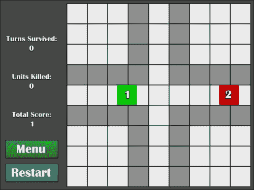

然而，位置仍然需要计算，而我们分配的网格坐标对游戏来说没有任何意义。我们需要确定屏幕上的实际位置。也就是说，如果我们说位置是 (5, 5)，它最好知道这意味着正正好在网格的正中央。然而，唯一知道屏幕坐标的地方是主场景，所以打开 `MainScene.m` 文件，并添加以下方法以根据网格坐标获取屏幕位置：

```swift
-(CGPoint)getPositionForGridCoord:(CGPoint)pos
{
  CGPoint screenPos;
  Unit *u = [Unit friendlyUnit];

  CGFloat borderValue = 1.f;
  if (UI_USER_INTERFACE_IDIOM() == UIUserInterfaceIdiomPhone)
    borderValue = 0.6f;

  screenPos.x = winSize.width * 0.625 + (u.boundingBox.size.width + borderValue) * (pos.x-5);
  screenPos.y = winSize.height/2 - (u.boundingBox.size.width + borderValue) * (pos.y-5);

  return screenPos;
}

Now change the positioning of the units to reflect this change:
Unit *friendly = [Unit friendlyUnit];
friendly.position = [self getPositionForGridCoord:friendly.gridPos];
[self addChild:friendly];

Unit *enemy = [Unit enemyUnitWithNumber:2 atGridPosition:ccp(4,7)];
enemy.position = [self getPositionForGridCoord:enemy.gridPos];
[self addChild:enemy];
```

看看下面的截图；这就是你的游戏现在的样子：

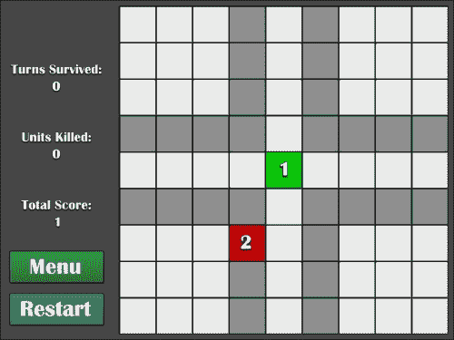

运行游戏应该会得到前面截图所示的内容。是的，尽管这个截图来自 iPad，但代码在任意分辨率的 iPhone 上同样有效，因为确定位置的公式是基于 (5, 5) 是网格中心的假设。

现在，让我们通过一些触摸机制让这些单位在屏幕上移动。首先，将红色单位放在网格最右侧的绿色单位的右侧——(9, 5)，对于那些懒惰且不想计算的人来说。

## 使用触摸控制移动单位

在 Cocos2d 中进行触摸检测非常简单。从版本 3.3 开始，你只需要添加一行代码和一些方法，就可以完成了。

话虽如此，向 `Unit` 类的 `initWithFriendlyUnit` 方法添加以下代码行（我们希望在友军单位上启用触摸，而不是在敌人单位上）：

```swift
[self setUserInteractionEnabled:YES];

Then add the following methods in Unit.m that will intercept all touches made on each unit:
-(void)touchBegan:(CCTouch *)touch withEvent:(CCTouchEvent *)event
{

}

-(void)touchMoved:(CCTouch *)touch withEvent:(CCTouchEvent *)event
{

}

-(void)touchEnded:(CCTouch *)touch withEvent:(CCTouchEvent *)event
{

}
```

这些方法在描述它们的功能方面相当直观。`touchBegan` 方法在手指触摸屏幕时注册一个触摸，`touchMoved` 方法在手指沿屏幕拖动时注册一个触摸，而 `touchEnded` 方法在手指从屏幕上抬起时注册。

为了确定被拖动的单位及其方向，将以下三个变量添加到 `Unit.h` 文件中：

```swift
@property (nonatomic, assign) BOOL isBeingDragged;
@property (nonatomic, assign) CGPoint touchDownPos;
@property (nonatomic, assign) enum UnitDirection dragDirection;
```

还需要添加以下方法声明：

```swift
-(void)updateLabel;
```

一旦完成，打开 `Unit.m` 并向以下方法添加代码。

首先，你必须创建此方法，它将设置单位标签显示的字符串为单位的实际值：

```swift
-(void)updateLabel
{
  self.lblValue.string = [NSString stringWithFormat:@"%ld", (long)self.unitValue];
}
```

然后，我们需要处理我们的触摸以更新标签，因此需要在 `touchBegan` 方法中添加以下代码，这将获取 `CCTouch` 方法相对于给定节点的位置的坐标。目前，我们想知道触摸相对于 `Unit` 本身的位置，并将其设置在我们的 `touchDownPos` 变量中：

```swift
self.touchDownPos = [touch locationInNode:self];
self.dragDirection = DirStanding;
```

然后，你必须向 `touchMoved` 方法添加以下代码。这将根据 `touchDownPos` 和当前 `touchPos` 变量的 `x` 和 `y` 差异来确定手指被拖动的方向：

```swift
CGPoint touchPos = [touch locationInNode:self];
//if it's not already being dragged and the touch is dragged far enough away...
if (!self.isBeingDragged && ccpDistance(touchPos, self.touchDownPos) > 6)
{  
  self.isBeingDragged = YES;

  CGPoint difference = ccp(touchPos.x - self.touchDownPos.x, touchPos.y - self.touchDownPos.y);
  //determine direction
  if (difference.x > 0)
  {
      if (difference.x > fabsf(difference.y))
        self.dragDirection = DirRight;
      else if (difference.y > 0)
        self.dragDirection = DirUp;
      else
        self.dragDirection = DirDown;
  }
  else
  {
      if (difference.x < -1* fabsf(difference.y))
        self.dragDirection = DirLeft;
      else if (difference.y > 0)
        self.dragDirection = DirUp;
      else
        self.dragDirection = DirDown;
  }
}
```

最后，将此代码段添加到 `touchEnded` 方法中。这实际上将根据单位被拖动的方向更新单位的网格位置：

```swift
//if it was being dragged in the first place
if (self.isBeingDragged)
{
  CGPoint touchPos = [touch locationInNode:self];
  //stop the dragging
  self.isBeingDragged = NO;

  if (ccpDistance(touchPos, self.touchDownPos) > self.boundingBox.size.width/2)
  {
      NSInteger gridX, gridY;
      gridX = self.gridPos.x;
      gridY = self.gridPos.y;

      //move unit that direction
      if (self.dragDirection == DirUp)
        --gridY;
      else if (self.dragDirection == DirDown)
        ++gridY;
      else if (self.dragDirection == DirLeft)
        --gridX;
      else if (self.dragDirection == DirRight)
        ++gridX;

      //keep within the grid bounds
      if (gridX < 1) gridX = 1;
      if (gridY > 9) gridX = 9;

      if (gridY < 1) gridY = 1;
      if (gridY > 9) gridY = 9;

      //if it's not in the same place... aka, a valid move taken
      if (!(gridX == self.gridPos.x && gridY == self.gridPos.y))
      {
        self.gridPos = ccp(gridX, gridY);
        self.unitValue++;
        self.direction = self.dragDirection;
        [self updateLabel];
      }
  }
}
```

现在，如果你运行游戏，你会看到当你轻触（或在模拟器上运行时点击）并拖动该单位……哦，我的天！为什么单位没有移动？我们设置了网格坐标，并且一切正常！甚至单位的值也在正确增加。

但是，我们没有告诉主场景单位需要移动，因为单位定位是在那里发生的。话虽如此，我们想要一种方式让我们的主场景知道单位已经被移动，这样我们就可以更新其位置。

## 场景间的通信

做这件事的一个非常常见的方法是利用 `NSNotificationCenter`。它分为两部分：发送者和接收者。发送者被称为通知，接收者被称为观察者。我们需要通过 `NSNotificationCenter` 发送一个通知，以便任何设置的观察者都能接收到该通知。

首先，我们需要声明一个常量以减少编码时的人为错误。我们这样做是因为通知需要精确，否则它们将不起作用。

所以，打开 `Unit.h` 并在 `#import` 语句下方但 `NS_ENUM` 语句上方添加此行代码：

```swift
FOUNDATION_EXPORT NSString *const kTurnCompletedNotification;
```

然后，在 `Unit.m` 的顶部，在 `#import` 语句下方但 `@implementation` 语句上方，插入以下代码行：

```swift
NSString *const kTurnCompletedNotification = @"unitDragComplete";
```

字符串是什么并不完全重要；只是它必须与其他你后来创建的通知中的任何内容都不同。

然后，在 `Unit.m` 的 `touchEnded` 方法中 `[self updateLabel]` 行下面添加以下代码行：

```swift
//pass the unit through to the MainScene
[[NSNotificationCenter defaultCenter] postNotificationName:kTurnCompletedNotification object:nil userInfo:@{@"unit" : self}];
```

这将向观察者发送一个通知，表示发生了某些事情。在这种情况下，我们想要通知主场景当前单位已被拖动并且需要更新其位置。这就是为什么我们传递 `self`（当前 Unit）——这样我们就可以更新被移动的具体单位的位置。

最后，让我们跳转到 `MainScene.m` 并在 `init` 方法的底部（或顶部；由你选择）添加以下代码：

```swift
[[NSNotificationCenter defaultCenter] addObserver:self selector:@selector(moveUnit:) name:kTurnCompletedNotification object:nil];
```

然后添加以下方法：`moveUnit`和`dealloc`。`moveUnit`方法是我们希望在通知被推送时调用的方法。我们有一个`NSNotification`参数，它获取从`Unit`类传递过来的`NSDictionary`参数。我们还需要`dealloc`来移除观察者，否则它可能会意外地捕获未来的通知，这可能导致游戏崩溃：

```swift
-(void)moveUnit:(NSNotification*)notif
{
  NSDictionary *userInfo = [notif userInfo];
  Unit *u = (Unit*)userInfo[@"unit"];
  u.position = [self getPositionForGridCoord:u.gridPos];
}

-(void)dealloc
{
  [[NSNotificationCenter defaultCenter] removeObserver:self];
}
```

哈喽！现在当你运行代码时，你应该可以看到单位在每个滑动中从网格位置移动到网格位置，任何方向都可以。现在它开始感觉像是一款游戏了。然而，它仍然缺少与敌人的互动，并且没有任何分数被增加。让我们在下一部分添加这些功能。

## 与敌人互动和得分

首先，我们需要一些变量来跟踪数字。所以，在`MainScene.h`文件中，在 BMFont 标签变量下添加以下内容：

```swift
NSInteger numTurnSurvived, numUnitsKilled, numTotalScore;
```

在`MainScene.m`文件中，添加以下方法来更新每个计数器的标签：

```swift
-(void)updateLabels
{
  lblTotalScore.string = [NSString stringWithFormat:@"%ld", (long)numTotalScore];
  lblTurnsSurvived.string = [NSString stringWithFormat:@"%ld", (long)numTurnSurvived];
  lblUnitsKilled.string = [NSString stringWithFormat:@"%ld", (long)numUnitsKilled];
}
```

将以下行添加到`moveUnit`方法中以增加相应的数字：

```swift
++numTurnSurvived;
++numTotalScore;
[self updateLabels];
```

然后在`init`方法中的某个地方初始化变量：

```swift
numTotalScore = 1;
numTurnSurvived = 0;
numUnitsKilled = 0;
```

现在，你会注意到，每次你的单位移动时，分数和`turns survived`标签都会增加 1。但是单位仍然可以直穿敌人单位。让我们修复这个问题。

首先，我们需要比较移动后的网格位置与屏幕上所有可能的敌人，以查看是否发生了碰撞。然而，如果我们打算遍历所有敌人，这意味着我们需要一个数组来保存它们，因此我们在`MainScene.h`文件中声明了一个`NSMutableArray`参数：

```swift
NSMutableArray *arrEnemies;
```

在`MainScene.m`文件中`init`方法的底部，在你生成敌人之后，添加以下代码行：

```swift
arrEnemies = [[NSMutableArray alloc] init];
[arrEnemies addObject:enemy];
```

在`moveUnit`方法的末尾，我们需要遍历所有敌人并检查网格位置是否相同（即，我们是否即将遇到敌人）：

```swift
//for each Unit in the arrEnemies array...
for (Unit *enemy in arrEnemies)
{
  if (enemy.gridPos.x == u.gridPos.x &&
     enemy.gridPos.y == u.gridPos.y)
  {
     //collision!

  }
}
```

在碰撞注释下，我们现在想要比较单位值。值较高的单位将获胜，值较低的单位将从板上（和数组中）移除。在平局的情况下，双方都将被移除。在这里更新`unitsKilled`计数器也很重要：

```swift
{
      //collision!      
      NSInteger enemyVal = enemy.unitValue;
      NSInteger friendVal = u.unitValue;

      //tie, both dead
      if (enemyVal == friendVal)
      {
        [self removeChild:u];
        [arrEnemies removeObject:enemy];
        [self removeChild:enemy];
        ++numUnitsKilled;
      }
      //enemy higher
      else if (enemy.unitValue > u.unitValue)
      {
        enemy.unitValue -= friendVal;
        [enemy updateLabel];
        [self removeChild:u];
      }
      //friendly higher
      else
      {
        u.unitValue -= enemyVal;
        [u updateLabel];
        [arrEnemies removeObject:enemy];
        [self removeChild:enemy];
        ++numUnitsKilled;
      }

      //exit the for loop so no "bad things" happen
      break;
  }
```

最后，将`[self updateLabels]`方法调用在`moveUnit`方法中移动到方法的末尾（即，在循环结束后），否则`unitsKilled`标签不会在下一轮更新，这可能会让玩家感到困惑。

就这样！你可以四处移动，遇到敌人，合并你的分数，更新标签，甚至如果你输了（通过转到**菜单**并点击**播放**按钮）可以重新开始游戏。到目前为止，游戏大致看起来是这样的。

在 iPad 上，游戏场景如下所示：

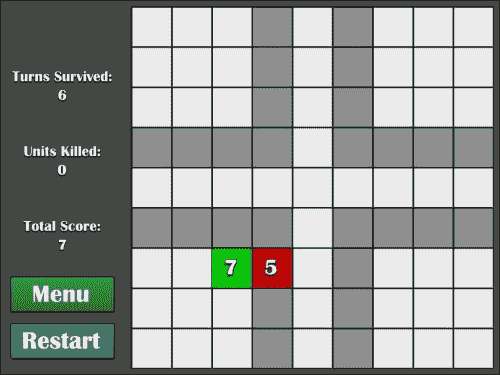

在 iPhone 5 上，游戏场景如下所示：

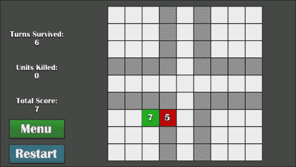

# 创建菜单、场景和场景转换

场景是 Cocos2d 的核心。当你从主菜单转到**关卡选择**屏幕时，那些（当以最佳实践的方式进行编码时）是两个不同的场景。你可以以任何你想要的方式从一个场景切换到另一个场景。然而，通常是通过点击按钮来完成的。例如，**播放**、**设置**和**商店**都是用户可能会按下来触发场景切换的菜单按钮的例子。

## 为场景创建新文件

很可能你的游戏不会只有一个屏幕。如果是这样，你可以快速浏览这部分内容，因为它可能与你无关。然而，绝大多数游戏至少都有一个主菜单、设置菜单、暂停屏幕以及除了主游戏屏幕之外的一些屏幕。

接下来的几幅截图展示了如何以`CCNode`对象作为父类创建文件。如果你已经知道如何操作，可以直接跳到下一步。

在 Xcode 中，在项目导航器顶部的源文件夹上右键单击（或按*Ctrl*并单击），然后点击**新建文件**，如图所示：

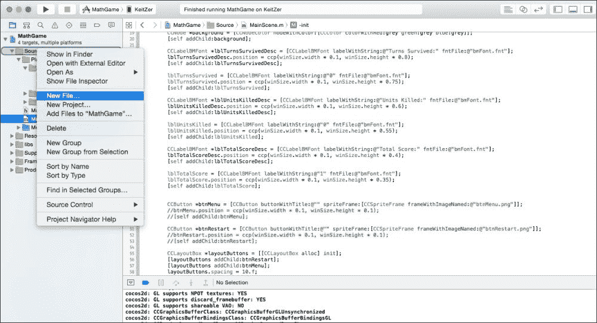

在打开的对话框中，在 iOS **源**部分下，选择**Cocoa Touch 类**并点击**下一步**，如图所示：

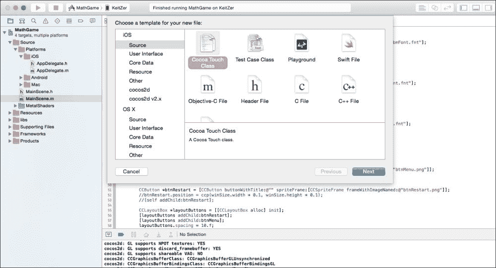

给类起一个相关的名字，因为你可能需要稍后返回它。我们将使用`MenuScene`作为我们类的名字。一旦命名了类，点击**下一步**。

### 小贴士

确保将**子类为**改为`CCNode`，否则你将无法从它创建新的场景。

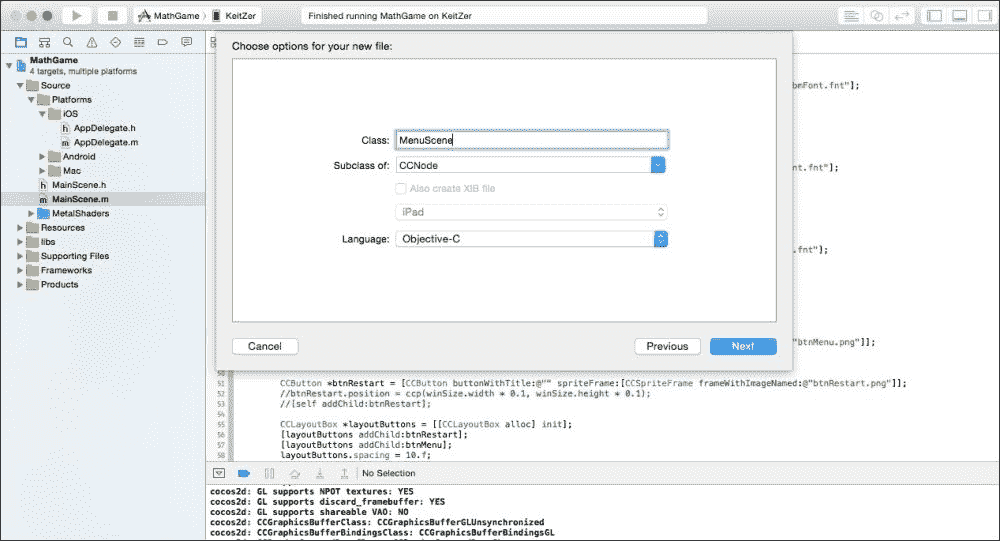

谈到保存文件的位置，建议将所有项目类文件保存在同一目录下。如图所示，我们将要创建的**MenuScene**文件保存在`Source`文件夹中，其中也存放着**MainScene**文件。

一旦选择了位置，点击**创建**，如图所示：

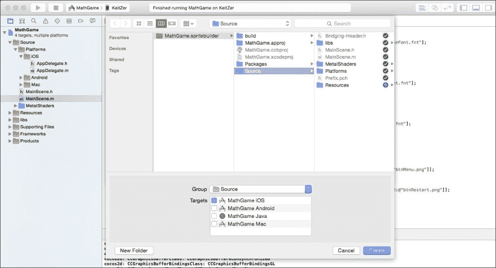

## 将类转换为官方 CCScene 子类

它还不是官方的场景，但这是我们接下来要添加的。在你刚刚创建的类的头文件中，在`@interface`和`@end`行之间添加一个类似的代码块——就像我们在`MainScene.m`文件中有的那样。例如，你的头文件可能看起来像这样：

```swift
@interface MenuScene : CCNode
{
  CGSize winSize;
}
+(CCScene*)scene;
@end
```

然后，在类的主体文件中，在`@implementation`和`@end`行之间添加以下内容（是的，每个创建的场景都需要复制粘贴）：

```swift
+(CCScene *)scene
{
  return [[self alloc] init];
}

-(id)init
{
  if ((self=[super init]))
  {

  }
  return self;
}
```

在此设置完成后，你现在可以开始向主菜单场景添加代码。让我们快速给`init`方法添加一个背景颜色，以便我们知道当最终链接按钮并切换到它时场景是否工作。我们将给它一个随机的绿色颜色，因为默认颜色是黑色：

```swift
-(id)init
{
  if ((self=[super init]))
  {
    //these values range 0 to 1.0, so use float to get ratio
    CCNode *background = [CCNodeColor nodeWithColor:[CCColor colorWithRed:58/255.f green:138/255.f blue:88/255.f]];
    [self addChild:background];
  }
  return self;
}
```

## 在游戏中链接按钮以跳转到菜单

打开`MainScene.m`，并将你创建的场景包含在文件顶部：

```swift
#import "MainScene.h"
#import "MenuScene.h" //the line to add. Note: it says MENU scene, not MAIN scene. They're similar, but different. We want both here.

@implementation MainScene
```

然后转到你声明**菜单**按钮的代码部分。在你声明之后，添加以下代码行。这将连接菜单按钮到名为`goToMenu`的方法。`setTarget`方法是`CCButton`知道在点击时应该做什么的方式：

```swift
[btnMenu setTarget:self selector:@selector(goToMenu)];
```

然后，在`init`方法下面添加`goToMenu`方法，如下所示：

```swift
-(void)goToMenu
{
  [[CCDirector sharedDirector] replaceScene:[MenuScene scene]];
}
```

添加这三样东西后，你应该能够运行游戏并点击菜单按钮。哇！我们有了到`Menu`场景的过渡，尽管目前看起来相当丑陋。但是没有办法回到游戏屏幕，所以让我们添加一个**播放**按钮来实现这一点。

## 在菜单中创建和链接按钮以跳转到游戏

现在我们能够到达**菜单**场景了，让我们快速添加一个**播放**按钮，这样我们就可以开始创建游戏的核心玩法并完善这个原型。

首先，将**播放**按钮添加到 TexturePacker 中，保存并发布。然后打开`MenuScene.m`，并在`init`方法中添加以下内容：

```swift
winSize = [CCDirector sharedDirector].viewSize;
CCButton *btnPlay = [CCButton buttonWithTitle:@"" spriteFrame:[CCSpriteFrame frameWithImageNamed:@"btnPlay.png"]];
btnPlay.position = ccp(winSize.width/2, winSize.height/2);
[btnPlay setTarget:self selector:@selector(goToGame)];
[self addChild:btnPlay];
```

还在`init`方法下面添加`goToGame`方法，以便按钮实际上有一个可以调用的方法：

```swift
-(void)goToGame
{
  [[CCDirector sharedDirector] replaceScene:[MainScene scene]];
}
```

运行项目并点击**菜单**按钮。你应该看到一个可点击的**播放**按钮，它会带你回到游戏。耶，场景过渡！现在播放按钮已经就位，并且我们有了场景之间的基本布局，我们可以开始着手游戏的核心。

你还可以做的一件事是创建一个`restartGame`方法，将**重启**按钮的目标设置为`self`，并将重启按钮的选择器设置为`restartGame`方法。在你创建的`restartGame`方法内部，只需调用`replaceScene`方法（就像你刚才做的那样），但这次使用`MainScene`而不是`MenuScene`，以便场景过渡到一个全新的版本。这是一个好主意，因为这是我们在这里试图实现的最小代码。

# 接下来要去哪里？

很明显，在这个阶段，项目远未完成。然而，有很多事情是游戏实现的核心：拖动、得分和网格形成。从现在开始，最好继续迭代项目，并逐渐添加内容，直到它成为一个功能齐全的原型，具有非常基本的基线机制。例如，我们可以添加一些敌人生成、**人工智能**（**AI**）、用户单位自动移动等等。

但就这本书而言，我们将继续前进，因为本章的目的是直接进入原型。这基本上就是我们在这里所拥有的东西——我们可以向我们的朋友和家人展示的东西，并说：“嘿，这就是概念，这是我目前所拥有的。”通过原型，你可以评估以下方面：

+   游戏板对玩家的手指来说太小了吗？

+   这个概念是否过于复杂？

+   与角色交互是否困难？

随着时间的推移，所有这些都会被整理好，但最好是尽早了解最大的问题，而不是在游戏发布到 App Store 并注意到没有人下载它之后才发现。

## 一些建议

如果你正在跟随本书的教程/示例项目（我希望你在这样做），请尝试自己添加以下内容，所有这些都将添加到本书之外，用于巩固：

+   每回合自动移动红色单位并增加其分数

+   在边界周围每三或四个回合生成一个红色单位，并将其添加到数组中（并且可能像处理上一个红色单位那样实现移动）

+   当你从（5，5）位置移开时，生成一个值为`1`的另一个友好单位

+   创建和维护一个友好的单位数组

+   让所有友好的单位移动到它们最后被指示的方向

如果你不想花时间自己实现这些，不要担心。后面的章节将预先实现它们，你可以在开始那一章之前下载源代码以获取最新版本。

然而，强烈建议你自己尝试编码，因为这就是这本书的全部目的——推动你作为一个程序员更进一步。教程在这里是为了提供支持，但主要目的是展示一些酷炫的东西，并让你利用手头的工具自由发挥。

# 摘要

如本章所示，游戏的原型可以相对快速地完成（与放入的内容相比，页面并不多）。如果你有一个大规模的游戏（这几乎肯定是这样），现在就是创建其他场景、添加链接场景的按钮、创建游戏中的角色以及甚至为游戏的核心添加一些基本代码的最佳时机。

通常，快速原型和频繁迭代的办法是先获取最简单的部分，先绘制出项目的线框图，这样持有原型的人就可以用他们的想象力来填补空白（或者如果你给他们一个几乎完成的项目，他们就不需要填补任何空白）。这就像在纸上画人一样。首先，你画出他们身体位置的草图，然后填充一点肌肉和脂肪，最后绘制细节，如手指、衣服、面部表情等。

在下一章中，我们将深入探讨如何创建一些真正酷炫的机制，并使用 Cocos2d 做大多数开发者不做的事情。
