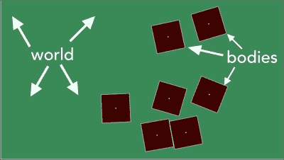
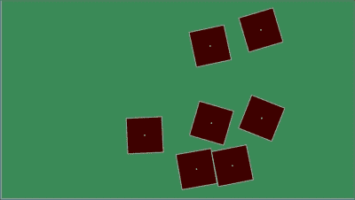

# 第三章。专注于物理

本章是为那些想要将物理融入游戏中的您而准备的。无论您是在构建一个使用逼真墙壁弹跳的迷你高尔夫游戏，还是一个具有无尽重力的平台游戏，本章都是为您准备的。它将提供有关游戏物理方面的教程，并展示如何在没有重力的情况下使用物理引擎。

在本章中，我们将涵盖以下主题：

+   Chipmunk 的工作原理

+   设置项目和创建基本对象

+   通过倾斜设备设置重力

+   在 Chipmunk 中处理碰撞

### 注意

您必须仅使用 Chipmunk 进行碰撞检测（而不是物理）。并非所有游戏都需要（或甚至应该考虑使用）物理引擎。有时，最好将其排除在外。然而，如果您觉得您的游戏将更加精致或生产速度更快，那么请务必使用它。话虽如此，本书中的项目将不需要物理引擎。因此，我们不会在这里遵循项目，而是将创建一个小项目，其中包含许多模块化示例，这些示例可以适应您的其他项目。本书的主要项目将在下一章继续。

您可能已经习惯了使用 Box2D 物理引擎，但自从 Cocos2d 的 3.0 版本以来，开发者不再提供任何支持，使得 Box2D 无法像之前版本那样直接工作。话虽如此，本章将专注于 Chipmunk。如果本章没有涵盖您在物理方面的所有需求，请随时查看[`chipmunk-physics.net/documentation.php`](http://chipmunk-physics.net/documentation.php)的文档。它还提供了各种在线教程。

# 学习 Chipmunk 的工作原理

如前所述，Chipmunk 是与 Cocos2d 集成的物理引擎，并且是从 3.0 版本开始的主要物理引擎。对于新人和 Box2D 的粉丝来说，好消息是 Chipmunk 非常易于使用。让我们来看看 Chipmunk 基本上是如何工作的。

## Chipmunk 的整体结构

Chipmunk 是 Cocos2d 中的一个物理引擎，它模拟现实世界的物理，即利用重力、碰撞、物体相互弹跳等。

Chipmunk 使用“世界中的物体”的方式来处理事情。这意味着，如图所示，有一个物理模拟正在进行（称为**世界**），并且任何适用于物理的物体都是一个**物体**。您只需创建一个世界，它将在其中的物体上模拟物理，然后就可以开始了。您创建的每个世界都将有自己的重力附加到它。

这是对世界中物体的简单表示。请注意，整个绿色矩形是世界，而单个正方形是其中的物体。



每个物体都有一个类型（下一节将解释）以及密度、质量、摩擦、弹性、速度等属性。在 Cocos2d 中，你可以用一行代码将物理体附加到精灵上，精灵将移动到身体所在的位置。

当这些物体的边界相互接触/相交时，就发生了碰撞。当发生碰撞时，你可以按自己的意愿处理它。

## 物体的类型

Chipmunk 有三种类型的物理体可以添加到世界中。它们是静态的、动态的和运动的：

+   **静态体**：这些是墙壁、地面、不可移动的岩石和游戏中的其他物体。它们不会受到任何重力或其他试图与之交互的力的作用。

+   **动态体**：创建 `CCPhysicsBody` 对象时的默认设置。这些是会四处飞溅、与其他物体碰撞并受到力作用的物体。

+   **运动学体**：这是一种混合体类型，不能受到力或重力的作用，但仍然可以通过 `CCActions` 和其他方法移动。

通常，你只会使用静态和动态体（本章也是如此）。如果你觉得需要更多关于运动学体类型的帮助，请查看 Cocos2d 关于物理体的文档，网址为 [`www.cocos2d-swift.org/docs/api/Constants/CCPhysicsBodyType.html`](http://www.cocos2d-swift.org/docs/api/Constants/CCPhysicsBodyType.html)。

现在你已经从技术角度了解了 Chipmunk 的工作原理，让我们实际开始编码，以便我们可以亲自看到这些物理体。

# 设置项目和创建基本对象

Chipmunk 物理引擎在 Cocos2d 库中集成得相当好。它可以在 SpriteBuilder 中工作，也可以在 Cocos2d 中以编程方式工作。与本书的其余部分一样，我们将专注于使用代码创建项目，并且只使用 SpriteBuilder 作为项目创建的工具。因此，在 SpriteBuilder 中创建一个新的项目并发布它。如果你忘记了如何做，请随时回到第一章中参考项目创建。

## 为使用物理设置 Cocos2d

首先，我们需要打下基础，以便我们可以开始使用它进行编码，因为发布的 SpriteBuilder 项目使用的是 SpriteBuilder 文件，而不是实际的编码场景。类似于上一章，打开 `AppDelegate.m` 并在文件顶部添加以下代码行：

```swift
#import "MainScene.h"
```

然后，在 `AppDelegate.m` 文件的 `startScene` 方法中，用以下代码替换已经存在的那一行代码：

```swift
return [MainScene scene];
```

在此基础上，打开 `MainScene.h` 并添加代码，使你的文件看起来像这样（确保将 `CCNode` 继承改为 `CCScene`，否则一些后续的方法将无法工作）：

```swift
@interface MainScene : CCScene {
  CGSize winSize;
}
+(CCScene*)scene;
@end
```

最后，打开 `MainScene.m` 并在 `@implementation` 和 `@end` 行之间添加以下代码块：

```swift
+(CCScene*)scene
{
  return [[self alloc] init];
}

-(id)init
{
  if ((self=[super init]))
  {
    winSize = [[CCDirector sharedDirector] viewSize];

    //these values range 0 to 1.0, so use float to get ratio
    CCNode *background = [CCNodeColor nodeWithColor:[CCColor colorWithRed:58/255.f green:138/255.f blue:88/255.f]];
    [self addChild:background];
  }
  return self;
}
```

如果你在此时运行项目（在任何模拟器或设备上），你会看到一个全屏的绿色屏幕。如果没有，请返回并确保你已按照指示复制了所有代码。如果你看到了绿色，那么你已经准备好进入下一部分。

## 为物理存在构建一个世界

Cocos2d 只是一个图形引擎，我们需要创建一个 Chipmunk 物理模拟环境，以便我们可以使用这个库。这听起来比实际情况要复杂得多。基本上，我们创建一个 `CCPhysicsNode` 对象，然后把我们的小精灵和节点添加到这个对象中，而不是 `self`。

### 小贴士

记住，`self` 是对当前对象的引用。在过去，我们使用 `[self addChild:]` 将对象添加到屏幕上，但使用 `CCPhysicsNode` 对象，我们将使用 `[`world addChild:]` 来添加对象，因为 `world` 将是我们 `CCPhysicsNode` 对象的名称。

因此，打开 `MainScene.h` 文件，并在 `winSize` 声明下方添加对 world 变量的声明：

```swift
CCPhysicsNode *world;
```

然后打开 `MainScene.m` 文件，并在 `init` 方法中背景创建之后添加以下代码块：

```swift
//create the physics simulation world
world = [CCPhysicsNode node];
world.debugDraw = YES;
world.gravity = ccp(0, -300);
[self addChild:world];
```

就这样！前面的代码将创建一个允许物理模拟的物理世界。我们接下来需要做的是创建一些 `CCNode` 对象，将这些物理体添加到 `CCNode` 对象中，然后将 `CCNode` 对象添加到物理世界中（而不是 `self`）。

### 小贴士

**下载示例代码**

你可以从你在 [`www.packtpub.com`](http://www.packtpub.com) 的账户下载示例代码文件，以获取你购买的所有 Packt Publishing 书籍。如果你在其他地方购买了这本书，你可以访问 [`www.packtpub.com/support`](http://www.packtpub.com/support) 并注册，以便将文件直接通过电子邮件发送给你。

将 `debugDraw` 设置为 `YES` 确保每次我们将任何物理体附加到 `CCNode` 对象并添加到世界中时，我们都会在我们的对象上绘制该体的轮廓。因此，我们将确切知道每个体的位置以及它是如何碰撞的。通常，当 `debugDraw` 未开启时，我们不会看到这些形状。

无论你是否开启了 `debugDraw`，碰撞效果都会相同。主要目的是调试项目，确保物理体被添加并按照预期进行碰撞。

## 启用触摸创建我们的对象

现在我们需要在屏幕上放置一些想要相互碰撞的对象。我们不是通过编程生成对象，而是让对象在用户触摸屏幕的任何位置生成。

因此，打开 `MainScene.m` 文件，并在 `init` 方法中的任何位置添加以下代码行。这将允许你从用户那里获取任何触摸数据：

```swift
[self setUserInteractionEnabled:YES];
```

然后，在`init`方法下方，我们添加这个方法，这样我们就可以在我们的场景中开始接收触摸。这个方法（如前一章所示）将捕获任何触摸事件，我们想要捕获触摸的位置，以便我们可以相应地定位对象。然后我们将在触摸位置生成一个黑色方块：

```swift
-(void)touchBegan:(CCTouch *)touch withEvent:(CCTouchEvent *)event
{
  CGPoint touchPos = [touch locationInNode:self];
  //create a black square
  CGFloat width = winSize.width * 0.1f;
  CCNode *square = [CCNodeColor nodeWithColor:[CCColor colorWithRed:0 
  green:0 blue:0] width:width height:width];
  square.position = touchPos;
  square.anchorPoint = ccp(0.5f,0.5f);
  [world addChild:square];
}
```

这将创建一个占屏幕宽度的 10%的节点并将其添加到`world`对象中。我们将它添加到`world`而不是`self`，因为我们添加物理体到方块时，希望模拟处理对象的运动。我们需要设置节点的`anchorPoint`，因为默认情况下，`CCNode`的锚点在(0,0)。

如果你此时运行游戏，你会看到相同的绿色屏幕。当你触摸屏幕时，黑色方块会在触摸位置出现。

然而，你会注意到，尽管我们已经将它们添加到世界对象中，但它们并没有按照我们设置的引力下落，它们也没有相互碰撞和推动。我们接下来要做的就是创建一个`CCPhysicsBody`对象，并将其分配给创建的方块，以便物理模拟可以正确处理运动。

### 小贴士

如果你还不确定`CCPhysicsBody`究竟是什么，它本质上是一个具有形状或周界的对象，这定义了对象可以与哪些其他对象发生碰撞。`CCPhysicsBody`还具有其他属性，如弹性、恢复系数、密度等，并且最好将其附加到`CCNode`对象上，以便节点可以由物理体处理其运动。

## 使物体下落——添加 CCPhysicsBody

在`MainScene.m`文件中，将以下代码添加到`touchBegan`方法的底部。这将添加我们想要的物理体到方块中：

```swift
//add a physics body to the black square
CCPhysicsBody *squareBody = [CCPhysicsBody bodyWithRect:CGRectMake(0, 0, width, width) cornerRadius:0];
squareBody.elasticity = 0.5f;
square.physicsBody = squareBody;
```

在这里放置好代码后，当你运行游戏时，你会注意到物体不仅开始下落，而且还有之前提到的调试方块。注意，我们不需要声明为**动态**的物理体类型，因为这是默认设置。还要注意**弹性**（你可能还记得，这是弹跳性），设置为 0.5。这是为了确保方块不会到处弹跳。如果我们想要这样，我们会将弹性设置为更高的数字，比如 1.0。

但是哦不！方块就像无底洞一样从屏幕上掉落。让我们来修复这个问题。

## 添加地面和墙壁

创建地面对象很容易，但由于墙壁和天花板基本上是同一件事，让我们定义一个方法，它将接受`CGRect`并为我们创建一个具有这些尺寸的静态、不可见节点。

因此，在`MainScene.m`的任何地方，添加以下方法：

```swift
-(void)addWallWithRect:(CGRect)rect
{
  CCPhysicsBody *wallBody = [CCPhysicsBody bodyWithRect:rect cornerRadius:0];
  wallBody.type = CCPhysicsBodyTypeStatic;
  wallBody.elasticity = .5f;

  CCNode *wall = [CCNode node];
  wall.physicsBody = wallBody;
  [world addChild:wall];
}
```

这段代码与方块的代码非常相似，除了一个明显的区别：物理体的类型。我们将其设置为`static`，因为我们不希望重力影响它，也不希望方块以任何方向推动地面。

仅因为我们声明了一个方法，并不意味着它会自动为我们生成墙壁。所以，去你的`init`方法中，添加以下代码块来在设备的边缘添加墙壁：

```swift
/***** Add Ground, Walls, and Ceiling *****/

//ground
[self addWallWithRect:CGRectMake(0, 0, winSize.width, 1)];

//left wall
[self addWallWithRect:CGRectMake(0, 0, 1, winSize.height)];

//right wall
[self addWallWithRect:CGRectMake(winSize.width, 0, 1, winSize.height)];

//ceiling
[self addWallWithRect:CGRectMake(0, winSize.height, winSize.width, 1)];
```

这段代码在定位方面相当直观。每个 Cocos2d 场景的左下角是(0,0)，`CGRectMake`函数接受*x*和*y*坐标，然后是矩形的宽度和高度。

这就是创建一个具有一些物理作用的简单对象的所有内容！请随意调整一些变量，如弹性、重力等。

### 小贴士

到目前为止，如果你注意到你的物体在屏幕上移动时似乎有些滞后——即使 Xcode 显示游戏正在以 60 FPS 运行——请在`AppDelegate.m`中的`startScene`方法顶部添加以下行代码：

```swift
[CCDirector sharedDirector].fixedUpdateInterval = 1.0f/120.f;
```

# 通过倾斜设备设置重力

当你的用户倾斜设备时，设备的加速度计会在最轻微、最微小的值上捕捉到这些信息。这对希望在游戏中使用加速度计（或倾斜）的人来说是有益的，尤其是在移动角色或操纵重力方面，这是我们将在本节中讨论的内容。

自从 iOS 5.0 以来，UIAccelerometer 已被 Core Motion 框架数据所取代。幸运的是，它并不复杂，让我们开始吧。

### 小贴士

如果你不是注册的开发者，无法使用实际设备进行测试（并且一直在模拟器上这样做），请注意，除非数据可以发送到模拟器，否则无法使用模拟器测试加速度计。这里有一个在这种情况下可能有用的链接：[`www.vimov.com/isimulate/`](http://www.vimov.com/isimulate/)。

然而，即使默认情况下你无法在模拟器上测试加速度计，它仍然会在任何设备上按预期工作，所以如果你计划在你的游戏中包含加速度计，请随意继续操作。

## 设置加速度计

打开`MainScene.h`并导入 Core Motion 框架：

```swift
#import <CoreMotion/CoreMotion.h>
```

然后为名为`CMMotionManager`的东西添加一个变量。此对象将计算加速度计数据，我们可以在需要时收集这些数据。在`world`变量下添加以下行代码：

```swift
CMMotionManager *motionManager;
```

现在打开`MainScene.m`，在任何`init`方法的位置，添加以下代码块，以便我们刚刚声明的运动管理器开始获取加速度计的数据：

```swift
//60 times per second, in theory once per frame
CGFloat interval = 1/60.f; 
motionManager = [[CMMotionManager alloc] init];
motionManager.accelerometerUpdateInterval = interval;
[motionManager startAccelerometerUpdates];
```

目前，如果你运行游戏，你不会注意到它在玩法或任何调试信息上的任何变化。尽管运动管理器已初始化并且正在获取数据，但我们必须设置一个收集数据的方法，以便我们可以对它进行操作。

## 读取数据

在你的`MainScene.m`的`init`方法中，初始化运动管理器后，添加以下行代码。它将在给定的间隔（每秒 60 次）运行指定的方法：

```swift
[self schedule:@selector(getAccelerometerData:) interval:interval];
```

然后，在`MainScene.m`中的任何地方，我们添加我们想要在指定间隔被调用的方法，这样我们就可以读取加速度计数据：

```swift
-(void)getAccelerometerData:(CCTime)delta
{
NSLog(@"%f\t%f\t%f", 
motionManager.accelerometerData.acceleration.x, motionManager.accelerometerData.acceleration.y, motionManager.accelerometerData.acceleration.z);
}
```

现在，如果你运行游戏，你将在 Xcode 的控制台输出中看到大量信息。如果数字在你倾斜设备时发生变化，这意味着一切正常。太好了！如果不这样，请返回并确保你正确添加了所有内容。

接下来，我们将根据设备在任何给定时刻的旋转设置游戏的重力。

## 随心所欲地操纵重力

而不是每次都输入那么长的文本行，让我们创建一个具有相关名称的方法并传递加速度计数据。换句话说，将你的`getAccelerometerData`方法修改如下，并添加这个新方法，它将根据加速度计的数据设置物理世界的重力：

```swift
-(void)getAccelerometerData:(CCTime)delta
{
  //NSLog(@"%f\t%f\t%f", motionManager.accelerometerData.acceleration.x, motionManager.accelerometerData.acceleration.y, motionManager.accelerometerData.acceleration.z);
  [self setGravityFromAcceleration: motionManager.accelerometerData.acceleration];
}

-(void)setGravityFromAcceleration:(CMAcceleration)accel
{
  CGFloat xGravity = 500 * accel.y;
  CGFloat yGravity = -500 * accel.x;
  world.gravity = ccp(xGravity, yGravity);
}
```

现在，如果你运行游戏并生成几个方块，你会看到它们漂浮、下落、侧滑，或者以 iOS 设备感知的“下”的任何方向移动。你可能看到的截图如下：



从现在开始，你可以随意关闭调试绘制，也许可以玩一下设置的重力大小，或者甚至改变重力影响的轴。

你可能会注意到一个方块在墙上停止移动，然后当你旋转设备时也不移动；这是因为物体的身体处于休眠状态。这样做是为了帮助节省没有活跃碰撞和作用力的物体在 CPU 处理时间和能量。

然而，如果你需要它们持续移动，请将以下代码行添加到你的`init`方法中：

```swift
world.sleepTimeThreshold = 100000; //100,000 seconds, or about 27 hours
```

默认情况下为 0.5 秒，并且当方块停止与墙壁相对移动时会发生休眠。将其设置为相对较大的值，例如 100,000，将确保它们永远不会停止移动（即，除非方块在这段时间内保持静止，但阈值越高，这种情况发生的可能性就越小）。

# 在 Chipmunk 中处理碰撞

在使用 Chipmunk（在 Cocos2d 中几乎做任何事情）时处理碰撞相对容易。这就是为什么许多开发者使用 Cocos2d。为了做到这一点，我们需要执行几个不同的步骤，以便 Cocos2d 能够正确检测和处理我们的碰撞。

## 设置碰撞代理

代理模式是处理由一个类发送给其任何潜在父类的消息的常见方式。例如，如果你想使用`UITableView`（这是`UIKit`中的标准表格），你必须将表格视图的代理设置为你要添加到其中的类，这样当表格视图尝试刷新表格中的数据时，它就知道要调用哪个类的哪些方法。

话虽如此，我们需要告诉`MainScene`它将成为我们的碰撞处理程序的代理，所以打开`MainScene.h`并将`CCPhysicsCollisionDelegate`添加到`@interface`行。这将允许`CCPhysicsNode`对象在我们的`MainScene`类上设置碰撞检测事件：

```swift
@interface MainScene : CCScene <CCPhysicsCollisionDelegate>
```

然后打开`MainScene.m`，在`init`方法中，将`world`对象的碰撞代理设置为`self`，如下所示：

```swift
world.collisionDelegate = self;
```

回想一下，`world`是我们的`CCPhysicsNode`对象，所以在这个世界（或模拟）中发生的任何碰撞检测事件都需要发送到某个地方进行处理。我们将它设置为`self`，因为`self`指的是当前的`MainScene`实例（我们正在运行的场景）。最后，这有助于我们确定哪些对象与哪些对象相撞。如果没有这一行代码，我们就无法在代码中看到两个对象何时相撞，更不用说知道它们实际上是哪些对象了。

虽然如果你现在运行游戏这不会直接做任何事情，但它正确地设置了你的物理模拟，以便能够检测和处理碰撞。

## 设置游戏对象的碰撞标签

在我们可以创建检测碰撞的方法之前，我们需要指定哪些对象将相互碰撞。现在，我们只考虑正方形与其他正方形之间的碰撞。

因此，在`MainScene.m`文件的`touchBegan`方法中添加以下代码行，以便碰撞检测代理知道哪个对象正在相撞：

```swift
squareBody.collisionType = @"square";
```

你可以用任何物理体做这件事，但就目前而言，这是我们唯一的对象。有了这个设置，让我们添加代码来检测两个正方形之间的实际碰撞。

## 检测碰撞

Chipmunk 在 Cocos2d 中处理碰撞的方式是通过检测所有碰撞并向每个碰撞类型相应的函数发送方法调用。因此，既然我们要检测两个正方形的碰撞，两个参数都必须命名为 square。否则，方法将无法正确调用。参数变量的实际名称（`firstSquare`和`secondSquare`）对于检测来说并不重要。

因此，在`MainScene.m`中的任何地方，添加以下方法：

```swift
-(BOOL)ccPhysicsCollisionBegin:(CCPhysicsCollisionPair *)pair square:(CCNode *)firstSquare square:(CCNode *)secondSquare
{
  NSLog(@"squares collided!");
  return YES;
}
```

如果你现在运行游戏，你应该会看到每次一个正方形与另一个正方形碰撞时，`squares collided!`文本被打印到控制台输出。如果看不到，请返回并确保你正确添加了所有内容。从现在开始，当两个对象碰撞时，你可以做任何你想做的事情，因为你已经有了两个对象的指针以及它们的类型。

作为另一个例子，假设我们想要检测正方形与墙壁之间的碰撞；这非常简单。首先，在`addWallWithRect`方法中将`wall`作为`collisionType`添加到身体中：

```swift
wallBody.collisionType = @"wall";
```

然后，添加检测正方形-墙壁碰撞的方法（注意在之前添加的`collisionBegan`方法中参数名称的变化）：

```swift
-(BOOL)ccPhysicsCollisionBegin:(CCPhysicsCollisionPair *)pair square:(CCNode *)nodeA wall:(CCNode *)nodeB
{
  NSLog(@"square-wall collision!");
  return YES;
}
```

如果你现在运行游戏并生成一个方块，一旦它碰到墙壁，你应该会看到输出被打印出来。这就是检测碰撞的全部！只需设置 `collisionDelegate` 属性，设置 `collisionType` 属性，并添加碰撞方法。

如果你想检测对象上的碰撞，但不想它们与其他对象弹跳？在 Chipmunk 中，你可以做到这一点。

# 仅使用 Chipmunk 进行碰撞检测

### 小贴士

这里有一个重要的注意事项：如果你只是要检测以下之一，你不需要使用物理引擎进行碰撞检测，而是使用列出的方法：

+   对于相交的矩形，请使用 `CGRectIntersectsRect`

+   对于矩形内部的点，请使用 `CGRectContainsPoint`

+   对于半径/距离交集，请使用 `ccpDistance`

如果你将检测非矩形和非圆形对象的碰撞，请继续阅读。

有时候，你所做的只是将对象发送到屏幕上，或者用你自定义的动作旋转它们，你只想知道两个对象何时碰撞，但不想有整个物理引擎带来的弹跳、推动和碰撞。幸运的是，我们可以在 Chipmunk 中做到这一点。

## 将物理体转换为传感器

在 Chipmunk 中，传感器基本上是可以检测碰撞但穿过其他物体的物体。当你在屏幕上有区域或部分触发某些事件，但实际上不造成任何基于物理的交互时，这些很有用。

例如，如果你正在使用物理引擎制作一个俯视迷你高尔夫游戏，并且想要包含斜坡，最好的方法是将斜坡设置为传感器。当球和斜坡碰撞时，设置重力在某个方向。

要将一个物体设置为传感器，只需将 `sensor` 变量设置为 true，如下所示：

```swift
[squareBody setSensor:YES];
```

如果你现在运行游戏，你会注意到方块直接穿过彼此，以及穿过地板。

就这样！你所需要的就是碰撞处理（在上一节中），以及将传感器变量设置为 true。任何作为传感器的物理体都会触发碰撞检测事件，但不会引起任何移动或改变其他物体。

# 摘要

在本章中，你学习了如何创建物理模拟，向模拟中添加物体，使用加速度计设置世界的重力，处理碰撞，甚至仅使用模拟进行碰撞检测。

当涉及到真正复杂的物理引擎机制，如绳索、关节和枢轴时，[`www.cocos2d-swift.org/docs/api/index.html`](http://www.cocos2d-swift.org/docs/api/index.html) 上的 Cocos2d 文档解释了很多。在撰写本书时，关于此类复杂机制的可用的教程非常少（如果有的话）。

在下一章中，你将学习关于 Cocos2d 中的声音以及你可以在引擎中为声音效果做的酷炫事情。
