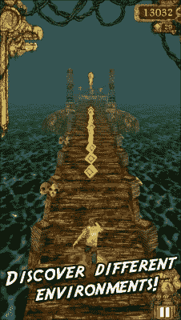

# 第五章 创建酷炫内容

在本章中，你将学习如何实现真正复杂、微妙的游戏机制，这是许多开发者不会做的。这就是好游戏与伟大游戏之间的区别。本章将包含许多示例、教程和代码片段，旨在适应你自己的项目，所以随时欢迎回来查看你可能第一次错过或只是好奇的内容。

在本章中，我们将涵盖以下主题：

+   添加分数表格

+   为单位添加细微的滑动

+   在贝塞尔曲线上创建运动而不是直线路径

+   通过设备倾斜实现深度感知（以及视差滚动）

+   创建单位流线或幽灵的三种方法

+   触屏控制与 D-pad 适配（以及为什么了解这种区别如此重要）

+   本章的一个常见主题将向您展示如何将看似复杂的事物转化为易于编码和修改的段，您可以将它们实现到自己的项目中（或项目中）。

此外，本章介绍了一些与本书项目不兼容的内容，并且前述列表中的前两点与游戏项目相关，该项目一直缓慢地进行。其余的都是独立的示例项目，代码以模块化方式设计，以便你可以更快地将它们提取到自己的项目中。

### 小贴士

强烈建议在处理前两个部分之前打开第五章的代码。自上一章以来，已经添加和/或修改了大量代码，并且本书没有提及。因此，如果你不使用第五章的项目代码而跟随本书，可能会遇到编译错误。感谢您的理解！

# 添加分数表格

因为我们要提供一个方式让用户看到他们的过去高分，在`GameOver`场景中，我们将添加一个表格来显示保存的最新高分。为此，我们将使用`CCTableView`。它仍然相对较新，但对我们将要使用它是适用的。

## CCTableView 与 UITableView 的比较

虽然对于之前制作过非 Cocos2d 应用的你们来说，`UITableView`可能已经熟知，但在 Cocos2d 中使用时，你应该意识到它的缺点。例如，如果你想在表格中使用 BMFont，你不能添加`LabelBMFont`（你可以尝试将 BMFont 转换为 TTF 字体并在表格中使用，但这超出了本书的范围）。

如果你仍然希望使用`UITableView`对象（或任何`UIKit`元素），你可以像平常一样创建对象，并将其添加到场景中，如下所示（`tblScores`是`UITableView`对象的名称）：

```swift
[[[CCDirector sharedDirector] view] addSubview:tblScores];
```

## 保存高分（NSUserDefaults）

在我们显示任何高分之前，我们必须确保保存它们。最简单的方法是利用苹果内置的数据保存工具—NSUserDefaults。如果你以前从未使用过它，让我告诉你，它基本上是一个具有“保存”机制的字典，它将值存储在设备上，以便下次用户加载设备时，这些值可用于应用程序。

另外，因为我们正在跟踪每个游戏玩法中的三个不同值，所以我们只说一个游戏的总分高于另一个游戏时，总分更高。

因此，让我们创建一个`saveHighScore`方法，该方法将遍历我们保存列表中的所有总分，并查看当前的总分是否高于任何已保存的分数。如果是这样，它将插入自己并将其余的向下移动。在`MainScene.m`中添加以下方法：

```swift
-(NSInteger)saveHighScore
{
  //save top 20 scores

  //an array of Dictionaries...
  //keys in each dictionary:
  //  [DictTotalScore]
  //  [DictTurnsSurvived]
  //  [DictUnitsKilled]

//read the array of high scores saved on the user's device
  NSMutableArray *arrScores = [[[NSUserDefaults standardUserDefaults] arrayForKey:DataHighScores] mutableCopy];

//sentinel value of -1 (in other words, if a high score was not found on this play through)
  NSInteger index = -1;
//loop through the scores in the array
  for (NSDictionary *dictHighScore in arrScores)
  {
//if the current game's total score is greater than the score stored in the current index of the array...
    if (numTotalScore > [dictHighScore[DictTotalScore] integerValue])
    {
//then store that index and break out of the loop
      index = [arrScores indexOfObject:dictHighScore];
      break;
    }
  }

//if a new high score was found
  if (index > -1)
  {
//create a dictionary to store the score, turns survived, and units killed
    NSDictionary *newHighScore = @{ DictTotalScore : @(numTotalScore),
    DictTurnsSurvived : @(numTurnSurvived),
    DictUnitsKilled : @(numUnitsKilled) };

//then insert that dictionary into the array of high scores
    [arrScores insertObject:newHighScore atIndex:index];

//remove the very last object in the high score list (in other words, limit the number of scores)
    [arrScores removeLastObject];

//then save the array
    [[NSUserDefaults standardUserDefaults] setObject:arrScores forKey:DataHighScores];
    [[NSUserDefaults standardUserDefaults] synchronize];
  }

//finally return the index of the high score (whether it's -1 or an actual value within the array)
  return index;
}
```

最后，在过渡到下一个场景之前，在`endGame`方法中调用此方法：

```swift
-(void)endGame
{
  //call the method here to save the high score, then grab the index of the high score within the array
  NSInteger hsIndex = [self saveHighScore];

  NSDictionary *scoreData = @{ DictTotalScore : @(numTotalScore),
  DictTurnsSurvived : @(numTurnSurvived),
  DictUnitsKilled : @(numUnitsKilled),
  DictHighScoreIndex : @(hsIndex)};

  [[CCDirector sharedDirector] replaceScene:[GameOverScene sceneWithScoreData:scoreData]];

}
```

现在我们已经保存了高分，让我们创建一个表格来显示它们。

## 创建表格

设置`CCTableView`对象非常简单。我们只需要修改`contentSize`对象，然后添加一些处理每个单元格大小和内容的方法。

因此，首先打开`GameOverScene.h`文件，并将场景设置为`CCTableView`的数据源：

```swift
@interface GameOverScene : CCScene <CCTableViewDataSource>
```

然后，在`initWithScoreData`方法中，创建标题标签以及初始化`CCTableView`：

```swift
//get the high score array from the user's device
arrScores = [[NSUserDefaults standardUserDefaults] arrayForKey:DataHighScores];

//create labels
CCLabelBMFont *lblTableTotalScore = [CCLabelBMFont labelWithString:@"Total Score:" fntFile:@"bmFont.fnt"];

CCLabelBMFont *lblTableUnitsKilled = [CCLabelBMFont labelWithString:@"Units Killed:" fntFile:@"bmFont.fnt"];

CCLabelBMFont *lblTableTurnsSurvived = [CCLabelBMFont labelWithString:@"Turns Survived:" fntFile:@"bmFont.fnt"];

//position the labels
lblTableTotalScore.position = ccp(winSize.width * 0.5, winSize.height * 0.85);
lblTableUnitsKilled.position = ccp(winSize.width * 0.675, winSize.height * 0.85);
lblTableTurnsSurvived.position = ccp(winSize.width * 0.875, winSize.height * 0.85);

//add the labels to the scene
[self addChild:lblTableTurnsSurvived];
[self addChild:lblTableTotalScore];
[self addChild:lblTableUnitsKilled];

//create the tableview and add it to the scene
CCTableView * tblScores = [CCTableView node];
tblScores.contentSize = CGSizeMake(0.6, 0.4);
CGFloat ratioX = (1.0 - tblScores.contentSize.width) * 0.75;
CGFloat ratioY = (1.0 - tblScores.contentSize.height) / 2;
tblScores.position = ccp(winSize.width * ratioX, winSize.height * ratioY);
tblScores.dataSource = self;
tblScores.block = ^(CCTableView *table){
    //if the press a cell, do something here.
    //NSLog(@"Cell %ld", (long)table.selectedRow);
};
[self addChild: tblScores]; 
```

当`CCTableView`对象的数据源设置为`self`时，我们可以添加三个方法，这些方法将确定我们的表格外观以及每个单元格（即行）中的数据。

### 注意

注意，如果我们没有设置数据源，表格视图的方法将不会被调用；如果我们将其设置为除`self`之外的其他任何内容，方法将调用该对象/类。

话虽如此，添加以下三个方法：

```swift
-(CCTableViewCell*)tableView:(CCTableView *)tableView nodeForRowAtIndex:(NSUInteger)index
{
  CCTableViewCell* cell = [CCTableViewCell node];

  cell.contentSizeType = CCSizeTypeMake(CCSizeUnitNormalized, CCSizeUnitPoints);
  cell.contentSize = CGSizeMake(1, 40);

  // Color every other row differently
  CCNodeColor* bg;
  if (index % 2 != 0) bg = [CCNodeColor nodeWithColor:[CCColor colorWithRed:0 green:0 blue:0 alpha:0.3]];
  else bg = [CCNodeColor nodeWithColor: [CCColor colorWithRed:0 green:0 blue:0 alpha:0.2]];

  bg.userInteractionEnabled = NO;
  bg.contentSizeType = CCSizeTypeNormalized;
  bg.contentSize = CGSizeMake(1, 1);
  [cell addChild:bg];
  return cell;
}

-(NSUInteger)tableViewNumberOfRows:(CCTableView *)tableView
{
  return [arrScores count];
}

-(float)tableView:(CCTableView *)tableView heightForRowAtIndex:(NSUInteger)index
{
  return 40.f;
}
```

第一个方法，`tableView:nodeForRowAtIndex:`，将根据索引格式化每个单元格。目前，我们将用两种不同的颜色之一来着色每个单元格。

第二个方法，`tableViewNumberOfRows:`，返回表格视图中将有的行数或单元格数。既然我们知道将有 20 个，我们可以技术上输入 20，但如果我们决定稍后更改这个数字怎么办？所以，让我们继续使用数组的计数。

第三种方法，`tableView:heightForRowAtIndex:`，是用来返回给定索引处的行或单元格的高度。由于我们对于任何特定的单元格都没有做任何不同的事情，我们可以将这个值硬编码为一个相当合理的 40 像素高度。

到目前为止，你应该能够运行游戏，当你失败时，你会被带到游戏结束屏幕，顶部有标签，屏幕右侧有一个可以滚动的表格。

### 小贴士

学习 Cocos2d 时，一个好的实践就是随意尝试一些东西，看看你能创造出什么样的效果。例如，你可以尝试使用一些`ScaleTo`动作将文本从 0 缩放，或者使用`MoveTo`动作从底部或侧面滑动它。

随意看看你现在是否能想出一个酷炫的方式来显示文本。

既然我们已经有了表格，让我们来看看如何显示数据，好吗？

## 显示得分

现在我们已经创建了表格，只需简单地将数据添加到我们的代码中，就可以正确地显示数字。

在`nodeForRowAtIndex`方法中，在给单元格添加背景色之后，添加以下代码块：

```swift
//Create the 4 labels that will be used within the cell (row). 
CCLabelBMFont *lblScoreNumber = [CCLabelBMFont labelWithString:[NSString stringWithFormat:@"%d)", index+1] fntFile:@"bmFont.fnt"];
//Set the anchor point to the middle-right (default middle-middle)
lblScoreNumber.anchorPoint = ccp(1,0.5);

CCLabelBMFont *lblTotalScore = [CCLabelBMFont labelWithString:[NSString stringWithFormat:@"%d", [arrScores[index][DictTotalScore] integerValue]] fntFile:@"bmFont.fnt"];

CCLabelBMFont *lblUnitsKilled = [CCLabelBMFont labelWithString:[NSString stringWithFormat:@"%d", [arrScores[index][DictUnitsKilled] integerValue]] fntFile:@"bmFont.fnt"];

CCLabelBMFont *lblTurnsSurvived = [CCLabelBMFont labelWithString:[NSString stringWithFormat:@"%d", [arrScores[index][DictTurnsSurvived] integerValue]] fntFile:@"bmFont.fnt"];

//set the position type of each label to normalized (where (0,0) is the bottom left of its parent and (1,1) is the top right of its parent)
lblScoreNumber.positionType = lblTotalScore.positionType = lblUnitsKilled.positionType = lblTurnsSurvived.positionType = CCPositionTypeNormalized;

//position all of the labels within the cell
lblScoreNumber.position = ccp(0.15,0.5);
lblTotalScore.position = ccp(0.35,0.5);
lblUnitsKilled.position = ccp(0.6,0.5);
lblTurnsSurvived.position = ccp(0.9,0.5);

//if the index we're iterating through is the same index as our High Score index...
if (index == highScoreIndex)
{
//then set the color of all the labels to a golden color
    lblScoreNumber.color =
    lblTotalScore.color =
    lblUnitsKilled.color =
    lblTurnsSurvived.color = [CCColor colorWithRed:1 green:183/255.f blue:0];
}

//add all of the labels to the individual cell
[cell addChild:lblScoreNumber];
[cell addChild:lblTurnsSurvived];
[cell addChild:lblTotalScore];
[cell addChild:lblUnitsKilled];
```

就这样！当你玩游戏并最终到达游戏结束屏幕时，你会看到高分正在显示（甚至包括之前的尝试得分，因为它们已经被保存了，记得吗？）。注意那个黄色的最高分。这是一个指示，表明你刚刚玩的游戏得分已经出现在排行榜上，并显示了它的位置。

虽然当滚动时`CCTableView`中东西消失和重新出现可能会感觉有点奇怪，但我们将在下一章中介绍如何使它变得更好。现在，让我们来一些*Threes!*——像滑动进入我们的游戏。

### 小贴士

如果你正在考虑将`CCTableView`添加到自己的项目中，这里的关键要点是确保你正确地修改`contentSize`和位置。默认情况下，`contentSize`是一个归一化的`CGSize`，范围从 0 到 1，锚点是（0,0）。

此外，确保你执行以下两个步骤：

+   设置表格视图的数据源

+   添加三个表格视图方法

考虑到所有这些，实现`CCTableView`应该相对简单。

# 为单元添加微妙的滑动效果

如果你曾经玩过*Threes!*（或者即使你没有，也可以看看[`asherv.com/threes/`](http://asherv.com/threes/)上的预告片，甚至可以在你的手机上下载游戏），你就会知道当用户开始移动但尚未完成移动时，会有滑动功能。随着拖动手指的速度，单元会向它们将要移动的方向滑动，向用户显示每个单元将去哪里以及每个单元将如何与其他单元结合。

这很有用，因为它不仅增加了额外的“酷炫因素”，还如果用户想在做出决定之前撤销并做出不同的、更谨慎的移动，它还提供了对未来的预览。

### 小贴士

这里有一个小贴士：如果你想让你的游戏真正流行起来，你必须让用户相信他们输是因为自己的错误，而不是你的“愚蠢的游戏机制”（正如一些玩家可能会说的）。

想想*愤怒的小鸟*，*Smash Hit*，*Crossy Road*，*Threes!*，*Tiny Wings*…这个列表可以一直继续，更多流行的游戏都有一个共同的主题：当用户失败时，完全取决于他们自己决定赢或输，并且他们做出了错误的移动。

这种看不见的机制促使玩家带着更好的策略再次玩游戏。这正是我们希望用户在做出动作之前看到他们的动作的原因。这对开发者和玩家来说都是双赢的局面。

## 滑动一个单位

如果我们可以让一个单位滑动，那么我们当然可以通过简单地遍历它们、模块化代码或某种其他形式的泛化来让其他单位也滑动。

话虽如此，我们需要设置`Unit`类，使其能够检测手指拖动的距离。这样，我们可以确定单位移动的距离。所以，打开`Unit.h`并添加以下变量。它将跟踪从上一个触摸位置的距离：

```swift
@property (nonatomic, assign) CGPoint previousTouchPos;
```

然后，在`Unit.m`的`touchMoved`方法中，向`previousTouchPos`添加以下赋值。它将前一个触摸位置设置为触摸下落位置，但前提是距离大于 20 个单位：

```swift
if (!self.isBeingDragged && ccpDistance(touchPos, self.touchDownPos) > 20)
{
  self.isBeingDragged = YES;
  //add it here:
  self.previousTouchPos = self.touchDownPos;
```

一旦设置好，我们就可以在手指拖动时开始计算距离。为此，我们将进行一个简单的检查。在`touchMoved`的末尾，在初始`if`块之后添加以下代码块：

```swift
//only if the unit is currently being dragged
if (self.isBeingDragged)
{
    CGFloat dist = 0;
    //if the direction the unit is being dragged is either UP or DOWN
    if (self.dragDirection == DirUp || self.dragDirection == DirDown)
    //then subtract the current touch position's Y-value from the previously-recorded Y-value to determine the distance to move
      dist = touchPos.y - self.previousTouchPos.y;
      //else if the direction the unit is being dragged is either LEFT or RIGHT
    else if (self.dragDirection == DirLeft || 
        self.dragDirection == DirRight)
        //then subtract the current touch position's Y-value from the previously-recorded Y-value to determine the distance to move
      dist = touchPos.x - self.previousTouchPos.x; 

//then assign the touch position for the next iteration of touchMoved to work properly
self.previousTouchPos = touchPos;

}
```

在末尾对`previousTouchPos`的赋值将确保，当单位被拖动时，我们继续更新触摸位置，以便我们可以确定距离。此外，距离仅在单位被拖动的方向上计算（上下用 Y 表示，左右用 X 表示）。

现在我们已经计算了手指拖动的距离，让我们将其推入一个函数，该函数将根据单位被拖动的方向移动我们的单位。所以，在你计算出上一段代码块中的`dist`之后，调用以下方法来根据拖动的量移动我们的单位：

```swift
dist /= 2; //optional
[self slideUnitWithDistance:dist withDragDirection:self.dragDirection];
```

### 小贴士

将距离除以`2`是可选的。你可能认为方块太小，希望用户能看到他们的方块。所以请注意，除以`2`或更大的数字意味着，每当手指移动 1 点，单位就会移动 1/2（或更少）点。

那个方法调用准备好了，我们需要实现它，所以现在添加以下方法体。由于这个方法相当复杂，我们将分部分添加：

```swift
-(void)slideUnitWithDistance:(CGFloat)dist withDragDirection:(enum UnitDirection)dir
{
}
```

我们需要做的第一件事是设置一个变量来计算单位的新的*x*和*y*位置。我们将称这些为`newX`和`newY`，并将它们设置为单位的当前位置：

```swift
CGFloat newX = self.position.x, newY = self.position.y;
```

接下来，我们想要获取单位开始的位置，即单位如果位于其当前网格坐标的位置。为此，我们将从`MainScene`调用`getPositionForGridCoordinate`方法（因为位置计算已经在那里进行，我们不妨使用那个函数）：

```swift
CGPoint originalPos = [MainScene getPositionForGridCoord:self.gridPos];
```

接下来，我们将根据单位被拖动的方向移动`newX`或`newY`。现在，让我们先添加向上方向：

```swift
if (self.dragDirection == DirUp)
{
    newY += dist;
    if (newY > originalPos.y + self.gridWidth)
      newY = originalPos.y + self.gridWidth;
    else if (newY < originalPos.y)
      newY = originalPos.y;
}
```

在这个 if 块中，我们首先将距离添加到`newY`变量中（因为我们向上移动，所以我们添加到 Y 而不是 X）。然后，我们想确保位置最多向上移动 1 个方块。我们将使用`gridWidth`（这实际上是方块的宽度，在`initCommon`方法中分配）。此外，我们还需要确保如果他们把方块移回原始位置，它不会进入下面的方块。

因此，让我们添加其余的方向作为 else if 语句：

```swift
else if (self.dragDirection == DirDown)
{
    newY += dist;
    if (newY < originalPos.y - self.gridWidth)
      newY = originalPos.y - self.gridWidth;
    else if (newY > originalPos.y)
      newY = originalPos.y;
}
else if (self.dragDirection == DirLeft)
{
    newX += dist;
    if (newX < originalPos.x - self.gridWidth)
      newX = originalPos.x - self.gridWidth;
    else if (newX > originalPos.x)
      newX = originalPos.x;
}
else if (self.dragDirection == DirRight)
{
    newX += dist;
    if (newX > originalPos.x + self.gridWidth)
      newX = originalPos.x + self.gridWidth;
    else if (newX < originalPos.x)
      newX = originalPos.x;
}
```

最后，我们将根据新计算出的*x*和*y*位置设置单元的位置：

```swift
self.position = ccp(newX, newY);
```

在这个阶段运行游戏应该会导致你拖动的单元随着你的手指滑动。不错，对吧？因为我们有一个移动一个单元的函数，我们可以很容易地修改它，以便每个单元都可以这样移动。

但首先，你可能已经注意到了一段时间前（或者可能只是最近），那就是单元移动只有在将手指移回原始触摸位置时才会取消。因为我们正在拖动单元本身，所以我们可以通过将单元拖回起始位置来“取消”移动。然而，手指可能处于完全不同的位置，所以我们需要修改确定取消移动的方式。

要做到这一点，请在`Unit.m`的`touchEnded`方法中找到这个 if 语句：

```swift
if (ccpDistance(touchPos, self.touchDownPos) > self.boundingBox.size.width/2)
```

将其更改为以下内容，这将确定单元的距离，而不是手指的距离：

```swift
CGPoint oldSelfPos = [MainScene getPositionForGridCoord:self.gridPos];

CGFloat dist = ccpDistance(oldSelfPos, self.position);
if (dist > self.gridWidth/2)
```

是的，这意味着如果你收到那个警告并且希望消除它，你不再需要在`touchEnded`中需要`touchPos`变量。但对于滑动 1 个单元来说，这就足够了。现在我们准备好滑动所有单元，让我们开始吧！

## 滑动所有单元

现在我们有了正在滑动的拖动单元，让我们继续并使所有单元滑动（甚至包括敌方单元，这样我们可以更好地预测我军部队的移动）。

首先，我们需要一种方法来移动屏幕上的所有单元。然而，由于单元类只包含有关单个单元的信息（这是好事），我们需要在`MainScene`中调用一个方法，因为那里有单元数组。

此外，我们不能简单地调用`[MainScene method]`，因为数组是实例变量，而实例变量必须通过对象本身的实例来访问。

话虽如此，因为我们知道我们的单元将作为子单元添加到场景中，所以我们可以利用 Cocos2d 的优势，并通过父参数在`MainScene`类上调用一个实例方法。因此，在`Unit.m`的`touchMoved`中，进行以下更改：

```swift
[(MainScene*)self.parent slideAllUnitsWithDistance:dist withDragDirection:self.dragDirection];
//[self slideUnitWithDistance:dist withDragDirection:self.dragDirection];
```

基本上，我们已经注释掉了（或者删除了）这里的老方法调用，而是调用我们的父对象（我们将它转换为`MainScene`，这样我们知道它有哪些函数）。

但我们还没有创建那个方法，所以请在`MainScene.h`中添加以下方法声明：

```swift
-(void)slideAllUnitsWithDistance:(CGFloat)dist withDragDirection:(enum UnitDirection)dir;
```

### 提示

顺便说一下，你可能没有注意到，枚举 `UnitDirection` 在 `Unit.h` 中声明，这就是为什么 `MainScene.h` 导入 `Unit.h` 的原因——这样我们就可以在这个类中使用该枚举，并具体化该函数。

然后在 `MainScene.m` 中，我们将遍历友方和敌方数组，并对每个单独的单位调用 `slideUnitWithDistance` 函数：

```swift
-(void)slideAllUnitsWithDistance:(CGFloat)dist withDragDirection:(enum UnitDirection)dir
{
  for (Unit *u in arrFriendlies)
    [u slideUnitWithDistance:dist withDragDirection:dir];

  for (Unit *u in arrEnemies)
    [u slideUnitWithDistance:dist withDragDirection:dir];
}
```

然而，这仍然不起作用，因为我们还没有在 `Unit` 类的头部文件中声明该函数。所以现在就去声明它。在 `Unit.h` 中声明函数头：

```swift
-(void)slideUnitWithDistance:(CGFloat)dist withDragDirection:(enum UnitDirection)dir;
```

我们几乎完成了。

我们最初设置 `slideUnitWithDistance` 方法时考虑了拖动方向。然而，只有当前被拖动的单位会有拖动方向。其他所有单位都需要使用它们当前面对的方向（即它们已经移动的方向）。

要做到这一点，我们只需要修改 `slideUnitWithDistance` 方法进行检查以确定如何修改距离的方向。

但首先，我们需要处理负值。这意味着什么？好吧，如果你正在将单位向左拖动，而要移动的单位应该向左移动，它将正常工作，因为 x-10（例如）仍然小于网格的宽度。然而，如果你向左拖动，而要移动的单位应该向右移动，它将根本不会移动，因为它试图添加一个负值 x `-10`，但由于它需要向右移动，它将立即遇到左边界（小于原始位置），并保持静止。

以下图表应该有助于解释“处理负值”的含义。如图所示，在上部区域，当非拖动单位应该向左移动 `10`（换句话说，*x* 方向的负 10）时，它起作用。但当非拖动单位移动的方向相反（换句话说，*x* 方向的正 `10`）时，它不起作用。


为了处理这个问题，我们设置了一个相当复杂的 `if` 语句。它检查拖动方向和单位自己的方向是否相反（正与负），并将距离乘以 `-1`（翻转）。

将以下内容添加到 `slideUnitWithDistance` 方法的顶部，在你获取 `newX` 和原始位置之后：

```swift
-(void)slideUnitWithDistance:(CGFloat)dist withDragDirection:(enum UnitDirection)dir
{
  CGFloat newX = self.position.x, newY = self.position.y;
  CGPoint originalPos = [MainScene getPositionForGridCoord:self.gridPos];

if (!self.isBeingDragged && 

(((self.direction == DirUp || self.direction == DirRight) && 
(dir == DirDown || dir == DirLeft)) ||

((self.direction == DirDown || self.direction == DirLeft) && 
(dir == DirUp || dir == DirRight))))
{
    dist *= -1;
}
}
```

这个 `if` 语句的逻辑如下：

假设单位没有被拖动。此外，假设方向是正的而阻力方向是负的，或者方向是负的而阻力方向是正的。然后乘以 `-1`。

最后，如前所述，我们只需要处理非拖动单位。因此，在每一个 `if` 语句中，添加一个“或”部分，以检查相同方向，但只有当单位当前没有被拖动时。换句话说，在 `slideUnitWithDistance` 方法中，修改你的 `if` 语句，使其看起来像这样：

```swift
if (self.dragDirection == DirUp || (!self.isBeingDragged && self.direction == DirUp))
{}
else if (self.dragDirection == DirDown || (!self.isBeingDragged && self.direction == DirDown))
{}
else if (self.dragDirection == DirLeft || (!self.isBeingDragged && self.direction == DirLeft))
{}
else if (self.dragDirection == DirRight || (!self.isBeingDragged && self.direction == DirRight))
{}
```

最后，我们可以运行游戏。砰！所有单位都随着我们的拖动在屏幕上滑行。这不是很棒吗？现在玩家可以更好地选择他们的移动。

这就是滑动部分（以及这个项目章节的部分）的全部内容。本章的其余部分充满了真正令人惊叹的东西，鼓励你查看它们，因为它们可能对你在这本书之外的项目或你自己的未来项目有所帮助。

### 小贴士

单位滑动的关键是循环遍历数组，以确保所有单位移动的距离相等，因此传递给 `move` 函数的距离。

# 在贝塞尔曲线上创建运动

如果你不知道贝塞尔曲线是什么，它基本上是一条从点 A 到点 B 经过曲线的线。它不是一条由两个点组成的直线，而是使用第二组点，即控制点，以平滑的方式弯曲线条。当你想在 Cocos2d 中应用带有动画的运动时，按顺序排队一大堆 `MoveTo` 动作是非常诱人的。然而，如果你使用更平滑的贝塞尔曲线动画，游戏和代码看起来会更好。

这里有一个贝塞尔曲线的例子看起来是什么样子的：


如你所见，红线从点 P0 到 P3。然而，这条线受到控制点 P1 和 P2 方向的影响。

## 使用贝塞尔曲线的例子

让我们列出一些使用贝塞尔曲线而不是常规的 `MoveTo` 或 `MoveBy` 动作的好例子：

+   一个将执行跳跃动画的角色，例如，在 *超级马里奥兄弟* 中

+   玩家投掷的回旋镖作为武器

+   发射导弹或火箭并给它一个抛物线曲线

+   一个指示用户必须用手指绘制曲线路径的教程手

+   在半管道坡道上的滑板运动员（如果不是用 Chipmunk 完成）

显然，还有很多其他例子可以使用贝塞尔曲线来模拟它们的运动。但让我们实际编写一个，怎么样？

## 样本项目 – 贝塞尔地图路线

首先，为了使事情变得更快——因为这个不是本书项目的部分——只需从代码仓库或网站下载项目。

如果你打开项目并在你的设备或模拟器上运行它，你会注意到一个蓝色屏幕和位于左下角的正方形。如果你在屏幕上的任何地方点击，你会看到蓝色的正方形形成一个 **M** 形状，结束在右下角。如果你保持手指，它会重复。再次点击，动画将重置。

想象这个正方形走过的路径是在地图上，并指示玩家将如何使用他们的角色进行路线。这是一条非常粗糙、非常尖锐的路径。通常，路径是弯曲的，所以让我们做一个弯曲的路径吧！

这是最终结果（使用本章“三种制作单位流或‘幽灵’”部分中描述的 `CCMotionStreak` 方法跟踪）。

这里是一张显示蓝色正方形非常直的路径的截图：


以下截图显示了黄色正方形的贝塞尔路径：


## 曲线 M 形状

打开 `MainScene.h` 并添加另一个 `CCNodeColor` 变量，命名为 `unitBezier`：

```swift
CCNodeColor *unitBezier;
```

然后打开 `MainScene.m` 并在初始化方法中添加以下代码，以便你的黄色方块出现在屏幕上：

```swift
unitBezier = [[CCNodeColor alloc] initWithColor:[CCColor colorWithRed:1 green:1 blue:0] width:50 height:50];
[self addChild:unitBezier];
CCNodeColor *shadow2 = [[CCNodeColor alloc] initWithColor:[CCColor blackColor] width:50 height:50];
shadow2.anchorPoint = ccp(0.5,0.5);
shadow2.position = ccp(26,24);
shadow2.opacity = 0.5;
[unitBezier addChild:shadow2 z:-1];
```

然后，在 `sendFirstUnit` 方法中，添加重置黄色方块位置的代码行，并将该方法排队以移动黄色方块：

```swift
-(void)sendFirstUnit
{
  unitRegular.position = ccp(0,0);

  //Add these 2 lines
  unitBezier.position = ccp(0,0);
  [self scheduleOnce:@selector(sendSecondUnit) delay:2];

  CCActionMoveTo *move1 = [CCActionMoveTo actionWithDuration:0.5 position:ccp(winSize.width/4, winSize.height * 0.75)];
  CCActionMoveTo *move2 = [CCActionMoveTo actionWithDuration:0.5 position:ccp(winSize.width/2, winSize.height/4)];
  CCActionMoveTo *move3 = [CCActionMoveTo actionWithDuration:0.5 position:ccp(winSize.width*3/4, winSize.height * 0.75)];
  CCActionMoveTo *move4 = [CCActionMoveTo actionWithDuration:0.5 position:ccp(winSize.width - 50, 0)];

  [unitRegular runAction:[CCActionSequence actions:move1, move2, move3, move4, nil]];
}
```

在此之后，你需要实际创建 `sendSecondUnit` 方法，如下所示：

```swift
-(void)sendSecondUnit
{
  ccBezierConfig bezConfig1;
  bezConfig1.controlPoint_1 = ccp(0, winSize.height);
  bezConfig1.controlPoint_2 = ccp(winSize.width*3/8, winSize.height);
  bezConfig1.endPosition = ccp(winSize.width*3/8, winSize.height/2);
  CCActionBezierTo *bez1 = [CCActionBezierTo actionWithDuration:1.0 bezier:bezConfig1];

  ccBezierConfig bezConfig2;
  bezConfig2.controlPoint_1 = ccp(winSize.width*3/8, 0);
  bezConfig2.controlPoint_2 = ccp(winSize.width*5/8, 0);
  bezConfig2.endPosition = ccp(winSize.width*5/8, winSize.height/2);
  CCActionBezierBy *bez2 = [CCActionBezierTo actionWithDuration:1.0 bezier:bezConfig2];

  ccBezierConfig bezConfig3;
  bezConfig3.controlPoint_1 = ccp(winSize.width*5/8, winSize.height);
  bezConfig3.controlPoint_2 = ccp(winSize.width, winSize.height);
  bezConfig3.endPosition = ccp(winSize.width - 50, 0);
  CCActionBezierTo *bez3 = [CCActionBezierTo actionWithDuration:1.0 bezier:bezConfig3];

  [unitBezier runAction:[CCActionSequence actions:bez1, bez2, 
bez3, nil]];
}
```

前面的方法创建了三个贝塞尔配置，并将它们附加到一个带有贝塞尔配置的 `MoveTo` 命令。这样做的原因是每个贝塞尔配置只能接受两个控制点。正如你在标记的截图中所见，每个白色和红色方块代表一个控制点，你只能使用单个贝塞尔配置制作 U 形抛物线。

因此，要制作三个 U 形，你需要三个贝塞尔配置。


最后，确保在 `touchBegan` 方法中，使 `unitBezier` 停止所有动作（即，在重置时停止）：

```swift
[unitBezier stopAllActions];
```

就这样！当你运行项目并点击屏幕（或点击并保持）时，你会看到蓝色正方形的 M 形状穿过，随后是黄色正方形的波浪形 M 形状。

### 小贴士

如果你想要将贝塞尔 `MoveTo` 或 `MoveBy` 动作适应到你的项目中，你应该知道你可以使用每个贝塞尔配置创建一个 U 形。它们相当容易实现，并且可以快速复制粘贴，如 `sendSecondUnit` 函数所示。

此外，由于控制点和终点位置只是 `CGPoint` 值，它们可以是相对的（即，相对于单元的当前位置、世界位置或敌人的位置），并且作为一个常规的 `CCAction`，它们可以很容易地与任何 `CCNode` 对象一起运行。

# 通过设备倾斜实现深度感知

一种可以在不真正改变游戏的情况下提高游戏酷炫程度的方法是，当用户倾斜设备时产生一种深度感知的感觉。这在 *Shadowmatic* 和 *Jump! Chump!* 游戏中、*Wunderlist* 清单中，或者将 **Perspective Zoom** 设置为 **开启** 的锁屏背景图片中都可以看到。虽然这很微妙，但它可以使你的游戏感觉更加精致，并增加用户参与度，因为它只是他们发现游戏酷或有趣的一个额外因素。

### 小贴士

作为提醒，你无法在模拟器中使用设备的倾斜/加速度计。这必须在物理设备上完成。

这里是菜单上看到的 *Shadowmatic* 游戏倾斜效果。正如你所见，它是一个三维物体，相机围绕物体旋转，以及阴影。

第一个如下所示：


第二个如下所示：


以下是在 *Jump! Chump!* 游戏中看到的倾斜效果，你可以看到主要角色和敌人的影子被移动。

第一个如下所示：


第二个如下所示：


## 这不是视差滚动吗？

这与之前类似，但略有不同。视差滚动——如果你不熟悉的话——是指有多个背景层，每个层以不同的速度在屏幕上移动，从而产生更真实运动的感觉。Cocos2d 还有一个叫做 `CCParallaxNode` 的功能，它基本上允许节点子代之间有不同的相对移动速度。例如，假设你添加了一个背景图像、一个中间图像和一个前景图像，它们有不同的比例。当你移动 `CCParallaxNode` 对象时，它将自动根据每个子代设置的比率移动子代。

视差滚动类似，因为仍然会有多个层在移动，并且它们将根据设备的倾斜在某个方向上稍微移动。因此，用户会感觉到有物体（例如按钮）实际上在其他物体（例如背景中的草地）之前。

让我们开始实现一些简单的深度感知效果。

## 示例项目 – 深度

从代码仓库下载 `Depth` 示例项目并运行项目。你会注意到有一些背景山脉、草地和几个按钮，它们并没有指向任何地方。我们将改变这一点，让按钮在屏幕周围移动，以增加一些深度感。

## 创建视差节点并添加对象

在 `MainScene.h` 文件中，添加此处列出的变量，并导入 CoreMotion 框架：

```swift
#import <CoreMotion/CoreMotion.h>
@interface MainScene : CCNode
{
  CGSize winSize;

  //add these
  CCParallaxNode *parallax;
  CMMotionManager *motionManager;
  CGFloat xFiltered, yFiltered ;yFiltered
}
```

`CCParallaxNode` 很明显。`motionManager` 用于跟踪加速度计数据，而 `xFiltered` 和 `yFiltered` 将用作加速度计的过滤器，以防止它变得过于抖动。

现在，在 `MainScene.m` 的 `init` 方法中，注释掉添加 `layoutbox` 到场景的行。添加初始化视差节点、将 `layoutbox` 添加到其中以及将视差节点添加到场景中的代码：

```swift
//[self addChild:layout];

parallax = [CCParallaxNode node];
//Ratio: For every 1 pixel moved, move the child that amount
parallax.position = ccp(winSize.width/2, winSize.height/2);
[parallax addChild:layout z:0 parallaxRatio:ccp(1,1) positionOffset:ccp(0,0)];
[self addChild:parallax];
```

如果你想知道比例参数是什么，它就像注释中说的那样：对于每个移动的视差对象像素，它将移动子代相同数量的像素。例如，如果视差节点向左移动了 100 像素，并且如果子代的比例为 0.5，子代将向左移动 50 像素。这说得通吗？所以，对于我们的按钮，我们希望比例是 1:1。这意味着，对于每个视差节点移动的像素，按钮将以相同的数量移动。

现在运行项目并不会做任何事情，但是，让我们开始获取加速度计数据，这样我们就可以通过倾斜设备来切换菜单按钮。

## 可视化深度

在`MainScene.m`的`init`方法中，添加以下代码块，这将设置运动管理器以便开始收集加速度计数据：

```swift
//60 times per second. In theory once per frame
CGFloat interval = 1/60.f; 
motionManager = [[CMMotionManager alloc] init];
motionManager.accelerometerUpdateInterval = interval;
[motionManager startAccelerometerUpdates];
[self schedule:@selector(getAccelerometerData:) interval:interval]; 
```

为了让加速度计影响视差节点的位置，我们必须创建`getAccelerometerData`方法，并在那里修改位置：

```swift
-(void)getAccelerometerData:(CCTime)delta
{
  CMAcceleration accel = motionManager.accelerometerData.acceleration;

  CGFloat filterValue  = 0.8f;

  xFiltered = filterValue * xFiltered + (1.0 - filterValue) * accel.x;
  yFiltered = filterValue * yFiltered + (1.0 - filterValue) * accel.y;

  parallax.position = ccp(winSize.width/2 + 50 * yFiltered, winSize.height/2 - 50 * xFiltered);
}
```

此方法基本上每秒读取 60 次加速度计数据，将其通过一个过滤器（如果你想更平稳的运动，增加 K 值，我们在前面的代码中将其称为`filterValue`，最大值为 1），并根据过滤后的*x*和*y*值分配视差的位置。

### 小贴士

如果这是你自己在项目中想要实现的所有效果，那么请在这里停止。如果你在自己的项目中使用这个功能，需要注意的关键点是视差节点根据给定的比例影响每个子节点的位置。此外，如果你使用倾斜机制，确保对加速度计数据进行过滤，否则它将会非常抖动，实际上会损害你的游戏而不是帮助它。

接下来，我们将平衡视差节点，这样按钮就不会总是被推上去或偏到一边。

## 恢复平衡（校准到新的旋转）

在用户调整他们的手机到新的位置后，你希望慢慢地将他们的平衡调整到他们持握设备的方式。例如，如果他们开始时将设备平放在桌子上，然后倾斜它大约 45 度朝向自己，你需要相应地移动项目。然后你需要慢慢地使 45 度的位置看起来与它平放时一样。

这很容易做到，只要我们有一个变量来保存平衡值。要做到这一点，打开`MainScene.h`并添加以下代码：

```swift
CGFloat avgXValue, avgYValue;
```

这两个值将存储最后记录的 100 个`xFiltered`和`yFiltered`值的平均值。

然后在`MainScene.m`中，修改`getAccelerometerData`方法中的三个相关行，使其看起来像这里所示：

```swift
avgXValue = (avgXValue * 99 + xFiltered)/100.f;
avgYValue = (avgYValue * 99 + yFiltered)/100.f;

parallax.position = ccp(winSize.width/2 + 50 * (yFiltered - avgYValue), winSize.height/2 - 50 * (xFiltered - avgXValue));
```

起初，数学可能没有意义，让我们来了解一下。

首先，`avgXValue`和`avgYValue`通过逐个点缓慢地添加到平均值中，以估计的方式计算平均值。这并不是在真正的“平均值”意义上的 100%准确，但它足够接近。这样做也稍微好一些，因为它意味着更少的代码、更少的内存和更快的执行速度。由于我们每秒做 60 次这样的操作，因此获得一个准确的平均值并不完全重要。几秒钟内，你将获得足够多的点，足以接近真实值。

第二，`xFiltered`/`xFiltered`和`avgYValue`/`avgXValue`的减法是为了慢慢将其带回中心。例如，如果你的`yFiltered`值是`-1`，而`avgYValue`是`0`，它将迅速跳到新的位置。但如果设备在`-1`处保持足够长的时间，`avgYValue`将非常接近`-1`，减去这两个变量将得到一个归零的位置，这正是我们想要的。

### 小贴士

如果你正在自己的项目中实现校准效果，这里需要注意的关键是减去两个值。无论你使用单值校准还是伪平均值（就像这里使用的），如果你不减去过滤后的*x*和*y*值，你将看不到任何变化。

对于慢速校准，前面提到的方法是可行的。如果你想实现即时校准（例如，当用户说的时候通过按钮重新对齐），只需在按钮按下时存储单个加速度计值，而不是存储平均值。

## 一个快速滚动的示例

由于我们正在讨论视差滚动，让我们快速回顾一下视差滚动的简单示例，正如它被设计的那样。在`MainScene.m`（或头文件；实际上并不重要），导入`GameScene.h`文件：

```swift
#import "GameScene.h" 
```

然后，在`buttonPressed`方法中，添加以下代码行。它将进入游戏场景：

```swift
[[CCDirector sharedDirector] replaceScene:[GameScene scene]];
```

现在让我们将`CCParallaxNode`添加到`GameScene.h`中：

```swift
@interface GameScene : CCScene
{
  CGSize winSize;

  //add this:
  CCParallaxNode *parallax;
}
```

然后，在`GameScene.m`文件的`init`方法中，设置视差节点并添加一些精灵到节点中：

```swift
CCSprite *bg1 = [CCSprite spriteWithImageNamed:@"mountains.png"];
CCSprite *bg2 = [CCSprite spriteWithImageNamed:@"mountains.png"];

CCSprite *mg1 = [CCSprite spriteWithImageNamed:@"midground.png"];
CCSprite *mg2 = [CCSprite spriteWithImageNamed:@"midground.png"];

CCSprite *fg1 = [CCSprite spriteWithImageNamed:@"foreground.png"];
CCSprite *fg2 = [CCSprite spriteWithImageNamed:@"foreground.png"];
fg1.anchorPoint = fg2.anchorPoint = ccp(0.5,0);

CCSprite *sun = [CCSprite spriteWithImageNamed:@"sun.png"];

parallax = [CCParallaxNode node];
parallax.anchorPoint = ccp(0,0);
parallax.position = ccp(0,0);

[parallax addChild:bg1 z:0 parallaxRatio:ccp(0.35,0) positionOffset:ccp(winSize.width/2, winSize.height/2)];

[parallax addChild:bg2 z:0 parallaxRatio:ccp(0.35,0) positionOffset:ccp(winSize.width/2 + winSize.width - 2,winSize.height/2)];

[parallax addChild:sun z:1 parallaxRatio:ccp(0.5,0) positionOffset:ccp(winSize.width, winSize.height * 0.8)];

[parallax addChild:mg1 z:1 parallaxRatio:ccp(0.5,0) positionOffset:ccp(winSize.width/2, winSize.height/2)];
[parallax addChild:mg2 z:1 parallaxRatio:ccp(0.5,0) positionOffset:ccp(winSize.width/2 + winSize.width, winSize.height/2)];

[parallax addChild:fg1 z:2 parallaxRatio:ccp(1,0) positionOffset:ccp(winSize.width/2, 0)];
[parallax addChild:fg2 z:2 parallaxRatio:ccp(1,0) positionOffset:ccp(winSize.width/2 + winSize.width, 0)];

[self addChild:parallax];
```

如果你正在想`positionOffset`的作用，它会在应用任何视差比例之前将节点移动到作为参数给出的位置。这在首次设置场景时很有用（就像我们现在正在做的那样）。

然后，我们想要启用触摸，所以我们向`init`方法中添加这一行：

```swift
[self setUserInteractionEnabled:YES];
```

但首先，我们需要创建一个变量来保存手指之前的位置，这样我们才知道要移动视差节点多远。因此，在`GameScene.h`中添加以下内容：

```swift
CGPoint previousPosition;
```

最后，添加`touchBegan`和`touchMoved`方法，以便视差节点根据`touchMoved`的距离移动，同时确保滚动永远不会超出边界：

```swift
-(void)touchBegan:(CCTouch *)touch withEvent:(CCTouchEvent *)event
{
  previousPosition = [touch locationInNode:self];
}

-(void)touchMoved:(CCTouch *)touch withEvent:(CCTouchEvent *)event
{
  CGPoint newPosition = [touch locationInNode:self];

  parallax.position = ccp(parallax.position.x + (newPosition.x - previousPosition.x), 0);

  if (parallax.position.x < -winSize.width)
    parallax.position = ccp(-winSize.width,0);
  if (parallax.position.x > 0)
    parallax.position = ccp(0,0);

  previousPosition = newPosition;
}
```

从这里开始，你可以运行项目，当你点击**播放**时，你将被带到游戏场景，现在它有一个（相当粗糙的）背景、中景和前景元素集合。当你用手指在屏幕上滑动时，你会注意到草地以相同的速度滚动，而山脉、树木和太阳则以不同的速度滚动。

### 小贴士

如果你正在自己的项目中实现视差滚动背景，需要注意添加对象之间的比例差异。一旦这个问题解决，你只需要根据手指拖动、角色移动或其他操作移动视差节点。

# 制作单元流线或“幽灵”的三种方法

如果你曾经玩过像 *Fruit Ninja*、*Blek*、*Jetpack Joyride* 或 *Tiny Wings* 这样的游戏，你肯定见过这种效果。屏幕上有一个位置会生成类似星星、划痕效果、烟雾云或跟随手指的线条。

## 样本项目 – 鬼魂

前往代码仓库，在 `Sample Projects` 文件夹下打开 `Ghosts` 项目。如果你运行它，你会看到只有三个作为按钮的标签，它们引导到主要是空白的屏幕，实际上并没有做什么。这就是你发挥作用的地方。

在这里，你将学习如何制作你刚刚阅读的效果。制作类似效果通常有三种方法。让我们逐一介绍每种方法，从最简单的开始，到最复杂的结束。

## 方法 1 – 粒子系统

粒子系统基本上是大量创建的精灵，例如烟花效果、喷泉或闪烁的蜡烛。使用粒子系统与你自己创建精灵之间的区别在于，粒子系统通常只允许移动、缩放、旋转和颜色变化。但对于像烟雾云这样的简单效果，粒子系统就足够了。

### 小贴士

如果你希望为这个样例项目或你自己的任何项目创建自己的粒子，如第一章中提到的，*刷新你的 Cocos2d 知识*，粒子设计师是这个目的的绝佳工具。你可以在代码中手动创建它们，但使用像粒子设计师这样的编辑器可视化创建它们要容易得多，也更高效。

在 Xcode 中打开 `Ghosts` 项目，打开 `ParticleExampleScene.h` 文件，并将 `CCParticleSystem` 变量添加到列表中：

```swift
CCParticleSystem *smokeParticle;
```

然后打开 `ParticleExampleScene.m` 文件，并在 init 方法中将粒子系统添加到屏幕上：

```swift
smokeParticle = [CCParticleSystem 
  particleWithFile:@"SmokeParticle.plist"];
[self addChild:smokeParticle];
```

之前代码中使用的粒子系统是在本书开头提到的粒子设计师中创建的。它使用一个简单的云形状图像，并设置了某些属性以创建淡出效果。

最后，在 `updateParticleSource` 方法中，设置粒子系统的源位置，这样当你用手指在屏幕上拖动时，烟雾会从不同的位置开始：

```swift
smokeParticle.sourcePosition = startPosition;
```

如果你现在运行项目，你会看到烟雾会不断生成，即使你移开了手指。虽然这对这个样例项目来说意义不大，但想象一下，你可能只想在用户处于空中或执行连击动作时显示粒子。换句话说，我们需要一种方法来根据需要停止和启动粒子流（在这种情况下，当用户放置或移除手指时）。

虽然 Cocos2d 没有开始粒子系统的方法，但添加这样的方法非常简单。所以，查找 `stopSystem` 的项目。在 `CCParticleSystemBase.h` 文件（应该是搜索结果中的第一个）中，在 `stopSystem` 声明之上添加以下代码：

```swift
-(void)startSystem;
```

然后，在 `CCParticleSystemBase.m` 文件（搜索结果中的下一个）中添加此方法，以便你可以按需启动粒子系统：

```swift
-(void)startSystem
{
  _active = YES;
  _elapsed = _duration;
  _emitCounter = 0;
}
```

现在回到 `ParticleExampleScene.m` 文件，在 `init` 方法中，在你将烟雾粒子添加到场景之后，调用 `stopSystem` 方法，这样当场景首次启动时，它就不会出现在屏幕上了：

```swift
[smokeParticle stopSystem];
```

将 `stopSystem` 方法添加到 `touchEnded` 方法中，以便粒子系统停止产生新的粒子，并让旧的粒子消亡：

```swift
-(void)touchEnded:(CCTouch *)touch withEvent:(CCTouchEvent *)event
{
	isStreaming = NO;
	[smokeParticle stopSystem];
}
```

最后，在 `touchBegan` 方法中调用新创建的 `startSystem` 方法，以便当手指在屏幕上时，粒子开始流动：

```swift
[smokeParticle startSystem];
```

在这个阶段运行项目将允许你看到已经创建的粒子系统的启动和停止。

### 小贴士

你可能想知道如何将此代码适应到自己的项目中。一旦粒子系统被添加到屏幕上，基本上就是一个更新粒子系统源位置的问题，使用“起始位置”。例如，你可以有一个火箭在屏幕上飞行，火箭的位置就是起始位置。

现在，让我们继续到一个外观非常相似但需要更多代码的风格，这允许对游戏的整体外观进行更大的操作。

## 方法 2 – 精灵或节点

虽然创建粒子系统需要的代码较少，但当你自己创建精灵并处理其所有事件时，你可以做更多的事情。例如，你可以让精灵改变颜色几次，设置疯狂的运动模式，完全更换图像，或者应用粒子系统无法做到的其他 `CCAction` 动作。

### 小贴士

粒子系统无法做到的一件事是震动机制。你可以通过排队一系列 `CCMove` 动作来实现这一点，这些动作将按照你想要的方向进行（通常，任何方向不超过几个点），并使用一个变量来设置持续时间，这样你就可以根据情况增加或减少速度。

在 Xcode 中打开 `Ghosts` 项目后，打开 `SpriteExampleScene.m` 文件，并将以下代码块添加到 `spawnStreamer` 方法中：

```swift
CCSprite *heart = [CCSprite spriteWithImageNamed:@"heart.png"];
heart.color = [CCColor redColor];
heart.position = startPosition;
[self addChild:heart];

CCActionScaleTo *shrink = [CCActionScaleTo actionWithDuration:0.5 scale:0];
CCActionCallBlock *block = [CCActionCallBlock actionWithBlock:^{
  [self removeChild:heart];
}];

[heart runAction:[CCActionSequence actions:shrink, block, nil]];
```

此代码将产生一个红色的心形（图像是白色的，但我们将其染成了红色），在半秒内将其缩小到 `0` 的比例，然后将其从场景中移除，这样在运行一段时间后就不会产生延迟。

如果你运行项目并在屏幕上拖动手指，你会看到一些美丽的心形以流畅的方式被创建出来。就这样！之所以提到你可能需要使用更多的代码，是因为你想要在流线（鬼魂、幻影或 whatever）上做更多的事情，那么你需要更多的代码来实现你想要的效果。

例如，如果你想使精灵沿着贝塞尔曲线移动，旋转 360 度，然后缩小并消失，同时变成绿色心形。代码看起来可能像这样：

```swift
CCSprite *heart = [CCSprite spriteWithImageNamed:@"heart.png"];
heart.color = [CCColor redColor];
heart.position = startPosition;
[self addChild:heart];

CCActionTintTo *tint = [CCActionTintTo actionWithDuration:0.5 color:[CCColor greenColor]];

ccBézierConfig bezConfig;
bezConfig.controlPoint_1 = ccp(0,100);
bezConfig.controlPoint_2 = ccp(100,100);
bezConfig.endPosition = ccp(100,0);
CCActionBézierTo *move = [CCActionBézierBy actionWithDuration:0.5 Bézier:bezConfig];

CCActionRotateBy *rotate = [CCActionRotateBy actionWithDuration:0.5 angle:360];

CCActionScaleTo *shrink = [CCActionScaleTo actionWithDuration:0.5 scale:0];
CCActionCallBlock *remove = [CCActionCallBlock actionWithBlock:^{
  [self removeChild:heart];
}];

[heart runAction:tint];
[heart runAction:[CCActionSequence actions:move, rotate, shrink, remove, nil]];
```

### 小贴士

如果你希望在项目中实现类似的功能，关键要求是 `isStreaming` 布尔值和在更新方法中的检查。其他一切都是直截了当且非常类似于改变 `startPosition` 的粒子方法。

最后，让我们来处理所有方法中最独特的方法——即 *Fruit Ninja* 和 *Blek* 都实现过的恒定线条。

## 方法 3 – 恒定线条

恒定线条是流线最先进的版本。它实际上不是一个粒子，因此不能作为精灵创建。相反，我们将使用 `CCMotionStreak` 来创建划痕效果。`CCMotionStreak` 的实现非常简单，因为它只需要一个位置、一个图像和一个颜色。

在 Xcode 中打开 `Ghosts` 项目，打开 `ConstantLineExampleScene.h` 并将一个 `CCMotionStreak` 对象添加到列表中：

```swift
{
  CGSize winSize;
  CGPoint startPosition;

  CCMotionStreak *streak;
}
```

然后，在 `ConstantLineExampleScene.m` 中，创建轨迹并将其添加到场景的 `init` 方法中：

```swift
streak = [CCMotionStreak streakWithFade:0.35 minSeg:1 width:15 color:[CCColor yellowColor] textureFilename:@"blade.png"];
[self addChild:streak];
```

这里我们使用黄色颜色和名为 `blade.png` 的文件。你可以使用任何你想要的图像，但因为我们想要一个刀片划痕效果，我们将使用形状像钻石的图像，以给开始和结束部分一个尖锐的边缘。

接下来，在 `touchBegan` 方法中，设置 `CCMotionStreak` 对象的位置，并重置它，以便当用户再次触摸时，它不会连接两条线（除非你想要这样做；在这种情况下，你不应该重置它）：

```swift
streak.position = startPosition;
[streak reset];
```

最后，在 `touchMoved` 方法中，设置位置，以便每次手指拖动时，动作轨迹滑动到下一个位置：

```swift
streak.position = startPosition;
```

就这样！如果你运行项目，转到示例行，并拖动手指，你会看到漂亮的划痕效果。如果你想使线条更大（或更小），只需调整 `CCMotionStreak` 初始化中的宽度。同样适用于颜色、图像，甚至是持续时间。然而，不建议将持续时间设置得太高，因为动作轨迹可能会有些延迟。

### 小贴士

如果你想在你的项目中实现这种风格的流线/鬼魂，关键点是 `CCMotionStreak` 依赖于某个位置。因此，如果你想在一个太空船上有一个轨迹，你必须在更新函数中更新动作轨迹的位置，如下所示：

```swift
-(void)update:(CCTime)delta
{
  streak.position = ship.position;
}
```

# 触摸屏控制与 D-pad 适配（以及为什么了解这种区别如此重要）

由于我们是为 iOS 编码，因此需要注意我们为游戏创建的设备的独特性，即触摸屏本身与用户手中拥有的带有摇杆和扳机的塑料控制器之间的区别。当为 iOS（或任何带有触摸屏的智能手机设备）创建游戏时，你必须创建的控制方式要使它们在设备上感觉自然流畅，就像游戏从未在其他游戏机上存在过一样。

当然，可以理解有些游戏更适合 D-pad 风格的移动。然而，始终有加速度计、滑动控制，或者像《无尽之刃》那样（使用屏幕上的小按钮来阻挡或躲避，并使用屏幕中央的滑动来挥剑攻击）。

不幸的是，没有“如何编程”部分专门介绍最佳控制方式，因为一切都基于你自己的游戏。例如，在这本书的游戏中，我们不是点击一个单位然后使用 D-pad 告诉游戏将单位发送到哪个方向。相反，我们利用 iOS 的触摸和拖动功能，并将其集成到我们的控制方式中。

本章后面还有更多关于触摸集成控制的优秀例子，但首先，让我们来看看哪些是不应该做的。

## iOS 游戏控制的不良示例

以下是一些游戏示例，它们只是简单地将它们在游戏机或 PC 版本上的控制方式直接应用到触摸屏上，希望这样能奏效。

*《游戏开发故事》*：虽然这款游戏本身并不差，但控制方式完全是菜单驱动的，感觉就像它们不是为移动设备设计的。


*《古墓丽影 I》*：仅从截图来看，就能轻易看出控制方式的复杂性以及开发者投入在为移动平台创新控制方案上的时间之少。


*《杜克·努克 3D》*：同样，仅从下面的截图来看，你就能理解这里所指出的糟糕控制方式：


*《中土世界街机》*：在循环迷你游戏甚至迷你游戏本身方面，它们本可以做得更好。有些游戏感觉适合移动设备，但其余的则没有发挥出应有的作用。


## 触摸屏控制的好例子

在本节中，你会发现一些游戏，无论它们是否在游戏机上开始，在移动设备上都有很好的控制方式。它们展示了为带有触摸屏和加速度计的手持设备编写游戏的所有美好之处。

首先是 *Shadowmatic*；你拖动屏幕来旋转物体，倾斜设备会让摄像头轻微移动，让你在这款游戏中真正体验到三维的感觉。


接下来是*Smash Hit*；它不仅会在你的手指触摸的地方产生金属球，而且易于按下的按钮也不会打断游戏进程。


我不能忘记*Angry Birds*，它具有缩放手势、拉回机制和易于理解的游戏玩法，所有这些都源于出色的触摸屏控制。


还有*Temple Run*，它将滑动机制整合到每个方向，使用户感觉就像实际上在推动他们的角色向特定方向前进。



最后但同样重要的是（因为肯定还有更多拥有出色触摸屏控制功能的设备），是*Blek*。我甚至不确定这款游戏是否能在非触摸屏环境中存在，因为它真是太流畅了！


# 摘要

在这一章中，你学习了如何做各种事情，从制作得分表和预览下一步操作，到利用贝塞尔曲线和创建单位流线。

记住，如果你需要回到这一章节（或者任何其他章节），请不要犹豫。代码是按照复制粘贴的心态编写的，因此它可以适应任何项目，无需太多修改（如果真的需要的话）。

在下一章中，我们将增强这款游戏，它至今只使用了程序员艺术，使其看起来像是一个 20 人团队花费数月时间开发出来的作品。
