# 第八章：探索 Swift

在这本书的最后一章，如果你愿意，你可以开始学习 Swift，苹果的新编程语言。在这里，你将简要了解 Swift 是什么，语言是如何工作的，以及 Objective-C 和 Swift 之间的一些各种语法差异。我们还将介绍使用 Swift 创建的一些简单应用程序。

在本章中，我们将涵盖以下主题：

+   Swift 是如何工作的

+   通过 Playgrounds 学习 Swift

+   使用 Cocos2d-Swift 在 Swift 中而不是 Objective-C 中创建游戏

### 小贴士

本章不会涵盖 Swift 的大部分内容。相反，它旨在通过 Cocos2d 介绍在 Swift 中编码，使用这个引擎创建游戏。

还要注意，作为一门语言，Swift 仅与 iOS 7 及以上版本兼容。如果你打算支持 iOS 6 或更早版本，你无法在你的项目中使用 Swift。

# Swift 是如何工作的

Objective-C 和 Swift 之间的主要区别在于外观。它仍然感觉像 Objective-C（在这个意义上，你可以调用所有相同的方法），但语法不同。

例如，假设你想要在 Objective-C 中调用以下内容：

```swift
[object someMethodWithParam:param1 andOtherParam:param2];
```

相反，你最终会在 Swift 中调用以下内容：

```swift
object.someMethodWithParam(param1, andOtherParam:param2)
```

此外，与 Objective-C 中使用头文件和主文件不同，只有一个`.swift`文件被用于所有内容。

显然，在 Swift 中编码时，你将不得不学习一些语法差异，但熟悉 Objective-C 的人会很容易地掌握 Swift。不用担心，即使你不熟悉 Objective-C。Swift 是一门易于学习的语言，这使得学习它变得更加容易。

话虽如此，让我们通过苹果新创建的工具来介绍一些语法差异，这个工具可以帮助学习和调试 Swift——Playgrounds。

# 通过 Playgrounds 学习 Swift

Playgrounds 提供了一种快速轻松地测试 Swift 代码的方法，而无需像在其他语言中创建测试项目时那样携带很多负担。它们旨在作为用于原型设计和快速调整代码的文件，如果你在某个小部分有问题的话。它们非常容易使用和理解，所以让我们开始吧。

### 注意

你首先会注意到 Swift 的一个特点是，不需要分号（除非在一行上写多个语句，这些语句必须由分号分隔）。没错——一个都不需要！它们是可选的，但编写 Swift 代码的首选风格是不使用分号。

此外，在编写 if 语句、循环、switch 语句等时，你必须使用花括号包围将要运行的代码块（即使只有一行代码将要执行）。

现在，请打开这本书附带在“示例项目”文件夹中的`SwiftSyntax.playground`文件。

### 小贴士

如果你无法在 Xcode 中打开文件，请更新你的 Xcode 版本到最新版本，因为你的版本可能已经过时。

当你在 Xcode 中打开此文件时，你会看到很多事情发生。它是通过注释行（`// ------`）分隔的。每个部分代表 Objective-C 和 Swift 之间不同的一组语法差异。

虽然没有明确说明 Objective-C 的等效语法是什么，但你可以看到如何声明变量，如何运行循环，创建和调用函数等等。此外，这里并没有包括 Swift 的所有语法差异。这里只列出了语言中最常见的用法。

在打开 playground 文件后，让我们看看 Playgrounds 是如何组织的，这样你可以更好地理解正在发生的事情（以及为什么 Playgrounds 除了作为一个存放代码的地方之外还有其他用途）。

## Playgrounds 是如何组织的

左侧显然是代码。右侧是代码状态的描述；例如，如果是一个变量，它会显示变量的值。如果是一个`println`语句（Swift 中打印控制台的标准方式），它会显示输出。

如果你想在 Playground 中输入任何新代码，你会看到 Playground 的右侧窗格随着你的输入而更新。如果你复制并粘贴任何代码，你会看到所有行都更新为每行的最终结果。

因为这是一个 Playground，我们不需要担心在这里使用`println`或`NSLog`语句。它将自动显示在 Playground 的右侧。

## 查看随时间推移的结果

使用 Playgrounds 的一个酷特点是你可以跟踪随时间推移的循环进度。例如，如果你想看到在 names 数组中打印的每个项目，或者每个迭代中变量的值，你可以通过 Playground 的**值历史**按钮直观地看到它。

此外，如果你想在一个项目中调试自己的 Swift 代码（而不仅仅是 Playground），你可以将其带入 Playground 中，并观察随时间推移的结果。所以，如果你有一个敌人用循环来回巡逻，你可以使用 Playground 的值历史记录来查看循环每次迭代的每个值（在这种情况下，位置）。

因此，首先，转到`for`循环部分（大约在第 90 行），找到循环中说的 total `+= x`的行，如图所示：

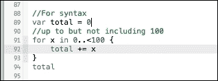

要查看，将鼠标箭头移至右侧窗格中的（100 倍）行上，你应该会看到在其右侧出现两个按钮。第一个是一个眼球，它会显示给定对象包含的每个值。例如，如果你有一个字典，你可以查看该字典中所有的键/值对，如图所示：

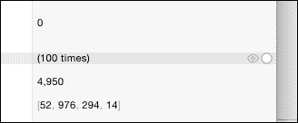

第二个按钮是**值历史**按钮。当你的鼠标箭头放在它上面时，它会变成一个**+**按钮，如图所示：

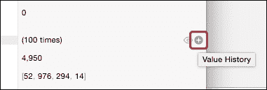

当你点击这个按钮时，你会看到一个图表，显示了循环迭代时该变量随时间变化的值（你也会看到输出控制台，它显示了从上一个循环中按预期打印的名称）如图所示：

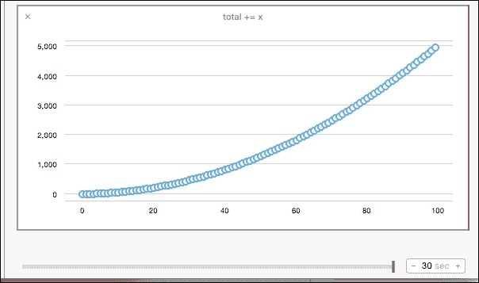

如果你想要获取更多关于变量随时间变化详情，你可以通过拖动红色刮擦器到**值历史**部分的底部，或者点击图表上的任何数据点来查看其相应的值，如图所示：

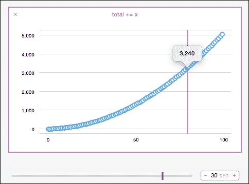

## 了解更多关于 Swift

在 Swift 方面，这里没有涵盖很多内容，例如懒变量、身份操作符、空合并操作符、类初始化器、继承等等。

了解更多关于 Swift 的绝佳地方包括[www.lynda.com](http://www.lynda.com)（有一个关于 Swift 的精彩课程在[www.lynda.com/Swift-tutorials/Swift-Essential-Training/180105-2.html](http://www.lynda.com/Swift-tutorials/Swift-Essential-Training/180105-2.html)）和[www.raywenderlich.com/tutorials](http://www.raywenderlich.com/tutorials)，这些网站提供了许多关于 Swift 基本和高级功能的在线课程和教程。你还可以查看苹果的开发者视频；只需在[`developer.apple.com/videos/wwdc/2014/`](https://developer.apple.com/videos/wwdc/2014/)搜索 Swift。然后还有示例项目、Swift 开发者博客[`developer.apple.com/swift/blog/`](https://developer.apple.com/swift/blog/)，以及其他如 Stack Overflow 等网站。

如前所述，Playgrounds 对于刚开始学习 Swift 的开发者以及那些经验更丰富并希望进行代码调试的开发者来说非常有用。

但是，Playground 本身并不是一个完整的 App，所以让我们用 Swift 作为 Cocos2d 的语言来制作一个简单的游戏。再次提醒，你会发现代码本身与 Objective-C 非常相似；只是语法略有不同，所以你应该能很快掌握。

# 用 Swift 而不是 Objective-C 来创建游戏

使用 Cocos2d-Swift 背后的想法是转向新的编程语言，对吧？尽管 Cocos2d 的 Swift 版本仍然相对较新，而且在你阅读这本书的时候可能并不是所有功能都已实现，但它仍然可以作为创建游戏时的核心语言。所以，让我们在这里制作一个非常简单的游戏，基于你刚刚学到的核心概念，并结合你对 Cocos2d 引擎一般工作方式的了解。

为什么使用 Swift 而不是 Objective-C？因为，你应该跟上该领域最新技术的步伐，Swift 只是这一方向上的下一步。此外，随着时间的推移，苹果可能会逐渐弃用并停止支持 Objective-C（但这只是一个理论）。

通常，如果有机会，了解更多的语言是有帮助的。如果你对网页开发感兴趣，Swift 感觉与 JavaScript 非常相似，所以感觉像是同时学习两种语言。

那么为什么特别选择 Cocos2d-Swift 呢？原因和你刚才读到的相同。此外，用 Swift 编写代码通常比用 Objective-C 快，所以，如果你能更快地编写代码，理论上你也能更快地制作游戏，这真是太棒了！

## 游戏目标

我们将要制作的游戏包括一个位于中心的可以射击子弹的炮塔，一个得分计数器，以及从左右两边进入的正方形敌人。如果敌人到达中心，游戏就结束了！随着得分的增加，敌人的出生率也会增加，最终会超过炮塔的射击速度。

这里是我们将要制作的游戏的几个截图：

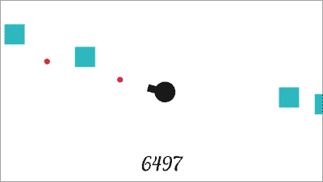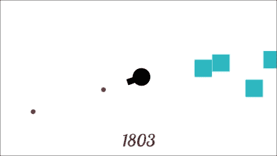

## 开始一个新的 Swift 项目

记住，现在开始 Cocos2d 项目的方式是通过 SpriteBuilder。即使我们不会在 SpriteBuilder 中使用任何代码，我们仍然需要在那里创建项目的过程。

因此，在 SpriteBuilder 中，转到**文件** | **新建** | **项目**。选择你想要创建项目的位置，将其命名为例如`TurretGame`，并确保选择**Swift**作为语言。以下截图供你参考：

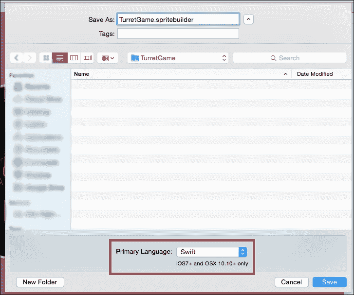

然后，在`Turret Game`中，转到本书内容的`Assets`文件夹，并将`Images`文件夹拖到 SpriteBuilder 左侧的资源列表中，如下截图所示：

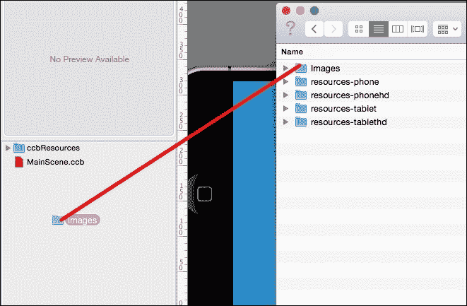

在将其导入到 SpriteBuilder 后，在 SpriteBuilder 中的`Images`文件夹上右键单击（或按*Ctrl*并单击），然后选择**制作智能精灵图集**。这是 TexturePacker 通常为我们做的事情。然而，我们可以使用 SpriteBuilder 的自动图集制作器来加快这个过程，因为这个项目只是一个示例。

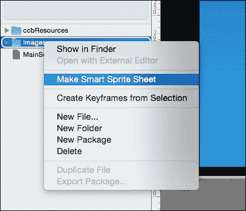

一旦它变成了精灵图集，文件夹图标应该是带有微笑的粉红色。现在，转到**文件** | **发布**，以便 SpriteBuilder 可以为我们生成所需的项目文件，我们就可以继续了。

## 添加字体文件

不幸的是，截至本书编写时，SpriteBuilder 的表现不佳，并且不太擅长处理 BMFonts。因此，我们不会让 SpriteBuilder 处理尺寸/导出，而是创建我们自己的 BMFont 并将其手动添加到我们的文件列表中。这可能不是最有效的方法，但它有效，所以我们就这样做了。

在这本书的项目文件夹中，你应该在拖入 SpriteBuilder 的 `Images` 文件夹旁边看到一系列文件夹，如 `resources-hd` 等。将这四个文件夹全部复制并粘贴到你的项目文件的 iOS `Resources` 文件夹中。当它询问你时，确保你点击 **Merge**（以及 **Apply to All**）。

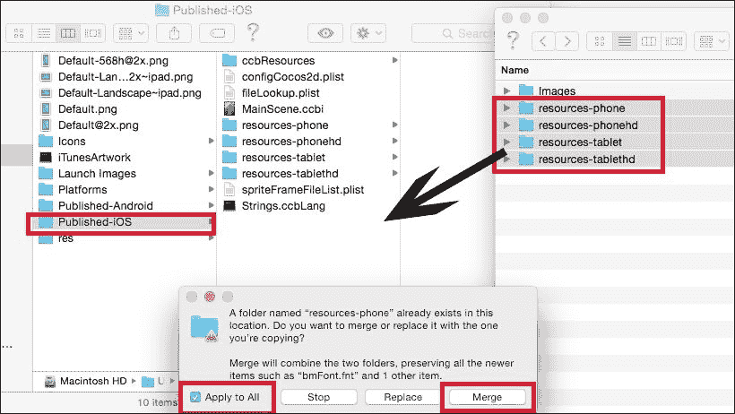

这将为每种尺寸类型添加字体文件到相应的文件夹，以便 Cocos2d 的目录搜索模式可以根据设备找到正确的尺寸。

## 导入 Bridging-Header 和加载 MainScene

当使用 Objective-C 与 Swift 文件一起工作时，Objective-C 需要 一个名为 `Bridging-Header` 的文件。这个文件会自动创建，所以我们只需要导入这个文件。文件的格式是 `ProjectName-Swift.h`，其中 `ProjectName` 是你的项目名称（例如，如果项目名为 `TurretGame`，我们将使用 `TurretGame-Swift.h`）。

现在，请随意打开 Xcode 项目。打开 `AppDelegate.m` 文件，并在文件顶部添加导入语句以添加 `Bridging-Header` 文件：

```swift
#import "TurretGame-Swift.h"
```

然后，在 `StartScene` 方法中，我们需要更改将过渡到主场景的代码行（以及添加读取我们的图像表的代码行）：

```swift
- (CCScene*) startScene
{
  // Capital "I"
  [[CCSpriteFrameCache sharedSpriteFrameCache] addSpriteFramesWithFile:@"Images.plist"];
//[CCBReader loadAsScene:@"MainScene"];
  return [MainScene node]; 
}
```

我们在这里使用 `node` 而不是 `Scene`，因为我们正在调用一个 `Swift` 类。在这本书的前几个例子中，`Scene` 方法是我们创建的方法，而 `node` 是一个预定义的函数，它执行相同的功能。

## 创建背景、炮塔和得分标签

因为 Swift 旨在在可读性方面简洁明了，所以在 `MainScene.swift` 文件中，以下代码就足以获得白色背景、要显示的图像和屏幕底部的标签（注意 `CCScene` 继承；默认是 `CCNode`）：

```swift
class MainScene: CCScene {

  let winSize = CCDirector.sharedDirector().viewSize()
  var background = CCNodeColor(color: CCColor.whiteColor())

  //a value of "527" to make sure it's working. It'll get auto-set later, don't worry.
  var lblScore = CCLabelBMFont(string: "527", fntFile: "bmFont.fnt")

  //"Images/turret.png" because the turret image was located inside the Images folder
  //also making sure to Downcast to a CCSprite from AnyObject!
//We want to downcast because the variable we're setting should be a sprite, so because the spriteFrameByName() method returns AnyObject (as an explicitly unwrapped optional), we must downcast the ambiguous type to CCSprite for better use of the variable later on.
  var turret = CCSprite.spriteWithSpriteFrame(CCSpriteFrameCache.sharedSpriteFrameCache().spriteFrameByName("Images/turret.png")) as CCSprite

  override init() {
    super.init()

    //simply add the background color
    self.addChild(background)

    //position and add the score label
    self.lblScore.position = ccp(self.winSize.width/2, self.winSize.height * 0.1)
    self.addChild(self.lblScore)

    //position and add the turret (z:1 so the bullets can spawn underneath it)
    self.turret.position = ccp(self.winSize.width/2, self.winSize.height/2)
    self.addChild(self.turret, z: 1)

  }
}
```

在这个阶段运行项目，你将看到我们描述的结果。如果你开始欣赏编写代码实现功能所需代码的简洁性，那么 Swift 可能正是你想要学习的语言。

现在让我们继续让炮塔旋转。

## 使用 touchMoved 旋转炮塔

注意到目前为止，几乎所有类和方法都命名得非常相似，Objective-C 和 Swift 之间的语法差异很小。我们的 `touchBegan`、`touchMoved` 和 `touchEnded` 方法也将如此。

首先，我们需要添加一个变量来存储玩家的触摸位置。因此，在 `MainScene` 的顶部添加以下变量：

```swift
class MainScene: CCScene {
  ...
    var touchPos = ccp(0, 0)
  ...
}
```

然后，在 `init()` 方法中，将用户交互布尔值设置为 `true`：

```swift
//records touches
self.userInteractionEnabled = true
```

接下来，将以下方法添加到 `MainScene` 中：

```swift
// a method that will be called when a touch is registered on the device

override func touchBegan(touch: CCTouch!, withEvent event: CCTouchEvent!) {
    // grab the touch's location within the scene, and set it to our variable
    self.touchPos = touch.locationInNode(self)
    // calculate the angle of the touch relative to the turret's current position
    var angle = ccpToAngle( ccpSub( self.touchPos, self.turret.position ) )    
// set the rotation of the turret based on the calculated angle (converted to degrees because Cocos2D doesn't use radians)
    self.turret.rotation = CC_RADIANS_TO_DEGREES(Float(angle)) * -1
}

// a method called when a touch is dragged across the screen
override func touchMoved(touch: CCTouch!, withEvent event: CCTouchEvent!) {
// grab the location of the touch and set it again
    self.touchPos = touch.locationInNode(self)
    // calculate the angle again based on the new touch position
    var angle = ccpToAngle( ccpSub( self.touchPos, self.turret.position ) )
    // set the rotation of the turret again based on the new angle
    self.turret.rotation = CC_RADIANS_TO_DEGREES(Float(angle)) * -1
}

override func touchEnded(touch: CCTouch!, withEvent event: CCTouchEvent!) {
    // do nothing at the moment
}
```

如果你运行游戏，你将能够用手指拖动并使炮塔按照手指的方向旋转。

## 射击一些子弹

如果炮塔不射击子弹，那么它就没什么用了，所以让我们编写那段代码。

首先，我们想要一个可以调用（或安排）的方法。我们想要让它生成一个子弹，然后将其发射到我们的手指方向（炮塔所指的方向）。所以，请继续添加以下方法：

```swift
func shootBullet() {

  //create the bullet. Again, "Images/bullet.png" because of the Images folder
    var bullet = CCSprite.spriteWithSpriteFrame(CCSpriteFrameCache.sharedSpriteFrameCache().spriteFrameByName("Images/bullet.png")) as CCSprite

    //position the bullet underneath the turret
    bullet.position = ccp(self.winSize.width/2, self.winSize.height/2)

    //calculate the distance to move based on similar triangles
    let xDist = self.touchPos.x - self.turret.position.x;
    let yDist = self.touchPos.y - self.turret.position.y;
    let zDist = ccpDistance(self.touchPos, self.turret.position)

    let newX = (xDist * winSize.width) / zDist;
    let newY = (yDist * winSize.width) / zDist;

    //assign that distance to a CGPoint variable
    let moveDistance = ccp(newX, newY)

    //create an action that will move the bullet, then after 0.5 seconds, it will remove it from the screen
    var moveAndRemoveAction = CCActionSequence.actionOne(CCActionMoveBy.actionWithDuration(0.5, position: moveDistance) as CCActionFiniteTime, two: CCActionCallBlock.actionWithBlock({

      self.removeChild(bullet)
    }) as CCActionFiniteTime) as CCAction

    //add the bullet
    self.addChild(bullet)

    //run the move action
    bullet.runAction(moveAndRemoveAction)
}
```

虽然我们现在有一个创建子弹并沿着路径发射它的函数，但我们还没有办法测试它。所以，在我们的`touchBegan`方法中，我们添加了对安排选择器的调用：

```swift
override func touchBegan(touch: CCTouch!, withEvent event: CCTouchEvent!) {
  ...
    //call it once, then schedule it
    shootBullet()
    self.schedule(Selector("shootBullet"), interval: 0.125)
}
```

此外，在我们的`touchEnded`方法中，我们添加了对`unschedule`选择器的调用（因为我们不希望炮塔持续射击）：

```swift
override func touchEnded(touch: CCTouch!, withEvent event: CCTouchEvent!) {
    self.unschedule(Selector("shootBullet"))
}
```

如果你想知道为什么选择器被引号包围，让我告诉你，那只是 Swift 的语法。你不需要明确地声明函数，你只需要将函数名作为字符串传递，Swift 会处理其余的部分。

如果你在这个时候运行游戏，你会看到当你的手指在屏幕上滑动时，那些子弹会从炮塔中火箭般射出。

## 生成敌人并将它们发送到中心

我们想要一些敌人来射击，所以让我们创建一个方法，它将在左墙或右墙上生成一个敌人，并在 3 秒内将其发送到屏幕中心（炮塔所在的位置）：

```swift
func spawnEnemy() {
    //create the enemy. Again, "Images/enemy.png" because of the Images folder
    var enemy = CCSprite.spriteWithSpriteFrame(CCSpriteFrameCache.sharedSpriteFrameCache().spriteFrameByName("Images/enemy.png")) as CCSprite

    //position the enemy randomly along the left or right wall
    let yPos = arc4random() % UInt32(winSize.height)
    let xPos = arc4random() % 2 == 0 ? -50 : winSize.width + 50
    enemy.position = ccp(CGFloat(xPos),CGFloat(yPos))

    //add the enemy to the screen
    self.addChild(enemy)

    //move to exactly 1 enemy-length away from the center (calculated with triangle ratios)
    let distanceToCenter = ccpDistance(self.turret.position, enemy.position)
    let xDistance = self.turret.position.x - xPos
    let yDistance = self.turret.position.y - CGFloat(yPos)

    let newDistanceToCenter = distanceToCenter - enemy.boundingBox().size.width
    let newX = (newDistanceToCenter * xDistance) / distanceToCenter
    let newY = (newDistanceToCenter * yDistance) / distanceToCenter

    let centerPosDistance = ccp(newX,newY)

    //create a move action that, after 3 seconds, will do something (nothing at the moment)
    let moveAndEndGameAction = CCActionSequence.actionOne(CCActionMoveBy.actionWithDuration(3, position: centerPosDistance) as CCActionFiniteTime, two: CCActionCallBlock.actionWithBlock({
      //do nothing at the moment
    }) as CCActionFiniteTime) as CCAction

    //run the move action
    enemy.runAction(moveAndEndGameAction)
}
```

我们有一个生成敌人的方法真是太好了，但目前还没有生成。所以，就像我们安排的`shootBullet`函数一样，我们必须安排`spawnEnemy`函数。

在`init()`方法中，添加以下代码行来生成敌人：

```swift
override init() {
    super.init()

    ...

    self.schedule(Selector("spawnEnemy"), interval: 0.35)
}
```

好的！现在我们有了敌人的生成。但是即使它们到达了最终位置，也没有发生任何事情。让我们来修复这个问题。

## 过渡到 GameOver

当敌人接近中心（动作完成后），我们希望游戏结束，所以让我们创建一个`GameOverScene`类，并在敌人达到他们的最终位置时过渡到它。

首先，通过按*Command* + *N*（或**文件** | **新建** | **文件**）创建一个新文件。通过导航到**iOS** | **源**选择**Cocoa Touch Class**。

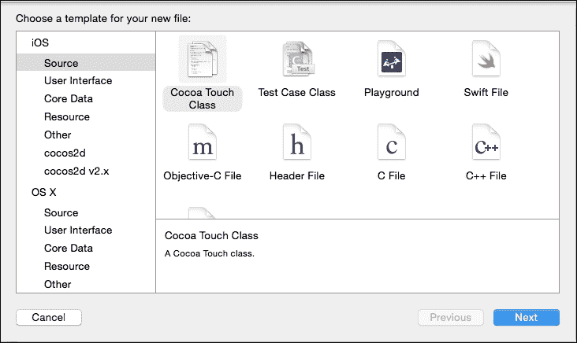

然后将其命名为`GameOverScene`，并确保你选择**Swift**作为语言。

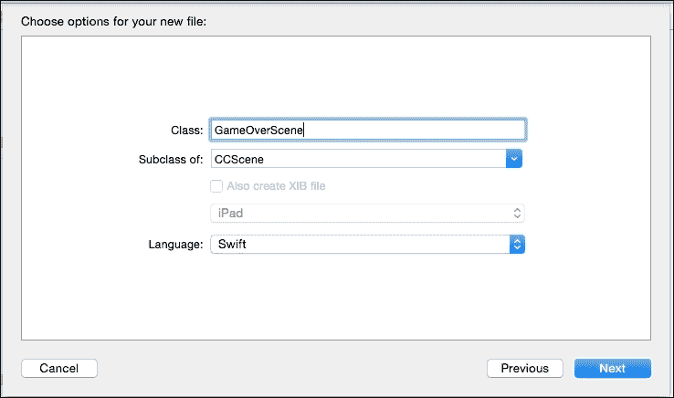

将其保存在项目的`Source`文件夹中，它将自动打开。

用以下内容替换你的`GameOverScene`类，这将设置背景为白色，在屏幕中心创建一个标签，启用触摸，并在屏幕被点击时返回到`MainScene`：

```swift
class GameOverScene: CCScene {

  override init() {

    super.init()

    let winSize = CCDirector.sharedDirector().viewSize()

    var background = CCNodeColor(color: CCColor.whiteColor())
    self.addChild(background)

    var label = CCLabelBMFont(string: "Tap anywhere to restart", fntFile: "bmFont.fnt")
    label.position = ccp(winSize.width/2, winSize.height/2)
    self.addChild(label)

    self.userInteractionEnabled = true
  }

  override func touchBegan(touch: CCTouch!, withEvent event: CCTouchEvent!) {

    CCDirector.sharedDirector().replaceScene(MainScene.node() as CCScene)
  }
}
```

然后，为了测试这个场景，将以下`replaceScene`调用添加到`MainScene.swift`中敌人的移动动作的闭包（或代码块）中：

```swift
func spawnEnemy() {
...
    //create a move action that, after 3 seconds, will do something (nothing at the moment)
    let moveAndEndGameAction = CCActionSequence.actionOne(CCActionMoveBy.actionWithDuration(3, position: centerPosDistance) as CCActionFiniteTime, two: CCActionCallBlock.actionWithBlock({

  //add this line – it will transition to the GameOverScene (in other words, the enemy was not killed)
    CCDirector.sharedDirector().replaceScene(GameOverScene.node() as CCScene)

}) as CCActionFiniteTime) as CCAction

    //run the move action
    enemy.runAction(moveAndEndGameAction)
}
```

嗯！但是，现在虽然它正确地过渡了，但这不是一个很好的游戏，因为我们不能用我们射击的子弹阻止敌人。让我们来修复这个问题！

## 处理碰撞

处理碰撞的方法有很多种，但我们将通过使用子弹和敌人的边界框来处理它们。为此，我们将设置两个数组（一个用于敌人，一个用于子弹）和一个函数来遍历数组并检查边界框交叉。

首先，我们为数组添加两个变量。我们将使用`NSMutableArray`而不是 Swift 的数组，因为 Swift 的数组只允许我们通过索引移除项，而不是通过传递项本身。因此，使用`NSMutableArray`将更容易：

```swift
class MainScene: CCScene {

  ...

  //arrays to hold our bullets and enemies
  var bullets : NSMutableArray = []
  var enemies : NSMutableArray = []

  override init() {
    ...
```

现在我们需要将我们的子弹和敌人添加到它们各自的数组中（以及处理它们从数组中移除）。因此，在我们的`shootBullet`和`spawnEnemy`函数中，我们将对象添加到数组中，并在从场景中移除子弹之前将其从数组中移除：

```swift
func shootBullet() {

...

    var moveAndRemoveAction = CCActionSequence.actionOne(CCActionMoveBy.actionWithDuration(0.5, position: moveDistance) as CCActionFiniteTime, two: CCActionCallBlock.actionWithBlock({

      //remove the bullet from the array
      //before removing it from the screen
      self.bullets.removeObject(bullet)
      self.removeChild(bullet)
    }) as CCActionFiniteTime) as CCAction

    //add the bullet
    self.bullets.addObject(bullet)
    self.addChild(bullet)

...
}

func spawnEnemy() {
...

//add the enemy to the enemies array before adding it to the screen
    self.enemies.addObject(enemy)
//add the enemy to the screen
    self.addChild(enemy)

...
}
```

接下来，我们需要创建一个函数，该函数将遍历我们的数组并检查碰撞。如果发现碰撞，我们将从数组（以及屏幕）中移除两个对象，并退出循环，以防止意外越界。

在`MainScene.swift`文件中创建以下函数：

```swift
func checkForCollisions() {

    //check for collisions
    for bullet in self.bullets {
      for enemy in self.enemies {

        //if the two bounding boxes are overlapping/intersecting/colliding
        if CGRectIntersectsRect(bullet.boundingBox(),
        enemy.boundingBox()) {
          self.bullets.removeObject(bullet)
          self.enemies.removeObject(enemy)

          self.removeChild(bullet as CCSprite)
          self.removeChild(enemy as CCSprite)

          break;
        }
      }
    }
}
```

最后，我们需要安排这个函数，以便在子弹与敌人交互时频繁调用，并且能够在正确的时间检测到碰撞。为此，只需在`init()`函数中安排它即可：

```swift
override init() {
    ...
    self.schedule(Selector("checkForCollisions"), interval: 1.0/60.0)
}
```

在这个阶段运行游戏，你会看到子弹正确地发生碰撞。但是，没有分数计数器的话，这并不是一个真正的游戏。所以让我们把这个分数计数器添加到这个 Swift 示例游戏中。

## 计算分数

我们只需要一个跟踪分数的变量和一个显示标签。可以说，你也可以在游戏结束场景中这样做，但在这个示例中我们不会担心这一点。

因此，在`MainScene`类的顶部，我们创建两个变量，如描述所述，然后在`init()`方法中将标签添加到屏幕上：

```swift
class MainScene: CCScene {

  ... 
//a variable to hold the score. The value of 0.0 sets it to a Float type by default, not Int
  var score = 0.0   
  override init() {
    ...
  }
}
```

然后我们实现`update`函数，该函数由 Cocos2d 自动调用：

```swift
override func update(delta: CCTime) {
    //some obscure score increment over time...
    self.score += 0.47

    //set the label using String Interpolation
  self.lblScore.setString("\(Int(self.score))")
}
```

我们还希望每消灭一个敌人就增加`100`分，所以在`checkForCollisions`函数中，我们只需将`100`加到分数变量上：

```swift
func checkForCollisions() {
...
  if CGRectIntersectsRect(bullet.boundingBox(), enemy.boundingBox()) {
     ...
     self.score += 100   
     break;
  }
}
```

如果你现在运行游戏，你会看到随着时间的推移分数增加，以及当任何敌人被子弹击中时。唯一剩下要做的事情是随着时间的推移使游戏更难（因为目前来说相当无聊）。

## 提高难度

最后（尽管对于使示例工作并不完全重要），我们希望难度随时间增加，这样只有最好的玩家才能走得更远。我们将通过增加单位生成的速率（确切地说，每 2,000 分）来实现这一点。首先，我们想要一些变量来保存当前的生成速率以及自上次难度增加以来累积的点数：

```swift
class MainScene: CCScene {
  ...
  //variables for enemy spawn rate (aka, difficulty)
  var spawnRate = 0.35
  var scoreSinceLastIncrease = 0.0

  override init() {
```

然后，我们必须将硬编码的`0.35`值替换为`spawnRate`变量：

```swift
override init() {
  ...
  self.schedule(Selector("spawnEnemy"), interval: self.spawnRate)
}
```

现在，每次我们增加`score`变量时，也必须增加`scoreSinceLastIncrease`变量。因此，在`update`和`checkForCollisions`中，我们需要给这两个变量都加上相同的数值：

```swift
func checkForCollisions() {
  ...     
  if CGRectIntersectsRect(bullet.boundingBox(), enemy.boundingBox()) {
    ...
    self.score += 100
    self.scoreSinceLastIncrease += 100

    break;
  }
}

override func update(delta: CCTime) {
    //some random score increment over time...
    self.score += 0.47
    self.scoreSinceLastIncrease += 0.47

    //set the label using String Interpolation
    self.lblScore.setString("\(Int(self.score))")

}
```

最后，我们需要在我们的`update`方法内部检查，自上次难度增加以来的分数是否已经超过了我们的限制（在这种情况下，我们将在每获得 2,000 分后增加）。为此，我们只需取消`spawnEnemy`函数的调度，减少`spawnRate`（只减少到一定量），然后重新调度`spawnEnemy`函数：

```swift
override func update(delta: CCTime) {
    ...
    if self.scoreSinceLastIncrease > 2000 {

      //unschedule and re-schedule the spawnEnemy method
      //using the new spawn rate
      self.unschedule(Selector("spawnEnemy"))

      spawnRate -= 0.025
      if (spawnRate < 0.005) {
        spawnRate = 0.005
      }

      self.schedule(Selector("spawnEnemy"), interval: self.spawnRate)

      //subtract 2000, the amount of the difficulty
      self.scoreSinceLastIncrease -= 2000
    }
}
```

在这个阶段运行游戏，并观察越来越多的单位涌入视图，最终会压倒你。

就这样！我们刚刚用 Cocos2d 制作了一个非常简单的游戏，但这次有了 Swift 的帮助。这并不是世界上最好或最有意思的游戏，但它是有意义的。此外，这个例子更多的是展示如何使用 Swift 作为核心语言而不是 Objective-C 来制作游戏。

# 摘要

在本章中，你学习了如何使用 playgrounds，并使用 Cocos2d 和 Swift 创建一个基本游戏。

如前所述，如果你想要了解更多关于 Swift 的信息，有许多在线资源可供你使用——在线课程、苹果公司创建的内容，以及提供所需帮助的在线社区。

开心编码！
