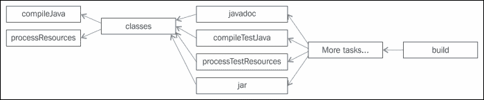
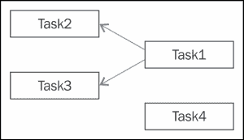
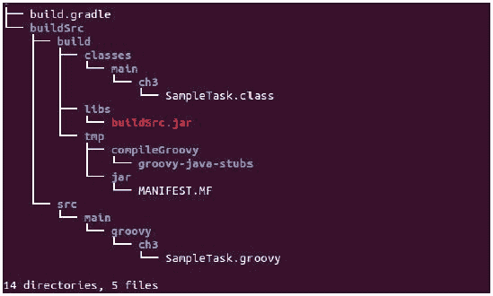

# 第三章：管理任务

在本章中，我们将讨论 Gradle 构建脚本的基元，即任务（Task）。我们将详细探讨任务框架，如何创建自己的任务，覆盖 Gradle 提供的任务，任务配置，以及使用 Gradle 提供的不同方法创建自定义任务。我们还将讨论任务依赖。本章还将提供关于控制任务执行的观点，如何根据某些条件启用或禁用任务执行，以及跳过任务执行。Gradle 提供了一项称为增量构建支持的功能，如果任务是最新的，即任务的输入和输出没有变化，则会跳过任务的执行。如果你反复运行构建，这有助于减少脚本的构建时间。我们将通过一些示例来尝试理解这个功能。Gradle 默认支持此功能。我们将了解如何将此功能扩展到用户定义的任务。此外，我们还将探索 Gradle 提供的`Project`对象，以控制构建脚本。

# 构建脚本基础

构建脚本实际上是一组按某些预定义顺序执行并执行某些操作的动作。在 Gradle 中，我们称这些动作或动作组为**任务**，它是称为**项目**的父实体的一个部分。Gradle 构建文件中的执行原子单位称为任务。构建文件的结果可能是某些资产，如 JAR、WAR 等，或者它可能执行某些操作，如资产的部署和配置。每个`build.gradle`文件至少代表一个项目。在多项目或多模块构建的情况下，它也可能包含多个项目。我们将在第六章 *与 Gradle 一起工作*中讨论多项目构建。构建的执行代表`Project`对象的执行，该对象内部调用不同的任务以执行操作。

当你执行任何构建脚本时，Gradle 会为构建文件实例化`org.gradle.api.Project`对象，并给出一个隐式的项目对象。你可以使用此对象通过`project.<methodname | property>`或简单地`<methodname | property>`在构建文件中访问项目 API。例如；要在你的构建文件中打印项目的名称，你可以使用以下代码：

```java
println "Project name is "+project.name
println "Project name is "+name // here project object is implicit
println "Project name is $project.name"
println "Project name is $name"
```

所有的上述语句都将返回相同的输出，即项目名称。项目名称是 `build.gradle` 文件父目录的名称。假设 `build.gradle` 位于 `Chapter3` 目录下；因此，上述语句的输出将是 `项目名称是 Chapter3`。你可以在 `settings.gradle` 文件中提供 `rootProject.name=<新项目名称>` 来更改项目名称。我们将在 第六章 *使用 Gradle* 中进一步讨论 `settings.gradle` 文件的用法。

### 注意

要得到输出 `项目名称是 Chapter3`，你需要在任务块之外编写语句。如果你在任务内编写它，并且我们使用名称或 `$name` 变量，它将显示任务名称。这是因为任务块内部，`name` 变量的作用域将不同。

以下是一些项目对象的属性，可以使用 getter 和 setter 方法来配置构建文件：

+   `name // 只读`，你只能使用 `settings.gradle` 来更改

+   `parent // 只读`

+   `版本`

+   `description`

一些属性是只读的，它们由 Gradle 运行时直接设置。

Gradle 还提供了一些默认任务，可以在不应用任何插件的情况下使用，例如复制任务和压缩任务。你也可以为 **项目** 对象定义自己的自定义属性和自定义任务。

对于构建文件中的每个任务，Gradle 将实例化 Task 对象的一个实现。Task 接口有不同的实现；你可以在 [`docs.gradle.org/current/javadoc/org/gradle/api/Task.html`](https://docs.gradle.org/current/javadoc/org/gradle/api/Task.html) 找到更多关于它的详细信息。类似于 Project 对象，你也可以使用 Task API 编程方式控制任务。当我们在后面的部分使用 Groovy 创建自定义任务时，你将看到更多关于这个的细节。总之：

+   任务是一组动作和属性的集合。它可以依赖于其他一些任务

+   任务可以接受输入并返回输出

+   任务还提供了一些预定义属性，如名称和描述已启用

我们将从一个简单的构建文件示例开始，解释现有的项目属性，提供自定义属性，创建任务等。

考虑文件位置 `/Chapter3/build.gradle`：

```java
// Section 1: Project object existing properties
version = '1.0'
description = 'Sample Java Project'
// Section 2: Project level custom properties
ext {
  startDate="Jan 2015"
}
ext.endDate = "Dec 2015"
println "This is project configuration part, description is $description"
// Section 3: Task
task sampleTask1 {
  // Section 3.1: Task existing properties
  description = "This is task level description"
  // Section 3.2: Task level custom properties
  ext {
    taskDetail=" This is custom property of task1"

  }
println "This is sampleTask1 configuration statements, taskDetail is $taskDetail"

// Section 3.3: Task actions
doFirst {
println "Project name is $project.name, description is $project.description"
println "Task name is $name, description is $description"
    println "Project start date is $startDate"
  }
  doLast {
      println "Project endDate is $endDate"
  }

}
// Section 4: Task
task sampleTask2 {
  println "This is sampleTask2 configuration statements"

doFirst {
println "Task getProjectDetailsTask properties are: "+sampleTask1.taskDetail
  }
}
```

要执行前面的 `build.gradle` 文件：

```java
$ gradle sampleTask1 sampleTask2
This is project configuration part, description is Sample Java Project
This is sampleTask1 configuration statements, taskDetail is  This is custom property of task1
This is sampleTask2 configuration statements
:sampleTask1
Project name is chapter3, description is Sample Java Project
Task name is sampleTask1, description is This is task level description
Project start date is Jan 2015
Project endDate is Dec 2015
:sampleTask2
Task getProjectDetailsTask properties are:  This is custom property of task1
BUILD SUCCESSFUL

Total time: 6.892 secs

```

在前面的示例中，在第一节中，我们覆盖了一些项目对象现有的属性。在第二节中，我们向项目对象添加了自定义属性。请注意，添加自定义属性的语法是在`ext`闭包内添加`<name=value>`对，或者我们可以将其定义为`ext.<propertyname> = value`。然后，我们在第三节和第四节中向此构建脚本添加了两个任务，并添加了自定义属性到`sampleTask1`任务。要添加/更新项目的属性，你不需要添加`def`关键字。`def`用于定义用户定义的变量。然而，在这里我们正在定义项目属性。如果你使用`def startDate=<Value>`，它将被视为变量而不是项目属性。

我们能够在`sampleTask1`中打印`startDate`和`endDate`，因为我们将其添加为项目属性，可以在整个构建文件中直接访问。要调用任务方法或使用任务属性在任务外部，我们可以使用`task.<property name>`或`task.<method name>`。正如前面的示例，在`sampleTask2`任务内部，我们正在打印`sampleTask1.taskDetail`。

有多种方式可以指定任何项目的属性。当我们在第六章中讨论属性时，我们将详细讨论这一点，*使用 Gradle*。

# 任务配置

我们在第一章中讨论了构建文件由三个阶段组成：初始化、配置和执行，以下简要解释：

+   初始化创建项目对象。

+   配置阶段配置项目对象，根据任务依赖关系创建**DAG**（**有向无环图**）。它还执行项目和任务配置语句。

+   执行阶段最终执行任务体中提到的操作。

任务 API 主要定义了两种类型的闭包：`doFirst`(Closure closure)和`doLast`(Closure closure)，它们内部调用`doFirst(Action action)`和`doLast(Action action)`。你可以提及一个或两个。

### 小贴士

在这些操作之外提到的语句是配置的一部分，在配置阶段执行。

要验证任务的配置阶段，你可以使用`--dry-run`或`–m`选项执行构建脚本。`--dry-run`（或`–m`）选项只通过初始化和配置阶段，不通过执行阶段。尝试使用`--dry-run`选项执行前面的构建文件，你将在控制台上找到所有配置语句：

```java
$ gradle --dry-run
This is project configuration part, description is Sample Java Project
This is sampleTask1 configuration statements, taskDetail is  This is custom property of task1
This is sampleTask2 configuration statements
:help SKIPPED

BUILD SUCCESSFUL

```

在 Gradle 2.4 版本中，在配置阶段实现了一些性能改进。更多详情请参考发布说明中的[重要配置时间性能改进](https://docs.gradle.org/2.4/release-notes#significant-configuration-time-performance-improvements)。

# 任务执行

如前所述，任务不过是一系列执行以执行某些操作的单一或多个动作。如果需要，你可以向`doFirst`或`doLast`闭包添加多个动作。`doFirst`闭包将始终在`doLast`闭包之前执行。你甚至可以在任务定义之后向任务添加动作。

例如，在前面脚本中提到`sampleTask2`任务之后添加以下语句。

```java
sampleTask2.doFirst { println "Actions added separately" }
sampleTask2.doLast { println " More Actions added " }
```

前面的语句将为`sampleTask2`添加两个额外的操作。Gradle 为`doLast`提供了一个简短的表示法，即`<<`。

在 Groovy 中，`<<`是左移运算符，用于向列表中添加元素：

```java
task sampleTask3 << {
        println "Executing task3"
}
sampleTask3.doFirst {println "Adding doFirst action" }
```

尝试执行`sampleTask3`并查看输出：

```java
$ gradle sampleTask3
...
:sampleTask3
Adding doFirst action
Executing task3

BUILD SUCCESSFUL

```

如果在命令行上提到了多个任务，它们将按照定义的顺序执行（除非对任务应用了某些依赖关系）。

# 任务依赖

当我们谈论任何构建工具的构建生命周期或测试生命周期时，实际上内部发生了什么？它不仅仅执行一个任务；它基本上执行一系列任务，这些任务按照一定的顺序定义，而这个顺序就是任务的依赖关系。以构建任何 Java 项目为例。你可以通过执行`gradle build`任务来构建 Java 项目。这将完成所有工作，例如编译源代码、将类打包成 JAR 文件并将 JAR 文件复制到某个位置。这意味着所有这些过程都只是构建任务的一部分吗？我们在这里想要传达的信息是，Gradle 的`build`任务不仅仅执行一个任务，而是执行从`compileJava`、`classes`、`compileTestJava`等一系列任务，直到构建 JAR 文件。



图 3.1

前面的图只是应用 Java 插件后 DAG 的表示。它表示不同的任务以及它们是如何相互依赖的。

如果任务 Task1 依赖于另一个任务 Task2，那么 Gradle 会确保 Task2 始终在 Task1 之前执行。在前面的例子中，`compileJava`、`classes`和`jar`任务将始终在构建任务之前执行。一个任务可以依赖于一个或多个任务。两个或多个任务也可以依赖于同一个先决任务。例如，在前面的 DAG 中，`javadoc`、`compileTestjava`和`jar`任务依赖于`classes`任务。这并不意味着`classes`任务将执行三次。它将在构建生命周期中只执行一次。如果一个任务由于某些其他依赖关系已经执行，它将不会再次执行。它只会通知其他依赖任务其状态，以便依赖任务可以继续执行而无需再次调用它。

在构建文件中，任务依赖可以通过以下任何一种方式定义：

```java
task task1(dependsOn: task2)
task task1(dependsOn: [task2,task3]) // in case of more than one dependency
task1.dependsOn task2, task3  //Another way of declaring dependency
```

许多插件提供了具有默认依赖的任务。正如我们在前面的图中看到的，`classes` 任务有 `compileJava` 依赖。如果你向 `classes` 任务添加任何其他依赖（例如，`task1`），它将把任务（`task1`）附加到 `compileJava` 任务上。这意味着，执行 `classes` 任务将执行 `compileJava` 和 `task1`。要使用一组新的依赖项专门覆盖现有的依赖项，请使用以下语法：

```java
classes {dependsOn = [task1, task2]
}
```

在这里，执行 `classes` 任务将执行作为依赖任务的 `task1` 和 `task2`，并且它将忽略 `compileJava` 任务。

# 任务排序

如果 **任务 1** 依赖于 **任务 2**，那么 Gradle 将确保**任务 2**始终在**任务 1**之前执行。然而，它并不确保任务的顺序。也就是说，它不会确保**任务 2**将在**任务 1**之前立即执行。在**任务 2**和**任务 1**的执行之间，可能会执行其他任务。



图 3.2

如前图所示，**任务 1** 依赖于 **任务 2** 和 **任务 3**。**任务 4** 是一个独立任务。如果你执行 `gradle Task1 Task4`，执行流程将是 **任务 2**、**任务 3**、**任务 1**，然后是 **任务 4**，就像一个任务依赖于多个任务一样。Gradle 以字母顺序执行依赖任务。

除了 `dependsOn` 之外，Gradle 还提供了一些额外的排序类别。例如，在最后一个任务执行之后，你可能想要清理在构建过程中创建的临时资源。为了启用这种排序，Gradle 提供了以下选项：

+   `shouldRunAfter`

+   `mustRunAfter`

+   `finalyzedBy`（性质上更严格）

让我们看看以下示例。创建 `build_ordering.gradle` 文件：

```java
(1..6).each {
  task "sampleTask$it" << {
        println "Executing $name"
    }
  }

sampleTask1.dependsOn sampleTask2
sampleTask3.dependsOn sampleTask2

sampleTask5.finalizedBy sampleTask6
sampleTask5.mustRunAfter sampleTask4
```

在脚本中，我们创建了六个带有整数后缀的 `sampleTask` 任务。现在，为了理解任务排序，使用不同的任务名称执行前面的构建脚本：

```java
$ gradle –b build_ordering.gradle sampleTask1

```

这将执行 `sampleTask2` 和 `sampleTask1`：

```java
$ gradle –b build_ordering.gradle sampleTask1 sampleTask3

```

这将执行 `sampleTask2`、`sampleTask1` 和 `sampleTask3`。任务 `sampleTask2` 只会执行一次：

```java
$ gradle –b build_ordering.gradle sampleTask5

```

这将执行 `sampleTask5` 和 `sampleTask6`。

注意，`sampleTask5` 任务将不会执行 `sampleTask4`，因为当这两个任务（`sampleTask4` 和 `sampleTask5`）都是执行过程的一部分时，`mustRunAfter` 排序将会生效。这将在下面的命令中解释。这里，你也看到了 `finalizedBy` 操作的使用。它提供了结论顺序，即 `sampleTask5` 应立即由 `sampleTask6` 接替：

```java
$ gradle –b build_ordering.gradle sampleTask5 sampleTask4

```

这将按顺序执行 `sampleTask4`、`sampleTask5` 和 `sampleTask6`。这是因为 `sampleTask5` 必须在 `sampleTask4` 之后运行，并且 `sampleTask5` 应由 `sampleTask6` 结束。

`mustRunAfter` 和 `shouldRunAfter` 之间的区别在于 `mustRunAfter` 是严格的排序，而 `shouldRunAfter` 是宽松的排序。考虑以下代码：

```java
sampleTask1.dependsOn sampleTask2
sampleTask2.dependsOn sampleTask3
sampleTask3.mustRunAfter sampleTask1
```

在这种情况下，对于前两个语句，执行顺序是`sampleTask3`、`sampleTask2`，然后是`sampleTask1`。下一个语句`sampleTask3.mustRunAfter sampleTask1`，表示`sampleTask3`必须在`sampleTask1`之后执行，这引入了循环依赖。因此，`sampleTask1`的执行将失败：

```java
$ gradle –b build_ordering.gradle sampleTask1
FAILURE: Build failed with an exception.

* What went wrong:
Circular dependency between the following tasks:
:sampleTask1
\--- :sampleTask2
     \--- :sampleTask3
          \--- :sampleTask1 (*)

(*) - details omitted (listed previously)
. . .
```

如果你将`mustRunAfter`替换为`shouldRunAfter`，则不会抛出任何异常，并且在这种情况下会忽略严格的顺序。

# 任务操作

如果你厌倦了在命令行中输入完整的任务名称；这里有一个适合你的好选项。如果你已经以驼峰式（*camelCase*）格式定义了任务名称，你只需提及每个单词的首字母即可执行任务。例如，你可以使用缩写`sT1`来执行`sampleTask1`任务：

```java
$ gradle -q –b build_ordering.gradle sT1 sT2

```

这将执行`sampleTask1`和`sampleTask2`。

如果驼峰式的缩写与多个任务匹配，将会导致歧义：

```java
 $ gradle -q -b build_ordering.gradle sT

FAILURE: Build failed with an exception.

* What went wrong:
Task 'sT' is ambiguous in root project 'Chapter3'. Candidates are: 'sampleTask1', 'sampleTask2', 'sampleTask3', 'sampleTask4', 'sampleTask5', 'sampleTask6'.

* Try:
Run gradle tasks to get a list of available tasks. Run with --stacktrace option to get the stack trace. Run with --info or --debug option to get more log output.

```

现在，我们将探讨一些其他任务操作，例如条件执行、构建优化和强制执行。

## 条件执行

当你想要根据某些属性执行某些任务时，会有不同的场景。例如，你在`build`文件中有一个名为`environment`的属性。如果属性的值设置为`prod`，你想要执行特定于生产的任务；如果它是`qa`，你想要执行特定于测试的任务。创建一个`build`文件`build_condition.gradle`，包含以下代码片段：

```java
ext {
  environment='prod'
// can set this value from property file or command line using -Pname=value option
}

task prodTask << {
  println 'Executing prod tasks '+ environment
}
prodTask.onlyIf {project.hasProperty('environment') && project.environment=='prod' }

task qaTask << {
  println 'Executing qa tasks '+ environment
}
qaTask.onlyIf { project.hasProperty('environment') && project.environment== 'qa '}
```

使用这两个任务执行先前的`build`文件：

```java
$ gradle -b build_condition.gradle prodTask qaTask
:prodTask
Executing prod tasks prod
:qaTask SKIPPED

BUILD SUCCESSFUL

```

在这里，Gradle 跳过了`qaTask`并仅根据`build`文件中设置的环境属性执行了`prodTask`。你也可以在先前的`ext`闭包中移除环境值，并直接从命令行选项设置属性，然后尝试执行以下命令：

```java
$ gradle -b build_condition.gradle -Penvironment=qa qaTask prodTask
:qaTask
Executing qatasks qa
:prodTask SKIPPED

BUILD SUCCESSFUL

```

可能存在另一种情况，当一个任务过时且你不想执行它时，即使其他任务依赖于这个任务。这个特性在任务配置阶段通过`enabled`选项得到支持：

```java
task sampleTask12 << {
println " This task is disabled"
}
task sampleTask13 (dependsOn: sampleTask12) << {
println "This task depends on sampleTask12"
}
sampleTask12.enabled = false
```

```java
$ gradle -b build_enabled.gradle sT12 sT13

:sampleTask12 SKIPPED
:sampleTask13
This task depends on task12

BUILD SUCCESSFUL

```

注意，你可以在配置阶段本身设置`enabled`。它不应该成为`doFirst`或`doLast`闭包的一部分：

```java
task sampleTask12 {
   //enabled = false    // valid statement
   doLast {
      enabled = false   // Invalid statement
      println 'Task execution' 
   }   
}
```

在先前的例子中，如果我们尝试在`doLast`闭包中设置`enabled = false`，任务将不会执行。构建将失败，并出现`Cannot call Task.setEnabled(boolean) on task ':sampleTask12' after task has started execution`错误。

## 构建优化

考虑这样一个场景，你的`build`文件由 10 个任务组成，这些任务按照任务依赖关系顺序执行。在 10 个任务中，有五个任务正在修改文件系统上的五个不同文件。假设这五个文件是某些属性文件，这些构建任务正在设置属性值：

```java
envproperty.txt
  env=prod
sysproperty.txt
  memory=1024
……
```

第一次执行后，属性文件被修改为相应的值。当你再次运行`build`脚本时，尽管文件已经被修改，构建脚本还是会再次修改这些文件。

Gradle 提供了一种基于任务输入和输出参数跳过这些类型任务执行机制，这被称为**增量构建**。这有助于减少构建时间。你可能已经注意到，当你应用 Java 插件并多次构建你的项目时，一些任务被标记为 UP-TO-DATE 关键字（执行时没有 `-q` 选项）。这意味着与上次执行这些任务相比，输入和输出没有变化，因此这些任务被忽略。

默认情况下，Gradle 为其内置任务提供此功能。你也可以通过任务输入和输出增强你的任务，输入和输出类型为 `TaskInputs` 和 `TaskOuputs`。我们将通过一个示例来解释这种行为：

考虑 `PropDetails.xml` 文件：

```java
<properties>
  <property>
    <filedetail>
      <name>envproperty.txt</name>
      <key>env</key>
      <value>prod</value>
    </filedetail>
  </property>
  <property>
    <filedetail>
      <name>sysproperty.txt</name>
      <key>memory</key>
      <value>1024</value>
    </filedetail>
  </property>
</properties>
```

考虑 `build_optimization.gradle` 文件：

```java
task updateExample {
ext {
propXml = file('PropDetails.xml')
}
File envFile = file('envproperty.txt')
File sysFile = file('sysproperty.txt')

inputs.file propXml
outputs.files (envFile, sysFile)

doLast {
println "Generating Properties files"
def properties = new XmlParser().parse(propXml)
properties.property.each { property ->
def fileName = property.filedetail[0].name[0].text()
def key = property.filedetail[0].key[0].text()
def value = property.filedetail[0].value[0].text()
def destFile = new File("${fileName}")
destFile.text = "$key = ${value}\n"
}
}
}

$ gradle –b build_optimization.gradle updateExample
```

如果你第一次运行此任务，它将读取 `PropDetail.xml` 文件，并创建两个文件 `envproperty.txt` 和 `sysproperty.txt`，其中包含 `property` 文件中提到的 `key=value` 对。现在，如果你再次运行此命令，你将看到以下输出：

```java
:updateExample UP-TO-DATE
BUILD SUCCESSFUL

```

这意味着此任务的输入和输出没有变化；因此，无需再次执行任务。

尝试更改 XML 文件或生成的属性文件或删除输出文件。如果你再次运行 `Gradle` 命令，这次，任务将执行并重新创建文件。Gradle 内部生成输入参数和输出参数的快照（Gradle 生成一个哈希码以避免重复）并存储它。从下一次开始，Gradle 生成输入和输出参数的快照，如果两者相同，则避免执行任务。

另外，还有一个重要点需要记住，如果任务没有定义输出，则它将不会被考虑进行优化（`UP-TO-DATE`）。任务将始终执行。可能存在一种情况，即任务的输出不是文件或目录，它可能是其他逻辑构建步骤或系统相关的检查。在这种情况下，你可以使用 `TaskOutputs.upToDateWhen()` 方法或 `outputs.upToDateWhen` 闭包来检查特定情况并标记任务为 `UP-TO-DATE`。

要跳过优化技术并强制完整执行任务，可以使用 `--rerun-tasks` 命令行选项。它将强制执行任务，即使它是 `UP-TO-DATE`。

```java
$ gradle –b build_optimization.gradle updateExample --rerun-tasks

```

`--rerun-tasks` 选项将始终执行任务，而不会检查输入和输出参数。

## 任务规则

我们在 Groovy 中讨论了 `methodMissing` 概念。你可以在 Groovy 中定义一些方法模式，这些模式可以在运行时响应预定义的模式的方法调用。任务规则为任务提供了相同的灵活性。它允许执行一个不存在的任务。Gradle 会检查任务规则，如果规则已被定义，则会创建任务。我们将通过一个简单的示例来查看其用法。例如，你有来自不同仓库服务器的不同资产，而不是为每个同步创建不同的任务，你可以创建如下任务规则：

```java
tasks.addRule("Pattern: sync<repoServer>") { String taskName ->
  if (taskName.startsWith("sync")) {
    task(taskName) << {
      println "Syncing from repository: " + (taskName - 
'sync')
      }
    }
}

```

在这里，你可以为每个仓库服务器调用不同的任务，例如 `gradle sync<repoServer>`，它将从该仓库同步资产。

一个非常常见的任务规则示例可以在 Java 插件中找到。在 `build` 文件的第一行添加 `apply plugin: 'java'` 并运行以下命令：

```java
$ gradle -b build_rule.gradle tasks

…………….
Rules
-----
Pattern: clean<TaskName>: Cleans the output files of a task.
Pattern: build<ConfigurationName>: Assembles the artifacts of a configuration.
Pattern: upload<ConfigurationName>: Assembles and uploads the artifacts belonging to a configuration.
Pattern: sync<repoServer>

To see all tasks and more detail, run with --all.

BUILD SUCCESSFUL

Total time: 4.021 secs

```

目前，不必过多担心插件。我们将在第四章*插件管理*中详细讨论插件。

在上述输出中，你可以找到在 Java 插件中定义的规则。Gradle 提供了三个内置规则 `clean<TaskName>`、`build<sConfigurationName>` 和 `upload<ConfigurationName>` 以及新创建的 `sync<repoServer>` 规则。对于你在 `build` 文件中可用的所有任务（Java 插件任务和用户定义的任务），你可以使用 `clean<TaskName>` 执行一个额外的任务。例如，Java 插件中提供了 assemble、classes 和 jar 任务。除了执行正常的 clean 任务，删除构建目录外，你还可以执行 `cleanClasses`、`cleanJar` 等任务，这些任务仅清理特定任务的输出。

# Gradle 的内置任务

对于日常的构建相关活动，Gradle 提供了各种任务。我们将查看一些 Gradle 的内置任务。

## 复制任务

此任务用于将文件（或目录）从一个位置复制到另一个位置：

```java
task copyTask(type: Copy) {
  from "."
  into "abc"
  include('employees.xml')
}
```

在 `copyTask` 中，我们已配置了 `from` 位置和 `into` 位置，并添加了仅包含 `employees.xml` 的条件。

## 重命名任务

此任务是一个扩展的复制任务，用于重命名文件或目录：

```java
task copyWithRename(type: Copy) {
  from "."
  into "dir1"
  include('employees.xml')
  rename { String fileName ->
  fileName.replace("employees", "abc")
  }
}
```

在 `copyWithRename` 任务中，添加了一个额外的 `rename` 闭包。

## Zip 任务

此任务用于将一组文件（或目录）压缩并复制到目标目录：

```java
task zipTask(type: Zip) {
  File destDir = file("dest")
  archiveName "sample.zip"
  from "src"
  destinationDir destDir
}
```

在 `ziptask` 任务中，添加了另一个 `destinationDir` 配置。你可以参考在线文档以获取这些任务的更详细 API。

### 注意

注意，这里我们没有提到这些任务的动作。任务本身知道该做什么。我们只需要配置任务来定义它们。

大多数时候，你使用的是插件的一部分任务。通常，插件是一组绑定在一起以实现某些特定功能的任务集合。例如；我们使用 `java` 插件来构建 Java 项目，使用 `war` 插件来创建 Web 存档，等等。当你将 `java` 插件应用到构建脚本中时，Java 任务会自动包含在内。我们将在第四章插件管理中详细讨论插件。

要执行 Java 任务，我们甚至不需要提及配置。对于这些任务，Gradle 应用约定，即默认配置。如果一个项目遵循某种约定，它可以直接执行这些任务而无需任何配置。如果不遵循，它应该定义自己的配置。要将 `java` 插件添加到 `build` 文件中，只需添加以下代码行：

```java
apply plugin: 'java'
```

默认情况下，`java` 插件假定项目的源文件位于 `src/main/java`。如果源文件存在于该目录中，你可以执行 `gradle compileJava` 或 `gradle build` 任务而无需任何配置。我们将在下一章中更多讨论 Java 插件和任务。

到目前为止，在本章中，我们已经对如何创建任务以及如何使用 Gradle 的内置任务有了一些了解。在下一节中，我们将探讨如何创建自定义任务。

# 自定义任务

Gradle 支持各种用于构建自动化的任务，无论是来自 Gradle 内置插件还是第三方插件。正如我们所知的软件谚语，变化是软件中唯一不变的事物；需求和复杂性会随着时间的推移而变化。很多时候，我们会遇到不同的自动化需求，而在 Gradle 中没有可用的任务或插件。在这种情况下，你可以通过添加自定义任务来扩展 Gradle。 

自定义任务是一个增强的任务，你将其添加到 Gradle 中以满足自定义需求。它可以具有输入、输出、配置等。它的作用域不仅限于定义它的 `build` 文件；通过在类路径中添加自定义任务 JAR，它可以在其他项目中重用。你可以用 Groovy、Java 和 Scala 编写自定义任务。在本节中，我们将创建 Groovy 的自定义任务示例。

Gradle 提供了不同的方法在构建脚本中添加自定义任务：

+   `build` 文件

+   项目目录内的 `buildSrc` 目录

+   创建一个独立的 Groovy 项目

自定义任务是一个扩展自 `DefaultTask` 的 Java 或 Groovy 类。我们可以使用 `@TaskAction` 注解来定义任务操作。你可以在单个任务中添加多个操作。它们将按照定义的顺序执行。让我们从 `build` 文件中的一个简单的自定义任务开始。

考虑位于 `Chapter3/Customtask/build.gradle` 的文件：

```java
println "Working on custom task in build script"

class SampleTask extends DefaultTask {
  String systemName = "DefaultMachineName"
  String systemGroup = "DefaultSystemGroup"
  @TaskAction
  def action1() {
    println "System Name is "+systemName+" and group is "+systemGroup
  }
  @TaskAction
    def action2() {
      println 'Adding multiple actions for refactoring'
    }

}

task hello(type: SampleTask)

hello {
  systemName='MyDevelopmentMachine'
  systemGroup='Development'
}
hello.doFirst {println "Executing first statement "}
hello.doLast {println "Executing last statement "}
```

以下文件的输出将是：

```java
$ gradle -q hello
Executing first statement
System Name is MyDevelopmentMachine and group is Development
Adding multiple actions for refactoring
Executing last statement

BUILD SUCCESSFUL

```

在前面的示例中，我们定义了一个自定义任务类型`SampleTask`。我们添加了两个操作方法`action1()`和`action2()`。您可以按需添加更多操作。我们添加了两个任务变量`systemName`和`systemGroup`，并赋予了一些默认值。我们可以在配置任务（hello）时再次在项目范围内重新初始化这些变量。Gradle 还提供了使用`doFirst`和`doLast`闭包向任务添加更多操作的灵活性，就像其他任务一样。

一旦定义了任务类型，您就可以使用`task <taskname>(type: <TaskType>)`创建一个任务。

您可以在配置闭包中配置任务，无论是声明任务时还是作为一个单独的闭包，如前述文件中所述。

## 使用 buildSrc

如果您想将自定义任务代码与构建文件分开，但又不想为它创建一个单独的项目，您可以通过在`buildSrc`目录中添加自定义任务来实现这一点。

在项目基本目录中创建一个`buildSrc`目录，并创建以下提到的文件夹层次结构：`buildSrc/src/main/groovy/ch3/SampleTask.groovy`。

将前面的`SampleTask`类移动到文件中。您还需要导入两个包：`org.gradle.api.DefaultTask`和`org.gradle.api.tasks.TaskAction`。现在，`build`文件剩下以下代码片段：

```java
task hello(type: com.test.SampleTask)
hello {
  systemName='MyDevelopmentMachine'
  systemGroup='Development'
}
hello.doFirst {println "Executing first statement "}
hello.doLast {println "Executing last statement "}
```

在执行`hello`任务时，您将找到之前显示的相同输出。

执行后，您将在项目中找到以下文件夹结构。请注意，您不需要编译`SampleTask`类。所有必要的步骤将由 Gradle 执行。它将编译类，创建 JAR 文件，并将所需的类自动添加到构建类路径中。您只需定义任务并执行它。



图 3.3

限制是`SampleTask`任务仅在当前项目和其子项目中可用。您不能在其他项目中使用此任务。

## 独立的任务

为了克服创建自定义任务时`buildSrc`方式的限制，您需要创建一个独立的 Groovy 项目。将`SampleTask`类移动到新项目（`SampleTaskProj`）中，然后编译和打包项目。您甚至可以使用 Gradle 来构建此 Groovy 项目。只需将以下语句的`build.gradle`文件添加到`SampleTaskProj`项目中：

```java
apply plugin: 'groovy'
apply plugin: 'eclipse'
version=1.0 // to generate jar with version
dependencies {
compile gradleApi() // It creates dependency on the API of current Gradle version
compile localGroovy() // it will use the Groovy shipped with Gradle
// these dependencies comes along with groovy plugin
}
```

如果您在 Eclipse 中创建项目，可以使用以下命令生成 Eclipse 类路径：

```java
$ gradle clean cleanEclipse eclipse

```

现在，执行`gradle build`命令来构建项目。在构建目录中将创建一个 JAR 文件。要使用任务，在构建文件（将其视为另一个项目中的新`build.gradle`文件）中，我们需要在**repositories**闭包中引用 JAR 文件路径。

创建一个新项目，并更新`build.gradle`文件，内容如下：

```java
buildscript {
repositories {
  // relative path of sampleTaskProject jar file
  flatDir {dirs "../SampleTaskProj/build/libs"}
}
dependencies {
classpath group: 'ch3', name: 'SampleTaskProj',version: '1.0'
}
}
task hello(type: ch3.SampleTask)

hello {
  systemName='MyDevelopmentMachine'
  systemGroup='Development'
}

hello.doFirst {println "Executing first statement "}
hello.doLast {println "Executing last statement "}
```

再次执行`hello`任务，您将找到相同的输出：

```java
$ gradle hello
:hello
Executing first statement
Adding multiple actions for refactoring
System Name is MyDevelopmentMachine and group is Development
Executing last statement

BUILD SUCCESSFUL

```

# 摘要

在本章中，我们详细讨论了 Gradle 任务。我们学习了如何在 Gradle 中创建简单任务并向其添加操作。同时，我们还探讨了任务依赖关系。如果需要，我们还研究了任务的严格排序，使用`mustRunAfter`和`FinalyzedBy`。我们还讨论了 Gradle 中的增量构建功能，该功能可以提高构建执行时间。其中一个重要的扩展是自定义任务。我们还看到了如何创建自定义任务以及如何在不同的项目中重用相同的任务。

如前所述，一个任务可以满足简单的构建需求。然而，需求不断增长，我们需要更多的任务。还需要将某些相关任务分组以执行特定行为。这种任务的分组是在插件中完成的。插件是一组不同任务结合在一起。因此，我们下一章将专门讨论插件管理。我们将讨论如何将任务绑定到插件以及如何利用插件来增强构建能力。
