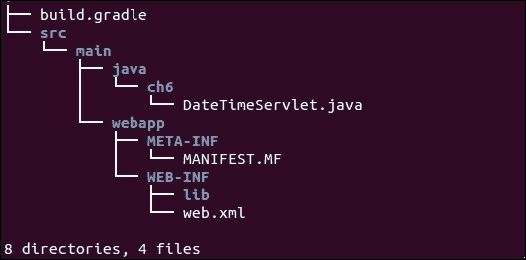
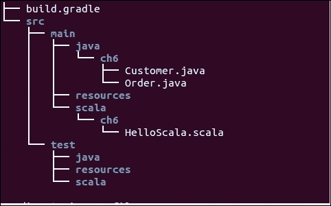
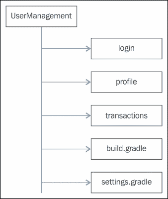
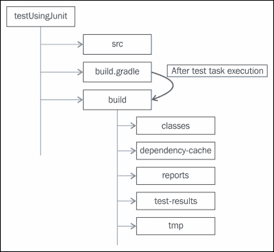
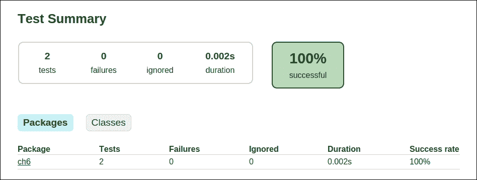
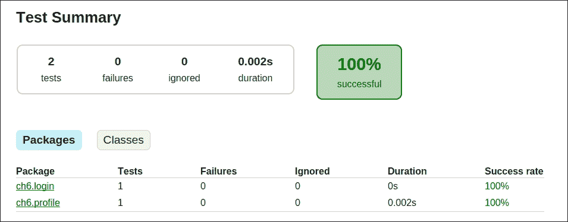
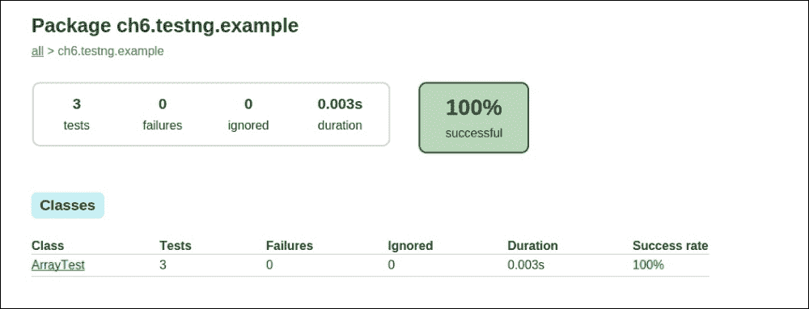

# 第六章. 使用 Gradle

本章涵盖了更多插件，如 **War** 和 **Scala**，这些插件在构建 Web 应用程序和 Scala 应用程序时将非常有用。此外，我们还将讨论诸如 **属性管理**、**多项目构建**和 **日志** 等多个主题。在 **多项目构建** 部分，我们将讨论 Gradle 如何通过根项目的构建文件支持多项目构建。它还提供了将每个模块视为独立项目的同时，将所有模块作为一个单一项目来处理的灵活性。在本章的最后部分，我们将学习使用 Gradle 的自动化测试方面。你将学习如何使用不同的配置执行单元测试。在本节中，我们将通过两个常用测试框架 JUnit 和 TestNG 的示例来了解测试概念。

# War 插件

War 插件用于构建 Web 项目，并且像任何其他插件一样，可以通过在构建文件中添加以下行来添加：

```java
apply plugin: 'war'
```

`War` 插件扩展了 Java 插件，并有助于创建 `war` 归档。`war` 插件会自动将 Java 插件应用于构建文件。在构建过程中，插件创建一个 `war` 文件而不是 `jar` 文件。War 插件禁用了 Java 插件的 `jar` 任务，并添加了一个默认的 `war` 归档任务。默认情况下，`war` 文件的内容将是来自 `src/main/java` 的编译类；来自 `src/main/webapp` 的内容以及所有运行时依赖项。内容可以通过使用 `war` 闭包进行自定义。

在我们的示例中，我们创建了一个简单的 `servlet` 文件来显示当前日期和时间，一个 `web.xml` 文件和一个 `build.gradle` 文件。项目结构在以下屏幕截图中进行展示：



图 6.1

`SimpleWebApp/build.gradle` 文件的内容如下：

```java
apply plugin: 'war'

repositories {
  mavenCentral()
}

dependencies {
  providedCompile "javax.servlet:servlet-api:2.5"
  compile("commons-io:commons-io:2.4")
  compile 'javax.inject:javax.inject:1'
}
```

`war` 插件在 Java 插件之上添加了 `providedCompile` 和 `providedRuntime` 依赖配置。`providedCompile` 和 `providedRuntime` 配置的范围分别与 `compile` 和 `runtime` 相同，但唯一的不同是这些配置中定义的库将不会成为 `war` 归档的一部分。在我们的示例中，我们已将 `servlet-api` 定义为 `providedCompile` 时间的依赖项。因此，这个库不包括在 `war` 文件的 `WEB-INF/lib/` 文件夹中。这是因为这个库由如 Tomcat 这样的 Servlet 容器提供。因此，当我们在一个容器中部署应用程序时，它将由容器添加。你可以通过以下方式展开 `war` 文件来确认这一点：

```java
SimpleWebApp$ jar -tvf build/libs/SimpleWebApp.war
 0 Mon Mar 16 17:56:04 IST 2015 META-INF/
 25 Mon Mar 16 17:56:04 IST 2015 META-INF/MANIFEST.MF
 0 Mon Mar 16 17:56:04 IST 2015 WEB-INF/
 0 Mon Mar 16 17:56:04 IST 2015 WEB-INF/classes/
 0 Mon Mar 16 17:56:04 IST 2015 WEB-INF/classes/ch6/
1148 Mon Mar 16 17:56:04 IST 2015 WEB-INF/classes/ch6/DateTimeServlet.class
 0 Mon Mar 16 17:56:04 IST 2015 WEB-INF/lib/
185140 Mon Mar 16 12:32:50 IST 2015 WEB-INF/lib/commons-io-2.4.jar
 2497 Mon Mar 16 13:49:32 IST 2015 WEB-INF/lib/javax.inject-1.jar
 578 Mon Mar 16 16:45:16 IST 2015 WEB-INF/web.xml

```

有时，我们可能还需要自定义项目的结构。例如，`webapp` 文件夹可能位于根项目文件夹下，而不是在 `src` 文件夹中。`webapp` 文件夹还可以包含新的文件夹，如 `conf` 和 `resource`，用于存储属性文件、Java 脚本、图像和其他资产。我们可能希望将 `webapp` 文件夹重命名为 `WebContent`。建议的目录结构可能如下所示：


图 6.2

我们可能还希望创建一个具有自定义名称和版本的 `war` 文件。此外，我们可能不想将任何空文件夹，如 `images` 或 `js`，复制到 `war` 文件中。

要实现这些新更改，请按照此处所述，将附加属性添加到 `build.gradle` 文件中。`webAppDirName` 属性将新的 `webapp` 文件夹位置设置为 `WebContent` 文件夹。`war` 闭包定义了版本和名称等属性，并将 `includeEmptyDirs` 选项设置为 `false`。默认情况下，`includeEmptyDirs` 被设置为 `true`。这意味着 `webapp` 目录中的任何空文件夹都将被复制到 `war` 文件中。通过将其设置为 `false`，空文件夹如 `images` 和 `js` 将不会被复制到 `war` 文件中。

以下将是 `CustomWebApp/build.gradle` 的内容：

```java
apply plugin: 'war'

repositories {
  mavenCentral()
}
dependencies {
  providedCompile "javax.servlet:servlet-api:2.5"
  compile("commons-io:commons-io:2.4")
  compile 'javax.inject:javax.inject:1'
}
webAppDirName="WebContent"

war{
  baseName = "simpleapp"
  version = "1.0"
  extension = "war"
  includeEmptyDirs = false
}
```

构建成功后，将创建名为 `simpleapp-1.0.war` 的 `war` 文件。执行 `jar -tvf build/libs/simpleapp-1.0.war` 命令并验证 `war` 文件的内容。你会发现 `conf` 文件夹被添加到了 `war` 文件中，而 `images` 和 `js` 文件夹则没有被包含。

你可能也会对用于网络应用程序部署的 Jetty 插件感兴趣，该插件允许你在嵌入式容器中部署网络应用程序。此插件会自动将 War 插件应用到项目中。Jetty 插件定义了三个任务：`jettyRun`、`jettyRunWar` 和 `jettyStop`。任务 `jettyRun` 在嵌入式 Jetty 网络容器中运行网络应用程序，而 `jettyRunWar` 任务帮助构建 `war` 文件，并在嵌入式网络容器中运行它。任务 `jettyStop` 停止容器实例。关于 War 配置的更多内容超出了本书的范围，因此，更多信息请参考 Gradle API 文档。以下是链接：[`docs.gradle.org/current/userguide/war_plugin.html`](https://docs.gradle.org/current/userguide/war_plugin.html)。

# Scala 插件

**Scala** 插件可以帮助你构建 Scala 应用程序。像任何其他插件一样，Scala 插件可以通过添加以下行应用到构建文件中：

```java
apply plugin: 'scala'
```

Scala 插件也扩展了 Java 插件并添加了一些更多任务，如 `compileScala`、`compileTestScala` 和 `scaladoc`，以处理 Scala 文件。任务名称几乎都是根据它们的 Java 等价物命名的，只需将 `java` 部分替换为 `scala`。Scala 项目的目录结构也与 Java 项目的结构类似，其中生产代码通常写在 `src/main/scala` 目录下，测试代码保存在 `src/test/scala` 目录下。图 6.3 展示了 Scala 项目的目录结构。您还可以从目录结构中观察到，Scala 项目可以包含 Java 和 Scala 源文件的混合。`HelloScala.scala` 文件的内容如下。控制台输出为 `Hello, Scala...`。这是一个非常基础的代码，我们无法对 Scala 编程语言进行太多详细讨论。我们请求读者参考可在 [`www.scala-lang.org/`](http://www.scala-lang.org/) 找到的 Scala 语言文档。

```java
package ch6

object HelloScala {
    def main(args: Array[String]) {
      println("Hello, Scala...")
    }
}
```

为了支持 Scala 源代码的编译，应在依赖配置中添加 Scala 库：

```java
dependencies {
  compile('org.scala-lang:scala-library:2.11.6')
}
```



图 6.3

如前所述，Scala 插件扩展了 Java 插件并添加了一些新任务。例如，`compileScala` 任务依赖于 `compileJava` 任务，而 `compileTestScala` 任务依赖于 `compileTestJava` 任务。这可以通过执行 `classes` 和 `testClasses` 任务并查看输出轻松理解。

|

```java
$ gradle classes
:compileJava
:compileScala
:processResources UP-TO-DATE
:classes

BUILD SUCCESSFUL

```

|

```java
$ gradle testClasses
:compileJava UP-TO-DATE
:compileScala UP-TO-DATE
:processResources UP-TO-DATE
:classes UP-TO-DATE
:compileTestJava UP-TO-DATE
:compileTestScala UP-TO-DATE
:processTestResources UP-TO-DATE
:testClasses UP-TO-DATE

BUILD SUCCESSFUL

```

|

Scala 项目也被打包成 `jar` 文件。`jar` 任务或 `assemble` 任务在 `build/libs` 目录下创建一个 `jar` 文件。

```java
$ jar -tvf build/libs/ScalaApplication-1.0.jar
0 Thu Mar 26 23:49:04 IST 2015 META-INF/
94 Thu Mar 26 23:49:04 IST 2015 META-INF/MANIFEST.MF
0 Thu Mar 26 23:49:04 IST 2015 ch6/
1194 Thu Mar 26 23:48:58 IST 2015 ch6/Customer.class
609 Thu Mar 26 23:49:04 IST 2015 ch6/HelloScala$.class
594 Thu Mar 26 23:49:04 IST 2015 ch6/HelloScala.class
1375 Thu Mar 26 23:48:58 IST 2015 ch6/Order.class

```

Scala 插件不会向 Java 插件添加任何额外的约定。因此，Java 插件中定义的约定，如 lib 目录和 report 目录，可以在 Scala 插件中重用。Scala 插件仅添加了一些 `sourceSet` 属性，如 `allScala`、`scala.srcDirs` 和 `scala`，以处理源集。以下任务示例显示了 Scala 插件可用的不同属性。此示例类似于我们在第四章第四章。插件管理中创建的约定示例任务。

以下是从 `ScalaApplication/build.gradle` 文件中的代码片段：

```java
apply plugin: 'java'
apply plugin: 'scala'
apply plugin: 'eclipse'

version = '1.0'

jar {
  manifest {
  attributes 'Implementation-Title': 'ScalaApplication', 'Implementation-Version': version
  }
}

repositories {
  mavenCentral()
}

dependencies {
  compile('org.scala-lang:scala-library:2.11.6')
  runtime('org.scala-lang:scala-compiler:2.11.6')
  compile('org.scala-lang:jline:2.9.0-1')
}

task displayScalaPluginConvention << {
  println "Lib Directory: $libsDir"
  println "Lib Directory Name: $libsDirName"
  println "Reports Directory: $reportsDir"
  println "Test Result Directory: $testResultsDir"

  println "Source Code in two sourcesets: $sourceSets"
  println "Production Code: ${sourceSets.main.java.srcDirs}, ${sourceSets.main.scala.srcDirs}"
  println "Test Code: ${sourceSets.test.java.srcDirs}, ${sourceSets.test.scala.srcDirs}"
  println "Production code output: ${sourceSets.main.output.classesDir} & ${sourceSets.main.output.resourcesDir}"
  println "Test code output: ${sourceSets.test.output.classesDir} & ${sourceSets.test.output.resourcesDir}"
}
```

任务 `displayScalaPluginConvention` 的输出如下所示：

```java
$ gradle displayScalaPluginConvention
…
:displayScalaPluginConvention
Lib Directory: <path>/ build/libs
Lib Directory Name: libs
Reports Directory: <path>/build/reports
Test Result Directory: <path>/build/test-results
Source Code in two sourcesets: [source set 'main', source set 'test']
Production Code: [<path>/src/main/java], [<path>/src/main/scala]
Test Code: [<path>/src/test/java], [<path>/src/test/scala]
Production code output: <path>/build/classes/main & <path>/build/resources/main
Test code output: <path>/build/classes/test & <path>/build/resources/test

BUILD SUCCESSFUL

```

最后，我们将通过讨论如何从 Gradle 执行 Scala 应用程序来结束本节；我们可以在构建文件中创建一个简单的任务，如下所示。

```java
task runMain(type: JavaExec){
  main = 'ch6.HelloScala'
  classpath = configurations.runtime + sourceSets.main.output + sourceSets.test.output
}
```

`HelloScala` 源文件有一个主方法，它在控制台打印 `Hello, Scala...`。`runMain` 任务执行主方法并在控制台显示输出：

```java
$ gradle runMain
....
:runMain
Hello, Scala...

BUILD SUCCESSFUL

```

# 日志记录

到目前为止，我们在构建脚本中到处使用 `println` 来向用户显示消息。如果您来自 Java 背景，您知道 `println` 语句不是向用户提供信息的正确方式。您需要日志记录。日志记录帮助用户对显示在不同级别的消息进行分类。这些不同的级别帮助用户根据情况打印正确的消息。例如，当用户想要对您的软件进行完整的详细跟踪时，他们可以使用调试级别。同样，每当用户在执行任务时想要非常有限的有用信息时，他们可以使用安静或信息级别。Gradle 提供以下不同类型的日志记录：

| 日志级别 | 描述 |
| --- | --- |
| ERROR | 这用于显示错误信息 |
| QUIET | 这用于显示有限的有用信息 |
| WARNING | 这用于显示警告信息 |
| LIFECYCLE | 这用于显示进度（默认级别） |
| INFO | 这用于显示信息消息 |
| DEBUG | 这用于显示调试信息（所有日志） |

默认情况下，Gradle 的日志级别是 LIFECYCLE。以下是从 `LogExample/build.gradle` 的代码片段：

```java
task showLogging << {
  println "This is println example"
  logger.error "This is error message"
  logger.quiet "This is quiet message"
  logger.warn "This is WARNING message"
  logger.lifecycle "This is LIFECYCLE message"
  logger.info "This is INFO message"
  logger.debug "This is DEBUG message"
}
```

现在，执行以下命令：

```java
$ gradle showLogging

:showLogging
This is println example
This is error message
This is quiet message
This is WARNING message
This is LIFECYCLE message

BUILD SUCCESSFUL

```

这里，Gradle 打印了所有生命周期级别的日志语句（包括生命周期），这是 Gradle 的默认日志级别。您也可以从命令行控制日志级别。

| `-q` | 这将显示直到安静级别的日志。它将包括错误和安静信息 |
| --- | --- |
| `-i` | 这将显示直到信息级别的日志。它将包括错误、安静、警告、生命周期和信息消息。 |
| `-s` | 这将打印出所有异常的堆栈跟踪。 |
| `-d` | 这将打印出所有日志和调试信息。这是最表达性的日志级别，它还将打印所有细节。 |

现在，执行 `gradle showLogging -q`：

```java
This is println example
This is error message
This is quiet message

```

除了常规的生命周期之外，Gradle 还提供了一个额外的选项，在发生任何异常时提供堆栈跟踪。堆栈跟踪与调试不同。在发生任何失败的情况下，它允许跟踪所有嵌套函数，这些函数按顺序调用，直到生成堆栈跟踪的点。

为了验证，在先前的任务中添加 `assert` 语句并执行以下操作：

```java
task showLogging << {
println "This is println example"
..
assert 1==2
}
```

```java
$ gradle showLogging -s
……
* Exception is:
org.gradle.api.tasks.TaskExecutionException: Execution failed for task ':showLogging'.
at org.gradle.api.internal.tasks.execution.ExecuteActionsTaskExecuter.executeActions(ExecuteActionsTaskExecuter.java:69)
 at
….
org.gradle.api.internal.tasks.execution.SkipOnlyIfTaskExecuter.execute(SkipOnlyIfTaskExecuter.java:53)
 at org.gradle.api.internal.tasks.execution.ExecuteAtMostOnceTaskExecuter.execute(ExecuteAtMostOnceTaskExecuter.java:43)
 at org.gradle.api.internal.AbstractTask.executeWithoutThrowingTaskFailure(AbstractTask.java:305)
...

```

使用 `stracktrace`，Gradle 还提供了两个选项：

+   `-s` 或 `--stracktrace`：这将打印截断的堆栈跟踪

+   `-S` 或 `--full-stracktrace`：这将打印完整的堆栈跟踪

# 文件管理

任何构建工具的关键特性之一是 I/O 操作以及你执行这些 I/O 操作（如读取文件、写入文件和目录相关操作）的容易程度。具有 Ant 或 Maven 背景的开发者知道在旧构建工具中处理文件和目录操作是多么痛苦和复杂；有时你不得不编写自定义任务和插件来执行这些类型的操作，因为 Ant 和 Maven 中的 XML 限制。由于 Gradle 使用 Groovy，它将使你在处理文件和目录相关操作时生活变得更加容易。

## 读取文件

Gradle 提供了简单的方式来读取文件。你只需要使用文件 API（应用程序编程接口），它提供了处理文件所需的一切。以下是从 `FileExample/build.gradle` 的代码片段：

```java
task showFile << {
  File file1 = file("readme.txt")
  println file1    // will print name of the file
  file1.eachLine {
    println it  // will print contents line by line
  }
}
```

要读取文件，我们使用了 `file(<文件名>)`。这是 Gradle 引用文件的默认方式，因为 Gradle 由于文件的绝对和相对引用而添加了一些路径行为 `($PROJECT_PATH/<filename>)`。在这里，第一个 `println` 语句将打印文件名，即 `readme.txt`。为了读取文件，Groovy 为 `File` API 提供了 `eachLine` 方法，该方法逐行读取文件的所有行。

要访问目录，你可以使用以下文件 API：

```java
def dir1 = new File("src")
println "Checking directory "+dir1.isFile() // will return false for directory
println "Checking directory "+dir1.isDirectory() // will return true for directory
```

## 写入文件

要写入文件，你可以使用 `append` 方法将内容添加到文件末尾，或者使用 `setText` 或 `write` 方法覆盖文件：

```java
task fileWrite << {
  File file1 = file ("readme.txt")

  // will append data at the end
  file1.append("\nAdding new line. \n")

  // will overwrite contents
  file1.setText("Overwriting existing contents")

  // will overwrite contents
  file1.write("Using write method")
}
```

## 创建文件/目录

你可以通过向其中写入一些文本来创建一个新文件：

```java
task createFile << {
  File file1 = new File("newFile.txt")
  file1.write("Using write method")
}
```

通过向文件中写入一些数据，Groovy 将自动创建文件（如果不存在的话）。

要向文件写入内容，你也可以使用左移运算符 (`<<`)，它将在文件末尾追加数据：

```java
file1 << "New content"
```

如果你想要创建一个空文件，你可以使用 `createNewFile()` 方法创建一个新文件。

```java
task createNewFile << {
  File file1 = new File("createNewFileMethod.txt")
  file1.createNewFile()
}
```

可以使用 `mkdir` 命令创建一个新的目录。Gradle 还允许你使用 `mkdirs` 命令在一个命令中创建嵌套目录：

```java
task createDir << {
  def dir1 = new File("folder1")
  dir1.mkdir()

  def dir2 = new File("folder2")
  dir2.createTempDir()

  def dir3 = new File("folder3/subfolder31")
  dir3.mkdirs() // to create sub directories in one command
}
```

在前面的例子中，我们创建了两个目录，一个使用 `mkdir()`，另一个使用 `createTempDir()`。区别在于当我们使用 `createTempDir()` 创建目录时，该目录会在构建脚本执行完成后自动删除。

## 文件操作

我们将看到一些在处理文件时经常使用的示例，这将有助于你在构建自动化中。

```java
task fileOperations << {
  File file1 = new File("readme.txt")
  println "File size is "+file1.size()
  println "Checking existence "+file1.exists()
  println "Reading contents "+file1.getText()
  println "Checking directory "+file1.isDirectory()
  println "File length "+file1.length()
  println "Hidden file "+file1.isHidden()

  // File paths
  println "File path is "+file1.path
  println "File absolute path is "+file1.absolutePath
  println "File canonical path is "+file1.canonicalPath

// Rename file
file1.renameTo("writeme.txt")

// File Permissions
file1.setReadOnly()
println "Checking read permission "+ file1.canRead()+" write permission "+file1.canWrite()
file1.setWritable(true)
println "Checking read permission "+ file1.canRead()+" write permission "+file1.canWrite()

}
```

大多数前面的方法都是不言自明的。尝试执行前面的任务并观察输出。如果你尝试执行 `fileOperations` 任务两次，你会得到异常 `readme.txt (No such file or directory)`，因为你已经将文件重命名为 `writeme.txt`。

## 过滤文件

某些文件方法允许用户传递一个正则表达式作为参数。正则表达式可以用来过滤出所需的数据，而不是获取所有数据。以下是一个`eachFileMatch()`方法的示例，它将仅列出目录中的 Groovy 文件：

```java
task filterFiles << {
  def dir1 = new File("dir1")
  dir1.eachFileMatch(~/.*.groovy/) {
    println it
  }
  dir1.eachFileRecurse { dir ->
    if(dir.isDirectory()) {
      dir.eachFileMatch(~/.*.groovy/) {
        println it
      }
    }
  }
}
```

输出如下：

```java
$ gradle filterFiles

:filterFiles
dir1\groovySample.groovy
dir1\subdir1\groovySample1.groovy
dir1\subdir2\groovySample2.groovy
dir1\subdir2\subDir3\groovySample3.groovy

BUILD SUCCESSFUL

```

## 删除文件和目录

Gradle 提供了`delete()`和`deleteDir()` API 来分别删除文件和目录：

```java
task deleteFile << {
  def dir2 = new File("dir2")
  def file1 = new File("abc.txt")
  file1.createNewFile()
  dir2.mkdir()
  println "File path is "+file1.absolutePath
  println "Dir path is "+dir2.absolutePath
  file1.delete()
  dir2.deleteDir()
  println "Checking file(abc.txt) existence: "+file1.exists()+" and Directory(dir2) existence: "+dir2.exists()
}
```

输出如下：

```java
$ gradle deleteFile
:deleteFile
File path is Chapter6/FileExample/abc.txt
Dir path is Chapter6/FileExample/dir2
Checking file(abc.txt) existence:  false and Directory(dir2) existence:  false

BUILD SUCCESSFUL

```

前面的任务将创建一个目录`dir2`和一个文件`abc.txt`。然后它将打印绝对路径，最后删除它们。您可以通过调用`exists()`函数来验证是否已正确删除。

## 文件树

到目前为止，我们已处理了单个文件操作。Gradle 提供了许多用户友好的 API 来处理文件集合。其中一个这样的 API 是**FileTree**。FileTree 表示文件或目录的层次结构。它扩展了`FileCollection`接口。Gradle 中的多个对象，如`sourceSets`，实现了`FileTree`接口。您可以使用`fileTree()`方法初始化 FileTree。以下是可以初始化`fileTree`方法的不同方式：

```java
task fileTreeSample << {
  FileTree fTree = fileTree('dir1')
  fTree.each {
    println it.name
  }
  FileTree fTree1 = fileTree('dir1') {
    include '**/*.groovy'
  }
  println ""
  fTree1.each {
    println it.name
  }
  println ""
FileTree fTree2 = fileTree(dir:'dir1',excludes:['**/*.groovy'])
  fTree2.each {
    println it.absolutePath
  }
}
```

执行`gradle fileTreeSample`命令并观察输出。第一次迭代将打印`dir1`中的所有文件。第二次迭代将仅包括 Groovy 文件（扩展名为`.groovy`）。第三次迭代将排除 Groovy 文件（扩展名为`.groovy`）并打印其他带有绝对路径的文件。

您还可以使用文件树来读取诸如 ZIP、JAR 或 TAR 等存档文件的内容：

```java
FileTree jarFile = zipTree('SampleProject-1.0.jar')
jarFile.each {
  println it.name
}
```

上述代码片段将列出`jar`文件中包含的所有文件。

# 属性管理

我们无法在不进行动态配置的情况下在不同的操作系统或不同的环境中提供软件。配置软件的一种方法是通过使用属性文件或环境属性。以下列出了 Gradle 提供配置属性到`build.gradle`的不同方式：

+   `ext`闭包

+   `gradle.properties`

+   命令行

+   自定义属性文件

## ext 闭包

我们在第三章“管理任务”中看到了许多示例，使用`ext`闭包向项目中添加自定义属性。因此，我们不会在本章中讨论此主题。

## gradle.properties

Gradle 提供了一个默认机制，使用`gradle.properties`来读取属性文件。您可以将`gradle.properties`文件添加到以下任何位置：

+   `<USER_HOME>/.gradle`：在此目录下定义的 `gradle.properties` 可供所有项目访问。您可以使用此文件定义全局属性，并且可以使用 `$project.<propertyname>` 访问这些属性。如果您已将 `GRADLE_USER_HOME` 定义为其他目录，则 Gradle 将跳过 `<USER_HOME>/.gradle` 目录，并从 `GRADLE_USER_HOME` 目录读取 `gradle.properties`。默认情况下，`<USER_HOME>/.gradle` 将被视为读取 `gradle.properties` 文件。如果 `<USER_HOME>/.gradle/gradle.properties` 中定义了属性，但用户未设置，则会导致异常。如果不希望出现这种情况，应使用 `project` 的 `hasProperty` 方法检查这些属性，如果没有设置，则应使用默认值初始化。此属性文件也可用于存储密码。

+   `<ProjectDir>`：在此目录下定义的 `gradle.properties` 可供当前项目访问。您无法从任何其他项目访问这些属性。因此，所有项目特定的属性都可以在项目的 `gradle.properties` 文件中定义。

    除了项目级别的属性外，您还可以在 `gradle.properties` 文件中定义系统级别的属性。要定义系统级别的属性，您可以使用 `systemProp` 将属性追加。因此，`systemProp.sProp1=sVal1` 将 `sProp1` 设置为具有值 `sVal1` 的系统级别属性。

我们将在下一节中看到一个示例。

## 命令行

您也可以使用 `-P` 和 `-D` 选项在命令行上定义运行时属性。使用 `-P`，您可以定义项目特定的属性。使用 `-D`，您可以定义系统级别的属性。要访问系统级别的属性，您可以使用 `System.properties['<propertyname>']`。请注意，命令行属性会覆盖 `gradle.properties`。当您在多个位置配置属性时，以下顺序适用，最后一个具有最高优先级：

+   项目 `build` 目录中的 `gradle.properties`

+   Gradle 用户主目录中的 `gradle.properties`

+   命令行设置的系统属性。

## 自定义属性文件

您可能希望为属性文件使用自定义文件名，例如，`login.properties` 或 `profile.properties`。要使用自定义属性，只需使用 `FileInputStream` 读取文件并将其转换为属性对象：

```java
task showCustomProp << {
  Properties props = new Properties()
  props.load(new FileInputStream("login.properties"))
  println props
  println props.get('loginKey1')
}
```

上述代码将读取 `login.properties` 文件，第一个 `println` 语句将打印所有属性，而第二个 `println` 语句将显示 `loginKey1` 属性的值。

让我们来看一个综合示例。我们将在 `<USER_HOME>/.gradle` 目录中创建一个 `gradle.properties` 文件，并在项目目录中创建另一个 `gradle.properties` 文件：

`<USER_HOME>/.gradle/gradle.properties`

```java
globalProp1=globalVal1
globalProp2=globalVal2

```

`Chapter6/PropertyExample/Proj1/gradle.properties`

```java
Proj1Prop1=Proj1Val1
Proj1Prop2=Proj1Val2
systemProp.sysProp1=sysVal1

```

这里是我们的构建脚本，`Chapter6/PropertyExample/Proj1/build.gradle`：

```java
task showProps << {
  println "local property "+Proj1Prop1
  println "local property "+Proj1Prop2
  println "local property via command line: "+projCommandProp1
  println "global property "+globalProp1
  println "global property "+globalProp2
  println "System property "+System.properties['sysProp1']
  println "System property via command line: "+System.properties['sysCommandProp1']
}
```

现在，执行以下命令：

```java
$gradle -PprojCommandProp1=projCommandVal1-DsysCommandProp1=sysCommandVal1 showProps

:showProps
local property Proj1Val1
local property Proj1Val2
local property via command line: projCommandVal1
global property globalVal1
global property globalVal2
System property sysVal1
System property via command line: sysCommandVal1

BUILD SUCCESSFUL

```

在这里，你可以看到前两行包含在项目的 `gradle.properties` 文件中定义的属性。第三行显示了用户使用 `-P` 选项初始化的属性。第四和第五行显示了在 `<USER_HOME>/.gradle/gradle.properties` 中定义的属性。第六行显示了在项目的 `gradle.properties` 文件中定义的系统属性，最后，示例显示了使用 `-D` 选项在命令行中传递的系统属性。

# 多项目构建

我们已经探索了 Gradle 的许多特性，例如任务、插件和依赖管理。我们看到了许多涉及内置任务、自定义任务和任务之间依赖关系的构建脚本示例。然而，我们还没有涵盖 Gradle 的一个主要特性，即**多项目构建**。直到现在，我们只看到了单个项目的构建文件。单个项目构建文件仅代表一个项目或一个模块。在任何软件世界中，最初通常从一个模块开始，随着软件随着时间的推移成熟和增长，它变成一个大项目。然后我们需要再次将其划分为不同的子模块，但总体来说，我们只使用一个文件来构建项目。Gradle 提供了将不同的模块视为不同项目的能力，这些项目可以归入根项目之下。它还提供了独立构建子模块而不构建完整项目的灵活性。

多项目构建不是一个新概念。Gradle 提供的唯一附加功能是分别将模块作为单独的子项目构建，并且每当需要时，可以使用根项目构建整个模块。子项目具有 Gradle 中项目对象的所有属性和功能。你可以定义模块之间的模块依赖关系。Gradle 允许你定义子项目任务对其他子项目的依赖关系。你可以仅构建一个子项目（及其依赖关系）以优化构建性能时间等。

## 多项目结构

考虑一个简单的用户管理 Java 应用程序，该应用程序验证和授权用户，允许用户管理其个人资料，并执行交易。假设我们将这个应用程序划分为三个不同的子项目或模块：登录模块、个人资料模块和交易模块。

可能还会出现另一个问题，当我们已经定义了三个子项目时，为什么还需要根项目 `UserManagement`，因为它不包含任何源代码？根项目的一个目的就是在子项目之间进行协调，定义项目之间的依赖关系（如果有的话），定义公共行为以避免在每个项目中重复构建配置，等等。

这三个模块的目的是独立工作于它们，分别构建它们，如果需要，可以无任何依赖关系地发布其工件。

目录结构将类似于以下图表：



图 6.4

在这里，我们创建了三个子项目：**login**、**profile**和**transaction**，每个模块都有自己的`src/main/java`层次结构。我们将子项目分组在根项目**UserManagement**下。此外，根项目包含一个**build.gradle**文件和一个**settings.gradle**文件。

**settings.gradle**文件是多项目构建中的关键文件之一。此文件需要存在于根项目的目录中。它列出了所有子项目。以下代码显示了**settings.gradle**文件的内容：

```java
settings.gradle:
include 'login', 'profile', 'transactions'
```

在这里，我们已包含所有属于根项目的子项目。执行以下命令后，我们将获得所有项目详情作为输出：

```java
$ gradle projects
……
Root project 'UserManagement'
+--- Project ':login'
+--- Project ':profile'
\--- Project ':transactions'
……

BUILD SUCCESSFUL

```

输出显示了根项目`UserManagement`以及所有位于根项目下的子项目。现在，尝试删除`settings.gradle`文件或在`settings.gradle`文件中删除包含语句，然后再次运行此命令。这次，它将仅显示根项目详情。`settings.gradle`是一个重要的文件，它使根项目了解它应该包含的所有子项目。也可以使用`'subproject:subsubproject','subproject:subsubproject:subsubsubproject'`等来声明多级子项目。

我们讨论了 Gradle 构建生命周期的三个阶段：初始化、配置和执行。在初始化阶段使用`settings.gradle`文件，Gradle 会将所有子项目实例添加到构建过程中。您也可以通过使用`include(String[])`方法向此对象添加项目。

`settings.gradle`文件还可以访问在构建的设置目录中定义的`gradle.properties`文件或`<USER_HOME>/.gradle`目录中的属性，以及使用`-P`选项在命令行上提供的属性。`settings.gradle`文件还可以执行 Gradle 任务，包括插件和其他操作，这些操作可以在任何`.gradle`文件中完成。

## 多项目执行

为了确定当前构建过程是否是多项目构建的一部分，它首先在当前目录中搜索`settings.gradle`文件，然后在其父级层次结构中搜索。如果在同一目录中找到`settings.gradle`，它将自己视为父项目，然后检查子项目。在另一种情况下，如果在其父级层次结构中找到`settings.gradle`文件，它会检查当前子目录是否是找到的根项目的子项目。如果当前项目是根项目的一部分，那么它作为多项目构建的一部分执行，否则作为单一项目构建。

以下是在`UserManagement`目录下的示例`build.gradle`：

```java
println "Project name is $name"

project(':login') {
  apply plugin: 'java'
  println "Project name is $name"
  task loginTask << {
    println "Task name is $name"
  }
}

project(':profile') {
  apply plugin: 'java'
  println "Project name is $name"
  task profileTask << {
    println "Task name is $name"
  }
}
project(':transactions') {
  apply plugin: 'java'
  println "Project name is $name"
  task transactionTask << {
    println "Task name is $name"
  }
}
```

现在，尝试从`UserManagement`目录执行以下命令：

```java
/UserManagement$ gradle

Project name is UserManagement
Project name is login
Project name is profile
Project name is transactions
:help

...

```

现在，转到 `login` 目录并执行相同的命令；你会找到类似的输出。区别在于，在子项目中，帮助任务会被替换为：`login:help`，因为 Gradle 会自动检测你所在的子项目。

在第一种情况下，Gradle 在同一目录中找到了 settings.gradle 文件，并找到了三个子项目。Gradle 初始化了三个子项目，并在配置阶段执行了配置语句。我们没有提到任何任务，所以没有执行任何任务。

在第二种情况下，当我们从登录模块执行 Gradle 命令时，Gradle 再次开始搜索 `settings.gradle` 文件，并在父目录中找到了这个文件，并且也发现当前项目是多项目构建的一部分，因此作为多项目构建执行了构建脚本。

你可能已经注意到这里我们没有为任何子项目定义任何 `build.gradle` 文件。我们将所有子项目添加到了根项目的构建文件中。这是定义多项目构建的一种方法。另一种方法是，在每个子项目中创建单独的 build.gradle 文件。只需从主构建文件中移除项目闭包，并将其复制到相应的项目构建文件中。新的项目结构如图 6.4 所示：


图 6.5

## 任务执行

在执行多项目构建中的任务之前，Gradle 将在根项目和所有子项目中搜索该任务。如果任务在多个项目中找到，它将依次执行所有任务。从 `UserManagement` 目录执行以下命令：

```java
$ gradle loginTask

Project name is UserManagement
Project name is login
Project name is profile
Project name is transactions
:login:loginTask
Task name is loginTask

BUILD SUCCESSFUL

```

现在，将 `loginTask` 复制到交易项目，并尝试执行相同的命令：

```java
$ gradle loginTask
….
:login:loginTask
Task name is loginTask
:transactions:loginTask
Task name is loginTask

BUILD SUCCESSFUL

```

在这里，你可以看到 Gradle 在 `login` 和 `transactions` 项目中执行的 `loginTask`。要执行特定项目的任务，请在任务名称前加上项目名称，并使用冒号（`:`）作为分隔符——`gradle project:task`。要为 `login` 模块执行 `loginTask`，使用 `$ gradle login:loginTask` 命令。

多项目构建有助于避免冗余配置，并允许适当地优化和组织构建文件结构。

在前面的例子中，我们有三个子项目，它们都依赖于 Java 插件。这些子项目可能还依赖于一些公共库。我们可以在根项目中定义一个公共配置，而不是在每个子项目的构建文件中定义依赖关系。这样做，整个子项目将继承这个公共配置。这可以通过使用两个闭包：`allprojects`和`subprojects`来实现。在`allprojects`下定义的配置将由所有子项目共享，包括根项目，而在`subprojects`下定义的配置将由所有子项目共享，但不包括根项目。添加以下`subprojects{}`和`allprojects{}`闭包，这些闭包用于构建文件并从每个子项目中移除`apply plugin: 'java'`语句：

```java
println "Project name is $name"
allprojects {
  version = '2.0'
}
subprojects { // for all subprojects
  apply plugin: 'java'
  repositories {
    mavenCentral()
  }
  dependencies {
    compile 'log4j:log4j:1.2.16'
  }
}
```

在这里，我们已将 Java 插件、`repositories`闭包和公共依赖项添加到`subprojects`闭包中。因此，它将由所有子项目共享。我们在`allprojects`中添加了一个版本，这将由所有子项目共享，包括根子项目。

现在，尝试执行以下命令：

```java
$ gradle clean
Project name is UserManagement
Project name is login
Project name is profile
Project name is transactions
:login:clean
:profile:clean
:transactions:clean

BUILD SUCCESSFUL

```

它已执行了所有子项目的 clean 任务，但未执行根项目的任务。即使你尝试显式执行`UserManagement:clean`任务，它也会抛出异常。如果你在`allprojects`闭包中添加`apply plugin: 'java'`，它将把 clean 任务添加到根项目和子项目中。

## 平级层次结构

除了父/子层次结构之外，你还可以在同一级别创建子项目，可以使用`includeFlat '<projectname>'`语法来包含它们。

让我们在与`UserManagement`模块同一级别的位置添加一个额外的子项目部门。

可以通过在`settings.gradle`文件中添加以下代码，将`department`模块作为子项目添加到`UserManagement`项目中：

```java
includeFlat 'department'
// adding same level project as sub project
```

## 项间依赖

当你在多项目构建上执行一些常见任务，如`clean`和`compile`（在添加 Java 插件后），默认的执行顺序是基于它们的字母顺序：

```java
$ gradle clean

Project name is UserManagement
Project name is department
Project name is login
Project name is profile
Project name is transactions
:department:clean UP-TO-DATE
:login:clean UP-TO-DATE
:profile:clean UP-TO-DATE
:transactions:clean UP-TO-DATE

BUILD SUCCESSFUL

```

首先评估第一个根项目，然后按照字母顺序评估所有子项目。为了覆盖默认行为，Gradle 为你提供了不同级别的依赖管理。

## 配置级别的依赖

配置级别的依赖在依赖于它的项目执行之后评估或配置项目。例如，你想要在配置项目中设置一些属性，并想要在登录项目中使用这些属性。你可以通过使用`evaluationDependsOn`来实现这一点。为了启用此功能，你应该为每个子项目有单独的`build.gradle`文件。让我们为每个子项目创建独立的`build.gradle`文件。

你可以按照以下模式创建每个子项目和`build.gradle`。

```java
/<project name>/build.gradle
println "Project name is $name"
task <projectName>Task << {
  println "Task name is $name "
}
```

根项目`build.gradle`将如下所示：

`UserManagement_confDep/build.gradle`

```java
println "Project name is $name"
allprojects {
  version = '2.0'
}
subprojects { // for all sub projects
  apply plugin: 'java'
  repositories {
    mavenCentral()
  }
}
```

现在，执行以下 Gradle 命令：

```java
/UserManagement_confDep$ gradle

Project name is UserManagement_confDep
Project name is login
Project name is profile
Project name is transactions
...
BUILD SUCCESSFUL

```

我们没有执行任何任务就执行了 Gradle 命令。它执行到了配置阶段，你可以看到之前的配置顺序按字母顺序排列（在根项目配置之后）。

现在，在你的登录项目`build.gradle`文件中添加以下语句：

```java
evaluationDependsOn(':profile')
```

然后，执行 Gradle 命令：

```java
/UserManagement_confDep$ gradle

Project name is UserManagement_confDep
Project name is profile    // Order is changed
Project name is login
Project name is transactions
……
BUILD SUCCESSFUL

```

现在，你可以看到配置配置在登录配置之前被评估。

## 任务级别依赖

可能存在一种情况，一个项目的任务可能依赖于另一个项目的任务。Gradle 允许你在子项目之间维护任务级别的依赖关系。以下是一个示例，其中`loginTask`依赖于`profileTask`：

```java
project(':login') {
  println "Project name is $name"
  task loginTask (dependsOn: ":profile:profileTask")<< {
    println "Task name is $name"
  }
}
```

现在的输出显示了任务之间的依赖关系：

```java
/UserManagement_taskDep$ gradle loginTask
….
:profile:profileTask
Task name is profileTask
:login:loginTask
Task name is loginTask

BUILD SUCCESSFUL

```

如果你使用`dependsOn`在不同项目之间声明执行依赖，此方法的默认行为是在两个项目之间创建配置依赖。

## 库依赖

如果一个子项目需要另一个子项目的类文件或 JAR 文件来编译，这可以作为一个编译时依赖引入。如果登录项目需要在它的类路径中包含配置 JAR，你可以在编译级别引入依赖：

```java
project(':login') {
  dependencies {
    compile project(':profile')
  }
  task loginTask (dependsOn: ":profile:profileTask")<< {
    println "Task name is $name"
  }
}
```

```java
/UserManagement_libDep$ gradle clean compileJava
...
:login:clean
:profile:clean
:transactions:clean
:department:compileJava UP-TO-DATE
:profile:compileJava
:profile:processResources UP-TO-DATE
:profile:classes
:profile:jar
:login:compileJava
:transactions:compileJava

BUILD SUCCESSFUL

```

从输出中，我们可以意识到所有依赖模块都在执行登录编译任务之前被编译。

## 部分构建

在开发过程中，你可能需要反复构建项目。有时你并没有对你的依赖子项目进行任何更改，但 Gradle 默认总是先构建依赖项，然后再构建依赖的子项目。这个过程可能会影响整体构建性能。为了解决这个问题，Gradle 提供了一个名为部分构建的解决方案。部分构建允许你只构建所需的项目，而不是其依赖项目。在上面的示例中，我们有登录模块对配置项目的编译依赖。要编译不依赖配置子项目的登录项目，可以使用命令行选项`-a`：

```java
$ gradle :login:compileJava -a
:login:compileJava

BUILD SUCCESSFUL

```

## buildDependents

在企业项目中，我们有项目依赖。当你想构建一个项目，同时你又想构建其他依赖项目时，Java 插件提供了`buildDependents`选项。

在上一个示例中，登录项目对配置项目有编译时依赖。我们将尝试使用`buildDependents`选项构建配置：

```java
/UserManagement_libDep$ gradle :profile:buildDependents
. . .
:profile:compileJava UP-TO-DATE
:profile:processResources UP-TO-DATE
:profile:classes UP-TO-DATE
:profile:jar UP-TO-DATE
:login:compileJava UP-TO-DATE
:login:processResources UP-TO-DATE
:login:classes UP-TO-DATE
:login:jar
:login:assemble
:login:compileTestJava UP-TO-DATE
:login:processTestResources UP-TO-DATE
:login:testClasses UP-TO-DATE
:login:test UP-TO-DATE
:login:check UP-TO-DATE
:login:build
:login:buildDependents
:profile:assemble UP-TO-DATE
:profile:compileTestJava UP-TO-DATE
:profile:processTestResources UP-TO-DATE
:profile:testClasses UP-TO-DATE
:profile:test UP-TO-DATE
:profile:check UP-TO-DATE
:profile:build UP-TO-DATE
:profile:buildDependents

BUILD SUCCESSFUL

```

由于登录模块依赖于配置模块，执行配置项目也会构建登录项目。

## buildNeeded

当你构建项目时，它只编译代码并准备 JAR 文件。如果你对其他项目有编译时依赖，它只编译其他项目并准备 JAR 文件。为了检查完整组件的功能，你可能还想执行测试用例。要执行子项目和依赖项目的测试用例，使用`buildNeeded`：

```java
/UserManagement_libDep$ gradle :login:buildNeeded
. . .
:login:processTestResources UP-TO-DATE
:login:testClasses UP-TO-DATE
:login:test UP-TO-DATE
:login:check UP-TO-DATE
:login:build UP-TO-DATE
:profile:assemble UP-TO-DATE
:profile:compileTestJava UP-TO-DATE
:profile:processTestResources UP-TO-DATE
:profile:testClasses UP-TO-DATE
:profile:test UP-TO-DATE
:profile:check UP-TO-DATE
:profile:build UP-TO-DATE
:profile:buildNeeded UP-TO-DATE
:login:buildNeeded UP-TO-DATE

BUILD SUCCESSFUL

```

在这里，`buildNeeded`不仅执行登录测试用例，还执行配置文件测试用例。

# 使用 Gradle 进行测试

除非软件通过了适当的质量检查，否则没有任何软件是生产就绪的。这有助于以最低的缺陷交付软件，并节省大量的维护工作。然而，手动测试执行需要大量时间来执行测试，因此软件发布周期被延迟。如果测试自动化，可以改善发布时间和生产力。

Gradle 提供了一种自动执行测试代码的方法，特别是对于单元测试。在下一节中，我们将探讨如何将 JUnit 和 TestNG 与 Gradle 集成。

## JUnit

Gradle 的 Java 插件提供了一个预定义的结构来保持测试代码和测试资源以进行配置和执行。与源代码结构一样，默认的测试代码位置是`src/test/java/<test_package>`。如果你遵循此约定，你只需执行`test`任务即可运行单元测试用例，如下面的命令所示：

```java
$ gradle test
:compileJava
:processResources
:classes
:compileTestJava
:processTestResources
:testClasses
:test
BUILD SUCCESSFUL

```

这个测试任务将执行所有必要的操作，例如编译源代码、编译测试代码、处理资源，最后执行测试用例并创建报告。

JUnit 提供了一个用户友好的格式来理解结果。在执行测试任务后，你会找到以下层次结构：



图 6.6

`reports`文件夹包含一个名为`index.html`的 HTML 格式的`tests`子目录，其中包含测试摘要结果。如果你打开`index.html`文件，你会看到以下输出：



图 6.7

它提供了对测试用例场景的完整分析，例如执行测试用例的数量、失败的测试用例、忽略的测试用例等。从报告中，你可以通过跟随报告页面上的超链接进一步深入到单个测试用例级别。如果发生错误/异常，报告将显示详细的解释，并以表格格式显示执行时间。

到目前为止，我们只讨论了使用 Gradle 执行测试用例。为了编译和执行测试用例，我们需要一个测试框架库。像任何其他配置一样，你需要将 JUnit JAR 作为项目的依赖项提及。通常，依赖项作为`testCompile`配置添加：

```java
repositories {
  mavenCentral()
}
dependencies {
  testCompile 'junit:junit:4.12'
}
```

此配置将从 Maven 仓库下载`junit-4.12.jar`，JAR 文件将在编译和执行阶段添加到类路径中。

### 测试配置

可以为测试配置设置不同的配置参数，这有助于优化资源并根据项目需求自定义行为。

有时，测试目录结构不遵循默认约定，即`src/test/java`。与源代码目录配置类似，你可以按照以下方式配置新的测试代码位置：

```java
sourceSets {
  test {
    java {
      srcDir 'testSrc'
    }
  }
}
```

#### maxParallelForks

Gradle 在单独的 JVM 中执行测试用例。默认情况下，Gradle 在单个进程中执行所有测试。您可以通过在`test`闭包中配置`maxParallelForks`属性来指定并行进程的数量。其默认值是`1`：

```java
test {
maxParallelForks = 3
}
```

要了解其确切的工作方式，我们可以修改我们之前的例子。只需在`src/test/java`中创建测试类的多个副本。在我们的例子中，在`TestUsingJunitParallel`项目中，我们创建了总共五个与`LoginTest`相同的副本，例如`LoginTest1`、`LoginTest2`等。现在，使用`--info`选项执行 Gradle 命令：

```java
TestUsingJunitParallel$ gradle clean --info test | grep 'Test Executor'
. . . .
. . . .
Successfully started process 'Gradle Test Executor 2'
Successfully started process 'Gradle Test Executor 1'
Successfully started process 'Gradle Test Executor 3'
Gradle Test Executor 2 started executing tests.
Gradle Test Executor 3 started executing tests.
Gradle Test Executor 1 started executing tests.
Gradle Test Executor 3 finished executing tests.
Gradle Test Executor 2 finished executing tests.
Gradle Test Executor 1 finished executing tests.

```

命令行输出显示 Gradle 创建了三个进程，并且所有测试用例都在这些进程中执行。

#### `forkEvery`选项

此选项允许设置每个进程的测试类数。默认值是`0`，即无限。如果您将此选项设置为非零值，则当达到此限制时将创建进程。

在上一个例子中，我们有五个测试类，并将并行处理计数设置为三个。现在，我们将`forkEvery`选项设置为`1`，因此每个进程将只执行一个测试类：

```java
test {
  ignoreFailures = true
  maxParallelForks = 3
  forkEvery = 1
}
```

```java
TestUsingJunitParallel$ gradle clean --info test | grep 'Test Executor'
. . . .
Successfully started process 'Gradle Test Executor 1'
Successfully started process 'Gradle Test Executor 3'
Successfully started process 'Gradle Test Executor 2'
Gradle Test Executor 1 started executing tests.
Gradle Test Executor 2 started executing tests.
Gradle Test Executor 3 started executing tests.
Gradle Test Executor 1 finished executing tests.
Starting process 'Gradle Test Executor 4'. Working directory:
. . . .
Successfully started process 'Gradle Test Executor 4'
Gradle Test Executor 3 finished executing tests.
Gradle Test Executor 2 finished executing tests.
Starting process 'Gradle Test Executor 5'. Working directory:
. . . .
Successfully started process 'Gradle Test Executor 5'
Gradle Test Executor 4 started executing tests.
Gradle Test Executor 5 started executing tests.
Gradle Test Executor 4 finished executing tests.
Gradle Test Executor 5 finished executing tests.

```

从输出中，我们可以观察到 Gradle 首先创建了三个进程，执行了三个测试类。然后，创建了另外两个进程，例如`'Gradle Test Executor 4'`和`'Gradle Test Executor 5'`，用于执行另外两个测试文件。

#### 忽略失败

无论哪个测试用例失败，构建都会标记为`FAILED`：

```java
$ gradle test
. . .
:test

ch6.login.LoginTest > testLogin1 FAILED
 java.lang.AssertionError at LoginTest.java:26

4 tests completed, 1 failed
:test FAILED

FAILURE: Build failed with an exception.
. . .
BUILD FAILED

```

如果您希望构建无论测试用例结果如何都成功，您可以在构建脚本`test`闭包中添加`ignoreFailures=true`，如前例所示。其默认值是`false`。再次执行测试任务时，构建将成功如下：

```java
$ gradle test
. . .
ch6.login.LoginTest > testLogin1 FAILED
 java.lang.AssertionError at LoginTest.java:26

4 tests completed, 1 failed
. . .
BUILD SUCCESSFUL

```

#### 过滤

Gradle 允许您通过基于不同的模式过滤测试用例来选择性地执行测试用例。假设我们有两个测试包，包含四个测试用例。

`/src/test/java/ch6/login/LoginTest.java`包含以下两个测试包：

+   `testUserLogin1()`

+   `testUserLogin2()`

`/src/test/java/ch6/profile/ProfileTest.java`包含以下两个测试包：

+   `testUserProfile1()`

+   `testUserProfile2()`

以下代码片段显示了如何根据不同的模式应用过滤器：

```java
test {
  filter {
    // 1: execute only login test cases
    includeTestsMatching "ch6.login.*"

    //2: include all test cases matching *Test
    includeTestsMatching "*Test"

    //3: include all integration tests having 1 in their name
    includeTestsMatching "*1"

    //4: Other way to include/exclude packages
    include "ch6/profile/**"
  }
}
```

第一个过滤器将只从`ch6.login`包中识别出两个测试用例。第二个过滤器选择所有四个测试用例，因为测试类名与`*Test`模式匹配。第三个语句最终只过滤出两个测试用例：`testUserLogin1()`和`testUserProfile1()`。

只注释前两个模式，并使用过滤器模式`*1`执行测试。尽管我们总共有四个测试用例，但你将发现 Gradle 会从每个包中执行一个测试用例。你也可以使用前面示例中提到的包结构，通过使用`include`或`exclude`来包含或排除包。如果你只想执行单个测试类，你也可以通过将测试类追加到命令行选项`--tests`来执行它：命令`gradle tests --tests ch6.login.LoginTest`将只执行`LoginTest`类中提到的测试用例：



图 6.8

## TestNG

Gradle 还提供了与 TestNG 框架的集成。要在 TestNG 中编写测试用例，你需要在`build.gradle`文件中添加依赖项：

```java
dependencies {
  testCompile 'org.testng:testng:6.8.21'
}
```

在我们的示例中，我们创建了一个包含三个测试用例的 TestNG 测试类。现在，通过执行测试任务，我们得到在`build/reports/tests`下创建的报告文件：

```java
$ gradle clean test

```

现在，打开`index.html`文件，你会看到以下输出：



图 6.9

报告的外观和感觉与之前看到的 JUnit 相似。实际上，JUnit 和 TestNG 本身生成完全不同的报告格式，但 Gradle 将它们协调成标准的外观和感觉。

如*JUnit*部分所述，你还可以在`test`闭包中定义其他属性，例如`ignoreFailures`、`maxParallelForks`等。

```java
test{
  useTestNG()
  ignoreFailures = true
  maxParallelForks = 2
  forkEvery = 1
}
```

### 基于组的执行

在前面的`test`闭包中，我们使用了`useTestNG`选项来启用`TestNG`支持。你还可以在此闭包中设置其他选项，如组和监听器。例如，以下设置仅执行具有组名`Smoke`的测试用例，并在`reports/tests`文件夹中创建一个额外的可发送电子邮件的`TestNG`报告：

```java
useTestNG(){
  includeGroups 'Smoke'
  listeners << 'org.testng.reporters.EmailableReporter'
}
```

在`useTestNG`中，你可以根据`@Test`注解的 group 属性对测试用例进行分组：

```java
@Test(groups = "<group name>")
```

在我们的示例中，我们将测试用例分组为`Smoke`和`Integration`。在执行`test`任务时，只有`verifyArraySize`和`verifyArrayNotNull`测试用例将被执行：

```java
@Test(groups = "Smoke")
public void verifyArraySize()

@Test(groups = "Smoke")
public void verifyArrayNotNull()

@Test(groups = "Integration")
public void verifyArrayPosition()
```

### 基于 TestNG 套件文件的执行

TestNG 套件文件提供了更好的控制来执行测试。在测试套件文件中，你可以定义所有将被包含以执行测试用例的测试类和方法，基于组名的任何过滤器，监听器信息等。

我们在`src/test/resource`文件夹中创建了一个`testng.xml`文件。该文件包含三个关键信息；创建可发送电子邮件的报告格式的`listener`配置，包含测试组为`Smoke`，并将`ArrayTest`文件作为测试类添加。使用测试套件文件，你还可以配置其他属性，例如线程池大小、测试类或测试方法是否并行运行，等等：

```java
<!DOCTYPE suite SYSTEM "http://testng.org/testng-1.0.dtd" >
<suite name="Suite1" verbose="1" >
  <listeners>
    <listener class-name="org.testng.reporters.EmailableReporter" />
  </listeners>
  <test name="Smoke Test">
    <groups>
      <run>
        <exclude name="Integration" />
        <include name="Smoke" />
      </run>
    </groups>

    <classes>
      <class name="ch6.testng.example.ArrayTest">
      </class>
    </classes>
  </test>
</suite>
```

此套件文件可以按如下方式包含在`test`闭包中。然后，在执行测试任务时，报告将在`reports/tests`文件夹中创建：

```java
test {
ignoreFailures = true
  useTestNG(){
    suites("src/test/resources/testng.xml")
  }
}
```

# 摘要

在本章中，我们探讨了 Gradle 的不同主题，例如使用 Gradle 进行 I/O 操作、日志记录、多项目构建和测试。我们还学习了如何使用 Gradle 轻松地为 Web 应用程序和 Scala 项目生成资源。在 *使用 Gradle 进行测试* 部分，我们学习了执行 JUnit 和 TestNG 测试的一些基础知识。

在下一章中，我们将学习 Java 项目的代码质量方面。我们将分析几个 Gradle 插件，例如 Checkstyle 和 Sonar。除了学习这些插件之外，我们还将讨论另一个名为持续集成的主题。这两个主题将通过探索两个不同的持续集成服务器，即 Jenkins 和 TeamCity，来结合并展示。
