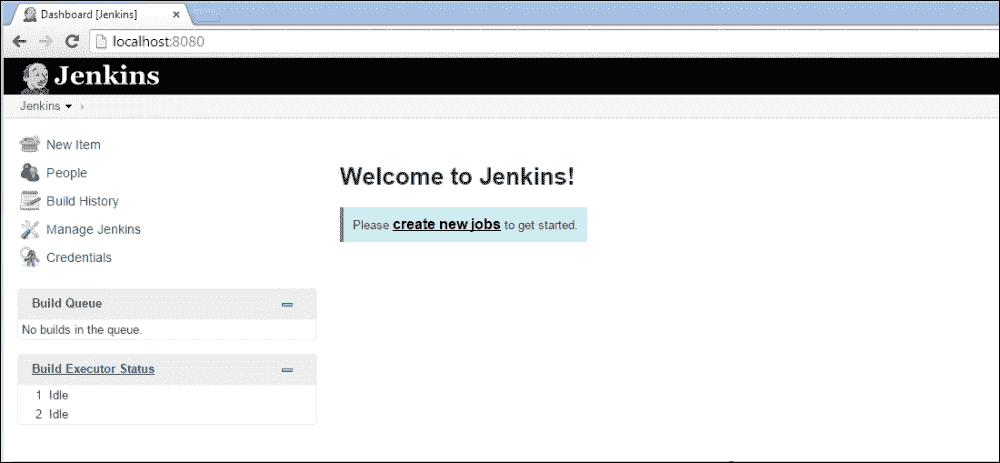
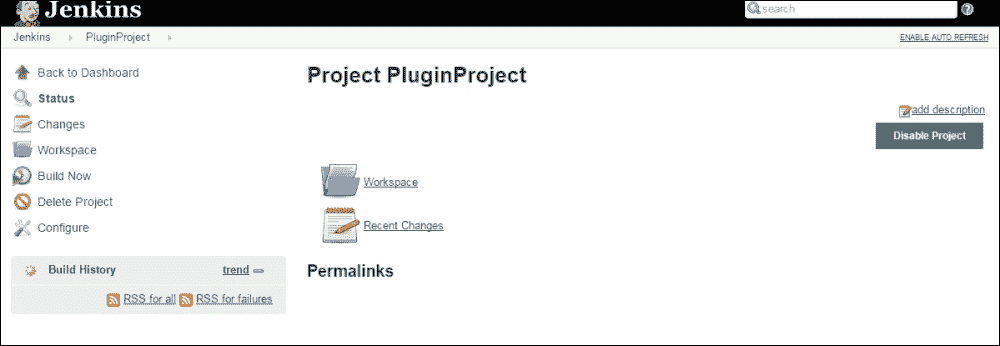

# 第七章. 持续集成

持续集成是当今软件世界中使用的术语之一。无论您在软件世界的哪个角落，每个人都在谈论持续集成。那么，什么是持续集成呢？

持续集成是将共享仓库中的所有软件代码进行集成的实践；为每次提交准备自动构建，并运行自动测试而无需任何人工操作。它帮助开发者能够在快速失败模式下尽早发现问题。在这里，“尽早”意味着开发者提交代码后；根据项目规模，几秒钟或几分钟内，持续集成过程将通知构建的成功或失败。由于错误在早期阶段就被捕获，因此在执行应用程序的集成和功能测试时可以节省大量精力。

在本章中，我们将探讨流行的持续集成工具 Jenkins 和 TeamCity。由于这是一本 Gradle 书籍，我们将限制我们的讨论范围仅限于这些工具的基本设置和配置。我们还将介绍一个新主题，即使用 Gradle 进行代码质量管理。我们将学习如何将**Checkstyle**、**PMD**和**Sonar Runner**插件集成到 Gradle 中，以及如何将其与持续集成工具集成。

# Jenkins 快速入门

Jenkins 是最受欢迎的开源持续集成工具之一，它有助于自动化软件构建和部署过程。它可以与 Maven、Gradle 和 Ant 等构建工具一起工作。它支持各种源代码管理系统，如 CVS、Git、Subversion 和 Perforce。甚至支持简单的 shell 或批处理脚本执行。Jenkins 的主要优势在于其插件支持。有超过 1000 多个插件用于不同的功能，如果需要，它可以扩展以支持新的需求。

Jenkins 的一些主要特性包括：

+   易于安装和配置。简单的基于 Web 的 UI 用于管理服务器

+   支持各种插件，用于不同的构建和部署相关任务

+   一个非常大的社区论坛

+   支持 SVN、Git、CVS、Perforce 等不同存储库

+   支持构建后钩子

## Jenkins 安装

Jenkins 安装只需两个步骤。您需要从[`jenkins-ci.org/`](http://jenkins-ci.org/)下载`jenkins.war`文件。您将始终从这个 URL 获取最新版本。对于任何之前的版本，点击**过往版本**选项，并决定您想要哪个版本。

下载 war 文件后，它可以在 Tomcat 等容器中部署，或者可以使用以下命令执行：

```java
$ java -jar jenkins.war
Running from: /jenkins/jenkins.war
webroot: $user.home/.jenkins
….
Apr 02, 2015 3:30:32 PM org.eclipse.jetty.util.log.JavaUtilLog info
INFO: Started SelectChannelConnector@0.0.0.0:8080
…..
Apr 02, 2015 3:30:37 PM org.jenkinsci.main.modules.sshd.SSHD start
INFO: Started SSHD at port 50566
Apr 02, 2015 3:30:37 PM jenkins.InitReactorRunner$1 onAttained
INFO: Completed initialization
Apr 02, 2015 3:30:37 PM hudson.WebAppMain$3 run
INFO: Jenkins is fully up and running

```

在这里，Jenkins 从内置的 Jetty 容器开始，端口为 8080。默认的 Jenkins 主目录将被设置为`<USER_HOME>/.jenkins`。通过设置`JENKINS_HOME`环境变量，您可以将其设置为任何其他位置。此目录存储所有与 Jenkins 相关的信息，例如作业信息、用户账户详情、插件信息和 Jenkins 的一般设置。

现在打开浏览器并输入以下内容：`http://localhost:8080`，Jenkins 欢迎页面将显示。这就完成了。Jenkins 已为您准备好：



图 7.1

由于这不是 Jenkins 用户指南，我们不会详细涵盖 Jenkins 的功能。您可以在 Jenkins 官方网站上查看可用的教程。我们将主要涵盖有助于使用 Gradle 自动化构建过程的主题。

## Jenkins 配置

仅安装不足以让 Jenkins 开始使用 Gradle 构建过程。在我们开始使用 Jenkins 的第一个作业之前，我们需要配置一些插件。在 Gradle 中像`task`一样，Jenkins 的执行单元是作业。构建作业可以执行编译、运行自动化测试、打包甚至与部署相关的任务。但在我们开始处理作业之前，我们将为 Jenkins 配置以下插件。

+   Gradle 插件

+   Git 插件（如果您使用 Git 作为存储库，则必需）

在左侧垂直菜单中点击**管理 Jenkins**。您将看到一个不同类别的列表。点击**管理插件**。您将找到以下四个标签页：


图 7.2

前往**可用**标签页，并筛选（右上角）为`Gradle 插件`。您将找到具有以下详细信息的 Gradle 插件：

**Gradle 插件**

**此插件使得能够将 Gradle 构建脚本作为主要构建步骤调用。**

选择插件并点击**现在下载并在重启后安装**。在安装后重启 Jenkins 是一个好习惯，以避免任何问题。

这将为 Jenkins 服务器添加 Gradle 构建执行能力。一旦安装成功，您将能够看到成功消息。如果系统受到防火墙保护，可能会出现错误，这可能会在连接到互联网时限制系统。在这种情况下，请手动下载插件（`*.hpi`文件）并将其复制到`<Jenkins_home>/plugins`目录。Jenkins 插件可以从[`updates.jenkins-ci.org/download/plugins/`](https://updates.jenkins-ci.org/download/plugins/)下载。

对于本章的示例，我们使用 GitHub 作为仓库。要使用 GitHub，我们将向 Jenkins 服务器添加 GitHub 插件。我们可以以添加 Gradle 插件相同的方式添加它。如果插件依赖于其他插件，那么 Jenkins 将自动下载所需的插件。当安装 GitHub 插件时，你可以观察到这一点。Jenkins 自动安装其他所需的插件，如 Git 客户端插件和 Git API 插件。如前所述，某些插件可能需要重启 Jenkins 服务器。在这种情况下，停止当前进程并重启 Jenkins 服务器以使插件生效。

下一个重要步骤是使用 Jenkins 配置 JDK、Gradle 和 Git。要配置这些设置，打开 Jenkins URL 并点击**管理 Jenkins**，然后**配置系统**。

输入 JDK 的正确路径并保存设置。Jenkins 还有一个选项可以从互联网自动安装软件。请看以下截图：


图 7.3

图 7.4 显示了如何在 Jenkins 中配置 Gradle：


图 7.4

## 创建任务

在 Gradle 插件成功安装后，我们将创建第一个 Gradle 构建任务。转到 Jenkins 主页并点击**创建新任务**。在 Jenkins 中可以创建不同类别的任务。在本例中，我们将创建一个**自由风格项目**。为了简单起见，我们将构建我们在第四章中创建的插件项目，*插件管理*。只需给它一个名称，例如`PluginProject`，如图 7.5 所示。此外，尽量避免在任务名称中使用空格，因为这被认为是不良的做法。

如果你想单词之间有分隔，可以使用下划线（`_`）：


图 7.5

点击**确定**后，在下一页你将需要配置任务。你需要配置以下一些细节：

+   下载项目的源代码管理位置

+   项目构建步骤

+   安排构建任务（每日、每小时、每次提交后等）

+   添加任何构建后的操作以执行

首先，我们将在**源代码管理**下配置仓库。由于我们使用的是 GitHub 仓库，因此需要选择**Git**选项。


图 7.6

使用**凭据**选项提供仓库 URL，并添加认证（用户名/密码），如图 7.6 所示进行配置。

Git 可执行文件必须在 Jenkins 系统配置中设置，否则您将无法执行 Git 命令。如果连接到 URL 存在问题，Jenkins 将显示适当的错误消息。这有助于调试和解决问题。如果验证 URL 成功，下一步是选择以下图中显示的选项之一中的构建选项：


图 7.7

对于我们的项目，我们选择了**当将更改推送到 GitHub 时构建**的选项，这有助于通过运行构建脚本来验证每个提交。您可以按照构建需求设置任何其他选项。

下一步是选择项目的构建工具。从可用的选项，如 shell、Ant 和批处理中，我们将选择 Gradle 作为此项目的构建工具。此选项在下图中突出显示：


图 7.8

选择**调用 Gradle 脚本**选项并配置一些基本参数：


图 7.9

我们已将系统上安装的 Gradle `gradle-2.4`配置为工作 Gradle 版本。要构建`PluginProject`，可以在**任务**文本框中将任务设置为`clean build`。如果`build.gradle`文件位于项目的 home/root 文件夹中，则可以保留**根构建脚本**文本框为空。然而，如果它在另一个目录中，您必须提及相对于工作区位置的路径。我们的`build.gradle`文件位于`Chapter7/PluginProject`文件夹中。因此，我们可以输入根构建脚本为`${workspace}/Chapter7/PluginProject`。由于我们使用的是构建文件名`build.gradle`，这是 Gradle 中的默认命名约定，因此我们不需要在**构建文件**文本框中指定文件名。如果您使用任何其他构建文件名，它必须在**构建文件**文本框中提及。

您还可以添加**构建后操作**，例如发布 Java 文档、发送电子邮件通知、根据项目要求构建其他项目。

现在，保存配置，您将能够在仪表板上看到项目：


图 7.10

## 执行工作

尽管我们已配置构建在将更改推送到源代码管理系统时执行，但如果您不想等待存储库中的更改发生，构建始终可以手动执行。点击 Jenkins 主页上您之前创建的**PluginProject**工作。您将被导航到`http://localhost:8080/job/PluginProject/`的工作控制台。



图 7.11

在作业控制台，你将在左侧找到**构建现在**选项。点击此选项以手动执行作业。在控制台页面，你可以通过选择**配置**选项在任何时候配置作业。一旦作业成功执行，你将找到在**构建历史**部分的**构建编号**链接中显示的类似输出，如图 7.12 所示：


图 7.12

构建历史在 UI 中以最新的作业执行状态显示在顶部。图 7.13 显示第 1 次和第 2 次执行失败并出现某些错误，但第 3 次执行成功。在**构建历史**部分，如果作业失败，将以红色标记。对于成功，它是蓝色，而取消的作业可以以灰色识别：


图 7.13

此作业的默认位置是`<USER_HOME>/.jenkins/jobs/<JOB_NAME>/workspace`。如果你浏览到`<USER_HOME>/.jenkins/jobs`位置，你将找到一个以作业名称创建的目录，即`PluginProject`，它进一步包含用于作业配置的`config.xml`。作业目录有两个更进一步的子目录，`builds`用于已执行的作业，`workspace`是构建实际运行的地方。如果你进入`builds`目录，你将找到每次运行的构建执行详情。


图 7.14

工作空间目录包含我们为作业配置的项目。在早期构建配置中，我们指定了`Build Root`为`${workspace}/Chapter7/PluginProject`。现在如果我们去这个位置，我们将找到为该项目创建的构建文件夹：

```java
/workspace/Chapter7/PluginProject$ ls -l
total 12
drwxrwxr-x 6 mainak mainak 4096 Apr  6 00:31 build
-rw-rw-r-- 1 mainak mainak  328 Apr  5 23:15 build.gradle
drwxrwxr-x 3 mainak mainak 4096 Apr  5 23:15 src

```

这只是 Jenkins 配置的简要概述。更多详细信息可以在[`jenkins-ci.org/`](https://jenkins-ci.org/)找到。在接下来的两个部分中，我们将探索 Checkstyle、PMD 和 Sonar Runner 插件。

# Checkstyle 和 PMD 插件

我们已经看到在 Jenkins 中创建 Gradle 构建作业是多么简单。现在我们将为质量检查目的向我们的项目添加**Checkstyle**和**PMD**插件。我们可以遵循不同的方法来使用这些插件。我们可以直接将这些插件添加到 Jenkins 并为其项目运行，或者我们可以使用 Gradle Checkstyle 和 PMD 插件并评估项目。

我们将使用 Gradle 方法添加 Checkstyle 和 PMD 插件以进行代码质量检查，并使用 Jenkins 执行此操作。让我们创建两个 Gradle 文件，一个用于 Checkstyle，另一个用于 PMD：

`build_checkstyle.gradle`

```java
apply plugin: 'groovy'
apply plugin: 'eclipse'
apply plugin: 'checkstyle'

version = '1.0'

repositories {
  mavenCentral()
}
checkstyle {
  toolVersion = 6.5
  ignoreFailures = true
}

dependencies {
  compile gradleApi()
  compile localGroovy()
  compile group: 'commons-collections', name: 'commons-collections', version: '3.2'
  testCompile group: 'junit', name: 'junit', version: '4.+'
}
```

在构建文件中，我们在`checkstyle { … }`闭包中添加了额外的配置。如果源代码未通过 CheckStyle 规则，将导致构建失败。为了忽略由于 CheckStyle 规则违反导致的任何构建失败，我们需要在`checkstyle`闭包中添加`ignoreFailures=true`属性。

Checkstyle 插件提供以下任务：

+   `checkstyleMain`：这将对 Java 源文件执行 Checkstyle

+   `checkstyleTest`：这个任务会对 Java 测试源文件执行 Checkstyle。

+   `checkstyleSourceSet`：这个任务会对给定源集的 Java 源文件执行 Checkstyle。

对于 Checkstyle 插件，我们需要在 `<Project>/config/checkstyle/` 目录中有一个 `checkstyle.xml` 文件。这是默认位置。你可以在以下位置找到示例 `checkstyle.xml`：[`github.com/google/google-api-java-client/blob/dev/checkstyle.xml`](https://github.com/google/google-api-java-client/blob/dev/checkstyle.xml)。

它为项目提供了标准的质量检查。你也可以根据需求编写定制的 `checkstyle.xml`。

要使用 PMD 插件，你可以复制上面的文件，并将 `checkstyle` 闭包替换为 `pmd` 闭包，并删除 `toolVersion` 属性。如果你没有指定版本，Gradle 默认下载 PMD 版本 5.1.1。你还需要添加 `apply plugin: `pmd`。

`build_pmd.gradle`

```java
apply plugin: 'groovy'
apply plugin: 'pmd'

version = '1.0'

repositories {
  mavenCentral()
}

pmd{
  ignoreFailures = true
}

dependencies {
  compile gradleApi()
  compile localGroovy()
  compile group: 'commons-collections', name: 'commons-collections', version: '3.2'
  testCompile group: 'junit', name: 'junit', version: '4.+'
}
```

PMD 插件提供了以下任务：

+   `pmdMain`：这个任务会对 Java 源文件执行 PMD。

+   `pmdTest`：这个任务会对 Java 测试源文件执行 PMD。

+   `pmdSourceSet`：这个任务会对给定源集的 Java 源文件执行 PMD。

Checkstyle 和 PMD 插件都可以使用 `check` 任务执行。

+   如果你添加了 Checkstyle 插件并执行 `check` 任务，它将调用所有 Checkstyle 任务

+   如果你添加了 PMD 插件并执行 `check` 任务，它将执行 `pmd` 任务

我们将创建一个新的项目 `QualityCheck` 并将以下文件添加到项目中：

+   `build_checkstyle.gradle`

+   `build_pmd.gradle`

+   `config/checkstyle/checkstyle.xml`

Checkstyle 和 PMD 插件在 Java 代码中执行，因此我们将在 `src/main/java/` 目录下添加一些示例 Java 文件。为了在 Jenkins 中创建构建步骤，我们将创建一个执行 Checkstyle 任务（`check` 任务）的构建步骤，如图 7.15 所示。你也可以为 PMD 插件重复相同的步骤。

对于新的配置，`Root Build script` 设置为 `${workspace}/Chapter7/QualityCheck`。同时，我们在文本框中添加了 **Build file** 名称，为 `build_checkstyle.gradle`。


图 7.15

保存此配置并再次执行作业。按照配置，`build_checkstyle.gradle` 文件在 Java 源代码上执行，并为其生成了 CheckStyle 报告。你可以在 `${workspace}\Chapter7\QualityCheck\build\reports\checkstyle\main.xml` 下找到这些报告。

# Sonar Runner 插件

Sonar 是最受欢迎的质量管理工具之一，它从代码行数、文档、测试覆盖率、问题和复杂性等方面对项目进行全面的分析。Gradle 提供了与 Sonar 的无缝集成。唯一的前提是 Sonar 服务器应该已安装并运行。有关 Sonar 的详细信息，请参阅 [`www.sonarqube.org/`](http://www.sonarqube.org/)。

要运行 Sonar Runner 插件，我们只需应用插件 `sonar-runner` 并将其配置为连接到 Sonar 服务器。

为您的项目创建名为`build_sonar.gradle`的构建文件，内容如下：

```java
apply plugin: 'groovy'
apply plugin: 'eclipse'
apply plugin: "sonar-runner"

repositories {
  mavenCentral()
}

version = '1.0'

sonarRunner {

  sonarProperties {
    property "sonar.host.url", "http://<IP_ADDRESS>:9000"
    property "sonar.jdbc.url", "jdbc:h2:tcp://<IP_ADDRESS>:9092/sonar"
    property "sonar.jdbc.driverClassName", "org.h2.Driver"
    property "sonar.jdbc.username", "sonar"
    property "sonar.jdbc.password", "sonar"
  }
}
```

上述配置是自我解释的。您需要添加诸如 Sonar URL、DB URL、JDBC 驱动程序详细信息之类的配置。我们的构建文件已准备就绪。下一步是在 Jenkins 服务器上配置一个作业。要在 Jenkins 中配置`sonarRunner`任务，我们可以添加几个基本步骤，如图 7.16 所示：


图 7.16

在这里，任务名称是`sonarRunner`，构建文件名称是`build_sonar.gradle`。现在，在 Jenkins 中执行此作业，您将在控制台找到输出。输出包含一个指向 Sonar 服务器的链接。您可以点击链接，它将重定向到如图 7.17 所示的 Sonar 报告：


图 7.17

如前所述，Sonar 对项目在不同区域进行分析，您可以在 Sonar UI 中找到详细信息。

# TeamCity walk-through

在上一节中，我们学习了如何在 Jenkins 中配置 Gradle 项目以及如何集成质量插件。在本节中，我们将探索另一个流行的持续集成工具，TeamCity。我们假设 TeamCity 已经安装并运行在您的机器上。因此，我们将跳过 TeamCity 的安装和配置细节。实际上，安装过程非常简单，可以在几分钟内完成。您可以从以下 URL 下载 TeamCity：[`www.jetbrains.com/teamcity/download/`](https://www.jetbrains.com/teamcity/download/)，安装说明可在[`confluence.jetbrains.com/display/TCD9/Installation`](https://confluence.jetbrains.com/display/TCD9/Installation)找到。

默认情况下，TeamCity 在`http://localhost:8111/`上运行，并且有一个在服务器上运行的构建代理。我们将使用 TeamCity 构建相同的插件项目。

登录 TeamCtiy 并点击创建项目。提供项目名称和描述：


图 7.18

保存后，然后点击**创建构建配置**按钮。您需要为项目提供常规设置。在常规设置之后，继续到**版本控制设置**：


图 7.19

下一步是配置**创建和附加新的 VCS 根**。从下拉菜单中选择 Git，因为我们使用 Git 作为存储库，如图 7.20 所示：


图 7.20

提供插件项目的**常规设置**和**获取 URL**，也提供认证，如用户名/密码和 Git 可执行文件的位置在**Git 路径**中。

在屏幕末尾，点击**测试连接**。如果连接成功，点击**保存**。下一步是**添加构建步骤**。

在构建步骤中，您需要配置**PluginProject**构建文件细节和构建任务细节。例如，我们需要提供一些基本信息，如任务的`clean build`，工作目录为`Chapter7/PluginProject`，以及 Gradle 和 JDK 的主目录：


图 7.21

保存此配置，然后项目将准备就绪。构建步骤的详细信息可以在构建配置屏幕中查看，如下面的截图所示：


图 7.22

TeamCity 通过 TeamCity 代理执行项目。TeamCity 服务器与服务器一起安装了一个代理。您可以使用此代理来执行作业。否则，您可以通过**代理**选项卡配置更多代理。


图 7.23

一旦配置并连接了代理，您就可以将项目与构建代理映射，然后您就可以运行构建作业了。


图 7.24

点击**运行**按钮后，TeamCity 服务器将在映射的代理上执行构建作业，您可以看到构建作业的成功或失败输出。

在**构建日志**控制台中，您还可以分析完整的日志，如下面的截图所示：


图 7.25

# 摘要

在本章中，我们简要讨论了软件开发世界中持续集成的需求，并探讨了两个最受欢迎的持续集成工具：Jenkins 和 TeamCity。在本章中，我们学习了如何轻松配置这些工具以及如何将 Gradle 与这些 CI 工具集成。我们还学习了 Gradle 的三个不同质量插件：Checkstyle、PMD 和 Sonar Runner。我们借助 Jenkins 执行了这些质量任务。在持续集成、Jenkins 或 TeamCity 中还有许多主题需要学习。不幸的是，我们无法在本书中涵盖所有这些主题。我们强烈建议读者在每个未覆盖的领域进行进一步阅读。

在下一章中，我们将讨论从 Ant 和 Maven 到 Gradle 的不同迁移策略。这将有助于将现有的 Ant 或 Maven 脚本迁移到 Gradle。
