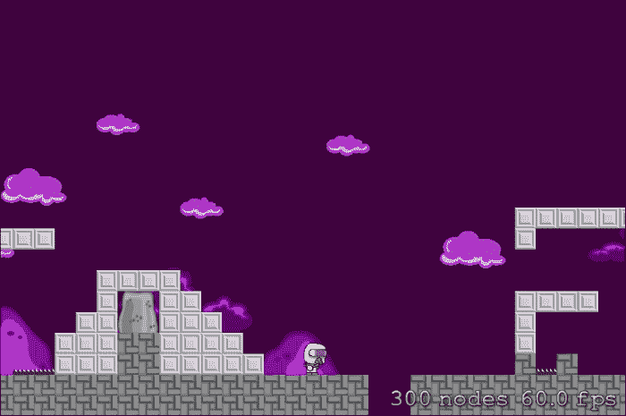

# 第三章。发射！从开发开始

现在真正的乐趣开始了！我们将开始我们的游戏开发！你和我一样兴奋吗？如果你不兴奋，你应该兴奋！看看我们将要涵盖的内容：

+   在 Xcode 中创建 SpriteKit 项目

+   级别设计和实现

+   重力 - 玩家移动

+   碰撞检测

我们将涵盖所有这些以及更多内容！

系好安全带，因为我们即将全速前进，而且我们不会回头！好吧，也许我们会一两次，但你知道我的意思。让我们开始！让我们创建我们的项目！

# 在 Xcode 中创建 SpriteKit 项目

让我们立即打开 Xcode 并点击**文件** | **新建** | **项目**。然后您将看到新项目向导，它看起来像这样：


对于这个项目，我们显然将选择**iOS** | **应用程序** | **单视图应用程序**，然后点击**下一步**。

一旦您完成这些，您将需要填写一些关于项目的详细信息，例如产品名称、组织名称等。请参阅以下截图：


填写所需的字段（如果尚未填写），然后点击**下一步**。首先，我们将对项目进行一些更改。例如，在左侧侧边栏中找到`LaunchScreen.xib`文件，并通过按键盘上的*Delete*键将其删除。

### 注意

`.xib`和 Storyboard 文件是您可以使用它们来创建视图界面的接口文件。在这些文件中，您可以创建按钮、文本标签和其他用户界面元素。

您将看到一个弹出窗口询问您是否想要删除引用或将它移动到垃圾桶。由于我们将编写玩家将看到的所有内容，所以我们不需要它，可以安全地将其移动到垃圾桶。

然后点击左侧侧边栏中的主项目文件；在屏幕中间，您将看到所有项目设置。我们也将对这个部分进行一些更改。


首先，在**应用程序图标和启动图像**展开中，找到**启动屏幕文件**下拉菜单。在它说`LaunchScreen.xib`的地方，只需选择文本并按以下截图所示删除它。同样，因为我们将要编程一切，所以我们不需要它在我们的情况下。


稍微向下看，您将看到**链接的框架和库**展开。

**框架**和**库**是您可以添加以进一步增强您应用程序功能的扩展。您可以添加的内容示例包括 CoreGraphics 和 SpriteKit；甚至可以下载并添加 Facebook API 或 Cocos2D 以获得更多功能。

这是我们添加各种框架的地方（如果您还不知道的话）。我们将添加五个框架和一个库。为此，点击该部分底部的**+**按钮。我们将添加的文件如下：

+   `libz.dlib`

+   `CoreGraphics.framework`

+   `UIKit.framework`

+   `SpriteKit.framework`

+   `GLKit.framework`

+   `Foundation.framework`

下面是**链接的框架和库**的截图：


我们的游戏将充分利用这些框架，正如我们将在本章中看到的那样。我喜欢保持事物整洁有序，而 Xcode 只是将文件扔到左侧侧边栏的顶部。我选择了刚刚添加的新框架，右键单击它们，选择**从选择新建组**，并将该文件夹命名为`Frameworks`。我在开发时喜欢保持良好的组织；我甚至确保所有代码段都正确缩进。

在您添加了新的框架之后，您必须下载本书资源部分中的两个文件夹。它们包括免费在线提供的额外框架，这些框架将帮助我们进一步，尤其是在我们的关卡设计中。

框架是`SKTUtils`，它实际上是`SpriteKit`的扩展，以及`JSTileMap`，我们将用它来制作地图。

`SKUtils`框架是`SpriteKit`的扩展，它增加了更多的视觉效果以及额外的物理计算（例如，在更复杂的物理计算中使用π（pi））。

`JSTileMap`框架允许我们将瓦片地图文件导入到 Xcode 中。正如您稍后会发现的那样，Xcode 本身不支持地图文件。

下载完成后，只需选择这两个文件夹，并将它们拖到项目左侧的栏中，如下面的截图所示：


确保您点击了**如果需要则复制项目**复选框；这将把这些文件夹复制到您的项目文件夹中，这样任何更改都不会影响原始文件。

导入`SKTUtils`框架时，我发现它向我抛出了 20 个错误，其中大部分是完全无法理解的。所以在经过深思熟虑和调试后，我意识到（请注意，我在写本章的过程中意识到），我们需要添加一个**前缀头文件**。前缀头文件是为了更快地预编译头文件而创建的。所以不是逐个编译每个头文件，而是预先编译一次。

点击**文件** | **新建** | **文件**。一旦出现向导，点击**iOS**下的**其他**，选择**PCH 文件（预编译头文件）**，并将其命名为类似***yourProjectName*-Prefix.pch**的名称。

创建该文件后，点击它进行编辑；我们将填充以下代码：

```swift
#import <Availability.h>

#ifndef __IPHONE_5_0
#warning "This project uses features only available in iOS SDK 5.0 and later."
#endif

#ifdef __OBJC__
    #import <UIKit/UIKit.h>
    #import <Foundation/Foundation.h>
#endif
```

我们需要定义我们刚刚在 Xcode 中创建的 PCH 文件，否则它将变得毫无用处，因为它将不会做任何事情！

一旦我们填写完那个文件，我们将点击左侧栏中的我们的项目。现在你将在导航栏顶部看到标签：**通用**、**能力**、**信息**、**构建设置**、**构建阶段**和**构建规则**。点击 **构建设置**。向下滚动以找到 **Apple LLVM 6.1 – 语言** 并将 **预编译前缀头** 选择更改为 **是**。下面，双击 **前缀头** 部分的空字段并填写它以符合你的项目。我命名为 Adesa，所以我填写了 **Adesa/Adesa-Prefix.pch**，如下面的截图所示：


接下来！

现在我们必须添加更多的主和头文件；一组将被称为 **Player**，另一组将被称为 **GameLevelScene**。不确定如何添加这些？没问题！只需点击 **文件** | **新建** | **文件** 或按 *Command* + *N*。对于这些文件，我们将选择 `Cocoa Class` 文件并点击 **下一步**，如下面的截图所示：


再次填写 **类名** 的名称，再次一个将是 **Player**，另一个是 **GameLevelScene**。我知道设置东西有点无聊，但我们必须这样做。现在，让我们开始编辑我们的代码！

## 编辑我们的代码文件

我们需要对源代码文件进行一些修改。我们将从 `ViewController` 接口文件集开始，即 `.h` 和 `.m` 文件，也就是控制一个定义视图的文件。我们将从 `.h` 文件开始；目前，它应该看起来像这样：

```swift
#import <UIKit/UIKit.h>

@interface ViewController : UIViewController

@end
```

我们需要在 `#import <UIKit/UIkit.h>` 行下面直接添加 `#import<SpriteKit/SpriteKit.h>`。

### 提示

**什么？！**

我们刚刚插入到代码中的这一行将 SpriteKit 框架导入到该头文件中，这样我们就可以在正在工作的头文件中访问 SpriteKit 的功能。

目前这个 `.h` 文件就到这里；在我们设置项目的时候，我们将在文件之间来回跳动。

接下来是 `ViewController.m` 文件，它应该被编辑成如下所示：

```swift
#import "ViewController.h"
#import "GameLevelScene.h"

@implementation ViewController

-(void)viewDidAppear:(BOOL)animated
{
    [super viewDidAppear:animated];

    //Configure the view.
    SKView * skView = (SKView *)self.view;
    skView.showsFPS = YES;
    skView.showsNodeCount = YES;

    //Create and Configure the scene.
    SKScene * scene = [GameLevelScene sceneWithSize: skView.bounds.size];
    scene.scaleMode = SKSceneScaleModeAspectFill;

    //Present (or show) le scene.
    [skView presentScene:scene];
}

- (BOOL)shouldAutorotate
{
    return YES;
}

- (NSUInteger)supportedInterfaceOrientations
{
    return UIInterfaceOrientationMaskLandscape;
}

- (void)didReceiveMemoryWarning {
    [super didReceiveMemoryWarning];
    // Dispose of any resources that can be recreated.
}

@end
```

我知道你在想：*这一切意味着什么？* 我将从开始的地方开始，让那些没有编码经验的人更容易理解：

```swift
#import "ViewController.h"
#import "GameLevelScene.h"
```

我们再次看到导入行；我们导入 `ViewController` 头文件，所有声明都将在这里。接下来是 `GameLevelScene` 头文件；这个文件将托管游戏场景，我们可能会在这个文件上花费大部分时间，如下面的代码所示：

```swift
-(void)viewDidAppear:(BOOL)animated
{
    [super viewDidAppear:animated];

    //Configure the view.
    SKView * skView = (SKView *)self.view;
    skView.showsFPS = YES;
    skView.showsNodeCount = YES;

    //Create and Configure the scene.
    SKScene * scene = [GameLevelScene sceneWithSize: skView.bounds.size];
    scene.scaleMode = SKSceneScaleModeAspectFill;

    //Present le scene.
    [skView presentScene:scene];
}
```

通过这段代码，我们设置了 SpriteKit 视图。第一行，`SKView * skView = (SKView *)self.view;` 声明了一个新的 SpriteKit 视图实例，命名为 `skView`，并将其放置在 `ViewController` 头文件视图中的 `self.view`。

接下来的两行完全是可选的，因为它们更多是为了测试目的，您在发布应用程序之前会删除它们。第一行显示每秒帧数，下一行显示场景中的节点或对象数量。如果您不想看到这些行，现在可以随意删除它们。

下一行实际上创建并配置了场景。正如`SKScene * scene = [GameLevelScene scenewithSize: skView.bound.size]`所示，数据正在从我们还需要设置的`GameLevelScene`文件集中提取。目前它将抛出一个错误，表示没有已知类方法`sceneWithSize`，但请放心，因为我们还没有在`GameLevelScene`文件集中进行任何声明。

之后，我们看到场景的缩放设置为`AspectFill`。您可以选择适应或拉伸，但在这个例子中我们将使用适应填充。如果您喜欢，可以更改它。

最后，我们展示场景！

让我们跳转到`GameLevelScene`文件。我们再次从头文件开始，它应该如下所示：

```swift
#import <SpriteKit/SpriteKit.h>

@interface GameLevelScene : SKScene

@end
```

简而言之，我们将`GameLevelScene`类更改为`SpriteKit`场景；因此，当我们构建项目时，之前提到的错误将消失。接下来是`.m`文件，它将如下所示：

```swift
#import "GameLevelScene.h"

@implementation GameLevelScene

-(id)initWithSize:(CGSize)size {

  if (self = [super initWithSize:size]) {

  }
  return self;
}

@end
```

再次强调，这只是一个简单的场景初始化和设置大小。现在让我们构建我们的项目！目前您不需要连接设备；我们将在模拟器上运行。如果您正在使用较旧的电脑，我建议选择 iPhone 4S 作为模拟器，如图所示，主要是因为它加载时间较短，屏幕尺寸足够小，可以很好地适应您的屏幕。


简单地点击之前截图中的按钮（位于播放和停止按钮旁边的按钮），然后选择您喜欢的设备用于模拟器。

现在，让我们构建项目。点击顶部的**Play**按钮，或者按*cmd* + *B*（或者按*cmd* + *R*来构建和运行项目）。

如果一切顺利，它应该会成功构建，iOS 模拟器应该会出现。哎呀！你遇到了一个看起来像这样的错误吗？

```swift
0x22d9a <+138>: movl   %eax, -0x10(%ebp)
2015-04-30 11:33:20.916 Adesa[25543:4462832] -[UIView setShowsFPS:]: unrecognized selector sent to instance 0x7a660940
2015-04-30 11:33:20.918 Adesa[25543:4462832] *** Terminating app due to uncaught exception 'NSInvalidArgumentException', reason: '-[UIView setShowsFPS:]: unrecognized selector sent to instance 0x7a660940'
*** First throw call stack:
(
(LOTS OF WRITING HERE)
)
libc++abi.dylib: terminating with uncaught exception of type NSException
(lldb)
```

我们还需要在 Storyboard 中对`UIViewController`头文件进行更改。

在项目左侧的栏中找到`Main.storyboard`文件（记得我们之前讨论过 Storyboard 和`.xib`文件？），然后点击它。我们可以在这个文件中安排应用程序的 UI，但在这个项目中我们可能不会使用它。现在您将看到一个空白 iOS 布局，非常适合更改。

我们在这里要做的就是启动侧边栏上的**ViewController Scene**展开，就在所有我们的项目文件所在的栏旁边，然后展开**View Controller**展开，点击**View**，如图所示：


现在看看最右边的栏，你将看到顶部栏有六个不同的按钮。点击第三个按钮，你会看到 **显示身份检查器**。现在你将看到按钮下方的一个名为 **自定义类** 的部分。在这个部分的 **类** 文本框中，我们将输入 **SKView**，如以下截图所示：


让我们再次尝试运行我们的项目。它构建成功了吗？太好了！它打开了 iOS 模拟器吗？太棒了！它是否显示了一个带有帧率和屏幕底部打印的零节点的空白设备？太神奇了！我们正走在正确的轨道上！

对于我们的最终修改，我们将快速编辑 `Player` 文件夹。此刻，我们只需编辑头文件。将其修改为以下内容：

```swift
#import <SpriteKit/SpriteKit.h>

@interface Player : SKSpriteNode

@end
```

我们现在将致力于“暂停以产生效果。”

# 级别设计和实现

这是我们可以玩得很开心的地方！我们现在将开始设计我们的级别。你可以花几个小时为每个级别添加细节，使它们看起来完美。记住，设计良好的级别会给玩家留下深刻印象，并给你的游戏带来专业的外观。

不幸的是，Xcode 并没有级别设计的拖放便捷性，因此我们将使用一个名为 *Tiled Map Editor* 的第三方程序来创建我们的地图，该程序可以在 [www.mapeditor.org](http://www.mapeditor.org) 上免费下载。

我在本书的 *Resources* 部分包括了我们的级别精灵表以及一个构建好的级别。你还记得本章中包含的 `JSTileMap` 库吗？它就是用来显示这些地图的，因为 SpriteKit 不支持 TMXTileMaps。真是太遗憾了！

无论如何，继续前进！打开我包含的级别，名为 `level1.tmx`，感受一下程序的工作方式。

Tiled 的侧边栏显示了不同层级的层次。在这种情况下，我们有 **危险**，这包括像刺和其他可能对我们的玩家健康造成损害的物体。然后是 **墙壁**，相当直观，接着是 **背景**，用于场景元素，如云和树。


尝试对级别进行一些编辑，使其成为你自己的小杰作。以下截图显示了你需要的所有工具；图像中选中的工具是印章工具，它允许你在选定的层上放置选定的图像。然后你有油漆桶和橡皮擦工具。试试看！完成之后，我们将把级别编程到我们的游戏中。


让我们打开我们的 `GameLevelScene.m` 文件，并在文件顶部 `#import "GameLevelScene.h"` 之下添加 `#import "JSTileMap.h"`。

在我们刚刚插入的导入下面，我们将添加以下行：

```swift
@interface GameLevelScene()
@property (nonatomic, strong) JSTileMap *map
@end
```

这是在我们的 `GameLevelScene` 类中添加一个用于我们将会使用的地图的私有变量。

现在，我们将实际加载地图。在 `(id)initWithSize:(CGSize)size` 代码块中，在 `if` 语句内，添加以下代码以更改天空的颜色以及加载地图：

```swift
self.backgroundColor = [SKColor colorWithRed:.25 green:.0 blue:.25 alpha:1.0];

self.map = [JSTileMap mapNamed:@"level1.tmx"];
[self addChild:self.map];
```

运行项目以查看您的精彩关卡现在已显示在屏幕上。我决定使用深紫色来设计这些关卡，因为这正是我想要的环境。你可以选择任何你喜欢的颜色，但请记得相应地调整颜色。

如果由于某种原因它没有正确显示或你遇到了错误，请确保你的 `GameLevelScene.m` 文件现在看起来像这样：

```swift
#import "GameLevelScene.h"
#import "JSTileMap.h"

@interface GameLevelScene()
@property (nonatomic, strong) JSTileMap *map;
@end

@implementation GameLevelScene

-(id)initWithSize:(CGSize)size {
    if (self = [super initWithSize:size]) {
        //CUS ITS SKY FALL!...This makes the background purple...
        self.backgroundColor = [SKColor colorWithRed:.25 green:.0 blue:.25 alpha:1.0];

        self.map = [JSTileMap mapNamed:@"level1.tmx"];
        [self addChild:self.map];
    }
    return self;
}

@end
```

看起来相当酷吧？Tiled 是一款很棒的程序，你可以添加比我这里更多的细节。


虽然有些东西缺失，对吧？嗯...哦，是的！我们的玩家！

# 重力 – 玩家移动

现在，导入我在本书资源部分提供的 `Player` 图片（在 `sprites.atlas` 文件中）。除非你有自己的！那么无论如何，请使用你的。

让我们回到我们的 `GameLevelScene.m` 文件并导入另一个文件。这次，将是 `#import "Player.h"`。然后，在之前添加的 `@interface` 部分之后，我们将添加另一个与刚刚添加的地图属性相似的属性：`@property (nonatomic, strong) Player *player1`。我使用 player1，因为我们将在以后添加一些多人游戏功能！

然后，在 `initWithSize` 函数内，我们将添加以下代码：

```swift
self.player = [[Player alloc] initWithImageNamed:@"P1Idle"];
self.player.position = (CGPointMake(100, 50);
self.player.zPosition = 15;
[self.map addChild: self.player];
```

当我们构建并运行我们的项目时，我们应该得到以下图像中所示的结果。我认为它开始看起来相当酷了！


稍等一下，牛仔！我们刚才做了什么？好吧，让我来解释一下发生了什么。我们刚才添加的代码将我们的太空人加载为一个精灵对象，将其定位在地图上，然后将其添加到地图对象中。

### 小贴士

这里有一些需要注意的事情，因为你可能想知道为什么我们的小家伙被添加到地图中，而不是直接添加到场景中。好吧，让我告诉你！这完全关乎控制。我喜欢完全控制（而且我的妻子说我可以说这个），我们想要精确控制地图中的哪些层在我们的小家伙之前和之后。例如，我们可以将背景对象，如树木和山丘，设置在后面，但如果我们想的话，我们可以将我们的太空人定位在它们后面。所以然后他需要成为地图类的子对象，或子类。

现在我们需要让这个家伙移动！首先，让我们在场景中添加一些重力。回到我们的 `GameLevelScene.m` 文件，我们再次在相同的位置添加另一个属性，即在代码的 `Interface` 部分中。它将是这样的：

```swift
@property (nonatomic, assign) NSTimeInterval previousTime;
```

请参考以下屏幕截图以确保您的代码填写正确：


然后，我们将编写一个`update`方法，并将其放置在`-(id)initWithSize:(CGSize)size {`代码行之前。为了创建这个方法，我们将添加以下代码：

```swift
- (void)update:(NSTimeInterval)currentTime
{

    NSTimeInterval delta = currentTime - self.previousTime;

    if (delta > 0.02) {
        delta = 0.02;
    }

    self.previousTime = currentTime;

    [self.player1 update:delta];
}
```

这将导致当前抛出错误，表示没有可见的`@interface`用于声明更新选择器的玩家。是不是很困惑？让我们一步一步来解释我们在这里做了什么。

首先，我们添加了这个更新方法，它是自动构建到 SpriteKit 场景或`SKScene`对象中的。我们只需要编写代码！然后，在场景渲染之前，我们将调用每一帧。更新方法为我们提供了一个计时器值，即程序的当前时间。

其次，我们获取`delta`值，即当前时间减去前一时间。`delta`值是什么？它本质上是从上次调用更新以来间隔的时间。有了这个`delta`时间值，我们可以创建平滑的运动、重力和其他力，以及平滑的动画。

然后我们有一个`if`语句；如果`delta`值超过 0.02，它将被保持在 0.02。有时我们的设备会滞后、卡顿或变慢，尤其是在第一次启动游戏时，设备有很多要加载的内容；因此，这个`delta`值可能相当大。我们将其保持在一致值以减少物理行为异常的可能性。为什么会发生这种情况？

就像之前提到的，这个`delta`值通过保持整洁一致的价值来创建平滑的运动和重力。如果这个值远远超过 0.02，我们编写的运动或任何外部力将不会正常工作，可能会发生我们不希望发生的事情。这可以称为预防措施，这样我们就不创建任何破坏游戏的 bug。在`if`语句之后，我们将当前时间（例如 0.02）设置为前一时间，以便设备可以确定`delta`值。让我们澄清一下，为了确定时间前进的速度，我们有当前时间和前一时间，所以在时间前进之前，我们将当前时间设置为前一时间，然后当前时间前进。

分解来看，时钟开始计时，当前时间是 0.05，在时间前进之前，我们将前一时间变量设置为 0.05，然后当前时间将增加到 0.06。然后设备将计算`delta`值。明白了吗？我知道这听起来可能很多。

然后我们来到导致错误的代码行。它调用错误是因为我们没有在我们的`Player`文件集（或类）中实现`update`方法。现在让我们来做这件事！

进入我们的`Player.h`文件，并更改代码，使其看起来像这样：

```swift
#import <SpriteKit/SpriteKit.h>

@interface Player : SKSpriteNode //(These lines should be here already)

@property (nonatomic, assign) CGPoint velocity;
-(void) update:(NSTimeInterval)delta;
@end
```

哇，哇，朋友，这没有道理！在编写游戏时，有很多物理和数学知识需要应用到编码中。在`@property (nonatomic, assign) CGPoint velocity;`这一行，我们创建了一个属性，用来测量玩家移动的速度。

你问什么是**CGPoint**？**CG**代表**CoreGraphics**，这是 iOS 设备使用的主要图形渲染框架，**point**是屏幕上的一个点，所以`CGPoint`包含对象的定位值；在这种情况下，`velocity`现在将有一个`x`和`y`值，使我们能够计算出玩家移动的确切速度和方向。很有趣！

让我们跳转到`Player.m`类文件，并将代码更改为以下内容：

```swift
#import "Player.h"

#import "SKTUtils.h"

@implementation Player

- (instancetype)initWithImageNamed:(NSString *)name {
    if (self == [super initWithImageNamed:name]) {
        self.velocity = CGPointMake(0.0, 0.0);
    }
    return self;
}

- (void)update:(NSTimeInterval)delta {

    CGPoint gravity = CGPointMake(0.0, -450.0);

    CGPoint gravityStep = CGPointMultiplyScalar(gravity, delta);

    self.velocity = CGPointAdd(self.velocity, gravityStep);
    CGPoint velocityStep = CGPointMultiplyScalar(self.velocity, delta);

    self.position = CGPointAdd(self.position, velocityStep);
}

@end
```

让我们分析一下我们刚才做了什么。我知道事情可能会很复杂，但别担心！我在这里帮助你！

首先，我们将`SKUtils`框架导入到`Player`类中。之后，我们创建了一个新的`initWithImageNamed`方法，并将速度变量初始化为`0.0`。然后我们声明了重力力的值。每次更新方法运行时，我们都会增加玩家向下的速度 450 点。如果玩家一开始是静止的，一秒后他将以 450 像素每秒的速度移动，两秒后这个值将翻倍，以此类推。

听起来很简单……对吧？

接下来，我们使用`CGPointMulitplyScalar`将加速度减小到当前时间步的大小。记住，`CGPointMulitplyScalar`通过一个浮点值增加`CGPoint`的值，并返回`CGPoint`结果。这很好，因为当设备延迟或由于某些奇怪的原因帧率下降时，我们仍然会得到一致的加速度值。

在`self.velocity =...`代码块中，我们计算当前时间的重力，然后加到玩家的当前速度上。有了新的速度计算，我们得到了单次时间步的速度。

最后，所有速度都计算完毕后，我们使用`CGPointAdd`函数来改变玩家的位置。正如你所见，`CGPointAdd`等于玩家的当前位置，加上重力。

好吧！让我们运行我们的项目！


什么？他穿过地面掉下去了？嗯，我想这意味着我们现在需要检测碰撞了？

# 碰撞检测

我们都知道，碰撞检测对任何游戏都是必不可少的。无论是一场比赛曲棍球，还是愤怒的八岁小孩的《愤怒的小鸟》，游戏都需要检测曲棍球、子弹、剑、地面上的脚——你叫得出名字的，都有大量的碰撞需要检测。对于我们的游戏，我们只将检测玩家和敌人、平台之间简单的箱子碰撞，以及子弹与敌人碰撞。

我们将使事情变得非常简单；首先，我们将检测玩家的边界框。

### 注意

碰撞框是什么？简单！想象一下你创建精灵的时候；你的图像周围有一个框吗？你可以将碰撞框想象成那样，就是你的精灵适合其中的小框或者在一个定义的空间内。你可以（我们也会）调整碰撞框的大小以适应精灵；你可以根据需要将其放大或缩小。

解释完这些后，让我们跳到我们的`Player.h`文件，并添加以下行：

```swift
-(CGRect)collisionBox;
```

我们刚刚创建了一个名为`collisionBox`的核心图形矩形。很简单，对吧？

现在将以下代码添加到`Player.m`文件中：

```swift
-(CGRect)collisionBox {
  return CGRectInset(self.frame, 2, 0);
}
```

`CGRectInset`的值会减小矩形的大小，或者我们的碰撞框，通过最后两个括号内的数字，分别是`2`和`0`。我们将玩家的框架设置为基本大小，然后在玩家的每一边减少`两个`像素。如果你愿意，你不必缩小边界框，可以将这两个值保留为`0`。

现在事情将开始变得稍微复杂一些。我们需要检测我们关卡中的各种图像，并选择我们想要玩家与之碰撞的图像以及那些我们不想要的。让我们快速跳到我们的`GameLevelScene.m`类，并添加以下代码：

```swift
-(CGRect)tileRectFromTileCoords:(CGPoint)tileCoords {
  float levelHeightInPixels = self.map.mapSize.height * self.map.tileSize.height;
```

这个第一个代码块定位像素原点坐标；我们这样做是为了知道在场景中确切地放置地图的位置。我们需要翻转高度坐标，因为 SpriteKit 的原点在屏幕的左下角，而瓷砖地图的原点在左上角。为了检测原点，我们需要添加以下代码：

```swift
  CGPoint origin = CGPointMake(tileCoords.x * self.map.tileSize.width, levelHeightInPixels - ((tileCoords.y + 1) * self.map.tileSize.height));

  return CGRectMake(origin.x, origin.y, self.map.tileSize.width, self.map.tileSize.height);
}
```

接下来我们将`1`添加到瓷砖坐标上。我们为什么要这样做呢？实际上，瓷砖坐标系统从`0`开始，所以如果我们有 50 个瓷砖，第 50 个瓷砖的实际坐标将是 49。因此，我们需要加一以获得正确的值。

```swift
- (NSInteger)tileGIDAtTileCoord:(CGPoint)coord forLayer:(TMXLayer *)layer {
  TMXLayerInfo *layerInfo = layer.layerInfo;
  return [layerInfo tileGidAtCoord:coord];
}
```

这个下一个方法访问我们保存的地图层信息，这些信息保存在*Tiled Map Editor*中。记得我们有三层：背景、墙壁和危险区域吗？如果你想有超过三个层，绝对可以这样做。我在这例子中只做三个，因为我们将要程序化地添加敌人和一些特殊效果。这段代码将访问这些层。

对于我们的碰撞系统，我们将检测玩家周围的八个瓷砖。在接下来的代码块中，我们将检测周围的瓷砖，这将检查`CGRect`（或核心图形矩形）与玩家碰撞边界框的碰撞。

让我们回到我们的`GameLevelScene.m`文件，并添加以下代码：

```swift
- (void)checkForAndResolveCollisionsForPlayer:(Player *)player forLayer:(TMXLayer *)layer {

    NSInteger indices[8] = {7, 1, 3, 5, 0, 2, 6, 8};
    for (NSUInteger i = 0; i < 8; i++) {
        NSInteger tileIndex = indices[i];

        CGRect playerRect = [player collisionBox];

        CGPoint playerCoord = [layer coordForPoint:player.position];

        NSInteger tileColumn = tileIndex % 3;
        NSInteger tileRow = tileIndex / 3;
        CGPoint tileCoord = CGPointMake(playerCoord.x + (tileColumn - 1), playerCoord.y + (tileRow - 1));

        NSInteger gid = [self tileGIDAtTileCoord:tileCoord forLayer:layer];

        if (gid) {

            CGRect tileRect = [self tileRectFromTileCoords:tileCoord];

            NSLog(@"GID %ld, Tile Coord %@, Tile Rect %@, player rect %@", (long)gid, NSStringFromCGPoint(tileCoord), NSStringFromCGRect(tileRect), NSStringFromCGRect(playerRect));
            //after this is where we write our collision resolving
        }

    }
}
```

哇！这么多代码！让我们来分解一下。第一个代码块创建了一个数组，显示了围绕我们酷炫的小玩家角色的瓷砖位置。正如你所见，我们找到了八个周围的瓷砖，然后将这些值存储在`tileIndex`变量中。

现在，记得我之前提到的瓦片坐标是颠倒的吗？注意瓦片的顺序？`7`，`1`，`3`，`5`，`0`，`2`，`6`，`8`。瓦片 7 是位于我们玩家直接下方的瓦片，所以需要立即确定。我们需要知道他是否在地面上；如果是，他可以跳跃，但如果没有，就不能跳跃！如果我们不立即解决这个瓦片，玩家可能会在没有角色接触地面的情况下跳跃——如果他们足够快地按下跳跃按钮。

然后，我们检索了我们之前编写的玩家碰撞框，并找到了玩家的确切瓦片位置。我们这样做是为了然后定位我们玩家的周围瓦片。在我们定位了玩家的位置之后，我们然后把之前创建的 `tileIndex` 变量除以找到玩家周围的行和列值。

### 小贴士

让我们通过一个例子来分解这个过程。

假设 `tileIndex` 的值为 `3`；则 `tileColumn` 的值将是 `0`（3 % 3 = 0），而 `tileRow` 的值将是 `1`（3 / 3 = 1）。

如果我们的太空人的位置被发现在瓦片坐标（`50`，`10`），则 `tileIndex 3` 的周围瓦片将是 `50` + (0 – 1) 和 `10` + (1 – 1) 或 `49` 和 `10`，分别。这等于我们太空人瓦片位置的左侧瓦片。

我知道这可能会有些令人困惑，但别担心；你很快就会明白的！

在下一步中，我们查找在之前实例中找到的 `tileIndex` 坐标处的瓦片的 GID 值。

哇，停下！在广阔的体育世界中，GID 是什么？

**GID** 是表示从瓦片集中图像索引的数字。每个 `TMXLayer` 类都有一个瓦片集，其中的图像以网格形式排列。简单来说，GID 就是特定图像的位置。

接下来，我们判断 GID 是否有值为 `0`。没有瓦片。它只是空白空间，所以我们不需要解决或测试碰撞。然而，如果 GID 中有值，我们就获取该瓦片的 `CGRect` 位置。然后我们简单地记录结果。这不是必需的代码块，但在事情不正常时非常有帮助——你可以查看调试器来查看发生了什么。以下图显示了如何处理瓦片：


大号粗体数字表示处理瓦片碰撞的顺序，从底部开始，然后是顶部，接着是左侧，最后是右侧，然后是角落。小号数字表示这些瓦片在 `tileIndex` 变量中的存储顺序。

接下来，我们将回到我们的 `GameLevelScene.m` 文件，并添加以下行：

```swift
// Add to the @interface section with all our other properties
@property (nonatomic, strong) TMXLayer *walls;

// Add to the init method, after the map is added to the layer
self.walls = [self.map layerNamed:@"walls"];

// Add to the bottom of the update method
[self checkForAndResolveCollisionsForPlayer:self.player1 forLayer:self.walls];
```

如果你现在运行项目，它将直接崩溃到 **SIGABRT**（**信号终止**）的深渊。SIGABRT 表示，尽管你的代码中没有显示错误，但你的应用程序在尝试运行代码段时失败了。你将能够在控制台日志中看到发生了什么以及为什么发生。我们将在本书的后面进一步讨论调试。我们需要做更多的工作。

当我们的 `Player` 类更新其位置，而 `GameLevelScene` 类检测到碰撞时，我们希望玩家停止。因此，我们需要创建一个新的变量。

这个变量将允许 `Player` 类执行所有其位置计算，而 `GameLevelScene` 类将在检测到碰撞后更新位置。

让我们转到我们的 `Player.h` 文件并添加这个新属性：

```swift
@property (nonatomic, assign) CGPoint desiredPosition;
```

我们还需要修改 `Player.m` 文件中的 `collisionBox` 方法，现在它应该如下所示：

```swift
-(CGRect)collisionBox {
    CGRect boundingBox = CGRectOffset(self.frame, 2, 0);
    CGPoint difference = CGPointSubtract(self.desiredPosition, self.position);
    return CGRectOffset(boundingBox, difference.x, difference.y);
}
```

这创建了一个基于期望位置的碰撞边界框。层现在将使用这个边界框进行碰撞检测。

现在让我们滚动到 `update` 方法并找到这一行：

```swift
self.position = CGPointAdd(self.position, velocityStep);
```

用以下内容替换它：

```swift
self.desiredPosition = CGPointAdd(self.position, velocityStep);
```

现在，这将更新我们的 `desiredPosition` 属性而不是实际位置属性。

回到我们的 `GameLevelScene.m` 文件，查找我们的 `-(void)checkForAndResolveCollisionsForPlayer:(Player *)player forLayer:(TMXLayer *)layer` 方法。我们写了 `CGPoint playerCoord = [layer coordForPoint:player.position]`；我们必须将 `player.position` 从 `player.desiredPosition` 改变过来。

回到我们的 `checkForAndResolveCollisionsForPlayer` 方法，在注释掉的文本 `//after this is where we write our collision resolving` 之后，我们需要添加我们的碰撞解决代码。为了避免混淆，`checkForAndResolveCollisionsForPlayer` 方法应该看起来像这样：

```swift
- (void)checkForAndResolveCollisionsForPlayer:(Player *)player forLayer:(TMXLayer *)layer
{
    NSInteger indices[8] = {7, 1, 3, 5, 0, 2, 6, 8};
    player.onGround = NO;  ////Here
    for (NSUInteger i = 0; i < 8; i++) {
        NSInteger tileIndex = indices[i];

        CGRect playerRect = [player collisionBox];
        CGPoint playerCoord = [layer coordForPoint:player.desiredPosition];

        NSInteger tileColumn = tileIndex % 3;
        NSInteger tileRow = tileIndex / 3;
        CGPoint tileCoord = CGPointMake(playerCoord.x + (tileColumn - 1), playerCoord.y + (tileRow - 1));

        NSInteger gid = [self tileGIDAtTileCoord:tileCoord forLayer:layer];
        if (gid != 0) {
            CGRect tileRect = [self tileRectFromTileCoords:tileCoord];
            //NSLog(@"GID %ld, Tile Coord %@, Tile Rect %@, player rect %@", (long)gid, NSStringFromCGPoint(tileCoord), NSStringFromCGRect(tileRect), NSStringFromCGRect(playerRect));

            if (CGRectIntersectsRect(playerRect, tileRect)) {
                CGRect intersection = CGRectIntersection(playerRect, tileRect);

                if (tileIndex == 7) {
                    //tile is directly below Player
                    player.desiredPosition = CGPointMake(player.desiredPosition.x, player.desiredPosition.y + intersection.size.height);
                    player.velocity = CGPointMake(player.velocity.x, 0.0);
                    player.onGround = YES;
                } else if (tileIndex == 1) {
                    //tile is directly above Player
                    player.desiredPosition = CGPointMake(player.desiredPosition.x, player.desiredPosition.y - intersection.size.height);
                } else if (tileIndex == 3) {
                    //tile is left of Player
                    player.desiredPosition = CGPointMake(player.desiredPosition.x + intersection.size.width, player.desiredPosition.y);
                } else if (tileIndex == 5) {
                    //tile is right of Player
                    player.desiredPosition = CGPointMake(player.desiredPosition.x - intersection.size.width, player.desiredPosition.y);
                    //3
                } else {
                    if (intersection.size.width > intersection.size.height) {
                        //tile is diagonal, but resolving collision vertically

                        player.velocity = CGPointMake(player.velocity.x, 0.0);
                        float intersectionHeight;
                        if (tileIndex > 4) {
                            intersectionHeight = intersection.size.height;
                            player.onGround = YES;
                        } else {
                            intersectionHeight = -intersection.size.height;
                        }
                        player.desiredPosition = CGPointMake(player.desiredPosition.x, player.desiredPosition.y + intersection.size.height );
                    } else {
                        //tile is diagonal, but resolving horizontally
                        float intersectionWidth;
                        if (tileIndex == 6 || tileIndex == 0) {
                            intersectionWidth = intersection.size.width;
                        } else {
                            intersectionWidth = -intersection.size.width;
                        }

                        player.desiredPosition = CGPointMake(player.desiredPosition.x  + intersectionWidth, player.desiredPosition.y);
                    }
                }
            }
        }
    }

    player.position = player.desiredPosition;
}
```

我们刚才做了什么？

我们使用了 `CGRectIntersectsRect` 方法来查看玩家和瓦片矩形是否碰撞。然后，我们使用我们的 `tileIndex` 确定那个瓦片的精确位置，并检查是否是垂直或水平碰撞。我们还创建了一个变量来确定移动玩家所需的距离，以便他不再与瓦片碰撞。然后，我们检查玩家是否需要向上或向下移动。当确定这一点后，我们要么从玩家中添加要么从玩家中减去碰撞高度。

我们还设置了布尔值（真或假陈述），用于检测玩家是否与地面碰撞；如果是，让他停止，并将 `onGround` 布尔值设置为 `true`。

最后，我们将玩家的位置设置以最终解决碰撞。

现在，在我们的 `Player.h` 文件中，我们需要添加一个 `onGround` 布尔属性。在所有其他属性中，添加以下代码行：

```swift
@property (nonatomic, assign) BOOL onGround;
```

既然我们的这个小人物已经正常工作，我们就将进入编程他的移动！让我们让他跳舞吧！（实际上我不会编程让他跳舞；然而，如果你想要这样做，绝对欢迎。我不会评判。）

## 让我们的玩家跳舞！

对于这个游戏，我们将使控制非常简单。触摸屏幕的右侧，玩家将向前移动；触摸左侧，他将跳跃。你可以使用相同的方法让他前后移动，但这就是我们在这个例子中的做法。

在我们的`Player.h`文件中，添加以下属性：

```swift
@property (nonatomic, assign) BOOL walking;
@property (nonatomic, assign) BOOL jumping;
```

跳转到我们的`GameLevelScene.m`文件，我们将添加以下方法：

```swift
- (void)touchesBegan:(NSSet *)touches withEvent:(UIEvent *)event
{
    for (UITouch *touch in touches) {
        CGPoint touchLocation = [touch locationInNode:self];
        if (touchLocation.x > self.size.width / 2.0) {
            self.player1.jumping = YES;
        } else {
            self.player1.walking = YES;
        }
    }
}

- (void)touchesMoved:(NSSet *)touches withEvent:(UIEvent *)event {
    for (UITouch *touch in touches) {

        float halfWidth = self.size.width / 2.0;
        CGPoint touchLocation = [touch locationInNode:self];
        
        //get previous touch and convert it to node space
        CGPoint previousTouchLocation = [touch previousLocationInNode:self];

        if (touchLocation.x > halfWidth && previousTouchLocation.x <= halfWidth) {
            self.player1.walking = NO;
            self.player1.jumping = YES;
        } else if (previousTouchLocation.x > halfWidth && touchLocation.x <= halfWidth) {
            self.player1.walking = YES;
            self.player1.jumping = NO;
        }
    }
}

- (void)touchesEnded:(NSSet *)touches withEvent:(UIEvent *)event {

    for (UITouch *touch in touches) {
        CGPoint touchLocation = [touch locationInNode:self];
        if (touchLocation.x < self.size.width / 2.0) {
            self.player1.walking = NO;
        } else {
            self.player1.jumping = NO;
        }
    }
}
```

这是一组相当简单的方法。我们在设备的屏幕上设置了两个触摸区域，每个区域占屏幕宽度的一半。一旦触摸其中一个，就会触发相应的布尔值，无论是行走还是跳跃，然后我们将在`Player`类中检测这些布尔值是否被触发。简单？是的！

我们需要在`(id)initWithSize`代码块中添加一小行代码，以便在我们的应用中启用触摸控制。将此行添加到该方法中的任何位置：

```swift
self.userInteractionEnabled = YES;
```

这一行只是给了我们检测用户交互的能力。如果我们现在运行我们的应用并触摸屏幕的边缘，我们的玩家将绝对不做任何事情。因为他是个叛逆者？其实不是。我们只设置了触摸；我们还没有告诉他当收到这些触摸时该做什么。

让我们跳转到我们的`Player.m`类并编辑`update`方法，这样我们就可以让他移动了。`update`方法应该看起来像这样，其中高亮显示的代码是我们添加的新行：

```swift
- (void)update:(NSTimeInterval)delta {

    CGPoint gravity = CGPointMake(0.0, -450.0);

    CGPoint gravityStep = CGPointMultiplyScalar(gravity, delta);

 CGPoint movingForward = CGPointMake(750.0, 0.0);
 CGPoint movingForwardStep = CGPointMultiplyScalar(walking, delta);

    self.velocity = CGPointAdd(self.velocity, gravityStep);

 self.velocity = CGPointMake(self.velocity.x *0.9, self.velocity.y);

 //here he shall fly!

 if (self.walking) {

 self.velocity = CGPointAdd(self.velocity, movingForwardStep);
}

 CGPoint minimumMovement = CGPointMake(0.0, -450);
 CGPoint maximumMovement = CGPointMake(120.0, 250.0);
 self.velocity = CGPointMake(Clamp(self.velocity.x, minimumMovement.x, maximumMovement.x), Clamp(self.velocity.y, minimumMovement.y, maximumMovement.y));

    CGPoint velocityStep = CGPointMultiplyScalar(self.velocity, delta);

    self.desiredPosition = CGPointAdd(self.position, velocityStep);
}
```

看起来很简单？不？好的，让我们更详细地解释一下。首先，我们添加了一个前进的“力”，当用户触摸屏幕时将添加，这个力以每秒 750 点的速度相对于帧步长添加，以实现平滑的运动。嗯，很平滑！

接下来，我们控制了前进的力，以模仿地面的摩擦力，这样当玩家停止移动时，他会短暂地滑行而不是立即停止。

接下来，我们检查屏幕是否被触摸，如果是，则添加速度！

然后是限制。限制？想想当你把一块木头夹在工作台上时，那东西是不会动的。限制方法也是一样；我们正在“限制”或限制玩家的最大和最小水平和垂直速度。玩家不会超出这些限制。

现在，我们将添加跳跃方法。回到我们的`update`代码块，就在`if (self.walking)`语句之上，我们将添加以下代码来让我们的玩家跳跃：

```swift
CGPoint jumpForce = CGPointMake(0.0, 310.0);
float jumpTime = 150.0;

if (self.jumping && self.onGround) {
  self.velocity = CGPointAdd(self.velocity, jumpForce);
} else if (!self.jumping && self.velocity.y > jumpTime) {
  self.velocity = CGPointMake(self.velocity.x, jumpTime);
}
```

这个跳跃系统与 *超级马里奥* 的类似，如果你按住跳跃按钮，他会加速到某个点，然后 `jumpTime` 函数会阻止他进一步加速。然而，如果在跳跃达到 `jumpTime` 函数截止之前玩家停止按跳跃按钮，跳跃将会减少。


看到了吗？你正在朝着创建下一个 *超级马里奥* 的方向前进！如果你运行你的项目并点击屏幕的边缘，他会四处移动并跳跃！但你知道吗，我不喜欢我们的玩家只能向前移动。如果他卡住了怎么办？（就像在我的关卡中，他几乎可以立即卡住。哎呀！）所以让我们回到我们的 `Player.h` 类，并添加另一个属性：

```swift
@property (nonatomic, assign) BOOL goingBackwards;
```

然后转到我们的 `GameLevelScene.m` 文件，在那里我们对之前添加的 `touchesBegan` 函数和 `TouchesMoved` 代码块进行轻微的修改：

```swift
- (void)touchesBegan:(NSSet *)touches withEvent:(UIEvent *)event
{
    for (UITouch *touch in touches) {
        CGPoint touchLocation = [touch locationInNode:self];
        if (touchLocation.x > self.size.width / 2.0) {
            self.player1.jumping = YES;
        }        
        else {
            if (touchLocation.x < self.size.width / 2.0) {
                if (touchLocation.y > self.size.height / 2){
                    self.player1.goingBackwards = YES;
        self.player1.xScale = -1.0;
                }
                if (touchLocation.y < self.size.height / 2){
                    self.player1.walking = YES;
            self.player1.xScale = 1.0;
                }
            }

        }
    }
}
- (void)touchesMoved:(NSSet *)touches withEvent:(UIEvent *)event {
    for (UITouch *touch in touches) {

        float halfWidth = self.size.width / 2.0;
        CGPoint touchLocation = [touch locationInNode:self];

        //get previous touch and convert it to node space
        CGPoint previousTouchLocation = [touch previousLocationInNode:self];

        if (touchLocation.x > halfWidth && previousTouchLocation.x <= halfWidth) {
            self.player1.walking = NO;
            self.player1.goingBackwards = NO;
            self.player1.jumping = YES;
        } else if (previousTouchLocation.x > halfWidth && touchLocation.x <= halfWidth) {
            //self.player1.walking = YES;
            self.player1.goingBackwards = NO;
            self.player1.jumping = NO;
        }
        else if (previousTouchLocation.x > halfWidth && touchLocation.x <= halfWidth) {
            if (touchLocation.y > self.size.height / 2){
            self.player1.walking = NO;
            //self.player1.goingBackwards = YES;
            self.player1.jumping = NO;
            }
        }
    }
}
- (void)touchesEnded:(NSSet *)touches withEvent:(UIEvent *)event {

    for (UITouch *touch in touches) {
        CGPoint touchLocation = [touch locationInNode:self];
        if (touchLocation.x < self.size.width / 2.0) {
            //self.player1.walking = NO;
            if (touchLocation.x < self.size.width / 2.0) {
                if (touchLocation.y > self.size.height / 2){
                    self.player1.goingBackwards = NO;
                }
                if (touchLocation.y < self.size.height / 2){
                    self.player1.walking = NO;
                }
            }

        } else {
            self.player1.jumping = NO;
        }
    }
}
```

因此现在，我们不再有一个屏幕被一个行走按钮和一个跳跃按钮平分，而是屏幕被分成三部分，行走按钮作为屏幕的一半，而这半部分在高度上被分割，如下面的截图所示：


让我们转到我们的 `Player.m` 文件，并对我们的 `update` 方法做一些非常小的调整。我们将添加以下行：

```swift
    CGPoint movingBackward = CGPointMake(-750.0, 0.0);
    CGPoint movingBackwardStep = CGPointMultiplyScalar(movingBackward, delta);
```

这些行是我们在创建向前行走方法时的反转，因此有 -750 的值。现在在我们的 `if (self.walking)` 方法下，我们将添加以下 `if` 语句：

```swift
    if (self.goingBackwards) {
        self.velocity = CGPointAdd(self.velocity, movingBackwardStep);
    }
  //The below value has to be changed to allow a negative x value to walk backwards.
    CGPoint minimumMovement = CGPointMake(-750.0, -450);
```

这同样是对向前行走运动的反转。测试一下看看是否工作；如果工作，他应该会像受惊的猫一样后退。

现在我们将使屏幕随着玩家向屏幕边缘移动而滚动。转到我们的 `GameLevelScene.m` 类，我们添加以下代码：

```swift
//Add this in the import section
#import "SKTUtils.h"

//Then add this wherever you like, after any of the methods
- (void)setViewpointCenter:(CGPoint)position {
  NSInteger x = MAX(position.x, self.size.width / 2);
  NSInteger y = MAX(position.y, self.size.height / 2);
  x = MIN(x, (self.map.mapSize.width * self.map.tileSize.width) - self.size.width / 2);
  y = MIN(y, (self.map.mapSize.height * self.map.tileSize.height) - self.size.height / 2);
  CGPoint actualPosition = CGPointMake(x, y);
  CGPoint centerOfView = CGPointMake(self.size.width/2, self.size.height/2);
  CGPoint viewPoint = CGPointSubtract(centerOfView, actualPosition);
  self.map.position = viewPoint;
}

//Then add this in the Update method
[self setViewpointCenter:self.player1.position];
```

这个方块将屏幕的位置限制在玩家达到视图中心时。

测试一下看看是否工作！



这看起来越来越好了！但如果你注意到了，他不会死。遗憾的是，我们确实希望他在碰到尖刺或掉进那些可怕的山谷时死去，不是吗？

让我们在 TMX 地图中整合危险层。为此，我们必须转到我们的 `GameLevelScene.m` 文件，并添加以下检测方法：

```swift
//Add this at the top of the code
@property (nonatomic, strong) TMXLayer *hazards;

//Add this in the initWithSize method after we set up the Walls
self.hazards = [self.map layerNamed:@"hazards"];

//add this in the checkForAndResolveCollisionsForPlayer
[self handleHazardCollisions:self.player1];

//Add this anywhere!

- (void)handleHazardCollisions:(Player *)player
{
    NSInteger indices[8] = {7, 1, 3, 5, 0, 2, 6, 8};

    for (NSUInteger i = 0; i < 8; i++) {
        NSInteger tileIndex = indices[i];

        CGRect playerRect = [player collisionBox];
        CGPoint playerCoord = [self.hazards coordForPoint:player.desiredPosition];

        NSInteger tileColumn = tileIndex % 3;
        NSInteger tileRow = tileIndex / 3;
        CGPoint tileCoord = CGPointMake(playerCoord.x + (tileColumn - 1), playerCoord.y + (tileRow - 1));

        NSInteger gid = [self tileGIDAtTileCoord:tileCoord forLayer:self.hazards];
        if (gid != 0) {
            CGRect tileRect = [self tileRectFromTileCoords:tileCoord];
            if (CGRectIntersectsRect(playerRect, tileRect)) {
                [self gameOver:0];
            }
        }
    }
}
```

这基本上是我们用于 `checkForAndResolveCollisionsForPlayer` 函数的相同代码。我们只添加了一个 `gameOver` 方法，当它等于 `0` 时，玩家死亡，当它是 `1` 时，玩家通关关卡。

目前你会看到错误提示。我们还没有整合我们的游戏结束功能，所以现在让我们来做这件事。再次在我们的 `GameLevelScene.m` 文件中，让我们添加以下代码：

```swift
//add this at the top with all the other properties
@property (nonatomic, assign) BOOL gameOver;

//Put this in the update method
if (self.gameOver) return;

//Then add this method anywhere in the GameLevelScene
-(void)gameOver:(BOOL)won {

    self.gameOver = YES;

    NSString *gameText;
    if (won) {
        gameText = @"Level Complete!";
    } else {
        gameText = @"You have failed!";
    }

    SKLabelNode *endGameLabel = [SKLabelNode labelNodeWithFontNamed:@"AvenirNext-Heavy"];
    endGameLabel.text = gameText;
    endGameLabel.fontSize = 40;
    endGameLabel.position = CGPointMake(self.size.width / 2.0, self.size.height / 1.7);
    [self addChild:endGameLabel];

    UIButton *replay = [UIButton buttonWithType:UIButtonTypeCustom];
    replay.tag = 321;
    UIImage *replayImage = [UIImage imageNamed:@"replay"];
    [replay setImage:replayImage forState:UIControlStateNormal];
    [replay addTarget:self action:@selector(replay:) forControlEvents:UIControlEventTouchUpInside];
    replay.frame = CGRectMake(self.size.width / 2.0 - replayImage.size.width / 2.0, self.size.height / 2.0 - replayImage.size.height / 2.0, replayImage.size.width, replayImage.size.height);
    [self.view addSubview:replay];
}

//Add this into the checkForAndResolveCollisionsForPlayer, after CGPoint playerCoord = [layer coordForPoint:player1.desiredPosition]; 
if (playerCoord.y >= self.map.mapSize.height - 1) {
  [self gameOver:0];
  return;
}
```

让我们像往常一样分解它。首先，我们通过布尔值设置新游戏，我们每次玩家与危险碰撞，或者后来与敌人碰撞时都会使用这个布尔值。

之后，我们设置了一个关卡胜利和关卡失败的字符串（或文本），以便在玩家要么通关要么失败时弹出。我使用了*Avenir Next Heavy*作为字体。你可以为你的游戏使用很多字体。如果你想查看所有可用的字体，请访问[iosfonts.com](http://iosfonts.com)。

然后，我们创建了一个`UIButton`，用户可以点击来重新开始关卡。别忘了添加我在这章资源部分提供的`replay.png`和`replay@2x.png`图像文件。

最后，我们添加了一个检查玩家位置的方法；如果他在地图下方——换句话说，如果他掉进了地图上的一个洞或裂缝——我们就会调用游戏结束。

但我们的这个小家伙不仅仅会经历死亡！他偶尔也需要赢一次，对吧？嗯，我们还需要添加这些方法！别担心，这很简单！

在我们的`GameLevelScene.m`文件中，我们需要添加一个新方法：

```swift
-(void)didHeWin {
  if (self.player1.position.x > 3200.0) {
    [self gameOver:1];
  }
}
```

这是一个基于位置的胜利，所以一旦我们的玩家到达地图上的`x`值为`3200`，我们就会宣布胜利。我们可以在 TMX 地图上有一个胜利层并将其集成，但这似乎更容易！最后，在`handleHazardCollisions`部分，我们需要检查我们的这个小家伙是否已经赢了：

```swift
[self didHeWin];
```

我们现在测试一下看看它是否工作，你将看到以下屏幕：


当我们失败一个关卡时，我们会落在尖刺上，哎呀！但正如以下截图所示，我们到达了关卡终点：


# 摘要

哇！它开始看起来很棒了，不是吗？在这一章中我们做了很多工作！包括我们的关卡设计，想出一种方法将我们的地图集成到项目中，创建我们的小玩家，并让他移动、碰撞和跳跃，我们确实做了很多。

现在，让我们休息一下！在下一章中，我们将进行更多的创作，比如添加令人惊叹的音乐和音效，稍微润色一下游戏，也许还会添加一些菜单、粒子效果，甚至一些敌人！

去拿一杯你喜欢的美酒，下一章见！
