# 第四章：继续前进！添加更多功能

在上一章中，我们取得了许多成果！我们解决了关卡创建、将关卡导入 Xcode 以及让我们的关卡和玩家在游戏中显示出来。你休息得很好，准备好应对更多的编程酷炫了吗？让我们看看本章我们将做什么：

+   添加酷炫音效

+   角色动画

+   玩转粒子

+   菜单

+   添加一些敌人

我们的游戏看起来相当酷，但在我们甚至可以远程考虑发布它之前，还有很多工作要做！

让我们深入探讨，好吗？

首先，我们结束了刚刚讨论的章节，即赢得关卡和关卡中的死亡，然而如果你测试了它，你死亡或通关并点击了重玩按钮，游戏崩溃了吗？这是因为我们需要添加一个最终的方法：

```swift
- (void)replay:(id)sender
{
    [[self.view viewWithTag:321] removeFromSuperview];
    [self.view presentScene:[[GameLevelScene alloc] initWithSize:self.size]];

}
```

这段代码块简单地从屏幕上移除按钮并重置游戏。让我们继续！

# 添加酷炫音效

是的！我们将给我们的这个小家伙一些声音，特别是跳跃和死亡时的声音。但这还不是全部！不，不！我们还将让一些有趣的旋律在我们的关卡中播放。

让我们打开我们的`GameLevelScene.m`文件，并导入 SpriteKit 音频框架来播放声音！在文件顶部，所有我们的导入方法都在那里，添加以下行：

```swift
#import "SKTAudio.h"
```

我还包含了一些音频供我们使用，所以如果你还没有将它们导入到你的项目中，现在就去做吧，或者如果你喜欢，你可以使用你自己的音乐。一旦你的文件被导入到项目中，回到我们的`GameLevelScene.m`文件，在我们的`-(id)initWithSize`方法中，我们将添加以下代码行以播放音乐：

```swift
[[SKTAudio sharedInstance] playBackgroundMusic:@"BackgroundAudio.mp3"]; //change the file name to whatever file you imported
```

测试项目，现在你应该在背景中听到一些摇滚乐了！太酷了！

我认为我们现在应该为跳跃动作创建一个音效，不是吗？

跳跃（不是字面意思），转到我们的`Player.m`文件，我们将找到我们让玩家跳舞的代码块。这个方法在`update`方法中，在这个方法中，我们将找到`'if (self.jumping && self.onGround)'`语句。在`if`语句中，我们将在语句开大括号（即`{`）之后添加以下代码：

```swift
[self runAction:[SKAction playSoundFileNamed:@"jump.wav" waitForCompletion:NO]];
```

让我们稍微分解一下这个函数。我们告诉**self**运行一个动作，这里的**self**是指从 SKNode 继承的玩家类，这也是`runAction`方法来源的地方。然后，我们声明这个动作为一个 SpriteKit 动作，用于播放声音文件。我们声明声音文件，然后告诉 SpriteKit 不要等待完成。

太棒了！现在，每当玩家点击跳跃按钮时，角色都会发出一点哔哔声。你可以将这些方法应用到你想播放声音的任何地方，无论是死亡、射击、行走——你名字叫什么！

注意我们使用了一个不同的方法来播放背景音乐，而不是跳跃声音效果，你知道为什么吗？

当你玩游戏时，会有很多声音效果同时播放。如果我们使用播放音乐相同的方法来播放声音效果，可能会停止播放音乐，以便播放一个新调用的声音效果，因为我们一次只能播放一个背景音乐文件。所以当我们播放声音效果时，我们不会干扰我们的背景音乐，因为它在不同的频道上播放。

这样，音乐将连续播放，除非你在播放时接到电话，对此我们无能为力。

我们的游戏现在正在成形，但我不喜欢我们的玩家在行走或跳跃时只是保持静止。让我们添加一些动画！

## 角色动画

几乎所有游戏都包含角色或对象动画。它们为对象或角色增添了活力，并使游戏看起来更具吸引力。以我们正在制作的游戏为例。假设我们推出游戏进行销售，玩家一直保持他的闲置姿势，无论是死亡、行走还是跳跃——他就这样站着。

这样看起来不太合适，不是吗？我们需要改变这一点！

我们已经导入了包含创建角色动画所需所有图像的 Sprite 图集文件，这节省了大量工作。Sprite 图集是 SpriteKit 将所有精灵图像放置的地方。我们项目中不再有图像随机导入各个地方，Sprite 图集将它们组织得井井有条。

我们将进入`Player.m`类，并在`@implementation Player`行下方添加以下代码行，使我们的实现看起来如下：

```swift
@implementation Player
{
  NSArray *walkingAnimation
}
```

我们需要添加一个图像数组，这些图像将组成我们的行走动画或任何其他您想要创建的动画。

现在，在我们的`initWithImageNamed`方法中，我们需要创建数组，在图集中定位行走图像，然后将它们添加到数组中。为此，将以下代码直接添加到我们的`init`方法的开始括号下：

```swift
    NSMutableArray *walkingFrames = [NSMutableArray array];
    SKTextureAtlas *playerAtlas = [SKTextureAtlas atlasNamed:@"sprites"];

    int numberOfImages = 8;
    for (int i=1; i <= numberOfImages/2; i++) {
        NSString *imageName = [NSString stringWithFormat:@"P1Walking%d", i];
        SKTexture *temporaryTexture = [playerAtlas textureNamed: imageName];
        [walkingFrames addObject:temporaryTexture];
    }
    walkingAnimation = walkingFrames;
```

让我们讨论一下刚才发生的事情，因为这里有很多令人困惑的专业术语！

在第一行，我们将集合添加到数组中，以存储图集中所有的行走图像。接下来，我们加载包含所有图像的纹理图集。很棒的是，SpriteKit 会自动加载我们使用的设备的正确分辨率，因此有@2x 图像来弥补用于视网膜显示屏的高分辨率图像。

接下来，我们告诉 Xcode 在图集中搜索名为`P1Walking`的图像；`%d`会自动搜索所有名为`P1Walking`的图像。因此，这将从图像`0`开始，然后是`1`、`2`、`3`，以此类推。最后，我们将这些图像添加到我们的行走动画数组中。

现在，我们需要添加一个动作来触发动画，并在调用时停止它。我们需要将以下方法添加到我们的`Player.m`文件中：

```swift
-(void)playWalkingAnim {
[self runAction:[SKAction repeatActionForever:[SKAction animateWith  Textures:walkingAnimation
  timePerFrame:0.1f
  resize:NO
  restore:YES]]
  withKey:@"PlayerWalking"];

return;
}

-(void)PlayerStoppedMoving {
 [self removeAllActions];
}
```

我们添加了一个动作键`PlayerWalking`，以便在需要时停止动画。

我们在玩家触摸上一章中创建的行走区域时调用此方法一次。让我们转到我们的`Player.h`文件，并创建另一个属性。与我们的其他属性一样，添加以下内容：

```swift
@property (nonatomic, assign) BOOL animateWalking;
```

现在，为了让我们的小家伙真正地动起来，我们需要跳转到`GameLevelScene.m`文件。在我们的`touchesBegan`方法中，当我们调用`walking`和`goingBackwards`布尔值时，我们需要添加以下代码：

```swift
self.player1.animateWalking = YES;
```

所以，现在我们的`touchesBegan`方法将看起来像这样（新代码被突出显示）：

```swift
- (void)touchesBegan:(NSSet *)touches withEvent:(UIEvent *)event
{
    for (UITouch *touch in touches) {
        CGPoint touchLocation = [touch locationInNode:self];
        if (touchLocation.x > self.size.width / 2.0) {
            self.player1.jumping = YES;
        }        
        else {
            if (touchLocation.x < self.size.width / 2.0) {
//This will check our touch position on the left hand side of the screen
                if (touchLocation.y > self.size.height / 2){
//This checks if we are in the top left hand corner of the screen, if so trigger walking backward
                    self.player1.goingBackwards = YES;
 self.player1.animateWalking = YES;
                    self.player1.xScale = -1.0;
                }
                if (touchLocation.y < self.size.height / 2){
//This checks if we are touching the bottom left corner. If we are trigger walking forward.
                    self.player1.walking = YES;
 self.player1.animateWalking = YES;
                    self.player1.xScale = 1.0;
                }
            }

        }
    }
}
```

这将使布尔值`true`在玩家触摸这些行走区域时设置。我们还需要在触摸结束时将它们设置为`false`，因此我们将滚动到我们的`touchesEnded`方法，并添加以下代码，将我们的行走和`goingBackwards`方法设置为`no`：

```swift
self.player1.animateWalking = NO;
```

现在，让我们回到我们的`Player.m`文件，并在我们的`update`部分添加以下代码行：

```swift
 if (self.animateWalking) {
        [self actionForKey:@"PlayerWalking"];
    }
    else {
        [self PlayerStoppedMoving];

    }
    if (![self actionForKey:@"PlayerWalking"]) {

        [self playWalkingAnim];
    }
```

现在当玩家触摸行走区域时，它会将`animateWalking`布尔值设置为`true`，这将调用`PlayerWalking`动作。当这个动作被调用时，我们将使用行走动画来动画化角色，而当玩家从行走区域移开手指时，动画将停止。

呼！对于这么简单的事情来说，代码确实很多，但结果看起来很棒！

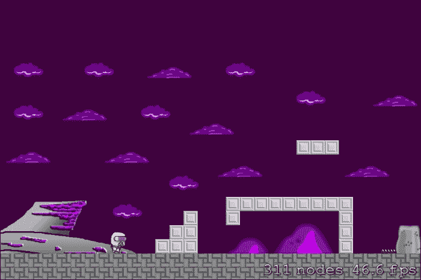

逐步，我们的小游戏正在逐渐成形！让我们让这个关卡看起来有点阴暗和沉闷。让我们玩一些粒子来增加深度！

## 玩转粒子

SpriteKit 让粒子效果变得非常简单，简单到实际上，许多常见的粒子效果，如火焰、烟雾和雨，在创建我们的粒子文件时都是预制的模板。

在 Xcode 中，要创建一个新的粒子发射器，只需导航到**文件** | **新建** | **文件**。在**iOS**部分的模板创建器中（忽略我在上一张截图中选择的是 OS X 的事实）和**资源**部分下，选择**SpriteKit 粒子文件**，如下面的截图所示：

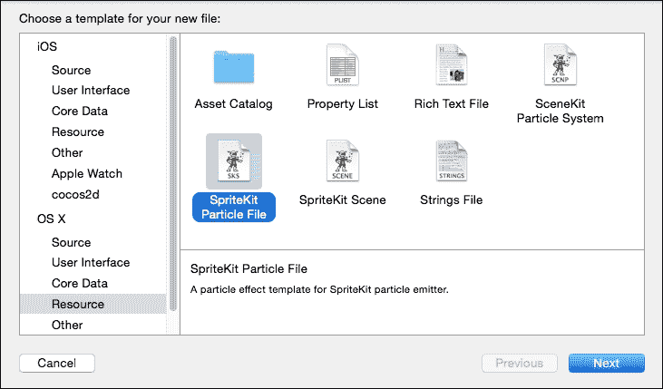

这就是创建效果非常简单的地方，只需从粒子模板中选择**雨**。

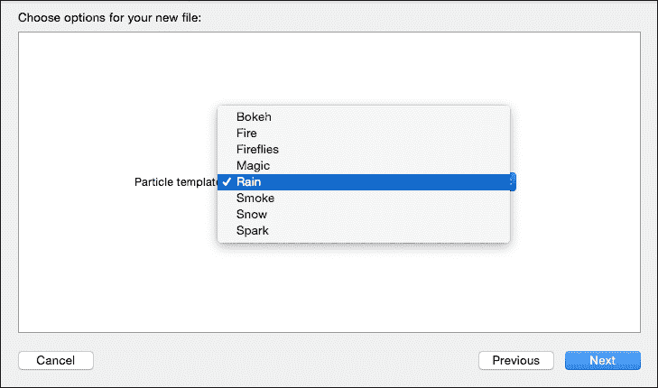

是的，创建粒子就是这么简单！

现在，我们只需要保存它，我刚刚在`ADESA`项目文件夹中做了这件事。现在，你将在 Xcode 的项目资源管理器中看到我们的新粒子发射器文件。点击它，你应该会看到以下类似的截图：

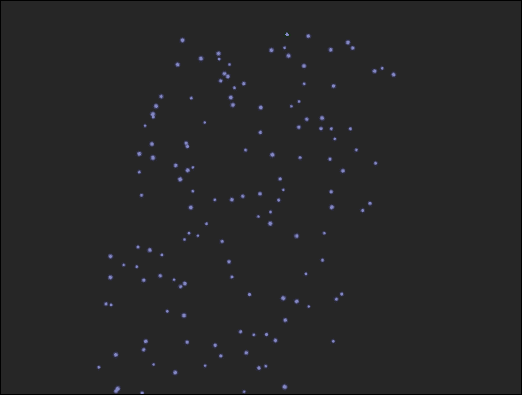

如果你对粒子效果的外观不完全满意，我们可以对其进行大量调整。

在右侧栏的顶部，点击**显示 SK 节点检查器**按钮，可以看到我们可以做的所有调整。我这里唯一改变的是位置范围，我将**X**的值改为**1500**，以便它横跨整个屏幕。

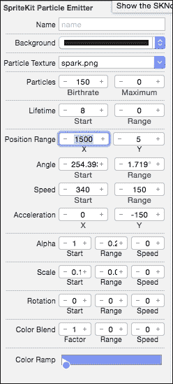

如果您想进行其他调整，让我告诉您所有这些选项的作用。

### 背景

提供背景选项，以便您可以测试粒子在各种颜色背景下的可见性。更改此选项对粒子没有影响。

### 粒子纹理

粒子纹理是发射器将用于粒子的图像文件。提供的标准图像只是一个柔软的白色球体，因此您得到一个平滑柔软的粒子。这张图片很棒，因为它可以用于几乎所有类型的粒子。

### 粒子出生率

粒子出生率是指发射器发射新粒子的速率。值越高，新粒子喷出的速度越快。（警告：粒子越少，性能越好）。还可以指定要发射的粒子总数。如果将值设置为**0**，这将导致粒子无限期地发射。如果指定最大值，当场景中的粒子达到该值时，发射器将停止。

### 粒子生命周期

粒子生命周期控制粒子存活的时间长度（以秒为单位）。范围属性可以用来改变粒子生命周期的持续时间，例如，如果您创建一个爆炸，您可以使用更大的范围，以便有一些粒子比其他粒子更长时间可见。

### 粒子位置范围

粒子位置范围选项定义了粒子创建的位置（不言而喻，对吧？）。**X**和**Y**值可以用来声明一个区域，该区域位于节点中心，粒子将从该区域随机创建。

### 角度

角度选项与粒子从创建点出发沿逆时针方向移动的角度有关，其中**0**度等于向右移动。当我们设置范围值时，它将改变粒子发射的方向。

### 粒子速度

再次，粒子速度选项相当直观。它涉及粒子在创建时的移动速度。当我们设置范围值时，它将改变粒子发射的方向。

### 粒子加速度

加速度属性控制粒子在发射后加速或减速的速度。我再次以爆炸为例，使用此选项，您可以让它们快速飞出，但让碎片减速。

### 粒子尺度

粒子尺度选项显然是指粒子的尺寸，这可以通过范围设置进行变化。

### 粒子旋转

粒子旋转控制粒子旋转的速度。同样，您可以让碎片在飞行过程中旋转。

### 粒子颜色

发射器创建的粒子在其生命周期中可以改变颜色。要在生命周期时间轴中添加新颜色，请点击颜色渐变中颜色要改变的位置并选择新颜色（想想在 Photoshop 或 Illustrator 中创建渐变）。您也可以通过双击标记来更改现有颜色，以显示颜色选择。

要从渐变中移除一种颜色，请点击并向下拖动它。

颜色混合选项控制粒子纹理图像中的颜色数量以及它们如何与颜色渐变中的主颜色混合。

**因子**选项越大，颜色混合越多，其中**0**表示不混合。

### 粒子混合模式

混合模式选项控制粒子图像与场景混合的方式。可用选项如下：

+   **Alpha**: 这在粒子图像中混合透明背景。

+   **加法**: 这将粒子像素添加到相应的背景图像像素。

+   **减法**: 这将从相应的背景图像像素中减去粒子像素。

+   **乘法**: 这将粒子像素乘以相应的背景图像像素。这导致粒子效果更暗。

+   **乘以 2**: 这比标准乘法模式创建的粒子效果更暗。

+   **屏幕**: 这会反转像素，然后乘以并再次反转它们。这导致粒子效果更亮（非常适合火焰效果或火花）。

+   **替换**: 这导致与背景不混合。仅使用粒子的颜色。

要将我们的粒子实现到场景中，让我们转到我们的`GameLevelScene.m`文件，并在`initWithSize`方法中的`if (self = [super initWithSize:size])`括号内添加以下代码块：

```swift
NSString *rainParticles =
        [[NSBundle mainBundle] pathForResource:@"Rain" ofType:@"sks"];

        SKEmitterNode *rainEmitter =
        [NSKeyedUnarchiver unarchiveObjectWithFile:rainParticles];
        
        rainEmitter.position = CGPointMake(0, self.scene.size.height);

        [self addChild:rainEmitter];
```

编译并运行以查看出色的结果！


看起来很棒，但现在它在场景中，我不太喜欢雨的外观；我想调整它，使其看起来更逼真。让我们回到粒子编辑器（再次，通过点击项目资源管理器中的粒子文件）并增加粒子的出生率。

目前，出生率是 150，但我想让它汹涌，所以我将把它增加到 2500。我还会将比例从 0.1 减小到 0.02，因为我认为雨滴看起来太大。我还会将速度改为 500，以便看起来更猛烈。


看起来确实好多了！虽然纸张上很难看出效果，但屏幕上的效果看起来很棒。

现在我们让雨看起来很棒，让我们在我们的破损船只中添加一些火焰和烟雾效果。创建一个新的粒子文件，在模板创建器中选择雨而不是火焰，然后保存。

我们将根据需要以不同的方式实现火焰效果，使其与地图一起滚动。对于雨，我们将其添加到当前屏幕上，这样它就不会随着场景移动，而是与火焰一起移动。如果我们以同样的方式将雨添加到场景中，那么粒子将根据屏幕而不是整个地图保持在同一位置。

回到我们的`GameLevelScene.m`文件，在添加我们的雨发射器代码的同一位置，添加以下方法：

```swift
        NSString *fireParticles =
        [[NSBundle mainBundle] pathForResource:@"Flames"              ofType:@"sks"];

        SKEmitterNode *fireEmitter =
        [NSKeyedUnarchiver unarchiveObjectWithFile:fireParticles];
        fireEmitter.position = CGPointMake(25, 50);

        [_map addChild:fireEmitter];
```

看看代码中的区别？我们不是将`fireEmitter`作为`self`或`GameLevelScene`类的子项添加，而是直接将其添加到地图的`25x`和`50y`位置，因此现在当玩家开始滚动场景时，火焰会保持原位，燃烧着那艘不幸坠毁的船只。

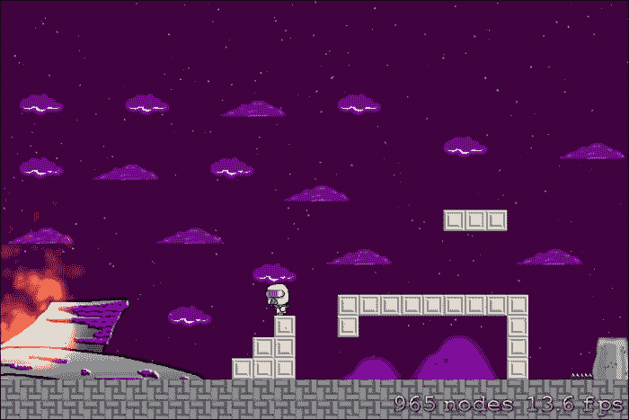

忽略这里截图中的帧率急剧下降；每次我截图时，帧率都会急剧下降，因为我正在运行一台稍微旧一点的 iMac。不过火焰看起来还不错！

然而，我注意到当屏幕上有火焰时，帧率几乎保持在 30fps 的恒定值。这就是性能和电池消耗开始发挥作用的地方。

我在 Xcode 中运行 iPhone 4S 模拟器，因为它可以适当地显示在我的屏幕上，这意味着拥有较老设备的用户将难以运行这款游戏，尤其是在屏幕上出现图形密集型元素，如粒子效果时。

然而，在我的 iPhone 5S 上运行时，游戏的平均帧率达到了 60fps。在我们发布游戏之前，我们必须考虑所有这些因素。我们将在本书的后面讨论这个问题。

现在，让我们创建一个菜单系统！

## 创建菜单和多个关卡

我们的游戏看起来真的很不错，但与其简单地将玩家投入游戏，让我们来谈谈菜单。

菜单非常重要（显然）。它是进入游戏玩法的基础，其缺失可能会让玩家感到困惑。我们不想这样，对吧？

由于我们在关卡开发上已经变得非常疯狂，我们没有关注游戏的结构；也就是说，我们没有考虑菜单或其他任何功能就完成了所有事情。

首先，我为您添加了一些更多需要导入到项目中才能使以下代码正常工作的图片。如果您有自己的图片，只需相应地更改按钮图片的名称即可。

现在，我们必须对我们的`GameLevelScene.m`文件进行一些实质性的修改。首先，我们需要创建一个新的整型变量。这个变量将计算我们的关卡数，其中关卡`0`是我们的主菜单。因此，在`@interface GameLevelScene ()`方法中，我们开始声明时，让我们添加一个额外的声明：

```swift
@property (nonatomic, assign) NSInteger level;
```

现在，让我们进行一些编辑！

让我们从`initWithSize`方法开始。我们将编辑它，使其看起来如下：

```swift
-(id)initWithSize:(CGSize)size {
    if (self = [super initWithSize:size]) {

        self.userInteractionEnabled = YES;
        self.backgroundColor = [SKColor colorWithRed:.0 green:.0 blue:.0 alpha:1.0];

        if (_level == 0){
        SKLabelNode *playLabel = [SKLabelNode labelNodeWithFontNamed:@"AvenirNext-Heavy"];
        playLabel.text = @"Adesa";
        playLabel.fontSize = 40;
        playLabel.position = CGPointMake(self.size.width / 2.0, self.size.height / 1.7);
        [self addChild:playLabel];

        SKSpriteNode *playButton = [SKSpriteNode spriteNodeWithImageNamed:@"play"];
        playButton.position = CGPointMake(self.size.width /2.0 , self.size.height / 2.5);
        playButton.name = @"playButton";
        [self addChild:playButton];
        }

    }
    return self;
}
```

我们原本在该处所有的初始化代码现在都不见了。我们放置了一个漂亮的标签和按钮。我们还把背景改成了黑色，但那部分并不重要。注意我们是如何命名`playButton`的？当我们检测到玩家触摸时，这会很有用，你很快就会看到。

现在，让我们继续向下滚动到我们的`touchesBegan`方法，并在`for`方法内添加以下代码：

```swift
SKNode *node = [self nodeAtPoint:touchLocation];

        if ([node.name isEqualToString:@"playButton"]) {
            _level = 1;
            [self removeAllChildren];

            [[SKTAudio sharedInstance] playBackgroundMusic:@"BackgroundAudio.mp3"];
            self.map = [JSTileMap mapNamed:@"level1.tmx"];
            [self addChild:self.map];
            NSString *rainParticles =
            [[NSBundle mainBundle] pathForResource:@"Rain" ofType:@"sks"];

            SKEmitterNode *rainEmitter =
            [NSKeyedUnarchiver unarchiveObjectWithFile:rainParticles];

            rainEmitter.position = CGPointMake(0, self.scene.size.height);

            [self addChild:rainEmitter];

            NSString *fireParticles =
            [[NSBundle mainBundle] pathForResource:@"Flames" ofType:@"sks"];

            SKEmitterNode *fireEmitter =
            [NSKeyedUnarchiver unarchiveObjectWithFile:fireParticles];
            fireEmitter.position = CGPointMake(25, 50);

            [_map addChild:fireEmitter];

            self.player1 = [[Player alloc] initWithImageNamed:@"P1idle"];
            self.player1.position = CGPointMake(100, 50);
            self.player1.zPosition = 15;
            [self.map addChild:self.player1];
            self.walls = [self.map layerNamed:@"walls"];
            self.hazards = [self.map layerNamed:@"hazards"];
        }
```

在这里，我们在触摸的位置创建一个新的 SpriteKit 节点。然后我们检测该节点是否触摸了我们的播放按钮，然后设置所有关卡 1 的内容。

我还会改变游戏结束的处理方式。到目前为止，当玩家死亡时，屏幕会弹出显示**你已死亡**，然后是大的`重放`按钮。如果我们保持原样，那么这个`重放`按钮方法会重置整个游戏，我不认为人们希望在关卡中死亡时丢失他们的进度。

对代码进行以下更改。我们将删除高亮显示的代码并用以下文本替换：

```swift
-(void)gameOver:(BOOL)won {
    if (_level > 0){
    self.gameOver = YES;

    NSString *gameText;
    if (won) {
        gameText = @"Level Complete!";

    } else {
        gameText = @"You have died!";
        //add the following lines of code here:
 self.player1.position = CGPointMake(100, 50);
 self.player1.zPosition = 15;
 [self setViewpointCenter:self.player1.position];
 self.gameOver = NO;
    }
}
}
 UIButton *replay = [UIButton buttonWithType:UIButtonTypeCustom];
 replay.tag = 321;
 UIImage *replayImage = [UIImage imageNamed:@"replay"];
 [replay setImage:replayImage forState:UIControlStateNormal];
 [replay addTarget:self action:@selector(replay:) forControlEvents:UIControlEventTouchUpInside];
 replay.frame = CGRectMake(self.size.width / 2.0 - replayImage.size.width / 2.0, self.size.height / 2.0 - replayImage.size.height / 2.0, replayImage.size.width, replayImage.size.height);
 [self.view addSubview:replay];

}
}

- (void)replay:(id)sender
{
 [[self.view viewWithTag:321] removeFromSuperview];
 //  [self.view presentScene:[[GameLevelScene alloc] initWithSize:self.size]];

}

```

现在，当你测试它并且玩家死亡时，他只是简单地传送到关卡开始处，而不是弹出`重放`按钮，这可能会在一段时间后变得侵扰性。

在构建菜单后，当你构建并运行项目时，主菜单应该看起来像这样：

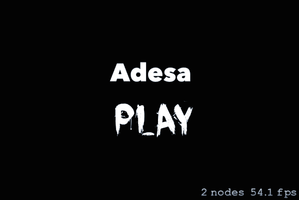

我们现在将实现多个关卡，因为我非常确信玩家会厌倦一遍又一遍地玩同一个关卡。我在这本书的资源部分为你创建了一个新关卡。对于这个关卡，我们的玩家将找到他丢失的装备，但为了找到它，玩家需要在关卡中绕过一个小陷阱。

一旦你将`level2.tmx`文件导入到你的项目中，打开`GameLevelScene.m`文件并向下滚动到我们的`didHeWin`方法，并编辑它如下所示：

```swift
-(void)didHeWin {
    if (self.player1.position.x > 3200.0) {

        if (_level == 1) {
        [self.map removeFromParent];
        self.map = [JSTileMap mapNamed:@"level2.tmx"];
        [self addChild:self.map];

        }
        self.player1 = [[Player alloc] initWithImageNamed:@"P1idle"];
        self.player1.position = CGPointMake(100, 50);
        self.player1.zPosition = 15;
        [self.map addChild:self.player1];
        self.walls = [self.map layerNamed:@"walls"];
        self.hazards = [self.map layerNamed:@"hazards"];
    }
}
```

这个新方法仍然检测玩家的位置，但现在我们设置了一个二级`if`语句来检测玩家所在的关卡。在这种情况下，如果关卡等于 1，我们就从视图中移除当前地图，并将`level2.tmx`文件作为子项添加到视图中。之后，我们将玩家重新定位到关卡的开始位置并再次检查地图层。相当简单，对吧？

不要忘记重新导入`tileSet.png`和`tileSet@2x.png`文件，使用本章提供的文件，因为它们包含新的瓦片。如果你不重新导入这些文件，Xcode 可能会抛出错误，或者我们的新瓦片根本不会显示出来！

现在，你可以构建并运行我们的项目；现在，当玩家到达关卡末尾时，它应该切换到下一个关卡，正如你从以下图像中可以看到的，看起来相当酷！

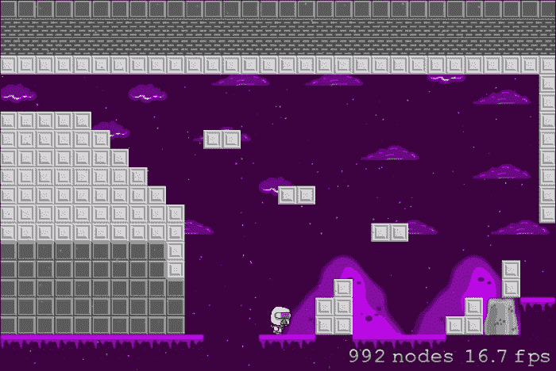

是的！我们的游戏越来越有形了！然而，尽管我们的游戏看起来很酷，但没有敌人，它相当无聊！让我们给我们的太空人一些竞争。

# 创建敌人

这款游戏不仅仅是探险游戏！我们需要让这款游戏变得紧张刺激！

好吧，导入我包含的 Squiggy 图像集，或者你也可以使用你自己的。

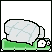

在我们的`GameLevelScene.m`文件中，我们将添加一个新的方法来开始生成随机的敌人。这些敌人一开始很简单，但我们将遇到一些真正的坏蛋，它们会试图杀死你！

无论如何，在`GameLevelScene.m`文件中的任何位置，添加以下方法：

```swift
- (void)addSquiggy {

    SKSpriteNode * squiggy = [SKSpriteNode spriteNodeWithImageNamed:@"Squiggy"];

    int minY = squiggy.size.height / 2;
    int maxY = self.frame.size.height - squiggy.size.height / 2;
    int rangeY = maxY - minY;
    int actualY = (arc4random() % rangeY) + minY;
    squiggy.xScale = -1.0;
    squiggy.position = CGPointMake(self.player1.position.x + 1000 + squiggy.size.width/2, actualY);

    squiggy.name = @"squiggy";

    [self.map addChild:squiggy];

    // Setting the Speed of SQUIGGY!
    int minDuration = 10.0;
    int maxDuration = 20.0;
    int rangeDuration = maxDuration - minDuration;
    int actualDuration = (arc4random() % rangeDuration) + minDuration;

    SKAction * actionMove = [SKAction moveTo:CGPointMake(-squiggy.size.width/2, actualY) duration:actualDuration];
    SKAction * actionMoveDone = [SKAction removeFromParent];
    [squiggy runAction:[SKAction sequence:@[actionMove, actionMoveDone]]];
}
```

这个方法创建了一个 Squiggy 精灵节点。然后，我们创建一个随机的*y*轴坐标来生成我们的 Squiggy。为什么是随机的*y*轴？*y*你问？（啊，双关语）。我们的 Squiggy 当然是一种飞行生物！我们还让他出现在屏幕可见边缘之外，这样看起来就像他正在飞入场景，因此我们将 Squiggy 放置在玩家位置 1000px 之外。

我们将把他作为地图的子项添加，因为我们希望他随着地图滚动，同时给他一个名字，这样我们就可以进行碰撞检测。

然后，我们为 Squiggies 设置一个随机的速度范围，然后创建 SpriteKit 的动作来让它们飞行。

我们现在需要在`GameLevelScene.m`类中实现两个新的属性。这些新类将控制 Squiggies 的生成速率。因此，在类文件顶部，添加以下实现：

```swift
@property (nonatomic) NSTimeInterval lastSpawnTimeInterval;
@property (nonatomic) NSTimeInterval lastUpdateTimeInterval;
```

我们将使用`lastSpawnTimeInterval`方法来跟踪自我们生成 Squiggy 以来经过的时间，以及`lastUpdateTimeInterval`方法来检测自上次更新以来经过的时间。

我们现在将创建一个新的更新方法，但别担心，它不会干扰我们的主要`update`方法。你可以将这个方法添加到`GameLevelScene.m`文件的任何位置：

```swift
- (void)updateWithTimeSinceLastUpdate:(CFTimeInterval)timeSinceLast {

    self.lastSpawnTimeInterval += timeSinceLast;
    if (self.lastSpawnTimeInterval > 2) {
        self.lastSpawnTimeInterval = 0;
        [self addSquiggy];
    }
}

//Then add this method into our regular update method to call our new updateWithTimeSinceLastUpdate method

       CFTimeInterval timeSinceLast = currentTime - self.lastUpdateTimeInterval;
    self.lastUpdateTimeInterval = currentTime;
    if (timeSinceLast > 1) {
        timeSinceLast = 1.0 / 60.0;

    }

    [self updateWithTimeSinceLastUpdate:timeSinceLast];
```

构建、运行和预测散布阵雨和 Squiggies！结果看起来相当酷！我们需要让玩家在接触 Squiggy 时受伤。嘿，它们看起来很可爱，但它们很危险！

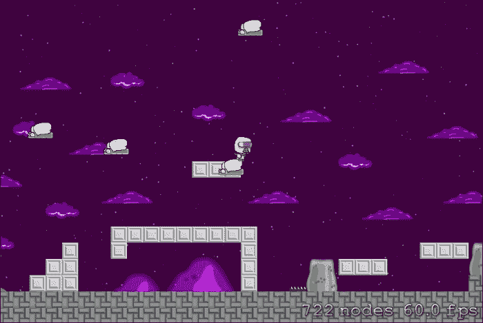

我们在这里需要做一些与物理相关的工作，所以请耐心等待。

在`GameLevelScene.m`类的顶部，在`@interface`和`#import`部分之间，添加以下两行代码：

```swift
static const uint32_t playerCategory = 0x1 << 0;
static const uint32_t enemyCategory = 0x1 << 1;
```

这些行设置了两个类别，一个用于敌人，一个用于玩家。当我们加入射击功能时，我们将为玩家和敌人的弹丸添加另一个类别。

现在，我们需要设置世界的物理，因此在我们`initWithSize`方法内部，我们需要添加以下代码行：

```swift
self.physicsWorld.gravity = CGVectorMake(0,0);
self.physicsWorld.contactDelegate = self;
```

上述代码设置了世界重力，并将场景设置为当两个对象碰撞（或物理体）时将被通知的委托。

物理体是级别内的任何东西，例如由物理控制的角色、对象或敌人。

在我们的`addSquiggy`方法内部，我们需要在创建实际的 Squiggy 精灵之后添加以下代码行：

```swift
squiggy.physicsBody = [SKPhysicsBody bodyWithRectangleOfSize:squiggy.size];
    squiggy.physicsBody.dynamic = YES;
    squiggy.physicsBody.categoryBitMask = enemyCategory;
    squiggy.physicsBody.contactTestBitMask = playerCategory;
    squiggy.physicsBody.collisionBitMask = 0;
```

你问这段代码是做什么的？好吧，让我来解释一下！

第一行为我们的 Squiggy 精灵创建了一个物理体。这个体是围绕精灵的矩形。下一行将精灵设置为动态，这意味着 SpriteKit 物理引擎将不会影响我们的 Squiggy 的运动。唯一控制它的是我们的代码。第三行将我们的 Squiggy 放入`enemyCategory`方法中。

然后，我们告诉引擎，如果两个对象之间发生碰撞，应该通知我们的类别方法。显然，我们选择了`playerCategory`方法。

接下来和最后的行我们添加的是一个有点难以理解的东西，我们将`collisionBitMask`值设置为`0`。碰撞位掩码定义了每个对象在发生碰撞时的响应。在我们的情况下，我们将其设置为`0`，这意味着它们在反弹或弹跳方面不会相互反应。

当我们创建玩家时，我们需要添加类似的代码，所以让我们创建一个新的方法，我们将每次我们的玩家被创建时调用它（即在他死后，或者生成新关卡等）：

```swift
 -(void)setUpPlayerPhysics{
    self.player1.physicsBody = [SKPhysicsBody bodyWithRectangleOfSize:self.player1.size];
    self.player1.physicsBody.dynamic = YES;
    self.player1.physicsBody.categoryBitMask = playerCategory;
    self.player1.physicsBody.contactTestBitMask = enemyCategory;
    self.player1.physicsBody.collisionBitMask = 0;
}
```

这就是我们用来设置敌人物理的方法；我们只是改变了分类。

现在，在`didHeWin`方法的底部，以及在我们触摸按钮后设置玩家后的`touchesBegan`方法中，添加以下代码行：

```swift
 [self setUpPlayerPhysics];
```

超级简单！现在我们需要实际检测两个对象之间的碰撞。

我们需要在我们的`GameLevelScene.m`类文件中的任何地方添加以下方法：

```swift
- (void)didBeginContact:(SKPhysicsContact *)contact
{
    SKPhysicsBody *firstBody, *secondBody;

    uint32_t collision = (contact.bodyA.categoryBitMask | contact.bodyB.categoryBitMask);

    if (collision == (playerCategory | enemyCategory)) {
        [contact.bodyA.node removeFromParent];
        [contact.bodyB.node removeFromParent];
        [self gameOver:0];
    }

    else if (collision == (bulletCategory | enemyCategory)) {
        for (SKSpriteNode *playerBullet in _playerBullets) {
            if (playerBullet.hidden == NO) {
                [contact.bodyA.node removeFromParent];
                [contact.bodyB.node removeFromParent];
            }
        }
    }

    if (contact.bodyA.categoryBitMask < contact.bodyB.categoryBitMask)
    {
        firstBody = contact.bodyA;
        secondBody = contact.bodyB;

    }
    else
    {
        firstBody = contact.bodyB;
        secondBody = contact.bodyA;

    }
}
```

我们仍然需要添加`bulletCategory`函数，所以如果你现在构建项目，它将显示错误。别担心，我们将在几分钟内添加它。最后，我们将对我们的`GameOver`方法做一些轻微的调整：

```swift
-(void)gameOver:(BOOL)won {
    if (_level > 0){
    self.gameOver = YES;
        [_player1 removeFromParent];
    NSString *gameText;
    if (won) {
        gameText = @"Level Complete!";

    } else {
        gameText = @"You have died!";
        self.player1 = [[Player alloc] initWithImageNamed:@"P1idle"];
        self.player1.position = CGPointMake(100, 50);
        self.player1.zPosition = 15;
        [self setUpPlayerPhysics];
        [self.map addChild:self.player1];
        [self setViewpointCenter:self.player1.position];
        self.gameOver = NO;
    }
}
}
```

在这里，我们更改了我们的代码，每次我们的玩家被杀死时，他都会从场景中移除，并在关卡开始处创建一个新的玩家。此外，物理设置再次进行。

在测试了几种方法之后，上述方法是效果最好的。我只是将我们的玩家传送到了正常起始位置前方大约 100px 的位置。不知道为什么。但这确实有效！

现在让我们开始射击！

首先，我们将添加另一个类别，就像我们之前做的那样；这将如下所示：

```swift
static const uint32_t bulletCategory = 0x1 << 2;
```

我们现在将使用这个方法来处理玩家的子弹。此外，我们还想添加一个新的定义，所以就在`#import`部分下面，添加以下代码行：

```swift
#define kNumBullets 20
```

这个定义将帮助我们创建一个用于所有子弹的数组，我们将在稍后进行。

在`@implementation`行上方和属性声明`@end`行之前，添加以下两行代码：

```swift
NSMutableArray *_playerBullets;
int _nextPlayerBullet;
```

我们创建了一个玩家子弹数组，这将允许我们一次创建多个子弹。然后我们在数组中定义了下一个子弹的编号。

在我们的`setUpPlayerPhysics`方法内部，添加以下代码块（不要忘记导入本书资源部分中所有位于资源部分的图像）：

```swift
  #pragma mark - Setup the bullets
    _playerBullets = [[NSMutableArray alloc] initWithCapacity:kNumBullets];
    for (int i = 0; i < kNumBullets; ++i) {
        SKSpriteNode *playerBullet = [SKSpriteNode spriteNodeWithImageNamed:@"Bullet"];
        playerBullet.hidden = YES;
        [_playerBullets addObject:playerBullet];
        [self.map addChild:playerBullet];
    }
```

欢迎来到数组！这一切意味着什么？简单！我们取`_playerBullets`数组，用预定义的子弹数量初始化它；`kNumBullets`变量，它是`20`。所以现在数组有`20`个值。然后，对于数组中的每个条目，从`0`到`20`，添加一个子弹。这真的很简单。

我们将创建一个新的方法，如下所示：

```swift
-(void) startTheGame {
    for (SKSpriteNode *playerBullet in _playerBullets) {
        playerBullet.hidden = YES;
    }
}
```

当玩家按下播放按钮时，我们将调用前面的方法，所以在我们`touchesBegan`方法中，在`if ([node.name isEqualToString:@"playButton"]) {`语句的底部，添加以下代码：

```swift
[self startTheGame];
```

现在，我们需要创建一个新的触摸区域。所以，在我们的`touchesBegan`方法中，我们需要编辑我们的`if (touchLocation.x > self.size.width / 2.0) {`语句，改为以下内容：

```swift
 if (touchLocation.x > self.size.width / 2.0) {
            if (touchLocation.y < self.size.height / 2.0) {
            self.player1.jumping = YES;
            }
            else if (touchLocation.y > self.size.height / 2.0) {
                NSLog(@"PEW");
                if (touchLocation.x > self.size.width / 2.0) {
                    if (touchLocation.y < self.size.height / 2.0) {
                        self.player1.jumping = YES;
                    }
                    else if (touchLocation.y > self.size.height / 2.0) {
                        if (self.player1.xScale == - 1.0) {
                            SKSpriteNode *bullet = [_playerBullets objectAtIndex:_nextPlayerBullet];
                            _nextPlayerBullet++;
                            if (_nextPlayerBullet >= _playerBullets.count) {
                                _nextPlayerBullet = 0;
                            }

                            bullet.position = CGPointMake(_player1.position.x-bullet.size.width/2,_player1.position.y+0);
                            bullet.hidden = NO;
                            [bullet removeAllActions];

                            CGPoint location = CGPointMake(_player1.position.x - 1000, _player1.position.y);
                            SKAction *bulletMoveAction = [SKAction moveTo:location duration:2.5];

                            SKAction *bulletDoneAction = [SKAction runBlock:(dispatch_block_t)^() {
                                bullet.hidden = YES;
                            }];

                            SKAction *moveBulletActionWithDone = [SKAction sequence:@[bulletMoveAction,bulletDoneAction]];
                            [bullet runAction:moveBulletActionWithDone withKey:@"bulletFired"];
                        }

                        else {
                            SKSpriteNode *bullet = [_playerBullets objectAtIndex:_nextPlayerBullet];
                            _nextPlayerBullet++;
                            if (_nextPlayerBullet >= _playerBullets.count) {
                                _nextPlayerBullet = 0;
                            }

                            bullet.position = CGPointMake(_player1.position.x+bullet.size.width/2,_player1.position.y+0);
                            bullet.hidden = NO;
                            [bullet removeAllActions];

                            CGPoint location = CGPointMake(_player1.position.x + 1000, _player1.position.y);
                            SKAction *bulletMoveAction = [SKAction moveTo:location duration:2.5];

                            SKAction *bulletDoneAction = [SKAction runBlock:(dispatch_block_t)^() {
                                bullet.hidden = YES;
                            }];

                            SKAction *moveBulletActionWithDone = [SKAction sequence:@[bulletMoveAction,bulletDoneAction]];
                            [bullet runAction:moveBulletActionWithDone withKey:@"bulletFired"];
                        }
                    }
                }
            }
        }
```

在这里，我们从数组中选择了其中一个子弹。然后，我们将该子弹的位置设置为玩家的位置。接下来，我们将子弹的最终位置设置在屏幕之外，这就是为什么我们添加了两种方法，一种是在玩家向后走时按按钮，另一种是向前走。

现在，当你测试它时，你会看到以下输出：

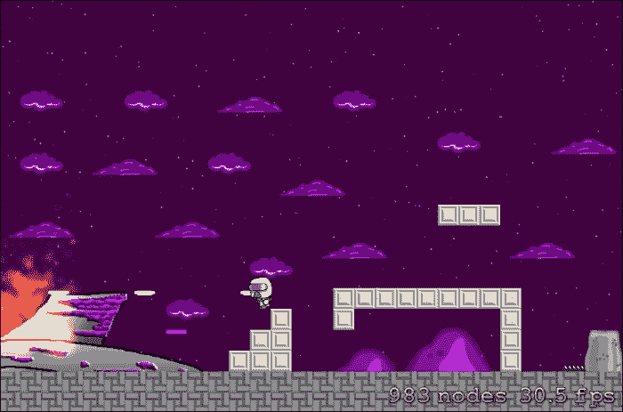

很多“砰砰”声！它还会根据你面对的方向射击，所以这真的很酷。

现在，回到我们的`setUpPlayerPhysics`方法，在那里我们设置子弹，我们需要为每个子弹设置`physicsBody`值。在`for`循环中，在我们将子弹作为子项添加到地图之前，添加以下代码：

```swift
playerBullet.hidden = YES;
        playerBullet.physicsBody = [SKPhysicsBody bodyWithRectangleOfSize:playerBullet.size];
        playerBullet.physicsBody.dynamic = YES;
        playerBullet.physicsBody.categoryBitMask = bulletCategory;
        playerBullet.physicsBody.contactTestBitMask = enemyCategory;
        playerBullet.physicsBody.collisionBitMask = 0;
```

这与我们的之前的`physicsBody`设置相同，只是我们将子弹的分类更改为`bulletCategory`。

现在，当你测试你的项目时，你应该能够射击、死亡和杀戮，而毫不在意！这不是很棒吗？

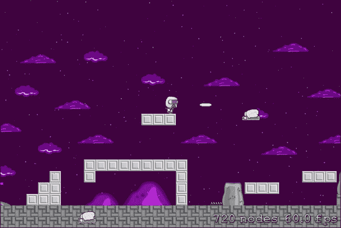

如果它对你有效，那就太好了！我很高兴为你感到高兴！我们在本章中做了很多工作，我们的游戏甚至还没有接近完成。为什么不尝试用本章学到的知识创建自己的关卡呢？生成一些新的敌人，也许尝试一些射击的坏蛋？如果不这样做，我会在本书的后面部分介绍一些更疯狂的坏蛋。现在，让我们休息一下！

我们的游戏运行效率很高，几乎以恒定的 60 fps 运行！太棒了！如果你没有正确设置，以下是你现在应该有的完整源代码：

```swift
//  GameLevelScene.m

#import "GameLevelScene.h"
#import "JSTileMap.h"
#import "Player.h"
#import "SKTUtils.h"
#import "SKTAudio.h"
#define kNumBullets 20

static const uint32_t playerCategory = 0x1 << 0;
static const uint32_t enemyCategory = 0x1 << 1;
static const uint32_t bulletCategory = 0x1 << 2;

@interface GameLevelScene() <SKPhysicsContactDelegate>
@property (nonatomic, strong) JSTileMap *map;
@property (nonatomic, strong) Player *player1;
@property (nonatomic, assign) NSTimeInterval previousTime;
@property (nonatomic, strong) TMXLayer *walls;
@property (nonatomic, strong) TMXLayer *hazards;
@property (nonatomic, assign) BOOL gameOver;

@property (nonatomic) NSTimeInterval lastSpawnTimeInterval;
@property (nonatomic) NSTimeInterval lastUpdateTimeInterval;
@property (nonatomic, assign) NSInteger level;
@end

NSMutableArray *_playerBullets;
int _nextPlayerBullet;

@implementation GameLevelScene

-(id)initWithSize:(CGSize)size {
    if (self = [super initWithSize:size]) {

        self.userInteractionEnabled = YES;
        self.backgroundColor = [SKColor colorWithRed:.0 green:.0 blue:.0 alpha:1.0];
        self.physicsWorld.gravity = CGVectorMake(0, 0);
        self.physicsWorld.contactDelegate = self;

        if (_level == 0){
        SKLabelNode *playLabel = [SKLabelNode labelNodeWithFontNamed:@"AvenirNext-Heavy"];
        playLabel.text = @"Adesa";
        playLabel.fontSize = 40;
        playLabel.position = CGPointMake(self.size.width / 2.0, self.size.height / 1.7);
        [self addChild:playLabel];

        SKSpriteNode *playButton = [SKSpriteNode spriteNodeWithImageNamed:@"play"];
        playButton.position = CGPointMake(self.size.width /2.0 , self.size.height / 2.5);
        playButton.name = @"playButton";
        [self addChild:playButton];

        }

    }
    return self;
}

-(void) startTheGame {
    for (SKSpriteNode *playerBullet in _playerBullets) {
        playerBullet.hidden = YES;
    }
}

- (void)addSquiggy {

    SKSpriteNode * squiggy = [SKSpriteNode spriteNodeWithImageNamed:@"Squiggy"];
    squiggy.physicsBody = [SKPhysicsBody bodyWithRectangleOfSize:squiggy.size];
    squiggy.physicsBody.dynamic = YES;
    squiggy.physicsBody.categoryBitMask = enemyCategory;
    squiggy.physicsBody.contactTestBitMask = playerCategory;
    squiggy.physicsBody.collisionBitMask = 0;

    int minY = squiggy.size.height / 2;
    int maxY = self.frame.size.height - squiggy.size.height / 2;
    int rangeY = maxY - minY;
    int actualY = (arc4random() % rangeY) + minY;
    squiggy.xScale = -1.0;
    squiggy.position = CGPointMake(self.player1.position.x + 1000 + squiggy.size.width/2, actualY);
    [self.map addChild:squiggy];

    // Setting the Speed of SQUIGGY!
    int minDuration = 10.0;
    int maxDuration = 20.0;
    int rangeDuration = maxDuration - minDuration;
    int actualDuration = (arc4random() % rangeDuration) + minDuration;

    SKAction * actionMove = [SKAction moveTo:CGPointMake(-squiggy.size.width/2, actualY) duration:actualDuration];
    SKAction * actionMoveDone = [SKAction removeFromParent];
    [squiggy runAction:[SKAction sequence:@[actionMove, actionMoveDone]]];
}

- (void)updateWithTimeSinceLastUpdate:(CFTimeInterval)timeSinceLast {

    self.lastSpawnTimeInterval += timeSinceLast;
    if (self.lastSpawnTimeInterval > 2) {
        self.lastSpawnTimeInterval = 0;
        [self addSquiggy];

    }
}

-(CGRect)tileRectFromTileCoords:(CGPoint)tileCoords {
    float levelHeightInPixels = self.map.mapSize.height * self.map.tileSize.height;
    CGPoint origin = CGPointMake(tileCoords.x * self.map.tileSize.width, levelHeightInPixels - ((tileCoords.y + 1) * self.map.tileSize.height));
    return CGRectMake(origin.x, origin.y, self.map.tileSize.width, self.map.tileSize.height);
}

- (NSInteger)tileGIDAtTileCoord:(CGPoint)coord forLayer:(TMXLayer *)layer {
    TMXLayerInfo *layerInfo = layer.layerInfo;
    return [layerInfo tileGidAtCoord:coord];
}

- (void)handleHazardCollisions:(Player *)player
{
    [self didHeWin];

    NSInteger indices[8] = {7, 1, 3, 5, 0, 2, 6, 8};

    for (NSUInteger i = 0; i < 8; i++) {
        NSInteger tileIndex = indices[i];

        CGRect playerRect = [player collisionBox];
        CGPoint playerCoord = [self.hazards coordForPoint:player.desiredPosition];

        NSInteger tileColumn = tileIndex % 3;
        NSInteger tileRow = tileIndex / 3;
        CGPoint tileCoord = CGPointMake(playerCoord.x + (tileColumn - 1), playerCoord.y + (tileRow - 1));

        NSInteger gid = [self tileGIDAtTileCoord:tileCoord forLayer:self.hazards];
        if (gid != 0) {
            CGRect tileRect = [self tileRectFromTileCoords:tileCoord];
            if (CGRectIntersectsRect(playerRect, tileRect)) {
                [self gameOver:0];
            }
        }
    }
}

-(void)gameOver:(BOOL)won {
    if (_level > 0){
    self.gameOver = YES;
        [_player1 removeFromParent];
    NSString *gameText;
    if (won) {
        gameText = @"Level Complete!";

    } else {
        gameText = @"You have died!";
        self.player1 = [[Player alloc] initWithImageNamed:@"P1idle"];
        self.player1.position = CGPointMake(100, 50);
        self.player1.zPosition = 15;
        [self setUpPlayerPhysics];
        [self.map addChild:self.player1];
        [self setViewpointCenter:self.player1.position];
        self.gameOver = NO;
    }
}
}

-(void)setUpPlayerPhysics{
    self.player1.physicsBody = [SKPhysicsBody bodyWithRectangleOfSize:self.player1.size];
    self.player1.physicsBody.dynamic = YES;
    self.player1.physicsBody.categoryBitMask = playerCategory;
    self.player1.physicsBody.contactTestBitMask = enemyCategory;
    self.player1.physicsBody.collisionBitMask = 0;

#pragma mark - Setup the bullets
    _playerBullets = [[NSMutableArray alloc] initWithCapacity:kNumBullets];
    for (int i = 0; i < kNumBullets; ++i) {
        SKSpriteNode *playerBullet = [SKSpriteNode spriteNodeWithImageNamed:@"Bullet"];
        playerBullet.hidden = YES;
        playerBullet.physicsBody = [SKPhysicsBody bodyWithRectangleOfSize:playerBullet.size];
        playerBullet.physicsBody.dynamic = YES;
        playerBullet.physicsBody.categoryBitMask = bulletCategory;
        playerBullet.physicsBody.contactTestBitMask = enemyCategory;
        playerBullet.physicsBody.collisionBitMask = 0;

        [_playerBullets addObject:playerBullet];
        [self.map addChild:playerBullet];
    }
}

-(void)didHeWin {
    if (self.player1.position.x > 3200.0) {

        if (_level == 1) {
        [self.map removeFromParent];
        self.map = [JSTileMap mapNamed:@"level2.tmx"];
        [self addChild:self.map];
        }
        self.player1 = [[Player alloc] initWithImageNamed:@"P1idle"];
        self.player1.position = CGPointMake(100, 50);
        self.player1.zPosition = 15;
        [self.map addChild:self.player1];
        self.walls = [self.map layerNamed:@"walls"];
        self.hazards = [self.map layerNamed:@"hazards"];
        [self setUpPlayerPhysics];
    }
}

- (void)checkForAndResolveCollisionsForPlayer:(Player *)player forLayer:(TMXLayer *)layer
{

    NSInteger indices[8] = {7, 1, 3, 5, 0, 2, 6, 8};
    player.onGround = NO;
    for (NSUInteger i = 0; i < 8; i++) {
        NSInteger tileIndex = indices[i];

        CGRect playerRect = [player collisionBox];
        CGPoint playerCoord = [layer coordForPoint:player.desiredPosition];
        if (playerCoord.y >= self.map.mapSize.height - 1) {
            [self gameOver:0];
            return;
        }

        NSInteger tileColumn = tileIndex % 3;
        NSInteger tileRow = tileIndex / 3;
        CGPoint tileCoord = CGPointMake(playerCoord.x + (tileColumn - 1), playerCoord.y + (tileRow - 1));

        NSInteger gid = [self tileGIDAtTileCoord:tileCoord forLayer:layer];
        if (gid != 0) {
            CGRect tileRect = [self tileRectFromTileCoords:tileCoord];

            if (CGRectIntersectsRect(playerRect, tileRect)) {
                CGRect intersection = CGRectIntersection(playerRect, tileRect);

                if (tileIndex == 7) {

                    player.desiredPosition = CGPointMake(player.desiredPosition.x, player.desiredPosition.y + intersection.size.height);
                    player.velocity = CGPointMake(player.velocity.x, 0.0);
                    player.onGround = YES;
                } else if (tileIndex == 1) {

                    player.desiredPosition = CGPointMake(player.desiredPosition.x, player.desiredPosition.y - intersection.size.height);
                } else if (tileIndex == 3) {

                    player.desiredPosition = CGPointMake(player.desiredPosition.x + intersection.size.width, player.desiredPosition.y);
                } else if (tileIndex == 5) {

                    player.desiredPosition = CGPointMake(player.desiredPosition.x - intersection.size.width, player.desiredPosition.y);

                } else {
                    if (intersection.size.width > intersection.size.height) {

                        player.velocity = CGPointMake(player.velocity.x, 0.0);
                        float intersectionHeight;
                        if (tileIndex > 4) {
                            intersectionHeight = intersection.size.height;
                            player.onGround = YES;
                        } else {
                            intersectionHeight = -intersection.size.height;
                        }
                        player.desiredPosition = CGPointMake(player.desiredPosition.x, player.desiredPosition.y + intersection.size.height );
                    } else {

                        float intersectionWidth;
                        if (tileIndex == 6 || tileIndex == 0) {
                            intersectionWidth = intersection.size.width;
                        } else {
                            intersectionWidth = -intersection.size.width;
                        }

                        player.desiredPosition = CGPointMake(player.desiredPosition.x  + intersectionWidth, player.desiredPosition.y);
                    }
                }
            }
        }
    }

    player.position = player.desiredPosition;
    [self handleHazardCollisions:self.player1];
}

- (void)didBeginContact:(SKPhysicsContact *)contact
{
    SKPhysicsBody *firstBody, *secondBody;

    uint32_t collision = (contact.bodyA.categoryBitMask | contact.bodyB.categoryBitMask);

    if (collision == (playerCategory | enemyCategory)) {
        [contact.bodyA.node removeFromParent];
        [contact.bodyB.node removeFromParent];
        [self gameOver:0];
    }

    else if (collision == (bulletCategory | enemyCategory)) {
        for (SKSpriteNode *playerBullet in _playerBullets) {
            if (playerBullet.hidden == NO) {
                [contact.bodyA.node removeFromParent];
                [contact.bodyB.node removeFromParent];
            }
        }
    }

    if (contact.bodyA.categoryBitMask < contact.bodyB.categoryBitMask)
    {
        firstBody = contact.bodyA;
        secondBody = contact.bodyB;

    }
    else
    {
        firstBody = contact.bodyB;
        secondBody = contact.bodyA;

    }
}

- (void)setViewpointCenter:(CGPoint)position {
    NSInteger x = MAX(position.x, self.size.width / 2);
    NSInteger y = MAX(position.y, self.size.height / 2);
    x = MIN(x, (self.map.mapSize.width * self.map.tileSize.width) - self.size.width / 2);
    y = MIN(y, (self.map.mapSize.height * self.map.tileSize.height) - self.size.height / 2);
    CGPoint actualPosition = CGPointMake(x, y);
    CGPoint centerOfView = CGPointMake(self.size.width/2, self.size.height/2);
    CGPoint viewPoint = CGPointSubtract(centerOfView, actualPosition);
    self.map.position = viewPoint;
}

- (void)touchesBegan:(NSSet *)touches withEvent:(UIEvent *)event
{

    for (UITouch *touch in touches) {
        CGPoint touchLocation = [touch locationInNode:self];

        SKNode *node = [self nodeAtPoint:touchLocation];

        if ([node.name isEqualToString:@"playButton"]) {
            _level = 1;
            [self removeAllChildren];
            self.backgroundColor = [SKColor colorWithRed:.25 green:.0 blue:.25 alpha:1.0];
            [[SKTAudio sharedInstance] playBackgroundMusic:@"BackgroundAudio.mp3"];
            self.map = [JSTileMap mapNamed:@"level1.tmx"];
            [self addChild:self.map];
            NSString *rainParticles =
            [[NSBundle mainBundle] pathForResource:@"Rain" ofType:@"sks"];

            SKEmitterNode *rainEmitter =
            [NSKeyedUnarchiver unarchiveObjectWithFile:rainParticles];

            rainEmitter.position = CGPointMake(0, self.scene.size.height);

            [self addChild:rainEmitter];

            NSString *fireParticles =
            [[NSBundle mainBundle] pathForResource:@"Flames" ofType:@"sks"];

            SKEmitterNode *fireEmitter =
            [NSKeyedUnarchiver unarchiveObjectWithFile:fireParticles];
            fireEmitter.position = CGPointMake(25, 50);

            [_map addChild:fireEmitter];

            self.player1 = [[Player alloc] initWithImageNamed:@"P1idle"];
            self.player1.position = CGPointMake(100, 50);
            self.player1.zPosition = 15;
            [self.map addChild:self.player1];
            self.walls = [self.map layerNamed:@"walls"];
            self.hazards = [self.map layerNamed:@"hazards"];
            [self setUpPlayerPhysics];
            [self startTheGame];
        }

        if (touchLocation.x > self.size.width / 2.0) {
            if (touchLocation.y < self.size.height / 2.0) {
            self.player1.jumping = YES;
            }
            else if (touchLocation.y > self.size.height / 2.0) {
                NSLog(@"PEW");
                if (touchLocation.x > self.size.width / 2.0) {
                    if (touchLocation.y < self.size.height / 2.0) {
                        self.player1.jumping = YES;
                    }
                    else if (touchLocation.y > self.size.height / 2.0) {
                        if (self.player1.xScale == - 1.0) {
                            SKSpriteNode *bullet = [_playerBullets objectAtIndex:_nextPlayerBullet];
                            _nextPlayerBullet++;
                            if (_nextPlayerBullet >= _playerBullets.count) {
                                _nextPlayerBullet = 0;
                            }

                            bullet.position = CGPointMake(_player1.position.x-bullet.size.width/2,_player1.position.y+0);
                            bullet.hidden = NO;
                            [bullet removeAllActions];

                            CGPoint location = CGPointMake(_player1.position.x - 1000, _player1.position.y);
                            SKAction *bulletMoveAction = [SKAction moveTo:location duration:2.5];

                            SKAction *bulletDoneAction = [SKAction runBlock:(dispatch_block_t)^() {
                                bullet.hidden = YES;
                            }];

                            SKAction *moveBulletActionWithDone = [SKAction sequence:@[bulletMoveAction,bulletDoneAction]];
                            [bullet runAction:moveBulletActionWithDone withKey:@"bulletFired"];
                        }

                        else {
                            SKSpriteNode *bullet = [_playerBullets objectAtIndex:_nextPlayerBullet];
                            _nextPlayerBullet++;
                            if (_nextPlayerBullet >= _playerBullets.count) {
                                _nextPlayerBullet = 0;
                            }

                            bullet.position = CGPointMake(_player1.position.x+bullet.size.width/2,_player1.position.y+0);
                            bullet.hidden = NO;
                            [bullet removeAllActions];

                            CGPoint location = CGPointMake(_player1.position.x + 1000, _player1.position.y);
                            SKAction *bulletMoveAction = [SKAction moveTo:location duration:2.5];

                            SKAction *bulletDoneAction = [SKAction runBlock:(dispatch_block_t)^() {
                                bullet.hidden = YES;
                            }];

                            SKAction *moveBulletActionWithDone = [SKAction sequence:@[bulletMoveAction,bulletDoneAction]];
                            [bullet runAction:moveBulletActionWithDone withKey:@"bulletFired"];
                        }
                    }
                }
            }
        }

        else {
            if (touchLocation.x < self.size.width / 2.0) {
                if (touchLocation.y > self.size.height / 2){
                    self.player1.goingBackwards = YES;
                    self.player1.animateWalking = YES;
                    self.player1.xScale = -1.0;
                }
                if (touchLocation.y < self.size.height / 2){
                    self.player1.walking = YES;
                    self.player1.animateWalking = YES;
                    self.player1.xScale = 1.0;
                }
            }

        }
    }
}

- (void)touchesMoved:(NSSet *)touches withEvent:(UIEvent *)event {
    for (UITouch *touch in touches) {

        float halfWidth = self.size.width / 2.0;
        CGPoint touchLocation = [touch locationInNode:self];

        CGPoint previousTouchLocation = [touch previousLocationInNode:self];

        if (touchLocation.x > halfWidth && previousTouchLocation.x <= halfWidth) {
            self.player1.walking = NO;
            self.player1.goingBackwards = NO;
            self.player1.jumping = YES;
        } else if (previousTouchLocation.x > halfWidth && touchLocation.x <= halfWidth) {

            self.player1.goingBackwards = NO;
            self.player1.jumping = NO;
        }
        else if (previousTouchLocation.x > halfWidth && touchLocation.x <= halfWidth) {
            if (touchLocation.y > self.size.height / 2){
            self.player1.walking = NO;
            self.player1.jumping = NO;
            }
        }
    }
}

- (void)touchesEnded:(NSSet *)touches withEvent:(UIEvent *)event {

    for (UITouch *touch in touches) {
        CGPoint touchLocation = [touch locationInNode:self];
        if (touchLocation.x < self.size.width / 2.0) {
            if (touchLocation.x < self.size.width / 2.0) {
                if (touchLocation.y > self.size.height / 2){
                    self.player1.goingBackwards = NO;
                    self.player1.animateWalking = NO;
                }
                if (touchLocation.y < self.size.height / 2){
                    self.player1.walking = NO;
                    self.player1.animateWalking = NO;
                }
            }

        } else {
            self.player1.jumping = NO;
        }
    }
}

- (void)update:(NSTimeInterval)currentTime
{

    CFTimeInterval timeSinceLast = currentTime - self.lastUpdateTimeInterval;
    self.lastUpdateTimeInterval = currentTime;
    if (timeSinceLast > 1) {
        timeSinceLast = 1.0 / 60.0;
        self.lastUpdateTimeInterval = currentTime;
    }

    [self updateWithTimeSinceLastUpdate:timeSinceLast];

    if (self.gameOver) return;

    [self setViewpointCenter:self.player1.position];
    NSTimeInterval delta = currentTime - self.previousTime;

    if (delta > 0.02) {
        delta = 0.02;
    }

    self.previousTime = currentTime;

    [self.player1 update:delta];

    [self checkForAndResolveCollisionsForPlayer:self.player1 forLayer:self.walls];
}

@end //(which is fitting because this is the end of the chapter... and end of the page :D)
```

# 摘要

让我们回顾一下本章中我们所学到的内容。我们在游戏中添加了一些音乐和酷炫的声音效果。然后，我们给玩家添加了一个合适的行走动画，这样他就不会看起来像是在空中漂浮！然而，如果你不想要这种效果，你可以节省很多打字。接下来，我们制作了一些看起来非常酷炫的粒子效果！我们让雨下起来，还让被毁的船只燃烧起来！

我们简要讨论了菜单，以及我们如何创建一个简单的主菜单。我们将在准备发布时进一步完善它。

然后，敌人！我们创造了我们的 Squiggies，那些既可爱又危险的敌人。事情将会变得可怕，所以系好安全带，享受这段旅程吧。

注意：只有我们的玩家会感到可怕，而我们不会，因为我们才是创造混乱的人。
