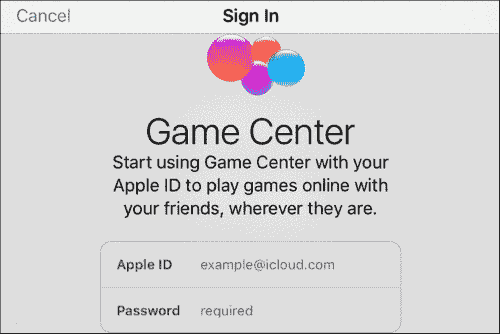
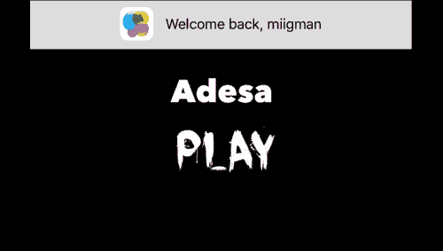
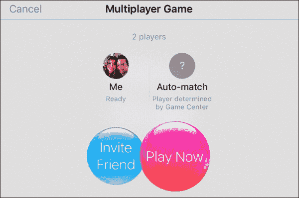
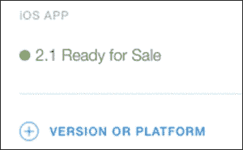
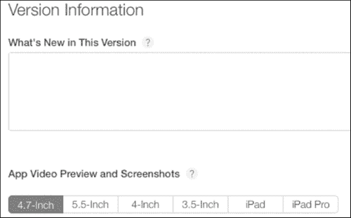
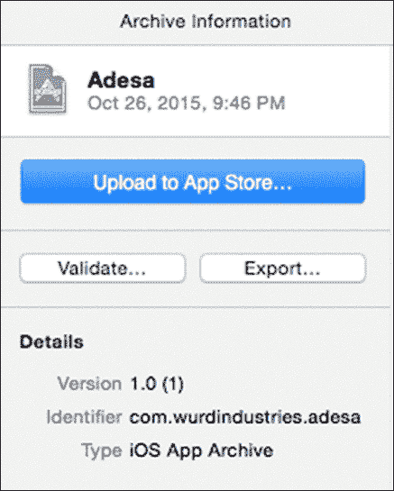
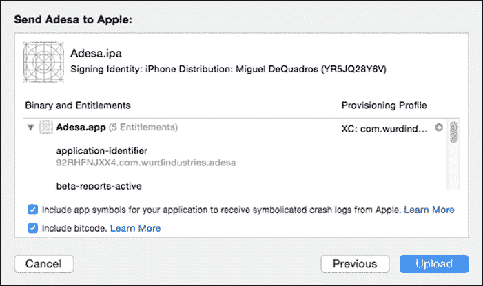
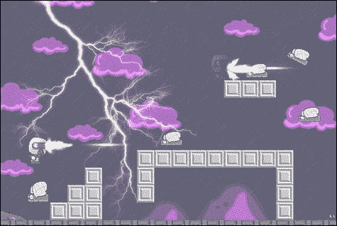

# 第八章。独自一人去太危险了，带上一个朋友吧！

你做到了！你已经正式发布了你的游戏，而且它做得很好！但现在你想要添加更多功能并推送更新，对吧？因为重复同样的事情有点单调，我们不想失去人们的兴趣。这就是本章我们将要讨论的内容：

+   多人游戏集成

+   游戏中心集成（我们混合多人游戏和游戏中心）

+   将更新推送到 AppStore

现在，我们可以让我们的玩家玩得更开心，因为，说实话，谁不喜欢和朋友一起玩呢？这将会是一大堆工作，但嘿，这绝对值得！

让我们这么做...

# 多人游戏集成

我相信我们所有人都记得和朋友们坐在老式 CRT 电视前，加载上*超级马里奥 3*（在插入之前吹一下卡带以确保它能工作）并一起玩上好几个小时。

然后，引入了分屏多人游戏，这让大家震惊。“我们可以同时一起玩吗？我们不需要轮流玩？太酷了！”

现在，我们处于蓝牙/在线多人游戏的时代。我们不再和朋友们坐在同一个房间里玩游戏；不，我们现在是不合群的。但这不是问题；当你玩完之后，这会留下更少的混乱要清理。这就是我们将要集成的——多人游戏与匹配——这将非常酷！

然而，为了做到这一点，我们确实需要启用并将**游戏中心**集成到我们的游戏中。为了开始做这件事，让我们在 Xcode 中打开我们的项目。在左侧选择我们的项目后，点击屏幕中央的**能力**标签，如下面的截图所示：


然后，浏览一下我们可以添加的功能列表，找到**游戏中心**（通常在这个列表中是第三个）。点击箭头展开选项。你会看到一个写着**关闭**的按钮，点击这个按钮来打开**游戏中心**。

我们不能运行我们的游戏并期望**游戏中心**自动工作，不，不！为了做到这一点，我们实际上需要在我们的应用打开时让用户进行身份验证。

为了确保我们的应用中一切井井有条，我们将在项目中创建一个新的组（或文件夹），并将其命名为`Multiplayer`。

然后，我们必须创建一个新的类（通过导航到**文件** | **新建** | **文件**）并创建一个新的`.h`文件以及一个新的`.m`文件，并将它们都命名为`MultiplayerHelper`。然后，将这两个文件拖入我们刚刚创建的`Multiplayer`文件夹中。

我们现在将`MultiplayerHelper.h`中的代码替换为以下代码：

```swift
@import GameKit;

@interface MultiplayerHelper : NSObject

@property (nonatomic, readonly) UIViewController *authenticationViewController;
@property (nonatomic, readonly) NSError *lastError;

+ (instancetype)sharedGameKitHelper;

@end
```

这段代码导入`GameKit` API（我们将使用它来连接两个玩家）并定义了两个属性——一个是视图控制器，我们将用它来显示游戏中心的认证，另一个用于跟踪在交互游戏中心时发生的最后一个错误（如果有）。

现在，让我们转到我们的`.m`文件，并将代码更改为以下内容：

```swift
#import "MultiplayerHelper.h"

@import GameKit;

@implementation MultiplayerHelper {
    BOOL _enableGameCenter;
}

+ (instancetype)sharedMultiplayerHelper
{
    static MultiplayerHelper *sharedMultiplayerHelper;
    static dispatch_once_t onceToken;
    dispatch_once(&onceToken, ^{
        sharedMultiplayerHelper = [[MultiplayerHelper alloc] init];
    });
    return sharedMultiplayerHelper;
}

- (id)init
{
    self = [super init];
    if (self) {
        _enableGameCenter = YES;
    }
    return self;
}

- (void)authenticateLocalPlayer
{

    GKLocalPlayer *localPlayer = [GKLocalPlayer localPlayer];

    localPlayer.authenticateHandler  =
    ^(UIViewController *viewController, NSError *error) {

        [self setLastError:error];

        if(viewController != nil) {

            [self setAuthenticationViewController:viewController];
        } else if([GKLocalPlayer localPlayer].isAuthenticated) {

            _enableGameCenter = YES;
        } else {

            _enableGameCenter = NO;
        }
    };
}

- (void)setAuthenticationViewController:(UIViewController *)authenticationViewController
{
}

- (void)setLastError:(NSError *)error
{
}

@end
```

我知道一开始这看起来可能有点令人畏惧，但让我们把它分解一下。一次，我们得到`GKLocalPlayer`类的实例，它代表当前认证的玩家。然后我们给`GKLocalPlayer`一个认证处理程序，`GameKit` API 将调用它。

我们设置了一个方法来存储可能出现的任何错误，以便使用`setLastError:`方法进行易于调试。

接下来，我们检查玩家是否在 GC 应用或设备中的任何其他地方登录到游戏中心。如果没有，`GameKit` API 将尝试对用户进行认证。这就是我们显示认证窗口的地方（我们都知道游戏中心的登录弹出窗口，不是吗？）。尽快对用户进行认证是理想的。没有人想在游戏过程中或输入游戏设置时被认证窗口打断。

或者，如果玩家已经登录，`Game Kit`本地玩家的`authenticated`属性将被设置为`true`。

最后，最后一个方法只是关闭游戏中心。谁知道呢，也许玩家不想被它打扰，所以所有功能都被关闭了。

由于游戏中心认证发生在应用的背景中，游戏可以在应用打开时随时进行认证，无论玩家是否在导航屏幕或与 Boss 战斗。这不是我们想要的。为了防止这种情况破坏我们的游戏，我们将使用一些技巧。基本上，我们将让游戏中心创建一个通知，而当前视图将负责显示它。例如，如果通知在主菜单中调用，没问题，我们会立即调用它。然而，如果我们处于关卡中间，并且通知被调用，我们需要在方便的时候显示认证窗口，比如玩家暂停或死亡时。

要做到这一点，我们需要定义通知。因此，在我们的`MultiplayerHelper.m`文件中，我们将在文件顶部直接添加以下行，位于`@import GameKit`行下方：

```swift
NSString *const PresentAuthenticationViewController = @"present_authentication_view_controller";
```

在我们的`setAuthenticationViewController:`方法中向下进一步，添加以下代码块：

```swift
 if (authenticationViewController != nil) {
        _authenticationViewController = authenticationViewController;
        [[NSNotificationCenter defaultCenter]
         postNotificationName:PresentAuthenticationViewController
         object:self];
    }
```

这个方法所做的只是存储并发送通知到当前视图控制器。你明白了吗？我知道这听起来可能很多，不是吗？

现在我们向下滚动到我们的`-(void)setLastError:`方法，并在括号内添加以下代码：

```swift
_lastError = [error copy];
  if (_lastError) {
    NSLog(@"MultiplayerHelper ERROR: %@",
          [[_lastError userInfo] description]);
  }
```

这将仅在控制台中有任何异常发生时记录日志。我们在错误之前设置了 `MultiplayerHelper`，所以在日志中我们实际上会看到 `MultiplayerHelper Error:` "连接失败"。这样就可以更容易地看到抛出的错误。很多时候连接会失败，通过这样做，我们不仅能够知道错误是什么，还能知道导致错误的原因。这是一个很好的实践；在调试问题时会使事情变得容易得多！

然后，我们需要跳转到我们的 `MultiplayerHelper.h` 文件，并在 `interface` 方法上方添加一个外部链接方法：

```swift
extern NSString *const PresentAuthenticationViewController;
```

这将允许我们通过项目的其他部分访问此函数，因此我们可以在需要时显示认证视图。

最后，我们需要在 `@end` 之上添加一个用于验证本地玩家的声明：

```swift
(void)authenticateLocalPlayer;
```

这就是我们需要验证玩家身份的所有内容！

目前，你的 `MultiplayerHelper.h` 文件的内容应该如下所示：

```swift
@import GameKit;
extern NSString *const PresentAuthenticationViewController;
@interface MultiplayerHelper : NSObject

@property (nonatomic, readonly) UIViewController *authenticationViewController;
@property (nonatomic, readonly) NSError *lastError;

- (void)authenticateLocalPlayer;
+ (instancetype)sharedMultiplayerHelper;

@end
```

此外，你的 `MultiplayerHelper.m` 文件的内容应该如下所示：

```swift
#import "MultiplayerHelper.h"

@import GameKit;

NSString *const PresentAuthenticationViewController = @"present_authentication_view_controller";

@implementation MultiplayerHelper {
    BOOL _enableGameCenter;
}

+ (instancetype)sharedMultiplayerHelper
{
    static MultiplayerHelper *sharedMultiplayerHelper;
    static dispatch_once_t onceToken;
    dispatch_once(&onceToken, ^{
        sharedMultiplayerHelper = [[MultiplayerHelper alloc] init];
    });
    return sharedMultiplayerHelper;
}

- (id)init
{
    self = [super init];
    if (self) {
        _enableGameCenter = YES;
    }
    return self;
}

- (void)authenticateLocalPlayer
{

    GKLocalPlayer *localPlayer = [GKLocalPlayer localPlayer];

    localPlayer.authenticateHandler  =
    ^(UIViewController *viewController, NSError *error) {

        [self setLastError:error];

        if(viewController != nil) {

            [self setAuthenticationViewController:viewController];
        } else if([GKLocalPlayer localPlayer].isAuthenticated) {

            _enableGameCenter = YES;
        } else {

            _enableGameCenter = NO;
        }
    };
}

- (void)setAuthenticationViewController:(UIViewController *)authenticationViewController
{
    if (authenticationViewController != nil) {
        _authenticationViewController = authenticationViewController;
        [[NSNotificationCenter defaultCenter]
         postNotificationName:PresentAuthenticationViewController
         object:self];
    }
}

- (void)setLastError:(NSError *)error
{
    _lastError = [error copy];
    if (_lastError) {
        NSLog(@"MultiplayerHelper ERROR: %@",
              [[_lastError userInfo] description]);
    }
}

@end
```

在所有这些问题都解决（希望一切对你来说都运行得完美），我们将跳转到我们的 `ViewController.m` 文件，并在 `(void)viewDidAppear:` 方法内添加以下函数：

```swift
  [[NSNotificationCenter defaultCenter]
     addObserver:self
     selector:@selector(showAuthenticationViewController)
     name:PresentAuthenticationViewController
     object:nil];

    [[MultiplayerHelper sharedMultiplayerHelper]
     authenticateLocalPlayer];
```

再次，我们将使用 `NSNotificationCenter` 方法，这将允许每个 `ViewController` 类发送一个通知，在这种情况下是显示认证视图控制器，以便可以根据在 `ViewController` 类中的调用位置进行不同的处理。

现在，我们需要添加一个实际显示认证视图控制器的方法。在 `ViewController.m` 文件中，添加以下函数：

```swift
- (void)showAuthenticationViewController
{
    MultiplayerHelper *multiplayerHelper =
    [MultiplayerHelper sharedMultiplayerHelper];

    [self presentViewController:
     multiplayerHelper.authenticationViewController
                                         animated:YES
                                       completion:nil];
}
- (void)dealloc
{
    [[NSNotificationCenter defaultCenter] removeObserver:self];
}
```

当你在几秒钟后运行并测试游戏时，你会看到以下页面：



当你输入你的凭据时，你将登录，然后你会看到以下页面：



我们还没有完成！我们还需要搜索其他玩家来一起玩。Game Center 的好处是匹配系统已经直接集成到 API 中，所以我们不需要进行任何复杂的编程或 GUI 创建。

让我们回到我们的 `MultiPlayerHelper.h` 文件，以便我们可以在 `@import` 行之后添加以下代码块进行以下更改：

```swift
@protocol MultiPlayerHelperDelegate
-(void)matchStarted;
-(void)matchEnded;
-(void)match:(GKMatch *)match didReceiveData:(NSData *)data fromPlayer:(NSString *)playerID;
@end
```

然后，我们必须修改我们的 `@interface` 行，以便我们可以支持我们刚刚创建的匹配协议：

```swift
@interface MultiplayerHelper : NSObject<GKMatchmakerViewControllerDelegate, GKMatchDelegate>
```

然后，我们在 `@interface` 行之后添加以下函数：

```swift
@property (nonatomic, strong) GKMatch *match;
@property (nonatomic, assign) id <MultiPlayerHelperDelegate> delegate;

- (void)findMatchWithMinPlayers:(int)minPlayers maxPlayers:(int)maxPlayers
                 viewController:(UIViewController *)viewController
                 delegate:(id<MultiPlayerHelperDelegate>)delegate;
```

哇，哇！冷静一下，牛仔！这是我以前从未见过的技巧！让我们来分解一下！

首先，我们添加了一个名为 `MultiPlayerHelperDelegate` 的新协议。这是为了在发生某些事件时通知其他对象和函数，例如新游戏开始或结束。

接下来，`MultiplayerHelper` 类定义了两个新的协议。第一个协议是 `GKMatchmakerViewControllerDelegate` 函数，它使 `MultiplayerHelper` 类能够在找到新的匹配时通知玩家。第二个协议是 `GKMatchDelegate` 函数，用于 Game Center 通知 `MultiplayerHelper` 如果有新数据传入或我们失去了连接。

最后，下一个动作允许 `MultiplayerHelper` 类寻找可以一起玩的人。

简单，对吧？YES！

现在，我们将跳转到 `GameKitHelper.m` 文件，以便我们可以添加更多函数！

第一个函数必须添加在我们的 `@implementation` 行内：

```swift
BOOL _matchStarted;
```

这是一个简单的 `true` 或 `false` 声明，当有新的匹配开始时我们将调用它。现在，我们将添加以下函数（我是在 `(void)authenticateLocalPlayer` 方法之后添加的）：

```swift
- (void)findMatchWithMinPlayers:(int)minPlayers maxPlayers:(int)maxPlayers
                 viewController:(UIViewController *)viewController
                       delegate:(id<MultiPlayerHelperDelegate>)delegate {

    if (!_enableGameCenter) return;

    _matchStarted = NO;
    self.match = nil;
    _delegate = delegate;
    [viewController dismissViewControllerAnimated:NO completion:nil];

    GKMatchRequest *request = [[GKMatchRequest alloc] init];
    request.minPlayers = minPlayers;
    request.maxPlayers = maxPlayers;

    GKMatchmakerViewController *mmvc =
    [[GKMatchmakerViewController alloc] initWithMatchRequest:request];
    mmvc.matchmakerDelegate = self;

    [viewController presentViewController:mmvc animated:YES completion:nil];
}
```

这是允许找到匹配的功能。我们设置它，如果玩家没有登录到 Game Center，它将无效化并什么都不做。

然后，我们开始寻找新的匹配。此方法允许我们自定义我们想要的匹配类型，例如，匹配中所需的玩家数量最小或最大。你可以创建一个 GUI，让匹配器可以像在典型的 FPS 游戏中那样自定义匹配。

然后，我们通过将委托设置为我们的 `MultiplayerHelper` 对象来创建一个新的 Game Kit `MatchMakerViewController` 实例，然后将其弹出屏幕。

最后，`MatchMakerViewController` 函数开始搜索。它将发送一些回调，我们现在将添加。在刚刚添加的方法之后插入以下内容；第一个将在用户取消搜索朋友时被调用：

```swift
- (void)matchmakerViewControllerWasCancelled:(GKMatchmakerViewController *)viewController {
    [viewController dismissViewControllerAnimated:YES completion:nil];
}
```

下一个是在匹配过程失败时；我们将在日志中显示发生了什么：

```swift
- (void)matchmakerViewController:(GKMatchmakerViewController *)viewController didFailWithError:(NSError *)error {
    [viewController dismissViewControllerAnimated:YES completion:nil];
    NSLog(@"Well that didn't work. Here's why: %@", error.localizedDescription);
}
```

现在，我们已经找到了一个匹配！

```swift
- (void)matchmakerViewController:(GKMatchmakerViewController *)viewController didFindMatch:(GKMatch *)match {
    [viewController dismissViewControllerAnimated:YES completion:nil];
    self.match = match;
    match.delegate = self;
    if (!_matchStarted && match.expectedPlayerCount == 0) {
        NSLog(@"Ready to start playing!");
    }
}

#pragma mark GKMatchDelegate
```

以下代码块告诉我们匹配是否收到了玩家发送的数据：

```swift
- (void)match:(GKMatch *)match didReceiveData:(NSData *)data fromPlayer:(NSString *)playerID {
    if (_match != match) return;

    [_delegate match:match didReceiveData:data fromPlayer:playerID];
}
```

这告诉我们连接是否发生变化：

```swift
- (void)match:(GKMatch *)match player:(NSString *)playerID didChangeState:(GKPlayerConnectionState)state {
    if (_match != match) return;

    switch (state) {
        case GKPlayerStateConnected:

            NSLog(@"Player connected!");

            if (!_matchStarted && match.expectedPlayerCount == 0) {
                NSLog(@"Ready to start match!");
            }

            break;
        case GKPlayerStateDisconnected:

            NSLog(@"Player disconnected!");
            _matchStarted = NO;
            [_delegate matchEnded];
            break;
    }
}
```

这将告诉我们游戏由于某些奇怪的原因无法开始：

```swift
- (void)match:(GKMatch *)match connectionWithPlayerFailed:(NSString *)playerID withError:(NSError *)error {

    if (_match != match) return;

    NSLog(@"Failed to connect to player with error: %@", error.localizedDescription);
    _matchStarted = NO;
    [_delegate matchEnded];
}
```

最后，这告诉我们是否在连接任何玩家时出现了错误：

```swift
- (void)match:(GKMatch *)match didFailWithError:(NSError *)error {

    if (_match != match) return;

    NSLog(@"Match failed with error: %@", error.localizedDescription);
    _matchStarted = NO;
    [_delegate matchEnded];
}
```

我们将在 `MultiplayerHelper.m` 文件的顶部添加另一个 `NSString` 类。在 `present_authentication_view_controller` 定义下方添加以下声明：

```swift
NSString *const LocalPlayerIsAuthenticated = @"local_player_authenticated";
```

然后，我们将滚动到 `authenticatedLocalPlayer` 方法，我们将编辑它，使其看起来如下：

```swift
- (void)authenticateLocalPlayer
{

    GKLocalPlayer *localPlayer = [GKLocalPlayer localPlayer];

    if (localPlayer.isAuthenticated) {
        [[NSNotificationCenter defaultCenter] postNotificationName:LocalPlayerIsAuthenticated object:nil];
        return;
    }

    localPlayer.authenticateHandler  =
    ^(UIViewController *viewController, NSError *error) {

        [self setLastError:error];

        if(viewController != nil) {

            [self setAuthenticationViewController:viewController];
        } else if([GKLocalPlayer localPlayer].isAuthenticated) {

            _enableGameCenter = YES;
            [[NSNotificationCenter defaultCenter] postNotificationName:LocalPlayerIsAuthenticated object:nil];
        } else {

            _enableGameCenter = NO;
        }
    };
}
```

同样，我们在这里创建了一个新的通知（`NSString` 类），稍后当玩家被认证时将被调用，因为我们将立即处理那个通知的调用。

让我们回到我们的 `MultiPlayerHelper.h` 文件，我们将在此 `@import` 行下方添加以下代码行：

```swift
extern NSString *const LocalPlayerIsAuthenticated;
```

再次强调，这是一个外部链接，我们稍后会访问。目前，我们将更改我们的 `ViewController.h` 文件：

```swift
#import <UIKit/UIKit.h>
#import <SpriteKit/SpriteKit.h>
#import <iAd/iAd.h>
#import "MultiplayerHelper.h"

@interface ViewController : UIViewController <ADBannerViewDelegate, MultiPlayerHelperDelegate> {
    ADBannerView *adView;
}

@end
```

我们需要调整`ViewController`接口以实现`MultiPlayerHelperDelegate`方法。

我们现在需要调整我们的`ViewController.m`文件，添加以下添加和更改。首先，我们将添加以下代码块到我们的`(void)viewDidAppear`函数中：

```swift
    [[NSNotificationCenter defaultCenter] addObserver:self selector:@selector(playerAuthenticated)
name:LocalPlayerIsAuthenticated object:nil];
```

以下代码展示了我们如何接受我们之前创建的通知以验证玩家：

```swift
- (void)playerAuthenticated {
    [[MultiplayerHelper sharedMultiplayerHelper] findMatchWithMinPlayers:2 maxPlayers:2 viewController:self delegate:self];
}
```

现在，在`dealloc`函数下添加以下定义：

```swift
#pragma mark MultiPlayerHelperDelegate

- (void)matchStarted {    
    NSLog(@"Game started");        
}

- (void)matchEnded {    
    NSLog(@"Game ended");    
}

- (void)match:(GKMatch *)match didReceiveData:(NSData *)data fromPlayer:(NSString *)playerID {
    NSLog(@"Received data");
}
```

这些将简单地记录通过`MultiPlayerHelperDelegate`方法传递的每个通知，所以当游戏开始或结束或接收到数据时，你将在控制台中看到日志。

现在运行它，你将看到以下输出：



太棒了！！这部分看起来相当酷，但我们还有很长的路要走。

# 游戏中心集成

匹配师，匹配师，为我找一个匹配对象！现在是开始寻找我们的朋友的时候了！

让我们转到我们的`MultiplayerHelper.h`文件，以便我们可以在`@interface`行之后添加一个新的字典来存储我们找到的玩家。就在`@interface`行之后，添加以下声明：

```swift
@property(nonatomic, strong) NSMutableDictionary *playersDict;
```

这个字典允许游戏工具包轻松查找玩家数据。

现在，我们将转到我们的`MultiplayerHelper.m`文件并做一些新的更改。首先，我们将在验证我们的本地玩家后添加一个新的方法：

```swift
- (void)lookupPlayers {

    NSLog(@"Looking up %lu players...", (unsigned long)_match.playerIDs.count);

    [GKPlayer loadPlayersForIdentifiers:_match.playerIDs withCompletionHandler:^(NSArray *players, NSError *error) {

        if (error != nil) {
            NSLog(@"Error retrieving player info: %@", error.localizedDescription);
            _matchStarted = NO;
            [_delegate matchEnded];
        } else {

            // fill up that there dictionary
            _playersDict = [NSMutableDictionary dictionaryWithCapacity:players.count];
            for (GKPlayer *player in players) {
                NSLog(@"Found this person to play with: %@", player.alias);
                [_playersDict setObject:player forKey:player.playerID];
            }
            [_playersDict setObject:[GKLocalPlayer localPlayer] forKey:[GKLocalPlayer localPlayer].playerID];

            // Let me know if the match can start k?
            _matchStarted = YES;
            [_delegate matchStarted];
        }
    }];
}
```

接下来，我们需要实际调用这个方法，我们将在两个不同的地方调用它。在第一个方法中，我们将调整以下代码：

```swift
- (void)matchmakerViewController:(GKMatchmakerViewController *)viewController didFindMatch:(GKMatch *)match {
    [viewController dismissViewControllerAnimated:YES completion:nil];
    self.match = match;
    match.delegate = self;
    if (!_matchStarted && match.expectedPlayerCount == 0) {
        NSLog(@"Ready to play!");
        [self lookupPlayers];
    }
}
```

我们需要调整另一个方法：

```swift
- (void)match:(GKMatch *)match player:(NSString *)playerID didChangeState:(GKPlayerConnectionState)state {
    if (_match != match) return;

    switch (state) {
        case GKPlayerStateConnected:
            // handle a new player connection.
            NSLog(@"Player connected!");

            if (!_matchStarted && match.expectedPlayerCount == 0) {
                NSLog(@"LET'S PLAY YA");
                [self lookupPlayers];
            }

            break;
        case GKPlayerStateDisconnected:
            // a player just disconnected.
            NSLog(@"Player disconnected!");
            _matchStarted = NO;
            [_delegate matchEnded];
            break;
    }
}
```

现在，如果你要在两个设备上测试我们的代码，你应该在控制台看到以下内容：

```swift
2015-10-26 18:52:13.867 ADESA[787:60b] Ready to start match!
2015-10-26 18:52:13.874 ADESA[787:60b] Looking up 1 players...
2015-10-26 18:52:13.894 ADESA[787:60b] Found player: miigman
2015-10-26 18:52:13.895 ADESA[787:60b] Match has started successfully
```

就这样！现在完成我们的多人集成所需的所有工作就是处理两个连接设备之间的控制。

现在我们已经将多人功能全部集成，接下来就轮到你了，让两个玩家都出现！（你不会以为我会让你那么容易做到吧，对吧？）

大部分工作已经为你完成了；只需记住如何在多个类之间工作。想要一个提示吗？发送消息！例如，当你按下跳跃按钮时，向`MultiPlayerHelper`方法发送消息使`player2`在`GameScene`类中移动。哦，别忘了设置`player2`。

我知道你能做到！

这将是你的最后一个挑战。

当你完成时...

# 正在向 AppStore 推送更新！

现在你已经完成了你那令人惊叹的新多人游戏，是时候将你游戏的最新版本推送到 AppStore 了！你还记得我们最初是如何推送我们的游戏的吗？步骤非常相似！

首先，简单地登录到[itunesconnect.apple.com](http://itunesconnect.apple.com)，然后在**我的应用**部分点击你想要更新的应用。


一旦你选择了应用，你将看到一个中间有**i**的大蓝色圆圈，要求你创建一个新的应用版本，如果你想要更改应用信息。那么我该如何做到这一点呢？！

很简单，尽量保持冷静。

在侧边栏中，只需点击显示**版本或平台**处的**+**按钮，如下面的截图所示：



在撰写这本书的时候，它会问你想要创建新的 iOS 版本还是 tvOS 版本。

对于这本书（因为我们没有涵盖 tvOS）。

ITunes connect 将要求你输入新版本号。当你点击**完成**时，它将出现在当前版本上方，显示为**准备销售**。

一旦点击新版本，你将被要求填写新版本信息和上传新截图，如下面的截图所示：



你可以更改应用的描述和联系方式，并选择你希望应用何时发布。当你填写完所有内容并上传了所有新截图后，你可以退出浏览器并再次打开 Xcode。

我知道，我们之前使用了 Application Loader，但 Xcode 似乎是一个更简单的方法，因为你可以直接通过它构建和提交。

你还记得我们是怎么做的吗？没问题！

点击我们项目顶部的方案，确保我们已选择设备构建（否则，将不可用存档选项），如下面的截图所示：


一旦选择了设备构建，导航到**产品** | **存档**。Xcode 现在将构建我们的应用并将其存档以供 AppStore 提交。完成后，它将显示包含我们应用和过去构建的其他应用的组织者。最近的构建将自动选中。在侧边栏中，只需点击**上传到 App Store**。



Xcode 将验证我们的包，签名，然后存档它。



一旦完成，只需点击**上传**按钮！Xcode 将自动将你的项目文件上传到 AppStore。在上传之前，别忘了更改列表中的版本号，否则上传后会出现错误。

现在你只需要等待你那令人惊叹的新版本发布！

我为你们感到非常自豪！你们已经走了这么长的路！

## 我没有忘记……我只是错过了它

在实现我们游戏的多玩家功能时，你遇到任何问题吗？它显示它没有被 Game Center 识别吗？真傻！我忘记提到一个相当关键的步骤……哎呀！嘿，这种情况是会发生的！

所以，如果你在设备或模拟器上运行你的应用时遇到了那个错误，那是因为你的游戏还没有在 Game Center 注册。

你是怎么做到这一点的？

再次登录到 [itunesconnect.apple.com](http://itunesconnect.apple.com)，进入**我的应用**，然后打开你的应用。向下滚动，如果你在**多人游戏兼容性**部分看到一个带有文本**点击+以选择此应用版本的多人游戏兼容性**的灰色框，那么你就知道我之前哪里做错了。


简单地点击**+**按钮，选择你的应用以添加多人游戏兼容性。

# 你完成了！

伙计们，我非常高兴你们能陪我走这么远！我知道，有时可能会感到困惑或信息量很大，但你们做到了！

我希望你能通过我所传授的所有知识和技巧，掌握 iOS 开发！

祝你在游戏开发生涯中一切顺利，永远不要放弃你的梦想和热情。以下图片展示了游戏全部完成时的最终结果。



# 摘要

我们讨论了实现多人游戏集成！我们为我们的游戏设置了 GameCenter，甚至已经准备好了玩家认证和匹配搜索。完成这个精彩项目的任务完全取决于你。我们还讨论了如何上传我们游戏的更新版本，这样全世界的数百万玩家都可以享受你的最新更新。
