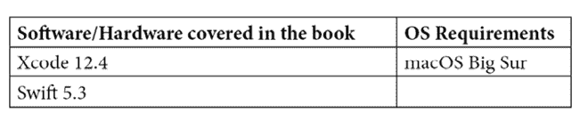

# 前言

iOS 开发环境已经显著成熟，随着苹果用户在 App Store 上花费更多金钱，为专业 iOS 开发者提供了大量的开发机会。然而，掌握 iOS 开发以及 iOS 14 的新特性并非易事。本书将帮助你顺利、轻松地完成这一转变。借助 Swift 5.3，你不仅将学习如何为 iOS 14 编程，还将学习如何编写高效、可读性和可维护性强的 Swift 代码，并保持行业最佳实践。

*精通 iOS 14 编程*将帮助你构建实际的应用程序，并反映实际的开发流程。你还将找到详尽的背景信息和实际案例，教你如何开始实施你新获得的知识。

在本书结束时，你将能够掌握构建利用高级技术并充分利用 iOS 14 最新和最佳功能的 iOS 应用程序。

# 本书面向的对象

如果你是一位有 iOS 编程经验的开发者，并希望通过使用 Swift 解锁最新 iOS 版本的潜力来提升你的技能，构建出色的应用程序，那么这本书就是为你准备的。本书假设你对 Swift 和 iOS 开发有一定程度的熟悉。

# 本书涵盖的内容

*第一章*, *iOS 14 的新特性*，探讨了刚刚发布的最新 API 以及 iOS 中一些当前前沿的特性，以及 Swift 5 中的新变化。

*第二章*, *使用深色模式*，教你如何通过几个简单的步骤，在将深色模式实现到你的新或现有 iOS 应用中时，产生巨大的差异。

*第三章*, *使用列表和表格*，让你掌握如何在 iOS 中处理列表和表格，同时解释了它们如何工作的细节。

*第四章*, *创建详情页*，通过构建从我们的列表和表格中获取的具体详情页，将我们迄今为止所学的内容进一步深化。

*第五章*, *通过动画沉浸你的用户*，在设置好我们的应用程序基础后，探讨 UIKit 在 Swift 和 iOS 中提供的动画功能。

*第六章*, *理解 Swift 类型系统*，帮助你掌握 Swift 类型系统背后的理论，这在 Swift 编程语言中起着至关重要的作用。

*第七章*, *使用协议、泛型和扩展进行灵活编码*，让你能够将应用程序的结构进一步扩展，学习 Swift 中软件开发的核心原则。

*第八章*, *将 Core Data 添加到您的应用中*，介绍了 Apple 的 CoreData 框架作为在您的应用中包含用户数据数据库的方法。

*第九章*, *从网络获取并显示数据*，展示了如何利用 Web API 获取并显示数据。

*第十章*, *使用 CoreML 制作更智能的应用*，解释了机器学习是什么，它是如何工作的，如何在您的应用中使用训练好的机器学习模型，如何使用 Apple 的 Vision 框架分析图像，以及您将看到它是如何与 CoreML 集成以实现强大的图像检测。最后，您将学习如何使用新的 CreateML 工具来训练您自己的模型。

*第十一章*, *向您的应用添加媒体*，涵盖了播放音频和视频、拍照以及在可用时从照片中提取深度数据。

*第十二章*, *使用位置服务改进应用*，展示了应用如何实现位置跟踪以增强和改善用户体验的几种方法。

*第十三章*, *使用 Combine 框架工作*，涵盖了 Combine 框架，让您学习并理解事件驱动编程的基础知识，包括为什么以及如何在日常应用中使用它。

*第十四章*, *为您的应用创建 App Clip*，专注于为现有应用创建一个新的 App Clip，了解其限制、设计指南和可用选项。

*第十五章*, *使用 Vision 框架进行识别*，解释了 Vision 框架以及如何在 iOS 14 中识别图像中的文本和视频流中的手部地标。

*第十六章*, *创建您的第一个小部件*，专注于为现有应用创建一个新的小部件，了解不同选项、尺寸和功能，这些都可以为用户提供。

*第十七章*, *使用增强现实*，介绍了 ARKit 及其所有可用功能，包括如何使用 3D 模型和 Scene Kit 来构建您应用的增强现实世界。

*第十八章*, *使用 Catalyst 创建 macOS 应用*，教授 Mac Catalyst，这是一种将 iPadOS 应用开发为原生 macOS 应用的方法。它通过一个示例项目将其转换为一个完全功能化的 macOS 应用，该应用可以分发到 Mac App Store。

*第十九章*, *通过测试确保应用质量*，展示了如何为 iOS 应用设置测试。

*第二十章*，*将您的应用提交到 App Store*，展示了如何通过 TestFlight 分发应用，以及如何提交应用以供审查以便发布到 App Store。

# 要充分利用本书

本书中的所有示例代码都是使用 Swift 5.3 编写的，在编写本书时，Swift 5.4 是最新的版本，本书与新的版本兼容，在运行 macOS Big Sur 的 Mac 上使用 Xcode 12.4。要跟随本书中的所有示例，您必须在您的机器上至少安装 Xcode 12.4。建议您还至少在 Mac 上安装 macOS Big Sur，因为并非所有代码示例都与较旧的 macOS 版本兼容。

本书假设您对 Swift 和 iOS 开发有一定了解。如果您对 Swift 完全没有经验，建议您浏览 Apple 的 Swift 手册，并了解 iOS 开发的基础知识。您不必成为 iOS 开发的专家，但坚实的基座不会对您有害，因为本书的节奏针对的是有一定经验的开发者。



**如果您使用的是本书的数字版，我们建议您亲自输入代码或通过 GitHub 仓库（下一节中提供链接）访问代码。这样做将帮助您避免与代码的复制和粘贴相关的任何潜在错误。**

# 下载示例代码文件

您可以从 GitHub 下载本书的示例代码文件：[`github.com/PacktPublishing/Mastering-iOS-14-Programming-4th-Edition`](https://github.com/PacktPublishing/Mastering-iOS-14-Programming-4th-Edition)。如果代码有更新，它将在现有的 GitHub 仓库中更新。

我们还提供了来自我们丰富的图书和视频目录中的其他代码包，可在 [`github.com/PacktPublishing/`](https://github.com/PacktPublishing/) 获取。查看它们！

# 下载彩色图像

我们还提供了一份包含本书中使用的截图/图表的彩色图像的 PDF 文件。您可以从这里下载：[`static.packt-cdn.com/downloads/9781838822842_ColorImages.pdf`](https://static.packt-cdn.com/downloads/9781838822842_ColorImages.pdf)。

# 使用的约定

本书使用了多种文本约定。

`文本中的代码`：表示文本中的代码单词、数据库表名、文件夹名、文件名、文件扩展名、路径名、虚拟 URL、用户输入和推特用户名。以下是一个示例：“请打开本章代码包中名为 `CryptoWidget_start` 的项目。”

代码块按照以下方式设置：

```swift
func doSomething(completionHandler: (Int) -> Void) {
     // perform some actions
     var result = theResultOfSomeAction
     completionHandler(result)
} 
```

当我们希望您注意代码块中的特定部分时，相关的行或项目将以粗体显示：

```swift
func doSomething(completionHandler: (Int) -> Void) {
     // perform some actions
     var result = theResultOfSomeAction
     completionHandler(result)
} 
```

任何命令行输入或输出都按照以下方式编写：

```swift
$ mkdir css
$ cd css
```

`CryptoWidget_start`，转到**文件** | **新建** | **目标** | **小部件扩展**。

小贴士或重要提示

看起来是这样的。

# 联系我们

我们欢迎读者的反馈。

**一般反馈**: 如果您对本书的任何方面有疑问，请在邮件主题中提及书名，并通过 customercare@packtpub.com 发送邮件给我们。

**勘误**: 尽管我们已经尽最大努力确保内容的准确性，但错误仍然可能发生。如果您在这本书中发现了错误，如果您能向我们报告这一点，我们将不胜感激。请访问 [www.packtpub.com/support/errata](http://www.packtpub.com/support/errata)，选择您的书籍，点击勘误提交表单链接，并输入详细信息。

**盗版**: 如果您在互联网上以任何形式发现我们作品的非法副本，如果您能向我们提供位置地址或网站名称，我们将不胜感激。请通过 copyright@packt.com 联系我们，并提供材料的链接。

**如果您有兴趣成为作者**: 如果您在某个领域有专业知识，并且您有兴趣撰写或为书籍做出贡献，请访问 [authors.packtpub.com](http://authors.packtpub.com)。

# 评论

请留下评论。一旦您阅读并使用了这本书，为何不在您购买它的网站上留下评论呢？潜在读者可以查看并使用您的客观意见来做出购买决定，Packt 可以了解您对我们产品的看法，我们的作者也可以看到他们对书籍的反馈。谢谢！

如需了解 Packt 的更多信息，请访问 [packt.com](http://packt.com)。
