# *第三章*：使用列表和表格

很有可能您之前已经构建了一个简单的应用，或者您可能尝试过但并未完全成功。如果是这种情况，您可能已经使用了`UITableView`或`UICollectionView`，因为这两个都是许多 iOS 应用的核心组件。

如果一个应用显示项目列表，它很可能是使用`UITableView`构建的。本章将确保您熟悉`UITableView`和`UICollectionView`的方方面面。除了涵盖基础知识，例如我们如何使用代理模式，您还将学习如何访问用户数据——在这种情况下，他们的联系人——这些数据将在`UITableView`和`UICollectionView`对象中呈现。

我们将本章的结尾放在查看 SwiftUI 中的列表上，这是苹果在 2019 年宣布的新 UI 框架。我们将探讨 SwiftUI 和 UIKit 提供的根本区别。

本章将涵盖以下主题：

+   使用`UITableView`

+   进一步探索表格视图

+   使用`UICollectionView`

+   进一步探索集合视图

+   在 SwiftUI 中使用列表

# 技术要求

对于本章，您需要从 Apple 的 App Store 下载 Xcode 版本 11.4 或更高版本。

您还需要运行最新版本的 macOS（Catalina 或更高版本）。只需在 App Store 中搜索 Xcode，选择并下载最新版本。启动 Xcode，并遵循系统可能提示的任何其他安装说明。一旦 Xcode 完全启动，您就可以开始了。

从以下 GitHub 链接下载示例代码：

[`github.com/PacktPublishing/Mastering-iOS-14-Programming-4th-Edition`](https://github.com/PacktPublishing/Mastering-iOS-14-Programming-4th-Edition)

# 使用 UITableView

在本节中，我们将首先查看`UITableView`，这是在 iOS 中显示列表数据最常见——如果不是*最*常见的方法之一。

## 设置项目

每次您在 Xcode 中开始一个新项目时，您都有选择为您的应用选择模板的选项。每个模板都包含一小部分代码或一些样板代码以帮助您开始。在大多数情况下，甚至已经为您设置了一个基本布局。在本书中，您应该默认使用**单视图应用**模板。不要被它的名字所迷惑；您可以为您的应用添加尽可能多的视图。这个模板只是为您提供了一个视图以开始。

在本章中，您将创建一个名为 My Contacts 的应用。这个应用将在您设置的`UITableView`组件中显示用户的联系人列表。现在让我们为这个应用创建一个项目。

在菜单栏中，执行以下操作：

1.  选择**文件** | **新建** | **项目**。

1.  选择**单视图应用**。

1.  将您的项目命名为`联系人列表`或您喜欢的任何名称。

1.  确保您的编程语言设置为**Swift**，用户界面设置为**Storyboard**——它应该类似于以下内容：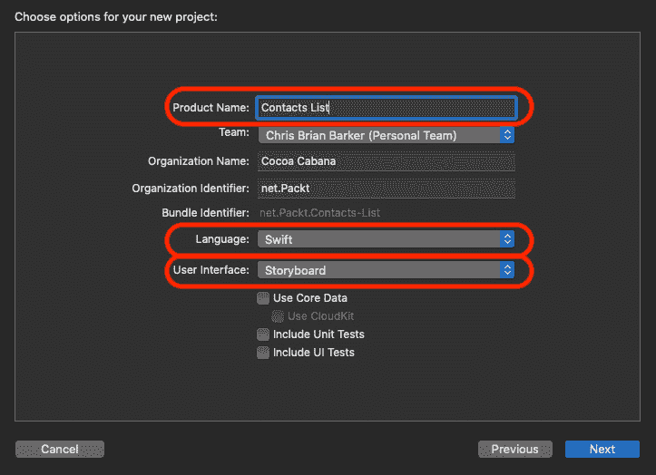

    图 3.1 – Xcode 新项目选项

1.  从这里，点击**下一步**然后点击**创建**。

1.  一旦您的项目加载完成，打开左侧导航树中名为`Main.storyboard`的文件。

故事板文件用于布局您应用程序的所有视图，并将它们连接到您编写的代码。您用于操作故事板的编辑器称为界面构建器。

如果您以前使用过`UITableView`，您可能使用过`UITableViewController`。`UITableViewController`类是一个常规`UIViewController`类的子类。

不同之处在于`UITableViewController`包含了许多您否则必须自己执行设置，无论是在界面构建器中还是通过编程方式。为了完全理解`UITableView`是如何配置和设置的，我们在这个例子中不会使用`UITableViewController`。

在 Xcode 中，您会注意到右上角有一个带有加号符号的按钮。点击此按钮以打开对象浏览器。一旦打开，搜索`Table View`。如果您开始输入潜在组件的名称，您应该会看到一系列建议选项变得可用——就像以下截图所示：

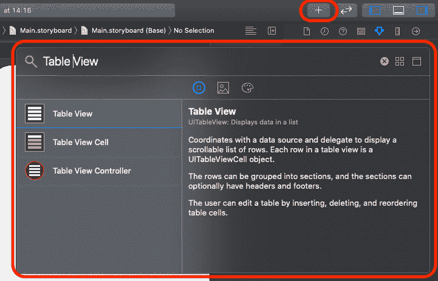

图 3.2 – 添加对象

一旦找到**表格视图**，直接将其拖动到界面构建器中的画布上。不用担心它放置得是否尴尬，我们现在将通过使用自动布局添加一些约束来修复这个问题。

在我们的画布中，突出显示我们刚刚添加的`UITableView`对象，然后点击以下截图中突出显示的图标。添加顶部、前导、尾部和底部约束为`0`：


图 3.3 – 设置约束

完成后，点击`UITableView`对象，使其完美地固定在屏幕的每个边缘。无论在什么尺寸的设备上显示，这些约束也将得到遵守。

自动布局使您能够创建能够自动适应任何现有屏幕大小的布局。您当前的布局使用固定坐标和尺寸来布局表格视图。例如，您的表格视图被设置为在 0 的位置，大小为（375，667）。这个大小非常适合 iPhone 8 和 SE 等设备，但与 iPhone 11 或 iPad Pro 不太搭配。一个视图的位置和尺寸的组合被称为框架。

自动布局使用约束来定义布局而不是框架。例如，为了使表格视图适应整个屏幕，您会添加约束，将表格视图的每个边缘固定到其父视图的相应边缘。这样做会使表格视图始终匹配其父视图的大小。

## 获取联系人数据

为了让我们能够从我们的设备中获取用户的联系人信息，我们首先需要通过`Contacts`框架获得访问权限。

苹果对隐私保护非常重视，因此，每当一个应用第一次尝试从地址簿中读取时，他们要求用户“允许”访问。这不仅仅局限于地址簿；这同样适用于相机访问、位置服务、照片等等。

就像我们的情况一样，当你需要访问隐私敏感信息时，你必须指定一个原因，说明你为什么想要访问这些信息。不需要太详细——但足以让用户放心，知道你为什么想要访问他们的数据。

这通过在你的项目中添加一个条目到`Info.plist`文件来完成。每次你需要访问隐私敏感信息时，你都需要在你的应用的`Info.plist`文件中指定这一点。

为了将此信息添加到`Info.plist`中，请按照以下步骤操作：

1.  从左侧的项目导航器中的文件列表中打开它。

1.  一旦打开，将鼠标悬停在文件顶部的`信息属性列表`上。

1.  应该会出现一个加号图标。点击它将在列表中添加一个新的空条目，并带有搜索字段。

1.  当你开始输入`隐私 - 联系人`时，Xcode 会为你过滤选项，直到只剩下一个选项供你选择。

1.  这个选项被称为**隐私 - 联系人使用描述**，这是我们正在寻找的键。

这个新添加的键的值应该描述你需要访问指定信息的原因。在这种情况下，“读取联系人并在列表中显示它们”应该是一个充分的解释。当用户被要求允许访问他们的联系人时，你在这里指定的原因将会显示，所以请确保你添加一个信息性的消息。

小贴士

确保你选择一个与你的应用相关的信息性消息。如果苹果审查后认为这不合适，他们可能会质疑你，甚至更糟糕的是，拒绝你的应用提交。

现在，让我们开始编写一些代码。在你能够读取联系人之前，你必须确保用户已经为你提供了适当的权限来访问联系人数据。为此，代码必须首先读取当前的权限状态。一旦完成，用户必须被提示允许访问他们的联系人，或者必须获取联系人信息。

将以下高亮代码添加到`ViewController.swift`中；我们将分部分介绍细节——但别担心，最终一切都会变得清晰：

```swift
import UIKit
import Contacts
class ViewController: UIViewController {

    override func viewDidLoad() {
        requestContacts()
    }
```

首先，我们将`Contacts`框架导入到我们的`ViewController`类中；通过这样做，我们允许`Contacts`框架 API 不仅存在于我们的项目中，而且特别存在于我们的`ViewController`类中。

接下来，我们在`viewDidLoad()`中添加了对名为`requestContacts`的函数的调用——我们现在需要创建这个函数：

```swift
private func requestContacts() {

    let store = CNContactStore()
    let authorizationStatus = CNContactStore.authorizationStatus(for: .contacts)

    if authorizationStatus == .notDetermined {
        store.requestAccess(for: .contacts) { [weak self] didAuthorize, error in
            if didAuthorize {
                self?.retrieveContacts(from: store)
            }
        }
    } else if authorizationStatus == .authorized {
        retrieveContacts(from: store)
    }

}
```

基本上，不深入太多细节，这强制 iOS（如果尚未）请求授权你的应用程序访问联系人数据。如果当前状态是未知的（或 `notDetermined`），则将请求权限。如果情况不是这样，并且框架响应 `didAuthorize == true`，那么我们现在可以尝试访问联系人信息。我们还在其中添加了一个额外的条件来检查我们是否已经被授权。你会注意到 `store.requestAccess` 的调用看起来与常规函数调用略有不同；这是因为它使用了一个完成处理程序。

在异步编程中，经常使用完成处理程序。它们允许你的应用程序在后台执行一些工作，然后在工作完成后调用完成处理程序。你将在许多框架中找到完成处理程序。如果你实现了一个非常简单的带有回调的功能，它可能看起来如下所示：

```swift
func doSomething(completionHandler: (Int) -> Void) {
    // perform some actions
    var result = theResultOfSomeAction 
    completionHandler(result)
}
```

调用一个完成处理程序就像调用一个函数一样。之所以这样做，是因为完成处理程序是一段代码，称为闭包。闭包与函数非常相似，因为它们都包含一个可能可重用的代码块，预期在调用时执行。

现在，让我们通过添加我们的函数来检索联系人，来完成拼图的最后一块：

```swift
func retrieveContacts(from store: CNContactStore) {

    let containerId = store.defaultContainerIdentifier()
    let predicate = CNContact.predicateForContactsInContainer(withIdentifier: containerId)
    let keysToFetch = [CNContactGivenNameKey as CNKeyDescriptor,
    CNContactFamilyNameKey as CNKeyDescriptor, CNContactImageDataAvailableKey as CNKeyDescriptor,
    CNContactImageDataKey as CNKeyDescriptor]

    let contacts = try! store.unifiedContacts(matching: predicate, keysToFetch: keysToFetch)
}
```

对前面代码的简要说明：我们传递一个 `CNContactStore` 的实例（我们之前已被授权访问），然后使用 `CNKeyDescriptor` 数组设置我们想要获取的特定信息请求。

最后，调用被发起，并将获取到的信息以 `CNContact` 对象的形式返回给我们。

## 准备 `UITableView` 来显示我们的联系人

准备就绪后，让我们回到 Interface Builder 中，添加一个表格单元格：

1.  高亮显示我们添加到画布上的 `UITableView` 对象。

1.  点击 `Table View Cell`。

1.  现在，将这个对象拖到 `UITableView` 上。

你会注意到这次有一点不同：我们拖动的 `UITableViewCell` 对象自动吸附到了我们的 `UITableView` 对象的位置上——别担心，这是正常的，这是因为 `UITableViewCell` 的位置是由其 `UITableView` 对象的配置控制的。接下来，我们将为我们的代码创建一个 `IBOutlet`。就像我们在 *第二章* 中所做的那样，*使用暗黑模式*，在 `ViewController.swift` 文件中以编程方式创建一个出口，然后使用 Interface Builder 连接它们。

这里是你将要创建的出口的示例：

```swift
@IBOutlet weak var tableView: UITableView!
```

现在，我们需要为 `UITableViewCell` 创建一个类——通过这样做，我们可以向 `UITableViewCell` 添加自定义属性，例如姓名、联系信息，甚至图片。

在我们的 `ViewController.swift` 文件内部（但不在 `ViewController` 类声明外部），添加以下代码：

```swift
class ContactCell: UITableViewCell {
    @IBOutlet weak var nameLabel: UILabel!
    @IBOutlet weak var contactImageView: UIImageView!
}
```

在这里，我们创建了一个自定义单元格，它是 `UITableViewCell` 的子类，并将携带我们需要的所有表格视图单元格特性。我还为将要显示的数据添加了一些 `IBOutlet` 组件。

现在，让我们将其连接起来。回到 Interface Builder，并选择我们添加的 `UITableViewCell` 对象。

一旦高亮显示，点击右侧工具窗口中的 Identity 检查器，并将 `ContactCell` 作为 **类名** 添加：


图 3.4 – 表格视图类

然后，点击属性检查器，并输入 `contactCell` 作为 **标识符**：


图 3.5 – 表格视图单元格标识符

将 `UITableViewCell` 的类覆盖为我们自定义的类，这将允许我们使用 Interface Builder 将对象连接到我们刚刚创建的 `IBOutlet` 组件。我们将在本章后面讨论标识符，但一开始就处理这些事情总是好的。

现在，让我们向 `UITableViewCell` 添加一些对象。我们首先从 `UILabel` 开始，然后是 `UIImageView`（以相同的方式添加表格视图和单元格——图片位于单元格的左侧）。

添加后，尝试使用我们之前学到的 `Autolayout` 约束。掌握 Auto Layout 的最好方法是试错——如果你卡住了，只需参考本章的示例项目来引导你。

完成后，你的单元格将看起来像这样：


图 3.6 – 带约束的标签

现在，让我们将这些连接到我们创建的 `IBOutlet` 组件——如果一切顺利，Interface Builder 应该会识别关联的类（`ContactCell`），并将允许无问题地连接出口。

太棒了，我们正在取得很大的进步，信不信由你，我们离在应用中显示数据已经不远了——但首先，我们需要了解一些 `UITableView` 的重要基础，更重要的是，iOS 严重依赖的委托模式。

## 理解协议和委托

在整个 iOS SDK 和 Foundation 框架中，使用了一个名为委托的设计模式。委托允许一个对象让另一个对象代表它执行工作。

当正确实现时，这是一种很好的方法，可以在你的应用中分离关注点并解耦代码。

表格视图使用两个对象来正确运行。一个是委托，另一个是数据源。每次使用表格视图时，你必须自己配置这两个对象。当表格视图需要渲染其内容时，它会向数据源请求有关要显示的数据的信息。当用户与表格视图中的项目交互时，委托就会发挥作用。

如果你查看`UITableView`的文档，你可以找到代理属性。代理的类型是`UITableViewDelegate?`。这告诉你关于代理的两件事。首先，`UITableViewDelegate`是一个协议。这意味着任何对象都可以作为表格视图的代理，只要它实现了`UITableViewDelegate`协议。其次，类型名称末尾的问号告诉你代理是一个可选属性。可选属性要么具有指定的类型值，要么是 nil。表格视图的代理属性是可选的，因为你不必设置它来创建一个功能正常的表格视图。

协议，例如`UITableViewDelegate`，定义了一组必须由任何想要遵守该协议的类型实现的属性和方法。并非所有方法都必须由遵守对象显式实现。有时，协议扩展提供了一个合理的默认实现。

除了代理之外，`UITableView`还有一个数据源属性。数据源的类型是`UITableViewDataSource?`，就像`UITableViewDelegate`一样，`UITableViewDataSource`也是一个协议。然而，`UITableViewDelegate`只有可选方法，这意味着你不需要实现任何方法来遵守`UITableViewDelegate`。`UITableViewDataSource`确实有一些必需的方法：需要实现的方法用于向表格视图提供足够的信息，以便能够显示正确数量的单元格，并包含正确的内容。

如果这是你第一次学习关于协议和委派的内容，你现在可能会感到有些迷茫。没关系；你很快就会掌握的。在这本书的整个过程中，你对这些主题的理解将逐步提高。你甚至还会了解到一个叫做协议导向编程的概念！

现在，你必须理解表格视图会请求一个不同的对象来显示所需的数据，并且它还会使用一个不同的对象来处理某些用户交互。

我们可以将表格视图显示内容的流程分解为几个步骤；当表格视图需要重新加载数据时，它会执行以下操作：

1.  表格视图会检查`dataSource`是否已设置，并请求它提供它应该渲染的分区数量。

1.  一旦将分区数量传回表格视图，就会要求`dataSource`为每个分区提供项目数量。

1.  在了解需要显示的分区和项目数量后，表格视图会请求`dataSource`提供它应该显示的单元格。

1.  在接收到所有配置好的单元格后，表格视图最终可以将这些单元格渲染到屏幕上。

这些步骤应该能让你对表格视图如何使用另一个对象来确定它应该渲染的内容有更深入的了解。这种模式很有吸引力，因为它使表格视图成为一个极其灵活的组件。让我们将一些新获得的知识付诸实践！

## 符合 `UITableView` 协议

要使 `ViewController` 同时成为其表格视图的代理和数据源，它必须符合这两个协议。创建扩展以使对象符合协议是一种最佳实践。理想情况下，为每个要实现的协议创建一个扩展。这样做有助于保持代码的整洁和可维护性。

将以下扩展添加到 `ViewController.swift`：

```swift
extension ViewController: UITableViewDelegate, UITableViewDataSource {  
}
```

在这样做之后，您的代码中包含了一个错误。这是因为还没有实现 `UITableViewDataSource` 所需的任何方法。

您需要实现两个方法来符合 `UITableViewDataSource` 协议。这些方法如下：

+   `tableView(_:numberOfRowsInSection:)`

+   `tableView(_:cellForRowAt:)`

让我们继续修复 Xcode 显示的错误，通过稍微调整代码。我们还需要对代码进行一些小的修改，以便在表格视图中显示我们的联系人。

我们将从向 `ViewController` 类添加一个全局变量开始。在类声明之后添加以下内容：

```swift
var contacts = [CNContact]()
```

在这里，我们实例化了一个 `CNContact` 数组，这是我们调用 `store.unifiedContacts` 时在 `retrieveContacts` 函数中返回的内容。

现在，对我们的 `retrieveContacts` 函数进行以下修改：

```swift
contacts = try! store.unifiedContacts(matching: predicate, keysToFetch: keysToFetch)
```

完美！现在用那些代理填充空白：

```swift
func tableView(_ tableView: UITableView, numberOfRowsInSection section: Int) -> Int {
    return contacts.count
}
```

我们的第一个代理方法 `tableView(_:numberOfRowsInSection:)` 要求我们返回我们想要显示的单元格数。由于我们想要显示所有联系人，我们只需将数组中的联系人数量返回，如前述代码中突出显示的那样。

接下来，让我们实现 `tableView(_:cellForRowAt:)` 代理。复制以下代码，我们将一步一步地分析它：

```swift
func tableView(_ tableView: UITableView, cellForRowAt indexPath: IndexPath) -> UITableViewCell {    
    let contact = contacts[indexPath.row]

    let cell = UITableViewCell()
    cell.textLabel?.text = contact.familyName

    return cell
}
```

基本上，这个代理方法为将要生成的每个单元格调用，所以如果 `contacts.count == 5`，那么这将被调用 5 次。我们可以通过检查每次调用中传递的 `indexPath.row` 值来识别当前被调用的单元格。

如果您查看带有先前代理的第一行代码，您会看到我们通过查询 `indexPath.row` 值的 `CNContact` 数组来访问特定的联系人。从这个值，我们只是创建一个 `UITableViewCell` 实例，将 `CNContact` 的一个属性分配给 `.textLabel`，然后返回该实例。

我们几乎准备好看到我们的更改生效了；只需添加一些其他内容即可。

回到我们的 `viewDidLoad()` 函数，并添加以下突出显示的行：

```swift
override func viewDidLoad() {
    tableView.delegate = self
    tableView.dataSource = self

    requestContacts()
}
```

在这里，我们正在告诉我们的 `UITableView` 实例，我们的当前 `ViewController` 类是所有 `UITableView` 协议操作的代理基础。简而言之——我们刚刚添加的代理将在我们尝试对表格视图执行任何操作时被调用。

最后，将以下突出显示的代码添加到我们的 `retrieveContacts` 函数的末尾：

```swift
contacts = try! store.unifiedContacts(matching: predicate, keysToFetch: keysToFetch)
DispatchQueue.main.async {
self.tableView.reloadData()
}
```

我们这样做的原因再次归结于异步编程。按照设计，我们的表格视图将在 `ViewController` 加载后立即尝试显示数据。此时，我们的联系人可能不可用，我们可能没有获得适当的权限，或者简单地，函数的回调可能没有及时返回所有数据。

因此，如果我们知道所有数据都准备好显示，我们只需要求表格视图重新加载即可。现在，请在模拟器中运行你的应用程序——如果一切顺利，你将被 `Contacts` 框架提示允许访问你的联系人权限，随后将显示联系人详细信息列表：


图 3.7 – 用户同意和用户列表

在这部分，我们了解了在 iOS 开发中协议和代理有多么重要，通过连接几个简单的函数，我们能够轻松而有效地在 `UITableView` 中显示数据。现在，让我们看看我们如何使用我们之前创建的 `UITableViewCell` 重写来进一步自定义每个单元格。

## 理解自定义 `UITableViewCell` 重写和重用标识符

在前面的部分，*准备 `UITableView` 显示我们的联系人*，你会记得我们创建了一个自定义的 `UITableViewCell` 重写 `ContactCell`，但最终我们并没有真正使用它。

我们故意这样做，首先是为了让你了解 `UITableViewCell` 确实有一个最小的默认提供，其中 `textLabel` 是为你添加所需文本而提供的。这可以作为一个非常轻量级的方式来生成 `UITableView` 对象并显示一些简单数据——这是一个无需麻烦的快速获胜方法，或者当一行就足够时的情况。然而，如果你想对你的单元格进行创意设计，那么这就是自定义选项发挥作用的地方。

让我们回到 `tableView(_:cellForRowAt:)` 方法，看看我们如何进行更改：

```swift
let contact = contacts[indexPath.row]

guard let cell = tableView.dequeueReusableCell(withIdentifier: "contactCell", for: indexPath) as? ContactCell else {
            return UITableViewCell()
}

cell.nameLabel.text = contact.givenName
if let imageData = contact.imageData {
    cell.conatctImageView.image = UIImage(data: imageData)
} else {
    cell.conatctImageView.image = UIImage(systemName: "person.circle")
}
```

现在，首先，让我们看看第一部分：

```swift
tableView.dequeueReusableCell(withIdentifier: "contactCell", for: indexPath) as? ContactCell
```

在这里，我们使用标识符为 `contactCell` 的可重用 `UITableViewCell` 来实例化 `ContactCell` 类。

听起来很复杂？也许有一点，但这样想——我们创建了一个自定义的单元格类，并在 Interface Builder 中将其分配给我们的 `UITableViewCell` 对象。然后我们给它一个 `contactCell` 的标识符——在这里，我们只是调用该单元格以供使用，这样我们就可以访问其属性（记住我们添加的 `nameLabel` 和 `contactImageView` 属性）。

一旦我们访问到该单元格的实例，我们就可以简单地根据从联系人实例中获取的数据分配每个属性。注意，我们正在检查联系人的图像数据，因为有可能某个联系人还没有关联图像——在这里，我们添加了一个小的回退来显示系统图像（使用 SF Symbols）。

如果你想添加一张图片，只需在模拟器中打开“联系人”应用，并将图片从你的 Mac 上拖拽过来 - 你现在应该能够从“联系人”应用中选择这张图片并分配给它。

好吧，进行这些更改，然后再次运行应用：

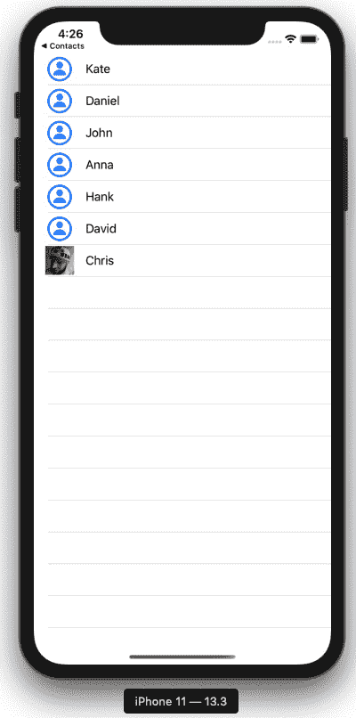

图 3.8 – 带有图片的联系人列表

完美，但这个`dequeueReusableCell`到底是什么意思？别担心，我们将在稍后的部分，*UITableView 和 UICollectionView 的进阶*中介绍。

在本节中，我们学习了如何实现`UITableView`和自定义的`UITableViewCell`，通过访问`Contacts`框架获取数据，并在我们的应用中显示它。现在，让我们花些时间深入探讨表格视图的艺术及其工作原理。

# 进一步探索 UITableView

在本节中，我们将触及一些额外的细节，这将帮助你充分利用`UITableView`。我们还将更详细地介绍之前探索的一些领域，例如重用标识符。

## 深入理解重用标识符

在本章的早期部分，你学习了表格视图中的单元格重用。我们给表格视图单元格分配了一个重用标识符，这样表格视图就会知道应该使用哪个单元格来显示联系人。单元格重用是一个应用于表格视图的概念，以便它可以重用已经创建的单元格。

这意味着在内存中的单元格只有屏幕上或几乎在屏幕上的单元格。另一种选择是保留所有单元格在内存中，这可能会意味着在任何给定时间都有数十万个单元格被保留在内存中。

为了可视化单元格重用看起来是什么样子，请查看以下图表：

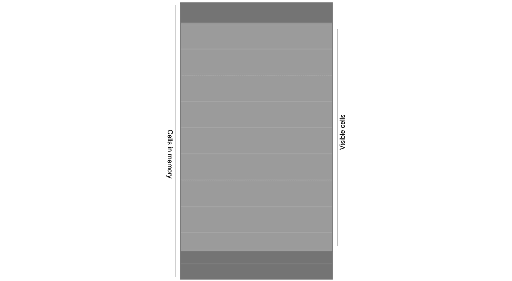

图 3.9 – 表格视图单元格布局

如你所见，图表中只有少数单元格不在可见屏幕上。这大致等于表格视图可能保留在内存中的单元格数量。这意味着无论你想要显示的总行数有多少，表格视图对你的应用内存使用量的压力大致是恒定的。

当在表格视图中调用`dequeueReusableCell(withIdentifier:)`方法且没有可用的未使用单元格时，会首先创建一个单元格。一旦单元格被重用或创建，就会在单元格上调用`prepareForReuse()`方法。这是一个重置单元格到默认状态的好地方，通过移除任何图片或将标签设置回默认值。

接下来，在单元格显示之前，会在表格视图的代理上调用`tableView(_:willDisplay:forRowAt:)`方法。你可以在这里进行一些最后的配置，但大部分工作应该在`tableView(_:cellForRowAtIndexPath:)`中完成。

当单元格滚动出屏幕时，会在代理上调用`tableView(_:didEndDisplaying:forRowAt:)`方法。这表示之前可见的单元格刚刚滚动出了视图的边界。

在考虑到所有这些单元格生命周期信息的情况下，修复图像重用错误的最佳方式是在`ContactCell`上实现`prepareForReuse()`。添加以下实现以移除之前设置的任何图像：

```swift
override func prepareForReuse() { 
    super.prepareForReuse()
    conatctImageView.image = nil
}
```

现在，让我们看看我们可以通过使用预取来在我们的应用中实现的其他一些增强功能。

## 表格视图中的预取

除了`UITableViewDelegate`和`UITableViewDataSource`之外，还存在第三个协议，您可以实现它来提高表格视图的性能。

它被称为`UITableViewDataSourcePrefetching`，您可以使用它来增强数据源。如果数据源执行一些复杂的任务，例如检索和解码图像，如果在表格视图想要检索单元格的时候执行这个任务，可能会降低表格视图的性能。在这些情况下，提前一点执行这个操作可以积极影响您的应用。

那么，我们该如何实现这个功能呢？简单来说，我们首先让`ViewController`符合新的代理协议：

```swift
extension ViewController: UITableViewDataSourcePrefetching {
    func tableView(_ tableView: UITableView, prefetchRowsAt indexPaths: [IndexPath]) {

    }
}
```

您会注意到这里的一个基本区别在于传入的`indexPath`参数。这次，我们有一个`IndexPath`数组，而不是单个索引，从而允许我们对表格视图希望显示的一组单元格执行批量处理。

如果您的单元格数据需要异步获取——例如图像或实时数据——这将非常理想。您真的可以在这里努力工作，以正确地执行和计算显示数据的方式，以获得最佳性能。

## 表格视图中的单元格选择

由于表格视图会在实现方法时调用其代理的方法，因此您不需要告诉表格视图您想要响应用户对单元格的选择。如果表格视图有一个代理，并且代理实现了`tableView(_:didSelectRowAt:)`，则这会自动工作。

目前，您将添加到我们的应用中的实现非常简单。当用户点击一个单元格时，应用会显示一个警告框。

将以下代码添加到`ViewController.swift`中的扩展部分：

```swift
func tableView(_ tableView: UITableView, didSelectRowAt indexPath: IndexPath) {

    let contact = contacts[indexPath.row]
    let alertController = UIAlertController(title: "Contact Details", message: "Hey \(contact.givenName)!!",
        preferredStyle: .alert)        
    let dismissAction = UIAlertAction(title: "Done", style: .default, handler: { action in
        tableView.deselectRow(at: indexPath, animated: true)
    })

    alertController.addAction(dismissAction);
    present(alertController, animated: true, completion: nil)

}
```

`tableView(_:didSelectRowAt:)`方法接收两个参数：第一个是调用此代理方法的表格视图。第二个参数是选择发生的索引路径。

您为这个方法编写的实现使用索引路径检索与被点击单元格对应的联系人，因此可以在警告框中显示联系人姓名。

您还可以从被点击的单元格中检索联系人的姓名。然而，这并不被认为是良好的实践，因为您的单元格和底层数据应该尽可能地松散耦合。

当用户在警告框中点击**完成**按钮时，表格视图会被告知取消选中当前行。

如果你没有取消选中选中的行，最后触摸的单元格将始终保持高亮。请注意，通过在视图控制器上调用`present(_:animated:completion:)`来显示警报。任何你想让视图控制器显示另一个视图控制器，例如警报控制器，你都会使用这个方法。

在本节中，你了解了很多关于使表格视图工作原理的知识，包括对重用标识符的良好理解。接下来，我们将查看`UICollectionView`，这是`UITableView`类的一个更大的（或者更年轻的，实际上）兄弟，比较每个类之间的相似之处以及关键差异。

# 与`UICollectionView`一起工作

在上一节中，我们承担了强大的`UITableView`——学习了关于代理模式以及如何使用自定义单元格构建我们独特的列表。在本节中，我们将查看`UICollectionView`，主要关注我们如何将一个类与另一个类进行比较。

从一开始，当被问及两者之间的基本区别是什么时，大多数人最初都会说同样的话：“集合视图允许水平滚动”——这是非常正确的，但它所做的是利用`UITableView`的力量，具有操纵和覆盖布局的能力，例如允许网格布局。

如果你需要深入了解一个复杂的自定义布局，`UICollectionView`再次发挥作用，它支持`UICollectionViewDelegateFlowLayout`协议，允许你作为开发者操纵自定义布局。

## 设置我们的集合视图

让我们以与表格视图相同的方式创建一个新的项目：

1.  这次，在对象窗口中搜索`Collection View`（*你不需要添加一个* `CollectionView` *单元格，因为集合视图已经为你做了这件事*）。

1.  也要添加你的约束，以便它能够扩展到设备的全尺寸。

回到`ViewController`，我们需要创建和连接我们的`IBOutlet`组件，就像我们之前与表格视图所做的那样（但将你的属性命名为类似`collectionView`的东西）。

一旦你完成了这个步骤，我们就需要创建另一个扩展，但这次，我们的协议将略有不同：

```swift
extension ViewController: UICollectionViewDelegate, UICollectionViewDataSource {

    func collectionView(_ collectionView: UICollectionView, numberOfItemsInSection section: Int) -> Int {
        contacts.count
    }

    func collectionView(_ collectionView: UICollectionView, cellForItemAt indexPath: IndexPath) -> UICollectionViewCell {
        let contact = contacts[indexPath.item]

        guard let cell = collectionView.dequeueReusableCell(withReuseIdentifier: "contactCell", for: indexPath) as? ContactCell else {
            return UICollectionViewCell()
        }
        cell.setup(contact: contact)

        return cell
    }

}
```

之前示例中的两个代理方法如下：

+   `collectionView(_:numberOfItemsInSection:)`

+   `collectionView(_:cellForItemAt:)`

它们两者都提供了与它们的`UITableView`对应项相同的选项；你唯一会注意到的区别是术语`Item`而不是`Row`的引用。这是因为`UITableView`中的布局是纯线性的，所以每个单元格都被视为一行。在`UICollectionView`中，情况并非如此——因此，每个单元格被称为一个项目。

接下来，我们想要创建另一个自定义单元格。复制并粘贴我们为表格视图制作的单元格，并做出以下突出显示的更改：

```swift
class ContactCell: UICollectionViewCell {

    @IBOutlet weak var familyNameLabel: UILabel!
    @IBOutlet weak var givenNameLabel: UILabel!
    @IBOutlet weak var contactImageView: UIImageView!

    func setup(contact: CNContact) {
        givenNameLabel.text = contact.givenName
        familyNameLabel.text = contact.familyName

        if let imageData = contact.imageData {
            conatctImageView.image = UIImage(data: imageData)
        } else {
            conatctImageView.image = UIImage(systemName: "person.circle")
        }
    }

}
```

之前代码中的差异很微妙，但其中之一非常重要：我们的子类现在是`UICollectionViewCell`类型（而不是`UITableViewCell`），我们还添加了一些额外的出口，因为我们还将添加更多数据。

为了有所不同，我们将创建一个滚动水平联系人列表和一个网格布局。让我们回到界面构建器，稍微修改一下我们的画布。

我们将从添加另一个文本字段开始。注意以下图中我如何调整单元格的大小：


图 3.10 – 收藏视图单元格

我们可以在几个地方做这件事。如果我们突出显示**收藏视图**并选择大小检查器，我们就可以在那里做：

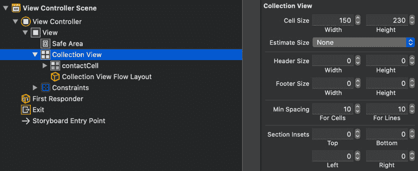

图 3.11 – 收藏视图大小检查器

或者，我们也可以直接在单元格本身上做，如以下截图所示，再次通过选择大小检查器：

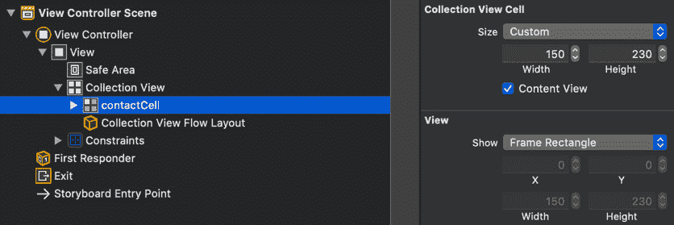

图 3.12 – 收藏视图单元格大小检查器

这很好，有两个原因。首先，你可以通过视觉方式设置单元格的大小，这总是做事情的一种既方便又愉快的方式。其次，即使你打算通过编程方式覆盖单元格大小（因为你需要一个更动态的方法），这也允许你可视化和设置约束，这样你就知道你可以玩什么。我现在只是将我的设置为 150 宽度 x 230 高度，这应该给我们足够的灵活性。

因此，让我们继续设置我们的界面。同样，我们需要用我们的自定义类覆盖**类**：


图 3.13 – 收藏视图类

然后，我们需要分配我们的单元格标识符：


图 3.14 – 收藏视图单元格标识符

然后，我们将**估计高度**设置为**无**。这阻止了我们的单元格根据单元格内内容的大小动态调整大小（例如，一个带有非常长的名字或地址的标签）：


图 3.15 – 收藏视图估计的单元格大小

我们几乎完成了——只需要添加一些小东西。你注意到我们的`viewDidLoad()`函数中缺少了什么吗？我们在`UITabelView`示例中有这个函数。

是的，我们还没有将我们的代理方法设置到`ViewController`对象上，但在这个例子中，我将向你展示另一种方法，我们可以通过界面构建器来完成，而不是通过编程方式来完成。

高亮显示你的 `CollectionView` 对象，按住键盘上的 *Ctrl*，然后单击并按住鼠标——如果你开始拖动鼠标，你会看到一个线（就像我们连接 `IBOutlet` 一样）。将线拖到 `ViewController` 对象并释放。然后你会看到以下选项：

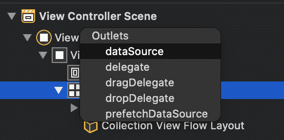

图 3.16 – Collection View 代理出口

选择 **dataSource**，然后重复此过程并选择 **delegate**。

就这样——除了这里和那里的几个小改动之外，我们已经在很大程度上以与我们的 `UITableView` 相同的方式设置了 `UICollectionView`。现在，让我们运行项目，看看它看起来如何：

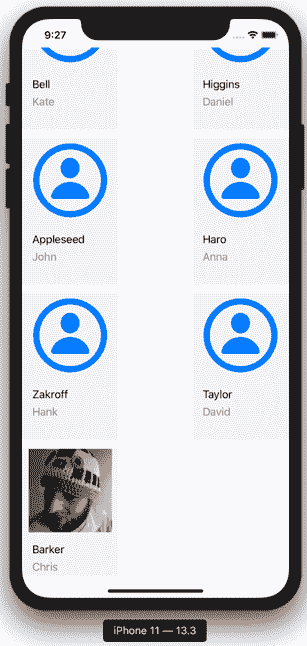

图 3.17 – Collection View 布局

看起来很不错——我是说，除了单元格看起来有点不合适之外——但不用担心，我们将在下一部分通过介绍 `UICollectionViewDelegateFlowLayout` 协议来查看我们如何改变这一点。

## 使用 `UICollectionViewDelegateFlowLayout` 实现布局

在上一节中，我们根据之前创建 `UITableView` 项目时所学的所有内容创建了我们第一个 `UICollectionView` 项目。我们学到的一件事是，与表格视图相比，我们的单元格可以以不同的方式排列。

那么，我们如何操作我们的单元格，使它们做到我们想要它们做到的？为此，我们需要实现 `UICollectionViewDelegateFlowLayout` 协议——但它能提供什么呢？让我们先看看这个协议中最常用的代理方法，以及它如何轻松地改变我们的应用。

在我们的扩展中，添加以下突出显示的协议，与现有的协议并列：

```swift
extension ViewController: UICollectionViewDelegate, UICollectionViewDataSource, UICollectionViewDelegateFlowLayout
```

现在，按照良好的实践，你可以将每个协议分开到它自己的扩展中——但因为我们只处理每个的几个代理，所以我们现在将它们保留在一个地方是完全可以的。

小贴士

如果你的 `ViewController` 对象开始变得有点大，你可以将你的扩展移动到单独的文件中——这使它们更容易工作，并保持你的文件整洁。

现在，我们将添加以下 `delegate` 方法：

```swift
func collectionView(_ collectionView: UICollectionView, layout collectionViewLayout: UICollectionViewLayout, sizeForItemAt indexPath: IndexPath) -> CGSize { }
```

`sizeForItem` 代理简单地允许我们以编程方式设置单元格的大小，所以让我们来玩一下，看看我们能想出什么。将以下代码添加到前面的函数中：

```swift
let width = (collectionView.bounds.size.width / 2) – 10
return CGSize(width: width, height: 180)
```

因此，在这里，我们执行了一个简单而优雅的计算：我们取当前屏幕的宽度，除以 2，然后减去 10（为了有一点填充），然后将其作为单元格宽度。最后，我们将添加一个静态值作为我们的高度。运行你的应用并看看它给出了什么：

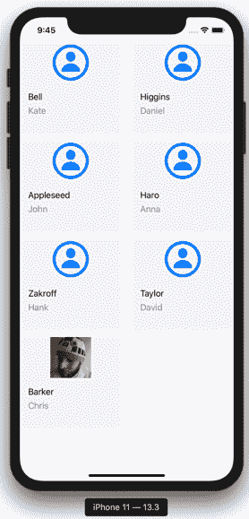

图 3.18 – Collection View 布局

很好，让我们看看我们还能做什么。简单返回屏幕的全尺寸怎么样？

```swift
return collectionView.bounds.size
```

接下来，让我们改变滚动方向；我们可以通过 Interface Builder 来实现，选择 **Collection View**。将值更改为 **Horizontal**：


图 3.19 – 收藏视图滚动方向

继续运行应用 – 它看起来怎么样？

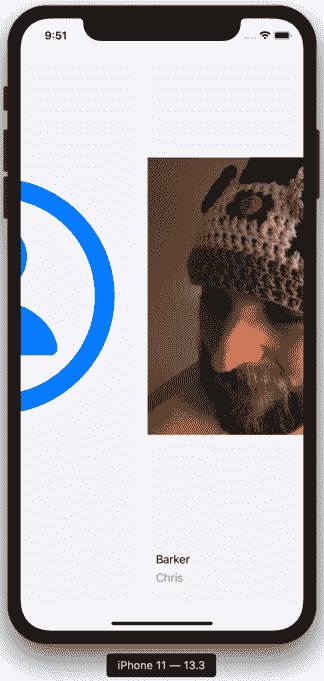

图 3.20 – 收藏视图滚动方向布局

完美 – 只需稍作修改，我们就为我们的应用带来了巨大的变化，清楚地突出了 `UICollectionView` 相比 `UITableView` 的强大功能。

在我们结束关于 `UICollectionView` 的这一节之前，让我们快速看一下 `UICollectionViewDelegateFlowLayout` 提供给我们的其他代理方法。

### 项（单元格）的大小

当你需要操作一个项的边界或框架时，使用 `collectionView(_:layout:sizeForItemAt:)`，它会请求代理指定项的单元格大小。

### 部分（Section）和间距

以下是一些用于编程调整单元格项和部分之间间距的选项（不包括头部和页脚）：

+   `collectionView(_:layout:insetForSectionAt:)`：请求代理指定应用于指定部分内容的边距

+   `collectionView(_:layout:minimumLineSpacingForSectionAt:)`：请求代理指定部分中连续行或列之间的间距

+   `collectionView(_:layout:minimumInteritemSpacing ForSectionAt:)`：请求代理指定部分中行或列中连续项之间的间距

### 页脚和头部尺寸

以下是一些用于编程调整单元格项之间间距的选项，特别是针对头部和页脚：

+   `collectionView(_:layout:referenceSizeForHeaderInSection:)`：请求代理指定指定部分中头部视图的大小

+   `collectionView(_:layout:referenceSizeForFooterInSection:)`：请求代理指定部分中页脚视图的大小

在本节中，我们了解了关于 `UICollectionView` 组件的所有内容 – 如何在 Xcode 中设置它们，以及它们与 `UITableView` 组件之间的区别 – 并且能够看到它们为我们带来的好处，以及通过 `UICollectionViewDelegateFlowLayout` 协议来定制我们的应用，使其更具视觉吸引力。在下一节中，我们将更深入地探讨 `UITableView` 的一些进步。

# 进一步探索 UICollectionView

在本节中，我们还将再次触及一些额外的小细节，就像我们的表格视图一样，这将使我们能够真正利用收藏视图的力量 – 尤其是在计算布局大小方面。我们将从查看一些我们可以利用的覆盖方法开始。

## 实现自定义 UICollectionViewLayout

实现一个像自定义集合视图布局这样的大型且复杂的特性，对于大多数人来说可能是一个巨大的挑战。

创建你的布局涉及到计算集合视图将要显示的每个单元格的位置。你必须确保这些计算尽可能快、尽可能高效地执行，因为你的布局计算直接影响到集合视图的性能。糟糕的布局实现最终会导致滚动缓慢和糟糕的用户体验。

幸运的是，为创建集合视图布局提供的文档相当不错，可以作为参考来了解你是否走上了正确的道路。

如果你查看苹果关于 `UICollectionViewLayout` 的文档，你可以了解它在集合视图中的作用。可用的信息显示，自定义布局需要你处理单元格、辅助视图和装饰视图的布局。辅助视图也被称为头部和尾部。

让我们看看我们如何开始实现它。我们首先创建自己的类来完成这项工作：

```swift
class ContactsCollectionViewLayout: UICollectionViewLayout {

    override var collectionViewContentSize: CGSize {
        return .zero
    }

    override func prepare() {

    }

    override func shouldInvalidateLayout(forBoundsChange newBounds: CGRect) -> Bool {
        return false
    }

    override func layoutAttributesForElements(in rect: CGRect) -> [UICollectionViewLayoutAttributes]? {
        return nil
    }

    override func layoutAttributesForItem(at indexPath: IndexPath) -> UICollectionViewLayoutAttributes? {
        return nil
    }

}
```

如前述代码所示，这里我们实现了一个 `UICollectionViewLayout` 的子类，并有许多可以使用的重写函数——现在让我们来了解一下这些函数。

### 实现 `collectionViewContentSize`

集合视图使用其布局中的 `collectionViewContentSize` 属性来确定其内容的大小。这个属性特别重要，因为它用于配置和显示集合视图的滚动指示器。

它还提供了集合视图关于滚动应启用方向的详细信息。

实现这个属性使用集合视图中的行数和列数。它还考虑了项目大小和项目间距，以确定所有内容的总大小。

### 实现 `layoutAttributesForElements(in:)`

比 `collectionViewContentSize` 更复杂的是 `layoutAttributesForElements(in:)`。这个方法负责一次性为集合视图提供多个元素的布局属性。

集合视图始终提供一个矩形，它需要布局属性。布局负责尽可能快地提供这些属性给集合视图。这个方法的实现必须尽可能高效。你的滚动性能取决于它。

尽管一次只能看到少量单元格，但集合视图在其当前视图中还有更多内容。有时它被要求跳转到特定的单元格，或者用户滚动得非常快。

有许多情况下，集合视图会一次性请求多个单元格的所有布局属性。当这种情况发生时，布局对象可以帮助单元格确定特定矩形应该显示哪些单元格。这是可能的，因为布局属性不仅包含单元格应该渲染的矩形，还知道与该特定单元格对应的`IndexPath`对象。

这是一个相当复杂的问题，如果你觉得有点困惑，这是完全可以理解的。只要你理解集合视图可以询问其布局在某个`CGRect`实例中哪些单元格存在以及它们应该如何渲染，你就理解了`layoutAttributesForElements(in:)`的作用。

### 实现 layoutAttributesForItem(at:)方法

集合视图请求其布局的布局属性的另一种方式是请求单个项目的属性。因为集合视图通过提供索引路径来这样做，所以这个方法实现起来相当简单。

你实现的布局假设集合视图中只有一个分区，并且布局属性数组按索引路径排序，因为所有项目都是按照这个顺序插入到数组中的。

### 实现 shouldInvalidateLayout(forBoundsChange:)方法

获取`shouldInvalidateLayout(forBoundsChange:)`的实现对于拥有性能出色的集合视图布局至关重要。

如果你错误地实现此方法，你可能会不断使布局无效，这意味着你需要不断重新计算。

还有可能集合视图根本不会更新其布局，即使它应该更新。集合视图会在其大小改变时调用此方法。例如，当用户旋转设备或当你的应用在 iPad 上运行时，用户在多任务模式下打开另一个应用。

### 为你的集合视图分配自定义布局

使用自定义布局的最终步骤是告诉你的集合视图使用你的布局。你已经在 Interface Builder 中看到，你可以为集合视图的布局分配一个自定义类。

然而，这仅在布局继承自`UICollectionViewFlowLayout`时才有效，而你的布局并没有继承自它。幸运的是，你还可以在代码中设置集合视图的布局。通过在`ViewController.swift`中的`viewDidLoad`方法中添加以下行来更新它：

```swift
collectionView.collectionViewLayout = ContactsCollectionViewLayout()
```

这行代码将你的新布局设置为当前布局。你现在可以移除`ViewController.swift`中的`UICollectionViewDelegateFlowLayout`扩展，因为它不再需要了。

现在我们已经更详细地了解了布局，让我们看看我们如何处理用户与单元格选择的交互。

## 集合视图中的单元格选择

虽然几乎与`UITableView`的对应方法相同，但我认为指出这个函数是有价值的：

```swift
func collectionView(_ collectionView: UICollectionView, didSelectItemAt indexPath: IndexPath)
```

再次，唯一的真正区别是 `Row` 被替换成了 `Item`，这个委托方法以完全相同的方式执行。

如果我们需要以任何方式操作它，我们可以使用重用标识符并直接与我们的单元格一起工作（参见 *第五章*，*通过动画让用户沉浸其中*，了解我们在这里可以做一些令人兴奋的事情）。

在本节中，我们深入探讨了 `UICollectionView` 布局选项的内部工作原理，并进一步探讨了如何使用 `UICollectionViewLayout` 来创建我们自己的布局子类，这样，作为开发者的我们就可以在需要时利用特定的和复杂的计算。在我们接下来的最后一节中，我们将探讨苹果的新强大 UI 框架 SwiftUI 如何处理列表。

# 在 SwiftUI 中与列表一起工作

回到 2019 年的 WWDC，苹果向世界展示了一个全新的 UI 框架，名为 SwiftUI。从头开始构建，SwiftUI 是 UIKit 和 AppKit 的强大替代品，为开发者提供了使用声明性语法编写代码的能力。

在本节中，我们将介绍 SwiftUI 在生成列表方面能提供什么，以及如果我们需要使用目前尚未可用的事物时，我们可能需要做些什么。

## 创建我们的第一个 SwiftUI 项目

为了这个，我们需要创建一个新的单视图应用，就像之前一样，但这次我们需要选择用户界面为 **SwiftUI**，如下面的截图所示：

![Figure 3.21 – 新的 SwiftUI 项目![Figure 3.21 – 新的 SwiftUI 项目 Figure 3.21 – 新的 SwiftUI 项目如果你不太熟悉 SwiftUI，你会注意到一些差异。你将不再有 `ViewController.swift` 文件——这已经被 `ContentView.swift` 替换。高亮显示文件以查看其内容；你应该会看到以下样板代码：```swiftimport SwiftUIstruct ContentView: View {    var body: some View {        Text("Hello, World!")    }}struct ContentView_Previews: PreviewProvider {    static var previews: some View {        ContentView()    }}```首先，让我们看看 `ContentView` 结构体——这是 SwiftUI 构建其声明性界面的第一步。在 `ContentView` 结构体中是体。注意这些如何符合 `View` 或 `some View`——这是因为 SwiftUI 中不再使用 `ViewController` 组件的概念；一切都是一个返回到窗口的视图。但在不深入了解 SwiftUI 的工作原理的情况下，我们现在所关心的是体声明的内容。因此，在先前的例子中，我们所关心的是以下内容：```swiftText("Hello, World!")````Text` 是 SwiftUI 中 `UILabel` 的等价物——非常酷，对吧？一行简单的代码就能构建、实例化并接受一个值来显示？哦，而且不需要将其添加到视图中——这一行代码的存在就足够了。使用 SwiftUI 的另一个好处是能够即时预览代码更改。如果你在 Xcode 中查看我们打开的 `ContentView.swift` 文件右侧，你会看到预览助手。点击左上角的 **Resume**，我们应该会看到我们应用的预览：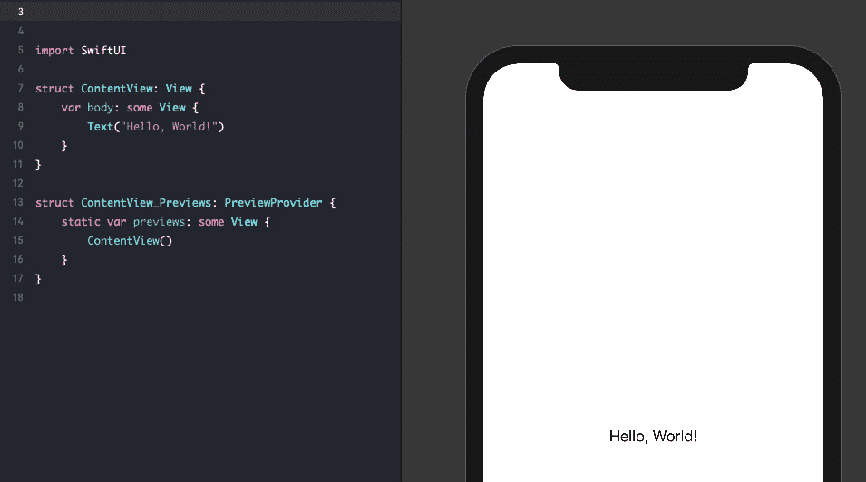

图 3.22 – SwiftUI "Hello, World!"

现在，让我们看看如何添加一个项目列表。

## 在 SwiftUI 中构建列表

我们将从简单开始，只是将已经存在的标签添加到列表中。进行以下突出显示的代码更改，并在需要时在预览辅助窗口中按 "恢复"：

```swift
var body: some View {
    List {
        Text("Hello, World!")
    }
}
```

没错，它确实像那样简单。继续添加几个更多的 `Text` 视图，看看效果如何——甚至尝试在你的模拟器中运行它，看看效果：


图 3.23 – SwiftUI 列表

简单又直接，但就像我们处理 `UITableView` 组件和 `UICollectionView` 组件一样，让我们看看我们如何添加一些外部数据。

在 `ContentView.swift` 中的代码进行以下突出显示的更改：

```swift
@State var contacts: [String] = [String]()

var body: some View {
    List { 
    ForEach(contacts, id: \.self) { contact in
        	Text(contact)
    	    }
    }
}
```

在这里，我们向我们的列表中添加了一个 `ForEach` 函数；这将遍历我们刚刚在主体外部创建的联系人数组。

但如果我们按 "恢复"，你会发现我们没有数据……让我们解决这个问题。看看 `ContentView` 结构下面，你会看到以下代码：

```swift
struct ContentView_Previews: PreviewProvider {
    static var previews: some View {
        ContentView()
    }
}
```

这个结构是如何显示我们的预览的——我们在开发 SwiftUI 视图时的自己的小内部测试/游乐场——甚至不需要运行模拟器。

让我们在其中添加一些代码来注入一些模拟数据到我们的预览中。进行以下突出显示的更改：

```swift
struct ContentView_Previews: PreviewProvider {
    static var previews: some View {
        let mockData = ["Chris", "Andy", "Harry", "Nathan", "Sam"]
        return ContentView(contacts: mockData)
    }
}
```

我们只需创建一些模拟数据，可以直接将其注入到我们的视图中，如果尚未更新。在预览辅助窗口中点击 **恢复**，看看你的代码如何运行——然而，如果你在模拟器中运行它，你将看不到任何东西，因为预览不再有效，你看到的应用程序实际上是你的实际应用程序（我们还没有添加任何数据）。

## 在 SwiftUI 中创建自定义单元格的等效方法

在使用 SwiftUI 开发时，很难不将 UIKit 对象直接进行比较——但我们会这样做，而且没关系，因为通常总有一种方法可以执行类似操作或学习新的方法。

回到本节的开头，我提到 SwiftUI 全是关于视图的，当在 SwiftUI 中实现自定义 "单元格" 时，这也没有什么不同。我们将首先创建一个新的视图（我们将在你的 `ContentView.swift` 文件中这样做，但不在初始类声明之外）：

```swift
struct RowView: View {

    @State var name: String

    var body: some View {
        Text(name)
    }

}
```

就像 `ContentView` 一样，我们的新 `RowView` 是一个简单的视图，可以在 SwiftUI 的任何地方使用。结构可以接受一个 `name: String` 变量，并在 `Text` 视图中显示它——就像我们在 `ContentView` 中做的那样。

现在，让我们修改我们的代码以利用这一点。进行以下突出显示的更改：

```swift
List {
    ForEach(contacts, id: \.self) { contact in
        RowView(name: contact)
    }
}
```

真的是很简单；我们现在可以将 `RowView` 当作我们处理集合视图或表格视图单元格一样，装饰它们或独立于父列表进行操作。

你甚至可以只为 `RowView` 创建自己的预览提供者，这样你就可以在开发过程中再次注入模拟数据。

在本节中，我们介绍了 SwiftUI 作为框架，并查看创建项目所需的基本构建块。从这一点出发，我们了解了列表的使用方法以及我们如何利用预览助手在开发 SwiftUI 接口时获得优势。

# 摘要

在本章中，我们探讨了与列表相关的所有内容。我们首先学习了如何创建 `UITableView` 对象——从我们的设备中拉取联系人并以我们想要的方式显示它们。然后，我们转向 `UICollectionView`，将其与我们之前的实现进行比较，并查看它提供的一些细微和较大的差异——例如单元格布局和操作。

然后，我们深入研究了这些内容的每一个，特别是查看使用 `UICollectionView` 组件的布局，这是其最强大的功能之一。

然后，我们通过查看 SwiftUI 框架以及苹果如何使其不仅易于开发，而且易于以我们之前习惯的方式显示数据来结束本节，这得益于声明性语法和预览助手的运用。

在下一章中，我们将进一步探讨我们的列表，并为它们创建一个详情页面，以便使用本章中介绍的单元格交互进行导航。

# 进一步阅读

+   Apple 开发者文档关于表格视图：

    [`developer.apple.com/documentation/uikit/views_and_controls/table_views`](https://developer.apple.com/documentation/uikit/views_and_controls/table_views)

+   Apple 开发者文档关于集合视图：

    [`developer.apple.com/documentation/uikit/views_and_controls/collection_views`](https://developer.apple.com/documentation/uikit/views_and_controls/collection_views)

+   *学习 SwiftUI* (Packt 出版):

    [`www.packtpub.com/business-other/learn-swiftui`](https://www.packtpub.com/business-other/learn-swiftui)
