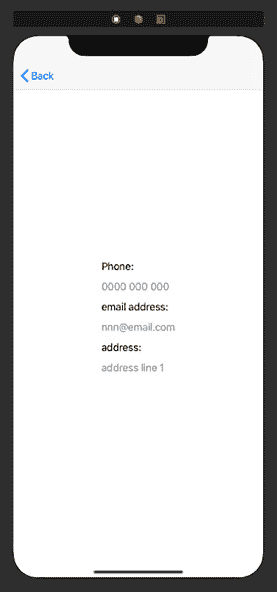
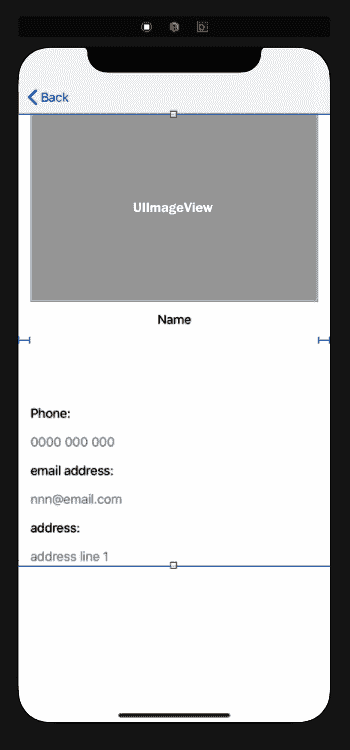

# *第四章*：创建详细页面

到目前为止，你已经成功构建了一个应用，该应用在集合视图中以自定义网格显示一组联系人。这相当令人印象深刻，但并不十分有用。通常，用户会期望在点击概览中的项目时能够看到更多信息。

在这种情况下，他们可能会期望看到更多关于被点击联系人的详细信息，例如他们的电子邮件地址和电话号码。在本章中，你将看到如何做到这一点。

我们还将首次接触到 `UIStackView`，这是一种无需过度复杂的自动布局解决方案，即可全面且强大地布局显示的方式。

最后，我们将讨论在从一个视图控制器传递数据到另一个视图控制器时的最佳实践。

本章将涵盖以下主题：

+   使用 segues 实现导航

+   使用 `UIStackView` 创建布局

+   在视图控制器之间传递数据

# 技术要求

对于本章，你需要从 Apple 的 App Store 下载 Xcode 版本 11.4 或更高版本。

你还需要运行最新版本的 macOS（Catalina 或更高版本）。只需在 App Store 中搜索 Xcode，选择并下载最新版本。启动 Xcode 并遵循系统可能提示的任何其他安装说明。一旦 Xcode 完全启动，你就可以开始了。

从以下 GitHub 链接下载示例代码：[`github.com/PacktPublishing/Mastering-iOS-14-Programming-4th-Edition`](https://github.com/PacktPublishing/Mastering-iOS-14-Programming-4th-Edition)

# 使用 segues 实现导航

大多数优秀应用都有不止一个屏幕。我敢打赌，你头脑中的大多数应用想法至少涉及两个不同的屏幕。也许你希望显示一个表格视图或集合视图，这些视图可以链接到详细页面。或者，也许你希望用户以不同的方式深入到你的应用内容中。也许你没有任何详细视图，但你想显示几个用于数据输入的模态屏幕。

每当你的用户从你的应用中的一个屏幕移动到另一个屏幕时，他们就是在导航。导航是构建应用的一个基本方面，你必须了解在 iOS 平台上构建良好导航的可能性和模式。了解导航的最简单方法是通过使用故事板来探索可用的选项。

到目前为止，除了 SwiftUI 之外，你一直使用你的故事板来创建单个屏幕的布局。

然而，故事板这个名字暗示你可以做很多不仅仅是布局单个屏幕的事情。使用故事板的目的在于能够在一个地方布局你应用的所有屏幕，这样你可以轻松地看到屏幕和你的应用部分之间的关系以及用户如何在它们之间导航。

在本节中，我们将涵盖以下内容：

+   创建我们的新详细视图

+   实现 和 理解 segues

+   创建手动 segue

让我们开始吧。

## 创建我们的新详细视图

在本节中，你将在故事板中添加一个第二个视图控制器，当用户点击联系人时，它将作为一个详细页面工作——我们将继续从*第三章*，*使用列表和表格*中我们的集合视图项目。

让我们先做以下操作：

1.  打开 `Main.storyboard` 文件。

1.  在**对象库**中搜索并拖出一个视图控制器（就像我们处理集合视图对象时做的那样）。

1.  将其放置在现有视图控制器旁边。

1.  在**对象库**中查找一个标签并将其添加到刚刚添加到故事板中的新视图控制器。

如果一切顺利，它应该看起来像以下图示：


图 4.1 – 包含新详细视图的故事板

在你将联系人详细页面的所有内容添加到第二个视图控制器之前，配置从概览页面到详细页面的导航是个好主意。为此，你需要创建一个选择过渡。

## 实现和理解过渡

**过渡**是从一个屏幕到另一个屏幕的转换。并非所有过渡都是动画的；有时你可能需要在不执行平滑动画的情况下展示下一个屏幕。动画和静态转换都可以通过过渡来设置。

每次你连接一个屏幕到下一个以执行导航时，你都在创建一个过渡。有些过渡是在用户点击按钮时执行的；这些被称为**动作过渡**。仅通过代码触发的过渡被称为**手动过渡**。

你在这个示例中将要使用的选择过渡是通过将表格视图单元格或集合视图单元格连接到下一个屏幕来设置的。当用户点击单元格时执行过渡。

要设置你的选择过渡，请按照以下步骤操作：

1.  选择为联系人概览页面创建的原型集合视图单元格。

1.  接下来，按住 *Ctrl* 键，从单元格拖动到第二个视图控制器。

当你将鼠标移至第二个视图控制器上时，会显示一个选项列表：


图 4.2 – 新的详细视图的过渡连接器

这个选项列表描述了如何向用户展示详细视图。

例如，从生成的列表中选择模态展示样式。这将从屏幕底部向上显示详细页面（一个模型），这并不是我们将要走的路线。然而，如果你现在启动 iOS 模拟器并选择其中一个单元格，你会看到它产生的影响。

通过将联系人添加到导航堆栈中，可以更好地显示联系人。这样做将在导航栏中显示一个返回按钮，并且由于从屏幕右侧移动新视图控制器而产生的动画，用户会立即明白他们正在查看一个详情页面。

为了设置此选项，你需要选择 **Show** 转场 – 高亮显示之前创建的转场，然后在键盘上按 *Delete*。

这个转场将新显示的视图控制器推送到现有导航控制器导航堆栈中，但直到我们告诉我们的应用我们以这种方式需要导航，它仍然被视为一个模型。

为了解决这个问题，通过对象库添加一个新的名为 **Navigation Controller** 的对象，并将其拖动到你的故事板中。你会注意到这会带来两个视图控制器。

第一个是导航视图控制器本身（我们关心的那个）和另一个是模板或预定义的 `rootViewController`，它已经连接到导航视图控制器。

为了修改这个，执行以下操作：

1.  简单地删除这个 `rootViewController`，保留导航控制器在当前位置。

1.  然后，按住 *Ctrl* 并从导航控制器进行主点击，然后拖动到我们的现有 `ViewController`。

1.  释放时，你会得到一个选项来将其设置为 `rootViewController`。选择此选项。

需要做的最后一个更改是你会注意到一个箭头进入我们现有的 **View Controller** 的侧面；将这个箭头从这里拖动到 **Navigation Controller** – 所有这些只是在设置这个为我们的 **Initial View Controller**，这样当应用启动时，它就知道从哪里开始。

现在运行应用。你应该能够在点击单元格时成功导航前后。现在让我们看看如何创建一个手动转场。

## 创建手动转场

我们首先将删除我们刚刚创建的转场。现在从第一个视图控制器窗口顶部的黄色圆圈拖动到第二个视图控制器 – 你现在已经创建了一个手动转场。

当出现确定如何执行转场对话框时，再次选择 **show**，因为你不想使用不同的动画。

点击连接线来检查转场，并在 **Attributes Inspector** 中设置 `detailViewSegue` 的值。类似于在表格视图单元格和集合视图单元格上设置重用标识符，转场也使用字符串作为它们的标识符。

为了在动画之后触发转场，你必须从你的代码中手动执行。打开 `ViewController.swift` 并更新 `collectionView(_:didSelectItemAt:)` 的内容，如下面的代码片段所示：

```swift
    func collectionView(_ collectionView: UICollectionView, didSelectItemAt indexPath: IndexPath) {
        self.performSegue(withIdentifier: "detailViewSegue", sender: self)
    }
```

通过一行代码，我们可以通过其标识符连接到我们的转场，然后就可以开始了。现在运行应用，看看有多简单。

在本节中，我们开始创建和构建我们自己的详细视图页面，了解我们如何配置和控制从一个视图控制器推送到下一个视图控制器。

在下一节中，我们将查看如何创建无需`Autolayout`的自适应布局。

# 使用 UIStackView 创建我们的布局

现在我们已经设置了所有基础，让我们看看我们将如何构建我们的详细页面。

我们有几个选择。一种方法是`UIStackView`。

堆叠视图可以自行布局相邻或堆叠在一起的视图。这节省了你添加标签之间垂直间距约束的需要，就像我们在联系人详细信息中做的那样。

由于堆叠视图也可以布局相邻的对象，并且堆叠视图可以嵌套，因此它还可以处理为常规宽度大小类屏幕实现的二维布局。而且，最重要的是，你可以在运行时交换堆叠视图布局项的方向，这意味着你可以根据可用空间将其从水平更改为垂直。

这将大大简化需要完成的大量工作，并且使你的布局更容易维护。要使用堆叠视图，你只需要在 Interface Builder 中通过`Stack View`将一个添加到你的新视图控制器中）。

## 在堆叠视图中包含标签

让我们开始创建我们的页面布局：

1.  添加六个`UILabel`，其中三个将是标题，其余将是变量数据（确保你设置好颜色：见*第二章*，*使用深色模式*)。像这样会很好用：

    图 4.3 – 带有标签的更新后的故事板

1.  现在，选择联系人信息视图中的六个标签，并使用以下截图所示的**嵌入到**菜单将它们嵌入到堆叠视图中：

    图 4.4 – 嵌入到堆叠视图

1.  添加两个其他元素，例如图像视图或联系人名称，并将它们分组（与刚刚嵌入的标签分开）。

1.  现在，对于巧妙的部分，突出显示两个堆叠视图，然后点击**嵌入到**以将它们嵌入到一个单独的堆叠视图中。

看起来不错。嗯，几乎是这样——我们仍然需要做一些小的调整。首先，我们将向主堆叠视图添加一个`Autolayout`约束`0,16,16,0`（基本上，除了尾部和头部之外，将其紧贴我们的边界）。

接下来，你需要在堆叠视图中的每个标签（和图像）上设置**Autolayout**的高度：

1.  将约束值设置为`250`，并将所有标签设置为`25`。

1.  完成后，选择父堆叠视图，并在**属性检查器**中确保**对齐**设置为**填充**，**分布**设置为**按比例填充**。

这些设置确保项目在堆叠视图中以某种方式定位。在这种情况下，**Leading** 使项目粘附在堆叠视图的左侧。将此值设置为 **Center** 将使它们居中，而 **Fill** 确保堆叠的子项都拉伸以填充整个宽度。

完成这些操作后，你应该会看到以下内容：



图 4.5 – 栈视图中的详细视图

现在我们的详细视图已经准备好接收一些数据了，所以让我们看看在下一部分我们将如何进行，但首先，我们需要创建一个新的 **视图控制器** 文件。

在导航树中，突出显示根级别组（文件夹），然后执行以下操作：

1.  右键单击以显示菜单。

1.  点击 **新建文件**。

1.  从选项列表中选择 **Cocoa Touch 类**（点击 **下一步**）。

1.  将新文件命名为 `DetailsViewController`，它是一个 `UIViewController` 的子类。

1.  点击 **下一步**，然后 **创建**。

完成此操作后，添加所有必需的出口并将它们连接起来。但在 Interface Builder 允许你连接这些出口之前，你需要设置 `DetailsViewController` 的类 – 就像我们在 *第三章* 中做的那样，*使用列表和表格*。

我们还需要添加以下变量，因为我们很快就会将这个模型传递给新的视图控制器：

```swift
var contact = CNContact()
```

完成所有这些后，我们现在可以更新我们的 `retrieveContacts()` 逻辑以获取所需的新数据。

# 在视图控制器之间传递数据

因此，我们应用程序的下一部分是将一些数据传递到我们的新详细视图中，但要做到这一点，我们需要创建一个新的视图控制器，并将我们的标签和图像连接到一些出口。

获取联系信息的代码也需要更新，以便获取联系人的电话号码、电子邮件地址和邮政地址。

最后，需要将联系数据从概览页面传递到详细页面，以便详细页面可以显示数据。这个过程涉及以下步骤：

1.  更新数据加载

1.  将模型传递到详细页面

1.  更新我们的出口

1.  最佳实践（创建视图模型）

让我们现在逐一介绍每个步骤。

## 更新数据加载

目前，`ViewController.swift` 中的代码指定，只需获取联系人的给定名称、姓氏、图像数据和图像可用性。

需要扩展以获取电子邮件地址、邮政地址和电话号码。

使用以下代码更新 `retrieveContacts(store:)` 方法中的 `keysToFetch`：

```swift
let keysToFetch = [CNContactGivenNameKey as CNKeyDescriptor,
  CNContactFamilyNameKey as CNKeyDescriptor, CNContactImageDataAvailableKey as CNKeyDescriptor, CNContactImageDataKey as CNKeyDescriptor, 
     CNContactEmailAddressesKey as CNKeyDescriptor, CNContactPhoneNumbersKey as CNKeyDescriptor, CNContactPostalAddressesKey as CNKeyDescriptor]
```

在这里，我们只是明确设置我们希望从联系人中检索的数据。完成这些后，我们就准备好将数据传递到详细视图控制器了。

## 将模型传递到详细页面

从概览页面切换到详情页面是通过过渡动画实现的。当用户点击一个联系人时，过渡动画被触发，详情页面将显示在屏幕上。

因为这个过渡使用了过渡动画，所以可以实现一个特殊的方法来从第一个视图控制器传递数据到第二个视图控制器。这个特殊的方法被称为`prepare(for:sender:)`。

这个方法在执行过渡动画之前在源视图控制器中被调用，并提供对目标视图控制器的访问。

过渡的目标用于配置即将呈现的视图控制器上的数据。让我们立即实现这个功能，这样你就可以将选定的联系人传递到详情页面。

将以下扩展添加到`ViewController.swift`中：

```swift
extension ViewController {
    override func prepare(for segue: UIStoryboardSegue, sender: Any?) {
        if let contactDetailVC = segue.destination as? DetailsViewController,
            segue.identifier == "detailViewSegue",
            let selectedIndex = collectionView.indexPathsForSelectedItems?.first {

            contactDetailVC.contact = contacts[selectedIndex.row]

        }
    }
}
```

对前面代码的简要概述是检查过渡动画的标识符是否为`"detailViewSegue"`（因为所有过渡动画都会通过这个函数）。如果这个条件满足，它将检查目标（类型为`UIViewController`）是否是我们正在寻找的`DetailsViewController`。

如果一切顺利，我们可以将我们的联系人分配给该视图控制器上的一个属性，然后它将被传递过去。现在让我们连接我们的输出端口，以便我们可以开始绑定一些数据。

## 更新我们的输出端口

我们已经准备就绪；我们只需要将我们的数据连接到输出端口。为此，请在`DetailsViewController`中的`viewDidLoad()`中进行以下更改：

```swift
contactImageView.image = UIImage(data: contact.imageData ?? Data())
contactName.text = "\(contact.givenName) \(contact.familyName)"
contactPhoneNumber.text = contact.phoneNumbers.first?.value.stringValue
contactEmailAddress.text = contact.emailAddresses.first?.value as String?
contactAddress.text = contact.postalAddresses.first?.value.street
```

继续运行你的应用程序。看看，如果你点击你的联系人，你会直接导航到你的新视图控制器，在那里你可以看到该特定联系人的所有详细信息。

然而，再次查看我们刚刚添加的代码，它看起来有点杂乱。我们在**视图控制器**内部连接了`givenName`和`familyName`，并且还随机从联系人第一个持久化的地址中获取街道值。

所有这些逻辑都不应该放在我们的视图控制器中——这就是我们所说的视图模型逻辑，我的意思是我们应该创建自己的联系人模型，该模型包含我们所需要的一切，以及从我们的`CNContent`对象直接获取它的所有逻辑。让我们看看我们该如何做。

## 最佳实践——创建视图模型

在我们的例子中，我们的`CNContact`有多个属性，其中一些我们甚至还没有从`Contacts.framework`请求。正如我们在上一节中看到的逻辑，基于视图所需的内容和模型拥有的内容进行逻辑决策不应在此级别执行。

那么，我们该如何解决这个问题呢？很简单。首先，让我们创建我们的自定义模型。将以下内容复制到一个新文件中，并将其命名为`ContactModel.swift`：

```swift
struct ContactModel {

    var fullName: String?
    var primaryPhoneNumber: String?
    var primaryEmailAddress: String?
    var addressLine1: String?
    var contactImage: UIImage?

    init(_ contact: CNContact) {
        fullName = "\(contact.givenName) \(contact.familyName)"
        primaryPhoneNumber = contact.phoneNumbers.first?.value.stringValue
        primaryEmailAddress = contact.emailAddresses.first?.value as String?
        addressLine1 = contact.postalAddresses.first?.value.street
        contactImage = UIImage(data: contact.imageData ?? Data()) ?? UIImage(systemName: "person.circle")
    }

}
```

在这里，我们简单地创建了一个结构体，并添加了基于我们将要显示的确切内容的属性。然后我们将创建一个自定义初始化器，它接受一个`CNContact`参数。从这里，我们将原本在视图控制器中所有的逻辑移除，并将其放在这里——这是这个视图模型逻辑的一个集中位置。

现在我们只需要做一些微调。更新`DetailsViewController`中的类变量如下：

```swift
var contact: ContactModel?
```

并且调整我们的`ViewController`中的`prepare()`重写方法如下：

```swift
contactDetailVC.contact = ContactModel(contacts[selectedIndex.row])
```

完成这些后，再次运行应用。你会发现实际上并没有什么变化，但现在你可以离开，知道你已经迈出了编写和管理良好、可维护代码的重要一步。

在本节中，我们通过使用准备转场函数将模型传递到我们的`DetailViewController`，将所有东西连接在一起。

# 摘要

在本节中，我们首先创建了一个全新的视图控制器，专门用于显示选定的用户信息。我们学习了不同类型的转场，包括基于导航的转场和基于模型的转场。我们还介绍了通过编程和通过 Interface Builder 创建转场的方法。

一旦我们设置了所有连接器，我们就开始构建我们的新详情视图控制器，用联系人的信息填充它，并利用`UIStackView`的力量来布局我们的标签和图像视图。

我们通过连接一切来结束。我们执行了一些最佳实践，并创建了一个自定义视图模型，现在我们可以将其传递到我们的新`prepare()`重写方法中。

在下一章中，我们将深入探讨在 iOS 中使用动画和过渡的效果，随着我们的创意开始涌现！

# 进一步阅读

+   **苹果文档**：[`developer.apple.com/library/archive/featuredarticles/ViewControllerPGforiPhoneOS/UsingSegues.html`](https://developer.apple.com/library/archive/featuredarticles/ViewControllerPGforiPhoneOS/UsingSegues.html)
