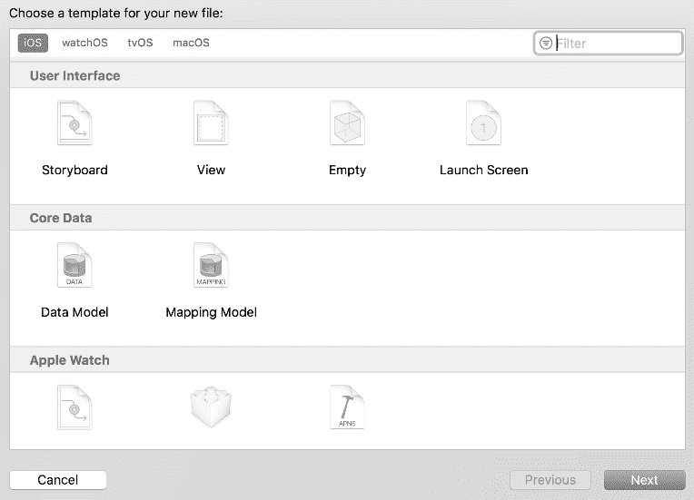
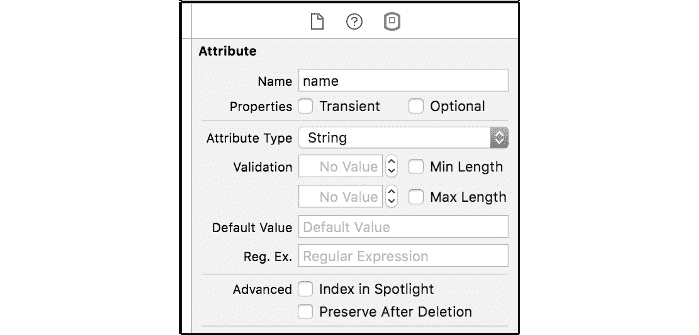

# 第八章：*第八章*：将 Core Data 添加到您的应用程序中

`UserDefaults`，但是当你处理更复杂的数据时，具有关系或需要某种形式的快速搜索时，Core Data 更适合你的需求。

你不需要构建一个非常复杂的应用程序或拥有大量数据，才能使 Core Data 值得你投入。无论你的应用程序大小如何，即使它非常小，只有几条记录，或者如果你正在处理数千条记录，Core Data 都会支持你。

在本章中，你将学习如何将 Core Data 添加到现有应用程序中。你将构建的应用程序将跟踪一个家庭的成员喜欢的电影列表。主要界面是一个表格视图，显示家庭成员列表。如果你点击家庭成员的姓名，你会看到他们的喜欢的电影。添加家庭成员可以通过概览屏幕完成，添加电影可以通过详细屏幕完成。

在本章中，以下主题被涵盖：

+   理解 Core Data 堆栈

+   将 Core Data 添加到现有应用程序中

+   创建 Core Data 模型

+   持久化数据和响应数据变化

+   理解 `NSManagedObjectContext` 多实例的使用

# 技术要求

你不会从头开始构建这个应用程序的屏幕。本章的代码包包含一个名为 `MustC` 的起始项目。起始项目包含所有屏幕，因此在你开始实现 Core Data 之前，你不需要设置用户界面。

从以下 GitHub 链接下载示例代码：

[`github.com/PacktPublishing/Mastering-iOS-14-Programming-4th-Edition`](https://github.com/PacktPublishing/Mastering-iOS-14-Programming-4th-Edition)

# 理解 Core Data 堆栈

在你直接进入项目并添加 Core Data 之前，让我们看看 Core Data 的工作原理，它是什么，它不是什么。为了有效地使用 Core Data，你必须了解你所工作的内容。

当你使用 Core Data 时，你正在利用一个从管理对象开始到数据存储结束的层堆栈。这个数据存储通常是 SQLite 数据库，但根据应用程序的需求，你可以使用不同的存储选项与 Core Data 一起使用。让我们快速看一下与 Core Data 相关的层，并简要讨论它们在应用程序中的作用：


图 8.1 – 核心数据堆栈

在此图的右上角是 `NSManagedObject` 类。当你使用 Core Data 时，这是你最常与之交互的类，因为它是应用程序中所有 Core Data 模型的基类。例如，在本章中你将构建的应用程序中，家庭成员和电影模型是 `NSManagedObject` 的子类。

每个托管对象都属于一个`NSManagedObjectContext`的实例。托管对象上下文负责与**持久化存储协调器**通信。通常，你可能只需要一个托管对象上下文和一个持久化存储协调器。然而，使用多个持久化存储协调器和多个托管对象上下文也是可能的。甚至可以为同一个持久化存储协调器拥有多个托管对象上下文。

如果你在托管对象上执行昂贵的操作，例如导入或同步大量数据，具有多个托管对象上下文的设置可能特别有用。通常，你将坚持使用单个托管对象上下文和单个持久化存储协调器，因为大多数应用不需要超过一个。

持久化存储协调器负责与**持久化存储**通信。在大多数情况下，持久化存储使用 SQLite 作为其底层存储数据库。然而，你也可以使用其他类型的存储，例如内存数据库。内存数据库在编写单元测试或如果你的应用不需要长期存储时特别有用。

如果你曾经使用过 MySQL、SQLite 或其他任何关系型数据库，可能会倾向于将 Core Data 视为关系型数据库之上的一层。尽管这并不完全错误，因为 Core Data 可以使用 SQLite 作为其底层存储，但 Core Data 并不像直接使用 SQLite 那样工作；它是在其之上的一种抽象。

SQLite 和 Core Data 之间一个区别的例子是主键的概念。Core Data 不允许你指定自己的主键。此外，当你定义关系时，你也不使用外键。相反，你只需定义关系，Core Data 就会确定如何在底层数据库中存储这个关系。你将在稍后了解更多关于这一点。重要的是要知道，你不应该直接将你的 SQL 经验翻译到 Core Data 中。如果你这样做，你将遇到问题，仅仅是因为 Core Data 不是 SQL。只是碰巧 SQLite 是数据存储的一种方式，但相似之处到此为止。

总结一下，所有 Core Data 应用都有一个**持久化存储**。这个存储由一个内存数据库或 SQLite 数据库支持。**持久化存储协调器**负责与**持久化存储**通信。与**持久化存储协调器**通信的对象是**托管对象上下文**。一个应用可以有多个**托管对象上下文**实例与同一个**持久化存储协调器**通信。从**持久化存储协调器**检索的对象是**托管对象**。

现在你已经对 Core Data 堆栈及其使用中涉及的所有部分有了概述，让我们将 Core Data 堆栈添加到**MustC**应用中。

# 将 Core Data 添加到现有应用程序

当你在 Xcode 中创建一个新项目时，Xcode 会询问你是否想将 Core Data 添加到你的应用程序中。如果你勾选这个复选框，Xcode 将自动生成一些样板代码来设置 Core Data 栈。为了练习目的，`MustC` 是没有使用 Core Data 设置的，所以你必须自己将其添加到项目中。

首先，打开 `AppDelegate.swift` 并添加以下 `import` 语句：

```swift
import CoreData
```

接着，将以下 `lazy` 变量添加到 `AppDelegate` 的实现中：

```swift
private lazy var persistentContainer: NSPersistentContainer = {
  let container = NSPersistentContainer(name: "MustC")
  container.loadPersistentStores(completionHandler: { (storeDescription, error) in
    if let error = error {
      fatalError("Unresolved error (error), (error.userInfo)")
    }
  })
  return container
}()
```

小贴士

如果你将变量声明为 `lazy`，则它将在访问时才初始化。这对于初始化成本高昂、依赖于其他对象或不是总是访问的变量特别有用。变量仅在需要时初始化，这会带来性能惩罚，因为变量需要在第一次访问时设置。在某些情况下，这没问题，但在其他情况下，可能会对用户体验产生负面影响。当正确使用时，`lazy` 变量可以提供显著的好处。

上述代码片段创建了一个 `NSPersistentContainer` 实例。持久化容器是持久化存储协调器、持久化存储和管理对象上下文的容器。这个单一对象管理 Core Data 栈的不同部分，并确保一切设置和管理正确。

如果你让 Xcode 为你的应用程序生成 Core Data 代码，它将添加一个类似的属性来创建 `NSPersistentContainer`。Xcode 还将一个名为 `saveContext()` 的方法添加到 `AppDelegate` 中。这个方法在 `applicationWillTerminate(_:)` 中使用，以在应用程序即将终止时执行最后的保存和更新操作。由于你正在手动设置 Core Data，Xcode 不会添加这种行为，因此你必须手动添加。

不要将 `saveContext()` 方法放在 `AppDelegate` 中，而是将其作为扩展添加到 `NSPersistentContainer`。这样做使得其他部分的代码能够更容易地使用这个方法，而无需依赖于 `AppDelegate`。

然后，在项目导航器中创建一个新的文件夹，命名为 `Extensions`。同时，创建一个新的 Swift 文件，命名为 `NSPersistentContainer.swift`。将以下实现添加到该文件中：

```swift
import CoreData
extension NSPersistentContainer {
  func saveContextIfNeeded() {
    if viewContext.hasChanges {
      do {
        try viewContext.save()
      } catch {
        let nserror = error as NSError
        fatalError("Unresolved error \(nserror), \(nserror.userInfo)")
      }
    }
  }
}
```

这段代码通过扩展 `NSPersistentContainer` 实例来添加一个新的方法。这样做很方便，因为它完全解耦了保存方法与 `AppDelegate`。这比 Xcode 为 Core Data 应用程序提供的默认保存机制要好得多。

将以下 `applicationWillTerminate(_:)` 的实现添加到 `AppDelegate` 中，以便在应用程序终止前保存上下文：

```swift
func applicationWillTerminate(_ application: UIApplication) {
    persistentContainer.saveContextIfNeeded()
}
```

现在，每当应用终止时，持久存储将检查 `viewContext` 属性指向的托管对象上下文是否有任何更改。如果有任何更改，将尝试保存它们。如果这个尝试失败，应用将崩溃并显示 `fatalError`。在创建自己的应用时，你可能希望更优雅地处理这种情况。完全有可能在应用终止前未能保存数据并不是导致应用崩溃的原因。如果你认为你的应用更适合不同的行为，你可以修改 `saveContextIfNeeded()` 的错误处理实现。例如，你可以将错误上传到你的分析或报告工具以供以后分析，或者避免使用 `fatalError` 并仅记录错误而不使应用崩溃。

现在你已经设置了 Core Data 栈，你需要一种方法将这个栈提供给应用中的视图控制器。实现这一目标的一种常见技术是将 `AppDelegate` 传递给 `FamilyMemberViewController`，这是应用中的第一个视图控制器。然后，`FamilyMemberViewController` 就负责将持久容器传递给下一个依赖于它的视图控制器，依此类推。

为了注入持久容器，你需要在 `FamilyMembersViewController` 中添加一个属性来持有持久容器。别忘了在文件顶部添加 `import CoreData` 并添加以下代码：

```swift
var persistentContainer: NSPersistentContainer!
```

现在，在 `AppDelegate` 中，修改 `application(_:didFinishLaunchingWith Options:)` 方法，如下所示：

```swift
func application(_ application: UIApplication, didFinishLaunchingWithOptions launchOptions: [UIApplication.LaunchOptionsKey: Any]?) -> Bool {
  if let navVC = window?.rootViewController as? UINavigationController,
     let initialVC = navVC.viewControllers[0] as? FamilyMembersViewController {
      initialVC.persistentContainer = persistentContainer
  }
  return true
}
```

这段代码正在使用依赖注入将 `persistentContainer` 注入到 `FamilyMemberViewController`。但你可以进行一个主要的改进：你知道可能有更多的视图控制器依赖于持久容器，因此你需要在它们中每个都添加一个 `persistentContainer` 属性。这将导致大量的重复代码。如果我们定义一个可以重用的协议，以减少每个需要 `persistentContainer` 的 `UIViewController` 实例中的重复代码，我们就可以改进我们的代码。作为一个练习，尝试通过添加一个名为 `PersistentContainerRequiring` 的协议来改进代码。这个协议应该添加一个对隐式解包的 `persistentContainer` 属性的要求。确保 `FamilyMembersViewController` 遵守这个协议，并修复 `application(_:didFinishLaunchingWithOptions:)` 的实现，以便它使用你的新协议。

你刚刚为在应用中使用 Core Data 奠定了基础。在你能够使用 Core Data 并在其中存储数据之前，你必须通过创建你的数据模型来定义你想要保存的数据。接下来，让我们看看如何做这件事。

# 创建 Core Data 模型

到目前为止，你已经完成了你应用的持久化层。下一步是创建你的模型，这样你就可以实际存储和检索 Core Data 数据库中的数据了。使用 Core Data 的应用程序中的所有模型都由 `NSManagedObject` 子类表示。当你从数据库检索数据时，`NSManagedObjectContext` 负责创建你的管理对象实例，并用相关检索到的数据填充它们。

**MustC** 应用程序需要两个模型：一个家庭成员模型和一个电影模型。当你定义模型时，你还可以定义关系。对于 **MustC** 中的模型，你应该定义一个关系，将多个电影与单个家庭成员链接起来。

## 创建模型

为了让 Core Data 理解你的应用程序使用哪些模型，你必须在使用 Xcode 的模型编辑器中定义它们。让我们创建一个新的模型文件，以便你可以在 **MustC** 应用程序中添加自己的模型。创建一个新文件，并在文件模板选择屏幕上选择 **数据模型**。首先，你将设置基本模型，然后看看你如何定义家庭成员和他们的最爱电影之间的关系：



图 8.2 – 创建新的 Core Data 模型

将你的模型文件命名为 `MustC`。你的项目现在包含一个名为 `MustC.xcdatamodeld` 的文件。打开此文件进入模型编辑器。在编辑器的左下角，你会找到一个标有 `FamilyMember` 的按钮。

当你通过点击选择一个实体时，你可以看到它的所有属性、关系和检索属性。让我们向家庭成员添加一个 `name` 属性。点击加号（`name`）。确保你选择此属性的类型为 **String**：


图 8.3 – 向 Core Data 实体添加属性

点击这个新属性以选择它。在右侧的侧边栏中，选择第四个选项卡以打开数据模型检查器。这里你可以看到关于此属性的更详细的信息。例如，你可以配置一个属性以便于快速查找。你还可以选择是否希望该属性为可选。现在，你不需要太关心索引，因为你不是通过家庭成员的姓名进行查找的，而且即使你这样做，一个家庭也不太可能有数百或数千个成员。默认情况下，**可选**复选框是勾选的。请确保取消勾选此框，因为你不想存储没有名字的家庭成员。

对于属性，你还有一些其他选项，比如添加验证、添加默认值和在 Spotlight 中启用索引。现在，请保持所有这些选项在默认设置：



图 8.4 – 属性属性

除了 `FamilyMember` 实体外，还需要创建 `Movie` 实体。使用之前相同的步骤创建此实体，并给它一个单一的属性：`title`。这个属性应该是一个字符串，并且不应该为可选。一旦添加了这个属性，您就可以设置家庭成员和他们的最爱电影之间的关系。

## 定义关系

在 Core Data 中，关系会将一个引用作为属性添加到实体上。在这种情况下，您想定义 `FamilyMember` 和 `Movie` 之间的关系。描述这种关系的最佳方式是一对多关系。这意味着每部电影将只有一个与之关联的家庭成员，而每个家庭成员可以有多个最喜欢的电影。

小贴士

使用从 `Movie` 到 `FamilyMember` 的一对多关系配置您的数据模型并不是定义这种关系的最高效方式。多对多关系可能更适合，因为这将允许多个家庭成员将相同的电影实例添加为他们的最爱。在这个例子中，使用一对多关系是为了保持设置简单，并使跟随示例变得容易。

选择 `Movie` 作为目的地。不要选择一个 `Movie` 具有指向 `FamilyMember` 的属性。确保您选择了 `movies` 属性。

此外，将 **删除规则** 的值设置为 **级联**：


图 8.5 – 关系属性

`nil`。这是删除电影时的正确行为，因为删除电影不应该删除添加此电影作为他们最爱的整个家庭成员。它应该只是从最爱列表中移除。

然而，如果一个家庭成员被删除并且关系被 `nullified`，您最终会有一堆没有与家庭成员关联的电影。在这个应用程序中，这些电影毫无价值；它们将不再被使用，因为每部电影只属于一个家庭成员。对于这个应用，当家庭成员被删除时，希望 Core Data 也删除他们的最爱电影。这正是 **级联** 选项所做的；它将删除操作级联到关系的反向。

在设置 `familyMember` 之后。目的地应该是 `FamilyMember`，而这个关系的反向是 `favoriteMovies`。添加这个关系后，反向将自动设置在 `FamilyMember` 实体上：


图 8.6 – 电影与家庭成员的关系

现在我们已经学会了如何在模型中创建和建立实体之间的关系，让我们开始使用这些实体在我们的应用中存储数据。

## 使用您的实体

如前所述，你的 Core Data 数据库中的每个模型或实体都由 `NSManagedObject` 表示。有几种方法可以创建或生成 `NSManagedObject` 子类。在最简单的设置中，`NSManagedObject` 子类只包含特定管理对象的属性，没有其他内容。如果情况是这样，你可以让 Xcode 为你生成模型类。

这实际上就是 Xcode 默认所做的。如果你现在构建项目并在 `FamilyMembersViewController` 中的 `viewDidLoad()` 中添加以下代码，你的项目应该可以顺利编译：

```swift
let fam = FamilyMember(entity: FamilyMember.entity(), insertInto: persistentContainer.viewContext)
```

这会自动完成；你不需要自己为模型编写任何代码。现在不必担心前面的代码做了什么；我们很快就会涉及到这一点。重点是，你看到在你的项目中存在一个 `FamilyMember` 类，尽管你不必自己创建它。

如果默认行为不适合你应用程序中想要的方法——例如，如果你想通过将变量定义为 `private(set)` 来防止代码修改你的模型——你可能想创建一个自定义子类，而不是让 Xcode 为你生成类。一个定制的 `NSManagedObject` 子类 `FamilyMember` 可能看起来像这样：

```swift
class FamilyMember: NSManagedObject {
  @NSManaged private(set) var name: String
  @NSManaged private(set) var favoriteMovies: [Movie]?
}
```

这个定制的 `FamilyMember` 子类确保任何外部代码都不能通过将 `FamilyMember` 上的设置器设置为私有来修改实例。根据你的应用程序，这可能是一个好主意，因为它将确保你的模型不会意外更改。

你还有一个选择，就是让 Xcode 在你定义的类上扩展 `NSManagedObject` 来生成属性。如果你想在模型上定义一些自定义存储属性，或者如果你有一个定制的 `NSManagedObject` 子类可以用作所有模型的基础，这特别有用。

小贴士

Xcode 为你的 Core Data 模型生成的所有代码都添加到 Xcode Derived Data 的 `Build` 文件夹中。你不应该修改它或直接访问它。这些文件将在你执行构建时自动由 Xcode 重新生成，所以你在生成的文件中添加的任何功能都将被覆盖。

对于 **MustC** 应用，如果 Xcode 生成模型定义类是可以的，因为没有需要添加的自定义属性。在模型编辑器中，选择每个实体并确保 **Codegen** 字段设置为 **类定义**；你可以在数据模型检查器面板中找到这个字段。

到目前为止，你已经设置好了在 Core Data 数据库中存储第一条数据：


图 8.7 – 实体的 Codegen 属性

在下一节中，我们将使用我们刚刚创建的模型和关系来持久化数据。

# 持久化数据和响应数据变化

实现你的应用数据持久化的第一步是确保你可以在数据库中存储数据。你已经定义了你想要存储在数据库中的模型，所以下一步就是实际存储你的模型。一旦你实现了数据持久化的初步版本，你将精炼代码使其更具可重用性。最后一步将是读取 Core Data 中的数据，并动态响应数据库中的变化。

## 理解数据持久化

每当你想要使用 Core Data 持久化一个模型时，你必须将一个新的`NSManagedObject`插入到`NSManagedObjectContext`中。这样做并不会立即持久化模型。它只是将对象放置在当前`NSManagedObjectContext`中的持久化阶段。如果你没有正确管理你的托管对象和上下文，这可能是潜在的错误来源。例如，不持久化你的托管对象会导致你在刷新上下文时丢失数据。尽管这听起来可能很显然，但如果你没有意识到这一点并且有管理托管对象上下文的错误，这可能会导致几个小时的不满。

如果你想要正确地保存托管对象，你必须告诉托管对象上下文将其更改持久化到持久化存储协调器。持久化存储协调器将负责在底层的 SQLite 数据库中持久化数据。

当你使用多个托管对象上下文时，需要格外小心。如果你在一个托管对象上下文中插入一个对象并持久化它，你必须手动将这些更改同步到其他托管对象上下文中。此外，托管对象不是线程安全的。这意味着你必须确保始终在一个单独的线程上创建、访问和存储托管对象。托管对象上下文有一个名为`perform(_:)`的辅助方法，可以帮助你完成这项工作。

插入新对象、更新它们或添加对象之间的关系时，应始终使用`perform(_:)`方法。原因是这个辅助方法确保你想要执行的闭包中的所有代码都在托管对象上下文所在的同一线程上执行。

既然你已经了解了 Core Data 中数据持久化的工作原理，现在是时候开始编写代码来存储家庭成员及其最喜欢的电影了。你将首先实现家庭成员的持久化。然后，你将扩展应用，以便你可以安全地为家庭成员添加电影。

## 持久化你的模型

你需要持久化的第一个模型是家庭成员模型。应用已经设置了一个表单，要求输入家庭成员的姓名，以及一个委托协议，每当用户想要存储一个新的家庭成员时，都会通知`FamilyMembersViewController`。

注意，输入数据没有任何验证；通常，你希望添加一些检查以确保用户没有尝试插入一个空的家族成员名称，例如。目前，我们将跳过这一点，因为这种验证不是 Core Data 特有的。

将持久化新家族成员的代码添加到`saveFamilyMember(withName:)`方法中。向`FamilyMembersViewController`添加以下实现；在添加代码后，我们将逐行分析它：

```swift
func saveFamilyMember(withName name: String) {
  // 1
  let moc = persistentContainer.viewContext
  // 2
  moc.perform {
  // 3
    let familyMember = FamilyMember(context: moc)
    familyMember.name = name
  // 4
    do {
      try moc.save()
    } catch {
      moc.rollback()
    }
  }
}
```

这段代码中的第一条注释标记了从`persistentContainer`中提取托管对象上下文的位置。所有`NSPersistentContainer`对象都有一个`viewContext`属性。这个属性用于获取存在于主线程上的托管对象上下文。

第二条注释标记了对`perform(_:)`的调用。这确保了新的`FamilyMember`实例被创建并存储在正确的线程上。

第三条注释标记了我们在托管对象上下文（`moc`）内部创建一个`familyMember`实例并更新其名称的位置。当你创建一个托管对象实例时，你必须提供实例将临时存储的托管对象上下文。

最后，保存托管对象上下文可能会失败，因此你必须将`to save()`调用包裹在`do {} catch {}`块中，以便它正确处理潜在的错误。如果托管对象上下文无法保存，所有未保存的更改都将回滚。

这段代码就是你需要的所有代码来持久化家族成员。在你实现读取现有家族成员和响应新家族成员插入所需的代码之前，让我们设置`MoviesViewController`，使其能够为家族成员存储电影。

存储家族成员电影的代码与你之前编写的代码非常相似。在实现以下代码片段之前，请确保在`MoviesViewController`文件中添加`import CoreData`。此外，向`MoviesViewController`添加一个`persistentContainer`属性，如下所示：

```swift
var persistentContainer: NSPersistentContainer!
```

为了将一部新电影与家族成员关联，你还需要一个变量在`MoviesViewController`中持有家族成员。向`MoviesViewController`添加以下声明：

```swift
var familyMember: FamilyMember?
```

在完成此操作后，为`saveMovie(withName:)`添加以下实现：

```swift
func saveMovie(withName name: String) {
  guard let familyMember = self.familyMember else { return }
  let moc = persistentContainer.viewContext
  moc.perform {
    let movie = Movie(context: moc)
    movie.title = name
    // 1
    let newFavorites: Set<AnyHashable> = familyMember.movies?.adding(movie) ?? [movie]
    // 2
    familyMember.movies = NSSet(set: newFavorites)
    do {
      try moc.save()
    } catch {
      moc.rollback()
    }
  }
}
```

通过注释突出显示了添加电影和家族成员之间最重要的差异。请注意，家族成员上的`movies`属性是`NSSet`。这是一个不可变对象，因此你需要创建一个副本并将电影添加到该副本中。如果无法创建副本，因为没有创建集合，你可以创建一个新的包含新电影的集合。接下来，将这个新的、更新的集合转换回`NSSet`实例，以便它可以成为`movies`的新值。

如你所见，这两个保存方法共享大约一半的实现。你可以巧妙地使用 Swift 中的扩展和泛型来避免编写重复的代码。让我们对应用程序进行一点重构。

重要提示

注意我们是如何使用`viewContext`来持久化数据的（在`saveFamilyMember`和`saveMovie`方法中）。对于这个例子，它会非常完美，因为我们没有进行任何重任务。但是`viewContext`与应用程序的主队列相关联，因此不推荐使用它执行可能阻塞 UI 的工作（例如持久化大量数据）。在本章的最后部分，我们将通过创建一个在后台线程中工作的私有上下文来重构此代码。我们将在后台持久化数据，并在主线程中从`viewContext`读取更改。通过使用两个不同的上下文，一个在后台，一个在主线程，我们将遵循最佳实践，确保在持久化数据时不会阻塞 UI。

## 重构持久化代码

许多 iOS 开发者不喜欢使用 Core Data 时涉及的样板代码量。简单地持久化一个对象就需要你重复编写几行代码，这可能会随着时间的推移变得相当痛苦，难以编写和维护。以下示例中展示的重构持久化代码的方法深受由 Florian Kugler 和 Daniel Eggert 合著的*Core Data*一书中采用的方法的启发。

小贴士

如果你想要了解关于 Core Data 的更多内容，超出本书所涵盖的范围，并且想要看到更多减少样板代码的巧妙方法，你应该阅读由 Kugler 和 Eggert 合著的*Core Data*。

在创建代码块以将`familyMember`和`familyMember.movies`实例保存到 Core Data 之后，使用以下模式：

```swift
moc.perform {
  // create managed object 
  do {
    try moc.save()
  } catch {
    moc.rollback()
  }
}
```

现在，如果你能编写以下代码来持久化数据，将每次保存对象时重复的代码减少到最小，那将非常棒：

```swift
moc.persist {
  // create managed object
}
```

这可以通过为`NSManagedObjectContext`编写一个扩展来实现。在扩展文件夹中添加一个名为`NSManagedObjectContext`的文件，并添加以下实现：

```swift
extension NSManagedObjectContext {
  func persist(block: @escaping () -> Void) {
    perform {

      block()
      do {
        try self.save()
      } catch {
        self.rollback()
      }
    }
  }
}
```

上述代码允许你减少样板代码的数量，这是你应该始终努力实现的目标。减少样板代码极大地提高了代码的可读性和可维护性。更新家庭概览和电影列表视图控制器以利用这种新的持久化方法。

在使用前面的技巧优化了使用 Core Data 保存实体后的代码后，现在让我们看看如何读取数据，利用`NSFetchRequest`，它允许我们以简单有效的方式查询数据。

## 使用简单的获取请求读取数据

从数据库中获取数据的最简单方法是使用获取请求。管理对象上下文将获取请求转发给持久存储协调器。然后，持久存储协调器将请求转发给持久存储，持久存储将请求转换为 SQLite 查询。一旦获取到结果，它们将通过这个链路返回，并转换为`NSManagedObject`实例。

默认情况下，这些对象被称为故障。当一个对象是故障时，这意味着该对象的实际属性和值尚未获取，但一旦你访问它们，它们将会被获取。这是一个良好实现懒变量的例子，因为获取值是一个相当快速的操作，而一次性获取所有内容将大大增加你的应用程序的内存占用，因为所有值都必须立即加载到应用程序的内存中。

让我们来看一个简单的获取请求的例子，该请求检索所有已保存到数据库中的 `FamilyMember` 实例：

```swift
let request: NSFetchRequest<FamilyMember> = FamilyMember.fetchRequest()
let moc = persistentContainer.viewContext 
guard let results = try? moc.fetch(request) else { return }
```

如你所见，获取所有家庭成员并不特别困难。每个 `NSManagedObject` 实例都有一个类方法，可以配置一个基本的获取请求，用于检索数据。如果你有大量数据，你可能不想一次性获取所有持久化的对象。你可以通过设置 `fetchBatchSize` 属性来配置你的获取请求以分批获取数据。建议你每次想在表格视图或集合视图中使用获取的数据时都使用这个属性。你应该将 `fetchBatchSize` 属性设置为一个略高于你预期一次显示的单元格数量的值。这确保了 Core Data 获取足够多的项目来显示，同时避免了一次性加载所有内容。

现在你已经知道了如何获取数据，让我们在家庭成员表格视图中显示一些数据。在 `FamilyMembersViewController` 中添加一个名为 `familyMembers` 的新变量。给这个属性一个初始值 `[FamilyMember]()`，这样你就可以从一个空的家庭成员数组开始。此外，将你之前看到的示例获取请求添加到 `viewDidLoad()` 中。接下来，将获取请求的结果分配给 `familyMembers`，如下所示：

```swift
familyMembers = results
```

最后，更新表格视图代理方法，以便 `tableView(_:numberOfRowsInSection:)` 返回 `familyMembers` 数组中的项目数：

```swift
func tableView(_ tableView: UITableView, numberOfRowsInSection section: Int) -> Int {
  return familyMembers.count
}
```

此外，更新 `tableView(_:cellForRowAtIndexPath:)` 方法，在返回单元格之前添加以下两个突出显示的行：

```swift
func tableView(_ tableView: UITableView, cellForRowAt indexPath: IndexPath) -> UITableViewCell {
  guard let cell = tableView.dequeueReusableCell(withIdentifier: "FamilyMemberCell")
    else { fatalError("Wrong cell identifier requested") }
  let familyMember = familyMembers[indexPath.row]
  cell.textLabel?.text = familyMember.name
  return cell
}
```

如果你现在构建并运行你的应用，你应该能看到你已经保存的家庭成员。新的家庭成员不会立即显示。然而，当你退出应用并再次运行它时，新的成员将会出现。

你可以在插入新的家庭成员后手动重新加载表格视图，以确保它始终是最新的，但这不是最佳方法。你很快就会看到一种更好的方法来响应新数据的插入。首先让我们完成家庭成员详细视图，以便它显示家庭成员的最爱电影。将以下代码添加到 `FamilyMembersViewController` 视图控制器中的 `prepare(for:sender:)` 方法的末尾：

```swift
if let moviesVC = segue.destination as? MoviesViewController {
  moviesVC.persistentContainer = persistentContainer
  moviesVC.familyMember = familyMembers[selectedIndex.row]
}
```

方法应该看起来像这样：

```swift
override func prepare(for segue: UIStoryboardSegue, sender: Any?) {
  if let navVC = segue.destination as? UINavigationController,
    let addFamilyMemberVC = navVC.viewControllers[0] as? AddFamilyMemberViewController {
    addFamilyMemberVC.delegate = self
  }
  guard let selectedIndex = tableView.indexPathForSelectedRow
    else { return }
  if let moviesVC = segue.destination as? MoviesViewController {
    moviesVC.persistentContainer = persistentContainer
    moviesVC.familyMember = familyMembers[selectedIndex.row]
  }

  tableView.deselectRow(at: selectedIndex, animated: true)
}
```

上述代码将选定的家庭成员和持久容器传递给 `MoviesViewController`，以便它可以显示和存储当前家庭成员的最爱电影。

你要做的只是使用家庭成员的最爱电影在 `MovieViewController` 表视图数据源方法中显示正确的电影，如下所示：

```swift
func tableView(_ tableView: UITableView, numberOfRowsInSection section: Int) ->Int {
  return familyMember?.movies?.count ?? 0
}
func tableView(_ tableView: UITableView, cellForRowAt indexPath: IndexPath) -> UITableViewCell {
  guard let cell = tableView.dequeueReusableCell(withIdentifier: "MovieCell"), let movies = familyMember?.movies
    else { fatalError("Wrong cell identifier requested or missing family member") }
  let moviesArray = Array(movies as! Set<Movie>)
  let movie = moviesArray[indexPath.row]
  cell.textLabel?.text = movie.title
  return cell
}
```

你在这里不需要使用获取请求，因为你可以直接遍历家庭成员上的 `movies` 关系来获取他们的最爱电影。这不仅对你作为开发者来说很方便，而且对你的应用程序性能也有好处。每次你使用获取请求时，你都会强制对数据库进行查询。如果你遍历一个关系，Core Data 将尝试从内存中获取对象而不是请求数据库。

再次强调，添加新数据不会立即触发表视图更新其内容。我们将在查看如何过滤数据之后讨论这个问题。如果你想检查你的代码是否工作，构建并重新运行应用程序，以便从数据库中获取所有最新的数据。现在我们知道了如何从 Core Data 中查询，让我们通过使用 `NSPredicate` 类来过滤检索到的数据来执行更智能的查询。

## 使用谓词过滤数据

你想在数据库上执行的一个典型操作是过滤。在 Core Data 中，你使用谓词来做这件事。**谓词**描述了一组规则，任何被检索的对象都必须符合这些规则。

当你在模型编辑器中建模你的数据时，考虑你需要进行的过滤类型是明智的。例如，你可能正在构建一个生日日历，你经常会按日期排序或过滤。如果是这种情况，你应该确保你有这个属性的 Core Data 索引。你可以通过模型编辑器中之前看到的复选框来启用索引。如果你要求 Core Data 索引一个属性，它将显著提高在大数据集中过滤和选择数据时的性能。

编写谓词可能会让人感到困惑，尤其是当你试图把它们想象成 SQL 中的 `WHERE` 子句时。谓词非常相似，但它们并不完全相同。一个简单的谓词看起来如下所示：

```swift
NSPredicate(format: "name CONTAINS[n] %@", "Gu")
```

谓词有一个格式；这个格式总是从一个键开始。这个键代表你想要匹配的属性。在这个例子中，它将是家庭成员的名字。然后，你指定条件——例如，`==, >, <, 或 CONTAINS[n]`。

有更多条件可用，但列出的这些是一些你将常用到的条件的例子。最后，你将指定一个占位符，该占位符将被真实值替换。在上一个例子中，这个占位符是 `%@`。如果你在拿起这本书之前写过任何 Objective-C，`%@` 占位符可能对你来说很熟悉，因为它在格式字符串中用作占位符。

示例谓词非常简单且简洁；它可以成为你正在构建的搜索功能的模板。通常，只要在搜索的属性中添加索引，简单的搜索就不需要比这更复杂。

如果你想要匹配多个谓词，你可以使用 `NSCompoundPredicate` 将它们组合起来。这个类使用 `and`、`or` 或 `not` 子句来组合不同的谓词。这种方法的典型用例是在你的应用中构建一个复杂的过滤器，其中谓词难以用单个语句表达。

要在获取请求中使用谓词，你将其分配给获取请求的 `predicate` 属性。每个获取请求都有一个 `predicate` 属性，你可以设置它。它可以处理单个谓词和复合谓词。如果你在执行获取请求之前设置此属性，谓词将应用于请求，你将收到一个过滤后的数据集而不是完整的数据集。

谓词非常强大，并且有很多可用的选项。

小贴士

如果你想要深入了解谓词以及你可以使用格式字符串的所有方式，我建议你阅读 *Apple 的谓词编程指南*，网址为 [`apple.co/2fF3qHc`](http://apple.co/2fF3qHc)。它提供了对谓词及其应用的详细概述。

接下来，你将学习如何响应托管对象上下文中的更改——例如，当你添加新的家庭成员和电影时。

## 响应数据库更改

在当前状态下，**MustC** 应用在持久化新的托管对象时不会更新其列表。一个可能的解决方案是在插入新的家庭成员后手动重新加载表格。虽然这可能在一段时间内工作得很好，但这并不是解决这个问题的最佳方案。如果应用增长，你可能会添加从网络导入新家庭成员的功能。手动刷新表视图会有问题，因为网络逻辑不应该知道表视图。幸运的是，有一个更好的解决方案来响应数据更改。

响应数据库更改的一种方式是使用 `NSFetchedResultsController`。这个类非常适合监听新家庭成员的插入。你将在 `FamilyMembersViewController` 中实现这种方法。响应更新的第二种方式是通过通知。你将在 `MoviesViewController` 中实现这种方法。

### 实现 NSFetchedResultsController

`NSFetchedResultsController` 是一个专门用于获取数据和管理工作数据的辅助类。它监听其托管对象上下文中的更改，并在获取的数据发生变化时通知代理。这非常有帮助，因为它允许你响应数据集中的特定更改，而不是完全重新加载表视图。

作为获取结果控制器的代理涉及以下重要方法：

+   `controllerWillChangeContent(_:)` 在控制器将更新传递给代理之前被调用。如果你使用带有获取结果控制器的表格视图，这是一个开始更新表格视图的完美方法。

+   `controller(_:didChange:at:for:newIndexPath:)` 和 `controller(_:didChange:atSectionIndex:for:)` 被调用以通知代理关于获取项和部分的更新。这是处理获取数据更新的地方。例如，如果数据集中插入了新项，你可以在表格视图中插入新行。

+   `controllerDidChangeContent(_:)` 被调用。这是你应该让表格视图知道你已经完成处理更新的地方，以便所有更新都可以应用到表格视图的界面中。

对于 `MustC`，由于显示家庭成员的表格视图只有一个部分，因此实现所有四个方法没有意义。这意味着不需要实现 `controller(_:didChange:atSectionIndex:for:)`。

要使用获取结果控制器获取存储的家庭成员，你需要创建一个 `NSFetchedResultsController` 实例，并将 `FamilyMembersViewController` 作为其代理，以便它可以响应底层数据的变化。然后你可以实现代理方法，以便你可以响应获取结果数据集的变化。从 `FamilyMembersViewController` 的变量声明中删除 `familyMembers` 数组，并添加以下 `fetchedResultsController` 属性：

```swift
var fetchedResultsController: NSFetchedResultsController<FamilyMember>?
```

`viewDidLoad` 方法应该调整如下：

```swift
override func viewDidLoad() {
  super.viewDidLoad()
  let moc = persistentContainer.viewContext
  let request = NSFetchRequest<FamilyMember>(entityName: "FamilyMember")
  request.sortDescriptors = [NSSortDescriptor(key: "name", ascending: true)]
  fetchedResultsController = NSFetchedResultsController(fetchRequest: request, managedObjectContext: moc, sectionNameKeyPath: nil, cacheName: nil)
  fetchedResultsController?.delegate = self
  do {
    try fetchedResultsController?.performFetch()
  } catch {
    print("fetch request failed")
  }
}
```

此实现初始化 `NSFetchedResultsController`，分配其代理，并告诉它执行获取请求。请注意，获取请求的 `sortDescriptors` 属性设置为包含 `NSSortDescriptor` 的数组。获取请求控制器需要设置此属性，对于家庭成员列表，按姓名排序家庭成员是有意义的。

现在你有了获取结果控制器，你应该在 `FamilyMembersViewController` 上实现代理方法，并使其符合 `NSFetchedResultsControllerDelegate`。将以下扩展添加到 `FamilyMembersViewController.swift`：

```swift
extension FamilyMembersViewController: NSFetchedResultsControllerDelegate {
  func controllerWillChangeContent(_ controller: NSFetchedResultsController<NSFetchRequestResult>) {
    tableView.beginUpdates()
  }
  func controllerDidChangeContent(_ controller: NSFetchedResultsController<NSFetchRequestResult>) {
    tableView.endUpdates()
  }
}
```

此扩展的实现相当直接。当获取结果控制器即将处理其数据的更改时，表格视图会收到通知，当获取结果控制器完成处理更改时，表格视图也会收到通知。大部分工作需要在 `controller(_:didChange:at:for:newIndexPath)` 中完成。此方法在获取结果控制器处理更新后被调用。在 `MustC` 中，目标是更新表格视图，但你也可以更新集合视图或将所有更新存储在列表中并对其进行其他处理。

让我们看看你如何在以下方法中处理获取数据的更改。将其添加到 `FamilyMembersViewController.swift` 的扩展中：

```swift
func controller(_ controller: NSFetchedResultsController<NSFetchRequestResult>, didChange anObject: Any, at indexPath: IndexPath?, for type: NSFetchedResultsChangeType, newIndexPath: IndexPath?) {
  switch type {
  case .insert:
    guard let insertIndex = newIndexPath else { return }
    tableView.insertRows(at: [insertIndex], with: .automatic)
  case .delete:
    guard let deleteIndex = indexPath else { return }
    tableView.deleteRows(at: [deleteIndex], with: .automatic)
  case .move:
    guard let fromIndex = indexPath, let toIndex = newIndexPath else { return }
    tableView.moveRow(at: fromIndex, to: toIndex)
  case .update:
    guard let updateIndex = indexPath else { return }
    tableView.reloadRows(at: [updateIndex], with: .automatic)
  @unknown default:
    fatalError("Unhandled case")
  }
}
```

这个方法包含了很多代码，但实际上并不复杂。前面的方法接收一个类型参数。这个参数是 `NSFetchedResultsChangeType` 的一个实例，它包含有关接收到的更新类型的信息。以下是可以发生的四种更新类型：

+   插入

+   删除

+   移动

+   更新

这些更改类型中的每一个都对应于一个数据库操作。如果一个对象被插入，你会收到一个插入更改类型。对于 `MustC` 来说，处理这些更新的正确方式是简单地将它们传递给表格视图。一旦收到所有更新，表格视图将一次性应用所有这些更新。

如果你同时实现了 `controller(_:didChange:atSectionIndex:for:)`，它也会收到一个 `change` 类型的通知；然而，章节只处理以下两种类型的更改：

+   插入

+   删除

章节不会更新或移动，所以如果你实现这个方法，你不需要考虑所有情况，因为你不会遇到任何，除了列出的两种更改类型。

如果你仔细查看 `controller(_:didChange:at:for:newIndexPath)` 的实现，你会注意到它接收两个索引路径。一个是 `indexPath`，另一个是 `newIndexPath`。它们都是可选的，所以如果你使用它们，你需要确保安全地解包它们。对于新对象，只有 `newIndexPath` 属性将存在。对于删除和更新，`indexPath` 属性将被设置。当一个对象从数据集中的一个位置移动到另一个位置时，`newIndexPath` 和 `indexPath` 都将有一个值。

你需要做的最后一件事是更新 `FamilyMembersViewController` 中的代码，使其使用获取结果控制器而不是它之前使用的 `familyMembers` 数组。首先，更新 `prepare(for:sender:)` 方法，如下所示：

```swift
if let moviesVC = segue.destination as? MoviesViewController, let familyMember = fetchedResultsController?.object(at:
   selectedIndex) {
  moviesVC.persistentContainer = persistentContainer
  moviesVC.familyMember = familyMember
}
```

这确保了一个有效的家族成员被传递给 `movies` 视图控制器。更新表格视图数据源方法，如下所示。一个获取结果的控制器可以根据索引路径检索对象。这使得它非常适合与表格视图和集合视图一起使用：

```swift
func tableView(_ tableView: UITableView, numberOfRowsInSection section: Int) -> Int {
  return fetchedResultsController?.fetchedObjects?.count ?? 0
}
func tableView(_ tableView: UITableView, cellForRowAt indexPath: IndexPath) -> UITableViewCell {
  guard let cell = tableView.dequeueReusableCell(withIdentifier: "FamilyMemberCell"), let familyMember = fetchedResultsController?.object(at: indexPath) else { fatalError("Wrong cell identifier requested") }
  cell.textLabel?.text = familyMember.name
  return cell
}
```

如果你现在运行你的应用，当你向数据库中添加一个新的家族成员时，界面会自动更新。然而，最喜欢的电影列表还没有更新。那个页面没有使用获取结果的控制器，所以它必须直接监听数据集的变化。

`MoviesViewController` 不使用获取结果控制器来处理电影列表的原因是，获取结果控制器始终需要下降到你的持久存储（在这个应用中是 SQLite）。如前所述，与遍历家族成员及其电影之间的关系相比，查询数据库有显著的内存开销；读取 `movies` 属性比从数据库中获取它们要快得多。

每当托管对象上下文发生变化时，都会向默认的`NotificationCenter`发布一个通知。`NotificationCenter`用于在应用程序内部发送事件，以便其他部分的代码可以对这些事件做出反应。

信息

使用通知而非委托可能会很有吸引力，尤其是如果你来自一个大量使用事件的环境，比如 JavaScript。不要这样做；委托更适合大多数情况，并且会使你的代码更加易于维护。只有在你不在乎谁在监听你的通知，或者设置委托关系会意味着你只是为了设置委托而创建非常复杂的不相关对象之间的关系时，才使用通知。

让我们订阅`MoviesViewController`对托管对象上下文变化的更改，以便在需要时能够响应数据变化。在你实现这个功能之前，添加以下方法，该方法应在托管对象上下文发生变化时被调用：

```swift
extension MoviesViewController {
  @objc func managedObjectContextDidChange(notification: NSNotification) {
    guard let userInfo = notification.userInfo, let updatedObjects = userInfo[NSUpdatedObjectsKey] as? Set<FamilyMember>, let familyMember = self.familyMember else { return }
    if updatedObjects.contains(familyMember) {
      tableView.reloadData()
    }
  }
}
```

此方法读取通知的`userInfo`字典以访问与当前列表相关的信息。你对当前`familyMember`对象的变化感兴趣，因为当这个对象发生变化时，你可以相当肯定地认为刚刚插入了一个新的电影。`userInfo`字典包含插入、删除和更新对象的键。在这种情况下，你应该寻找更新对象，因为用户不能在此视图中删除或插入新的家庭成员。如果家庭成员被更新，表格视图将被重新加载以显示新数据。

以下代码将`MoviesViewController`订阅到持久容器中托管对象上下文的变化：

```swift
override func viewDidLoad() {
  super.viewDidLoad()
  NotificationCenter.default.addObserver(self, selector: #selector(self.managedObjectContextDidChange(notification:)), name: .NSManagedObjectContextObjectsDidChange, object: nil)
}
```

当视图加载时，当前的`MoviesViewController`实例被添加为`.NSManagedObjectContextObjectsDidChange`通知的观察者。继续构建你的应用程序；现在你应该看到每当你在数据库中添加新数据时，用户界面都会更新。

在本节中，我们学习了如何使用两种不同的方法来响应数据库变化：`NSFetchedResultsController`和通知。在下一节中，我们将学习如何管理多个`NSManagedObjectContext`实例，以提高处理重任务时的用户界面响应。

# 理解使用多个 NSManagedObjectContext 实例

本章中多次提到，你可以使用多个托管对象上下文。在许多情况下，你可能只需要一个托管对象上下文。使用单个托管对象上下文意味着与托管对象上下文相关的所有代码都在主线程上执行。如果你执行的是小型操作，那没问题。然而，想象一下导入大量数据的情况。这样的操作可能需要一段时间。在主线程上执行长时间运行的代码会导致用户界面无响应。这不好，因为用户会认为你的应用已崩溃。那么，你该如何解决这个问题呢？答案是使用多个托管对象上下文。

在过去，使用多个托管对象上下文不容易管理；你必须自己使用正确的队列创建`NSManagedObjectContext`的实例。幸运的是，`NSPersistentContainer`有助于使复杂设置更容易管理。如果你想将数据导入后台任务，可以通过在持久容器上调用`newBackgroundContext()`来获取托管对象上下文。或者，你可以在持久容器上调用`performBackgroundTask`并传递一个闭包，该闭包包含你希望在后台执行的处理。

关于 Core Data、后台任务和多线程的一个重要理解是，你必须始终在创建托管对象上下文相同的线程上使用托管对象上下文。考虑以下示例：

```swift
let backgroundQueue = DispatchQueue(label: "backgroundQueue")
let backgroundContext = persistentContainer.newBackgroundContext()
backgroundQueue.async {
  let results = try? backgroundContext.fetch(someRequest)
  for result in results {
    // use result
  }
}
```

这段代码的行为可能会让你头疼。后台上下文是在一个不同于它所使用的队列中创建的。始终确保使用`NSManagedObject`的`perform(_:)`方法在创建托管对象上下文相同的队列中使用托管对象上下文。更重要的是，你还必须确保在托管对象上下文所属的队列上使用你检索到的托管对象。

通常，你会发现最好在主队列上使用`viewContext`持久容器来获取数据。如果需要，可以将存储数据委托给后台上下文。如果你这样做，你必须确保后台上下文是主上下文的子上下文。当在这两个上下文之间定义这种关系时，主上下文将自动在后台上下文持久化时接收更新。这非常方便，因为它减少了大量的手动维护，使你的上下文保持同步。幸运的是，持久容器为你处理了这一切。

当你发现你的应用需要配置多个托管对象上下文时，牢记本节中提到的规则至关重要。在错误位置使用托管对象或托管对象上下文导致的错误通常难以调试和发现。当谨慎实施时，具有多个托管对象上下文的复杂设置可以提高应用程序的性能和灵活性。

在我们的项目 `FamilyMembersViewController` 文件中的 `saveFamily(…)` 方法使用了 `viewContext` 来持久化数据。让我们重构这段代码，使用不同的托管对象上下文，并提高应用程序的性能。

## 重新整理持久化代码

在 `viewContext`（你可以在 `FamilyMembersViewController` 文件中的 `saveFamily` 方法中看到这一点）。记住我们之前说过，`viewContext` 与应用程序的主队列相关联。因此，如果我们用它做任何重工作（通常，持久化数据可能会引起重工作），我们可能会阻塞 UI。所以，只使用 `viewContext` 来读取 Core Data 的更改，并使用不同的托管对象上下文（在后台队列中）来持久化它们是个好主意。这样，我们在持久化大量数据时不会阻塞 UI。让我们进行这个重构。

在本章的代码包中，打开名为 `MustC_refactor_start` 的项目。打开 `FamilyMembersViewController` 文件，并将 `saveFamilyMember(…)` 替换为以下实现：

```swift
func saveFamilyMember(withName name: String) {
  // 1
  persistentContainer.performBackgroundTask({ (moc) in
    // 2
    let familyMember = FamilyMember(context: moc)
    familyMember.name = name
    // 3
    do {
      try moc.save()
    } catch {
      moc.rollback()
    }
  })
}
```

让我们逐行查看注释（注意我们有一个名为 `saveFamilyMemberOld` 的旧方法作为参考；你可以比较两者以查看差异）：

1.  首先，我们使用了 `performBackgroundTask` 持久容器方法。每次调用此方法时，持久容器都会创建一个新的 `NSManagedObjectContext`，其 `concurrencyType` 设置为 `.privateQueueConcurrencyType`。然后，持久容器在该上下文的私有队列上执行传入的块。我们可以使用这个新的 `moc` 对象在后台队列中持久化数据，而不会阻塞用户界面。注意，在我们的上一个方法（`saveFamilyMemberOld`）中，我们使用的是 `viewContext` 管理对象上下文，如果需要持久化的数据量较大，这可能会阻塞用户界面。

1.  第二步，我们在我们的托管对象上下文（`moc`）内部创建一个 `familyMember` 实例，并更新其名称。当你创建一个托管对象实例时，你必须提供实例将临时存储的托管对象上下文。

1.  最后，在第三个注释中，我们进行保存。保存托管对象上下文可能会失败，因此你必须将 `save()` 调用包裹在 `do {} catch {}` 块中，以便正确处理潜在的错误。如果托管对象上下文无法保存，所有未保存的更改都将回滚。

现在，让我们运行应用程序并添加一个家庭成员。哎呀！什么都没有。你会看到当你添加成员时，显示现有成员的表格没有更新。然而，如果你停止并重新启动应用程序，新成员就会出现。那么，发生了什么？看起来我们正在保存数据，但用户界面并不知道（直到我们重新启动并重新加载）。为什么是这样？我们使用私有托管对象上下文来持久化数据，而 `viewContext` 并不知道。让我们修复这个问题。

在 `viewDidLoad` 方法中，添加以下行，在 `let moc = persistentContainer.viewContext` 之后：

```swift
moc.automaticallyMergesChangesFromParent = true
```

将 `automaticallyMergesChangesFromParent` 设置为 `true` 实际上使 `viewContext` 能够意识到其他上下文在持久化存储中执行的所有更改。如果你现在运行应用程序并添加一个家庭成员，你将看到表格如何立即反映这些更改。

现在，作为练习，你可以在 `MoviesViewController` 文件中做同样的事情，修改 `saveMovie` 方法并将 `viewContext` 的 `automaticallyMergesChangesFromParent` 属性设置为 `true`。试试看！

在本节中，我们学习了如何使用多个托管对象上下文来提高你的 Core Data 代码的性能。现在让我们通过总结来结束这一章。

# 概述

本章向你展示了如何实现一个相对简单的 Core Data 数据库，用于存储家庭成员及其最喜欢的电影。你使用 Xcode 中的 Core Data 模型编辑器来配置你想要存储的模型并定义这些模型之间的关系。一旦模型设置好，你就实现了创建模型实例的代码，以便它们可以存储在数据库中并在以后检索。

接下来，你从数据库中检索了数据，并发现当底层数据发生变化时，你的表格视图不会自动更新。你使用了一个 `NSFetchedResult` 控制器来获取家庭成员并监听家庭成员列表上的变化。你看到这个设置非常强大，因为你可以很容易地响应数据的变化。

最后，你通过使用不同的托管对象上下文改进了 Core Data 代码，使用后台对象上下文来持久化数据，以及主队列对象上下文来响应变化并刷新用户界面。

在下一章中，你将学习如何通过从网络获取和存储数据来丰富用户添加到数据库中的数据。

# 进一步阅读

+   《*Core Data*》一书，由 Florian Kugler 和 Daniel Eggert 撰写

+   苹果的谓词编程指南：[`apple.co/2fF3qHc`](http://apple.co/2fF3qHc)
