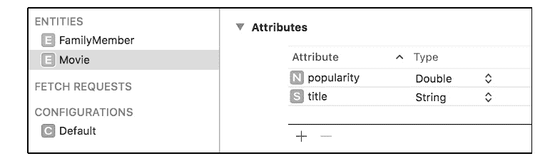
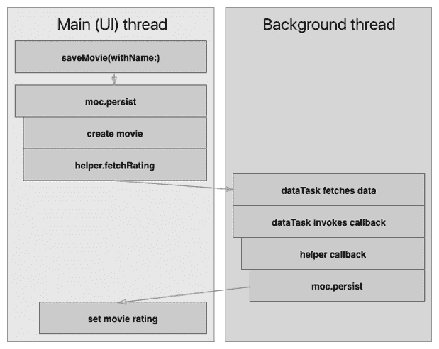

# 第九章：*第九章*：从网络获取和显示数据

大多数现代应用程序都会与 Web 服务进行通信。有些应用程序严重依赖它们，仅作为从网络上读取数据并在应用程序中以表单形式显示数据的层。其他应用程序使用 Web 来检索和同步数据，使其本地可用，而有些应用程序仅将 Web 用作备份存储。当然，使用互联网数据的原因远不止上述提到的这些。

在本章中，你将扩展**MustC**应用程序，使其使用 Web 服务检索家庭成员添加为收藏的电影的流行度评分。这些流行度评分将存储在 Core Data 数据库中，并与电影名称一起显示。

在本章中，你将学习以下主题：

+   使用`URLSession`从网络上获取数据

+   在 Swift 中使用 JSON

+   使用获取的数据更新 Core Data 对象

# 技术要求

本章的代码包包含一个名为`URLSession.playground`的起始项目。

你还需要从[`www.themoviedb.org/`](https://www.themoviedb.org/)生成一个 API 密钥。在他们的网站上创建一个账户，并在账户页面上请求一个 API 密钥。设置这个过程只需几分钟，如果你想跟随本章的内容，你需要有自己的 API 密钥。

在你已在[themoviedb.org](http://themoviedb.org/)上创建并验证了账户后，你可以访问以下链接来请求一个 API 密钥：[`www.themoviedb.org/settings/api/request`](https://www.themoviedb.org/settings/api/request)。

本章的代码可以在以下位置找到：[`github.com/PacktPublishing/Mastering-iOS-14-Programming-4th-Edition/tree/master/Chapter%209%20-%20Fetching%20from%20Network`](https://github.com/PacktPublishing/Mastering-iOS-14-Programming-4th-Edition/tree/master/Chapter%209%20-%20Fetching%20from%20Network)。

# 使用 URLSession 从网络上获取数据

从网络上检索数据是作为 iOS 专业人士你经常会做的事情。你不仅会从网络服务中获取数据，还会向其发送数据。例如，你可能需要作为登录流程的一部分或更新用户个人资料信息时发起一个 HTTP POST 请求。随着时间的推移，iOS 在 Web 请求方面已经发展了很多，使得在应用程序中使用 Web 服务变得更加容易。

重要提示

HTTP（或 HTTPS）是一种几乎所有网络流量都用于客户端（如应用程序）与服务器之间通信的协议。HTTP 协议支持几种表示请求意图的方法。GET 用于从服务器检索信息。POST 请求表示将新内容推送到服务器的意图，例如，在提交表单时。

当您想在 iOS 中执行网络请求时，您通常会使用 `URLSession` 类。`URLSession` 类代表您执行异步网络请求。这意味着 iOS 在后台线程上从网络加载数据，确保在整个请求过程中用户界面保持响应。如果执行同步网络请求，用户界面在网络请求期间将无响应，因为线程一次只能做一件事，所以如果它在等待网络响应，它就不能响应触摸或任何其他用户输入。

如果您的用户拥有慢速的互联网连接，一个请求可能需要几秒钟。您不希望界面冻结几秒钟。即使是几毫秒也会导致其响应性和帧率明显下降。通过使用 `URLSession` 来执行异步网络请求可以轻松避免这种情况。

首先，您将在游乐场中实验基本的网络请求。您可以创建一个新的游乐场或使用本书代码包中提供的游乐场。在您了解了 `URLSession` 的基础知识之后，您将实现从开源电影数据库获取电影的方法，并将此实现用于 MustC 应用。

## 理解 URLSession 的基础知识

进行网络调用是每个需要获取、发布或修改远程数据的应用的基石任务之一。这是开发者每天面临的最常见任务之一。为此任务，苹果为开发者提供了 `URLSession` 类。`URLSession` 类帮助开发者轻松地处理远程数据，并通过协调一系列相关的网络数据传输任务。

以下代码片段展示了加载 [`apple.com`](https://apple.com) 首页的示例网络请求：

```swift
import Foundation
let url = URL(string: 'https://apple.com')!
let task = URLSession.shared.dataTask(with: url) {
  data, response, error in
  if let data = data {
    print(data)
  }
  if let response = response {
    print(response)
  }
  if let error = error {
    print(error)
  }
}
task.resume() 
```

这是一个基本的示例：创建一个 URL，然后使用共享的 `URLSession` 实例创建一个新的 `dataTask`。这个 `dataTask` 是 `URLSessionDataTask` 的一个实例，允许您从远程服务器加载数据。

或者，如果您正在下载文件，可以使用下载任务；如果您正在将文件上传到网络服务器，可以使用上传任务。在创建任务后，您必须调用任务上的 `resume`，因为新任务总是以挂起状态创建。

如果您在一个空的游乐场中运行此示例，您会发现示例无法工作。因为网络请求是异步进行的，所以游乐场在网络请求完成之前就已经执行完毕。为了解决这个问题，您应该确保游乐场无限期地运行。这样做将允许网络请求完成。将以下行添加到游乐场源文件的顶部以启用此行为：

```swift
import PlaygroundSupport
PlaygroundPage.current.needsIndefiniteExecution = true
```

现在沙盒运行无限期，您会发现控制台打印出来的有用数据并不多。在这种情况下，您对原始数据、HTTP 头部或错误为 nil 的事实并不感兴趣。当您从 URL 加载数据时，您通常最感兴趣的是响应的主体。响应的主体通常包含您请求的数据的字符串表示。在先前的例子中，主体是构成苹果主页的 HTML。让我们看看您如何从响应中提取这个 HTML。将数据任务完成回调替换为以下内容：

```swift
{ data, response, error in
  guard let data = data, error == nil
    else { return }

  let responseString = String(data: data, encoding: .utf8)
  print(responseString as Any)
}
```

之前的回调闭包确保了没有错误被网络服务返回，并且存在数据。然后，原始数据被转换成字符串，并将该字符串打印到控制台。如果您使用这个回调而不是旧的回调，您将看到苹果主页的 HTML 被打印出来。像您刚才看到的对网络服务器的简单请求，使用`URLSession`实现起来相对简单。

如果您需要自定义网络请求（例如，添加自定义头部），而不是使用带有 URL 的简单`dataTask`函数，您需要创建自己的`URLRequest`实例，而不是让`URLSession`为您创建。您看到的例子是您让`URLSession`代表您创建`URLRequest`的情况。如果您只想执行一个没有自定义头部的简单 HTTP GET 请求，这是可以的，但如果您要发送数据或包含特定的头部，您将需要更多控制请求的方式。

让我们看看带有一些参数和自定义头部的 GET 请求是什么样的。以下代码使用了来自[`www.themoviedb.org/`](https://www.themoviedb.org/)的 API 密钥。如果您想尝试这个代码示例，请在他们网站上创建一个账户，并在账户页面请求一个 API 密钥。设置这个过程只需要几分钟，如果您想跟随本章内容，您将需要自己的 API 密钥。在您在[themoviedb.org](http://themoviedb.org)上创建并验证账户后，您可以访问以下链接来请求一个 API 密钥：[`www.themoviedb.org/settings/api/request`](https://www.themoviedb.org/settings/api/request)。

```swift
let api_key = 'YOUR_API_KEY_HERE'
var urlString = 'https://api.themoviedb.org/3/search/movie/'
urlString = urlString.appending('?api_key=\(api_key)')
urlString = urlString.appending('&query=Swift')
let movieURL = URL(string: urlString)!
var urlRequest = URLRequest(url: movieURL)
urlRequest.httpMethod = 'GET'
urlRequest.setValue('application/json', forHTTPHeaderField: 'Accept')
let movieTask = URLSession.shared.dataTask(with: urlRequest) { data, response, error in
  print(response as Any)
}
movieTask.resume()
```

之前的代码比您之前看到的例子要复杂一些。在这个例子中，配置了一个更复杂的 URL 请求，其中包含了一些 HTTP GET 参数。`URLRequest`的`httpMethod`值被指定，并提供了一个自定义的头部信息，以便通知接收者它希望接收哪种类型的响应。

执行此 URL 请求的流程与之前看到的一样。然而，加载的 URL 响应返回的是 JSON 字符串而不是 HTML 文档。JSON 被许多 API 用作在网络上传递数据的首选格式。为了使用此响应，必须将原始数据转换为有用的数据结构。在这种情况下，字典将 suffice。如果你之前没有见过或处理过 JSON，那么退一步阅读有关 JSON 数据格式的资料是个好主意，因为本章将继续假设你至少对 JSON 有些许了解。

# 在 Swift 中使用 JSON

以下代码片段展示了如何将原始数据转换为 JSON 字典。在 Swift 中使用 JSON 有时可能会有些繁琐，但总体来说，它是一个一般良好的体验。让我们看看以下示例：

```swift
guard let data = data, let json = try? JSONSerialization.jsonObject(with: data, options: []) else { return }
print(json)
```

前面的代码片段将 URL 请求返回的原始数据转换为 JSON 对象。`print`语句打印出可读的响应数据版本，但它还不是可以直接使用的。让我们看看如何访问响应中第一个可用的电影。

如果你查看`jsonObject(with:options:)`方法返回的对象类型，你会看到它返回`Any`。这意味着你必须将返回的对象类型转换为可以处理的对象，例如数组或字典。当你检查 API 返回的 JSON 响应时，例如使用`print`使其在控制台显示，就像你处理苹果主页 HTML 那样，你会注意到有一个键名为`results`的字典。`results`对象是一个电影数组。换句话说，它是一个`[String: Any]`类型的数组，因为每部电影都是一个字典，其中字符串是键，值可以是几种不同类型，例如字符串、整数或布尔值。有了这些信息，你可以访问 JSON 响应中的第一部电影标题，如下面的代码所示：

```swift
guard let data = data,
  let json = try? JSONSerialization.jsonObject(with: data,
  options: []),
  let jsonDict = json as? [String: AnyObject],
  let resultsArray = jsonDict['results'] as? [[String: Any]] 
  else { return }
let firstMovie = resultsArray[0]
let movieTitle = firstMovie['title'] as! String print(movieTitle)
```

使用字典处理 JSON 并不是最佳体验。由于 JSON 对象是`AnyObject`类型，并且你需要将你想要访问的字典中的每个元素都进行类型转换，因此你需要添加大量的模板代码。

幸运的是，Swift 有更好的方法从 JSON 数据创建对象实例。以下示例展示了如何快速创建一个`Movie`结构体实例，而无需将 JSON 字典中所有键转换为`Movie`结构体的正确类型。

首先，让我们定义两个结构体，一个用于`Movie`本身，另一个用于包含`Movie`实例数组的响应：

```swift
struct MoviesResponse: Codable {
  let results: [Movie]
}
struct Movie: Codable {
  let id: Int
  let title: String
  let popularity: Float
}
```

接下来，你可以使用以下代码片段快速将 URL 请求的原始数据转换为`MoviesResponse`实例，其中所有电影都转换为`Movie`结构体实例：

```swift
let decoder = JSONDecoder()
guard let data = data,
let movies = try? decoder.decode(MoviesResponse.self, from: data) else { return }
print(movies.results[0].title)
```

你可能会注意到`MoviesResponse`和`Movie`都遵循了`Codable`协议。`Codable`协议是在 Swift 4 中引入的，它允许你轻松地编码和解码数据对象。唯一的要求是`Codable`对象的全部属性都必须遵循`Codable`协议。许多内置类型，如`Array`、`String`、`Int`、`Float`和`Dictionary`都遵循`Codable`。正因为如此，你可以轻松地将编码后的 JSON 对象转换为包含`Movie`实例的`MoviesResponse`实例。

默认情况下，每个属性名称应与其映射到的 JSON 响应键相对应。然而，有时你可能想要自定义这种映射。例如，我们一直在处理响应中的`poster_path`属性，根据一般的 Swift 属性命名指南，最好将其映射到`Movie`结构体上的`posterPath`属性。以下示例显示了如何处理这些情况：

```swift
struct Movie: Codable {
  enum CodingKeys: String, CodingKey {
    case id, title, popularity
    case posterPath = 'poster_path'
  }
  let id: Int
  let title: String
  let popularity: Float 
  let posterPath: String?
}
```

通过指定一个`CodingKeys`枚举，你可以覆盖 JSON 响应中的键如何映射到你的`Codable`对象。你必须覆盖所有映射的键，包括你不想更改的键。正如你所看到的，`Codable`协议提供了处理网络数据的有力工具。自定义键映射使此协议更加强大，因为它允许你按照自己的意愿塑造对象，而不是让 URL 响应为你指定结构。

如果在编码键中你需要应用的唯一转换是将蛇形命名（`poster_path`）转换为驼峰命名（`posterPath`），你不需要自己指定编码键。当解码数据时，如果将`JSONDecoder`对象的`keyDecodingStrategy`设置为`.convertFromSnakeCase`，它将自动应用这种类型的转换，如下面的代码所示：

```swift
let decoder = JSONDecoder()
decoder.keyDecodingStrategy = .convertFromSnakeCase
```

通过应用这些代码行，解码器将自动将属性名称如`poster_path`转换为`posterPath`语法。尝试在你的沙盒中实现这一点，并从`Movie`对象中移除`CodingKeys`以确保你的 JSON 解码仍然有效。

在本节中，我们学习了如何处理 JSON 数据以及如何将其解码为我们自己的实体。现在让我们继续学习如何将获取的数据存储在 Core Data 数据库中。

# 使用获取的数据更新 Core Data 对象

到目前为止，你存储在 Core Data 中的唯一内容是电影名称。你将通过电影数据库 API 对某个电影名称进行查找来扩展这一功能。获取的信息将用于在 Core Data 数据库中显示和存储电影的流行度评分。

这样的任务一开始看起来很简单；你可以想出一个如以下步骤所示的流程：

1.  用户表明他们的最爱电影。

1.  获取电影的流行度评分。

1.  电影及其评分存储在数据库中。

用户界面随着新电影更新。乍一看，这是一个不错的策略；当你有数据时插入数据。然而，重要的是要考虑 API 调用通常是异步进行的，这样用户界面才能保持响应。更重要的是，如果你的用户没有良好的互联网连接，API 调用可能会非常慢。这意味着如果前面的步骤逐个执行，你将会在界面上看到一些非常明显的延迟。

以下是实现当前功能的更好方法：

1.  用户表明他们的最爱电影。

1.  用户存储电影。

1.  使用新电影更新用户界面。

1.  开始获取流行度。

1.  更新数据库中的电影。

1.  使用流行度更新用户界面。

这种方法稍微复杂一些，但它会给用户带来响应式的体验。用户界面会立即显示新电影，并在获取新数据后自动更新。在你能够获取数据并更新模型之前，必须修改 Core Data 模型以便存储给定电影的流行度评分。

打开 `popularity`。为此属性选择 `Double` 类型，因为 `popularity` 存储为十进制值。你必须确保这个属性是可选的，因为你不能立即提供它的值：



图 9.1 – 将流行度属性添加到电影实体

如果你之前在 iOS 10 发布之前使用过 Core Data，那么你期望在这里读到关于迁移以及如何编排它们的内容。

然而，对于像这样的简单更改，我们不需要手动管理迁移。你所需要做的就是简单地构建并运行你的应用程序来重新生成你的模型定义，对于像我们刚才所做的这种简单更改，Core Data 将会自动为我们管理迁移。

重要提示

如果你想要支持低于 iOS 10 的版本，确保你阅读有关 Core Data 迁移的内容。每次你更新你的模型时，你必须确保你的数据库能够正确地从一种模型版本迁移到另一种模型版本。在开发过程中，这并不是非常重要：当你的模型发生变化时，你只需重新安装应用程序。然而，如果 Core Data 模型与先前模型不兼容，应用程序更新将导致启动时崩溃。

现在，Core Data 模型已经更新，让我们来找出如何实现之前描述的流程。

## 实现获取逻辑

网络请求的异步特性使得某些任务，比如你即将要实现的任务，相当复杂。通常，当你编写代码时，其执行是非常可预测的。你的应用通常是逐行、顺序执行的，所以任何在上一行之后的行都可以假设上一行已经执行完毕。异步代码不是这样。异步代码被从主线程上移除，并独立于其他代码运行。这意味着你的异步代码可能会与其他代码并行运行。在网络请求的情况下，异步代码可能会在发起请求的函数执行几秒后执行。

这意味着你需要想出一个方法来更新和保存那些在获取评分后立即添加的电影。然而，重要的是你要意识到这并不像最初看起来那么简单。

重要的是，你要意识到你即将查看的代码是在多个线程上执行的。这意味着尽管所有代码片段都在同一个地方定义，但它们并不是按顺序执行的。网络请求的回调是在发起网络请求的代码所在的另一个线程上执行的。你已经了解到 Core Data 不是线程安全的。这意味着你不能在创建它的线程之外安全地访问 Core Data 对象。

如果你感到困惑，那没关系。你现在应该有点困惑。异步编程并不容易，一旦你遇到并发相关的问题（你会的），会让你感到沮丧。无论何时你与回调、闭包和多个线程一起工作，你应该意识到你正在做复杂的工作，而不是简单的工作。

现在你已经了解到异步代码很难，让我们更仔细地看看你即将要实现的功能。是时候开始实现获取电影流行度评分的网络请求了。你将把获取逻辑抽象到一个名为`MovieDBHelper`的辅助函数中。继续在 Xcode 中创建一个新的`Helper`文件夹，并向其中添加一个名为`MovieDBHelper.swift`的新 Swift 文件。

将此逻辑抽象到辅助函数中有多个优点。其中之一是简单性；它将使我们的视图控制器代码保持整洁。另一个优点是灵活性。假设你想结合多个评分网站，或者不同的 API，或者根据添加相同标题到列表中的家庭成员数量来计算电影的流行度；由于所有评分逻辑都在一个地方，因此实现起来会更简单。

将以下骨架实现添加到`MovieDBHelper`文件中：

```swift
struct MovieDBHelper {
  typealias MovieDBCallback = (Double?) -> Void
  let apiKey = 'YOUR_API_KEY_HERE'
  func fetchRating(forMovie movie: String, callback: @escaping
  MovieDBCallback) {
  }
  private func url(forMovie movie: String) -> URL? {
    guard let query = 
      movie.addingPercentEncoding(withAllowedCharacters: 
       .urlHostAllowed) else { return nil }
    var urlString = 
    'https://api.themoviedb.org/3/search/movie/'
    urlString = urlString.appending('?api_key=\(apiKey)')
    urlString = urlString.appending('&query=\(query)')
    return URL(string: urlString)
  }
}
```

上述代码从一行有趣的语句开始：

```swift
typealias MovieDBCallback = (Double?) -> Void
```

这一行指定了在获取评分时调用的回调闭包所使用的类型。这个回调将接收一个可选的`Double`作为其参数。如果网络请求因任何原因失败，则`Double`将为`nil`。否则，它包含请求创建的电影的评分。

该片段还包含一个`fetchRating`占位方法，用于执行获取操作；你很快就会实现这个方法。最后，有一个`url(forMovie movie: String)`方法来构建 URL。这个方法之所以是私有的，是因为它只应该在辅助结构内部使用。注意，电影被转换为一个百分编码字符串。这是必需的，因为如果你的用户添加了一个包含空格的电影，如果空格没有被正确编码，你最终会得到一个无效的 URL。

在你实现`fetchRating(forMovie:callback)`之前，向`Helper`文件夹中添加一个名为`MovieDBResponse.swift`的新文件。这个文件将用于定义一个结构体，它代表我们从[api.themoviedb.org](http://api.themoviedb.org)期望接收到的响应。将以下实现添加到这个文件中：

```swift
struct MovieDBLookupResponse: Codable {
  struct MovieDBMovie: Codable {
    let popularity: Double?
  }
  let results: [MovieDBMovie]
}
```

前面的代码使用嵌套结构来表示响应中的电影对象。这与你在本章开头“使用 URLSession 从网络获取数据”部分中看到的游乐场示例类似。以这种方式结构化响应使得这个辅助函数的意图非常明显，这通常使得代码更容易推理。有了这个结构，将`MovieDBHelper`中的`fetchRating(forMovie:callback)`的实现替换为以下内容：

```swift
func fetchRating(forMovie movie: String, callback: @escaping MovieDBCallback) {
  guard let searchUrl = url(forMovie: movie) else {
    callback(nil)
    return
  }
  let task = URLSession.shared.dataTask(with: searchUrl) { 
    data, response, error in
    var rating: Double? = nil
    defer {
      callback(rating)
    }
    let decoder = JSONDecoder()
    guard error == nil,
          let data = data,
          let lookupResponse = try? 
          decoder.decode(MovieDBLookupResponse.self, from: 
          data),
          let popularity = 
          lookupResponse.results.first?.popularity
    else { return }
    rating = popularity
  }
  task.resume()
}
```

这个实现看起来与你在游乐场中早期实验的非常相似。使用 URL 构建方法来创建一个有效的 URL。如果这失败了，尝试请求电影的评分就没有意义了，所以回调函数会使用一个`nil`参数被调用。这将通知调用此方法的用户执行已完成，但没有检索到结果。

接下来，创建了一个新的数据任务，并在这个任务上调用`resume()`来启动它。然而，这个数据任务的回调调用有一个有趣的方面。让我们看看以下几行代码：

```swift
    var rating: Double? = nil
    defer {
      callback(rating)
    }
```

在这里创建了一个`rating optional Double`，并给它一个初始值`nil`。然后有一个`defer`块。`defer`块中的代码在退出作用域之前被调用。换句话说，它是在代码从函数或闭包返回之前执行的。

由于这个`defer`块是在数据任务回调内部定义的，因此`fetchRating(forMovie:callback:)`方法的回调总是在数据任务回调退出之前被调用。这很方便，因为你只需要将评分的值设置为`double`，而且你不需要手动调用每个可能的退出范围的回调。当因为未满足的要求而返回时，这也适用。例如，如果在调用 API 时发生错误，你不需要调用回调。你可以简单地从闭包中返回，回调会自动调用。如果你临时实例化或配置对象，并且希望在方法、函数或闭包完成后执行一些清理操作，这种策略也可以应用。

代码的其余部分应该相当直接，因为其中大部分几乎与在游乐场中使用的代码相同。现在你已经掌握了网络逻辑，让我们看看如何实际上更新`movie`对象以包含流行度评分。

## 更新电影流行度评分

要更新`movie`对象，你需要实现前面概述的方法的最终步骤。你需要异步从电影数据库中获取评分，然后使用该评分来更新电影。以下代码应添加到`MoviesViewController.swift`中的`saveMovie(withName name: String)`方法，在`familyMember.movies = NSSet(set: newFavorites`行之后：

```swift
let helper = MovieDBHelper()
helper.fetchRating(forMovie: name) { rating in
  guard let rating = rating else { return }
  moc.persist {
    movie.popularity = rating
  }
}
```

你可以看到，辅助抽象为视图控制器提供了一个很好的接口。你可以简单地使用辅助工具，并给它一个电影，通过回调获取评分，然后你就准备好了。像这样抽象代码可以使你长期维护代码变得更加有趣。

在前面的代码片段中最令人惊讶的是，在`helper`回调内部再次调用了`moc.persist`。这是因为这个回调实际上是在初始`persist`完成很长时间后才执行的。实际上，这个回调甚至不是在它周围的代码所在的同一个线程上执行的。

要查看你的代码在没有正确持久化模型时如何失败，尝试将评分检索回调中的`moc.persist`块替换为以下代码：

```swift
movie.popularity = rating
do {
  try moc.save()
} catch {
  moc.rollback()
}
```

如果您现在添加一部新电影，评分仍然会被获取。然而，当您重新加载您的表格视图时，您会突然遇到问题。这是因为托管对象上下文是在后台线程上保存的。这意味着通知表格视图关于更新的通知也是在后台线程上发送的。您可以通过像以前一样将 `reloadData()` 调用推送到主线程来解决这个问题，但在这个情况下，这样做只会使问题变得更糟。您的应用可能在一开始运行良好，但一旦您的应用变得复杂，在多个线程中使用相同的托管对象上下文几乎肯定会导致崩溃。因此，始终确保您通过使用诸如我们为这个应用实现的 `persist` 方法之类的构造来在正确的线程上访问托管对象及其上下文非常重要。

现在您已经看到了所有相关的代码，让我们以更直观的方式看看所有这些关于线程的讨论意味着什么。

## 可视化多个线程

以下图表将帮助您理解多个线程：



图 9.2 – 线程图

当调用 `saveMovie(withName:)` 时，执行仍在主线程上。持久化块被打开，电影被创建，其名称被设置，创建了一个辅助对象，然后在该辅助对象上调用 `fetchRating(forMovie:callback:)`。这个调用本身仍在主线程上。然而，数据的获取被推送到后台线程。这在您在游乐场中尝试获取数据时已经讨论过了。

由 `dataTask` 触发的回调在任务本身所在的同一个后台线程上执行。代码将处理 JSON，最后调用传递给 `fetchRating(forMovie:callback:)` 的回调。这个回调内部的代码也在后台线程上执行。

您可以看到，在更新流程中设置的影片评分步骤被推回到主线程。这是因为您添加到托管对象上下文扩展中的 `persist` 方法。上下文内部使用 `perform` 方法来确保我们在 `persist` 块中执行的任何代码都在托管对象上下文所在的线程上执行。此外，由于托管对象上下文是在主线程上创建的，因此电影评分将在主线程上设置。

重要提示

如果您没有在托管对象所属的线程上设置电影评分，您将得到错误和未定义的行为。始终确保您在托管对象上下文所在的线程上操作 Core Data 对象。

线程是一个复杂的话题，但对于构建响应式应用程序来说至关重要。网络逻辑是为什么多线程很重要的一个很好的例子。如果我们不在单独的线程上执行网络操作，界面将在请求期间无响应。如果你在应用程序中还有其他可能需要较长时间的操作，考虑将它们移动到后台线程，这样它们就不会阻塞用户界面。

所有代码都已就绪，你对多线程和如何在多线程环境中使用回调有了更好的理解。然而，如果你构建并运行你的应用程序并添加一部新电影，评分尚未显示。

以下是发生这种情况的三个原因：

+   显示电影的表格视图单元格尚未更新。

+   网络请求因 **应用传输安全** 而失败。

+   电影对象的更新尚未被观察。

让我们按顺序解决这些问题，首先是表格视图单元格。

### 将评分添加到电影单元格

目前，电影表格视图显示带有标题的单元格。`UITableViewCell` 有一个内置选项来显示单元格的标题和副标题。

打开 `Main.storyboard` 并选择电影的原型单元格。在表格视图单元格的 `detailTextLabel` 上。这是我们显示电影评分的地方。

在 `MoviesViewController` 中，在设置单元格标题后，向 `tableView(_:cellForRow:atIndexPath:)` 添加以下行：

```swift
cell.detailTextLabel?.text = 'Rating: \(movie.popularity)'
```

这行代码将电影的受欢迎度评分放入字符串中，并将其分配为详细文本标签的文本。

如果你现在构建并运行你的应用程序，所有电影都应该有一个受欢迎度为 0.0。让我们通过解决网络问题来解决这个问题。

### 理解应用传输安全

随着 iOS 9 的推出，苹果引入了 **应用传输安全**（**ATS**）。ATS 通过禁止使用非 HTTPS 资源来使应用程序更安全、更可靠。这是一个很好的安全特性，因为它保护了用户免受在常规 HTTP 连接上执行的各种攻击。

如果你仔细关注用于获取电影的 URL，你可能已经注意到该 URL 应该是一个 HTTPS 资源，因此加载这个 URL 应该是没问题的。然而，网络请求仍然被 ATS 阻止。为什么？

好吧，苹果有严格的要求。在撰写本书时，电影数据库使用证书的 SHA-1 签名，而苹果要求 SHA-2。因此，你现在需要绕过 ATS。尽管如此，您的用户仍然应该是安全的，因为电影数据库支持 HTTPS，只是苹果认为它还不够安全。

要做到这一点，打开`Info.plist`文件，并向此字典添加一个名为`themoviedb.org`的新字典键，并添加两个布尔值到这个字典中。这两个值都应该设置为**YES**，并且它们应该命名为**NSIncludesSubdomains**和**NSTemporaryExceptionAllowsInsecureHTTPLoads**。参考以下截图以确保你已经正确设置：

![图 9.3 – 应用传输安全设置

![图片 B14717_09_03.jpg]

上存在的电影）。太棒了！现在，你需要确保我们观察管理对象上下文以更新电影，这样如果它们的评分发生变化，它们就会被重新加载。

### 观察电影评分的变化

你已经正在观察管理对象上下文的变化，但只有在当前页面上显示的家庭成员已更新时才会处理它们。这个逻辑应该被替换，以便在家庭成员或他们的喜欢的电影发生变化时重新加载表格视图。在`MoviesViewController.swift`中更新`managedObjectContextDidChange(_:)`方法如下：

```swift
@objc func managedObjectContextDidChange(notification: NSNotification) {
  guard let userInfo = notification.userInfo else { return }
  if let updatedObjects = userInfo[NSUpdatedObjectsKey] as? 
     Set<FamilyMember>,
let familyMember = self.familyMember, 
     updatedObjects.contains(familyMember) {
tableView.reloadData() 
  }
  if let updatedObjects = userInfo[NSUpdatedObjectsKey] as? 
  Set<Movie> {
    for object in updatedObjects {
      if object.familyMember == familyMember {
        tableView.reloadData()
        break
      }
    }
  }
}
```

重要提示

观察家庭成员的逻辑没有改变；其条件只是从`guard`语句移动到了`if`语句。为电影添加了一个额外的`if`语句。如果更新的对象集是电影列表，我们遍历电影并检查是否有电影将当前家庭成员作为其家庭成员。如果是这样，表格会立即刷新，并且退出循环。

在第二个`if`语句中设置循环的方式很重要，因为你可能刚刚为家庭成员 A 添加了一部电影，然后切换到家庭成员 B，而家庭成员 A 的新电影仍在加载其评分。提前退出循环确保你不会遍历比所需更多的对象。你只想在当前家庭成员的喜欢的电影更新时刷新表格视图。

好的，现在构建并运行你的应用来试驾一下！你会注意到现在一切按你的预期工作。添加新电影会触发网络请求；一旦完成，UI 就会更新为新评分。有时，这个更新会立即完成，但如果你有慢速的互联网连接，可能需要一段时间。太棒了！这个功能就到这里。

# 摘要

本章主要讲述向现有应用中添加一个微小、简单的功能。我们添加了从 API 加载真实数据的能力。你看到苹果公司通过`URLSession`和数据任务使网络变得相当简单。你还了解到这个类抽象了一些关于多线程的非常复杂的行为，因此当从网络加载数据时，你的应用仍然保持响应。接下来，你实现了一个用于网络的`helper`结构体，并更新了 Core Data 模型以存储电影的评分。一旦完成所有这些，你最终可以看到多线程在这个应用中的工作方式。但这还不是我们需要做的全部。你学习了 ATS 及其如何保护你的用户安全。你还了解到有时你需要绕过 ATS，我们介绍了如何实现这一点。

尽管这个功能本身并不复杂，但涉及的概念和理论可能相当令人难以承受。你突然不得不处理将来将异步执行代码。不仅如此，代码甚至使用了多个线程以确保其性能最优。多线程和异步编程的概念可以说是编程中更复杂的两个方面之一。大量练习它们，并试图记住，每次你传递闭包时，你可能会编写一些将在不同线程上执行的异步代码。

现在电影列表已经通过网络数据更新，让我们在下一章中更进一步。你将学习如何通过使用 CoreML 和 Vision Framework 功能使你的应用变得更智能。
