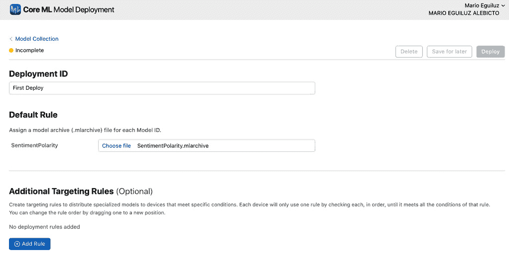

# *第十章*：使用 Core ML 制作更智能的应用

在过去的几年里，机器学习越来越受欢迎。然而，在移动应用中实现它一直不容易——直到苹果在 iOS 11 中发布了 **Core ML** 框架。Core ML 是苹果针对公司开发者在为 iOS 实现机器学习时遇到的所有问题而提供的解决方案。因此，Core ML 应该为处理复杂的机器学习模型提供最快、最有效的实现，通过尽可能简单和灵活的接口。

在本章中，你将学习机器学习是什么，它是如何工作的，以及你如何在你的应用中使用训练好的机器学习模型。你还将学习如何使用苹果的 **Vision 框架**分析图像，并了解它如何与 Core ML 集成以实现强大的图像检测。最后，你将学习如何使用新的 **Create ML** 工具来训练你的模型，如何将你的模型部署到云端，以及如何加密它们以确保安全。你将在以下部分学习这些主题：

+   理解机器学习和 Core ML

+   结合 Core ML 和计算机视觉

+   使用 Create ML 训练自己的模型

+   使用模型部署远程更新模型

+   加密 Core ML 模型

到本章结束时，你将能够训练和使用你的 Core ML 模型，使你构建的应用更加智能和引人入胜。

# 技术要求

本章的代码包包括三个起始项目，分别称为 `TextAnalyzer`、`ImageAnalyzer` 和 `TextAnalyzerCloud`。它还包括一个名为 `Create ML.playground` 的游乐场文件。

本章的代码可以在以下链接找到：[`github.com/PacktPublishing/Mastering-iOS-14-Programming-4th-Edition/tree/master/Chapter%2010%20-%20Core%20ML`](https://github.com/PacktPublishing/Mastering-iOS-14-Programming-4th-Edition/tree/master/Chapter%2010%20-%20Core%20ML).

# 理解机器学习和 Core ML

机器学习和 Core ML 密不可分，但它们并不完全相同。机器学习的一切都是关于教会机器如何识别、分析或应用某些事物。所有这些教学的结果是一个训练好的模型，可以被 Core ML 使用来分析特定的输入，并根据训练阶段建立的规则产生输出。

在学习 Core ML 之前，了解一些机器学习的知识是很好的，这样你可以熟悉一些使用的术语，并了解机器学习是什么。

## 理解机器学习是什么

许多开发者在职业生涯的某个阶段都会听说机器学习、深度学习或神经网络。你可能已经听说过这些话题。如果你已经了解，你会知道机器学习是一个复杂的领域，需要特定的领域知识。然而，机器学习正变得越来越突出和受欢迎，它被用于改进许多不同类型的应用。

例如，机器学习可以用来根据用户在音乐库中已有的音乐预测他们可能在音乐应用中喜欢看到的内容，或者自动标记照片中的面孔，将它们与用户联系人列表中的人联系起来。它甚至可以根据历史数据预测特定产品或服务的成本。虽然这可能听起来像魔法，但创建类似这些机器学习体验的流程大致可以分为两个阶段：

1.  训练模型

1.  使用推理从模型中获取结果

必须收集大量高质量的数据来执行第一步。如果你打算训练一个应该能够识别猫的模型，你需要大量猫的图片。你还必须收集不包含猫的图片。然后，每张图片都必须适当标记，以表明图片是否包含猫。

如果你的数据集只包含朝向摄像头的猫的图片，那么你的模型可能无法从侧面识别猫。如果你的数据集确实包含来自许多不同角度的猫，但你只收集了单一品种或背景为纯白色的图片，那么你的模型可能仍然很难识别所有猫。获得高质量的训练数据并不容易，但它是至关重要的。

在模型的训练阶段，你必须提供一组尽可能高质量的输入。最小的错误可能会导致你的整个数据集变得毫无价值。收集大量高质量数据以训练模型是一项繁琐的任务。这也需要花费大量时间。某些复杂的模型可能需要几个小时来处理所有数据并自行训练。

训练好的模型有多种类型。每种类型的模型都适用于不同类型的任务。例如，如果你正在开发一个可以分类特定电子邮件消息是否为垃圾邮件的模型，你的模型可能是一个所谓的**支持向量机**。如果你正在训练一个在图片中识别猫的模型，你很可能在训练一个**神经网络**。

每个模型都有其优缺点，每个模型都是不同地创建和使用的。理解所有这些不同的模型、它们的含义以及如何训练它们是非常困难的，你可能会为每种类型的模型写一本书。

在一定程度上，这就是为什么 Core ML 如此出色的原因。Core ML 允许你在自己的应用中使用预训练的模型。在此基础上，Core ML 标准化了你在自己代码中使用的接口。这意味着你可以使用复杂的模型，甚至都不必意识到这一点。让我们更深入地了解 Core ML，好吗？

## 理解 Core ML

由于机器学习的复杂性和使用训练模型，苹果公司构建了 Core ML，以便将集成训练模型的过程尽可能简化。除此之外，另一个目标是确保你使用 Core ML 实现机器学习时，你的实现尽可能快且节能。由于苹果公司已经将机器学习增强到 iOS 中有几年时间了，他们在应用中实现复杂模型方面积累了丰富的经验。

如果你曾经研究过机器学习，你可能遇到过基于云的解决方案。通常情况下，你会发送一些数据到基于云的解决方案，结果作为对请求的响应返回。Core ML 非常不同，因为训练模型存在于设备上，而不是在云中。这意味着你的用户数据永远不需要离开设备，这对用户的隐私非常有利。此外，将训练模型放在设备上意味着使用 Core ML 不需要互联网连接，这节省了时间和宝贵的数据。而且由于没有潜在的响应延迟瓶颈，Core ML 能够实时计算结果。

在上一节中，你了解到存在几种类型的训练模型。每种类型的模型使用方式略有不同，所以如果你要在应用中手动实现机器学习，你将不得不为应用使用的每种不同模型编写不同的包装器。Core ML 确保你可以在应用中无需意识到这一点的情况下使用每种类型的模型；它们都共享相同的编程接口。Core ML 模型是领域无关的。

要实现领域无关性，你使用 Core ML 的所有训练模型都必须采用特定的格式。由于机器学习已经有一个充满活力的社区和几种流行的格式，苹果公司确保最流行的模型可以轻松转换为苹果自己的 `.mlmodel` 格式。让我们看看如何获取用于你自己在应用中使用的 `.mlmodel` 文件。

### 获取 Core ML 模型

获取用于你应用中的模型有两种方式。最简单的方式是找到一个现有的 `.mlmodel` 文件。你可以在苹果的机器学习网站上找到几个现成的 `.mlmodel` 文件，网址为 [`developer.apple.com/machine-learning/`](https://developer.apple.com/machine-learning/)。这个网站包含了几种最受欢迎的模型。在撰写本文时，这些模型大多数都专注于识别图像中的主要对象，而且你很可能对你的应用有不同的需求。

如果您正在寻找 Apple 尚未转换的内容，您可以在网上几个地方尝试寻找预转换的 `.mlmodel` 文件，或者您可以将您在网上找到的现有模型进行转换。Apple 为几种流行的机器学习格式创建了转换器，例如 `.mlmodel` 文件是用 Python 编写的，并且作为 Xcode 的一部分提供。如果您的需求不符合 Apple 提供的转换器，您可以扩展 **toolchain**，因为转换工具是开源的。这意味着每个人都可以添加自己的转换器或调整现有的转换器。

使用 Apple 的工具转换 Core ML 模型通常只需几行 Python 代码。编写一个良好的转换脚本通常需要一点机器学习领域的专业知识，因为您需要确保转换后的模型与原始模型一样有效。

一旦您为您的应用程序获得了 Core ML 模型，无论是通过转换还是找到现有的模型，您就可以将其添加到项目中并开始使用它。让我们看看如何进行下一步。

### 使用 Core ML 模型

应用程序可以利用 Core ML 实现许多不同的目的。其中之一是文本分析。您可以使用训练好的模型来检测特定文本是正面还是负面情绪。要实现这样的功能，您可以使用训练和转换后的 Core ML 模型。

本章的代码包包括一个名为 `@IBAction` 的项目，名为 `analyze()`。项目文件夹还包含一个名为 `SentimentPolarity.mlmodel` 的文件。此文件是一个分析与特定文本相关的情绪的训练好的 Core ML 模型。将此文件拖入 Xcode 以将 Core ML 模型添加到您的项目中。

在将模型添加到您的项目后，您可以在**项目导航器**中点击它，以查看有关模型的更多信息，如下面的截图所示：


图 10.1 – 模型元数据

您可以看到，这个模型是由**Vadym Markov**在**MIT**许可下提供的。如果您点击**预测**选项卡（见前面的截图），您可以找到这个模型可以与之配合的**输入**和**输出**：


图 10.2 – 模型的输入和输出

在这个例子中，您可以看到 `[String: Double]` 类型。这意味着我们应该向这个模型提供一个词频字典。如果您将此模型添加到 Xcode 中，中心部分列出的 **Model Class** 可能会通知您该模型尚未属于任何目标。如果是这种情况，您可以像之前那样修复它，通过在窗口右侧的**实用工具**侧边栏中将此模型添加到您的应用程序目标中。

既然你的模型已经实现，是时候让它试运行了。首先，实现一个从任何给定的字符串中提取词数的方法。你可以使用来自新`NaturalLanguage`框架的`NLTokenizer`对象来实现这一点。

`NLTokenizer`是一个用于将字符串拆分为单词、句子、段落甚至整个文档的文本分析类。在这个例子中，分词器被设置为检测单个单词。以下是如何实现词数方法的示例。

按照以下方式将导入添加到`ViewController.swift`文件中：

```swift
import NaturalLanguage
```

现在将以下方法添加到同一文件中：

```swift
func getWordCounts(from string: String) -> [String: Double] {
  let tokenizer = NLTokenizer(unit: .word)
  tokenizer.string = string
  var wordCount = [String: Double]()
  tokenizer.enumerateTokens(in: 
    string.startIndex..<string.endIndex) { range, attributes in
    let word = String(string[range])
    wordCount[word] = (wordCount[word] ?? 0) + 1
    return true
  }
  return wordCount
}
```

之前的代码遍历了分词器识别的所有单词，并将它们存储在`[String: Double]`类型的字典中。你可能想知道为什么词数使用`Double`类型而不是`Int`类型，因为词数不需要处理小数。这是真的，但是`SentimentPolarity`模型要求其输入为`[String: Double]`类型的字典，所以你必须相应地准备数据。

现在你有了为`SentimentPolarity`模型准备输入数据的代码，让我们看看如何使用这个模型来分析用户的输入。为`analyze()`方法添加以下实现：

```swift
@IBAction func analyze() {
  let wordCount = getWordCounts(from: textView.text)
  let model = try? SentimentPolarity(configuration: .init())
  guard let prediction = try? model?.prediction(input: 
    wordCount) else { return }
  let alert = UIAlertController(title: nil, message: "Your 
    text is rated: \(prediction.classLabel)", preferredStyle: 
     .alert)
  let okayAction = UIAlertAction(title: "Okay", style: 
    .default, handler: nil)
  alert.addAction(okayAction)
  present(alert, animated: true, completion: nil)
}
```

你可能会惊讶这个方法如此简短，这正是 Core ML 的简单之处！首先，我们使用我们之前实现的方法检索`wordCount`。然后，创建一个 Core ML 模型的实例。当你将`SentimentPolarity`模型添加到应用目标时，Xcode 生成了一个类接口，抽象了涉及模型的所有复杂性。因为模型现在是一个简单的类，你可以通过在模型实例上调用`prediction(input:)`来获取文本情感预测。

`prediction`方法返回一个对象，其中包含在`classLabel`属性中的处理后的预测，以及所有可用预测的概述以及模型对每个选项的确定程度在`classProbability`属性中。如果你想对用户更透明地展示模型建议的不同选项以及模型对这些选项的确定程度，可以使用这个属性。

让我们看看几个示例来演示它是如何工作的。首先，启动应用。现在在文本区域中写下`我喜欢彩虹`，然后按下`我在多云的日子里感到悲伤`。现在的结果是**你的文本评分为：负**。这次，你的句子情感是负面的！你可以尝试自己的想法来查看模型在不同场景下的表现。

在本章的最后部分，你将学习如何使用`Create ML`来训练你自己的自然语言模型，以分析使用与你的应用相关的特定领域语言的文本。

使用 Core ML 进行文本分析相当简单。现在让我们看看如何将计算机视觉与 Core ML 结合使用，以确定特定图片中存在的对象类型。

# 结合 Core ML 和计算机视觉

当你开发一个处理照片或实时摄像头视频的应用时，你可能想使用计算机视觉做一些事情。例如，你可能想在图像中检测面部。或者，你可能想识别照片中的某些矩形区域，如交通标志。你也可能正在寻找更复杂的事情，比如检测图片中的主导对象。

要在你的应用中使用计算机视觉，苹果创建了 **Vision** 框架。你可以将 Vision 和 Core ML 结合起来执行一些相当复杂的图像识别。在你实现一个使用主导对象识别的示例应用之前，让我们快速了解一下 Vision 框架，这样你就知道它能够做什么，以及你可能在什么时候想使用它。

## 理解 Vision 框架

Vision 框架能够执行许多围绕计算机视觉的任务。它基于几个强大的深度学习技术，能够实现最先进的面部识别、文本识别、条形码检测等。

当你使用 Vision 进行面部识别时，你获得的信息远不止图像中面部位置那么简单。该框架可以识别多个面部特征，如眼睛、鼻子或嘴巴。所有这一切都得益于苹果在幕后对深度学习的广泛使用。

对于大多数任务，使用 Vision 包括以下三个阶段：

1.  你创建一个请求来指定你想要的内容；例如，一个用于检测面部特征的 `VNDetectFaceLandmarksRequest` 请求。

1.  你设置了一个可以分析图像的处理程序。

1.  结果观察包含了你需要的信息。

以下代码示例说明了你如何在图像中找到面部特征：

```swift
let handler = VNImageRequestHandler(cgImage: image, options: [:])
let request = VNDetectFaceLandmarksRequest(completionHandler: { request, error in
  guard let results = request.results as? [VNFaceObservation]
  else { return }
  for result in results where result.landmarks != nil {
    let landmarks = result.landmarks!
    if let faceContour = landmarks.faceContour {
      print(faceContour.normalizedPoints)
    }
    if let leftEye = landmarks.leftEye {
      print(leftEye.normalizedPoints)
    }
    // etc
  }}
)
try? handler.perform([request])
```

对于像检测面部轮廓或眼睛的确切位置这样复杂的事情，代码相当简单。你设置一个 `handler` 和一个 `request`。接下来，`handler` 被要求执行一个或多个请求。这意味着你可以在单个图像上运行多个请求。

除了启用此类计算机视觉任务外，Vision 框架还与 Core ML 紧密集成。让我们通过向你在开发的增强现实画廊应用中添加图像分类器来了解一下这种集成有多紧密！

## 实现图像分类器

本节代码包包含一个名为 **ImageAnalyzer** 的应用。这个应用使用图像选择器允许用户从他们的照片库中选择一张图片，作为你将要实现的图像分类器的输入。打开项目并探索一下，看看它做什么以及它是如何工作的。如果你想跟随本节的其余部分，请使用启动项目。

要添加一个图像分类器，你需要有一个能够对图像进行分类的 Core ML 模型。在苹果的机器学习网站上 ([`developer.apple.com/machine-learning/build-run-models/`](https://developer.apple.com/machine-learning/build-run-models/))，有多个可用的模型可以进行图像分类。你可以使用的一个优秀的轻量级模型是 **MobileNetV2** 模型；请前往机器学习页面下载它。一旦下载了模型，将其拖入 Xcode 以将其添加到 **ImageAnalyzer** 项目中。请确保将其添加到你的应用程序目标中，以便 Xcode 可以为该模型生成类接口。

在将模型添加到 Xcode 后，你可以打开它来检查 **模型预测** 选项卡。参数告诉你模型将期望和提供不同类型的输入和输出。在 **MobileNetV2** 的情况下，输入应该是一个宽度为 **224** 点和高度为 **224** 点的图像，如下面的截图所示：


图 10.3 – 模型的输入和输出

在生成模型后，使用该模型的代码与之前使用 Vision 检测面部特征的代码非常相似。最显著的区别是使用的请求类型是一个特殊的 `VNCore MLRequest`。这种类型的请求除了需要一个完成处理程序外，还包含你想要使用的 Core ML 模型。

当结合 Core ML 和 Vision 时，Vision 将负责图像缩放并将图像转换为与 Core ML 模型兼容的类型。你应该确保输入图像具有正确的方向。如果你的图像以意外的方向旋转，Core ML 可能无法正确分析它。

首先，让我们导入 `Vision` 框架。在 **ImageAnalyzer** 项目的 `ViewController` 类顶部添加此语句：

```swift
import Vision
```

现在，将以下 `analyzeImage(_:)` 实现添加到 `ViewController` 类中：

```swift
func analyzeImage(_ image: UIImage) {
  guard
    let cgImage = image.cgImage,
    let classifier = try? VNCore MLModel(for: 
    MobileNetV2().model)
  else { return }
  let request = VNCore MLRequest(model: classifier,
  completionHandler: { [weak self] request, error in
    guard
      let classifications = request.results as? 
      [VNClassificationObservation],
      let prediction = classifications.first
    else { return }
    DispatchQueue.main.async {
      self?.objectDescription.text = "\(prediction.identifier)
      (\(round(prediction.confidence * 100))% confidence)"
    }
  })
  let handler = VNImageRequestHandler(cgImage: cgImage,
    options: [:])
  try? handler.perform([request])
}
```

之前的方法将 `UIImage` 转换为 `CGImage`。同时，基于 `MobileNetV2` 模型创建了一个 `VNCore MLModel`。这个特定的模型类封装了 Core ML 模型，因此它可以与 `Vision` 无缝工作。请求与之前看到的请求非常相似。在 `completionHandler` 中，提取并显示给用户的结果数组和图像分类的第一预测。分类器做出的每个预测都将有一个存储在标识符中的标签和一个存储在 `confidence` 属性中的介于 `0` 和 `1` 之间的置信度评分。请注意，描述标签的值是在主线程上设置的，以避免崩溃。

您已经实现了两种不同类型的 Core ML 模型，这些模型是为了通用目的而训练的。有时，这些模型可能不足以满足您的需求。例如，看看以下截图，其中机器学习模型仅以 32% 的置信度标记了一个特定的风景：


图 10.4 – 照片分析结果

在下一节中，您将学习如何使用 Create ML 训练针对您和您的应用程序特定目的的模型。

# 使用 Create ML 训练自己的模型

作为 Xcode 10 和苹果公司的 macOS 版本 **Mojave** 的一部分，他们提供了一款工具，您可以使用它通过向现有模型添加特殊化来训练自己的机器学习模型。这意味着您可以为将某些文本分类到您定义的类别中的自然语言模型进行训练。或者，您可以为识别文本中特定于您应用程序领域的某些产品名称或术语的模型进行训练。

如果您正在构建新闻应用程序，您可能想训练一个 Core ML 模型，该模型可以自动对应用程序中的文章进行分类。然后，您可以使用此模型跟踪用户阅读的文章，并在应用程序的专用页面上展示最有可能符合他们兴趣的文章。

在本节中，您将学习如何训练自然语言模型，以及您如何根据 Vision 框架训练图像识别模型。在这样做的时候，您会发现，当您想要训练机器学习模型时，创建一个大型且优化的训练集至关重要。

在本章的代码包中，您将找到一个名为 **Create ML** 的游乐场。这个游乐场包含了用于训练自然语言模型的所有资源。

## 训练自然语言模型

自然语言框架具有分析文本的出色功能。结合机器学习模型的力量，您可以对文本执行一些强大的操作。苹果公司投入了大量时间，使用大量数据训练了几个模型，以确保自然语言框架能够检测名称、地点等。

然而，有时您可能想添加自己的分析工具。为了便于这样做，自然语言框架与 Core ML 和苹果公司的新 **Create ML** 框架配合得很好。使用 **Create ML**，您可以轻松快速地创建自己的机器学习模型，并将其直接用于您的应用程序。

您可以使用多种不同的训练方式来训练自然语言模型。在本节中，您将了解两种不同的模型：

+   文本分类器

+   文本标注器

**文本分类器**将使用标签对特定的文本进行分类。这与您在 **TextAnalyzer** 示例应用程序中实现的情感分析类似。您的训练数据中的一个条目示例如下：

```swift
{
  "text": "We took an exclusive ride in a flying car", 
  "label": "Tech"
}
```

这是一个属于标签为`Tech`类别的新闻文章标题样本。当你向模型提供大量这样的样本时，你可能会得到一个能够根据文章标题为新闻文章分配标签的分类器。当然，这假设标题足够具体并且包含足够的信息来正确训练分类器。实际上，你会发现像这样的短句并不会构成最好的模型。示例 Playground 中包含一个包含训练数据的 JSON 文件，试图将新闻文章分为政治和科技两个类别。让我们看看模型是如何训练的，这样你就可以亲自看看模型的准确性如何。

下面的代码训练并存储自定义 Core ML 模型。在 playground 文件中打开`Labeller`，检查代码：

```swift
import Create ML
import Foundation
let trainingData = try! MLDataTable(contentsOf: Bundle.main.url(forResource: "texts", withExtension: "json")!)
let model = try! MLTextClassifier(trainingData: trainingData, textColumn: "text", labelColumn: "label")
try! model.write(to: URL(fileURLWithPath: "/Users/marioeguiluz/Desktop/TextClassifier.mlmodel"))
let techHeadline = try! model.prediction(from: "Snap users drop for first time, but revenue climbs")
let politicsHeadline = try! model.prediction(from: "President Donald Trump is approving a new law")
```

训练整个模型只需要几行代码。你只需要获取你的训练数据，创建分类器，并将其保存在你的机器上的某个位置。你甚至可以在 playground 内部进行一些快速测试，看看你的模型是否工作良好。

注意，前面的代码使用了`try!`语句。这样做是为了使代码示例简短简单。在你的应用中，你应该始终努力进行适当的错误处理，以避免意外的崩溃。

传递给`URL(fileURLWithPath:)`初始化器的字符串表示你的模型将被存储的位置。请确保在这里指定完整路径，例如，使用`/Users/yourUser/Desktop/TextClassifier.mlmodel`，而不是`~/Desktop/TextClassifier.mlmodel`。请确保用你的用户名或文件夹替换`yourUser`。

下面的代码测试了两个不同的标题，看看模型是否正确地标记了它们：

```swift
let techHeadline = try! model.prediction(from: "Snap users drop for first time, but revenue climbs")
let politicsHeadline = try! model.prediction(from: "President Donald Trump is approving a new law")
```

如果你对自己的模型结果满意，你可以从保存模型的地方获取训练好的模型，并立即将其添加到你的 Xcode 项目中。从那里，你可以像使用任何其他模型一样使用该模型。

让我们看看自然语言框架中模型的另一个示例。在这种情况下，模型应该为文本中的每个单词标记标签，以将其分类为某种类型的单词。例如，你可以训练模型来识别某些品牌名称、产品名称或其他对你应用有特殊意义的单词。以下是一些你可以用来训练此类模型的训练数据示例：

```swift
{
  "tokens": ["Apple", "announced", "iOS 12", "and", "Xcode 
    10", "at", "WWDC 2018"],
  "labels": ["COMPANY", "NONE", "OPERATING_SYSTEM", "NONE",
    "SOFTWARE", "NONE", "EVENT"]
}
```

通过收集包含你想要标记的单词的大量样本，你的模型不仅能够根据单词本身匹配标签，甚至可以根据周围的单词匹配标签。本质上，模型将了解每个单词被使用的上下文，然后确定正确的标签。一旦你收集了足够的样本数据，你就可以以类似分类器的方式训练模型：

```swift
let labelTrainingData = try! MLDataTable(contentsOf: Bundle.main.url(forResource: "labels", withExtension: "json")!)
let model = try! MLWordTagger(trainingData: labelTrainingData, tokenColumn: "tokens", labelColumn: "labels")
try! model.write(to: URL(fileURLWithPath: "/Users/marioeguiluz/Desktop/TextTagger.mlmodel"))
```

训练模型所需的代码量并没有变化。唯一的不同是，之前的模型基于 `MLTextClassifier` 类，而当前的模型基于 `MLWordTagger`。再次强调，你可以立即使用训练好的模型进行一些预测，然后你可以使用这些预测来验证模型是否被正确训练。提供良好的数据和经常测试是构建优秀的 Core ML 模型的关键。

除了文本分析模型之外，Create ML 还可以帮助你训练自己的图像识别模型。让我们看看这是如何工作的。

## 训练视觉模型

在 **ImageAnalyzer** 示例应用中，你看到选择一张特定车型的图片会被归类为跑车，并且置信度得分相当低。你可以训练自己的视觉模型，专门用于识别某些车型。

为图像分类器收集良好的训练数据很困难，因为你必须确保从所有侧面和许多不同的环境中收集你主题的许多图片。例如，如果你的所有汽车图像都显示汽车靠近树木或在路上，模型最终可能会将任何旁边有树木或道路的物体分类为汽车。获得完美训练集的唯一方法是实验、调整和测试。

训练视觉模型的工作方式与训练自然语言模型略有不同。你不能使用 JSON 文件来将测试数据喂给分类器。因此，相反，你应该创建包含你的图像的文件夹，其中文件夹名称是你想要应用给该文件夹内每张图像的标签。以下截图是一个包含两种标签的训练集示例：


图 10.5 – 训练集图像

一旦你收集了你的训练数据集，你可以在电脑上的任何位置存储它——例如，在桌面上。然后，你将按照以下方式将你的训练数据路径传递给你的模型训练代码：

```swift
import Create ML 
import Foundation
let dataUrl = URL(fileURLWithPath: "/path/to/trainingdata")
let source = MLImageClassifier.DataSource.labeledDirectories(at: dataUrl)
let classifier = try! MLImageClassifier(trainingData: source) try! classifier.write(toFile: "/Users/marioeguiluz/Desktop/CarClassifier.mlmodel")
```

再次强调，你只需要几行代码就可以训练一个模型。这就是 Create ML 强大的地方。如果你想的话，可以快速测试你的图像分类器，只需将 `.mlmodel` 文件放入之前使用的 `MobileNetV2` 分类器中。

除了简单的模型训练方法之外，你还可以向不同的 Create ML 分类器传递某些参数。如果你在正确训练模型时遇到困难，你可以调整 Create ML 使用的某些参数。例如，你可以对你的训练集应用更多的迭代，这样模型就能对训练数据有更深入的理解。

如本章之前所述，机器学习是一个可以涵盖几本书的主题，尽管 Create ML 使模型训练变得简单直接，但如果没有任何先前的机器学习经验，要训练一个健壮的模型并不容易。

现在您已经学会了如何使用自己的训练数据，在下一节中，我们将学习如何从云中更新您的模型，而无需更新应用本身。

# 使用模型部署远程更新模型

iOS 14 为机器学习带来的新功能之一是能够在云中保留您的模型集合，让您能够在任何时间更新它们，而无需更新应用本身。

我们将使用本书代码包中可用的项目来演示此新功能。该项目的名称是**TextAnalyzerCloud**。它与之前使用的项目相同，但这次模型将在云中（本地副本作为后备）。

使用模型部署在我们的应用中涉及两个步骤：

1.  使用 Core ML API 检索模型集合。

1.  准备和部署模型。

让我们在下一小节中实现这些步骤。

## 使用 Core ML API 检索模型集合

让我们首先学习如何将存储在云中的模型检索到您的应用中。打开`ViewController`类。在这个阶段，该类仅包含一个`analyze`方法，该方法计算`textView`内的单词数量，并在存在模型的情况下进行预测。该类还包含一些向用户显示错误和成功消息的方法。请注意，我们已定义以下属性：`var model: SentimentPolarity?`。

在`analyze`方法中，我们将从云中下载一个模型，如果失败，我们将使用本地模态作为后备。让我们修改该方法以实现这一点。更新`analyze`方法的实现，并在`//add code`处添加以下代码：

```swift
//1
_ = MLModelCollection.beginAccessing(identifier: "SentimentPolarityCollection") { [self] result in
  //2
  var modelURL: URL?
  switch result {
  case .success(let collection):
    modelURL = 
    collection.entries["SentimentPolarity"]?.modelURL
  case .failure(let error):
    handleCollectionError(error)
  }
  //3
  let result = loadSentimentClassifier(url: modelURL)
  //4
  switch result {
  case .success(let sentimentModel):
    model = sentimentModel
    guard let prediction = try? model?.prediction(input: 
      wordCount) else { return }
    showResult(prediction: prediction)
  case .failure(let error):
    handleModelLoadError(error)
  }
}
```

让我们回顾前面的代码块（以下数字指的是前面代码中的注释）：

+   首先，在`//1`中，我们正在访问新的 Core ML API，从苹果服务器上的账户中检索一组模型。我们通过使用带有集合标识符的`MLModelCollection.beginAccessing`方法来实现，该标识符必须与云中的标识符匹配——在我们的例子中，我们使用了`SentimentPolarityCollection`。

+   接下来，在`//2`中，我们正在检查`beginAccessing`的结果。如果成功并且我们得到了一个模型集合，我们将搜索具有`SentimentPolarity`标识符的特定模型，并从中提取`modelURL`。如果出现任何错误（例如没有网络连接），我们将调用`handleCollectionError`方法来正确处理它（在我们的情况下，我们通过模态向用户通知）。

+   现在我们有了模型 URL，在`//3`中，我们尝试加载它。我们尚未实现`loadSentimentClassifier`方法，但我们将很快完成它。请注意，此方法将尝试加载具有给定远程 URL 的模型，并将其包装在`Result<SentimentPolarity, Error>`枚举中（以正确处理错误）。

+   在最后一部分，在注释`//4`下，我们检查`//3`中的`Result`。如果我们获得了一个模型，我们将它存储在`model`属性变量中。我们这样做是为了避免反复下载模型。在存储模型后，我们使用它来分析文本。另一方面，如果我们获得了一个错误，我们将向用户显示一条消息，通知他们有关错误的信息。

现在让我们添加`loadSentimentClassifier`方法，以便类可以编译。将以下方法添加到`ViewController`中：

```swift
private func loadSentimentClassifier(url: URL?) -> Result<SentimentPolarity, Error> {
  if let modelUrl = url {
    return Result { try SentimentPolarity(contentsOf: 
    modelUrl)}
  } else {
    return Result { try SentimentPolarity(configuration: 
    .init())}
  }
}
```

此方法接收一个可选的模型 URL 作为参数；即我们存储在苹果服务器上的模型的 URL。它是一个可选值，因为我们尝试获取它时，可能会失败（例如，如果用户没有互联网连接）。在方法内部，我们处理两种可能性：

+   如果 URL 不为空，我们使用它通过`SentimentPolarity(contentsOf:)`初始化模型，并在`Result`内部返回它。

+   如果 URL 为空，我们尝试使用本地版本和默认配置通过`SentimentPolarity(configuration: .init())`初始化模型。同样，我们在`Result`内部返回它。

通过实现此方法，我们已经拥有了从网络加载模型并在我们的应用中使用它的所有必要代码。然而，我们还需要执行两个重要步骤来完成此过程：将模型以适当的格式准备上传到苹果服务器，并将模型部署到云端。

## 准备和部署模型

在上一节中，我们创建了从苹果服务器检索模型并将其导入我们应用的方法。现在，我们将准备我们的本地模型以便部署到云端。

在项目资源管理器中，点击名为`SentimentPolarity.mlmodel`的文件。现在，转到**实用工具**选项卡。您将看到以下内容：

![Figure 10.6 – Model Utilities tab]

![Figure 10.06_B14717.jpg]

![Figure 10.6 – Model Utilities tab]

点击**创建模型存档**。iOS 14 中的这个新选项将帮助我们部署我们的模型到云端的苹果服务器。当您点击它时，将出现此弹出窗口：

![Figure 10.7 – Generate Model Archive]

![Figure 10.07_B14717.jpg]

![Figure 10.7 – Generate Model Archive]

现在，请保持**加密模型**复选框未选中，并点击**继续**（我们将在本章后面探索此选项）。点击**继续**后，Xcode 将生成模型的存档并显示此模态：

![Figure 10.8 – The Model Archive Generated dialog]

![Figure 10.08_B14717.jpg]

![Figure 10.8 – The Model Archive Generated dialog]

您可以点击上一张截图中的第一个选项右侧的蓝色箭头，这将带您到模型存档的确切位置。您需要记住这个位置以便将存档上传到苹果服务器。您将看到一个扩展名为`.mlarchive`的文件，如下面的截图所示：

![Figure 10.9 – Location of the archived model]

![Figure 10.09_B14717.jpg]

![Figure 10.9 – Location of the archived model]

现在，点击第二个选项旁边的蓝色箭头，该选项读取为**您可以在 Core ML 模型部署仪表板上上传模型存档**。它将在以下页面打开您的网络浏览器：


图 10.10 – Core ML 模型集合页面

这是您在 Apple 服务器上管理模型集合的仪表板。我们现在需要创建一个新的集合，其中包含我们的模型引用，并上传我们刚刚创建的模型存档。让我们这样做；点击**模型集合**旁边的蓝色加号（**+**）图标，并填写出现的表单，如下所示：


图 10.11 – 创建模型集合

让我们回顾一下输入字段：

+   `//1`：`MLModelCollection.beginAccessing(identifier: "SentimentPolarityCollection")`），我们使用了标识符`SentimentPolarityCollection`。在这里使用相同的标识符（否则，您将无法下载集合）。

+   **描述**：使用此字段创建一个描述，这将帮助您在以后识别此集合。考虑到如果您在一个团队中工作，它还需要对其他开发者有用。

+   `SentimentPolarity`（在注释`//2`中：`modelURL = collection.entries["SentimentPolarity"]`）。再次强调，这些标识符必须相互匹配。您可以通过点击**模型 ID**蓝色按钮添加更多模型标识符，但在这个例子中，我们的集合中只有一个模型。

最后，您可以点击蓝色**创建**按钮，然后您将进入以下模型集合页面：


图 10.12 – 模型集合页面

从这个页面，您最终可以将模型部署或存档到云上的引用。点击**部署**旁边的蓝色加号（**+**）按钮，并填写如此处所示的字段：



图 10.13 – 模型部署属性

让我们回顾一下字段：

+   **部署 ID**：您可以在此处指定任何文本来描述您为什么要部署此模型。这只是一个描述字段；它不需要与任何内容匹配。

+   `.mlarchive`文件是我们之前在 Xcode 中存档模型时创建的。

注意到表单的底部部分，我们可以添加**附加目标规则**。这是 iOS 14 的另一个新功能，允许我们根据设备特性来定位我们的模型。例如，我们可以仅将某些模型下载到 iPad 上，或者针对特定的操作系统版本。为了使这个例子简单，我们不会添加任何规则，但您应该在您的应用程序中尝试一下！

在您上传`.mlarchive`文件后，它应该显示如下：


图 10.14 – 我们部署的第一个模型

当状态为`analyze`方法将给出结论。

在本节中，您学习了如何使用 Core ML API 从云端获取模型以保持您的应用模型更新。您还学习了如何准备您的模型以及如何将它们部署到 Apple 服务器。现在您将学习如何使用 iOS 14 的新功能对这些模型进行加密，以在用户设备上保护模型数据的安全。

# 加密 Core ML 模型

iOS 14 Core ML 的新特性之一是能够在用户设备上加密您的机器学习模型。Xcode 12 有一个新工具可以帮助您创建一个私有密钥，您将部署到 Apple 服务器。您的应用将下载该密钥并在用户设备上安全存储，并使用该密钥解密本地（加密）模型，将解密版本加载到内存中（因此它不会以不安全的方式存储），并使其在您的应用中使用时准备就绪。

创建密钥并将其部署到 Apple 服务器的步骤非常简单。首先，在项目资源管理器中选择您的模型；在我们的例子中，打开`SentimentPolarity.mlmodel`文件。然后，点击**实用工具**选项卡：


图 10.15 – 模型加密

现在，点击**创建加密密钥**。在出现的弹出窗口中，选择您的应用的正确开发账户：


图 10.16 – 选择加密密钥的开发团队

这将在您的文件夹中生成一个密钥和`.mlmodelkey`文件：


图 10.17 – 生成加密密钥

点击蓝色箭头将带您到存储此密钥的特定文件夹。如果您想稍后将其部署到 Apple 服务器以便您的团队也能使用，则需要记住位置。点击**确定**并关闭弹出窗口。

现在，如果您点击**创建模型存档**，您会注意到这次**加密模型**复选框是激活的：


图 10.18 – 生成带有加密的模型存档

当您点击**继续**时，Xcode 这次将创建一个加密存档。接下来的步骤与我们学过的**准备和部署模型**部分中的步骤完全相同。

然而，您也可以告诉 Xcode 加密捆绑的模型（本地副本）。为此，在生成加密密钥（正如我们刚才所做的那样）之后，您需要点击您的项目，转到**构建阶段**，并打开**编译源**部分：


图 10.19 – 构建阶段选项卡

现在请选择**SentimentPolarity.mlmodel**模型，并在其行右侧双击以添加一个标志。将加密密钥的路由添加到您的项目文件夹中：

```swift
--encrypt "$SRCROOT/SentimentPolarity.mlmodelkey"
```

添加标志后，它应该看起来像这样：


图 10.20 – 带有加密标志的模型

现在，如果你构建应用，Xcode 将在应用内部生成模型的加密版本。

你已经学习了如何在本地加密模型（以及如何加密用于上传到苹果服务器的存档）。现在让我们看看如何在运行时加载该模型。ML Models 中有一个新的类方法 `load`，它将为你解密模型，从苹果服务器下载加密密钥。查看以下示例代码：

```swift
SentimentPolarity.load { [self] result in
  switch result {
  case .success(let model):
    self.model = model
    guard let prediction = try? self.model?.prediction(input:
    wordCount) else { return }
    showResult(prediction: prediction)
  case .failure(let error):
    handleDecryptError(error)
  }
}
```

在前面的代码中，`class func load` 方法将尝试从苹果服务器下载加密密钥，并使用它解密模型，将其存储在内存中。我们将解密后的模型分配给我们的变量 `model`，它现在可以使用了。我们还处理了失败情况，显示错误信息。

在本节中，你学习了如何生成加密密钥，如何加密存档模型以便上传到苹果服务器，以及加密其本地副本，最后是如何加载和解密模型以便应用使用。

# 摘要

在本章中，你看到了如何利用 iOS 提供的机器学习功能。你了解到，将机器学习模型添加到应用中非常简单，因为你只需将其拖到 Xcode 中并添加到目标应用即可。你还学习了如何获取模型，以及在哪里查找将现有模型转换为 Core ML 模型的信息。创建机器学习模型并不简单，所以苹果通过在应用中嵌入训练好的模型，使得实现机器学习变得非常简单。

除了 Core ML，你还学习了 Vision 和 Natural Language 框架。Vision 结合了 Core ML 和智能图像分析的力量，创建了一个强大的框架，可以在图像上执行大量工作。如面部特征检测、文本分析等方便的请求，无需添加任何机器学习模型到你的应用中即可直接使用。如果你发现你需要更多以自定义模型形式存在的功能，你现在知道如何使用 Create ML 来训练、导出和使用你自己的自定义训练好的 Core ML 模型。你了解到 Create ML 使得训练模型变得简单，但你同时也了解到，模型的质量会受到训练数据质量的影响。

最后，你学习了如何在云中部署你的 Core ML 模型，以便在不更新应用的情况下更新它们，以及如何加密和解密它们，以确保在用户设备上安全地存储模型。

在下一章中，你将学习如何在应用中捕获、操作和使用媒体文件，包括音频、照片和视频元素。
