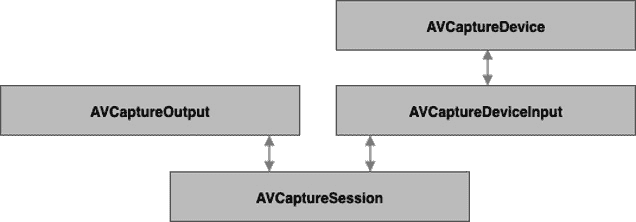
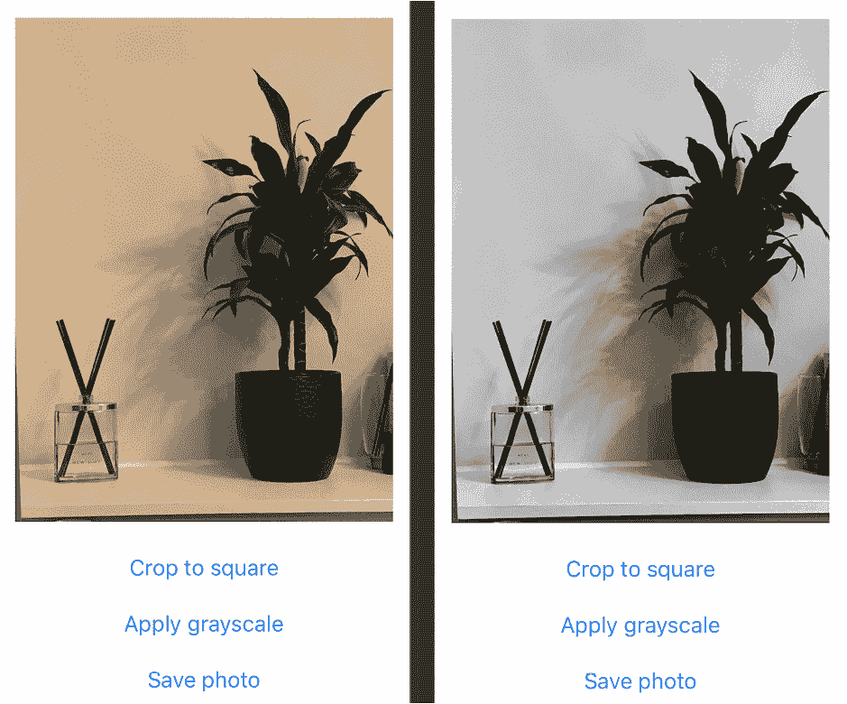
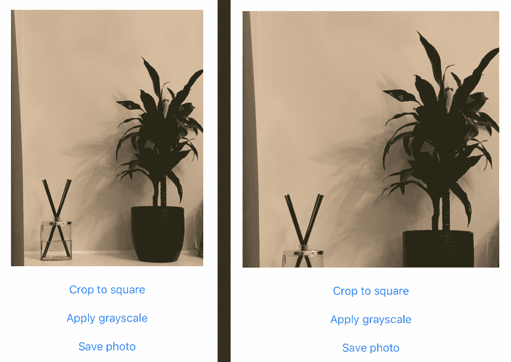

# *第十一章*：将媒体添加到您的应用程序中

人们每天使用的许多应用程序都以某种方式使用媒体。一些应用程序在用户的动态信息中展示照片和视频。其他应用程序专注于播放音频或视频，同时也有一些应用程序允许用户录制媒体并与他们的同伴分享。你可能至少能说出两三个非常著名的应用程序，它们以某种方式使用此类媒体。

由于媒体在人们的日常生活中具有如此显著的存在感，了解如何将媒体集成到自己的应用程序中是很好的。iOS 对媒体播放提供了出色的支持，并提供了多种创建和消费不同类型媒体的方法。一些方法提供了较少的灵活性，但实现起来更直接。其他方法更复杂，但为你作为开发者提供了显著的力量。

在本章中，你将了解在 iOS 上播放和录制媒体的好几种方法。你将学习如何播放和录制视频、播放音频、拍照，甚至还将学习如何使用苹果的 Core Image 框架对图像应用滤镜。本章涵盖了以下主题：

+   播放音频和视频

+   录制视频和拍照

+   使用 Core Image 处理照片

到本章结束时，你将拥有一个坚实的基础，你可以在此基础上为你的用户创建引人入胜的体验，使他们不仅能够查看内容，还能在你的应用程序中创建自己的内容。

# 技术要求

本章的代码包包括两个起始项目，分别称为 `Captured_start` 和 `MediaPlayback_start`。你可以在代码包仓库中找到它们：

[`github.com/PacktPublishing/Mastering-iOS-14-Programming-4th-Edition`](https://github.com/PacktPublishing/Mastering-iOS-14-Programming-4th-Edition)

# 播放音频和视频

为了使播放音频和视频文件尽可能简单直接，苹果创建了 `AVFoundation` 框架。这个框架包含了许多辅助类，它们提供了对 iOS 播放音频和视频文件的低级别控制。你可以使用 `AVFoundation` 来构建一个功能丰富的自定义媒体播放器，以满足你的需求。

如果你正在寻找一种更简单的方法将媒体集成到你的应用程序中，`AVKit` 框架可能正是你所需要的。`AVKit` 包含了几个辅助工具，它们建立在 `AVFoundation` 组件之上，以提供一个支持许多功能（如字幕、AirPlay 等）的优秀默认播放器。

在本节中，你将学习如何使用 `AVKit` 框架中的 `AVPlayerViewController` 实现一个简单的视频播放器。你还将实现一个更复杂的音频播放器，使用 `AVFoundation` 组件在后台播放音频，并在锁屏上显示当前播放的音频轨道。

要跟随示例，你应该打开本章代码包中的 `MediaPlayback_start` 项目。起始应用包含一个带有标签栏和两个页面的简单界面。你将在一个页面上实现视频播放器，在另一个页面上实现音频播放器。音频页面包含一些预定义的控件和动作，你将在稍后实现。

## 创建简单的视频播放器

实现视频播放器的第一步是获取一个视频文件。你可以使用任何编码为 `h.264` 格式的视频。一个很好的示例视频是由 Blender 基金会创建的 **Big Buck Bunny** 示例电影。你可以在以下网址找到这个视频：[`bbb3d.renderfarming.net/download.html`](http://bbb3d.renderfarming.net/download.html)。如果你想用这个视频进行练习，请确保下载视频的 2D 版本。

如前所述，你将使用 `AVPlayerViewController` 来实现视频播放器。这个视图控制器围绕 `AVFoundation` 的几个组件提供了一个方便的包装，同时也提供了默认的视频控件，因此你不需要从头开始构建整个视频播放器，就像你稍后为音频播放器所做的那样。

`AVPlayerViewController` 具有高度的可配置性，这意味着你可以选择播放器是否支持 AirPlay、显示播放控件、视频播放时是否应该全屏，以及更多。要获取完整的配置选项列表，你可以参考 Apple 的 `AVPlayerViewController` 文档。

一旦找到你的测试视频，你应该将其添加到 `MediaPlayback` 项目中，并确保视频已添加到应用目标中。你可以按照以下步骤操作：

1.  点击你的项目。

1.  点击你的目标。

1.  选择 **构建阶段**。

1.  展开 **复制资源包**。

1.  点击 **+** 并选择你的文件。

在完成此操作后，打开 `VideoViewController.swift` 并添加以下行以导入 `AVKit`:

```swift
import AVKit
```

你还应该在 `VideoViewController` 中添加一个属性来保存你的视频播放器实例。将以下行添加到 `VideoViewController` 类中以实现此功能：

```swift
let playerController = AVPlayerViewController()
```

由于 `AVPlayerViewController` 是 `UIViewController` 的子类，你应该将其添加到 `VideoViewController` 中作为子视图控制器。这样做将确保 `VideoViewController` 将任何视图控制器生命周期事件（如 `viewDidLoad()`），以及任何在特性集合中的变化等转发给视频播放器。为此，请将以下代码添加到 `VideoViewController` 中的 `viewDidLoad()` 方法：

```swift
// 1
addChild(playerController)
playerController.didMove(toParent: self)
// 2
view.addSubview(playerController.view)
let playerView = playerController.view!
playerView.translatesAutoresizingMaskIntoConstraints = false
NSLayoutConstraint
  .activate([
    playerView.widthAnchor.constraint(equalTo: view.widthAnchor, constant: -20),
    playerView.heightAnchor.constraint(equalTo: playerView.widthAnchor, multiplier: 9/16),
    playerView.centerXAnchor.constraint(equalTo: view.centerXAnchor),
    playerView.centerYAnchor.constraint(equalTo: view.centerYAnchor)
])
```

之前的代码片段将视频播放器添加到视频视图控制器作为子视图控制器。当你添加一个视图控制器作为子视图控制器时，你必须始终在子控制器上调用`didMove(toParent:)`以确保它知道它已被添加为另一个视图控制器的子视图控制器。在将视频播放器作为子视图控制器添加后，视频播放器的视图被添加为视频视图控制器的子视图，并设置了一些约束来定位播放器视图。

要创建视频播放器实例并在你的视图控制器中显示它，你需要做以下所有事情。最后一步是获取你的视频文件的引用，创建一个指向视频文件的`AVPlayer`实例，并将其分配给播放器。添加以下代码来完成此操作：

```swift
let url = Bundle.main.url(forResource: "samplevideo", withExtension: "mp4")!
playerController.player = AVPlayer(url: url)
```

之前的代码查找名为`samplevideo.mp4`的视频文件，并为该文件获取一个 URL。然后它创建一个指向该视频文件的`AVPlayer`实例，并将其分配给视频播放器。`AVPlayer`对象负责播放视频文件。`AVPlayerViewController`实例使用`AVPlayer`实例来播放视频，并在内部管理视频的实际播放。

如果你以这种方式添加播放器后运行你的应用程序，你会发现视频播放得非常完美，并且你可以访问你可能需要的所有控件。这是一个很好的演示，说明了将基本媒体集成添加到你的应用程序是多么简单。下一步会稍微复杂一些。你将直接使用`AVAudioPlayer`实例来播放一个音频文件，该文件通过几个自定义媒体控件进行控制。播放器甚至可以在后台播放音频，并与锁屏集成以显示当前文件的详细信息。换句话说，你将构建一个简单的音频播放器，它做用户期望它做的所有事情。

重要提示

在模拟器中启动时，`AVKit`和大型电影文件可能需要一些时间来加载。尝试在真实设备上运行。

## 创建音频播放器

在你能够实现你的音频播放器之前，你需要获取一些你希望在播放器中使用的`.mp3`文件。如果你电脑上没有音频文件，你可以从[`freemusicarchive.org/`](https://freemusicarchive.org/)网站获取一些文件，以获取一些你想要用于播放的免费歌曲。确保将它们添加到`MediaPlayer` Xcode 项目中，并确保它们包含在应用程序目标中。

你将按照以下步骤构建音频播放器：

1.  实现必要的控件以启动和停止播放器以及导航到下一首和上一首歌曲。

1.  实现时间刮擦器。

1.  读取文件的元数据并将其显示给用户。

用户界面、输出和操作已经设置好了，所以在跟随音频播放器的实现之前，请确保熟悉现有的代码。

### 实现基本的音频控制

在实现音频播放器代码之前，你需要做一些准备工作。为了能够播放音频，你需要一个播放器将要播放的文件列表。除了这个列表，你还需要跟踪用户当前正在播放的歌曲，以便你可以确定下一首和上一首歌曲。最后，你还需要有音频播放器本身。你将使用`AVAudioPlayer`对象自己构建自己的音频播放器。`AVAudioPlayer`非常适合实现一个简单的音频播放器，该播放器可以播放几个本地的`.mp3`文件。它提供了一些方便的辅助方法，可以轻松调整播放器的音量、跳转到歌曲中的特定时间戳等。

在`AudioViewController.swift`中定义以下属性：

```swift
let files = ["one", "two", "three"]
var currentTrack = 0
var audioPlayer: AVAudioPlayer!
```

此外，别忘了添加导入：

```swift
import AVKit
```

确保将文件数组替换为你用于自己的音频文件的文件名。在此点`audioPlayer`还没有值。你将在设置音频播放器时进行设置。

在你能够播放音频之前，你需要获取一个媒体文件的引用并将其提供给`AVAudioPlayer`对象。任何你想加载新媒体文件的时候，你都必须创建一个新的音频播放器实例，因为一旦文件开始播放，你无法更改当前文件。向`AudioViewController`添加以下辅助方法以加载当前曲目并创建`AVAudioPlayer`实例：

```swift
func loadTrack() {
  let url = Bundle.main.url(forResource: files[currentTrack], withExtension: "mp3")!
  audioPlayer = try! AVAudioPlayer(contentsOf: url)
  audioPlayer.delegate = self
}
```

此方法读取当前曲目的文件名并检索其本地 URL。然后，使用此 URL 在`AudioViewController`中创建并设置`audioPlayer`属性。视图控制器也被分配为音频播放器的代理。你目前不会实现任何代理方法，但你可以添加以下扩展，以确保`AudioViewController`符合`AVAudioPlayerDelegate`协议，从而确保你的代码可以编译：

```swift
extension AudioViewController: AVAudioPlayerDelegate {
}
```

现在，在`viewDidLoad()`中调用`loadTrack()`以实例化`audioPlayer`并加载第一首歌曲。向`AudioViewController`添加以下方法：

```swift
override func viewDidLoad() {
  super.viewDidLoad()
  loadTrack()
}
```

当你添加支持导航到下一首和上一首曲目时，你将实现`AVAudioPlayerDelegate`的一个方法。

向音频视图控制器添加以下两个方法以支持播放和暂停当前音频文件：

```swift
func startPlayback() {
  audioPlayer.play()
  playPause.setTitle("Pause", for: .normal)
}
func pausePlayback() {
  audioPlayer.pause()
  playPause.setTitle("Play", for: .normal)
}
```

这些方法相对简单。它们调用音频播放器的`play()`和`pause()`方法，并更新按钮的标签，以便反映当前播放器的状态。为`playPauseTapped()`添加以下实现，以便在用户点击播放/暂停按钮时调用播放和暂停方法：

```swift
@IBAction func playPauseTapped() {
  if audioPlayer.isPlaying {
    pausePlayback()
  } else {
    startPlayback()
  }
}
```

如果你现在运行应用程序，你可以点击播放/暂停按钮来开始和停止当前播放的文件。确保你的设备不是静音模式，因为当设备处于静音模式时，你的应用程序的音频会被静音。你将在实现后台播放音频的功能时学习如何解决这个问题。下一步是添加播放下一曲和上一曲的支持。将以下两个实现添加到 `AudioViewController` 中以实现这一点：

```swift
@IBAction func nextTapped() {
  currentTrack += 1
  if currentTrack >= files.count {
    currentTrack = 0
  }
  loadTrack()
  audioPlayer.play()
}
@IBAction func previousTapped() {
  currentTrack -= 1
  if currentTrack < 0 {
    currentTrack = files.count - 1
  }
  loadTrack()
  audioPlayer.play()
}
```

上述代码调整当前曲目索引，加载新曲目，并立即播放。请注意，每次用户点击下一曲或上一曲按钮时，都必须通过调用 `loadTrack()` 创建一个新的音频播放器。如果你现在运行应用程序，你可以播放音频，暂停它，并跳转到下一曲或上一曲。

当你允许一首完整的歌曲播放时，它之后不会自动跳转到下一首。为了实现这一点，你需要为 `AVAudioPlayerDelegate` 中的 `audioPlayerDidFinishPlaying(_:successfully:)` 方法添加一个实现。将以下实现添加到调用 `nextTapped()`，以便在当前歌曲结束时自动播放下一首：

```swift
func audioPlayerDidFinishPlaying(_ player: AVAudioPlayer, successfully flag: Bool) {
  nextTapped()
}
```

现在第一项功能已经实现，下一步是实现时间刮擦器，它显示当前歌曲的进度并允许用户调整播放头的位置。

### 实现时间刮擦器

音频播放器应用的用户界面已经包含了一个与视图控制器中以下三个动作相连的刮擦器：

+   `sliderDragStart()`

+   `sliderDragEnd()`

+   `sliderChanged()`

当音频文件正在播放时，刮擦器应该自动更新以反映歌曲中的当前位置。然而，当用户开始拖动刮擦器时，它不应更新其位置，直到用户选择了刮擦器的新位置。当用户完成拖动刮擦器后，它应根据歌曲的进度再次调整自己。每当滑动条的值发生变化时，音频播放器应调整播放头，以便歌曲的进度与刮擦器匹配。

不幸的是，`AVAudioPlayer` 对象没有公开任何代理方法来观察当前音频文件的进度。为了定期更新刮擦器，你可以实现一个定时器，每秒更新刮擦器到音频播放器的当前位置。将以下属性添加到 `AudioViewController` 中，以便在创建定时器后保留它：

```swift
var timer: Timer?
```

此外，将以下两个方法添加到 `AudioViewController` 中，作为在用户开始拖动刮擦器或文件开始播放时启动定时器，以及当用户停止拖动刮擦器或播放暂停时停止定时器或保留资源的便捷方式：

```swift
func startTimer() {
  timer = Timer.scheduledTimer(withTimeInterval: 1, repeats: true) { [unowned self] timer in
    self.slider.value = Float(self.audioPlayer.currentTime / self.audioPlayer.duration)
  }
}
func stopTimer() {
  timer?.invalidate()
}
```

在`startPlayback()`方法中添加对`startTimer()`的调用，并在`pausePlayback()`方法中添加对`stopTimer()`的调用。如果你完成这些操作后运行应用，进度条将在歌曲开始播放时立即开始更新其位置。然而，拖动进度条的功能还没有实现。添加以下拖动进度条动作的实现以启用手动拖动：

```swift
@IBAction func sliderDragStart() {
  stopTimer()
}
@IBAction func sliderDragEnd() {
  startTimer()
}
@IBAction func sliderChanged() {
  audioPlayer.currentTime = Double(slider.value) * audioPlayer.duration
}
```

上述方法相对简单，但它们提供了一个非常强大的功能，立即让你的自制音频播放器感觉像你每天可能会使用的音频播放器。实现音频播放器功能的最后一步是显示当前歌曲的元数据。

### 显示歌曲元数据

大多数`.mp3`文件都包含 ID3 标签形式的元数据。这些元数据标签被诸如 iTunes 之类的应用程序用于提取有关歌曲的信息并显示给用户，以及用于对音乐库进行分类或过滤。你可以通过将音频文件加载到`AVPlayerItem`对象中并提取其内部`AVAsset`实例的元数据来通过代码访问音频文件的元数据。`AVAsset`对象包含有关媒体项的信息，例如其类型、位置等。当你使用`AVPlayerItem`对象加载文件时，它将自动为你创建相应的`AVAsset`对象。

单个资产可以在元数据字典中包含大量的元数据。幸运的是，苹果已经将所有有效的 ID3 元数据标签捕获在`AVMetadataIdentifier`对象中，因此一旦你提取了`AVAsset`实例的元数据，你就可以遍历其所有元数据来筛选出你需要的数据。以下方法就是这样做的，并将提取的值设置在`AudioViewController`的`titleLabel`变量上，如下所示：

```swift
func showMetadataForURL(_ url: URL) {
  let mediaItem = AVPlayerItem(url: url)
  let metadata = mediaItem.asset.metadata
  var information = [String]()
  for item in metadata {
    guard let identifier = item.identifier else { continue }
    switch identifier {
      case .id3MetadataTitleDescription, .id3MetadataBand:
        information.append(item.value?.description ?? "")
      default:
        break
    }
  }
  let trackTitle = information.joined(separator: " - ")
  titleLabel.text = trackTitle
}
```

确保从`loadTrack()`方法中调用此方法，并将你在`loadTrack()`中获得的音频文件 URL 传递给`showMetadataForURL(_:)`。如果你现在运行你的应用，你的基本功能应该都已经有了。元数据应该被正确显示，进度条应该可以工作，你应该能够跳过歌曲或暂停播放。

尽管你的媒体播放器看起来在这个阶段已经相当完善了，但你有没有注意到当你将应用发送到后台时音乐会暂停？为了让你的应用更像一个真正的音频播放器，你应该实现后台音频播放，并确保当前播放的歌曲显示在用户的锁屏上，类似于 iOS 的本地音乐应用的工作方式。这正是你接下来要添加的功能。

## 在后台播放媒体

在 iOS 中，后台播放音频需要特殊权限，您可以在应用的**功能**选项卡中启用这些权限。如果您启用了**后台模式**功能，可以选择**音频、AirPlay 和画中画**选项，使您的应用有资格在后台播放音频。以下截图显示了启用后台播放音频的功能：

![Figure 11.1 − Background Modes

![img/Figure_11.1_B14717.jpg]

图 11.1 − 后台模式

如果您想添加对后台音频播放的适当支持，您需要实现以下三个功能：

+   设置音频会话，以便音频在后台继续播放。

+   将元数据提交给“正在播放”信息中心。

+   响应来自远程源（如锁屏）的播放操作。

您只需两行代码即可为您的应用设置音频会话。当您创建音频会话时，iOS 会将您的应用播放的音频处理得略有不同；例如，即使设备设置为静音，您的歌曲也会播放。它还确保在您设置了适当的配置后，您的音频在应用处于后台时播放。将以下代码添加到`viewDidLoad()`中，以设置应用的音频会话：

```swift
try? AVAudioSession.sharedInstance().setCategory(.playback, mode: .default, options: [.allowAirPlay])
try? AVAudioSession.sharedInstance().setActive(true, options: [])
```

需要添加的第二个功能是提供关于当前播放曲目信息。关于当前播放媒体文件的所有信息都应该传递给`MPNowPlayingInfoCenter`对象。该对象是`MediaPlayer`框架的一部分，负责在锁屏和命令中心显示用户关于当前播放媒体文件的信息。在将信息传递给“正在播放”信息中心之前，请确保在`AudioViewController.swift`文件的顶部导入`MediaPlayer`框架：

```swift
import MediaPlayer
```

接下来，将以下行代码添加到`viewDidLoad()`中：

```swift
NotificationCenter.default.addObserver(self, selector: #selector(updateNowPlaying), name: UIApplication.didEnterBackgroundNotification, object: nil)
```

在`MPNowPlayingInfoCenter`的文档中，Apple 表示，当应用进入后台时，您应该始终将最新的“正在播放”信息传递给信息中心。为此，音频视图控制器应监听`UIApplication.didEnterBackgroundNotification`通知，以便能够响应应用进入后台。将以下实现添加到`AudioVideoController`中的`updateNowPlaying()`方法：

```swift
@objc func updateNowPlaying() {
  var nowPlayingInfo = [String: Any]()
  nowPlayingInfo[MPMediaItemPropertyTitle] = titleLabel.text ?? "untitled"
  nowPlayingInfo[MPNowPlayingInfoPropertyElapsedPlaybackTime] = audioPlayer.currentTime
  nowPlayingInfo[MPMediaItemPropertyPlaybackDuration] = audioPlayer.duration
  MPNowPlayingInfoCenter.default().nowPlayingInfo = nowPlayingInfo
}
```

之前的代码配置了一个包含当前播放文件元数据的字典，并将其传递给“正在播放”信息中心。当应用进入后台时，此方法会自动调用，但您也应该在开始播放新歌曲时更新“正在播放”信息。在`loadTrack()`方法中添加对`updateNowPlaying()`的调用，以确保每次加载新曲目时都会更新“正在播放”信息。

下一步和最后一步是响应远程命令。当用户在锁屏上点击播放/暂停按钮、下一按钮或上一按钮时，这将被发送到您的应用作为远程命令。您应该明确定义 iOS 在远程命令发生时应调用的处理程序。将以下方法添加到`AudioViewController`中，以添加对远程命令的支持：

```swift
func configureRemoteCommands() {
  let commandCenter = MPRemoteCommandCenter.shared()
  commandCenter.playCommand.addTarget { [unowned self] event in
    guard self.audioPlayer.isPlaying == false else { return .commandFailed }
    self.startPlayback()
    return .success
  }
  commandCenter.pauseCommand.addTarget { [unowned self] event in
    guard self.audioPlayer.isPlaying else { return .commandFailed }
    self.pausePlayback()
    return .success
  }
  commandCenter.nextTrackCommand.addTarget { [unowned self] event in
    self.nextTapped()
    return .success
  }
  commandCenter.previousTrackCommand.addTarget { [unowned self] event in
    self.previousTapped()
    return .success
  }
  UIApplication.shared.beginReceivingRemoteControlEvents()
}
```

上述代码获取远程命令中心的引用并注册了几个处理程序。它还在应用程序对象上调用`beginReceivingRemoteControlEvents()`以确保它接收远程命令。在`viewDidLoad()`中添加对`configureRemoteCommands()`的调用，以确保应用在音频播放器配置后立即开始接收远程命令。作为练习，尝试自己实现控制时间刮擦器和从锁屏发送的`+15`和`-15`命令。

尝试运行您的应用并将其发送到后台。您应该能够从控制中心和锁屏控制媒体播放。当您跳转到下一首或上一首歌曲时，可见的元数据应正确更新，并且刮擦器应准确表示歌曲播放的当前位置。

到目前为止，您已经实现了一个功能相对完整且行为相当复杂的音频播放器。在 iOS 上探索媒体的下一步是发现您如何拍照和录制视频。

# 录制视频和拍照

除了播放现有媒体外，您还可以创建允许用户创建自己内容的 App。在本节中，您将了解如何使用内置组件来启用用户拍照。您还将了解如何使用原始视频流来录制视频。如果您想跟随本节中的示例，请确保从本章的代码包中获取`Captured`的起始项目。

起始项目包含几个视图控制器和一些连接的输出和动作。请注意，项目中还有一个`UIViewController`扩展。

此扩展包含一个辅助方法，使得向用户显示警报变得稍微简单一些。此扩展将用于显示一个警报，通知用户当他们的照片或视频存储在相机胶卷中时。

由于用户的相机和照片库被认为非常敏感，您需要确保将以下与隐私相关的键添加到应用的`Info.plist`中：

+   **隐私 - 摄像头使用描述**：此属性是访问摄像头所必需的，以便您可以拍照和录制视频。

+   **隐私 - 麦克风使用描述**：您必须添加此属性，以便您的视频能够录制音频，以及图像。

+   **隐私 - 照片库添加使用描述**：此属性允许您将照片写入用户的照片库。

确保为隐私键提供良好的描述，以便用户知道为什么你需要访问他们的相机、麦克风和照片库。你的描述越好，用户允许你的应用程序访问相关隐私敏感信息的可能性就越大。在添加键之后，你就可以看到如何使用 UIKit 内置的`UIImagePickerController`组件拍照了。

## 拍照和存储图像

当你需要用户提供图像时，他们可以通过从他们的照片库中选择图像或通过使用相机拍照来实现。`UIImagePickerController`支持两种选择图像的方式。在本节中，你将学习如何允许用户使用相机拍照。只要记得添加`Info.plist`，将示例更改为允许用户从他们的照片库中选择图像应该是简单的。

将以下`viewDidLoad()`的实现添加到`ImageViewController`类中：

```swift
override func viewDidLoad() {
  super.viewDidLoad()
  let imagePicker = UIImagePickerController()
  imagePicker.sourceType = .camera
  imagePicker.delegate = self
  present(imagePicker, animated: true, completion: nil)
}
```

之前的实现创建了一个`UIImagePickerController`对象的实例，并配置它使用相机作为图像源，并将其展示给用户。请注意，视图控制器被设置为图像选择器的代理。

当用户拍照时，图像选择器会通知其代理，以便它可以提取图像并使用它。在这种情况下，图像应赋予视图控制器中的`selectedImage`标签，以便可以在图像视图中显示，并在用户点击保存按钮时保存，并调用`saveImage()`方法作为结果。

添加以下扩展使`ImageViewController`符合`UIImagePickerControllerDelegate`：

```swift
extension ImageViewController: UIImagePickerControllerDelegate, UINavigationControllerDelegate {
  func imagePickerController(_ picker: UIImagePickerController, didFinishPickingMediaWithInfo info: [UIImagePickerController.InfoKey : Any]) {
    picker.dismiss(animated: true, completion: nil)
    guard let image = info[.originalImage] as? UIImage else { return }
    selectedImage = image
  }
}
```

注意，此扩展还使图像视图控制器符合`UINavigationControllerDelegate`。图像选择器控制器的代理属性要求所有代理都符合`UINavigationControllerDelegate`和`UIImagePickerControllerDelegate`。

当用户使用相机拍照后，会调用`imagePickerController(_:didFinishPickingMediaWithInfo)`来通知代理关于用户所拍摄的照片。前面代码所做的第一件事是关闭选择器，因为它不再需要。用户刚刚拍摄的照片作为原始图像存储在`info`字典中。当从字典中提取图像时，它被设置为`selectedImage`。

要存储图像，请添加以下`saveImage()`的实现：

```swift
@IBAction func saveImage() {
  guard let image = selectedImage else { return }
  UIImageWriteToSavedPhotosAlbum(image, self, #selector(didSaveImage(_:withError:contextInfo:)), nil)
}
@objc func didSaveImage(_ image: UIImage, withError error: Error?, contextInfo: UnsafeRawPointer) {
  guard error == nil else { return }
  presentAlertWithTitle("Success", message: "Image was saved succesfully")
}
```

前面代码调用`UIImageWriteToSavedPhotosAlbum(_:_:_:)`将图像存储在用户的照片库中。当保存操作完成后，将调用`didSaveImage(_:withError:contextInfo:)`方法。如果没有接收到任何错误，则表示照片已成功存储在照片库中，并显示一个警告。

允许用户通过实现 `UIImagePickerController` 来拍照相对简单，这是在不费太多力气的情况下在您的应用中实现相机功能的好方法。有时，您可能需要更高级的相机访问权限。在这些情况下，您可以使用 `AVFoundation` 来获取来自摄像头的原始视频流，正如您接下来将看到的。

## 录制和存储视频

在上一节中，您使用了 `AVFoundation` 来构建一个简单的音频播放器应用。现在，您将再次使用 `AVFoundation`，但这次不是播放视频或音频，而是录制视频并将其存储在用户的照片库中。当使用 `AVFoundation` 来录制视频流时，您使用的是一个 `AVCaptureSession` 对象。捕获会话负责从一个或多个 `AVCaptureDeviceInput` 对象获取输入并将其写入 `AVCaptureOutput` 子类。

以下图表展示了通过 `AVCaptureSession` 录制媒体所涉及的对象：



图 11.2 − AVCaptureSession 实体

要开始实现视频录制功能，请确保在 `RecordVideoViewController.swift` 文件中导入 `AVFoundation`。同时，将以下属性添加到 `RecordVideoViewController` 类中：

```swift
let videoCaptureSession = AVCaptureSession()
let videoOutput = AVCaptureMovieFileOutput()
var previewLayer:  AVCaptureVideoPreviewLayer?
```

大多数前面的属性应该看起来很熟悉，因为它们也出现在了展示与 `AVCaptureSession` 相关组件的截图里。注意，`AVCaptureMovieFileOutput` 是 `AVCaptureOutput` 的一个子类，专门用于捕获视频。预览层将在运行时用于渲染视频流，并将其展示给用户，以便他们可以看到通过摄像头捕捉到的内容。

下一步是为摄像头和麦克风设置 `AVCaptureDevice` 对象，并将它们与 `AVCaptureSession` 关联起来。将以下代码添加到 `viewDidLoad()` 方法中：

```swift
override func viewDidLoad() {
  super.viewDidLoad()
  // 1
  guard let camera = AVCaptureDevice.default(.builtInWideAngleCamera, for: .video, position: .back),
  let microphone = AVCaptureDevice.default(.builtInMicrophone, for: .audio, position: .unspecified) else { return }
  // 2
  do {
    let cameraInput = try AVCaptureDeviceInput(device: camera)
    let microphoneInput = try AVCaptureDeviceInput(device: microphone)
    videoCaptureSession.addInput(cameraInput)
    videoCaptureSession.addInput(microphoneInput)
    videoCaptureSession.addOutput(videoOutput)
  } catch {
    print(error.localizedDescription)
  }
}
```

上述代码首先获取用于录制视频和音频的摄像头和麦克风的引用。第二步是创建与摄像头和麦克风关联的 `AVCaptureDeviceInput` 对象，并将它们与捕获会话关联起来。视频输出也被添加到视频捕获会话中。如果您检查之前看到的截图并与上述代码片段进行比较，您会发现这四个组件都存在于这个实现中。

下一步是为用户提供一个视图，显示当前的摄像头流，以便他们可以看到正在录制的内容。在捕获会话设置代码之后，将以下代码添加到 `viewDidLoad()` 中：

```swift
previewLayer = AVCaptureVideoPreviewLayer(session: videoCaptureSession)
previewLayer?.videoGravity = .resizeAspectFill
videoView.layer.addSublayer(previewLayer!)
videoCaptureSession.startRunning()
```

上述代码设置了预览层并将其与视频捕获会话关联。预览层将直接使用捕获会话来渲染相机视频流。然后启动捕获会话。这并不意味着录制会话开始；而是仅表示捕获会话将开始处理来自其相机和麦克风输入的数据。

在此阶段，预览层被添加到视图中，但它尚未覆盖视频视图。请向`RecordVideoViewController`中的`viewDidLayoutSubviews()`方法添加以下实现，以设置预览层的大小和位置，使其与`videoView`的大小和位置相匹配：

```swift
override func viewDidLayoutSubviews() {
  super.viewDidLayoutSubviews()
  previewLayer?.bounds.size = videoView.frame.size
  previewLayer?.position = CGPoint(x: videoView.frame.midX, y:videoView.frame.size.height / 2)
}
```

现在运行应用程序将显示相机视频流。然而，点击录制按钮目前不起作用，因为你还没有实现`startStopRecording()`方法。为此方法添加以下实现：

```swift
@IBAction func startStopRecording() {
  // 1
  if videoOutput.isRecording {
    videoOutput.stopRecording()
  } else {
    // 2
    guard let path = FileManager.default.urls(for: .documentDirectory, in: .userDomainMask).first else { return }
    let fileUrl = path.appendingPathComponent("recording.mov")
    // 3
    try? FileManager.default.removeItem(at: fileUrl)
    // 4
    videoOutput.startRecording(to: fileUrl, recordingDelegate: self)
  }
}
```

让我们逐步回顾前面的代码片段，看看到底发生了什么：

1.  首先，检查视频输出的`isRecording`属性。如果当前有活动录制，则应停止录制。

1.  如果当前没有活动录制，将创建一个新的路径以临时存储视频。

1.  由于视频输出无法覆盖现有文件，`FileManager`对象应尝试删除临时视频文件路径上的任何现有文件。

1.  视频输出将开始将录制保存到临时文件。视图控制器本身作为委托传递，以便在录制开始和停止时接收通知。

由于`RecordVideoViewController`尚未遵守`AVCaptureFileOutputRecordingDelegate`协议，你应该添加以下扩展以添加对`AVCaptureFileOutputRecordingDelegate`协议的遵守：

```swift
extension RecordVideoViewController: AVCaptureFileOutputRecordingDelegate {
  // 1
  func fileOutput(_ output: AVCaptureFileOutput, didStartRecordingTo fileURL: URL, from connections: [AVCaptureConnection]) {
    startStopButton.setTitle("Stop Recording", for: .normal)
  }
  // 2
  func fileOutput(_ output: AVCaptureFileOutput, didFinishRecordingTo outputFileURL: URL, from connections: [AVCaptureConnection], error: Error?) {
    guard error == nil else { return }
    UISaveVideoAtPathToSavedPhotosAlbum(outputFileURL.path, self, #selector(didSaveVideo(at:withError:contextInfo:)), nil)
  }
  // 3
  @objc func didSaveVideo(at path: String, withError error: Error?, contextInfo: UnsafeRawPointer?) {
    guard error == nil else { return }
    presentAlertWithTitle("Success", message: "Video was saved succesfully")
    startStopButton.setTitle("Start Recording", for: .normal)
  }
}
```

上述扩展包含三个方法。第一个是委托方法，在视频输出开始录制时调用。当录制开始时，`startStopButton`按钮的标题更新以反映当前状态。第二个方法也是委托方法。当录制完成时调用此方法。如果没有发生错误，视频将存储在之前设置的临时位置。然后调用`UISaveVideoAtPathToSavedPhotosAlbum(_:_:_:_:)`，将视频从临时位置移动到用户的照片库。此方法与您用于存储图片的`UIImageWriteToSavedPhotosAlbum(_:_:_:_:)`方法非常相似。扩展中的第三个也是最后一个方法在视频存储在用户的照片库中时调用。当视频成功存储后，会显示一个警报，并且`startStopButton`按钮的标题再次更新。

现在，你可以运行应用并录制一些视频了！尽管你已经通过直接使用 `AVCaptureSession` 实现视频录制逻辑进行了大量的手动工作，但大部分困难的工作都是在 `AVFoundation` 框架内部完成的。最后，我们探索一个与媒体相关的功能，即使用 **Core Image** 对图像应用视觉滤镜。在许多应用中，对图像应用滤镜是一个非常流行的功能，它可以使得你的照片应用更具吸引力。

# 使用 Core Image 操作照片

在本章中，你已经看到了 iOS 在录制和播放媒体方面具有强大的功能。在本节中，你将学习如何使用 Core Image 操作图像。Core Image 框架提供了许多不同的滤镜，你可以使用这些滤镜处理图像和视频。你将扩展在 `Captured` 应用中实现的拍照功能，以便用户可以对图像进行灰度处理和裁剪。

你应用于图像的每个 Core Image 滤镜都是 `CIFilter` 类的一个实例。你可以按照以下方式创建滤镜实例：

```swift
let filter = CIFilter(name: "CIPhotoEffectNoir")
```

滤镜初始化器中的 `name` 参数预期是一个字符串，它引用了一个特定的滤镜。你可以参考 Apple 的 Core Image 文档和 Core Image 滤镜参考指南，以查看你可以在应用中使用的所有滤镜的概述。

每个滤镜都有一个特定的参数集，你需要设置在 `CIFilter` 实例上以使用该滤镜；例如，灰度滤镜要求你提供一个输入图像。其他滤镜可能需要强度、位置或其他属性。了解如何将滤镜应用于图像的最佳方式是通过示例。将以下实现添加到 `ImageViewController.swift` 中的 `applyGrayScale()` 方法，以实现灰度滤镜：

```swift
@IBAction func applyGrayScale() {
  // 1
  guard let cgImage = selectedImage?.cgImage,
  // 2
  let initialOrientation = selectedImage?.imageOrientation,
  // 3
  let filter = CIFilter(name: "CIPhotoEffectNoir") else { return }
  // 4
  let sourceImage = CIImage(cgImage: cgImage)
  filter.setValue(sourceImage, forKey: kCIInputImageKey)
  // 5
  let context = CIContext(options: nil)
  guard let outputImage = filter.outputImage, let cgImageOut = context.createCGImage(outputImage, from: outputImage.extent) else { return }
  // 6
  selectedImage = UIImage(cgImage: cgImageOut, scale: 1, orientation: initialOrientation)
}
```

之前的代码有很多有趣的小细节，用编号注释突出显示。让我们逐个查看这些注释，看看灰度滤镜是如何应用的：

1.  存储在 `selectedImage` 中的 `UIImage` 实例被转换为 `CGImage` 实例。严格来说，这种转换不是必需的，但它确实使得之后对 `UIImage` 实例应用其他滤镜变得稍微容易一些。

1.  使用 `CGImage` 而不是 `UIImage` 的一个缺点是，图像中存储的朝向信息会丢失。为了确保最终图像保持其朝向，初始朝向被存储。

1.  此步骤创建了一个灰度滤镜的实例。

1.  由于 Core Image 不直接支持 `CGImage` 实例，因此 `CGImage` 实例被转换为 `CIImage` 实例，该实例可以与 Core Image 一起使用。然后通过在滤镜上调用 `setValue(_:forKey:)` 方法，将 `CIImage` 实例分配为灰度滤镜的输入图像。

1.  第五步从滤镜中提取新的图像，并使用 `CIContext` 对象将 `CIImage` 输出导出到 `CGImage` 实例。

1.  第六步和最后一步是创建一个新的 `UIImage` 实例，基于 `CGImage` 输出。初始方向被传递到新的 `UIImage` 实例，以确保它与原始图像具有相同的方向。

即使涉及很多步骤，并且你需要在不同的图像类型之间进行相当多的转换，应用过滤器相对简单。大部分前面的代码负责在图像类型之间切换，而过滤器本身只需几行即可设置。现在尝试运行应用并拍照。初始图片将是全彩色的。在你应用灰度过滤器后，图片会自动替换为图像的灰度版本，如下面的截图所示：



图 11.3 - 灰度

你接下来要实现的过滤器是裁剪过滤器。裁剪过滤器将裁剪图像，使其成为方形，而不是肖像或风景图片。实现裁剪过滤器的过程基本上与灰度过滤器相同，只是需要传递给裁剪过滤器的值不同。将以下实现添加到 `cropSquare()` 以实现裁剪过滤器：

```swift
@IBAction func cropSquare() {
  let context = CIContext(options: nil)
  guard let cgImage = selectedImage?.cgImage, let initialOrientation = selectedImage?.imageOrientation, let filter = CIFilter(name: "CICrop") else { return }
  let size = CGFloat(min(cgImage.width, cgImage.height))
  let center = CGPoint(x: cgImage.width / 2, y: cgImage.height / 2)
  let origin = CGPoint(x: center.x - size / 2, y: center.y - size / 2)
  let cropRect = CGRect(origin: origin, size: CGSize(width: size, height: size))
  let sourceImage = CIImage(cgImage: cgImage)
  filter.setValue(sourceImage, forKey: kCIInputImageKey)
  filter.setValue(CIVector(cgRect: cropRect), forKey: "inputRectangle")
  guard let outputImage = filter.outputImage, let cgImageOut = context.createCGImage(outputImage, from: outputImage.extent) else { return }
  selectedImage = UIImage(cgImage: cgImageOut, scale: 1, orientation: initialOrientation)
  }
}
```

前面的代码执行了几个计算，以确定将图像裁剪成方形的最佳方式。`CGRect` 实例指定了裁剪坐标和大小，然后用于创建一个 `CIVector` 对象。然后，这个对象被传递给过滤器作为 `inputRectangle` 键的值。除了指定裁剪值之外，应用过滤器的过程是相同的，所以代码应该对你来说很熟悉。

如果你现在运行应用并点击裁剪按钮，图片将被裁剪，如下面的截图所示：



图 11.4 - 裁剪图像

Core Image 中有更多可用的过滤器，你可以尝试使用它们来构建相当高级的过滤器。你甚至可以将多个过滤器应用到单个图像上，为你的应用中的图片创建复杂的效果。因为所有过滤器都以非常相似的方式工作，一旦你了解了应用过滤器的一般过程，将任何过滤器应用到你的图像上就相对容易。如果你需要提醒如何应用 Core Image 过滤器，你可以始终使用前面示例中的代码。

# 摘要

在本章中，你学习了关于 iOS 中媒体的大量知识。你看到了如何仅用几行代码实现视频播放器。之后，你学习了如何直接使用`AVFoundation`构建支持如停止和恢复播放、跳过歌曲、在歌曲中前后滚动等功能的音频播放器。你甚至学习了如何在应用进入后台或手机设置为静音模式时继续播放音频。为了给音频播放器添加最后的修饰，你学习了如何使用`MediaPlayer`框架在用户的锁屏上显示当前播放的文件，以及如何响应发送到应用的远程控制事件。

在实现媒体播放后，你学习了如何构建帮助用户创建媒体的应用。你看到`UIImagePickerController`提供了一个快速简单的界面，允许用户使用相机拍照。你还学习了如何使用`AVFoundation`和一个`AVCaptureSession`对象来实现自定义的视频录制体验。最后，你学习了关于 Core Image 框架，以及如何使用它来对图像应用滤镜。

在下一章中，你将学习关于位置服务以及如何在你的应用中使用 Core Location 所需了解的一切。根据你应用的使用场景，正确处理用户位置可能对你的应用成功至关重要。现在，这些例子已经众所周知：食品配送应用、地图应用、运动追踪应用等等。
