# *第十四章*：为您的应用创建 App Clip

iOS 14 带来的主要功能之一是 App Clips。App Clips 为用户提供了一种快速的新方式来发现和使用您应用提供的内容。通过从二维码、链接、NFC 标签或其他机制触发 App Clip，它可以在几秒钟内出现在用户的设备上（即使没有安装您的应用），并使您应用的一些功能立即变得可用。

在本章中，我们将学习什么是 App Clip，它们用于什么，以及用户在使用它们时的体验将如何。我们将回顾用户可以用来触发它们的各种选项。然后，我们将开发一个 App Clip，并学习如何使用 App Store Connect 的新功能对其进行配置。最后，我们将学习如何使用本地体验来测试它们。到本章结束时，您将能够开发自己的 App Clips 并将您的应用提升到新的水平。

让我们总结本章的主题：

+   介绍 App Clips

+   开发您的第一个 App Clip

+   测试您的 App Clip 体验

让我们开始吧！

# 技术要求

本章的代码包包括三个起始项目，分别称为`AppClipExample_start`、`AppClipExample_configure_start`和`AppClipExample_test`。您可以在本书的代码包仓库中找到它们：

[`github.com/PacktPublishing/Mastering-iOS-14-Programming-4th-Edition`](https://github.com/PacktPublishing/Mastering-iOS-14-Programming-4th-Edition)

# 介绍 App Clips

**App Clips** 允许用户以快速和轻量级的方式发现应用。使用 App Clips，用户可以快速使用您应用的功能，而无需在他们的手机上安装应用。App Clip 是从您的应用中提取的一小部分功能，用户可以在不安装您的应用的情况下发现和使用。用户可以通过不同的触发器打开您的 App Clip，例如二维码、NFC 标签、消息中的链接、地图中的位置和网站中的智能横幅。App Clip 将以 App Clip Card 的形式出现在用户的首页上。App Clip Card 描述了您的 App Clip 的功能，以便用户可以选择打开和使用 App Clip 或将其关闭。让我们看看 App Clip Card 的样子：

![图 14.1 – App Clip Card![图 14.1 – App Clip Card 图 14.1 – App Clip Card 如前图所示，App Clip Card 是用户首页上的一个叠加层，显示以下内容：+   **一个标题图片，描述您的应用或 App Clip 的主要功能**：在这个例子中，标题图片是有人在准备咖啡。+   **一个标题，描述 App Clip 的功能**："Mamine Café"。+   **一个副标题，描述 App Clip 提供的功能**："三指点单咖啡"。+   **一个按钮，描述要执行的操作（例如打开/查看 App Clip）**："查看"。+   **额外信息页脚**：App Clip 的主应用。提供了一个链接到 App Store，以便用户可以下载它。App Clips 应该是轻量级的、简短的，并在几秒钟内完成用户的任务。让我们看看一些 App Clip 的使用案例：+   当您经过咖啡店门口并轻触 NFC 标签时，例如前面截图所示，一个用于订购咖啡的 App Clip。+   一个 App Clip，只需扫描停在街上的电动自行车的二维码即可租赁。您还可以使用**使用 Apple ID 登录和 Apple Pay**来避免填写表格和界面复杂性，让您在几秒钟内就能租赁自行车。+   一个 App Clip，您可以在等待入座时从餐厅菜单中预订单餐，节省您的时间。+   当你在艺术画廊或博物馆的 NFC 热点周围轻触时，会触发 App Clip，以便在您的 iPhone 上显示增强现实场景。如您所见，App Clips 的可能性是无限的。现在我们已经介绍了什么是 App Clip，我们将解释用户使用 App Clip 的旅程（从其调用到最终使用）。在描述构建 App Clip 的推荐指南之前，我们将涵盖各种调用方法（如何使 App Clip 出现）。## App Clip 用户旅程现在，让我们更详细地探索整个 App Clip 流程和步骤，从用户发现您的 App Clip 开始，到用户完成他们的 App Clip 之旅。让我们假设我们有一个租赁电动自行车的应用程序。App Clip 流程涉及几个阶段：


图 14.2 – App Clip 流程和步骤

上一张图片解释了 App Clip 的不同阶段：

1.  **调用方法**：App Clip 调用方法是用户如何触发和打开 App Clip 的方式。在我们的例子中，用户使用他们的设备摄像头扫描放置在自行车上的二维码，App Clip 就会在他们的主屏幕上打开。在这种情况下，调用方法是二维码。我们将在本章后面更详细地探讨这些内容。

1.  **用户旅程**：在调用之后，App Clip 会向用户提供一些选项供他们选择（例如，1 小时租赁 2 美元，24 小时租赁 5 美元）。用户在 App Clip 内进行他们想要的选项。

1.  **账户和支付**：在我们的自行车租赁示例中，我们的 App Clip 需要识别哪个用户在租赁自行车，并且用户需要为这项服务付费。一些 App Clip 可能不需要注册用户账户或支付即可工作；这一步是可选的。

1.  **完整应用推荐**：当做出自行车租赁的决定并且用户准备继续时，您的 App Clip 可以建议用户下载您的完整应用，这样他们下次使用您的服务时就可以使用它而不是 App Clip。建议整个应用是一个可选步骤，但建议这样做。

现在我们已经概述了 App Clip 遵循的高级步骤，我们将更仔细地查看可用的调用方法。

## App Clips 调用方法

我们已经看到，为了显示 App Clip，用户需要调用或发现它。之前，我们讨论了这可以通过二维码、NFC 标签、消息中的链接等方式完成。以下是可用选项的总结：

+   **App Clip 代码**：每个 App Clip 代码都包含一个二维码和一个 NFC 标签，以便用户可以使用他们的相机扫描它或点击它。

+   **NFC 标签**。

+   **二维码**。

+   **Safari App 标签**。

+   **消息中的链接**。

+   **在地图中放置卡片**。

+   **iOS 14 新的 App Library 中的“最近使用过的 App Clips”类别**。

在本节中，我们学习了什么是 App Clip，当用户使用它时他们的旅程是什么，以及可以用来触发它的不同调用方法。在下一节中，我们将为咖啡店构建和配置一个 App Clip。

# 开发您的第一个 App Clip

在本节中，我们将从一个现有的应用开始，并逐步向其中添加 App Clip。打开本书代码包中的 `AppClipExample_start` 项目。如果您启动该应用，您将看到我们有一个咖啡店应用，我们可以订购三种不同类型的饮料，查看订单，并通过 Apple Pay 或输入我们的信用卡详细信息进行支付：

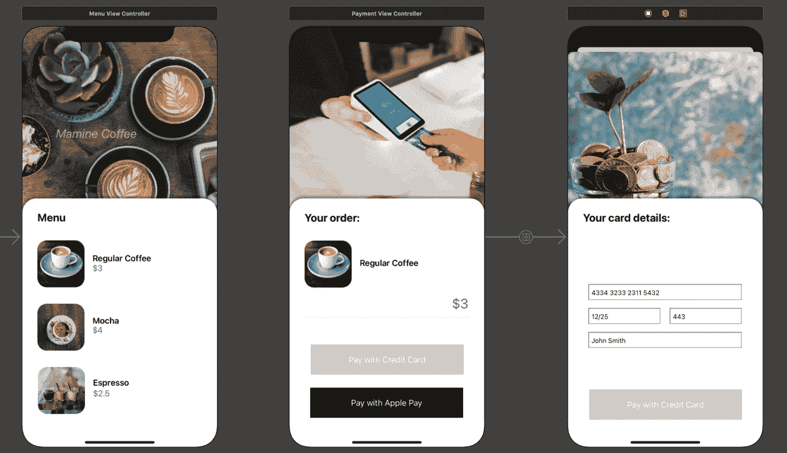

Figure 14.3 – 我们应用的主要屏幕 – 菜单、支付和信用卡控制器

注意，这个示例应用的目的是帮助我们构建有趣的部分：App Clip。一些功能，如信用卡和 Apple Pay 支付，并未完全实现；它们只是模拟了这个功能。

在我们跳入 App Clip 流程之前，让我们花一点时间来回顾一下项目的结构和内容：

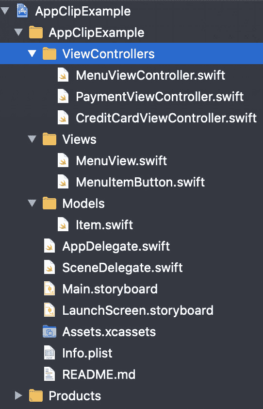

Figure 14.4 – 初始项目结构

该应用包含一个名为 `AppClipExample` 的单一目标。在该目标内部，我们拥有三个 `ViewControllers`（`MenuViewController`、`PaymentViewController` 和 `CreditCardViewController`）以及一些额外的视图（`MenuView` 和 `MenuItemButton`）。它仅包含一个名为 `Item` 的单一模型文件，该文件帮助我们处理菜单产品。我们还有其他一些常见文件，例如 `AppDelegate` 和 `Assets` – 简短且简单。然而，重要的是要记住这一点，因为当我们开始添加我们的 App Clip 时，这种架构将会演变。

在我们继续之前，请确保您在项目中使用的是您自己的 Apple 开发者账户设置。在 `AppClipExample` 目标中，执行以下操作：

1.  选择您自己的开发团队。

1.  将 App ID 更改为 `{yourDomain}.AppClipExample`。

在下一节中，我们将为我们的咖啡店应用创建 App Clip。我们将首先为 App Clip 创建一个新的目标。然后，我们将学习如何在我们的应用和其 App Clip 之间共享代码和图像（以及如何在不想共享完全相同的代码时创建异常）。最后，在测试之前，我们将学习如何在 App Store Connect 中配置 App Clip 的体验。

## 创建 App Clip 的目标

为了创建 App Clip，Xcode 项目需要为其创建一个目标。目前，我们的项目只有一个目标：`AppClipExample`。让我们继续创建一个用于 App Clip 的新目标。按照以下步骤操作：

1.  在 Xcode 中，点击**文件 | 新建 | 目标**。

1.  在出现的模态窗口中，选择**iOS | 应用 | App Clip**，如图所示：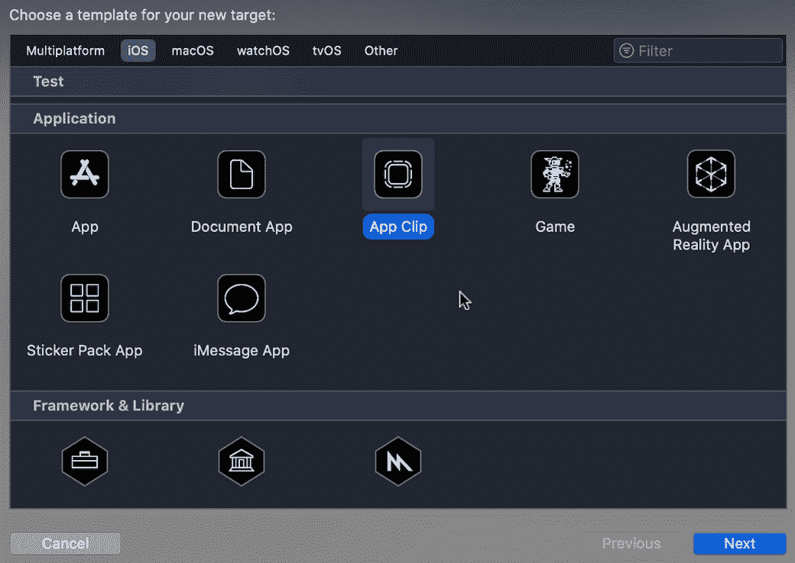

    图 14.5 – 添加 App Clip 目标

1.  按**下一步**。现在，你可以配置 App Clip 目标的一些初始值。

1.  按照以下方式输入名称 `MyAppClip`：

    图 14.6 – App Clip 目标选项

1.  当你点击**完成**时，你会看到一个新弹窗：

    图 14.7 – 激活新方案

1.  按**激活**，以便该方案可用于构建和调试。现在，看看项目结构；你会看到为 App Clip 添加了一个新的目标：

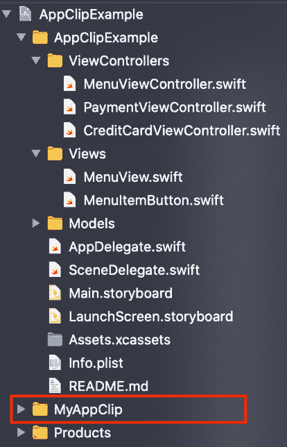

图 14.8 – App Clip 的新目标

但这并不是对项目所做的唯一更改。当 Xcode 添加新的 App Clip 目标时，在幕后做了几件事情：

+   它为构建和运行 App Clip 及其测试创建了一个新的方案。

+   它在**App Clip 目标设置 | 签名与能力**选项卡中添加了一个名为**按需安装能力**的新功能。此功能将捆绑标识为 App Clip。

+   在同一选项卡中，你还可以检查 App Clip 的 Bundle 标识符是否包含与完整应用的 Bundle 标识符相同的根。因此，如果你的应用 Bundle 标识符是 `{yourDomain}.AppClipExample`，则 App Clip 将具有 `{yourDomain}.AppClipExample.Clip`。这是因为 App Clip 只对应一个父应用，因此它们共享部分 Bundle 标识符。

+   它还添加了 `_XCAppClipURL`。如果你编辑 App Clip 的方案，你会看到一个名为该名称的环境变量。默认值是 `https://example.com`。但是，为了激活它，你需要激活变量名称附近的选择框。激活后，App Clip 将在启动时作为 `scene(_ scene: UIScene, continue userActivity: NSUserActivity)` 的一部分接收此 URL，以便你可以测试你想要触发的流程，具体取决于接收到的 URL。

此外，Xcode 还为你的主应用目标创建了一个新的构建阶段，该阶段将 App Clip 内嵌其中：

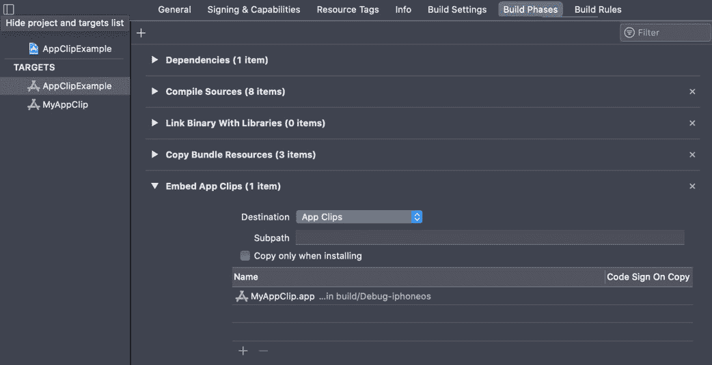

图 14.9 – 内嵌 App Clip 构建阶段

因此，正如你所见，尽管创建 App Clip 的目标是相对直接的，但在其内部还有很多事情在进行。现在你已经知道了所有细节。让我们在 iOS 模拟器上启动 App Clip（记得在启动时选择 `MyAppClip` App Clip 目标）。你将看到一个空白屏幕。这是正常的——我们仍然需要添加一些代码并准备我们的 App Clip！我们将在下一节中这样做。

## 与 App Clip 共享资源和代码

App Clips 通常需要从主应用中重用代码和资源。它们通常包含符合整个应用的一些功能。在我们的案例中，我们将创建一个显示主应用中所有内容的 App Clip，但不包括信用卡屏幕。为了提供一个快速且易于使用的 App Clip 体验，我们只允许用户查看菜单、查看他们的订单并使用 Apple Pay 支付；我们不希望他们在 App Clip 中输入任何信用卡详情。

让我们考虑从主应用中需要的所有文件和资源，并将它们添加到 App Clip 的目标中。让我们从资产开始。按照以下步骤操作：

1.  在项目导航器中，点击 `Assets.xcassets` 文件，并在应用和 App Clip 的 `Assets` 文件中，你可以删除 `MyAppClip` 文件夹内的 `Assets` 文件。否则，你将有两个 `AppIcon` 引用（每个资产文件中各一个），你将得到一个编译错误：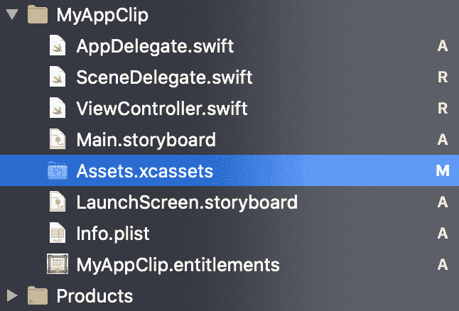

    图 14.11 – 删除 MyAppClip 内部的第二个 Assets 文件

    将主应用的 `Assets` 文件移动到项目顶部并重命名为 `SharedAssets` 也是一个好的实践。这样做可以让其他开发者知道该文件适用于所有目标：

    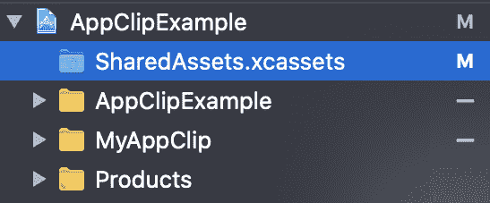

    图 14.12 – 项目顶部的 SharedAssets

    一旦你做了这些更改，确保你可以构建和编译这两个目标；也就是说，应用和 App Clip。

    现在，让我们包括 App Clip 目标以及我们需要的所有代码。之前我们提到，我们想要在主应用中找到的相同功能，除了信用卡屏幕。

1.  在项目导航器中，选择以下文件并将它们添加到 App Clip 目标中：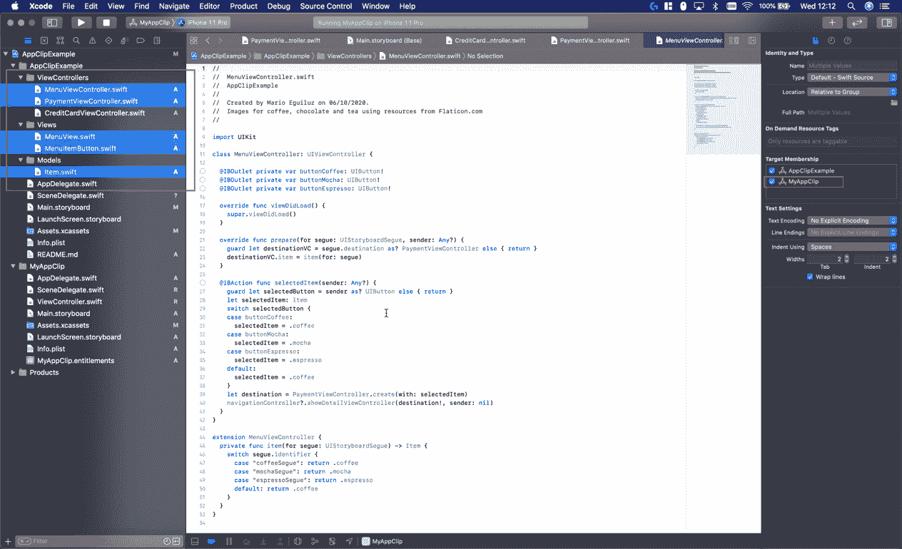

    图 14.13 – 与 App Clip 目标共享代码文件

    注意我们如何在 `ViewController`、`Views` 和 `Model` 文件夹中共享所有文件，除了 `CreditCardViewController`。

    你现在已经共享了 App Clip 所需的所有图像和代码。然而，你仍然需要重用一些内容：故事板流程。

1.  打开你的 `AppClipExample` 目标中的 `Main.storyboard` 文件。稍微缩小一下，选择除了 `CreditCardViewController` 之外的所有内容（我们不希望在 App Clip 中包含这个）：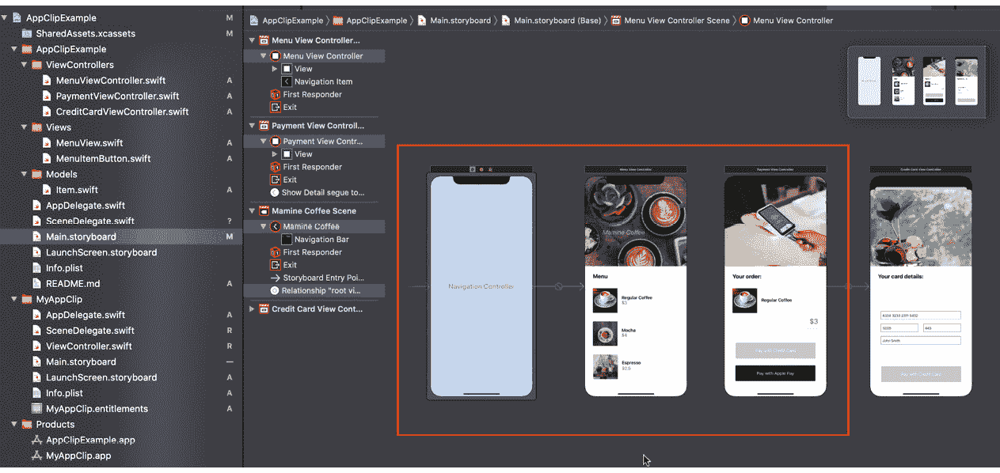

    图 14.14 – 复制你的 App 的 Main.storyboard 文件内容

1.  在复制了上一张截图中的高亮元素之后，将它们粘贴到你的 **MyAppClip** 目标的 `Main.storyboard` 文件中。

1.  现在，选择 **Navigation Controller** 选项，并在右侧的 **Options**（选项）面板中勾选 **Is Initial View Controller**（是否为初始视图控制器）选项：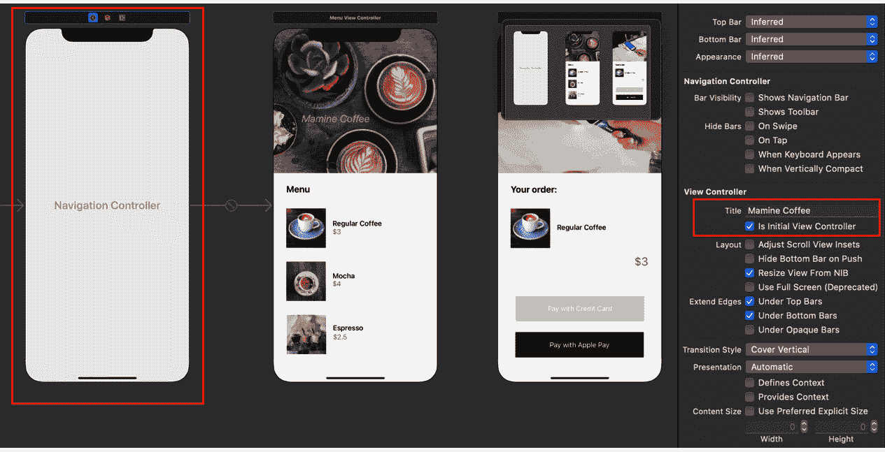

    图 14.15 – 为你的 App Clip 指定入口点

    现在，你的 App Clip 已经有了足够的代码、资源和流程，可以尝试运行它。

1.  选择 **MyAppClip** 目标并启动它。此时应该没有问题地编译和运行。

然而，存在问题。如果你启动 App Clip 并下单，你会注意到我们仍然显示了 **使用信用卡支付** 按钮。之前我们提到，我们希望我们的 App Clip 只使用 Apple Pay 来简化服务，正如苹果公司的建议。在下一节中，我们将通过学习如何使用 Active Compilation Conditions 有条件地使用代码的一部分，根据执行它的目标来达到这一点。

## 使用活动编译条件

在上一节中，我们学习了如何在应用和 App Clip 之间共享代码和资源。这次，当 App Clip 执行特定文件时，我们需要“删除”一些代码。具体来说，我们希望在 App Clip 执行时隐藏 `PaymentViewController`。

要做到这一点，我们需要与 Active Compilation Conditions（活动编译条件）一起工作。按照以下步骤操作：

1.  在 `APPCLIP` 列表中，如图下所示截图所示：

    图 14.16 – 添加活动编译条件

1.  在设置了 `APPCLIP` 标志后，继续打开 `PaymentViewController` 文件。在 `viewDidLoad()` 方法的末尾添加以下代码：

    ```swift
    #if APPCLIP
      buttonPayByCard.isHidden = true
    #endif
    ```

    通过这段代码，我们告诉编译器，只有在我们执行 App Clip 目标时，才添加这一行。

1.  让我们试一试。执行应用和 App Clip，比较两个屏幕。当 App Clip 启动时，你不应该看到 **使用信用卡支付** 按钮：

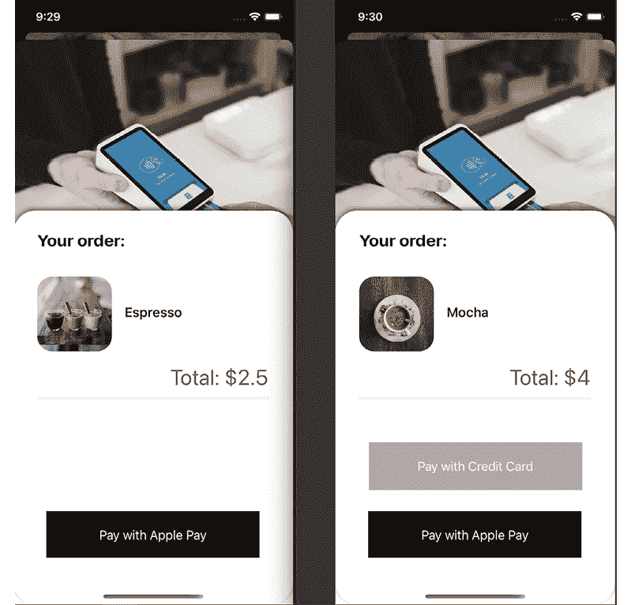

图 14.17 – App Clip（左侧）与 app（右侧）对比

如你所见，我们通过使用 Active Compilation Conditions 实现了显示 UI 不同部分的目标。

这太好了！我们已经配置了一个完美的 App Clip，它可以运行并显示我们希望用户看到的内容。在下一节中，我们将深入到这个过程的关键部分：调用 App Clip。

## 配置、链接和触发您的 App Clip

在本节中，随着 App Clip 准备就绪，我们将学习如何配置、链接和触发 App Clip。

用户可以通过使用各种调用来触发 App Clip，以下是一些示例：

+   扫描物理位置处的 NFC 标签或视觉代码

+   在 Siri 建议（基于位置的建议）中轻触

+   在 Maps 应用中轻触链接

+   在网站上轻触智能应用横幅

+   在 Messages 应用中轻触某人分享的链接（仅作为文本消息）

为了确保这些调用能够正常工作，您必须配置 App Clip 以处理链接，并且还需要配置 App Store 的 Connect App Clip Experiences。我们现在就来完成这项工作。

重要提示

当用户安装 App Clip 对应的应用时，完整的应用将替换 App Clip。从那时起，所有的调用都将启动完整的应用而不是 App Clip。因此，您的完整应用必须处理所有可能的调用并提供 App Clip 的功能。

App Clip 需要一个入口点，以便用户能够发现和启动它。在本节中，我们将回顾三个主题：

+   配置链接处理

+   配置 App Clip 体验

+   配置智能应用横幅

到本节结束时，我们的项目将有一个完全配置好的 App Clip 准备就绪。让我们开始吧！

### 配置链接处理

我们的第一步是配置我们的 Web 服务器和 App Clip 以处理链接。您可以使用本章代码包中的项目 `AppClipExample_configure_start` 来帮助完成这项工作。

如果您想在您的网站上显示您的 App Clip，您需要执行以下步骤：

1.  在您的 Web 服务器上配置 `apple-app-site-association` 文件。

1.  向您的 App Clip 添加关联域名权限。

1.  在您的 App Clip 中处理 `NSUserActivity`。

1.  首先，让我们按照以下方式配置 `apple-app-site-association` 文件：

    ```swift
    {
      "appclips" : {
        "apps" : ["<Application Identifier Prefix>.<Bundle Identifier>"]
      },
      …
    }
    ```

    此文件应位于服务器的根目录中。如果您已经设置了通用链接，那么您应该已经有这个文件了。您需要向其中添加高亮显示的代码，以便您能够引用您的 App Clip。请记住使用您自己的应用程序标识前缀和包标识符。

1.  接下来，让我们添加关联域名权限。在 **项目导航器** 窗口中，选择项目和 App Clip 目标，然后转到 **签名与能力**：![Figure_14.18 – 签名与能力

    ![Figure_14.18_B14717.jpg]

    图 14.18 – 签名与能力

1.  接下来，添加一个新的关联域名，如图中所示：![Figure_14.19 – 添加关联域名

    ![Figure_14.19_B14717.jpg]

    图 14.19 – 添加关联域名

    现在您的服务器和 App Clip 已经配置好了，让我们来处理 `NSUserActivity`。

1.  继续编辑 App Clip 方案。在 `_XCAppClipURL` 变量下，将其分配以下值：`https://myappclip.com/test?param=value`。

    使用这个值设置，让我们学习如何处理它。

1.  在 `SceneDelegate.swift` 文件中。添加以下实现：

    ```swift
    func scene(_ scene: UIScene, willConnectTo session: UISceneSession, options connectionOptions: UIScene.ConnectionOptions) {
      for activity in connectionOptions.userActivities {
        self.scene(scene, continue: activity)
      }
    }
    func scene(_ scene: UIScene, continue userActivity: NSUserActivity) {
      // 1
      guard
        userActivity.activityType == NSUserActivityTypeBrowsingWeb,
        let url = userActivity.webpageURL,
        let components = NSURLComponents(url: url, resolvingAgainstBaseURL: true) else { return }
      print(url)
      //2
      guard
        let path = components.path,
        let params = components.queryItems else { return }
      print(path)
      print(params)
      // Handle your own navigation based on path and params
    }
    ```

    这两种方法正在处理当 App Clip 被 URL 类型的元素触发时将接收到的 `NSUserActivity` 信息。看看在 `scene(…)` 方法中，我们是如何检查活动是否为 `NSUserActivityTypeBrowsingWeb` 类型，然后检查 `URL`、`path` 和 `components` 元素。在这里，你可以将你的 App Clip 导航到正确的元素。如果你启动 App Clip 并检查控制台的输出，你会看到这个：

    ```swift
    https://myappclip.com/test?param=value
    /test
    [param=value]
    ```

如你所见，我们正在处理在 `_XCAppClipURL` 目标环境变量中定义的测试 URL，并从中提取所需的路径和组件。当你想根据传入的 URL 在你的 App Clip 中处理不同的流程时，你可以这样测试。

如果你的应用是用 SwiftUI 构建的，那么你可以这样处理：

```swift
var body: some Scene {
    WindowGroup {
        ContentView().onContinueUserActivity(NSUserActivityTypeBrowsingWeb) { activity in
            guard let url = activity.webpageURL else { return }
            // Navigate to proper flow based on the url
        }
    }
}
```

通过在 `ContentView` 中定义 `onContinueUserActivity(NSUserActivityTypeBrowsingWeb)`，你可以使用传递的 `activity` 对象并从中提取传入的 URL。通过分析 URL，你可以链接到 App Clip 的正确部分。

现在我们已经配置了我们的服务器和 App Clip 以处理链接，让我们继续配置我们的 App Clip 体验。

### 配置我们的 App Clip 体验

随着 App Clip 和你的服务器准备好处理链接，我们可以开始配置我们的 App Clip 体验。App Clip 体验在 App Store Connect 中定义，并定义了 App Clip 卡片和不同场景下你想要处理的链接。App Clip 卡片看起来像这样：

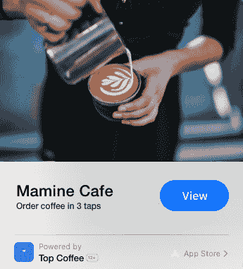

图 14.20 – App Clip 卡片

如前一个截图所示，App Clip 卡片包含以下内容：

+   一个头部图像，描述你的应用或 App Clip 的主要功能：在这个例子中，我们展示了有人在准备咖啡。

+   一个标题，描述 App Clip 的名称：**Mamine Cafe**。

+   一个副标题，描述 App Clip 提供的功能：**三指点单咖啡**。

+   一个按钮，描述要执行的操作（例如打开视图的 App Clip）：**查看**。

+   额外信息页脚：App Clip 的主要应用以及一个链接到 App Store 以下载它的链接。

这个 App Clip 卡片是设备将显示给用户以便他们可以启动你的 App Clip 的内容。我们将在 App Store Connect 中进行配置。

一旦你通过 App Store Connect 网站创建了相应的应用并上传了包含 App Clip 的构建版本，你将能够配置你的 App Clip 体验：

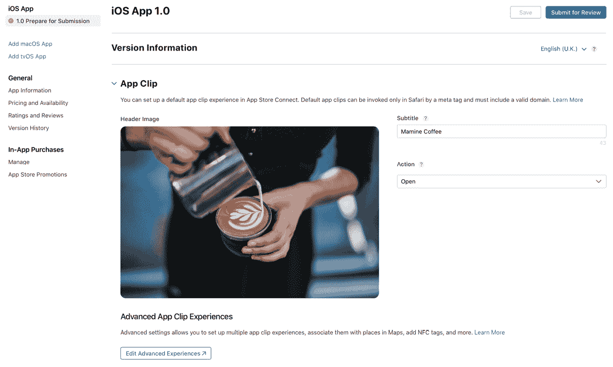

图 14.21 – App Clip 体验配置

如你所见，在默认的 App Clip 体验中，有三个主要配置项：

+   `.png`/`.jpg`。无透明度。

+   **副标题的副本**：最大字符数为 43。

+   **行动号召**：在这里，你可以选择打开、查看和播放。

您还可以点击 **编辑高级体验** 来配置不同的触发器和流程。如果您想从 NFC 标签或视觉码启动 App Clip，将您的 App Clip 与物理位置关联，或为多个业务创建 App Clip，那么您需要高级体验。首先，您需要指定将触发 App Clip 体验的 URL：


图 14.22 – 调用 App Clip 体验的 URL 配置

在按下 **下一步** 后，您可以配置 App Clip 卡：


图 14.23 – 配置高级 App Clip 卡

在这一点上，您可以配置卡的语言，甚至指定体验是否在特定位置触发。

添加高级 App Clip 体验可以让您的应用针对不同的 URL 显示不同的 App Clip。例如，如果您有一个咖啡店应用，您可以有一个用于显示菜单的 App Clip，一个用于立即订购咖啡的 App Clip，一个用于显示客户积分卡的 App Clip，等等。

在本节中，我们学习了如何在 App Store Connect 中配置 App Clip 及其体验。现在，让我们学习如何配置智能应用横幅，以便您可以在网站上触发横幅，让用户显示您的应用和 App Clip。

### 配置智能应用横幅

通过在您的网站上添加智能应用横幅，您为用户提供了一种快速且原生的方式来发现和启动您的应用。您需要在您的网站 HTML 文件中添加以下元标签（您希望横幅显示的位置）：

```swift
<meta name="apple-itunes-app" content="app-id=myAppStoreID, app-clip-bundle-id=appClipBundleID, affiliate-data=myAffiliateData, app-argument=myAppArgument">
```

您需要将突出显示的值替换为您自己的。另外，请注意，当您启动 App Clip 时，`app-argument` 不可用。请记住，您应该将显示此横幅的任何页面的域名添加到您的应用和您的 App Clip 的关联域名权限中。

在本节中，我们学习了如何配置链接处理、App Clip 体验和智能应用横幅。在下一节中，我们将学习如何在开发过程中测试我们的 App Clip。

## 测试您的 App Clip 体验

一旦您完成开发并配置了您的 App Clip，就是时候测试一切，以确保您的 App Clip 体验按预期工作。有三种方法可以测试您的 App Clip 体验：

+   通过在 Xcode 中调试调用 URL（我们在这章中已经多次看到，当使用 `_XCAppClipURL` 时）。

+   通过在 TestFlight 中为测试者创建 App Clip 体验（这样您的应用就准备好发布，并且是完整的）。

+   通过在设备上创建本地体验并在开发过程中测试来自 NFC 或视觉码的调用。

让我们更深入地探讨最后一点。让我们使用本书代码包中的 `AppClipExample_test` 项目，以便我们可以在其上测试我们的 App Clip 体验。

在开发过程中使用本地体验测试你的应用小部件体验的一个优点是，你不需要配置相关的域名，修改服务器，或处理 TestFlight。我们可以在本地完成所有这些操作。让我们开始吧：

1.  首先，在任何设备上构建和运行你的应用和小部件。然后，在设备上，打开 **设置 | 开发者 | 本地体验** 并选择 **注册本地体验...**：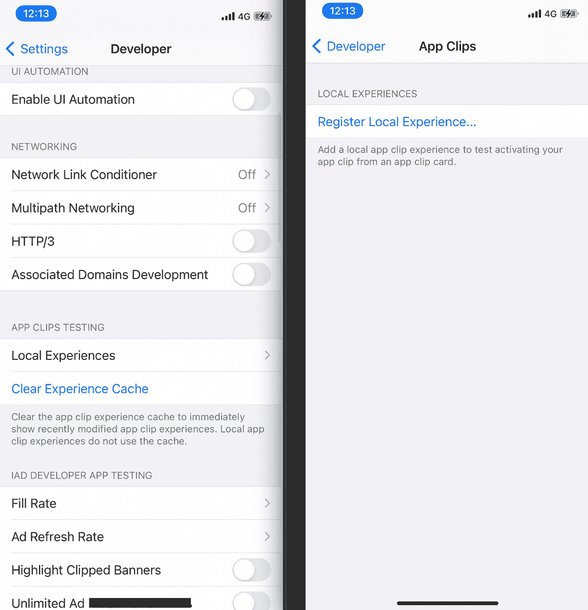

    图 14.24 – 本地体验设置

1.  现在，你可以配置本地体验，如图下所示。请记住，为应用使用自己的值：


图 14.25 – 本地体验数据

要启动应用小部件卡片，你可以使用任何允许你生成与上一屏幕（在 **URL 前缀** 下）中指定的相同 URL 的 QR 码或 NFC 标签的工具。完成此操作后，当你用设备扫描时，你的应用小部件卡片应该会出现。

重要提示

在本地体验中定义的捆绑 ID 必须与你的应用小部件的捆绑 ID 匹配。

应用小部件必须在设备上安装。

如果相机应用没有打开应用小部件，请尝试使用 iOS 控制中心的 QR 码扫描仪（如果你没有，可以通过前往 **设置 | 控制中心** 来添加它）。

在本节中，我们学习了如何配置本地体验，以便在开发过程中测试我们的应用小部件卡片。现在，让我们总结本章内容。

# 摘要

在本章中，我们回顾了 iOS 14 最好的新功能之一：应用小部件。我们解释了什么是应用小部件，用户的旅程是什么，开发应用小部件时应关注哪些功能，以及有哪些选项可以调用它们。

在学习基础知识后，我们为一家咖啡店应用开发并配置了我们的第一个应用小部件。我们对项目进行了重构，以便在应用和小部件之间共享代码和资源。然后，我们学习了如何使用 **活动编译条件** 来触发代码库的一部分，但仅限于应用小部件或应用本身，以及如何配置我们的应用和服务器以处理链接。

最后，我们学习了如何在 App Store Connect 中配置应用小部件体验，以及如何在开发过程中测试它们。

在下一章中，你将了解视觉框架。
