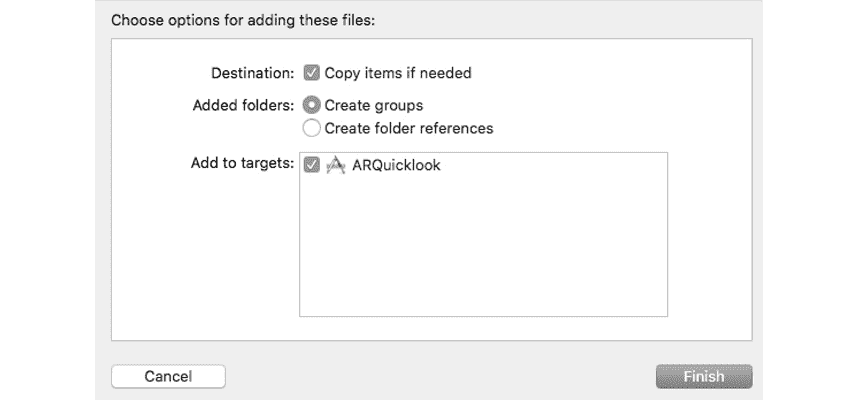
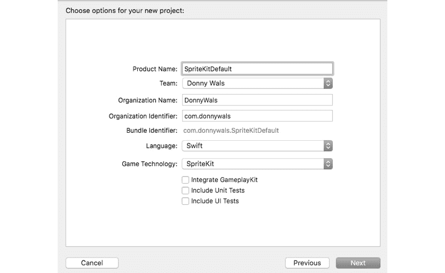
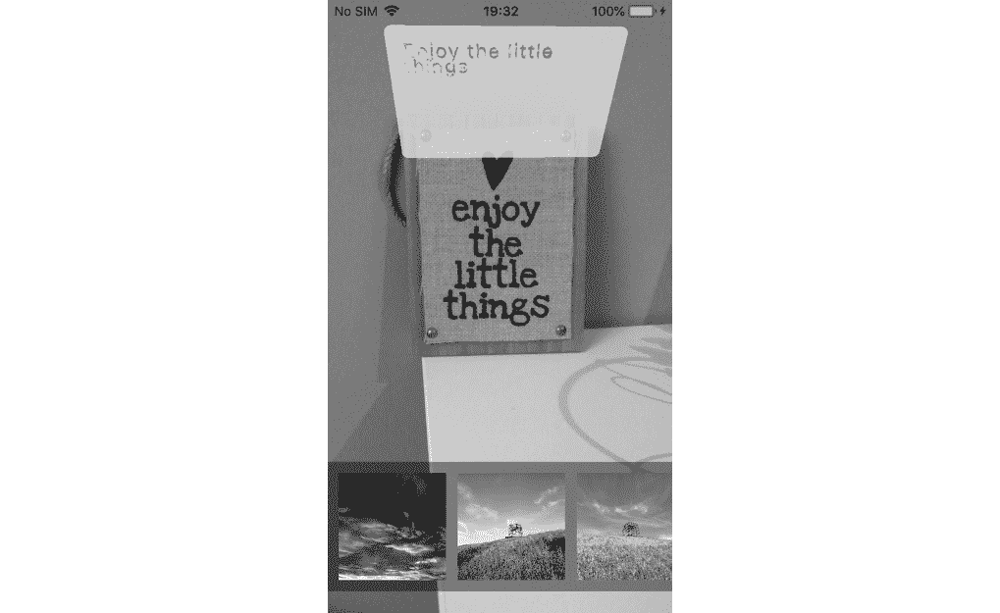
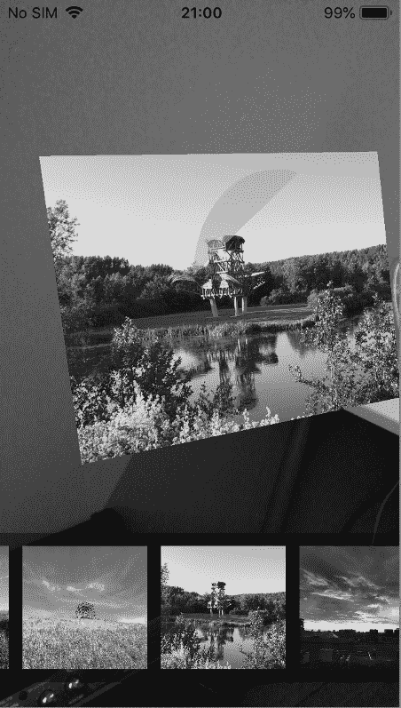

# 第十七章：*第十七章*: 使用增强现实

苹果在 iOS 11 中发布的一个主要功能是**ARKit**。ARKit 允许开发者仅用少量代码就创建惊人的**增强现实（AR**）体验。苹果一直在努力改进 ARKit，在 2018 年的 WWDC 上发布了 ARKit 2，在 2019 年的 WWDC 上发布了 ARKit 3，在 2020 年的 WWDC 上发布了 ARKit 4。

在本章中，你将学习什么是 ARKit，它是如何工作的，你可以用它做什么，以及如何实现一个使用多个 ARKit 功能（如图像跟踪）的 AR 艺术画廊。我们还将了解一些来自 SpriteKit 和 SceneKit 的基本概念。

本章涵盖了以下主题：

+   理解 ARKit

+   使用 ARKit 快速查看

+   探索 SpriteKit

+   探索 SceneKit

+   实现 AR 画廊

到本章结束时，你将能够将 ARKit 集成到你的应用程序中，并实现你自己的 ARKit 体验。

# 理解 ARKit

在本节中，我们将了解**增强现实（AR**）和 ARKit。增强现实（AR）是一个长期以来一直吸引着应用程序开发者和设计师兴趣的话题。尽管实现出色的 AR 体验并不容易，但许多应用程序并没有达到预期的炒作。像照明和检测墙壁、地板和其他对象这样的小细节一直都非常复杂，而这些细节的错误会对 AR 体验的质量产生负面影响。

增强现实应用程序通常至少具有以下一些功能：

+   它们显示了一个相机视图。

+   内容在相机视图中以叠加的形式显示。

+   内容能够适当地响应设备的移动。

+   内容附着在世界的特定位置。

尽管这个功能列表很简单，但它们并不都是容易实现的。AR 体验在很大程度上依赖于读取设备的运动传感器，以及使用图像分析来确定用户的确切移动方式，并了解世界 3D 地图应该是什么样子。

ARKit 是苹果提供给开发者创建出色 AR 体验的力量的方式。ARKit 负责所有的运动和图像分析，以确保你可以专注于设计和实现优秀的内容，而不是被构建 AR 应用程序所涉及的复杂细节所拖慢。

不幸的是，ARKit 对运行 ARKit 应用程序的设备有较高的硬件要求。只有配备苹果 A9 芯片或更新的设备才能运行 ARKit。这意味着任何比 iPhone 6s 或第一代 iPad Pro 更旧的设备都无法运行 ARKit 应用程序。

在接下来的几节中，我们将首先了解 ARKit 如何在设备上渲染内容，以及它是如何跟踪周围的物理环境，以提供最佳的 AR 体验。

## 理解 ARKit 如何渲染内容

ARKit 本身只负责与跟踪用户所处的物理世界相关的庞大计算。要在 ARKit 应用中渲染内容，您必须使用以下三种渲染工具之一：

+   SpriteKit

+   SceneKit

+   Metal

在本章的后面部分，您将快速了解 SpriteKit 和 SceneKit，并最终使用 SceneKit 来实现您的 AR 画廊。如果您已经熟悉任何可用的渲染技术，那么在使用 ARKit 时应该会感到非常自在。

在您的应用中实现 ARKit 不仅限于手动渲染您想在 AR 中显示的内容。在 iOS 12 中，苹果增加了一个名为 **ARKit Quick Look** 的功能。您可以在您的应用中实现一个特殊的视图控制器，负责放置您提供的 3D 模型。如果您正在实现允许用户在现实世界中预览产品或其他对象的特性，这将非常理想。

## 理解 ARKit 如何跟踪物理环境

要理解 ARKit 如何渲染内容，您必须了解 ARKit 如何理解用户所处的物理环境。当您实现一个 AR 体验时，您使用一个 ARKit 会话。ARKit 会话由 `ARSession` 的一个实例表示。每个 `ARSession` 都使用 `ARSessionConfiguration` 的一个实例来描述它在环境中应执行的跟踪。以下图表展示了在 ARKit 会话中涉及的所有对象之间的关系：

![图 17.1 – ARKit 会话组件

![img/Figure_17.01_B14717.jpg]

图 17.1 – ARKit 会话组件

上述图表显示了会话配置如何传递给会话。然后，会话被传递给一个负责渲染场景的视图。如果您使用 SpriteKit 来渲染场景，该视图是一个 `ARSKView` 的实例。当您使用 SceneKit 时，这将是一个 `ARSCNView` 的实例。视图和会话都有一个代理，它将在 ARKit 会话期间通知某些事件。您将在实现您的 AR 画廊时了解更多关于这些代理的信息。

在会话上，您可以配置几种不同的跟踪选项。最基本的跟踪配置之一是 `AROrientationTrackingConfiguration`。此配置仅跟踪设备的方向，而不是用户在环境中的移动。这种跟踪使用三个自由度来监控设备。更具体地说，这种跟踪跟踪设备的 *x*、*y* 和 *z* 方向。如果您的实现中可以忽略用户的移动，例如 3D 视频，这种跟踪方式非常合适。

更复杂的跟踪配置是`ARWorldTrackingConfiguration`，也称为**世界跟踪**。此类配置跟踪用户的移动以及设备的方向。这意味着用户可以绕着 AR 对象走动，从不同的侧面观察它。世界跟踪使用设备的运动传感器来确定用户的移动和设备的方向。这对于短距离和小范围的移动非常准确，但不足以跟踪长时间和距离的移动。为了确保 AR 体验尽可能精确，世界跟踪还会执行一些高级计算机视觉任务，以分析摄像头流来确定用户在环境中的位置。

除了跟踪用户的移动外，世界跟踪还使用计算机视觉来理解 AR 会话存在的环境。通过检测摄像头流中的某些兴趣点，世界跟踪可以比较和分析这些点相对于用户运动的位置，以确定对象的距离和大小。这种技术还允许世界跟踪检测墙壁和地板等。

世界跟踪配置将学习到的关于环境的所有信息存储在`ARWorldMap`中。此地图包含所有代表会话中存在的不同对象和兴趣点的`ARAnchor`实例。

您可以在应用程序中使用几种其他特殊跟踪类型。例如，您可以在具有**TrueDepth**摄像头的设备上使用`ARFaceTrackingConfiguration`来跟踪用户的脸部。如果您想在 iOS 12 中添加到 iPhone X 及其后续版本中的 Apple Animoji 功能，这种跟踪方式非常完美。

您还可以配置会话，使其自动检测场景中的某些对象或图像。为此，您可以使用`ARObjectScanningConfiguration`来扫描特定项目，或使用`ARImageTrackingConfiguration`来识别静态图像。

在本节中，您已经学习了 AR 和 ARKit 的基础知识，包括 ARKit 如何在设备上渲染内容，以及它是如何跟踪周围物理环境的。在您开始实现 ARKit 会话之前，让我们探索新的**ARKit 快速预览**功能，看看它对您允许您的应用程序用户在 AR 中预览项目有多简单。

# 使用 ARKit 快速预览

在本节中，我们将了解 ARKit 快速预览功能，这是苹果公司的一项功能，允许用户使用设备的摄像头预览虚拟 3D 或 AR 模型。

AR 为最终用户带来的一个巨大好处是，现在可以在现实世界中预览某些对象。例如，当您购买新的沙发时，您可能想看看它在现实世界中的样子。当然，在 iOS 11 中使用 ARKit 实现此类功能是可能的，许多开发者已经做到了，但这并不像可能的那样简单。

iOS 用户可以使用名为 **Quick Look** 的功能预览内容。Quick Look 可以用于预览某些类型的内容，而无需启动任何特定应用程序。这对用户来说很方便，因为他们可以通过在 Quick Look 中预览来确定某个特定文档是否是他们正在寻找的文档。

在 iOS 12 中，苹果将 **USDZ** 文件格式添加到可以使用 Quick Look 预览的内容类型中。苹果的 USDZ 格式是基于皮克斯的 USD 格式的一种 3D 文件格式，用于表示 3D 对象。使用 Quick Look 预览 3D 模型不仅限于应用中；ARKit Quick Look 还可以集成到网页上。开发者可以在他们的网页上使用特殊的 HTML 标签来链接 USDZ，Safari 将在 ARKit 快速查看视图控制器中显示模型。

在实现你的 AR 画廊之前，了解 iOS 上 AR 的工作方式是一个好主意，可以通过实现 ARKit 快速查看视图控制器来展示苹果在 [`developer.apple.com/arkit/gallery/`](https://developer.apple.com/arkit/gallery/) 提供的其中一个模型。要下载你喜欢的模型，你只需要在你的 Mac 上导航到这个页面并点击一个图像。USDZ 文件应该会自动开始下载。

小贴士

导航到支持 ARKit 的设备的 ARKit 画廊，并点击其中一个模型，以查看 Safari 中的 ARKit 快速查看看起来是什么样子。

在本节中，我们解释了什么是快速查看。现在让我们在下一节中将其用于我们自己的应用中。

## 实现 ARKit 快速查看视图控制器

从苹果的画廊获取 USDZ 文件后，还确保捕获属于此文件的图像。为了测试目的，对模型进行截图应该是可以的。确保通过将截图放大到两倍和三倍大小来准备不同所需的图像尺寸。

在 Xcode 中创建一个新的项目，并为你的项目选择一个名称。本书代码包中的示例项目名为 `ARQuickLook`。将你的准备好的图像添加到 `Assets.xcassets` 文件中。此外，将你的 USDZ 文件拖动到 Xcode 中，并确保在导入文件时勾选你的应用复选框，将其添加到应用目标中：



图 17.2 – 导入 USDZ 模型

接下来，打开故事板文件，将一个图像视图拖动到视图控制器中。为图像添加适当的约束，使其在视图控制器中居中，并设置其宽度和高度为`200`点。确保在**属性检查器**中勾选**用户交互启用**复选框，并将你的模型图像设置为图像视图的图像。

完成此操作后，打开`ViewController.swift`，为图像视图添加`@IBOutlet`，并将故事板中的图像连接到这个出口。如果关于出口的细节现在有点模糊，请参考代码包中的示例项目以刷新记忆。示例项目中的图像视图使用了一个名为`guitarImage`的出口。

为 USDZ 模型实现快速查看的下一步是在图像视图上添加一个轻点手势识别器，然后当用户轻点图像时触发快速查看视图控制器。

快速查看使用委托从数据源对象中预览一个或多个项目。它还使用委托来获取快速查看预览应该动画的源视图。这种流程适用于所有可以使用快速查看预览的文件类型。

要开始实现快速查看，你必须导入`QuickLook`框架。将以下`import`语句添加到`ViewController.swift`的顶部：

```swift
import QuickLook
```

接下来，通过在`viewDidLoad()`中添加以下代码来为图像设置轻点手势识别器：

```swift
let tapGesture = UITapGestureRecognizer(target: self,
  action: #selector(presentQuicklook))
guitarImage.addGestureRecognizer(tapGesture)
```

下一步是实现`presentQuicklook()`。这个方法将创建一个快速查看视图控制器，设置委托和数据源，然后将快速查看视图控制器呈现给用户。将以下实现添加到`ViewController`类中：

```swift
@objc func presentQuicklook() {
   let previewViewController = QLPreviewController()
   previewViewController.dataSource = self
   previewViewController.delegate = self
   present(previewViewController, animated: true,
     completion: nil)
}
```

这种实现应该不会给你带来任何惊喜。`QLPreviewController`是`UIViewController`的子类，负责显示从其数据源接收到的内容。它以与其他视图控制器相同的方式呈现，通过调用`present(_:animated:completion:)`。

最后一步是实现数据源和委托。将以下扩展添加到`ViewController.swift`中：

```swift
extension ViewController: QLPreviewControllerDelegate {
  func previewController(_ controller: QLPreviewController, 
    transitionViewFor item: QLPreviewItem) -> UIView? {
     return guitarImage
  }
}
extension ViewController: QLPreviewControllerDataSource {
  func numberOfPreviewItems(in controller: 
    QLPreviewController) -> Int {
    return 1
  }
  func previewController(_ controller: QLPreviewController,
    previewItemAt index: Int) -> QLPreviewItem {
    let fileUrl = Bundle.main.url(forResource: 
      "stratocaster", withExtension: "usdz")!
    return fileUrl as QLPreviewItem
  }
}
```

你添加的第一个扩展使`ViewController`遵守`QLPreviewControllerDelegate`协议。当预览控制器即将展示 3D 模型时，它想知道即将发生的转换的源视图是哪个。建议从这个方法返回充当快速查看操作的预览视图。在这种情况下，预览是 3D 模型的图像。

第二个扩展充当快速查看数据源。当你为 ARKit 实现快速查看时，你只能返回一个项目。所以，当预览控制器询问预览中的项目数量时，你应该始终返回`1`。数据源中的第二个方法提供了预览控制器中应该预览的项目。你在这里需要做的就是获取你希望预览的项目文件 URL。在示例应用中，使用了苹果画廊中的 Stratocaster 模型。如果你的模型有不同的名称，请确保使用正确的文件名。

在获取指向应用包中图像的 URL 后，应将其作为`QLPreviewItem`实例返回给预览控制器。幸运的是，URL 实例可以自动转换为`QLPreviewItem`实例。

如果你现在运行你的应用，你可以点击 3D 模型的图像来开始预览它。你可以单独预览图像，或者选择在 AR 中预览它。如果你点击这个选项，预览控制器会告诉你移动你的设备。

为了将你周围的世界进行映射，ARKit 需要一些环境样本。当你移动你的设备时，确保不要只是倾斜它，而是要物理移动它。这样做将帮助 ARKit 发现你周围可追踪的特征。

一旦 ARKit 收集了你周围足够的数据，你就可以将 3D 模型放置在环境中，通过捏合来缩放它，旋转它，并在空间中移动它。请注意，模型会自动放置在平坦的表面，如桌子或地板上，而不是尴尬地漂浮在空中：

![图 17.3 – 在场景周围移动设备

![img/Figure_17.03_B14717.jpg]

图 17.3 – 在场景周围移动设备

还要注意，ARKit 对你的物体应用了非常逼真的光照。ARKit 收集的环境视觉数据被用来创建一个光照图，并将其应用于 3D 模型，使其能够正确地融入物体放置的上下文中：

![图 17.4 – 放置在现实世界中的 AR 模型

![img/Figure_17.04_B14717.jpg]

图 17.4 – 放置在现实世界中的 AR 模型

虽然这样玩 ARKit 很有趣，但创建自己的 AR 体验更有趣。由于 ARKit 支持多种渲染技术，如 SpriteKit 和 SceneKit，接下来的两个部分将花一点时间解释 SpriteKit 和 SceneKit 的基础知识。你不会学习如何使用这些框架构建完整的游戏或世界。相反，你将学习足够的内容，以便在 ARKit 应用中开始实现任一渲染引擎。

# 探索 SpriteKit

在本节中，我们将探讨**SpriteKit**。SpriteKit 主要被开发者用来构建二维游戏。SpriteKit 已经存在一段时间了，并且它帮助开发者多年来创建了许多成功的游戏。SpriteKit 包含一个完整的物理仿真引擎，并且可以同时渲染许多精灵。**精灵**代表游戏中的一个图形。精灵可以是玩家的图像，也可以是硬币、敌人，甚至是玩家行走的地面。当在 SpriteKit 的上下文中提到精灵时，指的是屏幕上可见的节点之一。

由于 SpriteKit 内置了物理引擎，它可以检测物体之间的碰撞，对它们施加力，等等。这和 UIKit Dynamics 的功能非常相似。

为了渲染内容，SpriteKit 使用场景。这些场景可以被认为是游戏的水平或主要构建部分。在 AR 的上下文中，你会发现你通常只需要一个场景。SpriteKit 场景负责更新场景的位置和状态。作为开发者，你可以通过 `SKScene` 的 `update(_:)` 方法挂钩到帧的渲染。每当 SpriteKit 即将为你或 ARKit 场景渲染新帧时，都会调用此方法。确保此方法的执行时间尽可能短是很重要的，因为 `update(_:)` 方法的慢速实现会导致帧率下降，这是被认为不好的。你应该始终努力保持每秒 60 帧的稳定帧率。这意味着 `update(_:)` 方法应该始终在不到 1/60 秒的时间内完成其工作。

要开始探索 SpriteKit，请在 Xcode 中创建一个新项目，并选择 `SpriteKitDefault`，如下截图所示：

![图 17.5 – 创建 SpriteKit 项目]



图 17.5 – 创建 SpriteKit 项目

当 Xcode 为你生成此项目时，你应该会注意到一些之前没有见过的文件：

+   `GameScene.sks`

+   `Actions.sks`

这两个文件对于 SpriteKit 游戏来说就像故事板对于常规应用一样。你可以使用这些文件来设置游戏场景的所有节点，或者设置可重用的动作，这些动作可以附加到你的节点上。我们现在不会深入这些文件，因为它们非常具体于游戏开发。

如果你构建并运行 Xcode 提供的示例项目，你可以轻触屏幕来在屏幕上创建新的精灵节点。每个节点在消失前都会执行一点动画。这本身并不特别，但它包含了很多有价值的信息。例如，它展示了如何向场景中添加内容以及如何对其进行动画处理。让我们看看这个项目是如何设置的，这样你就可以在将来想要使用 SpriteKit 构建 AR 体验时应用这些知识。

## 创建 SpriteKit 场景

SpriteKit 游戏使用一种特殊的视图来渲染其内容。这个特殊视图始终是 `SKView` 的一个实例或子类。如果你想在 SpriteKit 中使用 ARKit，你应该使用 `ARSKView`，因为这个视图实现了某些特殊的 AR 相关行为，例如渲染相机视频流。

视图本身通常不会在管理游戏或其子视图方面做太多工作。相反，包含视图的 `SKScene` 负责执行这项工作。这与其他应用中通常使用视图控制器的方式类似。

当你创建了一个场景后，你可以告诉 `SKView` 显示这个场景。从这一刻起，你的游戏就开始运行了。在之前创建的游戏项目示例代码中，以下行负责加载和显示场景：

```swift
if let scene = SKScene(fileNamed: "GameScene") {
    scene.scaleMode = .aspectFill    
    view.presentScene(scene)
}
```

当你创建场景时，你可以选择是否想要使用 `.sks` 文件或以编程方式创建场景。

当你打开 Xcode 为你创建的 `GameScene.swift` 文件时，大部分代码应该是相当容易理解的。当场景被添加到视图中时，会创建并配置几个 `SKNode` 实例。这个文件中最有趣的代码行如下：

```swift
spinnyNode.run(SKAction.repeatForever(SKAction.rotate(byAng
  le: CGFloat(Double.pi), duration: 1)))
spinnyNode.run(SKAction.sequence([SKAction.wait(forDuration
  : 0.5), SKAction.fadeOut(withDuration: 0.5), 
   SKAction.removeFromParent()]))
```

这些行设置了当你点击屏幕时添加的旋转方块的动画序列。在 SpriteKit 中，动作是设置动画的首选方式。你可以分组、链式组合动作以实现相当复杂的效果。这是 SpriteKit 提供的许多强大工具之一。

如果你仔细检查一下代码，你会发现每次用户在屏幕上点击、移动手指或抬起手指时，都会创建 `spinnyNode` 的副本。每次交互都会产生一个略微不同的 `spinnyNode` 副本，因此你可以通过观察其外观来确定为什么将 `spinnyNode` 添加到场景中。

研究这段代码，尝试操作它，并确保你理解它的工作原理。你不必成为 SpriteKit 专家，但在这个部分，我们已经回顾了它的基础知识，以便你可以开始使用它。让我们看看 SceneKit 是如何准备和实现你的 AR 画廊的。

# 探索 SceneKit

如果你正在寻找一个对 3D 游戏有出色支持的游戏框架，SceneKit 是一个很好的选择。SceneKit 是苹果公司用于创建 3D 游戏的框架，其结构设置与 SpriteKit 非常相似。

当然，SceneKit 与 SpriteKit 完全不同，因为它用于 3D 游戏，而不是 2D 游戏。因此，SceneKit 在创建视图和将它们定位在屏幕上的方式上也非常不同。例如，当你想要创建一个简单的对象并将其放置在屏幕上时，你会看到诸如几何和材质之类的术语。这些术语应该对游戏程序员来说很熟悉，但如果你是 AR 爱好者，你可能需要习惯这些术语。

本节将指导你设置一个简单的 SceneKit 场景，它将非常类似于你稍后将要实现的 AR 画廊的一部分。这应该为你提供足够的信息，以便开始尝试使用 SceneKit。

## 创建基本的 SceneKit 场景

为了练习你的 SceneKit 知识，创建一个新的项目，而不是选择 **Game** 模板，而是选择 **Single View Application** 模板。当然，你可以自由探索当你选择带有 SceneKit 的 **Game** 模板时 Xcode 为你创建的默认项目，但这对于 AR 画廊来说并不特别有用。

创建你的项目后，打开主故事板并查找 SceneKit 视图。将此视图拖到视图控制器中。你应该注意到你刚刚添加到视图控制器的视图已经完全替换了默认视图。因此，`ViewController` 上的 `view` 属性将不是一个普通的 `UIView`；它将是一个 `SCNView` 的实例。这是将用于渲染 SceneKit 场景的视图。

在 `ViewController.swift` 的 `viewDidLoad()` 中添加以下代码，将 `view` 属性从 `UIView` 转换为 `SCNView`：

```swift
guard let sceneView = self.view as? SCNView 
  else { return }
```

现在，记得在顶部添加 `import SceneKit`，以便 `SCNView` 能够编译。

与 SpriteKit 的工作方式类似，SceneKit 使用场景来渲染其节点。在 `viewDidLoad()` 中的 `guard` 之后立即创建一个 `SCNScene` 实例，如下所示：

```swift
let scene = SCNScene()
sceneView.scene = scene
sceneView.allowsCameraControl = true
sceneView.showsStatistics = true
sceneView.backgroundColor = UIColor.black
```

上述代码创建了一个简单的场景，将用于渲染所有元素。除了创建场景外，还启用了几个调试功能来监控场景的性能。此外，请注意，场景视图上的 `allowsCameraControl` 属性被设置为 `true`。这将允许用户在场景中移动虚拟相机，通过在场景中滑动来探索场景。

每个 SceneKit 场景都像通过相机看一样。你必须自己添加这个相机，并且必须根据你的目的适当地设置它。SceneKit 使用相机的事实非常方便，因为当你使用 ARKit 运行场景时，你即将设置的相机将被设备的实际相机所取代。

在 `viewDidLoad()` 中添加以下代码行以创建和配置相机：

```swift
let cameraNode = SCNNode()
cameraNode.camera = SCNCamera()
cameraNode.position = SCNVector3(x: 0, y: 0, z: 15)
scene.rootNode.addChildNode(cameraNode)
```

设置基本相机并不复杂。你只需要一个 `SCNNode` 来添加相机，以及一个 `SCNCamera`，它将用于通过它查看你的场景。请注意，相机是通过 `SCNVector3` 对象定位的。SceneKit 场景中的所有节点都使用此对象来表示它们在三维空间中的位置。

除了使用模拟相机外，SceneKit 还模拟真实的光照条件。当你使用 ARKit 运行场景时，光照条件将由 ARKit 自动管理，使你的物体看起来就像真正是环境的一部分。然而，当你创建一个普通场景时，你需要自己添加灯光。添加以下代码行以实现一些环境光照：

```swift
let ambientLightNode = SCNNode()
ambientLightNode.light = SCNLight()
ambientLightNode.light!.type = .ambient
ambientLightNode.light!.color = UIColor.orange
scene.rootNode.addChildNode(ambientLightNode)
```

你可以向 SceneKit 场景添加不同类型的灯光。你可以像这个示例一样使用环境光，但也可以添加定向光，它聚焦于特定方向，聚光灯，或者照亮所有方向的点光源。

现在你已经设置了光照和相机，你可以在场景中添加一个对象。你可以在场景中使用几个预制的形状，也称为几何体。或者，你也可以将整个 3D 模型导入到场景中。如果你查看 Xcode 生成的默认 SceneKit 应用，如果你使用**Game**模板创建一个新项目，你可以看到一个飞机的 3D 模型被导入。

在你稍后将要构建的 AR 画廊中，艺术品将通过附加到它们所属的艺术品上的数字信息标签进行增强。为了练习构建这样的标签，你将在你的 SceneKit 场景中添加一个矩形形状，或者平面，并在其上方放置一些文本。

添加以下代码以创建一个简单的白色平面、渲染平面的节点，并将其添加到场景中：

```swift
let plane = SCNPlane(width: 15, height: 10)
plane.firstMaterial?.diffuse.contents = UIColor.white
plane.firstMaterial?.isDoubleSided = true
plane.cornerRadius = 0.3

let planeNode = SCNNode(geometry: plane)
planeNode.position = SCNVector3(x: 0, y: 0, z: -15)
scene.rootNode.addChildNode(planeNode)
```

如果你现在构建并运行你的应用，你会看到一个位于相机前面的白色方块。通过在场景上滑动，你可以使相机在平面上移动，从所有可能的角度查看它。请注意，尽管只设置了 15 宽和 10 高，但平面看起来相当大。你可能已经猜到这些数字代表屏幕上的点，就像在其他应用中一样。在 SceneKit 中，没有点的概念。所有的大小和距离值都必须以米为单位指定。这意味着你做的所有事情都是相对于其他对象或它们的真实世界大小进行的。当你将 SceneKit 知识应用到 ARKit 时，使用真实大小是至关重要的。

要在你的新创建的平面上添加一些文本，请使用以下代码：

```swift
let text = SCNText(string: "Hello, world!", extrusionDepth:
  0)
text.font = UIFont.systemFont(ofSize: 2.3)
text.isWrapped = true
text.containerFrame = CGRect(x: -6.5, y: -4, width: 13, 
  height: 8)
text.firstMaterial?.diffuse.contents = UIColor.red
let textNode = SCNNode(geometry: text)
planeNode.addChildNode(textNode)
```

上述代码创建了一个文本几何体。由于 SceneKit 中的所有值都是以米为单位，文本的大小将比你可能预期的要小得多。为了确保文本在平面上正确定位，启用了文本换行，并使用`containerFrame`来指定文本的边界。由于文本字段的起点将位于显示的平面的中心，因此*x*和*y*位置从中心向负方向偏移，以确保文本出现在正确的位置。你可以尝试调整这个框架来看看会发生什么。配置好文本后，将其添加到一个节点中，然后将该节点添加到平面节点中。

如果你现在运行你的应用，你将能看到在之前创建的白色平面上渲染的**Hello, World!**文本。这个示例很好地展示了你接下来将要创建的内容。让我们直接开始构建你的 AR 画廊！

# 实现增强现实画廊

由于 ARKit 中存在的一些优秀功能，创建一个出色的 AR 体验已经变得简单得多。然而，如果你想要构建用户会喜欢的 AR 体验，还有一些事情需要牢记。

某些条件，如光照、环境，甚至用户正在做什么，都可能影响 AR 体验。在本节中，你将实现一个 AR 画廊，你将亲身体验 ARKit 既是惊人的神奇，有时又有点脆弱。

首先，你需要在 ARKit 中设置一个会话，以便你可以实现图像跟踪来在世界中找到某些预定义的图像，你将在找到的图片上方显示一些文本。然后，你将实现另一个功能，允许用户将应用中的画廊艺术作品放置在自己的房间里。

如果你想跟随步骤实现 ARKit 画廊，请确保从书籍的代码包中获取 `ARGallery_start` 项目。在您开始实现 AR 画廊之前，先探索一下起始项目。准备好的用户界面包含一个 `ARSCNView` 实例；这是将用于渲染 AR 体验的视图。为了准备用户添加自己的图像到画廊，已添加了一个集合视图，并添加了一个用于错误信息的视图，以通知用户某些可能出错的事情。

你会发现到目前为止项目相当基础。现有的所有代码只是设置了集合视图，并添加了一些代码来处理 AR 会话期间的错误。让我们来实现图像跟踪，好吗？

## 添加图像跟踪

当你将图像跟踪添加到你的 ARKit 应用中时，它将不断扫描环境以寻找与你在应用中添加的图像相匹配的图像。如果你想让用户在他们的环境中寻找特定的图像，以便你可以提供更多关于它们的信息，或者作为寻宝游戏的一部分，这个功能非常棒。但更复杂的实现可能存在于教科书或杂志中，扫描特定页面会使整个页面作为独特体验的一部分活跃起来。

在您能够实现图像跟踪体验之前，您必须为您的用户提供一些图像以便在应用中找到。一旦内容准备就绪，您就可以构建 AR 体验本身了。

## 准备图像进行跟踪

将图像添加到您的应用中进行图像跟踪相对简单。最重要的是，你需要仔细关注你添加到应用中的图像。确保你添加的图像是高质量的并且色彩饱和。ARKit 将扫描图像中的特殊特征以尝试匹配，因此你的图像需要有足够的细节、对比度和颜色。一个平滑渐变的图像可能在你看来是一个可识别的图像，但对于 ARKit 来说可能很难检测。

要将图像添加到您的项目中，请转到 `Assets.xcassets` 文件夹，点击左下角的 **+** 图标，并选择 **New AR Resource Group**，如图下截图所示：

![Figure 17.6 – 添加 AR 资源

![img/Figure_17.06_B14717.jpg]

Figure 17.6 – 添加 AR 资源

在添加新的资源组后，你可以将图片拖入创建的文件夹中。ARKit 会一次性加载和监控每个资源组，所以请确保不要将太多图片添加到单个资源组中，因为这可能会对你的应用性能产生负面影响。苹果建议你将大约 25 张图片添加到单个资源组中。

在你将图片添加到资源组后，Xcode 将分析图片，并在它认为你的图片有问题时发出警告。通常，Xcode 会在你添加新图片时立即通知你，因为 ARKit 需要知道你想要检测的图像的物理尺寸。所以，如果你要检测特定的画作或杂志中的一页，你必须以厘米为单位添加这些资源的尺寸，就像它们在现实世界中存在的那样。

从代码包中开始的项目包含了一些准备好的图片，你可以探索这些图片来查看你可以在自己的应用中使用的一些图片类型示例。

小贴士

如果你想要添加一些自己的内容，可以拍摄家中或办公室的艺术品或图片。你可以使用 iOS 中的 Measure 应用来测量图片的物理尺寸，并将它们添加到你的 AR 相册项目中。确保你的图片色彩饱和，没有任何眩光或反射。

一旦你找到了一些优秀的内容用于你的 AR 相册，就到了构建体验本身的时候了。

## 构建图像跟踪体验

要实现图像跟踪，你需要设置一个使用 `ARWorldTrackingConfiguration` 的 `ARSession` 来检测图像并跟踪用户在环境中的移动。当场景中发现你准备好的其中一个图像时，会在图片上方添加一个 `SCNPlane`，并附上对图片本身的简短描述。

因为 ARKit 使用摄像头，所以你的应用必须明确提供访问摄像头的原因，以便用户理解为什么你的应用需要使用他们的摄像头权限。将 `NSCameraUsageDescription` 键添加到 `Info.plist` 文件中，并添加一段简短的文字说明为什么相册需要访问摄像头。

如果你打开 `ViewController.swift`，你会找到一个名为 `artDescriptions` 的属性。确保更新这个字典，包含你添加到资源组的图片名称，并为每张图片添加一个简短描述。

接下来，更新 `viewDidLoad()`，以便将 `ViewController` 设置为 `ARSCNView` 和 `ARSession` 的代理。添加以下代码行来完成此操作：

```swift
arKitScene.delegate = self
arKitScene.session.delegate = self
```

场景代理和会话代理非常相似。会话代理提供了对场景中显示的内容的非常细粒度的控制，如果你自己构建渲染，你通常会广泛使用此协议。由于 AR 相册使用 SceneKit 渲染，采用 `ARSessionDelegate` 的唯一原因是为了响应会话跟踪状态的变化。

你应该采用的所有有趣的方法都是 `ARSCNViewDelegate` 的一部分。这个代理用于响应特定事件，例如，当场景中发现了新功能或添加了新内容时。

目前，你的 AR 画廊并没有做什么。你必须配置场景中的一部分 `ARSession` 来开始使用 ARKit。设置这一切的最佳时机是在视图控制器变得可见之前。因此，你应该在 `viewWillAppear(_:)` 中完成所有剩余的设置。将以下实现添加到 `ViewController` 中：

```swift
override func viewWillAppear(_ animated: Bool) {
  super.viewWillAppear(animated)
  // 1
  let imageSet = ARReferenceImage.referenceImages(
    inGroupNamed: "Art", bundle: Bundle.main)!
  // 2
  let configuration = ARWorldTrackingConfiguration()
  configuration.planeDetection = [.vertical, .horizontal]
  configuration.detectionImages = imageSet
  // 3
  arKitScene.session.run(configuration, options: [])
}
```

代码解释如下：

1.  这个方法的第一步是从应用程序包中读取参考图像。这些是你添加到 `Assets.xcassets` 中的图像。

1.  接下来，创建 `ARWorldTrackingConfiguration`，并配置它来跟踪水平和垂直平面，以及参考图像。

1.  最后，配置被传递到会话的 `run(_:options:)` 方法中。

如果你现在运行你的应用程序，你应该已经提示了相机使用，你应该看到错误处理正在工作。尝试用手遮住相机，这应该会显示一个错误消息。

如果一个视图不再可见，保持 AR 会话活跃是非常浪费的，所以如果应用程序关闭或包含 AR 场景的视图控制器变得不可见，暂停会话是一个好主意。将以下方法添加到 `ViewController` 中以实现这一点：

```swift
override func viewWillDisappear(_ animated: Bool) {
  super.viewWillDisappear(animated)
  arKitScene.session.pause()
}
```

在当前设置中，AR 会话检测你的图像，但没有做任何事情来可视化这一点。当你添加的图像之一被识别时，`ARSCNViewDelegate` 会收到通知。具体来说，当在场景代理上添加一个新的 `SCNNode` 时，会调用 `renderer(_:didAdd:for:)` 方法。例如，当 AR 会话发现一个平坦的表面时，它会为 `ARPlaneAnchor` 添加一个节点，或者当它检测到你正在跟踪的图像之一时，会添加一个 `ARImageAnchor` 的节点。由于这个方法可能因不同原因而被调用，因此添加逻辑来区分可能导致在场景中添加新的 `SCNNode` 的各种原因是非常重要的。

因为 AR 画廊将实现其他几个可能触发添加新节点的功能，你应该将针对每种不同类型的锚点想要采取的不同操作分离到专门的方法中。将以下方法添加到 `ARSCNViewDelegate` 中以在检测到的图像旁边添加信息平面：

```swift
func placeImageInfo(withNode node: SCNNode, for anchor: 
  ARImageAnchor) {
  let referenceImage = anchor.referenceImage
  // 1
  let infoPlane = SCNPlane(width: 15, height: 10)
  infoPlane.firstMaterial?.diffuse.contents = UIColor.white
  infoPlane.firstMaterial?.transparency = 0.5
  infoPlane.cornerRadius = 0.5
  // 2
  let infoNode = SCNNode(geometry: infoPlane)
  infoNode.localTranslate(by: SCNVector3(0, 10, - 
    referenceImage.physicalSize.height / 2 + 0.5))
  infoNode.eulerAngles.x = -.pi / 4
  // 3
  let textGeometry = SCNText(string:
  artDescriptions[referenceImage.name ?? "flowers"], 
    extrusionDepth: 0.2)
  textGeometry.firstMaterial?.diffuse.contents = 
    UIColor.red
  textGeometry.font = UIFont.systemFont(ofSize: 1.3)
  textGeometry.isWrapped = true
  textGeometry.containerFrame = CGRect(x: -6.5, y: -4, 
    width: 13, height: 8)
  let textNode = SCNNode(geometry: textGeometry)
  // 4
  node.addChildNode(infoNode)
  infoNode.addChildNode(textNode)
}
```

上述代码应该对你来说有些熟悉。首先，创建一个 `SCNPlane` 实例。然后，将这个平面添加到 `SCNNode`。这个节点稍微移动以定位在检测到的图像上方。这个平移使用 `SCNVector3` 以便可以转换到三维。节点也稍微旋转以创建一个看起来不错的效果。

接下来，为 `renderer(_:didAdd:for:)` 添加以下实现：

```swift
func renderer(_ renderer: SCNSceneRenderer, didAdd node: 
  SCNNode, for anchor: ARAnchor) {
  if let imageAnchor = anchor as? ARImageAnchor {
    placeImageInfo(withNode: node, for: imageAnchor)
  }
}
```

此方法检查发现的锚点是否为图像锚点；如果是，则调用 `placeImageInfo(withNode:for:)` 来显示信息标志。

现在运行您的应用！当您找到您添加到资源组中的图像之一时，应该会在其上方出现一个信息框，如下面的截图所示：



图 17.7 – 图像上方的 AR 盒

真的很棒，对吧？让我们更进一步，允许用户将收藏视图中的某些图片放置在场景中的任何位置。

## 在 3D 空间中放置您自己的内容

为了让 AR 画廊更加生动，能够将一些新的艺术品添加到环境中会很好。使用 ARKit，这样做变得相对简单。在实现此类功能时，需要考虑一些注意事项，但总体而言，苹果公司让 ARKit 成为一个对开发者来说易于使用的平台。

当用户在屏幕底部的收藏视图中点击其中一个图像时，他们点击的图像应该被添加到环境中。如果可能，图像应该附着在用户周围的墙壁之一上。如果这不可能，图像仍然会被添加，但会漂浮在空间的中间。

要构建此功能，您应该实现 `collectionView(_:didSelectItemAt:)`，因为当用户在收藏视图中点击其中一个项目时，会调用此方法。当此方法被调用时，代码应获取用户在环境中的当前位置，然后插入一个新的 `ARAnchor`，该锚点对应于新项目应添加的位置。

此外，为了检测附近的垂直平面，例如墙壁，需要进行一些碰撞测试以查看是否存在垂直平面位于用户前方。添加以下 `collectionView(_:didSelectItemAt:)` 的实现：

```swift
 func collectionView(_ collectionView: UICollectionView, 
   didSelectItemAt indexPath: IndexPath) {
  //1
  guard let camera = 
    arKitScene.session.currentFrame?.camera
    else { return }
  //2
  let hitTestResult = arKitScene.hitTest(CGPoint(x: 0.5, y: 
    0.5), types: [.existingPlane])
  let firstVerticalPlane = hitTestResult.first(where: { 
    result in
    guard let planeAnchor = result.anchor as? ARPlaneAnchor
      else { return false }

    return planeAnchor.alignment == .vertical
  })
  //3
  var translation = matrix_identity_float4x4
  translation.columns.3.z = - 
    Float(firstVerticalPlane?.distance ?? -1)
  let cameraTransform = camera.transform
  let rotation = matrix_float4x4(cameraAdjustmentMatrix)
  let transform = matrix_multiply(cameraTransform, 
    matrix_multiply(translation, rotation))

  //4
  let anchor = ARAnchor(transform: transform)
  imageNodes[anchor.identifier] = UIImage(named: 
    images[indexPath.row])!
  arKitScene.session.add(anchor: anchor)

  storeWorldMap()
}
```

尽管这个片段中只有四个步骤，但发生了很多事情。让我们回顾一下：

1.  首先，从 AR 会话的当前帧中获取相机，以便稍后用于确定用户在场景中的位置。

1.  接下来，执行碰撞测试以查看场景中是否已经检测到任何平面。由于此碰撞测试将返回垂直和水平平面，因此结果被过滤以找到碰撞测试中发现的第一个垂直平面。

1.  由于每个`ARAnchor`的位置都表示为从世界原点开始的变换，因此第三步是确定应用于将新艺术品放置在正确位置的变换。世界原点是 AR 会话首次变得活跃的地方。在创建默认平移后，调整平移的*z*值，以便对象被添加到用户前面或最近的垂直平面上。接下来，通过摄像头检索用户的当前位置。在下一步中，需要调整摄像头的旋转，因为摄像头不跟随设备的方向。这意味着摄像头将始终假设*x*轴沿着设备的长度运行，从顶部开始向下移动到主指示器区域。一个计算属性已经添加到 AR 画廊入门项目中，以确定如何调整旋转。

1.  在为锚点设置正确的变换属性后，创建一个`ARAnchor`实例。然后将用户点击的唯一标识符和图像存储在`imageNodes`字典中，以便在新的锚点在场景中注册后添加图像到场景。

要将图像添加到场景中，你应该实现一个辅助方法，该方法将从`rendered(_:didAdd:for:)`中调用，类似于你为显示图像跟踪功能的信息卡添加的辅助方法。将以下代码添加到`ViewController`中来实现此辅助方法：

```swift
func placeCustomImage(_ image: UIImage, withNode node: 
  SCNNode) {
  let plane = SCNPlane(width: image.size.width / 1000, 
    height: image.size.height / 1000)
  plane.firstMaterial?.diffuse.contents = image

  node.addChildNode(SCNNode(geometry: plane))
}
```

为了更容易地看到是否存在合适的垂直平面，你可以实现一个辅助方法来可视化 AR 会话发现的平面。将以下代码添加到`ViewController`类中来实现此辅助方法：

```swift
func vizualise(_ node: SCNNode, for planeAnchor: 
  ARPlaneAnchor) {
  let infoPlane = SCNPlane(width: 
   CGFloat(planeAnchor.extent.x), height: 
     CGFloat(planeAnchor.extent.z))
  infoPlane.firstMaterial?.diffuse.contents = 
    UIColor.orange
  infoPlane.firstMaterial?.transparency = 0.5
  infoPlane.cornerRadius = 0.2

  let infoNode = SCNNode(geometry: infoPlane)
  infoNode.eulerAngles.x = -.pi / 2

  node.addChildNode(infoNode)
}
```

之前的方法接受一个节点和锚点来创建一个新的`SCNPlane`，并将其添加到新平面锚点被发现的确切位置。

实现此功能的最后一步是在需要时调用辅助方法。更新`renderer(_:didAdd:for:)`的实现如下：

```swift
func renderer(_ renderer: SCNSceneRenderer, didAdd node: 
  SCNNode, for anchor: ARAnchor) {
  if let imageAnchor = anchor as? ARImageAnchor {
    placeImageInfo(withNode: node, for: imageAnchor)
  } else if let customImage = imageNodes[anchor.identifier]
   {
    placeCustomImage(customImage, withNode: node)
  } else if let planeAnchor = anchor as? ARPlaneAnchor {
    vizualise(node, for: planeAnchor)
  }
}
```

如果你现在运行你的应用，你应该会看到在 ARKit 检测到的平坦区域出现橙色方块。请注意，ARKit 需要纹理和视觉标记才能正常工作。如果你尝试检测一个实心白色墙面，由于缺乏纹理，ARKit 可能无法正确识别墙面。然而，砖墙或带有一些图形的壁纸墙面应该适用于此目的。

以下截图显示了一个示例，其中图像被附加到墙上，同时显示平面指示器：



图 17.8 – 向 AR 平面上添加图像

这完成了你个人 AR 画廊的实现。关于你可以用 AR 做什么，还有很多东西要学习，所以请确保继续实验和学习，以便为你的用户提供令人惊叹的体验。

# 摘要

在本章中，你学到了很多。你对 AR 是什么，AR 的基本工作原理以及你可以用它做什么有了更深的了解。然后你学习了构成优秀 AR 体验的组件，并通过在应用程序中采用 Quick Look 来预览真实 AR 会话中的 AR 内容，实现了你的第一个小型 AR 体验。

然后你探索了在 AR 场景中渲染内容的不同方法。你快速浏览了 SpriteKit 和 SceneKit，并了解到 SpriteKit 是苹果的 2D 游戏开发框架。你还了解到 SceneKit 是苹果的 3D 游戏框架，这使得它在 AR 应用程序中使用极为合适。

然后你实现了一个使用图像跟踪和平面检测的 AR 画廊，允许用户将他们自己的内容添加到他们的画廊中。在这个过程中，你发现要让 ARKit 工作良好并不总是容易。不良的照明和其他因素可能会使 AR 体验远低于理想状态。

在下一章中，你将使用 Catalyst 创建一个 macOS 应用程序。
