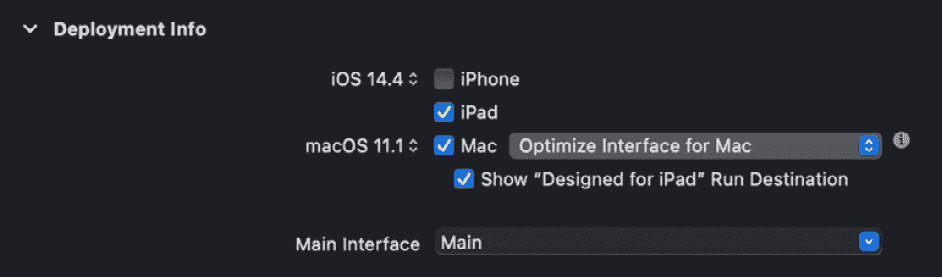
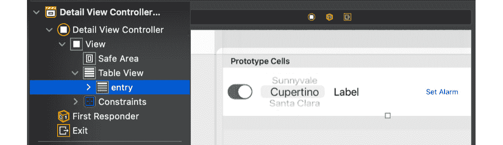
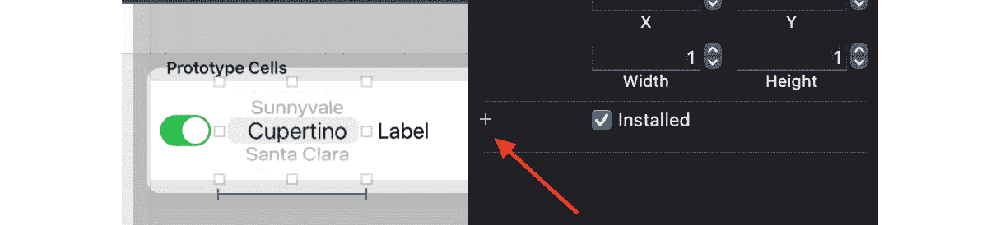
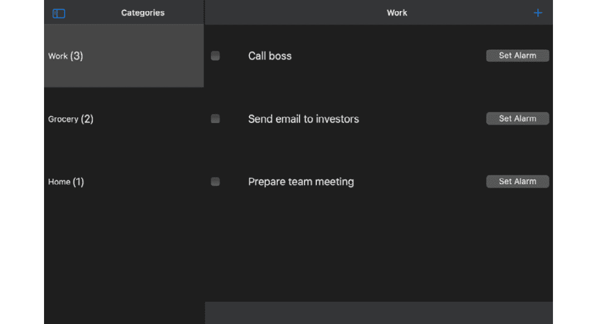
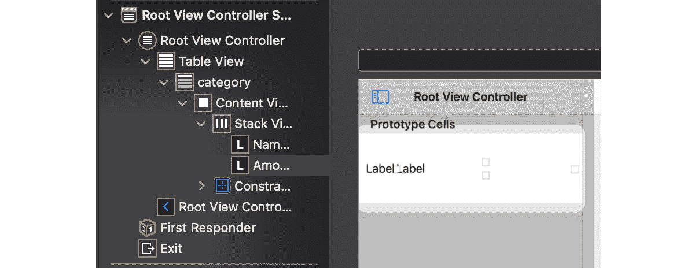
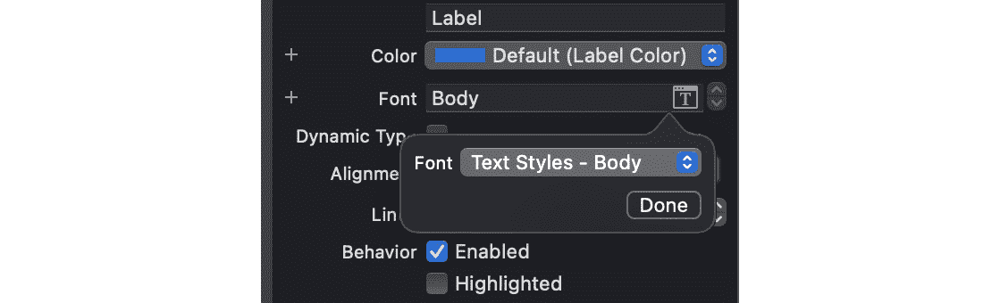
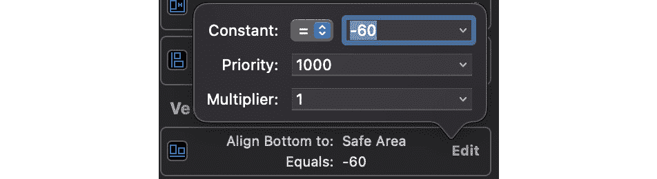
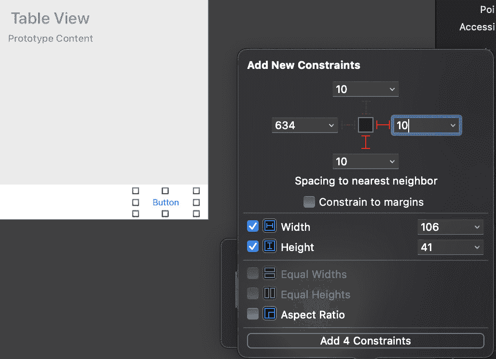

# 第十八章：*第十八章*：使用 Catalyst 创建 macOS 应用程序

在 2019 年的 WWDC 上，苹果向全球开发者推出了 Mac Catalyst。有了 Mac Catalyst，开发者可以轻松地将 iPad 应用程序带到 Mac 上。Catalyst 允许 iPad 应用程序无需太多努力即可移植到 Mac。这为 iPad 应用程序带来了全新的受众（Mac 用户），并扩大了 macOS 生态系统的可能性。

在本章中，我们将回顾 Mac Catalyst 的基础知识。我们将探索在 WWDC 2020 上引入的新功能，并使用 Catalyst 将 iPad 应用程序转换为 Mac 应用程序。我们将通过使用 Catalyst 的两种不同方式来实践这一点：**缩放界面以匹配 iPad** 和新的 **优化界面以适应 Mac** 选项。我们将比较它们之间的差异以及两种方法的优缺点。

在本章中，我们将涵盖以下主要主题：

+   探索 Mac Catalyst

+   探索新的 Mac Catalyst 功能

+   构建您的第一个 Mac Catalyst 应用程序

到本章结束时，您将能够将您的 iPad 应用程序迁移到 macOS，并在 Mac 生态系统中扩大您应用程序的受众和可能性。

# 技术要求

本章的代码包包括一个名为 `todo_start` 的入门项目及其完成版本。您可以在代码包仓库中找到它们：

[`github.com/PacktPublishing/Mastering-iOS-14-Programming-4th-Edition`](https://github.com/PacktPublishing/Mastering-iOS-14-Programming-4th-Edition)

# 探索 Mac Catalyst

Mac Catalyst 帮助开发者将他们的 iPad 应用程序带到 Mac 上。原生 Mac 应用程序可以与 iPad 应用程序共享代码，为用户和开发者创建一个统一的生态系统。

使用 Mac Catalyst，开发者可以将 iPad 上的触摸手势和控件适配到 Mac 应用程序中的鼠标和键盘控件。

当苹果在 Mac Catalyst 中为 Mac 添加对 UIKit 的支持时，它在 iPad 和 Mac 之间的兼容性方面迈出了巨大的一步。使用 SwiftUI 的应用程序则具有成为通用应用程序的优势，因此它们在两个系统上适应得更好。

一旦应用程序在 Mac Catalyst 的帮助下从 iPad 切换到 iPad + Mac，结果非常令人期待。有一个代码库可以服务于这两个平台。通过只有一个代码库，公司可以减少开发、维护和修复应用程序功能（针对两个系统）所需的时间和精力。

Mac Catalyst 也有一些缺点。目前并非每个 iOS 框架都得到支持。苹果每年都在不断增加。此外，一些第三方库可能不受支持，开发者有责任将它们从 Mac 系统中排除并寻找替代方案。

Mac Catalyst 的另一个缺点是，一些从 iPad 移植到 Mac 的应用程序可能会感觉有些脱离上下文。我指的是一些利用了重 iOS 外观和感觉的应用程序，并且直接移植到 Mac。UI 的某些元素在这两个系统中差异很大（复选框、弹出窗口、按钮的位置等）。一些应用程序可能需要一些额外的工作来将 UI 从 iPad 调整为 Mac 风格，但并非每个公司或团队都有资源、时间或意愿这样做。

为了帮助解决这个问题，Mac Catalyst 新增了一个名为**优化界面以适应 Mac**的功能。与之前的**缩放界面以匹配 iPad**选项不同，Mac Catalyst 允许这个新功能自动将一些 UIKit 控件转换为更符合 Mac 风格的控件。

在本节中，我们学习了 Mac Catalyst 的基础知识。让我们在下一节中讨论 WWDC 2020 期间展示的 Mac Catalyst 的新改进。

# 探索新的 Mac Catalyst 功能

在 WWDC 2020 期间，苹果展示了新的**优化界面以适应 Mac**方法。当我们使用这种方法将 iPad 应用程序移植到 Mac 时，它带来了与之前方法**缩放界面以匹配 iPad**的一些显著差异。差异如下：

1.  内容以 1:1 渲染。使用**缩放界面**时，视图在 Mac 上缩放到原始大小的 77%。这可能会在某些具有**AutoLayout**规则的视图中引起问题，这些规则可能会破坏或简单地改变 UI 的整体形状。现在，使用 1:1 渲染，iPad 应用程序和 Mac 应用程序将保持相同的尺寸和大小。这通过在 Mac 上不缩放文本来大大提高了文本质量；文本看起来更好，更容易阅读。

1.  macOS 控件用于 UIKit 对应项。通过新的**优化界面以适应 Mac**选项，Catalyst 使用 Mac 风格的控件而不是 iPad 应用程序中的 UIKit 控件。通过这样做，Mac 上的应用程序 UI 对 Mac 用户来说看起来更加熟悉。

1.  与前一点类似，Mac Catalyst 应用程序中使用了 macOS 字体间距和标准 macOS 间距，而不是 iPad 版本中定义的间距（它们是不同的）。

1.  通过 Catalyst，许多 iOS 框架现在可用于 Mac。例如，`AVFoundation`、`NotificationCenter`、`ReplayKit`、`StoreKit`、`MessageUI`以及更多。

1.  在 iOS 上增加了对物理键盘事件的支持。现在它们在 Mac Catalyst 上也可用，游戏可以从中受益。

1.  现在可用 tvOS 的焦点引擎。

1.  `tableViews`和`collectionViews`中的`.selectionFollowsFocus`现在可用。

1.  现在我们可以根据需要隐藏 Mac 上的光标。

1.  新增了颜色轮和颜色选择器。

1.  `UISplitViewController`现在支持三列。

1.  完全支持`SFSymbols`。

1.  Mac Catalyst 的新扩展，如照片编辑扩展，现在可用。

1.  由于 Catalyst，WidgetKit 的小部件也从 iPad 扩展到 Mac。

1.  用户可以享受通用购买（在 iPad 上购买项目并在 Mac 应用程序中使用）。

1.  新的工具栏样式。

在本章的后面部分，当使用这两种方法构建应用程序时，你将能够看到这些差异，并且你将应用必要的修复和步骤来避免在你的应用程序中出现这些问题。

在本节中，我们了解了 2020 年为 Mac Catalyst 推出的新功能。现在，让我们在下一节开始构建我们的第一个 Mac Catalyst 应用程序！

# 构建你的第一个 Mac Catalyst 应用程序

在本节中，我们将开始使用一个简单的 iPad 待办事项应用程序，并使用两种不同的技术将其转换为 macOS 应用程序。基本应用程序非常基础（你甚至无法向其中添加新的待办事项元素！）但它说明了从 iPad 到 Mac 转换时需要经历哪些类型的错误、UI 修改和方法。

我们将遵循以下步骤：

1.  首先，我们将探索 iPad 应用程序本身，以了解其基本元素和组件。

1.  然后，我们将使用第一种方法使其与 macOS 兼容：**将界面缩放以匹配 iPad**。

1.  最后，我们将使用新的方法，**优化界面以匹配 Mac**。我们将将其与**缩放界面**方法进行比较，以便匹配 iPad 方法，这样你将了解何时使用一个或另一个，这取决于你的应用程序。

让我们从探索我们的 iPad 待办事项应用程序开始！

## 探索 iPad 应用程序

在本节中，我们将快速查看基本应用程序及其组件，以便在理解我们在做什么的同时对其进行修改。

你可以在本书的代码包中找到代码。项目名称是`todo_start`。继续打开项目。构建并运行它。你应该在横幅模式下的 iPad 模拟器中看到类似这样的内容：

![图 18.1 – 待办事项应用横幅模式

![img/Figure_18.01_B14717.jpg]

图 18.1 – 待办事项应用横幅模式

如果你熟悉 iPad 应用程序，你将能够从这些屏幕截图中发现，此 iPad 应用程序的主要组件是`SplitViewController`。`SplitViewController`通常在其内部有两个或三个列（`UIViewController`实例）。在我们的例子中，我们有两个：左侧的侧边菜单和右侧的详细面板（在横幅模式下）。在纵向模式下，侧边菜单变为弹出菜单，详细面板是主视图。

让我们快速检查项目结构和突出显示其中的最重要文件：

+   `MasterViewController.swift`文件包含`MasterViewController`，它是`SplitViewController`的侧边菜单。它有一个表格视图及其相应的表格视图单元格（`CategoryTableViewCell`）。

+   `DetailViewController.swift`文件包含`DetailViewController`，它是`SplitViewController`的详细视图。它有一个表格视图，以及相应的表格视图单元格（`EntryTableViewCell`）。

+   `Datasource.swift` 文件包含了项目的 `Datasource`，它使用 `load() -> [Category]` 方法为视图控制器提供待办事项列表。它还包含了我们待办项目的模型。待办事项列表是通过类别（如工作、杂货或家庭）以及这些类别内的条目（如“给我的老板打电话”）构建的。`Datasource.swift` 文件包含代表这些模型的结构体：`Category`、`Entry` 和 `Priority`。在现实世界的应用中，你会将这些模型分别放入自己的文件/目录中，但为了简单起见，我们将它们保留在 `Datasource` 本身中。

因此，为了总结应用组件，侧边菜单（`MasterViewController`）以表格的形式显示待办事项类别的列表（`Category` 和 `CategoryTableViewCell` 实例）。当选择一个类别时，详细视图（`DetailViewController`）显示一个包含不同待办事项条目的表格（`Entry` 和 `EntryTableViewCell` 实例）。所有数据都由 `Datasource` 提供。

每个类别中待办事项的条目由包含每个待办事项不同信息的单元格表示（`EntryTableViewCell`）：

![Figure 18.2 – Entry cell]

![img/Figure_18.02_B14717.jpg]

图 18.2 – 条目单元格

这些表格视图单元格包含以下内容：

+   一个 `UISwitch` 用于表示待办事项是挂起还是完成。

+   一个 `UIPickerView` 用于表示任务的优先级（**高**、**中**或**低**）。

+   一个 `UILabel` 用于描述任务。

+   一个 `UIButton` 用于设置任务中的闹钟。

在右上角还有一个额外的按钮：

![Figure 18.3 – Add to-do button]

![img/Figure_18.03_B14717.jpg]

图 18.3 – 添加待办事项按钮

此按钮表示允许用户向待办事项列表添加新条目的操作。

目前除了显示这些元素本身之外，没有任何功能，但你在本章后面会理解为什么每个元素都存在。这是一个简单易用的应用，对吧？现在让我们从 iPad 到 Mac 开始转换过程！

## 为 Mac 调整你的 iPad 应用

在本节中，我们将使用 Mac Catalyst 的 **Scale Interface to Match iPad** 方法将 iPad 应用转换为 Mac 兼容的应用。这是苹果首次引入的将 iPad 应用轻松转换为 Mac 应用的方法。

从当前部分打开项目并转到项目导航器。在 **Deployment Info** 部分勾选 **Mac** 复选框，并在弹出窗口中按 **Enable**：

![Figure 18.4 – Enabling Mac support]

![img/Figure_18.04_B14717.jpg]

图 18.4 – 启用 Mac 支持

确保选项设置为 **Scale Interface to Match iPad**。

现在，使用 Mac 作为目标设备构建并运行应用。你应该看到以下 UI：

![Figure 18.5 – The Mac version of the to-do app]

![img/Figure_18.05_B14717.jpg]

图 18.5 – 待办事项应用的 Mac 版本

这非常简单！诚然，我们的示例应用程序非常简单直接。但通过简单的点击，它已经兼容并且“可用”在 Mac 上。我们没有做任何工作！然而，尽管应用程序可用，但它没有 Mac 风格。让我们列出一些与传统 Mac 应用程序不同的元素：

+   Mac 应用程序不使用工具栏来包含诸如**+**符号之类的操作。这些操作通常位于右下角。

+   例如**设置闹钟**的按钮看起来不像 Mac 按钮。

+   Mac 应用程序不太使用这种类型的 Picker。

+   Mac 应用程序使用复选框而不是开关。

+   视图已缩放到原始尺寸的 77%。这可能会破坏您代码中的某些约束，您可能需要审查 UI 的部分。

您的 iPad 应用程序在 iPad 上具有越复杂的 UI，使用这种方法就越感觉不像 Mac。但我们不能抱怨太多；我们只是通过一键使其兼容！

这个迭代始终是移植您的 iPad 应用程序到 Mac 的第一步。现在我们有了 Mac 应用程序，我们将致力于改进 UI，使其看起来更像 Mac。为此，我们将使用苹果公司创建的新方法：**Optimize Interface for Mac**。这种方法有其优点和缺点，我们将在下一节中看到它们。

## 优化 iPad 应用程序以适应 Mac

在本节中，我们将使用 iPad 应用程序上的**Optimize Interface for Mac**选项，并学习如何将结果调整以适应我们应用程序上预期的 Mac 风格界面。

在项目导航器中，在**Deployment Info**部分，将 Mac 选项更改为**Optimize Interface for Mac**：



图 18.6 – 使用 Optimize Interface for Mac

选择此选项后，将目标更改为 Mac 并启动应用程序。您应该会收到以下崩溃信息：

```swift
[General] UIPickerView is not supported when running Catalyst apps in the Mac idiom.
```

当我们使用此示例中显示的`UIPickerView`实例时，我们没有遇到任何问题。一个解决方案可能是使用 SwiftUI 的 Picker（在`ComboBox`下可用）。

我们现在将学习如何根据运行它的设备来使用或不在我们的应用程序中使用特定的组件。我们将在这个 iPad 上安装这个`UIPickerView`，但我们将从 Mac 版本中移除它（为了现在能够编译）。我们将通过使用 Storyboard 变体来实现这一点。

Storyboard 变体可以帮助我们根据某些参数（如设备、屏幕宽度、高度和色域）在视图控制器中安装或卸载特定组件。

让我们在应用程序在 Mac 上运行时从单元格中卸载`UIPickerView`。按照以下步骤操作：

1.  打开`Main.storyboard`文件并转到**Detail View Controller**。选择**entry**单元格原型：

    图 18.7 – Detail View Controller

1.  现在，选择单元格的`UIPickerView`，并在其**属性检查器**窗口中，通过点击**+**符号在**已安装**部分添加一个变体：

    图 18.8 – 添加已安装变体

1.  在出现的弹出窗口中，从**方言**选择器中选择**Mac**：

    图 18.9 – 添加 Mac 方言变体

1.  现在，您想要取消选中新的变体，这样这个组件就不会在 Mac 方言中安装：


图 18.10 – 卸载 Mac 方言变体

太好了！通过在故事板中使用变体，您可以根据运行它的设备和其它因素来指定安装某些组件的时间！现在尝试再次启动应用，以 Mac 为目标。这次，应用应该不会崩溃，您将看到以下屏幕：



图 18.11 – 为待办事项应用 Mac 版本的第一次优化

太好了！我们成功地使用故事板变体来适配我们应用的 Mac 版本。理想情况下，您现在应该找到一个适用于 Mac 的替代`UIPickerView`（SwiftUI 的 Picker 是一个例子）。这将是您的家庭作业！

你可以在前面的屏幕截图中看到，当使用**优化界面**选项将 iPad 应用转换为 Mac 时，仍然存在一些常见问题：

+   在**类别**表格单元格中，字体大小与数字字体大小不同。在我们的 iPad 应用中，字体大小是相同的。以**工作（3）**的字体大小为例，仔细查看一下。

+   Mac 应用不使用工具栏中的按钮，如**+**。此类操作最常见的地方是窗口的右下角。

接下来让我们处理这两个问题。打开`Main.storyboard`文件，检查**根视图控制器**表格中标签使用的字体：



图 18.12 – 根视图控制器单元格标签

如果您查看这两个标签中使用的字体大小，它们并不相同。第一个标签使用的是**正文**字体。第二个标签使用的是**系统 - 17.0**字体。但为什么在**缩放界面以匹配 iPad**中它们看起来一样呢？原因是，在那个选项中，视图被缩放到原始大小的 77%，两种字体看起来都一样。但在**优化界面以匹配 Mac**中，视图保持 1:1 的比例，预定义的文本样式会适应视图内容大小。因此，如果您打算使用带有**优化界面**的 iPad 应用在 Mac 上，最好的做法是在您的整个应用中使用这些预定义的样式。您将不必根据设备进行调整。

为了解决这个问题，请在标签属性检查器中将**系统 – 17.0**字体更改为**正文**字体：



图 18.13 – 使用文本样式

现在在 Mac 目标上运行应用：


图 18.14 – 在 Mac 上新的字体样式结果

如前一个截图所示，**工作**和**(3**)的字体大小现在相同。如果你在 iPad 上运行应用，它们也将相同。我们不再有任何差异。

在这个修复到位后，是我们时候在`DetailViewController`上隐藏工具栏了。Mac 应用不使用工具栏来显示单个动作，就像我们现在所做的那样：


图 18.15 – 带有右侧动作按钮的工具栏

我们学习了如何使用故事板变体来显示/隐藏元素，但对于这个工具栏，我们将以编程方式来做。组件仍然会被安装，但我们将在 Mac 上隐藏它。打开`DetailViewController`文件，并更改`viewWillAppear`方法实现：

```swift
override func viewWillAppear(_ animated: Bool) {
  super.viewWillAppear(animated)
  if traitCollection.userInterfaceIdiom == .mac {
    navigationController?.setToolbarHidden(true, animated: false)
  } else {
    navigationItem.rightBarButtonItem = UIBarButtonItem(barButtonSystemItem: .add, target: self, action: #selector(createTapped))
    navigationController?.setToolbarHidden(false, animated: animated)
  }
}
```

检查高亮的代码。我们能够通过使用`traitCollection`的`userInterfaceIdiom`属性来检测我们正在哪个设备上启动应用。当它是`.mac`时，我们隐藏工具栏，并且当我们处于其他设备（如 iPad）上时，仅添加右侧的**+**按钮。

如果你构建并执行 Mac 目标上的应用，**+**按钮消失了。太好了！但现在我们无法创建新的待办事项！我们失去了对 Mac 上此按钮的访问。我们需要以不同的方式适应这种场景。

传统上，对于 Mac 界面，选择`Main.storyboard`文件。选择**详细视图控制器**的表格视图：


图 18.16 – 详细视图控制器表格视图

现在我们将在控制器的底部为一个新的按钮腾出空间，但仅限于 Mac。请按照以下步骤操作：

1.  进入**详细视图控制器**的**表格视图**的大小检查器。

1.  编辑将表格视图底部与控制器底部连接的约束，`-60`：

    图 18.17 – 编辑表格视图底部约束

1.  现在在视图控制器和表格之间添加一个新的`UIButton`。将按钮标题设置为**创建**。添加以下截图显示的四个约束：

    图 18.18 – 添加新按钮

1.  现在从表格拖动到新添加的**创建**按钮，添加一个**垂直间距**约束（你可以按住*Ctrl*拖动）。

1.  我们想为按钮添加一个变体。我们希望按钮仅适用于 Mac 方言。所以，请为 Mac 添加一个变体，并取消选中默认选项（就像我们在本章之前为`UIPickerView`所做的那样）。通过这样做，按钮将仅在 Mac 设备上可见：![图 18.19 – 仅在 Mac 中安装新按钮

    ![图 18.19 – Mac 应用程序最终版本

    图 18.19 – 仅在 Mac 中安装新按钮

1.  如果您操作得当，如果使用 iPad 作为预览设备，按钮应该会在故事板中消失。您可以将设备更改为**Mac**，使用**Mac 方言**（*而不是 Mac 与 iPad 方言！*），它将再次显示（您可以在故事板窗口的底部选项中这样做）：![图 18.20 – 设备预览选择

    ![图 18.20 – 设备预览选择

    图 18.20 – 设备预览选择

1.  最后，我们需要再次编辑此列表中第 2 项的约束条件。您已向其中添加了`-60`常数。现在我们想将其恢复到`0`，就像之前一样。

现在请使用 iPad 目标执行应用程序。您应该仍然在右上角看到**+**符号，并且看不到底部的**创建**按钮。现在在 Mac 目标上执行它。您应该在控制台上得到以下错误：

```swift
[LayoutConstraints] Unable to simultaneously satisfy constraints.
```

这是因为我们添加了两个不能共存的不同约束条件：

+   `0`

+   `9`

实际上，我们需要两个常数，一个用于 iPad 设备，另一个仅适用于 Mac。请将其中一个常数的优先级更改为`250`：

![图 18.21 – 更改约束优先级

![图 18.21 – Mac 的初始缩放版本

图 18.21 – 更改约束优先级

通过这种方式，我们可以同时保留两个约束条件，但它们不会相互排斥。当没有安装 Mac 按钮时，该约束条件将不会生效，另一个约束条件将应用（将表视图底部与安全区域底部对齐）。请使用 Mac 目标执行应用程序：

![图 18.22 – Mac 应用程序最终版本

![图 18.22 – Mac 应用程序最终版本

图 18.22 – Mac 应用程序最终版本

看起来很棒！现在我们有了两种不同的 UI 变体，一个用于 iPad，另一个更适合 Mac 标准。现在将其与**缩放界面以匹配 iPad**为我们提供的之前的 iPad 外观版本进行比较：

![图 18.23 – Mac 的初始缩放版本

![图 18.23 – Mac 的初始缩放版本

图 18.23 – Mac 的初始缩放版本

如您所见，这相当不同！新版本感觉更符合 Mac 原生风格。按钮、工具栏、控件位置以及元素的整体缩放感觉对 Mac 版本来说要好得多。这需要做更多的工作，但结果是值得的。您始终可以将 iPad 应用程序的初始端口移植到 Mac，使用**缩放界面以匹配 iPad**，然后稍后对**优化界面以匹配 Mac**进行工作！

在本节中，我们从简单的待办事项 iPad 应用开始。我们使用 Mac Catalyst 将其移植到 Mac。首先，我们使用了**将界面缩放以匹配 iPad**选项，使应用一键即可在 Mac 上使用。但随后，我们希望改进 UI，使其更符合 Mac 标准，因此我们使用了新的**优化界面以适应 Mac**选项。这个选项不像缩放选项那样直接，我们不得不调整某些尺寸，删除一些在 Mac 上不可用的 UI 控件，并为 Mac 创建不同的变体。但结果看起来很棒！

现在我们用总结来结束这一章。

# 总结

我们以简短的 Mac Catalyst 介绍开始了这一章。我们解释了苹果如何通过 Mac Catalyst 为开发者提供了一种简单的方法，将 iPad 应用移植到 Mac 应用，以及这一新特性带来的所有好处。

然后，我们讨论了 2020 年 Mac Catalyst 的最新改进和变化。在这些新特性中，我们提到了**优化界面以适应 Mac**的含义，以及它是如何增强 iPad 应用，使其成为优秀的 Mac 应用的。

最后，以 iPad 应用为起点，我们使用 Mac Catalyst 的两种方法：**将界面缩放以匹配 iPad**和**优化界面以适应 Mac**，创建了 Mac 版本。我们展示了它们的优缺点，并应用了你在使用这两种方法时最常遇到的修复和改进。通过将它们与同一应用进行比较，你对它们之间的主要区别以及何时应用哪一个或另一个有了了解。

在下一章，我们将学习如何以及何时测试你的代码。
