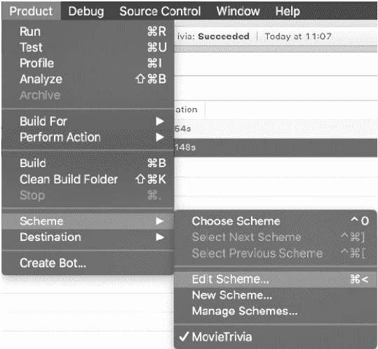
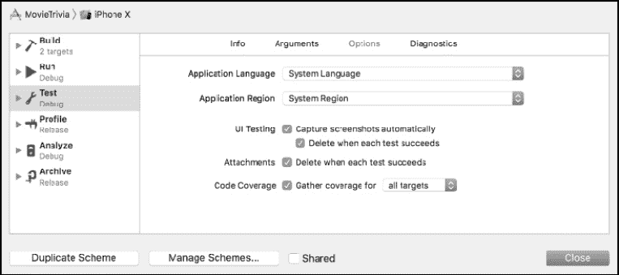
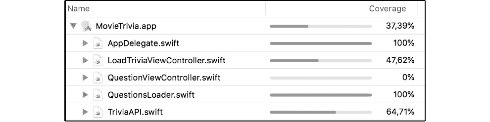
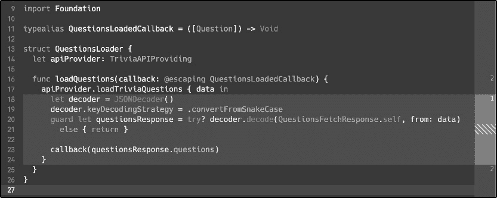
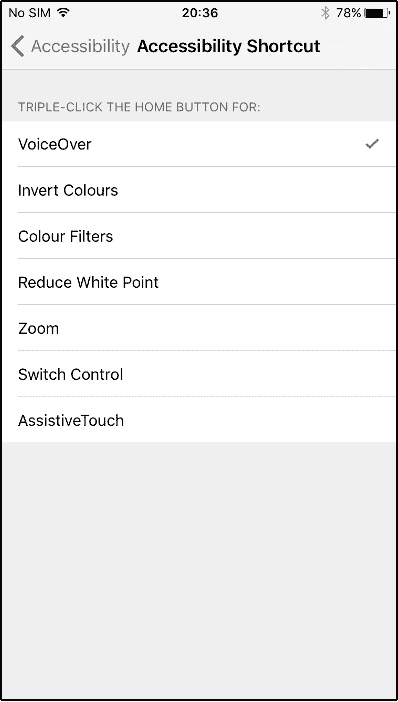
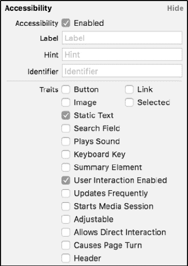
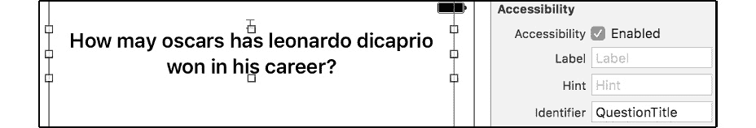

# *第十九章*：通过测试确保应用质量

到目前为止的所有章节中，主要关注的是作为应用一部分运行的代码。你开发的应用程序较小，可以轻松手动测试。然而，如果你的应用程序变得更大，这种方法就不太适用了。如果你想要验证大量的不同用户输入、多个屏幕、复杂的逻辑，或者你打算在许多不同的设备上运行测试，这种方法同样不适用。

Xcode 自带内置的测试工具。这些工具允许你编写测试，以确保你的应用中的所有业务逻辑按预期工作。更重要的是，你可以测试用户界面在许多不同的自动化场景中是否按预期功能和表现。

许多开发者倾向于回避测试，直到项目结束时才进行，或者根本不进行测试。原因通常是因为很难想出如何编写合适的测试。如果你刚开始接触测试，这一点尤其正确。许多开发者觉得他们测试的逻辑中的大部分内容非常明显，为这种逻辑编写测试似乎很荒谬。如果测试方法不正确，它可能会成为负担而不是解脱，因为维护成本高且没有测试代码的关键区域。

本章作为使用 Xcode 及其内置工具编写逻辑和用户界面测试的介绍。到本章结束时，你应该能够设置一个健壮的测试套件，并了解如何利用 Xcode 提供的工具编写可测试且可靠的代码。本章涵盖了以下主题：

+   使用 XCTest 测试逻辑

+   优化代码以进行测试

+   使用 XCUITest 测试用户界面

# 使用 XCTest 测试逻辑

本节将帮助你发现 iOS 上`XCTest`的测试能力。即使你之前没有编写过任何测试，你可能也有自己的想法或想法。要开始测试代码，你不需要拥有计算机科学学位或花费几天时间学习测试代码的绝对最佳方法。实际上，你很可能已经在测试你的代码，而你甚至不知道这一点。

那么，测试代码究竟意味着什么呢？本节旨在阐明这一点。首先，你将了解你可以编写的不同类型的测试。然后，你将学习`XCTest`是什么以及如何为应用设置测试套件。最后，你将学习如何最优地测试实际代码，以及代码如何重构以使其更易于测试。

## 理解测试代码的含义

当你测试代码时，你实际上是在确保某些输入产生预期的输出。一个非常基础的测试例子就是确保调用一个将输入增加给定值的函数会产生你预期的输出。

每次你启动你的应用程序并在其中执行任何操作时，你实际上都在测试你的代码的某个部分。每次你向控制台打印某些内容以验证预期的值被打印出来时，你也在测试你的代码。一旦你这样思考测试，之前可能听起来很困难的概念实际上并不像你可能认为的那么复杂。所以，如果你只是通过使用你的应用程序，实际上已经在测试它了，那么，你应该为哪些内容编写测试呢？让我们看看如何确定何时为你的代码编写测试。

### 确定要编写哪些测试

当你开始测试时，通常很难决定你想要测试哪些逻辑，不想要测试哪些逻辑。造成这种情况的原因可能包括某些逻辑过于简单、过于复杂，或者不够重要以至于不值得测试。这个陈述意味着你不需要测试应用程序中的每一行代码，这是故意的。有时为代码的某个部分编写测试是不合理的。例如，你不需要测试`UIKit`是否按预期工作；确保他们发布的框架没有错误是苹果的工作。

确定要测试的内容很重要，而且你推迟决定是否为特定逻辑添加测试的时间越长，编写测试就越困难。一个简单的经验法则是你不需要测试苹果的框架。可以安全地假设苹果会确保他们发布的任何代码都经过测试，而且如果其中包含错误，你实际上也无法做太多来修复它。此外，你不想让你的测试在苹果的测试应该失败的地方失败。

你至少应该测试的是你的方法、结构和类的*调用点*。你可以将调用点视为其他对象用来执行任务的那些方法。将任何未被调用点使用的对象部分设为私有是一个好的实践，这意味着外部代码无法访问这部分代码。我们将在你学习更多关于重构代码以提高可测试性时再详细讨论这一点。

你还应该测试那些你可能认为太简单而不值得编写测试的代码。这些代码部分在开发过程的其它部分也可能被忽视。这通常会导致你和你的同事越来越不重视这些简单的代码片段，而当你意识到这一点时，可能已经引入了可能直到应用在 App Store 中才会被发现的错误。为简单的代码编写简单的测试几乎不需要时间，并且可以防止可能导致重大复杂性的小疏忽。

当你编写测试时，你应该遵循的一些简单指南如下：

+   **测试简单的代码**：这通常需要最少的努力。

+   **测试你的对象的调用点**：这些测试将确保你的公共 API 是一致的并且按预期工作。

+   **不要测试苹果的框架或任何其他依赖项**：做这件事是框架供应商的责任。

一旦你确定了应该测试什么，就是开始编写实际测试的时候了。然而，如果你之前听说过测试，你可能听说过诸如集成测试、单元测试、健全性测试以及其他几个术语。接下来的部分解释了几个最重要和最知名的测试类型。

### 选择正确的测试类型

当你编写测试时，通常一个好的想法是问问自己你正在编写什么类型的测试。你想要编写的测试类型通常会指导你如何构建和范围化你的测试。拥有范围明确、结构化和专注的测试将确保你构建的是一个稳定的测试套件，它能够正确地测试你的代码，而不会产生意外的副作用，这些副作用会影响测试的质量。现在让我们深入了解以下几种测试类型：单元测试和集成测试。

#### 单元测试

可能最知名的一种测试类型是单元测试。很多人把写的任何其他测试都称为**单元测试**，这可能是为什么这个术语在测试中如此知名。单元测试之所以如此受欢迎的另一个原因是它是一种非常合理的测试类型。

单元测试的目的是确保一个隔离的对象按预期工作。这个隔离的对象通常是一个类或结构体，但它也可以是一个独立的方法。单元测试不依赖于任何其他测试或对象是很重要的。设置一个包含你单元测试所需所有先决条件的环境是完全可以接受的，但这个设置不应该是不经意的。例如，你不应该不经意地测试其他对象或依赖于测试执行的顺序。

当你编写单元测试时，创建存储在数组中的模型实例以表示模拟数据库或伪造 REST API 是常见的。创建这样的模拟数据列表是为了确保单元测试不会因为外部因素（如网络错误）而失败。如果你的测试应该依赖于某些外部因素，那么你很可能正在编写一个**集成测试**。

#### 集成测试

集成测试确保你的代码的某个部分可以与其他系统组件集成。与单元测试类似，集成测试不应依赖于其他测试。这对于你编写的任何测试都很重要。每当一个测试依赖于某些先决条件时，它们必须在测试本身内设置。如果你的测试确实依赖于其他测试，这种依赖性可能一开始并不明显，但它可能导致你的测试以奇怪和意想不到的方式失败。

因为没有测试可以依赖于另一个测试，集成测试需要比单元测试更多的设置。例如，你可能需要设置一个 API 辅助工具，从 API 获取一些数据，并将其输入到数据库中。这样的测试可以验证 API 辅助工具能否与数据库层协同工作。这两个层都应该有它们各自的单元测试，以确保它们在独立工作时正常工作，而集成测试确保数据库和 API 可以协同工作。你可以编写或学习许多其他类型的测试，但就目前而言，集成测试和单元测试提供了一个极好的起点。

### 隔离测试

假设在你测试时是一个相当大的风险。任何时候你对你正在测试的环境中的任何假设，你的测试都不是可靠的。如果你刚开始编写测试，可能会倾向于做出假设，例如“我正在模拟器上测试，我的测试用户总是登录，因此我的测试可以假设存在一个已登录的用户”。这个假设对很多人来说很有道理，但如果你中的一个测试导致当前用户注销怎么办？

当这种情况发生时，由于你对测试环境所做的假设，你的一些测试将失败。更重要的是，即使它们正在测试的代码工作得完美无缺，这些测试也可能失败。

如前所述，测试应该测试你应用中的单个功能。它们应该尽可能少地依赖外部代码，并且应该有适当的焦点。人们用来结构化测试并提高可靠性的典型模式是 3-As 或 AAA 方法。这个模式的名称是“安排（Arrange）”、“行动（Act）”和“断言（Assert）”的缩写。以下是对每个“A”的解释。

#### 安排

安排步骤完全是关于准备。确保存在一个已登录的用户，填充（内存中的）数据库，并创建你的模拟 API 或其他辅助工具的实例。你实际上是为你的测试环境安排好一切。请注意，这一步骤不应涉及太多的设置。如果你发现自己正在安排步骤中编写大量代码，那么你的测试可能太宽泛了。或者，你正在测试的代码依赖于太多的其他代码。你无法总是避免这种情况，但如果发生了，确保你考虑重构你的代码和测试，以保持与你要实现的目标相当的质量。

#### 行动

在行动步骤中，你启动你的测试。你调用你要测试的对象上的方法，给它提供数据，并对其进行操作。这是你让你的代码进行比喻性试驾的地方。但是不要连续执行太多操作；太多的操作会在下一个步骤，即断言步骤中导致问题。

#### 断言

3-As 方法中的最后一个 A 是断言。在断言步骤中，你确保你正在测试的对象的状态是你所期望的。在单个测试中，你可以多次使用行动和断言。例如，你可能想断言做一次操作将对象置于特定的状态，而再次做同样的操作将对象置于另一个状态。或者可能是状态保持不变。就像其他两个步骤一样，如果你在断言很多事物，或者如果你在测试中反复行动和断言，那么你的测试可能太宽泛了。这有时是无法避免的，但包含大量行动和断言的长测试通常表明一次测试了太多内容。

阅读有关测试的内容可能会相当枯燥，而且它往往很快就会变得抽象，所以现在我们先放下理论。你将在 Xcode 中为现有项目设置一个测试套件，并开始编写一些测试，这样你之前所学的所有信息就会变得更加具体。

## 使用 XCTest 设置测试套件

在本节中，你将为一个新应用程序工作：`Info.plist` 文件，以及你通常在项目中期望找到的所有其他文件。项目中还有一个名为 `TriviaQuestions.json` 的 JSON 文件。这个文件包含了一些模拟问题，你可以通过在 `LoadTriviaViewController.swift` 中取消注释一些代码来加载这些问题。

默认情况下，`LoadTriviaViewController.swift`试图从一个不存在的网络服务器加载问题。这是故意的，以展示如何通常设置这样的项目。由于你现在没有可用的网络服务器，你可以用 JSON 文件替换模拟的网络代码来测试这个应用程序。

在你编写测试或执行任何优化之前，你必须将一个测试目标添加到项目中。你添加测试目标的方式与你之前添加扩展的方式相同。唯一的区别是，你选择了一个不同的目标类型。在添加测试目标时，你应该选择**iOS 单元测试包**模板。以下截图显示了你应该选择的正确模板：

![Figure 19.1 – 添加单元测试目标]

![img/Figure_19.01_B14717.jpg]

Figure 19.1 – 添加单元测试目标

添加目标后，Xcode 会在你的项目中添加一个新的文件夹。如果你选择测试目标的默认名称，它被称为`MovieTriviaTests`。你应该将你为这个项目编写的所有测试添加到测试目标中。

如果你思考过在多个目标中使用具有扩展名的文件时的情况，你可能预期你需要将所有你想要为它们编写测试的文件添加到这两个目标中。幸运的是，情况并非如此。当你编写测试时，你可以将整个应用程序作为一个可测试的目标导入，这样你就可以为应用程序目标中的所有代码编写测试。

如果你查看 Xcode 在你添加单元测试目标时创建的 `MovieTriviaTests` 文件夹，你会找到一个名为 `MovieTriviaTests.swift` 的单个文件。这个文件包含了一些关于你的测试套件中测试应该是什么样子的提示。首先，请注意，测试类继承自 `XCTestCase`。所有你的测试类都应该继承自这个 `XCTestCase`，这样它们才能被识别为测试。

测试模板中你会找到的一种方法是 `setUp()` 方法。这个方法在文件中的每个测试之前执行，帮助你完成测试中的 AAA 模式的第一阶段：准备。你使用这个方法来确保你的测试的所有前提条件都得到满足。你可以确保用户已经登录或者数据库中已经填充了测试数据。当然，这个方法中设置的深度取决于你要为哪个代码单元编写测试。

此外，请注意，在 `test` 类中有两个以 `test` 前缀的方法。这些方法作为测试执行，并预期执行操作和断言步骤。大部分工作应该在这些测试方法中完成。请注意，拥有多个简短的测试方法通常比一个测试所有内容的单一测试方法要好。方法越大，维护和调试测试就越困难。

最后，你会找到一个 `tearDown()` 方法。这个方法旨在给你一个清理的机会。当你已经将模拟数据插入到数据库中时，在测试完成后删除这些数据通常是期望的。这将确保为下一个运行的测试提供一个干净的起点，并最小化第一个测试意外影响第二个测试的机会。如前所述，测试不应依赖于其他测试。这意味着你也不想通过留下前一个测试的痕迹来污染其他测试。

注意，`setUp()` 和 `tearDown()` 应该针对你正在测试的单元是特定的。这意味着你不能把所有的测试都放在一个类中。将测试分成几个类是一个好主意。你应该为每个你正在测试的代码单元创建一个测试类。一个测试类通常不应该测试你应用中的单个类或结构体。如果你正在编写集成测试，测试中可能涉及多个类，但你仍然应该确保你只测试一个东西，即你正在测试的集成中涉及的类之间的集成。

现在你已经建立了一个测试套件，让我们看看你如何为 **MovieTrivia** 应用中现有的代码编写测试，以及应用如何被重构以适当地进行测试。

# 优化代码以提高可测试性

现在项目有了测试目标，是时候开始向其中添加一些测试了。在你添加测试之前，你应该确定要测试什么。花些时间查看应用程序和代码，并尝试思考要测试的内容。假设应用程序已完成，并且 Trivia 问题是从服务器加载的。

你可能考虑过的一些测试事项如下：

+   确保我们可以显示我们从网络加载的数据

+   测试选择正确答案是否触发预期的代码

+   测试选择错误答案是否触发预期的代码

+   确保在显示最后一个问题之后显示第一个问题

+   测试问题索引是否递增

如果你想到了这个列表上的大多数测试，做得好。你已经成功地识别了许多好的测试用例。但是，你如何测试这些用例呢？项目有意被设计成难以测试，但让我们看看在不立即重构应用程序的情况下可以编写哪些测试。

删除 Xcode 为你生成的测试类，并创建一个新的名为`LoadQuestionsTest`的类。使用以下样板代码作为此文件实现的测试起点：

```swift
import XCTest
@testable import MovieTrivia
typealias JSON = [String: Any]
class LoadQuestionsTest: XCTestCase {
  override func setUp() {
    super.setUp()
  }
  func testLoadQuestions() {
  }
}
```

注意文件顶部的`@testable`导入`MovieTrivia`行。这一行导入了整个应用程序目标，以便你可以在测试中访问它。在实现`testLoadQuestions`的测试主体之前，明智的做法是思考这个方法应该测试什么。如果你查看应用程序目标中的代码，Trivia 问题是在`LoadTriviaViewController`的`viewDidAppear(_:)`方法中加载的。一旦问题加载，应用程序就会转到下一个屏幕。一个重要的细节是，一旦问题加载，`LoadTriviaViewController`上的`triviaJSON`属性就会被设置。

基于这些信息，你可以编写一个测试，创建一个`LoadTriviaViewController`的实例，使其显示出来，以便加载问题，然后等待`triviaJSON`有值以验证问题是否成功加载。编写符合这种描述的测试将涉及许多移动部件，远远超过你应该感到舒适的范畴。"MovieTrivia"使用故事板，因此要获取`LoadTriviaViewController`的实例，故事板必须被涉及。这意味着用户界面中的任何更改或错误都会导致检查数据是否加载的逻辑测试失败。这不是所希望的，因为这项测试应该只验证是否可以加载数据，而不是在加载完成后用户界面是否更新。

这是一个开始重构一些代码并使其更具可测试性的好时机。首先应该彻底翻新的代码是问题加载代码。

## 介绍问题加载器

为了使`MovieTrivia`更容易进行测试，你应该创建一个特殊的辅助工具来加载问题。这个辅助工具将访问网络并获取问题。一旦数据被加载，就会调用一个回调来通知发起请求的对象已加载的问题。因为你已经知道你将要对新的辅助工具编写测试，你应该考虑一种方法来确保辅助工具可以与离线和在线实现一起工作，这样测试就不需要依赖互联网连接来运行。

由于测试应该尽可能少地依赖外部因素，从测试中移除网络层将是一个很好的选择。这意味着辅助工具需要分成两部分。一部分是辅助工具本身。另一部分将是一个数据获取器。数据获取器应该符合一个定义数据获取器必须具有的接口的协议，这样你就可以选择将在线或离线获取器注入到辅助工具中。

如果前面的解释对你来说有点抽象和令人困惑，那没关系。以下代码示例将逐步展示分离不同辅助工具的过程。向应用程序目标添加一个新的 Swift 文件，并将其命名为`QuestionsLoader.swift`。然后向其中添加以下实现：

```swift
typealias JSON = [String: Any]
typealias QuestionsLoadedCallback = (JSON) -> Void
struct QuestionsLoader {
  func loadQuestions(callback: @escaping 
   QuestionsLoadedCallback) {
    guard let url = URL(string: 
      "http://questions.movietrivia.json")
      else { return }
    URLSession.shared.dataTask(with: url) { data, response,
     error in guard let data = data, let jsonObject = try? 
      JSONSerialization.jsonObject(with: data, options: 
       []), let json = jsonObject as? JSON
    else { return }
    callback(json)
    }
  }
}
```

这个结构定义了一个使用回调加载问题的方法。这已经很好了，比之前更容易进行测试。现在你可以将问题加载器隔离出来，并单独对其进行测试。当前状态的辅助工具的测试看起来可能像以下代码片段中显示的测试：

```swift
func testLoadQuestions() {
  let questionsLoader = QuestionsLoader()
  let questionsLoadedExpectation = expectation(description: 
    "Expected the questions to be loaded")
  questionsLoader.loadQuestions { _ in
    questionsLoadedExpectation.fulfill()
  }
  waitForExpectations(timeout: 5, handler: nil)
}
```

前面的测试创建了一个`QuestionLoader`实例并设置了一个期望。期望用于你最终期望测试中发生某些事情时。由于`QuestionLoader`异步加载问题，你不能期望在测试方法执行完毕时问题已经被加载。当问题被加载时调用的回调用于在这个测试中满足期望。为了确保测试等待期望得到满足，在`loadQuestions(callback:)`之后调用了`waitForExpectations(timeout:handler:)`。如果在指定的 5 秒超时时间内期望没有得到满足，测试将失败。

仔细检查这个测试；你应该能够看到你之前读到的所有 A（安排、行动、断言）。第一个 A，安排，是创建加载器和期望的地方。第二个 A，行动，是调用`loadQuestions(callback:)`的时候。最后的 A，断言，是在回调内部。这个测试并没有验证传递给回调的数据是否有效，但稍后你会了解到这一点。

将加载器分离成自己的对象是很好的，但它仍然有一个问题。没有方法可以配置它是否从本地文件或网络加载数据。在生产环境中，问题加载器会从网络加载数据，这将使问题加载器的测试也依赖于网络。

这并不理想，因为依赖于网络的测试可能会因为无法控制的原因而失败。

这可以通过利用一些基于协议的编程和依赖注入模式来改进。这意味着你应该定义一个协议，该协议定义了网络层的公共 API。然后你应该在应用目标中实现一个符合该协议的网络对象。`QuestionsLoader`应该有一个属性来持有任何符合网络协议的对象。测试目标应该有自己的对象，该对象符合网络协议，这样你就可以使用该对象为`QuestionsLoader`提供模拟数据。

通过这样设置测试，你可以将整个网络逻辑从等式中去除，并安排测试，使网络无关紧要。模拟网络层将返回有效、可靠的响应，可以用作测试输入。

## 模拟 API 响应

在测试时模拟 API 响应是一种常见的做法。在本节中，你将实现之前描述的模拟 API，以改进`MovieTrivia`测试套件的品质和可靠性。按照以下步骤创建一个模拟响应来测试你的 API：

1.  首先，让我们定义网络协议。在应用目标中创建一个新文件，并将其命名为`TriviaAPIProviding`：

    ```swift
    typealias QuestionsFetchedCallback = (JSON) -> Void
    protocol TriviaAPIProviding {
      func loadTriviaQuestions(callback: @escaping 
        QuestionsFetchedCallback)
    }
    ```

    协议只需要一个方法。如果你想稍后扩展此应用程序，与 Trivia API 相关的所有内容都必须添加到协议中，以确保你可以创建应用程序的在线版本和用于测试的离线版本。

1.  接下来，创建一个名为`TriviaAPI`的文件，并将以下实现添加到其中：

    ```swift
    struct TriviaAPI: TriviaAPIProviding {
      func loadTriviaQuestions(callback: @escaping 
        QuestionsFetchedCallback) {
        guard let url = URL(string: 
          "http://questions.movietrivia.json")
          else { return }
        URLSession.shared.dataTask(with: url) { data, 
         response, error in guard let data = data, let 
           jsonObject = try? JSONSerialization.jsonObject(
            with: data, options: []), let json = 
             jsonObject as? JSON
          else { return }
          callback(json)
        }
      }
    }
    ```

1.  最后，使用以下实现更新`QuestionsLoader`结构体：

    ```swift
    struct QuestionsLoader {
      let apiProvider: TriviaAPIProviding
      func loadQuestions(callback: @escaping 
        QuestionsLoadedCallback) {
        apiProvider.loadTriviaQuestions(callback: 
          callback)
      }
    }
    ```

    问题加载器现在有一个`apiProvider`，它使用它来加载问题。目前，它将任何加载调用委托给其 API 提供者，但你会很快更新此代码以确保它将 API 返回的原始 JSON 数据转换为问题模型。

1.  如下代码片段所示，更新`LoadTriviaViewController`的`viewDidAppear(_:)`方法。此实现使用加载器结构体而不是在视图控制器中直接加载数据：

    ```swift
    override func viewDidAppear(_ animated: Bool) {
      super.viewDidAppear(animated)
      let apiProvider = TriviaAPI()
      let questionsLoader = QuestionsLoader(apiProvider: 
        apiProvider)
      questionsLoader.loadQuestions { [weak self] json in
        self?.triviaJSON = json
        self?.performSegue(withIdentifier: 
          "TriviaLoadedSegue", sender: self)
      }
    }
    ```

    之前的代码不仅更容易测试，而且更加简洁。下一步是在测试目标中创建模拟 API，这样你就可以用它来为问题加载器提供数据。

    应该将应用目标中的 JSON 文件从应用目标中移除，并添加到测试目标中。你可以将其留在应用文件夹中，但请确保更新`Target Membership`，以便 JSON 文件仅在测试目标中可用。

1.  现在向测试目标添加一个名为`MockTriviaAPI`的新 Swift 文件，并将以下代码添加到其中：

    ```swift
    @testable import MovieTrivia
    struct MockTriviaAPI: TriviaAPIProviding {
      func loadTriviaQuestions(callback: @escaping 
       QuestionsFetchedCallback) {
        guard let filename = Bundle(for: 
         LoadQuestionsTest.self).path(forResource: 
          "TriviaQuestions", ofType: "json"), let 
           triviaString = try? String(contentsOfFile: 
           filename), let triviaData = triviaString.data(
           using: .utf8), let jsonObject = try? 
           JSONSerialization.jsonObject(with: triviaData,
            options: []), let triviaJSON = jsonObject 
             as? JSON
        else { return }
        callback(triviaJSON)
      }
    }
    ```

    此代码从测试包中检索本地存储的 JSON 文件。为了确定 JSON 文件的位置，使用了一个测试类来检索当前包。这不是获取包的最佳方式，因为它依赖于测试目标中存在的外部因素。然而，结构体不能用来查找当前包。幸运的是，如果用于确定包的类被移除，编译器将抛出一个错误，因此编译器会快速报错，错误可以被修复。在加载文件后，回调被调用，请求已成功处理。

1.  现在更新`LoadQuestionsTest`中的测试，使其使用模拟 API 如下：

    ```swift
    func testLoadQuestions() {
      let mockApi = MockTriviaAPI()
      let questionsLoader = QuestionsLoader(apiProvider: 
        mockApi)
      let questionsLoadedExpectation = 
       expectation(description: "Expected the questions
         to be loaded")
      questionsLoader.loadQuestions { _ in
        questionsLoadedExpectation.fulfill()
      }
      waitForExpectations(timeout: 5, handler: nil)
    }
    ```

让我们总结一下在这里我们所做的工作：我们已经将我们的 API 定义为一个协议。通过这样做，并且使用依赖注入，我们现在能够创建一个模拟类来测试 API。只要我们的模拟类符合该协议，我们就可以将其注入到需要 API 的任何地方。

许多应用程序的交互比你现在正在测试的要复杂得多。当你开始实现更复杂的场景时，关于如何架构你的应用程序和测试的主要思想保持不变，无论应用程序的复杂程度如何。

协议可以用来定义某些对象的通用接口。结合你为`QuestionsLoader`所做的那样使用依赖注入，有助于隔离你正在测试的代码部分，并使你能够替换代码片段，以确保如果你不需要，你不会依赖于外部因素。

到目前为止，测试套件并不特别有用。到目前为止，唯一被测试的是`QuestionsLoader`是否将请求传递给`TriviaAPIProviding`对象，以及回调是否按预期被调用。尽管从技术上讲这可以算作一个测试，但最好也测试加载器对象是否能够将加载的数据转换为应用程序可以显示的问题对象。

测试`QuestionsLoader`是否能够将 JSON 转换为`Question`模型是一个比仅仅测试回调是否被调用更有趣的测试。这样的重构可能会让你想知道是否应该添加一个新的测试或修改现有的测试。

如果你选择添加一个新的测试，你的测试套件将覆盖一个简单的案例，其中你只测试回调是否被调用，以及一个更复杂的案例，确保加载器可以将 JSON 数据转换为模型。当你更新现有的测试时，你最终得到一个测试，它验证了两件事。它将确保回调被调用，同时数据也被转换为模型。

虽然两种选择的影响相似，但第二种选择似乎假设回调将被调用。在编写测试时，总是想限制你的假设，并且在你添加更多功能时添加更多测试并无害处。然而，如果回调没有被调用，则所有测试都不会工作。因此，在这种情况下，你可以使用一个测试来确保回调被调用，并且加载器返回预期的模型。

你最终得到的测试将只有一个期望和多个断言。这样编写测试可以确保当回调被调用时，回调的期望得到满足，同时你可以使用断言来确保传递给回调的数据是有效和正确的。

通过让`QuestionsLoader`创建`Question`模型的实例而不是使用它来返回 JSON 数据字典，这不仅使测试更有趣，而且通过使代码更加整洁来改进应用程序代码。目前，应用程序使用 JSON 数据字典来显示问题。如果 JSON 发生变化，就必须更新视图控制器的代码。如果应用程序增长，你可能会在多个地方使用 JSON 数据，这使得更新过程非常痛苦且容易出错。这就是为什么使用`Codable`协议将原始 API 响应转换为`Question`模型是一个更好的主意。使用`Codable`对象意味着你可以从视图控制器中删除 JSON 字典，这是一个巨大的改进。

## 使用模型以保持一致性

将问题模型添加到`MovieTrivia`涉及相当多的重构。首先，你必须定义`Question`模型。让我们创建并使用我们的模型，而不是在代码中使用 JSON 结构。按照以下步骤操作：

1.  创建一个名为`Question`的新 Swift 文件，并将以下实现添加到其中：

    ```swift
    struct Question: Codable {
      let title: String
      let answerA: String
      let answerB: String
      let answerC: String
      let correctAnswer: Int
    }
    ```

    `Question`结构体符合`Codable`协议。

1.  由于模拟的 JSON 数据包含问题列表，你需要定义一个包含响应的`Codable`对象：

    ```swift
    struct QuestionsFetchResponse: Codable {
      let questions: [Question]
    }
    ```

    现在，`Question`模型和响应容器已经就位，必须对现有代码进行一些更改。

1.  修改`TriviaAPIProviding`协议中的`typealias`定义如下：

    ```swift
    typealias QuestionsFetchedCallback = (Data) -> Void
    ```

1.  接下来，更新`TriviaAPI`在`URLSession`回调中的`loadTriviaQuestions(callback:)`实现如下：

    ```swift
    URLSession.shared.dataTask(with: url) { data, 
      response, error in guard let data = data
      else { return }
      callback(data)
    }
    ```

1.  此外，更新`MockTriviaApi`，使其使用数据而不是 JSON 字典来执行回调：

    ```swift
    func loadTriviaQuestions(callback: @escaping QuestionsFetchedCallback) {
      guard let filename = Bundle(for: 
       LoadQuestionsTest.self).path(forResource: 
       "TriviaQuestions", ofType: "json"), let 
        triviaString = try? String(contentsOfFile: 
        filename), let triviaData = triviaString.data(
          using: .utf8)
      else { return }
      callback(triviaData)
    }
    ```

1.  更新`QuestionsLoader`中的`QuestionsLoadedCallback` `typealias`定义如下：

    ```swift
    typealias QuestionsLoadedCallback = ([Question]) -> Void
    ```

1.  最后，按照以下方式更新`loadQuestions(callback:)`的实现：

    ```swift
    func loadQuestions(callback: @escaping 
      QuestionsLoadedCallback) { 
       apiProvider.loadTriviaQuestions { data in
      let decoder = JSONDecoder() 
       decoder.keyDecodingStrategy = .convertFromSnakeCase
      guard let questionsResponse = try?
      decoder.decode(QuestionsFetchResponse.self,
        from: data)
        else { return }
      callback(questionsResponse.questions)
      }
    }
    ```

    这完成了对 API 的更改。然而，在视图控制器中还有一些重构工作要做。

1.  将`LoadTriviaViewController`上的`triviaJSON`属性重命名为以下名称：

    ```swift
    var questions: [Question]?
    ```

    确保将所有`triviaJSON`的出现替换为新的`questions`数组。同时，确保更改以下`prepare(for:sender:)`中的行：

    ```swift
    questionViewController.triviaJSON = triviaJSON
    ```

1.  将前面的行更改为以下内容：

    ```swift
    questionViewController.questions = questions
    ```

1.  在`QuestionViewController`中，将`questions`的类型更改为`[Question]`并删除`triviaJSON`属性。

到目前为止，您可以清除这个类守卫中所有与 JSON 相关的代码。由于编译器应该通过错误来引导您，因此您应该能够自己做到这一点。如果您遇到困难，请查看代码包中的完成项目。

到现在为止，您应该能够运行测试，并且它们应该通过。要运行测试，请点击`Question`模型。为了确保转换成功，您可以在测试中加载 JSON 文件，计算 JSON 文件中的问题数量，并断言它与回调中的问题数量匹配。

按照以下代码片段更新`testLoadQuestions()`方法：

```swift
func testLoadQuestions() {
  let apiProvider = MockTriviaAPI()
  let questionsLoader = QuestionsLoader(apiProvider: 
    apiProvider)
  let questionsLoadedExpectation = expectation(
    description: "Expected the questions to be loaded")
  questionsLoader.loadQuestions { questions in
    guard let filename = Bundle(for: LoadQuestionsTest.self).
  path(forResource: "TriviaQuestions", ofType: "json"),
      let triviaString = try? String(contentsOfFile: 
        filename),
      let triviaData = triviaString.data(using: .utf8),
      let jsonObject = try? 
        JSONSerialization.jsonObject(with: triviaData, 
          options: []),
      let triviaJSON = jsonObject as? JSON,
      let jsonQuestions = triviaJSON["questions"] 
       as? [JSON]
    else { return }
    XCTAssert(questions.count > 0, "More than 0 questions
      should be passed to the callback")
    XCTAssert(jsonQuestions.count == questions.count, 
     "Number of questions in json must match the number
       of questions in the callback.")
    questionsLoadedExpectation.fulfill()
  }
  waitForExpectations(timeout: 5, handler: nil)
}
```

此测试加载了模拟的 JSON 文件，并使用`XCTAssert`确保传递给回调的问题数量超过零，并且 JSON 文件中的问题数量与加载的问题数量匹配。

`XCTAssert`接受一个布尔表达式和一个描述。如果断言失败，将显示描述。添加好的描述将帮助您快速找出测试中哪个断言导致测试失败。

这个新的加载问题测试版本是对测试套件的小幅补充，但具有深远的影响。通过改进测试套件，您提高了应用程序的质量，因为现在您可以证明问题加载器正确地将 JSON 转换为模型对象。通过添加模型对象，您还改进了视图控制器中的代码。您现在读取的是模型属性，而不是原始 JSON。最后，这些更改使您的视图控制器变得更加简洁。

在本节中，您已经学会了如何通过代码创建和使用您自己的数据模型。通过这样做，您的代码更加一致，更容易测试（和维护）。

通过重构代码，另一个提高的指标是测试套件覆盖的代码量。您可以使用 Xcode 内置的代码覆盖率跟踪来衡量测试套件覆盖的代码百分比。您将在下一节学习如何使用此工具。

# 通过代码覆盖率获得洞察

代码覆盖率是 Xcode 中的一个工具，用于了解您的测试套件测试了多少代码。它确切地告诉您在测试期间执行了哪些代码部分以及哪些代码部分没有执行。这非常有用，因为您可以根据代码覆盖率提供的信息采取有针对性的行动。

按照以下步骤启用代码覆盖率功能：

1.  要启用**代码覆盖率**，通过（**产品** | **方案**）菜单打开方案编辑器：

    图 19.2 – 编辑方案

1.  选择**测试操作**并确保在**选项**选项卡上的**收集覆盖率**复选框被勾选：

    图 19.3 – 收集覆盖率选项

    小贴士

    您也可以按*Command + <* 快速打开方案编辑器。

1.  完成此操作后，关闭方案编辑器并运行您的测试。

    这次，Xcode 将监控在这次测试期间您的代码的哪些部分被执行了，哪些部分没有。这些信息可以为您提供一些关于哪些代码部分可能需要更多测试的见解。

1.  要查看覆盖率数据，请打开 Xcode 左侧边栏中的**报告导航器**。此边栏中最右侧的图标代表报告导航器：


图 19.4 – 覆盖率选项

在您的应用程序名称下列出了几个报告。如果您选择**覆盖率**报告，覆盖率报告将在 Xcode 的编辑器区域中打开。您可以看到应用程序中的所有文件以及文件中由您的测试覆盖的代码百分比。以下截图显示了**MovieTrivia**应用程序的覆盖率：



图 19.5 – 覆盖率详情

柱状图填充得越多，表示在该文件或方法中执行的代码行数越多。您会注意到，即使在`AppDelegate.swift`文件上没有编写任何测试，它仍然在测试中被覆盖。这种情况发生的原因是，在测试期间应用程序必须启动，作为测试套件的宿主。这意味着`AppDelegate.swift`中的代码部分实际上在测试期间被执行，因此 Xcode 认为它在测试中被覆盖。

通过单击类名旁边的三角形，您可以查看特定文件中哪些方法被执行了。这使您能够确切地看到文件中的哪些部分被测试了，哪些部分没有被测试。

值得一提的代码覆盖率的一个最后特性是内联代码覆盖率。内联代码覆盖率将显示在测试期间特定代码块被执行的频率。这将直接在您的代码旁边提供代码覆盖率见解，而无需导航到报告导航器。要启用此功能，请打开您的 Xcode 预设并导航到**文本编辑**选项卡。在选项卡底部勾选**显示迭代次数**复选框。如果您现在打开一个文件，您将在编辑器窗口的右侧看到您的代码的迭代次数。

以下截图显示了`loadQuestions(callback:)`方法的迭代次数：



图 19.6 – 显示迭代次数

尽管代码覆盖率是一个很好的工具，可以帮助你深入了解测试，但你不应让它过多地影响你。定期检查你应用的代码覆盖率，寻找那些未测试且易于编写测试或应该测试的方法，因为它们包含重要的逻辑。代码覆盖率也非常适合发现那些应该被测试但难以测试的部分，因为它们深嵌在视图控制器中或以其他方式难以触及。

你应该始终追求尽可能多的代码覆盖率，但不要强迫自己达到 100%。这样做会让你跳过各种障碍，并且你会花费比预期更多的时间在测试上。并不是你代码中的所有路径都需要测试。然而，不要回避进行一些重构。适当的测试可以帮助你避免错误，并更好地组织你的代码。代码覆盖率只是你工具箱中的一项额外工具，帮助你确定哪些代码部分可能需要一些测试。

如果你看看当前 `XCTest` 的覆盖率状态，可能会觉得相当困难且繁琐。幸运的是，在本章中我们还将讨论最后一个测试工具：`XCUITest`。

# 使用 XCUITest 测试用户界面

我们已经学习了如何测试你的代码及其背后的逻辑。在本节中，我们将学习如何使用 **XCUITest** 测试你应用的 UI。

知道你应用的大部分逻辑都经过了测试是很好的。然而，将你的视图控制器添加到逻辑测试中并不是那么好。幸运的是，你可以使用 `XCUITest` 来轻松录制和编写专注于应用用户界面的测试。`XCUITest` 使用 iOS 中的易用性功能来访问你应用的用户界面。这意味着实现用户界面测试迫使你至少在易用性方面为你的应用付出一些努力。你应用的可访问性越好，编写 UI 测试就越容易。

`XCUITest` 有两个非常出色的特性，我们将更详细地探讨。首先，UI 测试可以帮助你提高应用的易用性。其次，UI 测试的入门非常简单，因为 Xcode 可以在你导航应用时记录你的测试。这可以显著增加你的测试套件覆盖的代码量，因为代码覆盖率也考虑了 UI 测试。

在我们开始录制第一个 UI 测试之前，让我们快速了解一下易用性。

## 使你的应用对测试可访问

关于 iOS 中功能的一个较少被考虑到的方面是易用性。苹果的设计团队努力确保 iOS 对每个人都是可访问的。这包括盲人和其他可能影响用户操作 iOS 设备能力的残疾人士。

只需查看 iOS 设置应用程序中的可访问性设置，就可以明显看出这是一个苹果投入了大量时间的主题。如果您正在开发应用程序，苹果期望您投入同样的努力。这样做将得到更多应用程序下载的回报，如果您幸运的话，甚至可能获得几条好评。在 2015 年的 WWDC 上，苹果甚至在他们的 iOS 可访问性演讲中提到，实现可访问性功能如果将来您希望应用程序出现在 *App Store* 中可能会有所帮助。只有最好的应用程序才能被苹果推荐，如果您的应用程序对所有人都可访问，这将显著提高您应用程序的质量。

围绕可访问性有一个常见的误解，即实现起来很困难或需要花费大量时间。有些人甚至说它看起来很丑或会妨碍美观的设计。这些说法并不完全正确。当然，使您的应用程序可访问需要一些努力，但 UIKit 框架在可访问性方面非常有帮助。使用标准组件并在设计应用程序时考虑到您的用户，将确保您的应用程序既可访问又看起来不错。

那么，iOS 上的可访问性是如何工作的？我们如何确保我们的应用程序可访问？一个有趣的实验方法是打开您设备上的 **VoiceOver**。按照以下步骤启用它：

1.  要启用 **VoiceOver**，请转到 **可访问性** 菜单。您将找到几个与视力相关的可访问性设置。**VoiceOver** 应该是最上面的一个。

1.  要快速启用和禁用 **VoiceOver**，请滚动到设置页面的底部并选择 **VoiceOver** 作为您的可访问性快捷键：

    图 19.7 – 设备可访问性选项

    这将允许您通过三击主按钮或侧按钮来切换 **VoiceOver** 的开关，具体取决于您的设备。

1.  启用此功能后，在您的设备上运行 **MovieTrivia** 应用程序，并三击主按钮或侧按钮以启用 **VoiceOver**。

1.  滑动并尝试使用应用程序。

这就是视力障碍人士如何使用您的应用程序。由于模拟问题尚未加载，您将无法通过加载屏幕，但您应该会发现启动屏幕非常易于访问，尤其是考虑到为此并没有做任何特殊的工作。UIKit 使用了出色的默认设置，以确保您的应用程序默认可访问。

您可以通过 Interface Builder 中的 **Identity Inspector** 设置自己的可访问性信息。您可以在界面中添加自定义标签、提示、标识符和特性，以帮助可访问性，并且巧合的是，这也有助于您的 UI 测试。以下截图显示了 **可访问性** 面板：



图 19.8 – 可访问性选项

对于大多数 UIKit 接口元素，你不需要自己触摸这些设置。UIKit 将确保你的对象有合理的默认值，这些默认值会自动使你的应用易于访问。现在你已经对可访问性有一些背景信息了，让我们来看看测试应用（可访问的）UI。

## 记录 UI 测试

在你能够记录 UI 测试之前，你必须将 UI 测试目标添加到项目中。按照之前的步骤添加新的测试目标，但这次选择 iOS UI 测试包。如果你查看项目中新创建的组，你的 UI 测试的结构看起来与单元测试的结构非常相似。

UI 测试目标和单元测试目标之间一个显著的区别是，你的 UI 测试无法访问应用内部的任何代码。UI 测试只能测试应用的界面，并基于此进行断言。

如果你打开 `MovieTriviaUITest.swift` 文件，你会注意到 `setUpWithError ()` 和 `tearDown()` 方法。此外，所有必须执行的所有测试都是带有 `test` 前缀的方法。这与你已经看到的 `XCUITest` 非常相似。

一个很大的不同之处在于，在设置阶段，应用是明确启动的。这是因为 UI 测试目标是本质上与你的主应用界面交互的不同应用。这个限制非常有趣，也是为什么让你的应用易于访问很重要的原因。

要在 Xcode 中开始记录 UI 测试，你必须开始一个记录会话。如果你正在编辑 UI 测试目标的代码，你的代码编辑器区域左下角将出现一个新的界面元素：


图 19.9 – 记录界面

将你的输入光标放在 `testExample()` 方法中，并点击红色圆点。你的应用将被启动，你做的任何操作都会被记录为 UI 测试，并在运行测试时播放。如果你在加载屏幕上点击标签和活动指示器，Xcode 会在测试方法中生成以下 Swift 代码：

```swift
let app = XCUIApplication()
app.staticTexts["Loading trivia questions..."].tap()
app.activityIndicators["In progress"].tap()
```

你记录的 UI 测试是一组发送到应用的指令。在这个示例中，测试会在应用的 UI 中查找某个元素，并对它调用 `tap()`。这个测试没有做很多事情，所以它并不特别有用。为了让测试更有用，我们应该让应用知道它应该以特殊测试模式运行，这样它就可以从 JSON 文件中加载问题，而不是尝试从网络上加载。为此，你可以向应用发送启动参数。应用可以使用启动参数来启用或禁用某些功能。你可以把它们看作是当应用启动时发送到应用的变量。

## 向你的应用传递启动参数

为了在测试中将问题的加载从网络切换到本地文件，你可以向应用传递一个启动参数。然后，应用会读取这个启动参数，以确保它从 JSON 文件中加载问题，就像您在单元测试中做的那样，而不是尝试从服务器加载 Trivia 问题。

为了准备启动参数和加载 JSON 文件，请确保将其添加到测试目标、应用目标和 UI 测试目标中。目前您不需要在 UI 测试目标中使用它，但您稍后需要，所以您不妨在此时将其添加到 UI 测试目标中。

为了将启动参数传递给应用，UI 测试类中的`setUpWithError()`方法应该进行修改：

```swift
override func setupWithError() {
  continueAfterFailure = false
  let app = XCUIApplication()
  app.launchArguments.append("isUITesting")
  app.launch()
}
```

代表应用的`XCUIApplication`实例有一个`launchArguments`属性，它是一个字符串数组。在启动应用之前，你可以向这个数组中添加字符串。然后，你可以在应用内部提取这些字符串。按照以下代码片段修改`TriviaAPI.swift`中的`loadTriviaQuestions(callback:)`方法：

```swift
func loadTriviaQuestions(callback: @escaping 
  QuestionsFetchedCallback) {
  if ProcessInfo.processInfo.arguments.contains(
    "isUITesting") {
    loadQuestionsFromFile(callback: callback)
    return
  }
  // existing implementation...
}
```

上述代码应插入到该方法现有实现之上。该片段通过读取应用的启动参数来检查我们是否在进行 UI 测试。如果存在 UI 测试参数，我们将调用`loadQuestionsFromFile(callback:)`方法从 JSON 文件中加载问题，而不是从网络上加载。

注意，在您的生产代码中执行如上所述的检查并不是最佳实践。通常，将此类配置封装在可以轻松修改的结构体中会更好。然后，您可以在整个应用中使用这个结构体，而不是直接在整个应用中访问进程信息。此类配置的一个示例可能如下所示：

```swift
struct AppConfig {
  var isUITesting: Bool { 
   ProcessInfo.processInfo.arguments.contains(
    "isUITesting")}
}
```

由于这个应用很小，我们不会使用这个配置类。但就您自己的应用而言，无论应用大小如何，您可能都希望实现一个配置对象，因为从长远来看，它会导致代码更加易于维护。

如果您现在构建应用，您应该会得到一个编译器错误，因为`loadQuestionsFromFile(callback:)`方法尚未在 API 类中实现。为此方法添加以下实现：

```swift
func loadQuestionsFromFile(callback: @escaping 
  QuestionsFetchedCallback) {
  guard let filename = Bundle.main.path(forResource: 
   "TriviaQuestions", ofType: "json"), let triviaString = 
    try? String(contentsOfFile: filename), let triviaData =
     triviaString.data(using: .utf8)
  else { return }
  callback(triviaData)
}
```

这与单元测试中的问题加载方法非常相似；唯一的区别是它使用了一种不同的方式来获取加载问题的程序包。

如果您现在运行 UI 测试，它们将会失败。原因在于当测试框架开始寻找之前触摸的元素时，这些元素不存在。这导致测试失败，因为测试无法触摸不存在的元素。

测试应该稍作调整，因为点击加载器本身并不很有用。确保按钮可以被点击并且 UI 相应更新要更有用。为此，你可以编写一个 UI 测试，等待问题和按钮出现，点击它们，并检查 UI 是否已相应更新。在这个测试中也将加载模拟数据，以验证正确的问题被显示，并且按钮的行为符合预期。

## 确保 UI 按预期更新

你将编写两个测试来确保 Trivia 游戏按预期工作。第一个测试将检查问题和答案按钮是否出现以及它们是否有正确的标签。第二个测试将确保答案可以被点击，并且 UI 会相应更新。

你将手动记录测试，而不是录制它们。手动编写测试可以让你有更多的控制权，并允许你做比仅仅点击元素更多的事情。在这样做之前，你应该打开`Main.storyboard`文件并给 UI 元素分配可访问性标识符。按照以下步骤手动创建 UI 测试：

1.  选择问题标题，并给`UILabel`分配一个`QuestionTitle`标识符。

1.  选择每个答案，并分别给它们分配`AnswerA`、`AnswerB`和`AnswerC`标识符。

1.  此外，给“下一步”按钮分配一个可访问性标识符`NextQuestion`。以下截图显示了问题标题应该看起来是什么样子：

    图 19.10 – 可访问性标识符

1.  从`MovieTriviaUITests`类中移除现有的 UI 测试`testExample()`，并添加以下代码片段：

    ```swift
    func testQuestionAppears() {
      let app = XCUIApplication()
      // 1
      let buttonIdentifiers = ["AnswerA", "AnswerB", 
       "AnswerC"]
      for identifier in buttonIdentifiers {
        let button = app.buttons.matching(identifier: 
         identifier).element
        // 2
        let predicate = NSPredicate(format: "exists == 
          true")
        _ = expectation(for: predicate, evaluatedWith: 
          button, handler: nil)
      }
      let questionTitle = app.staticTexts.matching(
        identifier: "QuestionTitle").element
      let predicate = NSPredicate(format: "exists == 
        true")
      _ = expectation(for: predicate, evaluatedWith: 
         questionTitle, handler: nil)
      // 3
      waitForExpectations(timeout: 5, handler: nil)
    }
    ```

    +   每个元素都是通过其可访问性标识符选择的。你可以这样做，因为我们在`XCUIApplication`实例中创建的实例提供了对 UI 元素的简单访问。

    +   接下来，创建一个用于检查每个元素是否存在的前置条件，并创建一个期望。这个期望将不断评估前置条件是否为真，一旦为真，前置条件将自动满足。

    +   最后，UI 测试将等待所有期望得到满足。

        为了确保正确加载问题，你应该像之前那样加载 JSON 文件。

1.  向测试添加以下属性，以便有一个地方来存储 Trivia 问题：

    ```swift
    typealias JSON = [String: Any] 
    var questions: [JSON]?
    ```

1.  接下来，在启动应用之前，将以下代码添加到`setUp()`方法的顶部：

    ```swift
    guard let filename = Bundle(for: 
      MovieTriviaUITests.self).path(forResource: 
       "TriviaQuestions", ofType: "json"),
    let triviaString = try? String(contentsOfFile: 
      filename), let triviaData = triviaString.data(
        using: .utf8),
    let jsonObject = try? JSONSerialization.jsonObject(
      with: triviaData, options: []),
    let triviaJSON = jsonObject as? JSON,
    let jsonQuestions = triviaJSON["questions"] as? [JSON]
      else { return }
    questions = jsonQuestions
    ```

    这段代码对你来说应该很熟悉，因为它与你之前用来加载 JSON 的代码类似。为了确保正确的问题被显示，按照以下方式更新测试方法：

    ```swift
    func testQuestionAppears() {
      // existing implementation... waitForExpectations(timeout: 5, handler: nil)
      guard let question = questions?.first else { 
        fatalError("Can't continue testing without 
         question data...") 
      }
      validateQuestionIsDisplayed(question)
    }
    ```

    前面的代码调用了`validateQuestionIsDisplayed(_:)`，但这个方法尚未实现。

1.  添加以下实现：

    ```swift
    func validateQuestionIsDisplayed(_ question: JSON) {
      let app = XCUIApplication()
      let questionTitle = app.staticTexts.matching(
       identifier: "QuestionTitle").element
      guard let title = question["title"] as? String, let
       answerA = question["answer_a"] as? String, let 
        answerB = question["answer_b"] as? String, let 
         answerC = question["answer_c"] as? String
        else { fatalError("Can't continue testing without 
         question data...") }
      XCTAssert(questionTitle.label == title, "Expected 
        question title to match json data")
      let buttonA = app.buttons.matching(identifier: 
        "AnswerA").element
      XCTAssert(buttonA.label == answerA, "Expected 
        AnswerA title to match json data")
      let buttonB = app.buttons.matching(identifier: 
        "AnswerB").element
      XCTAssert(buttonB.label == answerB, "Expected 
        AnswerB title to match json data")
      let buttonC = app.buttons.matching(identifier: 
        "AnswerC").element
      XCTAssert(buttonC.label == answerC, "Expected 
       AnswerC title to match json data")
    }
    ```

    这段代码是在检查 UI 元素存在之后运行的，因为它是在等待我们创建的期望之后运行的。第一个问题是从 JSON 数据中提取的，然后所有相关的标签都通过一个可重用的方法与问题数据进行比较，该方法验证特定问题是否当前显示。

你应该添加的第二个测试是为了检查游戏 UI 是否按预期响应。在加载一个问题后，测试将点击错误的答案，然后确保 UI 不会显示跳转到下一个问题的按钮。然后，选择正确的答案，测试将尝试导航到下一个问题。当然，测试还会验证下一个问题是否显示：

```swift
func testAnswerValidation() {
  let app = XCUIApplication()
  let button = app.buttons.matching(identifier: 
     "AnswerA").element
  let predicate = NSPredicate(format: "exists == true")
  _ = expectation(for: predicate, evaluatedWith: button, 
    handler: nil)
  waitForExpectations(timeout: 5, handler: nil)
  let nextQuestionButton = app.buttons.matching(identifier:
    "NextQuestion").element
  guard let question = questions?.first, let correctAnswer 
    = question["correct_answer"] as? Int else {
    fatalError("Can't continue testing without question 
      data...")
  }
  let buttonIdentifiers = ["AnswerA", "AnswerB", "AnswerC"]
  for (i, identifier) in buttonIdentifiers.enumerated() {
    guard i != correctAnswer else { continue }
    app.buttons.matching(identifier:identifier)
     .element.tap()
    XCTAssert(nextQuestionButton.exists == false, "Next
      question button should be hidden")
  }
  app.buttons.matching(identifier: buttonIdentifiers[
    correctAnswer]).element.tap()
  XCTAssert(nextQuestionButton.exists == true, "Next 
    question button should be visible")
  nextQuestionButton.tap()
  guard let nextQuestion = questions?[1] else { 
   fatalError("Can't continue testing without question 
    data...") }
  validateQuestionIsDisplayed(nextQuestion)
  XCTAssert(nextQuestionButton.exists == false, "Next 
    question button should be hidden")
}
```

上述代码显示了整个测试，该测试验证 UI 是否正确响应正确和错误的答案。这样的测试相当冗长，但它们可以为你节省大量的手动测试。

当你这样测试你的 UI 时，你可以放心，你的应用至少在某种程度上是可访问的。这里的美丽之处在于，UI 测试和无障碍性都可以显著提高你的应用质量，并且它们都积极地相互帮助。

测试你的 UI 主要是一个寻找 UI 元素、检查它们的状态或可用性，并基于此进行断言的过程。在你为**MovieTrivia**编写的两个测试中，我们结合了期望和断言来测试现有的 UI 元素以及可能尚未出现在屏幕上的元素。请注意，你的 UI 测试将始终尝试在执行下一个命令之前等待任何动画完成。这将确保你不需要为任何带有动画的新 UI 编写异步期望。

# 摘要

恭喜！你已经走完了这个漫长、信息量大的章节。现在你应该对测试和无障碍性有足够的了解，可以开始探索比本章更深入的测试。

无论你的应用大小如何，编写自动化测试都将确保你的应用具有高质量。更重要的是，你不需要假设某件事因为之前工作过而工作，你的自动化测试将保证它工作，因为如果你的代码出了问题，测试不会通过。

在本章中，你学习了关于`XCTest`的基础知识：何时编写测试、编写哪种类型的测试（单元和集成），以及如何按照 Arrange-Act-Assert 模式隔离测试。你还学习了代码覆盖率以及如何衡量你的代码被测试的程度。最后，你学习了`XCUITest`以及它如何帮助你测试 UI 的各个部分。

你还了解到，编写可测试的代码有时需要你对大量代码进行重构。大多数情况下，这些重构会使得你的代码比之前处于更好的状态。易于测试的代码通常比难以测试的代码更干净、更健壮。

现在你已经知道了如何用测试来覆盖你的应用，在下一章中，我们将探讨如何将你的应用提交到 App Store。
