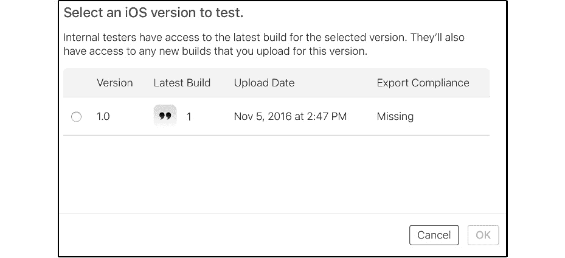

# 第二十章：*第二十章*：将您的应用程序提交到 App Store

开发周期中最激动人心的部分之一是将您的应用程序带给一些真实用户。这样做的第一步通常是发送应用程序的测试版本，以便在您将其提交到 App Store 并向世界发布应用程序之前，获取反馈并收集有关应用程序性能的一些数据。一旦您对公测的结果感到满意，您必须将应用程序提交给苹果，以便他们在应用程序发布到 App Store 之前对其进行审核。

在本章中，您将了解如何打包您的应用程序并将其提交到苹果的 App Store Connect 门户。使用 App Store Connect，您可以开始进行应用程序的公测，并且您还可以将其提交给苹果进行审核。App Store Connect 还用于管理您的应用程序的 App Store 描述、关键词、推广图片等。本章将向您展示如何正确填写您应用程序的所有信息。在本章中，您将经历以下步骤：

+   将您的应用程序添加到 App Store Connect

+   打包和上传应用程序进行公测

+   准备您的应用程序发布

这些步骤与您准备发布应用程序时将要经历的过程非常相似。让我们直接进入正题，好吗？

# 将您的应用程序添加到 App Store Connect

当您准备发布应用程序时，您首先想要做的是在 App Store Connect 中注册您的应用程序。在本节中，我们将学习如何在 App Store Connect 中配置新的应用程序。要访问 **App Store Connect**，您必须注册苹果开发者计划。您可以通过苹果开发者门户 [`developer.apple.com`](https://developer.apple.com) 来完成此操作。购买会员后，您可以使用您的 Apple ID 登录到 [`appstoreconnect.apple.com`](https://appstoreconnect.apple.com) 上的 App Store Connect 账户。

登录到您的 App Store Connect 账户后，您将看到一个带有几个图标的屏幕：

图 20.1 – App Store Connect 仪表板

此屏幕是您管理 App Store 存在的门户。从这里，您可以管理测试用户、跟踪您的应用程序下载、监控应用程序使用情况等。但最重要的是，这是您创建、上传和发布应用程序到苹果的测试分发计划，称为 **TestFlight**，并在完成公测后发布到 App Store 的地方。您可以先四处看看；现在可能还看不到太多内容，但熟悉 App Store Connect 门户是很好的。

让我们在 App Store Connect 门户中创建一个新的应用程序。按照以下步骤操作：

1.  将您的应用程序发布给用户的第一步是导航到 **我的应用程序** 部分。在这个部分，您将找到您创建的所有应用程序，并且可以添加新的应用程序。要添加新应用程序，请点击左上角的 **+** 图标，然后点击 **新建应用程序**：![Figure 20.2 – Creating a New App

    ![img/Figure_20.02_B14717.jpg]

    图 20.2 – 创建新应用程序

1.  点击此按钮后，您将看到一个窗口，您可以填写有关应用程序的所有必要信息。这是您选择应用程序名称、选择应用程序将发布的平台以及一些其他属性的地方：

![Figure 20.3 – 新应用程序参数

![img/Figure_20.03_B14717.jpg]

图 20.3 – 新应用程序参数

**Bundle ID** 字段是一个下拉菜单，其中包含您在苹果开发者门户中为您的团队注册的所有应用程序 ID。如果您直到最后一刻都在使用免费层级的开发者账户开发，或者您没有使用任何特殊功能，如推送通知或 App Groups，那么您的应用程序的 Bundle ID 可能不在下拉菜单中。

如果是这样，您可以在开发者门户中手动注册您的 Bundle ID。按照以下步骤操作：

1.  在您的浏览器中导航到 [`developer.apple.com/`](https://developer.apple.com/)。

1.  点击 **账户** 菜单项。您可以使用 **账户** 页面来管理证书、Bundle ID、设备等。其中许多都是由 Xcode 自动处理的，但您偶尔会发现自己在这个门户中。例如，让我们看看如何手动注册您的应用程序的 Bundle ID：![Figure 20.4 – Apple Developer Account dashboard

    ![img/Figure_20.04_B14717.jpg]

    图 20.4 – 苹果开发者账户仪表板

1.  要注册您的 Bundle ID，请点击页面左侧的 **证书、标识符和配置文件** 项。

1.  在 **证书、标识符和配置文件** 页面上，点击左侧菜单中的 **标识符**。这将向您展示当前注册的应用程序列表。在列表顶部的 **标识符** 标题附近，有一个蓝色的 **+** 图标。点击此图标，然后选择 **App ID** 和 **App** 以将新的 ID 添加到您的配置文件中：

![Figure 20.5 – Certifcates, Identifiers & Profiles

![img/Figure_20.05_B14717.jpg]

图 20.5 – 证书、标识符和配置文件

要添加您的 Bundle ID，您只需填写表单字段。您希望为您的应用程序命名一个描述性的名称。它可以与您在 Xcode 中为应用程序设置的名称相同，也可以是不同的名称；它不必匹配。

确保选择 **显式 App ID** 字段，并从您的 Xcode 项目中复制 Bundle ID。确保您完全匹配。如果您不这样做，您可能会在以后遇到问题，因为如果 Bundle ID 不正确，您的应用程序将无法被识别。

完成这些后，你可以保存你的新 ID。你不需要选择任何功能，因为当你在**功能**选项卡中启用或禁用它们时，Xcode 会自动为你管理。

在手动注册你的 Bundle ID 后，你应该能够回到 App Store Connect，添加一个新应用，并选择你的应用的 Bundle ID。在你完成这些并在 App Store Connect 门户中创建你的应用后，查看你的应用设置。有很多表单字段可以填写。你将看到的第一个屏幕是**应用信息**屏幕。这是填写你应用信息的地方，为它在 App Store 中显示的本地化名称分配，并为你的应用分配类别：

图 20.6 – 应用仪表板屏幕

接下来是**定价和可用性**屏幕。这是你决定你的应用可以在哪些国家下载以及它的价格的地方。最后，还有**准备提交**菜单项。

每次当你添加你应用的新版本时，你应该填写这个屏幕上的表单字段，而且有很多。**准备提交**表单用于提供截图、关键词、你应用的描述、隐私政策等。去看看里面有什么。幸运的是，你需要填写的内容都很直接。

在本节中，我们学习了如何在 App Store Connect 中注册新应用以及生成新 Bundle ID 的过程。一旦你在 App Store Connect 上注册了你的应用，你就可以上传你的应用。为此，你使用 Xcode 打包你的应用并将其发送到 App Store Connect。让我们在下一节中看看这个过程。

# 为测试打包和上传你的应用

为了将你的应用发送给测试人员和最终用户，你必须首先使用 Xcode 归档你的应用。归档你的应用将打包所有内容、代码和资源。按照以下步骤归档你的应用：

1.  从 Xcode 中你的应用运行的设备列表中选择**通用 iOS 设备**：

    图 20.7 – 归档应用

1.  在 Xcode 顶部菜单中选择**产品 | 归档**，使用已选择的构建设备。当你这样做时，会开始一个比平时慢得多的构建过程。这是因为 Xcode 正在以发布模式构建你的应用，使其优化并能在任何设备上运行。

1.  归档创建完成后，Xcode 会自动为你打开组织者面板。在这个面板中，你可以查看你创建的所有应用和归档的概览：

    图 20.8 – 归档文件

    在存档您的应用之前，您应该确保您的应用已准备好发布。这意味着您必须将所有必需的应用图标资源添加到`Images.xcassets`资源中。如果您的应用图标集不完整，当您尝试将其上传到 App Store Connect 时，您的应用将被拒绝，您将不得不重新生成您的存档。

1.  当您准备好将构建上传到 App Store Connect 以发送给您的测试人员，并通过 App Store 最终发送给用户时，您应该选择您最新的构建并点击**上传到 App Store**按钮。将出现一个弹出窗口，引导您完成一些设置。您大多数时候应该使用默认设置并点击**下一步**。最后，您的应用将根据元数据验证并上传到 App Store Connect。如果您的存档中存在错误，例如缺少资源或未签名的代码，您将通过上传弹出窗口中的错误消息了解到这一点。

    当您的上传成功时，您也会通过弹出窗口收到通知。

一旦您上传了构建，您就可以转到 App Store Connect 中您应用的活跃面板。您可以在**TestFlight**选项卡下看到上传的构建。如果您刚刚上传了一个构建，其状态将是**处理中**。有时这一步需要一些时间，但通常不超过几个小时：

图 20.9 – 上传的构建

当应用正在处理时，你可以开始准备你的**TestFlight**设置。为此，请按照以下步骤操作：

1.  选择**TestFlight**菜单项并填写**测试信息**表单。如果您正在全球范围内推出测试，您可能需要提供多语言信息，但您不必这样做。

1.  接下来，在右侧侧边栏中选择**内部测试**菜单项。在此面板中，你可以选择添加到你的账户用于测试的用户。这种测试通常是您做的第一种测试类型，主要是为了测试团队内部的应用或与亲密的朋友和家人。您可以通过 App Store Connect 中的**用户和角色**部分添加更多内部用户到您的账户。

1.  一旦您的应用处理完毕，您将收到一封电子邮件，您可以选择用于内部测试的您的应用版本：

    图 20.10 – 选择要测试的应用版本

    一旦您添加了测试人员并选择了要测试的构建，您就可以点击**开始测试**按钮向所选测试人员发送测试邀请。他们将收到一封电子邮件，允许他们通过**TestFlight**应用下载您的应用。

1.  一旦你的内部测试人员对你的应用满意，你可以为你的应用选择一些外部测试人员。**外部测试人员**通常是你的团队或组织之外的人，例如你的应用现有用户或来自你应用目标受众的一部分人。

设置外部测试版与设置内部测试相同。你甚至可以使用与内部测试相同的构建版本进行外部测试。然而，外部测试通常需要苹果进行快速审查，才能发送邀请。这些审查不会花费很长时间，通过测试版审查并不意味着你也会通过 App Store 审查。

这就是通过 **TestFlight** 设置测试版测试你需要知道的所有内容。当你对你的测试版测试结果满意，并且你的应用通过了现实世界的测试，那么你就可以准备通过 App Store 将你的应用发布到市场上了。

# 准备你的应用发布

从测试版测试过渡到发布你的应用不需要太多努力。你使用的是你已经导出并测试过的应用版本。为了能够提交你的应用供苹果审查，你必须添加更多关于你的应用的信息，并且你应该设置你的 App Store 存在。按照以下步骤操作：

1.  你首先应该做的是为你的应用创建几幅截图。你将把这些截图添加到你的 App Store 页面上，因此它们应该尽可能好看，因为潜在的用户会通过截图来决定是否购买或下载你的应用。创建截图最简单的方法是在 5.5 英寸的 iPhone 和 12.9 英寸的 iPad 上进行截图。

    你可以为所有存在的设备类型提供截图，但你至少需要为 5.5 英寸的 iPhone 和 12.9 英寸的 iPad 提供截图。你可以使用 App Store Connect 中的 **媒体管理器** 功能上传大尺寸的媒体，并使其缩放到较小设备的大小：

    

    图 20.11 – 媒体管理器

1.  在提交截图后，你还应该填写你的应用程序的描述和关键词。确保你的应用描述清晰、简洁、有说服力。你应该尽量使用尽可能多的关键词。苹果使用你的关键词来确定你的应用是否与用户的搜索查询匹配。

    尝试想出同义词或你搜索执行你应用功能的软件时会查找的词汇。

    如果你的应用包含 iMessage 或 Apple Watch 应用，你也应该上传这些应用的截图。你无法为这些扩展提供单独的关键词或描述，但它们将在 App Store 中有自己的图片库。

1.  提交表单的下一步是选择你的应用二进制文件，并提供一些关于应用及其发布负责人的基本信息。通常，你将想要选择你直到发布前一直在进行 beta 测试的应用版本。

1.  最后，你必须向苹果提供一些关于如何审核你的应用的信息。如果你的应用需要演示账户，提供给审核者的凭证。如果你的应用因某些内容不明确而被拒绝，通常在备注部分澄清过去的误解是个好主意。这已被证明对某些应用有帮助，使得第一次尝试就能通过审核，而不是在之后被拒绝并解释原因。当所有信息都填写完毕后，点击**保存**按钮以存储你刚刚输入的所有信息。然后，如果你对一切都满意，并准备好迈向发布应用的最后一步，请点击**提交审核**以启动审核流程。

让你的应用通过苹果的审核可能只需要一天，也可能是几天甚至更长。一旦你提交了你的应用，耐心等待苹果的通知是非常重要的。询问他们是否可以加快审核速度或者询问当前状态通常不会有结果，所以尝试推动苹果进行审核是没有意义的。

信息

如果你确实需要快速审核和发布你的应用，并且有正当的理由，你总是可以申请加速审核。如果苹果认为更快的审核不仅对你而且对你的用户都有益，你的应用可能会在几小时内得到审核。请注意，你不应该滥用这个服务。你申请加速审核的次数越多，苹果给你特例的可能性就越小。加速审核只应在特殊情况下请求。

好了，是时候喝点可可、咖啡、茶或者你喜欢的任何饮料了。现在你可以坐下来休息一会儿，等待苹果审核你的应用，以便你可以将其发布到 App Store。让我们以总结来结束这一章。

# 总结

这最后一章涵盖了发布应用的准备工作。你学习了如何存档和导出你的应用。你看到了如何将其上传到 App Store Connect 以及如何作为 beta 版本分发你的应用。为了总结一切，你看到了如何提交你的应用以供苹果审核，以便在 App Store 发布。发布应用是令人兴奋的；你不知道你的应用会表现如何，或者人们是否会喜欢使用它。良好的 beta 测试会有很大帮助，你将能够发现错误和可用性问题，但没有什么比让你的应用在真实用户手中更令人兴奋的了。

大多数开发者都投入了大量的时间和精力来构建他们的应用程序，而你也是其中之一。你拿起这本书，从 iOS 爱好者成长为一名 iOS 大师，确切地知道如何构建利用 iOS 最新和最伟大功能的优秀应用程序。当你准备好在 App Store 上发布自己的应用程序时，你会了解到等待苹果审查并希望批准你的应用程序是多么的既兴奋又紧张。也许你的第一次尝试会被拒绝；这是可能的。不要过于担心；即使是最大的名字有时也会被拒绝，而且通常修复拒绝的原因并不复杂。确保在提交之前阅读 App Store 审查指南；这些指南给出了关于你在应用程序中可以做什么和不可以做什么的相当好的指示。

由于这是本书的最后一章，我衷心感谢你选择这本书，并把它作为成为 iOS 编程大师的垫脚石之一。我希望我已经给你留下了所需的技能，让你能够独立探索，阅读苹果的文档，并构建令人惊叹的应用程序。再次感谢，如果你使用这本书创建了什么酷炫的东西，请随时联系我。我很乐意看到你的应用程序。
