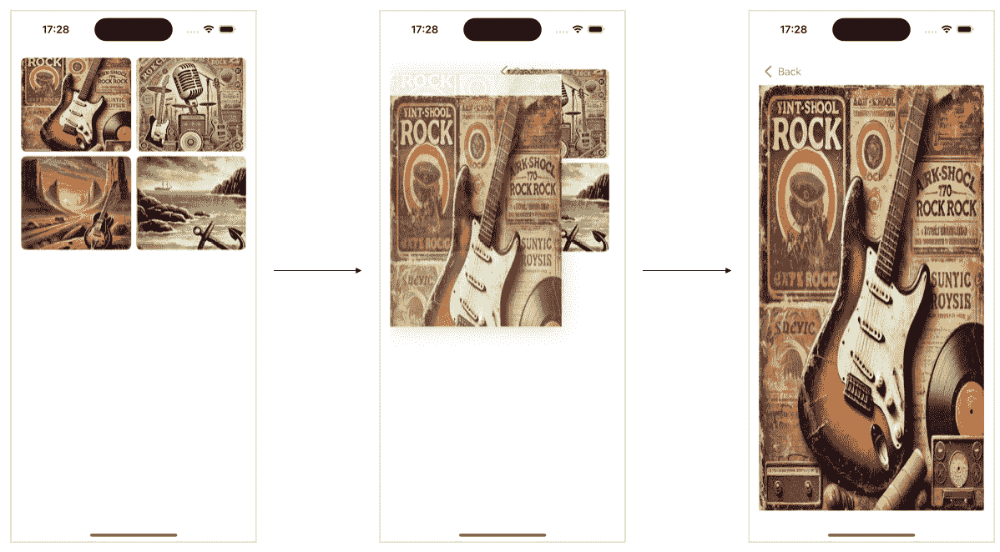
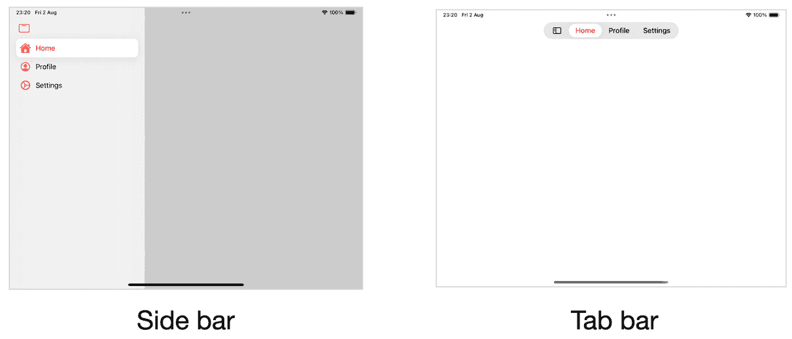
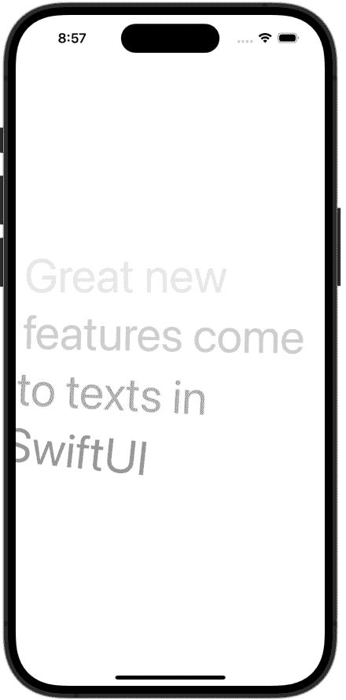

# <st c="0">1</st>

# <st c="2">iOS 18 新增功能</st>

<st c="22">苹果在 2024 年的 WWDC 上推出了 iOS 18，作为其年度开发者大会的一部分，与 macOS、tvOS、iPadOS、watchOS 和 visionOS 一起。</st>

<st c="159">利用我们应用在每个主要操作系统版本中的最新特性和功能，使我们获得竞争优势。</st> <st c="272">以下是苹果选择在 SDK 中改进特定领域的原因——市场研究或技术趋势是采用新技术的充分理由。</st>

<st c="439">然而，要理解 iOS 18 的改进之处，我们首先必须了解这个版本背后的背景——这是本章的一个目标。</st>

<st c="578">在本章中，我们将涵盖以下主题：</st> <st c="614">：</st>

+   <st c="631">理解 iOS</st> <st c="650">18 背景</st>

+   <st c="663">探索</st> <st c="674">Swift 测试</st>

+   <st c="687">了解新的 Swift</st> <st c="717">数据改进</st>

+   <st c="734">尝试新的</st> <st c="750">缩放过渡效果</st>

+   <st c="765">在我们的</st> <st c="799">iPad 应用中添加浮动标签栏</st>

+   <st c="808">在 SwiftUI 中对滚动视图有更多控制</st> <st c="847"></st>

+   <st c="857">更改文本渲染行为</st>

+   <st c="894">从另一个视图定位子视图</st>

+   <st c="934">进入</st> <st c="948">人工智能革命</st>

<st c="961">如果这听起来像是一个令人兴奋的章节，您并没有错。</st> <st c="1022">让我们先了解</st> <st c="1069">iOS 18 的背景。</st>

# <st c="1076">技术要求</st>

<st c="1099">对于本章，从 App Store 下载 Xcode 版本 16.0 或更高版本是必不可少的。</st>

<st c="1193">确保您正在使用最新的 macOS 版本（Ventura 或更高版本）。</st> <st c="1279">只需在 App Store 中搜索 Xcode，选择最新版本，然后继续下载。</st> <st c="1377">打开 Xcode 并完成出现的任何进一步设置说明。</st> <st c="1445">在 Xcode 完全运行后，您</st> <st c="1491">就可以开始了。</st>

<st c="1501">本章包含许多代码示例，可以在以下</st> <st c="1578">GitHub 仓库中找到：</st>

[<st c="1596">https://github.com/PacktPublishing/Mastering-iOS-18-Development/tree/main/Chapter%201</st>](https://github.com/PacktPublishing/Mastering-iOS-18-Development/tree/main/Chapter%201)

# <st c="1682">理解 iOS 18 背景</st>

<st c="1714">发布一个主要的 iOS 版本总是一件大事，即使它是第 18</st><st c="1786">个</st> <st c="1789">版本。</st> <st c="1799">让我们在 iOS 18 之前尝试分析 iOS SDK：</st>

+   **<st c="1846">SwiftUI</st>** <st c="1854">正在变得更加成熟和强大。</st> <st c="1878">然而，一些功能，如复杂的动画或过渡、手势处理、导航和绘图，仍然使用 SwiftUI 实现起来具有挑战性</st> <st c="2034">。</st>

+   **<st c="2048">Core Data</st>** <st c="2058">是大多数 iOS 开发者作为存储</st> <st c="2105">持久数据的解决方案的首选框架。</st>

+   <st c="2150">虽然</st> **<st c="2157">XCTest</st>** <st c="2163">被认为是一个强大且方便的测试框架，但它缺乏在其他平台上常见的功能，例如参数化测试和更好的</st> <st c="2328">测试组织。</st>

+   **<st c="2349">WidgetKit</st>**<st c="2359">的流行证明了在当今世界，能够一目了然地展示信息的能力至关重要。</st>

<st c="2458">没有人会否认这个列表的重要性。</st> <st c="2505">然而，一个苹果直到 WWDC 2024 才开始关注的至关重要的话题是</st> <st c="2579">人工智能。</st>

<st c="2603">OpenAI 的 ChatGPT 的兴起，随后是数千种机器学习和 AI 工具，使苹果陷入了一个尴尬的境地。</st> <st c="2722">这不是苹果第一次落后于一些暂时性的趋势，但这一次情况不同。</st> <st c="2825">AI 对人类潜在的影响表明，这不仅仅是一个常规趋势或技术演变；实际上，这是一场将改变</st> <st c="2978">世界的革命。</st>

<st c="2988">问题是，苹果在它的一系列平台和技术方面处于什么位置？</st> <st c="3065">它对 AI 革命有什么答案吗？</st>

<st c="3109">在深入探讨那个问题之前，让我们首先回顾一下 iOS 18 中引入的新特性和框架，并探讨最新版本如何应对我们在 iOS 开发中面临的一些关键挑战。</st> <st c="3314">不过，不用担心——我们将在最后一节和整本书中涵盖 AI 革命。</st> <st c="3412">现在，让我们讨论一个新的框架——</st> <st c="3449">Swift 测试。</st>

# <st c="3463">介绍 Swift 测试</st>

<st c="3489">Swift 测试框架</st> <st c="3522">采用了一种新颖且令人耳目一新的测试方法。</st> <st c="3570">Swift 测试框架包含现代特性，如宏，这些宏与结构体而不是类一起工作，并且可以标记测试和</st> <st c="3690">测试套件。</st>

<st c="3702">Swift 测试框架旨在取代 2013 年作为 Xcode 5 部分引入的 XCTest。</st> <st c="3797">XCTest 属于 Objective-C 为主流语言的旧时代。</st> <st c="3871">然而，Swift 取代了 Objective-C，苹果意识到 iOS 开发者需要一个现代化的</st> <st c="3954">测试框架。</st>

<st c="3972">这是一个简单的</st> <st c="3989">测试函数：</st>

```swift
<st c="4003">@Test("Test view model increment function", .enabled(if: AppSettings.CanDecrement), .tags(.critical))</st> func testViewModelIncrement() async throws {
//         preparation
        let viewmodel = CounterViewModel()
        viewmodel.count = 5
//        execution
        viewmodel.increment(by: 1)
//        verification <st c="4277">#expect(viewmodel.count == 6)</st> }.
```

<st c="4309">我们可以看到在 Swift Testing 中编写测试函数是多么简单。</st> <st c="4381">注意前面的 Swift 宏，它除了提供测试描述外，还配置并标记了函数为关键。</st>

<st c="4512">如果你的应用没有测试函数，Swift Testing</st> <st c="4568">是一个很好的开始方式（要了解更多关于 Swift Testing 的信息，请参阅</st> *<st c="4634">第十四章</st>*<st c="4644">）。</st>

<st c="4647">现在，让我们讨论另一个处理我们</st> <st c="4706">持久存储</st>的新框架。</st>

# <st c="4723">介绍 Swift 数据改进</st>

<st c="4759">Swift Data 是在 WWDC 2023 作为 iOS 17 的一部分引入的，其目标是取代旧但流行的 Core</st> <st c="4785">Data 框架。</st>

<st c="4886">Swift Data 提供了一个基于 Swift 的现代 API，可以帮助减少与持久存储工作时的摩擦。</st> <st c="5004">我们在 Apple 开发工具中看到的一个趋势是，从 GUI 转向基于代码的工具。</st> <st c="5101">一个很好的例子是 SwiftUI – 尽管可以拖放组件来构建用户界面，但主要的实现方式是代码。</st> <st c="5250">App Intents 和 Swift Package Managers 也是如此。</st> <st c="5308">数据层也遵循同样的概念 – 在 Swift Data 中，我们没有数据模型编辑器，所以我们使用</st> <st c="5440">仅代码来构建数据模型。</st>

<st c="5450">例如，这是为</st> `<st c="5504">Book</st>` <st c="5508">实体创建数据模型的方法：</st>

```swift
<st c="5516">@Model</st> class Book {
    var author: String
    var title: String
    var publishedDate: Date
}
```

<st c="5599">乍一看，这似乎是一个普通的</st> `<st c="5641">Book</st>` <st c="5645">类 – 确实如此！</st> <st c="5665">这次，我们添加了</st> `<st c="5689">@Model</st>` <st c="5695">宏，它完成了所有的魔法。</st>

<st c="5729">当 Swift Data 介绍时，它已经拥有许多功能，例如关系和删除规则。</st> <st c="5834">尽管如此，许多开发者认为这个框架还不够成熟，无法取代</st> <st c="5920">Core Data。</st>

<st c="5930">在 iOS 18 中，Apple 为 Swift Data 添加了一些功能，如果它还没有，这将使其更接近它</st> <st c="6049">应该达到的地方。</st>

## <st c="6059">唯一值</st>

<st c="6072">iOS 18 的第一个也许是最重要的</st> <st c="6107">新特性</st> <st c="6119">是能够根据</st> **<st c="6160">模型属性</st>** <st c="6172">构建一个</st> **<st c="6160">唯一值</st>** <st c="6172">：</st>

```swift
<st c="6273">Book</st> class’s unique identifier is based on combining the <st c="6330">name</st> and <st c="6339">publicationName</st> attributes.
			<st c="6366">History API</st>
			<st c="6378">Another new and exciting feature</st> <st c="6411">is the History API.</st> <st c="6432">Using the History API, we can fetch</st> <st c="6467">transactions and changes that have been made to our Swift Datastore over a particular time range.</st> <st c="6566">This capability allows us to update our app when we work with extensions such as widgets or sync changes to</st> <st c="6674">the server.</st>
			<st c="6685">Reading the transaction history is not the only “pro” feature added to Swift Data.</st> <st c="6769">Let’s talk about Core Data for</st> <st c="6800">a second.</st>
			<st c="6809">Custom data stores in Swift Data</st>
			<st c="6842">Core Data fundamentals</st> <st c="6865">included the ability to work with</st> <st c="6899">any data store type we wanted – XML, SQLite, CSV files, or even a remote server.</st> <st c="6981">Although almost all apps that implement Core Data work with SQLite as their data store, it was built to be agnostic to whatever</st> <st c="7109">happens underneath.</st>
			<st c="7128">Starting with iOS 18, Apple also brings custom data stores to</st> <st c="7191">Swift Data.</st>
			<st c="7202">For example, let’s say that we want to base our data store on a CSV file.</st> <st c="7277">We start by creating a new data store configuration</st> <st c="7328">specifically for CSV</st> <st c="7350">data</st> <st c="7354">stores:</st>

```

final class CSVStoreConfiguration: DataStoreConfiguration {

    typealias Store = CSVDataStore

    var name: String

    var schema: Schema? var fileURL: URL

    init(name: String, schema: Schema? = nil, fileURL: URL)

{

        self.name = name

        self.schema = schema

        self.fileURL = fileURL

    }

    static func == (lhs: CSVStoreConfiguration, rhs:

    CSVStoreConfiguration) -> Bool {

        return lhs.name == rhs.name

    }

    func hash(into hasher: inout Hasher) {

        hasher.combine(name)

    }

}

```swift

			<st c="7804">The</st> `<st c="7809">CSVStoreConfiguration</st>` <st c="7830">class is a new data store configuration that accepts the name and the schema (similar to how Swift Data configuration setup works today), and we added an additional parameter, which is</st> `<st c="8016">fileURL</st>` <st c="8023">– the location of our</st> <st c="8046">CSV file.</st>
			<st c="8055">In the</st> `<st c="8063">init()</st>` <st c="8069">function, we can also check whether the CSV file exists or whether we need to create a</st> <st c="8157">new one.</st>
			<st c="8165">Notice that there’s a</st> `<st c="8188">typealias</st>` <st c="8197">named</st> `<st c="8204">Store</st>`<st c="8209">, which represents</st> <st c="8227">a new type</st> <st c="8238">called</st> `<st c="8246">CSVDataStore</st>`<st c="8258">. This is the actual store class where everything happens.</st> <st c="8317">Let’s create</st> <st c="8330">it now:</st>

```

最终类 <st c="8350">CSV 数据存储</st>: 数据存储 {

    typealias 配置 = <st c="8403">CSV 存储配置</st> typealias 快照 = 默认快照

    var 配置: <st c="8481">CSV 存储配置</st> var 名称: String

    var 架构: 架构

    var 标识符: String

    必须初始化(_ 配置: CSV 存储配置,

    迁移计划: (任何 SchemaMigrationPlan 类型)?)

    抛出 {

        self.configuration = configuration

        self.name = configuration.name

        self.schema = configuration.schema! self.identifier =

        配置文件 URL 的最后路径组件

    }

}

```swift

			<st c="8836">Our</st> `<st c="8841">CSVDataStore</st>` <st c="8853">class conforms to the</st> `<st c="8876">DataStore</st>` <st c="8885">protocol and has similar properties, such as</st> `<st c="8931">name</st>` <st c="8935">and</st> `<st c="8940">schema</st>`<st c="8946">.</st>
			<st c="8947">The</st> `<st c="8952">CSVDataStore</st>` <st c="8964">class must handle a persistent store’s basic operations, such as inserting new items and deleting or updating</st> <st c="9075">existing ones.</st>
			<st c="9089">Notice that the</st> `<st c="9106">init()</st>` <st c="9112">function includes a migration type, so we can even handle migrations when our</st> <st c="9191">schema changes.</st>
			<st c="9206">To handle all of these</st> <st c="9229">operations, we need to implement two important</st> <st c="9276">methods that are part of the</st> `<st c="9306">DataStore</st>` <st c="9315">protocol –</st> `<st c="9327">fetch()</st>` <st c="9334">and</st> `<st c="9339">save()</st>`<st c="9345">:</st>

```

func 获取<T>(_ 请求: 数据存储获取请求<T>)

抛出 -> 数据存储获取结果<T，默认快照>

    where T : 持久模型 {

        let 判断 = 请求描述符判断

        返回 数据存储获取结果(描述符:

        请求描述符，获取快照: [],

        相关快照: [:])

        . // 执行获取操作

    }

    func 保存(_ 请求:

    数据存储保存更改请求<默认快照>)

    抛出 -> 数据存储保存更改结果<默认快照>

    {

        var remappedIdentifiers = [持久标识符:

        持久标识符]()

        对于请求插入的快照 {

            // 插入新项目

        }

        对于请求更新的快照 {

            // 更新现有项目

        }

        对于请求删除的快照 {

            // 删除项目

        }

        返回

        数据存储保存更改结果<默认快照>(for:

        self.identifier,

        remappedIdentifiers: remappedIdentifiers)

    }

```swift

			<st c="10142">These two functions perform all the magic underneath.</st> <st c="10197">In this code example, I left the function implementation empty – it is up to you to fill it in according to the specific data store implementation.</st> <st c="10345">Once we modify our CSV file, we can return the results to</st> <st c="10403">the app.</st>
			<st c="10411">The</st> `<st c="10416">History</st>` <st c="10423">API, the</st> `<st c="10433">DataStore</st>` <st c="10442">protocol, and the ability</st> <st c="10468">to provide uniqueness</st> <st c="10490">to entities make Swift Data much more mature and capable.</st> <st c="10549">To get started with Swift Data, read</st> *<st c="10586">Chapter 2</st>*<st c="10595">.</st>
			<st c="10596">Next, let’s talk about an exciting improvement in</st> <st c="10647">SwiftUI transition.</st>
			<st c="10666">Introducing zoom transition</st>
			<st c="10694">This is a small improvement, but it may</st> <st c="10734">indicate an interesting direction Apple is taking with SwiftUI.</st> <st c="10799">In general, UIKit’s transitioning capabilities are very robust and provide us with the flexibility to create any transition we want.</st> <st c="10932">Even before that, from the beginning, UIKit had some nice built-in transitions we could use to make our navigation</st> <st c="11047">more appealing.</st>
			<st c="11062">In iOS 18, Apple added a new transition that allows us to navigate to a new view using a</st> <st c="11152">zoom animation.</st>
			<st c="11167">Let’s create an album grid that, when tapping on the album, transitions to a full album screen with a</st> <st c="11270">zoom animation:</st>

```

<st c="11285">@Namespace() var 命名空间</st> var body: some View {

        NavigationStack {

            ScrollView {

                LazyVGrid(columns: [

                网格项(.自适应(minimum: 150)) ]) {

                    对于专辑专辑 {专辑 in

                        NavigationLink {

                            Image(album.imageName)

                                .可调整大小() <st c="11512">.导航过渡(.缩放(sourceID:专辑 ID，在：</st>

<st c="11563">命名空间)</st> } 标签: {

                            Image(album.imageName)

                                .可调整大小()

                                .scaledToFit()

                                .frame(minWidth: 0,

                                最大宽度: .infinity)

                                .frame(height: 150)

                                .cornerRadius(8.0)

                        } <st c="11720">.matchedTransitionSource(id:</st>

<st c="11748">专辑 ID，在：命名空间中</st> }

                }

            }

        }

        .padding()

    }

```swift

			<st c="11794">This example shows a simple grid view</st> <st c="11832">of albums, a NavigationStack, and a NavigationLink.</st> <st c="11885">The idea of performing the zoom transition is to match the source (the image we tapped on) to the destination (the image we</st> <st c="12009">zoomed into).</st>
			<st c="12022">We do that by adding two</st> <st c="12048">view modifiers:</st>

				*   `<st c="12063">navigationTransition</st>`<st c="12084">: We add this modifier to the source view.</st> <st c="12128">The source view, in our case, is the album view in the grid.</st> <st c="12189">We select the type of animation (currently, it’s a zoom animation) and the</st> <st c="12264">source ID.</st>
				*   `<st c="12274">matchedTransitionSource</st>`<st c="12298">: We add this modifier to the destination view.</st> <st c="12347">In our example, the destination view is the full-screen view of the album.</st> <st c="12422">Again, we provide the ID of the album we want to present so SwiftUI can perform the zoom animation between</st> <st c="12529">these views.</st>

			<st c="12541">Creating the match between the views allows SwiftUI to perform a nice zoom animation, similar to what we see in the Photos app.</st> <st c="12670">Look at</st> *<st c="12678">Figure 1</st>**<st c="12686">.1</st>*<st c="12688">:</st>
			

			<st c="12691">Figure 1.1: Zoom transition between photos grid and a full-screen view</st>
			*<st c="12761">Figure 1</st>**<st c="12770">.1</st>* <st c="12772">shows how the zoom animation looks in a couple of frames based on the p</st><st c="12844">receding</st> <st c="12854">code example.</st>
			<st c="12867">Zoom transitions serve</st> <st c="12890">more than aesthetic purposes.</st> <st c="12921">They inform the user about the changes occurring on the screen, helping them</st> <st c="12998">stay oriented.</st>
			<st c="13012">To read more about navigation in iOS, read</st> *<st c="13056">Chapter 4</st>*<st c="13065">.</st>
			<st c="13066">Speaking of navigation, iPadOS navigation gained a unique and valuable capability – the</st> <st c="13155">floating bar.</st>
			<st c="13168">Adding a floating tab bar</st>
			<st c="13194">iPad is not the focus</st> <st c="13216">of this book.</st> <st c="13231">This is not because iPadOS is unimportant but because most, if not all, of the topics we discuss here are also suitable</st> <st c="13351">for iPadOS.</st>
			<st c="13362">However, there are special features that are relevant to iPadOS that are worth mentioning.</st> <st c="13454">One of them is the float</st> <st c="13479">tab bar.</st>
			<st c="13487">The tab bar has existed in iOS since its very beginning.</st> <st c="13545">It allows users to navigate between different sections of an app.</st> <st c="13611">In both iOS and iPadOS, the tab is located at the bottom of the screen.</st> <st c="13683">While it looks perfectly fine on small devices, a tab bar on big screens seems stretched and doesn’t use the</st> <st c="13792">large space.</st>
			<st c="13804">One solution for handling navigation in a iPadOS is to implement a sidebar – a view on the side that displays the different sections of</st> <st c="13941">the app.</st>
			<st c="13949">In iPadOS 18, the position</st> <st c="13976">of the sidebar changed, and it is now located at the top of the screen, floating over the app content.</st> <st c="14080">Not only that; the user can also transition between a tab bar and a sidebar.</st> <st c="14157">Let’s see how to do that</st> <st c="14182">in code:</st>

```

结构体 ContentView: View {

    var body: some View {

        TabView {

            Tab("主页",系统图像:"house.fill") {  }

            Tab("个人资料",系统图像:

            "person.crop.circle") { }

            Tab("设置",系统图像:"gear") { }

        }

        .tint(.red) <st c="14402">.tabViewStyle(.sidebarAdaptable)</st> }

}

```swift

			<st c="14438">This code example looks straightforward but includes a view modifier called</st> `<st c="14515">tabViewStyle</st>`<st c="14527">. Currently, it has only one option to choose from –</st> `<st c="14580">sidebarAdaptable</st>`<st c="14596">. When we add this view modifier, a button is added to the tab bar that allows the user to change the layout.</st> <st c="14706">Let’s see how it looks (</st>*<st c="14730">Figure 1</st>**<st c="14739">.2</st>*<st c="14741">):</st>
			

			<st c="14831">Figure 1.2: The Tab bar adapts a sidebar layout</st>
			*<st c="14878">Figure 1</st>**<st c="14887">.2</st>* <st c="14889">shows the two layouts</st> <st c="14911">for our tab bar.</st> <st c="14929">The new sidebar improves the user experience and makes navigating and focusing on content easier.</st> <st c="15027">It also resembles Apple’s apps, such as the TV app, which aligns with what users can expect from</st> <st c="15124">our app.</st>
			<st c="15132">Another important aspect of SwiftUI that required improvement is scroll views.</st> <st c="15212">Let’s go over major changes in</st> <st c="15243">that area.</st>
			<st c="15253">Having more control over scroll views</st>
			<st c="15291">Controlling and observing scroll view behavior</st> <st c="15338">was part of the reason why UIKit developers ha</st><st c="15385">dn’t moved to</st> <st c="15400">SwiftUI yet.</st>
			<st c="15412">Scroll views are crucial in mobile apps, not just because of the small screen, which often requires the user to scroll for more content, but also because they help reuse visible content to minimize memory usage or adjust our UI based on</st> <st c="15650">scroll position.</st>
			<st c="15666">However, why is handling scroll views in SwiftUI</st> <st c="15716">more complex than in UIKit?</st> <st c="15744">We can think of</st> <st c="15760">two reasons:</st>

				1.  **<st c="15772">SwiftUI is relatively new</st>**<st c="15798">: SwiftUI is still considered to be a new framework.</st> <st c="15852">Think how much time it took for UIKit to become a mature framework.</st> <st c="15920">Obviously, we can achieve this in several years and 17 years</st> <st c="15981">of development.</st>
				2.  `<st c="16336">@State</st>` <st c="16342">variable or a</st> <st c="16357">view modifier.</st>

			<st c="16371">These reasons lead to many workarounds that developers use to achieve the desired user experience.</st> <st c="16471">Fortunately, iOS 18 gives us two view modifiers that make SwiftUI scroll views more appealing than ever.</st> <st c="16576">We’ll start</st> <st c="16588">with</st> `<st c="16593">onScrollGeometryChange</st>`<st c="16615">.</st>
			<st c="16616">Observing the scroll view position</st>
			<st c="16651">Up until now, SwiftUI hasn’t provided</st> <st c="16689">any direct API to observe the scroll view position.</st> <st c="16742">Many developers had to find a workaround or use UIKit as a solution.</st> <st c="16811">Now, we have an</st> `<st c="16827">onScrollGeometryChange</st>` <st c="16849">view modifier that allows us to observe any change in the</st> <st c="16908">scroll position.</st>
			<st c="16924">Let’s say we have a</st> `<st c="16945">VStack</st>` <st c="16951">view within a scroll view, and we wish to show a</st> **<st c="17001">Scroll to the top</st>** <st c="17018">button whenever the user scrolls down to allow them to return to the top of</st> <st c="17095">the list.</st>
			<st c="17104">Let’s look at the</st> <st c="17123">following code:</st>

```

ScrollViewReader {代理 in

            ScrollView {

                VStack(alignment: .leading, spacing: 16) {

                    ForEach(albums) {专辑 in

                        提取视图(album:专辑)

                            .id(album.id)

                    }

                }

            }

            .overlay(alignment: .bottom) {

                如果显示滚动到顶部 {

                    Button("滚动到顶部") {

                            代理滚动到(albums[0].id,

                            锚点: .top)

                    }

                    .buttonStyle(.borderedProminent)

                }

            } <st c="17458">.onScrollGeometryChange(for: Bool.self) {</st>

<st c="17499">几何形状在</st>

<st c="17511">几何内容偏移量.y <</st>

<st c="17538">几何内容内边距底部 + 300</st>

<st c="17574">} 动作：{旧值，新值 in</st>

<st c="17608">withAnimation {</st>

<st c="17624">显示滚动到顶部 = !newValue</st>

<st c="17652">}</st>

<st c="17654">}</st> }

```swift

			<st c="17658">In this code example, we can see a</st> `<st c="17693">VStack</st>` <st c="17699">view inside a scroll view.</st> <st c="17727">The</st> `<st c="17731">VStack</st>` <st c="17737">view contains a list of albums.</st> <st c="17770">Notice that we have an</st> `<st c="17793">onScrollGeometryChange</st>` <st c="17815">view modifier for the scroll view itself.</st> <st c="17858">The view modifier has a closure that runs each time the scroll position changes with a</st> `<st c="17945">geometry</st>` <st c="17953">parameter.</st> <st c="17965">Within the closure, we inspect the scroll view content offset, and if it reaches a specific threshold, we show/hide the</st> **<st c="18085">Scroll to top</st>** <st c="18098">button using a specific</st> <st c="18123">state variable.</st>
			<st c="18138">The</st> `<st c="18143">ScrollViewReader</st>` <st c="18159">view, which wraps</st> <st c="18177">the scroll view, provides a proxy to the scroll view so we can scroll to the top when the user presses</st> <st c="18281">the button.</st>
			<st c="18292">We can use the</st> `<st c="18308">onScrollGeometryChange</st>` <st c="18330">method for more use cases than just toggling a button.</st> <st c="18386">For example, we can use it to perform a network request in an infinity list where we need to load more content from the server when the user reaches the bottom.</st> <st c="18547">Additional examples would be having a sticky header or a progress indicator, or even just sending analytics.</st> <st c="18656">These use cases were complex to implement before iOS 18 and are now</st> <st c="18724">extremely simple.</st>
			<st c="18741">The improvement in the second scroll view seems to belong to the same family.</st> <st c="18820">Let’s review</st> <st c="18833">it now.</st>
			<st c="18840">Observing items’ visibility</st>
			<st c="18868">Checking whether a view is visible</st> <st c="18903">inside a scroll view is not easy.</st> <st c="18938">Up until now, we had to calculate the view frame versus the scroll view content offset, not to mention observe that during a scroll view.</st> <st c="19076">Lucky for us, we now have a new modifier</st> <st c="19117">called</st> `<st c="19124">onScrollVisibilityChange</st>`<st c="19148">.</st>
			<st c="19149">Suppose we want to change a view while it enters our scroll view.</st> <st c="19216">For example, we might want to report analytics or print to</st> <st c="19275">the console.</st>
			<st c="19287">Let’s look at the</st> <st c="19306">following example:</st>

```

对于专辑 {专辑 in

    ExtractedView(album: album)

        .id(album.id)

        .<st c="19395">onScrollVisibilityChange(threshold: 0.9) {</st>

<st c="19438">visible in</st>

<st c="19449">if visible {</st>

<st c="19462">print("\(album.title) appears")</st>

<st c="19494">}</st>

<st c="19496">}</st> }

```swift

			<st c="19500">This code example shows the same album row we created in the previous example (in the</st> *<st c="19586">Observing the scroll view position</st>* <st c="19620">section).</st> <st c="19631">This time, we added a new view modifier to the view itself –</st> `<st c="19692">onScrollVisibilityChange</st>`<st c="19716">. This view modifier has two parameters –</st> `<st c="19758">threshold</st>` <st c="19767">and</st> `<st c="19772">closure</st>` <st c="19779">with a</st> `<st c="19787">Bool</st>` <st c="19791">parameter (named</st> `<st c="19809">visible</st>` <st c="19816">in our case).</st> <st c="19831">Let’s review</st> <st c="19844">them now:</st>

				*   `<st c="19853">threshold</st>`<st c="19863">: The</st> `<st c="19870">threshold</st>` <st c="19879">parameter defines how much the change must occur for the closure to run.</st> <st c="19953">For example, a threshold of 0.2 means that we need 20% of the view to be visible or hidden before it runs the closure and reports</st> <st c="20083">the change.</st>
				*   `<st c="20094">closure</st>`<st c="20102">: The closure with the</st> `<st c="20126">Bool</st>` <st c="20130">parameter runs each time the view reaches the threshold.</st> <st c="20188">The</st> `<st c="20192">Bool</st>` <st c="20196">parameter contains the change –</st> `<st c="20229">true</st>` <st c="20233">for visible and</st> `<st c="20250">false</st>` <st c="20255">for hidden.</st>

			<st c="20267">In our code example, we set the threshold to</st> `<st c="20313">0.9</st>`<st c="20316">. This means that we need to view it to reveal 90% of its size before the closure runs.</st> <st c="20404">Inside the closure, we check whether the view is visible before we report it to</st> <st c="20484">the console.</st>
			<st c="20496">We can use this view modifier for many purposes.</st> <st c="20546">For example, we can perform a specific animation when the view enters, load additional information, or adjust the screen interface if needed.</st> <st c="20688">Something that was complex to do before is now simple to accomplish</st> <st c="20755">using one</st> <st c="20766">view modifier.</st>
			<st c="20780">Scroll view is not the only topic we have more control of.</st> <st c="20840">Let’s talk</st> <st c="20851">about texts.</st>
			<st c="20863">Changing the text rendering behavior</st>
			<st c="20900">Handling texts on screen</st> <st c="20925">was also a very mature area where UIKit provided great frameworks such as TextKit.</st> <st c="21009">We could manipulate texts and create almost any effect that</st> <st c="21069">we wanted.</st>
			<st c="21079">In iOS 18, Apple introduced TextRenderer, a protocol that can help us change the default behavior of our texts</st> <st c="21191">in SwiftUI.</st>
			<st c="21202">Let’s say that we want a title with a different opacity for each line and even rotate the lines a bit.</st> <st c="21306">This creates a nice effect for the titles in our app.</st> <st c="21360">So, let’s see how to do that</st> <st c="21389">in SwiftUI:</st>

```

<st c="21400">struct CustomTextRenderer: TextRenderer {</st>

<st c="21442">func draw(layout: Text.Layout, in ctx: inout</st>

<st c="21487">GraphicsContext) {</st>

<st c="21506">for (index, line) in layout.enumerated() {</st>

<st c="21549">ctx.opacity = Double(index + 1) * 0.1</st>

<st c="21587">ctx.rotate(by: Angle(degrees: Double(index) *</st>

<st c="21633">1))</st>

<st c="21637">ctx.draw(line)</st>

<st c="21652">}</st>

<st c="21654">}</st>

<st c="21656">}</st> struct ContentView: View {

    var body: some View {

        Text("SwiftUI 中的文本新增了众多新特性")

            .font(.system(size: 60)) <st c="21784">.textRenderer(CustomTextRenderer())</st> }

}

```swift

			<st c="21823">This code example has a new structure called</st> `<st c="21869">CustomTextRender</st>`<st c="21885">, which conforms to the</st> `<st c="21909">TextRenderer</st>` <st c="21921">protocol.</st> <st c="21932">We have one important function to implement – the</st> `<st c="21982">draw()</st>` <st c="21988">function.</st> <st c="21999">In this function, we receive an important parameter –</st> `<st c="22053">ctx</st>` <st c="22056">– the graphic context.</st> <st c="22080">The</st> `<st c="22084">TextRenderer</st>` <st c="22096">protocol also provides us access to the different lines and slices we have in our text.</st> <st c="22185">In our example, we can iterate the different lines using the</st> `<st c="22246">layout</st>` <st c="22252">parameter, change their opacity, and even</st> <st c="22295">rotate them.</st>
			<st c="22307">Once we have the</st> `<st c="22325">CustomTextRender</st>` <st c="22341">structure, we can</st> <st c="22359">add it to our</st> `<st c="22374">Text</st>` <st c="22378">component using the</st> `<st c="22399">textRenderer</st>` <st c="22411">view modifier.</st>
			<st c="22426">Let’s see how it looks (</st>*<st c="22451">Figure 1</st>**<st c="22460">.3</st>*<st c="22462">):</st>
			

			<st c="22467">Figure 1.3: The Text component with custom text rendering</st>
			*<st c="22524">Figure 1</st>**<st c="22533">.3</st>* <st c="22535">shows our text with a different opacity and rotation for each line.</st> <st c="22604">Adding effects to text can give a dynamic visualization</st> <st c="22659">for titles and paragraphs and add more life to</st> <st c="22707">our apps.</st>
			<st c="22716">Next, let’s see how SwiftUI has become more mature and capable than ever with positioning sub -iews from</st> <st c="22822">other views.</st>
			<st c="22834">Positioning sub-views from another view</st>
			<st c="22874">What does it mean to position</st> <st c="22904">sub-views from another view?</st> <st c="22934">While this description sounds weird and unclear, it is a nice addition to SwiftUI that can help us provide more dynamic and</st> <st c="23058">reusable content.</st>
			<st c="23075">To understand what it means, let’s take the following code as</st> <st c="23138">an example:</st>

```

struct NewsView: View {

    var body: some View {

        Text("可再生能源领域取得重大突破：新型太阳能电池技术承诺提高 30%的效率")

        Text("全球市场对突然加息作出反应：股市全面下跌")

        Text("历史性的和平协议达成：领导人签署协议结束长达数十年的冲突")

        Text("创新人工智能工具革新医疗保健：医生拥抱机器学习进行诊断")

        Text("自然灾害袭击：沿海城市发生大规模地震，救援行动正在进行")

    }

}

```swift

			<st c="23682">This code example shows a view called</st> `<st c="23721">NewsView</st>` <st c="23729">with a list of</st> `<st c="23745">Text</st>` <st c="23750">components, each containing a news headline.</st> <st c="23795">If we look closely, we can see that there’s no layout – no VStack, group, or List.</st> <st c="23878">We are not used to this in SwiftUI, and that’s okay because that view is</st> <st c="23951">for display.</st>
			<st c="23963">The</st> `<st c="23968">NewsView</st>` <st c="23976">job is to be a container</st> <st c="24001">for components.</st> <st c="24018">Let’s see how we can use</st> <st c="24043">this container:</st>

```

struct ContentView: View {

    var body: some View {

        ScrollView {

            VStack {

                Text("最新头条")

                    .font(.title)

<st c="24170">Group(subviews: NewsView()) { collection in</st> if let firstHeadline = collection.first

                    {

                        firstHeadline

                            .font(.title2)

                        Spacer()

                    }

                    ForEach(collection.dropFirst()) {

                    newsItem in

                        newsItem

                            .font(.headline)

                        Spacer()

                    }

                }

            }

            .padding()

        }

    }

}

```swift

			<st c="24399">In this example, we added a SwiftUI group, but this time, from the</st> `<st c="24467">NewsView</st>` <st c="24475">view:</st>

```

Group(subviews: NewsView()) { collection in

```swift

			<st c="24525">This line creates a group that iterates over the specific view’s sub-views and allows us to position and modify</st> <st c="24638">them ourselves.</st>
			<st c="24653">In our example, we change the font of the first sub-view and present all the views with a spacer</st> <st c="24751">between them.</st>
			<st c="24764">The ability to reposition views</st> <st c="24796">within other views unlocks new possibilities.</st> <st c="24843">For instance, we can reuse the same views but with different layouts, sequences, or styles.</st> <st c="24935">Treating our views as containers for smaller components makes our code</st> <st c="25006">more reusable.</st>
			<st c="25020">Now, let’s move to our chapter’s last section – the</st> <st c="25073">AI revolution.</st>
			<st c="25087">Entering the AI revolution</st>
			<st c="25114">AI and machine learning</st> <st c="25139">are not new areas for Apple and the iOS platform.</st> <st c="25189">Apple uses AI to adjust photos taken, suggest apps to users according to their usage, optimize battery charging, and</st> <st c="25306">many more.</st>
			<st c="25316">For developers, Apple provides the CoreML framework and tools such as Create ML to help users train and create their own machine</st> <st c="25446">learning models.</st>
			<st c="25462">However, the rising popularity of services such as ChatGPT and Gemini proved that CoreML is insufficient, and that Apple needs to integrate AI deeper into</st> <st c="25618">the system.</st>
			<st c="25629">So, what did Apple prepare for us, the developers, regarding AI in</st> <st c="25697">iOS 18?</st>
			<st c="25704">Apple integrated AI into iOS 18 by letting iOS understand what’s happening in the system and helping the user perform common tasks using natural language understanding, similar</st> <st c="25882">to ChatGPT.</st>
			<st c="25893">For example, let’s say we’re working on a word-processing app and created an App Intent that allows the user to add an image to</st> <st c="26022">a document.</st>
			<st c="26033">Until iOS 18, we would have had to define a specific phrase for the user to use with Siri.</st> <st c="26125">However, in iOS 18, the user can say something such as “Add this image to the page I’m working on,” and Siri uses a set of machine-learning models to convert this phrase to our app intent model.</st> <st c="26320">Not only that, but Siri can also understand the current context on screen and even search our app by indexing our app content in</st> <st c="26449">the spotlight.</st>
			<st c="26463">Integrating our app into Siri requires</st> <st c="26502">little effort.</st> <st c="26518">We mainly need to focus on structuring our main actions and entities.</st> <st c="26588">Apple Intelligence does all</st> <st c="26616">the rest.</st>
			<st c="26625">To read more about using App Intents with Siri, go to</st> *<st c="26680">Chapter 13</st>*<st c="26690">.</st>
			<st c="26691">Summary</st>
			<st c="26699">There’s no other way of looking at iOS 18 than as an exciting one.</st> <st c="26767">The addition of Apple Intelligence is only part of the story – Apple took care of many system and SDK aspects such as testing, persistent data, UI,</st> <st c="26915">and more.</st>
			<st c="26924">In this chapter, we explored the basics of the new Swift Testing framework, learned about Swift Data improvements, and discussed enhancements in SwiftUI such as zoom transition, floating tab bar, scroll views, and text rendering.</st> <st c="27155">We even scratched the surface of Apple Intelligence and tried to understand how it is integrated with App Intents.</st> <st c="27270">By now, you should be familiar with the most exciting and new topics in</st> <st c="27342">iOS 18.</st>
			<st c="27349">A few code examples are just not enough.</st> <st c="27391">We are developers, and we need more!</st> <st c="27428">So, let’s jump straight into SwiftData and explore Apple’s new persistent data framework in the</st> <st c="27524">next chapter.</st>

```
