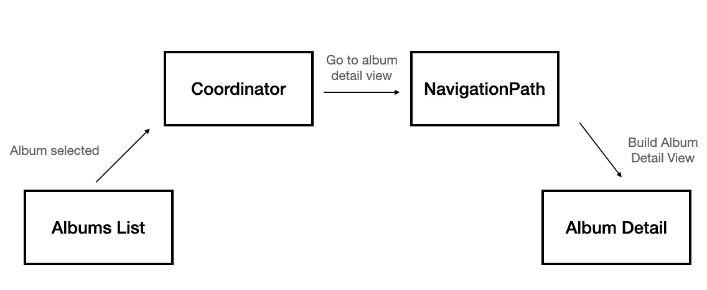
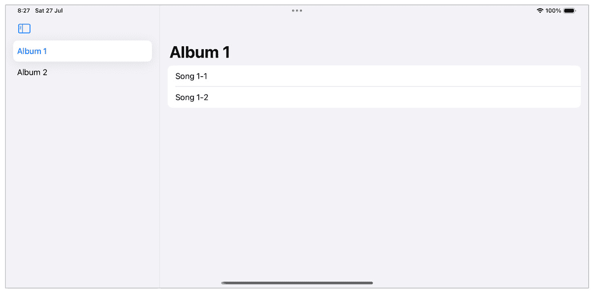
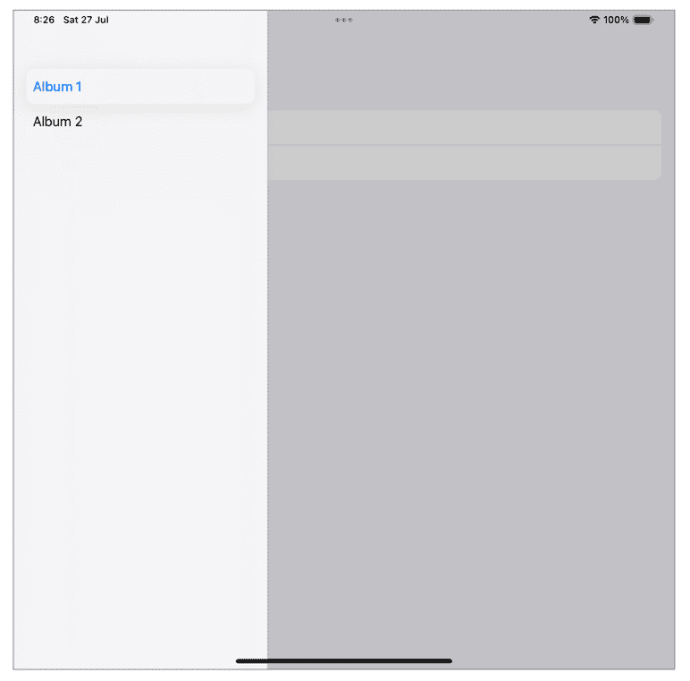
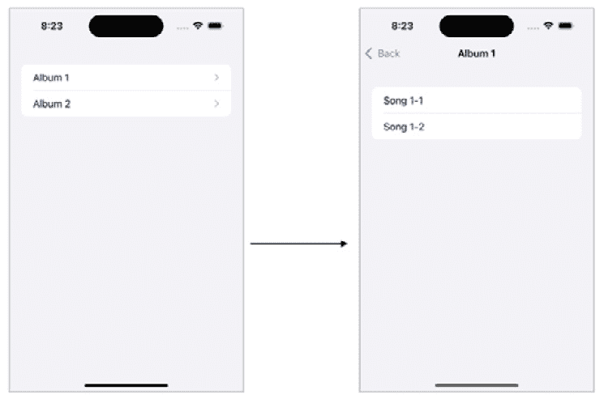
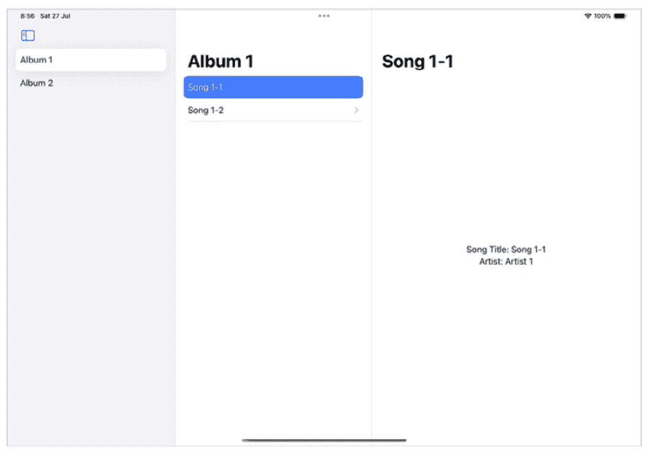

# <st c="0">4</st>

# <st c="2">使用 SwiftUI 进行高级导航</st>

<st c="34">在第</st> *<st c="38">第二章</st><st c="47">中，我们讨论了与</st> <st c="74">观察</st> <st c="79">框架</st> <st c="90">一起工作。</st> <st c="102">观察框架有助于管理我们应用程序不同部分之间的通信，并且是 SwiftUI 声明式编程的基本构建块之一。</st> <st c="275">然而，它也是我们将用于实现良好导航系统的工具之一。</st>

<st c="362">为什么我们会有一个关于导航的整章内容？</st> <st c="412">难道不是当用户在列表中选择一个项目时只是显示不同的视图吗？</st>

<st c="491">导航是移动开发中的一个重大主题。</st> <st c="545">一个标准应用程序可能有数十个屏幕，一个更广泛的应用程序可能有数百个。</st> <st c="632">了解如何管理我们应用程序中如此多的不同路由，对于我们的应用程序成功至关重要。</st>

<st c="752">在本章中，我们将进行以下操作：</st> <st c="787">以下操作：</st>

+   <st c="801">理解为什么 SwiftUI 导航是</st> <st c="841">一个挑战</st>

+   <st c="852">探索</st> <st c="863">SwiftUI 的</st> `<st c="873">NavigationStack</st>`

+   <st c="888">使用不同的数据模型来</st> <st c="927">触发导航</st>

+   <st c="945">使用协调者模式来更好地管理我们的</st> <st c="997">关注点</st>

+   <st c="1012">实现 SwiftUI 的</st> `<st c="1036">NavigationSplitView</st>` <st c="1055">以创建一个</st> <st c="1068">基于列的导航</st>

<st c="1091">我们有很多内容要介绍！</st> <st c="1118">但在我们开始之前，让我们尝试理解为什么 SwiftUI 导航可能是一个挑战。</st>

# <st c="1205">技术要求</st>

<st c="1228">对于本章，您需要从 Apple 的</st> <st c="1312">App Store</st> 下载 Xcode 版本 16.0 或更高版本。</st>

<st c="1322">您还需要运行最新版本的 macOS（Ventura 或更高版本）。</st> <st c="1402">只需在 App Store 中搜索 Xcode，选择并下载最新版本。</st> <st c="1487">启动 Xcode 并遵循系统可能提示您进行的任何其他安装说明。</st> <st c="1590">一旦 Xcode 完全启动，您就可以开始了。</st>

<st c="1640">从以下 GitHub</st> <st c="1692">链接</st> 下载示例代码：[<st c="1698">https://github.com/PacktPublishing/Mastering-iOS-18-Development/tree/main/Chapter%204</st>](https://github.com/PacktPublishing/Mastering-iOS-18-Development/tree/main/Chapter%204)<st c="1783">。</st>

# <st c="1784">理解为什么 SwiftUI 导航是一个挑战</st>

为了回答那个问题，我们需要理解导航是如何直观工作的。用户点击按钮、链接或其他可能发生的事件。然后，应用响应该事件并将视图过渡到另一个屏幕。

从某种意义上说，我们理解这听起来像是一个事件驱动范式。当我们讨论 SwiftUI 和 UIKit 之间的区别时，我们实际上是在讨论声明式编程和`<st c="2255">imperative programming</st>`之间的区别。

命令式 UI，如 UIKit，也是事件驱动的，而声明式 UI，如 SwiftUI，则表示当前状态。因此，我们可以理解为什么在 UIKit 中导航看起来更简单，并且可能感觉更自然。

许多开发者都在 SwiftUI 导航上挣扎。他们在一个`<st c="2593">UIHostingController</st>`中包裹一个 SwiftUI 视图，并使用 UIKit 导航系统。这是一个合理的解决方案，用于实现一些在 SwiftUI 中难以完成的复杂导航技术。然而，我们需要记住，SwiftUI 已经发展多年，提供了优秀的导航工具。

让我们从基本的导航工具`<st c="2904">NavigationStack</st>`开始。

# 探索`<st c="2904">NavigationStack</st>`

当 SwiftUI 被引入时，基本的导航机制是基于一个名为`<st c="3034">NavigationView</st>`的视图。然而，`<st c="3059">NavigationView</st>`对于大多数应用来说过于简单，因此`<st c="3108">NavigationStack</st>`取代了它。实际上，苹果从 iOS 18 开始弃用了`<st c="3163">NavigationView</st>`。

与`<st c="3213">NavigationView</st>`相比，`<st c="3229">NavigationStack</st>`给这个堆栈增加了一点点复杂性，这为我们提供了新的功能。

让我们看看`<st c="3364">NavigationStack</st>`的一个简单用法示例：

```swift
 struct ContentView: View {
    var body: some View { <st c="3436">NavigationStack {</st> NavigationLink("Tap here to go to the next
            screen") {
                Text("Next Screen!")
            }
        }
    }
}
```

这个代码示例看起来非常简单！

然而，`<st c="3585">NavigationStack</st>`比它看起来要强大得多。

怎么样？`<st c="3658">NavigationStack</st>`的概念是由四个组件构成的：

1.  `<st c="3786">NavigationView</st>`<st c="3800">。在</st> `<st c="3805">NavigationStack</st>`<st c="3820">中，`<st c="3822">NavigationLink</st>` <st c="3836">描述了发生了什么，而</st> `<st c="3870">navigationDestination</st>` <st c="3891">视图修饰符描述了我们去哪里。</st>

1.  **<st c="3928">数据与目的地之间的链接</st>**<st c="3966">：在某种程度上，这是前面点的进一步发展。</st> <st c="4025">目的地链接到一个数据类型。</st> <st c="4067">这意味着我们可以有多个导航链接指向同一个目的地，仅仅因为它们共享相同</st> <st c="4188">的数据类型。</st>

1.  **<st c="4198">允许我们读取和更新路径</st>**<st c="4238">：这里，我们对我们想法的另一个发展。</st> <st c="4288">因为数据和屏幕现在是链接的，我们可以将路径表示为数据实例的数组。</st> <st c="4393">修改路径数组也会改变我们的</st> <st c="4435">视图栈。</st>

1.  `<st c="4509">NavigationLink</st>` <st c="4523">也具有这种能力，但</st> `<st c="4574">NavigationStack</st>` <st c="4589">的引入使其变得过时。</st>

<st c="4607">现在让我们详细讨论这四个组件中的每一个，我们将从目的地开始。</st> <st c="4681">我们从目的地开始。</st>

## <st c="4699">使用 navigationDestination 视图修饰符分离导航目标</st>

<st c="4783">如果你已经阅读过我的</st> <st c="4802">上一本书</st> <st c="4811">（</st>*<st c="4818">《Pro iOS Testing》</st>* <st c="4834">和</st> *<st c="4839">《Mastering Swift Package Manager》</st>* <st c="4870">由</st> *<st c="4874">Apress</st>*<st c="4880">出版，以及</st> *<st c="4886">《The Ultimate iOS Interview Playbook》</st>* <st c="4921">由</st> *<st c="4925">Packt Publishing</st>*<st c="4941">出版）</st>，那么有一个重要的原则我一直反复强调：**<st c="4997">关注点分离</st>** <st c="5019">(</st>**<st c="5021">SoC</st>**<st c="5024">).</st> <st c="5028">在 SoC 中，我们将代码分解成具有特定和明确责任的独立模块或</st> <st c="5079">组件。</st> <st c="5145">这使得我们的代码更加模块化、灵活，并且易于维护。</st>

<st c="5210">当我们回顾</st> `<st c="5232">NavigationLink</st>`<st c="5246">时，我们可以看到它有多于一个的责任——它是用户实际点击的控制，同时也包含下一个</st> <st c="5376">屏幕视图。</st>

<st c="5388">在</st> `<st c="5392">NavigationStack</st>`<st c="5407">中，有一个新的视图修饰符称为</st> `<st c="5444">navigationDestination</st>`<st c="5465">，它允许我们根据状态变化分别定义一个目标。</st>

<st c="5546">让我们看看</st> `<st c="5571">navigationDestination</st>`<st c="5592">的一个例子，基于一个</st> <st c="5605">绑定变量：</st>

```swift
 struct ContentView: View {
    @State var isNextScreenDisplayed: Bool = false
    var body: some View {
        NavigationStack {
            Button("Go to next screen") {
                isNextScreenDisplayed = true
            }
            .<st c="5799">navigationDestination(isPresented:</st>
 <st c="5834">$isNextScreenDisplayed) {</st>
 <st c="5860">Text("Next Screen!")</st> }
        }
    }
}
```

<st c="5889">在我们的代码示例中，我们可以看到一个包含按钮的</st> `<st c="5924">NavigationStack</st>` <st c="5939">视图。</st> <st c="5966">请注意，没有任何</st> `<st c="5989">NavigationLink</st>` <st c="6003">视图，这是因为我们不需要它。</st> <st c="6054">我们通过改变名为</st> `<st c="6096">@State</st>` <st c="6102">的`<st c="6118">isNextScreenDisplayed</st>` <st c="6139">属性来触发导航，而不是使用一个`<st c="6160">NavigationLink</st>` <st c="6174">视图。</st>

<st c="6180">按钮还有一个名为</st> `<st c="6224">navigationDestination</st>`<st c="6245">的视图修饰符。</st> `<st c="6251">navigationDestination</st>` <st c="6272">视图修饰符有一个绑定布尔变量，它与`<st c="6340">isNextScreenDisplayed</st>` <st c="6361">状态变量相关联。</st> `<st c="6378">它还有一个包含我们的下一个屏幕（类似于`<st c="6447">NavigationLink</st>`<st c="6461">）的视图构建器。</st>

<st c="6464">点击按钮会切换`<st c="6495">isNextScreenDisplayed</st>` <st c="6516">并导航到我们的下一个屏幕。</st>

<st c="6547">使用`<st c="6595">NavigationLink</st>` <st c="6609">触发导航的能力在 SwiftUI 的早期版本中是可用的，但现在已被弃用。</st> <st c="6682">但不用担心——将目的地与实际控件解耦使我们的代码更加灵活，并为我们提供了更多机会。</st>

<st c="6825">例如，想象我们正在进行异步操作，如网络请求或图像处理，并且我们想要移动到下一个屏幕——可以通过切换布尔变量轻松实现。</st>

<st c="7026">拥有独立目的地的一个重要方面是，我们可以从不同的地方触发相同的导航。</st> <st c="7151">我们可以通过异步操作和按钮切换 Boo</st><st c="7172">lean。</st> <st c="7231">响应状态遵循声明式方法，而不是</st> `<st c="7300">NavigationView</st>` <st c="7314">方法，后者是响应按钮点击。</st>

<st c="7362">当导航到与任何数据无关的新屏幕时，切换布尔变量是很有用的。</st> <st c="7455">例如，从我们的主屏幕移动到设置是一个使用布尔绑定的经典例子。</st> <st c="7544">Boolean binding。</st>

<st c="7560">但我</st> <st c="7567">承诺</st> <st c="7576">`<st c="7581">NavigationStack</st>` <st c="7596">不仅仅如此，</st> <st c="7617">不是吗？</st>

<st c="7626">那么，让我们看看我们如何将导航目的地绑定到</st> <st c="7688">数据模型。</st>

## <st c="7700">使用数据模型触发导航</st>

对于习惯于使用 UIKit 导航的开发者来说，使用数据模型的想法可能很奇怪。<st c="7756">毕竟，切换布尔值进行导航与命令式编程非常相似，但数据模型与导航有什么关系呢？</st>

我们理解到许多屏幕都与特定的数据模型相关。<st c="8053">例如，如果我们有一个电影列表，点击一个电影会带我们到一个单独的电影屏幕。</st> <st c="8148">另一个例子是行程应用，点击特定的行程会带我们到一个专门针对该行程的屏幕。</st> <st c="8247">（注：此处省略了代码中的特殊字符标识，实际翻译时请保留。）

如果我们再深入思考，我们可以使用数据模型在我们的应用中表示许多屏幕。<st c="8354">我们可以使用包含</st> <st c="8419">枚举的数据模型来区分屏幕。</st>

在我们开始思考探索潜在的可能性和实现方式之前，让我们看看基于基本数据导航是什么样子：<st c="8564">（注：此处省略了代码中的特殊字符标识，实际翻译时请保留。）</st>

```swift
 struct ContentView: View { <st c="8603">private let countries = ["England", "France", "Spain",</st>
 <st c="8657">"Italy"]</st> var body: some View {
        NavigationStack {
            List(countries, id: \.self) { country in <st c="8748">NavigationLink(country, value: country)</st> } <st c="8790">.navigationDestination(for: String.self)</st> { item
                in
                Text(item)
            }
        }
    }
}
```

和往常一样，我已经在前面代码中突出了有趣的部分。<st c="8935">我们有一个 SwiftUI 视图，显示一个国家列表（基于一个</st> <st c="9004">常量变量）。</st>

每一行都有一个 `<st c="9039">NavigationLink</st>` <st c="9053">视图来显示国家名称，但这次它没有自己的目的地。</st> <st c="9142">相反，它使用国家作为链接的</st> <st c="9185">值参数。</st>

我们只有在查看导航目的地时才能理解将国家作为值发送的含义。<st c="9316">在 *<st c="9343">使用 navigationDestination 视图修饰符分离导航目的地</st>* <st c="9426">部分中的代码示例中，导航目的地被链接到一个布尔状态变量。</st> <st c="9503">在这种情况下，导航目的地仅在</st> <st c="9552">存在特定数据类型的链接时执行</st> <st c="9562">（在这种情况下，是一个字符串类型，就像一个</st> <st c="9647">国家值）。</st>

换句话说，点击一个国家会通过 `<st c="9746">NavigationLink</st>`<st c="9760">将其值发送到导航堆栈。导航目的地捕获这个值并定义我们的下一个屏幕。<st c="9831">（注：此处省略了代码中的特殊字符标识，实际翻译时请保留。）</st>

我们可以通过定义多个导航目的地来使用数据模型导航到不同的地方，每个目的地对应不同的数据模型类型。<st c="9985">（注：此处省略了代码中的特殊字符标识，实际翻译时请保留。）

这里是使用导航目的地向个人资料屏幕添加导航的另一个例子：<st c="9996">（注：此处省略了代码中的特殊字符标识，实际翻译时请保留。）</st>

```swift
 struct Profile<st c="10109">: Hashable</st> {
    let firstName: String
    let lastName: String
    let email: String
}
struct ContentView: View {
    let profile = Profile(firstName: "Avi", lastName:
    "Tsadok", email: "myemail@domain.com")
    let countries = ["England", "France", "Spain", "Italy"]
    var body: some View {
        NavigationStack {
            List(countries, id: \.self) { country in <st c="10439">NavigationLink(country, value: country)</st> }.toolbar(content: { <st c="10500">NavigationLink("Go to profile", value:</st>
 <st c="10538">profile)</st> }) <st c="10551">.navigationDestination(for: String.self)</st> { item
                in
                Text(item)
            } <st c="10615">.navigationDestination(for: Profile.self)</st> {
              profile in
                VStack {
                    Text(profile.firstName)
                    Text(profile.lastName)
                    Text(profile.email)
                }
            }
        }
    }
}
```

在前面的代码中，我们看到一个来自`<st c="10851">Profile</st>` `<st c="10858">类型`的数据模型的另一个导航目的地。要导航到配置文件屏幕，我们在屏幕工具栏中添加了另一个`<st c="10909">NavigationLink</st>` `<st c="10923">视图`并发送了配置文件`<st c="10972">数据模型</st>`。

我们的导航系统是动态的，因为我们可以使用不同的数据模型。但这并没有停止。`<st c="11093">NavigationStack</st>` `<st c="11108">可以</st>` `<st c="11112">揭示并甚至修改当前视图的堆栈。</st>`我们使用`<st c="11167">path</st>` `<st c="11193">绑定变量</st>`来做到这一点。

## `《st c="11210">响应路径变量</st>`

将`<st c="11242">目的地</st>` `<st c="11258">与其导航链接</st>`分离是很好的，但`<st c="11309">NavigationStack</st>` `<st c="11324">’s`观察和更新其视图堆栈的能力非常强大。

如前所述，一个`<st c="11394">NavigationStack</st>` `<st c="11411">视图`有一个名为`<st c="11462">path</st>`的绑定变量，并且`<st c="11476">path</st>`变量可以包含通过其`<st c="11529">数据模型</st>`的视图列表。

使用链表很容易证明这一点：

```swift
 struct ContentView: View {
    let list: LinkedList<Int> = {
        let list = LinkedList<Int>()
        list.head = ListNode(1)
        list.head?.next = ListNode(2)
        list.head?.next?.next = ListNode(3)
        return list
    }() <st c="11786">@State var path: [ListNode<Int>]</st> = []
    var body: some View { <st c="11846">NavigationStack(path: $path)</st> {
            VStack {
                NavigationLink("Start", value: list.head)
            }
            .navigationDestination(for: ListNode<Int>.self)
              { node in
                NavigationLink("\(node.value)", value:
                node.next)
              }
        }
    }
}
```

我选择使用链表来演示`<st c="12082">path</st>` `<st c="12086">使用`，因为它是一个很好的数据结构，类似于导航堆栈（来自相同类型的链接项）。

如果我们在导航期间观察`<st c="12232">path</st>` `<st c="12236">变量`，我们可以看到它包含当前作为视图活动的列表节点集合。

`<st c="12345">path</st>` `<st c="12383">变量</st>`绑定到`<st c="12413">NavigationStack</st>` `<st c="12428">的事实非常棒，因为我们能够操作和`<st c="12459">修改</st>`它：

```swift
 path.append(ListNode(4))
```

向`<st c="12524">path</st>` `<st c="12528">添加新的列表节点会触发导航并将用户引导到一个新的`<st c="12579">屏幕</st>`。

我们也可以使用`<st c="12634">path</st>` `<st c="12638">变量</st>`来创建整个堆栈：

```swift
 path = [ListNode(1), ListNode(2)]
```

设置新的节点数组会创建相应视图的新堆栈。这是一个实现深度链接或将用户引导到应用内的特定位置的好方法。

你现在可能正在挠头，在想我们如何在应用内部实现它？在哪些用例中，我们需要使用相同的数据模型类型在层次结构中导航几个级别？

<st c="13063">因此，数据模型类型不一定是</st> `<st c="13105">Task</st>`<st c="13109">,</st> `<st c="13111">Album</st>`<st c="13116">, 或</st> `<st c="13121">Contact</st>`<st c="13128">。数据模型也可以描述一个屏幕或一个功能。</st> <st c="13184">这样，数据集合可以描述应用内的导航路径。</st>

<st c="13258">以下是一个可以描述屏幕的数据类型示例，后面跟着一个</st> <st c="13276">导航路径：</st>

```swift
 enum Screen: Hashable {
    case signin
    case onboarding
    case mainScreen
    case settings
}
@State var path: [Screen] = []
```

<st c="13465">枚举</st> `<st c="13475">Screen</st>` <st c="13481">描述了我们要导航到的屏幕类型，并且是构建</st> <st c="13565">堆栈</st> <st c="13569">的一个简单方法：</st>

```swift
 path  = [.mainScreen, .settings]
```

<st c="13605">这一行简短的代码在第一个视图是主屏幕，后面跟着一个</st> <st c="13707">设置屏幕</st> <st c="13711">时构建了一个视图堆栈。</st>

<st c="13723">使用枚举来显示不同类型的屏幕是很好的。</st> <st c="13786">然而，使用枚举处理不同类型的数据不太方便。</st> <st c="13862">为了解决这个问题，我们有一个比实例集合更复杂的解决方案，它被称为</st> `<st c="13963">NavigationPath</st>`<st c="13977">。</st>

# <st c="13978">使用 NavigationPath 处理不同类型的数据</st>

`<st c="14036">NavigationPath</st>` <st c="14051">是与</st> `<st c="14078">NavigationStack</st>`<st c="14093">一起引入的，它允许我们更好地控制我们的导航流程。</st> <st c="14158">实际上，</st> `<st c="14167">NavigationPath</st>` <st c="14181">使得使用 SwiftUI 进行导航结合了声明式和命令式编程，并且与 UIKit</st> <st c="14298">的导航模式更为相似。</st>

<st c="14317">假设我们有一个音乐应用，其主屏幕上有一个歌曲和专辑列表。</st> <st c="14400">点击歌曲会跳转到</st> `<st c="14429">歌曲</st>` <st c="14433">视图，而点击专辑则会导航到一个</st> `<st c="14481">专辑</st>` <st c="14486">视图。</st> <st c="14493">在上一个部分中，我们使用枚举来管理这一点，尝试将枚举值映射到屏幕视图。</st> <st c="14596">使用</st> `<st c="14601">NavigationPath</st>`<st c="14615">，只要其类型符合</st> <st c="14661">可哈希</st> <st c="14665">，我们就可以将任何我们想要的值附加到</st> `<st c="14661">path</st>` <st c="14665">变量上。</st>

<st c="14716">让我们看看下面的</st> <st c="14742">代码：</st>

```swift
 struct ContentView: View { <st c="14785">@State private var navigationPath = NavigationPath()</st> @State private var albums: [Album] = [Album(title:
      "Album 1"), Album(title: "Album 2")]
    @State private var songs: [Song] = [Song(title: "Song
      1"), Song(title: "Song 2")]
    var body: some View { <st c="15030">NavigationStack(path: $navigationPath) {</st> VStack {
                List {
                    Section(header: Text("Songs")) {
                        ForEach(songs) { song in
                            Button(action: { <st c="15162">navigationPath.append(song)</st> }) {
                                Text(song.title)
                            }
                        }
                    }
                    Section(header: Text("Albums")) {
                        ForEach(albums) { album in
                            Button(action: { <st c="15296">navigationPath.append(album)</st> }) {
                                Text(album.title)
                            }
                        }
                    }
                } <st c="15356">.navigationDestination(for: Song.self) {</st>
 <st c="15396">song in</st>
 <st c="15404">SongDetailView(song: song,</st>
 <st c="15431">navigationPath: $navigationPath)</st>
 <st c="15464">}</st>
 <st c="15466">.navigationDestination(for: Album.self) {</st>
 <st c="15507">album in</st>
 <st c="15516">AlbumDetailView(album: album)</st>
 <st c="15546">}</st> }
```

<st c="15550">请注意，前面的代码示例是不完整的，它不包括</st> <st c="15623">子视图。</st>

<st c="15635">我们的音乐应用主屏幕包含四个重要的部分，用于处理我们的</st> <st c="15710">导航系统：</st>

我们从声明一个状态变量开始，该变量保存我们的<st c="15785">path</st> <st c="15789">变量</st> <st c="15799">，称为<st c="15806">NavigationPath</st><st c="15820">：</st>

```swift
 @State private var navigationPath = NavigationPath()
```

如前所述，与之前我们使用的`<st c="15918">path</st>` `<st c="15922">`变量不同，在`<st c="15948">NavigationPath</st>` `<st c="15962">`的情况下，我们不需要定义其类型。<st c="16003">只要它符合</st> `<st c="16058">Hashable</st>` `<st c="16066">`，它就可以保存我们想要的任何类型。</st>

接下来，我们将使用我们的新<st c="16120">NavigationPath</st> <st c="16134">来初始化</st> `<st c="16091">NavigationStack</st>` <st c="16106">，这与我们在之前的例子中做的是类似的：</st>

```swift
 NavigationStack(path: $navigationPath) {
```

注意，我们使用了一个类似的签名，但是类型不同——使用<st c="16291">Binding<NavigationPath></st> <st c="16314">而不是</st> `<st c="16326">Binding<Data></st>`<st c="16339">。</st>

现在我们有了<st c="16358">NavigationPath</st><st c="16372">，我们可以通过将相应的对象添加到导航路径中来导航到一个<st c="16395">歌曲</st> <st c="16399">视图或一个<st c="16414">专辑</st> <st c="16419">视图：</st>

```swift
 navigationPath.append(song)
```

或者，你可以这样做：</st>

```swift
 navigationPath.append(album)
```

添加操作会触发<st c="16608">navigationDestination</st> <st c="16629">视图修饰符，传递所选的歌曲或专辑：</st>

```swift
 .navigationDestination(for: Song.self) { song in
    SongDetailView(song: song, navigationPath:
      $navigationPath)
}
.navigationDestination(for: Album.self) { album in
    AlbumDetailView(album: album)
}
```

在这个例子中，我们为每种类型我们传递的<st c="16924">navigationDestination</st> <st c="16945">视图修饰符都不同：</st>

我们可以添加任何我们想要的实体的事实使得<st c="17036">NavigationPath</st> <st c="17050">成为一个灵活的导航系统的理想组件。</st>

我们也可以使用<st c="17120">NavigationPath</st> <st c="17134">通过移除最后一个组件来执行一个<st c="17148">Back</st> <st c="17152">操作：</st>

```swift
 Button("Back") {
     navigationPath.removeLast()
}
```

在这个例子中，我们添加了一个返回按钮，当点击时移除导航路径的最后几个组件<st c="17241">。</st> <st c="17333">。</st>

因为我们仍然处于一个声明性世界中，我们对导航栈所做的任何更改，无论是通过添加或移除组件，都会反映在我们的 UI 中<st c="17345">。</st> <st c="17370">。</st>

# 与协调器模式一起工作

`<st c="17545">NavigationPath</st>` <st c="17559">和</st> `<st c="17564">NavigationStack</st>` <st c="17579">的组合是健壮的，并且在管理导航方面提供了灵活性。<st c="17639">然而，随着我们的应用扩展，控制用户如何从一个屏幕移动到另一个屏幕变得更加复杂。</st> <st c="17651">。</st>

<st c="17753">例如，假设我们有一个引导流程，并希望为不同的用户配置文件提供不同的屏幕集。</st> <st c="17869">或者，我们希望在不同的流程中重用相同的屏幕。</st> <st c="17930">在每个流程中，屏幕应该继续到</st> <st c="17976">不同的屏幕。</st>

<st c="17993">在每种情况下，当我们处于屏幕上下文时，理解我们的下一个视图都变得很困难。</st> <st c="18096">实际上，管理我们的导航这个问题不仅与 SwiftUI 有关，而且大多数开发者都知道</st> <st c="18207">从 UIKit。</st>

<st c="18218">为了尝试改进我们的导航机制，我们可以使用所谓的</st> **<st c="18291">协调器模式</st>** <st c="18310">——一种将导航逻辑委托给</st> <st c="18327">专用组件的模式。</st>

<st c="18384">让我们尝试理解这意味着什么。</st>

## <st c="18423">理解协调器的原理</st>

<st c="18467">在我们编写</st> <st c="18488">第一个协调器之前，</st> <st c="18534">让我们回顾一些</st> <st c="18534">基本原理：</st>

+   <st c="18557">协调器是一个组件，它保存当前的导航路径和一般上下文。</st> <st c="18649">它知道显示的是哪个屏幕以及一般的当前流程。</st> <st c="18713">协调器还会将新的视图添加到堆栈中，弹出，并显示模态或</st> <st c="18789">表单视图。</st>

+   <st c="18801">视图不知道用户应该导航到的下一个视图。</st> <st c="18870">它所知道的是用户执行的操作。</st> <st c="18927">从某种意义上说，视图与导航逻辑是隔离的，并且不了解</st> <st c="19006">一般上下文。</st>

+   <st c="19022">协调器代表一个流程。</st> <st c="19056">在我们的应用中，我们可以有多个流程，每个流程有多个协调器。</st>

<st c="19119">根据这些原则，我们可以理解协调器模式是我们分离应用关注点的一种改进方式。</st> <st c="19237">应用关注点。</st>

<st c="19250">看看</st> *<st c="19259">图 4</st>**<st c="19267">.1</st>*<st c="19269">：</st>



<st c="19391">图 4.1：协调器模式</st>

*<st c="19426">图 4</st>**<st c="19435">.1</st>* <st c="19437">展示了基本的协调器模式。</st> <st c="19473">我们有一个</st> *<st c="19484">专辑列表</st>* <st c="19495">视图，当用户选择一个专辑时，操作会被发送到</st> *<st c="19564">协调器</st>*<st c="19575">。然后，协调器决定通过将操作发送到</st> `<st c="19669">NavigationPath</st>`<st c="19683">来导航到</st> *<st c="19626">专辑详情</st>* <st c="19638">视图。</st>

<st c="19684">在这个模式中，专辑列表不知道接下来应该发生什么。</st> <st c="19757">例如，协调器可以决定在某些情况下，我们应该向用户展示一个升级屏幕。</st> <st c="19860">或者，如果它是入职流程的一部分，协调器可以确定专辑列表只是一个演示，我们应该继续到入职流程的下一个步骤。</st> <st c="20018">入职流程。</st>

<st c="20034">但我们如何构建一个协调器模式呢？</st> <st c="20082">它是如何工作的，尤其是在</st> <st c="20118">SwiftUI 的世界中？</st>

<st c="20132">在 SwiftUI 中构建协调器有许多方法。</st> <st c="20188">我这里描述的协调器模式只是一个</st> <st c="20239">示例，用于展示基本原理，我们可以根据项目的需求调整这个示例。</st>

<st c="20353">我们将从最基本的部分开始——协调器本身。</st>

## <st c="20429">构建协调器对象</st>

<st c="20461">协调器是</st> <st c="20480">定义不同用户操作和导航选项的中心对象。</st> <st c="20564">它还持有导航路径，以便执行导航操作。</st>

<st c="20642">我们将首先定义一个基本的</st> <st c="20677">协调器类：</st>

```swift
 class Coordinator: ObservableObject {
    @Published var path = NavigationPath()
}
```

<st c="20774">我们创建了一个包含一个</st> `<st c="20819">导航路径</st>` <st c="20833">对象的协调器类。</st> <st c="20842">这个</st> `<st c="20846">导航路径</st>` <st c="20860">对象是必不可少的——它允许协调器向堆栈中添加更多项目，执行弹出操作，并理解当前的堆栈。</st> <st c="20999">请注意，协调器遵循</st> `<st c="21043">可观察对象</st>` <st c="21059">协议，并且路径是一个已发布对象——这是因为我们希望路径在使用时成为</st> `<st c="21157">导航堆栈</st>` <st c="21172">的一部分。</st>

<st c="21188">接下来，我们定义不同的用户和</st> <st c="21228">页面操作：</st>

```swift
 enum PageAction: Hashable {
    case gotoAlbumView(album: Album)
    case gotoSettingsView
}
enum UserAction {
    case albumTappedInAlbumsList(album: Album)
    case settingButtonTapped
}
```

<st c="21414">在这个例子中，我们</st> <st c="21435">创建了</st> <st c="21443">两个枚举：</st>

+   `<st c="21453">页面操作</st>`<st c="21464">：这个枚举描述了协调器需要执行的一些导航操作，例如导航到一个</st> `<st c="21566">专辑</st>` <st c="21571">视图或一个</st> <st c="21582">设置视图。</st>

+   `<st c="21596">用户操作</st>`<st c="21607">：这个枚举描述了用户执行的操作，例如在专辑列表中点击专辑或在</st> <st c="21725">设置按钮上点击。</st>

<st c="21741">请注意，一些枚举包含关联值，例如相关的</st> `<st c="21812">专辑</st>` <st c="21817">对象。</st>

<st c="21825">现在我们有了我们的枚举，我们将创建两个</st> <st c="21873">重要的函数：</st>

```swift
 func performedAction(action: UserAction) {
        switch action {
        case .albumTappedInAlbumsList(let album):
            path.append(PageAction.gotoAlbumView(album:
            album))
        case .settingButtonTapped:
            path.append(PageAction.gotoSettingsView)
        }
    }
    @ViewBuilder
    func buildView(forPageAction pageAction: PageAction) ->
      some View {
        switch pageAction {
        case .gotoAlbumView(let album):
            AlbumDetailView(album: album)
        case .gotoSettingsView:
            SettingsView()
        }
    }
```

<st c="22324">首先是</st> `<st c="22342">performAction()</st>` <st c="22357">函数。</st> <st c="22368">这个函数接收</st> `<st c="22391">UserAction</st>` <st c="22401">作为参数，并将相应的页面操作追加到</st> `<st c="22462">NavigationPath</st>`<st c="22476">。这个函数是协调器的“大脑”——当我们决定用户执行特定操作时要导航到哪里时。</st>

<st c="22600">在这个例子中，当用户在专辑列表中点击专辑时，我们导航到</st> `<st c="22686">专辑</st>` <st c="22691">视图，传递</st> `<st c="22710">专辑</st>` <st c="22715">对象。</st> <st c="22724">当用户点击设置按钮时，我们导航到设置屏幕。</st> <st c="22800">这种逻辑可能听起来很明显，也可能过于复杂。</st> <st c="22856">然而，在一个复杂的世界里，我们有权限、A/B 测试和其他变化，一个集中处理所有这些的地方可以是非常宝贵的。</st>

<st c="23010">第二个函数将页面操作映射到一个 SwiftUI 视图。</st> <st c="23053">我们现在将在构建</st> `<st c="23098">CoordinatorView</st>`<st c="23104">时使用它。</st>

## <st c="23120">添加 CoordinatorView</st>

<st c="23143">协调器</st> <st c="23159">类是健壮的，包含了我们所有的导航逻辑。</st> <st c="23195">然而，我们不能使用协调器来执行实际的导航。</st> <st c="23218">为了做到这一点，我们必须用</st> `<st c="23330">CoordinatorView</st>`<st c="23345">包裹我们的视图，它知道如何与</st> <st c="23376">我们的协调器</st>一起工作。

<st c="23392">所以，让我们看看</st> `<st c="23412">CoordinatorView</st>` <st c="23427">是什么样子：</st>

```swift
 struct CoordinatorView: View {
    @ObservedObject private var coordinator = Coordinator()
    var body: some View { <st c="23549">NavigationStack</st>(path: $coordinator.path) {
        AlbumListView()
          .navigationDestination(for:
            PageAction.self, destination: { pageAction in
                coordinator.buildView(forPageAction:
                  pageAction)
                })
        }
        .environmentObject(coordinator)
    }
}
```

`<st c="23772">CoordinatorView</st>` <st c="23788">是一个简单的 SwiftUI 视图，它有三个组件：</st>

+   `<st c="23840">coordinator</st>`<st c="23852">: 在</st> `<st c="23862">CoordinatorView</st>`<st c="23877">中，我们添加了我们刚刚构建的</st> `<st c="23907">Coordinator</st>` <st c="23918">类的一个实例。</st> <st c="23949">我们将该协调器制作为一个可观察对象，这样我们就可以使用其路径来添加和从</st> `<st c="24047">堆栈</st>`中移除视图。

+   `<st c="24057">NavigationStack</st>`<st c="24073">: 这与我们在本章中遇到的</st> `<st c="24093">NavigationStack</st>` <st c="24108">相同。</st> <st c="24133">如前所述，我们使用协调器路径作为</st> `<st c="24178">NavigationStack</st>`<st c="24193">，但更重要的是，还有两个附加事项——我们使用根视图（</st>`<st c="24285">AlbumListView</st>`<st c="24299">）初始化堆栈，并使用协调器</st> `<st c="24330">buildView</st>` <st c="24339">函数将页面操作映射到视图，以将相应的视图添加到</st> <st c="24416">堆栈。</st>

+   `<st c="24426">环境对象</st>`<st c="24444">：我们在协调器中添加了一个</st> `<st c="24457">environmentObject</st>` <st c="24474">视图修饰符来声明一个环境对象。</st> <st c="24542">我们这样做是为了让所有在</st> `<st c="24584">NavigationStack</st>` <st c="24599">下的视图都能访问协调器，以便它们可以调用不同的</st> <st c="24662">用户操作。</st>

<st c="24675">这三个组件</st> <st c="24699">负责将</st> <st c="24730">我们的视图连接到我们</st> <st c="24768">构建的协调器逻辑。</st>

<st c="24779">现在，让我们看看</st> `<st c="24799">AlbumListView</st>` <st c="24812">是如何与</st> <st c="24824">协调器一起工作的。</st>

## <st c="24840">直接从视图调用协调器</st>

<st c="24887">记住我们的一条</st> <st c="24908">协调器原则——视图的职责只是说</st> *<st c="24972">发生了什么</st>*<st c="24980">，而不是</st> *<st c="24991">接下来会发生什么</st>* <st c="25002">。</st> <st c="25009">接下来会发生什么是协调器的职责。</st>

<st c="25055">让我们看看</st> `<st c="25081">AlbumListView</st>` <st c="25094">是如何处理它的：</st>

```swift
 struct AlbumListView: View { <st c="25139">@EnvironmentObject private var coordinator: Coordinator</st> var body: some View {
        List(albums) { album in
            VStack(alignment: .leading) {
                Text(album.title)
                    .font(.headline)
                Text(album.artist)
                    .font(.subheadline)
            }
            .onTapGesture { <st c="25363">coordinator.performedAction(action:</st>
 <st c="25398">.albumTappedInAlbumsList(album: album))</st> }
        }
        .navigationTitle("Albums")
        .toolbar {
            ToolbarItem(placement: .navigationBarTrailing)
            {
                Button(action: { <st c="25546">coordinator.performedAction(action:</st>
 <st c="25581">.settingButtonTapped)</st> }) {
                    Image(systemName: "gear")
                }
            }
        }
    }
}
```

<st c="25643">`<st c="25648">AlbumListView</st>` <st c="25661">结构体</st> <st c="25668">包含用户专辑列表和一个带有</st> <st c="25732">设置按钮</st> <st c="25739">的导航栏。</st>

<st c="25748">点击其中一个专辑会调用协调器的</st> `<st c="25802">performedAction()</st>` <st c="25819">函数，该函数返回相应的枚举值和</st> <st c="25875">选中的专辑。</st>

<st c="25890">此外，点击设置按钮会调用相同的</st> `<st c="25950">performedAction()</st>` <st c="25967">函数，但使用不同的</st> <st c="25994">枚举值。</st>

<st c="26005">回到本节的开头，在</st> *<st c="26059">构建协调器对象</st>* <st c="26090">部分，我们现在可以理解一切是如何连接起来的。</st>

<st c="26147">我们还可以理解为什么协调器实例是一个环境对象——这样我们就可以直接从</st> <st c="26259">视图</st> <st c="26268">中调用它。</st>

<st c="26268">到目前为止，我们讨论了</st> `<st c="26293">NavigationStack</st>` <st c="26308">和协调器模式。</st> <st c="26338">我们可能会认为导航仅仅是关于改变当前视图。</st> <st c="26410">然而，在大屏幕上，如 iPad 屏幕上的导航，通常涉及处理不同的列。</st> <st c="26517">所以，让我们来认识</st> `<st c="26532">NavigationSplitView</st>` <st c="26551">，看看</st> <st c="26559">我们是如何将其固定下来的（我告诉你导航是一个复杂的话题，对吧？）。</st>

# <st c="26640">使用 NavigationSplitView 进行列导航</st>

<st c="26689">当我们为 padOS 或 macOS 开发应用时，我们知道我们需要利用大屏幕的优势。</st> <st c="26712">但这意味着什么呢？</st> <st c="26812">有时，它可能意味着使用网格而不是列表。</st> <st c="26835">然而，在导航的上下文中，这意味着当每个列显示不同的视图而不是每次用户导航时替换整个屏幕时，我们可以处理多个列。</st>

<st c="27100">换句话说——我们需要</st> <st c="27135">分割屏幕。</st>

<st c="27146">为了做到这一点，我们可以使用一个名为</st> `<st c="27190">NavigationSplitView</st>`<st c="27209">的视图，它以两列或三列的形式展示视图。</st>

<st c="27256">当用户选择一个视图中的一个项目时，它会更新其他列中的视图。</st>

## <st c="27339">创建 NavigationSplitView</st>

<st c="27368">为了演示</st> <st c="27384">如何使用</st> `<st c="27395">NavigationSplitView</st>`<st c="27414">，我们将使用我们的音乐应用示例并将其调整</st> <st c="27464">为 padOS。</st>

<st c="27473">让我们从一些重要的术语开始——我们有三种不同的</st> <st c="27538">列类型：</st>

+   `<st c="27551">侧边栏</st>`<st c="27559">：从左侧数的第一列。</st> <st c="27594">这是我们的导航开始的主要列。</st>

+   `<st c="27647">内容</st>`<st c="27655">：当有三列时，</st> `<st c="27692">内容</st>` <st c="27699">列显示与</st> `<st c="27754">侧边栏</st>` <st c="27761">列中选定的项目相关的数据。</st>

+   `<st c="27769">详情</st>`<st c="27776">：</st> `<st c="27783">详情</st>` <st c="27789">列展示</st> `<st c="27831">内容</st>` <st c="27838">列或</st> `<st c="27853">侧边栏</st>` <st c="27860">列中选定的项目。</st> <st c="27869">一般来说，它是分割视图层次结构中最后的项。</st>

<st c="27937">这三个术语最初可能听起来有些令人困惑，所以让我们直接跳到代码，了解它们是如何相互关联的。</st> <st c="28072">以下是一个</st> `<st c="28093">NavigationSplitView</st>` <st c="28112">的示例，它显示了一个专辑列表，并且当点击一个</st> <st c="28165">专辑时，应用会显示该专辑的</st> <st c="28196">歌曲列表：</st>

```swift
 var body: some View { <st c="28229">NavigationSplitView</st> {
            List(albums, selection: $selectedAlbum) { album
              in
                NavigationLink(album.title, value: album)
            }
        } <st c="28348">detail: {</st> if let selectedAlbum = selectedAlbum {
                List(selectedAlbum.songs, selection:
                  $selectedSong) { song in
                    Text(song.title)
                }
                .navigationTitle(selectedAlbum.title)
            } else {
                Text("Select an album")
            }
        }
    }
```

<st c="28554">我们的代码显示了</st> `<st c="28570">NavigationSplitView</st>` <st c="28589">的两个部分——侧边栏（第一个块）和详情。</st> <st c="28653">侧边栏显示了一个专辑列表。</st> <st c="28689">点击一个专辑会更新</st> `<st c="28721">selectedAlbum</st>` <st c="28734">状态变量。</st> <st c="28751">详情</st> <st c="28755">块展示了关于</st> `<st c="28761">selected album</st>` <st c="28803">所选专辑的歌曲列表。</st>

<st c="28818">让我们看看在横向排列的 iPad 上它看起来如何（</st>*<st c="28883">图 4</st>**<st c="28892">.2</st>*<st c="28894">）：</st>



<st c="28967">图 4.2: iPad 上分割视图的两个列 – 横向</st>

<st c="29023">这是它在</st> <st c="29049">竖直排列</st> <st c="29083">中的外观（</st>*<st c="29072">图 4</st>**<st c="29081">.3</st>*<st c="29083">）：</st>



<st c="29088">图 4.3: 分割视图中竖直排列的两个列</st>

*<st c="29148">图 4.2</st>* <st c="29160">和 *<st c="29165">图 4.3</st>* <st c="29168">展示了我们的代码在 iPad 的竖直和横向排列中的运行情况。</st> <st c="29243">在竖直排列中，侧边栏视图出现在抽屉中，而在横向排列中，屏幕被分割，两个视图</st> <st c="29373">都是可见的。</st>

<st c="29385">但在 iPhone 上会发生什么？</st> <st c="29417">我们需要为较小的设备创建一个专用视图吗？</st> <st c="29476">让我们看看相同的代码在 iPhone 上会发生什么（</st>*<st c="29532">图 4</st>**<st c="29541">.4</st>*<st c="29543">）：</st>



<st c="29598">图 4.4: iPhone 上的 NavigationSplitView</st>

*<st c="29642">图 4</st>**<st c="29651">.4</st>* <st c="29653">显示，相同的</st> `<st c="29674">NavigationSplitView</st>` <st c="29693">仅在 iPhone 上运行时有效。</st> <st c="29732">在小设备上，</st> `<st c="29754">NavigationSplitView</st>` <st c="29773">构建了一个单页导航机制，类似于在</st> `<st c="29825">NavigationStack</st>` <st c="29860">或甚至在</st> `<st c="29872">UIKit 的</st> `<st c="29880">UINavigationController</st>`<st c="29902">》中看到的。</st>

<st c="29903">现在，让我们使事情变得稍微复杂一些，并添加一个</st> <st c="29963">第三列。</st>

## <st c="29976">移动到三列</st>

<st c="30000">在许多应用中，数据</st> <st c="30024">层次结构基于两个级别。</st> <st c="30058">在我们的例子中，它是专辑和歌曲，但在其他情况下，我们可以找到组和用户，团队和玩家，或项目和工作。</st> <st c="30190">基于这一点，我们将不得不与一个三级的</st> <st c="30245">导航系统</st> <st c="30245">一起工作：</st>

+   <st c="30263">第一级：第一级项目的列表</st> <st c="30291"></st>

+   <st c="30302">第二级：基于第一级选择，第二级项目的列表</st> <st c="30360"></st>

+   <st c="30378">第三级：所选第二级项目的详细信息</st> <st c="30412"></st>

<st c="30429">尽管我们可以在模态屏幕中呈现所选第一级项目的详细信息，但我们可以在 iPad 屏幕的第三列中考虑显示它。</st>

<st c="30584">在</st> *<st c="30592">创建 NavigationSplitView</st>* <st c="30622">部分中，我们说</st> `<st c="30649">Detail</st>` <st c="30655">列显示最后一个选中项的信息。</st> <st c="30711">这意味着，如果我们想添加另一个列，它将位于</st> `<st c="30784">Detail</st>` <st c="30790">列和</st> `<st c="30806">Sidebar</st>` <st c="30813">列之间——这就是</st> `<st c="30835">Content</st>` <st c="30842">列。</st>

<st c="30850">因此，让我们在我们的音乐应用中添加一个</st> `<st c="30867">Content</st>` <st c="30874">列：</st>

```swift
 var body: some View { <st c="30922">NavigationSplitView {</st> List(albums, selection: $selectedAlbum) { album
              in
                NavigationLink(album.title, value: album)
            } <st c="31039">} content: {</st> if let selectedAlbum = selectedAlbum {
                List(selectedAlbum.songs, selection:
                  $selectedSong) { song in
                    NavigationLink(song.title, value: song)
                }
                .navigationTitle(selectedAlbum.title)
            } else {
                Text("Select an album")
            } <st c="31268">} detail: {</st> if let selectedSong = selectedSong {
                VStack {
                    Text("Song Title:
                      \(selectedSong.title)")
                    Text("Artist: \(selectedSong.artist)")
                }
                .padding()
                .navigationTitle(selectedSong.title)
            } else {
                Text("Select a song")
            }
        }
    }
```

<st c="31493">在前面的代码示例中，我们将歌曲列表放在我们新的</st> `<st c="31561">Content</st>` <st c="31568">块中，并将歌曲详情放在</st> `<st c="31603">Detail</st>` <st c="31609">列中。</st> <st c="31618">我们还使用了相同的</st> `<st c="31653">selectedSong</st>` <st c="31665">状态变量，并相应地更新了我们的</st> <st c="31697">UI</st>。！</st>

<st c="31712">让我们看看现在在 iPad 上看起来怎么样</st> <st c="31735">（</st>*<st c="31752">图 4</st>**<st c="31761">.5</st>*<st c="31763">）：</st>



<st c="31849">图 4.5：iPad 上的三列 NavigationSplitView</st>

*<st c="31905">图 4</st>**<st c="31914">.5</st>* <st c="31916">显示了 iPad 上的一个</st> <st c="31925">三列</st> `<st c="31938">NavigationSplitView</st>` <st c="31957">，现在中间显示的是专辑列表。</st>

# <st c="32039">总结</st>

<st c="32047">本章涉及移动开发中的一个关键主题。</st> <st c="32111">导航始终是一个问题，在 UIKit 中也是如此。</st> <st c="32163">然而，我们可以通过基于产品需求和平衡灵活性与简洁性的方法进行周密规划，实现有效的导航机制。</st>

<st c="32334">在本章中，我们讨论了为什么 SwiftUI 是一个挑战，探讨了</st> `<st c="32414">NavigationStack</st>`<st c="32429">，回顾了协调器模式，</st> <st c="32465">甚至讨论了基于列的导航</st> <st c="32510">，使用了</st> `<st c="32515">NavigationSplitView</st>`<st c="32534">。！</st>

<st c="32535">到目前为止，我们完全有能力在我们的应用中创建一个令人惊叹的导航！</st> <st c="32606">！</st>

<st c="32614">我们下一章将讨论一个完全不同但令人兴奋的话题：如何使用 WidgetKit 突破我们应用的边界，并在我们的沙盒之外添加功能</st> <st c="32755">。！</st>
