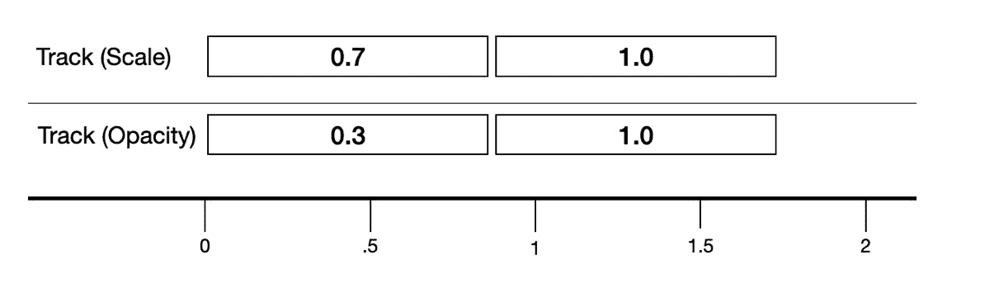
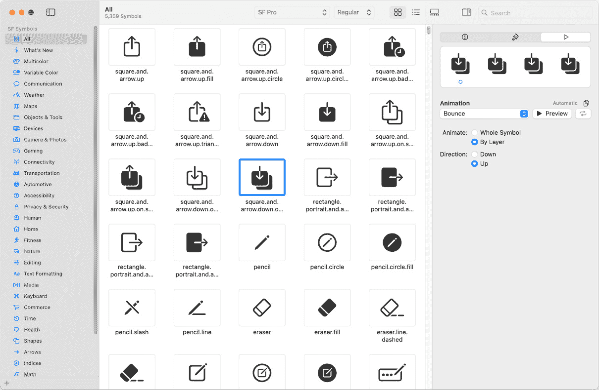
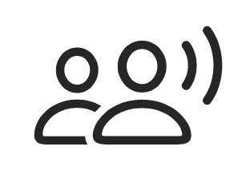
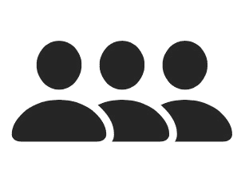
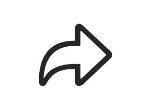
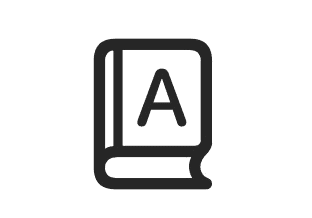
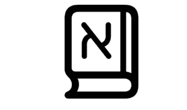

# <st c="0">6</st>

# <st c="2">SwiftUI 动画和 SF 符号</st>

<st c="35">上一章讨论了一个令人愉快的话题——小部件。</st> <st c="98">它们的美学水平既愉快又有效，这使得与它们一起工作变得既有趣又简单。</st> <st c="197">现在，我们将通过</st> <st c="246">SwiftUI 动画</st>将这种感觉进一步深化。

<st c="265">动画是 iOS 开发中的一个关键主题，因为它丰富了体验，并使我们的应用程序更直观、更易于使用。</st> <st c="400">如果您习惯了 UIKit 动画，您会注意到 SwiftUI 动画与 UIKit 的方法不同，它提供了一个声明式 API 来动画化</st> <st c="554">状态变化。</st>

<st c="568">随着这些新挑战的到来，也带来了确保我们的逻辑状态和 UI</st> <st c="658">始终一致的机会。</st>

<st c="673">在本章中，我们将</st> <st c="702">执行以下操作：</st>

+   <st c="716">讨论动画的重要性</st> <st c="740">动画</st>

+   <st c="753">理解 SwiftUI</st> <st c="777">动画概念</st>

+   <st c="794">使用视图修改器和</st> `<st c="851">withAnimation</st>` <st c="864">函数</st>执行基本动画

+   <st c="873">执行高级动画，如过渡和</st> <st c="926">关键帧动画</st>

+   <st c="945">动画 SF 符号</st>

<st c="964">解释为什么我们需要动画听起来很奇怪，有些人可能会对这个话题皱眉头。</st> <st c="1058">因此，我们的首要任务是在我们开始在屏幕上移动一个像素之前，将这个话题从桌面上移开。</st> <st c="1156">那么，让我们回答以下问题——为什么我们需要关心</st> <st c="1221">动画？</st>

# <st c="1238">技术要求</st>

<st c="1261">对于本章，从</st> <st c="1345">App Store</st>下载 Xcode 版本 16.0 或更高版本是至关重要的。

<st c="1355">确保您正在使用最新的 macOS 版本（Ventura 或更高版本）。</st> <st c="1441">只需在 App Store 中搜索 Xcode，选择最新版本，然后继续下载。</st> <st c="1539">打开 Xcode 并完成出现的任何进一步设置说明。</st> <st c="1607">Xcode 完全运行后，您</st> <st c="1653">就可以开始了。</st>

<st c="1663">从以下</st> <st c="1708">GitHub 链接</st>下载示例代码：

[<st c="1720">https://github.com/PacktPublishing/Mastering-iOS-18-Development/tree/main/Chapter%206</st>](https://github.com/PacktPublishing/Mastering-iOS-18-Development/tree/main/Chapter%206)

# <st c="1806">动画的重要性</st>

<st c="1835">有些人可能认为执行动画主要是为了娱乐，实际上并不会真正影响一个</st> <st c="1931">应用程序的可用性。</st> <st c="1948">但事实是，动画在增强用户参与度和界面设计方面起着至关重要的作用，尤其是在移动应用程序中。</st> <st c="2087">以下是使用动画的一些好处：</st> <st c="2114">使用动画：</st>

+   首先，动画为用户的操作提供**视觉反馈**——当用户点击按钮时，按钮会变大，这有助于他们知道他们触摸了正确的位置。

+   动画还可以提供**指导和导航**——页面之间的转换表明我们是“向前”还是“向后”移动我们的流程。

+   动画还有助于**错误处理**——我们可以动画化错误消息和一般问题，并减少用户的挫败感。

+   最重要的是，在许多情况下，动画是应用品牌和独特性的**一部分**，并提供那种特殊的触感，加强用户与**应用**之间的联系。

现在我们已经了解了动画的重要性，让我们看看 SwiftUI 的声明式方法如何与该概念相一致。

# 理解 SwiftUI 动画的概念

对于一个来自 UIKit 并在 SwiftUI 中迈出第一步的开发者来说，在声明式框架中编写动画的概念可能会感觉有点尴尬。

```swift
 UIView.animate(withDuration: 2.0, animations: {
            sampleView.alpha = 0.0
        }) { (finished) in
}
```

在这个示例中，我们修改了 `<st c="3436">sampleView</st>` 在 `<st c="3456">UIView</st>` 动画闭包中的 alpha 级别。

虽然这看起来很简单，但它带来一个显著的缺点——需要将动画动作同步到屏幕状态。

然而，在 *SwiftUI* 中，屏幕状态始终与 UI 保持同步，这对动画也是如此。

在 SwiftUI 中实现动画有几种方法；有些确实很简单，而另一些则允许我们提供高级和复杂的动画。

<st c="4333">让我们热身，并从一些</st> <st c="4368">基本动画</st> 开始。

# <st c="4385">执行基本</st><st c="4411">动画</st>

<st c="4414">理解 SwiftUI 动画工作原理的基本方法是将一个状态值与特定的</st> <st c="4527">动画流程</st> 相关联。

<st c="4542">在 SwiftUI 中执行基本动画有三种方式：</st> <st c="4595">。</st>

+   `<st c="4617">animation</st>` **<st c="4626">修饰符</st>** <st c="4635">– 将动画添加到一个</st> <st c="4663">特定的视图</st> 上

+   `<st c="4687">withAnimation</st>` **<st c="4700">全局函数</st>** <st c="4716">– 通过改变</st> <st c="4752">几个状态</st> 来执行动画

+   `<st c="4773">animation()</st>` **<st c="4784">方法</st>** <st c="4791">– 将动画附加到一个</st> <st c="4822">绑定值</st> 上

<st c="4835">开发者通常会感到困惑，并认为这里有一些重复 – 执行相同功能的不同方法。</st> <st c="4959">但事实是，这三种方法都服务于不同的目的和需求。</st> <st c="5027">取决于我们根据特定的代码结构和流程来决定合适的方法。</st> <st c="5110">有时，你可能想要对特定的视图执行特定的动画；偶尔，它可能是多个视图共享的体验。</st> <st c="5254">理解不同的用例可以帮助我们决定如何正确地执行动画。</st>

<st c="5349">让我们首先给一个特定的视图添加一个动画。</st> <st c="5390">。</st>

## <st c="5404">使用动画视图修饰符</st>

<st c="5438">动画</st> <st c="5453">视图修饰符的目标是在某个值发生变化时向特定的视图添加动画。</st> <st c="5482">以下是一个使用动画</st> <st c="5582">视图修饰符的示例：</st>

```swift
 struct UsingAnimationModifier: View {
    @State var width: CGFloat = 50
    @State var height: CGFloat = 50
    var body: some View {
        ZStack {
            Circle()
                .frame(width:width, height:height)
                .foregroundColor(.blue) <st c="5797">.animation(.easeIn, value: width)</st> .onTapGesture {
                    width += 50
                    height += 50
                }
        }
    }
}
```

<st c="5878">前面的代码通过向其宽度和高度添加</st> `<st c="5932">50</st>` <st c="5934">点来改变圆的尺寸，并且它是通过使用动画视图修饰符来做到这一点的。</st> <st c="6022">请注意，动画视图修饰符有一个值参数 – 动画修饰符监视其变化的值。</st> <st c="6139">在这种情况下，我们使用</st> `<st c="6164">width</st>` <st c="6169">状态变量。</st>

<st c="6185">动画</st> <st c="6200">视图修饰符非常适合在特定值发生变化时改变特定的视图。</st> <st c="6236">然而，在某些情况下，这种方法可能会令人困惑。</st> <st c="6283">在这种情况下，我们在代码的特定位置定义动画，但在另一个位置执行更改。</st> <st c="6346">此外，如果我们想要执行多个动画，使用动画视图修饰符可能会很麻烦。</st>

<st c="6565">如果我们想执行多个更改，我们可以使用</st> `<st c="6621">withAnimation:</st>` <st c="6635">函数。</st> <st c="6646">让我们看看如何</st> <st c="6663">利用它。</st>

## <st c="6674">使用 withAnimation 函数</st>

<st c="6707">在其基本形式中，</st> `<st c="6731">withAnimation:</st>` <st c="6745">函数接受一个闭包作为参数，并动画化</st> <st c="6799">在该闭包内所做的任何更改。</st> <st c="6828">通常，这是通过触发事件来完成的。</st> <st c="6837">让我们看看一个简单的</st> <st c="6886">代码示例：</st>

```swift
 struct UsingWithAnimationFunction: View {
    @State var greenCircleYPosition: CGFloat = 400
    @State var redCircleYPosition: CGFloat = 800
    var body: some View {
        VStack {
            ZStack {
                Circle()
                    .size(width: 100.0, height: 100.0)
                    .foregroundColor(.green)
                    .position(x: 400, y:
                      greenCircleYPosition)
                Circle()
                    .size(width: 100.0, height: 100.0)
                    .foregroundColor(.red)
                    .position(x: 200, y:
                      redCircleYPosition)
            }
            Button("Animate") { <st c="7335">withAnimation {</st>
 <st c="7350">greenCircleYPosition =</st>
 <st c="7373">greenCircleYPosition == 400 ?</st> <st c="7404">800 :</st>
 <st c="7409">400</st>
 <st c="7413">redCircleYPosition = redCircleYPosition</st>
 <st c="7453">== 800 ?</st> <st c="7463">400 : 800</st>
 <st c="7472">}</st> }
        }
    }
}
```

<st c="7482">此代码示例在按钮被点击时同时动画化两个圆的位置。</st> <st c="7579">我们可以看到，与动画视图修改器不同，通过使用</st> `<st c="7645">withAnimation:</st>` <st c="7659">函数，我们可以更清晰、更简单地绑定动画的变化。</st> <st c="7719">和简单。</st>

<st c="7730">另一个</st> <st c="7739">优势是</st> `<st c="7754">withAnimation:</st>` <st c="7768">具有的是</st> <st c="7776">执行一个</st> **<st c="7801">完成代码</st>** <st c="7816">一旦动画结束。</st>

<st c="7840">让我们看一下以下</st> <st c="7876">代码示例：</st>

```swift
 struct WithAnimationCompletionBlock: View {
    @State var yPos: CGFloat = 300
    @State var isReset: Bool = false
    var body: some View {
        VStack {
            Circle()
                .foregroundColor(.blue)
                .frame(width: 50, height:50)
                .position(x: 200, y:yPos)
            Button(isReset ? "Reset" : "Start") { <st c="8155">withAnimation</st> {
                    if isReset {
                        yPos = 300
                    } else {
                        yPos = 500
                    } <st c="8217">} completion: {</st>
 <st c="8232">isReset.toggle()</st>
 <st c="8249">}</st> }
        }
    }
}
```

<st c="8259">此代码创建了一个蓝色圆圈和一个写着</st> **<st c="8311">开始</st>**<st c="8316">的按钮。一旦用户点击按钮，圆圈</st> <st c="8360">动画化其位置，并在最后，按钮标题变为</st> **<st c="8427">重置</st>**<st c="8432">。然后，点击按钮将圆圈带回，并在</st> <st c="8490">反向动画结束时，按钮标题返回</st> <st c="8549">到</st> **<st c="8552">开始</st>**<st c="8557">。</st>

<st c="8558">动画中的完成块对于同步流程阶段至关重要。</st> <st c="8626">例如，折叠侧边栏并在结束时导航到新屏幕是一个出色的完成</st> <st c="8744">块使用的例子。</st>

<st c="8756">现在，是时候给我们的动画增添更多活力了。</st>

## <st c="8813">用弹簧动画给我们的动画增添一些活力</st>

<st c="8873">如果你已经尝试过你之前看到的代码示例，你可能已经注意到动画运行得相当流畅，但有点，嗯，无聊。</st> <st c="8971">这是因为动画是线性运行的，并不</st> <st c="9032">那么有趣。</st>

<st c="9105">尝试将以下参数添加到</st> <st c="9148">前面的示例中：</st>

```swift
 withAnimation<st c="9179">(.bouncy(extraBounce: 0.3))</st> {
       if isReset {
           yPos = 300
       } else {
           yPos = 500
       }
   } completion: {
       isReset.toggle()
   }
}
```

<st c="9292">在这个例子中，我们在</st> `<st c="9319">.bouncy(extraBounce: 0.3)</st>` <st c="9344">中添加了</st> `<st c="9352">withAnimation</st>` <st c="9365">函数。</st> <st c="9376">运行代码显示与之前相同的动画，但现在，当圆圈到达末端时它会弹跳。</st> <st c="9482">这是一个微小但重要的添加——弹跳效果为我们的动画增添了现实感，并可以提高</st> <st c="9597">用户参与度。

<st c="9613">我们可以添加到动画中的有趣视觉过渡有几个。</st> <st c="9624">例如，我们可以使用</st> `<st c="9750">.</st>``<st c="9751">smooth</st>` <st c="9758">函数来使弹跳更平滑：</st>

```swift
 withAnimation(.smooth(extraBounce: 0.3))
```

<st c="9809">我们还可以通过使用小的</st> <st c="9893">弹跳量来使弹跳更迅速，通过使动画更快：</st>

```swift
 withAnimation(.snappy)
```

<st c="9930">建议查看 Apple 的文档以发现更多我们可以轻松应用到我们</st> <st c="10050">动画中的视觉过渡：</st> [<st c="10062">https://developer.apple.com/documentation/swiftui/animation</st>](https://developer.apple.com/documentation/swiftui/animation)<st c="10121">。</st>

<st c="10122">到目前为止，我们只执行了非常基本的动画。</st> <st c="10172">但现代应用需要现代体验。</st> <st c="10216">让我们继续探索一些创建</st> <st c="10258">高级动画的更多方法。

# <st c="10278">执行高级动画</st>

<st c="10309">我们提到过渡对于指导和导航非常出色，这部分概念的一部分是</st> <st c="10407">在我们的画布上提供关于进入和离开视图的清晰度。</st> <st c="10475">从底部滑动视图可以提供抽屉打开和关闭的感觉，缩放视图可以直观地表示一个</st> <st c="10624">正在进行的过程的进度。

<st c="10640">到目前为止，我们已经讨论了如何将视图从一个状态动画化到另一个状态。</st> <st c="10715">现在，我们将探索过渡——一种在视图出现</st> <st c="10790">或消失时动画化视图的方法。

## <st c="10803">执行过渡</st>

<st c="10826">实现</st> <st c="10840">视图过渡很简单——我们有一些很好的内置过渡可供选择，如果还不够，我们还可以创建一个</st> <st c="10970">自定义过渡。

<st c="10988">让我们从一些基本的、内置的过渡开始。</st> <st c="11018">过渡。</st>

### <st c="11039">实现内置过渡</st>

<st c="11073">要添加</st> <st c="11081">过渡效果，我们应该使用</st> `<st c="11113">transition</st>` <st c="11123">修饰符与我们要动画化的特定视图，通过使用</st> `<st c="11200">withAnimation</st>` <st c="11213">函数来触发它，该函数我们在</st> *<st c="11247">使用 withAnimation 函数</st>* *<st c="11271">部分</st>中了解过。

<st c="11288">这是一个简单的</st> <st c="11324">过渡中的幻灯片</st>示例：

```swift
 struct BuiltInTransitionsView: View {
    @State var showSlideText: Bool = false
    var body: some View {
        VStack {
            Button("Slide in text") { <st c="11473">withAnimation {</st> showSlideText.toggle()
                }
            }
            if showSlideText {
                Text("Hello, slided
                  text")<st c="11561">.transition(.slide)</st> }
      }
}
```

<st c="11586">代码示例由</st> `<st c="11616">VStack</st>` <st c="11622">和一个按钮以及文本组成。</st> <st c="11647">我们还有一个状态来决定文本是可见还是隐藏。</st>

<st c="11718">点击按钮使用</st> `<st c="11768">withAnimation</st>` <st c="11781">函数显示文本。</st> <st c="11792">但是文本</st> <st c="11805">也有一个描述其如何出现的过渡视图修饰符，在这种情况下，使用一个</st> <st c="11909">滑动进入过渡。</st>

<st c="11931">过渡视图修饰符描述了视图的显示方式和消失方式。</st> <st c="12015">。</st>

<st c="12028">The</st> `<st c="12033">slide</st>` <st c="12038">transition inserts the view by moving it from the leading edge and removing it toward the trailing edge.</st> <st c="12144">请注意，滑动过渡的方向不能更改，它们由 SwiftUI 框架设置。</st> <st c="12248">但是，我们还可以使用几个其他过渡来实现我们</st> <st c="12318">期望的行为：</st>

+   `<st c="12335">move</st>`<st c="12340">: 将视图移动到/从特定边缘：</st>

    ```swift
     Text("Hello, moved text")
                        .transition(.move(edge: .bottom))
    ```

+   `<st c="12442">scale</st>`<st c="12448">: 以特定数量和从特定锚点缩放视图：</st>

    ```swift
     Text("Hello, scaled text")
                        .transition(.scale(scale: 0.5, anchor: .center))
    ```

+   `<st c="12591">opacity</st>`<st c="12599">: 对视图执行“淡入/淡出”效果：</st> <st c="12637">。</st>

    ```swift
     Text("Hello, opacity text")
                        .transition(.opacity)
    ```

<st c="12696">这些类型的过渡在 Apple 网站和 SDK 中有很好的文档记录，我们也可以通过章节的</st> <st c="12819">GitHub 仓库</st> 来尝试它们。</st>

<st c="12837">需要注意的是，我们可以使用这些过渡来显示和隐藏动画。</st> <st c="12924">然而，在某些情况下，我们可能更喜欢显示和隐藏时使用不同的动画。</st> <st c="13014">隐藏和显示使用不同的动画称为</st> **<st c="13079">非对称过渡</st>**<st c="13100">。让我们</st> <st c="13108">看看一个代码示例</st> <st c="13127">来演示这一点：</st>

```swift
 Text("Text scaled in. Now it will slide out")
 <st c="13183">.transition(.asymmetric(insertion: .scale, removal:</st>
<st c="13272">scale</st> animation for the insertion of text and a <st c="13320">slide</st> animation for the removal of text.
			<st c="13360">Sometimes, we may want to combine several animations.</st> <st c="13415">For example, we may want to scale</st> <st c="13449">and slide at the same time.</st> <st c="13477">We can do that using the</st> `<st c="13502">combined</st>` <st c="13510">function:</st>

```

Text("缩放和滑动") <st c="13545">.transition(.scale.combined(with:</st>

<st c="13578">.slide))</st>

```swift

			<st c="13586">We can even combine a</st> <st c="13609">combined transition!</st>

```

.transition(.scale.combined(with: .slide.combined(with:

.opacity)))

```swift

			<st c="13696">However, if things become too complicated, it could be a sign that we should build a</st> <st c="13782">custom transition.</st>
			<st c="13800">Creating a custom transition</st>
			<st c="13829">Building</st> **<st c="13839">custom transitions</st>** <st c="13857">gives us complete control and flexibility of how transitions</st> <st c="13919">work and is useful when other compound transition methods</st> <st c="13977">don’t provide the</st> <st c="13995">expected results.</st>
			<st c="14012">The idea of building a custom transition is built around providing two</st> <st c="14084">view modifiers:</st>

				*   <st c="14099">One that represents the</st> *<st c="14124">identity</st>* <st c="14132">state of the view (before we started</st> <st c="14170">the transition)</st>
				*   <st c="14185">One that represents the</st> *<st c="14210">active</st>* <st c="14216">state of the view (after</st> <st c="14242">the transition)</st>

			<st c="14257">Both view modifiers must be of the same type so that SwiftUI has the same properties</st> <st c="14343">to transition.</st>
			<st c="14357">Let’s create a custom transition that takes a view and inserts it with rotation, opacity,</st> <st c="14448">and scale.</st>
			<st c="14458">We will start by creating a view modifier that handles all the</st> <st c="14522">three properties:</st>

```

struct ViewRotationModifier: ViewModifier {

    let angle: Angle

    let opacity: CGFloat

    let scale: CGFloat

    func body(content: Content) -> some View {

        content

            .rotationEffect(angle)

            .scaleEffect(scale)

            .opacity(opacity)

    }

}

```swift

			<st c="14756">The</st> `<st c="14761">ViewRotationModifier</st>` <st c="14781">view modifier receives three properties,</st> `<st c="14823">angle</st>`<st c="14828">,</st> `<st c="14830">opacity</st>`<st c="14837">, and</st> `<st c="14843">scale</st>`<st c="14848">, and applies them to the content.</st> <st c="14883">This view modifier is like any view modifier we’re</st> <st c="14934">accustomed to.</st>
			<st c="14948">Now, we can</st> <st c="14961">build our custom transition.</st> <st c="14990">If we look at the built-in transitions we covered in the previous</st> *<st c="15056">Implementing built-in transitions</st>* <st c="15089">section and their code’s documentation, we can see that they are from the type</st> `<st c="15169">AnyTransition</st>`<st c="15182">.</st> `<st c="15184">AnyTransition</st>` <st c="15197">is a struct that describes a SwiftUI transition between</st> <st c="15254">two states.</st>
			<st c="15265">Let’s build our</st> `<st c="15282">rotate</st>` `<st c="15288">AnyTransition</st>`<st c="15302">:</st>

```

let rotate = AnyTransition.modifier(

    active: <st c="15350">ViewRotationModifier</st>(angle: .degrees(360),

    opacity: 0.0, scale: 0.0),

    identity: <st c="15431">ViewRotationModifier</st>(angle: .degrees(0),

    opacity: 1.0, scale: 1.0)

)

```swift

			<st c="15500">The</st> `<st c="15505">AnyTransition</st>` <st c="15518">struct we created receives the</st> `<st c="15550">active</st>` <st c="15556">and</st> `<st c="15561">identity</st>` <st c="15569">view modifiers, each with</st> <st c="15596">different parameters.</st>
			<st c="15617">We can</st> <st c="15625">use the new transition in the same way as the</st> <st c="15671">built-in transitions:</st>

```

struct CustomizedTransitionView: View {

    @State private var showRectangle: Bool = false

    var body: some View {

        VStack {

            Spacer()

            if showRectangle {

                Rectangle()

                    .frame(width: 100, height: 100)

                    .foregroundColor(.blue) <st c="15907">.transition(rotate)</st> }

            Spacer()

            Button("插入矩形") {

                withAnimation {

                    showRectangle.toggle()

                }

            }

        }

    }

}

```swift

			<st c="16015">The preceding code creates a rectangle and a button.</st> <st c="16069">Tapping on the button toggles the</st> `<st c="16103">showRectangle</st>` <st c="16116">state variable, which reveals the rectangle using our</st> <st c="16171">new transition.</st>
			<st c="16186">So far, we have discussed great animations that were pretty simple and short.</st> <st c="16265">However, if we</st> <st c="16280">want to provide more sophisticated animations that may require multiple stages and different timing,</st> `<st c="16381">AnyTransition</st>` <st c="16394">structure is insufficient.</st> <st c="16422">For much more advanced animations, we should try to implement</st> <st c="16484">keyframe animations.</st>
			<st c="16504">Executing keyframe animations</st>
			<st c="16534">The idea</st> <st c="16544">of</st> **<st c="16547">keyframe animations</st>** <st c="16566">in SwiftUI is similar to how they are implemented</st> <st c="16617">in UIkit.</st>
			<st c="16626">With</st> <st c="16632">keyframe animations, we declare different changes in different properties over time.</st> <st c="16717">There are four primary components</st> <st c="16751">in</st> <st c="16754">keyframe animations:</st>

				*   `<st c="16900">AnimationsProperties</st>` <st c="16920">struct can define the opacity, scale, or color in different</st> <st c="16981">animation phases.</st>
				*   `<st c="16998">KeyFrameAnimator</st>`<st c="17015">: The keyframe animator defines the different animation tracks we have and what happens with the view in</st> <st c="17121">each track.</st>
				*   `<st c="17132">KeyframeTrack</st>`<st c="17146">: Each track handles a different animation property and defines the various phases (key frames) for that property.</st> <st c="17262">Tracks work in parallel with each other.</st> <st c="17303">A keyframe animator can have</st> <st c="17332">multiple tracks.</st>
				*   `<st c="17348">KeyFrame</st>`<st c="17357">: Defines a single change for a specific property within the</st> <st c="17419">keyframe track.</st>

			<st c="17434">With these</st> <st c="17446">four primary components, we can build amazing and complex animations.</st> <st c="17516">Let’s build our first keyframe animation with SwiftUI, but we’ll start by explaining the concept behind</st> <st c="17620">keyframe animations.</st>
			<st c="17640">Understanding a keyframe animation</st>
			<st c="17675">Describing a</st> <st c="17689">keyframe animation can be slightly confusing at first, mainly because it is a way to create complex animations.</st> <st c="17801">Let’s try to explain it in a diagram (</st>*<st c="17839">Figure 6</st>**<st c="17848">.1</st>*<st c="17850">):</st>
			

			<st c="17894">Figure 6.1: A key frame animation as a diagram</st>
			*<st c="17940">Figure 6</st>**<st c="17949">.1</st>* <st c="17951">shows two tracks – scale and opacity – positioned on a timeline.</st> <st c="18017">In each track, we see two keyframes.</st> <st c="18054">The number inside each keyframe describes the value, and the keyframe length describes its duration.</st> <st c="18155">For example, in the scale track, we have two keyframes – the first sets the scale to 0.7, and the second brings it back to 1.0\.</st> <st c="18283">We can also see that the durations of both the scale and opacity tracks</st> <st c="18355">are equal.</st>
			<st c="18365">If you think that that resembles a video editing application such as</st> *<st c="18435">iMovie</st>* <st c="18441">or</st> *<st c="18445">Premiere</st>*<st c="18453">, that’s because it is based on the</st> <st c="18489">same concept.</st>
			<st c="18502">Let’s try to create a breathing animation using the concept of keyframe animation.</st> <st c="18586">A breathing animation mimics the way something breathes, such as a balloon slowly inflating</st> <st c="18678">and deflating.</st>
			<st c="18692">Let’s see how to do that</st> <st c="18718">in code:</st>

```

struct AnimationProperties {

    var scale = 1.0

    var opacity = 1.0

}

struct KeyFrameAnimations: View {

    var body: some View {

        Circle()

            .foregroundColor(.red)

            .frame(width:100, height:100)

            .<st c="18911">关键帧动画器</st>(initialValue:

            AnimationProperties(), repeating: true) {

                content, value in

                content

                    .opacity(value.opacity)

                    .scaleEffect(value.scale)

            } <st c="19064">关键帧</st>: { _ in <st c="19083">KeyframeTrack</st>(\.scale) { <st c="19109">CubicKeyframe</st>(0.7, duration: 0.8) <st c="19144">CubicKeyframe</st>(1.0,

                                duration: 0.8)

                } <st c="19181">关键帧轨道</st>(\.opacity) { <st c="19209">CubicKeyframe</st>(0.3, duration: 0.8) <st c="19244">CubicKeyframe</st>(1.0, duration: 0.8)

                }

            }

    }

}

```swift

			<st c="19286">The code example seems long!</st> <st c="19316">However, upon closer examination, we can see that it is not that complex and contains the different components we</st> <st c="19430">discussed earlier.</st>
			<st c="19448">Let’s explain</st> <st c="19463">what we’ve</st> <st c="19474">done here:</st>

				1.  <st c="19484">We created a circle and added a view modifier called</st> `<st c="19538">keyframeAnimator</st>`<st c="19554">, which handles the general animations.</st> <st c="19594">We initialized it with the</st> `<st c="19621">AnimationProperties</st>` <st c="19640">struct that holds the properties we want to modify during the animation phases, and we defined that animator to repeat by passing</st> `<st c="19771">true</st>` <st c="19775">in the</st> <st c="19783">corresponding parameter.</st>
				2.  <st c="19807">The animator has another closure parameter with the content view and the value.</st> <st c="19888">That’s where we can</st> *<st c="19908">modify our view</st>* <st c="19923">according to the animation properties.</st> <st c="19963">In this example, we changed the view opacity</st> <st c="20008">and scale.</st>
				3.  <st c="20018">Right after the closure, we define our tracks.</st> <st c="20066">We have two properties we want to change over time, so we’ve created two tracks – one for scale and one for opacity.</st> <st c="20183">Because we wanted a</st> *<st c="20203">breathing</st>* <st c="20212">animation, we’ve created two keyframes – one for exhaling (scale down and reduce opacity) and one for inhaling (scale up and</st> <st c="20338">increase opacity).</st>
				4.  <st c="20356">We can see that each one of the frames is declared as</st> `<st c="20411">CubicKeyframe</st>`<st c="20424">. Before we explain what</st> `<st c="20449">CubicKeyframe</st>` <st c="20462">means, let’s talk about keyframes, which are fundamental concepts</st> <st c="20529">in animations.</st>

			<st c="20543">A keyframe specifies an object’s state at a particular point in time.</st> <st c="20614">The animator’s responsibility is to perform the animations between these keyframes.</st> <st c="20698">In a way, it’s like animating a state change, but in this case, we define the different</st> <st c="20786">modifications upfront.</st>
			<st c="20808">In the case of SwiftUI’s</st> `<st c="20834">keyframeAnimator</st>`<st c="20850">, the keyframes align with the concept of states – each keyframe defines a change in a specific property</st> <st c="20955">over time.</st>
			<st c="20965">In SwiftUI, we have different types of keyframes, each representing a</st> <st c="21036">different experience:</st>

				*   `<st c="21057">CubicKeyframe</st>`<st c="21071">: This</st> <st c="21079">is the keyframe we used</st> <st c="21103">in our code example.</st> `<st c="21124">CubicKeyframe</st>` <st c="21137">provides</st> <st c="21147">a smooth transition to the next keyframe while computing something called</st> **<st c="21221">Catmull-Rom splines</st>**<st c="21240">. Catmull-Rom splines are curves used in computer animations to provide</st> <st c="21312">smooth movement.</st>
				*   `<st c="21328">SpringKeyframe</st>`<st c="21343">: This</st> <st c="21351">represents a transition</st> <st c="21375">that emulates a spring experience, including a</st> <st c="21422">bouncy effect.</st>
				*   `<st c="21436">MoveKeyframe</st>`<st c="21449">: This</st> <st c="21457">type of keyframe modifies</st> <st c="21483">the given</st> <st c="21493">value immediately.</st>
				*   `<st c="21511">LinearKeyframe</st>`<st c="21526">: This</st> <st c="21534">keyframe animates</st> <st c="21552">the change without a defined curve and, instead, does that in a simple</st> <st c="21623">linear interpolation.</st>

			<st c="21644">SwiftUI is</st> <st c="21656">intelligent enough to smoothly handle the combination of different keyframes on the same track.</st> <st c="21752">For example, let’s see what happens when we define velocity on one of</st> <st c="21822">our keyframes:</st>

```

CubicKeyframe(0.5, duration: 0.2, <st c="21871">起始速度</st>: 0.5, <st c="21892">结束速度</st>: 0.8)

CubicKeyframe(0.7, duration: 0.5)

```swift

			<st c="21944">We can see that the end velocity of the first keyframe is</st> `<st c="22003">0.8</st>`<st c="22006">. However, we haven’t defined any initial velocity for the second keyframe.</st> <st c="22082">In this case, the second keyframe’s</st> `<st c="22118">startVelocity</st>` <st c="22131">value will be the end value of the previous keyframe, which</st> <st c="22192">means</st> `<st c="22198">0.8</st>`<st c="22201">.</st>
			<st c="22202">Now, let’s discuss another crucial aspect of keyframe animations –</st> <st c="22270">animation duration.</st>
			<st c="22289">Handling keyframe animation duration</st>
			<st c="22326">The keyframe animator is a hierarchal structure with three levels – the animator, the tracks, and the keyframe.</st> <st c="22439">This means that different keyframes can have different durations, and these duration values don’t always add up nicely.</st> <st c="22559">That makes duration management complex, especially for long and</st> <st c="22623">intricate animations.</st>
			<st c="22644">How do we</st> <st c="22655">ensure that all the keyframe durations are always aligned with each other and maintain the same scale?</st> <st c="22758">The answer is to use relative duration, not</st> <st c="22802">absolute duration.</st>
			<st c="22820">An absolute duration specifies the exact time an animation should take, regardless of the initial state, or without comparing it to the</st> <st c="22957">other keyframes.</st>
			<st c="22973">Conversely, relative duration reflects the duration time, considering the total animation duration.</st> <st c="23074">For example, if the relative duration is 0.5 and the total animation duration is 3 seconds, the actual keyframe duration would be 1.5 (0.5 *</st> <st c="23215">3.0 seconds).</st>
			<st c="23228">By using relative duration, we can establish an animation’s overall duration and allocate specific durations for each keyframe, relative to the</st> <st c="23373">total duration.</st>
			<st c="23388">Let’s take our “breathing” example and try to implement</st> <st c="23445">relative duration:</st>

```

<st c="23463">let duration: TimeInterval = 1.8</st> var body: some View {

        Circle()

            .foregroundColor(.red)

            .frame(width:100, height:100)

            .keyframeAnimator(initialValue:

            AnimationProperties(), repeating: true) {

            content, value in

                content

                    .opacity(value.opacity)

                    .scaleEffect(value.scale)

            } keyframes: { _ in

                KeyframeTrack(\.scale) {

                    CubicKeyframe(0.7, <st c="23795">持续时间: 0.5 *</st>

<st c="23810">持续时间</st>)

                    CubicKeyframe(1.0,

                    duration: <st c="23851">0.5 * duration</st>)

                }

                KeyframeTrack(\.opacity) {

                    CubicKeyframe(0.3, <st c="23916">持续时间: 0.5 *</st>

<st c="23931">持续时间</st>)

                    CubicKeyframe(1.0, <st c="23962">持续时间: 0.5 *</st>

<st c="23977">持续时间</st>)

                }

            }

```swift

			<st c="23992">In this code example, we have a keyframe animation with two keyframes, similar to our previous example.</st> <st c="24097">The first keyframe handles the scale animation, and the second handles</st> <st c="24168">the opacity.</st>
			<st c="24180">We can see</st> <st c="24192">that we have a total duration variable, currently set to</st> `<st c="24249">1.8</st>`<st c="24252">. With each keyframe, we set the duration relative to that value.</st> <st c="24318">In this case, it is</st> `<st c="24338">0.5</st>` <st c="24341">of the total duration, but this can vary from one example</st> <st c="24400">to another.</st>
			<st c="24411">Relative duration can help us set a dynamic overall duration time and change it according to our needs, even</st> <st c="24521">at runtime.</st>
			<st c="24532">SwiftUI animations are extremely powerful and easy to use, and keyframe animations make them even more powerful by allowing us to build complex animations with multiple steps</st> <st c="24708">and durations.</st>
			<st c="24722">However, in many cases, animating views is one of the many challenges that app developers face.</st> <st c="24819">After all, animating simple shapes such as a rectangle or a circle isn’t always what we desire.</st> <st c="24915">So, what about the assets?</st> <st c="24942">Fortunately, the iOS SDK contains a fantastic resource called SF Symbols.</st> <st c="25016">Let’s explore</st> <st c="25030">it now.</st>
			<st c="25037">Animating SF Symbols</st>
			**<st c="25058">SF Symbols</st>** <st c="25069">is a library that</st> <st c="25088">contains over 5,000 symbols that developers can integrate within their text, using the</st> *<st c="25175">San</st>* *<st c="25179">Francisco</st>* <st c="25188">font.</st>
			<st c="25194">Don’t be</st> <st c="25204">confused – SF Symbols are not emojis.</st> <st c="25242">Emojis are meant to express feelings and emotions within text.</st> <st c="25305">Conversely, SF Symbols are excellent replacements for icons that represent states, actions,</st> <st c="25397">and tools.</st>
			<st c="25407">Here’s a basic example of displaying a clock alarm symbol with text next</st> <st c="25481">to it:</st>

```

var body: some View {

        HStack { <st c="25519">Image(systemName:</st>

<st c="25536">"alarm.waves.left.and.right.fill")</st> Text("闹钟")

        }.font(.system(size: 30))

    }

```swift

			<st c="25613">We can see no surprises here – we use a basic</st> `<st c="25660">Image</st>` <st c="25665">view with the</st> `<st c="25680">systemName</st>` <st c="25690">parameter to provide the</st> <st c="25716">image name.</st>
			<st c="25727">As mentioned earlier in this section, there are thousands of symbols available.</st> <st c="25808">To get the full symbols catalog, we need</st> <st c="25849">to download a Mac application called</st> *<st c="25886">SF Symbols</st>* <st c="25896">(what a coincidence, uh?)</st> <st c="25923">from</st> [<st c="25928">https://developer.apple.com/sf-symbols/</st>](https://developer.apple.com/sf-symbols/)<st c="25967">.</st>
			<st c="25968">The app is simple to use, as we can see in</st> *<st c="26012">Figure 6</st>**<st c="26020">.2</st>*<st c="26022">:</st>
			

			<st c="27085">Figure 6.2: The SF Symbol Mac app</st>
			<st c="27118">By exploring</st> <st c="27132">the SF Symbol app, we can see how the symbols differ from emojis.</st> <st c="27198">They are not only vector illustrations (meaning they can scale to any size) but also built</st> <st c="27289">as layers.</st>
			<st c="27299">To understand why the SF symbols contain layers, try to perform a bounce animation using the app.</st> <st c="27398">Doing so lets us see how the layers create a</st> *<st c="27443">sense of depth</st>*<st c="27457">, making them bounce at</st> <st c="27481">different intervals.</st>
			<st c="27501">Other than the bounce effect, SF Symbols supports other effects such as pulse, scale, and replace.</st> <st c="27601">We can perform the same animations in our SwiftUI code using the</st> `<st c="27666">symbolEffect</st>` <st c="27678">view modifier:</st>

```

struct SFSymbolsAnimationView: View {

    @State private var animate = false

    var body: some View {

        HStack {

            Image(systemName:

            "alarm.waves.left.and.right.fill") <st c="27851">.symbolEffect(.bounce, options: .repeating,</st>

<st c="27894">值: animate)</st> Text("10:30")

        }.font(.system(size: 40))

            .onTapGesture {

            animate = true

        }

    }

}

```swift

			<st c="27987">The</st> `<st c="27992">symbolEffect</st>` <st c="28004">view modifier has several parameters.</st> <st c="28043">The first is the</st> `<st c="28060">effect</st>` <st c="28066">type, the same as those found in the SF Symbol app.</st> <st c="28119">The second parameter is</st> `<st c="28143">options</st>` <st c="28150">– we can make the effect repeat itself or even set</st> <st c="28202">its speed.</st>
			<st c="28212">The third</st> <st c="28223">parameter is the</st> `<st c="28240">value</st>` <st c="28245">parameter – the state variable that triggers the animation.</st> <st c="28306">In this case, we trigger the animation by tapping on the</st> `<st c="28363">HStack</st>` <st c="28369">view that contains both the symbol and the</st> <st c="28413">attached text.</st>
			<st c="28427">To read more about SF Symbols, it is recommended to visit Apple’s</st> <st c="28494">website:</st> [<st c="28502">https://developer.apple.com/sf-symbols/</st>](https://developer.apple.com/sf-symbols/)<st c="28542">.</st>
			<st c="28543">Even though this chapter mainly concerns SwiftUI animations, there is much more to SF Symbols than just animations, such as supporting multiple colors.</st> <st c="28696">Let’s see how we can modify different</st> <st c="28734">symbol colors.</st>
			<st c="28748">Modifying symbol colors</st>
			<st c="28772">The fact</st> <st c="28782">that SF Symbols are built with different layers helps not only with animation but also with</st> <st c="28874">coloring them.</st>
			<st c="28888">Let’s take, for instance, the</st> *<st c="28919">two persons</st>* *<st c="28931">waving</st>* <st c="28937">symbol:</st>

```

Image(systemName: "person.2.wave.2")

```swift

			*<st c="28982">Figure 6</st>**<st c="28991">.3</st>* <st c="28993">shows what the symbol</st> <st c="29016">looks like:</st>
			

			<st c="29029">Figure 6.3: The person.2.wave.2 symbol</st>
			<st c="29067">We can see two different types of image components – on the one hand, two people, and on the</st> <st c="29161">other hand, their waves.</st> <st c="29186">So, unlike a regular image, we can set one color for the people and another for</st> <st c="29266">the waves.</st>
			<st c="29276">Every SF Symbol has a</st> **<st c="29299">primary</st>** <st c="29306">and</st> **<st c="29311">secondary</st>** <st c="29320">color, and SwiftUI knows how to color</st> <st c="29359">it accordingly.</st>
			<st c="29374">For example, let’s set a primary color of brown and a secondary color of blue.</st> <st c="29454">We will use the</st> `<st c="29470">foregroundStyle</st>` <st c="29485">view modifier</st> <st c="29500">for that:</st>

```

Image(systemName: "person.2.wave.2")

                .foregroundStyle(.棕色, .蓝色)

```swift

			<st c="29578">There are symbols that even have a third color, such as in the case of the three-person symbol (</st>*<st c="29675">Figure 6</st>**<st c="29684">.4</st>*<st c="29686">):</st>
			

			<st c="29691">Figure 6.4: The person.3.sequence.fill symbol</st>
			<st c="29736">To use the third color, we just need to add one more color as</st> <st c="29799">a parameter:</st>

```

Image(systemName: "person.3.sequence.fill")

                .foregroundStyle(.red, .blue, .<st c="29887">棕色</st>)

```swift

			<st c="29895">Anyone who has had to manage multi-color icons knows the complexity of supporting different themes and colors, especially when we need to</st> <st c="30033">animate them.</st>
			<st c="30046">So, we know</st> <st c="30059">how to add an SF Symbol, animate it nicely, and color it.</st> <st c="30117">However, we can also use vector multi-layer symbols, which is known</st> <st c="30185">as localization.</st>
			<st c="30201">Localizing our symbols</st>
			<st c="30224">Localizing our apps is a crucial topic today, more than ever.</st> <st c="30287">However, how many of us pay attention</st> <st c="30325">to icon localization and try to adjust them according to the app</st> <st c="30390">layout direction?</st>
			<st c="30407">The excellent news about SF Symbols is that they can adjust to the current app locale.</st> <st c="30495">The even better news is that we can force them to do that if</st> <st c="30556">we want.</st>
			<st c="30564">But why do SF Symbols even need to</st> <st c="30600">support localization?</st>
			<st c="30621">Let’s take the</st> `<st c="30637">arrowshape.turn.up.forward</st>` <st c="30663">SF Symbol (</st>*<st c="30675">Figure 6</st>**<st c="30684">.5</st>*<st c="30686">):</st>

			

			<st c="30691">Figure 6.5: The arrowshap.turn.up.forward SF Symbol</st>
			<st c="30742">The forward</st> <st c="30755">icon arrow points to the right, which fits</st> <st c="30798">nicely in</st> **<st c="30808">LTR</st>** <st c="30811">(</st>**<st c="30813">Left-to-Right</st>**<st c="30826">) layout views.</st> <st c="30843">But what about</st> **<st c="30858">RTL</st>** <st c="30861">(</st>**<st c="30863">Right-to-Left</st>**<st c="30876">) layouts, such as in Hebrew or Arabic</st> <st c="30916">localized applications?</st>
			<st c="30939">Well, in this case, we will have to flip the icon direction.</st> <st c="31001">With SF Symbol, this adjustment is done automatically</st> <st c="31055">for us.</st>
			<st c="31062">Moreover, we can set the icon localization regardless of the view settings, using the</st> `<st c="31149">environment</st>` <st c="31160">view modifier:</st>

```

Image(systemName: "arrowshape.turn.up.forward") <st c="31224">.environment(\.layoutDirection, .rightToLeft)</st>

```swift

			<st c="31269">In the preceding code, we force the SF Symbol to have an RTL layout direction, which flips the forward arrow to the</st> <st c="31386">left direction.</st>
			<st c="31401">Having localization</st> <st c="31422">support doesn’t stop with layout direction.</st> <st c="31466">Some symbols even change their look according to the</st> <st c="31519">current locale.</st>
			<st c="31534">For example, let’s take the</st> `<st c="31563">character.book.closed</st>` <st c="31584">SF Symbol (</st>*<st c="31596">Figure 6</st>**<st c="31605">.6</st>*<st c="31607">):</st>
			

			<st c="31612">Figure 6.6: The character.book.closed SF Symbol</st>
			<st c="31659">In the case of the symbol in</st> *<st c="31689">Figure 6</st>**<st c="31697">.6</st>*<st c="31699">, we can see that in addition to its layout direction (LTR), it also has a letter</st> <st c="31781">on it.</st>
			<st c="31787">In the case of the Hebrew locale, not only does the symbol’s direction change but also the letter (</st>*<st c="31887">Figure 6</st>**<st c="31896">.7</st>*<st c="31898">):</st>
			

			<st c="31903">Figure 6.7: The character.book.closed SF Symbol in a Hebrew locale</st>
			<st c="31969">We can force the symbol to retrieve a specific locale using the</st> `<st c="32034">environment</st>` <st c="32045">view modifier, similar to the</st> <st c="32076">layout direction:</st>

```

Image(systemName: "character.book.closed") <st c="32137">.environment(\.locale, .init(identifier: "he"))</st>

```swift

			<st c="32184">To sum up, SF Symbols</st> <st c="32207">contain so much power and valuable features.</st> <st c="32252">Trying to support standard icons in different environments, such as locales and themes, can be a hassle, and animating them without creating a dedicated image sequence is almost impossible.</st> <st c="32442">So, getting all these features for free is l</st><st c="32486">ike a massive present from</st> <st c="32514">Apple engineers.</st>
			<st c="32530">Summary</st>
			<st c="32538">iOS animations are like salt – they can enhance the user experience, but too much</st> <st c="32621">is overwhelming.</st>
			<st c="32637">The great thing about SwiftUI animations is that they are aligned to the screen state because of the declarative implementation.</st> <st c="32767">However, it’s a significant change to how they work</st> <st c="32819">in UIkit.</st>
			<st c="32828">Because of that, in this chapter, we went from understanding the basic concepts and performing fundamental animations to custom transitions and keyframe animations, and we even discussed a great present that Apple gave us,</st> <st c="33052">SF Symbols.</st>
			<st c="33063">Now, we should be able to easily animate changes on our screen in a meaningful and</st> <st c="33147">expressive way!</st>
			<st c="33162">In our next chapter, we’ll explore enhancing user engagement using a built-in solution –</st> <st c="33252">TipKit.</st>

```
