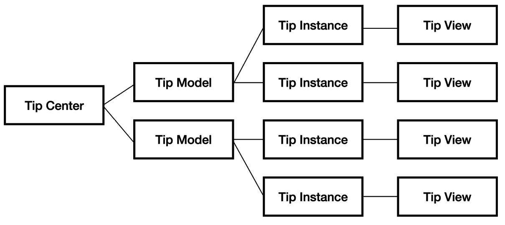
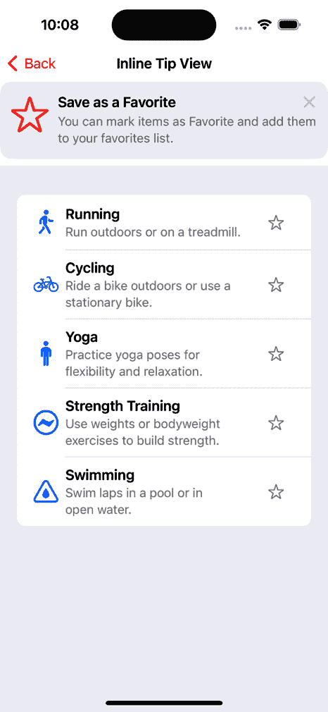
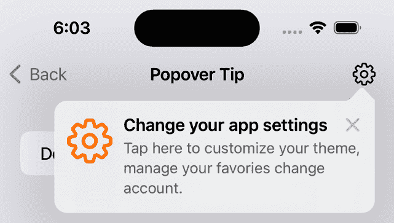
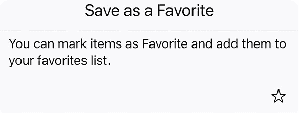
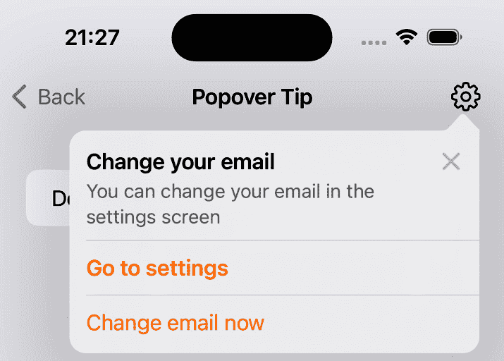

# <st c="0">7</st>

# <st c="2">使用 TipKit 改进功能探索</st>

在上一章中，我们学习了 SwiftUI 动画。<st c="106">现在我们知道，SwiftUI 动画是教用户如何使用</st> <st c="184">我们的应用的一个很好的方法。</st>

<st c="192">然而，有时这还不够，我们需要比花哨的动画更多的东西。</st> <st c="270">这就是 TipKit 的作用所在。</st> <st c="301">TipKit 的目标是提供另一个重要主题的解决方案：功能探索。</st> <st c="390">功能探索影响我们的应用用户参与度和使用情况，最终影响用户满意度和体验。</st>

<st c="509">在本章中，我们将涵盖以下主题：</st> <st c="545">以下主题：</st>

+   <st c="562">在移动应用中学习提示的重要性</st>

+   <st c="610">添加新的提示——内联</st> <st c="637">和弹出视图</st>

+   <st c="648">自定义我们的提示的感觉</st> <st c="676">和外观</st>

+   <st c="684">支持</st> <st c="696">提示操作</st>

+   <st c="707">为我们的提示定义显示规则</st> <st c="735">我们的提示</st>

+   <st c="743">使用 TipGroup 对提示进行</st> <st c="758">分组</st>

+   <st c="772">调整</st> <st c="783">显示频率</st>

<st c="800">现在，让我们从基本问题开始——为什么我们需要 TipKit？</st> <st c="860">需要 TipKit？</st>

# <st c="872">技术要求</st>

<st c="895">对于本章，从 App Store 下载 Xcode 版本 16.0 或更高版本是必要的。</st> <st c="979">App Store。</st>

<st c="989">确保您正在使用最新的 macOS 版本（Ventura 或更高版本）。</st> <st c="1075">只需在 App Store 中搜索 Xcode，选择最新版本，然后继续下载。</st> <st c="1173">打开 Xcode 并完成出现的任何进一步设置说明。</st> <st c="1241">Xcode 完全运行后，您就可以开始了。</st>

<st c="1297">从以下 GitHub 链接下载示例代码：</st> <st c="1349">链接：</st> [<st c="1355">https://github.com/PacktPublishing/Mastering-iOS-18-Development/tree/main/Chapter%207</st>](https://github.com/PacktPublishing/Mastering-iOS-18-Development/tree/main/Chapter%207)

# <st c="1440">学习提示的重要性</st>

<st c="1472">为小屏幕（如智能手机屏幕）创建应用的一个挑战是为用户提供探索有价值功能的方法。</st> <st c="1625">让用户使用更多功能是提高用户参与度的一部分——衡量用户在多大程度上积极参与并连接到</st> <st c="1761">我们的产品。</st>

<st c="1773">功能探索是一个真正的挑战。</st> <st c="1820">一方面，我们旨在创建一个干净直观的用户界面，另一方面，我们旨在添加更多对用户极其有用的功能。</st> <st c="1981">我们的用户。</st>

<st c="1991">每个产品经理都会面临这个挑战 – 有时，解决方案是创建一个</st> **<st c="2085">什么是新功能</st>** <st c="2095">弹出窗口，发送营销邮件，或在应用内</st> <st c="2165">FAQ 屏幕中添加更多信息。</st>

<st c="2176">最有价值的技巧之一是提供一个提示 – 一个在正确的时间和地点弹出以解释新功能的小文本框，甚至可以添加一个动作来帮助用户</st> <st c="2371">使用它。</st>

<st c="2378">让我们深入探讨一下，并讨论苹果的</st> <st c="2451">提示框架（TipKit）</st>中的提示基础。</st>

# <st c="2468">理解提示框架的基础</st>

<st c="2503">有些人可能</st> <st c="2513">认为显示提示的主要挑战是创建包含相关信息并</st> <st c="2623">展示信息的视图。</st>

<st c="2637">然而，如果是那样的话，我们就不需要一个完整的框架。</st> <st c="2706">相反，我们应该将提示框架视为一个</st> <st c="2743">完整的系统。</st>

<st c="2759">让我们看看</st> *<st c="2774">图 7</st>**<st c="2782">.1</st>*<st c="2784">：</st>



<st c="2906">图 7.1：提示基础设施</st>

*<st c="2936">图 7</st>**<st c="2945">.1</st>* <st c="2947">展示了 iOS 中提示框架结构的必要组件。</st> <st c="3017">首先，有</st> **<st c="3037">提示中心</st>**<st c="3047">，一个单例，负责管理应用中所有提示的出现。</st> <st c="3112">提示中心有几个职责：</st>

+   <st c="3156">确保提示在用户取消或删除后不再显示</st> <st c="3225">的</st>

+   <st c="3233">触发提示，以确保提示不会相互重叠</st> <st c="3281">的</st>

+   <st c="3291">根据</st> <st c="3319">特定规则</st>显示提示

<st c="3333">在提示中心之后，我们有</st> **<st c="3374">提示模型</st>** <st c="3383">– 一个表示特定提示声明的结构。</st> <st c="3439">基于提示模型，我们可以使用</st> **<st c="3509">提示视图</st>** <st c="3517">来创建和显示一个实例 – 这是提示的视觉表示。</st>

<st c="3555">提示框架的基础结构看起来比实际更复杂 – 许多 iOS 框架都与某些框架中心、模型和视图一起工作。</st> <st c="3685">然而，这里的想法是向你展示，虽然提示提供了视觉组件，但其核心功能在于确定它们何时何地出现的规则。</st>

<st c="3853">现在，理论介绍就到这里。</st> <st c="3899">让我们看看提示是什么样子！</st>

## <st c="3929">提示是什么样子？</st>

<st c="3953">添加提示的结果</st> <st c="3965">是一个向用户展示新功能的视图（</st>*<st c="4031">图 7</st>**<st c="4040">.2</st>*<st c="4042">）：</st>


<st c="4591">图 7.2：在 TipKit 中显示技巧的两种不同方式</st>

<st c="4647">根据</st> *<st c="4657">图 7</st>**<st c="4665">.2</st>*<st c="4667">，我们可以</st> <st c="4676">看到有两种显示</st> <st c="4718">技巧的方式：</st>

+   **<st c="4724">内联技巧</st>**<st c="4735">：内联技巧会嵌入到屏幕布局中，其出现会相应地修改和推动其他视图。</st> <st c="4750">内联技巧</st> <st c="4879">非常适合</st> **<st c="4898">VStacks</st>** <st c="4905">或</st> **<st c="4909">Lists</st>**<st c="4914">，我们可以在不</st> <st c="4945">干扰屏幕交互</st> <st c="4966">的情况下查看它们。</st>

+   **<st c="4985">弹出提示</st>**<st c="4997">：与内联提示不同，弹出提示出现在当前屏幕上方，通常与按钮或其他控件相关联。</st> <st c="5112">使用弹出提示时，用户必须关闭提示或执行其操作才能继续使用应用程序。</st> <st c="5209">此外，我们无法同时显示多个弹出提示。</st>

<st c="5272">乍一看，显示技巧的两种方式只是设计上的问题。</st> <st c="5348">显示弹出提示不仅是一种不同的体验，也是一种不同的用例。</st> <st c="5436">在内联技巧中，我们以一种非侵入性的方式包含视图，使用户能够逐渐发现新功能。</st> <st c="5555">相比之下，弹出提示非常适合上下文帮助或需要指导的复杂功能。</st> <st c="5637">记住，将更多视图添加到我们设备的小屏幕上有时可能会让人感到不知所措，我们必须谨慎做出这个</st> <st c="5771">决定。</st>

<st c="5790">让我们添加我们的第一个技巧，并说服用户使用我们新的</st> **<st c="5849">标记为</st>** **<st c="5857">收藏</st>** <st c="5865">功能。</st>

## <st c="5874">添加我们的第一个技巧</st>

<st c="5895">尽管我们兴奋不已，迫不及待地想要添加我们的第一个技巧，但我们仍然需要先做一些小准备，那就是为</st> <st c="5995">技巧状态设置我们的持久存储。</st> <st c="6068">技巧状态。</st>

<st c="6079">为什么我们需要设置持久存储？</st> <st c="6125">TipKit 需要在关闭我们的应用程序后管理技巧的状态。</st> <st c="6204">这是因为我们不希望用户（或应用程序）决定</st> <st c="6296">关闭它们后，提示再次出现。</st>

<st c="6309">我们可以使用一个名为</st> <st c="6369">`configure()`</st> <st c="6387">的静态函数来设置持久存储：</st>

```swift
 import TipKit
@main
struct MyApp: App {
    init() { <st c="6439">try?</st> <st c="6444">Tips.configure()</st> }
}
```

<st c="6464">在我们的代码示例中，我们可以看到我们调用</st> `<st c="6514">configure</st>` <st c="6523">函数是应用初始化过程的一部分，因为我们需要在第一个屏幕</st> <st c="6645">加载后让 TipKit 拥有所有信息。</st>

<st c="6655">我们还可以通过在</st> <st c="6754">组容器</st>中定义它来与更多的应用和扩展共享提示的状态存储：</st>

```swift
 try? Tips.configure([
  .<st c="6794">datastoreLocation</st>(.groupContainer(identifier:
    "MyAppGroupContainer"))])
```

<st c="6867">在这个</st> <st c="6876">示例中，我们在名为</st> `<st c="6954">MyAppGroupContainer</st>`<st c="6973">的组容器中配置了提示的状态数据存储。不用担心——从应用的角度来看，用户体验将保持</st> <st c="7047">不变。</st>

<st c="7056">什么是组容器？</st>

<st c="7083">组容器是同一应用组内多个应用和扩展共享的目录。</st> <st c="7186">它允许我们在应用之间共享数据。</st>

<st c="7230">我们的下一步是定义我们的</st> `<st c="7262">T</st><st c="7263">ip</st>` <st c="7265">模型。</st>

### <st c="7272">定义我们的提示模型</st>

<st c="7295">`<st c="7300">Tip</st>` <st c="7303">模型（基于</st> <st c="7317">**<st c="7324">Tip 协议</st>**<st c="7336">）定义了提示的行为和外观。</st>

<st c="7381">让我们看看</st> <st c="7392">一个简单的</st> <st c="7401">提示声明：</st>

```swift
 struct MarkAsFavoriteTip: Tip {
    var id: String { "InlineTipView"}
    var title: Text {
        Text("Save as a Favorite")
    }
    var message: Text? {
        Text("You can mark items as Favorite and add them
          to your favorites list.")
    }
    var image: Image? {
        Image(systemName: "star")
    }
}
```

<st c="7680">在这个代码示例中，我们声明了一个名为</st> `<st c="7730">MarkAsFavoriteTip</st>`<st c="7747">的结构体，它符合</st> `<st c="7771">Tip</st>` <st c="7774">协议。</st> <st c="7785">我们可以看到</st> `<st c="7801">MarkAsFavoriteTip</st>` <st c="7818">有几个属性。</st> <st c="7843">标题、消息和图像定义了提示视图的内容，正如我们可以在</st> *<st c="7926">图 7</st>**<st c="7934">.3</st>*<st c="7936">中看到的那样：</st>


<st c="8027">图 7.3：保存为收藏提示视图</st>

<st c="8070">在</st> *<st c="8074">图 7</st>**<st c="8082">.3</st>*<st c="8084">中，我们可以看到提示视图，其中包含了我们在</st> `<st c="8146">MarkAsFavoriteTip</st>`<st c="8163">中声明的所有内容。现在，让我们看看我们如何将这个提示添加到我们的</st> <st c="8207">SwiftUI 视图中：</st>

```swift
 struct InlineTipView: View { <st c="8250">var tip = MarkAsFavoriteTip()</st> var body: some View {
        VStack { <st c="8311">TipView(tip)</st> List(workouts) { workout in
                WorkoutView(workout: workout)
            }
        }
    }
}
```

<st c="8389">此代码示例包含一个 SwiftUI 视图，显示一系列锻炼。</st> <st c="8461">要在列表顶部显示提示，我们创建了一个之前定义的</st> `<st c="8528">MarkAsFavoriteTip</st>` <st c="8545">结构体的实例，然后创建了一个</st> `<st c="8580">TipView</st>` <st c="8587">视图，并将该</st> <st c="8607">提示实例传递给它。</st>

*<st c="8620">图 7</st>**<st c="8629">.4</st>* <st c="8631">显示了它的外观：</st>



<st c="9058">图 7.4：带有内联提示视图的锻炼列表</st>

*<st c="9108">图 7</st>**<st c="9117">.4</st>* <st c="9119">展示了提示如何很好地适应屏幕，将列表向下</st> `<st c="9191">VStack</st>` <st c="9197">视图。</st> <st c="9204">轻触提示的关闭按钮将提示从屏幕上移除，并将列表向上推以占据</st> <st c="9301">其位置。</st>

<st c="9311">很简单，对吧？</st> <st c="9332">现在，让我们看看如何添加一个</st> <st c="9360">弹出提示。</st>

### <st c="9372">添加弹出提示</st>

<st c="9393">如前所述，弹出提示与内联提示服务于不同的用例。</st> <st c="9469">它阻止了用户与屏幕上其他元素的交互，并且更具上下文性。</st> <st c="9502">在弹出提示中，我们将弹出视图链接到屏幕上的特定控件——通常是按钮或</st> <st c="9661">切换器。</st>

<st c="9670">我们添加弹出提示的方式是通过使用一个名为</st> `<st c="9735">popoverTip</st>`<st c="9745">的视图修改器，传递我们的提示实例（</st>`<st c="9773">tip</st>`<st c="9777">）（就像在内联提示中一样）和一个可选的</st> <st c="9825">箭头方向：</st>

```swift
 struct PopoverTipView: View { <st c="9872">var tip = PopoverTip()</st> var body: some View {
        List {
            // some list information
        }
        .navigationTitle("Popover Tip")
        .toolbar(content: {
            Button("Settings", systemImage: "gearshape") {
            }
            .buttonStyle(.plain) <st c="10073">.popoverTip(tip, arrowEdge: .top)</st> })
    }
}
```

<st c="10113">我们的代码示例显示了与我们在内联提示中看到相似的图案。</st> <st c="10192">我们创建了一个提示实例，这次，我们通过将提示添加到屏幕上的视图修改器（屏幕工具栏按钮）来将提示添加到我们的屏幕上。</st> *<st c="10326">图 7</st>**<st c="10334">.5</st>* <st c="10336">展示了它的外观：</st>



<st c="10484">图 7.5：弹出提示</st>

<st c="10509">关于弹出提示的优点</st> <st c="10522">是，我们不需要关心诸如定位、深度或创建弹出指针等问题——这一切都由我们完成，类似于弹出视图</st> <st c="10697">修改器。</st>

<st c="10711">我们看到内联和弹出提示都有关闭按钮。</st> <st c="10774">让我们进一步讨论这个问题，因为这是我们开始揭示提示真正</st> <st c="10855">附加价值的地方。</st>

## <st c="10867">忽略提示</st>

<st c="10883">你可能想知道忽略提示视图与提示的</st> <st c="10961">附加价值有何关系。</st>

<st c="10973">我们讨论了</st> <st c="10987">真正的提示力量不在于 UI 层，而在于其展示逻辑。</st> <st c="11063">每次我们忽略一个提示，TipKit 都会将其标记为无效，并且不会再显示。</st> <st c="11146">TipKit 还会永久存储无效状态，这意味着在应用重新启动后，它也不会显示。</st>

<st c="11255">除了关闭提示外，还可以通过在代码中使提示失效来关闭提示。</st> <st c="11335">让我们再次看看之前的代码示例中的内联提示（在</st> *<st c="11407">定义我们的提示模型</st> *<st c="11429">部分下）。</st> <st c="11433">该示例中的提示帮助用户探索应用程序的收藏功能。</st> <st c="11509">这也意味着每当用户将一项锻炼标记为收藏时，我们可以假设提示不再需要，并自行使其失效</st> <st c="11649">。</st>

<st c="11662">要使提示失效，我们需要调用提示的</st> `<st c="11710">invalidate()</st>` <st c="11722">函数：</st>

```swift
 List(workouts) { workout in
                WorkoutView(workout: workout,
                  onFavoriteButtonTap: { <st c="11814">tip.invalidate(reason:</st>
 <st c="11836">.actionPerformed)</st> })
            }
```

<st c="11858">在这个代码示例中，我们每次用户点击</st> `<st c="11893">invalidate()</st>` <st c="11905">函数时都调用它。</st>

<st c="11958">记住</st> <st c="11968">SwiftUI 是一个声明式框架——提示状态是视图状态的一部分，SwiftUI 在更改后刷新屏幕。</st>

<st c="12100">在代码示例中，我们还可以看到失效的原因。</st> <st c="12179">在这种情况下，我们发送了`<st c="12201">actionPerformed</st>` <st c="12216">，因为这正是发生的事情——用户执行了提示建议的操作。</st>

<st c="12310">此时可能还会出现另一个问题：TipKit 如何知道那个特定的提示是否已经显示过？</st> <st c="12424">此外，是否有方法可以重置持久数据并再次显示</st> <st c="12487">提示？</st>

<st c="12497">提示 ID</st> <st c="12522">就派上用场了。</st>

## <st c="12531">定义提示 ID</st>

<st c="12551">如果你阅读了</st> <st c="12564">“定义我们的提示模型”</st> <st c="12596">部分下的代码示例，你可能已经注意到了</st> <st c="12618">以下这一行：</st>

```swift
 var id: String { "InlineTipView"}
```

<st c="12702">`<st c="12707">id</st>` <st c="12709">变量是`<st c="12734">Tip</st>` <st c="12737">协议的一部分；我们使用该属性为每个提示定义一个特定的标识符。</st> <st c="12815">TipKit 使用该标识符来管理不同的</st> <st c="12867">提示状态。</st>

<st c="12653">你可以做一个小的实验：创建一个带有提示的小程序（或使用我们 GitHub 仓库中的代码示例）并使提示失效。</st> <st c="13018">重新启动应用程序，你会看到提示不再显示。</st> <st c="13076">现在，修改提示标识符以使用不同的名称。</st> <st c="13133">重新启动应用程序，你会看到提示再次可见。</st> <st c="13197">此外，删除应用程序后重新安装应用程序（删除后）将重置本地</st> <st c="13262">持久存储。</st>

<st c="13279">另一种重置本地持久存储的方法是在应用程序启动时调用静态</st> `<st c="13350">resetDatastore</st>` <st c="13364">函数：</st>

```swift
 struct MyApp: App {
    init() { <st c="13418">try?</st> <st c="13423">Tips.resetDatastore()</st> try? Tips.configure()
    }
}
```

注意，我们在`<st c="13530">configure</st>`函数之前调用了`<st c="13495">resetDatastore</st>`函数。

提示标识符是`<st c="13584">Tip</st>`协议的一部分，在这个例子中，标识符在所有`<st c="13659">struct</st>`实例之间共享：

```swift
 var id: String { "InlineTipView"}
```

由于标识符是共享的，一旦你使其中一个无效，基于`<st c="13774">struct</st>`实例的所有提示视图都将关闭。

在大多数情况下，这被认为是正常行为和最佳实践。如果用户将特定行标记为收藏夹，他们已经了解这个功能，即使它出现在另一个屏幕上。

然而，情况并不总是如此，因此相应地规划标识符。

现在我们知道了如何展示提示，无论是内联还是弹出式。我们也知道如何关闭它，甚至重置持久状态。然而，TipKit 提供了更多功能。让我们看看我们如何自定义我们的提示。

# 自定义我们的提示

因此，TipKit 为我们应用中展示基于持久性的提示提供了一个优秀的基础设施。然而，TipKit 框架的开发者知道，处理提示需要比仅仅用图像和两个文本使普通视图无效更多的思考。

让我们看看我们如何根据我们的需求自定义提示。我们将从它们的显示风格开始。

## 自定义我们的提示显示风格

与苹果提供的许多其他基于 UI 的框架不同，TipKit 允许我们很好地自定义提示视图。这可能是因为 SwiftUI 是一个声明性框架，表达视觉内容变得更加自然。然而，在 TipKit 的情况下，苹果理解开发者将 TipKit 设计与其应用程序对齐的需求。

有两种方式可以自定义提示的显示风格。第一种是修改提示的属性，应用基本更改而不改变提示的布局和组件。

第二种方式是实现一个新的提示视图样式，这允许你完全控制提示的感觉和外观。让我们从第一种方式开始：修改提示属性。

### 修改提示属性

如我之前所述，SwiftUI 的其中一个优点是其表达性框架，我们可以使用视图修饰符来调整提示的显示风格以符合我们的风格。

让我们再次看看提示的`<st c="15605">title</st>` `<st c="15610">属性</st>`：

```swift
 var title: Text { Text("Save as a Favorite") }
```

注意，我们返回的不是`<st c="15709">String</st>` `<st c="15715">而是</st>` `<st c="15722">Text</st>` `<st c="15726">值</st>`，这是一个 SwiftUI 视图。`<st c="15759">这意味着我们可以修改其外观，使其看起来像任何其他</st>` `<st c="15816">SwiftUI 视图</st>`。

例如，我们可以通过应用`<st c="15894">foregroundStyle</st>` `<st c="15909">视图修饰符</st>`来改变标题文本颜色：

```swift
 var title: Text {
        Text("Save as a Favorite") <st c="15970">.foregroundStyle(.red)</st> }
```

代码示例很简单：我们取了文本视图并改变了其外观。`<st c="16075">此外，因为我们可以通过组合多个文本视图来构建一个</st>` `<st c="16108">Text</st>` `<st c="16112">视图，所以我们可以混合样式和颜色</st>` `<st c="16172">：</st>`。

```swift
 var title: Text {
        Text("Save as a ") <st c="16221">.fontWeight(.light)</st> +
        Text("Favorite") <st c="16260">.fontWeight(.bold)</st>
 <st c="16278">.foregroundStyle(.red)</st> }
```

在这个例子中，我们取了我们的`<st c="16331">Save as a Favorite</st>` `<st c="16349">文本</st>`并将`<st c="16371">Favorite</st>` `<st c="16379">文本</st>`改为红色和粗体，以区分它与其他`<st c="16439">标题</st>`。

我们也可以对`<st c="16449">Image</st>` `<st c="16485">属性</st>`进行修改，例如改变其颜色或`<st c="16532">渲染模式</st>`：

```swift
 var image: Image? {
        Image(systemName:
          "externaldrive.fill.badge.icloud") <st c="16621">.symbolRenderingMode(.multicolor)</st> }
```

在`*<st c="16659">第六章</st>*`中，我们了解到 SF 符号有多个层级，这样我们就可以将不同的颜色应用到不同的层级。在这个例子中，我们将我们的符号的渲染模式改为`<st c="16842">多色</st>` `<st c="16852">。</st>`。

修改提示属性是给我们的提示视图用户界面添加基本触感的好方法。然而，我们知道设计在 iOS 应用中是多么关键，有时，仅仅改变颜色和字体样式是不够的。因此，我们可以使用`<st c="17096">TipViewStyle</st>` `<st c="17108">进行</st>` `<st c="17113">进一步定制</st>`。

### 使用`<st c="17135">TipViewStyle</st>`

给定的提示视图设计仅在我们需要不同的 UI 布局或更复杂的提示视图时才有效。因此，我们必须考虑不同的设计模式来满足该需求。

我最喜欢提到的最重要的开发原则之一是关注点分离原则——即不同的组件应该有不同的责任。

当我们查看`<st c="17571">Tip</st>` `<st c="17574">协议</st>`的工作方式时，一些责任被混合在一起。一方面，Tip 协议结构定义了我们的提示内容——标题、消息和图像。另一方面，结构也定义了其设计，这可能是不同的责任。

<st c="17797">这些责任混合的事实也限制了我们的提示设计——我们无法将新布局定义为结构的一部分。</st>

<st c="17936">然而，内容和设计是 SwiftUI 本质的一部分，也是它作为声明性语言的一个优势。</st> <st c="18046">幸运的是，我们有一个解决方案：</st> **<st c="18088">视图样式</st>**<st c="18099">。视图样式是定义视图组件外观的一种方式。</st>

<st c="18168">以下是一个定义带边框按钮的例子：</st>

```swift
 Button("Sign In", action: signIn) <st c="18326">Button</st>) but apply a specific style.
			<st c="18363">In TipKit, we can also define our tip appearance by applying a custom</st> <st c="18434">view style:</st>

```

struct ImageAtTheCornerViewStyle: TipViewStyle { <st c="18495">func makeBody(configuration: Configuration) -> some</st>

<st c="18546">视图</st> {

        VStack {

            if let title = configuration.title, let message

            = configuration.message {

                title

                    .multilineTextAlignment(.center)

                    .font(.title2) <st c="18691">分隔符()</st> message

                    .multilineTextAlignment(.leading)

                    .font(.body)

            }

            HStack {

                Spacer()

                Image(systemName: "star")

            }

            .padding()

        }

    }

}

```swift

			<st c="18820">The View</st> <st c="18830">Style we just created takes a</st> `<st c="18860">Tip</st>` <st c="18863">view and returns a new view with the same content but a different layout and design.</st> <st c="18949">It even adds a new view component, such as a</st> `<st c="18994">Divider</st>` <st c="19001">and</st> `<st c="19006">Spacer</st>` <st c="19012">component.</st> <st c="19024">The magic happens in the</st> `<st c="19049">makeBody</st>` <st c="19057">function, which receives a</st> `<st c="19085">Configuration</st>` <st c="19098">parameter that contains all the</st> <st c="19131">tip information.</st>
			<st c="19147">To apply our new View Style on a tip, we can use the</st> `<st c="19201">tipViewStyle</st>` <st c="19213">method:</st>

```

TipView(tip) <st c="19288">TipView</st> 视图具有我们新的自定义样式和布局，看起来像这样 (*<st c="19362">图 7</st>**<st c="19371">.6</st>*):

            

            <st c="19466">图 7.6：使用 TipViewStyle 自定义我们的提示</st>

            <st c="19515">命名</st> <st c="19524">`TipViewStyle` <st c="19550">协议时使用一个通用且描述性的名称，例如</st> `<st c="19616">ImageAtTheCornerViewStyle</st>`<st c="19641">，这样将更容易与我们的其他提示共享。</st> <st c="19693">。</st>

            <st c="19702">到目前为止，我们已经学习了如何定义提示、在不同位置展示它以及如何设计它。</st> <st c="19812">然而，我们的提示丰富之旅并没有结束，因为我们还可以通过添加</st> <st c="19920">操作</st> **<st c="19927">来添加一些用户交互**<st c="19934">。</st>

            <st c="19935">添加操作</st>

            <st c="19950">操作是提示信息中非常有价值的补充。</st> <st c="19996">在许多情况下，我们的提示建议用户采取</st> <st c="20047">行动——例如，转到设置屏幕、添加新任务或进入我们应用的新编辑模式。</st> <st c="20149">在提示视图中添加一个执行该特定操作的按钮不是更好吗？</st>

            <st c="20239">除了标题、消息和图像外，提示协议还包含一个操作属性——一个描述提示将显示的按钮的结构数组。</st>

            <st c="20399">让我们通过一个例子来看看这个属性：</st> <st c="20427">示例：</st>

```swift
 struct ChangeEmailTip: Tip { <st c="20468">var actions: [Action] {</st>
 <st c="20491">Action(id: "go-to-settings", title: "Go to</st>
 <st c="20534">settings")</st>
 <st c="20545">Action(id: "change-now", title: "Change email now")</st>
 <st c="20597">}</st> }
```

            <st c="20601">代码示例展示了</st> `<st c="20626">ChangeEmailTip</st>` <st c="20640">结构包含两个操作。</st> <st c="20669">(注意这个提示是部分展示的；假设我们已经实现了其余的属性，例如</st> `<st c="20774">标题</st>` <st c="20779">和</st> `<st c="20784">消息</st>`<st c="20791">。) </st>

            <st c="20793">每个操作初始化函数有两个参数：</st> `<st c="20850">标题</st>` <st c="20855">和</st> `<st c="20860">id</st>`<st c="20862">。 `<st c="20868">标题</st>` <st c="20873">参数</st> <st c="20884">表示按钮上显示的标题。</st> `<st c="20933">id</st>` <st c="20937">参数描述了这个操作的目标，我们用它来确定用户点击了哪个按钮。</st>

            *<st c="21041">图 7</st>**<st c="21050">.7</st>* <st c="21052">展示了操作在弹出提示中的外观：</st>

            

            <st c="21222">图 7.7：弹出提示视图中的两个操作</st>

            <st c="21267">与其它属性一样，TipKit 决定如何布局显示操作，以及按钮的外观。</st> <st c="21366">按钮的外观。</st>

            <st c="21379">现在我们已经定义并展示了操作，让我们看看我们如何响应用户的选择。</st> <st c="21476">现在我们为每个操作都有一个 ID，响应用户的选择变得容易了。</st> <st c="21548">我们在</st> *<st c="21597">添加弹出提示</st> * <st c="21617">部分讨论的</st> `<st c="21552">popoverTip</st>` <st c="21562">视图修饰符有一个额外的闭包来处理操作选择。</st> <st c="21683">让我们看看一个代码示例：</st> <st c="21708">来展示这个：</st>

```swift
 Button("Settings", systemImage: "gearshape") {
                gotoSettings = true
            }
            .buttonStyle(.plain)
            .popoverTip(tip, arrowEdge: .top) <st c="21842">{ action in</st>
 <st c="21853">if action.id == "go-to-settings" {</st>
 <st c="21888">gotoSettings = true</st>
 <st c="21908">}</st>
 <st c="21910">}</st>
```

            <st c="21912">这个代码示例展示了精确的弹出提示实现，现在包含处理</st> <st c="22008">所选操作</st> <st c="22029">的闭包。</st> <st c="22029">在闭包内部，我们检查操作 ID 并执行所需操作（例如，导航到设置屏幕）。</st>

            <st c="22154">将这些 ID 添加到静态常量中更清晰：</st>

```swift
 struct ChangeEmailTip: Tip {
    // rest of the tip
var actions: [Action] {
        Action(id: <st c="22304">ChangeEmailTip.goToSettingsAction</st>,
          title: "Go to settings")
        Action(id: ChangeEmailTip.changeEmailAction, title:
          "Change email now")
    }
 <st c="22438">static let goToSettingsAction = "go-to-settings"</st> static let changeEmailAction = "change-now"
}
…
.popoverTip(tip, arrowEdge: .top) { action in
                if action.id == <st c="22597">ChangeEmailTip.goToSettingsAction</st> {
                    gotoSettings = true
                }
            }
```

            <st c="22656">这个代码示例展示了在应用</st> <st c="22722">最佳实践</st> <st c="22737">时 Swift 可以多么美丽！</st>

            <st c="22737">说到美丽，我们讨论了如何使用</st> `<st c="22803">TipViewStyle</st>`<st c="22815">来设计我们的提示，因此我们也可以使用相同的技巧来设计我们的操作：</st> <st c="22861">以下是一个代码示例：</st>

```swift
 List(<st c="22882">configuration.actions</st>) { action in
                Button(action:{
                    // perform action
                }) {
                    action.label()
                }
            }
```

            <st c="22976">在这个代码示例中，我们创建了一个按钮列表，每个按钮处理不同的操作。</st> <st c="23062">我们需要将这段代码添加到</st> `<st c="23102">makeBody</st>` <st c="23110">函数中，我们在</st> *<st c="23144">使用</st> * *<st c="23150">TipViewStyle</st> * <st c="23162">部分学到的。</st>

            <st c="23171">到目前为止，我们已经学到了很多关于提示的知识！</st> <st c="23221">好消息是我们还有更多惊喜。</st> <st c="23282">让我们揭示它们并讨论**<st c="23316">规则</st>**<st c="23321">功能。</st>

            <st c="23330">添加提示规则</st>

            <st c="23348">在本章中，我们迄今为止主要关注提示显示的 UI 方面。</st> <st c="23439">然而，我们已经知道提示不仅仅是美观的视图——它们必须与某些应用逻辑或状态相对应。</st> <st c="23527">例如，也许当用户登录时，我们会展示一些提示。</st> <st c="23556">在照片应用中，当用户拍摄了一定数量的照片后，我们可以显示一个提示，建议添加相册。</st>

            <st c="23743">提示必须经常让用户意识到他们的流程和状态。</st> *<st c="23763">让用户意识到</st>** <st c="23773">用户的状态。</st> <st c="23802">这就是为什么 TipKit 还包含一个名为规则的功能。</st>

            <st c="23857">有两种规则类型：</st>

                +   **<st c="23883">基于状态</st>**<st c="23898">：根据特定状态显示或隐藏提示。</st> <st c="23949">用户登录，执行特定操作，</st> <st c="24000">等等。</st>

                +   **<st c="24009">事件跟踪</st>**<st c="24025">：根据用户执行的事件数量显示或隐藏提示。</st> <st c="24099">例如，如果用户在过去一周内多次进入设置中的特定屏幕，我们可以为他们提供创建该屏幕的快捷方式。</st> <st c="24245">的屏幕。</st>

            <st c="24257">让我们从添加基于状态的规则开始。</st>

            <st c="24306">添加基于状态的规则</st>

            <st c="24337">基于状态创建规则</st> <st c="24353">是建立提示显示逻辑的常见方法。</st> <st c="24401">什么是状态？</st> <st c="24420">状态可以是一个认证状态（用户是否已登录？），解锁商品，功能使用，</st> <st c="24535">等等。</st>

            <st c="24544">实现基于状态的规则有三个步骤：</st>

                1.  **<st c="24616">添加参数</st>**<st c="24635">：我们需要添加一个规则将基于的变量。</st>

                1.  **<st c="24696">定义规则</st>**<st c="24712">：规则在提示内部定义，应考虑我们讨论的参数。</st>

                1.  **<st c="24799">将参数连接到应用逻辑</st>**<st c="24838">：如果我们想让规则基于我们应用的真正状态，我们需要维护并与其同步应用状态。</st>

            <st c="24956">信不信由你，基于规则的提示实现甚至比看起来还要简单！</st> <st c="25036">让我们尝试构建一个提示，鼓励我们的用户使用仅限高级功能的操作，比如更改应用主题。</st> <st c="25134">应用主题。</st>

            <st c="25144">添加参数</st>

            <st c="25163">规则需要依赖于应用可以轻松修改的持久数据来跟踪应用状态。</st> <st c="25260">为了做到这一点，我们使用</st> <st c="25283">@parameter</st> <st c="25293">宏将跟踪状态变量添加到</st> <st c="25336">我们的提示中。</st>

            <st c="25344">宏是什么？</st>

            <st c="25361">宏是</st> <st c="25373">Swift 的一个特性，它帮助编译器根据当前代码和参数生成代码。</st> <st c="25469">您可以在</st> *<st c="25498">第十章</st>*<st c="25508">中了解更多关于宏的信息。</st>

            <st c="25509">让我们添加一个名为</st> `<st c="25539">isPremiumUser</st>` <st c="25552">的参数来跟踪</st> <st c="25562">高级资格：</st>

```swift
 struct ChangeAppThemeTip: Tip {
    // rest of the tip implementation <st c="25649">@Parameter</st> static var isPremiumUser: Bool = false
}
```

            <st c="25700">展开宏可以看到一个</st> <st c="25731">简单的实现：</st>

```swift
 static var $isPremiumUser: Tips.Parameter<Bool> =
  Tips.Parameter(Self.self, "+isPremiumUser", false)
  {
    get {
            $isPremiumUser.wrappedValue
    }
    set {
            $isPremiumUser.wrappedValue = newValue
    }
}
```

            <st c="25941">让我们深入了解宏的实现。</st> <st c="25985">由于 TipKit 想要与通用类型一起工作，宏创建了一个名为</st> `<st c="26075">$isPremiumUser</st>` <st c="26089">的变量，它是</st> `<st c="26097">Tips</st>` <st c="26103">参数</st> <st c="26112">类型（基于</st> `<st c="26128">Bool</st>`<st c="26132">）的，并且默认值为</st> `<st c="26158">false</st>` <st c="26163">（如我们最初在静态变量中定义的那样）。</st>

            <st c="26210">该宏</st> <st c="26221">还创建了一个</st> **<st c="26236">获取器</st>** <st c="26242">和一个</st> **<st c="26249">设置器</st>** <st c="26255">，这样我们的提示就可以响应应用</st> <st c="26286">状态变化。</st>

            <st c="26300">然而，宏处理了另一件有助于我们的事情：使我们的参数值</st> **<st c="26384">持久化</st>**<st c="26394">。在这种情况下，对于“用户是否是高级用户？”这个问题，答案可能已经是持久的了。</st> <st c="26491">然而，有些情况并不那么明显。</st> <st c="26545">例如，功能使用跟踪通常不是</st> <st c="26588">持久的。</st>

            <st c="26608">现在我们有了参数，让我们添加第一个</st> <st c="26658">显示规则。</st>

            <st c="26671">定义我们的显示规则</st>

            <st c="26698">我们是在定义显示“规则”</st> <st c="26732">（复数形式）吗？

            <st c="26742">是的！</st> <st c="26748">TipKit</st> <st c="26755">支持多个显示规则以支持更复杂的情况。</st> <st c="26823">然而，首先，让我们从</st> <st c="26856">一个提示</st> <st c="26863">开始：</st>

```swift
 struct ChangeAppThemeTip: Tip {
    @Parameter
    static var isPremiumUser: Bool = false <st c="26947">var rules: [Rule] {</st>
 <st c="26966">[</st>
 <st c="26968">#Rule(Self.$isPremiumUser) {</st>
 <st c="26997">$0 == true</st>
 <st c="27008">}</st>
 <st c="27010">]</st>
 <st c="27012">}</st> }
```

            <st c="27016">在这个代码示例中，我们使用宏创建了一个名为</st> `<st c="27081">Rule</st>` <st c="27085">的数据类型，它包含一个谓词表达式。</st> <st c="27124">该谓词表达式将给定的类型与一个</st> <st c="27179">特定值进行比较。</st>

            <st c="27194">在这种情况下，我们比较了</st> `<st c="27224">$isPremiumUser</st>` <st c="27238">的值</st> <st c="27245">与</st> `<st c="27248">true</st>`<st c="27252">。</st>

            <st c="27253">现在，让我们回到</st> <st c="27268">rules</st> <st c="27285">变量。</st> <st c="27296">我们可以添加更多支持我们的提示显示逻辑的规则。</st> <st c="27354">TipKit 在不同的提示之间执行一个</st> `<st c="27373">AND</st>` <st c="27376">运算符，如果结果是 true，则显示提示（除非用户或应用显然将其关闭）。</st>

            <st c="27520">我们如何修改规则所依据的值？</st> <st c="27571">让我们看看。</st>

            <st c="27581">将参数连接到我们的应用逻辑</st>

            <st c="27623">我们需要将提示参数连接到我们的应用逻辑以完成我们的工作。</st> <st c="27701">注意参数</st> <st c="27727">是一个静态变量。</st> <st c="27749">这意味着我们可以从我们的应用的任何地方修改它，即使我们没有提示实例的引用。</st>

            <st c="27863">让我们看看一个重要的</st> <st c="27887">参数修改：</st>

```swift
 let tip = ChangeAppThemeTip()
    var body: some View {
        VStack {
            Button("Change isPremium parameter") { <st c="28011">ChangeAppThemeTip.isPremiumUser.toggle()</st> }
            TipView(tip)
        }
    }
```

            <st c="28070">此代码示例展示了具有一个切换静态</st> `<st c="28144">isPremiumUser</st>` <st c="28157">变量（我们在之前的提示中创建）的按钮的基本 UI。</st> <st c="28205">切换该值也会在 VStack 中显示和隐藏</st> `<st c="28250">TipView</st>` <st c="28257">视图。</st>

            <st c="28279">然而，添加一个切换提示的按钮并不是使用规则参数的真实世界示例。</st> <st c="28379">一个更实际的例子是将它直接连接到用户的付费状态，使用一个</st> `<st c="28472">Combine</st>` <st c="28479">流 – 类似于以下代码：</st>

```swift
 let premiumManager = PremiumPurchaseManager()
let premiumStatusSubscription =
  premiumManager.premiumPurchasePublisher <st c="28642">.assign(to: \.isPremiumUser, on:</st>
<st c="28796">isPremiumUser</st> parameter. This is a more elegant way to link the rule logic to our app.
			<st c="28882">Now let’s discuss the other type of rules –</st> <st c="28927">events.</st>
			<st c="28934">Adding a rule based on events</st>
			<st c="28964">When we display a tip based on a state, it’s usually only displayed when the user can use a particular</st> <st c="29068">feature.</st> <st c="29077">However, there are cases when we want to display</st> <st c="29126">a tip when we think the user is ready to take our app to the following</st> <st c="29197">usage level.</st>
			<st c="29209">For example, if we create a music app and the user adds a few songs, maybe it’s a good idea to tell them about making a playlist.</st> <st c="29340">Or, if we are working on a dating app, maybe it is worth suggesting modifying the search filter if the user hasn’t chosen any of the</st> <st c="29473">profiles viewed.</st>
			<st c="29489">For these types of tips, we can create a rule based on tracking events.</st> <st c="29562">The idea is to define an event representing the user’s relevant action.</st> <st c="29634">For example, I can add a task, view a profile, and more.</st> <st c="29691">Afterward, we create a rule based on the number of events tracked within a time frame</st> <st c="29777">or generally.</st>
			<st c="29790">Let’s see a code example for a tip suggesting the user add a list of to-dos.</st> <st c="29868">We’ll start by defining</st> <st c="29892">our tip:</st>

```

struct AddListTip: Tip { <st c="29926">静态 let didAddATaskEvent = Event(id:</st>

<st c="29965">"didAddATaskEvent")</st> var rules: [Rule] { <st c="30006">#Rule(Self.didAddATaskEvent) {</st>

<st c="30036">$0.donations.count > 3</st>

<st c="30059">}</st> }

}

```swift

			<st c="30065">The tip goal is to suggest the user add to a list of to-dos.</st> <st c="30127">We create an event called</st> `<st c="30153">didAppTaskEvent</st>` <st c="30168">that helps us track the number of times the user adds a</st> <st c="30225">new to-do.</st>
			<st c="30235">The second thing</st> <st c="30253">we do here is to create a new rule that returns</st> `<st c="30301">true</st>` <st c="30305">if the number of tracked events</st> <st c="30338">exceeds three.</st>
			<st c="30352">This is a different</st> <st c="30373">rule constructor that handles event tracking instead of</st> <st c="30429">a state.</st>
			<st c="30437">The last piece of the puzzle shows the tip and track of</st> <st c="30494">an event:</st>

```

struct EventRuleTipExample: View {

    let tip = AddListTip()

    @State var todos: [Todo] = []

    var body: some View {

        VStack {

            TipView(tip)

            List(todos) { todo in

                Text(todo.title)

            }

            Spacer()

            Button("添加任务") {

                todos.append(Todo(title: "新建任务")) <st c="30745">任务{ await</st>

<st c="30756">AddListTip.didAddATaskEvent.donate()</st>

<st c="30794">}</st> }

    }

}

```swift

			<st c="30802">The event</st> <st c="30813">tracking operation is referred to as</st> `<st c="30850">donate()</st>`<st c="30858">, while the</st> <st c="30870">total number of tracked events is known</st> <st c="30910">as</st> **<st c="30913">donations</st>**<st c="30922">.</st>
			<st c="30923">We can also</st> <st c="30936">check for events tracked in a specific</st> <st c="30975">time range:</st>

```

$0.donations.donatedWithin(.days(3)).count > 3

$0.donations.donatedWithin(.week).count < 3

```swift

			<st c="31077">This example checks whether the number of events exceeds three in the last three days or</st> <st c="31167">one week.</st>
			<st c="31176">Now, it’s important to distinguish between the number of events tracked and just checking the database for the number</st> <st c="31295">of to-dos.</st>
			<st c="31305">We could easily check the user’s number of to-dos in their database and change that to a state-based rule.</st> <st c="31413">However, this solves a different use case – not the number of times the user added a task with the app, but rather the number of tasks the user has</st> <st c="31561">in general.</st>
			<st c="31572">Grouping tips with TipGroup</st>
			<st c="31600">When our app becomes more extensive and feature-rich, handling a large set of tips can become</st> <st c="31695">cumbersome.</st> <st c="31707">Trying to coordinate all these tips using rules can lead to a situation wherein tips appear outside the intended order and</st> <st c="31830">even together.</st>
			<st c="31844">To address that, we can use the</st> `<st c="31877">TipGroup</st>` <st c="31885">class to group tips and present them individually in a</st> <st c="31941">particular order.</st>
			<st c="31958">Let’s see an example for a</st> `<st c="31986">TipGroup</st>` <st c="31994">class usage:</st>

```

<st c="32007">@State var tips = TipGroup(.ordered) {</st>

<st c="32046">FirstTip()</st>

<st c="32057">SecondTip()</st>

<st c="32069">}</st> var body: some View {

        Button("设置") {

        }.popoverTip(<st c="32128">tips.currentTip</st>)

    }

```swift

			<st c="32148">In this example, we created a state variable called</st> `<st c="32201">tips</st>` <st c="32205">of the TipGroup type.</st> <st c="32228">We passed</st> `<st c="32238">.ordered</st>` <st c="32246">for its priority parameter and added two tips using its builder.</st> <st c="32312">In the code itself, we attached our</st> `<st c="32348">TipGroup</st>` <st c="32356">instance to a button using the</st> `<st c="32388">popoverTip</st>` <st c="32398">view modifier, passing the group’s</st> <st c="32434">current tip.</st>
			<st c="32446">Using the .</st>`<st c="32458">ordered</st>` <st c="32466">parameter ensures that the tips will appear in the order in which we added them to the builder.</st> <st c="32563">TipKit will show the next tip once all the previous tips have</st> <st c="32625">been invalidated.</st>
			<st c="32642">The other parameter we can use is</st> `<st c="32677">firstAvailable</st>`<st c="32691">, which shows the next tip that is eligible</st> <st c="32735">for display.</st>
			<st c="32747">Grouping tips together can help manage a large collection of tips in our project.</st> <st c="32830">However, looking at the code example again, we can see that there might be a problem with the way we implemented the TipGroup in the view.</st> <st c="32969">Imagine we have a TipGroup with a</st> `<st c="33003">SettingsTip</st>` <st c="33014">type and a</st> `<st c="33026">ProfileTip</st>` <st c="33036">type.</st> <st c="33043">When using the TipGroup for settings and profile buttons, we can’t control which tip</st> <st c="33128">appears where.</st>
			<st c="33142">To solve</st> <st c="33152">that, we can cast the</st> `<st c="33174">currentTip</st>` <st c="33184">variable to the desired tip type.</st> <st c="33219">Let’s see that in the</st> <st c="33241">following code:</st>

```

@State var tips = TipGroup(.ordered) {

        SettingsTip()

        ProfileTip()

    }

    var body: some View {

        Button("设置") {

        }.popoverTip(<st c="33381">tips.currentTip as?</st> <st c="33402">SettingsTip</st>)

        Button("个人资料") {

        }.popoverTip(<st c="33449">tips.currentTip as?</st> <st c="33470">ProfileTip</st>)

    }

```swift

			<st c="33484">In this code example, we have a TipGroup with two tips – for the settings button and for the</st> <st c="33578">profile button.</st>
			<st c="33593">When we use the</st> `<st c="33610">popoverTip</st>` <st c="33620">view builder, we cast the</st> `<st c="33647">currentTip</st>` <st c="33657">instance to the corresponding type according to the button.</st> <st c="33718">This technique takes advantage of how the</st> `<st c="33760">popoverTip</st>` <st c="33770">signature looks:</st>

```

public func popoverTip(_ tip: (any Tip)?...)

```swift

			<st c="33832">Since</st> `<st c="33839">popoverTip</st>` <st c="33849">accepts</st> `<st c="33858">nil</st>` <st c="33861">as an argument, we can ensure that only relevant tips will appear from</st> <st c="33933">the TipGroup.</st>
			<st c="33946">Rules are only one aspect of defining the appearance logic.</st> <st c="34007">Another crucial element is determining its frequency.</st> <st c="34061">Let’s see how to customize that</st> <st c="34093">as well.</st>
			<st c="34101">Customizing display frequency</st>
			<st c="34131">I</st><st c="34133">n the previous section, we discussed creating display logic for our tips using rules and tip groups.</st> <st c="34234">However, tips can overwhelm users; there’s a fine line between helping the user and</st> <st c="34318">disturbing them.</st> <st c="34335">Adjusting all the rules to set a reasonable limit on the number of tips the user sees can be challenging.</st> <st c="34441">For that problem, we can manage the frequency at which our</st> <st c="34500">tips display.</st>
			<st c="34513">Let’s start with setting the max display count for</st> <st c="34565">a tip.</st>
			<st c="34571">Setting the max display count for a specific tip</st>
			<st c="34620">The first and essential thing we can do is set the maximum number of a specific tip type that can</st> <st c="34719">be displayed.</st>
			<st c="34732">We do</st> <st c="34739">that by adding a new variable to our tip</st> <st c="34780">called</st> `<st c="34787">options</st>`<st c="34794">:</st>

```

struct AddListTip: Tip {

    var options: [TipOption] { <st c="34849">最大显示次数(2)</st> }

}

```swift

			<st c="34876">In this code example, we use the</st> `<st c="34910">MaxDisplayCount</st>` <st c="34925">static function of the</st> `<st c="34949">Tips</st>` <st c="34953">namespace.</st> <st c="34965">That definition means that the tip will be displayed a maximum of two times, and afterward, it will be invalidated, overriding the rest of the rule’s logic.</st> <st c="35122">That’s a great way to ensure that a specific tip doesn’t</st> <st c="35179">overwhelm users.</st>
			<st c="35195">However, there’s another excellent way to ensure a calmer user experience:</st> <st c="35271">display frequency.</st>
			<st c="35289">Setting our tips’ display frequency</st>
			<st c="35325">We just learned how to limit a particular tip to a certain number of appearances.</st> <st c="35408">Another</st> <st c="35416">way to handle tip appearance is to define</st> <st c="35458">its frequency.</st>
			<st c="35472">Let’s look at the</st> <st c="35491">following code:</st>

```

struct MyApp: App {

    init() { <st c="35536">try?</st> <st c="35541">配置显示频率为每日</st> }

}

```swift

			<st c="35588">The code example shows how we can limit the total number of tips displayed to one</st> <st c="35671">per day.</st>
			<st c="35679">The</st>`<st c="35683">.displayFrequency(.daily)</st>` <st c="35708">expression means that TipKit will show no more than one tip per day.</st> <st c="35778">Obviously, we have additional frequency options: hourly, weekly, monthly,</st> <st c="35852">and immediate.</st>
			<st c="35866">We can configure specific tips to ignore the system</st> <st c="35919">display frequency:</st>

```

struct AddListTip: Tip {

    var options: [TipOption] { <st c="35990">忽略显示频率</st> }

}

```swift

			<st c="36028">In this code example, the</st> `<st c="36055">AddListTip</st>` <st c="36065">tip ignores the system definition for general</st> <st c="36112">display frequency.</st>
			<st c="36130">Setting the max display count for a specific tip and defining a display frequency for all tips is a great way to fine-tune the user’s</st> <st c="36265">tips experience.</st>
			<st c="36281">Summary</st>
			<st c="36289">In this chapter, we discussed the importance of TipKit, added our first tip, customized its design and behavior, learned how to manage tips better by grouping them, and minimized their appearance by setting their display frequency.</st> <st c="36522">By now, we are fully prepared to implement TipKit in</st> <st c="36575">our apps.</st>
			<st c="36584">TipKit touches on a severe app aspect: engagement and feature exploration.</st> <st c="36660">It looks like it supports many</st> <st c="36691">product requirements!</st>
			<st c="36712">In the next chapter, we’ll discuss how to work seamlessly with one of our most important data sources:</st> <st c="36816">the network.</st>

```

```swift

```
