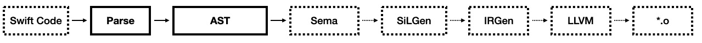
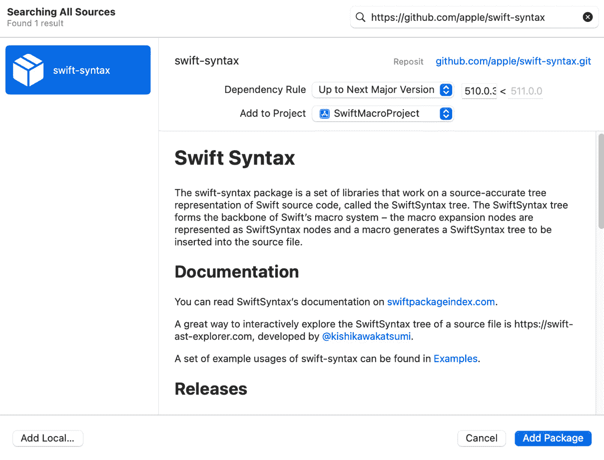
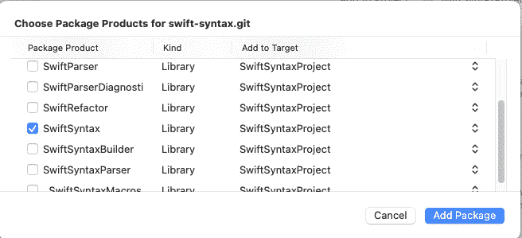
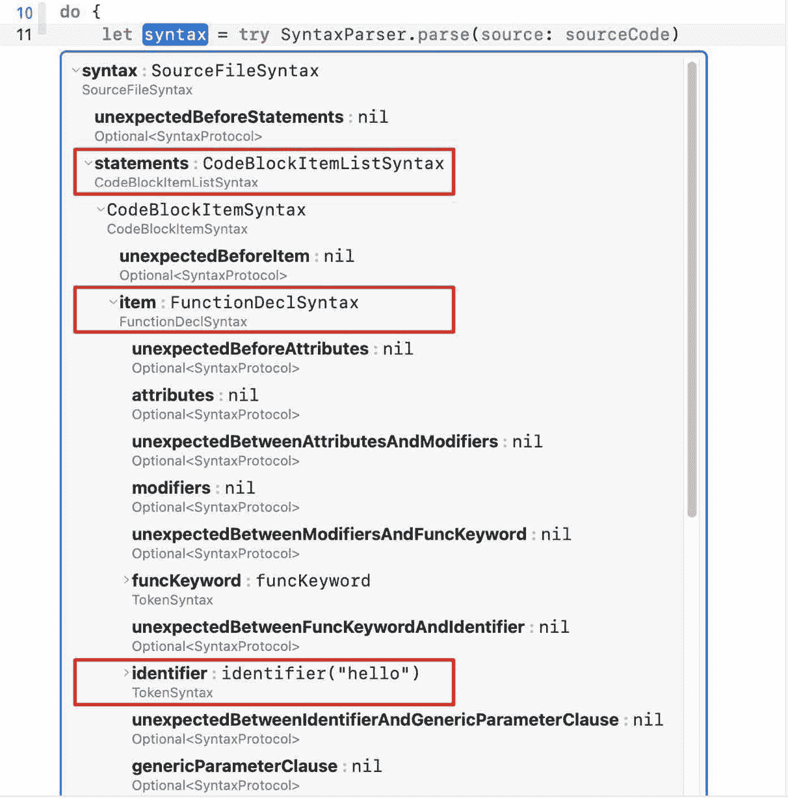
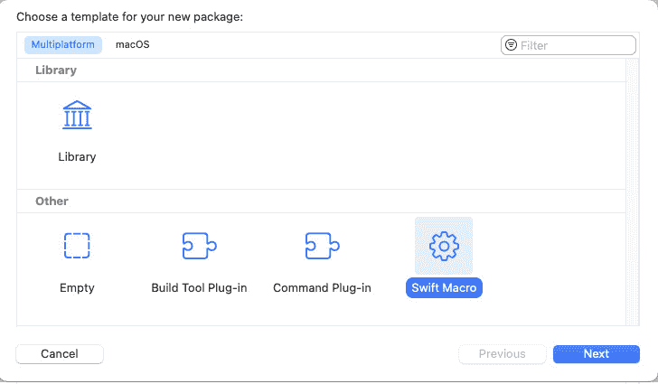
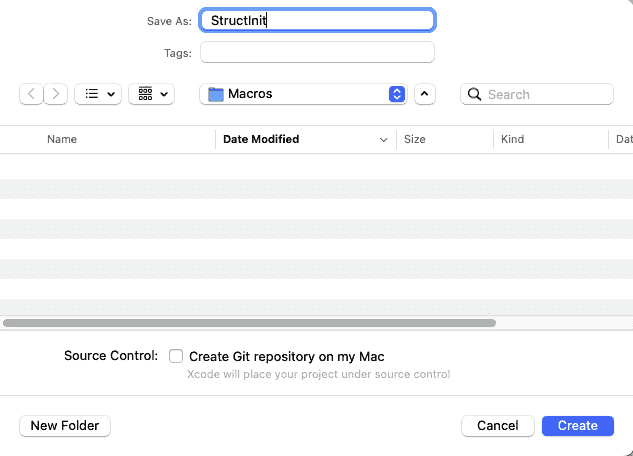
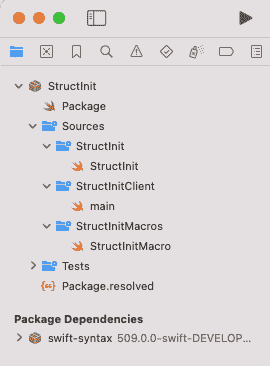
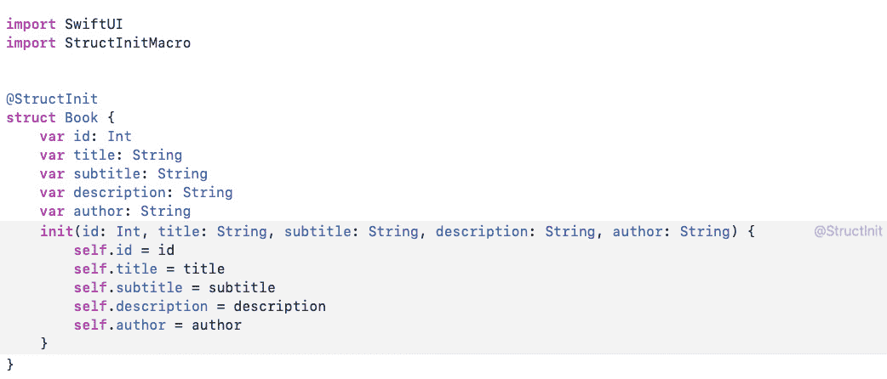
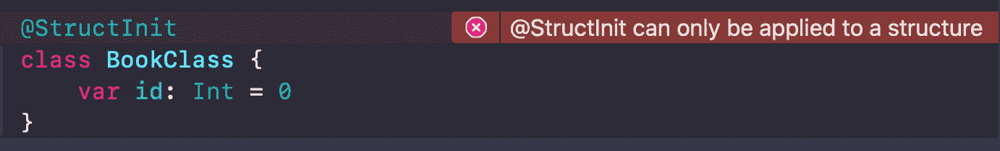
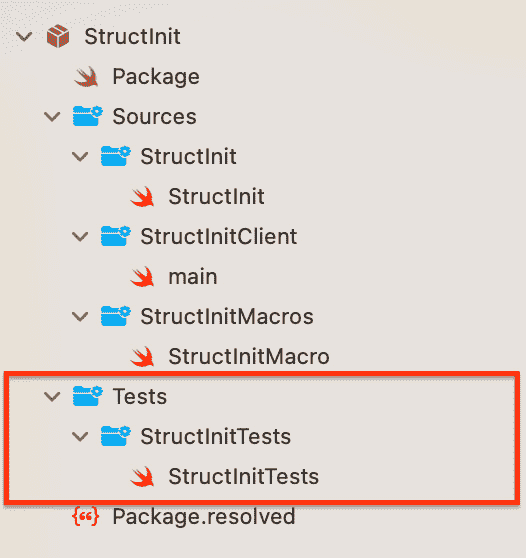

# <st c="0">10</st>

# <st c="3">Swift 宏</st>

<st c="16">开发者经常在他们的 IDE 中遇到各种挑战，通常与缺失的功能有关，大多数是关于缺失的功能。</st> <st c="165">随着每个新的 Xcode 或 Swift 版本的发布，Apple 都会引入增强生产力和简化任务的新功能。</st> <st c="286">然而，即使是 Apple 也很难满足我们的需求和期望。</st> <st c="356">幸运的是，这次，我们可以使用</st> <st c="427">Swift 宏</st> <st c="356">来创建自定义功能。</st>

**<st c="440">Swift 宏</st>** <st c="453">是 Xcode 15 和 iOS 17 中新增的一个令人兴奋的新功能，本章将帮助我们通过利用我们的 IDE 来提高我们的生产力。</st>

<st c="598">在本章中，我们将涵盖以下主题：</st> <st c="634">以下主题：</st>

+   <st c="651">了解</st> <st c="667">Swift 宏</st>

+   <st c="679">探索</st> `<st c="694">SwiftSyntax</st>` <st c="705">库，它是</st> <st c="735">Swift 宏</st> <st c="705">背后的</st>

+   <st c="747">创建我们的第一个</st> <st c="767">Swift 宏</st>

+   <st c="778">处理错误并在出错时提供更多清晰度</st>

+   <st c="847">测试我们的宏，确保它按预期运行</st> <st c="899">随时间推移</st>

<st c="908">但现在，让我们从基础知识开始，探索</st> <st c="959">Swift 宏。</st>

# <st c="972">技术要求</st>

<st c="995">您必须从 Apple 的</st> <st c="1072">App Store</st> <st c="995">下载本章节所需的 Xcode 16.0 或更高版本。</st>

<st c="1082">您还需要运行最新版本的 macOS (Ventura 或更高版本)。</st> <st c="1155">在 App Store 中搜索 Xcode，选择并下载最新版本。</st> <st c="1233">启动 Xcode 并遵循系统可能提示的任何附加安装说明。</st> <st c="1336">一旦 Xcode 完全启动，您就准备好了</st> <st c="1380">开始。</st>

# <st c="1386">什么是 Swift 宏？</st>

<st c="1409">您可能之前在编程的上下文中听说过“宏”这个术语。</st> <st c="1484">这可能是因为像 C/C++ 这样的编程语言也有宏</st> <st c="1555">。</st>

<st c="1563">一个</st> **<st c="1566">宏</st>** <st c="1571">是一个结构，它允许我们定义一个代码模式，编译器会用一组特定的指令来替换它。</st>

<st c="1697">让我们看看一个简短的</st> <st c="1716">C 示例：</st>

```swift
 #define SQUARE(x) ((x) * (x))
int num = 5;
int result = SQUARE(num);
```

<st c="1795">在我们的前一个代码中，我们声明了一个名为</st> `<st c="1845">SQUARE</st>` <st c="1851">的宏，它接收一个名为</st> `<st c="1886">X</st>`<st c="1887">的参数，并且我们的编译器将其替换为</st> `<st c="1923">(</st>``<st c="1924">x) *(x)</st>`<st c="1931">。</st>

<st c="1932">首先出现在脑海中的问题是这个：为什么？</st> <st c="1987">我们不能只定义一个函数吗？</st>

<st c="2019">因此，在这种情况下，一个简单的计算数字平方的函数可能会有所帮助。</st>

<st c="2110">但宏的主要目标不是</st> <st c="2147">替换函数，因为它们有以下几个优点：</st> <st c="2189">：

+   **<st c="2205">代码重用</st>**<st c="2216">：请注意，代码重用不是“功能重用”。代码重用是指我们取一个实际的代码片段，并在不同的地方重用它。</st> <st c="2357">例如，如果我们经常在声明类时重复相同的行序列，宏可以帮助我们避免</st> <st c="2467">重复自己。</st>

+   **<st c="2487">提高抽象</st>**<st c="2507">：宏可以帮助我们在代码中添加另一个抽象层。</st> <st c="2572">想象一下编写一个生成函数声明的宏。</st> <st c="2634">这是我们可以构建的另一个代码构建</st> <st c="2672">层次。</st>

+   **<st c="2681">性能</st>**<st c="2693">：在某些情况下，宏可以帮助我们优化代码。</st> <st c="2749">有时，优化与可读性/简单性之间的权衡可以通过宏来解决。</st> <st c="2851">宏可以生成更难阅读的代码，但仍然可以进行优化。</st> <st c="2925">宏可以优化的一个特性是**<st c="2973">循环展开</st>** <st c="2987">——一种通过指令级并行性更快地迭代循环的方法。</st> <st c="3057">循环展开</st> <st c="3072">生成的代码可读性较低，但速度要快得多。</st>

<st c="3120">最后，宏</st> <st c="3148">只是一个工具，它用另一段代码替换一段代码，并在编译前插入特定的代码片段。</st> <st c="3261">但 C 宏</st> <st c="3273">存在许多问题。</st> <st c="3294">它们难以测试，没有类型安全，错误不够清晰，并且与其他开发者共享它们并不简单。</st> <st c="3429">作为 Xcode 15 的一部分，Swift 团队发布了一个名为</st> **<st c="3492">Swift 宏</st>** <st c="3504">的新工具——这是 Swift 版本的宏，它允许我们更高效、更优雅地创建宏。</st>

<st c="3593">让我们来看一个简单的</st> <st c="3617">宏使用</st> <st c="3628">例子。</st>

<st c="3640">在我们的项目中，我们想要添加一个宏，该宏将一个名为</st> `<st c="3706">log(issue:String)</st>` <st c="3724">的函数添加到类和结构体中。</st> <st c="3749">该函数将问题打印到我们的日志中，并添加类或结构体的名称。</st> <st c="3829">我们可以将这个宏命名为</st> `<st c="3852">@AddDebugLogger</st>`<st c="3867">，并且我们可以这样使用它：</st>

```swift
<st c="3898">@AddDebugerLogger</st> class MyClass {
}
```

<st c="3934">在上面的代码中，我们声明了一个名为</st> `<st c="3984">MyClass</st>` <st c="3991">的类，并附加了一个名为</st> `<st c="4019">@AddDebugerLogger</st>`<st c="4036">的宏，它展开为以下代码：</st>

```swift
 class MyClass {
    func printLog(issue: String) {
        #if DEBUG
        print("In class named MyClass - \(issue)")
        #endif
    }
}
```

<st c="4185">宏添加了一个名为</st> `<st c="4218">printLog()</st>`<st c="4228">的函数，该函数将问题打印到控制台，并在日志消息中提及类名。</st> <st c="4327">这作为主要宏使用的一个示例，展示了该工具的能力。</st>

<st c="4420">但是宏是如何了解类名的呢？</st> <st c="4472">它是如何在类内部正确位置生成一个新函数的？</st> <st c="4545">为了回答这些问题，我们首先需要了解</st> `<st c="4594">SwiftSyntax</st>`<st c="4605">，这是一个</st> <st c="4609">位于 Swift 宏核心的</st> <st c="4645">库。</st>

# <st c="4658">探索 SwiftSyntax</st>

`<st c="4680">SwiftSyntax</st>` <st c="4692">不是一个</st> <st c="4702">新库，它从 Swift 的早期版本开始就是 Swift 代码库的一部分。</st> <st c="4777">实际上，Swift 宏是</st> `<st c="4810">SwiftSyntax</st>`<st c="4821">的一部分，并使用</st> <st c="4835">其功能。</st>

<st c="4852">在我们深入</st> `<st c="4873">SwiftSyntax</st>` <st c="4884">（而且有很多东西可以深入）之前，让我们了解一下 Swift 编译器是如何工作的（</st>*<st c="4971">图 10</st>**<st c="4981">.1</st>*<st c="4983">）：</st>



<st c="4988">图 10.1：Swift 编译器过程</st>

<st c="5027">不要害怕你在</st> *<st c="5076">图 10</st>**<st c="5085">.1</st>*<st c="5087">中看到的不同的表达式。这个图展示了编译器如何将我们的源代码转换成设备可以运行的机器代码（即</st> `<st c="5219">*.o</st>` <st c="5222">文件）的概览。我们不需要理解这个流程中的每一个步骤，但了解它是如何工作的至关重要，尤其是在</st> `<st c="5340">SwiftSyntax</st>` <st c="5351">在过程中的位置。</st>

<st c="5372">让我们一起来回顾一下</st> <st c="5391">这些步骤：</st>

1.  **<st c="5406">解析和抽象语法树（AST）</st>**<st c="5443">：编译器将我们的源代码转换成一个 AST。</st> <st c="5449">AST 代表我们的代码的层次结构，包括类、结构体、变量和表达式。</st>

1.  **<st c="5607">语义分析（sema）</st>**<st c="5632">：在这个</st> <st c="5643">阶段，编译器对我们的生成的 AST 执行语义分析。</st> <st c="5719">分析检查我们的代码中的语义问题，并处理类型检查、名称解析等问题（当我们构建阶段看到“语义”问题时；这是该阶段的结果）。</st>

1.  **<st c="5927">Swift 中间语言生成（SILGen）</st>**<st c="5975">：在这个阶段，编译器</st> <st c="6005">生成一个表示，它捕捉了代码的语义结构。</st>

1.  **<st c="6082">中间表示生成 (IRGen)</st>**<st c="6129">：在 IRGen 中，编译器将 SILGen 的结果</st> <st c="6145">转换为接近机器级代码的二进制代码。</st> <st c="6236">这个过程是在</st> <st c="6270">**<st c="6274">低级虚拟机</st>** <st c="6299">(</st>**<st c="6301">LLVM</st>**<st c="6305">) 的帮助下完成的，代码会经过</st> <st c="6335">几个优化。</st>

1.  **<st c="6357">LLVM 链接</st>**<st c="6370">：LLVM</st> <st c="6382">将所有内容链接在一起，并为最终</st> <st c="6444">二进制创建做好准备。</st>

<st c="6460">这个过程可能看起来令人恐惧且复杂，但请记住，这对我们作为 iOS 开发者来说是一项重要的丰富，并且对于理解 Swift 宏不是必需的。</st> <st c="6629">我演示它是因为前两个步骤 – 解析和 AST。</st> <st c="6695">让我们再谈一谈。</st>

## <st c="6730">解析和 AST</st>

<st c="6746">解析 Swift 代码</st> <st c="6765">不是一项容易的任务。</st> <st c="6787">此外，构建 AST 甚至</st> <st c="6825">更加复杂。</st>

<st c="6838">在构建过程中，我们只看到了解析，AST 由</st> `<st c="6919">SwiftSyntax</st>` <st c="6930">库</st> <st c="6940">处理。</st> <st c="6949">因此，当我们与</st> `<st c="6966">SwiftSyntax</st>` <st c="6977">库</st> <st c="7027">一起工作时，我们拥有完整的编译器功能。</st> <st c="7115">这意味着我们可以解析代码，分析它，甚至像编译器一样生成新的代码。</st> <st c="7119">SwiftSyntax</st> <st c="7130">库是处理 Swift 宏时的强大且必要的工具，因为当我们想到它时，它就是 Swift 宏的全部 – 理解给定的代码并生成一个</st> <st c="7318">新的代码。</st>

<st c="7326">我们理解学习 SwiftSyntax 是编写 Swift 宏的先决条件，所以让我们</st> <st c="7420">深入探讨。</st>

## <st c="7428">设置 SwiftSyntax</st>

`<st c="7451">SwiftSyntax</st>` <st c="7463">是一个</st> **<st c="7469">Swift 包</st>**<st c="7482">，这意味着</st> <st c="7492">它可以轻松地链接到现有的 iOS 或</st> <st c="7538">macOS 项目。</st>

<st c="7552">什么是 Swift 包？</st>

<st c="7577">Swift 包</st> <st c="7593">是 Swift 代码分发的单元。</st> <st c="7635">它是一种组织、共享和管理跨</st> <st c="7695">不同项目</st> 的 Swift 代码的方式。

<st c="7714">为了玩转和学习</st> <st c="7731">SwiftSyntax</st> <st c="7749">，我们将创建一个新的项目，并将</st> `<st c="7788">SwiftSyntax</st>` <st c="7799">作为一个 Swift 包添加到该项目中，包括一个 playground。</st> <st c="7860">为此，请按照</st> <st c="7877">以下步骤</st> 进行操作：

1.  <st c="7889">让我们从打开 Xcode 并添加一个</st> <st c="7934">新项目</st> 开始。

1.  <st c="7946">然后，我们将通过选择</st> `<st c="7967">SwiftSyntax</st>` <st c="7978">Swift 包来添加我们的</st> **<st c="8006">文件</st>** <st c="8010">|</st> **<st c="8013">添加</st> **<st c="8017">包依赖…</st>**<st c="8038">。</st>

    <st c="8039">现在，我们处于 Xcode 的添加依赖项窗口中（</st>*<st c="8096">图 10</st>**<st c="8106">.2</st>*<st c="8108">）：</st>



<st c="9048">图 10.2：添加依赖项的 Xcode 窗口</st>

<st c="9097">依赖项窗口？</st>

<st c="9118">如果你第一次看到那个窗口，那么这是一个进行简要介绍的好机会。</st> <st c="9235">当 Swift 包管理器刚开始时，其管理完全是手动的，使用</st> <st c="9324">终端。</st>

<st c="9337">多年来，Swift 包管理器</st> <st c="9375">已成为 Xcode 的一个重要组成部分，现在，甚至可以直接在 Xcode 中管理集合和搜索包。</st> <st c="9495">:</st>

<st c="9506">你可以在</st> [<st c="9529">https://www.swift.org/documentation/package-manager/</st>](https://www.swift.org/documentation/package-manager/)<st c="9581">了解更多。</st>

1.  <st c="9582">回到</st> <st c="9591">Xcode – 在添加依赖项窗口的右上角，我们可以填写</st> `<st c="9674">SwiftSyntax</st>` <st c="9685">GitHub 仓库：</st>

    ```swift
     https://github.com/apple/swift-syntax
    ```

1.  <st c="9742">我们将从左侧列中选择</st> `<st c="9762">swift-syntax</st>` <st c="9774">包，并点击</st> **<st c="9818">添加</st> **<st c="9822">包</st> **<st c="9829">按钮。</st>

1.  <st c="9837">现在，Xcode 将解析 Swift 包并展示其库，以便我们可以选择想要导入到项目中的内容（</st>*<st c="9961">图 10</st>**<st c="9971">.3</st>*<st c="9973">）：</st>



<st c="10391">图 10.3：选择 SwiftSyntax 包产品</st>

<st c="10445">我们将选择</st> `<st c="10465">SwiftSyntax</st>` <st c="10476">库，并点击</st> `<st c="10542">SwiftSyntax</st>` <st c="10553">将其</st> <st c="10557">添加到我们的项目中！</st>

<st c="10569">现在，让我们添加一个 playground 文件（我们喜欢的任何地方）并探索</st> `<st c="10639">SwiftSyntax</st>` <st c="10650">是什么。</st>

## <st c="10654">构建我们的抽象语法树</st>

<st c="10688">为了尝试使用</st> `<st c="10740">SwiftSyntax</st>` <st c="10751">库分析一段 Swift 代码，我们需要生成一些 Swift 代码并对其进行处理。</st> <st c="10806">：</st>

<st c="10812">我们打开上一节中创建的 playground 文件，并添加以下代码：</st>

```swift
 import SwiftSyntax
import SwiftSyntaxParser <st c="10949">let</st> <st c="10952">sourceCode</st> = """
func hello() {
    print("Hello World")
}
"""
```

<st c="11011">我们的代码从导入两个重要的库开始 –</st> `<st c="11069">SwiftSyntax</st>` <st c="11080">和</st> `<st c="11085">SwiftSyntaxParser</st>`<st c="11102">。</st> `<st c="11108">SwiftSyntaxParser</st>` <st c="11125">库包含</st> `<st c="11147">SwiftParser</st>` <st c="11158">类，它有助于将源代码转换为我们可以遍历和分析的树。</st>

<st c="11238">我们添加了一个名为</st> <st c="11257">sourceCode</st> <st c="11272">的字符串</st> <st c="11282">常量，其中包含一个简单的</st> *<st c="11297">“Hello World”</st>* <st c="11310">函数，以查看其工作原理。</st> <st c="11341">想象一下</st> `<st c="11354">sourceCode</st>` <st c="11364">代表了一个</st> <st c="11393">Swift 文件</st> 的内容。</st>

<st c="11404">为了解析“Hello World”代码，我们将</st> <st c="11444">使用</st> `<st c="11448">SwiftParser</st>`<st c="11459">：</st>

```swift
 do { <st c="11467">let syntax = try SyntaxParser.parse(source: sourceCode)</st> } catch {
    print("Error parsing code: \(error)")
}
```

<st c="11572">解析代码很简单。</st> `<st c="11610">SyntaxParser</st>` <st c="11622">调用解析方法，使用我们之前定义的</st> `<st c="11655">sourceCode</st>` <st c="11665">常量，并返回一个语法。</st> <st c="11710">但这是什么语法呢？</st> <st c="11735">嗯，那就是我们完整的代码树了！</st> <st c="11768">语法变量来自类型</st> `<st c="11805">SourceFileSyntex</st>`<st c="11821">，而这个类型代表了我们代码的语法结构。</st> <st c="11882">它是最高级别的语法节点，封装了所有源代码的导入、类、</st> <st c="11974">和函数。</st>

<st c="11988">现在，是时候了解这个语法树</st> <st c="12040">看起来是什么样子了。</st>

### <st c="12051">调查树</st>

<st c="12074">关于与**<st c="12117">Swift Playgrounds</st>** <st c="12134">一起工作的最好之处之一是，它不仅非常适合玩代码</st> <st c="12185">片段，而且还可以检查它们的结果，而无需在我们的代码中设置断点。</st>

<st c="12279">在我们运行我们的</st> <st c="12297">Playground 代码</st> 后，我们可以在窗口的右侧列中看到类型</st> `<st c="12334">SourceFileSyntax</st>` <st c="12350">。</st> <st c="12381">当我们点击它旁边的方形图标时，我们可以看到语法常量是如何构建的（见</st> *<st c="12471">图 10</st>**<st c="12480">.4</st>*<st c="12482">）：</st>



<st c="13432">图 10.4：语法对象结构</st>

<st c="13472">这是一个极佳的时刻，花点时间亲自运行它，并尝试理解我们在</st> *<st c="13572">图 10</st>**<st c="13581">.4</st>*<st c="13583">中看到的内容。</st> 注意到我已经标记了所有</st> <st c="13614">有趣的部分。</st>

<st c="13626">语法实例包含一系列语句。</st> <st c="13630">一个</st> **<st c="13680">语句</st>** <st c="13689">是我们能处理的一切——一个导入、一个类声明，甚至是一个表达式。</st> <st c="13693">一个语句可以包含其</st> <st c="13806">自己的语句。</st>

<st c="13821">基本语句类是</st> `<st c="13850">代码块项目列表语法</st>`<st c="13873">，每种语句类型都带有不同的</st> <st c="13931">子类</st> <st c="13934">CodeBlockItemListSyntax</st>`<st c="13957">。</st>

<st c="13958">在我们的情况下，我们有一个来自</st> `<st c="14011">函数声明语法</st>`<st c="14029">类型的语句，这表明一个</st> <st c="14049">函数声明。</st>

<st c="14070">展开</st> `<st c="14081">函数声明语法</st>` <st c="14099">可以揭示有关函数的更多信息。</st> <st c="14151">例如，它的名称由</st> `<st c="14195">标识符</st>` <st c="14205">属性表示（在*<st c="14242">图 10</st>**<st c="14251">.4</st>*<st c="14253">中用框突出显示）。</st>

`<st c="14256">函数声明语法</st>` <st c="14275">有一个</st> `<st c="14282">体</st>` <st c="14286">属性，它包含具有所有函数语句的语句属性，包括对</st> `<st c="14401">print</st>` <st c="14406">函数的调用。</st>

<st c="14416">因此，我们可以看到</st> `<st c="14437">SwiftParser</st>` <st c="14448">已经为我们做了所有脏活。</st> <st c="14485">现在我们有一个树，我们可以遍历它。</st> <st c="14530">让我们提取</st> <st c="14548">函数语句：</st>

```swift
 if let <st c="14575">funcDecl</st> = syntax.statements.first?.item.as(<st c="14619">FunctionDeclSyntax</st>.self) {
       // We'll fill that part soon
 }
```

在前面的代码中，我们正在尝试将第一个语句项转换为函数声明类型。

<st c="14796">存在各种声明类型，每种类型都提供特定的工具来帮助我们遍历和提取更多信息。</st> <st c="14914">以下是一些我们可以尝试</st> <st c="14964">提取的最常见类型：</st>

+   `<st c="14975">变量声明语法</st>`<st c="14994">：这是用于</st> <st c="15005">变量的</st>

+   `<st c="15018">枚举声明语法</st>`<st c="15033">：这是用于</st> <st c="15048">枚举声明</st>

+   `<st c="15064">类声明语法</st>`<st c="15080">：这是用于</st> <st c="15095">类声明</st>

+   `<st c="15112">协议声明语法</st>`<st c="15131">：这是用于</st> <st c="15146">协议声明</st>

+   `<st c="15166">类型别名声明语法</st>`<st c="15186">：这是用于类型</st> <st c="15206">别名声明</st>

+   `<st c="15223">初始化器声明语法</st>`<st c="15244">：这是用于</st> <st c="15259">构造声明</st>

+   `<st c="15280">运算符声明语法</st>`<st c="15299">：这是用于</st> <st c="15314">运算符声明</st>

<st c="15334">这些只是</st> <st c="15354">SwiftSyntax</st> <st c="15386">中可用的</st> <st c="15397">一些语法节点类型，将现有的语句项转换为它们对应的类型可以为我们提供所需的</st> <st c="15492">功能。</st>

<st c="15513">让我们继续我们的代码示例，看看我们能得到什么</st> <st c="15570">来自</st> `<st c="15575">FunctionDeclSyntax</st>`<st c="15593">:</st>

```swift
 if let <st c="15603">funcCallExpression</st> = funcDecl.body?.statements.first?.item.as(<st c="15665">FunctionCallExprSyntax</st>.self) {
   // Checking the print function
  }
```

<st c="15729">让我们剖析前面的代码片段，了解它完成了什么。</st> <st c="15807">有了函数声明，我们可以深入分析它包含的不同语句。</st> <st c="15912">在这个例子中，我们可以找到一个来自</st> `<st c="15971">FunctionCallExprSyntax</st>`<st c="15993">类型的语句。这种类型表示一个函数调用，具体来说，是调用</st> `<st c="16057">print()</st>`<st c="16064">。</st>

<st c="16065">现在我们已经将语句转换为正确的类型，我们可以获取更多关于它的信息：</st>

```swift
 let functionName = funcCallExpression.<st c="16197">calledExpression</st>.firstToken?.text
            if functionName == "print" {
                let value = funcCallExpression.<st c="16292">argumentList</st>.first?.expression.as(StringLiteralExprSyntax.self)?
                    .segments
                    .first?.firstToken?.text
            }
```

`<st c="16395">funcCallExpression</st>` <st c="16414">有一个</st> `<st c="16421">calledExpression</st>` <st c="16437">属性，它封装了关于实际</st> <st c="16494">表达式组件的信息。</st>

`<st c="16516">firstToken</st>` <st c="16527">包含</st> <st c="16540">函数名本身。</st> <st c="16563">但“令牌”是什么意思呢？</st> <st c="16591">嗯，</st> `<st c="16736">text</st>` <st c="16740">属性返回</st> <st c="16762">函数名。</st>

<st c="16776">接下来，我们检查函数名是否确实是</st> `<st c="16823">print</st>`<st c="16828">，现在我们可以通过检查函数参数列表来检查被打印的值。</st> <st c="16917">一旦我们将第一个表达式转换为</st> `<st c="16957">StringLiteralExprSyntax</st>`<st c="16980">，我们就可以提取其第一个段令牌并将其存储在</st> `<st c="17041">value</st>` <st c="17046">常量中。</st>

<st c="17056">听起来是不是有点混乱，有点繁琐？</st> <st c="17110">嗯，我们应该记住，</st> `<st c="17144">SwiftSyntax</st>` <st c="17155">库并不被认为容易使用。</st> <st c="17201">它有一个陡峭的学习曲线，有很多选项和功能。</st>

<st c="17262">但这种复杂性并非巧合——解析和分析编程语言，尤其是像 Swift 这样的高级和功能齐全的语言，并不简单。</st> <st c="17430">就像我们有</st> `<st c="17448">funcCallExpression</st>`<st c="17466">，</st> `<st c="17468">calledExpression</st>` <st c="17484">或</st> `<st c="17488">StringLiteralExprSyntax</st>`<st c="17511">一样，我们为不同的表达式有数十种不同的类型。</st> <st c="17574">查看</st> `<st c="17589">SwiftSyntax</st>` <st c="17600">文档是学习遍历和分析更多</st> <st c="17672">语言的最佳方式。</st>

<st c="17685">现在我们了解了使用</st> `<st c="17735">SwiftSyntax</st>` <st c="17746">进行 Swift 代码分析，让我们探索如何利用</st> `<st c="17782">SwiftSyntax</st>` <st c="17793">进行反向操作——如何生成</st> <st c="17837">Swift 代码。</st>

### <st c="17848">生成 Swift 代码</st>

<st c="17870">在</st> <st c="17881">SwiftSyntax</st> <st c="17890">中生成代码基于内置类型和字符串字面量。</st> <st c="17954">我们可以尝试通过创建</st> <st c="18007">字符串实例来结构化 Swift 代码：</st>

```swift
 let initString: String = "<st c="18052">init(title: String) {</st>
<st c="18150">SwiftSyntax</st> types:

```

let initSyntax = try <st c="18190">InitializerDeclSyntax</st>("init(title: String)") { <st c="18238">ExprSyntax</st>("self.title = title")

        }

```swift

			<st c="18273">In the preceding code,</st> `<st c="18297">InitializerDeclSyntax</st>` <st c="18318">is a constructor declaration, and</st> `<st c="18353">ExprSyntax</st>` <st c="18363">is a base type</st> <st c="18379">for expressions.</st>
			<st c="18395">In the context of Swift Macros, in most cases, using</st> `<st c="18449">String</st>` <st c="18455">literals will be enough.</st> <st c="18481">That’s because the</st> `<st c="18500">SwiftSyntax</st>` <st c="18511">types support</st> `<st c="18526">String</st>` <st c="18532">literals.</st> <st c="18543">However, using the built-in</st> <st c="18570">expressions will ensure the generated code will be valid in future</st> <st c="18638">Swift updates.</st>
			<st c="18652">Speaking of Swift Macros, let’s create our first Swift macro now that we know what</st> `<st c="18736">SwiftSyntax</st>` <st c="18747">is and how</st> <st c="18759">it works.</st>
			<st c="18768">Creating our first Swift macro</st>
			<st c="18799">As I</st> <st c="18805">mentioned earlier (in the</st> *<st c="18831">What is a Swift macro?</st>* <st c="18853">section), the Swift Macros feature is part of the</st> `<st c="18904">SwiftSyntax</st>` <st c="18915">library.</st> <st c="18925">Macros don’t run as part of our app but as a plugin in</st> <st c="18980">the IDE.</st>
			<st c="18988">Macros can be created by adding a new Swift package with a</st> <st c="19048">macro template.</st>
			<st c="19063">It is obvious why Apple selected the Swift package feature to create macros – a Swift package is a great way to encapsulate code, including tests</st> <st c="19210">and documentation.</st>
			<st c="19228">Let’s add our first Swift macro by creating a new</st> <st c="19279">Swift package.</st>
			<st c="19293">Adding a new Swift macro</st>
			<st c="19318">To create a new</st> <st c="19335">Swift macro, we should open Xcode and follow</st> <st c="19380">these steps:</st>

				1.  <st c="19392">Select</st> **<st c="19400">File</st>** <st c="19404">|</st> **<st c="19407">New</st>** <st c="19410">|</st> **<st c="19413">Package…</st>**<st c="19421">.</st>
				2.  <st c="19422">Then, select</st> **<st c="19436">Swift Macro</st>** <st c="19447">followed by tapping on</st> **<st c="19471">Next</st>** <st c="19475">(see</st> *<st c="19481">Figure 10</st>**<st c="19490">.5</st>*<st c="19492">):</st>

			

			<st c="19632">Figure 10.5: Selecting Swift Macro in the choose template window</st>

				1.  <st c="19696">In the</st> <st c="19704">opening screen, we will give a name for our struct and press the</st> `<st c="19936">StructInit</st>` <st c="19946">(see</st> *<st c="19952">Figure 10</st>**<st c="19961">.6</st>*<st c="19963">):</st>

			

			<st c="20054">Figure 10.6: Adding a StructInit macro</st>

				1.  <st c="20092">After saving, Xcode</st> <st c="20113">opens a window with our new package containing an</st> <st c="20163">example macro.</st>

			<st c="20177">Let’s see how a Swift Macros package is</st> <st c="20218">built next!</st>
			<st c="20229">Examining our Swift Macros package structure</st>
			<st c="20274">Now that we</st> <st c="20286">have a Swift Macros package, we can reveal its file’s structure (</st>*<st c="20352">Figure 10</st>**<st c="20362">.7</st>*<st c="20364">):</st>
			

			<st c="20612">Figure 10.7: The Swift Macros package file’s structure</st>
			<st c="20666">Looking at the Swift Macros package (</st>*<st c="20704">Figure 10</st>**<st c="20714">.7</st>*<st c="20716">), we can see that</st> `<st c="20736">SwiftSyntax</st>` <st c="20747">is defined as a dependency of the package for us, with the latest stable version already linked to</st> <st c="20847">our package.</st>
			<st c="20859">The macro itself is built upon three different</st> <st c="20907">source files:</st>

				*   `<st c="20920">StructInit</st>`<st c="20931">: That’s our macro definition file.</st> <st c="20968">Here, we define the macro name</st> <st c="20999">and type.</st>
				*   `<st c="21008">StructInitClient</st>`<st c="21025">: That’s our Swift Macros package executable product.</st> <st c="21080">This is where we add an executable code that uses</st> <st c="21130">our macro.</st>
				*   `<st c="21140">StructInitMacros</st>`<st c="21157">: That’s our macro implementation and where all the</st> <st c="21210">magic happens.</st>

			<st c="21224">In addition, we also have a</st> `<st c="21253">Test</st>` <st c="21257">target where we can test our</st> <st c="21287">macro code.</st>
			<st c="21298">Our first step toward the</st> `<st c="21325">StructInit</st>` <st c="21335">macro is by declaring its name</st> <st c="21367">and type.</st>
			<st c="21376">Declaring our macro</st>
			<st c="21396">If we</st> <st c="21402">open the</st> `<st c="21412">StructInit</st>` <st c="21422">file, we can see it has a concise yet</st> <st c="21461">important declaration:</st>

```

@独立的表达式

public macro stringify<T>(_ value: T) -> (T, String) = #externalMacro(module: "StructInitMacros",

    类型："StringifyMacro")

```swift

			<st c="21631">This short declaration has</st> <st c="21659">many components:</st>

				*   `<st c="21675">@freestanding(expression)</st>`<st c="21701">: That’s the macro role.</st> <st c="21727">We’ll go over roles in the</st> *<st c="21754">Giving our macro a</st>* *<st c="21773">role</st>* <st c="21777">section.</st>
				*   `<st c="21786">public macro stringify<T></st>`<st c="21812">: The</st> <st c="21819">macro name.</st>
				*   `<st c="21830">(_ value: T) -> (T, String)</st>`<st c="21858">: The macro parameters</st> <st c="21882">and output.</st>
				*   `<st c="21893">#externalMacro</st>`<st c="21908">: This means that the macro will be used as a plug in</st> <st c="21963">the compiler.</st>
				*   `<st c="21976">module: "StructInitMacros"</st>`<st c="22003">: The name of the plugin that will</st> <st c="22039">be used.</st>
				*   `<st c="22047">type: "StringifyMacro"</st>`<st c="22070">: That’s the macro type, as defined in the</st> `<st c="22114">Package.swift</st>` <st c="22127">file.</st>

			<st c="22133">The first component is the macro role, so let’s discuss what</st> <st c="22195">roles are.</st>
			<st c="22205">Giving our macro a role</st>
			**<st c="22229">Macro roles</st>** <st c="22241">define</st> <st c="22249">the fundamental behavior of our macros.</st> <st c="22289">There are two primary</st> <st c="22311">role categories:</st>

				*   `<st c="22473">#</st>` <st c="22474">sign.</st>

    <st c="22479">Here’s an example of a</st> <st c="22503">freestanding macro:</st>

    ```

    #URL("https://swift.org/")

    ```swift

    <st c="22549">The</st> `<st c="22554">#URL</st>` <st c="22558">macro checks whether the provided value is a valid URL.</st> <st c="22615">If not, it raises an error on compile time.</st> <st c="22659">Otherwise, it returns a</st> <st c="22683">non-optional value.</st>

    <st c="22702">We can see</st> <st c="22713">that the</st> `<st c="22723">#URL</st>` <st c="22727">macro can be anywhere in our code.</st> <st c="22763">That’s why it is</st> <st c="22780">called</st> *<st c="22787">freestanding</st>*<st c="22799">.</st>

    				*   `<st c="22974">@</st>` <st c="22975">sign.</st>

    <st c="22980">Here’s an example of an</st> <st c="23005">attached macro:</st>

    ```

    <st c="23020">@StructInit</st> struct Book {

        var id: Int

        var title: String

        var subtitle: String

        var description: String

        var author: String

    }

    ```swift

    <st c="23142">In the preceding code, the</st> `<st c="23170">@StructInit</st>` <st c="23181">macro is “attached” to the</st> `<st c="23209">Book</st>` <st c="23213">struct and inserts an</st> `<st c="23236">init</st>` <st c="23240">function based on the</st> <st c="23263">struct properties.</st>

			<st c="23281">The two categories of macro types, namely freestanding and attached, represent distinct sets of roles.</st> <st c="23385">Here is the list of</st> <st c="23405">all roles:</st>

				*   `<st c="23415">#freestanding(expression)</st>`<st c="23441">: This</st> <st c="23448">just returns a new expression based on an</st> <st c="23491">existing one</st>
				*   `<st c="23503">#freestanding(declaration)</st>`<st c="23530">: This creates a</st> <st c="23548">new declaration</st>
				*   `<st c="23563">@attached(peer)</st>`<st c="23579">: This adds new declaration next to the</st> <st c="23620">attached one</st>
				*   `<st c="23632">@attached(accessor)</st>`<st c="23652">: This adds accessors to</st> <st c="23678">a property</st>
				*   `<st c="23688">@attached(memberAttribute)</st>`<st c="23715">: This adds attributes to the declarations in the type it’s</st> <st c="23776">attached to</st>
				*   `<st c="23787">@attached(member)</st>`<st c="23805">: This adds new declarations inside the type it’s</st> <st c="23856">attached to</st>
				*   `<st c="23867">@attached(conformance)</st>`<st c="23890">: This</st> <st c="23898">adds conformance to the type it’s</st> <st c="23932">attached to</st>

			<st c="23943">The role we define when we declare the macro tells the created plugin</st> *<st c="24014">how to</st>* <st c="24020">change an</st> <st c="24031">existing code.</st>
			<st c="24045">The role is the first part of declaring a macro.</st> <st c="24095">Let’s continue with the rest of</st> <st c="24127">the declaration.</st>
			<st c="24143">Defining the StructInit macro</st>
			<st c="24173">Our</st> `<st c="24178">StructInit</st>` <st c="24188">macro goal is to</st> <st c="24205">create the init method for a struct.</st> <st c="24243">Our macro doesn’t exist independently; its purpose is to insert new declarations into an existing struct.</st> <st c="24349">Therefore, we will choose the</st> `<st c="24379">@attached(member)</st>` <st c="24396">macro from the roles list in the</st> *<st c="24430">Giving our macro a</st>* *<st c="24449">role</st>* <st c="24453">section:</st>

```

@附加的成员

```swift

			<st c="24480">However, mentioning the role type is not enough.</st> <st c="24530">We also need to specify what declaration types we expect our macro to generate.</st> <st c="24610">In this case, we expect the macro to generate an</st> `<st c="24659">init</st>` <st c="24663">function.</st> <st c="24674">Let’s add that to the</st> <st c="24696">role declaration:</st>

```

@附加的成员，名称：命名（init）

```swift

			<st c="24751">Adding role types helps the compiler cover different cases where the macro generates something else that was not declared.</st> <st c="24875">It also behaves as a documentation for</st> <st c="24914">our macro.</st>
			<st c="24924">Here is another example of</st> `<st c="24952">names</st>` <st c="24957">argument usage:</st>

```

@附加的成员，名称：命名（rawValue）

```swift

			<st c="25015">In this case, the</st> `<st c="25034">names</st>` <st c="25039">argument declares a usage of the</st> `<st c="25073">RawValue</st>` <st c="25081">declaration.</st>
			<st c="25094">We can also add</st> `<st c="25111">arbitrary</st>` <st c="25120">for</st> <st c="25125">general purposes:</st>

```

@附加的成员，名称：任意

```swift

			<st c="25178">Using</st> `<st c="25185">arbitrary</st>` <st c="25194">counts for all types</st> <st c="25216">of declarations.</st>
			<st c="25232">Moving forward, we will reconfigure the predefined macro with the</st> <st c="25299">following declaration:</st>

```

@附加的成员，名称：命名（init）

public macro <st c="25373">StructInit</st>() = #externalMacro(module:

    "<st c="25541">StructInit</st>.

            <st c="25552">这个宏虽然简短，但讲述了它的目标和行为。</st> <st c="25617">接下来是重要的部分——</st> <st c="25653">宏的实现。</st>

            <st c="25674">实现宏</st>

            <st c="25697">与其他 Swift 类型不同，在</st> <st c="25727">宏中，我们将声明和实现分开到不同的文件中。</st> <st c="25804">从某种意义上说，这类似于 Objective-C 或 C++，当时头文件和实现是</st> <st c="25891">其他部分。</st>

            <st c="25903">我们将打开我们的</st> `<st c="25921">StructInitMacros</st>` <st c="25937">文件，并清除其内容以从头开始。</st> <st c="25984">之后，我们可以继续导入</st> <st c="26024">相关库：</st>

```swift
 import SwiftCompilerPlugin
import SwiftSyntax
import SwiftSyntaxBuilder
import SwiftSyntaxMacros
```

            <st c="26140">这些是我们将要编写的宏中的标准库。</st> <st c="26204">请注意，我们有</st> `<st c="26224">SwiftSyntax</st>` <st c="26235">和</st> `<st c="26240">SwiftSyntaxBuilder</st>` <st c="26258">作为我们在</st> *<st c="26296">探索</st> * *<st c="26306">SwiftSyntax</st> * <st c="26317">部分学到的内容的一部分。</st>

            <st c="26326">现在，让我们进入主菜——</st> `<st c="26369">StructInit</st>` <st c="26379">结构体。</st>

            <st c="26387">声明 StructInit 结构体</st>

            <st c="26419">在 Swift 宏中，Apple</st> <st c="26443">继续其主要使用结构体和协议而不是类</st> <st c="26527">和继承的趋势。</st>

            <st c="26543">要实现一个新的宏，我们将添加一个新的结构体，其名称与名为</st> <st c="26649">MemberMacro</st> <st c="26660">的协议</st> <st c="26643">相符合</st>：

```swift
<st c="26662">public</st> struct StructInit: <st c="26688">MemberMacro</st> {
   public static func expansion() {
      //Implementation details are detailed in the next section
   }
}
```

            <st c="26796">编译器会在</st> *<st c="26900">添加新的 Swift 宏</st>* <st c="26924">部分下寻找与我们之前声明的宏名称相同的结构体。</st> <st c="26934">我们还声明了</st> `<st c="26955">StructInit</st>` <st c="26965">为</st> `<st c="26969">public</st>` <st c="26975"> – 记住，宏是 Swift 包的一部分，因此我们需要确保它可以从其他模块中访问。</st>

            <st c="27088">那么，什么是</st> `<st c="27105">MemberMacro</st>` <st c="27116">协议呢？</st> <st c="27127">`<st c="27131">MemberMacro</st>` <st c="27142">协议包含一个执行展开操作的关键函数，其名称非同寻常，为</st> `<st c="27250">expansion()</st>`<st c="27264">。</st>

            <st c="27265">然而，我们不会在创建每个宏时都使用</st> `<st c="27288">MemberMacro</st>` <st c="27299">，因为它只与宏的</st> `<st c="27368">attached(member)</st>` <st c="27384">角色相关。</st> <st c="27391">每个角色都有一个我们需要</st> <st c="27437">遵守的协议。</st>

            <st c="27448">以下是不同角色及其</st> <st c="27499">对应协议的列表：</st>

                +   `<st c="27522">@freestanding(expression) -></st>` `<st c="27552">ExpressionMacro</st>`

                +   `<st c="27567">@freestanding(declaration) -></st>` `<st c="27598">DeclarationMacro</st>`

                +   `<st c="27614">@attached(peer) -></st>` `<st c="27634">PeerMacro</st>`

                +   `<st c="27643">@attached(accessor) -></st>` `<st c="27667">AccessorMacro</st>`

                +   `<st c="27680">@attached(memberAttribute) -></st>` `<st c="27711">MemberAttributeMacro</st>`

                +   `<st c="27731">@attached(member) -></st>` `<st c="27753">MemberMacro</st>`

                +   `<st c="27764">@attached(conformance) -></st>` `<st c="27791">ConformanceMacro</st>`

            <st c="27807">由于我们正在使用</st> <st c="27831">Swift 宏并具有</st> `<st c="27853">@attached(member)</st>` <st c="27870">角色，我们将只关注</st> `<st c="27899">MemberMacro</st>`<st c="27910">，尽管这个概念与其他协议类似。</st>

            <st c="27970">让我们一起来了解一下！</st>

            <st c="27997">实现展开函数</st>

            <st c="28033">我将首先</st> <st c="28048">向您展示</st> `<st c="28064">expansion</st>` <st c="28073">函数：</st>

```swift
 public static func expansion(
        of node: AttributeSyntax,
        providingMembersOf declaration: some
          DeclGroupSyntax,
        in context: some MacroExpansionContext
    ) throws -> [SwiftSyntax.DeclSyntax]
```

            <st c="28269">虽然这个函数可能看起来有点复杂，但我们需要记住</st> <st c="28340">两件事：</st>

                1.  <st c="28351">在函数签名中提到的多数类型应该对我们来说已经熟悉，因为它们是</st> `<st c="28467">SwiftSyntax</st>` <st c="28478">库的组成部分。</st>

                1.  <st c="28487">这个协议中只有一个函数。</st> <st c="28532">无需实现</st> <st c="28553">另一个函数！</st>

            <st c="28565">扩展函数的目的是接收有关附加对象或宏参数的信息，并返回一个表示为</st> `<st c="28728">SwiftSyntax</st>` <st c="28739">表达式数组（</st>`<st c="28753">DeclSyntax</st>`<st c="28764">）的 Swift 代码片段。</st>

            <st c="28767">扩展函数有三个参数：</st>

                1.  `<st c="28812">节点：AtributeSyntax</st>`<st c="28833">：此节点表示原始 Swift 代码中的实际宏。</st>

                1.  `<st c="28911">声明：some DeclGroupSyntax</st>`<st c="28945">：描述宏附加到的结构/类的声明结构。</st>

                1.  `<st c="29028">上下文：some MacroExpansionContext</st>`<st c="29064">：上下文为我们提供了更多关于编译器的信息。</st> <st c="29133">记住，编译器作为宏函数的“环境”。</st>

            <st c="29217">现在，我们可以开始创建我们的结构</st> `<st c="29256">init</st>` <st c="29260">方法。</st>

            <st c="29268">首先，我们需要有一个包含所有结构属性的列表，包括名称和类型。</st> <st c="29356">为此，我们需要使用</st> `<st c="29402">SwiftSyntax</st>`<st c="29413">分析代码，这是我们本章刚刚学习的内容（在</st> *<st c="29462">探索</st>* *<st c="29472">SwiftSyntax</st>* <st c="29483">部分）。</st>

            <st c="29493">因此，让我们获取</st> <st c="29507">我们需要的所有结构信息：</st>

```swift
 let members = declaration.memberBlock.members <st c="29595">// 1</st> let variableDecl = members.compactMap {
  $0.decl.as(VariableDeclSyntax.self) } <st c="29678">// 2</st> let variablesName = variableDecl.compactMap {
  $0.bindings.first?.pattern } <st c="29758">// 3</st> let variablesType = variableDecl.compactMap {
  $0.bindings.first?.typeAnnotation?.type } <st c="29851">// 4</st>
```

            <st c="29855">让我们逐行解释前面的代码：</st>

                1.  <st c="29903">我们使用声明参数来获取所有</st> <st c="29952">结构成员。</st>

                1.  <st c="29967">所有结构成员也包括它们的功能，所以我们只</st> <st c="30042">过滤变量。</st>

                1.  <st c="30055">我们使用变量的</st> `<st c="30115">pattern</st>` <st c="30122">属性创建所有变量名的数组。</st>

                1.  <st c="30133">我们使用变量的</st> `<st c="30201">typeAnnotation</st>` <st c="30215">属性创建所有变量类型的数组。</st>

            <st c="30226">现在我们有了所有需要的信息，我们可以生成</st> `<st c="30312">init</st>` <st c="30316">函数的 Swift 代码。</st>

            <st c="30326">首先，我们根据变量名</st> `<st c="30350">init</st>` <st c="30354">函数签名基于变量名列表和类型：</st>

```swift
 var code = "<st c="30433">init(</st>"
for (name, type) in zip(variablesName, variablesType) {
    code += <st c="30506">"\(name): \(type),</st> "
}
code = String(code.dropLast(2))
code += "<st c="30570">)</st>"
```

            <st c="30573">前面的代码首先创建一个可变字符串，遍历所有变量名和类型，并将它们添加到函数签名中。</st> <st c="30714">一旦代码添加了所有函数参数，它就通过一个</st> <st c="30779">闭括号</st>结束。

            <st c="30799">接下来，是时候</st> <st c="30819">添加函数体了。</st> <st c="30842">我们可以使用一个特殊的</st> `<st c="30873">SwiftSyntax</st>` <st c="30884">结构体，它代表一个初始化器声明</st> <st c="30935">称为</st> `<st c="30942">InitializerDeclSyntax</st>`<st c="30963">：</st>

```swift
 let initializer = try <st c="30988">InitializerDeclSyntax</st>(SyntaxNodeString
  (stringLiteral: code)) {
      for name in variablesName {
          ExprSyntax("self.\(name) = \(name)")
      }
}
```

            <st c="31121">`<st c="31126">InitializerDeclSyntax</st>` <st c="31147">“init”函数接收两个参数——函数签名和一个包含“init”体</st> <st c="31260">的闭包，该体由</st> `<st c="31263">ExprSyntax</st>`<st c="31273">表示。</st>

            <st c="31274">现在我们有了</st> `<st c="31292">initializer</st>`<st c="31303">，我们可以返回一个</st> <st c="31328">DeclSyntax</st>`<st c="31331">数组：</st>

```swift
 return [DeclSyntax(initializer)]
```

            <st c="31376">让我们看看</st> <st c="31391">完整的代码：</st>

```swift
 let members = structDecl.memberBlock.members
        let variableDecl = members.compactMap {
          $0.decl.as(VariableDeclSyntax.self) }
        let variablesName = variableDecl.compactMap {
          $0.bindings.first?.pattern }
        let variablesType = variableDecl.compactMap {
          $0.bindings.first?.typeAnnotation?.type }
        var code = "<st c="31700">init(</st>"
        for (name, type) in zip(variablesName,
          variablesType) {
            code += <st c="31773">"\(name): \(type),</st> "
        }
        code = String(code.dropLast(2))
        code += "<st c="31837">)</st>"
        let initializer = try InitializerDeclSyntax(SyntaxNodeString
          (stringLiteral: code)) {
            for name in variablesName {
                ExprSyntax("<st c="31967">self.\(name) = \(name)</st>")
            }
        }
        return [DeclSyntax(initializer)]
```

            <st c="32030">该代码接受变量结构体列表并生成自己的</st> `<st c="32097">init</st>` <st c="32101">函数。</st>

            <st c="32111">它看起来怎么样？</st> <st c="32130">让我们</st> <st c="32135">用一个</st> <st c="32160">小的结构体</st> <st c="32165">来演示：</st>

```swift
 struct Book {
    var id: Int
    var title: String
}
```

            <st c="32219">`<st c="32224">expansion</st>` <st c="32233">方法</st> <st c="32241">创建了以下</st> `<st c="32263">init</st>` <st c="32267">函数：</st>

```swift
 init(id: Int, title: String) {
    self.id = id
    self.title = title
}
```

            <st c="32342">但我们定义宏行为的事实并不意味着我们可以使用它。</st> <st c="32424">记住，宏作为编译器插件运行。</st> <st c="32475">这是我们</st> <st c="32486">下一步要做的。</st>

            <st c="32496">添加编译器插件</st>

            <st c="32523">编译器插件是我们的</st> <st c="32551">宏“product”，或者换句话说，宏</st> <st c="32598">入口点。</st>

            <st c="32610">在 iOS 中，宏在无网络访问和系统文件更改的沙盒中调用。</st> <st c="32699">问题是这样的：编译器如何实例化和存储 Swift 宏以用作</st> <st c="32792">插件？</st>

            <st c="32801">答案是否定的。</st> <st c="32833">如果我们再次审视我们的代码，我们会注意到 Swift 宏函数都是静态的，这在创建一个</st> <st c="32973">新宏时是一个重要的问题。</st>

            <st c="32983">因此，要创建一个编译器插件，我们需要定义一个新的符合</st> `<st c="33069">CompilerPlugin</st>` <st c="33083">协议并具有</st> `<st c="33105">@main</st>` <st c="33110">属性标记的</st>结构体：</st>

```swift
 @main
struct struct_initial_macroPlugin: CompilerPlugin {
    let providingMacros: [Macro.Type] = [
        StructInit.self,
    ]
}
```

            <st c="33243">前面的代码显示，`<st c="33274">struct_initial_macroPlugin</st>` <st c="33300">实现了一个变量</st> `<st c="33325">get</st>` <st c="33328">方法——</st> `<st c="33338">providingMacros</st>` <st c="33353">——并返回一个宏类型的数组而不是实例。</st>

            <st c="33413">在此处需要注意的另一件重要事情是结构体名称（</st>`<st c="33473">struct_initial_macroPlugin</st>`<st c="33500">）。</st> <st c="33504">只要它符合</st> <st c="33566">`<st c="33573">CompilerPlugin</st>`</st> <st c="33587">协议并具有</st> `<st c="33609">@</st>``<st c="33610">main</st>` <st c="33614">属性，我们给它取什么名字都无关紧要。</st>

            <st c="33625">现在我们有了编译器插件，我们的编译器已经准备好</st> <st c="33687">运行它。</st>

            <st c="33694">使用客户端运行我们的宏</st>

            <st c="33727">宏可执行文件与应用程序或库不同，因为它们在编译器环境中运行。</st> <st c="33825">如果我们回到本章中创建 Swift 宏 Swift 包的部分（</st>*<st c="33917">检查我们的 Swift 宏包结构</st>* <st c="33962">部分），我们会看到 Swift 宏还有一个名为</st> `<st c="34020">StructInitClient</st>`<st c="34043">的文件夹。</st>

            `<st c="34044">StructInitClient</st>` <st c="34061">是我们 Swift 宏可执行文件，也定义在宏的</st> `<st c="34121">package.swift</st>` <st c="34134">清单文件中：</st>

```swift
 .executable(
    name: "StructInitClient",
    targets: ["StructInitClient"]
),
```

            <st c="34220">现在，我们可以将我们在</st> `<st c="34264">main.swift</st>` <st c="34274">文件中的代码改为</st> <st c="34283">以下内容：</st>

```swift
 import StructInit
import Foundation <st c="34334">@StructInit</st> struct Book {
    var id: Int
    var title: String
    var subtitle: String
    var description: String
    var author: String
}
```

            <st c="34455">在前面</st> <st c="34473">的代码中，我们有一个名为</st> `<st c="34509">Book</st>`<st c="34513">的简单结构体，但现在，我们还附加了我们刚刚创建的</st> `<st c="34550">@StructInit</st>` <st c="34561">宏。</st>

            <st c="34584">右键单击宏本身并选择</st> **<st c="34628">展开宏</st>**<st c="34640">，这将揭示生成的代码（</st>*<st c="34676">图 10</st>**<st c="34686">.8</st>*<st c="34688">）：</st>

            

            <st c="35057">图 10.8：Swift 宏展开</st>

            <st c="35091">使用我们的宏可执行文件是查看宏实际运行效果的好方法！</st> <st c="35162">此时，一切应该都按预期工作。</st> <st c="35213">现在是时候通过一些</st> <st c="35270">错误处理</st>来提升我们的宏实现。</st>

            <st c="35285">处理宏错误</st>

            <st c="35308">当我们创建一个</st> <st c="35326">Swift 宏时，对我们这些宏开发者来说显而易见的事情，对我们这些</st> <st c="35409">宏用户来说并不明显。</st>

            <st c="35421">我们的</st> `<st c="35426">StructInit</st>` <st c="35436">宏设计为仅与结构体一起使用，而不是类。</st> <st c="35506">因此，我们需要检查附加的元素是否确实是</st> <st c="35573">一个结构体。</st>

            <st c="35582">在</st> `<st c="35594">expansion()</st>` <st c="35605">函数内部，我们可以执行一个简单的</st> `<st c="35640">guard</st>` <st c="35645">语句，并在附加的声明不是</st> <st c="35715">结构体的情况下抛出一个错误：</st>

```swift
 guard let structDecl = declaration.as(StructDeclSyntax.self)
    else {
      throw StructInitError.onlyStructs
    }
```

            <st c="35828">在上面的代码中，</st> `<st c="35852">StructInitError</st>` <st c="35867">是一个符合</st> <st c="35893">的枚举</st> `<st c="35896">Error</st>`<st c="35901">:</st>

```swift
 enum StructInitError: CustomStringConvertible, Error {
    case onlyStructs
    var description: String {
        switch self {
        case . onlyStructs: return "@StructInit can only be applied to a structure"
        }
    }
}
```

            <st c="36097">拥有一个具有不同错误类型和消息的枚举可以使开发者的生活变得更加容易。</st> <st c="36194">记住，这个错误出现在编译时（</st>*<st c="36244">图 10.9</st>**<st c="36254">.9</st>*<st c="36256">）：</st>

            

            <st c="36309">图 10.9：实现 Swift 宏时抛出一个错误信息</st>

            <st c="36380">但有时，我们想要处理更复杂的错误。</st> <st c="36435">例如，有时我们只想显示警告，而不仅仅是错误。</st> <st c="36504">或者，在其他情况下，我们甚至想为</st> <st c="36570">开发者的问题提供一个解决方案。</st>

            <st c="36584">在这些情况下，我们可以</st> <st c="36608">添加一个名为</st> `<st c="36631">Diagnostic</st>` <st c="36641">的结构体。</st> <st c="36650">一个</st> `<st c="36652">Diagnostic</st>` <st c="36662">结构体更适合在编译器环境中显示错误，并且比仅仅</st> <st c="36768">抛出错误</st> 具有更多功能。

            <st c="36784">让我们创建一个</st> `<st c="36800">DiagnosticMessage</st>` <st c="36817">枚举和一个</st> `<st c="36829">Diagnostic</st>` <st c="36839">结构体：</st>

```swift
 enum CustomDiagnostic: String, DiagnosticMessage {
    case notAStruct
    var <st c="36919">severity</st>: DiagnosticSeverity { return .error}
    var <st c="36970">message</st>: String {
        switch self {
        case .notAStruct:
            return "@StructInit can only be applied to a structure"
        }
    }
    var <st c="37085">diagnosticID</st>: MessageID {
        return MessageID(domain: "StructInitMacro",
                         id: rawValue)
    }
} <st c="37174">let diagnostic = Diagnostic(node: node,</st>
<st c="37383">SwiftSyntax</st> library.
			<st c="37403">If you wondered why we need the</st> `<st c="37436">context</st>` <st c="37443">parameter in the</st> `<st c="37461">expansion</st>` <st c="37470">function, now you’ll have</st> <st c="37497">the answer:</st>

```

context.diagnose(diagnostic)

```swift

			<st c="37537">Remember we said that context links us to the compiler environment?</st> <st c="37606">So, we use it to invoke a</st> <st c="37632">diagnostic message.</st>
			<st c="37651">Let’s see the</st> `<st c="37666">guard</st>` <st c="37671">declaration now that we have a</st> `<st c="37703">diagnostic</st>` <st c="37713">structure:</st>

```

guard let structDecl = declaration.as(StructDeclSyntax.self) else {

            let diagnostic = Diagnostic(node: node,

                                        message: MyLibDiagnostic.notAStruct) <st c="37870">context.diagnose(diagnostic)</st> throw StructInitError.onlyAStruct

        }

```swift

			<st c="37934">We can see that</st> `<st c="37951">SwiftSyntax</st>` <st c="37962">is like peeling an onion – we uncover new features every time we dig deeper, and</st> `<st c="38044">Diagnostic</st>` <st c="38054">is one of</st> <st c="38065">these features.</st>
			<st c="38080">Now, we have a significant error handling – descriptive and precise.</st> <st c="38150">But what about checking our macro in various</st> <st c="38195">use cases?</st>
			<st c="38205">To see our macro at work, we used</st> `<st c="38240">StructInitClient</st>`<st c="38256">. However, relying on the client to verify that</st> <st c="38303">our macro works as expected is not sustainable</st> <st c="38351">over time.</st>
			<st c="38361">So, another great feature we get from having a macro written in a Swift package is</st> <st c="38445">unit tests.</st>
			<st c="38456">Let’s see how we test</st> <st c="38479">a macro.</st>
			<st c="38487">Adding tests</st>
			<st c="38500">The principle of testing a macro</st> <st c="38533">is to test a code block</st> *<st c="38558">before and after</st>* <st c="38574">the</st> <st c="38579">macro expansion.</st>
			<st c="38595">As part of our Swift Macros package, we have a test target (</st>*<st c="38656">Figure 10</st>**<st c="38666">.10</st>*<st c="38669">):</st>
			

			<st c="38877">Figure 10.10: A testing target for StructInitMacro</st>
			<st c="38927">Each Swift package comes with a testing target, and in this case, we already have one test with the</st> `<st c="39028">stringify</st>` <st c="39037">macro that comes when we create a new Swift</st> <st c="39082">Macros package.</st>
			<st c="39097">Let’s clear the test file and start our</st> <st c="39138">own test.</st>
			<st c="39147">To test a macro, we need to create the</st> `<st c="39187">XCTestCase</st>` <st c="39197">subclass and create a new method called</st> `<st c="39238">testMacro</st>`<st c="39247">. Remember that test functions in</st> `<st c="39281">XCTest</st>` <st c="39287">always start with the phrase “test” followed by the</st> <st c="39340">test name.</st>
			<st c="39350">To test a macro expansion, we will use a particular</st> `<st c="39403">SwiftSyntax</st>` <st c="39414">function called</st> `<st c="39431">assertMacroExpansion</st>`<st c="39451">. The most important function parameters are</st> <st c="39496">as follows:</st>

				*   `<st c="39507">_originalSource</st>`<st c="39523">: The original code before the expansion, including the macro</st> <st c="39586">attribute itself</st>
				*   `<st c="39602">expandedSource</st>`<st c="39617">: The code</st> *<st c="39629">after</st>* <st c="39634">the expansion</st>
				*   `<st c="39648">macros</st>`<st c="39655">: The list of macro types</st> <st c="39682">being tested</st>

			<st c="39694">Let’s see a basic</st> <st c="39712">test case for testing our</st> `<st c="39739">StructInit</st>` <st c="39749">macro:</st>

```

let testMacros: [String: Macro.Type] = [

    "StructInit": StructInit.self,

]

final class StructInitTests: XCTestCase {

    func testMacro() {

        assertMacroExpansion(

            """

            @StructInit

            struct Book {

                var id: Int

                var title: String

                var subtitle: String

            }

            """,

            expandedSource:

            """

            struct Book {

                var id: Int

                var title: String

                var subtitle: String

                init(id: Int, title: String,

                subtitle: String) {

                    self.id = id

                    self.title = title

                    self.subtitle = subtitle

                }

            }

            """,

            macros: testMacros

        )

    }

}

```swift

			<st c="40226">We can see</st> <st c="40238">that</st> `<st c="40243">assertMacroExpansion</st>` <st c="40263">received the three parameters I</st> <st c="40296">mentioned earlier.</st>
			<st c="40314">We compare the</st> `<st c="40330">Book</st>` <st c="40334">struct expansion with the</st> `<st c="40361">Book</st>` <st c="40365">struct desired structure, including the</st> `<st c="40406">init</st>` <st c="40410">function.</st>
			`<st c="40420">assertMacroExpansion</st>` <st c="40441">compares the expanded code of the macro to the</st> `<st c="40489">expandedSource</st>` <st c="40503">parameter, and if there are any differences, it fails</st> <st c="40558">the test.</st>
			<st c="40567">Testing is a crucial part of Swift packages in general.</st> <st c="40624">Swift packages are meant to be reusable and rely on testing to ensure</st> <st c="40694">their stability.</st>
			<st c="40710">Things get even more important when creating Swift macros since they run as a compiler plugin, which makes it harder to debug.</st> <st c="40838">So, we shouldn’t give up tests, especially not</st> <st c="40885">in macros.</st>
			<st c="40895">Practice exercises</st>
			<st c="40914">Swift Macros is a complex topic, and it is a challenge to understand how to create a Swift macro without trying it yourself.</st> <st c="41040">Here are two exercises that can help you</st> <st c="41081">get started:</st>

				*   <st c="41093">Create an attached Swift macro that adds a function called</st> `<st c="41153">printVariables</st>`<st c="41167">. The function prints the list of the class properties and</st> <st c="41226">their values.</st>
				*   <st c="41239">Create a freestanding macro called</st> `<st c="41275">#colorhex</st>` <st c="41284">that receives a hex color value and generates an RGB color expression.</st> <st c="41356">For example,</st> `<st c="41369">#colorhex("#FFFFFF")</st>` <st c="41389">will generate</st> `<st c="41404">Color(red: 0.0, green: 0.0,</st>` `<st c="41432">blue: 0.0)</st>`<st c="41442">.</st>

			<st c="41443">In addition, here are some links that can help you get more insights about</st> <st c="41519">Swift Macros:</st>

				*   **<st c="41532">Swift Macros documentation from the Swift.org</st>** **<st c="41579">projects</st>**<st c="41587">:</st> <st c="41589">https://docs.swift.org/swift-book/documentation/the-swift-programming-language/macros/</st>
				*   **<st c="41676">A GitHub repository about great Swift macros we can use and learn</st>** **<st c="41743">from</st>**<st c="41747">:</st> [<st c="41750">https://github.com/krzysztofzablocki/Swift-Macros</st>](https://github.com/krzysztofzablocki/Swift-Macros)

			<st c="41799">Summary</st>
			<st c="41807">This chapter covered a new and exciting feature of Xcode 15 and iOS 17 –</st> <st c="41881">Swift Macros.</st>
			<st c="41894">We explored the</st> `<st c="41911">SwiftSyntax</st>` <st c="41922">library and learned how to set up, parse, and generate Swift code.</st> <st c="41990">We also created our first Swift macro, handled errors, and even wrote</st> <st c="42060">one test.</st>
			<st c="42069">Swift Macros is a comprehensive, complex, yet effective feature, and by now, you are ready to implement it in your</st> <st c="42185">own projects!</st>
			<st c="42198">In the next chapter, we’ll discuss another exciting framework –</st> <st c="42263">Combine.</st>

```

```swift

```
