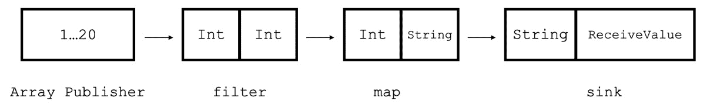

# 第十二章：11 <st c="0">（此处内容为代码，无需翻译）</st>

# 创建 Combine 中的管道 <st c="3">（此处内容为代码，无需翻译）</st>

数据流是编程的核心主题，不仅限于 iOS 开发。<st c="35">实际上，我们有许多解决方案和设计模式来处理数据流管理。</st> <st c="107">确实，直到 1997 年，计算机科学界才引入了响应式编程——一种关注数据流的编程范式，它使</st> <st c="191">（此处内容为代码，无需翻译）</st> <st c="335">（此处内容为代码，无需翻译）</st>

Apple 的响应式编程版本是 Combine，这是一个提供构建应用中数据流基础设施的框架。<st c="359">（此处内容为代码，无需翻译）</st> 它也是 SwiftUI 的基础设施，使其成为一个声明式框架。<st c="492">（此处内容为代码，无需翻译）</st> <st c="554">（此处内容为代码，无需翻译）</st>

在本章中，我们将进行以下操作：<st c="576">（此处内容为代码，无需翻译）</st> <st c="605">（此处内容为代码，无需翻译）</st>

+   讨论在项目中使用 Combine 的原因 <st c="619">（此处内容为代码，无需翻译）</st> <st c="658">（此处内容为代码，无需翻译）</st>

+   复习基本知识 <st c="670">（此处内容为代码，无需翻译）</st> <st c="679">（此处内容为代码，无需翻译）</st>

+   深入了解 Combine <st c="689">（此处内容为代码，无需翻译）</st> <st c="696">（此处内容为代码，无需翻译）</st>

+   通过示例学习 Combine <st c="708">（此处内容为代码，无需翻译）</st> <st c="729">（此处内容为代码，无需翻译）</st>

在我们开始介绍 Combine 框架之前，让我们了解为什么我们应该使用 Combine。<st c="743">（此处内容为代码，无需翻译）</st> <st c="825">（此处内容为代码，无需翻译）</st>

# 技术要求 <st c="837">（此处内容为代码，无需翻译）</st>

对于本章，从 App Store 下载 Xcode 版本 16.0 或更高版本是至关重要的。<st c="860">（此处内容为代码，无需翻译）</st> <st c="944">（此处内容为代码，无需翻译）</st>

确保您正在使用最新的 macOS 版本（Ventura 或更高版本）。<st c="954">只需在 App Store 中搜索 Xcode，选择最新版本，然后继续下载。</st> <st c="1035">打开 Xcode 并完成出现的任何进一步设置说明。</st> <st c="1133">在 Xcode 完全运行后，您</st> <st c="1201">可以开始。</st>

从以下 GitHub 链接下载示例代码：<st c="1257">（此处内容为代码，无需翻译）</st> <st c="1309">[Combine 框架](https://github.com/PacktPublishing/Mastering-iOS-17-Programming-fifth-edition/tree/main/Chapter%2011)</st> <st c="1315">（此处内容为代码，无需翻译）</st>

# 为什么使用 Combine？<st c="1415">（此处内容为代码，无需翻译）</st>

Apple 的 Combine 框架被认为学习曲线陡峭，但这并不是因为它在技术上复杂。<st c="1432">（此处内容为代码，无需翻译）</st> <st c="1458">（此处内容为代码，无需翻译）</st> 这是因为许多开发者不理解为什么、如何以及在哪里应该在他们的应用中使用 Combine。<st c="1548">（此处内容为代码，无需翻译）</st> <st c="1644">（此处内容为代码，无需翻译）</st>

为了回答这些问题，让我们尝试了解 Combine。<st c="1655">（此处内容为代码，无需翻译）</st> Combine 是 Apple 的响应式框架，它提供了一个统一的 API 来处理异步事件和数据流。<st c="1716">（此处内容为代码，无需翻译）</st> <st c="1809">（此处内容为代码，无需翻译）</st>

但为什么我们需要一个响应式框架？<st c="1822">（此处内容为代码，无需翻译）</st> 我们不是已经拥有所有需要的东西了吗？<st c="1864">（此处内容为代码，无需翻译）</st> <st c="1889">（此处内容为代码，无需翻译）</st>

让我们看看我们的 iOS SDK 中有哪些内容：<st c="1897">（此处内容为代码，无需翻译）</st> <st c="1928">（此处内容为代码，无需翻译）</st>

+   **<st c="1936">通知</st>** <st c="1950">允许我们发送任何对象</st> <st c="1976">都可以观察到的消息</st>

+   **<st c="2004">代表</st>** <st c="2014">允许对象响应</st> <st c="2039">由其他对象触发的事件或变化</st> <st c="2074"></st>

+   **<st c="2087">闭包</st>** <st c="2096">是自包含的功能</st> <st c="2129">块，我们可以传递并随时调用</st> <st c="2174"></st>

+   **<st c="2181">键值观察</st>** <st c="2201">(</st>**<st c="2203">KVO</st>**<st c="2206">) 允许我们观察对象属性中的值变化</st> <st c="2243"></st>

<st c="2262">这是一个强大的工具箱！</st> <st c="2290">但是，虽然我们有一个具有许多选项的工具箱，但这些选项也有一些我们需要</st> <st c="2382">讨论的缺点。</st>

<st c="2393">例如，通知可能被认为是一种反模式，主要是因为它们具有隐式通信。</st> <st c="2513">想象一个基于通知的项目，其中对象主要使用通知中心相互通信。</st> <st c="2639">该项目可能需要时间来管理和理解数据流</st> <st c="2705">和依赖关系。</st>

<st c="2722">代表有助于解决这些问题。</st> <st c="2767">但是，当我们想要在不同对象之间连续传递数据时，它们要求我们创建许多协议，并要求每个对象调用另一个对象，这使得理解</st> <st c="2948">正在发生的事情变得困难。</st>

<st c="2965">与代表相比，闭包实际上是一个显著的进步，但它们在嵌套或被其他闭包捕获时也会创建复杂性。</st>

<st c="3106">想象我们有一个带有视图模型的视图控制器。</st> <st c="3160">视图模型有一个</st> `<st c="3181">消息</st>` <st c="3188">属性，我们总是希望 UILabel 的文本与</st> `<st c="3246">消息</st>` <st c="3253">属性值匹配。</st>

<st c="3269">使用 Combine，我们会做</st> <st c="3296">以下事情：</st>

```swift
 messageSubscriber = viewModel.$message
            .sink { [weak self] message in
                self?.label.text = message
            }
```

<st c="3409">`<st c="3414">sink</st>` <st c="3418">操作符接收</st> `<st c="3468">消息</st>` <st c="3475">属性中任何变化的更新，并有一个包含新</st> `<st c="3516">消息</st>` <st c="3523">属性的闭包。</st> <st c="3534">我们直接将新的</st> `<st c="3551">消息</st>` <st c="3558">属性存储在标签的</st> `<st c="3592">文本值</st>` 中。</st>

<st c="3603">这个例子将标签的文本属性绑定到</st> `<st c="3656">viewModel</st>` <st c="3665">文本属性。</st> <st c="3681">不需要定义特定的接口</st> <st c="3728">用于委托、观察、发布通知或定义</st> <st c="3791">闭包。</st>

<st c="3801">Combine 有很多东西可以提供，但在我们深入研究更多实际示例之前，让我们先了解</st> <st c="3907">基础知识。</st>

# <st c="3918">了解基础知识</st>

<st c="3940">作为一个响应式框架，Combine 建立在发布更新（发布者）和订阅更新（</st><st c="4079">订阅者）的组件之上。</st>

<st c="4097">在这之间，我们有操作符，它们可以操作数据并控制流。</st> <st c="4190">让我们从</st> <st c="4240">发布者</st>开始，来了解一下 Combine 的概览。</st>

## <st c="4254">从发布者开始</st>

<st c="4282">解释 Combine 如何工作的最好方法是通过谈论发布者。</st> **<st c="4357">发布者</st>** <st c="4367">是可以随时间传递一系列值的类型。</st> <st c="4427">我们在</st> *<st c="4449">第十章</st>*<st c="4459">中看到了一个例子：</st>

```swift
 URLSession.shared.dataTaskPublisher(for: url)
```

<st c="4507">为了使一个类型成为发布者，它需要遵守</st> `<st c="4565">发布者</st>` <st c="4574">协议，并且</st> `<st c="4589">URLSession</st>` <st c="4599">并不是唯一一个这样做的类型。</st> `<st c="4637">计时器</st>` <st c="4642">和</st> `<st c="4647">通知中心</st>` <st c="4665">也是具有它们自己的发布者的类型：</st>

```swift
 NotificationCenter.default.publisher(for:
  Notification.Name("DataValueChanged"))
```

<st c="4789">或者，它可以是</st> `<st c="4806">计时器</st>` <st c="4811">发布者：</st>

```swift
 let timerPublisher = Timer.publish(every: 1.0, on: .main,
  in: .default)
    .autoconnect()
```

<st c="4909">对于没有发布者的类型，只要它们的属性</st> <st c="4990">符合 KVO（键值观察）规范，我们就可以添加一个发布者：</st>

```swift
 extension UserDefaults {
@objc dynamic var test: Int { return integer(forKey:
  "myProperty") }
}
let userDefaultsPublisher = UserDefaults.standard
  .publisher(for: \. myProperty)
```

<st c="5184">我们还可以创建一个自定义的</st> <st c="5212">发布者</st>，我们将在稍后学习如何</st> <st c="5246">做到这一点。</st> <st c="5264">发布者只有在订阅者想要接收它们时才会发出值。</st> <st c="5335">所以接下来，让我们来认识</st> <st c="5355">订阅者</st>。</st>

## <st c="5370">设置订阅者</st>

<st c="5396">一个</st> `<st c="5484">订阅者</st>` <st c="5494">实例位于流的末尾，并处理传入的值。</st> <st c="5573">Combine 框架有两个内置的订阅者，</st> `<st c="5625">接收器</st>` <st c="5629">和</st> `<st c="5634">分配</st>`<st c="5640">；两者在大多数情况下都简化了 Combine 的使用。</st>

<st c="5690">让我们从</st> <st c="5703">以下内容</st> `<st c="5708">接收器</st>`<st c="5712">开始：</st>

```swift
 import Combine
import Foundation
let subscriber = Timer.publish(every: 1.0, on: .main, in:
  .default)
    .autoconnect()
    .sink( receiveValue: { value in
        print("Received value: \(value)")
    })
DispatchQueue.main.asyncAfter(deadline: .now() + 5) {
    subscriber.cancel()
}
```

<st c="5975">在这个代码示例中，我们创建了一个</st> `<st c="6011">计时器</st>` <st c="6016">发布者，每秒发送一个值。</st> <st c="6060">它发送的值来自</st> `<st c="6091">日期</st>` <st c="6095">类型，但这对我们来说并不重要——</st> `<st c="6136">接收器</st>` <st c="6140">订阅者可以接收任何值。</st>

<st c="6174">接下来，我们在五秒后取消订阅者。</st> <st c="6241">一旦没有订阅者监听，发布者就停止发送值。</st> <st c="6310">这是 Combine 的一个基本</st> <st c="6329">概念，称为</st> **<st c="6359">需求驱动模型</st>**<st c="6378">。使用这种方法，我们确保有效的资源管理，并避免在没有</st> <st c="6478">目标的情况下执行任何工作。</st>

在这个代码示例中，我们将接收到的值打印到了控制台。<st c="6554">然而，在许多情况下，我们希望将其分配给特定的属性。</st> <st c="6623">例如，我们可能下载一个文件并接收其进度的更新。</st> <st c="6698">在这种情况下，我们希望更新一个进度属性来显示</st> <st c="6762">下载状态。</st>

<st c="6778">我们可以使用</st> `<st c="6796">sink</st>` <st c="6800">闭包</st> <st c="6808">来接收值并将其设置到相关属性，但我们有一个更优雅的方法，那就是</st> `<st c="6916">assign</st>` <st c="6922">订阅者：</st>

```swift
 import Combine
import Foundation
class DateContainer {
    var date: Date
    init() { date = Date() }
}
let container = DateContainer()
let cancellable = Timer.publish(every: 1.0, on: .main, in:
  .default)
    .autoconnect()
    .assign(to: \.date, on: container)
DispatchQueue.main.asyncAfter(deadline: .now() + 2) {
    cancellable.cancel()
}
```

<st c="7259">在这个例子中，我们有一个与上一个例子相同的计时器。</st> <st c="7325">然而，这次我们有一个</st> `<st c="7370">DateContainer</st>` <st c="7383">的实例，它有一个</st> `<st c="7391">date</st>` <st c="7395">属性。</st> <st c="7406">流末尾的</st> `<st c="7410">assign</st>` <st c="7416">订阅者确保我们使用</st> `<st c="7538">键路径</st>` <st c="7542">将接收到的值分配给特定的属性。</st>

<st c="7547">在这种情况下，</st> `<st c="7566">assign</st>` <st c="7572">订阅者输入值</st> <st c="7595">必须与发布者</st> <st c="7620">输出值</st>相匹配。

<st c="7634">显然，我们可以使用</st> `<st c="7687">sink</st>` <st c="7691">闭包</st> <st c="7695">来达到相同的结果：</st>

```swift
 .sink( receiveValue: { value in
        container.date = value
    })
```

<st c="7757">然而，使用</st> `<st c="7777">assign</st>` <st c="7783">订阅者要优雅得多，而且不仅仅是语义上的。</st> <st c="7844">使用键路径提高了我们的代码类型安全性，并使其更加声明性和简洁。</st>

<st c="7932">我们已经了解到发布者的输出</st> <st c="7974">应该与</st> <st c="7992">订阅者的输入</st>相匹配。</st> <st c="8012">但如果我们需要执行一些转换和处理才能实现这一点怎么办呢？</st> <st c="8109">这就是为什么我们有</st> <st c="8128">操作符。</st>

## <st c="8142">连接操作符</st>

<st c="8163">Combine 流系列的第三部分是</st> **<st c="8205">操作符</st>**<st c="8213">。操作符接收上游</st> <st c="8242">数据（前一步骤的输出），对其进行处理，并将其发送到下游。</st> <st c="8324">下游意味着下一步——订阅者或</st> <st c="8375">另一个操作符。</st>

<st c="8392">操作符实际上是</st> <st c="8419">帮助我们构建我们称之为</st> **<st c="8455">管道</st>** <st c="8463">或</st> **<st c="8467">Combine 流</st>**<st c="8481">的东西。</st>

<st c="8482">让我们尝试构建一个</st> <st c="8504">简单的流：</st>

```swift
 let numbersPublisher = Array(1...20).publisher
let subscription = numbersPublisher
    .filter { $0 % 2 == 0 }
    .map { "The number is \($0)" }
    .sink(receiveValue: { print($0) })
```

<st c="8691">这个简单的代码示例取了一个介于</st> `<st c="8751">1</st>` <st c="8752">和</st> `<st c="8757">20</st>`<st c="8759">之间的数字数组，使其成为一个使用</st> `<st c="8793">publisher</st>` <st c="8802">变量的发布者。</st>

`<st c="8812">numbersPublisher</st>` <st c="8829">每次从数组中发出一个新值。</st> <st c="8874">该值流向下游的</st> `<st c="8907">filter</st>` <st c="8913">操作符，只有当它为偶数时才会重新发布该值。</st> <st c="8971">过滤后的值移动到</st> `<st c="9003">map</st>` <st c="9006">操作符，它将其转换为字符串消息并再次重新发布。</st>

<st c="9084">在流的末尾，我们有</st> `<st c="9123">sink</st>` <st c="9127">订阅者，它将消息打印到</st> <st c="9168">控制台。</st>

<st c="9180">恭喜！</st> <st c="9198">我们已经创建了我们的第一个管道。</st> <st c="9232">看看</st> *<st c="9240">图 11</st>**<st c="9249">.1</st>*<st c="9251">：</st>



<st c="9325">图 11.1：我们的第一个 Combine 时间线</st>

*<st c="9364">图 11</st>**<st c="9374">.1</st>* <st c="9376">展示了不同的管道操作符，例如</st> `<st c="9425">filter</st>` <st c="9431">和</st> `<st c="9436">map</st>`<st c="9439">。我在这里突出显示了每个操作符的输入和输出。</st> <st c="9504">我们可以看到，一个时间线组件的输出是下一个元素的输入。</st> <st c="9577">。

<st c="9590">这引出了我们还没有讨论过的问题——发布者和订阅者究竟是什么？</st> <st c="9617">它们在内部是如何工作的？</st> <st c="9690">让我们</st> <st c="9723">深入探讨。</st>

# <st c="9738">深入探讨 Combine 组件</st>

<st c="9770">到目前为止，我们在 Combine 中创建了简单的示例</st> <st c="9813">以进行热身。</st> <st c="9837">然而，如果我们想更高级地使用 Combine，我们需要更好地理解</st> <st c="9944">其内部的工作原理。</st>

<st c="9953">我们必须理解的第一件事是 Combine 并不是魔法。</st> <st c="10019">Combine 本身不包含任何复杂的代码。</st> <st c="10073">最终，我们谈论的是一组协议，它帮助我们订阅变化并创建一个更新管道。</st>

<st c="10195">为了深入探讨，我们将回顾不同的协议，并构建我们自己的自定义发布者、操作符和订阅者，以了解内部的工作原理。</st>

<st c="10349">让我们从</st> <st c="10367">发布者开始。</st>

## <st c="10381">创建自定义发布者</st>

<st c="10409">我刚刚提到，Combine 是一组相互通信的协议，发布者是我们要首先</st> <st c="10533">审查的第一个协议。</st>

<st c="10545">让我们看看到目前为止我们对</st> <st c="10588">发布者</st> <st c="10595">了解到了什么：</st>

+   <st c="10602">发布者</st> *<st c="10617">向一个或多个订阅者</st> <st c="10629">发出值</st>

+   <st c="10656">发布者输出类型</st> *<st c="10683">必须与</st>* *<st c="10698">订阅者的输入</st>*

+   <st c="10716">发布者还可以</st> *<st c="10740">传递错误</st>*

<st c="10754">基于此，让我们以我们的</st> `<st c="10785">Int</st>` <st c="10788">数组发布者</st> <st c="10805">示例为例，尝试创建我们自己的发布者，该发布者</st> <st c="10854">传递数字：</st>

```swift
 class CustomNumberPublisher: Publisher {
    typealias <st c="10923">Output</st> = Int
    typealias <st c="10946">Failure</st> = Never
    private let numbers: [Int]
    init(numbers: [Int]) {
        self.numbers = numbers
    }
    func receive<S: Subscriber>(subscriber: S) where
      S.Input == Output, S.Failure == Failure {
        for number in numbers {
            _ = subscriber.receive(number)
        }
        subscriber.receive(completion: .finished)
    }
}
```

<st c="11230">`<st c="11235">CustomNumberPublisher</st>` <st c="11256">类有三个</st> <st c="11273">基本部分：</st>

+   `<st c="11289">输出</st>` <st c="11296">– 这是我们定义发布者输出类型的地方。</st> <st c="11350">在这种情况下，它是一个</st> `<st c="11373">Int</st>` <st c="11376">类型。</st>

+   `<st c="11382">失败</st>` <st c="11390">– 这是我们定义发布者错误类型的地方。</st> <st c="11443">在这种情况下，发布者从不发出</st> <st c="11483">错误。</st>

+   `<st c="11492">receive</st>` <st c="11500">– 这是主要的发布者方法。</st> <st c="11538">Combine 在订阅者订阅发布者时调用</st> `<st c="11556">receive</st>` <st c="11563">方法。</st> <st c="11622">我们可以看到，</st> `<st c="11642">receive</st>` <st c="11649">函数具有订阅者的参数，并且它还验证订阅者输入类型和错误是否与</st> <st c="11763">发布者定义匹配。</st>

<st c="11784">当发布者想要发出新值时，它将调用订阅者的</st> `<st c="11857">receive</st>` <st c="11864">方法，并传递新值。</st> <st c="11892">当发布者完成发送值时，它将调用订阅者的</st> `<st c="11963">receive</st>` <st c="11970">函数，并传递</st> `<st c="11989">completion</st>` <st c="11999">参数。</st>

<st c="12010">让我们看看我们</st> <st c="12028">如何使用</st> `<st c="12032">CustomNumberPublisher</st>`<st c="12053">：</st>

```swift
 let subscriber = CustomNumberPublisher(numbers: [1, 2, 3,
  4, 5])
    .sink { value in
        print(value)
}
```

<st c="12152">运行此代码将在控制台打印</st> `<st c="12182">1,2,3,4,5</st>` <st c="12191">，正如预期的那样。</st>

<st c="12219">`<st c="12224">CustomNumberPublisher</st>` <st c="12245">示例解释了发布者是如何工作的。</st> <st c="12286">但有时，我们希望强制发送值。</st> <st c="12338">我们可能希望在一个现有的项目代码中实现 Combine</st> <st c="12398">或</st> <st c="12402">简化事情。</st>

<st c="12418">因此，让我们认识一个特殊的发布者类型</st> <st c="12459">，称为</st> `<st c="12466">Subject</st>`<st c="12473">。</st>

## <st c="12474">与 Subjects 一起工作</st>

<st c="12496">一个</st> `<st c="12597">send(_:)</st>` <st c="12605">方法。</st>

<st c="12613">让我们从最基本的 Subject——</st> `<st c="12656">PassthroughSubject</st>`<st c="12674">。</st>

### <st c="12675">理解 PassthroughSubject</st>

<st c="12708">让我们看看一个基本的</st> <st c="12734">Subject</st> <st c="12738">使用示例</st>

```swift
 import Combine
let subject = PassthroughSubject<Int, Never>()
let subscriber = subject.sink { value in
    print("Received value: \(value)")
}
subject.send(1)
subject.send(2)
subject.send(3)
```

<st c="12939">代码示例简单且</st> <st c="12970">易于理解。</st> <st c="12987">我们创建了一个</st> `<st c="13000">Subject</st>` <st c="13007">实例（它是一个发布者），其类型为</st> `<st c="13047">PassthroughSubject</st>` <st c="13065">。</st> `<st c="13072">PassthroughSubject</st>` <st c="13090">可以不传递任何值进行初始化，并且第一次打开流是在我们调用其</st> `<st c="13186">send(_:)</st>` <st c="13194">函数之后。</st>

<st c="13204">请注意，我们的</st> `<st c="13221">Subject</st>` <st c="13228">只是发送值</st> <st c="13251">但永远不会关闭流。</st> <st c="13282">然而，我们从自定义发布者实现中学到，有时，发布者会关闭其流并向</st> <st c="13422">订阅者发送完成信号。</st>

<st c="13437">我们还可以使用</st> `<st c="13458">send(_:)</st>` <st c="13466">函数来关闭</st> <st c="13489">Combine 流</st>：

```swift
 subject.send(1)
subject.send(2)
subject.send(completion: .finished)
subject.send(3)
```

<st c="13588">在这个代码示例中，我们使用我们的 Subject 发送两个值——</st> `<st c="13651">1</st>` <st c="13652">和</st> `<st c="13657">2</st>`<st c="13658">。发送这些值后，我们通过调用带有</st> `<st c="13723">send</st>` <st c="13727">函数的</st> `<st c="13746">.</st>``<st c="13747">finished</st>` <st c="13756">参数来关闭流。</st>

<st c="13767">之后，Subject 尝试发送另一个值（</st>`<st c="13821">3</st>`<st c="13823">），但流已经关闭，订阅者将不会</st> <st c="13885">收到它。</st>

<st c="13896">发布者生命周期对于 Combine 方法至关重要，并且适用于</st> <st c="13975">我们的 Subjects。</st>

`<st c="13988">PassthroughSubject</st>` <st c="14007">非常适合向订阅者发送值</st> <st c="14039">。</st> <st c="14056">然而，它并不适合保存状态。</st> <st c="14105">例如，假设我们想要存储当前的认证登录状态或文件下载进度。</st> <st c="14212">一个解决方案是将接收到的值存储在实例变量中。</st> <st c="14281">然而，使用实例变量可能会很麻烦，尤其是当有多个订阅者时。</st>

<st c="14372">另一个选择是使用另一种类型的 Subject</st> <st c="14422">，称为</st> `<st c="14429">CurrentValueSubject</st>`<st c="14448">。</st>

### <st c="14449">使用 CurrentValueSubject Subject 保持状态</st>

与<st c="14499">PassthroughSubject</st><st c="14525">不同，<st c="14527">CurrentValueSubject</st> <st c="14546">非常适合用于保存状态。</st> <st c="14581">它有一个初始状态和一个表示当前值的<st c="14611">value</st> <st c="14616">属性。</st>

让我们看看<st c="14657">CurrentValueSubject</st> <st c="14687">的基本用法示例：</st>

```swift
 import Combine
let subject = CurrentValueSubject<String, Never>("Initial
  Value")
let currentValue = subject.value
print("Current value: \(currentValue)")
let subscriber = subject.sink { value in
    print("Received value: \(value)")
}
subject.send("New Value")
```

<st c="14970">在这个代码示例中，我们创建了一个<st c="15003">CurrentValueSubject</st> <st c="15022">并用一个值（</st>`<st c="15055">"</st>``<st c="15057">Initial Value"</st>`<st c="15071">）初始化它。</st>

然后，我们将 Subject 的当前值打印到控制台，并使用一个简单的<st c="15169">sink</st> <st c="15173">函数订阅它，同时打印每个更新。</st> <st c="15205">as well.</st>

在最后一行，我们使用我们的 Subject 发送一个新的值。</st>

<st c="15270">在这种情况下，控制台将显示以下内容：</st>

```swift
 Current value: Initial Value
Received value: Initial Value
Received value: New Value
```

<st c="15407">乍一看，控制台输出看起来很奇怪。</st> <st c="15457">为什么我们没有使用<st c="15471">Received value: Initial Value</st> <st c="15500">发送它时，会看到这个值？</st>

<st c="15552">答案是，当初始化时，<st c="15572">CurrentValueSubject</st> <st c="15591">已经包含了一个值，当我们第一次订阅它时，我们已经接收到了</st> <st c="15708">当前值。</st>

<st c="15722">这就是为什么<st c="15735">CurrentValueSubject</st> <st c="15754">非常适合状态管理的原因。</st> <st c="15790">这种行为确保了我们的订阅者始终与当前的</st> <st c="15862">Subject 值同步。</st>

`<st c="15876">PassthroughSubject</st>` <st c="15895">没有<st c="15913">value</st> <st c="15918">属性，我们无法读取它的当前值。</st> <st c="15947">然而，它在调用<st c="16036">send(_:)</st> <st c="16044">函数之前不发出其值，在某些情况下这可能是一个优势。</st>

<st c="16088">让我们看看</st> <st c="16099">一个例子：</st>

```swift
 let subject1 = PassthroughSubject<Int, Never>()
let subject2 = PassthroughSubject<Int, Never>()
let subscriber = subject1
    .merge(with: subject2)
    .sink { value in
        print("Transformed value: \(value)")
    }
subject1.send(1)
subject1.send(2)
subject2.send(3)
subject2.send(4)
```

在这个例子中，我们有两个<st c="16379">PassthroughSubject</st> <st c="16409">发布者和 Combine 流中的<st c="16427">merge()</st> <st c="16454">操作符。</st> <st c="16487">merge()</st> <st c="16498">操作符将两个发布者发出的值合并成一个单独的流。</st> <st c="16577">如果其中一个 Subject 发送了一个值，<st c="16619">merge()</st> <st c="16626">操作符就会将其移动到</st> <st c="16650">流的下方。</st>

<st c="16661">因此，在这种情况下，输出将是以下内容：</st>

```swift
 Transformed value: 1
Transformed value: 2
Transformed value: 3
Transformed value: 4
```

`<st c="16794">PassthroughSubject</st>` <st c="16813">可以作为 Combine 管道中的中间步骤，允许我们组合多个发布者，并在它到达订阅者之前执行数据转换。</st> <st c="16982">这是我们不能使用</st> <st c="17013">`<st c="17018">CurrentValueSubject</st>`<st c="17037">`</st> <st c="17038">做到的。</st>

<st c="17038">到目前为止，我们一直使用内置的</st> `<st c="17076">sink</st>` <st c="17080">订阅者</st> <st c="17091">来处理传入的值。</st> <st c="17122">但就像发布者一样，我们也可以创建一个自定义订阅者。</st> <st c="17191">学习如何创建自定义订阅者可以丰富我们对 Combine 的了解。</st> <st c="17269">让我们</st> <st c="17275">深入探讨！</st>

## <st c="17284">创建自定义订阅者</st>

<st c="17313">如果发布者是提供更新的元素，那么订阅者是需求这些更新的元素。</st>

<st c="17417">我们已经理解 Combine 使用的是一个</st> *<st c="17466">供需</st> <st c="17483">模型。</st> <st c="17491">这意味着订阅者需要一个机制来处理和请求</st> <st c="17557">传入的值。</st>

<st c="17573">让我们为</st> `<st c="17603">CustomNumberPublisher</st>`<st c="17624">:</st>

```swift
 class CustomNumberSubscriber: Subscriber {
    typealias Input = Int
    typealias Failure = Never
    func receive(subscription: Subscription) {
        subscription.request(.unlimited)
    }
    func receive(_ input: Int) -> Subscribers.Demand {
        print("Received: \(input)")
        return .unlimited
    }
    func receive(completion: Subscribers.Completion<Never>)
    {
        print("Received completion: \(completion)")
    }
}
```

<st c="18000">订阅者协议</st> <st c="18024">包含发布者对应的类型别名，</st> `<st c="18078">Input</st>` <st c="18083">和</st> `<st c="18088">Failure</st>`<st c="18095">。两者都需要匹配发布者的</st> `<st c="18132">Output</st>` <st c="18138">和</st> `<st c="18143">Failure</st>` <st c="18150">数据类型。</st>

<st c="18162">查看订阅者实现，我们可以看到三个额外的</st> `<st c="18227">接收</st>` <st c="18234">函数，我们将在</st> <st c="18273">下一小节中查看。</st>

### <st c="18290">接收（subscription: Subscription）</st>

`<st c="18326">接收（subscription: Subscription）</st>` <st c="18362">在订阅者成功订阅发布者时被调用。</st> <st c="18392">`<st c="18439">subscription</st>` <st c="18451">对象处理订阅，并且它有一个重要的方法——定义从发布者的需求。</st> <st c="18560">我们通过请求</st> <st c="18585">无限值：</st>

```swift
 subscription.request(.unlimited)
```

<st c="18635">我们还可以限制我们请求的项目数量。</st> <st c="18692">例如，让我们请求最多三个</st> <st c="18738">额外项目：</st>

```swift
 subscription.request(.max(3))
```

<st c="18785">我们也可以完全不请求任何项目：</st>

```swift
 subscription.request(.none)
```

<st c="18850">注意，发布者需要显式调用</st> `<st c="18895">receive(subscription: Subscription)</st>` <st c="18930">方法。</st> <st c="18950">这意味着如果我们构建一个自定义发布者（如</st> *<st c="19008">创建自定义发布者</st>* <st c="19035">部分中所述），我们必须确保我们亲自调用该</st> <st c="19079">函数。</st>

<st c="19098">现在我们已经建立了订阅，我们需要处理传入的值，我们使用</st> `<st c="19208">receive(_input:Int)</st>` <st c="19227">方法来做到这一点。</st>

### <st c="19235">receive(_ input: Int) -> Subscribers.Demand</st>

<st c="19279">如果我们回顾</st> <st c="19295">在</st> `<st c="19303">CustomNumberPublisher</st>` <st c="19324">订阅者中创建的</st> *<st c="19354">创建自定义发布者</st>* <st c="19381">部分，我们可以看到我们的发布者直接调用</st> <st c="19431">订阅者：</st>

```swift
 _ = subscriber.receive(number)
```

<st c="19482">这就是我们需要作为订阅者协议的一部分实现的</st> `<st c="19494">receive(_ input:Int)</st>` <st c="19514">方法。</st> <st c="19579">此方法处理传入的更新，类似于我们在</st> `<st c="19658">sink</st>` <st c="19662">函数（在</st> *<st c="19680">设置订阅者</st>* *<st c="19695">部分）中看到的闭包。</st>

<st c="19715">注意，该</st> `<st c="19732">receive</st>` <st c="19739">函数返回</st> `<st c="19757">Subscribers.Demand</st>`<st c="19775">。这与我们在上一个函数中讨论的相同的需求类型。</st> <st c="19844">当订阅者完成处理输入后，它必须通知发布者它还需要多少项。</st> <st c="19954">请求更多项不会替换订阅者首次向发布者建立订阅时发送的需求。</st> <st c="20105">新的需求请求是一个需要由</st> <st c="20177">发布者处理的附加值。</st>

<st c="20191">查看以下</st> <st c="20204">代码：</st>

```swift
 func receive(subscription: Subscription) {
        subscription.request(.max(2))
    }
    func receive(_ input: Int) -> Subscribers.Demand {
        print("Received: \(input)")
        return .max(3)
    }
```

<st c="20390">让我们尝试跟随这个</st> <st c="20429">代码示例：</st>

+   <st c="20442">订阅者订阅发布者，并调用</st> `<st c="20495">receive(subscription: Subscription)</st>` <st c="20530">函数，返回最大值为</st> `<st c="20574">1</st>`<st c="20575">。总需求现在是</st> <st c="20597">1</st>`<st c="20601">。</st>

+   <st c="20603">发布者向订阅者发出一个值，并调用</st> `<st c="20659">receive(_ input:Int)</st>` <st c="20679">函数，返回最大值为</st> `<st c="20723">3</st>`<st c="20724">。总需求现在是</st> <st c="20746">4</st>`<st c="20750">。</st>

<st c="20752">如前所述，管理订阅者的需求是</st> <st c="20803">发布者的责任。</st> <st c="20837">如果我们创建自定义发布者，我们需要考虑这一点。</st> <st c="20883">。</st>

<st c="20897">既然我们知道如何启动和管理订阅，了解如何</st> <st c="20999">完成它同样重要。</st>

### <st c="21011">receive(completion: Subscribers.Completion<Never>)</st>

<st c="21062">发布者在完成发布时调用</st> <st c="21082">订阅者的</st> `<st c="21100">receive(completion:)</st>` <st c="21120">函数。</st> <st c="21160">这可能是因为发布者没有更新，或者</st> <st c="21217">发生了错误。</st>

<st c="21226">这就是订阅者需要执行清理、更新 UI 或应用程序状态或打印日志的地方，主要是在发生</st> <st c="21344">错误时。</st>

<st c="21357">以下是</st> `<st c="21383">receive(completion:)</st>` <st c="21403">函数的例子：</st>

```swift
 func receive(completion: Subscribers.Completion<Never>) {
    switch completion {
    case .finished:
        print("Subscription completed successfully.")
    case .failure(let error):
        print("Subscription failed with error: \(error)")
    }
}
```

<st c="21633">这是</st> <st c="21663">`receive(completion:)</st>` <st c="21691">函数的基本实现。</st>

<st c="21701">我们现在知道如何创建自定义发布者和自定义订阅者。</st> <st c="21772">现在，让我们看看如何</st> <st c="21794">将它们连接起来。</st>

## <st c="21807">连接自定义发布者和订阅者</st>

<st c="21854">为了完整地了解订阅者和发布者如何协同工作，我们必须回到发布者那里，并响应我们的订阅者</st> <st c="21996">需求请求。</st>

<st c="22012">让我们看看如何在</st> `<st c="22056">发布者</st>` <st c="22063">端实现一个</st> `<st c="22080">接收</st>` <st c="22091">函数的例子：</st>

```swift
 func receive<S: Subscriber>(subscriber: S) where
      S.Input == Output, S.Failure == Failure {
        for number in numbers {
            guard subscriber.receive(number) != .none else
            {
                subscriber.receive(completion: .finished)
                return
            }
        }
        subscriber.receive(completion: .finished)
    }
```

<st c="22356">在代码示例中，只要订阅者继续要求更多更新，发布者就会继续向订阅者发送更多更新。</st> <st c="22485">当订阅者停止要求更多更新时，发布者关闭流并调用订阅者的</st> `<st c="22592">receive(completion:)</st>` <st c="22612">函数。</st>

<st c="22622">在这个阶段，我们应该熟悉</st> <st c="22659">订阅者和发布者如何协同工作。</st> <st c="22711">我们创建了自定义发布者和订阅者并执行了基本订阅。</st> <st c="22791">让我们通过操作符来改进这些订阅，这是我们</st> <st c="22859">几乎未讨论过的。</st>

## <st c="22876">使用操作符</st>

<st c="22899">订阅和发布者</st> <st c="22928">很棒，但 Combine 的真正力量来自于</st> <st c="22976">操作符。</st>

<st c="22991">与订阅和发布者不同，操作符不是协议或实例。</st> <st c="23071">操作符只是发布者的方法，它们将更新重新发布到下游，并创建一系列数据操作链，直到订阅者到达管道的</st> <st c="23226">末端。</st>

运算符帮助我们修改更新、过滤它们、合并它们，并执行许多操作，这使我们能够实现一个理想的结果。

`<st c="23375">Combine 框架</st>` 内置了许多运算符。现在我们只介绍其中的一些，但您可以在 Apple 网站上查看完整列表：[<st c="23529">https://developer.apple.com/documentation/combine/publishers-catch-publisher-operators</st>](https://developer.apple.com/documentation/combine/publishers-catch-publisher-operators)

让我们从一些基本运算符开始。

### 从基本运算符开始

在 Combine 中，运算符最基本的使用案例之一是用于 *<st c="23748">filter</st>* <st c="23754">过滤</st> 发布者提供的更新。

例如，我们可以使用 `<st c="23824">filter</st>` 运算符：

```swift
 let cancellable = (1...10).publisher
    .filter{ $0 % 2 == 0 }
    .sink { value in
        print(value)
    }
```

在这个代码示例中，我们创建了一个发布者，它会从 `<st c="24001">1</st>` 到 `<st c="24006">10</st>` 发出值。`<st c="24014">filter</st>` 运算符确保只有偶数会继续流向下游。这段代码将在控制台打印 `<st c="24108">2</st>`，《st c="24109">4</st>`，《st c="24111">6</st>`，《st c="24112">8</st>` 和 `<st c="24114">10</st>`。

另一个过滤运算符的例子是 `<st c="24186">removeDuplicates</st>`：

```swift
 let cancellable = [1,2,2,3,3,3,4,5].publisher <st c="24251">.removeDuplicates()</st> .sink { value in
    print(value)
}
```

代码示例显示了一个发布者，它会发出重复的值。`<st c="24370">removeDuplicates</st>` 运算符会过滤掉在最后更新中发送的值。控制台将显示以下内容：

```swift
 1
2
3
4
5
```

让我们尝试创建一个自定义运算符来了解运算符是如何在底层工作的。

### 创建自定义运算符

当我们尝试检查 Apple 的头文件中的 `<st c="24644">filter</st>` 运算符时，我们可以看到以下内容：

```swift
 extension Publisher {
…
public func filter(_ isIncluded: @escaping (Self.Output) ->
  Bool) -> Publishers.Filter<Self>
}
```

`<st c="24834">filter()</st>` 是一个接受具有 `<st c="24919">Output</st>` 泛型类型参数的闭包并返回发布者的函数。这个函数扩展了我们在 *<st c="25023">创建</st>* *<st c="25034">自定义发布者</st>* 中讨论的 `<st c="24977">Publisher</st>` 协议。

<st c="25051">这里需要注意的重要事情是，</st> `<st c="25099">过滤器</st>` <st c="25105">函数重新发布值，并允许多个运算符链接在一起以创建复杂的数据</st> <st c="25216">处理管道。</st>

<st c="25236">这与 SwiftUI 中的视图修饰符的工作方式类似 – 它们修改当前视图并返回一个新的</st> <st c="25337">视图。</st>

<st c="25346">要创建我们自己的自定义</st> `<st c="25371">运算符</st>`，让我们尝试做同样的事情并创建一个</st> `<st c="25426">乘法</st>` <st c="25434">运算符。</st> <st c="25445">我们的</st> `<st c="25449">乘法</st>` <st c="25457">运算符接受一个</st> `<st c="25478">Int</st>` <st c="25481">值，并在乘以一个</st> `<st c="25532">特定因子</st>` 的同时重新发布它：</st>

```swift
 extension Publisher where Output == Int {
    func multiply(by factor: Int) -> Publishers.Map<Self,
      Int> {
        return self.map { value in
            return value * factor
        }
    }
}
```

<st c="25705">在我们的代码示例中，我们还扩展了</st> `<st c="25748">发布者</st>` <st c="25757">协议，同时确保</st> `<st c="25786">输出</st>` <st c="25792">类型需要是</st> `<st c="25807">Int</st>`<st c="25813">。</st>

<st c="25814">然后我们创建了一个接受一个因子作为参数并返回一个</st> `<st c="25832">乘法</st>` <st c="25840">函数的新发布者。</st>

<st c="25915">在我们的实现中，我们使用了一个</st> `<st c="25948">map</st>` <st c="25951">运算符来将我们的值转换成一个新的值，这意味着我们需要返回一个</st> `<st c="26032">Map</st>` <st c="26035">发布者。</st> <st c="26047">让我们看看如何使用我们的</st> `<st c="26072">新运算符</st>`：</st>

```swift
 let cancellable = [1, 2, 3, 4, 5].publisher
    .multiply(by: 2)
    .sink { value in
        print("Received value: \(value)")
    }
```

<st c="26199">我们添加了我们的新</st> `<st c="26217">乘法</st>` <st c="26225">运算符到以五个数字数组开始的组合流。</st> <st c="26298">此代码的输出将如下所示：</st>

```swift
 Received value: 2
Received value: 4
Received value: 6
Received value: 8
Received value: 10
```

<st c="26434">我们创建了我们的</st> <st c="26450">第一个运算符！</st>

<st c="26465">然而，如果你像我一样，新地图发布者的返回</st> <st c="26505">可能会让你感到烦恼。</st> <st c="26528">让我们尝试理解为什么会发生这种情况以及我们可以做些什么</st> <st c="26604">来解决这个问题。</st>

### <st c="26613">与 AnyPublisher 一起工作</st>

<st c="26639">我们的直觉告诉我们</st> <st c="26658">，如果</st> `<st c="26667">乘法</st>` <st c="26675">是一个接受</st> `<st c="26706">Int</st>` <st c="26709">类型并返回新值的函数，为什么我们需要使用一个</st> `<st c="26764">Map 发布者</st>`？</st>

<st c="26778">因此，我们需要记住运算符会重新发布我们的值。</st> <st c="26840">函数不返回值，而是返回一个发布新值的发布者。</st> <st c="26929">这可能听起来并不明显，但我们的目标是创建一个发布者链，而乘法，尽管其名称如此，是这个链的一部分。</st>

<st c="27065">因此，我们的解决方案是返回某种类型的</st> *<st c="27111">通用发布者</st>*<st c="27128">，或者在我们 Combine 中所说的 –</st> `<st c="27159">AnyPublisher</st>`<st c="27171">。</st>

`<st c="27172">AnyPublisher</st>` <st c="27185">是一个类型擦除发布者，我们用它来向我们的发布者提供一个更抽象的接口。</st>

<st c="27283">让我们看看我们的</st> `<st c="27298">乘法</st>` <st c="27306">操作符</st> <st c="27315">版本，现在它返回</st> `<st c="27343">AnyPublisher</st>` <st c="27355">而不是</st> `<st c="27363">Publisher.Map</st>`<st c="27380">：</st>

```swift
 extension Publisher where Output == Int {
    func multiply(by factor: Int) -> AnyPublisher<Int,
      Failure> {
        return self.map { value in
            return value * factor
        }
        .eraseToAnyPublisher()
    }
}
```

<st c="27564">在这个代码示例中，我们进行了</st> <st c="27600">两个更改：</st>

+   <st c="27612">我们将函数的返回类型更改为</st> `<st c="27654">AnyPublisher<Int, Failure></st>`<st c="27680">。这样，我们隐藏了实现细节以及我们使用了</st> <st c="27760">Map 发布者</st>的事实。

+   <st c="27774">我们使用</st> `<st c="27814">eraseToAnyPublisher()</st>` <st c="27835">函数擦除了发布者类型，该函数擦除发布者类型并</st> <st c="27882">返回</st> `<st c="27890">AnyPublisher</st>`<st c="27902">。</st>

<st c="27903">乍一看，它似乎</st> `<st c="27935">AnyPublisher</st>` <st c="27947">只是为了语义上的原因。</st> <st c="27984">但当我提到返回 Map 发布者</st> *<st c="28031">让我感到烦恼</st>* <st c="28038">时，并不是因为它看起来不漂亮。</st> <st c="28082">而是因为</st> `<st c="28095">AnyPublisher</st>` <st c="28107">对我们构建</st> <st c="28152">Combine 流的方式有实际的影响。</st>

<st c="28168">一个原因是</st> *<st c="28183">API 设计</st>*<st c="28193">。使用</st> `<st c="28201">AnyPublisher</st>` <st c="28213">允许我们设计一个更灵活和多态的 API 接口。</st> <st c="28281">我们之前版本的</st> `<st c="28309">乘法</st>` <st c="28317">函数返回了一种特定的发布者类型。</st> <st c="28366">返回</st> `<st c="28376">AnyPublisher</st>` <st c="28388">使得将发布者链在一起更容易，因为它们属于同一类型。</st>

<st c="28470">另一个原因是</st> *<st c="28489">解耦</st>* <st c="28499">– 通过返回</st> `<st c="28529">AnyPublisher</st>`<st c="28541">，我们解耦了发布者的实现与其使用。</st> <st c="28607">通过这种方式，我们使代码更加模块化和易于维护。</st>

<st c="28663">The</st> `<st c="28668">filter</st>` <st c="28674">和</st> `<st c="28679">removeDuplicates</st>` <st c="28695">操作符，以及</st> `<st c="28718">map</st>`<st c="28721">，非常适合简化</st> <st c="28749">和操作管道中的值</st> <st c="28773">。</st> <st c="28794">我们还在讨论*<st c="28864">与 Subjects 一起工作</st>* <st c="28885">部分时回顾了</st> `<st c="28815">merge</st>` <st c="28820">操作符。</st> <st c="28895">但是 Combine 提供了更多高级的操作符。</st> <st c="28939">现在让我们回顾一些</st> <st c="28961">它们。</st>

### <st c="28970">探索高级操作符</st>

<st c="28999">让我们面对现实，到目前为止，我们讨论了即使没有 Combine 也容易完成的任务的操作符。</st> <st c="29051">是的，使用</st> `<st c="29127">map</st>` `<st c="29130">和</st> `<st c="29135">filter</st>` `<st c="29141">操作符非常有价值，但它们并不反映 Combine 真正的附加价值。</st>

<st c="29227">Combine 框架的一个目标之一是创建更加复杂和高级的流，这些流在没有它的情况下可能会出错。</st>

<st c="29361">让我们理解我的意思并探索</st> `<st c="29407">zip</st>` `<st c="29410">操作符。</st>`

#### <st c="29420">使用 zip 操作符</st>

<st c="29443">The</st> `<st c="29448">zip</st>` <st c="29451">操作符将来自两个发布者的值组合起来，并且只有在每个发布者都发出其值之后才发出一个元组。</st>

<st c="29557">一旦 zip</st> `<st c="29567">操作符从所有发布者那里收到值，它就会发出一个元组并</st> *<st c="29638">重置</st> <st c="29644">自己。</st> <st c="29653">这意味着它再次等待从所有发布者那里接收值，然后才会发出一个新的元组。</st>

<st c="29745">让我们看看一个简单的</st> `<st c="29765">代码示例：</st>`

```swift
 import Combine
let publisher1 = PassthroughSubject<Int, Never>()
let publisher2 = PassthroughSubject<Int, Never>()
let cancellable = publisher1
    .zip(publisher2)
    .sink { value in
    print("Zipped value: \(value)")
}
publisher1.send(1)  // no output
publisher2.send(10) // output is (1,10)
publisher1.send(2)  // no output
publisher2.send(20) // output is (2,20)
```

<st c="30134">在这个代码示例中，我们使用了两个 Subject</st> <st c="30177">向我们的订阅者发送值。</st> <st c="30212">我们将它们组合在一起并打印</st> <st c="30248">输出。</st>

<st c="30259">我们可以看到，在</st> `<st c="30282">publisher1</st>` <st c="30292">发送一个值之后，流不会继续，而是等待</st> `<st c="30350">publisher2</st>` <st c="30360">发送其值。</st> <st c="30380">只有当</st> `<st c="30391">publisher2</st>` <st c="30401">发送一个值后，流才会继续并打印</st> `<st c="30451">(1,10)</st>` <st c="30457">到控制台。</st> <st c="30474">此时，</st> `<st c="30493">zip</st>` <st c="30496">操作符被重置，并且再次等待两个发布者都</st> <st c="30559">发出值。</st>

<st c="30571">`<st c="30576">zip</st>`</st> <st c="30579">操作符不仅限于两个发布者。</st> <st c="30623">我们还可以使用</st> `<st c="30639">zip</st>` <st c="30642">为三个发布者，并接收一个包含三个元素的元组</st> <st c="30684">。</st>

<st c="30693">`<st c="30698">zip</st>`</st> <st c="30701">操作符属于一组处理多个发布者的组合操作符。</st> <st c="30794">我们已经在</st> `<st c="30813">merge</st>` <st c="30818">操作符下看到了</st> *<st c="30838">与</st>* *<st c="30851">主题</st><st c="30857">一起工作</st> <st c="30860">部分。</st>

<st c="30869">属于这一类别的另一个操作符是</st> `<st c="30920">combineLatest</st>`<st c="30933">。现在让我们来回顾一下</st> <st c="30949">它。</st>

#### <st c="30956">使用 combineLatest 组合多个值</st>

<st c="31002">`<st c="31007">zip</st>`</st> <st c="31010">操作符将多个发布者的输出组合成一个元组。</st> <st c="31070">然而，它每次都等待所有发布者发送值</st> <st c="31122">。</st>

<st c="31132">`<st c="31137">combineLatest</st>`</st> <st c="31150">操作符只等待所有发布者第一次发出值，从这一点开始，每次其中一个发布者发送一个新值时，它都会发出一个新元组</st> <st c="31307">。</st>

<st c="31317">让我们看看</st> <st c="31339">`<st c="31342">combineLatest</st>`</st> <st c="31355">的一个例子：</st>

```swift
 let publisher1 = PassthroughSubject<Int, Never>()
let publisher2 = PassthroughSubject<Int, Never>()
let cancellable = publisher1
    .combineLatest(publisher2)
    .sink { value in
    print("Combined value: \(value)")
}
publisher1.send(1)  // no output
publisher2.send(10) // output will be 1,10
publisher1.send(2) // output will be 2,10
publisher2.send(20) // output will be 2,20
```

在这个代码示例中，我们还有两个<st c="31726">发送值的主题</st> <st c="31774">。</st> <st c="31793">这次，我们使用</st> <st c="31815">它们</st> <st c="31821">结合</st> <st c="31827">使用</st> `<st c="31827">combineLatest</st>`<st c="31840">。</st>

<st c="31841">在</st> `<st c="31848">publisher1</st>` <st c="31858">发送了它的第一个值之后，</st> `<st c="31882">combineLatest</st>` <st c="31895">停止流，因为它等待</st> `<st c="31929">publisher2</st>` <st c="31939">发送一个值。</st>

<st c="31956">一旦</st> `<st c="31962">publisher2</st>` <st c="31972">发送了它的第一个值，</st> `<st c="31996">combineLatest</st>` <st c="32009">会发出一个包含值（</st>`<st c="32040">1,10</st>`<st c="32049">）的元组。</st>

<st c="32052">接下来，</st> `<st c="32059">publisher1</st>` <st c="32069">发送了一个新值——</st> `<st c="32090">2</st>`<st c="32091">。这次，</st> `<st c="32104">combineLatest</st>` <st c="32117">不需要等待</st> `<st c="32135">publisher2</st>` <st c="32145">发送新值，并发出一个新元组——（</st>`<st c="32191">2,10</st>`<st c="32196">）</st>

<st c="32198">每次其中一个发布者发送新值时，都会发出一个新元组的行为使</st> `<st c="32291">combineLatest</st>` <st c="32304">成为处理异步操作的首选操作符。</st>

<st c="32364">想象一下，你有一个由多个来源更新的屏幕，例如实时体育更新的搜索结果屏幕，并且每次我们得到一个新的更新时，我们希望我们的屏幕刷新其 UI 以反映<st c="32569">新的状态。</st>

`<st c="32579">combineLatest</st>` <st c="32593">在这种情况下是理想的，因为它在任何一个发布者发出新值时都会在下游创建一个新的元组。</st>

<st c="32706">我们可以使用更多有用的<st c="32734">操作符；你可以在苹果的网站上找到它们。</st> <st c="32788">然而，将 Combine 应用于我们的项目中的真正挑战是理解如何在现实生活中的用例中实现它们。</st>

# <st c="32916">通过示例学习 Combine</st>

<st c="32954">到目前为止，我们已经讨论了几个 Combine <st c="33002">组件，并通过创建我们的自定义发布者、订阅者和操作符来深入了解 Combine 是如何工作的。</st>

<st c="33135">尽管如此，许多开发者需要帮助将 Combine 框架整合到<st c="33212">现实场景中。</st>

<st c="33232">不同的发布者和操作符在理论上大多是清晰的，但想象它们作为我们项目中使用的中心设计模式的一部分可能会有困难。</st>

<st c="33402">让我们回顾一些示例，以帮助我们了解如何在我们的项目中实现 Combine。</st> <st c="33494">我们将从一个基本的示例开始，该示例在视图模型中管理 UI 状态。</st>

## <st c="33566">在视图模型中管理基于 UIKit 的视图状态</st>

<st c="33614">SwiftUI 视图状态</st> <st c="33634">自然是声明式的。</st> <st c="33648">这意味着我们可以将视图状态，例如项目列表，绑定到 UI 组件，例如一个<st c="33755">`List`</st> <st c="33759">视图。</st> <st c="33766">这是在 SwiftUI 中处理状态的唯一方法。</st>

<st c="33814">然而，在 UIKit 中实现该设计模式需要时间和精力。</st>

<st c="33885">使用 Combine，我们可以创建一个发布者并将我们的表格视图数据源绑定到反映来自<st c="33998">服务器的任何变化。</st>

<st c="34009">以下是一个这样的<st c="34043">视图模型</st>的代码示例：</st>

```swift
 class MyViewModel {
    struct Item: Codable {
        let title: String
        let description: String
    }
    var dataPublisher: AnyPublisher<[Item], Error> {
        return URLSession.shared.dataTaskPublisher(for:
          URL(string: "https://api.example.com/data")!)
            .map { $0.data }
            .decode(type: [Item].self, decoder:
              JSONDecoder())
            .eraseToAnyPublisher()
    }
}
```

我们已经讨论了<st c="34379">`AnyPublisher`</st> <st c="34405">表单，那是一个其用法的好例子。</st> <st c="34470">我们创建了一个以 URL 请求开始的发布者，使用<st c="34552">`map`</st> <st c="34555">操作符提取其数据，并将其解码为 Items 数组。</st> <st c="34605">为了隐藏发布者的实现，我们擦除了`AnyPublisher`的类型。</st> <st c="34677">现在，由于我们有发布者，将视图模型连接到视图控制器变得简单了：</st>

```swift
 viewModel.dataPublisher
            .sink(receiveCompletion: { completion in
            }, receiveValue: { [weak self] data in
                self?.updateTableView(with: data)
            })
            .store(in: &cancellables)
```

<st c="34934">在这个代码示例中，我们订阅了我们的新</st> `<st c="34981">dataPublisher</st>` <st c="34994">并使用</st> `<st c="35026">数据</st>` <st c="35026">更新我们的表格视图。</st>

<st c="35035">为了使我们的项目</st> <st c="35055">更加模块化，我们可以将</st> `<st c="35086">URLSession</st>` `<st c="35101">dataTaskPublisher</st>` <st c="35119">函数移动到它自己的类中，并保持关注点分离原则。</st>

## <st c="35197">从多个来源执行搜索</st>

<st c="35239">iOS 开发中最受欢迎的</st> <st c="35263">用例之一是从服务器和本地数据库执行搜索。</st>

<st c="35355">此类搜索的要求首先是显示来自本地数据存储的结果，然后转到服务器并</st> <st c="35471">返回结果。</st>

<st c="35486">这是一个常见的要求，使用 Combine 也很容易。</st> <st c="35549">让我们看看一个简单的例子</st> <st c="35576">：</st>

```swift
 func searchLocalDatabase(query: String) -> AnyPublisher<[SearchResult], Never> {
    return Just([
        SearchResult(id: 1, title: "Local Result 1"),
        SearchResult(id: 2, title: "Local Result 2")
    ])
    .delay(for: .seconds(1), scheduler: DispatchQueue.main)
    .eraseToAnyPublisher()
}
func searchServer(query: String) ->
  AnyPublisher<[SearchResult], Never> {
    return Future { promise in
        DispatchQueue.global().asyncAfter(deadline: .now()
          + 2) {
            promise(.success([
                SearchResult(id: 3, title: "Server Result
                  1"),
                SearchResult(id: 4, title: "Server Result
                  2")
            ]))
        }
    }
    .eraseToAnyPublisher()
}
var cancellables = Set<AnyCancellable>()
let query = "example"
var totalResults = [SearchResult]()
searchLocalDatabase(query: query)
    .merge(with: searchServer(query: query))
    .sink(receiveCompletion: { _ in }, receiveValue: {
      results in
        totalResults.append(contentsOf: results)
        print("Search results: \(totalResults)")
    })
    .store(in: &cancellables)
```

<st c="36505">在这个代码</st> <st c="36518">示例中，我们执行了</st> <st c="36540">三个</st> <st c="36547">主要步骤：</st>

1.  `<st c="36901">Just</st>` <st c="36905">和</st> `<st c="36910">Future</st>`<st c="36916">。我们可以使用</st> `<st c="36929">Just</st>` <st c="36933">来启动流，而</st> `<st c="36957">Future</st>` <st c="36963">是我们用来执行任务并异步发出值的发布者。</st>

1.  `<st c="37167">合并</st>` <st c="37172">操作符。</st> <st c="37183">记住，当其中一个来源发出新值时，<st c="37201">合并</st> <st c="37206">操作符会发出更新。</st> <st c="37273">我们也可以使用</st> `<st c="37291">combineLatest</st>`<st c="37304">，但</st> `<st c="37310">combineLatest</st>` <st c="37323">在发出组合值之前会等待所有发布者发出值。</st>

1.  `<st c="37510">totalResults</st>` <st c="37522">数组。</st> <st c="37530">我们的数据流不必在这里结束。</st> <st c="37570">我们可以将</st> `<st c="37582">totalResults</st>` <st c="37594">转换为</st> `<st c="37597">CurrentValueSubject</st>` <st c="37616">实例，并将结果传递给视图模型或视图本身。</st> <st c="37688">如果我们使用 SwiftUI，我们可以将</st> `<st c="37732">totalResults</st>` <st c="37744">转换为</st> `<st c="37747">@Published</st>` <st c="37757">变量以自动刷新搜索结果的 UI。</st>

<st c="37814">这里有一个很好的教训，与在我们的项目中使用 Combine 有关。</st> <st c="37849">如果我们为不同的数据源创建发布者并确保它们发出值，那么创建更新管道并将它们连接到项目的其余部分就变得容易了。</st>

<st c="38055">以下示例处理另一个日常用例，即</st> <st c="38122">表单验证。</st>

## <st c="38138">表单验证</st>

<st c="38155">表单是任何面向用户的平台中的常见用例，而不仅仅是 iOS。</st> <st c="38182">创建表单的最基本责任之一是能够验证</st> <st c="38314">它们的输入。</st>

<st c="38327">让我们看看如何使用组合来验证一个简单的</st> <st c="38378">登录表单：</st>

```swift
 struct FormView: View {
    @ObservedObject var viewModel = FormViewModel()
    var body: some View {
        VStack {
            TextField("Username", text:
              $viewModel.username)
              .padding()
             .textFieldStyle(RoundedBorderTextFieldStyle())
            SecureField("Password", text:
              $viewModel.password)
              .padding()
             .textFieldStyle(RoundedBorderTextFieldStyle())
            Button("Login") {
                if viewModel.isFormValid {
                    print("Login successful!")
                } else {
                    print("Please fill in all fields.")
                }
            }
            .padding()
            .disabled(!viewModel.isFormValid)
        }
        .padding()
    }
}
```

<st c="38893">我们的表单包含两个文本字段——</st> `<st c="38930">用户名</st>` <st c="38938">和</st> `<st c="38943">密码</st>`<st c="38951">。我们还有一个附加到视图的视图模型。</st> <st c="39001">视图模型有几个</st> `<st c="39028">@Published</st>` <st c="39038">变量，例如</st> `<st c="39058">用户名</st>`<st c="39066">、</st> `<st c="39068">密码</st>`<st c="39076">和</st> `<st c="39082">isFormValid</st>`<st c="39093">。`<st c="39099">用户名</st>` <st c="39107">和</st> `<st c="39112">密码</st>` <st c="39120">变量连接到视图</st> `<st c="39157">文本字段。</st>

<st c="39169">现在，让我们看看</st> `<st c="39189">FormViewModel</st>` <st c="39202">类：</st>

```swift
 class FormViewModel: ObservableObject {
    @Published var username: String = ""
    @Published var password: String = ""
    @Published var isFormValid: Bool = false
    private var cancellables = Set<AnyCancellable>()
    init() {
        Publishers.combineLatest($username, $password)
            .map { username, password in
                !username.isEmpty && !password.isEmpty
            }
            .assign(to: \.isFormValid, on: self)
            .store(in: &cancellables)
    }
}
```

<st c="39606">当我们初始化视图</st> <st c="39634">模型时</st>，我们基于</st> `<st c="39682">combineLatest</st>` <st c="39695">操作符创建一个组合流来观察</st> `<st c="39731">用户名</st>` <st c="39739">和</st> `<st c="39744">密码</st>` <st c="39752">变量</st>的变化。<st c="39764">`<st c="39768">map</st>` <st c="39771">操作符确保两个变量都不为空，并将结果（</st>`<st c="39851">Bool</st>`<st c="39856">）分配给</st> `<st c="39866">isFormValid</st>` <st c="39877">变量。</st>

<st c="39887">视图观察</st> `<st c="39910">isFormValid</st>` <st c="39921">值，并使用它来打开和关闭</st> `<st c="39968">登录按钮。</st>

<st c="39976">这个流是基本的；我们可以不使用组合来实现相同的结果。</st> <st c="40048">然而，表单在某些时候可能会变得非常复杂。</st> <st c="40102">我们创建的组合管道是更复杂表单的绝佳基础设施。</st>

<st c="40192">即使对于</st> `<st c="40215">用户名</st>` <st c="40223">和</st> `<st c="40228">密码</st>` <st c="40236">的简单规则也可以很容易地使用我们的流来强制执行，就像在这个例子中一样：</st>

```swift
 Publishers.combineLatest($username, $password)
            .map { username, password in
                let isUsernameValid = !username.isEmpty &&
                  username.count >= 6
                let isPasswordValid = !password.isEmpty &&
                  password.count >= 8 && password.contains(
                    where: { $0.isNumber })
                return isUsernameValid && isPasswordValid
            }
            .assign(to: \.isFormValid, on: self)
            .store(in: &cancellables)
```

<st c="40652">在这个代码示例中，我们使用我们的组合流</st> <st c="40701">来强制执行规则——密码需要至少包含一个数字的八个字符，用户名需要至少六个字符。</st> <st c="40834">`<st c="40838">map</st>` <st c="40841">操作符非常适合集中化这个逻辑，输出一个布尔值，并将其分配给</st> `<st c="40941">isFormValid</st>` <st c="40952">值。</st>

# <st c="40959">总结</st>

<st c="40967">Combine 使我们的代码在 SwiftUI 视图之外变得响应式。</st> <st c="41022">它是一个可以帮助我们处理复杂任务，如搜索、网络请求和</st> <st c="41115">状态管理。</st>

<st c="41132">本章回顾了基本 Combine 组件，例如发布者、订阅者和操作符。</st> <st c="41234">我们还深入研究了每个组件的定制版本。</st> <st c="41307">我们学习了如何创建具有数据转换和网络请求的管道。</st> <st c="41385">最后，我们学习了如何将 Combine 应用于常见的</st> <st c="41445">用例。</st>

<st c="41455">到目前为止，我们应该能够开始在现有的</st> <st c="41519">项目中使用 Combine。</st>

<st c="41537">下一章将涉及许多 iOS 开发者感到烦恼的另一个主题——</st> <st c="41620">Core Data。</st>
