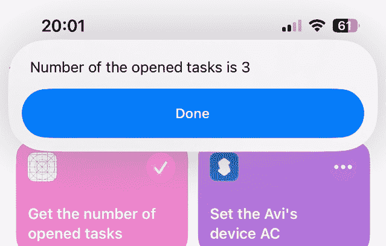

# 第十四章：<st c="0">13</st>

# <st c="3">使用应用程序意图将您的应用程序暴露给 Siri</st>

<st c="46">多年来，应用程序一直独立于系统空间中生活和运行。</st> <st c="115">每个应用程序与其他应用程序完全隔离，没有能力进行通信或</st> <st c="202">暴露数据。</st>

<st c="214">多年来，事情发生了一些变化。</st> <st c="258">应用程序获得的最令人兴奋的</st> <st c="282">特性之一是**<st c="324">应用程序意图**</st>的增强。<st c="335">此时，你应该熟悉应用程序意图——我们在**<st c="413">第五章</st>**中讨论了它们。</st> <st c="422">然而，在 iOS 18 中，应用程序意图变得更加强大，因为它们与 Apple Intelligence 紧密合作，而不仅仅是与 WidgetKit。</st> <st c="558">这就是为什么我们将更详细地介绍应用程序意图。</st>

<st c="618">在本章中，我们将学习以下内容：</st> <st c="656">以下内容：</st>

+   <st c="670">理解应用程序</st> <st c="693">意图概念</st>

+   <st c="708">创建一个简单的</st> <st c="727">应用程序意图</st>

+   <st c="737">使用</st> <st c="768">应用程序实体</st>正式化我们的内容

+   <st c="780">调整我们的应用程序意图以与</st> <st c="820">Apple Intelligence</st>

<st c="838">应用程序意图打开我们应用程序的能力真正令人印象深刻，充满潜力。</st> <st c="928">但首先，让我们了解应用程序</st> <st c="964">意图概念。</st>

# <st c="980">技术要求</st>

<st c="1003">对于本章，从 App Store 下载 Xcode 版本 16.0 或更高版本是必不可少的。</st> <st c="1087">App Store。</st>

<st c="1097">确保您正在使用最新的 macOS 版本（Ventura 或更新版本）。</st> <st c="1178">只需在 App Store 中搜索 Xcode，选择最新版本，然后继续下载。</st> <st c="1276">打开 Xcode 并完成出现的任何进一步设置说明。</st> <st c="1344">在 Xcode 完全运行后，您</st> <st c="1390">就可以开始了。</st>

<st c="1400">本章包含许多代码示例，其中一些可以在以下 GitHub</st> <st c="1494">仓库中找到：</st> [<st c="1505">https://github.com/PacktPublishing/Mastering-iOS-18-Development/tree/main/Chapter%2013</st>](https://github.com/PacktPublishing/Mastering-iOS-18-Development/tree/main/Chapter%2013)<st c="1592">。</st>

<st c="1593">请注意，本章中的一些示例需要在现代设备上运行，例如 iPhone 15 Pro/Max、搭载 M1 及更高版本的 iPad 或 Apple</st> <st c="1735">Silicon Mac。</st>

# <st c="1747">理解应用程序意图概念</st>

<st c="1785">我们第一次遇到应用意图是在</st> *<st c="1822">第一章</st>* <st c="1831">然后是在</st> *<st c="1844">第五章</st>* <st c="1853">，当我们讨论 WidgetKit 时。</st> <st c="1884">但我们真的理解应用意图的概念吗？</st> <st c="1940">让我们简要了解一下苹果在多个应用中，包括</st> <st c="2060">第三方应用中，将人工智能深度集成到系统中的努力。</st>

<st c="2077">为了实现这一集成，我们需要为我们的应用创建一个 API，该 API 可以公开应用的核心内容和主要操作。</st> <st c="2200">例如，一个待办事项应用可以创建一个 API，允许 Siri 或其他系统组件创建一个新任务，完成现有任务，或从核心数据中检索任务列表。</st> <st c="2378">一个配送应用可以有一个 API，返回配送服务是否现在开放或配送到达的时间。</st>

<st c="2515">这个名为 App Intents 的 API，是我们向世界展示我们应用的主要用例和内容的方式。</st> <st c="2620">它是我们用来将应用与苹果智能集成</st> <st c="2694">的工具之一。</st>

<st c="2702">如果这听起来很复杂，你会惊讶于创建应用意图有多么简单。</st> <st c="2789">让我们看看它是如何工作的。</st>

# <st c="2812">创建一个简单的应用意图</st>

<st c="2841">为了演示如何创建</st> <st c="2870">应用意图，让我们想象我们有一个令人惊叹的待办事项列表。</st> <st c="2931">不仅仅是令人惊叹，甚至是强大的！</st> <st c="2962">所以，我们将它称为</st> <st c="2977">它</st> `<st c="2980">MightyTasksList</st>`<st c="2995">。</st>

<st c="2996">我们的</st> `<st c="3001">MightyTasksList</st>` <st c="3016">应用如此出色，以至于我们的用户要求他们在开车时使用它与 Siri 配合。</st> <st c="3106">因此，我们决定创建一个</st> <st c="3134">应用意图。</st>

<st c="3145">为此，我们将打开一个新文件并编写以下代码：</st> <st c="3194">以下代码：</st>

```swift
<st c="3209">import AppIntents</st> struct GetTasksIntent: AppIntent {
    static var title: LocalizedStringResource { "Get the number of opened tasks" }
    @MainActor
    func perform() async throws -> some ProvidesDialog {
        let tasks = TaskManager().tasks <st c="3438">return .result( dialog: "Number of the opened tasks is \(tasks.count)")</st> }
}
```

<st c="3513">这就是全部了吗？</st> <st c="3526">是的！</st> <st c="3531">编写一个简单的</st> <st c="3547">应用意图非常简单。</st> <st c="3578">让我们缩小一下我们</st> <st c="3604">在这里做了什么：</st>

+   <st c="3613">我们导入了</st> `<st c="3630">AppIntents</st>` <st c="3640">框架。</st> <st c="3652">在这种情况下，我们需要这个框架来拥有</st> `<st c="3701">AppIntent</st>` <st c="3710">协议。</st>

+   <st c="3720">我们创建了一个符合</st> `<st c="3781">AppIntent</st>` <st c="3790">协议的</st> `<st c="3734">GetTasksIntent</st>` <st c="3748">结构。</st> <st c="3801">这个结构定义了我们的</st> <st c="3828">意图功能。</st>

+   作为 `<st c="3865">AppIntent</st>` <st c="3874">协议的一部分，我们必须实现两件事。</st> <st c="3915">第一件事是意图的</st> `<st c="3945">标题</st>`<st c="3950">，它出现在快捷方式应用中的意图画廊中（我们将在 *<st c="4041">在快捷方式应用中运行意图</st> <st c="4080">部分中很快就会看到）。</st> <st c="4091">第二件事是我们需要实现的是</st> `<st c="4136">perform()</st>` <st c="4145">函数，这是意图运行时实际执行的代码。</st>

`<st c="4224">The</st>` `<st c="4229">perform()</st>` <st c="4238">函数始终返回一个基于 `<st c="4266">IntentResult</st>` <st c="4278">协议的类型——在这种情况下，我们返回一个符合 `<st c="4370">IntentResult</st>` <st c="4382">协议的 `<st c="4325">ProvidesDialog</st>` <st c="4339">实例，并向用户显示一条消息。</st> <st c="4428">然而，还有其他类型，我们将在接下来的章节中讨论。</st>`

下一个，让我们使用快捷方式应用来运行我们的意图。

## 运行意图的快捷方式应用

<st c="4608">The</st> **<st c="4613">Shortcuts app</st>** <st c="4626">is a powerful automation tool</st> <st c="4656">that allows users to create</st> <st c="4684">shortcuts for routines and actions in their system.</st> <st c="4737">Users can also use the Shortcuts app to create scripting, automation, conditional statements, and</st> <st c="4835">complex logic.</st>

苹果公司在 2017 年收购了快捷方式应用，该应用最初由一家名为 Workflows 的初创公司开发。

当我们构建和运行我们的应用时，iOS 会扫描符合 `<st c="5035">AppIntent</st>` <st c="5044">协议的结构，并将它们添加到快捷方式应用中的 **<st c="5074">快捷方式</st>** **<st c="5083">画廊（</st>*<st c="5114">图 13</st>**<st c="5124">.1</st>**<st c="5126">）：</st>**


[图 13.1：我们的意图在快捷方式应用中显示](https://wiki.example.org/figure_13.1_our_intent_is_shown_in_the_shortcuts_app)

在 *<st c="5265">图 13</st>**<st c="5274">.1</st>**<st c="5276">中，我们可以看到在搜索我们应用的操作时，快捷方式应用中**获取打开任务数量**的快捷方式的意图。然后，我们可以将操作添加为新快捷方式。接下来，让我们看看当我们运行意图时会发生什么（**<st c="5501">图 13</st>**<st c="5511">.2</st>**<st c="5513">）：**



[图 13.2：运行获取打开任务数量的快捷方式](https://wiki.example.org/figure_13.2_running_the_get_number_of_opened_tasks_shortcut)

*<st c="5621">图 13</st>**<st c="5631">.2</st>* <st c="5633">展示了当我们运行我们的应用意图时会发生什么。</st> <st c="5681">我们可以看到我们定义的消息作为</st> `<st c="5730">perform()</st>` <st c="5739">函数的结果。</st>

<st c="5757">做得好！</st> <st c="5769">我们创建了</st> <st c="5779">我们的第一个</st> <st c="5790">应用</st> <st c="5793">意图！</st>

<st c="5801">现在，让我们尝试简化用户的使用，并将快捷方式作为</st> <st c="5870">应用的一部分。</st>

## <st c="5878">创建应用快捷方式</st>

<st c="5903">我们不是让用户根据我们提供的操作（意图）创建快捷方式，而是为他们创建一个可以使用的快捷方式。</st>

<st c="6032">为了做到这一点，我们需要创建一个符合</st> `<st c="6096">AppShortcutsProvider</st>` <st c="6116">协议的结构来创建一个</st> <st c="6138">预配置的快捷方式：</st>

```swift
 import AppIntents <st c="6181">struct AppShortcuts: AppShortcutsProvider {</st> @AppShortcutsBuilder
    static var appShortcuts: [AppShortcut] { <st c="6287">AppShortcut</st>(intent: GetTasksIntent(),
          phrases: ["What is left in \(.applicationName)?", "How many tasks left in \(.applicationName)"], shortTitle: "My tasks", systemImageName: "circle.badge.checkmark")
    }
}
```

<st c="6493">在这段代码中，我们有一个名为</st> `<st c="6532">AppShortcuts</st>`<st c="6544">的结构体。这个结构体有一个变量需要实现——</st>`<st c="6588">appShortcuts</st>`<st c="6601">，它包含一个应用快捷方式的列表。</st>

<st c="6646">在这种情况下，我们创建了一个新的</st> `<st c="6677">AppShortcut</st>` <st c="6688">实例，它包含以下内容：</st>

+   <st c="6726">将要执行的意图。</st> <st c="6761">在这里，我们将前面</st> <st c="6813">部分（</st>`<st c="6822">GetTasksIntent</st>`<st c="6837">）中创建的意图放入。</st>

+   <st c="6840">用户必须对 Siri 说的确切短语。</st> <st c="6888">在我们的例子中，我们添加了两个短语。</st> <st c="6923">请注意，短语必须包含</st> <st c="6964">应用程序名称。</st>

+   <st c="6981">快捷方式的标题和系统图像。</st>

<st c="7026">一旦我们运行了我们的应用，用户不需要使用快捷方式应用来创建快捷方式——快捷方式已经准备好供用户使用 Siri 了。</st>

<st c="7167">现在我们已经创建了第一个意图和快捷方式，让我们深入研究更复杂的</st> <st c="7255">用例。</st>

## <st c="7265">向我们的应用意图添加一个参数</st>

<st c="7302">在</st> *<st c="7310">创建简单的应用意图</st>* <st c="7338">部分，我们</st> <st c="7350">创建了一个</st> `<st c="7361">GetTasksIntent</st>` <st c="7375">结构体，它访问持久存储并返回用户的打开任务数量。</st> <st c="7463">现在，让我们看看我们如何使用</st> `<st c="7497">AppIntents</st>` <st c="7507">框架来创建一个将新任务插入到</st> <st c="7567">系统中的操作。</st>

<st c="7578">我们将打开一个新文件并添加以下代码：</st>

```swift
 struct AddTaskIntent: AppIntent {
    static var title: LocalizedStringResource { "Create new task" } <st c="7727">@Parameter(title: "Title")</st><st c="7753">var title: String</st> @MainActor
    func perform() async throws -> some <st c="7819">ReturnsValue<String></st> {
        TaskManager().addTask(Task(title: title))
        TaskManager().saveTasks() <st c="7910">return .result(value: title)</st> }
}
```

`<st c="7942">AddTaskIntent</st>` <st c="7956">稍微复杂一些，但并不复杂。</st>

<st c="8006">首先，我们创建一个新的</st> `<st c="8033">AddTaskIntent</st>` <st c="8046">，它符合</st> `<st c="8068">AppIntent</st>` <st c="8077">协议，类似于</st> `<st c="8099">GetTasksIntent</st>`<st c="8113">。我们还为 Shortcuts 应用提供了一个可读的标题。</st> <st c="8171">但随后我们看到一个新的变量——一个带有</st> `<st c="8224">@</st>``<st c="8225">Parameter</st>` <st c="8234">属性的标题。</st>

<st c="8245">我们说过应用意图实际上是我们应用的 API。</st> <st c="8305">一些 API 需要输入，所以当添加一个新任务时，标题是我们的 Intent 输入。</st> <st c="8388">我们可以通过 Siri、对话框或甚至另一个 intent 来提供这个输入。</st> <st c="8460">当我们运行</st> `<st c="8472">AddTaskIntent</st>`<st c="8485">时，用户必须为</st> `<st c="8521">任务</st>` <st c="8521">提供一个标题。</st>

<st c="8530">当我们到达</st> `<st c="8549">perform()</st>` <st c="8558">函数时，我们可以看到我们如何使用</st> `<st c="8595">title</st>` <st c="8600">参数将一个新任务插入到持久存储中。</st> <st c="8659">我们还可以看到与</st> `<st c="8700">GetTasksIntent</st>` <st c="8714">示例相比的一个变化，即函数如何返回</st> <st c="8751">一个值。</st>

<st c="8759">在</st> `<st c="8763">GetTasksIntent</st>`<st c="8777">中，我们使用了</st> `<st c="8786">the</st>` `<st c="8791">ProvidesDialog</st>` <st c="8805">协议。</st> <st c="8816">现在，我们使用</st> `<st c="8828">ReturnsValue<String></st>`<st c="8848">，它返回一个值给我们的快捷方式。</st> <st c="8889">我们可以使用返回的值作为其他动作的输入。</st> <st c="8947">例如，在这种情况下，我们可以使用任务标题在 Reminders 应用中创建具有相同标题的提醒，甚至可以用这个标题给其他人发送消息。</st> <st c="9118">这个功能使得 App Intents 和 Shortcuts 应用对高级用户来说非常有用。</st>

<st c="9204">让我们看看它在 Shortcuts 应用中的样子：</st>


<st c="9355">图 13.3：包含两个操作的快捷方式</st>

<st c="9394">在</st> *<st c="9398">图 13</st>**<st c="9407">.3</st>*<st c="9409">中，我们可以看到我们的快捷方式包含两个操作：</st>

1.  <st c="9452">第一个是</st> `<st c="9466">AddTaskIntent</st>` <st c="9479">来自</st> `<st c="9485">我们的应用。</st>

1.  <st c="9493">第二个是，我们的意图的结果是任务标题和来自</st> *<st c="9577">发送消息</st>* <st c="9589">动作的消息应用。</st>

<st c="9619">我们可以看到，可以将操作串联起来，创建</st> `<st c="9650">强大的流。</st>`

<st c="9705">让我们看看当我们运行我们的快捷方式时（</st>*<st c="9755">图 13</st>**<st c="9765">.4</st>*<st c="9767">）的样子：</st>


<st c="9793">图 13.4：运行 AddTaskIntent</st>

*<st c="9827">图 13</st>**<st c="9837">.4</st>* <st c="9839">显示，当我们通过提供标准输入字段来运行我们的快捷方式时，系统会要求输入任务标题。</st> <st c="9948">除了 Siri 集成之外，这是我们免费获得的部分——一个标准用户界面</st> <st c="10040">，为我们处理所有这些。</st>

<st c="10073">然而，我们也可以为快捷方式创建自己的用户界面！</st> <st c="10143">让我们看看如何</st> <st c="10160">做到这一点。</st>

## <st c="10168">返回自定义视图</st>

<st c="10192">我们在前面的部分中添加了两个重要的</st> <st c="10220">意图。</st> <st c="10255">第一个接收一个包含打开任务数量的字符串，第二个是一个应用程序意图，它在持久存储中创建一个新任务。</st>

<st c="10402">让我们讨论另一个用例——获取打开的任务列表。</st> <st c="10468">在这种情况下，我们希望向用户展示一个自定义视图，因为快捷方式和 Siri 无法原生地处理实体列表。</st>

<st c="10610">因此，让我们创建一个</st> <st c="10630">自定义视图：</st>

```swift
 struct MiniTasksList: View {
    let tasks: [Task]
    var body: some View {
        VStack {
            ForEach(tasks) { task in
                TaskView(task: task)
            }
        }
    }
}
```

<st c="10774">我们的代码示例包含一个名为</st> `<st c="10816">MiniTasksList</st>` <st c="10829">的结构，其中包含一个显示</st> `<st c="10867">数组</st>` <st c="10870">的</st> `<st c="10878">TaskView</st>`。</st>

<st c="10879">这里有两个奇怪的地方：</st>

1.  <st c="10912">首先，为什么我们需要创建一个专门的列表视图？</st> <st c="10968">我们不能在我们应用程序中重用已经存在的视图吗？</st>

1.  <st c="11019">其次，为什么我们使用 VStack 而不是列表视图？</st>

<st c="11071">这些论点</st> <st c="11087">通常是有效的。</st> <st c="11107">我们应该尽可能重用我们的代码，并为正确的行为使用正确的视图。</st> <st c="11206">然而，一个限制是我们不能将列表或滚动视图作为我们自定义视图的一部分使用。</st> <st c="11301">我们也不能显示动画或允许用户交互。</st> <st c="11361">如果我们想实现更多功能，我们应该使用应用程序本身或创建额外的应用程序意图来满足</st> <st c="11476">我们的需求。</st>

<st c="11486">现在我们有一个自定义视图，让我们创建一个应用程序意图，使用它：</st>

```swift
 struct <st c="11567">GetTasksListIntent</st>: AppIntent {
    static var title: LocalizedStringResource { "Get my Tasks's List" }
    @MainActor
    func perform() async throws -> some <st c="11715">ShowsSnippetView</st> {
        let tasks = TaskManager().tasks <st c="11766">return .result(view: MiniTasksList(tasks: tasks))</st> }
}
```

<st c="11819">`<st c="11824">GetTasksListIntent</st>` <st c="11842">结构与我们前面部分创建的意图类似。</st> <st c="11925">它也有一个</st> `<st c="11939">标题</st>` <st c="11944">属性和一个</st> `<st c="11960">perform()</st>` <st c="11969">函数。</st>

<st c="11979">这里有两个重要的</st> <st c="12003">变化：</st>

+   <st c="12017">`perform()` 函数的返回类型现在是</st> `<st c="12041">ShowsSnippetView</st>` <st c="12050">。如果我们想将自定义视图作为函数的结果展示，我们使用</st> `<st c="12092">ShowsSnippetView</st>` <st c="12108">。</st> `<st c="12160">我们的函数。</st>

+   <st c="12173">我们返回了一个不同的意图结果，使用了我们创建的</st> `<st c="12221">MiniTasksList</st>` <st c="12234">视图。</st>

<st c="12251">现在，让我们使用快捷方式应用运行我们的意图，看看会发生什么（</st>*<st c="12324">图 13</st>**<st c="12334">.5</st>*<st c="12336">）：</st>


<st c="12487">图 13.5：意图响应中的任务列表</st>

*<st c="12548">图 13</st>**<st c="12558">.5</st>* <st c="12560">显示了</st> `<st c="12567">MiniTasksList</st>` <st c="12580">作为我们的意图响应。</st> `<st c="12605">通过查看列表的显示方式，我们可以理解为什么苹果限制了我们可以如何自定义此视图。</st> `<st c="12710">目标是使我们的视图尽可能简单，并与其他意图保持一致。</st>

<st c="12804">返回一个视图</st> `<st c="12821">是很好的。</st> `<st c="12832">但如果我们想返回一个自定义视图和可以用于其他目的的值呢？</st> `<st c="12925">这是否可能？</st> `<st c="12941">让我们找出是否以及如何</st> `<st c="12970">做到这一点。</st>

## <st c="12978">具有多个结果类型</st>

<st c="13007">想象一下，除了获取任务列表，用户还希望向其快捷方式添加另一个步骤。</st> `<st c="13030">如果任务数量超过，比如说，五个，他们希望打开日历来重新安排</st> `<st c="13207">这一天。</st>

<st c="13215">因此，我们希望显示任务列表，并返回</st> `<st c="13276">它们的数量。</st>

<st c="13291">我们可以通过返回</st> <st c="13320">多种类型来实现这一点：</st>

```swift
 struct GetTasksListIntent: AppIntent {
    static var title: LocalizedStringResource { "Get my Tasks's List" }
    @MainActor
    func perform() async throws ->
      some <st c="13490">ShowsSnippetView & ReturnsValue<Int></st> {
        let tasks = TaskManager().tasks
        return <st c="13568">.result(value: tasks.count,</st>
 <st c="13595">view: MiniTasksList(tasks: tasks))</st> }
}
```

<st c="13634">在我们的代码示例中，</st> `<st c="13656">perform()</st>` <st c="13665">返回两种类型的结果——</st> `<st c="13697">ShowsSnippetView</st>` <st c="13713">用于显示任务列表，以及</st> `<st c="13748">ReturnsValue<Int></st>` <st c="13765">用于在其他意图中使用任务数量。</st>

<st c="13818">我们还修改了函数的</st> `<st c="13835">IntentResult</st>` <st c="13847">返回语句：</st>

```swift
 return .result(value: tasks.count,
      view: MiniTasksList(tasks: tasks))
```

<st c="13953">请注意，我们返回的值需要与我们在函数签名中声明的</st> `<st c="14014">ReturnsValue</st>` <st c="14026">实例相同。</st>

## <st c="14073">添加确认和条件</st>

<st c="14108">让应用执行操作可能导致更复杂的使用场景。</st> <st c="14131">例如，有些情况下我们需要与用户确认特定的操作，比如删除或订购某物。</st> <st c="14176">在其他情况下，我们可能想通知用户我们无法执行该操作，甚至请求</st> <st c="14303">更多信息。</st>

<st c="14419">`<st c="14424">AppIntents</st>` <st c="14434">协议具有创建与用户对话的能力。</st> <st c="14498">这个对话框可以与 Siri 一起使用，使过程感觉</st> <st c="14557">更像对话。</st>

<st c="14577">让我们回到我们的待办事项应用，创建一个允许用户删除所有</st> <st c="14672">其任务的</st> 应用意图：</st>

```swift
 struct DeleteAllTasksIntent: AppIntent {
    static var title: LocalizedStringResource { "Delete all tasks" } <st c="14789">func perform() async throws -> some ProvidesDialog {</st> let taskManager = TaskManager()
        if taskManager.tasks.count == 0 {
            return .result(dialog: .init("Sorry, there are no tasks to delete"))
        } <st c="14979">try await requestConfirmation(actionName: .go,</st>
 <st c="15025">dialog: IntentDialog("Are you sure you want to delete all your tasks?"))</st> TaskManager().deleteAllTasks()
        return .result(dialog: .init("All of your tasks have been deleted."))
    }
}
```

<st c="15203">这个意图比我们之前的例子要复杂一些</st> <st c="15237">并且更智能。</st> <st c="15278">在</st> `<st c="15302">perform()</st>` <st c="15311">函数的开始，我们检查持久存储中是否有任何要删除的任务。</st> <st c="15396">如果没有要删除的任务，我们通过返回一个简单的</st> <st c="15470">文本对话框</st> 来通知用户。

<st c="15482">接下来，由于这是一个破坏性操作，我们希望与用户确认。</st> <st c="15560">因此，我们使用</st> `<st c="15575">requestConfirmation()</st>` <st c="15596">函数。</st> <st c="15607">这个函数显示一个带有给定文本和确认按钮的对话框（</st>*<st c="15684">图 13</st>**<st c="15694">.6</st>*<st c="15696">）：</st>


<st c="15764">图 13.6：一个确认对话框</st>

*<st c="15798">图 13</st>**<st c="15808">.6</st>* <st c="15810">显示了从</st> `<st c="15865">requestConfirmation()</st>` <st c="15886">函数派生出的确认对话框。</st> <st c="15897">注意，我们可以从一组确认按钮标题中选择。</st> <st c="15965">在我们的</st> <st c="15972">情况下，我们选择了</st> **<st c="15994">Go</st>** <st c="15996">标题。</st>

<st c="16003">接下来的步骤很简单：我们执行删除操作，并通知用户该操作已</st> <st c="16103">执行。</st>

<st c="16117">到目前为止，我们的应用意图返回的是原始类型，如字符串和 int。</st> <st c="16198">但是，我们如何处理我们的应用类型呢？</st> <st c="16241">是否可以将它们作为快捷操作链的一部分进行传输？</st> <st c="16312">这就是</st> `<st c="16325">AppEntity</st>` <st c="16334">的作用。</st>

# <st c="16342">使用应用实体正式化我们的内容</st>

<st c="16385">在我们的应用意图中，当我们创建</st> <st c="16421">一个任务时，我们返回了任务的标题的字符串值。</st> <st c="16456">然而，任务不仅仅是标题——它还包含描述、状态、ID 以及许多其他属性。</st> <st c="16478">换句话说，任务不仅仅是一个字符串或一个</st> `<st c="16705">Task</st>`<st c="16709">。</st>

<st c="16710">App Intents 的问题在于，没有其他应用或系统知道</st> `<st c="16788">Task</st>` <st c="16792">结构是什么，因为它是我们应用的内部类型。</st> <st c="16842">我们需要将类型暴露给系统意图世界，以便系统通过</st> <st c="16904">Task</st> <st c="16908">使其成为一个已知类型。</st>

<st c="16936">让我们将其与一个用例联系起来：在应用中创建并打开一个任务。</st> <st c="17011">为了使其模块化，我们希望创建两个意图：创建任务和打开任务。</st> <st c="17098">当我们有了这两个意图时，我们可以在</st> <st c="17149">快捷方式中串联它们。</st>

<st c="17160">让我们首先让系统知道</st> `<st c="17205">Task</st>` <st c="17209">是什么。</st>

## <st c="17213">遵循 AppEntity</st>

<st c="17237">遵循</st> `<st c="17256">AppEntity</st>` <st c="17265">协议</st> <st c="17274">使得应用实体对 Siri 和快捷方式可用。</st> <st c="17327">这意味着当我们的应用意图返回我们的一个实体时，我们可以将其作为输入传递给链中的下一个意图。</st> <st c="17436">在链中。</st>

<st c="17446">让我们看看我们如何将我们的</st> `<st c="17477">Task</st>` <st c="17481">结构转换为</st> <st c="17504">符合</st> <st c="17512">于</st> `<st c="17515">AppEntity</st>`<st c="17524">:</st>

```swift
 struct Task: Identifiable, Codable, <st c="17563">AppEntity</st> {
    static var <st c="17586">typeDisplayRepresentation</st>: TypeDisplayRepresentation { .init(stringLiteral: "Task") }
    init(id: UUID = UUID(), title: String,
      description: String = "") {
        self.id = id
        self.title = title
        self.description = description
    }
    var <st c="17809">displayRepresentation</st>: DisplayRepresentation { DisplayRepresentation(stringLiteral: "title: \(title)") }
    let id: UUID
    @<st c="17929">Property</st>(title: "Title")
    var title: String
    @<st c="17975">Property</st>(title:"Description")
    var description: String
    static var defaultQuery = <st c="18057">TaskQuery</st>()
}
```

<st c="18071">让我们分解</st> <st c="18088">的</st> `<st c="18093">AppEntity</st>` <st c="18102">协议实现：</st>

+   `<st c="18127">typeDisplayRepresentation</st>`<st c="18153">: 我们的实体需要在系统中有一个名称，这样我们就可以在快捷方式应用中显示它。</st> <st c="18245">在这种情况下，我们</st> <st c="18262">返回</st> `<st c="18269">Task</st>`<st c="18273">。</st>

+   `<st c="18274">displayRepresentation</st>`<st c="18296">: 虽然</st> `<st c="18305">typeDisplayRepresentation</st>` <st c="18330">显示了实体类型名称，但</st> `<st c="18363">displayRepresentation</st>` <st c="18384">属性返回实体值表示。</st> <st c="18435">在这种情况下，这是标题值（例如，</st> *<st c="18480">Call</st>* *<st c="18485">my mom</st>*<st c="18491">）。</st>

+   `<st c="18576">@Property</st>` <st c="18585">属性用于实体的一些</st> <st c="18603">属性，我们定义了实体结构以用于</st> <st c="18678">快捷方式应用。</st>

+   `<st c="18692">defaultQuery</st>`<st c="18705">：仅声明我们的应用程序实体是不够的；我们还需要向系统提供一个检索它们的方法。</st> <st c="18816">我们的下一步将是创建系统将用于检索我们的实体的查询。</st>

<st c="18905">现在我们的</st> `<st c="18919">Task</st>` <st c="18923">结构已被系统所知，让我们通过创建</st> `<st c="18999">TaskQuery</st>`<st c="19008">来完成实现：</st>

```swift
 struct TaskQuery: <st c="19029">EntityQuery</st> {
    func entities(for identifiers: [UUID]) async throws -> [Task] {
        return TaskManager().tasks.filter {identifiers.contains($0.id)}
    }
    func suggestedEntities() async throws -> [Task] {
        return TaskManager().tasks
    }
}
```

<st c="19253">在这个代码示例中，我们可以看到</st> `<st c="19296">TaskQuery</st>` <st c="19305">结构符合</st> `<st c="19332">EntityQuery</st>` <st c="19343">协议。</st>

<st c="19353">系统使用第一个函数，</st> `<st c="19390">entities()</st>`<st c="19400">，通过标识符检索实体。</st> <st c="19443">此时，我们到达应用服务（在这个例子中，</st> `<st c="19502">TaskManager</st>`<st c="19513">）以获取、过滤并返回实体数组。</st> <st c="19567">这就是为什么这个函数</st> <st c="19592">是必需的。</st>

<st c="19604">第二个函数（</st>`<st c="19626">suggestedEntities()</st>`<st c="19646">）不是必需的，但它可以帮助系统在我们获取实体列表时向用户展示实体列表。</st> <st c="19765">在获取实体列表的过程中。</st>

<st c="19777">我们知道如何定义</st> `<st c="19800">AppEntity</st>` <st c="19809">及其查询，但我们需要将其连接到应用意图</st> <st c="19881">以了解它们是如何被使用的。</st>

<st c="19920">让我们通过创建一个</st> `<st c="19950">打开一个</st>` `<st c="19957">任务</st>` <st c="19961">意图来做到这一点。</st>

## <st c="19969">创建一个打开任务意图</st>

<st c="20000">创建一个</st> `<st c="20013">打开一个任务</st>` <st c="20024">意图与之前示例中的不同不大。</st> <st c="20053">这次，我们将新的应用意图与我们已经创建的</st> `<st c="20152">AppEntity</st>` <st c="20161">结构</st> 集成：</st>

```swift
 struct OpenTaskIntent: AppIntent {
    static var title: LocalizedStringResource { "Open a task" } <st c="20284">@Parameter(title: "Task")</st>
 <st c="20309">var task: Task?</st>
 <st c="20325">static let openAppWhenRun: Bool = true</st> @MainActor
    func perform() async throws -> some ProvidesDialog{
        let taskToOpen: Task
        if let task {
            taskToOpen = task
        } else {
            taskToOpen = <st c="20503">try await $task.requestDisambiguation(</st>
 <st c="20541">among: TaskManager().tasks,</st>
 <st c="20569">dialog: "What task would like to open?")</st>
 <st c="20610">}</st> Navigator.shared.path.append(taskToOpen)
        return .result(dialog: "Opening your task")
    }
}
```

<st c="20701">我们的</st> `<st c="20706">打开任务</st>` <st c="20717">意图的结构</st> <st c="20738">类似于我们之前的意图示例。</st> <st c="20774">尽管如此，我们还需要讨论一些额外的更改：</st>

+   <st c="20829">我们向</st> `<st c="20853">Task</st>`<st c="20857">中添加了</st> `<st c="20839">@Parameter</st>` <st c="20849">。使用</st> `<st c="20865">@Parameter</st>` <st c="20875">对我们来说并不新鲜——我们在</st> *<st c="20916">在我们的应用意图中添加参数</st>* <st c="20953">部分讨论过。</st> <st c="20962">然而，这次，我们通过</st> `<st c="21002">Task</st>` <st c="21006">结构本身</st> 来实现这一点。</st> <st c="21025">我们可以这样做，因为</st> `<st c="21048">Task</st>` <st c="21052">现在符合</st> `<st c="21069">AppEntity</st>`<st c="21078">。</st>

+   <st c="21079">我们将</st> `<st c="21087">openAppWhenRun</st>` <st c="21101">属性设置为</st> `<st c="21114">true</st>` <st c="21118">，这样我们就可以打开应用并显示</st> `<st c="21158">任务详情</st>`。</st>

+   <st c="21171">如果应用意图没有接收到任务参数，我们可以使用</st> `<st c="21271">requestDisambiguation</st>` <st c="21292">函数让用户选择一个任务。</st> <st c="21303">此函数向用户显示一个包含给定任务列表的对话框，并要求他们选择</st> `<st c="21398">一个任务</st>`。</st>

<st c="21405">在获得任务后，我们调用应用导航器来打开任务详情。</st> <st c="21480">(要了解更多关于 SwiftUI 中导航如何工作，请参阅</st> *<st c="21539">第四章</st>*<st c="21548">.)</st>

<st c="21550">现在，让我们看看运行此意图时会发生什么（</st>*<st c="21604">图 13</st>**<st c="21614">.7</st>*<st c="21616">）：</st>


<st c="21993">图 13.7：打开任务意图</st>

*<st c="22028">图 13</st>**<st c="22038">.7</st>* <st c="22040">显示了在任务参数</st> `<st c="22055">打开任务</st>` <st c="22066">意图</st> `<st c="22123">为 nil</st> 的两个阶段中其外观。</st>

<st c="22130">首先，它打开应用（这是因为我们将</st> `<st c="22182">openAppWhenRun</st>` <st c="22196">变量</st> <st c="22206">设置为</st> `<st c="22209">true</st>`<st c="22213">)。</st>

<st c="22216">然后，它显示一个原生对话框，用户可以从中选择一个任务。</st> <st c="22283">请注意，任务显示名称（</st>`<st c="22318">标题：<任务标题></st>`<st c="22340">）是我们定义在</st> `<st c="22374">displayRepresentation</st>` <st c="22395">变量中，当我们遵循</st> `<st c="22426">AppEntity</st>` <st c="22435">(在</st> *<st c="22444">遵循</st>* *<st c="22458">AppEntity</st>* <st c="22467">部分）。</st>

<st c="22477">稍后，我们将导航到我们的任务详情屏幕，并通过返回一个包含相应信息的对话框来通知用户。</st>

<st c="22595">让用户选择一个任务来显示是一个很好的用例，但这并不是意图真正强大之处。</st> <st c="22624">让我们尝试通过链式连接将</st> `<st c="22735">打开任务</st>` <st c="22746">意图整合到另一个意图中。</st>

<st c="22706">让我们尝试将</st> `<st c="22735">打开任务</st>` <st c="22746">意图通过链式连接整合到另一个意图中。</st>

## <st c="22800">链式连接应用意图</st>

<st c="22821">让我们回到</st> `<st c="22839">AddTaskIntent</st>`<st c="22852">，这是我们</st> <st c="22870">在</st> *<st c="22878">向我们的应用意图添加参数</st>* <st c="22914">部分中创建的，并检查其</st> `<st c="22940">perform()</st>` <st c="22949">函数：</st>

```swift
 func perform() async throws -> some <st c="22996">ReturnsValue<String></st> {
        TaskManager().addTask(Task(title: title))
        TaskManager().saveTasks() <st c="23087">return .result(value: title)</st> }
```

<st c="23117">`<st c="23140">perform()</st>` <st c="23149">函数中的返回类型是</st> `<st c="23162">ReturnsValue<String></st>`<st c="23182">。让我们修改这个函数以返回一个</st> `<st c="23223">Task</st>` <st c="23227">实例：</st>

```swift
 func perform() async throws -> some <st c="23274">ReturnsValue<Task></st> {
        let newTask = Task(title: title)
        TaskManager().addTask(newTask)
        TaskManager().saveTasks()
        return .result(value: <st c="23407">newTask</st>)
    }
```

<st c="23418">在新</st> `<st c="23430">perform()</st>` <st c="23439">函数中，我们只更改了两个部分——返回类型（现在它是</st> `<st c="23504">ReturnsValue<Task></st>`<st c="23522">）和返回语句，现在它返回我们新创建的任务。</st>

<st c="23592">让我们回到 Shortcuts 应用，并将</st> `<st c="23638">AddTaskIntent</st>` <st c="23651">和</st> `<st c="23656">OpenTaskIntent</st>` <st c="23670">一起链式连接（</st>*<st c="23681">图 13</st>**<st c="23691">.8</st>*<st c="23693">）：</st>


<st c="23810">Figure 13.8: A shortcut with Create and Open a task intents</st>

<st c="23869">现在我们有一个快捷方式可以创建一个新任务并在应用中打开它，而且我们用非常</st> <st c="23972">少的代码就做到了！</st>

<st c="23984">但是关于我们定义的作为</st> `<st c="24041">Task</st>` <st c="24045">实体一部分的属性呢？</st> <st c="24054">我们还没有使用它们！</st> <st c="24080">让我们看看如何使用它们与其他意图一起。</st> <st c="24111">其他意图。</st>

## <st c="24125">将我们的意图与其他意图集成</st>

<st c="24165">我们已经看到了如何将添加的任务与</st> `<st c="24214">打开任务</st>` <st c="24225">意图链式连接，但这很简单——我们创建了两个意图，所以它们都知道</st> `<st c="24317">Task</st>` <st c="24321">实体。</st> <st c="24330">但是当我们需要将</st> `<st c="24375">Task</st>` <st c="24379">实体返回给另一个应用开发者的意图时，我们该怎么办呢？</st> <st c="24428">第一个选择是选择其中一个</st> <st c="24465">属性。</st>

### <st c="24480">选择其中一个属性</st>

<st c="24512">关于</st> <st c="24535">`<st c="24542">AppEntity</st>`</st> <st c="24551">的一个好处</st> <st c="24611">是它创建了一个可以在</st> <st c="24611">我们的系统中</st> <st c="24611">利用的结构：</st>

```swift
 struct Task: Identifiable, Codable, <st c="24659">AppEntity</st> { <st c="24671">static</st> <st c="24677">var</st> typeDisplayRepresentation: TypeDisplayRepresentation { .init(stringLiteral: "Task") }
    @<st c="24769">Property</st>(title: "Title")
    var title: String
    @<st c="24815">Property</st>(title:"Description")
    var description: String
```

<st c="24870">我们的</st> `<st c="24875">Task</st>` <st c="24879">结构</st> <st c="24898">包含一个显示名称（</st>`<st c="24915">Task</st>`<st c="24920">）和两个属性 –</st> `<st c="24944">Title</st>` <st c="24949">和</st> `<st c="24954">Description</st>`<st c="24965">。我们可以使用这些属性之一传递给 Shortcuts 应用中的下一个操作。</st> <st c="25040">Shortcuts 应用。</st>

<st c="25054">例如，让我们假设我们想要创建一个新的任务并在消息中发送其标题。</st> <st c="25140">因为我们定义了</st> `<st c="25163">标题</st>` <st c="25168">变量为一个</st> `<st c="25184">AppEntity</st>` <st c="25193">属性</st>`，它将显示在快捷方式应用中（</st>*<st c="25242">图 13</st>**<st c="25252">.9</st>*<st c="25254">）：</st>


<st c="25429">图 13.9：在快捷方式应用中选择标题属性</st>

*<st c="25490">图 13</st>**<st c="25500">.9</st>* <st c="25502">展示了我们如何选择一个 `<st c="25538">AppEntity</st>` <st c="25547">属性</st>` 并将其传递给 *<st c="25577">发送</st>* *<st c="25582">消息</st>* <st c="25589">意图。</st>

传递 `<st c="25609">标题</st>` <st c="25614">是显而易见的——</st>`<st c="25626">标题</st>` <st c="25632">是一个字符串，我们可以轻松地将其用作其他操作的输入。</st> <st c="25702">但如果我们使用</st> `<st c="25722">任务</st>` <st c="25726">作为</st> *<st c="25747">发送消息</st>* <st c="25759">操作的输入呢？</st> <st c="25768">我们在</st> *<st c="25787">链式应用意图</st>* <st c="25807">部分做过这样的事情，但那是在同一应用的两个操作之间。</st> <st c="25869">我们能否在两个</st> <st c="25881">不同的应用</st> <st c="25904">之间共享</st> <st c="25904">一个实体？</st>

<st c="25919">这就是为什么我们有</st> **<st c="25943">Transferable</st>** <st c="25955">协议。</st> <st c="25966">让我们</st> <st c="25972">使用它！</st>

### <st c="25979">使用 Transferable 协议传递整个实体</st>

<st c="26035">让我们暂时跳出</st> <st c="26069">《st c="26072">AppIntent</st>` <st c="26081">》的框架。</st> <st c="26096">共享数据的思想并不局限于</st> `<st c="26139">AppIntent</st>`<st c="26148">——当我们需要共享数据时，我们还有更多的用例。</st> <st c="26201">例如，在视图之间或甚至在不同应用之间拖放是共享数据的一个例子。</st> <st c="26303">另一个例子是在屏幕或应用之间复制粘贴。</st>

在执行共享时，主要挑战是找到每个应用都同意的数据类型。<st c="26448">达成共识。</st>

<st c="26458">为了解决这个共享问题，苹果在 iOS 16 中引入了</st> `<st c="26513">Transferable</st>` <st c="26525">协议，使得在应用或不同</st> <st c="26592">位置之间共享数据变得容易。</st>

`<st c="26603">Transferable` 的主要用途是复制粘贴和拖放，但它也非常适合在 `<st c="26735">快捷方式应用</st>` 中共享应用实体。

<st c="26749">现在，让我们扩展</st> `<st c="26768">任务</st>` <st c="26772">以符合</st> `<st c="26784">Transferable</st>`<st c="26799">:</st>

```swift
 extension Task: <st c="26818">Transferable</st> { <st c="26833">static var transferRepresentation: some TransferRepresentation {</st>
<st c="26897">…</st>
 <st c="26898">}</st> }
```

<st c="26902">《st c="26906">可传输</st>` <st c="26918">协议有一个名为</st> `<st c="26959">transferRepresentation</st>`<st c="26981">的静态变量。这个变量允许我们定义在与其他应用</st> <st c="27086">或视图共享结构时如何表示。</st>

<st c="27095">当使用</st> `<st c="27118">AppIntent</st>` <st c="27127">框架时，我们有几种方法来满足</st> `<st c="27175">transferRepresentation</st>` <st c="27197">变量：</st>

+   `<st c="27207">数据表示</st>`<st c="27226">：我们使用</st> `<st c="27236">数据表示</st>` <st c="27254">将我们的对象转换为 RTF 或 PNG 图像等数据格式</st>

+   `<st c="27321">文件表示</st>`<st c="27340">：我们使用</st> `<st c="27350">文件表示</st>` <st c="27368">将我们的实体导出为文件，例如</st> <st c="27409">PDF</st>

+   `<st c="27414">代理表示</st>`<st c="27434">：这为其他表示都不合适时提供了一个替代方案</st>

<st c="27520">让我们看看我们如何支持 RTF 和</st> <st c="27563">纯文本：</st>

```swift
 extension Task: Transferable {
    static var transferRepresentation: some TransferRepresentation { <st c="27671">DataRepresentation</st>(exportedContentType: .rtf)
        { task in
            task.asRTF()! } <st c="27744">ProxyRepresentation</st>(exporting: \.title)
    }
}
```

<st c="27788">在我们的代码示例中，我们使用了</st> `<st c="27823">数据表示</st>` <st c="27841">和</st> `<st c="27846">代理表示</st>` <st c="27865">来支持 RTF 和</st> <st c="27890">纯文本。</st>

<st c="27901">这意味着当我们尝试</st> <st c="27929">共享</st> `<st c="27943">任务</st>` <st c="27947">实体时，</st> `<st c="27960">可传输</st>` <st c="27972">机制将尝试首先导出 RTF，然后作为后备方案转向</st> `<st c="28028">代理表示</st>` <st c="28047">。</st>

<st c="28062">此外，在快捷方式应用中，用户可以选择他们想要导出到脚本下一步的数据类型（</st>*<st c="28189">图 13</st>**<st c="28199">.10</st>*<st c="28202">）：</st>


<st c="28671">图 13.10：具有不同数据格式的快捷方式应用</st>

*<st c="28730">图 13</st>**<st c="28740">.10</st>* <st c="28743">展示了用户如何选择导出项目的数据格式。</st> <st c="28795">导出项。</st>

<st c="28809">我们在应用实体中支持更多格式和数据类型，用户在使用我们的数据时就有更多的选择。</st>

<st c="28925">在这个阶段，我们知道如何导出</st> <st c="28962">我们的应用意图和实体。</st> <st c="28993">从某种意义上说，系统知道我们的应用能做什么。</st> <st c="29048">让我们看看我们如何更进一步，并调整它以与</st> <st c="29123">苹果智能技术</st>一起工作。</st>

# <st c="29142">调整我们的应用意图以与苹果智能技术一起工作</st>

<st c="29200">在上一章中，我们讨论了</st> <st c="29238">如何利用一些 iOS 的机器学习和人工智能功能。</st> <st c="29320">iOS 18 中在该领域演变的一件事是 Siri。</st> <st c="29383">Siri 现在比以往任何时候都更聪明，并允许用户以</st> <st c="29453">自然语言执行任务。</st>

<st c="29470">例如，用户可以说</st> *<st c="29516">将这张照片发送给我的妈妈</st>* <st c="29541">给 Siri，Siri 可以处理这个任务而无需</st> <st c="29601">确切的短语。</st>

<st c="29614">Siri 的新功能正是我们的应用程序意图所在。</st> <st c="29682">想象一下，在一侧，我们有 Siri，它可以理解用户意图。</st> <st c="29760">在另一侧，我们有我们向系统公开的各种操作。</st> <st c="29816">因此，我们必须找到一种方法来绑定用户意图，正如 Siri 所理解的那样，以及我们的应用程序操作。</st> <st c="29933">这就是我们所说的</st> **<st c="29957">助手模式</st>**<st c="29973">。</st>

## <st c="29974">探索助手模式</st>

<st c="30005">助手模式</st> <st c="30027">的想法简单而先进，充满潜力。</st>

<st c="30077">让我们看看</st> *<st c="30092">图 13</st>**<st c="30101">.11</st>*<st c="30104">，它描述了助手</st> <st c="30136">模式的工作方式：</st>


<st c="30343">图 13.11：助手模式流程</st>

*<st c="30382">图 13</st>**<st c="30392">.11</st>* <st c="30395">描述了助手模式</st> <st c="30431">流程的工作方式：</st>

1.  <st c="30442">用户以</st> *<st c="30471">自由而自然的短语</st>* <st c="30494">请求 Siri 执行特定操作。</st> <st c="30518">在这种情况下，用户说，“将这封邮件发送给我的妻子。”</st>

1.  <st c="30571">Siri 和苹果智能使用复杂的机器学习模型将请求转换为系统预定义的其中一个模式。</st> <st c="30707">在这种情况下，苹果智能将用户请求转换为来自</st> `<st c="30775">createDraft</st>` <st c="30786">模式</st> 的 `<st c="30803">mail</st>` <st c="30807">域。</st>

1.  <st c="30815">现在 Siri 知道所选模式后，它会寻找工具箱中匹配的意图。</st> <st c="30908">我们可以将一些应用程序意图与特定的模式关联起来。</st>

1.  <st c="30972">Siri 启动并执行上一步（工具箱步骤）中做出的相应应用程序意图。</st>

<st c="31099">苹果智能负责理解我们的用户并选择正确的操作，这使得我们的工作作为开发者变得简单——我们只需要确保我们的意图与预定义的</st> <st c="31307">助手模式</st> 匹配。</st>

<st c="31324">让我们看看如何做到这一点。</st> <st c="31351">想象一下</st> <st c="31358">我们有一个我们构建的令人惊叹的邮件客户端应用。</st> <st c="31412">用户可以使用我们的应用浏览他们的电子邮件账户，并创建和发送新的</st> <st c="31488">电子邮件消息。</st>

<st c="31503">该应用的主要操作之一是创建新草稿；因此，我们创建了一个应用意图来暴露</st> <st c="31601">该功能：</st>

```swift
 struct <st c="31625">SendDraftIntent</st>: AppIntent {
    static var title: LocalizedStringResource { "Send new email" }
    @Parameter(title: "Body")
    var body: String? @MainActor
    func perform() async throws -> some ReturnsValue
    <MailDraftEntity>{
        let mailDraftEntity = MailDraftEntity(body: EntityProperty(title: LocalizedStringResource(stringLiteral: body!)))
        ComposeDraftManager.shared.isPresentingCompose = true
        return .result(value: mailDraftEntity)
    }
}
```

<st c="32051">在这个代码示例中，我们创建了一个 `<st c="32087">SendDraftIntent</st>` <st c="32102">应用意图，它接受一个</st> `<st c="32127">body</st>` <st c="32131">变量，创建一个邮件草稿实体，并启动邮件编辑器。</st>

<st c="32202">很棒的是，我们有一个</st> *<st c="32229">创建草稿</st>* <st c="32241">操作，用户可以将它添加到他们的快捷方式中。</st> <st c="32287">然而，Siri 并不在乎我们给我们的应用意图命名为 `<st c="32344">SendDraftIntent</st>` <st c="32359">，我们希望我们的意图成为其苹果智能工具箱的一部分。</st> <st c="32427">换句话说 – 将其添加到</st> <st c="32458">助手模式。</st>

<st c="32475">为此，我们添加了一个特殊的 Swift 宏</st> <st c="32517">，称为</st> `<st c="32524">AssistantIntent(schema:)</st>`<st c="32548">：</st>

```swift
<st c="32550">@AssistantIntent(schema: .mail.createDraft)</st> struct SendDraftIntent: AppIntent {
```

<st c="32629">将 `<st c="32641">AssistantIntent</st>` <st c="32656">Swift 宏与 `<st c="32678">.mail.createDraft</st>` <st c="32695">模式添加到我们的应用意图中，向苹果智能发出信号。</st> <st c="32749">这是一个</st> *<st c="32759">创建草稿</st>* <st c="32771">应用意图，无论我们如何命名它。</st>

<st c="32813">Swift 宏 – 提醒</st>

<st c="32839">Swift 宏</st> <st c="32869">是苹果公司为 iOS 17 新增的一项功能</st>，它可以注入新的属性和函数，并操纵我们的代码以满足各种需求。</st> <st c="32979">要了解更多关于 Swift 宏的信息，请参阅</st> *<st c="33022">第十章</st>*<st c="33032">。</st>

<st c="33033">`.mail.createDraft` <st c="33038">模式</st> <st c="33055">由两部分组成 – 域（</st>`<st c="33099">mail</st>`<st c="33104">）和模式（</st>`<st c="33123">createDraft</st>`<st c="33135">）。</st> <st c="33139">我们可以在 `<st c="33170">mail</st>` <st c="33174">域中使用更多模式，例如</st> `<st c="33191">deleteDraft</st>`<st c="33202">，`<st c="33204">saveDraft</st>`<st c="33213">，或</st> `<st c="33218">replyMail</st>`<st c="33227">。此外，我们还有更多域和模式可以与之配合，例如演示文稿、支付、浏览、照片、书籍等等。</st> <st c="33357">要查看完整的域和模式列表</st> <st c="33377">，请访问苹果公司的文档</st> <st c="33430">，网址为</st> [<st c="33433">https://developer.apple.com/documentation/AppIntents/app-intent-domains</st>](https://developer.apple.com/documentation/AppIntents/app-intent-domains)<st c="33504">。</st>

<st c="33505">那么，这个</st> `<st c="33524">AssistantIntet</st>` <st c="33538">Swift</st> <st c="33545">宏到底做了什么？</st>

<st c="33554">它首先做的是添加一个新的静态变量</st> <st c="33608">名为</st> `<st c="33614">__assistantSchemaIntent</st>`<st c="33637">:</st>

```swift
<st c="33754">createDraft</st> schema. It also ensures that our intent conforms to the <st c="33822">AssistantSchemaIntent</st> protocol, which gives it more capabilities.
			<st c="33887">Once that happens, it’s time to adjust</st> <st c="33926">our code according to what the</st> <st c="33958">compiler requires:</st>

				*   <st c="33976">We can remove the</st> `<st c="33995">title</st>` <st c="34000">static variable, as the App Intents frameworks implement it</st> <st c="34061">for us.</st>
				*   <st c="34068">The same goes for the</st> `<st c="34091">@Parameter</st>` <st c="34101">argument.</st> <st c="34112">The App Intents framework implements that for us, so we can also</st> <st c="34177">remove that.</st>
				*   <st c="34189">We must add more properties to our app intent that are part of the</st> `<st c="34257">createDraft</st>` <st c="34268">assistant schema –</st> `<st c="34288">account</st>`<st c="34295">,</st> `<st c="34297">attachments</st>`<st c="34308">,</st> `<st c="34310">to</st>`<st c="34312">,</st> `<st c="34314">cc</st>`<st c="34316">,</st> `<st c="34318">bcc</st>`<st c="34321">,</st> <st c="34323">and</st> `<st c="34327">subject</st>`<st c="34334">.</st>

			<st c="34335">Our new modified</st> `<st c="34353">SendDraftIntent</st>` <st c="34368">now looks</st> <st c="34379">like this:</st>

```

<st c="34389">@AssistantIntent(schema: .mail.createDraft)</st> struct SendDraftIntent: AppIntent { <st c="34470">var account: MailAccountEntity?</st>

<st c="34501">var attachments: [IntentFile]</st>

<st c="34531">var to: [IntentPerson]</st>

<st c="34554">var cc: [IntentPerson]</st>

<st c="34577">var bcc: [IntentPerson]</st>

<st c="34601">var subject: String?</st> var body: String? @MainActor

    func perform() async throws -> some ReturnsValue

    <MailDraftEntity>{

        let mailDraftEntity = MailDraftEntity(body:

        EntityProperty(title: LocalizedStringResource

        (stringLiteral: body!)))

        ComposeDraftManager.shared.isPresentingCompose =

        true

        return .result(value: mailDraftEntity)

    }

```swift

			<st c="34929">In this code example, we can see the new modified version of the</st> `<st c="34995">SendDraftIntent</st>` <st c="35010">struct.</st> <st c="35019">The new properties, such as</st> `<st c="35047">attachments</st>`<st c="35058">,</st> `<st c="35060">to</st>`<st c="35062">,</st> `<st c="35064">cc</st>`<st c="35066">, and</st> `<st c="35072">bcc</st>`<st c="35075">, have particular types, such as</st> `<st c="35108">IntentFile</st>` <st c="35118">and</st> `<st c="35123">IntentPerson</st>`<st c="35135">. The</st> `<st c="35141">AppIntent</st>` <st c="35150">framework uses this type to identify people and files and have a clear interface that the system can work with.</st> <st c="35263">Besides adding them to the</st> `<st c="35290">SendDraftIntent</st>` <st c="35305">struct, we don’t need to do anything with them except use them in our</st> `<st c="35376">perform()</st>` <st c="35385">function.</st>
			<st c="35395">When we look at the code, one question arises: How do we know what properties to add for each domain</st> <st c="35497">and schema?</st>
			<st c="35508">At this time of writing, there is clear documentation of what properties each schema requires.</st> <st c="35604">However, adding the</st> `<st c="35624">AssistantIntent</st>` <st c="35639">Swift macro and building the project creates new errors that provide information about the</st> <st c="35731">missing information.</st>
			<st c="35751">One exception, though, is the</st> `<st c="35782">account</st>` <st c="35789">property, which requires</st> <st c="35814">us to declare an</st> `<st c="35832">AssistantEntity</st>`<st c="35847">-based struct.</st> <st c="35863">Let’s</st> <st c="35869">discuss it.</st>
			<st c="35880">Creating AssistantEntity</st>
			<st c="35905">When we discussed</st> `<st c="35924">SendDraftIntent</st>`<st c="35939">, we reviewed</st> <st c="35952">several properties, such as</st> `<st c="35981">attachments</st>`<st c="35992">,</st> `<st c="35994">to</st>`<st c="35996">, and</st> `<st c="36002">bcc</st>`<st c="36005">. We saw that for each one, the</st> `<st c="36037">AppIntents</st>` <st c="36047">framework provides a dedicated type, such as</st> `<st c="36093">IntentPerson</st>` <st c="36105">and</st> `<st c="36110">IntentFile</st>`<st c="36120">.</st>
			<st c="36121">The case of the</st> `<st c="36138">account</st>` <st c="36145">property is a little</st> <st c="36167">bit different:</st>

```

<st c="36213">MailAccountEntity</st> 不是 `<st c="36264">AppIntent</st>` 的框架的一部分——它是一个我们必须满足 Assistant Schema 要求的自定义类型，类似于我们在 `<st c="36376">SendDraftIntent</st>` 中所做的那样。让我们看看如何实现它：

```swift
 @AssistantEntity(schema: .mail.account)
struct MailAccountEntity {
    let id = UUID()
    var emailAddress: String
    var name: String
    static var defaultQuery = AccountQuery()
    struct AccountQuery:EntityStringQuery {
        func entities(matching string: String)
          async throws -> [MailAccountEntity] {
            []
          }
        init() {}
        func entities(for identifiers: [MailAccountEntity.ID])
          async throws -> [MailAccountEntity] {
            []
        }
    }
    var displayRepresentation: DisplayRepresentation
      { DisplayRepresentation(stringLiteral: name) }
}
```

            在这个例子中，我们可以看到我们的 `<st c="36919">In this example, we can see that our</st>` `<st c="36957">MailAccountEntity</st>` <st c="36974">struct 有一个名为</st> `<st c="37006">@AssistantEntity(schema: .mail.account)</st>`<st c="37045"> 的 Swift 宏。这个宏使得我们的实体符合 `<st c="37086">AssistantSchemaEntity</st>` <st c="37107">，并要求结构体实现重要的属性，例如</st> `<st c="37175">emailAddress</st>` <st c="37187">和</st> `<st c="37192">name</st>`<st c="37196">。</st>

            <st c="37197">Swift 宏还要求我们添加一个默认查询，以便在需要时帮助系统检索和定位账户</st> <st c="37299">when needed.</st>

            我们需要实现的第二个实体是 `<st c="37311">The second entity</st>` <st c="37329">we need to implement</st> <st c="37351">is</st> `<st c="37354">MailDraftEntity</st>`<st c="37369">:</st>

```swift
 @AssistantEntity(schema: .mail.draft)
struct MailDraftEntity {
    static var defaultQuery = Query()
    struct Query: EntityStringQuery {
        init() {}
        func entities(for identifiers: [MailDraftEntity.ID])
          async throws -> [MailDraftEntity] { [] }
        func entities(matching string: String)
          async throws -> [MailDraftEntity] { [] }
    }
    var displayRepresentation: DisplayRepresentation
      { DisplayRepresentation(stringLiteral: "\(subject ?? "")") }
    let id = UUID()
    var to: [IntentPerson]
    var cc: [IntentPerson]
    var bcc: [IntentPerson]
    var subject: String? var body: String? var attachments: [IntentFile]
    var account: MailAccountEntity
}
```

            `<st c="37986">MailDraftEntity</st>` <st c="38002">包含类似于</st> `<st c="38040">SendDraftIntent</st>`<st c="38055"> 的属性。这是因为它是 `<st c="38095">SendDraftIntent</st>` `<st c="38110">perform()</st>` <st c="38120">函数的结果，Siri 可以用它将信息链式连接到其工具箱中的其他操作。</st>

            <st c="38208">添加 `<st c="38221">MailDraftEntity</st>` <st c="38236">和</st> `<st c="38241">MailAccountEntity</st>` <st c="38258">可能会很烦人——它要求我们调整我们的信息以适应特定的接口。</st> <st c="38343">然而，这样做使得我们的 Siri 集成无懈可击且有效。</st>

            <st c="38413">一旦我们设置好一切</st> <st c="38437">set, the user can see a photo and say something like, “Email this photo using MyMailComposer app,” and Siri will launch our app with a</st> <st c="38573">new draft.</st>

            <st c="38583">关于本节代码片段的重要免责声明</st>

            <st c="38647">苹果智能</st> <st c="38666">在撰写本书时尚未推出。</st> <st c="38732">这意味着代码已成功编译，但尚未测试与苹果智能兼容。</st> <st c="38839">当苹果智能到达您的地区时，您可能需要调整代码，以便它能够按预期与 Siri 协同工作。</st> <st c="38969">。</st>

            如苹果公司一位高级经理曾说过，我们应该将我们所有的应用操作视为应用意图。<st c="39088">这种做法为我们</st><st c="39132">提供了与我们的</st> <st c="39158">应用互动的无限可能性。</st>

            <st c="39172">总结</st>

            <st c="39180">这是一个令人兴奋的章节！</st> <st c="39211">这不仅是因为应用意图是一个非常令人兴奋的话题，而且还因为这是我们第一次真正将我们的代码与苹果最重要的</st> <st c="39369">技术之一集成。</st>

            <st c="39394">在本章中，我们讨论了应用意图的概念，创建了一个具有不同用例的简单应用意图，使用应用实体正式化我们的内容，甚至调整它们以与苹果智能协同工作。</st> <st c="39606">现在，我们应该准备好在</st> <st c="39661">短时间内将 Siri 引入我们的应用！</st>

            <st c="39669">下一章将从不同的角度审视我们的应用——</st> <st c="39735">质量。</st>

```swift

```
