# <st c="0">14</st>

# <st c="3">使用 Swift Testing 提升应用质量</st>

<st c="48">为什么测试是编程书籍的一部分呢？</st> <st c="87">测试不是</st> **<st c="113">质量保证</st>** <st c="130">(</st>**<st c="132">QA</st>**<st c="134">)** <st c="137">团队职责的一部分吗？</st>

<st c="150">你很快会发现，测试是我们作为 iOS 开发者开发周期和文化的一部分。</st> <st c="255">许多开发者认为测试是一项重要的任务，但他们没有时间去做。</st> <st c="335">不幸的是，他们最终会因 bug 和</st> <st c="389">长久的重构而付出代价。</st>

<st c="404">在本章中，我们将做以下事情：</st>

+   <st c="447">理解测试的重要性</st>

+   <st c="484">学习 Xcode 的测试</st> <st c="511">历史</st>

+   <st c="519">探索 Swift Testing</st> <st c="546">框架的基本知识</st>

+   <st c="562">了解如何使用套件、测试计划和</st> <st c="619">方案</st>来管理测试

+   <st c="630">学习可以帮助我们维护</st> <st c="668">测试</st>的技巧

<st c="677">在本章结束时，你将准备好利用 Swift Testing 来提升你的测试技能。</st>

<st c="775">在我们回答</st> *<st c="797">如何</st>* <st c="800">问题之前，让我们先从</st> <st c="828">为什么</st> <st c="832">开始。</st>

# <st c="836">技术要求</st>

<st c="859">你必须从 Apple 的</st> <st c="936">App Store</st>下载 16.0 或更高版本的 Xcode，用于本章。</st>

<st c="946">你还需要运行最新版本的 macOS（Ventura 或更高版本）。</st> <st c="1019">在 App Store 中搜索</st> `<st c="1030">Xcode</st>` <st c="1035">，选择并下载最新版本。</st> <st c="1098">启动 Xcode，并遵循系统可能提示的任何附加安装说明。</st> <st c="1202">一旦 Xcode 完全启动，你就可以开始了。</st>

<st c="1252">本章包含许多代码示例，其中一些可以在以下 GitHub</st> <st c="1346">仓库</st>中找到：[<st c="1358">https://github.com/PacktPublishing/Mastering-iOS-18-Development/tree/main/Chapter14</st>](https://github.com/PacktPublishing/Mastering-iOS-18-Development/tree/main/Chapter14)

# <st c="1441">理解测试的重要性</st>

<st c="1481">对于许多开发者来说，测试</st> <st c="1510">是他们编写代码时必须处理的一个不必要的开销。</st>

<st c="1576">这种思维方式在某种程度上是可以理解的。</st> <st c="1625">我们已经完成了代码的编写，构建了一个应用程序，并看到一切按预期运行。</st> <st c="1723">我们不需要移动到下一个任务，我们需要更改目标，添加一个测试函数，只是为了再次确认它运行良好。</st> <st c="1857">为什么要在上面浪费时间</st> <st c="1876">呢？</st>

<st c="1882">此外，在许多情况下，编写这些测试函数需要大量的工作。</st> <st c="1954">我们如何测试 SwiftUI 视图或网络调用呢？</st> <st c="2004">这甚至意味着什么？</st>

<st c="2027">这些总结说明了为什么测试不是一种常见的做法，或者至少</st> <st c="2098">不够。</st>

<st c="2109">这个问题的根源在于开发者如何处理测试和编写代码。</st> <st c="2199">测试不仅仅是检查我们的函数是否按预期运行；它还涉及到代码结构、关注点的分离、编写过程、工作文化和我们对待日常工作的方式。</st> <st c="2378">我们的日常工作的处理方式。</st>

<st c="2394">让我们看看</st> <st c="2413">以下函数：</st>

```swift
 func canUserAddTask(to list: List, user: User) -> Bool {
    if list.isLocked {
        return false
    }
    if !list.allowedRoles.contains(user.role) {
        return false
    }
    return [.privateList,
      .publicList].contains(list.sharingAttribute)
}
```

<st c="2651">这个函数检查用户是否可以根据标准，如权限、列表类型和状态，将任务添加到特定的列表中。</st> <st c="2785">现在，假设我们需要确保这个函数能够正常工作。</st> <st c="2851">我们如何做到这一点呢？</st> <st c="2871">我们需要在不同的状态下运行我们的应用程序来查看</st> <st c="2924">结果吗？</st>

<st c="2936">我们都知道，确保我们的代码能够正确运行是我们开发过程的一部分。</st> <st c="3023">这是一个经典的例子，说明了编写测试用例和在应用程序的不同状态下运行可以简化我们的开发过程。</st> <st c="3148">当我们添加未来的任务时，我们理解测试为什么如此重要，比如</st> <st c="3214">重构和</st> <st c="3239">错误修复。</st>

<st c="3249">在我们深入研究 Swift 测试之前，让我们了解 Apple 平台上的测试历史。</st>

# <st c="3342">学习 Apple 平台上的测试历史</st>

<st c="3390">随着 Apple 开发工具</st> <st c="3417">多年的发展，测试工具</st> <st c="3459">也得到了</st> <st c="3465">发展。</st>

<st c="3480">第一个为 Apple 平台定制的测试框架</st> <st c="3518">是</st> **<st c="3543">SenTestingKit</st>**<st c="3556">，基于 OCUnit 开源框架。</st>

<st c="3600">SenTestingKit 于 2005 年推出，并集成到 Xcode 中，为编写和运行</st> <st c="3719">Objective-C 代码</st>提供了基本功能。

<st c="3736">2013 年，Apple 引入了</st> **<st c="3763">XCTest</st>**<st c="3769">，它采用了更现代的测试方法，具有更好的 Xcode 集成以及对 Objective-C</st> <st c="3876">和 Swift</st>的支持。

<st c="3886">让我们看看</st> *<st c="3922">理解测试的重要性</st>* <st c="3961">部分中的代码示例，并看看一个</st> <st c="3995">XCTest 测试</st>的例子：

```swift
 class CanUserAddTaskTests: XCTestCase {
    func testCanAddTaskWhenListIsLocked() {
        let list = List(id: "1", isLocked: true,
          sharingAttribute: .privateList, allowedRoles:
          [.admin, .member])
        let user = User(role: .admin)
        XCTAssertFalse(canUserAddTask(to: list, user:
          user), "User should not be able to add a task
          when the list is locked")
    }
}
```

<st c="4345">在这个用户示例中，我们看到一个简单的</st> <st c="4383">测试函数，该函数测试用户是否可以将任务添加到受保护的列表中。</st>

<st c="4456">有几件事情</st> <st c="4480">值得注意：</st>

+   <st c="4493">测试函数是</st> `<st c="4527">CanUserAddTaskTests</st>` <st c="4546">类的一部分，继承自</st> `<st c="4573">XCTestCase</st>` <st c="4583">超类。</st>

+   <st c="4595">测试函数名称以</st> `<st c="4635">test</st>` <st c="4639">短语开头。</st> <st c="4648">该</st> `<st c="4652">test</st>` <st c="4656">短语表示 XCTest 框架，这是一个</st> <st c="4707">测试函数。</st>

+   <st c="4724">测试验证表达式是通过一个特定的函数（</st>`<st c="4788">XCTAssertFalse</st>`<st c="4803">）完成的，该函数检查特定的表达式是否</st> `<st c="4853">为假</st>`<st c="4858">。我们有一系列用于</st> <st c="4892">各种条件的函数。</st>

<st c="4911">虽然这些都是我们在 Xcode 中编写测试的一部分，但它们与现代 Swift/SwiftUI 方法不匹配——使用结构体、宏以及更简单和通用的 Swift 函数。</st> <st c="5106">这就是 Swift 测试出现的原因。</st>

<st c="5156">让我们一起来探索 Swift</st> <st c="5177">测试。</st>

# <st c="5194">探索 Swift 测试基础</st>

<st c="5229">我们将从将 Swift 测试框架添加到现有项目</st> <st c="5255">开始我们的旅程。</st>

<st c="5317">从 Xcode 的菜单中选择</st> **<st c="5325">文件</st>** <st c="5329">|</st> **<st c="5332">新建</st>** <st c="5335">|</st> **<st c="5338">目标</st>** <st c="5344">来完成此操作。</st> <st c="5379">然后，在模板选择器中，找到</st> **<st c="5417">单元测试包</st>** <st c="5436">并选择它（</st>*<st c="5452">图 14</st>**<st c="5462">.1</st>*<st c="5464">）：</st>

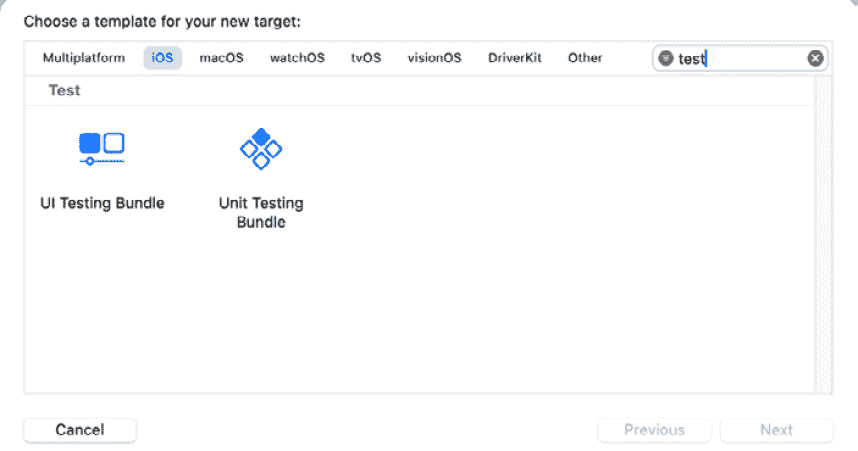

<st c="5636">图 14.1：新的目标模板选择器</st>

*<st c="5680">图 14</st>**<st c="5690">.1</st>* <st c="5692">显示了 Xcode 中的模板选择器窗口。</st> <st c="5737">在执行测试搜索时，**<st c="5775">单元测试包</st>** <st c="5794">很容易找到。</st> <st c="5814">请注意，我们还有一个</st> **<st c="5839">UI 测试包</st>** <st c="5856">模板。</st> <st c="5867">然而，在 Swift 测试中目前还不支持 UI 测试，所以现在我们将专注于</st> <st c="5947">单元测试。</st>

<st c="5960">我们如何进行 UI 测试？</st>

<st c="5991">UI 测试，也称为端到端测试，是应用测试中的一个不同</st> <st c="6014">主题。</st> <st c="6052">它也被我们称为“黑盒”测试，意味着测试函数不知道内部代码，只知道用户界面组件。</st> <st c="6075">进行 UI 测试的基本方法是使用 XCTest，苹果之前使用的测试框架。</st> <st c="6219">然而，有一些服务提供更简单或跨平台的远程运行 UI</st> <st c="6394">测试的方法。</st>

<st c="6409">一旦你选择了</st> **<st c="6430">单元测试包</st>** <st c="6449">模板，点击</st> **<st c="6464">下一步</st>**<st c="6468">。现在，我们需要填写一些关于我们新测试目标（</st>*<st c="6537">图 14</st>**<st c="6547">.2</st>*<st c="6549">）的详细信息：</st>

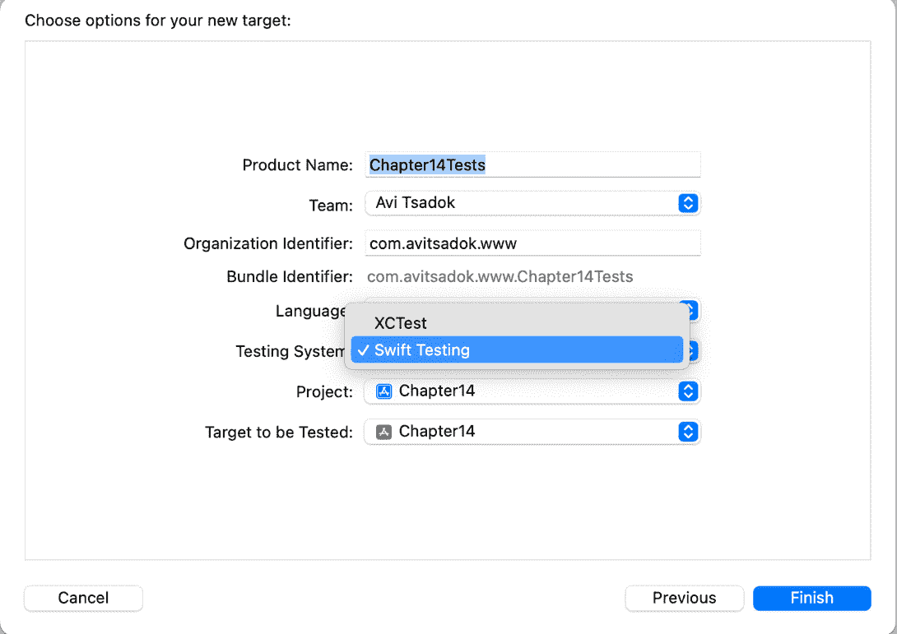

<st c="6806">图 14.2：为我们的新测试目标选择选项</st>

<st c="6859">在</st> *<st c="6863">图 14</st>**<st c="6872">.2</st>*<st c="6874">中，我们可以填写目标的名字、团队和包标识符。</st> <st c="6939">我们还可以在旧的 XCTest 和新 Swift Testing 框架之间进行选择。</st> <st c="7019">在这种情况下，我们将选择</st> **<st c="7046">Swift Testing</st>**<st c="7059">。</st>

<st c="7060">点击</st> **<st c="7065">保存</st>**<st c="7069">，恭喜你——你有一个新的</st> <st c="7101">测试目标</st> <st c="7108">了！</st>

<st c="7123">让我们编写我们的</st> <st c="7140">第一个测试！</st>

## <st c="7151">添加基本测试</st>

<st c="7171">我们的模板</st> <st c="7185">包含一个基本的、空的</st> <st c="7211">测试函数：</st>

```swift
 import Testing
struct Chapter14Tests {
    @Test func testExample() async throws {
        // Write your test here and use APIs like
       `#expect(...)` to check expected conditions. }
}
```

<st c="7395">尽管代码</st> <st c="7416">非常简洁，但我们可以看到与 XCTest 相比的一些变化：</st>

+   `<st c="7545">Testing</st>`<st c="7552">，并且我们应该将其导入到我们想要测试的每个文件中。</st> <st c="7602">要测试的每个文件中。</st>

+   `<st c="7698">XCTestCase</st>`<st c="7708">，我们在 Swift Testing 中使用结构体。</st> **<st c="7749">结构体</st>** <st c="7756">不仅更轻量级且易于使用，而且在尝试并行运行测试时也更有帮助。</st> <st c="7860">记住，结构体是值类型，这意味着每次我们传递一个结构体时，我们都会得到数据的一个副本。</st> <st c="7967">这有助于在测试时检查状态。</st>

+   `<st c="8031">@Test</st>``<st c="8081">@Test</st>` <st c="8086">宏，它帮助 SwiftData 框架管理</st> <st c="8137">其测试。</st>

+   `<st c="8159">#expect</st>``<st c="8197">XCTAssert</st>` <st c="8206">函数，我们使用</st> `<st c="8229">#expect</st>` <st c="8236">宏，这对于我们想要测试的任何表达式都很有帮助。</st> <st c="8288">要测试的表达式。</st>

<st c="8296">我们可以通过点击测试函数旁边的菱形按钮或按</st> *<st c="8393">⌘</st>**<st c="8394">U</st>*<st c="8395">来快速运行我们的测试。如果一切如预期进行，我们的测试应该通过。</st>

<st c="8451">现在，让我们用一些实际的测试来填充我们的代码。</st> <st c="8501">在我们的例子中，我们有一个处理计数器的视图模型。</st> <st c="8562">我们有</st> `<st c="8570">increment</st>` <st c="8579">和</st> `<st c="8584">decrement</st>` <st c="8593">函数以及一个</st> `<st c="8610">count</st>` <st c="8615">变量：</st>

```swift
 class CounterViewModel: ObservableObject {
    @Published var count: Int = 0
    func increment(by value: Int) { }
    func decrement(by value: Int) {}
    func reset() {}
}
```

让我们使用 Swift Testing 测试`CounterViewModel`的功能。

我们需要做的第一件事是向 Swift Testing 提供对我们的应用目标的访问权限：

```swift
 @testable import Chapter14
```

我们将`@testable`属性添加到`import`命令中，以启用对内部实体的访问。

现在，让我们编写我们的第一个测试函数：

```swift
 @Test func testViewModelIncrement() async throws {
//         preparation
        let viewmodel = CounterViewModel()
        viewmodel.count = 5
//        execution
        viewmodel.increment(by: 1)
//        verification
        #expect(viewmodel.count == 6)
    }
```

在我们的测试函数中，我们初始化视图模型，调用其增加函数，并验证结果。如果`#expect`宏函数内的表达式为`false`，则测试失败。

这三个阶段——准备、执行和验证——是任何测试流程的一部分，无论我们使用 Swift Testing 还是任何其他测试框架。

现在，让我们将包含此测试的结构体（`CounterViewModelTests`）重命名，并运行我们的测试。

在 Xcode 中，我们可以通过标签页打开左侧面板（或者直接按**⌘6**），然后我们可以看到我们的测试列表（**图 14.3**）：

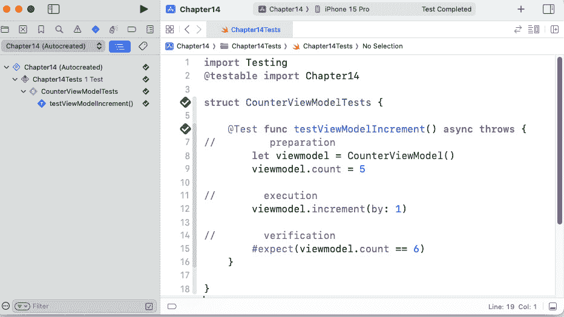

**图 14.3**：Xcode 中列出的测试

在**图 14.3**中，我们可以看到测试面板上我们的测试结构，这反映在我们创建结构体和测试函数的方式上。

在本章开头，我们通过检查一个简单的代码示例来讨论了 Swift Testing 和 Xcode 之间的区别。其中之一的变化是使用`@Test`宏。

除了指示一个测试函数，`@Test` 宏还有额外的功能帮助我们配置测试。

例如，让我们使用`@Test`宏为我们的测试函数提供一个名称。

## 为我们的测试函数提供名称

为测试函数提供有表达力和意义的名称至关重要，并且当我们在项目中拥有数百个测试时，这可能会很有价值。

在 XCTest 中，为了做到这一点，我们需要将测试函数重命名为类似以下的内容：

```swift
 func testViewModelIncremenetFunction_incrementBy1_accept5_expect6
```

<st c="11395">函数名称正确地描述了测试，但感觉笨拙且不自然，尤其是当我们有成百上千的</st> <st c="11517">测试函数时。</st>

<st c="11532">使用</st> `<st c="11542">@Test</st>` <st c="11547">Swift 宏，我们可以为每个测试提供一个可读的名称：</st>

```swift
 @Test("Test the increment function. Accepts 5 and expect 6\. ") func testViewModelIncrement()
```

<st c="11699">将测试描述添加到</st> `<st c="11735">@Test</st>` <st c="11740">Swift 宏中使其更易于阅读，并且它还很好地与 Xcode 集成（</st>*<st c="11824">图 14</st>**<st c="11834">.4</st>*<st c="11836">）：</st>

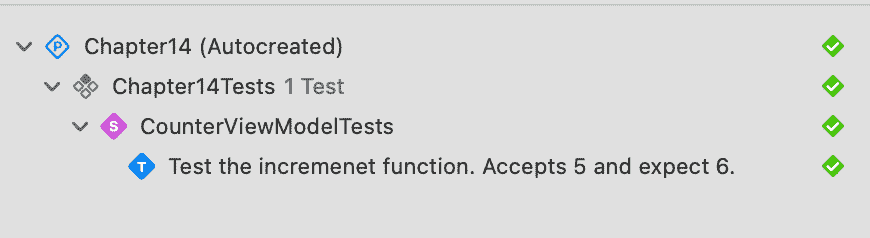

<st c="11983">图 14.4：Xcode 中的测试面板，带有自定义名称</st>

*<st c="12038">图 14</st>**<st c="12048">.4</st>* <st c="12050">显示了之前相同的测试函数，现在有一个可读的并且</st> <st c="12115">有意义的名称。</st>

<st c="12131">The</st> `<st c="12136">@Test</st>` <st c="12141">Swift 宏不仅提供了为我们的函数命名。</st> <st c="12205">我们还可以用它来禁用和启用测试。</st> <st c="12253">让我们看看如何</st> <st c="12270">做到这一点。</st>

## <st c="12278">启用和禁用测试</st>

<st c="12307">有时，一个测试可能变得</st> <st c="12336">无关紧要，我们希望暂时将其从测试列表中删除。</st> <st c="12406">我们可以删除它或对其注释。</st> <st c="12441">然而，这些解决方案可能需要更舒适和实用的长期解决方案。</st> <st c="12529">因此，让我们使用</st> `<st c="12547">@Test</st>` <st c="12552">宏来使其更加优雅。</st>

<st c="12585">在 Swift 测试中，所有测试默认启用。</st> <st c="12638">要禁用特定测试，我们可以使用</st> `<st c="12681">disabled()</st>` <st c="12691">函数：</st>

```swift
 @Test("Test the incremenet function. Accepts 5 and expect 6\. ", .disabled()) func testViewModelIncrement()
```

<st c="12808">我们可以看到</st> `<st c="12829">disabled()</st>` <st c="12839">函数现在是</st> `<st c="12867">@Test</st>` <st c="12872">参数之一。</st> <st c="12885">在这种情况下，测试函数将不会运行，我们还可以看到该函数现在在测试面板中已禁用（</st>*<st c="13000">图 14</st>**<st c="13010">.5</st>*<st c="13012">）：</st>

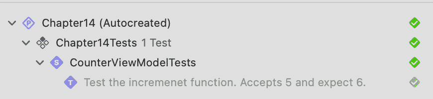

<st c="13159">图 14.5：测试面板中的禁用测试</st>

*<st c="13204">图 14</st>**<st c="13214">.5</st>* <st c="13216">显示了我们的测试函数变为灰色。</st> <st c="13253">在这种情况下，执行整个测试运行将跳过</st> <st c="13307">该测试。</st>

<st c="13317">然而，有些情况下我们需要我们的测试函数仅在特定条件下运行，例如当用户登录或处于特定的 A/B</st> <st c="13472">测试条件下。</st>

<st c="13487">在这种情况下，我们将在测试函数中实现条件作为保护语句，从而使测试函数成功。</st> <st c="13620">但这听起来不是一个好办法——当测试函数没有运行时，它成功。</st>

<st c="13719">幸运的是，基于特定标准的测试函数启用是 Swift 测试支持的功能。</st> <st c="13822">我们只需要在 `<st c="13879">@Test</st>` <st c="13884">宏头中添加 enabled 函数，包括一个</st> <st c="13909">布尔表达式：</st>

```swift
 @Test("Test the decrement function.", .<st c="14110">testTheDecrementFunction</st>. We added a condition to the test function that would run only if we enabled the ability to decrement in the app settings. In this case, the <st c="14276">AppSettings.CanDecrement</st> expression returns <st c="14320">false</st>. Therefore, Swift Testing skips the test function at runtime.
			<st c="14388">When using the enabled function, precisely defining the test goal is essential.</st> <st c="14469">For example, when using</st> `<st c="14493">AppSettings</st>`<st c="14504">, we may want to test the results of the decrement function when the feature is turned off.</st> <st c="14596">We need to disable tests according to a Boolean expression only when it’s clear that the function is irrelevant under</st> <st c="14714">specific conditions.</st>
			<st c="14734">If we try to run a test when the</st> `<st c="14768">enabled()</st>` <st c="14777">function returns</st> `<st c="14795">false</st>`<st c="14800">, we’ll see something like</st> *<st c="14827">Figure 14</st>**<st c="14836">.6</st>*<st c="14838">:</st>
			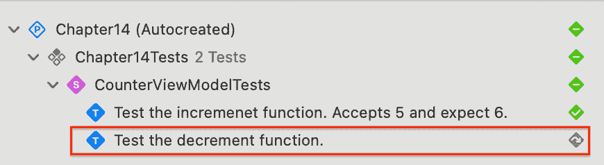

			<st c="15020">Figure 14.6: A skipped test function due to a specific false condition</st>
			<st c="15090">In</st> *<st c="15094">Figure 14</st>**<st c="15103">.6</st>*<st c="15105">, we can see that the test function is not grayed out, as in the case of using the</st> `<st c="15188">disabled()</st>` <st c="15198">function.</st> <st c="15209">However, it wasn’t running, and we can also see the skipped icon on</st> <st c="15277">the right.</st>
			<st c="15287">We have seen how to provide readable names</st> <st c="15330">to test functions and how to disable or enable tests.</st> <st c="15385">Now, let’s discuss another excellent Swift Testing feature –</st> *<st c="15446">tags</st>*<st c="15450">.</st>
			<st c="15451">Tagging our test functions</st>
			<st c="15478">Generally, we group tests</st> <st c="15504">according to our project</st> <st c="15529">structure.</st> <st c="15541">For example, we could create a structure of test functions for a specific class or a structure.</st> <st c="15637">Another example would be to create a test structure for a particular feature or service.</st> <st c="15726">However, there are additional ways we can organize our test functions.</st> <st c="15797">We could arrange them according to priority – critical or sanity tests – or according to their system levels, such as UI or business</st> <st c="15930">logic layers.</st>
			<st c="15943">Instead of finding workarounds for that organization problem, Swift Testing</st> <st c="16019">provides an organization feature</st> <st c="16053">called</st> **<st c="16060">tags</st>**<st c="16064">.</st>
			<st c="16065">We’ll start by defining a new tag in the</st> <st c="16107">test bundle:</st>

```

extension Tag {

    @Tag static let critical: Self

}

```swift

			<st c="16168">We extended the</st> `<st c="16185">Tag</st>` <st c="16188">structure in this code and added a new static variable,</st> <st c="16245">named</st> `<st c="16251">critical</st>`<st c="16259">.</st>
			<st c="16260">We can define and use as many</st> <st c="16290">tags as we want across our bundle.</st> <st c="16326">Therefore, it is a best practice</st> <st c="16358">to manage all our tags in one place and a</st> <st c="16401">separate file.</st>
			<st c="16415">Now that we have a new tag, let’s add it to one of</st> <st c="16467">our tests:</st>

```

@Test("测试重置函数", <st c="16511">.tags(.critical))</st> func testResetFunction() {

```swift

			<st c="16555">In this code example, another</st> `<st c="16586">@Test</st>` <st c="16591">macro function, called</st> `<st c="16615">tags()</st>`<st c="16621">, provides the new</st> `<st c="16640">critical</st>` <st c="16648">static variable we created in the previous</st> <st c="16692">code example.</st>
			<st c="16705">Note that we can provide multiple tags to the same</st> <st c="16757">test function:</st>

```

.tags(.critical, .calculations, .performance))

```swift

			<st c="16817">In this example, we marked a specific function with three</st> <st c="16876">different tags.</st>
			<st c="16891">The ability to mark a function with multiple tags can be powerful, as it provides flexibility with our</st> <st c="16995">tests’ organization.</st>
			<st c="17015">One thing is missing here – even though tagging functions look lovely, we haven’t discussed how to actually use</st> <st c="17128">our tagging.</st>
			<st c="17140">Let’s look at</st> *<st c="17155">Figure 14</st>**<st c="17164">.7</st>*<st c="17166">:</st>
			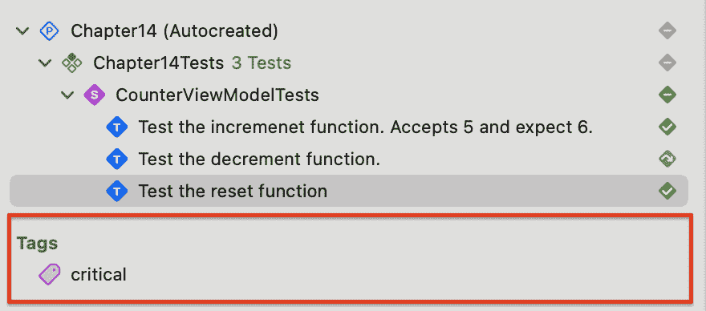

			<st c="17384">Figure 14.7: The Tags section of the test pane in Xcode</st>
			*<st c="17439">Figure 14</st>**<st c="17449">.7</st>* <st c="17451">shows a new section called</st> `<st c="17542">critical</st>` *<st c="17550">tag</st>* <st c="17554">we defined for our</st> `<st c="17574">reset()</st>` <st c="17581">function in the last code example.</st> <st c="17617">Xcode scans our tags’ usage and organizes them for us.</st> <st c="17672">This is how deep the Swift Testing integration with</st> <st c="17724">Xcode is.</st>
			<st c="17733">Now that we have all our tags</st> <st c="17763">listed, we can run all our critical</st> <st c="17799">tests (</st>*<st c="17807">Figure 14</st>**<st c="17817">.8</st>*<st c="17819">):</st>
			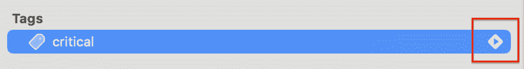

			<st c="17828">Figure 14.8: Running all critical tests</st>
			<st c="17867">In</st> *<st c="17871">Figure 14</st>**<st c="17880">.8</st>*<st c="17882">, the run button is on the right.</st> <st c="17916">Tapping it will run all our critical</st> <st c="17953">marked tests.</st>
			<st c="17966">Now, for the practical usage of tags in testing, working with tags is similar to how tagging works in other places.</st> <st c="18083">When we group tests in files, we usually do that by</st> *<st c="18135">concern</st>* <st c="18142">– a layer, service, module, and so on.</st> <st c="18182">Conversely, tagging helps us group tests by their</st> *<st c="18232">types</st>* <st c="18237">(sanity, smoke or regression, integration, or unit) or a</st> *<st c="18295">property</st>* <st c="18303">(a priority,</st> <st c="18317">for example).</st>
			<st c="18330">What are smoke tests?</st>
			<st c="18352">We write</st> **<st c="18362">smoke tests</st>** <st c="18373">to check a system’s operations</st> <st c="18404">by testing basic functionality.</st> <st c="18437">While they may sound like a sanity test, they are much lighter and faster than that.</st> <st c="18522">For example, we can try to perform a login and a basic data sync, and the results can indicate</st> <st c="18616">whether we have a severe problem with our app or</st> <st c="18666">the backend.</st>
			<st c="18678">Working methodologically with the tagging system can enhance our testing and open</st> <st c="18761">new possibilities.</st>
			<st c="18779">Our</st> `<st c="18784">@Test</st>` <st c="18789">macro</st> <st c="18795">features</st> <st c="18804">list doesn’t end with tagging.</st> <st c="18836">Let’s examine a Swift Testing feature that can save us a lot of time –</st> *<st c="18907">arguments</st>*<st c="18916">.</st>
			<st c="18917">Working with arguments</st>
			<st c="18940">Imagine the following</st> <st c="18962">scenario.</st> <st c="18973">We wrote a Swift function</st> <st c="18998">that performs a very clever calculation – for example, a function that converts meters</st> <st c="19086">to yards:</st>

```

struct UnitConverter {

    static func metersToYards(_ meters: Double) -> Double {

        return meters * 1.09361

    }

}

```swift

			<st c="19202">Our function takes a</st> `<st c="19224">meters</st>` <st c="19230">parameter and returns its value in yards.</st> <st c="19273">It looks like a straightforward function, but we must perform several tests to see whether it works</st> <st c="19373">as expected.</st>
			<st c="19385">So, let’s write tests for</st> <st c="19412">this function:</st>

```

struct UnitConverterTests {

    @Test func testConvertingMetersToYards_1meter() {

        #expect(UnitConverter.metersToYards(1.0) ==

        1.09361)

    }

    @Test func testConvertingMetersToYards_3_5meter() {

        #expect(UnitConverter.metersToYards(3.5) ==

        3.827635)

    }

}

```swift

			<st c="19669">In this code example, we wrote</st> <st c="19700">two test functions that perform the same test but with different parameters.</st> <st c="19778">They even have very similar names.</st> <st c="19813">Even though this solution works fine, it doesn’t scale up very nicely.</st> <st c="19884">What if we want to test 10 different</st> <st c="19920">variants or parameters?</st> <st c="19945">And what if we need to change the function name we</st> <st c="19996">are testing?</st>
			<st c="20008">One option is to perform one test function that contains all of the</st> <st c="20077">different options:</st>

```

@Test func testConvertingMetersToYards () {

    #expect(UnitConverter.metersToYards(1.0) == 1.09361)

    #expect(UnitConverter.metersToYards(3.5) == 3.827635)

    }

```swift

			<st c="20249">We created one test function with two</st> `<st c="20288">#expect</st>` <st c="20295">statements in this code example.</st> <st c="20329">That will probably work; however, managing and monitoring them is more challenging now that we have both statements in</st> <st c="20448">one function.</st>
			<st c="20461">To solve that, Swift Testing has a feature named</st> **<st c="20511">arguments</st>**<st c="20520">, which allows us to run our tests with different</st> <st c="20570">values repeatedly.</st>
			<st c="20588">Let’s see that</st> <st c="20604">in action:</st>

```

@Test(参数：<st c="20621">arguments</st>: [(1.0, 1.09361), (3.5, 3.827635)])

    func testConvertingMetersToYards(data: <st c="20708">(Double,</st>

<st c="20716">Double)</st>) {

        #expect(UnitConverter.metersToYards<st c="20764">(data.0) ==</st>

<st c="20776">data.1)</st> }

```swift

			<st c="20786">This code example may look a little cumbersome, but it is straightforward.</st> <st c="20861">We performed three</st> <st c="20880">changes here:</st>

				*   <st c="20893">We added the</st> `<st c="20907">arguments</st>` *<st c="20916">parameter</st>* <st c="20926">to the</st> `<st c="20934">@Test</st>` <st c="20939">macro, which contains an array of tuples.</st> <st c="20982">Each tuple represents a few meters and its corresponding number of yards.</st> <st c="21056">For example, the</st> `<st c="21073">(1.0, 1.09361)</st>` <st c="21087">tuple represents a conversion between 1 meter and 1.09361 yards.</st> <st c="21153">This array is the list of test variants we are going</st> <st c="21206">to do.</st>
				*   <st c="21212">We added a</st> *<st c="21224">new tuple parameter called</st>* `<st c="21251">data</st>` *<st c="21255">to our test function</st>*<st c="21276">. With each test run, Swift Testing passes a tuple from the arguments list to the function using this parameter.</st> <st c="21389">The parameter type must be aligned with the</st> <st c="21433">argument type.</st>
				*   <st c="21447">In the</st> `<st c="21455">#expect</st>` <st c="21462">macro, we now</st> *<st c="21477">compare the two tuple values</st>* <st c="21505">instead of fixed sizes, like in the</st> <st c="21542">previous examples.</st>

			<st c="21560">The term</st> *<st c="21570">arguments</st>* <st c="21579">can be misleading.</st> <st c="21599">In the context</st> <st c="21613">of testing, it means</st> <st c="21634">that arguments allow us to run our code in different use cases</st> <st c="21698">and states.</st>
			<st c="21709">And if passing all the different use cases within the</st> `<st c="21764">@Test</st>` <st c="21769">macro is cumbersome, we can store them in a</st> <st c="21814">separate variable:</st>

```

let convertingTests: [(Double, Double)] = [(1.0, 1.09361),

                                        (3.5, 3.827635)]

struct UnitConverterTests {

    @Test(arguments: convertingTests)

    func testConvertingMetersToYards(data: (Double,

    Double)) {

        #expect(UnitConverter.metersToYards(data.0) ==

        data.1)

    }

}

```swift

			<st c="22088">In this code example, we moved our use cases into a dedicated constant for</st> <st c="22164">better readability.</st>
			<st c="22183">If we look at the Xcode testing pane again, we can now see a list of our use cases and their states (</st>*<st c="22285">Figure 14</st>**<st c="22295">.9</st>*<st c="22297">):</st>
			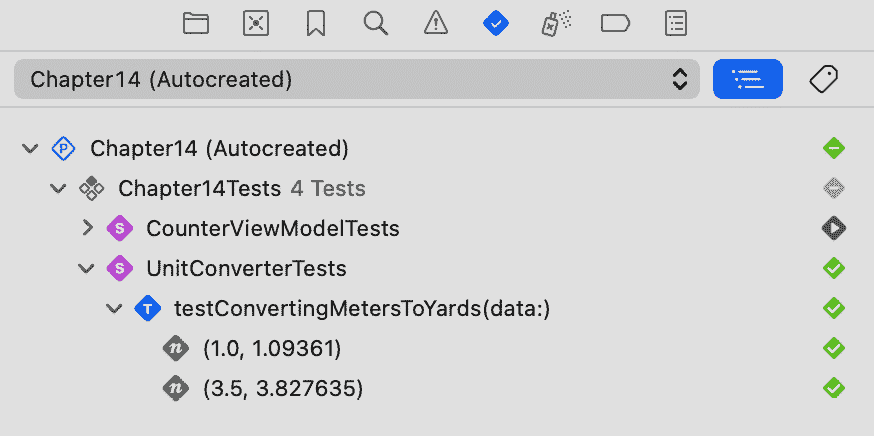

			<st c="22519">Figure 14.9: Argument testing in the Xcode testing pane</st>
			*<st c="22574">Figure 14</st>**<st c="22584">.9</st>* <st c="22586">shows why argument testing in Swift Testing is so powerful.</st> <st c="22647">Instead of having several test functions in the list, we can see one with several</st> <st c="22729">use cases.</st>
			<st c="22739">Argument testing adds another</st> <st c="22769">layer to our testing, something</st> <st c="22801">we don’t have</st> <st c="22816">in XCTest.</st>
			<st c="22826">Why doesn’t XCTest support parametrized testing?</st>
			<st c="22875">Using attributes to perform parametrized</st> <st c="22916">testing is not new in the testing world.</st> <st c="22958">Most testing frameworks support adding arguments to their test functions out of the box.</st> <st c="23047">However, even though it is possible to perform parametrized tests in XCTest, it requires creating several test functions that call a central function that performs the actual test.</st> <st c="23228">This is an ad hoc and unnatural solution.</st> <st c="23270">The reason is that Apple wanted to create a simple testing framework, and locating the test function</st> <st c="23370">in XCTest works according to a simple function signature (functions that start with the phrase</st> `<st c="23466">test</st>`<st c="23470">).</st> <st c="23474">Adding arguments made the locating</st> <st c="23509">process complex.</st>
			<st c="23525">Now that we have reviewed the Swift Testing basics, let’s see how to manage</st> <st c="23602">our tests.</st>
			<st c="23612">Managing our tests</st>
			<st c="23631">Anyone who has previously worked</st> <st c="23664">with tests knows that writing tests is one thing and managing them in the long run</st> <st c="23748">is another.</st>
			<st c="23759">If you don’t have testing experience, you might think that simply running all your tests one after the other is sufficient.</st> <st c="23884">But down the road, things become much more complex – different configurations, environments, and even test goals – all translating to a need for a more robust testing</st> <st c="24051">management system.</st>
			<st c="24069">Before managing our testing system, let’s review our Xcode</st> <st c="24129">testing structure.</st>
			<st c="24147">Going over the testing structure</st>
			<st c="24180">So far, we have discussed</st> <st c="24206">how to write testing functions, but besides grouping them in structures, we haven’t discussed anything related to</st> <st c="24321">managing them.</st>
			<st c="24335">A whole set of tools can help us manage our test efficiency in Xcode.</st> <st c="24406">Let’s review the different blocks that can help us adapt a flexible system to</st> <st c="24484">our needs:</st>

				*   **<st c="24494">A testing suite</st>**<st c="24510">: A testing suite can group</st> <st c="24538">several testing functions and</st> <st c="24569">child suites.</st>
				*   **<st c="24582">A test plan</st>**<st c="24594">: A test plan groups different test</st> <st c="24631">functions and test suites.</st> <st c="24658">It can include or exclude test functions marked with tags.</st> <st c="24717">But it doesn’t stop there – test plans can run multiple times in different configurations with different data and environments.</st> <st c="24845">This is a powerful tool that can help scale up our</st> <st c="24896">testing strategy.</st>
				*   **<st c="24913">A Scheme</st>**<st c="24922">: Inside each</st> *<st c="24937">Scheme</st>*<st c="24943">, we have several build options.</st> <st c="24976">One is</st> **<st c="24983">Test</st>**<st c="24987">, where we must describe what will happen when testing that specific</st> *<st c="25056">Scheme</st>*<st c="25062">. In the</st> **<st c="25071">Test Build</st>** <st c="25081">option, we can define</st> <st c="25104">precisely what test plans we will run</st> <st c="25141">and on</st> <st c="25149">which target.</st>

			<st c="25162">When we look at the different testing building blocks, we can see that the testing structure is complex and requires</st> <st c="25280">some thinking.</st>
			<st c="25294">Let’s try to explain the hierarchy by examining</st> *<st c="25343">Figure 14</st>**<st c="25352">.10</st>*<st c="25355">:</st>
			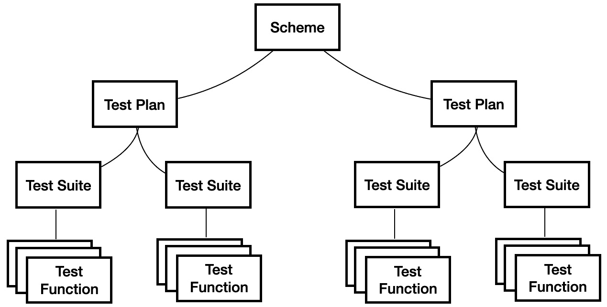

			<st c="25501">Figure 14.10: Relations between the different building blocks of testing</st>
			*<st c="25573">Figure 14</st>**<st c="25583">.10</st>* <st c="25586">shows the relations between the different building blocks of testing.</st> <st c="25657">Next, we will learn how to build them together, starting with</st> <st c="25719">test suites.</st>
			<st c="25731">Grouping our test functions into test suites</st>
			<st c="25776">The first building block</st> <st c="25801">we are going to discuss is the</st> **<st c="25833">test suite</st>**<st c="25843">. In fact, we have already built a test suite in</st> <st c="25892">this chapter:</st>

```

<st c="25905">struct UnitConverterTests</st> {

    @Test func testConvertingMetersToYards_1meter() {

        #expect(UnitConverter.metersToYards(1.0) ==

        1.09361)

    }

}

```swift

			<st c="26040">Do you remember this code example?</st> <st c="26076">We wrote it in the</st> *<st c="26095">Working with arguments</st>* <st c="26117">section and created a similar test suite for earlier examples.</st> <st c="26181">So, yes, the struct containing our test functions is considered to be a test suite, and Swift Testing recognizes and displays this in the</st> <st c="26319">test pane.</st>
			<st c="26329">However, we can annotate a test suite with the</st> `<st c="26377">@Suite</st>` <st c="26383">attribute for better customization.</st> <st c="26420">Let’s add it to our latest</st> <st c="26447">test suite:</st>

```

<st c="26458">@Suite("单位转换器测试")</st> struct UnitConverterTests {

    @Test func testConvertingMetersToYards_1meter() {

        #expect(UnitConverter.metersToYards(1.0) ==

        1.09361}

}

```swift

			<st c="26622">In this code example, we added</st> <st c="26653">the</st> `<st c="26658">@Suite</st>` <st c="26664">swift macro to our</st> `<st c="26684">UnitConverterTests</st>` <st c="26702">structure and, by doing so, gave it a more</st> <st c="26746">readable name.</st>
			<st c="26760">Let’s see what our test suite looks like in the test pane in Xcode (</st>*<st c="26829">Figure 14</st>**<st c="26839">.11</st>*<st c="26842">):</st>
			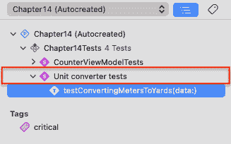

			<st c="26971">Figure 14.11: The suite in the Xcode test pane</st>
			<st c="27017">In</st> *<st c="27021">Figure 14</st>**<st c="27030">.11</st>*<st c="27033">, we can see our new test suite displayed in the</st> <st c="27082">test pane.</st>
			<st c="27092">If using the</st> `<st c="27106">@Suite</st>` <st c="27112">macro sounds like how we used the</st> `<st c="27147">@Test</st>` <st c="27152">macro, you are not mistaken; it’s the same idea – providing more information by using</st> <st c="27239">a macro.</st>
			<st c="27247">And, just like the</st> `<st c="27267">@Test</st>` <st c="27272">macro, we can also mark test suites</st> <st c="27309">with tags:</st>

```

@Suite("单位转换器测试", .<st c="27352">tags(.critical)</st>)

struct UnitConverterTests {

}

```swift

			<st c="27400">In this code example, we marked our new test suite with the critical tag we declared in the</st> *<st c="27493">Tagging our test</st>* *<st c="27510">functions</st>* <st c="27519">section.</st>
			<st c="27528">In addition, we can also disable the whole test suite using the same</st> `<st c="27598">disabled()</st>` <st c="27608">function we used in the</st> *<st c="27633">Enabling and disabling</st>* *<st c="27656">tests</st>* <st c="27661">section:</st>

```

@Suite("单位转换器测试", .<st c="27703">disabled()</st>)

struct UnitConverterTests {

}

```swift

			<st c="27746">In this code example, we disabled</st> <st c="27780">the</st> `<st c="27785">Unit converter tests</st>` <st c="27805">test suite, and Swift Test will not execute any of its tests in the next</st> <st c="27879">test run.</st>
			<st c="27888">Another neat usage for a test suite is its ability to contain nested</st> <st c="27958">test suites:</st>

```

<st c="27970">@Suite("单位转换器测试")</st> struct UnitConverterTests { <st c="28030">@Suite("从米到码")</st> struct FromMetersToYardsTests {

    // 我们的测试函数

    }

}

```swift

			<st c="28118">In this code example, we have a test suite named</st> `<st c="28168">From meters to yards</st>`<st c="28188">, which is part of a bigger test suite named</st> `<st c="28233">Unit</st>` `<st c="28238">converter tests</st>`<st c="28253">.</st>
			<st c="28254">Let’s see how this is reflected in the Xcode pane (</st>*<st c="28306">Figure 14</st>**<st c="28316">.12</st>*<st c="28319">):</st>
			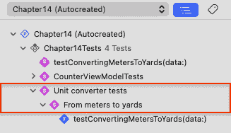

			<st c="28553">Figure 14.12: Nested test suites in the test pane</st>
			*<st c="28602">Figure 14</st>**<st c="28612">.12</st>* <st c="28615">shows how our new nested test suite is reflected in the test pane.</st> <st c="28683">We can also customize the nested suites, such as adding tags and</st> <st c="28748">disabling them.</st>
			<st c="28763">Now that we know how to define a test suite and tags, it is recommended that we remember each feature’s role.</st> <st c="28874">We use test suites to group different test methods by concern – typically, by writing test functions for a specific class or</st> <st c="28999">a structure.</st>
			<st c="29011">Conversely, we use tags to mark our tests</st> <st c="29053">by their type –</st> `<st c="29070">critical</st>`<st c="29078">,</st> `<st c="29080">performance</st>`<st c="29091">,</st> `<st c="29093">integration</st>`<st c="29104">, and so on.</st> <st c="29117">If these are the different roles for tags and test suites, what do we do when we want to manage something such as a sanity or a</st> <st c="29245">regression test?</st>
			<st c="29261">That’s what</st> *<st c="29274">test plans</st>* <st c="29284">are for.</st>
			<st c="29293">Building test plans</st>
			<st c="29313">To better understand</st> <st c="29334">the different testing components, we can think of an app with two layers – the business logic and the UI.</st> <st c="29441">The business logic layer is important, but it doesn’t describe how a user will use our app – the different use cases</st> <st c="29558">and flows.</st>
			<st c="29568">We must build the UI layer to complete our app, which handles user stories and flows.</st> <st c="29655">The business logic is analogous to the different testing suites and functions.</st> <st c="29734">These are the building blocks of our testing.</st> <st c="29780">However, testing is always in the context of a specific</st> <st c="29836">development process.</st>
			<st c="29856">Let’s try to come up with different</st> <st c="29892">development processes:</st>

				*   **<st c="29915">Feature development</st>**<st c="29935">: We build new features, often adding new classes, structures,</st> <st c="29999">and entities</st>
				*   **<st c="30011">Fixing bugs</st>**<st c="30023">: We modify</st> <st c="30036">existing code</st>
				*   **<st c="30049">Refactoring code</st>**<st c="30066">: We modify existing code for better scalability, maintenance,</st> <st c="30130">or performance</st>
				*   **<st c="30144">Deployment</st>**<st c="30155">: We prepare an app for deployment</st> <st c="30191">for QA</st> <st c="30198">or production</st>

			<st c="30211">This is only a partial list of different development processes, but it demonstrates that we are always in the context of a process when</st> <st c="30348">we develop.</st>
			<st c="30359">When we build our testing system, we can describe this process using a test plan.</st> <st c="30442">Let’s add a new test plan to see how</st> <st c="30479">it works.</st>
			<st c="30488">Adding a new test plan</st>
			**<st c="30511">Test plans</st>** <st c="30522">are a new feature in Xcode, added</st> <st c="30556">to Xcode 11 in 2019\.</st> <st c="30578">They allow us to pick tests or test suites and run them in a specific configuration and environment.</st> <st c="30679">Test plans are our way of expressing how our test functions will</st> <st c="30744">be executed.</st>
			<st c="30756">We always run our tests as part of a test plan.</st> <st c="30805">By default, Xcode creates a test plan for us automatically (</st>*<st c="30865">Figure 14</st>**<st c="30875">.13</st>*<st c="30878">):</st>
			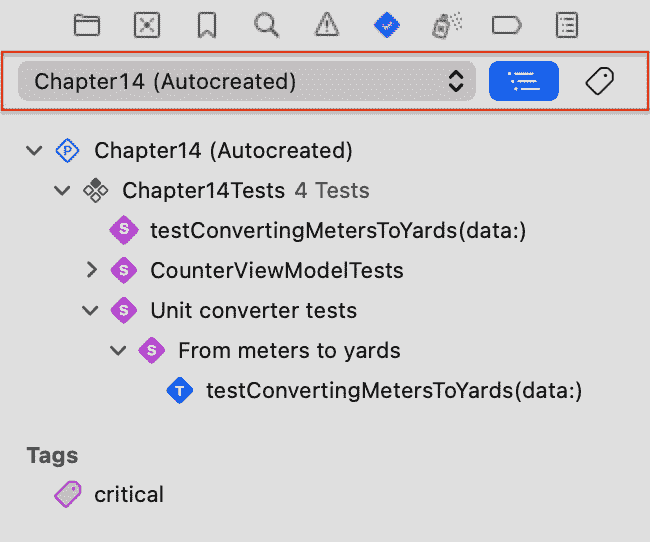

			<st c="31151">Figure 14.13: The autocreated test plan</st>
			<st c="31190">In</st> *<st c="31194">Figure 14</st>**<st c="31203">.13</st>*<st c="31206">, we can see that Xcode</st> <st c="31229">created a test plan for us called</st> *<st c="31264">Chapter 14</st>*<st c="31274">. To create a new test plan, we can tap the test plan pop-up menu and select</st> **<st c="31351">New Test Plan</st>**<st c="31364">. After we provide a name for our new test plan, we can see it in our Xcode main pane (</st>*<st c="31451">Figure 14</st>**<st c="31461">.14</st>*<st c="31464">):</st>
			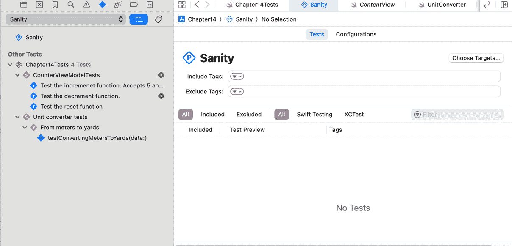

			<st c="32011">Figure 14.14: The new test plan in Xcode</st>
			*<st c="32051">Figure 14</st>**<st c="32061">.14</st>* <st c="32064">shows a new test plan called</st> **<st c="32094">Sanity</st>**<st c="32100">, which has its own</st> <st c="32120">customization screen.</st>
			<st c="32141">There are many things we can do to customize</st> <st c="32186">our new</st> <st c="32195">test plan:</st>

				*   <st c="32205">We can define precisely which test target we want to run.</st> <st c="32264">So far, we have worked on a single test target, but it is possible to have several test targets.</st> <st c="32361">Once we choose the different test targets, we will see the list of test suites and functions and mark what tests we should include</st> <st c="32492">or exclude.</st>
				*   <st c="32503">We can include or exclude tests marked with specific tags.</st> <st c="32563">For example, we can choose to include only tests marked with the</st> `<st c="32628">critical</st>` <st c="32636">tag for the</st> `<st c="32741">performance</st>` <st c="32752">tag.</st> <st c="32758">This is where the tags become</st> <st c="32788">extremely helpful.</st>
				*   <st c="32806">If we already have many tests written in XCTest, we can include them in our test plan.</st> <st c="32894">This capability is crucial to preserve</st> <st c="32933">backward compatibility.</st>

			<st c="32956">As we can see, the test plan is very flexible in deciding what tests will</st> <st c="33031">be included.</st>
			<st c="33043">However, control over the list of test suites and functions is only a fraction of what we can do with test plans.</st> <st c="33158">We can do even more</st> <st c="33178">with configurations.</st>
			<st c="33198">Configuring our test plan</st>
			<st c="33224">When we started explaining</st> <st c="33251">test plans, we said that part of the idea of creating one is defining the environment in which the test plan runs.</st> <st c="33367">One example of such an environment is localization – language, region, and location can influence our app in certain</st> <st c="33484">use cases.</st>
			<st c="33494">Trying to simulate an environment for our test functions can be challenging; therefore, test plans have a feature called</st> **<st c="33616">Configurations</st>** <st c="33630">(</st>*<st c="33632">Figure 14</st>**<st c="33641">.15</st>*<st c="33644">):</st>
			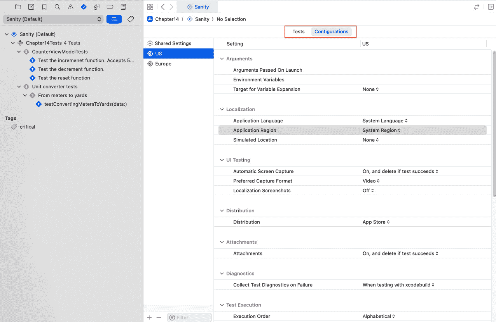

			<st c="34627">Figure 14.15: The test plan’s Configurations tab</st>
			*<st c="34675">Figure 14</st>**<st c="34685">.15</st>* <st c="34688">shows a tab bar at the top of the</st> **<st c="34723">Sanity</st>** <st c="34729">main pane.</st> <st c="34741">The</st> **<st c="34745">Tests</st>** <st c="34750">tab defines the included tests in the test plan, and the</st> **<st c="34808">Configurations</st>** <st c="34822">tab defines the different configurations for the</st> <st c="34872">test plan.</st>
			<st c="34882">To add a new configuration, we tap the plus button at the bottom of</st> <st c="34951">the window.</st>
			<st c="34962">A test plan can have many configurations.</st> <st c="35005">Each configuration contains a list of settings that can affect our test results.</st> <st c="35086">Let’s examine</st> <st c="35100">them briefly:</st>

				*   **<st c="35113">Arguments</st>**<st c="35123">: Each app can run with different Launch and environment variables.</st> <st c="35192">We can use them to override our A/B test configuration or define a specific API endpoint.</st> <st c="35282">Arguments are powerful tools that help us adjust our app to</st> <st c="35342">our needs.</st>
				*   **<st c="35352">Localization</st>**<st c="35365">: Language, region, and location are all part of the localization list of settings that we can define.</st> <st c="35469">These settings can influence available features, texts, measurement units, and</st> <st c="35548">other behavior.</st>
				*   **<st c="35563">UI testing</st>**<st c="35574">: If our test plan includes UI tests (not supported yet in Swift Testing), we can decide what happens during screen capturing if there is a</st> <st c="35715">test failure.</st>
				*   **<st c="35728">Distribution</st>**<st c="35741">: Some APIs can behave differently when running on the App Store than on TestFlight – for example, collecting beta testers’ feedback, sandbox issues, and enabling/disabling beta</st> <st c="35920">testing features.</st>
				*   **<st c="35937">Test Execution</st>**<st c="35952">: Here, we can define the test plan execution behavior, including the execution order, timeouts, and</st> <st c="36054">repetition settings.</st>
				*   **<st c="36074">Runtime API Checking, Runtime Sanitization</st>**<st c="36117">: Different runtime settings such as memory management, main thread checker,</st> <st c="36195">and sanitization.</st>

			<st c="36212">That’s a long list of settings!</st> <st c="36245">I felt that when I looked at</st> *<st c="36274">Figure 14</st>**<st c="36283">.15</st>*<st c="36286">, but now we have confirmation after reviewing almost</st> <st c="36340">each one.</st>
			<st c="36349">However, the idea behind configurations</st> <st c="36389">is that we don’t need to redefine all the settings each time we create a new configuration.</st> <st c="36482">If you open your Xcode and create a new test plan, you can see something called</st> **<st c="36562">Shared Settings</st>** <st c="36577">(</st>*<st c="36579">Figure 14</st>**<st c="36588">.16</st>*<st c="36591">):</st>
			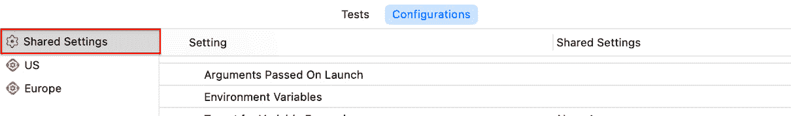

			<st c="36721">Figure 14.16: Shared Settings</st>
			*<st c="36750">Figure 14</st>**<st c="36760">.16</st>* <st c="36763">focuses on the list of configurations with</st> **<st c="36807">Shared Settings</st>** <st c="36822">at the top.</st> <st c="36835">The</st> **<st c="36839">Shared Settings</st>** <st c="36854">configuration contains the settings for all configurations unless we explicitly change a specific setting for a</st> <st c="36967">particular configuration.</st>
			<st c="36992">Consider a typical use case – we would probably want the same settings for all configurations except for one or two (e.g., a configuration for different locations or distributions).</st> <st c="37175">In this case, we will have the same settings except for the region or the</st> <st c="37249">distribution method.</st>
			<st c="37269">Xcode executes all the configurations in a sequence when running a test plan.</st> <st c="37348">However, you can disable a specific configuration by right-clicking on it in the configurations list and</st> <st c="37453">selecting</st> **<st c="37463">Disable</st>**<st c="37470">.</st>
			<st c="37471">So, let’s say we created a sanity test plan</st> <st c="37515">and a regression test plan.</st> <st c="37544">What do we do from here?</st> <st c="37569">How can we tell Xcode what to execute when running tests?</st> <st c="37627">This is where the</st> *<st c="37645">Scheme</st>* <st c="37651">comes</st> <st c="37658">into play.</st>
			<st c="37668">Setting up a Scheme</st>
			<st c="37688">This chapter is about Swift Testing, not the Xcode</st> <st c="37739">build system, but we can’t discuss testing and</st> <st c="37787">ignore</st> **<st c="37794">Schemes</st>**<st c="37801">.</st>
			<st c="37802">Schemes are fundamental to managing our project’s build and execution configurations.</st> <st c="37889">A</st> *<st c="37891">Scheme</st>* <st c="37897">defines how our project is built, executed,</st> <st c="37942">and tested.</st>
			<st c="37953">We can write dozens of test functions and create as many test plans as we want, but the bottom line is that when we select</st> **<st c="38077">Test</st>** <st c="38081">from the Xcode menu or run tests from our CI/CD environment, the</st> *<st c="38147">Scheme</st>* <st c="38153">defines precisely what</st> <st c="38177">will happen.</st>
			<st c="38189">What is CI/CD?</st>
			**<st c="38204">CI/CD</st>** <st c="38210">stands for</st> **<st c="38222">Continuous Integrations/Continuous Deployment</st>**<st c="38267">. We use these practices</st> <st c="38291">to automate our app build and deploy process.</st> <st c="38338">A crucial part of this process is testing – before we deploy a build to TestFlight or the App Store, we want to perform testing to ensure we don’t have regressions or other issues.</st> <st c="38519">When we build our CI/CD process, we often choose what Scheme</st> <st c="38580">to execute.</st>
			<st c="38591">Looking at the Xcode window, we can locate the</st> *<st c="38639">Scheme</st>* <st c="38645">name next to the project name.</st> <st c="38677">Tapping it will open a list of Schemes where we can change the current</st> *<st c="38748">Scheme</st>* <st c="38754">or edit it (</st>*<st c="38767">Figure 14</st>**<st c="38777">.17</st>*<st c="38780">):</st>
			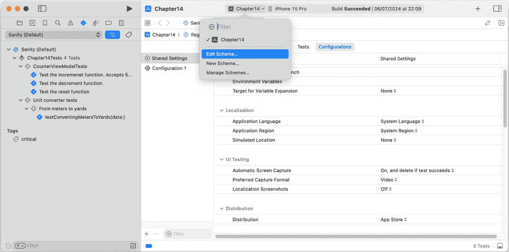

			<st c="39710">Figure 14.17: Editing the current Scheme</st>
			*<st c="39750">Figure 14</st>**<st c="39760">.17</st>* <st c="39763">shows how to reach</st> <st c="39782">the pop-up</st> *<st c="39794">Scheme</st>* <st c="39800">menu.</st> <st c="39807">Tapping on the</st> **<st c="39822">Edit Scheme…</st>** <st c="39834">option leads us to the</st> **<st c="39858">Edit Scheme</st>** <st c="39869">screen (</st>*<st c="39878">Figure 14</st>**<st c="39888">.18</st>*<st c="39891">):</st>
			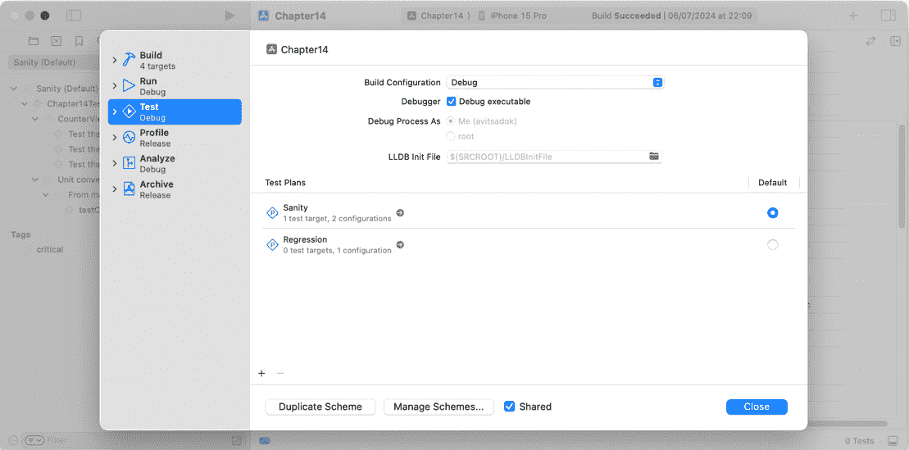

			<st c="40152">Figure 14.18: The Edit Scheme screen</st>
			*<st c="40188">Figure 14</st>**<st c="40198">.18</st>* <st c="40201">shows that the</st> *<st c="40217">Scheme</st>* <st c="40223">has six different actions—</st>**<st c="40250">Build</st>**<st c="40256">,</st> **<st c="40258">Run</st>**<st c="40261">,</st> **<st c="40263">Test</st>**<st c="40267">,</st> **<st c="40269">Profile</st>**<st c="40276">,</st> **<st c="40278">Analyze</st>**<st c="40285">, and</st> **<st c="40291">Archive</st>**<st c="40298">. In this screenshot, we will focus on the</st> **<st c="40341">Test</st>** <st c="40345">action.</st>
			<st c="40353">Besides choosing the configuration (</st>**<st c="40390">Debug</st>** <st c="40396">or</st> **<st c="40400">Release</st>** <st c="40407">in our case), we can determine what test plans to run.</st> <st c="40463">We can add an existing or new test plan using the plus button at the</st> <st c="40532">bottom left.</st>
			<st c="40544">That’s where we decide what happens when executing the</st> **<st c="40600">Test</st>** <st c="40604">action on our</st> *<st c="40619">Scheme</st>*<st c="40625">. Having several</st> *<st c="40642">Schemes</st>* <st c="40649">configured differently for various purposes can be valuable when we connect our project to a</st> <st c="40743">CI/CD system.</st>
			<st c="40756">For example, we can run a performance test once a month and sanity every night, just by creating two different Schemes that run different</st> <st c="40895">test plans.</st>
			<st c="40906">Now that we know how to create</st> <st c="40937">test functions, suites, test plans, and Schemes, let’s flip to the other side of the equation and see how to write</st> <st c="41053">testable code.</st>
			<st c="41067">Tips to write testable code</st>
			<st c="41095">One of the biggest challenges</st> <st c="41126">developers face when they try to write tests for code is struggling to write tests for existing functions that could be more testable – for example, functions that contain code that performs network requests or functions that have external dependencies that are difficult to</st> <st c="41401">set up.</st>
			<st c="41408">Writing testable code usually goes hand in hand with writing clean and efficient code.</st> <st c="41496">However, we should still follow some writing guidelines if we want our functions to</st> <st c="41580">be testable.</st>
			<st c="41592">Let’s explore some of</st> <st c="41615">them now.</st>
			<st c="41624">Writing pure functions</st>
			**<st c="41647">Pure functions</st>** <st c="41662">are functions that, given the same</st> <st c="41697">input, always return</st> <st c="41718">the same output and don’t rely on external states or have any</st> <st c="41781">side effects.</st>
			<st c="41794">For instance, take the</st> <st c="41818">following example:</st>

```

class NumberFilter {

    var numbers: [Int] = []

    var filteredNumbers: [Int] = [] <st c="41914">func filterNumbers(predicate: (Int) -> Bool) {</st> self.filteredNumbers =

        self.numbers.filter(predicate)

    }

}

```swift

			<st c="42018">This code example contains a</st> `<st c="42048">NumberFilter</st>` <st c="42060">class with a function called</st> `<st c="42090">filterNumbers</st>`<st c="42103">. This class performs a predicate on an instance variable and stores the results in another</st> <st c="42195">instance variable.</st>
			<st c="42213">This is a classic example of a non-pure function, since it relies on an external variable and has a side effect.</st> <st c="42327">Now, imagine we want to test this function – it requires us to set up a</st> `<st c="42399">NumberFilter</st>` <st c="42411">instance and set the</st> `<st c="42433">numbers</st>` <st c="42440">variable.</st> <st c="42451">In addition, we need to check the result using the same</st> `<st c="42507">NumberFilter</st>` <st c="42519">instance, with the</st> `<st c="42539">filtersNumbers</st>` <st c="42553">instance.</st>
			<st c="42563">The class can change down the road and may require more setup than before, breaking</st> <st c="42648">our test.</st>
			<st c="42657">Instead, we can make this function</st> <st c="42692">pure,</st> <st c="42699">like this:</st>

```

func filterNumbers(_ numbers: [Int], predicate: (Int) -> Bool) -> [Int] {

    return numbers.filter(predicate)

}

```swift

			<st c="42818">In the modified example, our function</st> <st c="42856">receives the input as a parameter and returns the results as part of its output.</st> <st c="42938">This change makes it agnostic to external states and easy</st> <st c="42996">to test.</st>
			<st c="43004">Separating your code based on concerns</st>
			<st c="43043">As always, a good separation</st> <st c="43073">is crucial for our project maintenance (which we will cover in more detail in</st> *<st c="43151">Chapter 15</st>*<st c="43161">).</st> <st c="43165">However, separation is also essential</st> <st c="43203">for testing.</st>
			<st c="43215">The fundamental separation of concerns idea states that each part of our code, whether a variable, function, class, or module, should have one and only</st> <st c="43368">one responsibility.</st>
			<st c="43387">Let’s take the following code as</st> <st c="43421">an example:</st>

```

func processAndSaveData(_ input: String) -> Bool {

// 数据处理

let processedData = // <执行一些数据操作

    code>

// 数据保存

return databaseService.saveData(processedData)

}

```swift

			<st c="43627">The</st> `<st c="43632">processAndSaveData</st>` <st c="43650">function is responsible for two tasks – processing the input data and saving it to the</st> <st c="43738">database service.</st>
			<st c="43755">We can see that the string processing code uses the same function that performs data saving.</st> <st c="43849">If we want to test whether the string processing succeeded, we must also ensure that the output has been saved successfully.</st> <st c="43974">These two responsibilities are coupled, which makes the code very difficult</st> <st c="44050">to test.</st>
			<st c="44058">To solve that, we can separate the processing code into</st> <st c="44115">another function:</st>

```

func processAndSaveData(_ input: String) -> Bool {

    // 数据处理

    let processedData = processData(input)

    // 数据保存

    return databaseService.saveData(processedData)

} <st c="44306">private func processData(_ input: String) -> String {</st>

<st c="44359">return input.reversed()</st> }

```swift

			<st c="44385">In this example, we gave the processing data task its own function, and now it is possible to test it regardless</st> <st c="44497">of the</st> <st c="44505">data-saving part.</st>
			<st c="44522">Our last tip also discusses coupling but, in another context –</st> *<st c="44586">protocols</st>*<st c="44595">.</st>
			<st c="44596">Performing mocking using protocols</st>
			<st c="44631">Sometimes, we don’t have a choice</st> <st c="44665">but to test functions</st> <st c="44687">that reach our network or any external service that can’t really simulate</st> <st c="44762">during tests.</st>
			<st c="44775">To overcome that, we can easily create mocks for these services</st> <st c="44840">using</st> **<st c="44846">protocols</st>**<st c="44855">.</st>
			<st c="44856">Look at the</st> <st c="44869">following code:</st>

```

class UserViewModel {

    private let networkService<st c="44933">: NetworkServiceProtocol</st> var user: User? init(networkService<st c="44994">: NetworkServiceProtocol)</st> {

        self.networkService = networkService

    }

    func fetchUserDetails(for userId: String, completion:

    @escaping () -> Void) {

        networkService.fetchUserDetails(for: userId) {

        [weak self] user in

            self?.user = user

            completion()

        }

    }

}

```swift

			<st c="45243">This code example contains a</st> `<st c="45273">UserViewModel</st>` <st c="45286">class that fetches user details from the server and stores the results in an instance variable.</st> <st c="45383">Testing the</st> `<st c="45395">fetchUserDetails</st>` <st c="45411">function requires performing a request to the server, which can make our</st> <st c="45485">test unstable.</st>
			<st c="45499">To solve that, we can create a mock class that conforms to</st> `<st c="45559">NetworkServiceProtocol</st>` <st c="45581">and simulate the</st> <st c="45599">network service:</st>

```

class MockNetworkService: NetworkServiceProtocol {

    var userToReturn: User? func fetchUserDetails(for userId: String, completion:

    @escaping (User?) -> Void) {

        completion(userToReturn)

    }

}

```swift

			<st c="45802">This example demonstrates a mock</st> <st c="45835">class that accepts</st> <st c="45854">a user’s return and can easily mock the whole network process.</st> <st c="45918">We achieved that by using a protocol and dependency injection, and we can do the same to store data, authenticate, and</st> <st c="46037">so on.</st>
			<st c="46043">Summary</st>
			<st c="46051">Testing is crucial to our mission to produce stable, high-quality code.</st> <st c="46124">Remember, writing tests is not just a fundamental part of being a professional iOS developer – it is also part of a culture of doing</st> <st c="46257">things right.</st>
			<st c="46270">In this chapter, we’ve learned about the testing history in Xcode, covered the Swift Testing basics by writing simple tests, learned how to manage our tests using suites, test plans, and Schemes, and even discussed some useful tips to make our code more testable.</st> <st c="46535">Now, we should be able to set up a new test plan for</st> <st c="46588">our project!</st>
			<st c="46600">Our following and final chapter, on architecture, touches on some of the principles we discussed here and will also help us create a</st> <st c="46734">stable project.</st>

```
