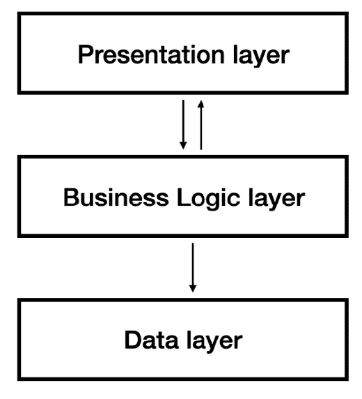
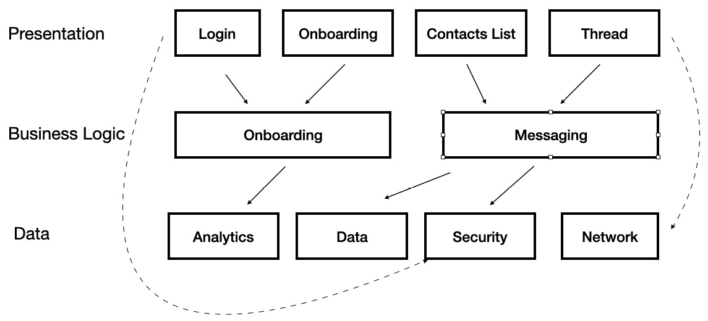
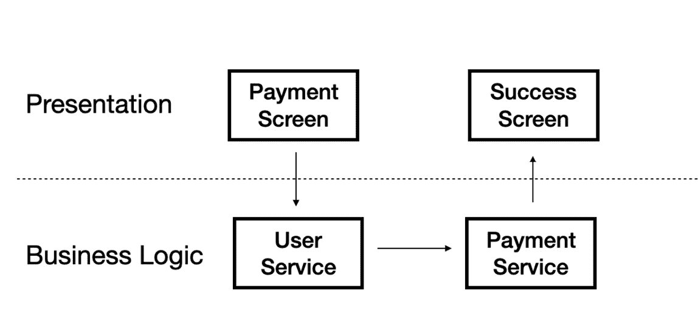
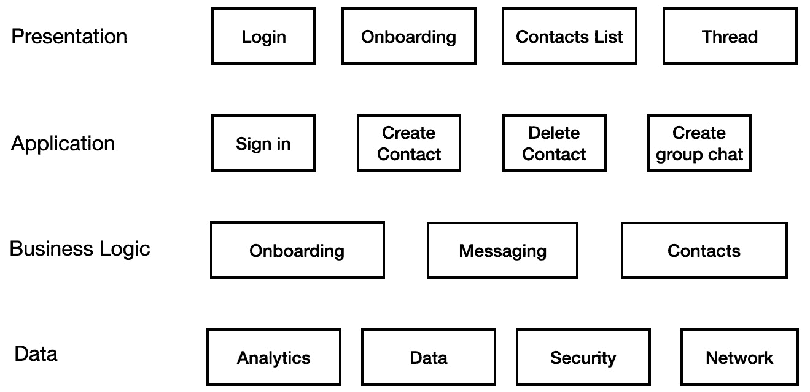
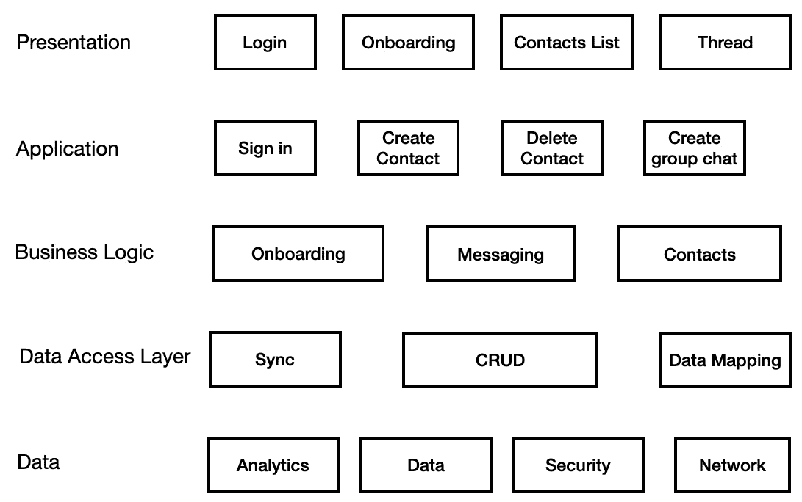
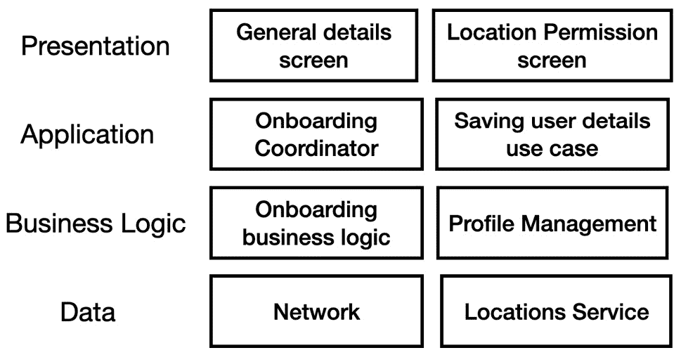
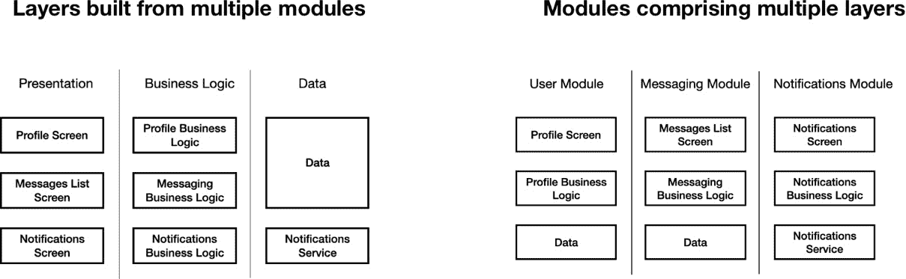
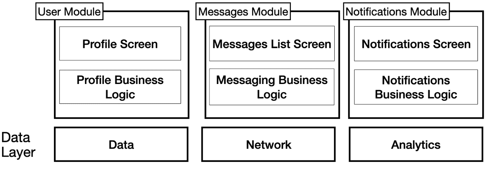
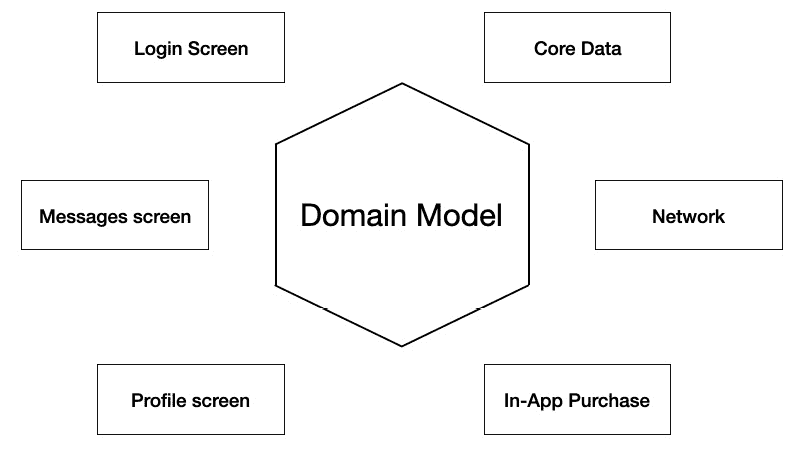
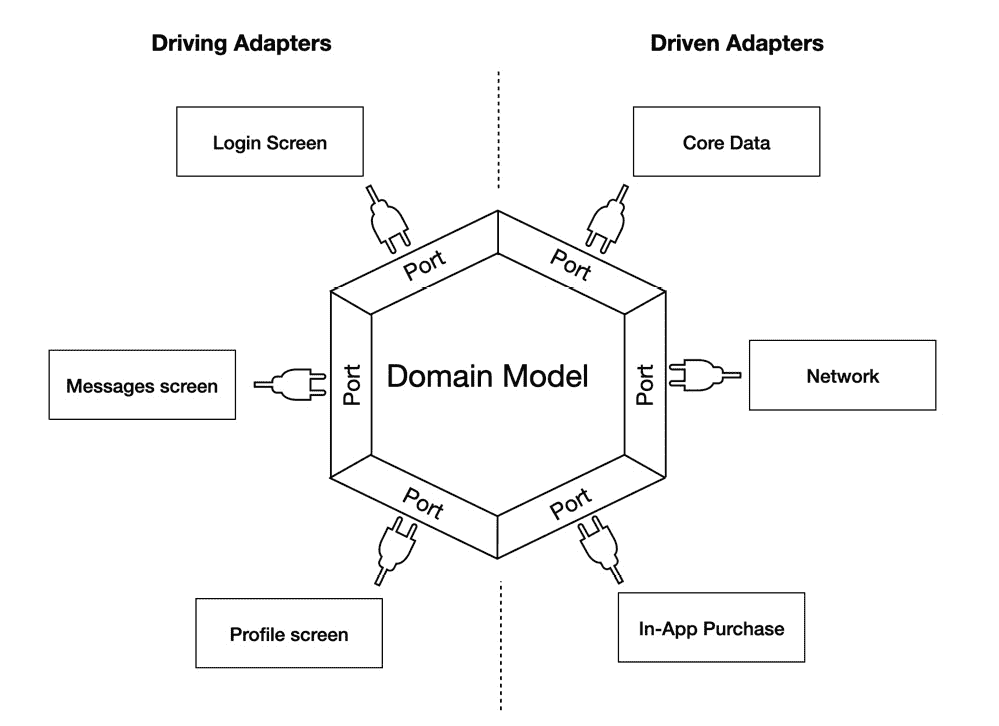

# <st c="0">15</st>

# <st c="3">探索适用于 iOS 的架构</st>

<st c="35">在前一章中，我们讨论了 Swift 测试，这是一个帮助我们测试 Swift 代码的必要框架。</st> <st c="147">应用测试不仅是一个技术话题——它也是一种文化。</st> <st c="213">这种文化的一部分是将我们的项目视为一组类和具有一定逻辑的整体结构。</st> <st c="324">这就是为什么测试和架构密不可分——它们都把我们的项目视为一个设计良好的系统。</st> <st c="435">这种整体方法对于满足我们的产品需求</st> <st c="504">至关重要。</st>

<st c="514">在本章中，我们将涵盖以下主题：</st> <st c="550">理解架构的重要性</st>

+   <st c="567">理解架构的重要性</st> <st c="597">。</st>

+   <st c="612">学习架构究竟是什么</st>

+   <st c="650">了解不同的架构，如多层、模块化、和六边形</st>

+   <st c="734">通过分离、测试、和维护来比较不同的架构</st>

<st c="813">首先，让我们了解为什么架构</st> <st c="858">如此重要。</st>

# <st c="871">技术要求</st>

<st c="894">为了本章，您必须从 Apple 的 App Store 下载 Xcode 版本 16.0 或更高版本。</st>

<st c="981">您还需要运行最新版本的 macOS（Ventura 或更高版本）。</st> <st c="1054">在 App Store 中搜索 Xcode，选择并下载最新版本。</st> <st c="1132">启动 Xcode 并遵循系统可能提示的任何附加安装说明。</st> <st c="1235">一旦 Xcode 完全启动，您就准备好了</st> <st c="1279">出发。</st>

# <st c="1285">理解架构的重要性</st>

<st c="1330">为了理解</st> <st c="1345">架构的重要性，让我们尝试理解 iOS 开发知识</st> <st c="1435">是如何构建的。</st>

<st c="1444">许多人认为 iOS 开发是以 Swift 为中心的——如果我们知道 Swift，我们就知道</st> <st c="1533">iOS 开发了。</st>

<st c="1549">尽管如此，iOS 开发包含许多知识层次，Swift 语言只是其中之一</st> <st c="1646">。</st>

<st c="1654">让我们尝试将 iOS 开发</st> <st c="1668">结构化到不同的层次：</st> <st c="1701">。</st>

+   **<st c="1718">IDE</st>**<st c="1722">：熟悉 Xcode，其调试工具、配置、模拟器、构建器和代码签名</st> <st c="1822">至关重要。</st>

+   **<st c="1833">语言</st>**<st c="1842">：无论是 Swift、Objective C 还是 C++，语言是 iOS 开发的根本部分。</st> <st c="1937">它是我们每天实现应用逻辑和</st> <st c="1995">设计模式的基础。</st>

+   **<st c="2010">系统</st>**<st c="2017">：理解 iOS 的独特特性、优势和局限性是关键。</st> <st c="2099">最终，我们是在一个具有自己规则</st> <st c="2176">和政策的环境中开发。</st>

+   **<st c="2189">SDK</st>**<st c="2193">：SDK 提供了工具集，让我们能够做我们想要做的任何事情。</st> <st c="2249">SwiftUI、UIKit、Foundation、Core Animation 以及许多其他框架都是 SDK 的一部分，有了它们，我们可以创建带有用户输入组件和</st> <st c="2418">持久存储的美丽界面。</st>

+   **<st c="2437">设计模式</st>**<st c="2453">：这些是解决我们日常遇到的常见问题和任务的解决方案。</st> <st c="2508">我们。</st>

+   **<st c="2524">架构</st>**<st c="2537">：我们代码和项目的整体组织结构被称为</st> <st c="2602">其架构。</st>

<st c="2619">我们可以继续学习更多知识层面——测试、数据库、网络、安全等。</st> <st c="2717">随着时间推移，知识范围变得非常广泛，需要更多的能力和</st> <st c="2808">知识。</st>

<st c="2827">尽管如此，许多 iOS 开发者在构建应用时并没有关注架构，这有一些明显的理由。</st> <st c="2951">例如，开发者更喜欢看到即时的结果。</st> <st c="3008">有时，这不仅仅是一个选择的问题——有截止日期要遵守，资源不足迫使我们必须尽快</st> <st c="3163">发布我们的功能。</st>

<st c="3175">然而，忽视良好的架构规划通常是由于缺乏经验和短期关注，这为我们提供了关于架构重要性的线索。</st> <st c="3327">架构。</st>

<st c="3343">让我们列出一些良好的架构对我们</st> <st c="3377">项目</st> <st c="3402">的影响：</st>

+   **<st c="3414">可维护性</st>**<st c="3430">：我们的项目可能会变得更大，维护起来更具挑战性。</st> <st c="3508">良好的架构使我们的代码库更容易理解和阅读。</st> <st c="3593">它还使修改</st> <st c="3627">和重构变得更加容易。</st>

+   **<st c="3640">可扩展性</st>**<st c="3652">：在保持我们的项目简单和稳定的同时添加更多功能是应用成功的关键。</st> <st c="3765">糟糕的架构可能需要在添加</st> <st c="3843">新功能时进行重大重构。</st>

+   **<st c="3856">灵活性</st>**<st c="3868">：良好的架构使我们能够根据需求的变化快速更改应用的工作方式。</st> <st c="3975">它还帮助我们添加新功能或替换</st> <st c="4020">第三方框架。</st>

<st c="4043">这些都是良好建筑的一些好处，但图景很清晰——我们将主要讨论</st> **<st c="4140">长期影响</st>**<st c="4159">。短期内努力创建更多类、层和协议似乎是一个大麻烦。</st> <st c="4263">除了编码之外，良好的架构还需要前期努力，如良好的规划、技术设计和对范式和模式的良好理解</st> <st c="4396">。</st>

<st c="4409">在我们讨论不同类型的建筑之前，让我们定义一下建筑的含义以及什么构成了</st> <st c="4519">好的建筑。</st>

# <st c="4537">了解建筑究竟是什么</st> <st c="4572">意味着</st>

<st c="4575">许多开发者</st> <st c="4592">在架构和我们所说的“设计模式”之间感到困惑。</st> <st c="4658">我们之前在讨论不同知识层次时（在</st> *<st c="4757">理解架构的重要性</st>* <st c="4801">部分）提到了这一点，尽管这听起来像是一个语义上的差异，但理解这种区别至关重要。</st> <st c="4910">虽然架构指的是我们应用的</st> *<st c="4943">高级组织</st>* <st c="4966">，例如层、模块和组件，但设计模式是</st> *<st c="5040">针对常见问题的可重用解决方案</st>* *<st c="5062">。</st>

<st c="5078">为了更好地解释这一点，让我们想象一座建筑。</st> <st c="5129">在规划私人住宅时，我们必须决定其楼层数、入口、屋顶和车库。简而言之，这就是</st> <st c="5246">房子的建筑。</st>

与此相反，每一层楼都有自己的目标和指定用途。<st c="5292">例如，一层可以是厨房和客厅，而第二层则是卧室。</st> <st c="5326">为了实现这一点，我们需要为每一层楼规划内部设计，决定房间的尺寸、门的布局以及不同的电线和水管。</st> <st c="5423">在大多数情况下，这里没有技巧可言——需要遵循标准。</st> <st c="5589">这些楼层的内部设计可以被视为设计模式——针对常见问题的可重用、特定解决方案。</st>

现在，让我们回到我们的移动应用。我们应该将移动应用的结构想象成一个私人住宅。数据在不同的层级中流动——数据、业务逻辑和**<st c="5953">用户界面</st>**（**<st c="5969">UI</st>**<st c="5971">）。我们可以将每一层看作是我们家里的不同楼层。在每一层（或楼层）中，我们可以使用各种设计模式来解决其他问题。例如，我们可以使用 Singleton 来管理共享资源或协调器来简化复杂的导航需求。

我们知道的更多设计模式，我们就有更多的解决方案。

此外，让我们继续使用房屋的隐喻。在这种情况下，我们可以得出另一个结论——我们关于架构的选择会影响我们用于楼层的设计模式，包括楼层的尺寸和形状，甚至它们是如何连接的。

那么，有哪些不同的架构类型可供选择，我们如何选择一个适合我们需求的架构呢？

# 概述不同的架构

开发者在选择项目架构时犯有两个常见的错误。首先，他们经常说，“</st>*<st c="6825">我正在使用什么架构来构建我的应用？</st> <st c="6867">MVVM，</st>* *<st c="6873">当然</st>*<st c="6882">！”

MVVM 不是一个架构——它是一个旨在解决特定屏幕状态和逻辑管理的模式。它不仅不处理应用结构，甚至也不描述我们通常如何处理我们的屏幕。它只描述了特定的屏幕，例如登录或设置屏幕。

第二个错误是认为我们只能从列表中选择最常见和最受欢迎的架构之一用于我们的项目。实际上，你读到的大多数架构实际上是一套原则，可以帮助我们决定如何构建项目。

一些原则提供了灵活性和解耦，而另一些可能会增加项目开销。我们应该始终考虑权衡；这些在架构设计中变得更加重要。

让我们从最基本的设计理念开始：多层架构。

## 将我们的项目分层

<st c="7778">值得花点时间讨论一下我这里使用的两个重要术语。</st> <st c="7784">第一个是一个</st> *<st c="7875">项目</st>** <st c="7882">而不是一个</st> *<st c="7894">应用</st>**<st c="7897">。之所以这样，是因为我们的架构决策与整个项目相关——pods、Swift 包、扩展，甚至是其他应用。</st> <st c="8044">当我们谈论结构时，应用只是我们产品的表达以及我们如何</st> <st c="8131">部署它。</st>

<st c="8141">第二个术语是使用</st> *<st c="8167">层</st>** <st c="8173">而不是</st> *<st c="8185">层</st>** <st c="8190">——开发者常见的错误。</st> <st c="8228">当我们讨论将系统分层时，我们通常指的是硬件分离——不同的计算机、服务器、路由器或其他硬件组件。</st> <st c="8385">在讨论将软件如应用</st> <st c="8466">或 SDK 分层时，我们应该使用术语</st> *<st c="8408">层</st>**。</st>

将项目分层，通常分为三层，是许多项目中的常见架构决策。<st c="8576">这个想法是，一个基本项目至少有三个不同层次的数据和逻辑处理（</st>*<st c="8673">图 15</st>**<st c="8683">.1</st>*<st c="8685">）：</st>



<st c="8745">图 15.1：三层架构</st>

*<st c="8786">图 15</st>**<st c="8796">.1</st>** <st c="8798">显示了</st> <st c="8804">我们通常将应用分为的三个层。</st>

<st c="8860">让我们尝试理解</st> <st c="8885">这些层：</st>

+   **<st c="8898">数据</st>** <st c="8903">有时也可以称为</st> **<st c="8928">服务</st>**<st c="8936">。数据层处理数据的持久存储、模型实体、网络处理以及主要处理低级别数据的各种服务，而不考虑</st> <st c="9099">项目的逻辑。</st>

+   **<st c="9113">业务逻辑</st>** <st c="9128">有时也可以称为</st> **<st c="9153">领域</st>**<st c="9159">。业务逻辑层处理应用的主要逻辑，包括规则和</st> <st c="9236">数据处理。</st>

+   **<st c="9255">表示层</st>** <st c="9268">处理</st> <st c="9277">UI、用户交互</st> <st c="9303">和导航。</st>

<st c="9318">有些模式甚至有更多层——例如，一个</st> *<st c="9383">应用</st>** <st c="9394">层，它处理不同的用例，可以放在表示层之下，或者一个</st> *<st c="9494">基础设施</st>** <st c="9508">层，它处理类扩展、工具</st> <st c="9553">等。</st>

<st c="9562">如果你是一位经验丰富的开发者，将项目分离的想法应该是显而易见的。</st> <st c="9652">分离代码创建了一个可测试和可维护的结构，随着时间的推移可以扩展。</st> <st c="9744">然而，使用层的想法并不</st> <st c="9792">总是显而易见。</st>

<st c="9807">最终，这取决于数据在应用中的流动方式。</st>

### <st c="9871">控制应用数据流</st>

<st c="9901">数据流是</st> <st c="9916">任何程序的核心主题。</st> <st c="9947">为了阐明这个术语，我们必须检查不同应用组件之间消息和数据是如何流动的。</st> <st c="10050">例如，当用户在其屏幕上的一个按钮上点击</st> **<st c="10084">保存</st>** <st c="10088">按钮时，我们需要将这个点击转换成一个实际的逻辑</st> <st c="10171">决策，并将其继续到持久存储，在那里我们可以将信息本地保存。</st> <st c="10268">数据流不会在这里结束 – 在这一点上，我们需要向 UI 发送一个消息，表示持久存储中已经发生了变化，我们应该更新屏幕上的内容。</st>

<st c="10452">此示例仅演示了一个单一用例。</st> <st c="10503">标准移动应用可能有数百种此类情况，强调了考虑如何划分</st> <st c="10614">我们的项目的重要性。</st>

<st c="10626">现在我们了解了数据流，让我们来讨论</st> **<st c="10679">开放</st>** <st c="10683">和</st> **<st c="10688">封闭</st>** <st c="10694">层。</st> <st c="10703">在三层架构中，如</st> *<st c="10750">图 15</st>**<st c="10759">.1</st>*<st c="10761">所示，表示层与业务逻辑层进行通信。</st> <st c="10830">但是，这意味着表示层也可以与</st> <st c="10922">数据层</st>进行通信吗？

<st c="10933">例如，表示层可能直接从数据层接收数据变更的更新。</st> <st c="11033">在这些情况下，与业务逻辑作为中间件一起工作可能更加复杂和繁琐。</st> <st c="11126">在这种情况下，我们必须决定我们的层是开放的</st> <st c="11184">还是封闭的。</st>

<st c="11194">开放层允许</st> <st c="11216">上层和下层之间的直接交互。</st> <st c="11275">虽然开放层提供了更高的灵活性和简单性，但它们也可能增加耦合并减少关注点的分离。</st>

<st c="11406">一个</st> <st c="11408">封闭层强制执行严格的交互，并且其相邻层之间的每次通信都必须通过封闭层本身。</st> <st c="11543">封闭层可以增加关注点的分离并减少耦合，同时降低灵活性和</st> <st c="11655">增加复杂性。</st>

<st c="11677">在处理三层架构时，讨论封闭层和开放层可能听起来有些奇怪。</st> <st c="11785">中间层（业务逻辑）是唯一一个可以是开放或封闭的层。</st> <st c="11872">然而，我们可以决定层是严格封闭还是</st> <st c="11928">选择性封闭。</st>

<st c="11947">每一层都是由一组组件构建的。</st> <st c="11967">例如，表示层可以由不同的应用程序屏幕或流程构建。</st> <st c="11994">业务逻辑层可以由应用程序的不同逻辑部分构建，而数据层是由不同的服务构建的，例如网络、数据</st> <st c="12244">和安全。</st>

<st c="12257">在某些情况下，表示层中的组件必须直接与</st> <st c="12352">数据层</st>进行通信。

<st c="12363">查看</st> *<st c="12372">图 15</st>**<st c="12381">.2</st>*<st c="12383">，它</st> <st c="12391">展示了消息应用程序的基本三层架构：</st>



<st c="12593">图 15.2：选择封闭层</st>

*<st c="12628">图 15</st>**<st c="12638">.2</st>* <st c="12640">显示了之前讨论过的相同三层——表示层、业务逻辑层和数据层。</st> <st c="12732">然而，这次，我们将层分解为不同的组件。</st> <st c="12798">此外，我们展示了多个组件之间的各种通信路径。</st> <st c="12887">例如，登录 UI 组件与应用程序的入职逻辑部分通信，而消息逻辑部分与数据和安全组件通信。</st> <st c="13060">尽管大多数通信都通过业务逻辑层进行，但我们看到一些例外。</st> <st c="13154">例如，以下例外</st> <st c="13192">可能适用：</st>

+   <st c="13204">登录 UI 组件直接与安全组件通信，可能为了了解当前的</st> <st c="13307">认证状态</st>

+   <st c="13328">线程 UI 组件与网络组件通信，以在 UI 中展示网络状态</st> <st c="13427">的</st>

<st c="13433">我们可以动脑筋想出一种方法让这些情况通过业务逻辑层；然而，在某些情况下，绕过它并直接访问数据层是完全可接受的。</st> <st c="13615">在某些情况下。</st>

<st c="13626">我们选择的架构服务于我们的项目需求，而不是相反。</st> <st c="13705">然而，我们需要定义一种绕过业务逻辑层的策略，因为每个例外，包括在</st> *<st c="13825">图 15</st>**<st c="13834">.2</st>*<st c="13836">中描述的，都会在我们的结构中造成另一种耦合。</st>

<st c="13880">我们讨论了架构的三个层级，但这是否总是三个层级？</st> <st c="13952">我们是否有更多的层级？</st> <st c="13976">让我们找出是否有可能创建一个更复杂但更有用的架构。</st> <st c="14047">是可能的。</st>

### <st c="14059">添加更多层级</st>

<st c="14078">与</st> <st c="14091">三层协同工作是在简单性和良好分离之间的最佳平衡点。</st> <st c="14164">然而，在大项目中，有时仍需要满足关注点分离的原则。</st> <st c="14269">尽管只有一个层用于展示和另一个层用于业务逻辑看起来非常直接，但仍然存在一些需要澄清的困境。</st> <st c="14419">需要澄清。</st>

<st c="14438">以 iOS 应用程序中可能拥有的两个不同组件为例——用户服务和支付服务。</st> <st c="14555">两者都是应用程序业务逻辑的一部分。</st> <st c="14598">当用户想要进行购买时，我们想使用用户服务来检查他们的角色，然后转到支付服务进行购买。</st> <st c="14746">购买后，我们想将用户导航到屏幕并显示支付成功。</st> <st c="14860">因此，我们可以看到我们有一个涉及整合不同的业务逻辑服务和协调不同屏幕的用例（</st>*<st c="14997">图 15</st>**<st c="15007">.3</st>*<st c="15009">）：</st>



<st c="15109">图 15.3：支付用例，结合多个组件和层</st>

<st c="15184">我们需要</st> <st c="15196">在展示逻辑、业务逻辑，还是在这里和那里的一半来管理该用例吗？</st> <st c="15299">好吧，这种逻辑可能分布在组件中，或者集中在一个屏幕视图模型中。</st> <st c="15410">记住，在大多数情况下，视图模型处理的是 UI 状态而不是应用程序逻辑。</st>

<st c="15491">处理与导航捆绑的用例的问题并不新鲜，在更复杂且需要更多灵活性的应用程序中，在设计我们的</st> <st c="15681">应用程序结构时需要考虑这一点。</st>

<st c="15695">因此，为了分离我们的关注点，我们可以添加另一个层——</st> **<st c="15757">应用</st>** <st c="15768">层，它可以处理特定的应用程序用例（</st>*<st c="15818">图 15</st>**<st c="15828">.4</st>*<st c="15830">）：</st>



<st c="16035">图 15.4：四层架构</st>

*<st c="16073">图 15</st>**<st c="16083">.4</st>* <st c="16085">显示了与</st> *<st c="16126">图 15</st>**<st c="16135">.2</st>*<st c="16137">相似的一种</st>架构设计，这次加入了应用层。</st> <st c="16177">应用层有四个用例：登录，**<st c="16228">创建联系人</st>**<st c="16242">，**<st c="16244">删除联系人</st>**<st c="16258">，以及</st> **<st c="16264">创建群聊</st>**<st c="16281">。这些用例处理从调用其他组件中的函数到导航的所有事情。</st> <st c="16375">应用层使业务层和表示层从特定的</st> <st c="16462">应用逻辑</st>中变得更加清晰。</st>

<st c="16472">我们还能添加更多层吗？</st>

<st c="16507">应用层协调多个组件以创建特定于应用的逻辑。</st> <st c="16595">我们可以在架构的底部实现相同的概念，即在业务逻辑和数据层之间。</st>

<st c="16715">例如，让我们讨论一个数据同步过程。</st> <st c="16764">从网络检索数据并将其存储在持久存储中是一个复杂的过程，涉及错误处理和处理各种边缘情况。</st> <st c="16919">这是业务逻辑的一部分还是</st> <st c="16959">数据层的一部分？</st>

<st c="16970">数据操作</st> <st c="16988">和**<st c="16993">创建、读取、更新和删除</st>** <st c="17025">(**<st c="17027">CRUD</st>**<st c="17031">)操作也是不清楚在哪个层处理这些任务的。</st>

<st c="17105">因此，为了处理不是业务逻辑但专注于从各种来源访问和管理数据的任务，我们可以添加</st> <st c="17228">另一个称为</st> **<st c="17253">数据访问层</st>** <st c="17270">(</st>*<st c="17272">图 15</st>**<st c="17281">.5</st>*<st c="17283">):</st>



<st c="17529">图 15.5：数据访问层</st>

*<st c="17559">图 15</st>**<st c="17569">.5</st>* <st c="17571">显示了我们的</st> <st c="17582">架构从</st> *<st c="17600">图 15</st>**<st c="17609">.4</st>*<st c="17611">，现在增加了一个额外的层——数据访问层，该层处理同步服务、CRUD 操作和数据映射，将数据模型对象转换为业务</st> <st c="17776">逻辑实体。</st>

<st c="17791">拥有超过三层可能会听起来过于复杂，并暗示过度设计。</st> <st c="17872">然而，这种策略确保了不同层之间关注点的优秀分离。</st> <st c="17966">业务逻辑不涉及数据操作，表示层不处理复杂用例。</st> <st c="18081">在中型和大型应用中，当我们的应用变得更大时，将我们的项目分为四到五层可能会带来回报。</st>

<st c="18192">将项目分层只是我们可以考虑的视角之一。</st> <st c="18282">我之前提到过，像这样的架构模式更像是一种原则。</st> <st c="18369">真正的力量在于我们结合不同的模式。</st> <st c="18426">让我们来探讨模块化架构模式。</st>

## <st c="18474">将我们的项目划分为模块</st>

<st c="18510">我提到过</st> <st c="18527">将项目分层只是我们可以从项目中观察到的视角之一。</st> <st c="18606">然而，这究竟意味着什么？</st>

<st c="18633">以我们的即时通讯应用程序为例。</st> <st c="18678">不同的层代表不同的关注点：展示、业务逻辑和数据。</st> <st c="18769">我们的应用程序数据从 UI 层流向数据层，然后再返回。</st>

<st c="18840">另一种看待我们的应用程序的方式是通过封装一组功能或特定业务领域单位的代码单元。</st> <st c="18941">我们可以将这些代码单元称为**<st c="19001">模块</st>**。</st>

### <st c="19009">了解在模块开发中需要考虑的不同因素</st>

<st c="19076">将我们的项目划分为模块需要仔细考虑，因为这个步骤对于应用程序的结构随时间发展至关重要。</st> <st c="19091">例如，在即时通讯应用程序中，模块可以是用户认证模块、用户资料模块、联系人模块和消息模块。</st> <st c="19204">这些模块反映了应用程序的不同领域，并且将我们的应用程序划分为模块的决定非常灵活。</st>

<st c="19448">然而，一些关键因素可以帮助我们决定：</st>

+   **<st c="19494">功能性和业务领域</st>**<st c="19528">：我们已经在上一段中提到过这一点。</st> <st c="19584">将应用程序分解为核心功能可以是我们理解项目不同模块——逻辑、歌曲播放器、提醒、入门等——的一个很好的开始。</st>

+   **<st c="19754">可重用性</st>**<st c="19766">：将我们在应用程序的不同部分使用的功能分组是理解如何创建模块的另一种方式。</st> <st c="19891">例如，如果我们的应用程序执行不同的 HTTP 请求，我们可能会创建一个网络模块来管理所有的 API 调用。</st> <st c="20009">另一个例子是共享组件——如果我们使用相同的按钮在不同的屏幕上，这可能是一个迹象，表明它应该是包含不同可重用组件的 UI 模块的一部分。</st>

+   **<st c="20201">解耦</st>**<st c="20212">：我们的模块应该尽可能地与其他模块解耦。</st> <st c="20290">模块之间的相互依赖程度可以定义是否将其创建为模块是一个优秀的决定。</st> <st c="20404">此外，如果可以为模块创建一个清晰的接口，这也是它可能是一个</st> <st c="20514">好模块的另一个迹象。</st>

+   **<st c="20526">协作</st>**<st c="20540">：想象一下</st> <st c="20556">几个团队正在我们的项目上工作。</st> <st c="20598">他们可以不互相干扰地工作，这表明模块的分离做得很好。</st> <st c="20696">请注意，无论我们是一个人的团队还是由六个开发者组成的五个团队，这条规则的相关性都是一样的。</st> <st c="20827">原则是</st> <st c="20844">最重要的。</st>

<st c="20856">我们必须问自己：我们能否创建另一个应用程序，并在新应用程序中使用我们的一些模块，就像使用乐高积木一样？</st> <st c="20974">我们能否单独测试每个模块？</st> <st c="21010">这些问题可以让我们对模块是否真正独立或存在</st> <st c="21096">紧密耦合有一定的认识。</st>

### <st c="21111">组织我们项目中的代码</st>

<st c="21146">关于将我们的代码组织成模块的几点说明</st> <st c="21159">——模块是一个抽象的定义，因为没有任何官方的技术方法可以将我们的代码正式地分成模块。</st> <st c="21312">然而，我们可以区分两种方法——</st> **<st c="21365">物理</st>** <st c="21373">和</st> **<st c="21378">功能</st>**<st c="21388">：</st>

+   <st c="21390">在物理方法中，我们使用专用工具创建我们的模块。</st> <st c="21462">例如，CocoaPods、Swift Packages 和 XCFrameworks 提供了一种将我们的代码物理封装成</st> <st c="21576">代码单元的方法。</st>

+   <st c="21587">在功能方法中，我们不使用任何特定工具，而是将代码组织成文件夹。</st> <st c="21692">这种简单的方法非常适合小型项目</st> <st c="21741">或团队。</st>

<st c="21750">在这里的主要考虑因素很明显：物理方法中的可重用性和独立性，与功能方法中的简洁性和灵活性。</st> <st c="21910">然而，让我们更深入地探讨，使这种比较更加实用和与我们作为 iOS 开发者日常工作的相关性。</st> <st c="22017">iOS 开发者。</st>

<st c="22032">创建一个新项目并理解不同的模块可能相当具有挑战性。</st> <st c="22122">一方面，良好的规划对于我们的项目开发在时间上的成功至关重要。</st> <st c="22218">另一方面，预测我们的项目在未来几年如何发展是不可能的。</st> <st c="22308">因此，我们在一开始需要的是灵活性。</st> <st c="22358">因此，从功能方法开始，即通过文件夹创建模块，可能是大多数项目的正确方法。</st>

<st c="22496">随着项目的增长，我们模块的灵活性可能成为其劣势。</st> <st c="22595">物理方法的一个优点是我们通过将代码封装到 pod 或包中，为我们的模块创建了清晰的边界。</st> <st c="22682">这些边界阻止我们在不正确处理不同依赖项的情况下包含外部类和类型。</st> <st c="22751">它们还迫使我们为模块声明一个清晰的接口，因为私有和内部函数和类从外部不可访问。</st> <st c="22876">随着项目的演变和开发团队的壮大，这些限制是基本且有价值的。</st> <st c="23021">不同的 pod 或包允许其他团队独立地对每个模块进行工作、构建和测试。</st> <st c="23122">它甚至允许我们在</st> <st c="23228">不同的项目中共享相同的模块。</st>

<st c="23291">既然我们已经确信模块很重要，那么层级的想法如何适应呢？</st> <st c="23386">我们必须在层级和模块之间做出选择吗？</st> <st c="23435">还是它们是</st> <st c="23448">同一件事？</st>

<st c="23459">让我们尝试将事物</st> <st c="23484">整理有序。</st>

## <st c="23493">将多层架构与模块相结合</st>

<st c="23545">我们之前</st> <st c="23559">提到，多层和模块更像是架构模式或概念。</st> <st c="23645">它们是我们构建应用程序的指南，在我们的项目中结合不同的概念和模式是常见的做法，而不是仅仅</st> <st c="23806">坚持一种模式。</st>

<st c="23818">以应用入职模块为例（</st>*<st c="23870">图 15</st>**<st c="23880">.6</st>*<st c="23882">）：</st>



<st c="24104">图 15.6：入职模块</st>

*<st c="24138">图 15</st>**<st c="24148">.6</st>* <st c="24150">展示了分层的入职模块结构，分为四个不同的层级。</st> <st c="24225">将模块化和多层架构相结合的一种方法是将每个模块分离到不同的层级中创建一个矩阵结构。</st> <st c="24360">在这种情况下，入职模块包括展示、协调器、业务逻辑，</st> <st c="24445">和数据。</st>

<st c="24454">另一种情况涉及由几个模块构建的层。</st> <st c="24465">在这种情况下，每一层都是由几个模块构建的业务单元。</st>

<st c="24585">让我们比较</st> <st c="24600">这两个架构：</st>



<st c="24863">图 15.7：比较模块和层的两种组合方法</st>

*<st c="24936">图 15</st>**<st c="24946">.7</st>* <st c="24948">展示了我们讨论的两种方法并排展示。</st> <st c="25001">乍一看，这两种方法看起来很相似，只是从不同的角度来看。</st> <st c="25089">然而，它们代表了两个不同的项目需求，并且极大地影响了可扩展性、独立性和耦合性。</st>

<st c="25215">例如，让我们看看数据模块。</st> <st c="25259">在右侧（</st>**<st c="25278">包含多个层的模块</st>**<st c="25313">），我们可以看到每个模块都有自己的数据模块。</st> <st c="25366">然而，在左侧（</st>**<st c="25393">由多个模块构建的层</st>**<st c="25428">），我们有一个可以服务于各种屏幕和业务单元的数据模块。</st> <st c="25507">对于更多数据层模块，如分析、网络和安全性也是如此。</st>

<st c="25590">当我们考虑时，为了使模块真正独立，它需要包含所有层和服务。</st> <st c="25699">这也意味着在某些情况下，我们可能需要复制一些代码在</st> <st c="25764">某些情况下。</st>

<st c="25775">一如既往，我们在封装性和独立性以及集中逻辑和一致性之间有一个权衡。</st> <st c="25887">因此，在实践中，我们必须平衡这一点，创建一个混合方法，并结合两种方法（</st>*<st c="25997">图 15</st>**<st c="26007">.8</st>*<st c="26009">）的元素：</st>



<st c="26234">图 15.8：由模块构建的层和包含多个层的模块的组合</st>

*<st c="26321">图 15</st>**<st c="26331">.8</st>* <st c="26333">展示了我们讨论的混合方法。</st> <st c="26377">注意，我们有几个模块——</st> **<st c="26415">用户</st>**<st c="26419">、**<st c="26421">消息</st>**<st c="26429">和**<st c="26435">通知</st>** <st c="26448">——每个都包含屏幕和业务逻辑。</st> <st c="26495">然而，数据、网络和分析服务是在不同的模块之间共享的。</st>

<st c="26586">混合方法意味着不同的模块只有部分独立性。</st> <st c="26672">另一方面，它表达了重用性和封装性之间的一种很好的平衡。</st>

<st c="26757">我们可以更进一步，共享更多的逻辑、实用工具和</st> <st c="26823">UI 组件。</st>

<st c="26837">多层和模块架构对大多数开发者来说都很直观。</st> <st c="26920">它们代表了一种检查应用和项目的逻辑方式——无论是通过关注层、领域</st> <st c="27021">，还是两者结合。</st>

<st c="27029">我们能否采用不同的架构方法？</st> <st c="27080">让我们尝试以不同的方式看待我们的应用——使用</st> **<st c="27129">六边形架构</st>**<st c="27151">。</st>

## <st c="27152">构建六边形架构</st>

<st c="27184">多层架构描述了应用作为数据通过不同关注层流动。</st> <st c="27281">模块架构描述了应用作为不同模块之间的通信。</st>

<st c="27374">为了探讨一种不同的架构方法，我们讨论一下应用的意义。</st> <st c="27463">什么是应用？</st> <st c="27479">它是屏幕吗？</st> <st c="27498">它是</st> <st c="27504">逻辑吗？</st>

<st c="27514">在六边形架构中，我们</st> <st c="27545">认为业务逻辑是应用的核心和灵魂。</st> <st c="27610">以我们的消息应用为例。</st> <st c="27648">应用的核心是消息逻辑，包括我们的认证方式和不同的数据模型。</st> <st c="27743">我们将这部分业务逻辑称为</st> <st c="27756">**<st c="27787">领域模型</st>**</st> <st c="27799">。</st>

<st c="27800">那么，关于不同的屏幕、核心数据和网络层呢？</st> <st c="27870">在六边形架构中，这些应用部分并不在核心位置。</st> <st c="27938">UI 屏幕看起来像是领域模型的客户端，而网络和核心数据部分为</st> <st c="28051">领域层</st>提供服务。

<st c="28064">看看</st> *<st c="28073">图 15</st>**<st c="28082">.9</st>*<st c="28084">：</st>



<st c="28178">图 15.9：领域模型及其客户端和服务</st>

*<st c="28236">图 15</st>**<st c="28246">.9</st>* <st c="28248">显示了领域模型位于中心，而其客户端和服务</st> <st c="28317">围绕其周围。</st>

<st c="28329">与六边形架构相关的下一个概念是不同的参与者如何连接到领域模型。</st> <st c="28442">这些参与者通过端口</st> <st c="28475">和适配器</st>进行连接。

### <st c="28488">学习端口和适配器的概念</st>

<st c="28531">将我们的</st> <st c="28545">应用</st> <st c="28549">视为一个计算机系统。</st> <st c="28571">计算机有它的主板、CPU、GPU 和内存。</st> <st c="28627">我们可以连接外部输入设备，例如键盘、鼠标或触摸板。</st> <st c="28713">我们还可以连接输出设备，例如显示器、扬声器或</st> <st c="28781">打印机。</st>

<st c="28791">我们知道</st> <st c="28800">计算机是如何构建的——如果我们需要指出被认为是计算机核心的东西，那不会是打印机或显示器，而是其主板和 CPU。</st> <st c="28983">然而，我们能否将任何我们想要的设备连接到</st> <st c="29029">计算机上？</st>

<st c="29042">要做到这一点，我们需要</st> <st c="29063">两样东西：</st>

+   <st c="29074">计算机上的一个端口，允许我们连接设备；例如，USB</st> <st c="29150">或 HDMI</st>

+   <st c="29157">安装在设备上且知道如何与计算机所需的端口和接口工作的驱动程序</st> <st c="29250">计算机需要</st>

<st c="29267">每个键盘、打印机或鼠标都有一个适合计算机端口的插头和一个实现某些协议的驱动程序，允许此设备与计算机通信。</st> <st c="29441">一般来说，只要它符合计算机要求的协议，我们就可以连接任何我们想要的设备。</st>

<st c="29547">当我们回到六边形架构时，我们可以将领域模型视为计算机本身，将网络或 UI 视为打印机和键盘。</st> <st c="29705">此外，我们还有两个更多术语——端口</st> <st c="29748">和适配器：</st>

+   **<st c="29760">端口</st>**<st c="29765">：这是一个</st> <st c="29775">领域内外部的入口或出口点。</st> <st c="29819">在 Swift 中，我们使用协议来描述</st> <st c="29858">端口。</st>

+   **<st c="29865">适配器</st>**<st c="29873">：当一个特定类别想要连接到端口时，它需要实现</st> <st c="29954">端口协议。</st>

<st c="29968">大多数 iOS 开发者都熟悉端口和适配器的概念。</st> <st c="30042">最终，这将是通过协议解耦两个元素的另一种方式。</st> <st c="30122">然而，在六边形架构中，所有想要与领域模型通信的元素都必须</st> <st c="30227">使用协议。</st>

<st c="30241">有两种类型的适配器——驱动和被驱动。</st> <st c="30296">它们之间的区别对于理解六边形架构的概念至关重要。</st>

### <st c="30395">理解驱动适配器</st>

<st c="30430">驱动适配器充当外部世界的入口点，并负责与领域模型进行任何交互的初始化。</st>

<st c="30571">如果我们回到计算机的例子，适配器可以被视为外部键盘或鼠标。</st> <st c="30668">我们称它们为</st> *<st c="30681">驱动</st> <st c="30688">，因为它们通过调用其</st> <st c="30732">用例来驱动应用程序。</st>

<st c="30742">驱动适配器最常见的例子是 UI。</st> <st c="30798">屏幕通常执行驱动我们系统采取有意义行动的操作，例如登录系统、播放音乐或从网络或本地</st> <st c="30977">持久存储中获取数据。</st>

<st c="30994">然而，驱动适配器并不仅限于 UI 屏幕。</st> <st c="31052">我们可以将通知中心、应用/场景代理、位置服务和通用链接视为</st> <st c="31153">驱动适配器。</st>

<st c="31170">驱动适配器依赖于领域模型，并且仅通过</st> <st c="31254">协议（端口）与它通信。</st>

<st c="31272">现在，让我们了解被驱动</st> <st c="31311">适配器是什么。</st>

### <st c="31322">理解被驱动适配器</st>

<st c="31355">领域</st> <st c="31359">模型使用被驱动适配器与外部系统或服务通信，例如网络、持久存储或</st> <st c="31492">第三方服务。</st>

<st c="31513">在计算机的例子中，我们可以将驱动适配器视为外部显示器或</st> <st c="31599">打印机。</st>

<st c="31609">我们可以将整个六边形架构视为一个 I/O 系统——驱动适配器是输入设备，而被驱动适配器是输出设备，执行对本地存储的更新或执行</st> <st c="31823">API 调用。</st>

<st c="31833">现在我们已经了解了端口、驱动适配器和被驱动适配器是什么（</st>*<st c="31943">图 15</st>**<st c="31953">.10</st>*<st c="31956">）：</st>



<st c="32071">图 15.10：完整的六边形架构</st>

*<st c="32120">图 15</st>**<st c="32130">.10</st>* <st c="32133">展示了</st> <st c="32140">不同的适配器，分为驱动和被驱动。</st> <st c="32197">它还</st> <st c="32205">显示我们需要一个端口来访问</st> <st c="32245">领域模型。</st>

<st c="32258">到目前为止，我们主要在理论上讨论了六边形架构。</st> <st c="32337">让我们考察一些如何在实践中实现这一概念的</st> <st c="32398">例子。</st>

### <st c="32410">在实践中实现六边形架构</st>

<st c="32462">让我们通过一个简单的流程，比如登录，来演示</st> <st c="32485">六边形架构。</st>

#### <st c="32542">定义不同的端口</st>

<st c="32567">我们首先</st> <st c="32580">定义不同的端口。</st> <st c="32610">第一个端口是登录用例本身：</st>

```swift
 protocol LoginUseCaseProtocol {
    func login(username: String,
              password: String,
              completion: @escaping (Result<User, Error>)
                -> Void)
}
```

<st c="32788">现在，</st> `<st c="32793">LoginUseCaseProtocol</st>` <st c="32813">协议定义了驱动适配器或应用程序用户界面如何与应用程序代码（即领域模型）进行通信。</st>

<st c="32923">我们的第二个端口是我们用来连接到驱动适配器的一个端口，例如</st> <st c="33003">网络服务：</st>

```swift
 enum NetworkRequestType{
    case login
}
protocol NetworkServiceProtocol {
    func performRequest(requestType: NetworkRequestType,
                        params: [String: Any],
                        completion: @escaping (Result<User,
                        Error>) -> Void )
}
```

<st c="33223">现在，</st> `<st c="33228">NetworkServiceProtocol</st>` <st c="33250">协议帮助领域模型与外部服务（如网络服务）进行通信。</st>

#### <st c="33346">创建登录用例</st>

<st c="33372">现在我们已经定义了不同的端口，我们可以创建位于领域模型核心的登录用例：</st>

```swift
 class LoginUseCase: LoginUseCaseProtocol {
    let authService: NetworkServiceProtocol
    init(authService: NetworkServiceProtocol) {
        self.authService = authService
    }
    func login(username: String, password: String,
      completion: @escaping (Result<User, any Error>) ->
      Void) {
        authService.performRequest(requestType: .login,
                                   params: ["username" : username,
                                            "password" : password],
                                   completion: completion)
    }
}
```

<st c="33893">现在，</st> `<st c="33898">LoginUseCase</st>` <st c="33910">类</st> <st c="33916">实现了</st> `<st c="33932">LoginUseCaseProtocol</st>` <st c="33952">协议，这是我们之前讨论过的端口之一。</st> <st c="34002">它还使用</st> `<st c="34019">NetworkServiceProtocol</st>` <st c="34041">协议作为依赖。</st> <st c="34068">此时，我们将登录逻辑封装在一个协议中，并使用协议与网络服务进行通信。</st> <st c="34195">这意味着我们的应用程序领域逻辑与可能存在的驱动或驱动适配器完全解耦，这正是</st> <st c="34333">我们想要的。</st>

#### <st c="34343">创建网络服务</st>

<st c="34370">现在，让我们</st> <st c="34382">创建一个</st> <st c="34391">网络服务：</st>

```swift
 class NetworkService { }
extension NetworkService: <st c="34459">NetworkServiceProtocol</st> {
    func performRequest(requestType: NetworkRequestType,
                        params: [String : Any],
                        completion: @escaping (Result<User, any Error>) -> Void) {
        // implementation needed
    }
}
```

<st c="34648">现在，</st> `<st c="34653">NetworkService</st>` <st c="34667">类实现了</st> `<st c="34689">NetworkServiceProtocol</st>` <st c="34711">协议，这样</st> <st c="34723">我们就可以将其用作领域模型依赖。</st>

#### <st c="34772">创建登录界面</st>

<st c="34796">现在，让我们</st> <st c="34808">转向驱动适配器并创建一个</st> <st c="34849">登录界面：</st>

```swift
 import SwiftUI
struct LoginView: View {
    @State var username: String = ""
    @State var password: String = "" <st c="34969">let loginUseCase: LoginUseCaseProtocol</st> var body: some View {
        VStack {
            TextField("Username", text: $username)
            SecureField("Password", text: $password)
            Button("Login") {
                loginUseCase.login(username: username,
                  password: password) { result in
                    // handle result
                }
            }
        }
        .padding()
```

<st c="35241">在这个</st> <st c="35249">例子中，我们创建了一个简单的登录界面（用户名和密码），它使用其协议与登录用例一起工作。</st> <st c="35371">如果我们需要高级状态管理，我们可以使用一个</st> <st c="35432">视图模型。</st>

#### <st c="35443">将所有东西连接起来</st>

<st c="35474">现在，我们只需要将</st> <st c="35512">所有东西连接起来：</st>

```swift
 @main
struct HexagonalAppApp: App {
    var body: some Scene {
        WindowGroup {
            let networkService = NetworkService()
            let loginUserCase =
              LoginUseCase(networkService: networkService)
            LoginView(loginUseCase: loginUserCase)
        }
    }
}
```

<st c="35753">在应用程序初始化过程中，我们首先创建驱动适配器（</st> `<st c="35822">NetworkService</st>` <st c="35836">类），将它们注入到领域模型（登录用例）中，然后将领域模型注入到驱动适配器（</st> `<st c="35965">LoginView</st>` <st c="35974">结构）中。</st>

<st c="35986">乍一看，我们似乎创建了太多的协议，并且使用了比平时更多的依赖注入。</st> <st c="36095">虽然使用如六边形这样的架构确实有这种成本，但让我们来看看</st> <st c="36192">这里的收益：</st>

+   <st c="36206">不同的关注点非常清晰。</st> <st c="36246">我们确切地知道应用的核心逻辑是什么，外部服务是什么，以及这些模块的客户是什么。</st>

+   <st c="36370">由于它们彼此解耦并且只通过协议进行通信，因此维护每个适配器或核心逻辑案例变得极其容易。</st> <st c="36512">当我们说维护时，我们指的是测试、重构和</st> <st c="36568">错误修复。</st>

+   <st c="36578">在我们的应用中更换部分，如服务或用例，变得非常容易。</st> <st c="36657">让我们尝试回忆一下我们曾经工作过的应用或甚至系统。</st> <st c="36724">想象一下替换网络服务、持久存储或甚至</st> <st c="36807">一个屏幕需要付出多少努力。</st>

+   <st c="36818">添加更多功能和模块不需要对我们项目进行重大更改。</st> <st c="36904">在添加新屏幕或用例时重用现有代码</st><st c="36924">变得容易。</st> <st c="36964">重用现有代码</st>

<st c="36972">记住，就像多层和模块化架构一样，六边形架构提供了一套指导原则和原则，用于进行结构良好且易于维护的</st> <st c="37157">项目架构。</st>

<st c="37178">那么，这些</st> <st c="37196">原则是如何比较的呢？</st>

# <st c="37215">比较不同的架构

<st c="37253">我们能使用的</st> <st c="37266">最佳架构是什么？</st> <st c="37296">这里甚至有对错之分吗？</st> <st c="37331">我们如何消化所有</st> <st c="37352">这些信息？</st>

<st c="37360">因此，我们看到了如何结合模块化和多层架构，并强调每个架构的优势。</st> <st c="37469">六边形架构也是如此——让我们回顾一下我们学到的不同原则</st> <st c="37556">：</st>

+   <st c="37570">使用协议来解耦与</st> <st c="37624">外部服务</st>的通信

+   <st c="37641">将领域模型作为</st> <st c="37676">应用</st>的核心

<st c="37683">这些原则不仅适用于六边形架构，也适用于</st> <st c="37761">其他架构。</st>

<st c="37781">让我们尝试使用几个</st> <st c="37845">重要指标来比较不同的架构。</st>

## <st c="37863">通过关注点分离</st>

<st c="37889">关注点分离</st>是项目结构化中的一个重要原则，并且所有三种架构都很好地实现了这一原则。

<st c="38009">然而，每种方法都以略微不同的方式分离关注点。</st> <st c="38038">例如，</st> *<st c="38093">多层架构</st>* <st c="38119">的分离清晰且直接，但如果实施不当，可能会导致紧密耦合。</st>

<st c="38228">另一方面，在</st> *<st c="38251">模块化架构</st>*<st c="38271">中，由于每个模块都包含其自己的不同层并且是自包含的，因此分离易于维护和扩展。</st> <st c="38397">然而，定义模块之间的明确边界可能很复杂。</st>

<st c="38474">这种</st> *<st c="38479">六角形架构</st>* <st c="38501">专注于将应用程序核心与外部服务分离。</st> <st c="38569">当将许多外部系统适配到应用程序时，这种方法是实用的。</st> <st c="38644">然而，它需要一个复杂的设置，在小应用程序中可能会造成负担。</st>

<st c="38716">所有这些架构都有很好的关注点分离，因为这是设计架构最重要的原则之一。</st> <st c="38858">然而，每个架构都采用不同的方法来实现这一点，而主导架构的选择取决于项目需求。</st>

<st c="38993">让我们看看如何从测试的角度比较不同的架构。</st>

## <st c="39067">通过测试</st>

<st c="39078">测试和</st> <st c="39091">关注点分离原则相互关联。</st> <st c="39152">关注点分离原则鼓励隔离不同的类和模块，这使得为应用程序的特定部分编写单元测试变得更加简单。</st> <st c="39323">根据关注点分离我们的应用程序也使得管理依赖关系更加容易，这是测试中的一个关键因素。</st> <st c="39436">然而，由于每个架构执行分离的方式不同，它也影响了测试。</st>

<st c="39537">例如，在</st> *<st c="39556">多层架构</st>*<st c="39580">中，独立测试每一层变得更加容易。</st> <st c="39634">我们可以以简单的方式执行核心数据或特定业务逻辑测试。</st> <st c="39711">然而，如果我们想编写集成测试（涉及与多个组件一起工作的测试），由于层之间的依赖关系，多层架构会使它变得更加复杂。</st>

<st c="39916">然而，编写集成测试是模块化架构的一个优点，因为模块内部的不同接口定义得很好。</st> <st c="39972">另一方面，尝试为特定应用程序层编写单元测试现在可能变得更加复杂。</st>

<st c="40163">在</st> *<st c="40171">六边形架构</st>*<st c="40193">中，我们使用适配器和端口。</st> <st c="40228">这意味着与外部服务的松散耦合和许多协议，这使得我们能够轻松地模拟外部服务并轻松地测试</st> <st c="40366">应用程序核心。</st>

<st c="40383">总的来说，测试是开发中的一个重要主题，每种架构都很好地支持了它。</st> <st c="40490">要了解架构选择如何影响测试，我们需要问自己我们想要测试的核心单元是什么——是模块、层还是应用程序核心？</st> <st c="40667">此外，集成测试对我们来说重要吗？</st> <st c="40712">回答这些问题可以帮助我们了解哪种架构更适合我们的</st> <st c="40789">项目。</st>

<st c="40804">那么维护和可扩展性呢？</st> <st c="40845">现在让我们看看。</st>

## <st c="40859">通过维护和可扩展性</st>

<st c="40890">在我们看到每种架构在维护和可扩展性方面的突出之处之前，让我们确切地了解这意味着什么。</st> <st c="41017">维护是持续的，以保持我们的项目与不断变化的需求保持一致。</st> <st c="41100">这包括修复错误、创建新功能及改进、重构和优化。</st> <st c="41194">可扩展性描述了我们在不重新设计项目的情况下增加功能数量的能力。</st> <st c="41296">一般来说，维护良好的项目通常被认为是可扩展的。</st> <st c="41370">然而，就像测试和分离一样，每种架构都有不同的方法。</st>

<st c="41452">多层架构非常适合中等规模的项目。</st> <st c="41518">由于层与层之间的紧密耦合，在大项目中保持清晰的分层架构随着时间的推移可能会具有挑战性。</st> <st c="41657">模块化架构被认为在大项目中具有高度的可扩展性，因为不同的业务单元之间有明确的边界和独立性。</st> <st c="41812">然而，在早期阶段定义这些单元可能是一个挑战。</st> <st c="41882">六边形架构在扩展方面非常出色——清晰的领域分离有助于向项目中添加更多服务，并在一段时间内对其进行测试。</st> <st c="42028">然而，由于我们需要管理许多适配器，维护可能会变得繁重。</st> <st c="42102">to manage.</st>

<st c="42112">每种架构都适合不同规模的项目和需求。</st> <st c="42124">与模块化架构相比，中等规模的项目可能更适合多层架构，而六边形架构对于具有一个可以随时间增加的应用程序核心的大型项目来说可能非常出色。</st>

<st c="42401">让我们通过比较不同的架构与</st> <st c="42471">不同方面来尝试总结：</st>

| **<st c="42489">方面</st>** | **<st c="42496">多层</st>** | **<st c="42508">模块化</st>** | **<st c="42516">六边形</st>** |
| --- | --- | --- | --- |
| **<st c="42526">关注点分离</st>** **<st c="42538">分离</st>** | 清晰的分层（UI、逻辑、数据）；随着依赖性增加可能变得不太灵活 | 独立、强分离，灵活的接口 | 与外部系统有明确的分离；核心逻辑通过端口和适配器进行隔离 |
| **<st c="42773">测试</st>** | 在层内容易，层间复杂 | 单个模块易于测试，模块内的集成测试也是如此 | 核心逻辑非常易于测试；易于模拟适配器 |
| **<st c="42969">维护</st>** | 由于**紧密耦合**可能具有挑战性 | 由于模块化；对模块的影响最小 | 由于与外部变化的隔离而变得简单 |
| **<st c="43119">可扩展性</st>** | 受限于**层交互** | 模块可以独立扩展，因此具有高度可扩展性 | 通过添加新的适配器进行扩展；核心保持稳定 |

<st c="43263">此表可以让我们对不同架构在不同方面的性能有一个概念。</st> <st c="43361">这里没有分数！</st> <st c="43387">我们需要根据我们的需求选择和混合架构概念。</st> <st c="43449">。</st>

# <st c="43459">总结</st>

<st c="43467">关注正确的架构是一个影响我们项目时间的战略决策。</st> <st c="43568">如果你对自己的应用程序适合什么感到困惑，这是很自然的。</st> <st c="43631">记住，正确的事情是将不同的架构视为不同的原则——我们应该以适合我们项目需求的方式结合所有世界的最佳之处。</st> <st c="43802">。</st>

<st c="43823">在本章中，我们学习了架构的重要性以及它究竟意味着什么。</st> <st c="43916">我们还比较了不同的架构——多层、模块化和六边形。</st> <st c="44000">到现在为止，你应该能够设计你应用程序的不同组件，以帮助你在时间上对其进行扩展、维护和测试。</st> <st c="44110">。</st>

<st c="44120">这本书的最后一章讨论建筑并非巧合。</st> <st c="44197">从某种意义上说，建筑将我们所学的一切串联起来，提供了一个使所有元素能够和谐共存的框架。</st> <st c="44342">此外，应用架构是我们实现书中所学所有概念的基础设施。</st> <st c="44469">我们的旅程结束了；这是一个开始体验所有高级 iOS 功能的好机会。</st> <st c="44566">祝你好运！</st>
