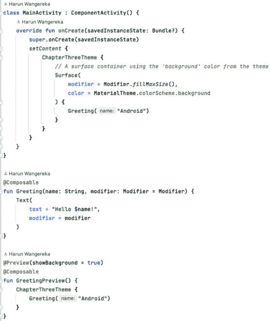
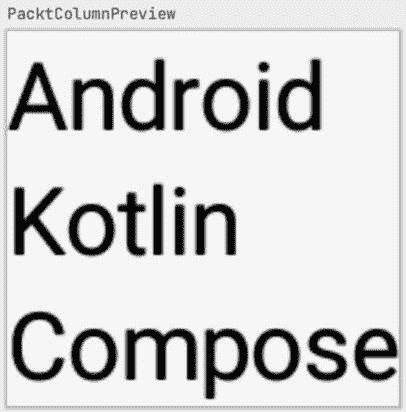
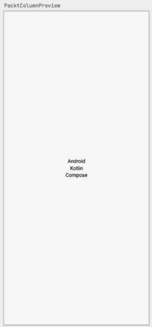
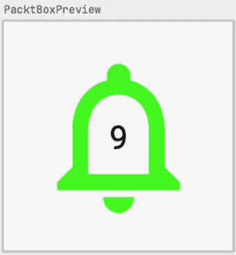
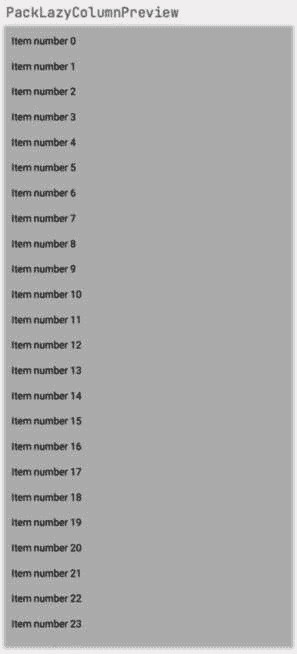
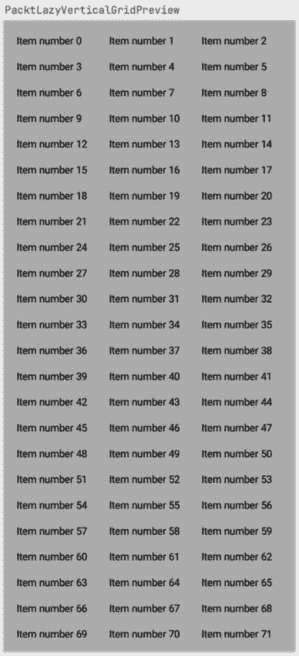
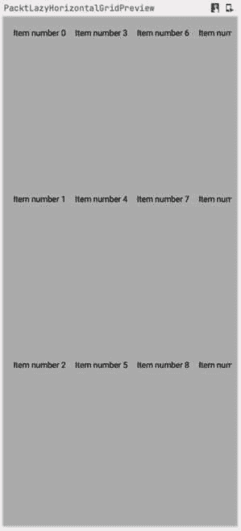

# Jetpack Compose 布局基础

一个好的用户界面和用户体验是我们应用的核心。作为安卓开发者，我们必须敏锐地关注这两个领域，并学习如何使用为我们提供的不同工具来创建用户界面。谷歌推出了**Jetpack Compose**，这是一个现代的 UI 工具包，可以帮助开发者轻松地创建直观的用户界面。

在本章中，我们将探讨 Jetpack Compose，这是一种为我们的应用创建 UI 的声明式方法。我们将学习 Jetpack Compose 和布局的基础知识。

在本章中，我们将涵盖以下主要主题：

+   Jetpack Compose 简介

+   Jetpack Compose 布局

# 技术要求

要遵循本章中的说明，您需要下载 Android Studio Hedgehog 或更高版本([`developer.android.com/studio`](https://developer.android.com/studio))。

您可以在[`github.com/PacktPublishing/Mastering-Kotlin-for-Android/tree/main/chapterthree`](https://github.com/PacktPublishing/Mastering-Kotlin-for-Android/tree/main/chapterthree)找到本章的代码。

# Jetpack Compose 简介

几年来，Android UI 开发经历了重大的转变，出现了各种框架和库以简化这个过程。

在 Jetpack Compose 之前，我们通常是这样为我们的应用编写用户界面的：

+   视图是从 XML 布局文件中填充的。基于 XML 的视图仍然与 Jetpack Compose 一起支持，以实现向后兼容性和混合使用场景，其中应用既有 XML 布局也有 Jetpack Compose。

+   主题、样式和值资源也在 XML 文件中定义。

+   为了能够从 XML 文件中访问视图，我们使用了视图绑定或数据绑定。

+   这种编写 UI 的方法需要巨大的努力，需要更多的样板代码，并且容易出错。

谷歌开发了 Jetpack Compose 作为现代**声明式**UI 工具包。它允许我们用更少的代码创建 UI。在 Jetpack Compose 中创建的布局可以响应不同的屏幕尺寸和方向。在 Compose 中编写 UI 也更容易、更高效。使用 Jetpack Compose，我们可以在代码库中重用组件。Jetpack Compose 还允许我们在 composables 中使用来自 XML 组件的代码。

Jetpack Compose 完全使用 Kotlin 编写，这意味着它利用了 Kotlin 提供的强大语言功能。在 Compose 之前用于创建 UI 的**视图系统**是更程序化的。我们必须管理复杂的生命周期并手动处理任何状态变化。Jetpack Compose 是一个全新的范式，它使用声明式编程。我们根据状态描述 UI 应该是什么样子。这使得我们能够拥有动态内容，更少的样板代码，并更快地开发我们的 UI。

要理解 Jetpack Compose，让我们首先深入了解声明式和命令式方法编写 UI 之间的差异。

## 声明式 UI 与命令式 UI

在命令式 UI 中，我们逐步指定描述如何构建和更新 UI 的指令。我们明确定义创建和修改 UI 元素的操作序列。我们依赖于可变状态变量来表示 UI 的当前状态。我们手动更新这些状态变量，随着 UI 的变化响应用户交互。

在声明式 UI 中，我们专注于描述期望的结果，而不是指定逐步的指令。我们根据当前状态定义 UI 的外观，框架处理其余部分。我们使用声明性标记或代码定义 UI。我们通过描述 UI 元素及其属性之间的关系来表达期望的 UI 结构、布局和行为。

声明式方法更注重不可变状态，其中 UI 状态由不可变数据对象表示。我们不是直接修改状态，而是创建数据对象的新实例来反映 UI 中期望的变化。

在声明式 UI 中，框架负责根据应用程序状态的变化更新 UI。我们指定 UI 和底层状态之间的关系，框架自动更新 UI 以反映这些变化。

既然我们已经理解了命令式和声明式方法，让我们看看每个方法的示例。让我们创建一个简单的计数器 UI，使用 Jetpack Compose（Kotlin）中的声明式 UI 和 XML（Android XML 布局）中的命令式 UI。示例将展示两种方法在语法和方式上的差异。Jetpack Compose 版本如下所示：

```kt
import android.os.Bundle
import androidx.activity.ComponentActivity
import androidx.activity.compose.setContent
import androidx.compose.foundation.layout.Column
import androidx.compose.foundation.layout.padding
import androidx.compose.material3.*
import androidx.compose.runtime.Composable
import androidx.compose.runtime.remember
import androidx.compose.ui.Modifier
import androidx.compose.ui.unit.dp
class MainActivity : ComponentActivity() {
  override fun onCreate(savedInstanceState: Bundle?) {
    super.onCreate(savedInstanceState)
    setContent {
        MyApp()
    }
  }
}
@Composable
fun MyApp() {
  var count by remember { mutableStateOf(0) }
  Column(
    modifier = Modifier.padding(16.dp)
  ) {
      Text(text = "Counter: $count", style = MaterialTheme.typography.bodyLarge)
      Spacer(modifier = Modifier.height(16.dp))
      Button(onClick = { count++ }) {
        Text("Increment")
      }
    }
}
```

在前面的示例中，我们有一个`MyApp`可组合函数，它定义了应用程序的 UI。UI 是通过使用可组合项来定义的，并通过`remember`可组合项处理状态变化。UI 是使用函数式方法定义的。我们还可以看到 UI 是以更简洁的方式定义的。

使用命令式方法时，我们必须首先创建 XML UI，如下面的代码块所示：

```kt
<?xml version="1.0" encoding="utf-8"?>
<RelativeLayout 

  android:layout_width="match_parent"
  android:layout_height="match_parent"
  android:padding="16dp">
  <TextView
    android:id="@+id/counterTextView"
    android:layout_width="wrap_content"
    android:layout_height="wrap_content"
    android:layout_centerHorizontal="true"
    android:text="Counter: 0"
    android:textSize="20sp" />
  <Button
    android:id="@+id/incrementButton"
    android:layout_width="wrap_content"
    android:layout_height="wrap_content"
    android:layout_below="@id/counterTextView"
    android:layout_centerHorizontal="true"
    android:layout_marginTop="16dp"
    android:text="Increment" />
</RelativeLayout>
```

在创建布局文件之后，我们现在可以创建活动类，该类将展开布局文件并处理按钮点击：

```kt
import android.os.Bundle
import android.widget.Button
import android.widget.TextView
import androidx.appcompat.app.AppCompatActivity
class MainActivity : AppCompatActivity() {
  private var count = 0
  override fun onCreate(savedInstanceState: Bundle?) {
    super.onCreate(savedInstanceState)
    setContentView(R.layout.activity_main)
    val counterTextView: TextView = findViewById(R.id.counterTextView)
    val incrementButton: Button = findViewById(R.id.incrementButton)
    incrementButton.setOnClickListener {
      count++
      counterTextView.text = "Counter: $count"
    }
  }
}
```

在这个示例中，XML 布局是在`MainActivity`类的`onCreate`方法中展开的，UI 元素通过程序方式访问和操作。

在前面的示例中，Jetpack Compose 代码是用 Kotlin 编写的，提供了一种更声明式的方法，以函数式方式定义 UI。另一方面，XML 布局是用 XML 命令式编写的，使用 XML 以更逐步的方式指定 UI 结构和属性，并在 Kotlin 代码中以命令式方式与之交互。Jetpack Compose 允许使用声明性语法更简洁、更直观地表示 UI。

现在我们已经清楚地理解了编写 UI 的命令式和声明式方法，在下一节中，我们将深入探讨 Jetpack Compose 的构建块。

## 可组合函数

如*图 3**.1*所示，可组合函数是 Jetpack Compose 的主要构建块：



图 3.1 – Compose UI

可组合函数描述了如何渲染 UI。这个函数必须使用`@Composable`函数注解。当你用这个注解注解一个函数时，这意味着该函数描述了如何组合 UI 的特定部分。可组合函数旨在**可重用**。它们可以在 UI 活跃时多次调用。每当可组合函数的状态发生变化时，它都会经历一个重新组合的过程，这使得 UI 能够显示最新的状态。

可组合函数是**纯函数**，意味着它们没有任何副作用。它们在多次以相同输入调用时产生相同的输出。这确保了函数的可预测性和在派发 UI 更新时的效率。然而，也有一些例外，例如，在可组合函数中启动协程或调用具有副作用的第三方方法，这些应该避免或谨慎处理。

较小的可组合函数可以组合起来构建复杂的 UI。你可以在其他可组合函数内部重用和嵌套可组合函数。

让我们看看一个可组合函数的例子：

```kt
@Composable
fun PacktPublishing(bookName: String) {
    Text(text = "Title of the book is: $bookName")
}
PacktPublishing function is annotated with the @Composable annotation. The function takes a parameter, bookName, which is a String. Inside the function, we have another composable from the Material Design library. The composable renders some text to our UI.
```

当我们设计 UI 时，通常想要看到 UI 的外观而无需运行我们的应用。幸运的是，我们有**预览**，它可以可视化我们的可组合函数。我们将在下一节中学习它们。

## 预览

在 Jetpack Compose 中，我们有`@Preview`注解，它可以在 Android Studio 中生成我们的可组合函数或一组 Compose 组件的预览。它有一个交互模式，允许我们与我们的 Compose 函数交互。这为我们提供了一种快速可视化设计并在需要时轻松更改设计的方法。

这就是我们的`PacktPublishing`可组合函数在预览中的样子：

```kt
@Preview(showBackground = true)
@Composable
fun PacktPublishingPreview() {
    PacktPublishing("Android Development with Kotlin")
}
```

我们使用了`@Preview`注解来表示我们想要为这个函数构建一个预览。此外，我们将`showBackground`参数设置为`true`，这为我们的预览添加了一个白色背景。我们使用`Preview`后缀命名了函数。预览也是一个可组合的函数。

要查看预览，您需要在您的编辑器中的**拆分或设计模式**下。这些选项通常位于 Android Studio 的右上角。我们还需要为 Android Studio 进行构建以生成预览，其外观如下所示：


图 3.2 – 文本预览

如*图 3**.2*所示，我们有一个显示传递给函数的字符串的文本。预览还有一个白色背景，其名称位于左上角。

我们可以为深色和浅色配色方案提供预览。我们还可以配置要应用的设备预览窗口等属性。

预览非常适合在设计 UI 时进行快速迭代。然而，它们不能替代实际的设备/模拟器测试，尤其是对于动画、交互或动态数据等事物。

在理解了预览是什么以及如何创建它们之后，让我们在下一节中探讨一个额外的 Compose 功能，即**修饰符**。

## 修饰符

修饰符允许我们通过启用以下功能来装饰我们的可组合函数：

+   改变可组合的大小、行为和外观

+   添加更多信息

+   处理用户输入

+   添加交互，如点击和涟漪效果

使用修饰符，我们可以改变我们可组合的各种方面，例如大小、填充、颜色和形状。库中的大多数 Jetpack Compose 组件都允许我们将修饰符作为参数提供。例如，如果我们需要为我们的预览文本提供填充，我们将得到以下内容：

```kt
Text(
    modifier = Modifier.padding(16.dp),
    text = "Title of the book is: $bookName"
)
```

我们已将填充修饰符添加到 `Text` 可组合中。这将添加 `16.dp` 的填充到 `Text` 可组合。`16.dp` 是 Jetpack Compose 中的**密度无关**像素单位。这意味着它将保持一致并适当地调整到不同的屏幕密度。

我们可以在一个可组合中链式调用不同的修饰符函数。在链式调用修饰符时，应用顺序至关重要。如果我们没有达到预期的结果，我们需要仔细检查顺序。让我们在实践中观察这个概念：

```kt
Text(
    modifier = Modifier
        .fillMaxWidth()
        .padding(16.dp)
        .background(Color.Green),
    text = "Title of the book is: $bookName"
)
```

我们添加了两个额外的修饰符。第一个是 `fillMaxWidth` 修饰符，它被添加到文本可组合中。这将使文本可组合占据父容器的全部宽度。另一个是添加到 `Text` 可组合的背景修饰符。这将向文本可组合添加背景颜色。我们的文本预览将如下所示：


图 3.3 – 文本修饰符预览

如前一个屏幕截图所示，文本现在占据了设备的整个宽度，并且有一个绿色背景。它周围还有 `16dp` 的填充。

修饰符不会修改原始的可组合。它们返回一个新的、修改过的实例。这确保我们的可组合保持不变和不可变。不可变性是函数式编程的一个基本原则，它确保状态保持不变，简化了状态管理并减少了副作用。这种方法通过遵循引用透明性的原则，增强了可预测性和可读性。通过链式调用修饰符函数来组合函数的能力，使得复杂 UI 行为的简洁和可读表达成为可能，而不改变原始的可组合。除了使用现有的修饰符之外，我们还可以在需要时创建自己的修饰符。

现在你已经了解了修饰符是什么，我们将在此基础上学习下一节中关于 Jetpack Compose 布局的知识。

# Jetpack Compose 布局

Jetpack Compose 为我们提供了各种预构建的布局。在查看不同的布局之前，让我们首先了解 Jetpack Compose 如何将状态转换为 UI。


图 3.4 – Compose 如何将状态转换为 UI

从前面的图中，我们可以看到我们的状态在以下步骤中转换为 UI：

1.  **组合**

    这是初始阶段。Compose 编译器创建一个 UI 元素的树。每个元素都是一个表示 UI 元素的函数。然后 Compose 调用这些函数来创建 UI 树。组合步骤负责确定哪些可组合元素需要更新，哪些可以重用。这是通过比较先前可组合元素的树和新的树来完成的，并且只更新已更改的元素。这使得这个步骤非常高效，因为只有具有更新的元素才会被更新。

1.  **布局**

    这个步骤发生在组合阶段之后。在这里，Compose 编译器使用组合阶段生成的树来确定其大小、位置和布局。每个可组合元素根据其父元素和任何设置的约束在布局中进行测量和定位。这个阶段负责确定屏幕上每个 UI 元素的最终位置和大小。它还负责创建绘图阶段使用的最终布局树。

1.  **绘制**

    这是将我们的 UI 转换为状态的最后阶段。在这个阶段，Compose 编译器使用在布局阶段创建的最终布局树，并将其用于在屏幕上绘制元素。这是通过遍历树并向底层图形系统发出绘制命令来完成的。这个阶段负责在屏幕上渲染最终的 UI。

这三个阶段共同工作，在 Jetpack Compose 中创建我们的 UI。组合阶段构建一个可组合元素的树，布局阶段定位和调整它们的大小，绘制阶段在屏幕上渲染它们。整个过程经过优化，性能良好，效率高，即使在复杂的 UI 中也能实现快速和流畅的 UI 渲染。

现在我们已经了解了 Compose 编译器如何渲染我们的 UI，让我们看看 Compose 中存在的布局。

Jetpack Compose 提供了以下布局：

+   **列**

+   **行**

+   **框**

+   列表

我们将在下一小节中详细查看这些布局。首先，让我们看看`Column`布局。

## 列

当我们想要垂直组织项目时，我们使用`Column`。`Column`的使用示例如下：

```kt
Column {
    Text(text = "Android")
    Text(text = "Kotlin")
    Text(text = "Compose")
}
```

在前面的代码中，我们创建了包含三个文本元素的`Column`。添加预览后，为我们生成了以下 UI：



图 3.5 – 列预览

如前一个截图所示，设计是基本的。我们将通过使用修饰符来稍作润色，因为 Jetpack Compose 也提供了对这些布局的修饰符支持。让我们将这些更改添加到我们的列中：

```kt
Column(
    modifier = Modifier
        .fillMaxSize()
        .padding(16.dp),
    verticalArrangement = Arrangement.Center,
    horizontalAlignment = Alignment.CenterHorizontally
) {
    Text(text = "Android")
    Text(text = "Kotlin")
    Text(text = "Compose")
}
```

在这里，我们为我们的`Column`添加了一个`Modifier`。在修饰符参数中，我们指定了`fillMaxSize`修饰符，这使得我们的列填充父元素内的可用空间。这对于构建 UI 的全屏界面很有帮助。我们还为列添加了`16.dp`的填充。

此外，我们还为我们的列指定了两个额外的参数。一个是`verticalArrangement`，我们用它来指定此视图子元素的垂直排列。在这种情况下，我们指定`Arrangement.Center`，将我们的`Column`的所有子元素垂直居中。另一个参数是`horizontalAlignment`，它是布局子元素的水平对齐方式。在这种情况下，我们指定值为`Alignment.CenterHorizontally`，这将使所有子元素水平居中。我们的预览在前面更改后如下所示：



图 3.6 – 列修饰符预览

从前面的截图，我们可以看到我们的列占据了整个屏幕，并且所有文本元素都在父元素中水平和垂直居中。

现在，让我们在下一节学习`Row`可组合元素。

## `Row`

当我们想要水平组织项目时，我们使用`Row`。以下是一个`Row`的使用示例：

```kt
Row {
    Text(text = "Android")
    Text(text = "Kotlin")
    Text(text = "Compose")
}
```

在前面的代码中，`Row`可组合元素被用来在一行中水平显示三个文本元素。这个预览看起来如下：


图 3.7 – `Row`预览

文本元素都排列在水平行中。`Row`，就像可组合元素一样，支持添加修饰符。让我们修改我们的`Row`，使其看起来如下：

```kt
Row(
    modifier = Modifier
        .fillMaxSize()
        .padding(16.dp),
    verticalAlignment = Alignment.CenterVertically,
    horizontalArrangement = Arrangement.SpaceEvenly
) {
    Text(text = "Android")
    Text(text = "Kotlin")
    Text(text = "Compose")
}
```

在前面的代码中，我们为`Row`可组合元素添加了修饰符。`fillMaxSize`修饰符使行填充整个可用空间。`padding`修饰符为`Row`添加填充。`verticalAlignment`和`horizontalArrangement`修饰符分别用于垂直和水平对齐`Row`的子元素。注意，对于`horizontalArrangement`修饰符，我们使用了`Arrangement.SpaceEvenly`选项。这确保每个子元素在父元素中占据相等的空间。这个预览看起来如下：


图 3.8 – `Row`修饰符预览

如*图 3.8*所示，行占据了整个屏幕，文本元素在屏幕宽度内均匀分布。

在下一节，我们将学习`Box`布局。

## `Box`

`Box`布局允许我们使用 X 和 Y 坐标以灵活的方式定位子元素。让我们看一个代码示例：

```kt
Box(
    modifier = Modifier
        .size(100.dp),
    contentAlignment = Alignment.Center
) {
    Icon(
        modifier = Modifier
            .size(80.dp),
        imageVector = Icons.Outlined.Notifications,
        contentDescription = null,
        tint = Color.Green
    )
    Text(text = "9")
}
```

在前面的代码中，我们有一个`Box`可组合组件，它有一个`Icon`和`Text`可组合组件作为其子组件。我们已经将`Box`可组合组件的大小设置为`100.dp`，将`Icon`可组合组件的大小设置为`80.dp`。文本和图标可组合组件使用`contentAlignment`参数放置在`Box`可组合组件的中心。它们被放置在`Box`可组合组件的中心，因为我们已经将`contentAlignment`参数指定为`Alignment.Center`。它们也堆叠在一起，因为`Box`可组合组件是一个布局可组合组件，它将子组件堆叠在一起。我们`Box`可组合组件的预览如下：



图 3.9 – Box 预览

如我们从*图 3**.9*中可以看到，通知图标和文本是堆叠在一起的。`Box`可组合组件使我们能够实现这一点以及更多。

现在，让我们看看如何在下一节中在 Jetpack Compose 中显示列表。

## 列表

作为 Android 开发者，我们需要制作显示项目列表的应用程序。这可能是一份电影列表、订单、歌曲或书籍列表。那么，我们如何在 Compose 中做到这一点呢？对我们来说，好消息是 Jetpack Compose 使我们更容易做到这一点。Compose 提供了`LazyColumn`和`LazyRow`组件，可以用来显示项目列表。这些组件非常高效和性能良好。它们只渲染屏幕上可见的项目，而不是一次性渲染所有项目。`LazyColumn`垂直显示项目，而`LazyRow`水平显示项目。`LazyColumn`和`LazyRow`通常针对大型数据集进行优化，有时并不适合所有用例。这些可组合函数允许你定义列表的内容为一个返回单个项目的函数，然后 Compose 将自动生成并渲染屏幕上每个项目的 UI 元素。

让我们看看`LazyColumn`的一个例子：

```kt
LazyColumn(
    modifier = Modifier
        .fillMaxSize()
        .background(Color.LightGray)
) {
    items(100) {
        Text(
            modifier = Modifier
                .padding(8.dp),
            text = "Item number $it"
        )
    }
}
```

我们有一个包含 100 个项目的`LazyColumn`。每个项目都是一个`Text`可组合组件。这个预览看起来如下：



图 3.10 – LazyColumn 预览

我们可以从*图 3**.10*中看到，我们现在有一个可以垂直滚动的项目列表。如前所述，它只显示可以适应屏幕的项目。如果我们在我们预览中使用交互模式，我们将能够滚动到列表的底部。

让我们看看`LazyRow`的等效例子：

```kt
LazyRow(
    modifier = Modifier
        .fillMaxWidth()
        .background(Color.LightGray)
        .padding(8.dp)
) {
    items(100) {
        Text(
            modifier = Modifier
                .padding(8.dp),
            text = "Item number $it"
        )
    }
}
```

我们有一个包含 100 个项目的`LazyRow`。每个项目都是一个`Text`可组合组件。这个预览看起来如下：


图 3.11 – LazyRow 预览

我们可以从*图 3**.11*中看到，我们现在有一个可以水平滚动的项目列表。类似于`LazyColumn`，它只显示可以适应屏幕的项目。如果我们在我们预览中使用交互模式，我们可以滚动到列表的末尾。

我们还有两种更多类型的列表布局，`LazyVerticalGrid`和`LazyHorizontalGrid`。这两个布局是懒加载网格的一部分，帮助我们以网格的形式排列我们的内容。它们通常用于如画廊、电影和电子表格等应用程序。`LazyVerticalGrid`在网格中创建项目的垂直列表。让我们看看`LazyVerticalGrid`的示例代码：

```kt
LazyVerticalGrid(
    modifier = Modifier
        .fillMaxSize()
        .background(Color.LightGray)
        .padding(8.dp),
    columns = GridCells.Fixed(3)
) {
    items(100) {
        Text(
            modifier = Modifier
                .padding(8.dp),
            text = "Item number $it"
        )
    }
}
```

我们已经使用了`LazyVerticalGrid`可组合元素。我们像以前一样传递我们的修饰符。注意我们还有一个`columns`参数。这个参数允许我们指定列数以及项目在列中的排列方式。在这种情况下，我们指定`GridCells`为`Fixed`。这意味着网格将具有固定数量的列或行，如果是`LazyHorizontalGrid`。我们还有一个`Adaptive`类型，它定义了一个网格，具有尽可能多的行或列，条件是每个单元格都有最小尺寸，所有额外空间都均匀分布。我们的预览将如下所示：



图 3.12 – LazyVerticalGrid 预览

我们有三个列的文本元素网格。我们现在能够垂直滚动项目。现在让我们看看`LazyHorizontalGrid`的代码：

```kt
LazyHorizontalGrid(
    modifier = Modifier
        .fillMaxSize()
        .background(Color.LightGray)
        .padding(8.dp),
    rows = GridCells.Fixed(3)
) {
    items(100) {
        Text(
            modifier = Modifier
                .padding(8.dp),
            text = "Item number $it"
        )
    }
}
```

代码与`LazyVerticalGrid`的代码类似。唯一的区别是我们现在使用`LazyHorizontalGrid`，而不是列，我们现在传递`rows`来描述单元格如何形成行。预览将如下所示：



图 3.13 – LazyHorizontalGrid 预览

如*图 3**.13*所示，我们现在在整个屏幕上有三行，我们也可以水平滚动它们。

除了`LazyVerticalGrid`和`LazyHorizontalGrid`之外，我们还有`LazyVerticalStaggeredGrid`和`LazyHorizontalStaggeredGrid`，它们非常相似；唯一的区别是它们分别适应子元素的高度和宽度，这意味着它们都没有统一的高度或宽度。

让我们现在看看下一节中的`ConstraintLayout`。

### ConstraintLayout

这个布局使我们能够创建响应式布局。我们可以使用相对定位创建复杂的布局。`ConstraintLayout`使用链、屏障和指南来定位子元素相对于彼此的位置。

它作为一个单独的依赖项存在，我们需要将其添加到我们的项目中。为了添加它，让我们将这个依赖项添加到我们的应用`build.gradle`文件中：

```kt
 implementation 'androidx.constraintlayout:constraintlayout-compose:1.0.1'
```

这将 Jetpack Compose 依赖项添加到我们的项目中。约束布局的布局代码如下：

```kt
ConstraintLayout(
  modifier = Modifier
    .padding(16.dp)
) {
    val (icon, text) = createRefs()
      Icon(
          modifier = Modifier
            .size(80.dp)
            .constrainAs(icon) {
                top.linkTo(parent.top)
                bottom.linkTo(parent.bottom)
                start.linkTo(parent.start)
            },
          imageVector = Icons.Outlined.Notifications,
          contentDescription = null,
          tint = Color.Green
      )
    Text(
        modifier = Modifier
          .constrainAs(text) {
              top.linkTo(parent.top)
              bottom.linkTo(parent.bottom)
              start.linkTo(icon.end) },
        text = "9",
        style = MaterialTheme.typography.titleLarge
    )
}
```

在前面的代码中，我们使用了 `ConstraintLayout` 组合函数来创建 `ConstraintLayout`。在 `ConstraintLayout` 内部，我们使用了 `createRefs()` 函数创建两个引用，一个用于图标，一个用于文本。然后我们使用了 `constrainAs()` 函数将图标和文本约束到父元素上。我们使用了 `linkTo()` 函数将图标和文本链接到父元素。在这种情况下，我们将图标链接到父元素的起始、顶部和底部。对于文本，我们将其链接到父元素的顶部和底部。我们还额外将文本的起始链接到图标的结束。我们的预览将如下所示：


图 3.14 – ConstraintLayout 预览

从前面的截图，我们可以看到图标右侧有一个图标和文本。`ConstraintLayout` 帮助我们在父元素或彼此之间定位项目。

# 摘要

在本章中，我们介绍了 Jetpack Compose，这是一种声明式的方式，用于为应用程序创建 UI。我们还学习了 Compose 中的不同布局以及 Jetpack Compose 编译器如何将状态渲染到 UI 中。

在下一章，我们将基于我们已经学到的内容，探讨如何使用 **Material Design 3** 设计美观且直观的应用程序。我们将学习 Material Design 3 的特性以及如何为我们的应用程序添加动态颜色。
