# 第七章：在您的应用程序内导航

我们制作的应用程序需要从一个屏幕移动到另一个屏幕，在这些屏幕上显示不同的内容。到目前为止，我们只制作了一个屏幕的应用程序。在本章中，我们将学习如何从一个屏幕移动到另一个屏幕。我们将学习如何使用 **Jetpack Compose 导航** 库在我们的应用程序中导航到不同的 Jetpack Compose 屏幕。我们将学习使用此库的技巧和最佳实践。此外，我们还将介绍如何在大型屏幕和可折叠设备上处理导航。

在本章中，我们将涵盖以下主要主题：

+   Jetpack 导航概述

+   导航到 Compose 目的地

+   向目的地传递参数

+   可折叠设备和大型屏幕上的导航

# 技术要求

要遵循本章的说明，您需要下载 Android Studio Hedgehog 或更高版本（[`developer.android.com/studio`](https://developer.android.com/studio)）。

您可以使用上一章的代码来遵循本章的说明。您可以在[`github.com/PacktPublishing/Mastering-Kotlin-for-Android/tree/main/chapterseven`](https://github.com/PacktPublishing/Mastering-Kotlin-for-Android/tree/main/chapterseven)找到本章的代码。

# Jetpack 导航概述

Jetpack 导航库提供了一个易于处理 **复杂导航** 的 API，同时遵循 Android Jetpack 的原则。该库适用于旧视图系统，该系统使用 XML（[`developer.android.com/guide/navigation`](https://developer.android.com/guide/navigation)），以及 Jetpack Compose（[`developer.android.com/jetpack/compose/navigation`](https://developer.android.com/jetpack/compose/navigation)）。在本章中，我们将学习后者。

在本章中，我们将在上一章使用的宠物应用程序的基础上，导航到一个具有返回到上一屏幕按钮的详细信息屏幕。我们还将向详细信息屏幕传递数据。

首先，我们需要将 Jetpack 导航 Compose 依赖项添加到我们的项目中。让我们在 `libs.versions.toml` 文件的 `versions` 部分中添加以下库：

```kt
compose-navigation = "androidx.navigation:navigation-compose:2.7.2"
```

接下来，我们需要将依赖项添加到我们的应用程序模块的 `build.gradle.kts` 文件中：

```kt
implementation(libs.compose.navigation)
```

执行 Gradle 同步以将库添加到我们的项目中。下一步是创建 `NavController` 和 `NavHost`。`NavController` 是一个管理 `NavHost` 内应用程序导航的类。`NavHost` 是一个容器，它托管可组合元素并处理它们之间的导航。让我们创建一个名为 `navigation` 的新包，并创建一个名为 `Screens.kt` 的新密封类。在文件内部，让我们添加以下代码：

```kt
sealed class Screens(val route: String) {
    object PetsScreen : Screens("pets")
    object PetDetailsScreen : Screens("petDetails")
}
```

这是一个有两个对象的密封类。密封类用于表示受限的类层次结构，其中对象或值只能具有密封类中定义的类型之一。第一个对象是`PetsScreen`，它将是我们在启动应用时看到的第一个屏幕。第二个对象是`PetDetailsScreen`，它将是我们在点击`PetsScreen`中的宠物项目时导航到的屏幕。每次我们需要添加一个新的目标屏幕时，我们都会在密封类中添加一个新的对象。

接下来，让我们在`navigation`包内部创建一个名为`AppNavigation.kt`的新文件。在文件内部，让我们添加以下代码：

```kt
@Composable
fun AppNavigation() {
    val navController = rememberNavController()
    NavHost(
        navController = navController,
        startDestination =  Screens.PetsScreen.route
    ){
        composable(Screens.PetsScreen.route){
            PetsScreen()
        }
    }
}
```

让我们解释一下前面的代码：

+   我们使用`rememberNavController()`函数创建**NavController**。这个函数用于创建将在重组之间被记住的**NavController**。这很重要，因为我们需要能够在我们的应用中导航到不同的屏幕。

+   我们创建了一个**NavHost**可组合组件，它接受**navController**和**startDestination**。**startDestination**是我们启动应用时想要看到的第一个屏幕。在我们的例子中，它是**PetsScreen**。

+   我们添加了**PetsScreen**可组合组件。这个可组合组件有一个错误，因为我们还没有创建它。我们很快就会做到这一点。

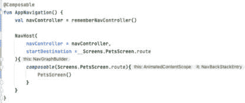

图 7.1 – PetsScreen 错误

如前一个截图所示，`PetsScreen`可组合组件被红色突出显示，因为我们还没有创建这个可组合组件。我们将对我们的代码进行一些重构。让我们创建一个名为`PetsScreen.kt`的新文件。在文件内部，让我们添加以下代码：

```kt
@OptIn(ExperimentalMaterial3Api::class)
@Composable
fun PetsScreen(onPetClicked: (Cat) -> Unit) {
    Scaffold(
        topBar = {
            TopAppBar(
                title = {
                    Text(text = "Pets")
                },
                colors =  TopAppBarDefaults.smallTopAppBarColors(
                    containerColor = MaterialTheme.colorScheme.primary,
                )
            )
        },
        content =  { paddingValues ->
            PetList(
                modifier = Modifier
                    .fillMaxSize()
                    .padding(paddingValues),
                onPetClicked = onPetClicked
            )
        }
    )
}
```

`PetsScreen`可组合组件显示宠物列表。我们添加了一个`Scaffold`可组合组件作为根元素。在`Scaffold`可组合组件内部，我们添加了一个`TopAppBar`可组合组件。我们还添加了一个`PetList`可组合组件作为`Scaffold`可组合组件的内容。我们还在`PetList`可组合组件中添加了一个新的`onPetClicked`回调。我们将使用这个回调在点击列表中的宠物项目时导航到`PetDetailsScreen`。

这样，我们的导航图就准备好了。我们现在可以将`AppNavigation`可组合组件添加到我们的`MainActivity.kt`文件中。让我们用以下代码替换`ChapterSevenTheme`块内的所有代码：

```kt
ChapterSevenTheme {
    AppNavigation()
}
```

构建并运行应用。应用仍然显示与之前一样的可爱宠物列表，但现在我们正在使用 Jetpack Navigation 库来处理我们的导航。

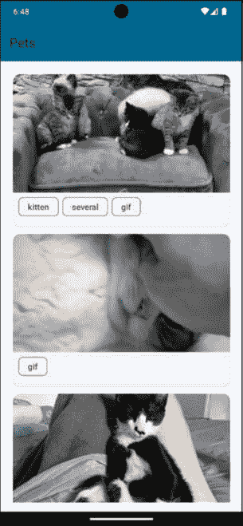

图 7.2 – 宠物

在下一节中，让我们学习如何在我们点击列表中的宠物项目时导航到详细信息屏幕。

# 导航到 Compose 目标

在本节中，我们将学习如何在我们点击列表中的宠物项目时导航到详细信息屏幕。首先，我们需要为`PetDetailsScreen`创建一个新的可组合组件。让我们创建一个名为`PetDetailsScreen.kt`的新文件，并按照以下方式创建`PetDetailsScreenContent`可组合组件：

```kt
@OptIn(ExperimentalLayoutApi::class)
@Composable
fun PetDetailsScreenContent(modifier: Modifier) {
    Column(
        modifier = modifier
            .fillMaxSize()
            .padding(16.dp),
        verticalArrangement = Arrangement.Center,
        horizontalAlignment = Alignment.CenterHorizontally
    ) {
        AsyncImage(
            model = "https://cataas.com/cat/rV1MVEh0Af2Bm4O0",
            contentDescription = "Cute cat",
            modifier = Modifier
                .fillMaxWidth()
                .height(200.dp),
            contentScale = ContentScale.FillWidth
        )
        FlowRow(
            modifier = Modifier
                .padding(start = 6.dp, end = 6.dp)
        ) {
            repeat(2) {
                SuggestionChip(
                    modifier = Modifier
                        .padding(start = 3.dp, end = 3.dp),
                    onClick = { },
                    label = {
                        Text(text = "Tag $it")
                    }
                )
            }
        }
    }
}
```

在这里，我们创建了一个以 `Column` 作为根元素的组合器。在 `Column` 元素内部，我们添加了一个 `AsyncImage` 组合器来显示猫的图片。我们还添加了一个 `FlowRow` 组合器，当空间不足时将项目流动到下一行，这是无法通过行实现的。`FlowRow` 显示了两个 `SuggestionChip` 组合器。我们将使用此组合器来显示宠物的详细信息。注意，我们现在正在使用硬编码的猫 ID 和标签。我们将在下一节中从 `PetList` 组合器传递这些数据。接下来，让我们创建 `PetDetailsScreen` 组合器，如下所示：

```kt
@OptIn(ExperimentalMaterial3Api::class)
@Composable
fun PetDetailsScreen(onBackPressed: () -> Unit) {
    Scaffold(
        topBar = {
            TopAppBar(
                title = {
                    Text(text = "Pet Details")
                },
                colors =  TopAppBarDefaults.smallTopAppBarColors(
                    containerColor = MaterialTheme.colorScheme.primary,
                ),
                navigationIcon = {
                    IconButton(
                        onClick = onBackPressed,
                        content = {
                            Icon(
                                imageVector = Icons.Default.ArrowBack,
                                contentDescription = "Back"
                            )
                        }
                    )
                }
            )
        },
        content = { paddingValues ->
            PetDetailsScreenContent(
                modifier = Modifier
                    .padding(paddingValues)
            )
        }
    )
}
```

`PetDetailsScreen` 组合器显示宠物的详细信息。我们添加了一个 `Scaffold` 组合器作为根元素。在 `Scaffold` 组合器内部，我们添加了一个 `TopAppBar` 组合器。我们还使用了之前创建的 `PetDetailsScreenContent` 组合器作为 `Scaffold` 组合器的内容。我们还在 `PetDetailsScreen` 组合器中添加了一个新的 `onBackPressed` 回调。我们将使用此回调在点击 `TopAppBar` 中的返回按钮时导航回上一屏幕。

我们的下一步是将 `PetDetailsScreen` 组合器添加到我们的 `AppNavigation.kt` 文件中。让我们在 `PetsScreen` 组合器下方添加以下代码到我们的 `NavHost` 中：

```kt
composable(Screens.PetDetailsScreen.route){
    PetDetailsScreen(
        onBackPressed = {
            navController.popBackStack()
        }
    )
}
```

在这里，我们添加了一个 `PetDetailsScreen` 组合器。我们传递了屏幕的路由和 `PetDetailsScreen` 组合器作为内容。`PetDetailsScreen` 有 `onBackPressed` 参数。该参数处理用户点击通常位于左上角的返回箭头图标的情况。我们在 `onBackPressed` 参数中使用 `navController.popBackStack()`。此方法尝试从返回堆栈中弹出当前目的地并导航到上一个目的地。

现在，当我们在列表中点击宠物项时，我们需要实际导航到 `PetDetailsScreen`。让我们转到 `PetListItem` 组合器。我们将在 `PetListItem` 组合器中添加一个新的 `onPetClicked` 回调。修改后的组合器应如下所示：

```kt
@OptIn(ExperimentalLayoutApi::class)
@Composable
fun PetListItem(cat: Cat, onPetClicked: (Cat) -> Unit) {
    ElevatedCard(
        modifier = Modifier
            .fillMaxWidth()
            .padding(6.dp)
    ) {
        Column(
            modifier = Modifier
                .fillMaxWidth()
                .padding(bottom = 10.dp)
                .clickable {
                    onPetClicked(cat)
                }
        ) {
            AsyncImage(
                model = "https://cataas.com/cat/${cat.id}",
                contentDescription = "Cute cat",
                modifier = Modifier
                    .fillMaxWidth()
                    .height(200.dp),
                contentScale = ContentScale.FillWidth
            )
            FlowRow(
                modifier = Modifier
                    .padding(start = 6.dp, end = 6.dp)
            ) {
              repeat(cat.tags.size) {
                  SuggestionChip(
                      modifier = Modifier
                          .padding(start = 3.dp, end = 3.dp),
                      onClick = { },
                      label = {
                          Text(text = cat.tags[it])
                      }
                  )
              }
            }
        }
    }
}
```

在前面的代码中，我们在组合器中添加了一个新的 `onPetClicked` 回调。我们向 `Column` 添加了 `clickable` 修饰符，并在修饰符内部调用了 `onPetClicked` 回调。我们将 `cat` 对象传递给回调。接下来，我们需要将 `onPetClicked` 回调添加到 `PetList` 组合器中，如下所示：

```kt
@Composable
fun PetList(modifier: Modifier, onPetClicked: (Cat) -> Unit) {
    // other code
}
```

接下来，我们需要将此回调传递到我们使用 `PetListItem` 组合器的地方。在 items 块内部调用点的修改后的 `PetListItem` 组合器应如下所示：

```kt
PetListItem(
    cat = pet,
    onPetClicked = onPetClicked
)
```

最后，我们需要修改 `AppNavigation` 组合器，以便将 `onPetClicked` 回调传递给 `PetsScreen` 组合器。修改后的 `AppNavigation` 组合器应如下所示：

```kt
PetsScreen(
    onPetClicked = {
        navController.navigate(Screens.PetDetailsScreen.route)
    }
)
```

在这里，我们将 `onPetClicked` 回调传递给 `PetsScreen` 可组合组件。在回调内部，我们在 `navController` 上调用 `navigate()` 函数，并传入 `PetDetailsScreen` 的路由。当我们点击列表中的宠物项时，这将导航到 `PetDetailsScreen`。

构建并运行应用程序。点击列表中的宠物项。您将看到应用程序导航到 `PetDetailsScreen`。

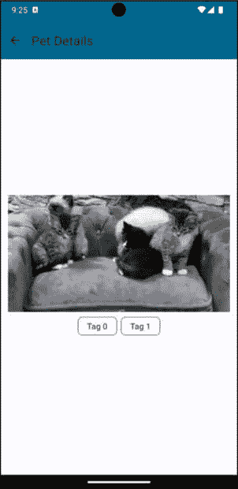

图 7.3 – 宠物详情屏幕

我们可以看到一只可爱的猫的图片和一些标签。此外，如果我们按下 `TopAppBar` 中的返回按钮，我们将能够导航回 `PetsScreen`。

到目前为止，我们已经能够从 `PetsScreen` 导航到 `PetDetailsScreen`。然而，我们没有向 `PetDetailsScreen` 传递任何数据。在下一节中，我们将学习如何向 `PetDetailsScreen` 传递数据。

# 向目标传递参数

在我们的 `PetDetailsScreen` 中，我们需要移除硬编码的猫 ID 和标签，并从 `PetList` 可组合组件中传递它们。请按照以下步骤操作：

1.  让我们转到 **PetDetailsScreenContent** 可组合组件，位于 `PetDetailsScreen.kt` 文件中，并按以下方式修改它：

    ```kt
    @OptIn(ExperimentalLayoutApi::class)
    @Composable
    fun PetDetailsScreenContent(modifier: Modifier, cat: Cat) {
        Column(
            modifier = modifier
                .fillMaxSize()
                .padding(16.dp),
            verticalArrangement = Arrangement.Center,
            horizontalAlignment = Alignment.CenterHorizontally
        ) {
            AsyncImage(
                model = "https://cataas.com/cat/${cat.id}",
                contentDescription = "Cute cat",
                modifier = Modifier
                    .fillMaxWidth()
                    .height(200.dp),
                contentScale = ContentScale.FillWidth
            )
            FlowRow(
                modifier = Modifier
                    .padding(start = 6.dp, end = 6.dp)
            ) {
                repeat(cat.tags.size) {
                    SuggestionChip(
                        modifier = Modifier
                            .padding(start = 3.dp, end = 3.dp),
                        onClick = { },
                        label = {
                            Text(text = cat.tags[it])
                        }
                    )
                }
            }
        }
    }
    ```

    我们为可组合组件添加了一个新的 `cat` 参数。我们使用 `cat` 对象来显示猫的图片和标签。

1.  接下来，让我们转到 `PetDetailsScreen` 可组合组件，并按以下方式修改它：

    ```kt
    @OptIn(ExperimentalMaterial3Api::class)
    @Composable
    fun PetDetailsScreen(onBackPressed: () -> Unit, cat: Cat) {
        Scaffold(
            topBar = {
                TopAppBar(
                    title = {
                        Text(text = "Pet Details")
                    },
                    colors =  TopAppBarDefaults.smallTopAppBarColors(
                        containerColor = MaterialTheme.colorScheme.primary,
                    ),
                    navigationIcon = {
                        IconButton(
                            onClick = onBackPressed,
                            content = {
                                Icon(
                                    imageVector = Icons.Default.ArrowBack,
                                    contentDescription = "Back"
                                )
                            }
                        )
                    }
                )
            },
            content = { paddingValues ->
                PetDetailsScreenContent(
                    modifier = Modifier
                        .padding(paddingValues),
                    cat = cat
                )
            }
        )
    }
    ```

    在这里，我们向可组合组件添加了一个新的 `cat` 参数。我们将 `cat` 对象传递给 `PetDetailsScreenContent` 可组合组件。

1.  接下来，让我们转到 **AppNavigation** 可组合组件，并添加将 **cat** 对象传递给 `PetDetailsScreen` 的逻辑。我们需要首先修改 `PetDetailsScreen` 的可组合组件，如下所示：

    ```kt
    composable(
        route = "${Screens.PetDetailsScreen.route}/{cat}",
        arguments = listOf(
            navArgument("cat") {
                type = NavType.StringType
            }
        )
    ){
        PetDetailsScreen(
            onBackPressed = {
                navController.popBackStack()
            },
            cat = Json.decodeFromString(it.arguments?.getString("cat") ?: "")
        )
    }
    ```

    让我们解释一下这些更改：

    +   在路由上，我们添加了一个新的参数，称为 **cat**。这是我们用来将 **cat** 对象传递给 `PetDetailsScreen` 的参数。

    +   我们添加了一个新的 **arguments** 参数。该参数用于将参数传递到目标屏幕。我们为 `cat` 参数添加了 **navArgument**。我们将类型设置为 **String**。这是因为我们将传递 **cat** 对象的字符串表示形式。

    +   我们将 **cat** 对象传递给 `PetDetailsScreen` 可组合组件。我们使用了 Kotlinx Serialization 库中的 **Json.decodeFromString()**，这是我们之前在 *第六章* 中了解到的，将 **cat** 对象的字符串值转换为 **Cat** 对象。我们使用了 **NavBackStackEntry** 的 **arguments** 属性来获取 **cat** 对象的字符串值。如果 **arguments** 属性为空，我们使用了 Elvis 操作符返回一个空字符串。

1.  最后，我们需要修改 **AppNavigation** 可组合组件中的 **onPetClicked** 回调，如下所示：

    ```kt
    composable(Screens.PetsScreen.route) {
        PetsScreen(
            onPetClicked = { cat ->
                navController.navigate(
                    "${Screens.PetDetailsScreen.route}/${Json.encodeToString(cat)}"
                )
            }
        )
    }
    ```

    我们已修改了`navigate()`函数，将其作为字符串传递`Cat`对象。我们还使用了 Kotlinx Serialization 库中的`Json.encodeToString()`，将`Cat`对象转换为字符串。这将作为参数传递给`PetDetailsScreen`，当我们点击列表中的宠物项时。

1.  构建并运行应用。点击列表中的任何可爱猫的图片，现在详情屏幕将显示我们选择的可爱猫的图片和标签：

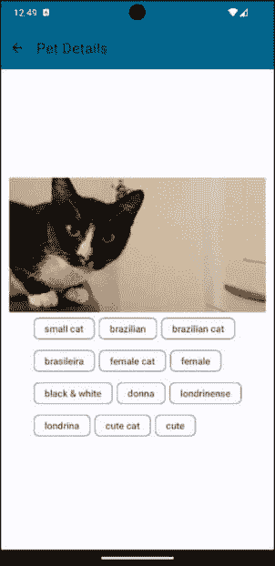

图 7.4 – 宠物详情

我们现在已经能够将数据传递给`PetDetailsScreen`。我们学习了如何导航到组合目标并传递数据到详情屏幕。在下一节中，我们将学习如何处理可折叠设备和大型屏幕上的导航。

# 可折叠设备和大型屏幕上的导航

在*第四章*的“*为大型屏幕和可折叠设备设计 UI*”部分，我们学习了`WindowSize`类以及如何在可折叠设备和大型屏幕上使我们的应用具有响应性。在本节中，我们将使我们的宠物应用在可折叠设备和大型屏幕上具有响应性。我们将进行以下几项更改：

+   在**PetsScreen**中添加一个底部栏，它将包含几个选项。

+   根据屏幕大小添加**NavigationRail**和**NavigationDrawer**。

+   观察设备的可折叠状态，并根据可折叠状态更改应用的布局。

+   根据屏幕大小，我们还将更改内容类型。在大型屏幕上，我们将并排显示猫的列表和所选猫的详情。在小屏幕上，我们将显示猫的列表和所选猫的详情在不同的屏幕上。

需要的更改相当多。好消息是，我已经完成了这些更改，你可以在项目的仓库中的`chapterseven`文件夹中找到最终版本。让我们逐一查看这些更改：

1.  我们将首先创建一个名为**NavigationType**的**密封接口**，它代表我们将在应用中使用的不同类型的导航。让我们在**navigation**包内创建一个名为**NavigationType.kt**的新文件，并添加以下代码：

    ```kt
    sealed interface NavigationType {
        object BottomNavigation : NavigationType
        object NavigationDrawer : NavigationType
        object NavigationRail : NavigationType
    }
    ```

    我们在这里使用密封接口而不是密封类，这是因为我们不需要在`NavigationType`中保留任何状态。我们也不需要将任何属性传递给`NavigationTypes`中的任何一个。我们有三个选项：`BottomNavigation`、`NavigationDrawer`和`NavigationRail`。我们将使用这些选项根据屏幕大小更改导航类型。

1.  接下来，让我们创建另一个名为**ContentType**的密封接口。此接口将用于根据屏幕大小更改内容显示类型。让我们在**navigation**包内创建一个名为**ContentType.kt**的新文件，并添加以下代码：

    ```kt
    sealed interface ContentType {
        object List : ContentType
        object ListAndDetail : ContentType
    }
    ```

    这表示我们可以根据屏幕大小显示内容的两种模式。我们有 `List` 模式，只显示猫的列表。我们还有 `ListAndDetail` 模式，显示猫的列表和所选猫的详细信息并排显示。

1.  接下来，在我们的 **Screens.kt** 文件中，我们必须添加一个名为 **FavoritesScreen** 的新目的地屏幕。文件的最终代码应如下所示：

    ```kt
    sealed class Screens(val route: String) {
        object PetsScreen : Screens("pets")
        object PetDetailsScreen : Screens("petDetails")
        object FavoritePetsScreen : Screens("favoritePets")
    }
    ```

    现在我们为我们的应用有了三个目的地。

1.  接下来，让我们将 **WindowSize** 依赖项添加到 **libs.versions.toml** 文件中的库部分：

    ```kt
    compose-window-size = "androidx.compose.material3:material3-window-size-class:1.2.0-alpha07"
    androidx-window = "androidx.window:window:1.1.0"
    ```

1.  我们还需要将依赖项添加到我们的应用模块的 **build.gradle.kts** 文件中：

    ```kt
    implementation(libs.compose.window.size)
    implementation(libs.androidx.window)
    ```

    执行 Gradle 同步以便能够将依赖项添加到我们的项目中。

1.  接下来，我们需要创建 **NavigationRail**、**NavigationDrawer** 和 **BottomNavigation** 的可组合组件。在 **view** 包内创建一个名为 **PetsNavigationRail.kt** 的新文件，并添加以下代码：

    ```kt
    @Composable
    fun PetsNavigationRail(
        onFavoriteClicked: () -> Unit,
        onHomeClicked: () -> Unit,
        onDrawerClicked: () -> Unit
    ) {
        val items = listOf(Screens.PetsScreen, Screens.FavoritePetsScreen)
        val selectedItem = remember { mutableStateOf(items[0]) }
        NavigationRail(
            modifier = Modifier
                .fillMaxHeight()
        ) {
            NavigationRailItem(
                selected = false,
                onClick = onDrawerClicked,
                icon = {
                    Icon(
                        imageVector = Icons.Default.Menu,
                        contentDescription = "Menu Icon"
                    )
                }
            )
            NavigationRailItem(
                selected = selectedItem.value == Screens.PetsScreen,
                onClick = {
                    onHomeClicked()
                    selectedItem.value = Screens.PetsScreen
                },
                icon = {
                    Icon(
                        imageVector = Icons.Default.Home,
                        contentDescription = "Home Icon"
                    )
                }
            )
            NavigationRailItem(
                selected = selectedItem.value == Screens.FavoritePetsScreen,
                onClick = {
                    onFavoriteClicked()
                    selectedItem.value = Screens.FavoritePetsScreen
                },
                icon = {
                    Icon(
                        imageVector = Icons.Default.Favorite,
                        contentDescription = "Favorite Icon"
                    )
                }
            )
        }
    }
    ```

    在前面的代码中，我们创建了 `PetsNavigationRail()` 可组合组件，它有三个参数：`onFavoriteClicked`、`onHomeClicked` 和 `onDrawerClicked`。前两个是回调函数，将用于导航到不同的屏幕。我们使用 `onDrawerClicked` 回调函数在用户与之交互时关闭或打开抽屉。在顶部，我们有 `items` 变量，它包含所有我们的屏幕列表，以及 `selectedItem` 变量，它包含当前选中的屏幕。我们使用 Material 3 库中的 `NavigationRail` 可组合组件来显示导航栏。要向 `NavigationRail` 添加项目，我们使用 `NavigationRailItem` 可组合组件。我们传递项目的选中状态、`onClick` 回调函数和要显示的图标。

1.  接下来，让我们创建一个名为 **PetsBottomNavigationBar** 的可组合组件。在 **view** 包内创建一个名为 **PetsBottomNavigationBar.kt** 的新文件，并添加以下代码：

    ```kt
    @Composable
    fun PetsBottomNavigationBar(
        onFavoriteClicked: () -> Unit,
        onHomeClicked: () -> Unit
    ) {
        val items = listOf(Screens.PetsScreen, Screens.FavoritePetsScreen)
        val selectedItem = remember { mutableStateOf(items[0]) }
        NavigationBar(
            modifier = Modifier
                .fillMaxWidth(),
            containerColor = MaterialTheme.colorScheme.background
        ) {
            NavigationBarItem(
                selected = selectedItem.value == Screens.PetsScreen,
                onClick = {
                    onHomeClicked()
                    selectedItem.value = Screens.PetsScreen
                },
                icon = {
                    Icon(
                        imageVector = Icons.Default.Home,
                        contentDescription = "Home Icon"
                    )
                }
            )
            NavigationBarItem(
                selected = selectedItem.value == Screens.FavoritePetsScreen,
                onClick = {
                    onFavoriteClicked()
                    selectedItem.value = Screens.FavoritePetsScreen
                },
                icon = {
                    Icon(
                        imageVector = Icons.Default.Favorite,
                        contentDescription = "Favorite Icon"
                    )
                }
            )
        }
    }
    ```

    `PetsBottomNavigationBar` 可组合组件与 `PetsNavigationRail` 可组合组件类似。唯一的区别是我们使用 `NavigationBar` 可组合组件而不是 `NavigationRail` 可组合组件。我们有主页和收藏夹项目。我们使用 `NavigationBarItem` 可组合组件向 `NavigationBar` 添加项目。我们传递项目的选中状态、`onClick` 回调函数和要显示的图标。

1.  接下来，让我们创建一个名为 **PetsNavigationDrawer** 的可组合组件。在 **view** 包内创建一个名为 **PetsNavigationDrawer.kt** 的新文件，并添加以下代码：

    ```kt
    @Composable
    fun PetsNavigationDrawer(
        onFavoriteClicked: () -> Unit,
        onHomeClicked: () -> Unit,
        onDrawerClicked: () -> Unit = {}
    ) {
        val items = listOf(Screens.PetsScreen, Screens.FavoritePetsScreen)
        val selectedItem = remember { mutableStateOf(items[0]) }
        Column(
            modifier = Modifier
                .wrapContentWidth()
                .fillMaxHeight()
                .background(MaterialTheme.colorScheme.inverseOnSurface)
                .padding(16.dp)
        ) {
            Row(
                modifier = Modifier
                    .fillMaxWidth()
                    .padding(16.dp),
                horizontalArrangement = Arrangement.SpaceBetween,
                verticalAlignment = Alignment.CenterVertically
            ) {
                Text(
                    text = "Chapter Seven",
                    style = MaterialTheme.typography.titleMedium,
                    color = MaterialTheme.colorScheme.primary
                )
                IconButton(
                    onClick = onDrawerClicked
                ) {
                    Icon(
                        imageVector = Icons.Default.Menu,
                        contentDescription = "Navigation Drawer Icon"
                    )
                }
            }
            NavigationDrawerItem(
                label = { Text(text = "Pets") },
                selected = selectedItem.value == Screens.PetsScreen,
                onClick = {
                    onHomeClicked()
                    selectedItem.value = Screens.PetsScreen
                },
                icon = {
                    Icon(
                        imageVector = Icons.Default.Home,
                        contentDescription = "Home Icon"
                    )
                }
            )
            NavigationDrawerItem(
                label = { Text(text = "Favorites") },
                selected = selectedItem.value == Screens.FavoritePetsScreen,
                onClick = {
                    onFavoriteClicked()
                    selectedItem.value = Screens.FavoritePetsScreen
                },
                icon = {
                    Icon(
                        imageVector = Icons.Default.Favorite,
                        contentDescription = "Favorite Icon"
                    )
                }
            )
        }
    }
    ```

    我们使用了 Material 3 库中的 `NavigationDrawer` 可组合组件来显示导航抽屉。我们使用 `NavigationDrawerItem` 可组合组件向 `NavigationDrawer` 添加项目。我们传递了标签、项目的选中状态、`onClick` 回调函数和要显示的图标。

1.  由于我们的`PetsNavigationDrawer`、`PetsNavigationRail`和`PetsBottomNavigationBar`可组合组件都有`FavoritesScreen`，让我们在视图包中创建一个名为`FavoritePetsScreen.kt`的新文件，并添加以下代码：

    ```kt
    @Composable
    fun FavoritePetsScreen() {
        Column(
            modifier = Modifier
                .fillMaxSize(),
            verticalArrangement = Arrangement.Center,
            horizontalAlignment = Alignment.CenterHorizontally
        ) {
            Text(text = "Favorite Pets")
        }
    }
    ```

    这是一个简单的可组合组件，显示文本`"Favorite Pets"`。我们将使用这个可组合组件作为`FavoritesScreen`的内容。我们还需要重构我们的`AppNavigation()`可组合组件，使其准备好处理不同的导航和内容类型。最终修改后的可组合组件应该看起来像这样：

    ```kt
    @Composable
    fun AppNavigation(
        contentType: ContentType,
        navHostController: NavHostController = rememberNavController()
    ) {
        NavHost(
            navController = navHostController,
            startDestination = Screens.PetsScreen.route
        ) {
            composable(Screens.PetsScreen.route) {
                PetsScreen(
                    onPetClicked = { cat ->
                        navHostController.navigate(
                            "${Screens.PetDetailsScreen.route}/${Json.encodeToString(cat)}"
                        )
                    },
                    contentType = contentType
                )
            }
            composable(
                route = "${Screens.PetDetailsScreen.route}/{cat}",
                arguments = listOf(
                    navArgument("cat") {
                        type = NavType.StringType
                    }
                )
            ) {
                PetDetailsScreen(
                    onBackPressed = {
                        navHostController.popBackStack()
                    },
                    cat = Json.decodeFromString(it.arguments?.getString("cat") ?: "")
                )
            }
            composable(Screens.FavoritePetsScreen.route) {
                FavoritePetsScreen()
            }
        }
    }
    ```

    让我们突出显示这些更改：

    +   我们现在的`AppNavigation()`可组合组件接受一个类型为`ContentType`的`contentType`参数。这是我们用来根据屏幕大小更改内容类型的参数。我们还传递了一个类型为`NavHostController`的`navHostController`参数。这是我们用来在应用中导航到不同屏幕的参数。之前，`navHostController`是在`AppNavigation()`可组合组件内部创建的。我们已经将其移动到调用位置，这样我们就可以在不同的可组合组件中使用相同的`navHostController`。

    +   我们使用了新的`PetsScreen()`可组合组件，它接受`contentType`参数。和之前一样，我们仍然传递`onPetClicked`，它导航到`PetDetailsScreen`。之前，我们使用的是`PetList`可组合组件。

    +   最后，我们将新的`FavoritePetsScreen`目的地添加到`NavHost`可组合组件中。

1.  让我们看看新的更新`PetsScreen`可组合组件的样子。让我们转到`PetsScreen.kt`文件，并按如下方式修改可组合组件：

    ```kt
    @Composable
    fun PetsScreen(
        onPetClicked: (Cat) -> Unit,
        contentType: ContentType,
    ) {
        val petsViewModel: PetsViewModel = koinViewModel()
        val petsUIState by petsViewModel.petsUIState.collectAsStateWithLifecycle()
        PetsScreenContent(
            modifier = Modifier
                .fillMaxSize(),
            onPetClicked = onPetClicked,
            contentType = contentType,
            petsUIState = petsUIState
        )
    }
    ```

    我们向可组合组件中添加了一个新的`contentType`参数，还添加了一个新的`petsUIState`参数。这是`PetsScreen`的 UI 状态。我们将使用这个状态来显示猫的列表。

1.  接下来，创建一个名为`PetsScreenContent.kt`的新文件，并添加以下代码：

    ```kt
    @Composable
    fun PetsScreenContent(
        modifier: Modifier,
        onPetClicked: (Cat) -> Unit,
        contentType: ContentType,
        petsUIState: PetsUIState
    ) {
        Column(
            modifier = modifier
                .padding(16.dp),
            verticalArrangement = Arrangement.Center,
            horizontalAlignment = Alignment.CenterHorizontally
        ) {
            AnimatedVisibility(
                visible = petsUIState.isLoading
            ) {
                CircularProgressIndicator()
            }
            AnimatedVisibility(
                visible = petsUIState.pets.isNotEmpty()
            ) {
                if (contentType == ContentType.List) {
                    PetList(
                        onPetClicked = onPetClicked,
                        pets = petsUIState.pets,
                        modifier = Modifier
                            .fillMaxWidth()
                    )
                } else {
                    PetListAndDetails(
                        pets = petsUIState.pets
                    )
                }
            }
            AnimatedVisibility(
                visible = petsUIState.error != null
            ) {
                Text(text = petsUIState.error ?: "")
            }
        }
    }
    ```

    让我们解释一下前面的代码：

    +   `PetList`可组合组件应该看起来像这样：

        ```kt
        @Composable
        fun PetList(
            onPetClicked: (Cat) -> Unit,
            pets: List<Cat>,
            modifier: Modifier
        ) {
            LazyColumn(
                modifier = modifier
            ) {
                items(pets) { pet ->
                    PetListItem(
                        cat = pet,
                        onPetClicked = onPetClicked
                    )
                }
            }
        }
        ```

        这里没有重大变化：我们只是添加了`pets`参数。我们使用这个参数来显示`LazyColumn`中的猫的列表。随着这个更新，现在是时候创建`PetListAndDetails`可组合组件了。

    +   让我们在视图包中创建一个名为`PetListAndDetails.kt`的新文件，并添加以下代码：

        ```kt
        @Composable
        fun PetListAndDetails(pets: List<Cat>) {
            var currentPet by remember {
                mutableStateOf(pets.first())
            }
            Row(
                modifier = Modifier
                    .fillMaxWidth(),
                horizontalArrangement = Arrangement.SpaceEvenly
            ) {
                PetList(
                    onPetClicked = {
                        currentPet = it
                    },
                    pets = pets,
                    modifier = Modifier
                        .fillMaxWidth()
                        .weight(1f)
                )
                PetDetailsScreenContent(
                    modifier = Modifier
                        .fillMaxWidth()
                        .padding(16.dp)
                        .weight(1f),
                    cat = currentPet
                )
            }
        }
        ```

        这个可组合组件有一个`Row`，其中有两个项目，每个项目的权重为`1f`。我们使用了之前创建的更新后的`PetListComposable`和`PetDetailsScreenContent`。我们还添加了一个`currentPet`变量，它保存当前选中的猫。我们使用这个变量来显示所选猫的详细信息。我们还使用这个变量在点击列表中的宠物项目时更新`currentPet`。确保您还更新`PetDetailsScreenContent`以接受新的修饰符参数。

        经过我们进行的修改，现在让我们创建一个新的可组合组件，名为 `AppNavigationContent`，它根据 `NavigationType` 来显示 `NavigationRail` 或 `BottomNavigation`。

    +   让我们在 **navigation** 包内创建一个名为 **AppNavigationContent.kt** 的新文件，并添加以下代码：

        ```kt
        @Composable
        fun AppNavigationContent(
            contentType: ContentType,
            navigationType: NavigationType,
            onFavoriteClicked: () -> Unit,
            onHomeClicked: () -> Unit,
            navHostController: NavHostController,
            onDrawerClicked: () -> Unit = {}
        ) {
            Row(
                modifier = Modifier
                    .fillMaxSize(),
            ) {
                AnimatedVisibility(
                    visible = navigationType == NavigationType.NavigationRail
                ) {
                    PetsNavigationRail(
                        onFavoriteClicked = onFavoriteClicked,
                        onHomeClicked = onHomeClicked,
                        onDrawerClicked = onDrawerClicked
                    )
                }
                Scaffold(
                    content = { paddingValues ->
                        Column(
                            modifier = Modifier
                                .fillMaxSize()
                                .padding(paddingValues)
                        ) {
                            AppNavigation(
                                contentType = contentType,
                                navHostController = navHostController
                            )
                        }
                    },
                    bottomBar = {
                        AnimatedVisibility(
                            visible = navigationType == NavigationType.BottomNavigation
                        ) {
                            PetsBottomNavigationBar(
                                onFavoriteClicked = onFavoriteClicked,
                                onHomeClicked = onHomeClicked
                            )
                        }
                    }
                )
            }
        }
        ```

        让我们解释一下前面的代码：

        +   **AppNavigationContent** 可组合组件接受多个参数。**contentType** 参数用于显示内容类型。**navigationType** 参数用于切换导航选项。**onFavoriteClicked** 和 **onHomeClicked** 是回调函数，将用于导航到不同的屏幕。**navHostController** 是一个对象，用于管理 **NavHost** 内部的导航。**onDrawerClicked** 用于在用户与之交互时关闭或打开抽屉。

        +   我们以 **Row** 作为根元素。在 **Row** 内部，我们有一个 **AnimatedVisibility** 可组合组件，当 **navigationType** 为 **NavigationType** 时，它会显示 **PetsNavigationRail** 可组合组件。我们还添加了一个 **Scaffold** 可组合组件。我们将 **AppNavigation** 可组合组件用作 **Scaffold** 的内容，传递了 **contentType** 和 **navHostController**。我们还使用了 **PetsBottomNavigationBar** 可组合组件作为 **Scaffold** 的底部栏。当 **navigationType** 为 **NavigationType.BottomNavigation** 时，我们使用了 **AnimatedVisibility** 可组合组件来显示 **PetsBottomNavigationBar** 可组合组件。

    +   最后一步是将 **MainActivity.kt** 文件重构以使用新的 **AppNavigationContent** 可组合组件。我们将一步一步地介绍这些更改。有几个更改：

        1.  首先，我们需要观察设备的折叠状态。这将使我们能够更改内容类型和导航类型。让我们在 **navigation** 包内创建一个名为 **DeviceFoldPosture.kt** 的新文件，并添加以下代码：

        ```kt
        sealed interface DeviceFoldPosture {
            data class BookPosture(val hingePosition: Rect) : DeviceFoldPosture
            data class SeparatingPosture(
                val hingePosition: Rect,
                val orientation: FoldingFeature.Orientation
            ) : DeviceFoldPosture
            object NormalPosture : DeviceFoldPosture
        }
        @OptIn(ExperimentalContracts::class)
        fun isBookPosture(foldFeature: FoldingFeature?): Boolean {
            contract { returns(true) implies (foldFeature != null) }
            return foldFeature?.state == FoldingFeature.State.HALF_OPENED &&
                    foldFeature.orientation == FoldingFeature.Orientation.VERTICAL
        }
        @OptIn(ExperimentalContracts::class)
        fun isSeparating(foldFeature: FoldingFeature?): Boolean {
            contract { returns(true) implies (foldFeature != null) }
            return foldFeature?.state == FoldingFeature.State.FLAT && foldFeature.isSeparating
        }
        ```

        在前面的代码中，我们有一个密封接口，表示可折叠设备可以处于的不同状态。我们有 `BookPosture`，表示设备处于纵向方向且折叠状态为半开时的状态。我们有 `SeparatingPosture`，表示折叠或铰链设备创建两个逻辑显示区域的状态。我们还有 `NormalPosture`，表示设备未折叠时的状态。我们有两个实用函数，`isBookPosture()` 和 `isSeparating()`，用于检查设备的状态。我们将使用这些函数来检查设备的状态，并根据状态改变应用布局。

        1.  让我们转到 **MainActivity.kt** 文件，并在 **setContent** 块之前添加以下代码：

        ```kt
        val deviceFoldingPostureFlow = WindowInfoTracker.getOrCreate(this).windowLayoutInfo(this)
            .flowWithLifecycle(this.lifecycle)
            .map { layoutInfo ->
                val foldingFeature =
                    layoutInfo.displayFeatures
                        .filterIsInstance<FoldingFeature>()
                        .firstOrNull()
                when {
                    isBookPosture(foldingFeature) ->
                        DeviceFoldPosture.BookPosture(foldingFeature.bounds)
                    isSeparating(foldingFeature) ->
                        DeviceFoldPosture.SeparatingPosture(
                            foldingFeature.bounds,
                            foldingFeature.orientation
                        )
                    else -> DeviceFoldPosture.NormalPosture
                }
            }
            .stateIn(
                scope = lifecycleScope,
                started = SharingStarted.Eagerly,
                initialValue = DeviceFoldPosture.NormalPosture
            )
        ```

        在这里，我们使用`WindowInfoTracker`来获取窗口布局信息。我们使用`flowWithLifecycle()`来确保我们只在活动处于正确的生命周期状态时获取布局信息。然后我们使用`map`操作符将布局信息映射到不同的姿势。我们使用`stateIn()`操作符，它将冷`Flow`转换为在给定协程作用域中启动的热`StateFlow`，共享设备姿势的最新发出值。我们使用`SharingStarted.Eagerly`来确保当活动处于启动状态时，我们获取姿势的最新值。我们使用`initialValue`参数将姿势的初始值设置为`DeviceFoldPosture.NormalPosture`。我们将使用这个流来观察设备的姿势并根据姿势更改应用布局。

        1.  接下来，在我们的**setcontent**块内部，我们需要在主题块之前添加变量：

        ```kt
        val devicePosture = deviceFoldingPostureFlow.collectAsStateWithLifecycle().value
        val windowSizeClass = calculateWindowSizeClass(activity = this)
        val scope = rememberCoroutineScope()
        val drawerState = rememberDrawerState(initialValue = DrawerValue.Closed)
        val navController = rememberNavController()
        ```

        我们添加了`devicePosture`变量，它包含设备的姿势。我们还添加了`windowSizeClass`变量，它包含设备的窗口大小类；`scope`变量，它包含`CoroutineScope`；`drawerState`变量，它包含抽屉的状态；以及`navController`变量，它包含`NavHostController`。我们将使用这个变量来导航到我们应用中的不同屏幕。

        1.  在我们的**ChapterSevenTheme**内部，我们需要添加以下代码：

        ```kt
        val navigationType: NavigationType
        val contentType: ContentType
        when (windowSizeClass.widthSizeClass) {
            WindowWidthSizeClass.Compact -> {
                navigationType = NavigationType.BottomNavigation
                contentType = ContentType.List
            }
            WindowWidthSizeClass.Medium -> {
                navigationType = NavigationType.NavigationRail
                contentType = if (devicePosture is DeviceFoldPosture.BookPosture
                    || devicePosture is DeviceFoldPosture.SeparatingPosture
                ) {
                    ContentType.ListAndDetail
                } else {
                    ContentType.List
                }
            }
            WindowWidthSizeClass.Expanded -> {
                navigationType = if (devicePosture is DeviceFoldPosture.BookPosture) {
                    NavigationType.NavigationRail
                } else {
                    NavigationType.NavigationDrawer
                }
                contentType = ContentType.ListAndDetail
            }
            else -> {
                navigationType = NavigationType.BottomNavigation
                contentType = ContentType.List
            }
        }
        ```

        在这里，我们有两个变量：`navigationType`和`contentType`。我们使用`windowSizeClass`来获取我们设备的宽度，并根据宽度大小，为我们的`navigationType`和`contentType`变量分配值：

        +   如果宽度大小是**Compact**，我们使用**BottomNavigation**作为**navigationType**和**List**作为**contentType**。

        +   如果宽度大小是**Medium**，我们使用**NavigationRail**作为**navigationType**。对于**contentType**，我们检查**devicePosture**。如果**devicePosture**是**DeviceFoldPosture.BookPosture**或**DeviceFoldPosture.SeparatingPosture**，我们使用**ListAndDetail**作为**contentType**。如果**devicePosture**不是**DeviceFoldPosture.BookPosture**或**DeviceFoldPosture.SeparatingPosture**，我们使用**List**作为**contentType**。

        +   如果宽度大小是**Expanded**，我们检查**devicePosture**。如果**devicePosture**是**DeviceFoldPosture.BookPosture**，我们使用**NavigationRail**作为**navigationType**。如果**devicePosture**不是**DeviceFoldPosture.BookPosture**，我们使用**NavigationDrawer**作为**navigationType**。我们使用**ListAndDetail**作为**contentType**。

        +   最后，如果宽度大小是其他任何值，我们使用**BottomNavigation**作为**navigationType**和**List**作为**contentType**。

        1.  在上述代码下方，添加以下**if**语句：

        ```kt
        if (navigationType == NavigationType.NavigationDrawer) {
            PermanentNavigationDrawer(
                drawerContent = {
                    PermanentDrawerSheet {
                        PetsNavigationDrawer(
                            onFavoriteClicked = {
                                navController.navigate(Screens.FavoritePetsScreen.route)
                            },
                            onHomeClicked = {
                                navController.navigate(Screens.PetsScreen.route)
                            }
                        )
                    }
                }
            ) {
                AppNavigationContent(
                    navigationType = navigationType,
                    contentType = contentType,
                    onFavoriteClicked = {
                        navController.navigate(Screens.FavoritePetsScreen.route)
                    },
                    onHomeClicked = {
                        navController.navigate(Screens.PetsScreen.route)
                    },
                    navHostController = navController
                )
            }
        }
        ```

        条件检查`navigationType`是否为`NavigationType.NavigationDrawer`。如果是，我们使用 Material 3 库中的`PermanentNavigationDrawer`可组合组件。我们使用我们为`drawerContent`创建的`PetsNavigationDrawer`可组合组件。我们将`AppNavigationContent`可组合组件用作`PermanentNavigationDrawer`的内容。我们传递`navigationType`、`contentType`、`onFavoriteClicked`、`onHomeClicked`和`navHostController`参数。

        1.  接下来，让我们为我们的**if**语句添加**else**条件：

        ```kt
        else {
          ModalNavigationDrawer(
              drawerContent = {
                  ModalDrawerSheet {
                      PetsNavigationDrawer(
                          onFavoriteClicked = {
                              navController.navigate(Screens.FavoritePetsScreen.route)
                          },
                          onHomeClicked = {
                              navController.navigate(Screens.PetsScreen.route)
                          },
                          onDrawerClicked = {
                              scope.launch {
                                  drawerState.close()
                              }
                          }
                      )
                  }
              },
              drawerState = drawerState
          ) {
              AppNavigationContent(
                  navigationType = navigationType,
                  contentType = contentType,
                  onFavoriteClicked = {
                      navController.navigate(Screens.FavoritePetsScreen.route)
                  },
                  onHomeClicked = {
                      navController.navigate(Screens.PetsScreen.route)
                  },
                  navHostController = navController,
                  onDrawerClicked = {
                      scope.launch {
                          drawerState.open()
                      }
                  }
              )
          }
        }
        ```

        在这里，当`navigationType`不是`NavigationType.NavigationDrawer`时，我们使用 Material 3 库中的`ModalNavigationDrawer`可组合组件。我们使用`PetsNavigationDrawer`可组合组件作为`drawerContent`。我们将`AppNavigationContent`可组合组件用作`ModalNavigationDrawer`的内容。我们传递`navigationType`、`contentType`、`onFavoriteClicked`、`onHomeClicked`和`navHostController`参数。我们还传递`drawerState`参数。我们使用`onDrawerClicked`回调在用户与之交互时打开或关闭抽屉。

这些变化有很多；在添加它们方面做得很好！我们现在需要运行这些更改并看到它们付诸实践。幸运的是，我们有一个**可调整大小的模拟器**来帮助我们测试这些更改。我们将在下一小节中创建一个并测试应用。

## 创建和使用可调整大小的模拟器

要创建和使用可调整大小的模拟器，请按照以下步骤操作：

1.  从 Android Studio 的右侧侧边栏打开**设备管理器**窗口。如果你在那里找不到它，请使用顶部菜单中的**视图**选项，然后选择**工具窗口**；然后，你将看到**设备管理器**选项。

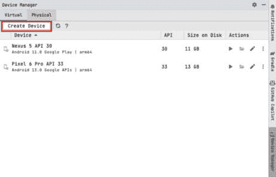

图 7.5 – 设备管理器

1.  选择**虚拟设备**选项卡，然后点击**创建设备**，这将弹出一个窗口：

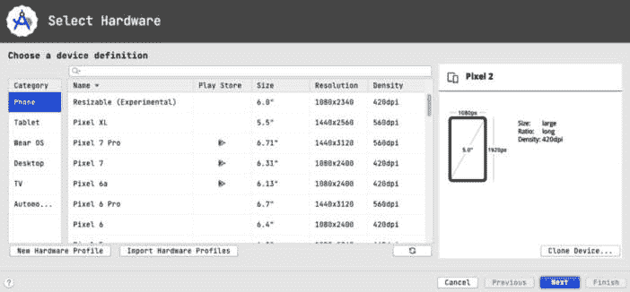

图 7.6 – 新设备配置

该窗口使你能够自定义你想要创建的设备的属性。你可以更改设备类别，并且你也可以选择你想要创建的设备。

1.  让我们在**手机**类别下选择**可调整大小（实验性）**选项。这将使我们能够创建一个可调整大小的设备。点击**下一步**，你将看到以下窗口：

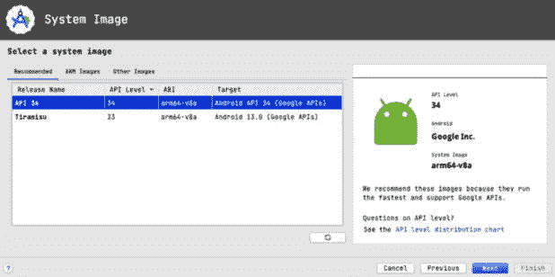

图 7.7 – 系统镜像

1.  在这里，你选择要使用的系统镜像。让我们选择**API 34**系统镜像。点击**下一步**，你将看到以下窗口：

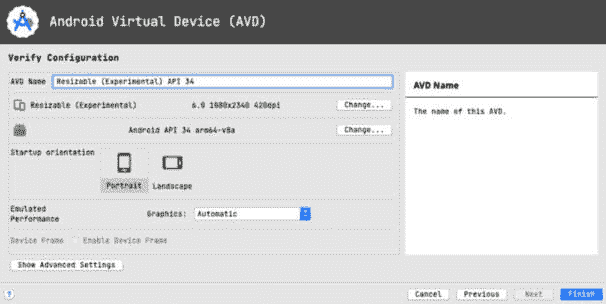

图 7.8 – 设备信息

这是最后一步，在这里你确认设备名称和设备方向。我们将保持生成的名称，并使用纵向作为默认方向。

1.  点击**完成**，你将看到设备已添加到你的设备列表中：

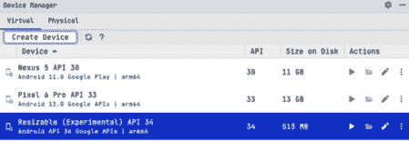

图 7.9 – 设备列表

1.  启动模拟器并运行应用。

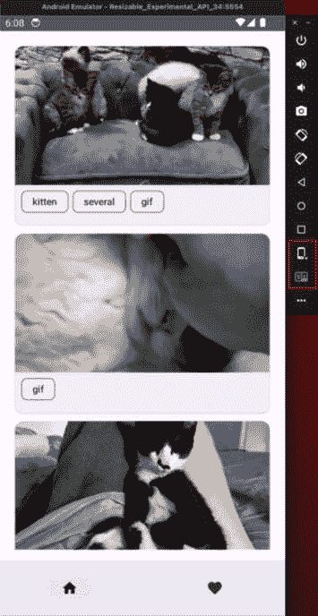

图 7.10 – 可调整大小的模拟器

从模拟器中，我们可以看到有两个选项被突出显示。第一个选项允许我们将设备从小型/普通设备更改为可折叠或平板设备。第二个选项允许我们在更改为可折叠设备时更改选项。让我们将设备更改为可折叠设备。现在应用将导航选项更改为导航轨道，屏幕上还打开了第一只猫的列表和详细信息。

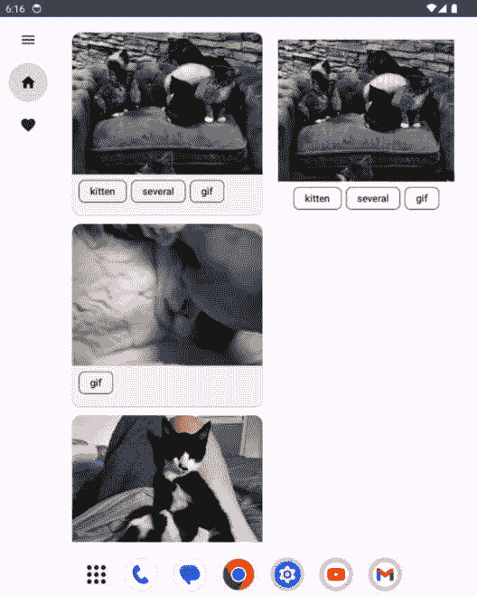

图 7.11 – 可折叠设备导航轨道

在点击**可折叠**选项时，我们可以看到以下选项：


图 7.12 – 可折叠选项

在可折叠部分选择第二个选项将带我们到以下屏幕：

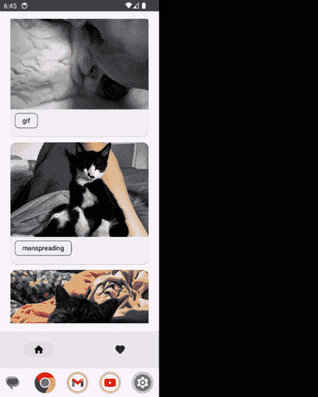

图 7.13 – 可折叠设备

从设备尺寸选项中，我们还可以切换到平板视图：

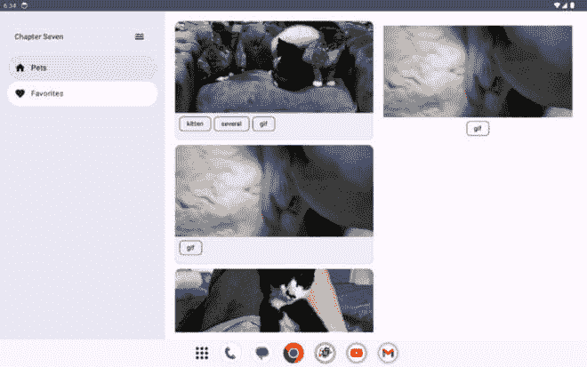

图 7.14 – 平板视图

您可以看到现在应用有一个永久的导航抽屉，屏幕上还打开了第一只猫的列表和详细信息。点击不同的猫，您将在屏幕右侧看到猫的详细信息。我们还可以导航到**收藏**屏幕，然后返回到**宠物**屏幕。

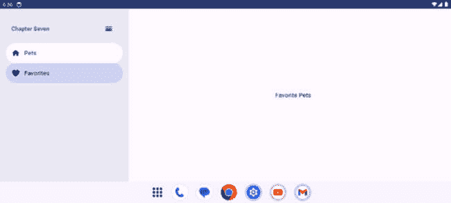

图 7.15 – 喜爱的宠物屏幕

我们还可以看到模式导航抽屉：

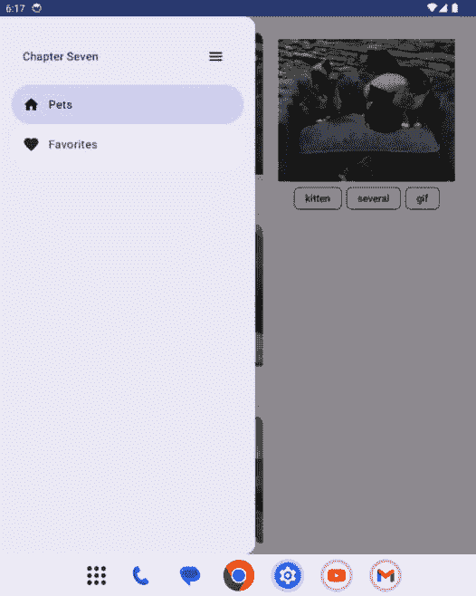

图 7.16 – 模式导航抽屉

可调整大小的模拟器是我们测试不同设备尺寸应用的好方法，但它有其自身的局限性。以下是可以调整大小的模拟器的局限性：

+   **铰链模拟**：虽然可调整大小的模拟器提供了多窗口支持和模拟各种方向，但它们可能无法准确复制可折叠设备上物理铰链的行为。铰链的物理特性和行为可能会以不同的方式影响应用布局和交互。

+   **硬件特定**：模拟器缺乏可折叠设备中存在的物理硬件组件，例如实际铰链机构、柔性显示屏、传感器和专有功能，这影响了可折叠设备行为的真实模拟。

+   **性能变化**：模拟器可能无法准确代表真实可折叠设备的性能能力，特别是在硬件特定优化和性能特性方面。

+   **现实世界测试环境**：可折叠设备可能具有影响用户体验的独特环境因素，例如外部照明条件会影响柔性显示屏。模拟器可能无法准确复制这些现实世界场景。

+   **软件仿真与硬件交互**：由于硬件特定的交互，某些可折叠设备的行为，例如跨屏幕的拖放交互或独特的手势，可能无法在软件中完全仿真。

我们学习了如何处理可折叠设备和大型屏幕中的导航，以及如何在用户在不同屏幕尺寸之间切换时提供出色的用户体验。这确保了我们的应用能够对不同设备做出响应，并且我们能够充分利用可用的屏幕尺寸。谷歌团队发布了支持大屏幕和可折叠设备的公司故事；您可以在此查看：[`developer.android.com/large-screens/stories`](https://developer.android.com/large-screens/stories)。

# 摘要

在本章中，我们学习了如何使用 Jetpack Compose 导航库在应用内导航到不同的 Jetpack Compose 屏幕。我们还学习了使用此库的技巧和最佳实践。此外，我们还介绍了如何在导航到屏幕时传递参数。最后，我们通过详细处理大屏幕和可折叠设备中的导航，在*第四章*所学内容的基础上进行了扩展。

我们已经创建了`FavoritePetsScreen`，但截至目前，它只有一个`Text`标签。在下一章中，我们将添加功能以在本地持久化数据，并在没有互联网访问的情况下检索该数据。我们将学习如何将我们可爱的小猫照片保存到 Room，这是另一个用于离线存储的 Jetpack 库，并且还将添加宠物到我们的收藏列表中。
