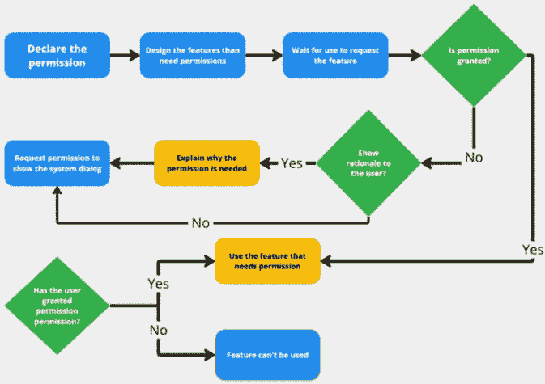
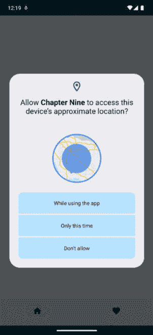
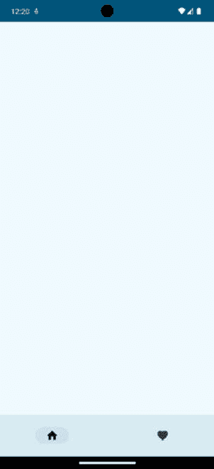
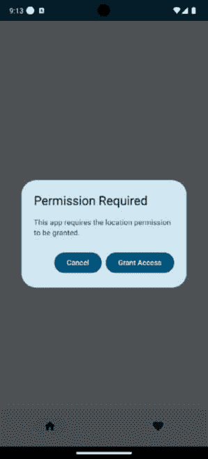
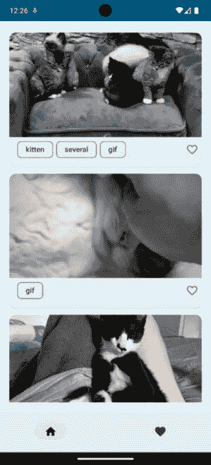

# 第九章：运行时权限

随着我们构建 Android 应用，有一些功能需要授予相应的权限才能正常工作。由于隐私和数据安全政策，我们作为开发者不能自动为我们开发的应用程序授予权限。我们需要通知用户应用程序需要的权限以及为什么需要它们。

在本章中，我们将了解运行时权限以及如何在我们的应用程序中请求它们。

在本章中，我们将涵盖以下主要内容：

+   理解运行时权限

+   运行时请求权限

# 技术要求

要遵循本章的说明，您需要下载 Android Studio Hedgehog 或更高版本（[`developer.android.com/studio`](https://developer.android.com/studio)）。

您可以使用上一章的代码来遵循本章的说明。您可以在[`github.com/PacktPublishing/Mastering-Kotlin-for-Android/tree/main/chapternine`](https://github.com/PacktPublishing/Mastering-Kotlin-for-Android/tree/main/chapternine)找到本章的代码。

# 理解运行时权限

`requestPermissions()` 和 `checkSelfPermission()`。用户在整个应用生命周期中只需要授予一次权限。

需要授予权限才能工作的功能中，有些是相机、位置、麦克风和存储。在使用它们之前，请确保用户有权使用它们。如果用户尚未授予权限，您必须向他们请求。如果用户拒绝了权限，您必须显示一个对话框解释为什么需要它，并要求用户从设置中授权。如果用户已经授权了权限，您就可以使用该功能。未能进行这些检查通常会导致应用程序崩溃或功能无法正常工作。如果您的应用程序针对 Android 6.0 及以上版本，您必须在运行时请求这些权限，并且用户必须授权才能使应用程序工作。

请求权限的流程如下所示：



图 9.1 – 运行时权限流程

如前图所示，这是流程：

1.  初始步骤是在清单文件中*声明*权限。这是通过将权限添加到清单文件来完成的。

1.  在将权限添加到清单文件后，我们必须*设计 UX*，以便需要授予权限的功能。

1.  下一步是*等待用户使用*需要授予权限的功能。在这个阶段，我们检查用户是否已经授予了权限。如果用户已经授予了权限，我们就继续使用该功能。

1.  如果用户*尚未授予权限*，我们首先检查是否需要*显示一个理由*来解释为什么我们需要权限。如果需要显示理由，我们将用解释来展示它，然后请求用户授权。如果不需要显示理由，我们只需请求用户授权。

1.  一旦请求了权限，我们等待 *用户授予或拒绝* 权限。如果用户授予了权限，我们继续使用该功能。如果用户拒绝了权限，我们允许应用工作，但用户无法使用需要权限才能工作的功能。

带着这种流程在心中的想法，让我们看看如何在代码中实现它。我们将请求权限以访问位置。

# 运行时请求权限

我们将遵循 *图 9**.1 中涵盖的步骤来请求我们应用的运行时权限：

1.  让我们从将权限添加到清单文件开始。我们将请求访问用户位置的权限。为此，我们在清单文件中添加以下权限：

    ```java
    <uses-permission android:name="android.permission.ACCESS_COARSE_LOCATION" />
    ```

    这指定了我们的应用将使用 `ACCESS_COARSE_LOCATION` 权限。在清单文件中声明权限对于增强安全性、用户意识和整体应用兼容性至关重要。通过明确指定应用需要访问的动作或资源，允许用户在安装期间了解情况，从而让他们做出明智的授予或拒绝访问的决定。这种声明确保了不同 Android 版本和设备之间的兼容性，促进了应用间的通信，并支持意图过滤以控制组件访问。权限在运行时请求危险权限中也发挥作用，有助于保持平台兼容性。此外，Play 商店审查将权限作为提交过程的一部分，有助于遵守政策和指南。本质上，基于清单的权限声明对于创建安全、透明和用户控制的环境至关重要。

    接下来，我们需要为需要权限的功能创建用户界面。我们将创建一个对话框来请求用户的权限。它还将包含逻辑，如果之前拒绝了权限，则会向用户展示理由。

1.  让我们在 **view** 包中创建一个名为 **PermissionDialog.kt** 的新文件，并将实用函数添加到该文件中：

    ```java
    fun checkIfPermissionGranted(context: Context, permission: String): Boolean {
        return (ContextCompat.checkSelfPermission(context, permission)
                == PackageManager.PERMISSION_GRANTED)
    }
    fun shouldShowPermissionRationale(context: Context, permission: String): Boolean {
        val activity = context as Activity?
        if (activity == null)
            Log.d("Permissions", "Activity is null")
        return ActivityCompat.shouldShowRequestPermissionRationale(
            activity!!,
            permission
        )
    }
    ```

    第一个函数使用 `ContextCompat.checkSelfPermission()` 函数检查权限是否已被授予。第二个函数检查是否需要向用户展示理由。这是通过使用 `ActivityCompat.shouldShowRequestPermissionRationale()` 函数来完成的。如果该应用之前请求过此权限并且用户拒绝了请求，则该函数返回 `true`。如果用户之前拒绝了权限请求并选择了 `false`。

    接下来，让我们创建一个密封类，用于表示权限请求的状态。

1.  在 **data** 包中创建一个名为 **PermissionAction.kt** 的新文件，并将以下代码添加到该文件中：

    ```java
    sealed class PermissionAction {
        data object PermissionGranted : PermissionAction()
        data object PermissionDenied : PermissionAction()
    }
    ```

    该类有两个状态，`PermissionGranted` 和 `PermissionDenied`。用户可以授予或拒绝权限。

1.  接下来，让我们创建一个用于请求用户权限的对话框。回到 **PermissionDialog.kt** 文件，并向文件中添加以下代码：

    ```java
    @Composable
    fun PermissionDialog(
        context: Context,
        permission: String,
        permissionAction: (PermissionAction) -> Unit
    ) {
        val isPermissionGranted = checkIfPermissionGranted(context, permission)
        if (isPermissionGranted) {
            permissionAction(PermissionAction.PermissionGranted)
            return
        }
        val permissionsLauncher = rememberLauncherForActivityResult(
            ActivityResultContracts.RequestPermission()
        ) { isGranted: Boolean ->
            if (isGranted) {
                permissionAction(PermissionAction.PermissionGranted)
            } else {
                permissionAction(PermissionAction.PermissionDenied)
            }
        }
        val showPermissionRationale = shouldShowPermissionRationale(context, permission)
        var isDialogDismissed by remember { mutableStateOf(false) }
        var isPristine by remember { mutableStateOf(true) }
        if ((showPermissionRationale && !isDialogDismissed) || (!isDialogDismissed && !isPristine)) {
            isPristine = false
            AlertDialog(
                onDismissRequest = {
                    isDialogDismissed = true
                    permissionAction(PermissionAction.PermissionDenied)
                },
                title = { Text(text = "Permission Required") },
                text = { Text(text = "This app requires the location permission to be granted.") },
                confirmButton = {
                    Button(
                        onClick = {
                            isDialogDismissed = true
                            permissionsLauncher.launch(permission)
                        }
                    ) {
                        Text(text = "Grant Access")
                    }
                },
                dismissButton = {
                    Button(
                        onClick = {
                            isDialogDismissed = true
                            permissionAction(PermissionAction.PermissionDenied)
                        }
                    ) {
                        Text(text = "Cancel")
                    }
                }
            )
        } else {
            if (!isDialogDismissed) {
                SideEffect {
                    permissionsLauncher.launch(permission)
                }
            }
        }
    }
    ```

    让我们分析前面的代码：

    +   我们创建了一个可组合的 `PetsScreen` 可组合组件。

    +   让我们转到 **PetsScreen.kt** 文件，并将其修改如下：

        ```java
        @Composable
        fun PetsScreen(
            onPetClicked: (Cat) -> Unit,
            contentType: ContentType,
        ) {
            val petsViewModel: PetsViewModel = koinViewModel()
            val petsUIState by petsViewModel.petsUIState.collectAsStateWithLifecycle()
            val context = LocalContext.current
            var showContent by rememberSaveable { mutableStateOf(false) }
            PermissionDialog(
                context = context,
                permission = Manifest.permission.ACCESS_COARSE_LOCATION
            ) { permissionAction ->
                when (permissionAction) {
                    is PermissionAction.PermissionDenied -> {
                        showContent = false
                    }
                    is PermissionAction.PermissionGranted -> {
                        showContent = true
                        Toast.makeText(
                            context,
                            "Location permission granted!",
                            Toast.LENGTH_SHORT
                        ).show()
                    }
                }
            }
            if (showContent) {
                PetsScreenContent(
                    modifier = Modifier
                        .fillMaxSize(),
                    onPetClicked = onPetClicked,
                    contentType = contentType,
                    petsUIState = petsUIState,
                    onFavoriteClicked = {
                        petsViewModel.updatePet(it)
                    }
                )
            }
        }
        ```

        我们只对此文件做了一些修改：

        +   首先，我们添加了一个名为 **showContent** 的可变状态，用于检查我们是否应该显示屏幕的内容。我们还设置了状态的初始值为 **false**。如果用户授予权限，我们将使用此状态来显示屏幕的内容。我们还有一个 **context** 变量，用于获取屏幕的上下文。

        +   我们还向 **PetsScreen** 可组合组件添加了 **PermissionDialog** 可组合组件。我们将上下文和权限（在这种情况下，为 **ACCESS_COARSE_LOCATION** 权限）传递给可组合组件。我们还传递了一个回调给可组合组件，用于获取权限请求的状态。如果用户授予权限，我们将 **showContent** 状态设置为 **true** 并显示一个包含 **位置权限已授予** 消息的吐司。如果用户拒绝权限，我们将 **showContent** 状态设置为 **false**。

        +   最后，我们添加了一个检查，以查看 **showContent** 状态是否为 **true**。如果状态为 **true**，我们显示屏幕的内容。如果状态为 **false**，我们不显示屏幕的内容。

    +   构建并运行应用。一开始，我们将看到授权对话框，如下面的截图所示：



图 9.2 – 授权对话框

1.  点击 **不允许** 选项，将显示一个空白的白色屏幕，因为我们没有在用户未授予应用权限时显示任何内容。



图 9.3 – 无权限屏幕

下次我们运行应用时，我们将看到显示应用为何需要权限的授权理由对话框。



图 9.4 – 授权理由

在这个授权理由对话框中，我们可以取消请求或授权访问。点击 **授权访问** 选项应显示如图 *9.2* 所示的授权对话框，并通过点击 **使用应用时** 选项，我们授予应用位置权限，现在，我们应该能够再次看到可爱猫咪的列表。再次运行应用不会显示对话框，因为我们已经授予了应用位置权限。



图 9.5 – 可爱的猫咪

# 摘要

在本章中，我们探讨了运行时权限是什么以及为什么我们应该在我们的应用中声明和请求权限。一步一步地，我们学习了如何在我们的应用中请求运行时权限以及如何显示权限理由对话框，向用户解释为什么在用户拒绝应用访问权限的情况下，我们需要访问运行时权限。

在下一章中，我们将学习调试技巧和窍门，如何使用 LeakCanary 检测泄漏，如何使用 Chucker 检查我们应用发出的 HTTPS 请求/响应，以及如何检查 Room 数据库。
