# 第十章：调试您的应用

调试是开发应用的一个重要方面。它帮助我们识别和修复代码中的错误。对于开发者来说，这是一项非常重要的技能。它还有助于我们避免未来的错误。许多工具可以帮助我们调试代码。在本章中，我们将探讨一些可以帮助我们调试代码的工具。

在本章中，我们将学习调试技巧和窍门，如何使用 LeakCanary 检测泄漏，如何使用 Chucker 检查我们应用发出的网络请求/响应，以及如何使用 App Inspection 检查我们的 Room 数据库、网络请求和后台任务。

在本章中，我们将涵盖以下主要内容：

+   通用调试技巧和窍门

+   使用 LeakCanary 检测泄漏

+   使用 Chucker 检查网络请求

+   使用 App Inspection

# 技术要求

要遵循本章的说明，您需要下载 Android Studio Hedgehog 或更高版本([`developer.android.com/studio`](https://developer.android.com/studio))。

您可以使用上一章的代码来遵循本章的说明。您可以在[`github.com/PacktPublishing/Mastering-Kotlin-for-Android/tree/main/chapterten`](https://github.com/PacktPublishing/Mastering-Kotlin-for-Android/tree/main/chapterten)找到本章的代码。

# 通用调试技巧和窍门

Android Studio 提供了各种功能，帮助我们调试代码。以下是一些功能列表：

+   **Logcat**

+   **堆栈跟踪**

+   **断点**

让我们逐一看看这些。

## Logcat

Android Studio 中的 Logcat 实时显示我们应用中的日志消息。每条日志消息都附有一个优先级。我们使用 `Log` 类在我们的应用中添加日志消息。这个类提供了我们可以用来记录消息的不同优先级。不同的优先级如下：

+   **V**: 详细（最低优先级）

+   **D**: 调试

+   **I**: 信息

+   **W**: 警告

+   **E**: 错误

+   **F**: 致命

+   **S**: 静默（最高优先级）

我们使用前面的字母来指定日志级别。例如，如果我们想以调试级别记录一条消息，我们将使用以下代码：

```java
Log.d("TAG", "Message")
```

第一个参数是标签。标签用于识别日志消息的来源。第二个参数是我们想要记录的消息。每次我们运行应用时，Logcat 都会出现在 Android Studio 窗口的底部，如下所示：

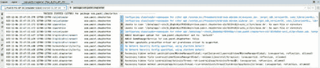

图 10.1 – Logcat

从先前的图中，我们可以看到在顶部，Logcat 窗口显示了我们在其上运行应用的设备。在这种情况下，我们在一个 **Pixel 6 Pro API 33** 模拟器上运行我们的应用；你的可能因安装的模拟器而不同。在设备旁边，我们可以看到正在运行的应用的**包名**。这有一个搜索栏，允许我们通过它们的标签搜索特定的日志。在搜索栏下方是实际的日志。我们可以看到每个日志都有一个标签、优先级级别、应用的包名、日志创建的时间以及消息。我们还可以看到日志是按颜色编码的。要查看我们 Logcat 的所有颜色设置，我们转到 **设置** | **编辑器** | **颜色方案** | **Android Logcat**，如图下所示：

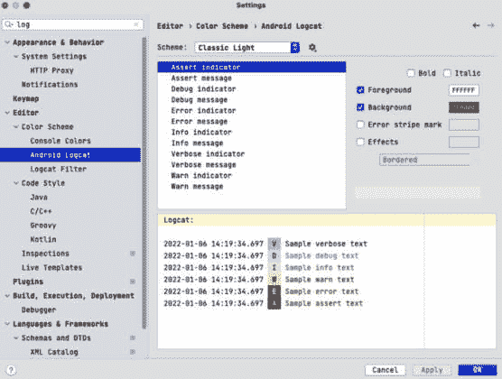

图 10.2 – Logcat 颜色设置

这样，我们可以为我们的 Logcat 设置一个颜色方案。在先前的图中，颜色方案已被设置为**经典亮色**。有一个列表显示了每个日志级别的颜色，并且你可以为每个日志级别更改颜色。我们还可以更改 Logcat 的字体样式和大小。

使用这种方法，让我们看看如何创建我们的第一个 Logcat 消息。让我们转到 `MainActivity.kt` 文件，并在 `onCreate()` 方法中添加以下日志消息：

```java
Log.d("First Log", "This is our first log message")
```

运行应用，并在搜索栏中添加 `First Log` 作为搜索查询：

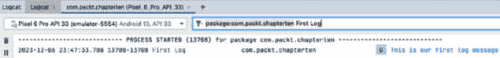

图 10.3 – Logcat 搜索

这只显示了带有标签 **First Log** 的日志消息。当我们有很多日志，并希望搜索特定日志时，这特别有用。

## 堆栈跟踪

**堆栈跟踪**是从应用启动点到异常抛出点的调用方法列表。它在帮助我们识别异常原因方面非常有用。堆栈跟踪通常在 Logcat 中显示。

要查看我们的第一个堆栈跟踪，让我们转到 `MainActivity.kt` 文件，并在 `onCreate()` 方法中添加以下代码：

```java
throw RuntimeException("This is a crash")
```

上述代码在运行时会引发应用崩溃。应用在执行上述代码后立即崩溃，通过检查我们的 Logcat，我们应该能够看到堆栈跟踪：

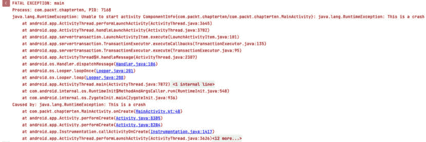

图 10.4 – 崩溃堆栈跟踪

如先前的图所示，堆栈跟踪显示了异常或崩溃的原因。此外，它还显示了异常抛出的类和方法。它还显示了异常抛出的行号。这特别有助于我们识别异常的原因。我们可以直接点击行号，它将带我们到异常抛出的代码行。

栈跟踪是帮助我们调试代码和快速检测崩溃及其原因的关键工具。在继续之前，请记住删除引发异常的代码，以便我们可以继续本章的其余部分。

Android Studio 允许我们从不同的来源复制并粘贴堆栈跟踪，并在我们的 Logcat 中查看它们。复制以下堆栈跟踪：

```java
FATAL EXCEPTION: main
Process: com.packt.chapterten, PID: 7168
java.lang.RuntimeException: Unable to start activity ComponentInfo{com.packt.chapterten/com.packt.chapterten.MainActivity}: java.lang.RuntimeException: This is a crash
at android.app.ActivityThread.performLaunchActivity(ActivityThread.java:3645)
at android.app.ActivityThread.handleLaunchActivity(ActivityThread.java:3782)
at android.app.servertransaction.LaunchActivityItem.execute(LaunchActivityItem.java:101)
at android.app.servertransaction.TransactionExecutor.executeCallbacks(TransactionExecutor.java:135)
at android.app.servertransaction.TransactionExecutor.execute(TransactionExecutor.java:95)
at android.app.ActivityThread$H.handleMessage(ActivityThread.java:2307)
at android.os.Handler.dispatchMessage(Handler.java:106)
at android.os.Looper.loopOnce(Looper.java:201)
at android.os.Looper.loop(Looper.java:288)
at android.app.ActivityThread.main(ActivityThread.java:7872)
at java.lang.reflect.Method.invoke(Native Method)
at com.android.internal.os.RuntimeInit$MethodAndArgsCaller.run(RuntimeInit.java:548)
at com.android.internal.os.ZygoteInit.main(ZygoteInit.java:936)
Caused by: java.lang.RuntimeException: This is a crash
at com.packt.chapterten.MainActivity.onCreate(MainActivity.kt:48)
at android.app.Activity.performCreate(Activity.java:8305)
at android.app.Activity.performCreate(Activity.java:8284)
at android.app.Instrumentation.callActivityOnCreate(Instrumentation.java:1417)
at android.app.ActivityThread.performLaunchActivity(ActivityThread.java:3626)
at android.app.ActivityThread.handleLaunchActivity(ActivityThread.java:3782)
at android.app.servertransaction.LaunchActivityItem.execute(LaunchActivityItem.java:101)
at android.app.servertransaction.TransactionExecutor.executeCallbacks(TransactionExecutor.java:135)
at android.app.servertransaction.TransactionExecutor.execute(TransactionExecutor.java:95)
at android.app.ActivityThread$H.handleMessage(ActivityThread.java:2307)
at android.os.Handler.dispatchMessage(Handler.java:106)
at android.os.Looper.loopOnce(Looper.java:201)
at android.os.Looper.loop(Looper.java:288)
at android.app.ActivityThread.main(ActivityThread.java:7872)
at java.lang.reflect.Method.invoke(Native Method)
at com.android.internal.os.RuntimeInit$MethodAndArgsCaller.run(RuntimeInit.java:548)
at com.android.internal.os.ZygoteInit.main(ZygoteInit.java:936)
```

在复制完堆栈跟踪后，转到 Android Studio 顶部的**代码**选项卡，选择**分析堆栈跟踪或线程转储**，粘贴堆栈跟踪，您将看到以下带有堆栈跟踪的对话框：

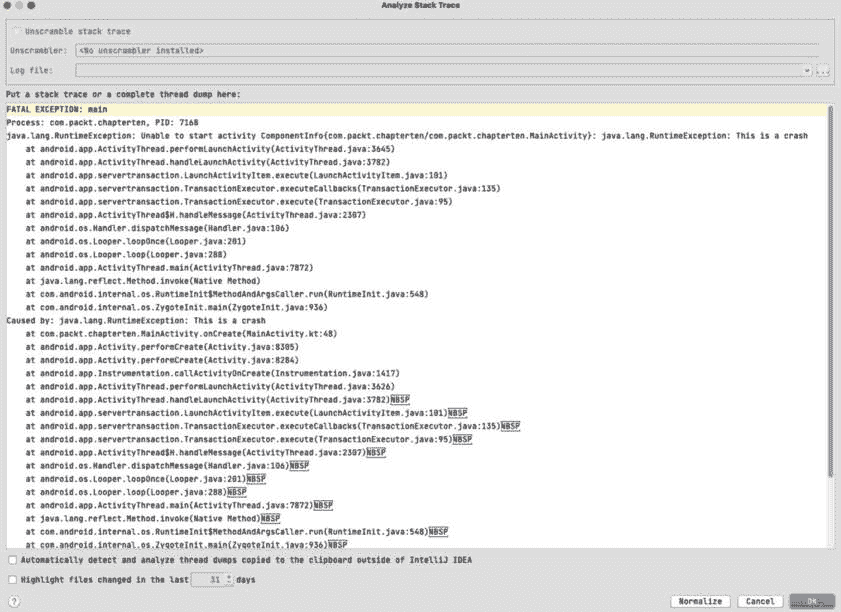

图 10.5 – 分析堆栈跟踪

这显示了刚刚粘贴的堆栈跟踪的预览。点击**确定**将我们带到 Logcat 并显示如*图 10.4*所示的堆栈跟踪。

## 断点

我们使用**断点**来调试我们的应用代码。断点是我们希望调试器暂停代码执行的点。当我们试图找到仅在特定条件下出现的错误时，这非常有用。Android Studio 允许我们在代码中添加断点。我们可以通过点击以下图中行号的左侧来添加断点：

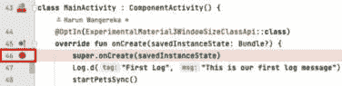

图 10.6 – 断点

如*图 10.6*所示，当我们添加断点时，会显示一个红色圆圈。为了能够看到断点的工作方式，我们需要以**调试模式**运行应用。我们可以通过点击**调试**按钮来完成此操作：


图 10.7 – 调试应用

由于断点位于`onCreate()`方法上，调试器将在断点处暂停我们的代码执行。Android Studio 将突出显示断点所在的行：

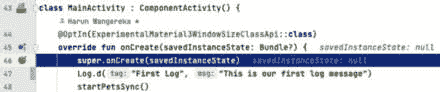

图 10.8 – 行断点

它还在底部显示一个**调试**窗口：


图 10.9 – 调试窗口

**调试**窗口显示断点作用域内的变量。我们还可以看到调用堆栈，它显示了在断点之前被调用的方法。我们还可以看到在我们应用中运行的线程。我们还可以看到添加到我们代码中的断点。

**调试**窗口顶部有一些按钮，在调试代码时非常有帮助：

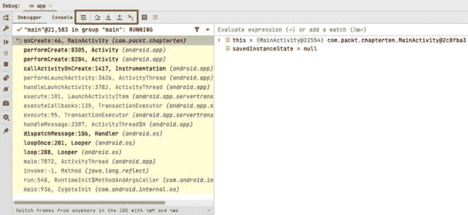

图 10.10 – 调试窗口按钮

按钮如*图 10.10*中突出显示。从左到右，按钮依次是：

+   **显示执行点**：此按钮显示调试器暂停的代码行

+   **单步执行**：此按钮允许我们执行当前代码行并移动到下一行代码

+   **进入方法**：此按钮允许我们进入方法调用

+   **退出方法**：此按钮允许我们退出方法调用

+   **运行到光标处**：此按钮允许我们运行代码，直到光标到达光标所在的代码行

在**调试**窗口的左侧，我们还可以看到**播放**和**停止**按钮。**播放**按钮允许我们恢复代码的执行并继续调试会话，直到下一个断点或程序完成执行。要了解更多关于断点的信息，请访问官方文档[`developer.android.com/studio/debug`](https://developer.android.com/studio/debug)。

在本节中，我们了解了 Android Studio 中可用的不同调试选项。我们学习了 Logcat、堆栈跟踪和断点。我们还学习了如何使用这些工具来调试我们的代码。在下一节中，我们将了解另一个调试工具 LeakCanary 以及如何使用它来检测我们应用中的内存泄漏。

# 使用 LeakCanary 检测内存泄漏

**LeakCanary**是由 Square 开发的开源库，帮助我们检测应用中的内存泄漏。该库了解 Android 框架的内部结构，允许它缩小内存泄漏的原因。它有助于减少我们应用中的**应用程序无响应**（**ANR**）错误和**内存不足崩溃**。以下是内存泄漏的一些最常见原因：

+   将**活动**实例存储为在对象中作为**上下文**字段，该对象因配置更改而存活

+   忘记在不再需要时注销广播接收器、监听器、回调或 RxJava 订阅

+   在后台线程中存储**上下文**引用

LeakCanary 设置起来相当简单，使用它不需要代码实现。我们只需在`libs.version.toml`文件中添加`leakcanary-android`依赖项：

```java
leakcanary-android = "com.squareup.leakcanary:leakcanary-android:2.12"
```

点击`build.gradle.kts`文件：

```java
debugImplementation(libs.leakcanary.android)
```

我们使用`debugImplementation`配置添加了依赖项，以便它仅添加到调试构建中。这是因为 LeakCanary 仅用于调试目的。现在我们可以运行我们的应用并查看 LeakCanary 是如何工作的。如以下图所示，将在我们的设备或模拟器上安装一个单独的应用：


图 10.11 – 泄漏应用

打开应用会显示以下屏幕：

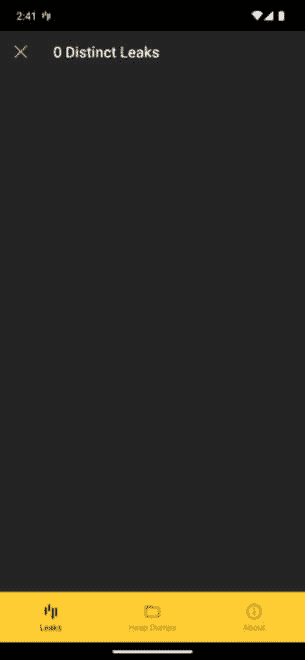

图 10.12 – LeakCanary 屏幕

屏幕显示了**泄漏**、**堆转储**和**关于**标签页。**泄漏**标签页显示了在我们应用中检测到的内存泄漏。**堆转储**标签页显示了已捕获的堆转储。**关于**标签页显示了我们正在使用的 LeakCanary 版本以及一般信息。目前，没有检测到内存泄漏。当检测到内存泄漏时，LeakCanary 将生成一个包含有关内存泄漏详细信息的通知或日志输出。这些信息帮助我们确定内存泄漏的原因并修复它。

让我们在应用中创建一个内存泄漏并看看 LeakCanary 是如何工作的：

1.  在**com.packt.chapterten**包内创建一个新文件，命名为**LeakCanaryTest.kt**。将以下代码添加到文件中：

    ```java
    class LeakCanaryTest
    class LeakTestUtils {
        companion object {
            val leakCanaryTest = LeakCanaryTest()
        }
    }
    ```

    在前面的代码中，我们创建了一个名为`LeakCanaryTest`的类，另一个名为`LeakTestUtils`的类，以及一个伴随对象，该对象将`LeakCanaryTest`单例存储在静态字段中。

1.  现在让我们转到**MainActivity.kt**文件，并在**onCreate()**代码中添加以下代码：

    ```java
    AppWatcher.objectWatcher.expectWeaklyReachable(
        LeakTestUtils.leakCanaryTest,
        "Static reference to LeakCanaryTest"
    )
    ```

    在前面的代码中，我们告诉 LeakCanary`LeakCanaryTest`的单例实例将被垃圾回收。

1.  让我们运行应用。我们可以看到 LeakCanary 检测到了内存泄漏，并显示了一个通知，如图所示：

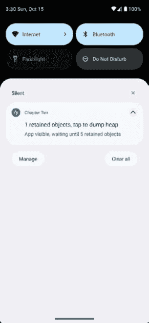

图 10.13 – 内存泄漏通知

1.  点击通知，它将带我们进入 LeakCanary 应用，在那里我们可以看到内存泄漏的详细信息：

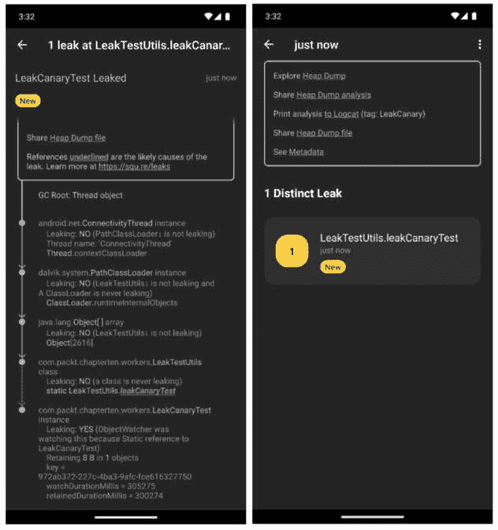

图 10.14 – 内存泄漏详细信息

如前图所示，LeakCanary 显示了内存泄漏的位置，并下划线了导致泄漏的对象。在这种情况下，是`leakCanaryTest`对象导致了内存泄漏。每次我们遇到内存泄漏时，我们都会收到这样的详细信息。

请记住，在`MainActivity`的`onCreate()`方法中删除导致内存泄漏的代码，这样我们才能继续本章的其余部分。

我们已经了解了 LeakCanary 及其如何用于检测应用中的内存泄漏。您可以在[`square.github.io/leakcanary/`](https://square.github.io/leakcanary/)了解更多关于 LeakCanary 的信息。

在下一节中，我们将了解 Chucker，另一个调试工具，它帮助我们检查应用中的网络请求。

# 使用 Chucker 检查网络请求

这是从 Chucker GitHub ([`github.com/ChuckerTeam/chucker`](https://github.com/ChuckerTeam/chucker))页面：

Chucker 简化了我们 Android 应用发出的 HTTP(S)请求/响应的检查。Chucker 作为一个 OkHttp 拦截器，将所有这些事件持久化在我们的应用中，并提供一个用于检查和共享其内容的用户界面。Chucker 显示一个通知，显示当前网络请求的摘要。

点击之前提到的 Chucker 通知将启动 Chucker UI。Chucker UI 显示我们应用发出的所有网络请求的列表。我们可以点击一个请求以查看请求的详细信息。

使用 Chucker 的步骤如下：

1.  在**libs.versions.toml**文件中添加**chucker**依赖项：

    ```java
    chucker = "com.github.chuckerteam.chucker:library:4.0.0"
    chucker-no-op = "com.github.chuckerteam.chucker:library-no-op:4.0.0"
    ```

    在前面的代码中，我们添加了两个依赖项：第一个是 Chucker 库，第二个是一个无操作库变体，用于将 Chucker 从发布构建中隔离出来，因为我们只想在调试构建中看到请求。

1.  点击顶部的**Sync Now**按钮以同步项目。

1.  接下来，我们需要在我们的应用 **build.gradle.kts** 文件中添加依赖项：

    ```java
    debugImplementation(libs.chucker)
    releaseImplementation(libs.chucker.no.op)
    ```

1.  在顶部点击 **立即同步**。这将仅在调试构建中添加 Chucker 依赖项。

1.  接下来，我们需要创建一个新的 **OkHttp** 客户端并向其中添加 Chucker 拦截器。让我们转到 **Modules.kt** 文件，并将以下模块添加到 **appModules** 模块块中：

    ```java
    single {
        val chuckerCollector = ChuckerCollector(
            context = androidContext(),
            showNotification = true,
            retentionPeriod = RetentionManager.Period.ONE_HOUR
        )
        val chuckerInterceptor = ChuckerInterceptor.Builder(androidContext())
            .collector(chuckerCollector)
            .maxContentLength(250000L)
            .redactHeaders(emptySet())
            .alwaysReadResponseBody(false)
            .build()
       OkHttpClient.Builder()
            .addInterceptor(chuckerInterceptor)
            .build()
    }
    ```

    以下是对前述代码的解释：

    +   我们已经创建了一个 `OkHttpClient` 实例来执行网络请求。

    +   让我们修改我们的 **Retrofit** 实例以使用我们刚刚创建的 **OkHttpClient** 实例。仍然在 **Modules.kt** 文件中，按如下方式修改 Retrofit 实例：

        ```java
        single {
            Retrofit.Builder()
                .addConverterFactory(
                    Json.asConverterFactory(contentType = "application/json".toMediaType())
                )
                .client(get())
                .baseUrl("https://cataas.com/api/")
                .build()
        }
        ```

        我们已经添加了 `client` 参数，并通过 Koin 的 `get()` 调用将其传递到我们之前创建的 `OkHttpClient` 实例中。

        这样，我们的 Chucker 设置现在就完成了。

    +   构建并运行应用。我们可以看到 Chucker 已经检测到网络请求，并显示了一个通知，如图所示：

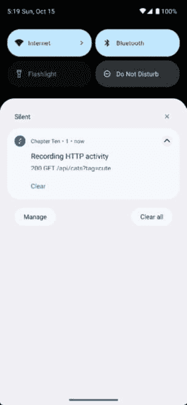

图 10.15 – Chucker 通知

从前一个图中，我们可以看到 Chucker 已经检测到网络请求，并显示了状态码、方法和请求的 URL。

1.  我们可以点击通知，它将带我们到 Chucker UI：

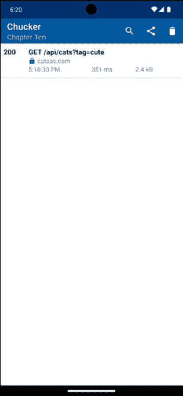

图 10.16 – Chucker 请求列表

这显示了我们的应用已执行的网络请求列表。

1.  点击一个请求以查看请求的详细信息：

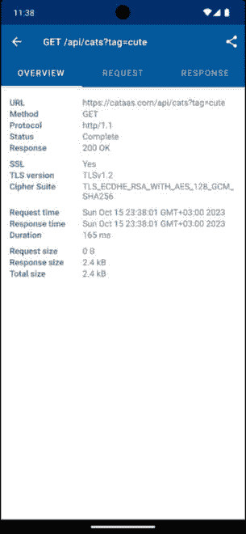

图 10.17 – Chucker 概览标签页

详细信息屏幕有三个标签，如前图所示。第一个标签是 **概览** 标签，如图 *图 10**.17* 所示。**概览** 标签显示了请求的概览。它显示了请求的详细信息，如 URL、方法、响应、持续时间、响应大小等。第二个标签是 **请求** 标签，它显示了请求头和正文：

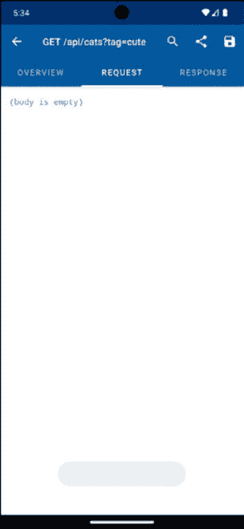

图 10.18 – Chucker 请求标签页

对于这个请求，正文为空，因为它是一个 GET 请求。第三个标签是 **响应** 标签，它显示了响应头和正文：

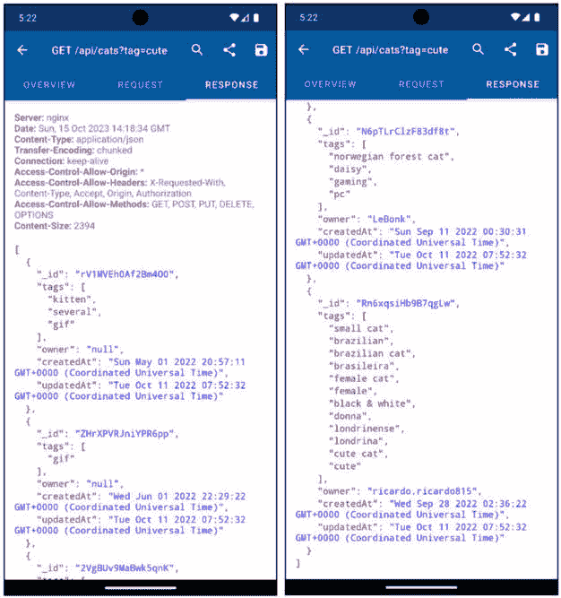

图 10.19 – Chucker 响应标签页

从前一个图中，我们可以看到以 JSON 格式显示的响应头和正文。

详细信息屏幕的工具栏有 **搜索**、**分享** 和 **保存** 按钮。**搜索** 按钮允许我们在请求或响应中进行搜索。**分享** 按钮允许我们以 JSON 格式分享请求或响应的详细信息。**保存** 按钮允许我们将请求或响应的详细信息保存到文件中。

Chucker 在调试我们应用中的网络请求方面非常有帮助。当非技术团队测试我们应用的调试版本时，我们总是可以告诉他们分享这些请求，尤其是在他们遇到网络请求问题时。

这就是 Chucker 的全部内容。每次我们的应用发起网络请求时，Chucker 都会显示一个通知，我们可以点击通知来查看请求的详细信息。

我们已经了解了 Chucker 以及如何使用它来检查我们的应用中的网络请求。在下一节中，我们将学习如何使用 App Inspection 来检查我们的应用房间数据库并探索 App Inspection 提供的功能。

# 使用 App Inspection

**App Inspection** 允许我们调试数据库、检查网络流量以及调试后台任务。它是帮助我们调试应用的一个非常重要的工具。要使用 App Inspection，让我们运行我们的应用，然后在 Android Studio 中导航到 **视图** | **工具窗口** | **App Inspection**：

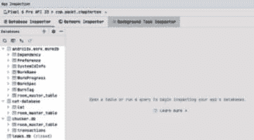

图 10.20 – App Inspection

App Inspection 会自动连接到我们的应用。第一个标签是 **数据库检查器**。在左侧，我们可以看到我们应用创建的不同数据库。我们有 WorkManager、Chucker、LeakCanary 和我们之前创建的 Cat 数据库。让我们点击 **Cat** 数据库，我们可以看到我们在数据库中创建的表的列：

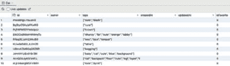

图 10.21 – 猫数据库

这显示了已保存到数据库中的列和值。我们也可以在数据库中运行查询。查询选项在以下图中突出显示：

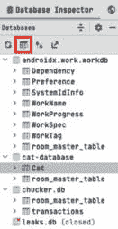

图 10.22 – 执行查询按钮

我们想要运行一个查询，以显示具有特定 `id` 的猫。我们可以通过运行以下查询来实现：

```java
SELECT * FROM CAT WHERE id == "rrsvsbRgL7zaJuR3"
```

您可以根据您拥有的数据使用不同的 `id`。查询结果将如下所示：

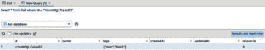

图 10.23 – 查询结果

数据包含了所有具有我们指定的 ID 的猫。需要注意的是，确保您在正确的数据库上执行查询，如图 *图 10*.23 所示。数据库检查器帮助我们调试并编写查询到数据库，当我们在使用数据库的应用上工作时非常有用。

让我们现在转到 **网络检查器** 标签。此标签显示了我们的应用发出的网络请求。我们可以看到请求方法、URL、状态码和请求持续时间：


图 10.24 – 网络检查器

从前面的图中，我们可以看到请求是用于加载可爱的猫图片以及请求的所有详细信息。类似于 Chucker，它也有请求和响应标签，提供了更多关于请求的信息。然而，与 Chucker 不同，**网络检查器**捕获应用发出的网络请求，而无需在代码中进行任何额外的设置。**网络检查器**标签在帮助我们调试应用中的网络请求时非常有用，尤其是在处理发出大量网络请求的应用时。

最后，让我们转到 **背景任务检查器** 选项卡。此选项卡显示了我们的应用程序发出的背景任务请求。我们的应用程序应显示以下内容：

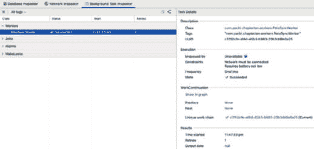

图 10.25 – 背景任务检查器

背景任务检查器显示了我们的背景任务的详细信息。它提供了关于 WorkManager `PetsSyncWorker` 工作者已成功的信息。在右侧显示了工作者的更多详细信息，如图 *图 10.25* 所示。这些详细信息显示了工作者的 UUID、约束、状态和结果，例如输出数据、重试次数以及开始时间。这些信息对于检查我们的背景任务是否按预期运行非常有帮助。

# 摘要

在本章中，我们学习了一些调试技巧和窍门，如何使用 LeakCanary 检测泄漏，如何使用 Chucker 检查我们的应用程序发出的网络请求/响应，以及如何使用 App Inspection 调试我们的数据库、检查我们的网络请求以及检查背景任务。

在下一章中，我们将学习 Kotlin 风格以及编写 Kotlin 代码的最佳实践。我们还将学习如何使用 Ktlint 和 Detekt 等插件来格式化、检查和早期检测代码问题。
