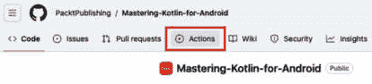
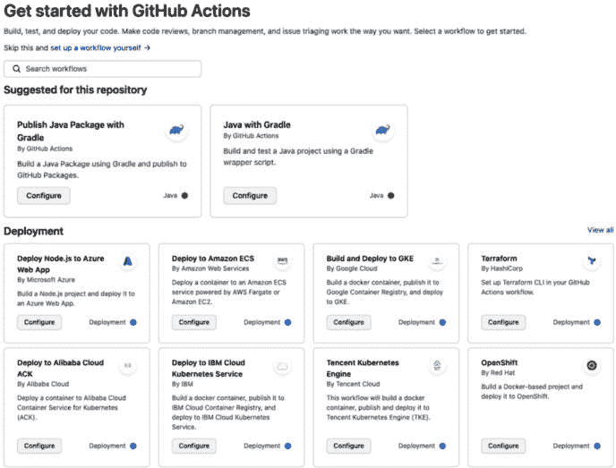
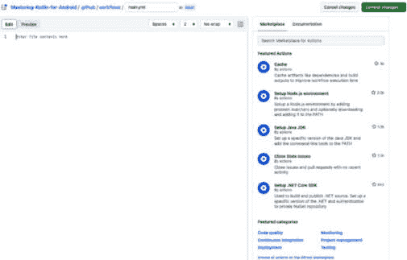
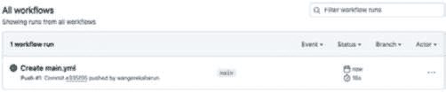
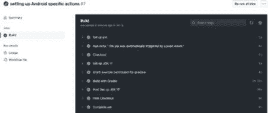
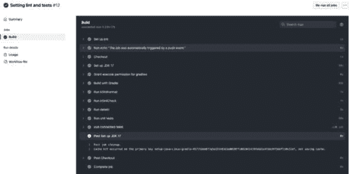
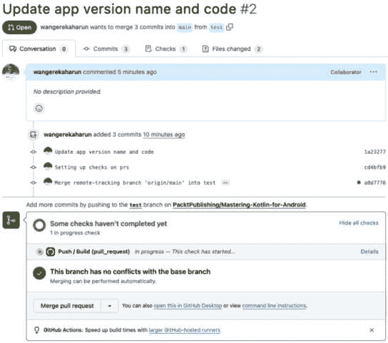
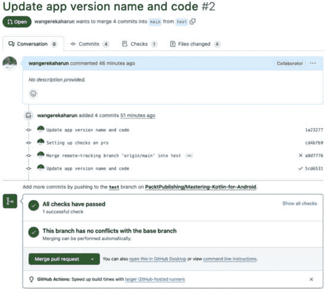
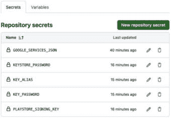

# 第十四章：持续集成和持续部署

在我们完成应用的开发和首次部署后，我们必须考虑如何使后续部署的过程更加顺畅，这就是 **持续集成/持续交付**（**CI/CD**）的用武之地。

在本章中，我们将学习如何使用 GitHub Actions 自动化一些手动任务，例如将新构建部署到 Google Play 商店。我们将学习如何在 CI/CD 管道中运行测试，并使用 GitHub Actions 将构建推送到 Play Store。

在本章中，我们将涵盖以下主要主题：

+   设置 GitHub Actions

+   在 GitHub Actions 上运行 lint 检查和测试

+   使用 GitHub Actions 部署到 Play Store

# 技术要求

要遵循本章的说明，您需要下载 Android Studio Hedgehog 或更高版本（[`developer.android.com/studio`](https://developer.android.com/studio)）。

您可以使用上一章的代码来遵循本章的说明。您可以在[`github.com/PacktPublishing/Mastering-Kotlin-for-Android/tree/main/chapterfourteen`](https://github.com/PacktPublishing/Mastering-Kotlin-for-Android/tree/main/chapterfourteen)找到本章的代码。

# 设置 GitHub Actions

在我们理解 GitHub Actions 之前，我们需要了解 CI/CD 是什么。这是一个允许我们自动化代码构建、测试和部署到生产的过程。CI/CD 不仅自动化了这些流程，还将它们整合到一个单一的连贯管道中。这确保了代码更改在部署时更加可靠和稳定。定义应该强调 CI/CD 在促进频繁和可靠更新方面的作用。这是一个特别重要的过程，因为它旨在提高我们交付软件的速度、效率和可靠性。

## CI/CD 的好处

让我们来看看 CI/CD 的一些好处：

+   **快速发布周期**：CI/CD 允许我们更快、更频繁地发布我们的软件。这是因为我们正在自动化构建、测试和部署代码的过程。

+   **增强协作**：由于许多流程都是自动化的，我们可以专注于代码和正在构建的功能。这使得我们能够更有效地与团队协作。

+   **减少手动工作**：由于自动化，我们正在减少所做的大量手动工作。这意味着我们可以专注于代码和正在构建的功能。

+   **提高质量**：自动化流程使我们能够更频繁、更有效地测试我们的代码。这意味着我们可以在流程的早期阶段捕捉到错误和缺陷。

现在我们已经了解了 CI/CD 的好处，让我们详细看看 CI/CD 的工作原理。

## CI/CD 的工作原理

让我们来看看 CI/CD 的工作原理：

+   **CI**: 这是自动化构建和测试我们代码的过程。每次我们将代码推送到我们的仓库时，都会执行这个过程。这使我们能够更早地捕捉到过程中的错误和缺陷。在这一步骤中，一旦我们将代码推送到或提交到远程仓库，这些仓库可以托管在 GitHub、Gitlab、Bitbucket 等，我们将对这些更改运行检查和测试，以确保它们是功能性的并且符合代码质量标准。如果测试通过，我们可以将代码合并到主分支。如果测试失败，我们可以修复代码并再次运行测试。

+   **CD**: 这是自动化将我们的代码部署到生产环境的过程。每次我们将代码推送到我们的仓库时，都会执行这个过程。这使我们能够更快、更频繁地发布我们的软件。这个过程发生在 CI 步骤之后。一旦更改合并到主分支或开发分支，我们就可以将代码部署到生产环境或需要部署到的任何环境。这一步骤旨在更频繁地将小更改推送到生产环境。这使我们能够更快、更频繁地发布我们的软件。

在这个背景下，我们现在可以查看 GitHub Actions ([`docs.github.com/en/actions`](https://docs.github.com/en/actions))。GitHub Actions 是一个 CI/CD 工具，允许我们自动化代码的构建、测试和部署。它是 GitHub 内置的，并且在使用一定限制内是免费的。它也非常容易使用和设置。

在下一节中，我们将为存储在本仓库中的项目设置 GitHub Actions：[`github.com/PacktPublishing/Mastering-Kotlin-for-Android`](https://github.com/PacktPublishing/Mastering-Kotlin-for-Android)

## 设置 GitHub Actions

要在我们的项目中启用 GitHub Actions，请按照以下步骤操作：

1.  前往我们仓库的**操作**标签页，如下截图所示：



图 14.1 – GitHub Actions 标签页

此步骤将带我们到 GitHub Actions 登录页面：



图 14.2 – GitHub Actions 登录页面

1.  如前图所示，我们有一些建议的操作，我们可以在我们的仓库中使用。目前，我们将自己设置操作，因此让我们点击**自行设置工作流程**选项。这会带我们到以下页面：



图 14.3 – 新的 GitHub Action

如前图所示，我们有一个用于编写工作流程的编辑器。注意，在顶部我们现在有一个名为`.github`的新文件夹。这是我们存储工作流程文件的地方。编辑器将工作流程文件保存在`.github/workflows`文件夹中。默认情况下，我们的工作流程命名为`main.yml`。在右侧，我们有模板，我们可以使用这些模板轻松创建我们的工作流程。

1.  现在，我们将创建自己的工作流程，因此让我们将以下代码添加到我们的工作流程中：

    ```kt
    name: Push
    on:
      push:
        branches: ["main" ]
      workflow_dispatch:
    jobs:
      build:
        name: Build
        runs-on: ubuntu-latest
        steps:
            - run: echo "The job was automatically triggered by a ${{ github.event_name }} event."
    ```

    让我们了解前面工作流程文件中的不同字段：

    +   **名称**：这是我们工作流程的名称。这将在 GitHub Actions 页面上显示。

    +   **触发条件**：这是我们将会触发工作流程的事件。在我们的例子中，当我们向主分支推送代码时，我们将触发工作流程。

    +   **workflow_dispatch**：这是一个手动触发器，我们可以用它从 GitHub Actions 页面触发我们的工作流程。当我们想手动触发工作流程时，这很有用。

    +   **作业**：这是我们工作流程触发时将运行的作业。在我们的例子中，我们有一个名为 **build** 的作业。这个作业将在由 **runs-on** 字段指定的最新版本的 Ubuntu 上运行。

    +   **步骤**：此字段包含将在我们的作业中运行的步骤。在我们的例子中，我们有一个将运行命令的单个步骤。此命令将打印出触发我们工作流程的事件。步骤可以包含 shell 命令或来自 GitHub Marketplace 的操作。

1.  点击 **提交更改...** 按钮。这将把我们的工作流程文件提交到我们的仓库并触发工作流程。我们可以在 **操作** 选项卡中看到工作流程正在运行，如下面的屏幕截图所示：



图 14.4 – 第一个 GitHub Action

在前面的图像中，我们可以看到触发工作流程的提交和工作流程本身。我们还可以看到运行的工作和运行的步骤。我们还可以看到步骤的输出。此外，我们还可以看到运行工作流程所需的时间。如果我们点击操作，我们可以看到更多详细信息：


图 14.5 – Github Action 详情

这显示了运行的步骤和作业运行所需的时间。它还显示了工作流程的总持续时间。

这是一个简单的流程，它只是打印出触发流程的事件。我们也可以在我们的流程中做更多复杂的事情。

让我们看看我们如何在我们的工作流程中设置与 Android 相关的操作：

1.  转到新创建的 **.github/workflows** 文件夹并编辑 **main.yml** 文件。

1.  让我们在上一节中 *步骤 3* 运行的命令下面添加以下代码：

    ```kt
    - name: Checkout
      uses: actions/checkout@v3
    - name: Set up JDK 17
      uses: actions/setup-java@v3
      with:
        java-version: '17'
        distribution: 'zulu'
        cache: gradle
    - name: Grant execute permission for gradlew
      run: chmod +x gradlew
      working-directory: ./chapterfourteen
    - name: Build with Gradle
      run: ./gradlew assembleDebug
      working-directory: ./chapterfourteen
    ```

    让我们了解前面的代码：

    +   我们已经创建了一个名为 `.yml` 的步骤，这些文件对缩进非常敏感。因此，我们需要确保我们的代码缩进正确。

    +   提交更改，操作将自动运行。我们可以看到工作流程的结果，查看作业构建，我们可以看到所有运行的步骤，如下面的屏幕截图所示：



图 14.6 – GitHub Action 步骤

我们现在知道了 GitHub Actions 是什么，已经创建了我们的第一个操作，并看到了如何在 GitHub Actions 上运行 Android 特定的工作流程。在下一节中，我们将在我们的工作流程中运行代码检查和测试。

# 在 GitHub Actions 上运行代码检查和测试

在*第十一章*中，我们学习了如何使用终端上的 shell 命令在我们的项目中运行 lint 检查。我们还学习了如何为我们的代码库编写测试。在本节中，我们将对新建的动作运行格式、lint 检查和测试，并且我们将一步步完成：

1.  首先，我们将添加 **ktlintCheck** 步骤：

    ```kt
    - name: Run ktlintCheck
      run: ./gradlew ktlintCheck
      working-directory: ./chapterfourteen
    ```

    在此代码中，我们添加了一个名为 `Run ktlintCheck` 的步骤。此步骤将运行 `ktlintCheck` 命令，该命令将检查我们的代码是否格式正确。如果我们的代码格式不正确，此步骤将失败。

1.  接下来，我们添加 **detekt** 步骤：

    ```kt
    - name: Run detekt
      run: ./gradlew detekt
      working-directory: ./chapterfourteen
    ```

    在这一步，我们运行 `detekt` 命令，它将对我们在*第十一章*中之前设置的代码执行 detekt 检查。如果我们的代码未通过 detekt 检查，这一步将失败。

1.  接下来，我们添加测试步骤：

    ```kt
    - name: Run unit tests
      run: ./gradlew testDebugUnitTest
      working-directory: ./chapterfourteen
    ```

    此步骤将运行我们项目中的所有单元测试。如果任何测试失败，此步骤将失败。

1.  最后，我们添加运行我们的仪器化测试的步骤：

    ```kt
    - name: Run connected tests
      uses: ReactiveCircus/android-emulator-runner@v2
      with:
        working-directory: ./chapterfourteen
        api-level: 33
        target: google_apis
        arch: x86_64
        disable-animations: true
        script: ./gradlew connectedCheck
    ```

    这一步使用 `android-emulator-runner` 动作在模拟器上运行我们的仪器化测试。此动作在 CI 环境中设置模拟器以运行我们的仪器化测试。在动作配置中，我们设置了以下内容：

    +   **working-directory**：这是我们的项目所在的位置。

    +   **api-level**：这是模拟器平台系统镜像的 API 级别。

    +   **target**：这是模拟器系统镜像的目标。

    +   **architecture**：我们指定我们想要在哪个架构上运行测试的模拟器。

    +   **disable-animations**：我们在模拟器中禁用动画。

    +   最后，我们使用脚本字段指定我们想要运行的命令。在这种情况下，我们运行 **connectedCheck** 任务，该任务将运行我们的仪器化测试。

1.  在进行上述更改后，提交更改，动作将运行。我们可以在 **Actions** 选项卡中查看动作的结果，如下面的截图所示：



图 14.7 – 更多 Github Actions 步骤

我们通过合并额外的步骤来扩展我们的工作流程，以执行 lint 检查和测试。我们可以看到每个步骤的结果。我们还可以看到每个步骤运行所需的时间。`Run connected test` 步骤运行时间最长。这是因为它必须设置模拟器并运行测试。

我们需要修改 `main.yml` 文件运行的时间。目前，我们的工作流程在我们向主分支推送代码时运行。我们将将其更改为在创建主分支的 pull request 时也运行。这是因为我们希望在将代码移动到主分支之前运行我们的检查。为此，我们将在 `workflow_dispatch` 事件之上添加 `pull_request` 事件：

```kt
on:
  push:
    branches: ["main" ]
  pull_request:
  workflow_dispatch:
```

进行此更改后，我们可以提交更改，并且操作将运行。现在让我们创建一个拉取请求来测试这些更改。在继续以下步骤之前，请确保您在我们的浏览器中本地拉取了我们所做的所有更改：

1.  首先，让我们创建一个名为**test**的新分支。

1.  在 Android Studio 中打开终端并运行以下命令：

    ```kt
    test and switches to the newly created branch.
    ```

1.  接下来，让我们修改我们的应用级别的**build.gradle.kts**文件中的**versionName**和**versionCode**：

    ```kt
    versionCode = 2
    versionName = "1.0.1"
    ```

1.  点击**立即同步**以将这些更改同步到我们的项目中。

1.  在对**versionName**和**versionCode**进行更改后，我们可以提交更改并将它们推送到我们的远程仓库。我们可以在终端中运行以下命令来完成此操作：

    ```kt
    it add .
    ```

    此命令将我们所做的所有更改标记为待提交。

1.  接下来，我们运行以下命令：

    ```kt
    git commit -m "Update app version name and code"
    ```

    此命令提交我们所做的更改。

1.  接下来，我们运行以下命令：

    ```kt
    git push origin test
    ```

    此命令将更改推送到我们的远程仓库。

1.  接下来，在浏览器中转到我们的仓库，打开**拉取请求**标签页，并点击**新建拉取请求**按钮。这将打开以下页面：


图 14.8 – 创建新的拉取请求

在此页面上，我们设置了`base`分支和`compare`分支。`base`分支是我们想要合并更改的分支。在我们的例子中，我们想要将更改合并到`main`分支。`compare`分支是包含最近更改的分支。在我们的例子中，我们想要将`test`分支的更改合并到`main`分支。我们可以在设置`compare`分支后立即看到我们所做的更改。

1.  通过点击**创建拉取请求**按钮来最终确定拉取请求。创建拉取请求后，我们可以查看拉取请求的详细信息：



图 14.9 – 拉取请求检查

如前图所示，工作流程检查已经开始运行，因为我们创建了一个拉取请求，并指定了当创建拉取请求时我们的工作流程应该运行。由于工作流程仍在运行，**合并拉取请求**按钮被禁用。

一旦工作流程运行完成，我们就可以合并拉取请求。我们可以根据检查强制执行更进一步的规则，但就目前而言，我们默认的行为就足够了。一旦工作流程完成并且所有检查都通过，我们应该看到以下内容：



图 14.10 – 拉取请求检查完成

我们现在已经学会了如何在 GitHub Actions 上运行 lint 检查和测试。在下一节中，我们将学习如何使用 GitHub Actions 将我们的应用部署到 Google Play Store。

# 使用 GitHub Actions 部署到 Play Store

在 *第十三章* 中，我们学习了如何使用 Google Play Console 将我们的应用部署到 Google Play 商店。然而，在第十三章中，我们是手动完成的。在本章中，我们将学习如何使用 GitHub Actions 将我们的应用部署到 Google Play 商店。我们将使用 Google Play Publisher 动作将我们的应用部署到 Google Play 商店。此动作可在 GitHub 市场中找到。

在我们可以编写我们的工作流程之前，我们需要做一些设置。我们需要在我们的 Google Play 商店账户中创建一个服务账户。我们可以通过以下步骤来完成此操作：

1.  按照以下步骤在 Google Cloud Platform 中配置服务账户：

    1.  导航到 [`cloud.google.com/gcp`](https://cloud.google.com/gcp)。

    1.  导航到 **IAM 和管理员** | **服务账户** | **创建** **服务账户**。

    1.  选择一个名称并添加适当的权限，例如，所有者权限。

    1.  打开新创建的服务账户，点击 **密钥** 选项卡，并添加一个新的 JSON 类型密钥。

    1.  当密钥成功创建后，一个 JSON 文件将自动下载到您的机器上。

    1.  将此文件的内容存储在您的 GitHub 仓库密钥中。您可以通过进入仓库的 **设置** 选项卡，点击 **密钥和变量** 部分，并选择 **操作** 选项来完成此操作。

    1.  创建一个 **新仓库密钥** 并上传 JSON 文件。您可以将其命名为 **GOOGLE_SERVICES_JSON**。这是我们将在我们的工作流程中使用以访问 JSON 文件的名字。

1.  按照以下步骤在 Google Play Console 中添加用户：

    1.  打开 [`play.google.com/console`](https://play.google.com/console) 并选择您的开发者账户。

    1.  打开 **用户** **和权限**。

    1.  点击 **邀请新用户** 并添加步骤 1 中创建的服务账户的电子邮件。

    1.  授予服务账户在应用中部署所需的权限。

    如果您需要更多关于如何操作的详细信息，您可以查看以下链接：[`developers.google.com/android/management/service-account`](https://developers.google.com/android/management/service-account)

就像我们在仓库密钥中创建 `GOOGLE_SERVICES_JSON` 变量一样，我们需要将我们的签名证书的详细信息添加到我们的变量中，以便我们可以在 CI/CD 管道中使用它们。第一步是生成我们的签名证书的 `base64` 编码版本。我们可以在终端中运行以下命令来完成此操作：

```kt
openssl base64 < packt.jks | tr -d '\n' | tee packt.jks.base64.txt
```

您应该在保存您的 keystore 文件的目录中运行此命令。如果您将其命名为与 keystore 文件名匹配的名称，则可以进行更改。此命令将生成我们的 keystore 文件的 `base64` 编码版本。然后我们可以复制文件内容并将其添加到我们的仓库密钥中。我们还需要将以下密钥添加到我们的仓库中：



图 14.11 – 仓库密钥

新创建的秘密解释如下：

+   **KEYSTORE_PASSWORD**：这是我们的密钥库文件的密码

+   **KEY_ALIAS**：这是我们的密钥库文件的别名

+   **KEY_PASSWORD**：这是我们的密钥库文件别名的密码

所有这些细节都应该与我们创建密钥库文件时使用的相同。现在，让我们编写我们的工作流程。在编写工作流程之前，请确保您已经完成了在*第十三章*中发布我们应用程序的步骤，因为这是此动作正常工作所需的。让我们前往 `.github/workflows` 文件夹，创建一个名为 `deploy-to-playstore.yml` 的新文件，并添加以下代码：

```kt
name: Deploy to Playstore
on:
  push:
    branches: [ "main"]
jobs:
  build:
    runs-on: ubuntu-latest
    steps:
      - uses: actions/checkout@v3
      - name: set up JDK 17
        uses: actions/setup-java@v3
        with:
          distribution: 'zulu'
          java-version: '17'
      - name: Bump version
        uses: chkfung/android-version-actions@v1.1
        with:
          gradlePath: chapterfourteen/build.gradle.kts
          versionCode: ${{github.run_number}}
          versionName: ${{ format('1.0.{0}', github.run_number ) }}
      - name: Assemble Release Bundle
        working-directory: chapterfourteen
        run: ./gradlew bundleRelease
      - name: Deploy to Internal Testing
        uses: r0adkll/upload-google-play@v1.1.1
        with:
          serviceAccountJsonPlainText: ${{ secrets.GOOGLE_SERVICES_JSON }}
          packageName: com.packt.chapterthirteen
          releaseFiles: chapterfourteen/build/outputs/bundle/release/app-release.aab
          track: internal
          whatsNewDirectory: whatsnew/
          status: completed
```

工作流程与我们在“设置 GitHub Actions”和“在 GitHub Actions 中运行代码检查和测试”部分创建的工作流程非常相似，只有细微的差别。我们有一个步骤可以自动增加 `versionName` 和 `versionCode`，而不是每次都手动进行。版本号作为不同软件迭代的结构化标识符。采用语义版本控制有助于传达更改的影响，区分主要不兼容更新、次要兼容性功能添加和补丁级别的错误修复。它在依赖关系管理中发挥着关键作用，促进不同组件之间的兼容性。此外，版本控制支持回滚、热修复和高效测试，确保应用程序的稳定性。发布说明和沟通流程简化，为用户和利益相关者提供对每个发布的清晰洞察。最终，版本控制有助于提供可靠和可预测的用户体验，在整个软件开发生命周期中促进信任和透明度。

我们还有一个步骤构建一个签名的 `upload-google-play` 动作，这自动化并简化了流程。我们在该动作上进行配置，例如指定我们的服务账户、我们在 Play Store 上的应用程序包名、我们的签名 AAB 将被找到的目录，以及最后，我们想要部署的轨道。将更改推送到主分支将再次触发动作，一旦 `deploy-to-playstore` 工作流程完成，我们应该在我们的 Play Store 页面上看到一个新内部测试版本，如下所示：


图 14.12 – 新内部测试版本

我们已经完成了 CI/CD 流程的建立。我们只需设置一次，就可以始终使用它来简化部署和自动化测试，使其对我们来说更加容易、快速和可靠。

# 摘要

在本章中，我们学习了如何使用 GitHub Actions 自动化一些手动任务，例如将新的构建部署到 Play Store。此外，我们还学习了如何在 CI/CD 管道中运行代码检查和测试，并使用 GitHub Actions 将构建推送到 Google Play Store。

在下一章中，我们将学习通过添加分析、使用 Firebase Crashlytics 以及使用云消息来提高我们应用的用户参与度的技术。此外，我们还将了解一些确保我们应用安全性的技巧和窍门。
