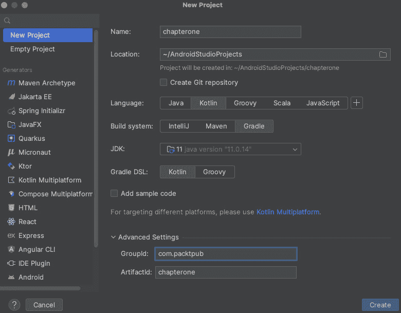
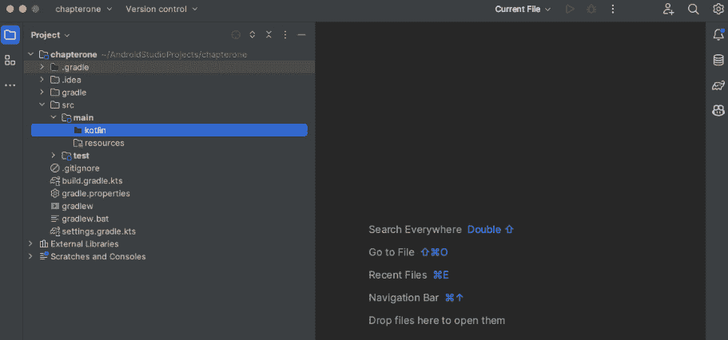
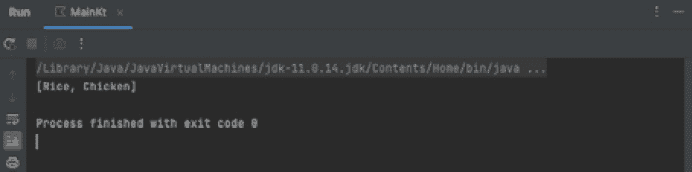
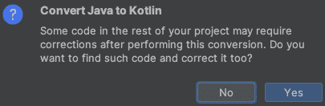

# Kotlin Android 开发入门

Kotlin 是一种静态编程语言，允许你编写简洁且类型化的代码。它是 Google 推荐用于 Android 开发的语言。

在本章中，我们将了解 Kotlin 作为一种编程语言。我们将涵盖对 Android 开发有用的特性及其对 Android 开发者的重要性。此外，我们还将介绍如何从 Java 迁移到 Kotlin，以及针对来自 Java 背景的开发者的有用提示。

本章我们将涵盖以下主要主题：

+   Kotlin 简介

+   Kotlin 语法、类型、函数和类

+   从 Java 迁移到 Kotlin

+   Kotlin 为 Android 开发者提供的特性

# 技术要求

要遵循本章中的说明，你需要准备以下内容：

+   IntelliJ IDEA Community Edition ([`www.jetbrains.com/idea/download/`](https://www.jetbrains.com/idea/download/))

+   OpenJDK 11 或更高版本 ([`openjdk.java.net/install/`](https://openjdk.java.net/install/))

你可以在 [`github.com/PacktPublishing/Mastering-Kotlin-for-Android/tree/main/chapterone`](https://github.com/PacktPublishing/Mastering-Kotlin-for-Android/tree/main/chapterone) 找到本章的代码。

# Kotlin 简介

Kotlin 是由 JetBrains 开发的运行在 **Java 虚拟机**（**JVM**）上的语言。它被开发出来是为了克服 Java 所面临的以下挑战：

+   **冗长性**：Java 的语法非常冗长，这导致开发者即使在处理简单任务时也要编写大量的样板代码。

+   **空指针异常**：默认情况下，Java 允许变量具有空值。这通常会导致空指针异常，这被称为 Java 中的 **十亿美元** **错误**，因为许多应用程序都受到了影响。

+   **并发**：Java 有线程，但有时管理并发和线程安全是一项艰巨的任务。这导致了许多性能和内存问题，严重影响了需要从主线程之外执行工作的应用程序。

+   **特性的缓慢采用**：Java 的发布周期较慢，使用最新版本的 Java 开发 Android 应用程序比较困难，因为需要做很多工作来确保向后兼容性。这意味着 Android 开发者难以轻松采用新的语言特性和改进，因为他们被困在使用较旧版本中。

+   **缺乏函数式支持**：Java 不是一个函数式语言，这使得开发者难以在 Java 中编写函数式代码。很难使用诸如高阶函数或将函数视为一等公民等特性。

经过多年的发展，Kotlin 已经演变为多平台和服务器端语言，并且不再受服务限制，同时也在数据科学领域得到应用。Kotlin 在某些特性上比 Java 有优势，以下是一些例子：

+   **简洁性**：语法简洁，这反过来又减少了你需要编写的样板代码的数量。

+   **空安全**：许多 Java 开发者都非常熟悉著名的 **空指针异常**，它是应用程序中许多错误和问题的来源。Kotlin 的设计考虑到了空安全。在声明变量时，可以指示变量可能具有空值，在使用这些变量之前，Kotlin 编译器会强制执行对空可访问性的检查，从而减少了异常和崩溃的数量。

+   **协程支持**：Kotlin 内置了对 Kotlin 协程的支持。协程是轻量级的线程，你可以使用它们来执行异步操作。在应用程序中使用它们既容易理解又方便。

+   `equals()`、`hashCode()` 和 `toString()` 方法，减少了所需的样板代码量。

+   **扩展函数**：Kotlin 允许开发者通过扩展函数向现有类添加功能，而无需从它们继承。这使得向现有类添加功能变得更加容易，并减少了样板代码的需求。

+   **智能转换**：Kotlin 的智能转换系统使得在不进行显式转换的情况下进行变量转换成为可能。编译器会自动检测变量何时可以安全地进行转换，并自动执行转换。

JetBrains 也是 IntelliJ IDEA 的背后公司。这个 **集成开发环境**（**IDE**）中的语言支持也非常出色。

Kotlin 在过去几年中已经发展起来，支持以下不同的平台：

+   **Kotlin Multiplatform**：这用于开发针对不同平台的应用程序，如 Android、iOS 和 Web 应用程序。

+   **Kotlin for server side**：这用于编写后端应用程序以及支持服务器端开发的多个框架。

+   **Kotlin for Android**：自 2017 年起，Google 已经支持 Kotlin 作为 Android 开发的首选语言。

+   **Kotlin for JavaScript**：这提供了将 Kotlin 代码转换为兼容 JavaScript 库的支持。

+   **Kotlin/Native**: 这将 Kotlin 代码编译成原生二进制文件，并且无需 **Java 虚拟机**（**JVM**）即可运行。

+   **Kotlin for data science**：你可以使用 Kotlin 来构建和探索数据管道。

总结来说，Kotlin 提供了一种比 Java 更现代、更简洁的编程方法，同时仍然与现有的 Java 库和代码保持互操作性。此外，你可以编写 Kotlin 代码并针对不同的平台进行开发。

现在我们已经了解了 Kotlin 及其各种特性，接下来我们将进入下一节，在那里我们将了解 Kotlin 作为一种编程语言，并理解 Kotlin 语法、类型、函数和类。

# Kotlin 语法、类型、函数和类。

在本节中，我们将探讨 Kotlin 语法，并熟悉这门语言。Kotlin 是一种强类型语言。变量的类型是在编译时确定的。Kotlin 拥有一个丰富的类型系统，具有以下类型：

+   `String?`. 可空类型是正常类型，结尾没有任何运算符 - 例如，`String`。

+   **基本类型**：这些类型与 Java 类似。例如包括 Int、Long、Boolean、Double 和 Char。

+   `class` 关键字，您可以添加方法、属性和构造函数。

+   **数组**：支持基本类型和对象数组。要声明基本数组，您指定类型和大小，如下所示：

    ```kt
    val shortArray = ShortArray(10)
    val recipes = arrayOf("Chicken Soup", "Beef Stew", "Tuna Casserole")
    ```

    当您不指定类型时，Kotlin 会自动推断类型。

+   **集合**：Kotlin 拥有一系列丰富的 API，提供如集合、映射和列表等类型。它们被设计得简洁且易于表达，并且语言提供了广泛的操作，如排序、过滤、映射等。

+   `Enum` 关键字用于声明枚举。

+   `(Boolean) -> Unit` 简写表示法。此示例接受一个 `Boolean` 参数并返回一个 `Unit` 值。

我们已经学习了 Kotlin 中可用的不同类型，我们将在下一节中使用这些知识来定义这些类型中的一些。

## 创建 Kotlin 项目

按照以下步骤创建您的第一个 Kotlin 项目：

1.  打开 IntelliJ IDEA。在欢迎屏幕上，单击 **New Project**。您将看到一个对话框来创建您的新项目，如图所示：



图 1.1 – 新建项目对话框

让我们按照以下方式查看 *图 1.1* 中显示的对话框中的选项：

1.  您首先给项目起一个名字。在这个例子中，它是 `chapterone`。

1.  您还需要指定您项目的位置。这通常是您存储工作项目的地方。将目录更改为您首选的位置。

1.  接下来，从提供的选项中指定您的目标语言。在这种情况下，我们选择 **Kotlin**。

1.  在下一步中，指定您的构建系统。我们指定 **Gradle**。

1.  我们还需要指定项目将要使用的 Java 版本。在这个例子中，它是 Java **11**。

1.  接下来，您指定要使用的 Gradle DSL。对于此项目，我们选择使用 **Kotlin**。

1.  最后，您指定组 ID 和工件 ID，当它们组合在一起时，形成您项目的唯一标识符。

1.  点击 **Create** 以完成创建新项目。IDE 将创建您的项目，这可能需要几分钟。完成后，您将看到以下项目：



图 1.2 – 项目结构

IDE 创建的项目结构如 *图 1.2* 所示。我们主要对 `src/main/kotlin` 包感兴趣，这是我们添加 Kotlin 文件的地方。

1.  首先右键单击 `src/main/kotlin` 包。

1.  选择 `Main`。IDE 将生成一个 `Main.kt` 文件。

现在我们已经创建了第一个 Kotlin 项目并添加了 Kotlin 文件，在下一节中，我们将在这个文件中创建函数。

## 创建函数

在 Kotlin 中，函数是一个执行特定任务的代码块。我们使用 `fun` 关键字来定义函数。函数名应该使用驼峰式命名法，并具有描述性，以表明函数正在做什么。函数可以接受参数并返回值。

在你的 `Main.kt` 文件中创建 `main()` 函数，如下所示：

```kt
fun main() {
    println("Hello World!")
}
```

在前面的代码中，我们使用了 `fun` 关键字来定义一个名为 `main` 的函数。在函数内部，我们有一个 `println` 语句，它打印消息 `"Hello World!"`。

你可以通过按函数右侧的绿色运行图标来运行函数。你会看到一个控制台窗口弹出，显示消息 `"Hello World!"`。

我们已经学习了如何创建函数并将输出打印到控制台。在下一节中，我们将学习如何在 Kotlin 中创建类。

## 创建类

在 Kotlin 中声明一个类，我们使用 `class` 关键字。我们将创建一个 `Recipe` 类，如下所示：

```kt
class Recipe {
    private val ingredients = mutableListOf<String>()
    fun addIngredient(name: String) {
        ingredients.add(name)
    }
    fun getIngredients(): List<String> {
        return ingredients
    }
}
```

让我们分析前面的类：

+   我们将类命名为 `Recipe`，并且它没有构造函数。

+   在类内部，我们有一个成员变量 `ingredients`，它是一个字符串的 `MutableList`。它是可变的，以便我们可以向列表中添加更多项目。在类中定义这样的变量允许我们在类的任何地方访问该变量。

+   我们有 `addIngredient(name: String)`，它接受一个名为 `name` 的参数。在函数内部，我们将参数添加到我们的配料列表中。

+   最后，我们有 `getIngredients()` 函数，它返回一个不可变的字符串列表。它简单地返回我们的配料列表的值。

要使用这个类，我们必须修改我们的主函数，如下所示：

```kt
fun main() {
    val recipe = Recipe()
    recipe.addIngredient("Rice")
    recipe.addIngredient("Chicken")
    println(recipe.getIngredients())
}
```

这些更改可以这样解释：

+   首先，我们创建 `Recipe` 类的一个新实例，并将其分配给 `recipe` 变量

+   然后，我们在 `recipe` 变量上调用 `addIngredient` 方法，并传入字符串 `Rice`

+   再次，我们在 `recipe` 变量上调用 `addIngredient` 方法，并传入字符串 `Chicken`

+   最后，我们在 `recipe` 变量上调用 `getIngredients` 方法，并将结果打印到控制台

再次运行主函数，你的输出应该是这样的：



图 1.3 – 食谱

如前一个截图所示，输出是你添加的配料列表！现在你可以准备一顿美味的米饭和鸡肉大餐，但是在 Kotlin 中！

Kotlin 有很多特性，我们只是刚刚触及了表面。你可以查看官方的 Kotlin 文档([`kotlinlang.org/docs/home.html`](https://kotlinlang.org/docs/home.html))来了解更多。随着你深入本书，你还将学习更多特性。

我们已经学习了如何创建类、定义顶级变量以及向我们的类中添加函数。这有助于我们理解 Kotlin 中类的工作方式。在下一节中，我们将学习如何将 Java 类迁移到 Kotlin 以及一些可用于迁移的工具。

# 从 Java 迁移到 Kotlin

你是 Java 开发者并且你的应用是用 Java 编写的吗？你在想如何开始使用 Kotlin 吗？不用担心，这就是你的部分。Kotlin 提供了两种方式供你选择：

+   **Java 到 Kotlin 迁移**：我们使用的 IDE，即 IntelliJ IDEA，有一个工具可以将现有的 Java 文件转换为 Kotlin。

+   **互操作性**：Kotlin 与 Java 代码高度互操作，这意味着你可以在同一个项目中使用 Java 和 Kotlin 代码。你可以在 Kotlin 项目中继续使用你喜欢的 Java 库。

让我们看看如何使用 IntelliJ IDEA 将一个示例 Java 类迁移到 Kotlin：

1.  在 `src/main/kotlin` 目录下打开 `Song` 类，它包含多个 Java 函数。

1.  右键单击文件，你会在底部看到 **将 Java 转换为 Kotlin** 选项。选择此选项，你将看到一个确认对话框：



图 1.4 – 确认对话框

在转换之后，有时你可能需要做一些修正，这就是为什么我们有这个对话框。点击 **是** 以继续，你会看到你的代码现在已经是 Kotlin 格式了。这是一个非常有用的功能，它处理了 Kotlin 转换的大部分工作，你还可以学习到语法。

现在我们已经学习了如何将 Java 代码迁移到 Kotlin，在下一节中，我们将介绍 Kotlin 的一些特性，这些特性使其对 Android 开发者非常有用。

# Kotlin 为 Android 开发者提供的特性

现在你已经对 Kotlin 有了一定的了解，让我们来看看为什么 Kotlin 是一个专门针对 Android 开发的优秀语言。

Google 在 2017 年宣布 Kotlin 是编写 Android 应用的首选语言。从那时起，已经做了大量工作以确保开发者拥有他们开发 Kotlin Android 应用所需的一切。以下是开发者可以从中受益的一些特性：

+   **提高开发者生产力**：Kotlin 简洁且表达力强的语法可以帮助开发者更快地编写代码，并减少错误，这最终可以提高开发者的生产力。

+   **空安全**：由于 Kotlin 是考虑到空值而编写的，它帮助我们避免与空指针异常相关的崩溃。

+   **IDE 支持**：IDE 支持一直在不断改进。基于 IntelliJ IDEA 构建的 Android Studio 已经收到了许多新特性，例如改进的自动完成支持，以提升 Kotlin 的使用体验。

+   **Jetpack 库**：Jetpack 库在 Kotlin 中可用，并且旧的库正在用 Kotlin 重新编写。这是一套库和工具，旨在帮助 Android 开发者编写更少的代码。它们解决了常见的开发者痛点并提高了开发效率。

+   **Jetpack Compose**：Jetpack Compose 是一个新的 UI 框架，完全用 Kotlin 编写，并利用了 Kotlin 语言的特性。它是一个声明式 UI 框架，使 Android 开发者能够轻松地为他们的应用构建美观的 UI。

+   **Kotlin Gradle DSL**: 您现在可以使用 Kotlin 编写 Gradle 文件。

+   `ViewModel` 类有一个 `viewModelScope`，您可以使用它来在 `ViewModel` 的生命周期中作用域 coroutines。这与 coroutines 的结构化并发原则相一致。这有助于在不再需要时取消所有 coroutines。一些库，包括 Room、Paging 3 和 DataStore，也支持 Kotlin coroutines。

+   **Google 的支持**: Google 持续投资 Kotlin。目前，有从文章到代码实验室、文档、视频和教程等资源，由 Google 的 Android DevRel 团队提供，以帮助您学习新的库和 Android 开发的架构。

+   **活跃的社区和工具**: Kotlin 拥有一个充满活力和活跃的开发者社区，这意味着有大量的非官方资源、库和工具可供使用，以帮助进行 Android 开发。

# 摘要

在本章中，我们学习了 Kotlin 编程语言及其特性。我们探讨了 Kotlin 中对 Android 开发有用的特性以及为什么它对 Android 开发者来说很重要。此外，我们还介绍了如何从 Java 迁移到 Kotlin，以及一些针对 Java 背景 developer 的有用提示。

在下一章中，我们将学习如何使用 Android Studio 创建 Android 应用程序。我们将探索 Android Studio 提供的一些功能，并学习一些技巧和快捷方式。
