# 第二章：创建您的第一个 Android 应用

Android 是由 Google 开发的移动操作系统，运行在超过 20 亿台设备上，如智能手机、平板电脑、电视、手表和汽车，开发者能够编写与这些不同设备兼容的代码。

在本章中，我们将创建我们的第一个 Android 应用。我们还将熟悉 Android Studio，这是我们用于开发 Android 应用的**集成开发环境**（**IDE**）。我们还将学习一些技巧、快捷键和有用的 Android Studio 功能，并了解在 Android Studio 中创建项目的流程。

在本章中，我们将涵盖以下主要主题：

+   Android Studio 概述

+   创建您的 Android 应用

+   Android Studio 技巧和窍门

# 技术要求

要遵循本章的说明，您需要下载 Android Studio Hedgehog 或更高版本（[`developer.android.com/studio/download`](https://developer.android.com/studio/download)）。

您可以在 [`github.com/PacktPublishing/Mastering-Kotlin-for-Android/tree/main/chaptertwo`](https://github.com/PacktPublishing/Mastering-Kotlin-for-Android/tree/main/chaptertwo) 找到本章的代码。

# Android Studio 概述

由 Google 开发的 Android Studio 是创建 Android 应用的官方 IDE。基于 JetBrains 的 IntelliJ IDEA 构建，它为 Android 应用开发提供了一个全面的平台。它拥有所有使您能够轻松开发 Android 应用的功能。

一旦您从官方网站下载了 Android Studio，您需要下载 SDK 并设置好一切，以便它准备好使用。打开您新安装的 Android Studio。您将看到以下欢迎屏幕：

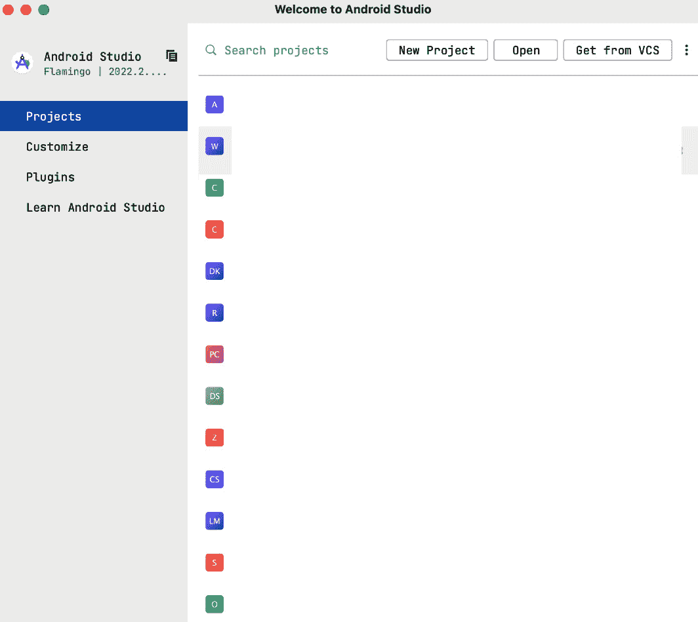

图 2.1 – Android Studio 欢迎屏幕

在右上角，我们有这些快速选项：

+   **新建项目**：我们使用这个选项在 Android Studio 中创建新项目。

+   **打开**：当我们想使用 Android Studio 打开现有项目时，我们会使用这个选项。

+   **从版本控制系统获取**：**VCS** 代表 **版本控制系统**。版本控制系统的例子有 GitHub、GitLab 和 Bitbucket。我们可以始终链接我们的账户，并轻松地将托管在 VCS 上的项目导入到 Android Studio 中。

+   **更多选项图标**：这为我们提供了更多选项，例如**配置或调试 APK**、**导入项目**、**导入 Android 代码示例**、**SDK 管理器**和**虚拟设备管理器**。我们只在使用时使用这些选项，所以在此处不会深入探讨它们。

现在，让我们看看左侧的导航选项：

+   **项目**：这是默认选项。如果存在，它将显示您使用 Android Studio 创建的所有项目。如果没有，将显示一个空白的屏幕。

+   **自定义**：这提供了一个设置屏幕，用于自定义 Android Studio 的各个方面，如下面的截图所示：

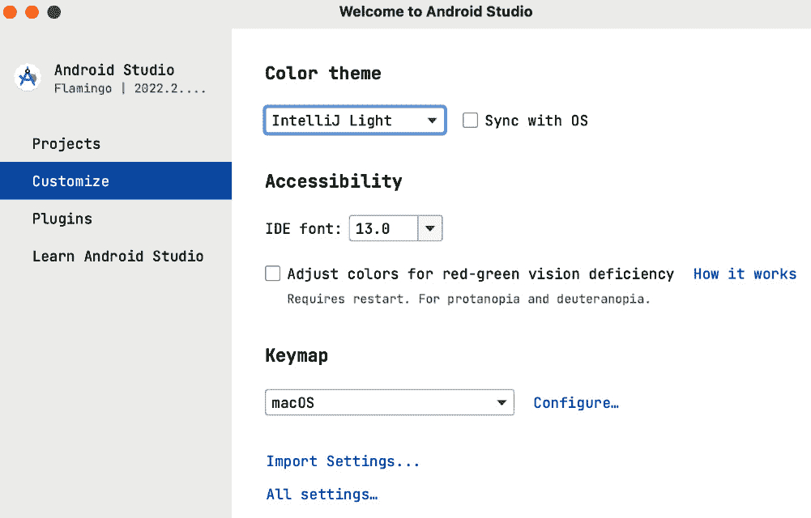

图 2.2 – 自定义 Android Studio 屏幕

从前面的截图，我们可以看到我们可以快速自定义以下内容：

+   **颜色主题**：我们可以根据我们的偏好将主题设置为深色（**Dracula**）、浅色（**IntelliJ Light**）或高对比度。

+   **IDE 字体**：在这里，我们设置 IDE 的首选字体大小。

+   **键盘映射**：在这里，我们配置 IntelliJ 应使用什么来映射我们的键盘和鼠标快捷键。它将自动选择适合我们操作系统的选项。

在此屏幕底部，我们可以看到另外两个设置选项。一个是**导入设置…**，当我们想从之前的 Android Studio 安装或自定义文件导入设置时使用。另一个是**所有设置…**，它提供了更多的自定义选项。

+   **插件**：在这里，我们可以安装外部插件到我们的 Android Studio，并管理我们已安装的插件。根据需要，市场上有几个插件我们可以安装。

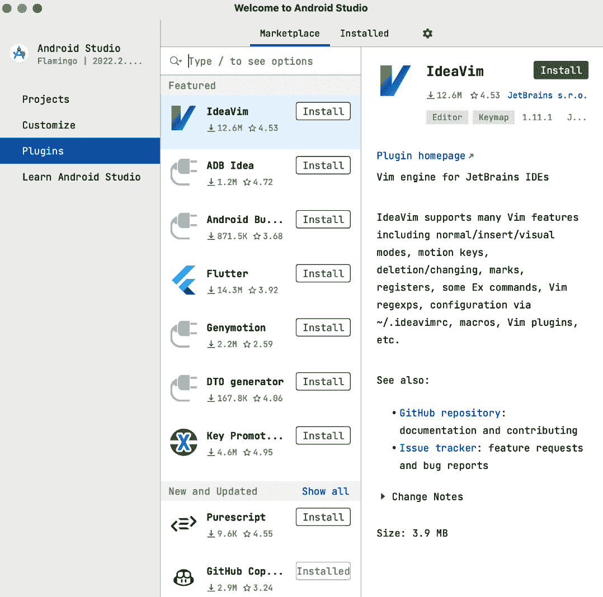

图 2.3 – 插件屏幕

现在我们已经对 Android Studio 欢迎屏幕上的几个基本选项有了概述，我们将使用**新建项目**选项在下一节创建我们的第一个 Android 应用。

# 创建您的 Android 应用

按照以下步骤创建您的第一个 Android 应用：

1.  点击**新建项目**按钮，这将带您到**模板**屏幕，如图下所示：

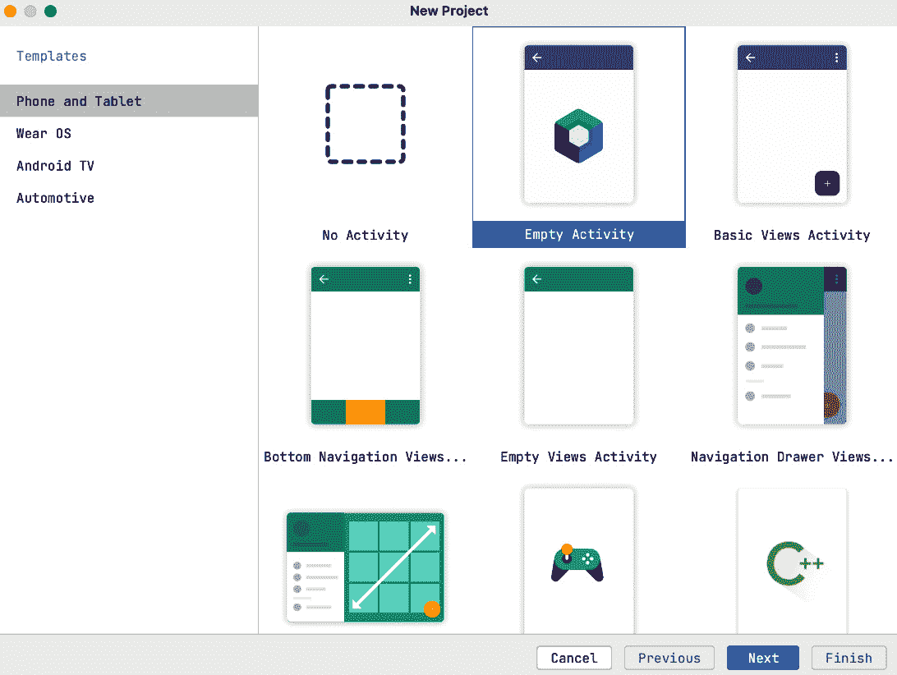

图 2.4 – 新建项目 | 模板屏幕

在创建新项目时，IDE 为我们提供了多种选择，如图 2.4 所示。首先，在右侧，我们需要选择我们针对的具体形态。默认情况下，**手机和平板**被选中。我们还有其他选项，例如，如果我们想针对可穿戴设备，可以选择**Wear OS**；如果我们想开发在由 Android OS 驱动的智能电视上运行的应用，可以选择**Android TV**；最后，对于针对 Android Auto 的应用，可以选择**Automotive**。

我们将使用默认选项，因为我们想针对 Android 和平板设备。

接下来，我们必须从提供的选项中选择一个模板。有几个模板我们可以使用来快速为我们的应用生成一些功能。例如，我们有**底部导航视图活动**来生成一个具有 UI 和 Koltin 代码的项目，用于显示底部标签。

1.  我们将选择**空活动**，因为我们想从头开始。我们使用这个选项而不是**无活动**选项，因为后者为我们设置了一些依赖项。

1.  点击**下一步**，我们将看到配置项目详情的屏幕，如下所示：

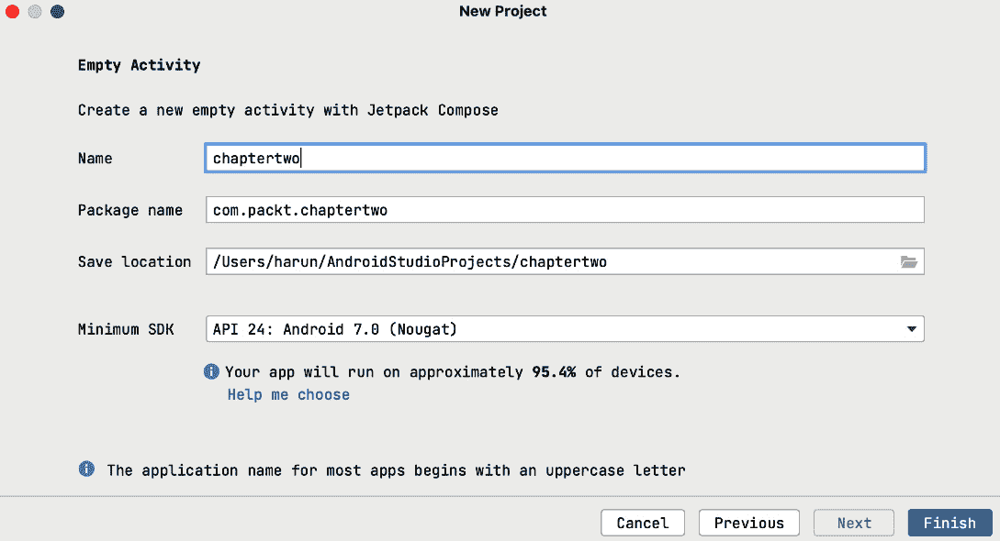

图 2.5 – 新建项目设置

1.  如前一个截图所示，为了最终创建项目，我们需要指定以下内容：

    +   **名称**：这是我们的项目的唯一名称。

    +   **包名**：这是我们的项目的唯一标识符。通常它是由公司网站和应用程序名称的组合。

    +   **保存位置**：在这里，我们指定项目所在的目录。

    +   **最小 SDK 版本**: 这是我们 Android 应用将支持的最低 Android 版本。Android Studio 给出使用所有版本的设备百分比，帮助我们决定要支持的最低 Android 版本。对于我们的项目，我们选择了**API 24: Android 7.0 (Nougat**)，这将运行在大约 94% 的设备上。需要注意的是，选择较低的最低 SDK 版本意味着我们必须使我们的应用与不同的设备版本兼容，这可能是一项大量工作。此外，一些功能仅在较新的 SDK 版本中可用，因此我们必须为设备添加回退机制。

1.  最后，点击**完成**—这将创建我们的项目。准备项目可能需要几分钟时间。一旦完成，我们将看到以下屏幕：

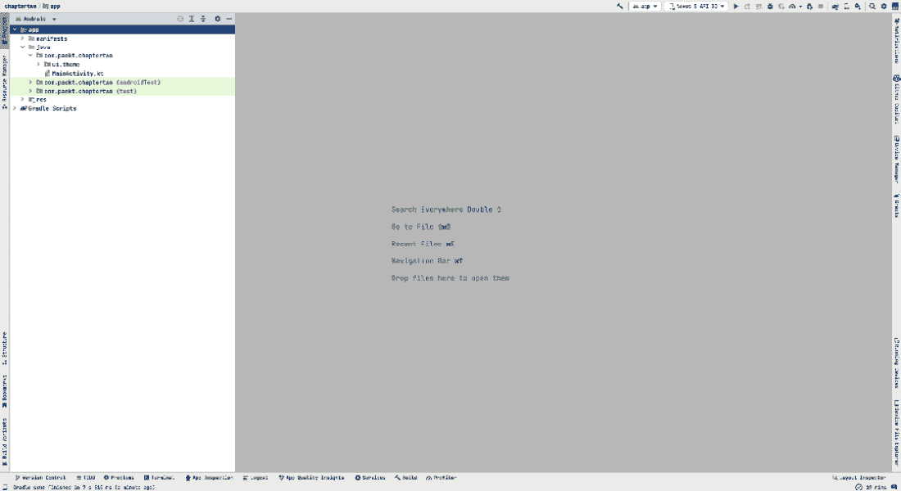

图 2.6 – 新项目

在这里，我们需要了解关于项目结构的几个问题。我们将在下一节深入探讨。

## 探索新项目

在本小节中，我们将查看整个项目结构，以便我们能够理解不同的组件。

在左侧，我们有包含不同目录和包的**项目结构**。在右侧是编辑器部分，默认情况下没有任何内容。当你在 Android Studio 中打开任何文件时，它们就会出现在这里。这是我们新项目的项目结构：

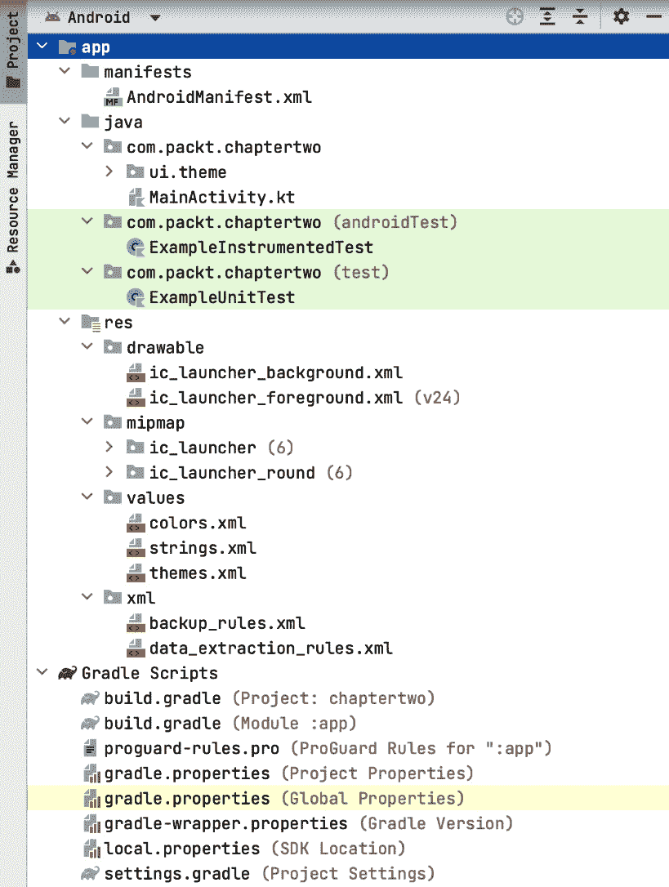

图 2.7 – 项目结构

在左侧，我们有 `app` 目录，这是根目录，包含与项目相关的所有文件。从**图 2**.7 中，我们可以看到在 `app` 目录内，我们有以下不同的目录：

+   `manifests`: 这包含一个单独的 `AndroidManifest.xml` 文件，这对于我们的应用配置至关重要。一个清单文件具有 `.xml` 扩展名，包含对您的应用至关重要的信息。它将此信息传达给 Android 系统。在这个文件中，我们定义了应用所需的权限、应用名称和图标。我们还在此文件中声明活动和服务。如果不声明它们，我们的应用很难使用它们。

+   `java` 包：这个包，尽管命名为 `java`，包含我们项目的所有 Kotlin 文件。如果我们需要添加任何文件，这就是我们添加它们的地方。我们还可以创建帮助我们将具有相关功能的文件分组在一起的包。此目录进一步细分为以下：

    +   `com.packt.chaptertwo`: 这是我们应用中的 Kotlin 文件

    +   `com.packt.chaptertwo (androidTest)`: 在这里，我们添加所有仪器测试的文件

    +   `com.packt.chaptertwo (test)`: 在这里，我们添加所有单元测试的文件

+   资源：这个目录，通常简称为 `res`，包含我们应用所需的所有资源。这些资源可以包括图像、字符串和资产。从 *图 2**.6* 我们可以看到以下子目录：

    +   `drawable`: 这个文件夹包含自定义的可绘制对象、矢量可绘制对象或用于应用的 PNG 和 JPEG 图像。

    +   `mipmap`: 这个文件夹是我们放置启动器图标的地方。

    +   `values`: 这个文件夹是我们放置颜色、字符串、样式和主题文件的地方。在这个文件夹中，我们定义全局值，以便在整个应用中使用。

    +   `xml`: 在这个文件夹中，我们存储 XML 文件。

+   `Gradle 脚本`: 在这里，我们有我们项目所需的全部 Gradle 脚本和 Gradle 属性文件。在我们的新项目中，我们有以下文件：

    +   `build.gradle (项目: chaptertwo)`: 这是项目的顶层 Gradle 文件，在这里我们添加应用于整个项目和子模块的配置。

    +   `build.gradle (模块: app)`: 这是应用模块的 Gradle 文件。在这里，我们配置应用模块。为了理解这个文件，让我们看看为我们项目生成的文件：

        ```kt
        plugins {
            id 'com.android.application'
            id 'org.jetbrains.kotlin.android'
        }
        android {
            namespace 'com.packt.chaptertwo'
            compileSdk 33
            defaultConfig {
                applicationId "com.packt.chaptertwo"
                minSdk 24
                targetSdk 33
                versionCode 1
                versionName "1.0"
                testInstrumentationRunner "androidx.test.runner.AndroidJUnitRunner"
                vectorDrawables {
                    useSupportLibrary true
                }
            }
            buildTypes {
                release {
                    minifyEnabled false
                    proguardFiles getDefaultProguardFile('proguard-android-optimize.txt'), 'proguard-rules.pro'
                }
            }
            compileOptions {
                sourceCompatibility JavaVersion.VERSION_1_8
                targetCompatibility JavaVersion.VERSION_1_8
            }
            kotlinOptions {
                jvmTarget = '1.8'
            }
            buildFeatures {
                compose true
            }
            composeOptions {
                kotlinCompilerExtensionVersion '1.3.2'
            }
            packagingOptions {
                resources {
                    excludes += '/META-INF/{AL2.0,LGPL2.1}'
                }
            }
        }
        dependencies {
            implementation 'androidx.core:core-ktx:1.10.1'
            implementation 'androidx.lifecycle:lifecycle-runtime-ktx:2.6.1'
            implementation 'androidx.activity:activity-compose:1.7.2'
            implementation platform('androidx.compose:compose-bom:2022.10.00')
            implementation 'androidx.compose.ui:ui'
            implementation 'androidx.compose.ui:ui-graphics'
            implementation 'androidx.compose.ui:ui-tooling-preview'
            implementation 'androidx.compose.material3:material3'
            testImplementation 'junit:junit:4.13.2'
            androidTestImplementation 'androidx.test.ext:junit:1.1.5'
            androidTestImplementation 'androidx.test.espresso:espresso-core:3.5.1'
            androidTestImplementation platform('androidx.compose:compose-bom:2022.10.00')
            androidTestImplementation 'androidx.compose.ui:ui-test-junit4'
            debugImplementation 'androidx.compose.ui:ui-tooling'
            debugImplementation 'androidx.compose.ui:ui-test-manifest'
        }
        ```

    在最顶部，我们指定了模块所需的插件。在这种情况下，我们声明了 Android 应用和 Kotlin 插件。在 `plugins` 块之后，我们有 `android` 块。您可以看到，在这个块内部定义了以下属性：

    +   `namespace`: 这被用作生成的 `R` 和 `BuildConfig` 类的 Kotlin 或 Java 包名。

    +   `compileSDK`: 这定义了 Gradle 将用于编译我们的应用的 Android SDK 版本。

    +   `defaultConfig`: 这是一个块，我们在这里指定所有风味和构建类型的默认配置。在这个块内部，我们指定属性，如 `applicationId`、`minSDK`、`targetSDK`、`versionCode`、`versionName` 和 `testInstrumentationRunner`。

    +   `buildTypes`: 这配置了我们的应用程序的不同构建类型，例如 `debug` 和 `release`，或任何我们定义的自定义构建。在每个构建类型块内部，我们指定属性，如 `minifyEnabled`、`proguardFiles` 或 `debuggable`。

    +   `compileOptions`: 我们使用这个块来配置与 Java 编译相关的属性。例如，我们定义了 `sourceCompatibility` 和 `targetCompatibility`，它们指定了项目源代码的 Java 版本兼容性。

    +   `kotlinOptions`: 我们使用这个块来配置与 Kotlin 相关的选项。常用的选项是 `jvmTarget`，它指定了用于 Kotlin 编译的 Java 版本。

    +   `buildFeatures`: 我们使用这个块来启用和禁用项目中的特定功能。例如，我们在项目中启用了 `compose`。我们可以启用或禁用其他附加功能，如 `viewBinding` 和 `dataBinding`。

    +   `ComposeOptions`: 这个块是针对使用 Jetpack Compose 的项目特定的。例如，在这个块内部，我们可以设置 `kotlinCompilerExtensionVersion`。

    +   `packagingOptions`: 我们使用此块来自定义项目的打包选项，特别是关于冲突和合并。

    +   `dependencies`: 在此，我们指定项目中的依赖项。我们可以在该块中添加不同的库、模块或外部依赖项。

    +   `proguard-rules.pro`: 这是一个定义 ProGuard 在混淆代码时使用规则的文件。我们将在第十三章*中深入探讨。

    +   `gradle.properties (项目属性)`: 在此处，我们定义适用于整个项目的属性。一些属性包括设置 Kotlin 风格以及指定要使用的内存。

    +   `gradle.properties (全局属性)`: 这是一个全局文件。我们指定希望应用到所有 Android Studio 项目的设置。

    +   `gradle-wrapper.properties (Gradle 版本)`: 在此文件中，我们指定 Gradle 包装器的属性，包括版本和下载 Gradle 包装器的 URL。

    +   `local.properties (本地属性)`: 在此文件中，我们指定需要应用到我们本地设置中的设置。通常，此文件不会被提交到版本控制，这意味着我们在此处添加的配置仅适用于我们的个人设置。

    +   `settings.gradle (项目设置)`: 我们使用此文件来应用一些项目设置。例如，如果我们需要在项目中添加更多模块，这就是指定它们的地方。

当我们构建项目时，Android Studio 会使用我们在 Gradle 文件中指定的配置来编译所有资源代码，并将它们转换为可以在我们的 Android 手机或模拟器上运行的 **Android 应用程序包 (APK**) 或 **Android 应用程序包 (AAB**)。

在本节中，我们探索了新创建的项目，并了解了一些由 Android Studio 生成的关键文件和文件夹。在下一节中，我们将看到我们如何自定义 Android Studio 内的一些设置。

# Android Studio 小技巧

在本节中，我们将了解一些有用的技巧、快捷键和功能。

我们将首先打开 `MainActivity.kt` 文件。当你打开文件时，你会看到以下布局：

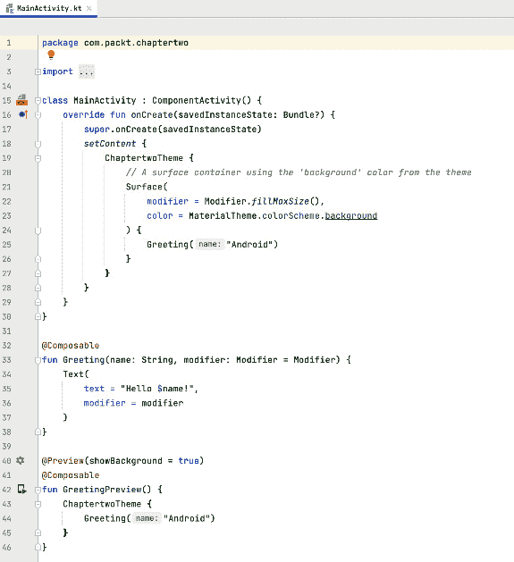

图 2.8 – MainActivity 文件

我们现在可以看到 `MainActivity.kt` 文件内部的代码，这是 Kotlin 源代码。在文件名标签上方，我们可以看到一个导航栏，如下面的截图所示：

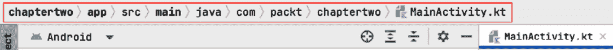

图 2.9 – 导航栏

导航栏使您能够轻松快速地在不同的项目文件之间导航。

我们还可以切换到 **项目视图** 来查看项目中的所有资源。切换按钮位于所有目录的最顶部。默认情况下，它设置为 **Android 视图**，并且根据您的偏好有更多选项。切换到项目视图会给我们以下文件夹结构：

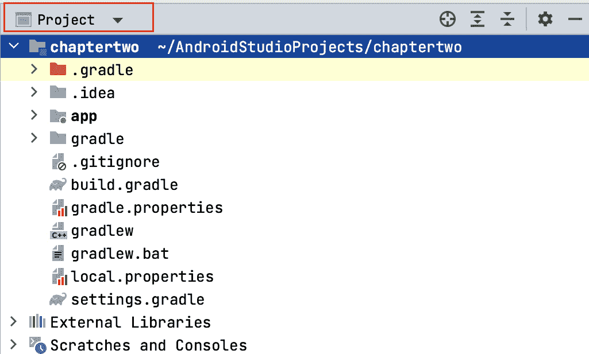

图 2.10 – 项目视图

在**图 2.10**中，我们可以看到我们项目中的所有资源，并且可以轻松地浏览不同的文件和文件夹。

Android Studio 拥有各种不同的工具窗口，提供了多种选项。让我们从位于视图切换器标签下面的左上角的**资源管理器**工具窗口开始。打开这个窗口，你会看到以下内容：

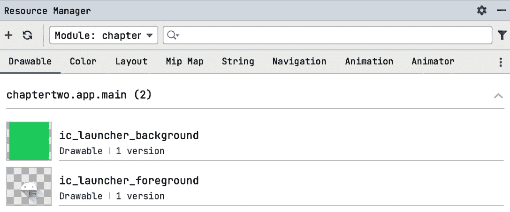

图 2.11 – 资源管理器标签

如**图 2.11**所示，**资源管理器**标签显示了项目中的所有资源。我们还可以快速添加新的矢量图和图像资源以及可绘制文件，并在这里导入可绘制资源。好事是，我们还可以预览这些资源，并轻松浏览项目中的资源。在这个标签下面，我们有**项目**标签，用于切换回项目视图，再下面是**拉取请求**标签，它使我们能够查看项目版本控制仓库中的开放拉取请求。这在我们与其他团队成员或同事协作时特别有用。

Android Studio 允许我们添加或删除这些标签，或者选择在左侧、右侧或底部显示哪些标签。要删除一个标签，你只需右键点击它，并选择**从侧边栏移除**选项。点击**视图**，然后点击**工具窗口**。这个操作将显示当前所有可用的工具窗口。

Android Studio 在**视图**菜单中提供了替代的查看选项。例如，当我们进行演示时，我们可以切换到演示模式。要做到这一点，仍然在**视图**菜单中，点击**外观**然后点击**进入演示模式**。这将显示一个最小化的 UI，如下面的图所示：

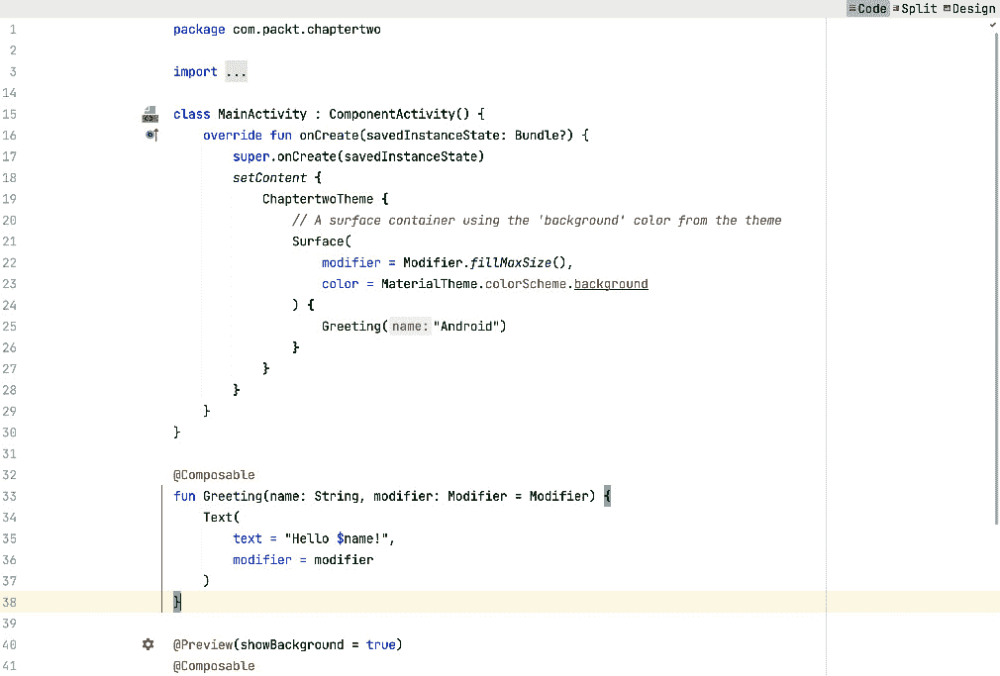

图 2.12 – 演示模式

如**图 2.12**所示，我们可以看到字体大小已增加，UI 非常简洁。这种模式在进行演示时非常有帮助。要退出此模式，请转到**视图**然后点击**退出演示模式**。

在底部，我们还有一些更有用的工具，如下所示：


图 2.13 – Android Studio 底部标签

从**图 2.13**中，让我们了解这些标签的功能：

+   **待办事项**：显示我们所有的待办事项。这对于跟踪需要做的事情非常有用。

+   **问题**：显示我们项目中的所有问题。这对于跟踪项目中的错误和警告非常有用。

+   **终端**：允许我们运行终端命令。这对于运行 Git 或**Android 调试桥接器**（**ADB**）命令非常有用。

+   **应用检查器**：这允许我们检查应用中的各种元素，对调试应用非常有用。它允许我们检查我们的后台任务、数据库和网络请求。对于数据库，我们可以查看数据库中的数据，我们还可以使用数据运行查询。对于网络请求，我们可以查看网络请求及其 JSON 响应。对于后台任务，我们可以查看任务及其状态。这些对我们调试和检查应用中的问题非常有帮助。

+   **日志输出**：这显示了所有我们的日志消息。它在调试错误时特别有用，因为错误会即时出现。

+   **应用质量洞察**：这允许我们查看应用质量洞察。这使我们能够查看 Firebase Crashlytics 在 Android Studio 中检测到的崩溃。我们还可以看到崩溃堆栈跟踪和有问题的代码行，并可以轻松地从这里导航到该行。

+   **构建**：显示构建输出。这对于调试构建错误非常有用。

+   **性能分析器**：允许我们对应用进行性能分析。为了使性能分析器正常工作，我们必须有一个运行中的应用实例。性能分析器对于调试性能问题非常有用。它提供了关于应用如何使用 CPU、内存和能量的指标。我们可以使用这些指标来优化我们的应用。

这些标签的位置可能有所不同，有时某些标签可能不会显示。您也可以轻松地从侧边栏添加或删除它们。

现在我们来看看 Android Studio 中的一些有用快捷键。

## 一些有用的快捷键

快捷键可以帮助我们在 Android Studio 中快速完成任务。熟练掌握后，它们可以帮助我们提高生产力。有许多快捷键可供选择，您也可以自定义并创建自己的快捷键。以下是一些最常用的快捷键：

+   *Alt* + *7*（在 Windows 上）或 *Command* + *7*（在 Mac 上）：这打开`MainActivity.kt`文件，我们可以看到以下结构：

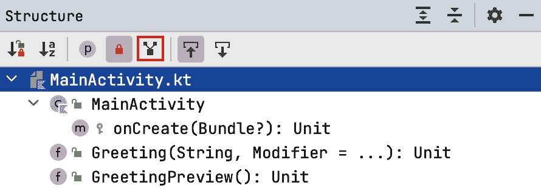

图 2.14 – 结构标签

从**图 2.14**.14 中，我们可以看到`MainActivity.kt`文件。点击此标签中的方法可以快速导航到我们的代码中的方法。还有一个图标，在**图 2.14**.14 中以红色突出显示，显示继承的方法。当我们点击这个图标时，它会显示文件中的所有继承方法。

+   *Alt* + *Enter*（在 Windows 上）或 *Option* + *Enter*（在 Mac 上）：这允许我们快速添加项目中的包、文件或依赖项的导入。它还提供了更多功能，例如提供错误快速修复以及允许我们实现方法。

+   双击*Shift*：这打开通用搜索窗口。在这里，我们可以搜索项目中的类、符号和文件。

+   *Ctrl* + *Shift* + *F*（在 Windows 上）或 *Command* + *Shift* + *F*（在 Mac 上）：这有助于在所有文件中搜索文本。

+   *Ctrl* + *F6*（在 Windows 上）或 *Command* + *F6*（在 Mac 上）：这允许我们重构代码。我们可以重命名、更改方法签名、移动代码等等。

+   在 Windows 上按 *Ctrl* + *D* 或在 Mac 上按 *Command* + *D*：这是用于复制一行代码或选定的代码段。

+   在 Windows 上按 *Ctrl* + *B* 或在 Mac 上按 *Command* + *B*：这允许我们跳转到声明。

我们只介绍了一些这些快捷键。还有很多其他的快捷键可用。如果你想掌握这些快捷键中的大多数，你可以安装 Key Promoter X 插件（[`plugins.jetbrains.com/plugin/9792-key-promoter-x`](https://plugins.jetbrains.com/plugin/9792-key-promoter-x)）。这些插件会在你执行具有快捷键的动作时提醒你，当你重复执行没有快捷键的操作时，它还会提示你创建快捷键。

# 摘要

在本章中，我们创建了我们的第一个 Android 应用。我们熟悉了 Android Studio，这是我们用来开发 Android 应用的 IDE。我们还了解了一些技巧、快捷键和有用的 Android Studio 功能，并了解了在 Android Studio 中创建项目的流程。

在下一章中，我们将介绍 Jetpack Compose 布局基础。我们将从 Jetpack Compose 的介绍开始，这是一种为我们的应用声明 UI 的声明式方法。
