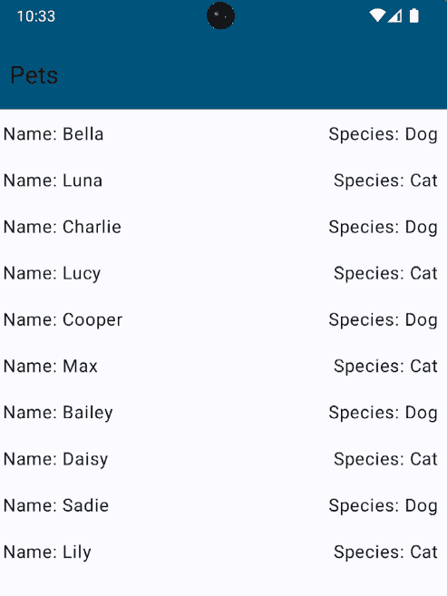

# 第五章：架构你的应用程序

开发应用程序的过程需要具有可扩展性，这样你就可以长期维护应用程序，并且可以轻松地将开发工作转交给其他开发者或团队。为了能够做到这一点，我们需要正确考虑我们应用程序的架构。在本章中，我们将探讨如何构建我们的应用程序。

在本章中，我们将基于前几章所学的内容进行构建。我们将探讨 Android 项目中可用的不同架构。我们将深入探讨**MVVM 架构**及其不同层以及如何在架构中使用一些 Jetpack 库。此外，我们还将学习如何使用高级架构功能，例如依赖注入和 Kotlin Gradle DSL，以及版本目录来定义依赖项。

在本章中，我们将涵盖以下主要主题：

+   应用程序架构简介

+   MVVM 深度解析

+   Jetpack 库

+   依赖注入

+   迁移到 Kotlin Gradle DSL 和使用版本目录

# 技术要求

要遵循本章中的说明，您需要下载 Android Studio Hedgehog 或更高版本([`developer.android.com/studio`](https://developer.android.com/studio))。

您可以在[`github.com/PacktPublishing/Mastering-Kotlin-for-Android/tree/main/chapterfive`](https://github.com/PacktPublishing/Mastering-Kotlin-for-Android/tree/main/chapterfive)找到本章的代码。

# 应用程序架构简介

到目前为止，我们已经学习了如何使用 Material 3 和 Jetpack Compose 创建应用程序并设计美观的用户界面。我们还没有开始为我们的应用程序采用任何架构。在本节中，我们将探讨一些我们可以用来构建应用程序的应用程序架构。我们还将探讨在构建应用程序时可以遵循的一些最佳实践。首先，让我们看看使用应用程序架构的一些好处：

+   **关注点分离**：使用架构允许我们将代码分成不同的层。每一层只做一件事。这使得轻松地将代码分离和分组到不同的层变得容易。每一层都有其责任。这防止了事物被混淆，并使得维护代码变得更容易。

+   **简易测试**：使用架构使得测试我们的代码变得容易。由于事物之间不是紧密耦合的，我们可以轻松地单独测试代码的每一层。

+   **易于维护**：使用架构使得维护我们的代码变得容易。我们可以轻松地修改代码，而不会影响代码的其他部分。这使得长期维护代码变得容易。我们还可以替换代码的不同部分，因为我们有测试，我们可以测试不同的实现并确保没有东西被破坏。

+   **易于扩展**：使用架构使得扩展我们的代码变得容易。我们可以轻松地添加新功能到代码中，而不会影响代码的其他部分。

+   **易于团队合作**：使用架构使得团队合作变得容易。每个团队成员或团队可以工作在代码的不同层。这使得在代码库的不同部分并行工作成为可能。

+   **促进可重用性**：随着时间的推移，我们可以将一些常用代码放置在项目中的通用包或模块中，然后可以在整个项目中重用这些代码，而无需重复编写代码。

当涉及到为我们的应用选择架构时，我们有大量的选项可以选择。没有特定的架构适合所有用例，因此我们总是建议与我们的团队讨论，看看哪种架构适合用例。每种架构都有其优缺点，我们或整个团队必须评估哪个的优点多于缺点。我们可以通过功能或通过层来构建我们的应用架构。当我们按功能构建架构时，我们有代表功能的层。当我们按层构建架构时，我们有代表我们应用层的层。以下是一些按功能构建架构的示例：

+   主页功能

+   个人资料功能

+   设置功能

上述示例展示了我们如何通过功能来构建我们的应用架构。我们有**主页**、**个人资料**和**设置**功能。每个功能都有自己的层，以及与该功能相关的所有代码。

我们可以用来构建应用的架构之一如下：

+   **模型、视图和视图模型**（**MVVM**）：这是最常用的架构，甚至谷歌也推荐我们在应用中使用它。应用具有**模型**、**视图**和**视图模型**层。模型层负责存储数据。视图层负责显示数据。视图模型层负责存储数据的状态。它还负责与模型和视图层进行通信。MVVM 促进了不同层之间关注点的清晰分离。它还支持**数据绑定**，这使得在数据变化时更新 UI 变得容易。与其他架构相比，它还有更少的样板代码。然而，它也有其缺点，其中之一是在某些时候学习曲线较大，并且很容易变得复杂，尤其是在有很多功能的情况下。

+   **模型视图意图**（**MVI**）：它有三个关键层。模型层负责存储数据。视图层负责显示数据。意图层代表用户操作或事件，这些操作或事件被调度到模型以更新状态。MVI 促进单向**数据流**，数据流向同一方向。

+   **模型-视图-控制器**（**MVC**）：这种架构有三个层次。**模型**层代表业务逻辑并持有数据。**视图**层负责显示数据。**控制器**层负责并在模型和视图之间充当中间人。它处理用户输入并更新视图和模型。MVC 非常直接，尤其是在开始时，它能够实现快速迭代和展示应用架构。它唯一的问题是层与层之间耦合紧密，这使得测试和扩展变得困难。

+   **模型-视图-表示者**（**MVP**）：这种架构有三个层次。**模型**层代表业务逻辑并持有数据。**视图**层显示数据和 UI 组件，并观察用户交互。视图将所有 UI 相关逻辑委托给表示者。**表示者**层包含表示逻辑，并在模型和视图之间充当中间人。它处理用户输入并更新视图和模型。MVP 具有良好的关注点分离，代码易于测试。然而，由于每个视图都必须有自己的表示者，因此它有很多样板代码。它也有一个较大的学习曲线，并且很容易变得复杂。

现在我们已经了解了不同的架构，让我们看看 MVVM 以及我们如何在应用中使用它。

# 深入了解 MVVM

我们已经看到了 MVVM 层及其优缺点。在本节中，我们将逐步在我们的应用中实现 MMVM 架构。我们将从模型层开始，向上进行。由于我们都喜欢有宠物的陪伴，我们将使用不同类型的宠物作为我们的数据。

让我们先创建一个 `com.packt.chapterfive` 包；然后，我们选择 `data`。在这个 `data` 包内，让我们创建一个 `Pet` 数据类，它将代表我们的宠物：

```java
data class Pet(
    val id: Int,
    val name: String,
    val species: String
)
```

`Pet` 数据类包含了我们宠物所有的数据。接下来，我们将创建一个仓库接口及其实现，以便我们能够获取这些宠物。在 `data` 包内创建一个名为 `PetsRepository` 的新文件，并包含以下代码：

```java
interface PetsRepository {
    fun getPets(): List<Pet>
}
```

这是一个包含一个方法返回 `List<Pet>` 的接口。接下来，让我们为我们的接口创建实现类。仍然在 `data` 包内，创建一个名为 `PetsRepositoryImpl` 的新文件，并包含以下代码：

```java
class PetsRepositoryImpl: PetsRepository {
    override fun getPets(): List<Pet> {
        return listOf(
            Pet(1, "Bella", "Dog"),
            Pet(2, "Luna", "Cat"),
            Pet(3, "Charlie", "Dog"),
            Pet(4, "Lucy", "Cat"),
            Pet(5, "Cooper", "Dog"),
            Pet(6, "Max", "Cat"),
            Pet(7, "Bailey", "Dog"),
            Pet(8, "Daisy", "Cat"),
            Pet(9, "Sadie", "Dog"),
            Pet(10, "Lily", "Cat"),
        )
    }
}
```

为了解释前面代码的功能，请参阅以下内容：

+   我们创建了一个名为 `PetsRepositoryImpl` 的类，它实现了 `PetsRepository` 接口

+   我们重写了 `getPets()` 方法并返回一个宠物列表。我们的列表有 10 只宠物，包括 **ID**、**名称**和**种类**。

我们使用了一种称为 **仓库模式** 的模式来获取我们的宠物。仓库模式是一种允许我们将数据层从应用程序的其余部分抽象出来的模式。它允许我们从不同的来源获取数据，而不会影响应用程序的其余部分。例如，我们可以从本地数据库或远程服务器获取数据。该类负责合并来自两个来源的数据，并维护我们数据的真实来源。仓库模式还允许我们轻松地测试我们的代码，因为我们可以轻松地模拟仓库并独立测试我们应用程序的不同层。由于我们的应用程序目前非常简单，我们已完成了我们架构的数据/模型层。

现在，让我们为我们的 `ViewModel` 层创建一个 `ViewModel` 类。首先，在 `com.packt.chapterfive` 包内创建一个 `ViewModel` 包。在这个 `ViewModel` 包内，创建一个名为 `PetsViewModel` 的新文件，并包含以下代码：

```java
class PetsViewModel: ViewModel() {
    private val petsRepository: PetsRepository = PetsRepositoryImpl()
    fun getPets() = petsRepository.getPets()
}
```

为了解释前面的代码做了什么，请参阅以下内容：

+   我们创建了一个名为 `PetsViewModel` 的类，它扩展了 `ViewModel` 类。这是一个来自 **Jetpack 库** 的类。它有助于数据在配置更改之间持久化。它还充当视图层和模型层之间的中介。我们使用它来向视图暴露数据，对用户交互进行操作，并在模型层中更新数据。

+   我们创建了一个名为 `petsRepository` 的私有属性，其类型为 `PetsRepository`，并用 `PetsRepositoryImpl` 的一个实例初始化它。这是我们之前创建的仓库。

+   我们创建了一个名为 `getPets()` 的方法，它返回一个宠物列表。我们从 `petsRepository` 属性调用 `getPets()` 方法，并返回结果。

这样，我们的 `ViewModel` 层就准备好向我们的视图暴露数据了。我们的 `getPets()` 方法返回一个宠物列表。为了在 `LazyColumn` 组合视图中显示列表，`LazyColumn` 采用懒加载方法，这意味着只有屏幕上当前可见的项目会被积极地组合，从而减少资源使用并提高性能。让我们看看 `LazyColumn` 在底层是如何工作的。

## `LazyColumn` 的工作原理

这就是 `LazyColumn` 的工作方式：

+   `LazyColumn` 仅在屏幕上组合可见的项目。当用户滚动时，它会动态地组合和重新组合项目，确保在任何给定时间只渲染必要的元素。

+   `RecyclerView`，`LazyColumn` 重新使用在视图中移动进出的可组合项，最小化内存使用并防止不必要的重新组合。

+   `LazyColumn` 优化了渲染过程，使其非常适合显示大量数据集而不会消耗过多的资源。

既然我们已经了解了 `LazyColumn` 的工作原理，让我们看看使用 `LazyColumn` 的好处。

## `LazyColumn` 的好处

`LazyColumn` 的一些好处如下：

+   `LazyColumn` 通过仅组合可见项来高效管理内存，确保应用不会不必要地存储和渲染列表中的所有项。这对于长列表或包含复杂 UI 元素的列表尤其有益。

+   **改进的渲染性能**：懒加载机制显著提高了渲染性能，尤其是在处理大量数据集时。它避免了同时渲染和管理所有项的开销，从而实现了更平滑的滚动和减少延迟。

+   `LazyColumn` 允许我们简洁地表达 UI 逻辑。与传统的 Android View 方法相比，创建和管理大型列表的代码变得更加简单和易于阅读。

+   `LazyColumn` 自动仅重新组合受影响的项，减少了手动干预以更新 UI 的需求。

+   `LazyColumn` 适应不同的屏幕尺寸和分辨率，在各种设备上提供一致和响应式的用户体验。

现在，我们将创建一个显示宠物的可组合组件。

## 创建一个可组合组件

按照以下步骤创建一个可组合组件：

1.  在 `com.packt.chapterfive` 包内部创建一个名为 `views` 的新包。

1.  在这个 `views` 包内部，创建一个名为 `PetsList` 的新文件，并包含以下代码：

    ```java
    @Composable
    fun PetList(modifier: Modifier) {
        val petsViewModel: PetsViewModel = viewModel()
        LazyColumn(
            modifier = modifier
        ) {
            items(petsViewModel.getPets()) { pet ->
                Row(
                    modifier = Modifier
                        .fillMaxWidth()
                        .padding(10.dp),
                    horizontalArrangement = Arrangement.SpaceBetween
                ) {
                    Text(text = "Name: ${pet.name}")
                    Text(text = "Species: ${pet.species}")
                }
            }
        }
    }
    ```

    在这里，我们创建了一个名为 `PetList` 的可组合组件，它接受一个修饰符作为参数。然后，我们使用生命周期实用库中为 `ViewModel` 在 compose 中的 `viewModel()` 函数创建 `PetsViewModel` 的一个实例。这有助于我们轻松创建 `PetsViewModel` 的实例。接着，我们使用 `LazyColumn` 可组合组件来显示宠物。我们将来自 `ViewModel` 的宠物列表传递给 `LazyColumn` 的 `items` 参数。然后，我们使用 `Row` 可组合组件来显示每个宠物的名称和种类。现在，我们已经完成了我们架构中的视图层。

1.  要最终显示我们的宠物，我们需要在 `MainActivity` 类的 `setContent` 块内部调用我们的 `PetList` 可组合组件：

    ```java
    ChapterFiveTheme {
        Scaffold(
            topBar = {
                TopAppBar(
                    title = {
                       Text(text = "Pets")
                    },
                    colors =  TopAppBarDefaults.smallTopAppBarColors(
                        containerColor = MaterialTheme.colorScheme.primary,
                    )
                )
            },
            content =  { paddingValues ->
                PetList(
                    modifier = Modifier
                        .fillMaxSize()
                        .padding(paddingValues)
                )
            }
        )
    }
    ```

    我们正在使用我们已熟悉的 `Scaffold` 可组合组件。在我们的 `Scaffold` 中，我们传递了一个 `TopAppBar` 和我们的 `PetList` 可组合组件。我们还向 `PetList` 可组合组件传递了 `paddingValues`。这是因为我们正在使用 `paddingValues` 为 `PetList` 可组合组件添加填充。现在，我们已经完成了我们应用中的 MVVM 架构。让我们运行应用并查看结果：



图 5.1 – 宠物列表

如前图所示，我们有一个宠物列表，其中显示了宠物的名称和种类。

在本节中，我们多次提到了 **Jetpack 库**，但尚未解释它们是什么。在下一节中，我们将详细探讨 Jetpack 库。

# Jetpack 库

Jetpack Libraries 是 Google 提供的一系列库和 API，帮助我们开发者使用更少的代码创建更好的应用程序。它们通常是为了解决我们在创建应用程序时面临的一些痛点而创建的。让我们看看一些这些痛点以及为解决它们而创建的一些 Jetpack 库：

+   **在本地存储数据和观察数据变化**：我们不得不使用**SQLite**来本地存储数据。即使是简单的**创建**、**读取**、**更新**和**删除**（**CRUD**）操作，我们也必须编写大量的模板代码。我们还需要编写大量代码来观察数据的变化。对于这样一个简单的任务来说，这是一项大量的工作。为了解决这个痛点，创建了 Jetpack 库，例如**Room**和**LiveData**。Room 是一个库，使我们能够轻松地本地存储数据。它还允许我们轻松地观察数据的变化。LiveData 是一个库，使我们能够轻松地观察数据的变化。它还具有生命周期感知功能。这意味着当观察数据的组件的生命周期结束时，它会自动停止观察数据变化。这有助于我们避免在应用程序中发生内存泄漏。Room 还支持**Kotlin Coroutines**，我们将在*第六章*中深入探讨。这使得使用更少的模板代码轻松地本地存储和访问数据变得容易。

+   **在我们的应用程序中完美实现导航是一个挑战**：为了解决这个问题，创建了大量的开源库。在活动、片段之间导航并保持一致和可预测的返回行为也需要大量的模板代码。**Jetpack Navigation**就是为了解决这个痛点而创建的。它允许我们轻松地在应用程序中的屏幕之间导航。它还允许我们轻松地保持一致和可预测的返回行为。它还允许我们在应用程序的屏幕之间传递数据。它还支持 Jetpack Compose 和函数，例如深链接，当用户点击链接时，它应该打开我们应用程序中的特定屏幕。

+   **处理活动和片段的生命周期**：在 Android 中，活动和片段都有自己的生命周期，对于我们来说，了解这些生命周期非常重要，这样我们才能在正确的生命周期中进行操作。例如，当生命周期处于启动状态时，我们应该在我们的视图中观察数据，当生命周期处于停止或销毁状态时，我们应该释放资源。这样做比较困难，需要大量的代码，而且容易出错。谷歌团队提出了**生命周期**库来帮助我们管理活动和片段的生命周期。此外，我们还有像**ViewModel**这样的类，这是我们之前创建的，它允许数据在配置更改之间持久化。大多数 Jetpack 库也是生命周期感知的，这使得它们在我们的应用中使用起来非常方便。以 ViewModel 为例，它在其创建的活动或片段的生命周期之外仍然存在。这使得数据在配置更改之间持久化变得容易。它还使得在片段和活动之间共享数据变得简单。

+   **加载无限列表**：我们开发者工作的大多数应用都需要向用户展示一个项目列表。通常，这个列表可能很大，我们无法一次性显示所有内容。我们应该分批显示它们，这被称为**分页**。为了我们自己实现这一点，我们必须做一些工作，比如观察滚动位置，当用户到达列表的顶部或底部时，获取下一批或上一批的项目。同样，这需要相当多的工作，谷歌团队引入了**Paging**库来帮助我们实现这一点。它允许我们轻松地批量加载数据并显示给用户。它还支持 Jetpack Compose 和 Kotlin Coroutines。这使得在我们的应用中显示无限列表变得容易。

+   **处理后台任务**：为应用执行长时间的后台任务证明是有些挑战性的。常见的问题是，由于手机制造商为了提高手机性能而在手机上添加的不同限制，一些后台任务没有运行。谷歌团队引入了**WorkManager**库来帮助我们实现这一点。它允许我们轻松地在我们的应用中安排后台任务。它还支持周期性后台任务，并确保我们的任务在用户使用的手机品牌无关的情况下运行。

+   **性能**：关于我们开发者如何最好地提高应用性能并没有明确的指导。这种情况已经不再存在了；我们有几个 Jetpack 库来帮助我们检测性能问题并提高应用性能。一个很好的例子是**基准配置文件**，它有助于提高应用启动时间，并使应用交互更加流畅。

Jetpack 库有很多。您可以在以下位置探索所有可用的 Jetpack 库：[`developer.android.com/jetpack/androidx/explorer`](https://developer.android.com/jetpack/androidx/explorer)。以下是一些使用 Jetpack 库的好处：

+   我们可以遵循最佳实践

+   我们可以编写更少的样板代码

+   我们减少了碎片化

+   API 之间协同工作良好

我们在本章中已经看到了如何使用 `ViewModel` 类。我们还将在这本书的后续章节中使用其他 Jetpack 库。

我们已经探讨了 Jetpack 库如何与我们的架构的不同层相匹配。在下一节中，我们将探讨架构中的一个重要主题，即 **依赖注入**。

# 依赖注入

依赖注入是我们管理并提供类执行其工作所需的依赖项的一种方式，而无需类自己创建这些依赖项。在这本书中，我们将使用 Koin ([`insert-koin.io/`](https://insert-koin.io/)) 作为我们的依赖注入库。

我们的 `PetsViewModel` 类会自行创建 `PetsRepository` 类。这是一个适合依赖注入的候选者。我们将重构这部分代码以使用依赖注入。让我们首先将 Koin 依赖添加到我们的应用中。打开应用模块的 `build.gradle` 文件，并添加以下依赖项：

```java
implementation 'io.insert-koin:koin-core:3.4.3'
implementation 'io.insert-koin:koin-android:3.4.3'
implementation 'io.insert-koin:koin-androidx-compose:3.4.6'
```

我们还添加了 Koin 的 `core`、`android` 和 `compose` 依赖项，这些依赖项将在我们的项目中使用，以提供所需的依赖。

在将此添加到我们的项目并同步项目后，我们需要创建 Koin 的 `PetsRepository` 类。在 `com.packt.chapterfive` 包内创建一个名为 `di` 的新包。在这个 `di` 包内，创建一个名为 `Modules` 的新文件，并添加以下代码：

```java
val appModules = module {
    single<PetsRepository> { PetsRepositoryImpl() }
}
```

在上面的代码中，我们创建了一个名为 `appModules` 的新变量，其类型为模块。我们使用 Koin 库中的 `module` 函数创建一个模块。我们使用 `single` 函数创建 `PetsRepository` 类的单个实例。Koin 有依赖注入作用域，如 `single`、`factory` 和 `scoped`，这些作用域控制容器内依赖实例的生命周期和可见性。`single` 作用域创建单例实例，它们在整个应用程序中持续存在，适合需要全局共享状态的对象，例如数据库实例。`Factory` 作用域在每次请求时生成新实例，适合无状态的实用类或不需要维护持久状态的对象。`scoped` 作用域将实例绑定到特定上下文，例如活动或片段生命周期，允许它们在指定的作用域内共享，但在不同的上下文中重新创建。`single` 作用域特别适用于有效地管理全局或长期依赖项，确保应用程序的各个组件之间始终共享单个实例，从而优化资源使用并维护统一的状态。这就是我们为什么使用 `single` 来创建 `PetsRepository` 类的实例。我们使用 `PetsRepositoryImpl` 类作为 `PetsRepository` 接口的实现。

接下来，我们将重构 `PetsViewModel` 类以使用依赖注入。打开 `PetsViewModel` 类，并按照以下代码片段进行更新：

```java
class PetsViewModel(
    private val petsRepository: PetsRepository
): ViewModel() {
    fun getPets() = petsRepository.getPets()
}
```

在前面的代码中，我们从 `PetsViewModel` 类中移除了 `PetsRepository` 类的实例化。相反，我们添加了一个接受 `PetsRepository` 参数的 `constructor`。我们还需要在 `appModules` 变量中 `PetsRepository` 依赖项下方创建一个新的 `ViewModel` 依赖。让我们添加以下代码：

```java
single { PetsViewModel(get()) }
```

在这里，我们创建 `PetsViewModel` 类的一个 `single` 实例。我们使用 `get()` 函数获取 `PetsRepository` 依赖项。我们将它传递给 `PetsViewModel` 类的构造函数。有了这个，我们的应用程序就准备好使用这些依赖项了。我们还将更改在 `PetList` 可组合组件中创建 `PetsViewModel` 实例的方式。打开 `PetList` 可组合组件，并按照以下方式更新 `PetsViewModel` 的初始化，如下所示：

```java
val petsViewModel: PetsViewModel = koinViewModel()
```

我们不是使用生命周期库中的 `ViewModel()` 函数，而是使用 Koin 库中的 `koinViewModel()` 函数。这个函数帮助我们创建 `PetsViewModel` 类的一个实例。现在它返回一个具有 `PetsRepository` 依赖注入的 `PetsViewModel` 实例。

确保我们的应用已设置依赖注入的最后一步是在我们的应用中初始化 Koin。我们将创建一个扩展 `Application` 类的类，并在 `onCreate()` 方法中初始化 Koin。创建一个名为 `ChapterFiveApplication` 的新文件，并添加以下代码：

```java
class ChapterFiveApplication: Application() {
    override fun onCreate() {
        super.onCreate()
        startKoin {
            modules(appModules)
        }
    }
}
```

我们的 `ChapterFiveApplication` 类扩展了 `Application` 类。我们正在重写 `onCreate()` 方法并调用 `startKoin()` 函数。我们使用 `modules` 参数传入我们之前创建的 `appModules` 变量。这初始化了我们的应用中的 Koin。我们还需要更新 `AndroidManifest.xml` 文件以使用我们的 `ChapterFiveApplication` 类。打开 `AndroidManifest.xml` 文件，并更新应用程序标签的名称属性，如下所示：

```java
android:name=".ChapterFiveApplication"
```

我们正在将我们的 `ChapterFiveApplication` 类的名称传递给名称属性。现在，如果你运行应用，它仍然像以前一样运行，但这次它使用了依赖注入。

现在我们已经了解了依赖注入是什么以及如何在我们的应用中使用它，让我们看看 **Kotlin Gradle DSL** 以及我们如何使用 **版本目录** 来管理我们的依赖项。

# 迁移到 Kotlin Gradle DSL 和使用版本目录

在*第一章*中，我们列出的使用 Kotlin 的优点之一是，我们还可以用 Kotlin 编写我们的 Gradle 文件。在本节中，我们将探讨如何将我们的 Gradle 文件迁移到 Kotlin Gradle DSL。我们还将探讨如何使用版本目录来管理我们的依赖项。

在我们迁移之前，让我们看看使用 Kotlin Gradle DSL 我们能得到的一些好处：

+   **代码自动完成**：由于我们正在使用 Kotlin，我们在 Gradle 文件中编写代码时会得到代码完成的提示。

+   **类型安全**：当我们在我们 Gradle 文件中犯错时，我们会得到编译时错误。

+   **函数调用和变量赋值**：我们可以在 Gradle 文件中使用函数和变量，就像我们在 Kotlin 代码中使用它们一样。这使得我们编写和理解代码变得更加容易。

+   **编译时错误**：当我们在我们 Gradle 文件中犯错时，我们会得到编译时错误。这有助于我们在构建应用时避免运行时错误。

+   **官方 Android Studio 支持**：从 Android Studio Giraffe 版本开始，Kotlin Gradle DSL 是创建我们的 Gradle 文件的推荐方式。它也是从 Android Studio Giraffe 版本开始创建我们的 Gradle 文件的默认方式。

所以，这么多好处，对吧？现在让我们迁移我们的应用，以便使用 Kotlin Gradle DSL。

## 将我们的应用迁移到 Kotlin Gradle DSL

重要提示

如果你的应用已经使用了 Kotlin Gradle DSL，你可以跳过这一节。

按照以下步骤将你的应用迁移到 Kotlin Gradle DSL：

1.  首先，我们必须将所有 Gradle 文件重命名为具有 `.kts` 扩展名，这样我们的 IDE 就能识别它们为 Kotlin Gradle 文件。将 `build.gradle(Project : chapterfive)`、`build.gradle(Module: app)` 和 `settings.gradle` 文件分别重命名为 `build.gradle.kts(Project: chapterfive)`、`build.gradle.kts(Module: app)` 和 `settings.gradle.kts`。这允许我们现在在 Gradle 文件中使用 Kotlin。

1.  文件重命名后，我们必须更新它们的内容以使用 Kotlin Gradle DSL。让我们从 `settings.gradle.kts` 文件开始。打开 `settings.gradle.kts` 文件并更新它，如下面的代码所示：

    ```java
    pluginManagement {
        repositories {
            google()
            mavenCentral()
            gradlePluginPortal()
        }
    }
    dependencyResolutionManagement {
        repositoriesMode.set(RepositoriesMode.FAIL_ON_PROJECT_REPOS)
        repositories {
            google()
            mavenCentral()
        }
    }
    rootProject.name = "chapterfive"
    include(":app")
    ```

1.  接下来，更新 `build.gradle.kts(Module: app)` 文件，如下面的代码所示：

    ```java
    plugins {
        id("com.android.application")
        id("org.jetbrains.kotlin.android")
    }
    android {
        namespace = "com.packt.chapterfive"
        compileSdk = 33
        defaultConfig {
            applicationId = "com.packt.chapterfive"
            minSdk = 24
            targetSdk = 33
            versionCode = 1
            versionName = "1.0"
            testInstrumentationRunner = "androidx.test.runner.AndroidJUnitRunner"
            vectorDrawables {
                useSupportLibrary = true
            }
        }
        buildTypes {
            release {
                isMinifyEnabled = false
                setProguardFiles(
                    listOf(
                        getDefaultProguardFile("proguard-android.txt"),
                        "proguard-rules.pro"
                    )
                )
            }
        }
        compileOptions {
            sourceCompatibility = JavaVersion.VERSION_1_8
            targetCompatibility = JavaVersion.VERSION_1_8
        }
        kotlinOptions {
            jvmTarget = "1.8"
        }
        buildFeatures {
            compose = true
        }
        composeOptions {
            kotlinCompilerExtensionVersion = "1.4.6"
        }
        packagingOptions {
            resources {
                pickFirsts.add("META-INF/AL2.0")
                pickFirsts.add("META-INF/LGPL2.1")
            }
        }
    }
    dependencies {
        implementation("androidx.core:core-ktx:1.10.1")
        implementation(platform("org.jetbrains.kotlin:kotlin-bom:1.8.0"))
        implementation("androidx.lifecycle:lifecycle-runtime-ktx:2.6.1")
        implementation("androidx.activity:activity-compose:1.7.2")
        implementation(platform("androidx.compose:compose-bom:2022.10.00"))
        implementation("androidx.compose.ui:ui")
        implementation("androidx.compose.ui:ui-graphics")
        implementation("androidx.compose.ui:ui-tooling-preview")
        implementation("androidx.compose.material3:material3")
        implementation("androidx.lifecycle:lifecycle-viewmodel-compose")
        implementation("io.insert-koin:koin-core:3.4.3")
        implementation("io.insert-koin:koin-android:3.4.3")
        implementation("io.insert-koin:koin-androidx-compose:3.4.6")
        testImplementation("junit:junit:4.13.2")
        androidTestImplementation("androidx.test.ext:junit:1.1.5")
        androidTestImplementation("androidx.test.espresso:espresso-core:3.5.1")
        androidTestImplementation(platform("androidx.compose:compose-bom:2022.10.00"))
        androidTestImplementation("androidx.compose.ui:ui-test-junit4")
        debugImplementation("androidx.compose.ui:ui-tooling")
        debugImplementation("androidx.compose.ui:ui-test-manifest")
    }
    ```

1.  最后，更新 `build.gradle.kts(Project: chapterfive)` 文件，如下面的代码片段所示：

    ```java
    plugins {
        id("com.android.application") version "8.1.0" apply false
        id("com.android.library") version "8.1.0" apply false
        id("org.jetbrains.kotlin.android") version "1.8.20" apply false
    }
    ```

更新文件后，我们必须同步项目。我们可以在 IDE 右上角出现的同步提示处点击进行同步。项目同步后，我们现在可以运行应用，它应该会像以前一样运行。我们现在已成功将应用迁移到使用 Kotlin Gradle DSL。你还可以看到，语法高亮和函数、方法和变量的颜色已更改，以反映 Kotlin 语法。以下是一些关于这次迁移的关键变更，需要强调的是：

+   为了给属性赋值，我们必须特别使用 `=` 操作符。例如，`minSdk 24` 变更为 `minSdk = 24`。

+   在我们的 `android` 配置块中，`namespace 'com.packt.chapterfive'` 变更为 `namespace = "com.packt.chapterfive"`。在 Kotlin 中，我们使用双引号来定义字符串；这就是为什么我们必须将所有字符串处的单引号更改为双引号。

+   在定义我们的依赖项时，我们也必须使用双引号。例如，`implementation 'androidx.activity:activity-compose:1.7.2'` 变更为 `implementation("androidx.activity:activity-compose:1.7.2")`。

+   类似地，在 `plugins` 块中定义我们的插件也会发生变化。例如，`id 'org.jetbrains.kotlin.android'` 变更为 `id("org.jetbrains.kotlin.android")`。

我们的项目 Gradle 配置最少，所以如果你有一个复杂的项目，你可能需要进行更多的迁移；你可以查看 Migrate to Kotlin DSL 官方文档（[`developer.android.com/build/migrate-to-kotlin-dsl`](https://developer.android.com/build/migrate-to-kotlin-dsl)）以获取更多示例。

我们现在已将应用迁移到使用 Kotlin Gradle DSL。在下一小节中，我们将探讨如何使用 **版本目录** 来管理我们的依赖项。

## 使用版本目录

引用官方文档（[`docs.gradle.org/current/userguide/platforms.html`](https://docs.gradle.org/current/userguide/platforms.html)），版本目录是一份依赖项列表，以依赖项坐标的形式表示，用户在声明构建脚本中的依赖项时可以选择。它帮助我们轻松地在中央位置管理我们的依赖项及其版本。目前，您可以看到我们在应用级的`build.gradle.kts`文件中定义了所有依赖项及其版本。随着时间的推移，并且随着您向应用添加更多模块，共享这些依赖项变得困难，我们可能会发现自己处于不同模块具有类似依赖项不同版本的情况。这就是版本目录发挥作用帮助我们的时候。让我们看看它们提供的所有好处：

+   它们提供了一个集中管理所有依赖项及其版本的地方。这使得在整个项目中共享依赖项变得更加容易

+   它们具有简单且易于使用的语法

+   它们显示需要更新的依赖项的提示

+   它们使得更改变得更加容易，并且这些更改不会重新编译整个项目，这意味着构建速度更快

+   我们可以将依赖项捆绑在一起并在整个项目中共享它们

+   它们有官方支持，并且 Google 推荐从 Android Studio Giraffe 开始使用

现在我们来看看如何在我们的应用中使用版本目录。在`gradle`文件夹中，创建一个名为`libs.versions.toml`的新文件。在这个文件中，我们将遵循以下一些基本规则：

+   我们可以使用分隔符，如`-`、`_v`和`.`，Gradle 会将它们在目录中规范化为`.`，这样我们就可以创建子目录。

+   我们使用**驼峰式命名法**定义变量。

+   对于库，我们通常检查是否可以将它们添加到任何现有的捆绑包中。对于通常一起使用的新的库，我们可以为它们创建一个新的捆绑包。

我们将首先定义依赖项的版本，如下所示：

```java
[versions]
coreKtx = "1.10.1"
lifecycle = "2.6.1"
activity = "1.7.2"
composeBom = "2022.10.00"
koin = "3.4.3"
koinCompose = "3.4.6"
junit = "4.13.2"
junitExt = "1.1.5"
espresso = "3.5.1"
```

在这里，我们正在定义我们应用中所有库的所有版本。我们使用**versions**关键字来定义版本。然后我们为每个库定义版本。当我们编辑此文件时，您将注意到 IDE 会提示我们进行 Gradle 同步，以便将我们的更改添加到项目中。目前，我们可以忽略这一点并继续编辑文件。接下来，我们将定义依赖项的捆绑包：

```java
[libraries]
core-ktx = { module = "androidx.core:core-ktx", version.ref = "coreKtx" }
lifecycle = { module = "androidx.lifecycle:lifecycle-runtime-ktx", version.ref = "lifecycle" }
activity-compose = { module = "androidx.activity:activity-compose", version.ref = "activity" }
compose-bom = { group = "androidx.compose", name = "compose-bom", version.ref = "composeBom" }
compose-ui = { group = "androidx.compose.ui", name = "ui" }
compose-ui-graphics = { group = "androidx.compose.ui", name = "ui-graphics" }
compose-ui-tooling = { group = "androidx.compose.ui", name = "ui-tooling" }
compose-material3 = { group = "androidx.compose.material3", name = "material3" }
compose-manifest = { group = "androidx.compose.ui", name = "ui-test-manifest" }
compose-viewmodel = { module = "androidx.lifecycle:lifecycle-viewmodel-compose", version.ref = "lifecycle" }
koin-core = { module = "io.insert-koin:koin-core", version.ref = "koin" }
koin-android = { module = "io.insert-koin:koin-android", version.ref = "koin" }
koin-android-compose = { module = "io.insert-koin:koin-androidx-compose", version.ref = "koinCompose" }
test-junit = { module = "junit:junit", version.ref = "junit" }
test-junitExt = { module = "androidx.test.ext:junit", version.ref = "junitExt" }
test-espresso = { module = "androidx.test.espresso:espresso-core", version.ref = "espresso" }
test-compose-junit4 = { group = "androidx.compose.ui:ui-test-junit4", name = "ui-test-junit4" }
```

在这里，我们使用**libraries**关键字定义了我们项目中的所有依赖项。

接下来，让我们使用**bundles**关键字为 Koin 和 compose 依赖项创建一个捆绑包，如下所示：

```java
[bundles]
compose = ["compose.ui", "compose.ui.graphics", "compose.ui.tooling", "compose.material3", "compose.viewmodel"]
koin = ["koin-core", "koin-android", "koin-android-compose"]
```

`bundles`关键字允许我们将依赖项分组并作为一个整体使用。现在，我们可以同步项目。最后一步是将我们的应用级`build.gradle.kts`文件更新为使用版本目录。打开应用级`build.gradle.kts`文件，并按以下方式更新依赖项块：

```java
dependencies {
    implementation(libs.core.ktx)
    implementation(libs.lifecycle)
    implementation(libs.activity.compose)
    implementation(platform(libs.compose.bom))
    implementation(libs.bundles.compose)
    implementation(libs.bundles.koin)
    testImplementation(libs.test.junit)
    androidTestImplementation(libs.test.junitExt)
    androidTestImplementation(libs.test.espresso)
    androidTestImplementation(platform(libs.compose.bom))
    androidTestImplementation(libs.test.compose.junit4)
    debugImplementation(libs.compose.ui.tooling)
    debugImplementation(libs.compose.manifest)
}
```

我们现在可以访问版本目录文件中的依赖项。请注意，我们必须以**libs**关键字开头，接下来是按照我们的版本目录命名的包或依赖项。添加这些更改后，我们现在可以进行 Gradle 同步。构建并运行应用。应用显示宠物列表，与之前一样，没有任何变化，因为我们只是重构了依赖项。

# 摘要

在本章中，我们基于前几章所学的内容进行了扩展。我们探讨了适用于 Android 项目的不同架构。我们深入研究了 MVVM 架构及其不同层以及如何在架构中使用一些 Jetpack 库。此外，我们还学习了如何使用高级架构特性，如依赖注入和 Kotlin Gradle DSL，以及使用 Gradle 版本目录来定义我们的依赖项。

在创建 MVVM 架构的过程中，我们为数据层使用了虚拟宠物数据。在下一章中，我们将学习如何进行网络调用以获取数据并在我们的应用中显示它。
