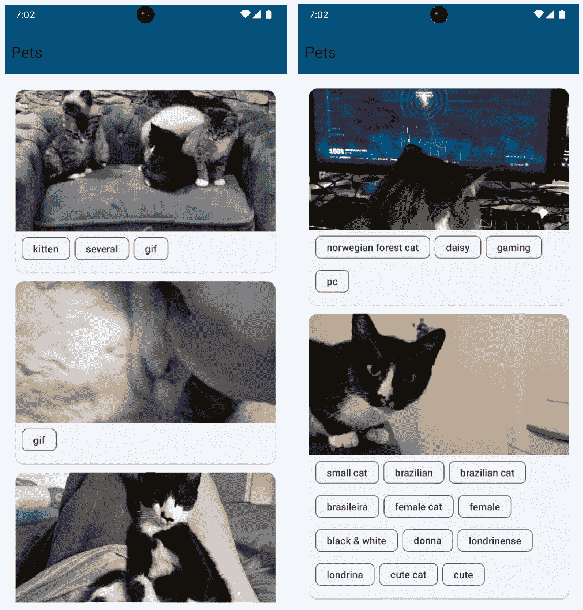

# 使用 Kotlin 协程进行网络调用

我们在手机上使用的许多应用程序都会从服务器上托管的数据中获取数据。因此，作为开发者，我们必须了解如何向服务器请求和发送数据。在本章中，我们将学习如何发送和请求在线托管的数据，并在我们的应用程序中显示它。

在本章中，我们将学习如何使用网络库 **Retrofit** 来执行网络调用。我们将学习如何使用此库消费 **应用程序编程接口**（**API**）。更重要的是，我们将学习如何利用 **Kotlin 协程**在我们的应用程序中执行异步网络请求。

在本章中，我们将涵盖以下主要主题：

+   设置 Retrofit

+   Kotlin 协程简介

+   使用 Kotlin 协程进行网络调用

# 技术要求

要遵循本章中的说明，您需要下载 Android Studio Hedgehog 或更高版本([`developer.android.com/studio`](https://developer.android.com/studio))。

您可以在[`github.com/PacktPublishing/Mastering-Kotlin-for-Android/tree/main/chaptersix`](https://github.com/PacktPublishing/Mastering-Kotlin-for-Android/tree/main/chaptersix)找到本章的代码。

# 设置 Retrofit

Retrofit 是由 Square 开发的一个类型安全的 REST 客户端，适用于 Android、Java 和 Kotlin。该库提供了一个强大的框架，用于验证和与 API 交互，以及使用 OkHttp 发送网络请求。在本书中，我们将使用 Retrofit 来执行我们的网络请求。

首先，我们将使用我们新创建的版本目录添加 Retrofit 依赖项。让我们在 `libs.versions.toml` 文件中定义以下版本：

```kt
retrofit = "2.9.0"
retrofitSerializationConverter = "1.0.0"
serializationJson = "1.5.1"
coroutines = "1.7.3"
okhttp3 = "4.11.0"
```

接下来，让我们在版本目录的库部分中定义 `libs.versions.toml` 文件中的库，如下所示：

```kt
retrofit = { module = "com.squareup.retrofit2:retrofit" , version.ref = "retrofit" }
retrofit-serialization = { module = "com.jakewharton.retrofit:retrofit2-kotlinx-serialization-converter", version.ref = "retrofitSerializationConverter" }
coroutines = { module = "org.jetbrains.kotlinx:kotlinx-coroutines-core" , version.ref = "coroutines" }
coroutines-android = { module = "org.jetbrains.kotlinx:kotlinx-coroutines-android" , version.ref = "coroutines" }
serialization-json = { module = "org.jetbrains.kotlinx:kotlinx-serialization-json", version.ref = "serializationJson" }
okhttp3 = { module = "com.squareup.okhttp3:okhttp", version.ref = "okhttp3" }
```

我们将添加以下依赖项到我们的项目中：

+   **Retrofit**: 如前所述，我们将使用 Retrofit 来执行我们的网络请求。

+   **Retrofit 序列化**: 这是一个使用 **Kotlinx 序列化**将 Kotlin 对象转换为 JSON 并从 JSON 转换为 Kotlin 对象的转换器。

+   **协程**: 我们将使用 Kotlin 协程来异步执行我们的网络请求。我们很快就会了解更多关于协程的内容。

+   **Kotlinx 序列化 JSON**: 这是一个用于 JSON 的 Kotlin 序列化库。我们将使用它来解析我们的 JSON 响应。我们还有其他序列化库，如 Moshi 和 Gson，但我们选择使用 Kotlinx 序列化库的原因如下：

    +   **以 Kotlin 为中心的开发**: Kotlinx 序列化是针对 Kotlin 设计的，提供了无缝集成和原生支持 Kotlin 序列化。

    +   **声明式语法**: Kotlinx 序列化使用声明式语法，利用 Kotlin 的语言特性来编写简洁且可读的序列化代码。

    +   **编译时安全性**：编译时安全性是一个关键特性，在编译阶段捕获与序列化相关的错误，并减少运行时错误的可能性。

    +   **自定义序列化策略**：我们可以为特定类型或场景定义自定义序列化策略，提供对序列化过程的精细控制。

    +   **与 Kotlin 生态系统的无缝集成**：作为 Kotlin 生态系统的一部分，Kotlinx 序列化与其它 Kotlin 库和框架无缝集成，有助于提供一致的开发体验。

+   **OkHttp**：这是一个用于发送网络请求的 HTTP 客户端。它为使用 Retrofit 提供了一些实用工具。

所有这些依赖项都将被累加在一起，因此这是我们有机会在`libs.versions.toml`文件中将它们分组的机会，在我们的 Koin 包下面添加此包：

```kt
networking = ["retrofit", "retrofit-serialization", "serialization-json", "coroutines", "coroutines-android"]
```

在这里，我们创建了一个名为`networking`的新包，并添加了之前指定的所有依赖项。我们必须同步项目，以便将我们的更改添加到项目中。点击`libs.versions.toml`文件。同步后，让我们开始设置插件和依赖项。

首先，在我们的项目级别`build.gradle.kts`文件中，我们需要添加 Kotlinx 序列化插件。打开项目级别的`build.gradle.kts`文件，并在插件块中添加以下内容：

```kt
id("org.jetbrains.kotlin.plugin.serialization") version "1.8.20" apply false
```

我们定义了 Kotlinx 序列化插件并指定了要使用的版本。这将为我们设置 Kotlinx 序列化插件。该插件为可序列化类生成 Kotlin 代码。我们将使用此插件来生成我们的模型。接下来，让我们在我们的应用模块中设置插件。打开应用级别的`build.gradle.kts`文件，并在插件块中添加以下内容：

```kt
id("kotlinx-serialization")
```

这确保了我们的模块已设置好以使用 Kotlinx 序列化插件。接下来，我们将添加我们的`networking`包到我们的应用模块。在应用级别的`build.gradle.kts`文件中，添加以下内容：

```kt
implementation(libs.bundles.networking)
```

这将添加我们在`networking`包中指定的所有依赖项。完成所有这些后，我们的项目已设置好以使用 Retrofit。我们将使用 Koin 创建一个 Retrofit 实例，该实例将被注入到需要它的类中。让我们转到`Module.kt`文件并添加`PetsViewModel`定义：

```kt
single {
    Retrofit.Builder()
        .addConverterFactory(
            Json.asConverterFactory(contentType = "application/json".toMediaType())
        )
        .baseUrl("https://cataas.com/api/")
        .build()
}
```

在前面的代码中，我们使用 Retrofit 构建器创建了一个 Retrofit 实例。我们还添加了一个转换工厂，该工厂使用 Kotlinx 序列化将 Kotlin 对象转换为 JSON，并将 JSON 转换为 Kotlin 对象。我们还指定了 API 的基础 URL。我们使用了`CatsAPI.kt`并添加了以下方法：

```kt
@GET("cats")
suspend fun fetchCats(
    @Query("tag") tag: String,
): Response<List<Cat>>
```

在前面的代码中，我们使用`@GET`注解来指定我们将使用`GET` HTTP 方法进行此请求。在方法内部，我们还在指定一个将被附加到我们的基础 URL 的路径，以形成请求的完整 URL。使用`GET`方法意味着我们的方法将只请求数据。我们有以下内置的 HTTP 注解：

+   `POST`：当我们想要向服务器发送数据时使用

+   `PUT`: 当我们想要在服务器上更新数据时使用

+   `DELETE`: 当我们想要从服务器删除数据时使用

+   `HEAD`: 此方法请求与`GET`请求对应的响应，但不包含响应体

+   `PATCH`: 当我们想要在服务器上部分更新数据时使用

+   `OPTIONS`: 此方法请求目标资源的允许通信选项

回到我们的`fetchCats()`函数，你可以注意到我们使用`@Query`注解来指定请求的查询参数。我们使用`tag`查询参数来指定我们想要获取的猫的类型。我们还使用`suspend`关键字来指定此方法将从协程或另一个`suspend`函数中调用。我们将在本章的“Kotlin 协程简介”部分稍后了解更多关于协程的内容。我们还使用`Response`类来封装我们的响应。这个类由 Retrofit 提供，它包含 HTTP 响应元数据，如响应代码、头信息和原始响应体。我们还指定响应将是一个`Cat`对象的列表。Retrofit 将响应映射到`Cat`对象的列表。为了解决`Cat`数据类的错误，让我们创建它。在数据包中创建一个新的 Kotlin 数据类，命名为`Cat.kt`，并添加以下内容：

```kt
@Serializable
data class Cat(
    @SerialName ("createdAt")
    val createdAt: String,
    @SerialName("_id")
    val id: String,
    @SerialName("owner")
    val owner: String,
    @SerialName("tags")
    val tags: List<String>,
    @SerialName("updatedAt")
    val updatedAt: String
)
```

`Cat`数据类具有与猫作为服务的 API 的 JSON 响应对应的字段。它还注解了`@Serializable`注解。这个注解由 Kotlinx Serialization 提供，它用于标记一个类为可序列化。这个注解对于所有我们想要序列化或反序列化的类都是必需的。我们在数据类的每个变量之前都使用了`@SerialName`注解。`@SerialName`是一个用于自定义 Kotlin 属性名与序列化形式（如 JSON 或其他数据交换格式）中使用的对应名称之间的映射的注解。这个注解允许你在序列化或反序列化时为属性指定不同的名称，从而在处理命名约定时提供灵活性。

在我们的项目中，我们使用 Koin 进行依赖注入。因此，我们现在需要在我们的 Koin 模块中创建我们的`CatsAPI`类的实例。让我们回到`Module.kt`文件，在 Retrofit 实例下方添加以下内容：

```kt
single { get<Retrofit>().create(CatsAPI::class.java) }
```

在这里，我们获取我们的 Retrofit 实例，并使用它来创建我们的`CatsAPI`类的实例，我们使用它来执行实际的网络请求。有了这个，我们的项目就准备好执行网络请求了。但在那之前，让我们更多地了解 Kotlin 协程，因为我们将修改我们的仓库以使用协程。

# Kotlin 协程简介

JetBrains 为 Kotlin 引入的协程提供了一种以更易读和同步的方式编写异步代码的方法。我们可以使用它们来执行后台任务，并且它们是执行网络请求和长时间运行任务（如读取和写入数据库）的绝佳方式。它们在主线程之外执行这些任务，并确保我们在执行这些操作时不会阻塞主线程。使用协程的主要好处如下：

+   它们轻量级且易于使用。

+   它们具有内置的取消支持。

+   它们降低了应用出现内存泄漏的可能性。

+   如前几章所述，Jetpack 库也支持并使用协程。

我们已经在我们的应用中添加了核心和 Android 协程库。在继续在我们的项目中使用协程之前，让我们先了解一些协程的基础知识。

## 协程基础

在本节中，我们将探讨 Kotlin 协程中使用的不同术语和概念：

+   `suspend`：这是一个用于标记函数的关键字。`suspend` 函数是一个可以在稍后暂停和恢复的函数。我们已经在我们的 `CatsAPI` 类中使用了这个关键字来标记 `fetchCats()` 函数为一个 `suspend` 函数。`suspend` 函数只能从另一个 `suspend` 函数或从协程中调用。

+   `launch` 和 `async` 协程构建器。`launch` 用于创建一个不返回结果的协程，而 `async` 用于创建一个返回结果的协程。结果是 `Deferred` 对象，我们可以使用 `await()` 方法来获取结果。这两个构建器都返回一个 `Job` 对象，我们可以使用它来检查协程是否仍然活跃或已被取消。我们还可以使用作业来等待协程完成。作业在完成或取消时结束。

+   `launch` 和 `async` 协程构建器返回一个 `Job` 对象，我们使用它来管理协程的生命周期。我们有一个普通的 `Job` 和 `SupervisorJob`。当一个普通的 `Job` 的任何子任务失败时，它会被取消。`SupervisorJob` 在其任何子任务失败时不会被取消。当有多个协程同时运行时，建议使用 `SupervisorJob`。

+   `launch` 或 `async` 构建器。它负责知道协程将存活多久。每个协程构建器都被定义为作用域的扩展函数。没有作用域就无法启动协程。我们有 `GlobalScope`，这是一个不与任何生命周期绑定的作用域。不建议使用此作用域，因为它可能导致内存泄漏。在 Android 中，KTX 库提供了 `viewModelScope`，这是一个与 `ViewModel` 绑定的作用域。我们可以使用此作用域来启动当 `ViewModel` 被销毁时将取消的协程。我们还有 `lifecycleScope`，这是一个与活动或片段生命周期绑定的作用域。我们可以使用此作用域来启动当生命周期被销毁时将取消的协程。如果我们想启动当自定义生命周期被销毁时将取消的协程，我们还可以创建自己的自定义作用域。

+   `CoroutineContext` 使用如下元素定义了我们的协程的行为：

    +   `Job`: 这管理协程的生命周期。

    +   `CoroutineDispatcher`: 这定义了协程将在哪个线程上运行。

    +   `CoroutineName`: 这定义了协程的名称。

    +   `CoroutineExceptionHandler`: 这用于处理协程中的未捕获异常。

+   `Dispatchers.Main`: 这是主线程。当我们需要在协程中与 UI 交互时使用它。

+   `Dispatchers.IO`: 这是一个针对 IO 任务（如读取和写入数据库或进行网络请求）进行优化的线程池。

+   `Dispatchers.Default`: 这是一个针对 CPU 密集型任务进行优化的线程池。

+   `Dispatchers.Unconfined`: 这是一个不受任何线程限制的调度器。它用于创建一个继承父协程上下文的协程。

在协程内部，我们可以使用 `withContext()` 函数在不同的调度器之间切换。`withContext()` 是一个 `suspend` 函数，它切换协程的上下文。

+   `suspend` 函数。我们还可以使用流来执行异步操作。流是 `collect()` 函数，用于从流中收集值。我们有 `StateFlow` 和 `SharedFlow`，它们是流的类型。`StateFlow` 是一个向新收集器发出当前值并向现有收集器发出新值的流。`SharedFlow` 是一个向所有收集器发出新值的流。我们将在下一章中学习更多关于流的内容。在 Android 中，我们通常使用这两种类型的流将数据发射到我们的 UI。我们将看到 `ViewModel` 在重构以使用协程时的 `StateFlow` 的用法。

在理解了基础知识之后，在下一节中，我们将重构我们的仓库以使用协程。

# 使用 Kotlin 协程进行网络调用

在本节中，我们将重构我们的仓库以使用协程。我们将使用 `StateFlow` 从 `ViewModel` 发射数据到视图层。我们还将使用 `Dispatchers.IO` 调度器在后台线程上执行我们的网络请求。

让我们首先创建一个`NetworkResult` `sealed class`，它将表示我们的网络请求的不同状态：

```kt
sealed class NetworkResult<out T> {
    data class Success<out T>(val data: T) : NetworkResult<T>()
    data class Error(val error: String) : NetworkResult<Nothing>()
}
```

`NetworkResult`类是一个密封类，有两个子类。我们有`Success`数据类，它将用于表示成功的网络请求。它有一个数据属性，用于存储从网络请求返回的数据。我们还有一个`Error`类，它将用于表示失败的网络请求。它有一个`error`属性，用于存储从网络请求返回的错误信息。密封类封装了一个泛型数据类型`T`，这使得我们更容易在所有网络调用中重用该类。`Success`数据类也有一个泛型参数，出于相同的目的。

接下来，让我们按照以下方式修改`PetsRepository`：

```kt
interface PetsRepository {
    suspend fun getPets(): NetworkResult<List<Cat>>
}
```

我们已经更新了接口以使用`NetworkResult`类。我们还标记了`getPets()`函数为`suspend`函数。我们将使用此方法从 API 获取猫。接下来，让我们修改`PetsRepositoryImpl`以添加从`PetsRepository`的更改：

```kt
class PetsRepositoryImpl(
    private  val catsAPI: CatsAPI,
    private val dispatcher: CoroutineDispatcher
): PetsRepository {
    override suspend fun getPets(): NetworkResult<List<Cat>> {
        return withContext(dispatcher) {
            try {
                val response = catsAPI.fetchCats("cute")
                if (response.isSuccessful) {
                    NetworkResult.Success(response.body()!!)
                } else {
                    NetworkResult.Error(response.errorBody().toString())
                }
            } catch (e: Exception) {
                NetworkResult.Error(e.message ?: "Unknown error")
            }
        }
    }
}
```

这里我们更改了多项内容：

+   首先，我们添加了一个构造函数，它接受我们的`CatsAPI`类的实例，我们将使用它来执行网络请求。它还有一个`dispatcher`参数，它将用于指定我们将用于执行网络请求的调度器。我们将使用`Dispatchers.IO`调度器在后台线程上执行我们的网络请求。

+   我们还将`getPets()`函数的返回类型更改为`NetworkResult<List<Cat>>`。这是因为我们将从这个方法返回一个`NetworkResult`对象。

+   我们使用`withContext()`函数将协程的上下文切换到`Dispatchers.IO`调度器。这确保了网络请求是在后台线程上执行的。

+   我们还用`try-catch`块包裹了我们的网络请求。这是为了确保我们能够捕获网络请求过程中可能发生的所有错误。

+   在我们的`try`块中，我们使用`CatsAPI`实例进行网络请求。我们使用`fetchCats()`方法进行请求。我们传入`cute`标签来指定我们想要获取的猫的类型。我们检查响应是否成功。如果是，我们返回一个包含响应体的`NetworkResult.Success`对象。如果不是，我们返回一个包含错误信息的`NetworkResult.Error`对象。

+   最后，我们捕获网络请求过程中可能发生的所有异常，并返回一个包含错误信息的`NetworkResult.Error`对象。

在我们的 Koin 模块中，我们还需要更改实例化我们的仓库的方式。让我们转到`Module.kt`并更新`PetsRepository`的定义如下：

```kt
single<PetsRepository> { PetsRepositoryImpl(get(), get()) }
single { Dispatchers.IO }
```

我们将 `CatsAPI` 实例和 `dispatcher` 注入到我们的仓库中。我们还声明 `dispatcher` 为一个单例实例。现在我们需要修改我们的 `PetsViewModel` 以适应这些更改。首先，我们需要创建一个状态类来存储我们网络请求的状态，并将其暴露给我们的视图。在 `view` 包内创建一个新的 Kotlin 数据类，命名为 `PetsUIState.kt`：

```kt
data class PetsUIState(
    val isLoading: Boolean = false,
    val pets: List<Cat> = emptyList(),
    val error: String? = null
)
```

`PetsUIState` 类是一个数据类，用于存储我们网络请求的状态。它有三个属性：

+   `isLoading`：这是一个布尔值，用于指示网络请求是否正在加载。

+   `pets`：这是一个将通过网络请求返回的猫的列表。

+   `error`：这是一个字符串，将用于存储从网络请求返回的错误信息。

接下来，在 `PetsViewModel` 中，让我们创建一个变量来存储我们网络请求的状态：

```kt
val petsUIState = MutableStateFlow(PetsUIState())
```

我们使用 `MutableStateFlow` 类来存储我们网络请求的状态。`MutableStateFlow` 允许我们更新状态的值。我们用空的 `PetsUIState` 对象初始化它。接下来，让我们更新 `getPets()` 方法如下：

```kt
private fun getPets() {
    petsUIState.value = PetsUIState(isLoading = true)
    viewModelScope.launch {
        when (val result = petsRepository.getPets()) {
            is NetworkResult.Success -> {
                petsUIState.update {
                    it.copy(isLoading = false, pets = result.data)
                }
            }
            is NetworkResult.Error -> {
                petsUIState.update {
                    it.copy(isLoading = false, error = result.error)
                }
            }
        }
    }
}
```

在这里，我们将分解前面的代码：

+   我们更新 `petsUIState` 变量的值以指示网络请求正在加载。

+   我们使用 `viewModelScope` 来启动协程。这确保了当 `ViewModel` 被销毁时，协程会被取消。

+   这里有一个 `when` 语句，它是 Kotlin 的模式匹配功能，用于检查网络请求的结果。如果结果是 `NetworkResult.Success` 对象，我们将更新 `petsUIState` 的值以指示网络请求成功，并传入猫的列表。如果结果是 `NetworkResult.Error` 对象，我们将更新 `petsUIState` 的值以指示网络请求失败，并传入错误信息。

在 `PetsViewModel` 中，让我们添加一个新的 `init` 块，该块将调用 `getPets()` 函数：

```kt
init {
    getPets()
}
```

这将确保在 `ViewModel` 创建时调用 `getPets()` 函数。我们现在需要更新我们的 `PetList` 可组合组件以适应这些更改，我们还将添加更多的 UI 组件，因为我们需要显示加载状态、图片和错误信息。让我们先添加一个库，允许我们从 URL 加载图片。我们将使用 Coil ([`coil-kt.github.io/coil/`](https://coil-kt.github.io/coil/))，这是一个图片加载库。在版本目录中，让我们添加以下内容：

```kt
coil-compose = "io.coil-kt:coil-compose:2.4.0"
```

我们还将把 `coil-compose` 依赖项添加到我们的 `compose` 包中，以便它可以与其他 `compose` 库一起提供。更新后的 `compose` 包如下所示：

```kt
compose = ["compose.ui", "compose.ui.graphics", "compose.ui.tooling", "compose.material3", "compose.viewmodel", "coil-compose"]
```

现在让我们创建一个新的可组合组件，用于在 `view` 包中的 `PetListItem.kt` 文件内显示每只猫的图片和标签，并添加以下内容：

```kt
@OptIn(ExperimentalLayoutApi::class)
@Composable
fun PetListItem(cat: Cat) {
    ElevatedCard(
        modifier = Modifier
            .fillMaxWidth()
            .padding(6.dp)
    ) {
        Column(
            modifier = Modifier
                .fillMaxWidth()
                .padding(bottom = 10.dp)
        ) {
            AsyncImage(
                model = "https://cataas.com/cat/${cat.id}",
                contentDescription = "Cute cat",
                modifier = Modifier
                    .fillMaxWidth()
                    .height(200.dp),
                contentScale = ContentScale.FillWidth
            )
            FlowRow(
                modifier = Modifier
                    .padding(start = 6.dp, end = 6.dp)
            ) {
                repeat(cat.tags.size) {
                    SuggestionChip(
                        modifier = Modifier
                            .padding(start = 3.dp, end = 3.dp),
                        onClick = { },
                        label = {
                            Text(text = cat.tags[it])
                        }
                    )
                }
            }
        }
    }
}
```

这个组合函数接收一个 `Cat` 对象，并显示猫咪的图片和标签。我们使用来自 Coil 库的 `AsyncImage` 组合函数从 URL 加载图片。我们还使用 `FlowRow` 组合函数来显示猫咪的标签。我们使用 `SuggestionChip` 组合函数来显示每个标签。我们在 `ElevatedCard` 组合函数中显示图片和标签。

接下来，让我们更新我们的 `PetList` 组合函数以适应这些更改。在 `PetList.kt` 文件中，按照以下方式更新 `PetList` 组合函数：

```kt
@Composable
fun PetList(modifier: Modifier) {
    val petsViewModel: PetsViewModel = koinViewModel()
    val petsUIState by petsViewModel.petsUIState.collectAsStateWithLifecycle()
    Column(
        modifier = modifier
            .padding(16.dp),
        verticalArrangement = Arrangement.Center,
        horizontalAlignment = Alignment.CenterHorizontally
    ) {
        AnimatedVisibility(
            visible = petsUIState.isLoading
        ) {
            CircularProgressIndicator()
        }
        AnimatedVisibility(
            visible = petsUIState.pets.isNotEmpty()
        ) {
            LazyColumn {
                items(petsUIState.pets) { pet ->
                    PetListItem(cat = pet)
                }
            }
        }
        AnimatedVisibility(
            visible = petsUIState.error != null
        ) {
            Text(text = petsUIState.error ?: "")
        }
    }
}
```

以下是对前面代码的分解：

+   和之前一样，我们使用 `koinViewModel()` 函数来获取 `PetsViewModel` 的实例。

+   我们使用 `collectAsStateWithLifecycle()` 函数来收集我们的网络请求状态。这个函数由 `lifecycle-runtime-compose` 库提供。它用于收集流程的状态，并在生命周期被销毁时自动取消收集。我们使用 `PetsViewModel` 的 `petsUIState` 属性来获取我们的网络请求状态。

+   我们有一个包含三个 `AnimatedVisibility` 组合函数的 `Column` 组合函数。第一个用于在网络请求加载时显示 `CircularProgressIndicator`。第二个用于在网络请求成功时显示猫咪列表。最后一个用于在网络请求失败时显示错误信息。

`collectAsStateWithLifecycle()` 显示错误，因为我们还没有添加其依赖项。让我们将其添加到版本目录中的库部分，如下所示：

```kt
compose-lifecycle = { module = "androidx.lifecycle:lifecycle-runtime-compose", version.ref = "lifecycle" }
```

我们还将将其添加到我们的 `compose` 包中，以便它可以与其他组合库一起提供。更新的组合包将如下所示：

```kt
compose = ["compose.ui", "compose.ui.graphics", "compose.ui.tooling", "compose.material3", "compose.viewmodel", "coil-compose", "compose-lifecycle"]
```

执行 Gradle 同步，IDE 将提示您添加 `collectAsStateWithLifecycle()` 函数的导入。

我们已经完成了将所有层更新为使用新的协程方法。到目前为止做得很好！最后一件事：由于我们的应用现在是从在线托管 API 获取这些项目，我们需要在我们的应用中添加 `INTERNET` 权限。打开 `AndroidManifest.xml` 文件并添加以下内容：

```kt
<uses-permission android:name="android.permission.INTERNET" />
```

运行应用并查看一切是否按预期工作。我们可以看到显示标签的可爱猫咪列表。我们还可以在网络请求加载时看到加载指示器，在网络请求失败时看到错误信息。我们已经成功重构了我们的应用以使用协程。



图 6.1 – 可爱的猫咪

# 摘要

在本章中，我们学习了如何使用 Retrofit 执行网络调用。更重要的是，我们学习了如何利用 Kotlin 协程在我们的应用中执行异步网络请求，并重构了我们的应用以使用 Kotlin 协程获取一些可爱的猫咪。

在下一章中，我们将探讨另一个 Jetpack 库，**Jetpack 导航**，以处理我们的应用中的导航。
