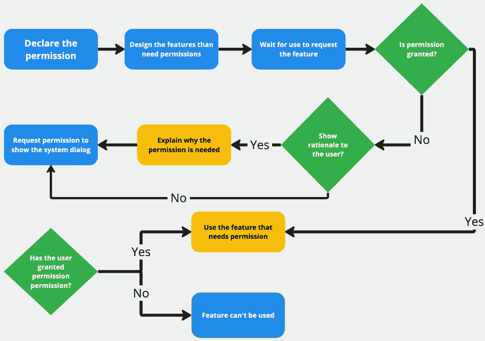
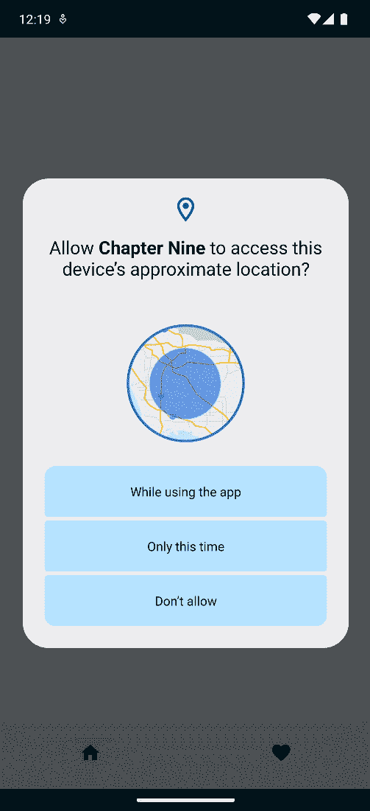
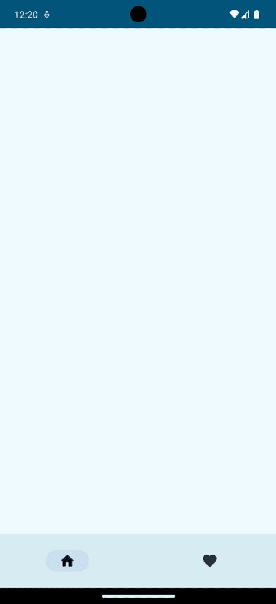
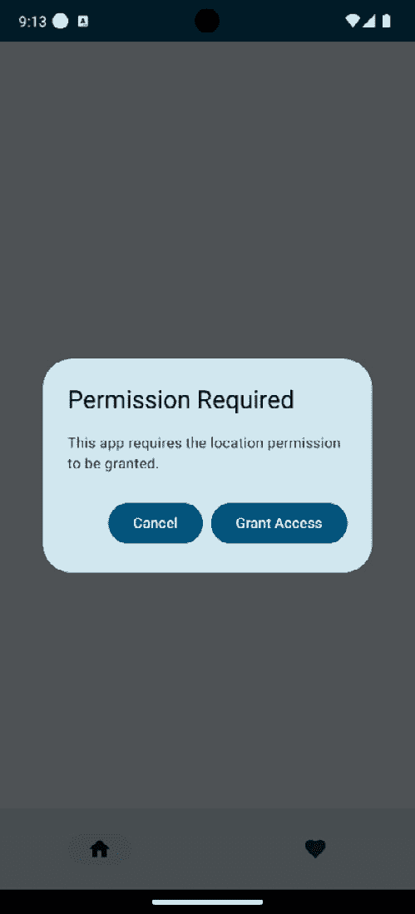
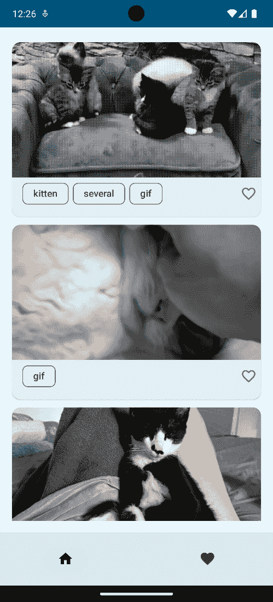

# 第九章：运行时权限

随着我们构建 Android 应用，有一些功能需要授权才能正常工作。由于隐私和数据安全政策，我们作为开发者不能自动为我们开发的应用授权。我们需要通知用户应用需要的权限以及为什么需要它们。

在本章中，我们将了解运行时权限以及如何在我们的应用中请求它们。

在本章中，我们将介绍以下主要内容：

+   理解运行时权限

+   在运行时请求权限

# 技术要求

要遵循本章中的说明，您需要已下载 Android Studio Hedgehog 或更高版本([`developer.android.com/studio`](https://developer.android.com/studio))。

您可以使用前一章的代码来遵循本章的说明。您可以在[`github.com/PacktPublishing/Mastering-Kotlin-for-Android/tree/main/chapternine`](https://github.com/PacktPublishing/Mastering-Kotlin-for-Android/tree/main/chapternine)找到本章的代码。

# 理解运行时权限

`requestPermissions()`和`checkSelfPermission()`。用户只需在应用生命周期内授权一次。

一些需要授权才能正常工作的功能包括相机、位置、麦克风和存储。在使用它们之前，请确保用户有权限使用它们。如果用户未授权，您必须向他们请求。如果用户拒绝授权，您必须显示一个对话框解释为什么需要它，并要求用户从设置中授权。如果用户已授权，您可以使用该功能。未能进行这些检查通常会导致应用崩溃或功能无法正常工作。如果您的应用针对 Android 6.0 及以上版本，您必须在运行时请求这些权限，并且用户必须授权才能使应用工作。

请求权限的流程如下所示：



图 9.1 – 运行时权限流程

如前图所示，这是流程：

1.  第一步是在清单文件中*声明*权限。这是通过将权限添加到清单文件来完成的。

1.  在将权限添加到清单文件后，我们必须*设计 UX*，以便需要授权的功能。

1.  下一步是*等待用户使用*需要授权的特定功能。在此阶段，我们检查用户是否已授权。如果用户已授权，我们继续使用该功能。

1.  如果用户*尚未授权*，我们首先检查是否需要*展示理由*来解释为什么我们需要权限。如果需要展示理由，我们将通过解释来展示它，然后请求用户授权。如果我们不需要展示理由，我们只需直接请求用户授权。

1.  一旦请求了权限，我们就等待**用户授予或拒绝**权限。如果用户授予了权限，我们就继续使用该功能。如果用户拒绝了权限，我们允许应用继续运行，但用户无法使用需要权限才能运行的功能。

考虑到这个流程，让我们看看如何在代码中实现它。我们将请求访问位置的权限。

# 运行时请求权限

我们将遵循**图 9**.1 中涵盖的步骤来为我们的应用请求运行时权限：

1.  让我们从将权限添加到清单文件开始。我们将请求访问用户位置的权限。为此，我们在清单文件中添加以下权限：

    ```java
    <uses-permission android:name="android.permission.ACCESS_COARSE_LOCATION" />
    ```

    这指定了我们的应用将使用`ACCESS_COARSE_LOCATION`权限。在清单中声明权限对于增强安全性、用户意识和整体应用兼容性至关重要。通过明确指定应用需要访问的动作或资源，可以在安装过程中通知用户，使他们能够做出明智的决定，关于是否授予或拒绝访问。这种声明确保了不同 Android 版本和设备之间的兼容性，促进了应用间的通信，并支持意图过滤以控制组件访问。权限在运行时请求危险权限中也发挥作用，有助于保持平台兼容性。此外，Play 商店的审核过程将权限作为提交流程的一部分，有助于遵守政策和指南。本质上，基于清单的权限声明对于创建安全、透明和用户控制的环境至关重要。

    下一步是创建需要权限的功能的用户界面。我们将创建一个对话框来请求用户的权限。它还将包含逻辑，如果之前拒绝了权限，则向用户展示理由。

1.  让我们在`view`包中创建一个名为`PermissionDialog.kt`的新文件，并将实用函数添加到该文件中：

    ```java
    fun checkIfPermissionGranted(context: Context, permission: String): Boolean {
        return (ContextCompat.checkSelfPermission(context, permission)
                == PackageManager.PERMISSION_GRANTED)
    }
    fun shouldShowPermissionRationale(context: Context, permission: String): Boolean {
        val activity = context as Activity?
        if (activity == null)
            Log.d("Permissions", "Activity is null")
        return ActivityCompat.shouldShowRequestPermissionRationale(
            activity!!,
            permission
        )
    }
    ```

    第一个函数使用`ContextCompat.checkSelfPermission()`函数检查权限是否已被授予。第二个函数检查是否需要向用户展示理由。这是通过使用`ActivityCompat.shouldShowRequestPermissionRationale()`函数来完成的。如果应用之前请求过此权限并且用户拒绝了请求，该函数返回`true`。如果用户之前拒绝了权限请求并选择了`false`。

    接下来，让我们创建一个密封类，用于表示权限请求的状态。

1.  在`data`包中创建一个名为`PermissionAction.kt`的新文件，并将以下代码添加到该文件中：

    ```java
    sealed class PermissionAction {
        data object PermissionGranted : PermissionAction()
        data object PermissionDenied : PermissionAction()
    }
    ```

    该类有两个状态，`PermissionGranted`和`PermissionDenied`。用户可以授予或拒绝权限。

1.  接下来，让我们创建一个用于请求用户权限的对话框。返回到 `PermissionDialog.kt` 文件，并向文件中添加以下代码：

    ```java
    @Composable
    fun PermissionDialog(
        context: Context,
        permission: String,
        permissionAction: (PermissionAction) -> Unit
    ) {
        val isPermissionGranted = checkIfPermissionGranted(context, permission)
        if (isPermissionGranted) {
            permissionAction(PermissionAction.PermissionGranted)
            return
        }
        val permissionsLauncher = rememberLauncherForActivityResult(
            ActivityResultContracts.RequestPermission()
        ) { isGranted: Boolean ->
            if (isGranted) {
                permissionAction(PermissionAction.PermissionGranted)
            } else {
                permissionAction(PermissionAction.PermissionDenied)
            }
        }
        val showPermissionRationale = shouldShowPermissionRationale(context, permission)
        var isDialogDismissed by remember { mutableStateOf(false) }
        var isPristine by remember { mutableStateOf(true) }
        if ((showPermissionRationale && !isDialogDismissed) || (!isDialogDismissed && !isPristine)) {
            isPristine = false
            AlertDialog(
                onDismissRequest = {
                    isDialogDismissed = true
                    permissionAction(PermissionAction.PermissionDenied)
                },
                title = { Text(text = "Permission Required") },
                text = { Text(text = "This app requires the location permission to be granted.") },
                confirmButton = {
                    Button(
                        onClick = {
                            isDialogDismissed = true
                            permissionsLauncher.launch(permission)
                        }
                    ) {
                        Text(text = "Grant Access")
                    }
                },
                dismissButton = {
                    Button(
                        onClick = {
                            isDialogDismissed = true
                            permissionAction(PermissionAction.PermissionDenied)
                        }
                    ) {
                        Text(text = "Cancel")
                    }
                }
            )
        } else {
            if (!isDialogDismissed) {
                SideEffect {
                    permissionsLauncher.launch(permission)
                }
            }
        }
    }
    ```

    让我们分解前面的代码：

    +   我们创建了一个可组合的 `PermissionDialog`，它接受三个参数，`context`、`permission` 字符串和一个 `permissionAction` 回调，该回调将用户选择的选项传递给调用位置。

    +   在可组合函数内部，我们首先检查权限是否已被授予。如果权限已被授予，我们调用 `permissionAction` 回调并传递 `PermissionGranted` 状态，然后返回。

    +   接下来，我们还创建了 `permissionsLauncher`，用于请求用户权限。我们使用 `rememberLauncherForActivityResult()` 函数创建一个用于合同的启动器。然后我们使用启动器请求用户权限。如果用户授予权限，我们调用 `permissionAction` 回调并传递 `PermissionGranted` 状态。如果用户拒绝权限，我们调用 `permissionAction` 回调并传递 `PermissionDenied` 状态。

    +   如果权限尚未被授予，我们检查是否需要向用户显示理由。如果需要，我们将使用解释显示理由，然后请求用户权限。如果我们不需要显示理由，我们必须请求用户权限。在我们的情况下，理由是 `AlertDialog`，包含两个操作项和一个解释为什么我们需要权限的消息。第一个操作项用于请求用户权限。第二个操作项用于取消权限请求。如果我们点击，`permissionAction` 回调将使用 `PermissionDenied` 状态被调用，并且对话框将被关闭。我们还有两个可变状态，`isDialogDismissed` 和 `isPristine`。第一个用于检查对话框是否已被关闭。第二个让我们知道对话框是否之前显示过。我们使用这些状态结合来确定是否显示对话框。

    +   最后，如果我们不需要显示理由，我们只需请求用户权限。我们使用 `SideEffect` 请求用户权限，因为我们希望在对话框显示时立即请求权限。

    由于我们当前的应用程序中没有使用位置的实际功能，我们将使用 `PetsScreen` 可组合函数来模拟权限流程。

1.  让我们转到 `PetsScreen.kt` 文件，并将其修改为以下内容：

    ```java
    @Composable
    fun PetsScreen(
        onPetClicked: (Cat) -> Unit,
        contentType: ContentType,
    ) {
        val petsViewModel: PetsViewModel = koinViewModel()
        val petsUIState by petsViewModel.petsUIState.collectAsStateWithLifecycle()
        val context = LocalContext.current
        var showContent by rememberSaveable { mutableStateOf(false) }
        PermissionDialog(
            context = context,
            permission = Manifest.permission.ACCESS_COARSE_LOCATION
        ) { permissionAction ->
            when (permissionAction) {
                is PermissionAction.PermissionDenied -> {
                    showContent = false
                }
                is PermissionAction.PermissionGranted -> {
                    showContent = true
                    Toast.makeText(
                        context,
                        "Location permission granted!",
                        Toast.LENGTH_SHORT
                    ).show()
                }
            }
        }
        if (showContent) {
            PetsScreenContent(
                modifier = Modifier
                    .fillMaxSize(),
                onPetClicked = onPetClicked,
                contentType = contentType,
                petsUIState = petsUIState,
                onFavoriteClicked = {
                    petsViewModel.updatePet(it)
                }
            )
        }
    }
    ```

    我们只对这个文件做了一些修改：

    +   首先，我们添加了一个 `showContent` 可变状态，用于检查我们是否应该显示屏幕的内容。我们还设置了状态的初始值为 `false`。如果用户授予权限，我们将使用此状态来显示屏幕内容。我们还有 `context` 变量，用于获取屏幕的上下文。

    +   我们还向`PetsScreen`可组合组件添加了`PermissionDialog`可组合组件。我们传递了上下文和权限——在这种情况下，是`ACCESS_COARSE_LOCATION`权限——到可组合组件中。我们还传递了一个回调到可组合组件，用于获取权限请求的状态。如果用户授予了权限，我们将`showContent`状态设置为`true`并显示一个带有`showContent`状态的吐司，如果状态为`false`，则不显示屏幕内容。

    +   最后，我们添加了一个检查来查看`showContent`状态是否为`true`。如果状态为`true`，我们显示屏幕内容。如果状态为`false`，我们不显示屏幕内容。

1.  构建并运行应用。一开始，我们将看到权限对话框，如下面的截图所示：



图 9.2 – 权限对话框

1.  点击**不允许**选项，这将显示一个空白的白色屏幕，因为我们没有在用户未授予应用权限时显示任何内容。



图 9.3 – 无权限屏幕

下次我们运行应用时，将看到显示应用为何需要权限的理性对话框。



图 9.4 – 权限理性说明

在这个理性对话框中，我们可以取消请求或授予访问权限。点击**授予访问权限**选项将显示如图*9.2*所示的权限对话框，通过点击**使用应用时**选项，我们授予应用位置权限，现在，我们应该能够再次看到可爱猫咪的列表。再次运行应用不会显示对话框，因为我们已经授予了应用位置权限。



图 9.5 – 可爱的猫咪

# 摘要

在本章中，我们探讨了运行时权限是什么以及为什么我们应该在我们的应用中声明和请求权限。一步一步地，我们学习了如何在我们的应用中请求运行时权限以及如何显示权限理性对话框，解释为什么在用户拒绝应用访问权限的情况下，我们需要访问运行时权限。

在下一章中，我们将学习调试技巧和窍门，如何使用 LeakCanary 检测泄漏，如何使用 Chucker 检查我们应用发出的 HTTPS 请求/响应，以及如何检查 Room 数据库。

# 第三部分：代码分析和测试

在这部分，您将通过一系列宝贵的技巧和窍门掌握调试技能。揭示其复杂性，您将发现检测应用中内存泄漏的技术，并熟练地检查由您的应用程序触发的 HTTP 请求。我们的探索扩展到检查您的本地数据库，深入了解其内部工作原理。深入 Kotlin 最佳实践，您将深入分析您的应用程序代码，解决代码异味以提升代码质量。本部分还包括对测试方法的全面探索，使您能够无缝地将测试集成到 MVVM 架构的各个层次。

本节包含以下章节：

+   *第十章*, *调试您的应用*

+   *第十一章*, *提升代码质量*

+   *第十二章*, *测试您的应用*
