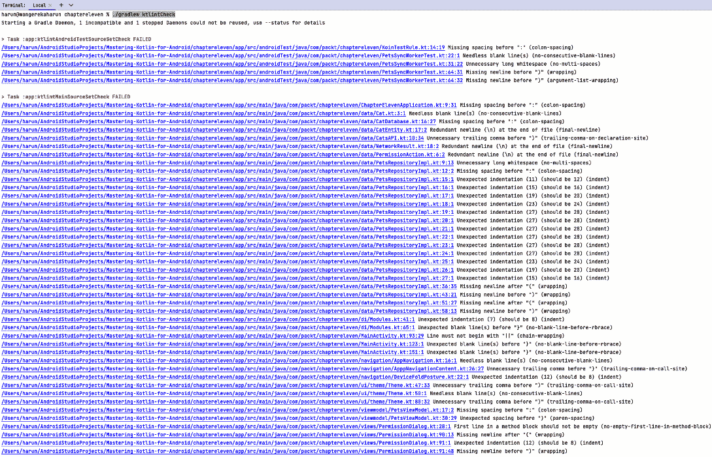

# 提高代码质量

随着我们开发 Android 应用程序，我们必须确保我们编写的代码符合既定规则并遵循最佳实践。这不仅有助于我们编写良好的代码，还使维护代码变得更加容易，并便于他人快速加入代码库。

在本章中，我们将学习 Kotlin 风格和编写 Kotlin 代码的最佳实践。我们还将学习如何使用 Ktlint 和 Detekt 等插件来格式化、检查和早期检测代码异味。

在本章中，我们将涵盖以下主要主题：

+   掌握 Kotlin 风格和最佳实践

+   使用 Ktlint 进行静态分析

+   使用 Detekt 检测代码异味

# 技术要求

要遵循本章的说明，您需要下载 Android Studio Hedgehog 或更高版本（[`developer.android.com/studio`](https://developer.android.com/studio)）。

您可以使用上一章的代码来遵循本章的说明。您可以在[`github.com/PacktPublishing/Mastering-Kotlin-for-Android/tree/main/chaptereleven`](https://github.com/PacktPublishing/Mastering-Kotlin-for-Android/tree/main/chaptereleven)找到本章的代码。

# 掌握 Kotlin 风格和最佳实践

如我们在*第一章*中学到的，Kotlin 是一种非常简洁和静态的语言。因此，作为开发者，我们更容易不遵循一些推荐的最佳实践。这会导致许多代码异味和技术债务。**代码异味**是一种模式或实践，可能表明代码中存在更深层次的问题。它表明代码可能会引起潜在问题或阻碍可维护性。另一方面，**技术债务**指的是为了满足即时需求而选择快速且次优解决方案的成本或后果，而不是开发健壮且可维护的解决方案。我们总是需要回来对这些解决方案进行重构，使其更具可扩展性和可维护性。让我们从学习一些最佳实践和如何避免它们开始。

## 编码规范

Kotlin 拥有一系列广泛的编码规范，涵盖了从命名规范到格式化的各个方面。遵循这些规范使得阅读我们的代码更加容易，并使其易于维护。以下是一些例子：

+   变量名应使用**camelCase**格式

+   类名应使用**PascalCase**格式

+   常量应使用**大写**格式

+   函数名应使用**camelCase**格式

+   包含多个单词的函数名应使用**下划线**分隔

+   单行表达式的函数应**内联**

Kotlin 提供了许多编码规范。您可以在[`kotlinlang.org/docs/coding-conventions.html`](https://kotlinlang.org/docs/coding-conventions.html)找到它们。

## 空安全

如在 *第一章* 中广泛讨论的那样，Kotlin 具有非常强大的 `null` 处理能力。当处理可空类型时，建议我们使用安全调用操作符 (`?.`) 和 Elvis 操作符 (`?:`) 来避免空指针异常。我们还应该使用 `let` 函数对可空类型执行操作。我们还应该使用安全类型转换操作符 (`as?`) 来避免类转换异常。以下是一个示例代码片段：

```kt
val name: String? = null
name?.let {
  println(it)
}
```

在前面的例子中，我们声明了一个 `name` 变量，其类型为 `String` 并将其赋值为 `null`。然后，我们使用 `let` 函数来检查变量是否为 `null`。如果变量不是 `null`，则 `println(it)` 函数将打印变量的值。

## 数据类

Kotlin 让我们很容易地创建 `equals`、`hashCode`、`toString` 和 `copy` 函数。当我们需要存储数据时，应该使用数据类：

```kt
data class Person(val name: String, val age: Int)
```

在前面的例子中，我们创建了一个具有两个属性的数据类 `Person`：`name`（类型为 `String`）和 `age`（类型为 `Int`）。

## 扩展函数

Kotlin 提供了 **扩展函数**，允许我们向新类添加新函数，而无需从它们继承。这将帮助我们避免创建工具类。虽然扩展函数功能强大，但过度使用或不恰当的使用可能会导致难以阅读和维护的代码。以下是一个示例代码块：

```kt
fun String.removeFirstAndLastChar(): String {
  return when {
  this.length <= 1 -> ""
  else -> this.substring(1, this.length - 1)
  }
}
// Example usage
fun main(args: Array<String>) {
  val myString = "Hello Everyone"
  val result = myString.removeFirstAndLastChar ()
  println(result)
}
```

在前面的例子中，我们在 `String` 类上创建了一个扩展函数。该函数移除了字符串的第一个和最后一个字符，并返回剩余的字符串。此外，我们使用了 `when` 表达式来检查字符串的长度是否小于或等于 `1`。如果长度小于或等于 `1`，则函数返回一个空字符串。否则，它返回从索引 `1` 到字符串长度减 `1` 的子字符串。我们在 `main` 函数中使用扩展函数来移除 `"Hello Everyone"` 字符串的第一个和最后一个字符。结果随后按如下方式打印到控制台：

```kt
ello Everyon
```

## 类型推断

Kotlin 具有非常强大的类型系统。因此，我们可以省略指定变量的类型，让编译器推断类型。这将帮助我们避免大量的样板代码。以下是一个示例：

```kt
val name = "John Doe" // Compiler infers that name is of type String
val age = 25 // Compiler infers that age is of type Int
```

## 集合

Kotlin 拥有丰富的集合类型，包括 `List`、`Set`、`Map`、`Array` 和 `Sequence`。集合可以是 `可变的` 或 `不可变的`。一个 `可变的` 集合在创建后可以被修改，而一个 `不可变的` 集合在创建后则不能被修改。以下是一个 `可变的` 列表的例子：

```kt
val mutableList = mutableListOf("Kotlin", "Java", "Python")
mutableList.add("Swift")
```

在前面的例子中，我们创建了一个字符串的 `可变的` 列表。我们使用 `mutableListOf` 函数创建列表。然后，我们使用 `add` 函数向列表中添加一个新的字符串。以下是一个 `不可变的` 列表的例子：

```kt
val immutableList = listOf("Kotlin", "Java", "Python")
```

在前面的示例中，我们创建了一个不可变的字符串列表。我们使用 `listOf` 函数创建列表。创建后，我们无法向列表中添加或删除项目。我们只能从列表中读取项目。Kotlin 集合还拥有广泛的功能，可以用于对集合执行操作。我们应该使用这些函数而不是编写自己的函数。这有助于我们使代码更加简洁和易读。让我们看看以下创建列表并过滤奇数和偶数的示例：

```kt
val numbers = listOf(1, 2, 3, 4, 5, 6, 7, 8, 9, 10)
val evenNumbers = numbers.filter { it % 2 == 0 }
val oddNumbers = numbers.filter { it % 2 != 0 }
```

在前面的示例中，我们创建了一个数字列表。然后我们使用 `filter` 函数来过滤偶数和奇数。`filter` 函数接受一个 lambda 作为参数。lambda 用于过滤数字。`filter` 函数返回一个包含过滤后数字的新列表。我们使用 `it` 关键字来引用列表中的当前项。然后我们使用 `%` 运算符来检查数字是否为偶数。如果数字是偶数，则 `filter` 函数返回 `true`，并将数字添加到 `evenNumbers` 变量中。对于奇数，`filter` 函数返回 `false`，并将数字添加到 `oddNumbers` 变量中。Kotlin 集合还拥有如 `map`、`reduce`、`fold`、`flatMap` 等函数。我们应该使用这些函数而不是编写自己的函数。这有助于我们使代码更加简洁和易读。

## 密封类和接口

Kotlin 提供了 **密封类**，用于表示受限的类和接口层次结构。这提高了代码的可读性，并确保我们知道一个类的所有可能的子类。以下是一个密封类的示例：

```kt
sealed class Shape {
  class Circle(val radius: Double) : Shape()
  class Square(val length: Double) : Shape()
  class Rectangle(val length: Double, val breadth: Double) : Shape()
}
```

在前面的示例中，我们创建了一个名为 `Shape` 的密封类。然后我们创建了三个类（`Circle`、`Square` 和 `Rectangle`），它们是 `Shape` 类的子类。`Shape` 类只能在声明它的同一文件中扩展。我们无法在另一个文件中扩展 `Shape` 类。

## 格式化

在 Kotlin 中，我们使用四个空格进行缩进。然而，请注意，这是一个约定，而不是严格规则。我们应该始终确保我们的代码按照团队或公司商定的约定进行适当的格式化。

## 函数式编程

我们应该利用 Kotlin 的 **函数式编程** 特性，如 **lambda**、**高阶函数** 和 **内联函数**。这将帮助我们使代码更加简洁和易读。以下是一个示例代码块：

```kt
val total = numbers.reduce { sum, element -> sum + element }
```

## 协程

Kotlin 提供了 **协程**，用于执行异步操作。它们非常轻量级且易于使用，帮助我们避免回调地狱。当我们需要执行异步操作时，应该使用协程。以下是一个 Kotlin 协程的示例：

```kt
fun makeNetworkCall() {
  viewModelScope.launch {
    val result = async {
    // perform network call
    }
    // update UI
  }
}
```

在前面的示例中，我们使用了`viewModelScope`来启动协程。这是为了确保当视图模型被销毁时，协程会被取消。我们使用了`launch`协程构建器来创建一个新的协程。在`launch` lambda 内部，我们执行了网络调用，这应该在后台发生。我们使用了`async`协程构建器，它允许我们等待网络调用的结果。`async`协程构建器返回一个`Deferred`对象。最后，我们使用网络调用的结果更新了 UI。

## 当语句

Kotlin 提供了`when`语句，用于替换`switch`语句。当我们需要执行条件操作时，我们应该使用`when`语句。如果我们有包含多个`if` `else`语句的块，我们应该考虑使用`when`语句。以下代码展示了示例：

```kt
val number = when {
  x % 2 == 0 -> "Even"
  x % 2 != 0 -> "Odd"
  else -> "Invalid"
}
```

## 类和函数

+   Kotlin 允许我们在单个文件中声明多个类。我们应该使用这个特性来避免创建大量的文件，特别是对于紧密相关的类。然而，我们应谨慎使用此功能，避免创建包含大量类的臃肿文件。

+   我们必须确保每个类只定义一个**主构造函数**。而不是通过第二个构造函数来过载构造函数，我们总是可以考虑为构造函数参数使用默认值。

+   我们可以使用**伴随对象**来创建静态成员。Kotlin 的伴随对象和 Java 的**静态成员**都便于创建类级别的成员，这些成员可以在不创建类实例的情况下访问。然而，Kotlin 的伴随对象通过允许访问非静态成员并提供更丰富的语法，提供了额外的灵活性。

+   我们应该始终避免在函数中返回`null`。相反，我们应该使用可空类型。

+   我们总是可以使用**作用域函数**来对对象执行操作。这将帮助我们避免创建大量的临时变量。

这只是一个最佳实践的小列表。随着代码库的增长，有时很难跟踪所有最佳实践。这就是静态代码分析工具派上用场的地方。它们帮助我们识别代码异味和技术债务。它们还帮助我们识别错误和安全漏洞。在下一节中，我们将了解一些我们可以使用的静态代码分析工具，以改进我们代码的质量。

# 使用 Ktlint 进行静态分析

根据官方文档，ktlint 是“*一个内置格式化器的反自行车棚 Kotlin 代码检查器*。”它帮助我们执行`gradle`任务，允许我们在项目中运行`ktlint`。我们还能够进行自动格式化。

要在我们的项目中设置 Ktlint，我们需要在项目的`build.gradle.kts`文件中的插件块中添加 Ktlint 插件，如下所示：

```kt
id("org.jlleitschuh.gradle.ktlint") version "11.6.1"
```

点击以下插件块下方的`build.gradle.kts`文件：

```kt
subprojects {
    apply(plugin = "org.jlleitschuh.gradle.ktlint")
    ktlint {
        verbose.set(true)
        android.set(true)
        filter {
            exclude("**/generated/**")
        }
    }
}
```

这将插件应用于所有项目模块。点击`ktlint`块。在我们的例子中，我们将`verbose`和`android`属性设置为`true`。我们还将`generated`文件夹排除在分析之外。

这样，我们就准备好使用 Ktlint 了。不过，首先，让我们禁用一些格式化选项。为此，我们需要在我们的项目根目录中创建一个`.editorconfig`文件。在文件中，我们添加以下代码：

```kt
root = true
[*]
charset = utf-8
insert_final_newline = false
trim_trailing_whitespace = true
[*.{kt,kts}]
indent_size = 4
ij_kotlin_packages_to_use_import_on_demand = unset
ij_kotlin_name_count_to_use_star_import = 999
ij_kotlin_name_count_to_use_star_import_for_members = 999
```

这将禁用一些格式化选项，其中关键的一个是在每个文件的末尾插入`insert_final_newline`。这对于现有项目特别有用，因为它可以防止我们不得不重新格式化整个项目。如果您需要自定义 Ktlint 行为，这是您用来启用或禁用一些选项的文件。

现在，让我们运行`ktlintCheck`任务。为此，让我们在我们的 IDE 中打开**终端**标签页并运行以下命令：

```kt
./gradlew ktlintCheck
```

任务完成后，我们将看到以下输出：



图 11.1 – Ktlint 检查失败


图 11.2 – Ktlint 检查失败继续

从前面的图中，我们可以看到任务以失败完成，这意味着我们的项目格式不正确。输出还显示了具体的格式错误和文件。我们可以选择自己修复这些问题，但首先，我们应始终检查 Ktlint 格式化器是否可以为我们修复这些问题。为此，我们可以运行以下命令：

```kt
./gradlew ktlintFormat
```

这将运行`ktlintFormat`任务。任务完成后，我们将看到以下输出：


图 11.3 – ktlintFormat 成功

如前图所示，任务成功完成。这意味着 Ktlint 格式化器能够为我们修复这些问题。如果 Ktlint 格式化器无法修复这些问题，它通常会突出显示插件无法修复的问题，并显示文件和行号。然后我们可以手动修复这些问题。目前，我们没有这样的问题。现在我们可以再次运行`ktlintCheck`任务以确认问题已修复。任务完成后，我们将看到以下输出：


图 11.4 – ktlintFormat 成功

如前图所示，构建成功完成。这意味着我们的项目格式正确。通过在 macOS 上按*Command* + *K*和在 Windows 上按*Ctrl* + *K*使用我们 IDE 中的 Git 工具，我们可以看到有变化的文件以及 Ktlint 格式化器所做的更改。从我们的项目中，这是提交模态的样子：


图 11.5 – Git 提交模态

如 *图 11**.5* 所示，`ktlintFormat` 命令对我们的文件进行了一系列更改。我们还可以检查每个文件的更改。格式化器是一个很好的工具，可以帮助我们快速根据 Kotlin 风格和约定格式化代码。在提交代码之前，完成更改后运行 `ktlintFormat` 和 `ktlintCheck` 命令是必须的。这将帮助您避免提交格式不正确的代码。

我们已经完成了一个基本的设置，这对于大多数项目来说是足够的。有关插件、可用规则以及如何自定义的更多信息，您可以在此处了解：[`github.com/jlleitschuh/ktlint-gradle`](https://github.com/jlleitschuh/ktlint-gradle)。

我们已经看到了如何使用 Ktlint 插件来格式化和执行代码的静态分析。在下一节中，我们将学习如何使用 detekt 插件来检查代码异味和技术债务。 

# 使用 detekt 检测代码异味

detekt 是 Kotlin 的另一个静态代码分析工具。它帮助我们尽早识别问题，并在整个开发过程中保持技术债务低。它强制执行一系列规则，帮助我们避免代码异味和技术债务。它还提供了创建我们自己的自定义规则集的灵活性。Detekt 提供以下功能：

+   它识别 Kotlin 项目的代码异味

+   它易于配置和自定义以满足我们的需求

+   如果我们认为警告不适用，我们总是可以抑制它们

+   我们可以指定我们想要强制执行的代码异味阈值

我们将在项目中使用这些功能。但在那之前，让我们了解规则集。detekt 有几个规则集，用于检查您的代码是否符合 Kotlin 风格指南。可用的规则集如下：

+   **注释**：此规则集提供解决代码注释和文档中问题的规则。它检查头文件、私有方法的注释以及未记录的类、属性或方法。

+   **复杂性**：此规则集包含报告复杂代码的规则。它检查复杂条件、方法、表达式和类，以及长方法和长参数列表。

+   **协程**：此规则集分析代码以查找潜在的协程问题。

+   `catch` 块、空类块以及空函数和条件函数块。

+   **异常处理**：此规则集报告与代码抛出和处理异常相关的问题。例如，它包含关于捕获泛型异常以及其他与异常处理相关问题的规则。

+   **格式化**：此规则集检查您的代码库是否遵循特定的格式化规则集。它允许检查缩进、间距、分号，甚至导入顺序等。

+   **命名**：此规则集包含确保代码库不同部分命名的规则。它检查我们如何命名我们的类、包、函数和变量。如果未遵循既定约定，它会报告错误。

+   例如，`ArrayPrimitives`或`forEach`循环的误用。

+   **潜在错误**：此规则集提供检测潜在错误的规则。

+   **规则作者**：此规则集提供确保在编写自定义规则时遵循良好实践的规则。

+   **风格**：此规则集提供确保代码风格的规则。这将有助于保持代码与给定的代码风格指南保持一致。

通过对 detekt 规则集和功能的理解，现在让我们在我们的项目中设置 detekt。

## 设置 detekt

与 Ktlint 类似，detekt 作为一个 Gradle 插件提供。要将插件添加到我们的项目中，我们需要在项目`build.gradle.kts`文件中的插件块中添加以下代码：

```kt
id("io.gitlab.arturbosch.detekt") version "1.23.1"
```

点击插件块下方的`build.gradle.kts`文件：

```kt
apply(plugin = "io.gitlab.arturbosch.detekt")
detekt {
    parallel = true
}
```

这将把 detekt 插件应用到我们项目中的所有模块，因此我们不需要为每个模块添加插件。我们还设置了`parallel`属性为`true`。这将帮助我们并行运行 detekt 任务，并在运行任务时节省时间。点击顶部的**立即同步**按钮以将更改添加到项目中。我们现在可以开始使用 detekt 了。打开您的终端并运行以下命令：

```kt
./gradlew detekt
```

这将运行`detekt`任务。任务完成后，我们将看到以下输出：


图 11.6 – detekt 错误

第一次运行任务时，我们将得到许多错误。如图所示，detekt 显示了包含错误的文件和行号以及未遵守的规则集类型。在*图 11*.*6*中，我们可以看到常见的错误包括函数太长，包含魔法数字等。在错误列表的末尾，detekt 通常显示加权问题的总数，如图所示：


图 11.7 – detekt 错误摘要

我们总共有 121 个加权问题。我们将看到如何抑制一些问题以及提高其他问题的阈值，并尽快修复我们可以修复的问题。首先，我们需要更改 detekt 的默认行为。为此，我们需要在项目根目录中创建一个`detekt-config.yml`文件。detekt 有一个任务可以完成这个操作。让我们在我们的 IDE 中的**终端**选项卡中打开终端并运行以下命令：

```kt
./gradlew detektGenerateConfig
```

如果我们还没有配置，这将生成一个`config`文件。任务完成后，我们将看到以下输出：


图 11.8 – detekt 配置文件

我们需要将此文件引用到我们的 detekt 设置中。让我们转到项目级别的`build.gradle.kts`文件并修改我们的`detekt`块，使其看起来像这样：

```kt
detekt {
    parallel = true
    config.setFrom(files("${project.rootDir}/config/detekt/detekt.yml"))
}
```

这里，我们使用我们新创建的文件作为 `config` 文件。点击 `config` 文件。

## 自定义 detekt

有时，`detekt` 可能会报告我们不希望修复的问题，或者我们可能想要更改问题的严重性或阈值。这时自定义 `detekt` 就派上用场了。我们可以在 `detekt.yml` 文件中自定义 `detekt`，并自定义我们感兴趣的规则。我们将要禁用的第一个问题是 `detekt.yml` 文件，然后在 macOS 上按 *Command* + *F* 或在 Windows 上按 *Ctrl* + *F* 搜索 `MagicNumber` 问题，并按以下方式修改：

```kt
MagicNumber:
  active: false
```

我们将 `active` 属性设置为 `false`。这将禁用该问题。再次运行 `./gradlew detekt` 命令后，我们可以看到错误已经从 121 减少到 60！这是一个显著的下降。我们还可以看到 `MagicNumber` 问题不再存在。


图 11.9 – 无魔法数字的 detekt

接下来，让我们确保 detekt 不会对 Jetpack Compose 函数命名提出抱怨。搜索 `FunctionNaming` 问题，并按以下方式修改：

```kt
FunctionNaming:
  active: true
  excludes: ['**/test/**', '**/androidTest/**', '**/commonTest/**', '**/jvmTest/**', '**/androidUnitTest/**', '**/androidInstrumentedTest/**', '**/jsTest/**', '**/iosTest/**']
  functionPattern: '[a-z][a-zA-Z0-9]*'
  excludeClassPattern: '$^'
  ignoreAnnotated: ['Composable']
```

我们添加了 `ignoreAnnotated: ['Composable']`。这将不会报告所有带有 `@Composable` 注解的函数的问题。Composable 函数使用 Pascal 大写命名约定。接下来，我们想要在 detekt 中禁用文件末尾的新行规则，因为我们已经在 Ktlint 中禁用了它。搜索 `FinalNewline` 问题，并按以下方式修改：

```kt
NewLineAtEndOfFile:
  active: false
```

这样就可以禁用该问题。再次运行 `./gradlew detekt` 命令后，我们可以看到错误已经减少到只有八个：


图 11.10 – 减少错误后的 detekt

现在，让我们看看如何提高阈值以解决 `函数过长` 问题。搜索 `FunctionTooLong` 问题，并按以下方式修改：

```kt
LongMethod:
  active: true
  threshold: 140
```

这样就可以解决所有与函数过长相关的问题。搜索 `LongParameterList` 问题，并按以下方式修改：

```kt
LongParameterList:
  active: true
  functionThreshold: 8
```

我们将阈值从 `6` 提高到 `8`。最后，搜索 `ComplexCondition` 问题，并按以下方式修改：

```kt
ComplexCondition:
  active: true
  threshold: 6
```

我们还将阈值从 `4` 提高到 `6`。再次运行 `./gradlew detekt` 命令后，我们可以看到错误已经减少到只有三个：


图 11.11 – 移除更多错误

提高阈值是减少错误的好方法。这也很好，因为它减少了我们必须进行的重构量。然而，我们应该小心不要将阈值提高得太多。现在，让我们尝试修复剩余的问题。让我们从 `TooGenericExceptionCaught` 和 `SwallowedException` 问题开始。这是在我们的 `PetsSyncWorker` `doWork` 函数中：

```kt
override suspend fun doWork(): Result {
    return try {
        petsRepository.fetchRemotePets()
        Result.success()
    } catch (e: Exception) {
        Result.failure()
    }
}
```

要解决这些问题，我们需要在 `catch` 块中添加一个 `log` 语句，并只捕获我们期望的异常。让我们将代码修改如下：

```kt
override suspend fun doWork(): Result {
    return try {
        petsRepository.fetchRemotePets()
        Result.success()
    } catch (e: IOException) {
        Log.d("PetsSyncWorker", "Error fetching pets", e)
        Result.failure()
    }
}
```

我们添加了一个`log`语句，并且只捕获`IOException`。最后，让我们修复`UtilityClassWithPublicConstructor`问题。这个问题在我们的`LeakTestUtils`类中：

```kt
class LeakTestUtils {
    companion object {
        val leakCanaryTest = LeakCanaryTest()
    }
}
```

这个类只有一个伴生对象，它返回`LeakCanaryTest`类的实例。我们可以使用对象而不是类。让我们修改这个类如下：

```kt
object LeakTestUtils {
    val leakCanaryTest = LeakCanaryTest()
}
```

所有的问题现在应该都修复了。通过再次运行`./gradlew detekt`命令，我们可以看到现在没有错误了：


图 11.12 – detekt 成功运行

我们的构建成功通过。我们的项目现在有一个插件，帮助我们进行代码的静态分析。我们可以在开发过程中早期识别代码异味和技术债务。我们还可以将这些插件用于**持续集成/持续交付**（**CI/CD**）管道，以确保我们不会合并有代码异味和技术债务的代码。这将帮助我们保持代码库的清洁和可维护性，尤其是在团队工作中。我们将在*第十四章*中详细了解这些内容。

# 摘要

在本章中，我们学习了 Kotlin 风格和编写 Kotlin 代码的最佳实践。我们还学习了如何使用 Ktlint 和 Detekt 等插件进行格式化、代码审查和早期检测代码异味。

在下一章中，我们将学习如何为 MVVM 架构的不同层添加测试。我们将了解添加测试到我们的应用的重要性，以及如何添加单元测试、集成测试和仪器测试。
