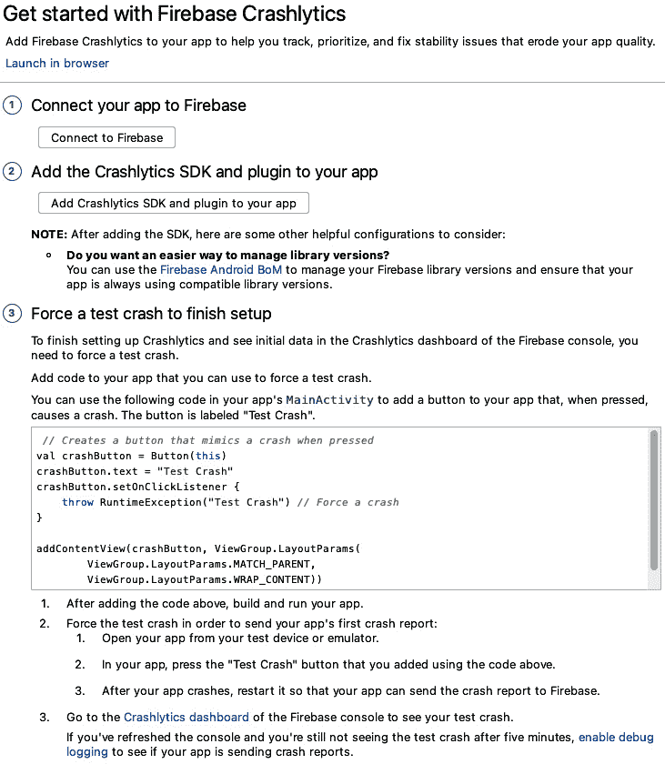
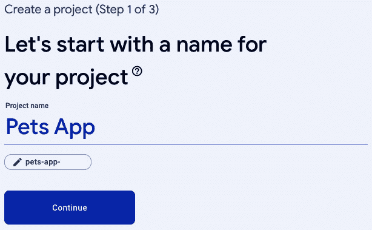
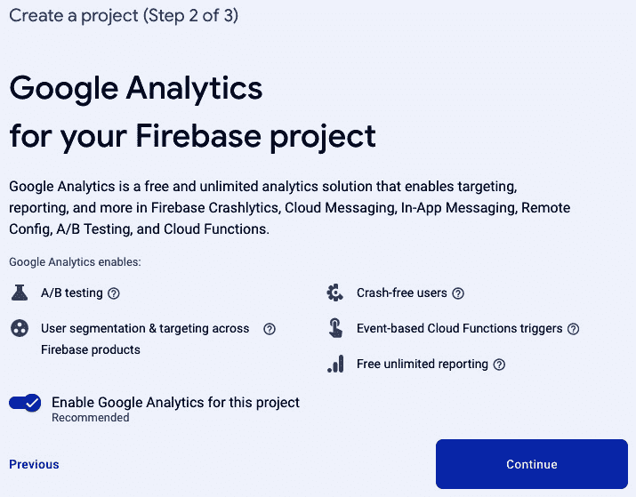
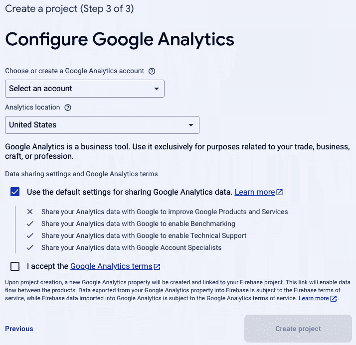
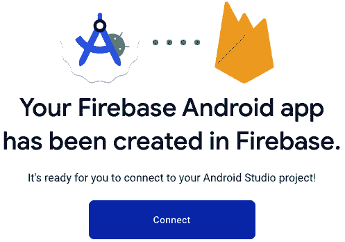
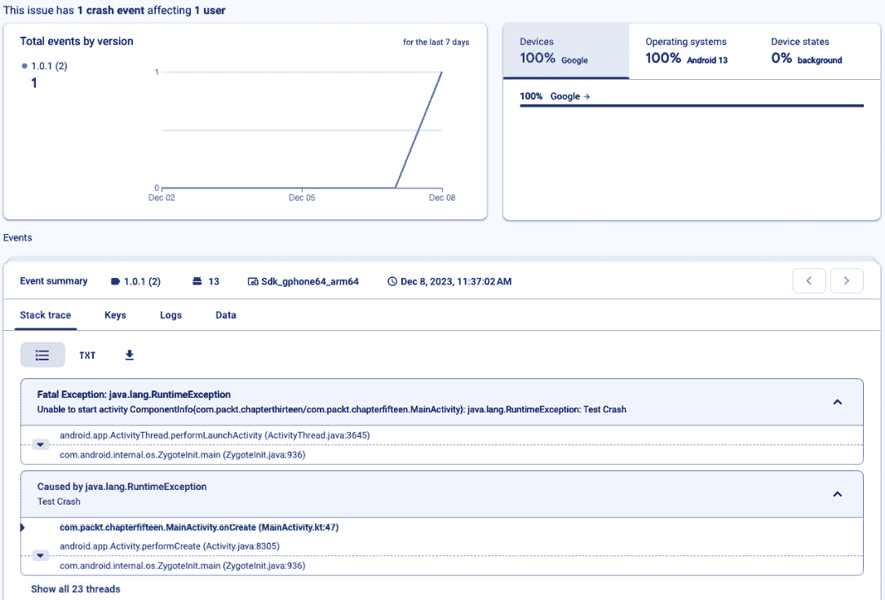
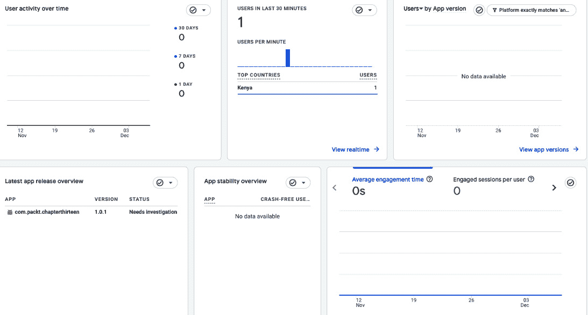
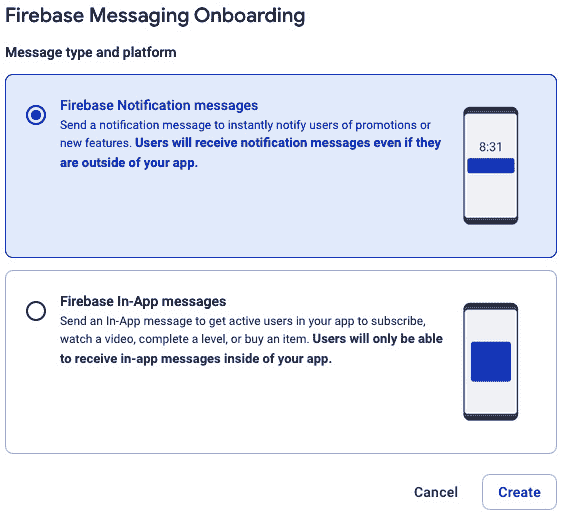
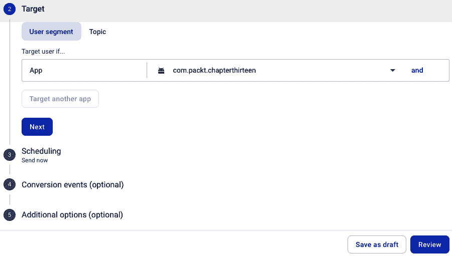
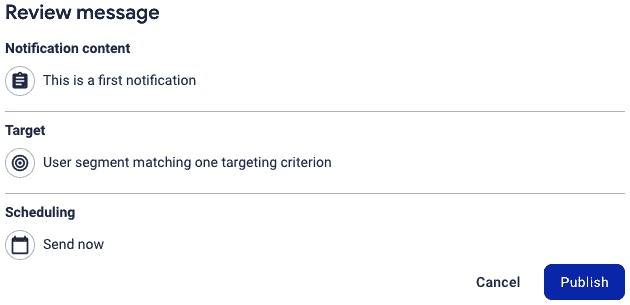

# 第十五章：提升应用

在我们完成应用的开发和发布后，在使用有助于改进我们应用的事物时，如 Firebase 消息传递或 Crashlytics，始终保持警觉是很重要的。在本章中，我们将学习如何使用 Firebase 消息传递和 Crashlytics。

在本章中，我们将逐步学习如何通过添加分析（Firebase Crashlytics）和使用云消息来提高用户参与度来改进我们的应用。我们将学习如何从 Firebase 控制台向我们的应用发送通知。此外，我们还将学习一些确保用户数据不受损害的应用安全技巧和窍门。

在本章中，我们将涵盖以下主要主题：

+   使用 Firebase Crashlytics 检测崩溃

+   使用 Firebase 消息传递提高应用参与度

+   保护您的应用

# 技术要求

要遵循本章中的说明，您需要下载 Android Studio Hedgehog 或更高版本（[`developer.android.com/studio`](https://developer.android.com/studio)）。

您可以使用上一章的代码来遵循本章的说明。您可以在 GitHub 上找到本章的代码，地址为 [`github.com/PacktPublishing/Mastering-Kotlin-for-Android/tree/main/chapterfifteen`](https://github.com/PacktPublishing/Mastering-Kotlin-for-Android/tree/main/chapterfifteen)。

# 使用 Firebase Crashlytics 检测崩溃

应用程序可能因多种原因发生崩溃，包括常见的编码问题，如空指针异常、内存泄漏和不正确的数据处理。由不同设备硬件配置和不同 Android 操作系统引起的设备碎片化可能会引入兼容性问题，有时也会导致崩溃。网络问题、资源不足或外部依赖（如第三方库）的管理不当也可能导致崩溃。有时，我们可以预见并优雅地处理它们。其他时候，它们是意外的，我们需要了解它们以便修复它们。我们的应用已经在 Google Play 商店上，所以有时我们可能没有在出现问题的设备上进行调试的奢侈。像 **Firebase Crashlytics** 这样的工具可以帮助我们检测应用中的崩溃，并提供我们修复它们所需的信息。在本节中，我们将设置 Firebase Crashlytics 到我们的应用中，并了解我们如何使用它来检测崩溃。

Android Studio 内置了 Firebase 工具，可以帮助我们快速将 Firebase 添加到我们的应用中。我们可以从 **工具** | **Firebase** 访问它，它应该会打开右侧的侧面板，如图下所示：


图 15.1 – Firebase 设置

如 *图 15.1* 所示，我们可以使用此工具设置各种 Firebase SDK。我们感兴趣的是设置 **Crashlytics**。点击 **Crashlytics** 选项，我们将看到以下选项：


图 15.2 – Firebase Crashlytics 配置

由于我们的项目是用 Kotlin 编写的，我们将选择**开始使用 Firebase Crashlytics**作为选项。这将打开一个新窗口，其中包含以下说明：



图 15.3 – 设置 Crashlytics 的步骤

如*图 15.3*所示，它提供了我们设置应用中 Firebase Crashlytics 所需的所有步骤。让我们点击**连接到 Firebase**选项。这将在我们浏览器中打开一个新的标签页，并显示 Firebase 控制台（见*图 15.4*）。它显示了我们在控制台上的所有 Firebase 项目（如果我们有任何）。使用**创建项目**选项并指定您首选的项目名称：



图 15.4 – 新的 Firebase 项目

点击**继续**进入下一步。这将带我们到以下屏幕：



图 15.5 – Google Analytics 设置

在此屏幕上，我们为我们的应用配置 Google Analytics。它还显示了 Google Analytics 为我们应用提供的功能。Google Analytics 收集我们应用的用法和行为数据。我们使用它来跟踪用户事件、系统事件或错误，分析应用性能，收集用户属性，如语言偏好和地理位置等。

点击**继续**进入下一步：



图 15.6 – 配置 Google Analytics

在此步骤中，我们为 Google Analytics 配置更多选项。我们必须选择一个 Google Analytics 账户。如果您已经配置了其他项目，选择默认账户将隐藏其他问题。完成后，点击**创建项目**以完成创建项目，您将看到以下对话框：



图 15.7 – 完成设置对话框

在我们的项目创建完成后点击**连接**，将使用 Android Studio 完成 Firebase Crashlytics 的设置。让我们回到 Android Studio 看看有什么变化。我们可以看到 Firebase Crashlytics 选项现在已被勾选：


图 15.8 – 应用已连接

下一步是将 Firebase Crashlytics SDK 添加到我们的应用中。我们可以通过点击**将 Crashlytics SDK 和插件添加到您的应用中**按钮来完成此操作。这将为我们应用添加必要的依赖项。您可以通过检查 Gradle 文件来查看这些更改。

所有步骤完成后，我们现在可以在`MainActivity.kt`文件中的`onCreate()`函数内添加以下代码：

```kt
throw RuntimeException("Test Crash")
```

现在，运行应用。应用将崩溃并显示以下堆栈跟踪：


图 15.9 – 崩溃堆栈跟踪

我们可以转到 Firebase 控制台中我们新创建的项目，看看是否已经报告了崩溃。在 Firebase 控制台中，Crashlytics 通常位于导航抽屉中的**发布和监控**部分，位于屏幕的左侧。它显示了以下屏幕：


图 15.10 – Firebase 控制台崩溃概述

我们可以看到崩溃已经被报告。我们可以点击`MainActivity.onCreate`崩溃来查看更多详细信息。它显示了以下屏幕：



图 15.11 – Firebase 控制台崩溃详情

如*图 15.10*所示，我们从 Firebase 控制台中获得了以下详细信息：

+   **堆栈跟踪**：这显示了崩溃的堆栈跟踪。

+   **设备**：这显示了崩溃发生的设备。我们可以看到设备型号、操作系统版本和设备状态。

+   **应用版本**：这显示了崩溃的应用版本。它还显示了该版本发生的总崩溃次数。

当调试崩溃时，这些信息非常有帮助。Android Studio Hedgehog 和更早的版本也提供了一个有用的工具，**App Quality Insights**，它可以帮助我们从 Android Studio 中直接查看 Firebase 崩溃。我们可以从底部的工具标签中访问它，如下所示：


图 15.12 – App Quality Insights

如*图 15.11*所示，我们需要登录到包含我们正在工作的项目的 Firebase 账户。我们可以通过点击**登录**按钮并在浏览器中完成登录过程来实现这一点。登录后，我们可以看到应用中发生的崩溃：


图 15.13 – App Quality Insights 崩溃详情

这显示了所有详细信息，正如我们在 Firebase 控制台中之前看到的。我们也可以看到堆栈跟踪。它的好处是我们可以轻松地导航到导致崩溃的文件和行，而无需切换上下文并转到浏览器。

在设置 Firebase Crashlytics 后，我们现在可以检测应用中的崩溃并修复它们。这将帮助我们提高应用的质量，并让我们的用户感到满意。

重要提示

记得从我们的应用中移除我们添加的强制崩溃的代码。

接下来，让我们设置**Firebase Analytics**，它也会收集有关我们应用的有用信息。这将帮助我们了解用户如何使用我们的应用，并帮助我们做出有关如何改进应用的明智决策。

## 设置 Google Analytics

设置 Google Analytics 与设置 Firebase Crashlytics 类似。重复您为 Firebase Crashlytics 执行的以下步骤：

1.  从**工具** | **Firebase**打开 Firebase 工具。

1.  从类似*图 15.1*中看到的选项列表中选择**Analytics**。

1.  选择**开始使用 Google Analytics**选项。

1.  由于我们的应用已经连接到 Firebase，我们可以跳过第一步，直接进行下一步。

1.  点击 **将分析添加到您的应用** 按钮以将必要的依赖项添加到我们的应用中。

1.  一旦 Gradle 同步完成，我们已经在应用中完成了 Firebase Analytics 的设置。

设置完成后，我们总是可以从 Firebase 控制台中查看分析。我们可以从导航抽屉中的 **分析** 部分访问它。它显示了以下屏幕：



图 15.14 – 应用分析

我们已经学习了如何在应用中设置 Firebase Crashlytics 和 Firebase Analytics。现在我们可以检测应用中的崩溃并收集有关应用的有用信息。这将帮助我们提高应用的质量，并让我们的用户满意。

在下一节中，我们将学习如何使用 Firebase Cloud Messaging 向我们的应用发送通知。

# 使用 Firebase 消息传递提高应用参与度

当用户安装我们的应用后，他们完成他们想要做的事情后可能不会再使用它。这可能导致活跃用户数量的下降，对不同应用的影响可能不同。

我们可以利用 **Firebase Cloud Messaging** 向用户发送通知，提醒他们使用我们的应用。这将帮助我们提高应用的参与度，并增加活跃用户数量。在本节中，我们将设置 Firebase Cloud Messaging 到我们的应用中，并查看我们如何使用它向应用用户发送通知。

首先，我们需要在我们的应用上设置 Firebase Cloud Messaging SDK。这允许我们在项目中使用 SDK，并在设置完成后使我们的应用能够接收 Firebase 通知。我们将以与 Firebase Crashlytics 和 Firebase Analytics 相同的方式进行操作。重复以下步骤：

1.  从 **工具** | **Firebase** 打开 Firebase 工具。

1.  从类似于我们在 *图 15.1* 中看到的选项列表中选择 **云消息传递**。

1.  选择 **设置 Firebase 云消息传递** 选项。

1.  由于我们的应用已经连接到 Firebase，我们可以跳过第一步，直接进行下一步。

1.  点击 **将 FCM 添加到您的应用** 按钮以将必要的依赖项添加到应用中。

1.  一旦 Gradle 同步完成，FCM SDK 已经在我们的应用中设置好了。

我们需要创建一个新的服务来处理接收到的通知，并获取设备令牌。让我们创建一个新的包，命名为 `firebase`。在这个包内部，让我们创建一个新的文件，命名为 `FirebaseMessagingService.kt`。这将是我们处理接收到的通知的服务。

让我们添加以下代码：

```kt
class FirebaseNotificationService: FirebaseMessagingService() {
    override fun onNewToken(token: String) {
        super.onNewToken(token)
        Log.d("Firebase Token", token)
    }
    override fun onMessageReceived(remoteMessage: RemoteMessage) {
        super.onMessageReceived(remoteMessage)
        sendNotification(remoteMessage)
    }
    private fun sendNotification(remoteMessage: RemoteMessage) {
        val notification = NotificationCompat.Builder(applicationContext, "Pets Apps")
            .setContentTitle(remoteMessage.notification?.title)
            .setTicker(remoteMessage.notification?.ticker)
            .setContentText(remoteMessage.notification?.body)
            .setContentInfo(remoteMessage.notification?.body)
             .setStyle(NotificationCompat.BigTextStyle().bigText(remoteMessage.notification?.body))
            .setSmallIcon(R.drawable.ic_launcher_background)
        if (Build.VERSION.SDK_INT >= Build.VERSION_CODES.O) {
            createChannel(notification, "Pets Apps")
        }
    }
    @RequiresApi(Build.VERSION_CODES.O)
    private fun createChannel(notificationBuilder: NotificationCompat.Builder, id: String) {
        notificationBuilder.setDefaults(Notification.DEFAULT_VIBRATE)
        val channel = NotificationChannel(
            id,
            "Pets Apps",
            NotificationManager.IMPORTANCE_HIGH
        )
        channel.description = "Pets Apps"
        val notificationManager: NotificationManager =
            getSystemService(Context.NOTIFICATION_SERVICE) as NotificationManager
        notificationManager.createNotificationChannel(channel)
    }
}
```

以下是对前面代码的分解：

+   我们创建了一个名为 `FirebaseNotificationService` 的类，它扩展了 `FirebaseMessagingService`。这是处理接收到的通知的服务。

+   我们重写了`onNewToken()`函数。当生成新令牌时，会调用此函数。我们可以使用此令牌向我们的应用发送通知。我们添加了一个日志消息来记录令牌到我们的 Logcat。或者，如果我们有这样的需求，我们可以将令牌发送到我们的后端服务器，用于向我们的应用发送通知。

+   我们重写了`onMessageReceived()`函数。当接收到通知时，会调用此函数。我们调用了`sendNotification()`函数，并将`RemoteMessage`对象传递给它。

+   `sendNotification()`函数创建一个通知并将其显示给用户。我们使用了`NotificationCompat.Builder`类来创建通知。我们还使用了`RemoteMessage`对象来获取通知的`标题`、`正文`和`提示符`。我们还设置了一个用于通知的小图标。此外，如果设备运行在 Android Oreo 或更高版本，我们还设置了通知渠道。

+   最后，我们创建了`createChannel()`函数，该函数使用`NotificationChannel`类创建通知渠道。我们还设置了渠道描述和渠道的重要性。此外，我们还设置了渠道的默认振动。最后，我们创建了通知管理器，并使用它来创建渠道。

服务创建后，我们需要在`AndroidManifest.xml`文件中注册它。让我们向其中添加以下代码：

```kt
<service
    android:name=".firebase.FirebaseNotificationService"
    android:exported="false">
    <intent-filter>
        <action android:name="com.google.firebase.MESSAGING_EVENT" />
    </intent-filter>
</service>
```

服务注册完成后，我们现在可以在我们的应用中接收通知。运行带有最近更改的应用。

接下来，让我们通过从 Firebase 控制台发送通知来测试这个功能。我们可以通过访问 Firebase 控制台，并在导航抽屉中选择**云消息**选项（位于**参与**类别中）来完成此操作。它显示了以下屏幕：


图 15.15 – Firebase 云消息登录页面

这是第一次使用云消息，因此我们需要创建一个新的活动。点击**创建您的第一个活动**按钮。这将打开一个包含以下选项的新对话框：



图 15.16 – Firebase 云消息选项

我们可以发送**Firebase 通知消息**或**Firebase 应用内消息**。Firebase 通知旨在让用户在应用外接收消息，即使我们的应用处于非活动状态，也能通过推送通知传递消息。相比之下，Firebase 应用内消息旨在通过在应用界面内直接显示内容来吸引正在积极使用我们的应用的用户。Firebase 通知适用于发送及时更新或促销，而应用内消息对于传递上下文内容并增强我们应用内的用户体验非常有效。我们对**Firebase 通知消息**感兴趣。选择**Firebase 通知消息**选项并点击**创建**。这会带我们到以下屏幕：


图 15.17 – 创建新的通知

在此屏幕上，我们添加通知的标题和文本。一旦填写了这些详细信息，点击**下一步**以进入下一步：



图 15.18 – 目标和调度设置

如*图 15.17*所示，我们为我们的通知设置了目标应用。在这种情况下，它是我们在本章*使用 Firebase Crashlytics 检测崩溃*部分中较早创建的应用。然后我们为我们的通知设置了调度。我们将调度设置设置为**立即发送**。点击**查看**按钮，它将显示包含我们已设置信息的对话框：



图 15.19 – 查看消息对话框

点击**发布**按钮以发布通知。这将向我们的应用发送通知。我们现在可以从我们的应用中看到通知：


图 15.20 – 第一条通知

重要提示

确保您始终使用真实设备进行测试，以查看您的通知。

我们学习了如何在应用中设置 Firebase 云消息以及如何向其发送通知。在下一节中，我们将介绍另一个关键主题——保护我们的应用。

# 保护您的应用

确保您的应用安全尤其重要。我们需要确保我们的用户数据安全。我们还需要确保我们的应用不受攻击。如恶意软件、中间人攻击和数据拦截等攻击对敏感信息构成风险，而如 SQL 注入和权限提升等漏洞可能导致对数据库或应用功能的未授权访问和操纵。跨站脚本和代码注入为攻击者提供了在应用内执行恶意脚本或命令的途径，可能危及用户会话和数据。不安全的数据存储实践可能会泄露敏感信息，而拒绝服务攻击可能会中断应用服务。

在本节中，我们将看到一些关于如何保护我们的应用程序的技巧和窍门。以下是我们可以采取的一些措施来保护我们的应用程序：

+   对于我们所有的网络请求使用`HTTPS`，这为我们的应用程序添加了一个额外的安全层。

+   **代码精简和混淆**：我们应该始终精简和混淆我们的代码，以使攻击者更难逆向工程我们的应用程序。我们已经在*第十三章*中为我们的发布构建做了这件事。

+   **加密**：我们应该始终加密我们存储在应用程序中的敏感数据。

+   **密码和私钥**：永远不要在 Shared Preferences 中存储密码和私钥。我们可以始终将它们存储在其他安全的替代方案中，例如用于存储加密密钥的 Android Keystore 系统。

+   **最小化日志信息**：我们应该始终最小化我们记录的信息。我们永远不应该记录敏感信息，如密码和私钥。

+   **内部存储**：我们应该始终使用内部存储来存储敏感数据。这是因为内部存储仅对我们应用程序是私有的，其他应用程序无法访问它。

+   **WebView**：我们使用 WebView 在我们的应用程序中显示网页内容。这可能会在我们的应用程序中引入安全问题，因此在使用 WebView 时我们应该小心。

+   **依赖项**：我们应该始终保持所有依赖项的最新状态。这是因为依赖项的新版本可能包含我们需要应用到我们的应用程序中的安全修复。我们使用如 Dependabot（[`github.com/dependabot`](https://github.com/dependabot)）这样的工具来自动更新依赖项。

+   **模拟器或 rooted 设备**：对于支付或银行应用程序，确保它们在模拟器或 rooted 设备上不工作。在模拟器和 rooted 设备上，很容易更改您的代码或查看发送到服务器或存储在我们应用程序中的数据。这可能导致安全问题。

+   **权限**：我们应该始终在我们的应用程序中使用必要的权限。我们不应该使用我们不需要的权限。这是因为权限可以用来访问我们应用程序中的敏感数据。

在您开发应用程序时，始终牢记安全性。这将帮助您确保您的应用程序是安全的，并且您的用户数据是安全的。您可以从官方 Android 文档中了解更多关于 Android 安全的信息：[`developer.android.com/privacy-and-security/security-tips`](https://developer.android.com/privacy-and-security/security-tips)。

# **总结**

在本章中，我们学习了通过添加分析（在这种情况下，是 Firebase Crashlytics）来改进我们的应用程序的技术，以及如何使用云消息来增加我们应用程序的用户参与度。此外，我们还学习了关于保护我们应用程序的一些技巧和窍门。

我们已经到达了本章和本书的结尾。我们希望您喜欢跟随章节，并且现在您已经具备了从本书中获得的知识来开发 Android 应用程序。下一步是什么？以下是一些您可以做的事情：

+   使用本章中介绍的小技巧和安全建议来保护您的应用。

+   检查、改进和监控您应用的性能。您可以从官方文档中了解更多信息，文档地址为 [`developer.android.com/topic/performance/overview`](https://developer.android.com/topic/performance/overview)。

+   了解更多关于**现代安卓开发**（**MAD**）的信息。MAD 是一套工具和库，帮助我们更快、更好地开发安卓应用。您可以从官方文档中了解更多关于 M.A.D 的信息，文档地址为 [`developer.android.com/modern-android-development`](https://developer.android.com/modern-android-development)。

+   了解更多关于 Google Play Vitals 以及如何使用 [`play.google.com/console/about/vitals/`](https://play.google.com/console/about/vitals/) 上的信息来提升您应用的质量。

+   继续学习 Kotlin 和 Android。构建更多应用并与世界分享。您还可以为开源项目做出贡献。
