# 第一章. 使用 Swift 的第一步

自从我 12 岁时用基本编程语言编写我的第一个程序以来，编程一直是我的一项热情。即使编程成为了我的职业，它始终更多的是一种热情，而不是工作，但过去几年，这种热情已经减弱。我不确定为什么我会失去这种热情。我试图通过一些我的副项目来重新找回它，但没有什么真正能让我找回曾经拥有的那种兴奋。然后，发生了一件美妙的事情！苹果宣布了 Swift。Swift 是如此令人兴奋且进步的语言，它重新激发了许多那种热情，并让我再次享受编程的乐趣。

在本章中，你将学习：

+   什么是 Swift

+   Swift 的一些特性

+   什么是游乐场

+   如何使用游乐场

+   Swift 语言的基本语法是什么

# 什么是 Swift？

Swift 是苹果在 2014 年的全球开发者大会（WWDC）上推出的新编程语言，与 Xcode 6 和 iOS 8 一起推出。Swift 可以说是 WWDC 2014 上最具影响力的公告，在此之前，包括苹果内部人士在内的很少有人知道这个项目的存在。

即使按照苹果的标准来看，他们能够将 Swift 保密这么长时间，而且没有人怀疑他们将要宣布一种新的开发语言，这本身就是令人难以置信的。在 2015 年的 WWDC 上，苹果再次引起轰动，当他们宣布了 Xcode 7 和 Swift 2。Swift 2 是 Swift 语言的重大增强。在这次会议上，克里斯·拉特纳表示，许多增强都是基于苹果从开发社区直接收到的反馈。

Swift 可以被看作是使用现代概念和安全编程模式重新构思的 Objective-C。用苹果自己的话说，Swift 就是没有 C 的 Objective-C。Swift 的创造者克里斯·拉特纳说，Swift 从 Objective-C、Rust、Haskell、Ruby、Python、C#、CLU 以及太多其他语言中汲取了语言理念。在 2014 年的 WWDC 上，苹果强调 Swift 默认是安全的。Swift 被设计用来消除许多常见的编程错误，使应用程序更加安全，更不容易出现错误。Swift 2 为语言增加了两个额外的核心功能——可用性和错误处理，这些功能旨在使编写安全代码变得更加容易。

Swift 的发展始于 2010 年，由克里斯发起。他仅用少数人意识到其存在的情况下，实现了大部分基本语言结构。直到 2011 年晚些时候，其他开发者才开始真正为 Swift 做出贡献，并在 2013 年 7 月，它成为了苹果开发者工具组的主要关注点。

克里斯于 2005 年夏天开始在苹果公司工作。他在开发者工具组中担任过多个职位，目前是该组的总监和架构师。在他的主页（[`www.nondot.org/sabre/`](http://www.nondot.org/sabre/））上，他提到 Xcode 的 Playgrounds（本章稍后将对 Playgrounds 进行更多介绍）成为了他个人的热情所在，因为它使编程更加互动和易于接近。本书中将大量使用 Playgrounds 作为测试和实验平台。

Swift 和 Objective-C 之间有很多相似之处。Swift 采用了 Objective-C 的命名参数和动态对象模型的可读性。当我们说 Swift 拥有动态对象模型时，我们指的是类型在运行时可以改变的能力。这包括添加新的（自定义）类型以及修改/扩展现有类型。

Swift 还提供了对现有 Cocoa 和 Cocoa Touch 框架的无缝访问。这使得 Objective-C 开发者在开始学习 Swift 时感到一定的熟悉感，因为这些框架与 Objective-C 的功能方式与它们与 Swift 的功能方式相同。

虽然 Swift 和 Objective-C 之间有很多相似之处，但它们之间也存在一些显著的区别。Swift 的语法和格式与 Python 相比更接近，但苹果公司仍然保留了花括号。我知道 Python 的人可能会不同意我，这完全可以，因为我们都持有不同的观点，但我喜欢花括号。Swift 实际上要求控制语句（如 `if` 和 `while`）使用花括号，这消除了像苹果 SSL 库中的 `goto fail` 这样的错误。

Swift 还被设计成快速。在 2014 年的 WWDC 上，苹果展示了一系列基准测试，证明了 Swift 在性能上显著优于 Objective-C。Swift 使用 LLVM 编译器，该编译器包含在 Xcode 7 中，将 Swift 代码转换为高度优化的本地代码，以充分利用苹果的现代硬件。

如果你是一名 iOS 或 OS X 开发者，并且你仍然没有确信学习 Swift 是一个好主意，那么苹果 Swift 页面（[https://developer.apple.com/swift/](https://developer.apple.com/swift/））上的这一段话可能会帮助你信服：

> *"Swift 是 C 和 Objective-C 语言的继承者。它包括低级原语，如类型、流程控制和运算符。它还提供了面向对象的功能，如类、协议和泛型，为 Cocoa 和 Cocoa Touch 开发者提供了他们所需求的高性能和强大功能。"*

那段话的第一行，说 Swift 是 C 和 Objective-C 语言的继承者，是最重要的一行。这一行和其他苹果公司的文档告诉我们，苹果公司认为 Swift 语言是其未来的应用程序和系统编程语言。虽然 Objective-C 在不久的将来不会消失，但它听起来在不久的将来将让位给 Swift。

## Swift 功能

当苹果公司说 Swift 是没有 C 的 Objective-C 时，他们实际上只告诉我们了一半的故事。Objective-C 是 C 的超集，并为 C 语言提供了面向对象的能力和动态运行时。这意味着苹果公司需要与 C 语言保持兼容性，这限制了它对 Objective-C 语言的增强。例如，苹果公司不能改变 `switch` 语句的功能，同时还要保持与 C 的兼容性。

由于 Swift 不需要像 Objective-C 那样保持相同的 C 兼容性，苹果公司可以自由地向语言添加任何功能/增强。这使得苹果公司能够包含当今许多最受欢迎和现代语言的最佳功能，例如 Objective-C、Python、Java、Ruby、C#、Haskell 以及许多其他语言。

以下图表显示了 Swift 包含的一些最令人兴奋的增强功能列表：

| Swift 功能 | 描述 |
| --- | --- |
| 类型推断 | Swift 可以根据初始值自动推断变量或常量的类型。 |
| 泛型 | 泛型允许我们只编写一次代码，为不同类型的对象执行相同任务。 |
| 集合可变性 | Swift 没有为可变或不可变容器提供单独的对象。相反，你通过定义容器为常量或变量来定义可变性。 |
| 闭包语法 | 闭包是包含功能性的自包含块，可以在我们的代码中传递和使用。 |
| 可选类型 | 可选类型定义了一个可能没有值的变量。 |
| Switch 语句 | Switch 语句得到了大幅改进。这是我最喜欢的改进之一。 |
| 多重返回类型 | 函数可以使用元组来拥有多个返回类型。 |
| 运算符重载 | 类可以提供现有运算符的自己的实现。 |
| 带关联值的枚举 | 在 Swift 中，我们可以使用枚举做很多不仅仅是定义一组相关值的事情。 |

在前面的图表中，我没有提到的一个功能是因为它从技术上讲不是 Swift 的功能；它是 Xcode 和编译器的功能。这个功能是 **混合匹配**，它允许我们创建包含 Objective-C 和 Swift 文件的应用程序。它还允许我们系统地使用 Swift 类更新当前的 Objective-C 应用程序，并在我们的 Swift 应用程序中使用当前的 Objective-C 库/框架。

### 小贴士

混合匹配让 Objective-C 和 Swift 文件可以在同一个项目中共存。这允许我们开始使用 Swift，而无需丢弃现有的 Objective-C 代码库或项目。

在我们开始探索 Swift 开发的奇妙世界之前，让我们绕道访问一个自从我还是个孩子就喜欢的地点——操场。

# Playgrounds

当我还是个孩子的时候，学校一天中最美好的时光就是去操场。我们玩什么并不重要；只要我们在操场上，我就知道那会很有趣。当苹果公司在 Xcode 6 中引入 Playgrounds 作为其一部分时，单是这个名字就让我兴奋不已，但我怀疑苹果能否让它的 Playgrounds 和我童年的操场一样有趣。虽然苹果的 Playgrounds 可能不如我 9 岁时踢足球那么有趣，但它确实让实验和代码玩耍变得很有趣。

## 开始使用 Playgrounds

Playgrounds 是交互式的工作环境，让我们能够编写代码并立即看到结果。随着代码的更改，结果也会实时更改。这意味着 Playgrounds 是学习和实验 Swift 的绝佳方式。

Playgrounds 还使得尝试新的 API、原型化新的算法以及展示代码的工作方式变得极其简单。我们将在这本书中使用 Playgrounds 来展示我们的示例代码是如何工作的。因此，在我们真正开始 Swift 开发之前，让我们花些时间学习和熟悉 Playgrounds。

如果现在 Swift 代码看起来没有太多意义，请不要担心，随着我们阅读本书，这段代码将会变得有意义。我们只是现在试图对 Playgrounds 有一个感觉。

一个 Playgrounds 可以有多个部分，但在这本书中我们将使用的是以下三个：

+   **编码区域**：这是你输入 Swift 代码的地方。

+   **结果侧边栏**：这是显示你代码结果的地方。每次你输入一行新代码时，结果都会重新评估，并且结果侧边栏会更新为新结果。

+   **调试区域**：这个区域显示代码的输出，这对于调试非常有用。

下面的截图显示了 Playgrounds 中部分的排列方式：

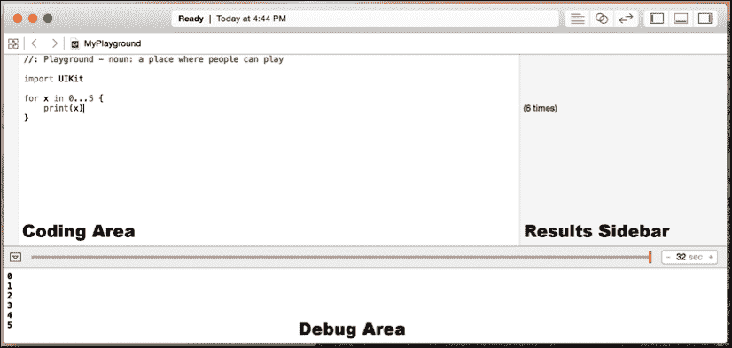

让我们开始一个新的 Playgrounds。我们首先需要做的是启动 Xcode。一旦 Xcode 启动，我们可以选择**开始使用 Playgrounds**选项，如下面的截图所示：

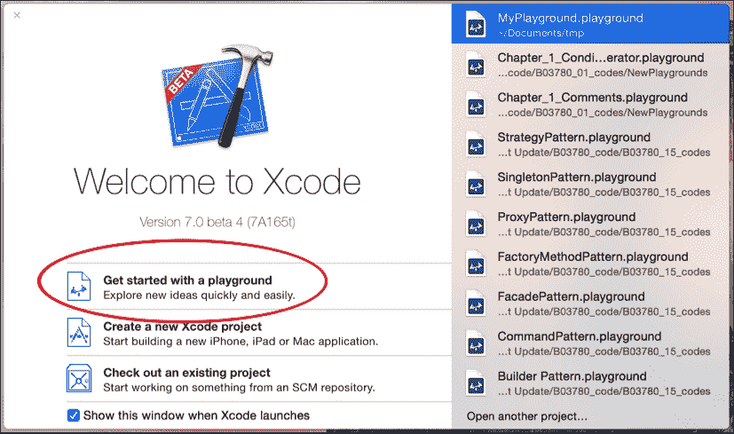

或者，我们可以通过从顶部菜单栏的**文件** | **新建**进入 Playgrounds，如下面的截图所示：

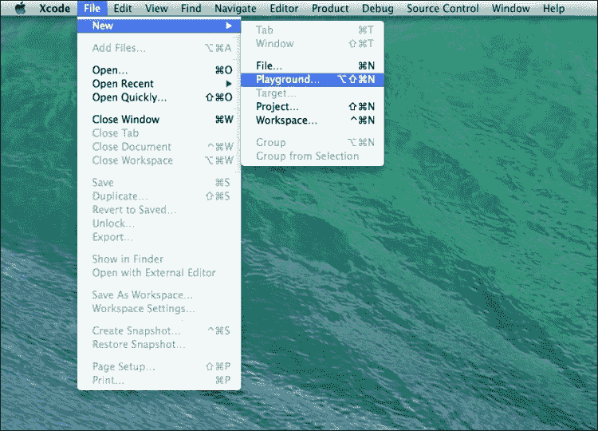

接下来，我们应该看到一个类似于以下截图的屏幕，允许我们命名我们的 Playgrounds 并选择它是一个**iOS**还是**OS X** Playgrounds。

在这本书的大部分示例中，除非另有说明，否则可以安全地假设你可以选择**iOS**或**OS X**：

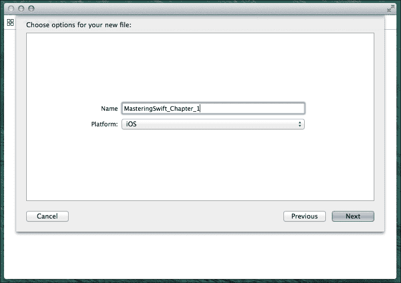

最后，我们会询问保存 Playground 的位置。在选择了位置之后，Playground 将打开并看起来类似于以下屏幕截图：

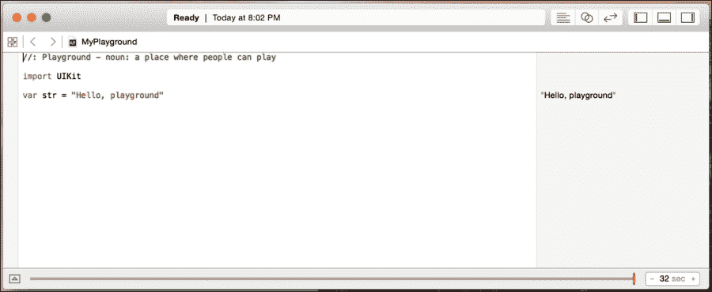

在前面的屏幕截图中，我们可以看到 Playground 的编码区域看起来与 Xcode 项目的编码区域相似。这里不同的是右侧的侧边栏。这个侧边栏是我们代码结果显示的地方。前一个屏幕截图中的代码导入了 iOS 的 UIKit 框架，并将一个名为`str`的变量设置为字符串`Hello, playground`。你可以在代码右侧的侧边栏中看到`str`字符串的内容。

默认情况下，新的 Playground 不会打开调试区域。你可以通过同时按下*shift* + *command* + *Y*键来手动打开它。在章节的后面，我们将看到为什么调试区域如此有用。

## iOS 和 OS X Playgrounds

当你启动一个新的 iOS Playground 时，Playground 会导入 UIKit（Cocoa Touch）。这使我们能够访问为 iOS 应用程序提供核心基础设施的 UIKit 框架。当我们启动一个新的 OS X Playground 时，Playground 会导入 Cocoa。这使我们能够访问 OS X Cocoa 框架。

最后一段的意思是，如果我们想实验 UIKit 或 Cocoa 的特定功能，我们需要打开正确的 Playground。例如，如果我们有一个 iOS Playground 打开，并且我们想创建一个表示颜色的对象，我们会使用一个`UIColor`对象。如果我们有一个 OS X playground 打开，我们会使用一个`NSColor`对象来表示颜色。

## 在 Playground 中显示图片

正如你将在整本书中看到的那样，Playgrounds 擅长在结果侧边栏中以文本形式显示代码的结果。然而，它们还能做很多不仅仅是文本的事情，比如图片、图表和显示视图。让我们看看如何在 Playground 中显示一个图片。首先，我们需要做的是将图片加载到 Playground 的资源目录中。

以下步骤展示了如何将图片加载到资源目录中：

1.  让我们从显示项目导航器侧边栏开始。要做到这一点，在顶部菜单栏中，导航到**视图** | **导航器** | **显示项目导航器**或使用*command* + *1*键盘快捷键。项目导航器看起来像这样：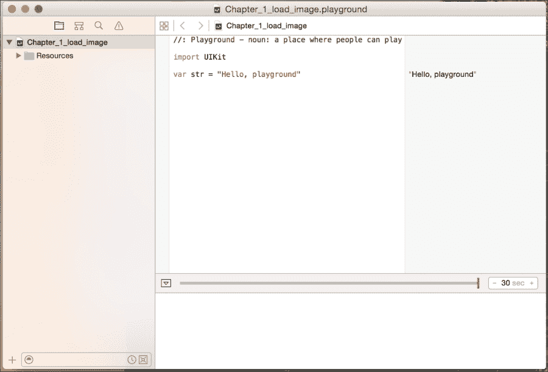

1.  一旦我们打开了项目导航器，我们可以将图片拖入`Resources`文件夹，这样我们就可以在代码中访问它。一旦我们将图片文件拖到上面并放下，它就会出现在`Resources`文件夹中，如图所示：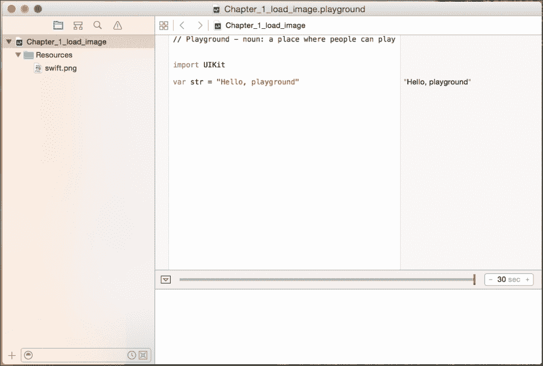

1.  现在，我们可以访问代码中 `Resources` 文件夹内的图片。以下截图显示了如何进行操作。我们使用来访问图片的实际代码在此阶段并不那么重要，重要的是要知道如何在沙盒中访问资源：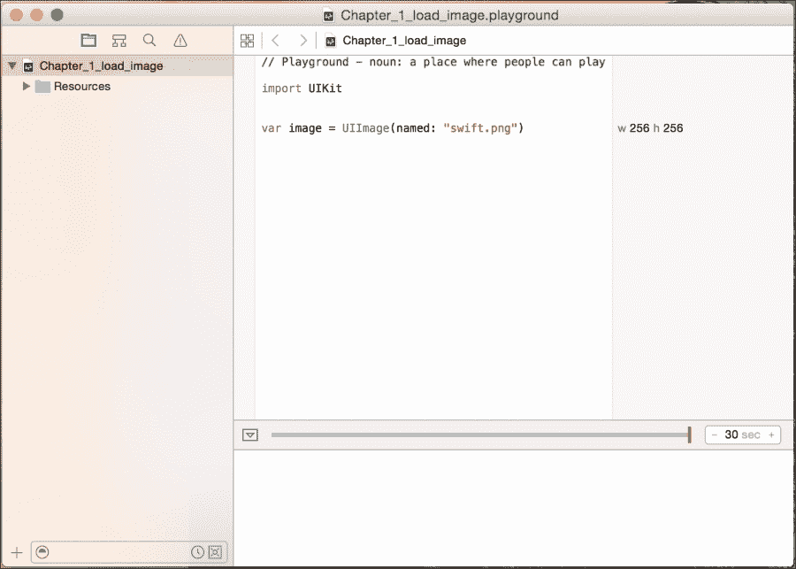

1.  要查看图片，我们需要将鼠标光标悬停在结果侧边栏中显示图片宽度和高度的章节上。在我们的例子中，宽度和高度部分显示为 **w 256 h 256**。一旦我们将鼠标指针悬停在宽度和高度上，我们应该看到两个符号，如下面的截图所示：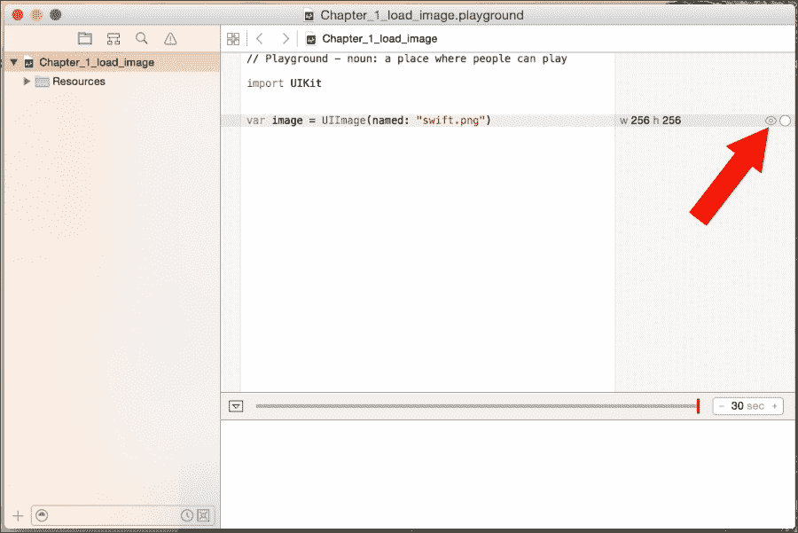

1.  我们可以按任意一个符号来显示图片。形状像带加号的圆圈的符号将在沙盒的代码部分显示图片，而看起来像眼睛的符号则会在沙盒外部弹出图片。以下截图显示了按下带加号的圆圈时显示的内容：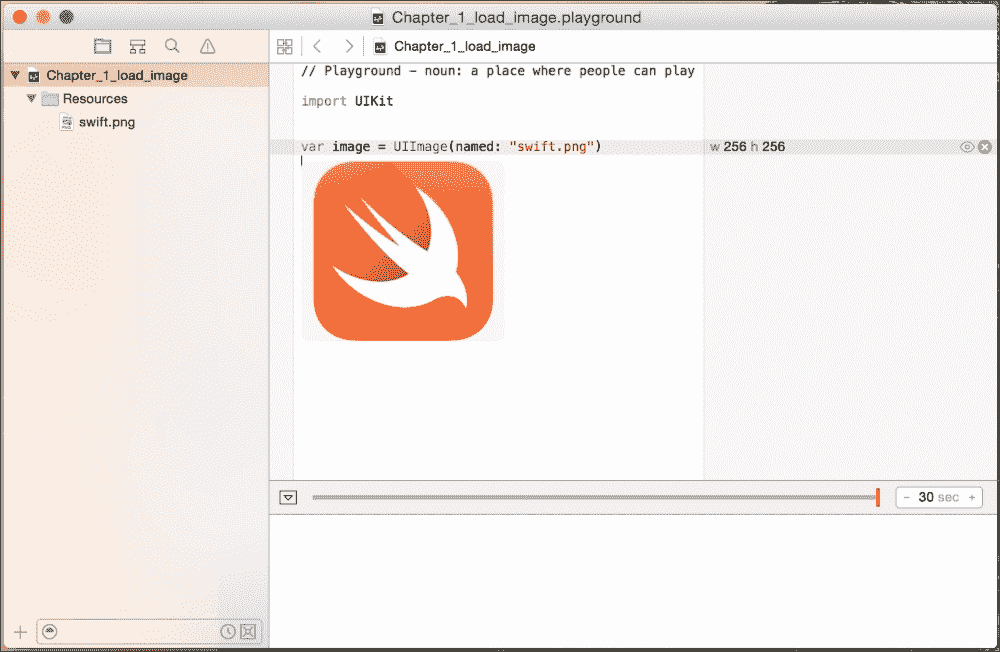

当我们想要看到代码的进展时，能够创建和显示图表非常有用。让我们看看如何在沙盒中创建和显示图表。

## 在沙盒中创建和显示图表

我们还可以在时间上绘制数值变量的值。当我们在原型设计新算法时，这个特性非常有用，因为它允许我们查看变量在整个计算过程中的值。

要了解图表是如何工作的，请查看以下沙盒：

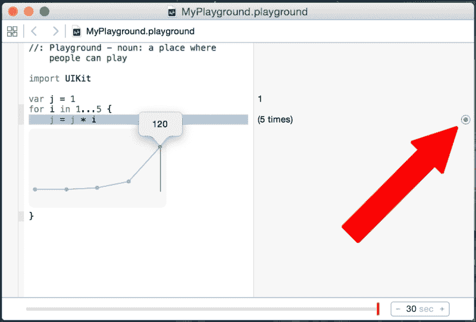

在这个沙盒中，我们将变量 `j` 设置为 `1`。接下来，我们创建一个 `for` 循环，将数字 `1` 到 `5` 分配给变量 `i`。在 `for` 循环的每个步骤中，我们将变量 `j` 的值设置为当前 `j` 的值乘以 `i`。图表显示了 `for` 循环每个步骤中变量 `j` 的值。我们将在本书的后面详细讲解 `for` 循环。

要显示图表，请点击形状像带点的圆圈的符号。然后我们可以移动时间轴滑块来查看变量 `j` 在 `for` 循环的每个步骤的值。

## 什么是沙盒不是

我们可以用沙盒做很多事情，而我们在这里的快速介绍中只是触及了皮毛。随着我们继续阅读本书，我们将几乎在所有示例代码中使用沙盒，并展示沙盒的其他功能，正如它们被使用时一样。

在我们结束这个简短的介绍之前，让我们看看沙盒不是什么，这样我们就可以了解何时不使用沙盒：

+   沙盒不应该用于性能测试：在沙盒中运行的任何代码的性能并不能代表代码在项目中的运行速度

+   Playgrounds 不支持用户交互：用户不能与在 Playground 中运行的代码进行交互

+   Playgrounds 不支持设备上的执行：你不能将 Playground 中存在的代码作为外部应用程序或在外部设备上运行

## Swift 语言语法

如果你是一个 Objective-C 开发者，并且你对现代语言如 Python 或 Ruby 不熟悉，那么之前截图中的代码可能看起来相当奇怪。Swift 语言的语法与基于 Smalltalk 和 C 的 Objective-C 有很大的不同。

Swift 语言使用非常现代的概念和语法来创建非常简洁和可读的代码。还非常强调消除常见的编程错误。在我们深入了解 Swift 语言本身之前，让我们看看 Swift 语言的一些基本语法。

## 注释

在 Swift 代码中编写注释与在 Objective-C 代码中编写注释略有不同。我们仍然使用双斜杠`//`进行单行注释，使用`/*`和`*/`进行多行注释。

发生变化的是我们如何记录参数和返回值。要记录任何参数，我们使用`:parm:`字段，而对于返回值，我们使用`:return:`字段。

下面的 Playground 展示了如何正确注释函数的示例，包括单行和多行注释：

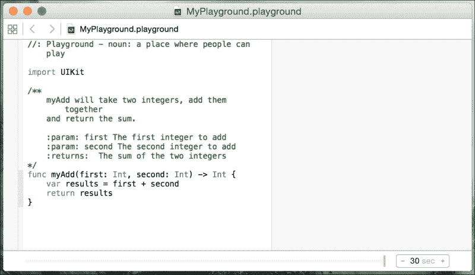

要编写好的注释，我建议在函数内部使用单行注释，以快速给出代码的一行解释。然后我们将使用函数和类外部多行注释来解释函数和类的作用。前面的 Playground 展示了注释的良好使用。通过使用适当的文档，就像我们在前面的截图中所做的那样，我们可以在 Xcode 中使用文档功能。如果我们按住*option*键然后点击代码中的任何地方的功能名，Xcode 将显示一个弹出窗口，显示函数的描述。

下一个截图显示了该弹出窗口可能看起来类似的样子：

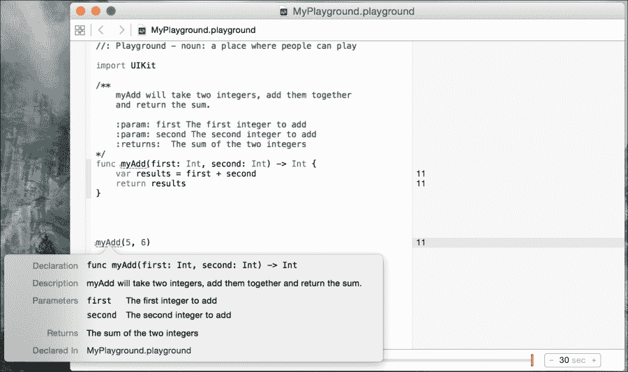

这张截图显示了如果我们按住`option`键然后点击`myAdd()`方法，Xcode 的文档功能。我们可以看到文档包含五个字段。这些字段是：

+   **声明**：这是函数的声明

+   **描述**：这是函数在注释中出现的描述

+   **参数**：参数描述在注释部分以`:param:`标签开头

+   **返回**：返回描述在注释部分以`:return:`标签开头

+   **声明于**：这是函数声明的文件，这样我们就可以轻松找到它

## 分号

你可能已经注意到了，到目前为止的代码示例中，我们没有在行尾使用分号。在 Swift 中，分号是可选的；因此，以下 Playground 中的两行在 Swift 中都是有效的。你可以在结果侧边栏中看到代码的结果，如下面的截图所示：

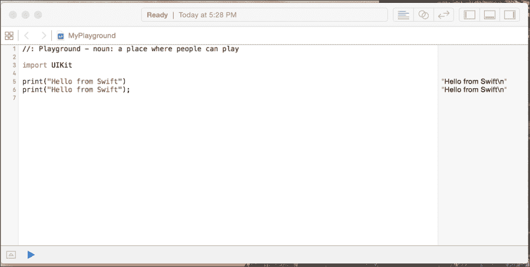

为了风格上的考虑，强烈建议你在 Swift 代码中不要使用分号。如果你真的想在代码中使用分号，那么请保持一致性，并在每一行代码中使用它们；然而，Swift 不会警告你如果忘记了分号。我再次强调，建议你在 Swift 中不要使用分号。

## 括号

在 Swift 中，条件语句周围的括号是可选的，例如，以下 Playground 中的两个 `if` 语句都是有效的。你可以在侧边栏中看到代码的结果，如下面的截图所示：

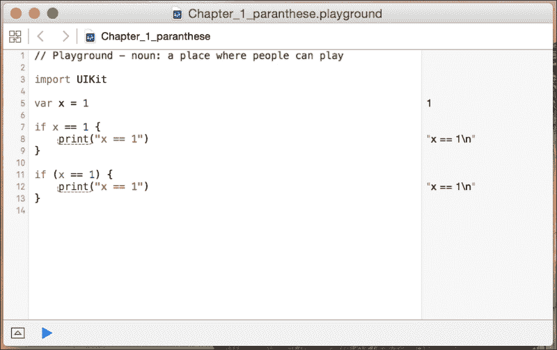

为了风格上的考虑，建议你除非在同一行上有多个条件语句，否则不要在代码中包含括号。为了可读性，将括号放在同一行上的单个条件语句周围是一个好的做法。

请参阅以下 Playground 中的示例：

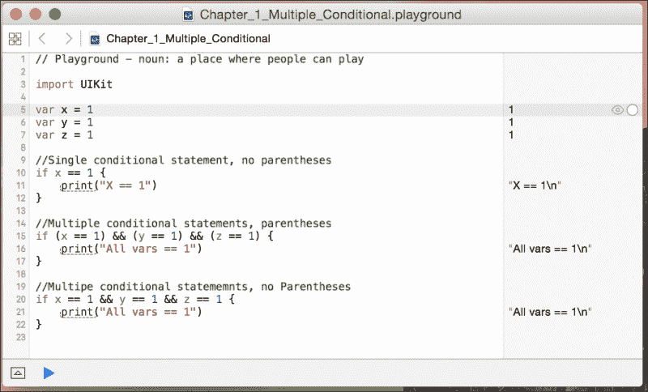

## 大括号

在 Swift 中，与大多数其他语言不同，语句后面需要大括号。这是 Swift 中内置的安全特性之一。可以说，如果开发者使用了大括号，可能已经避免了无数的安全漏洞。一个很好的例子是苹果的 `goto fail` 漏洞。这些漏洞也可以通过其他方式预防，例如单元测试和代码审查，但在我看来，要求开发者使用大括号是一个好的安全标准。

以下 Playground 显示了如果你忘记包含大括号会得到什么错误：

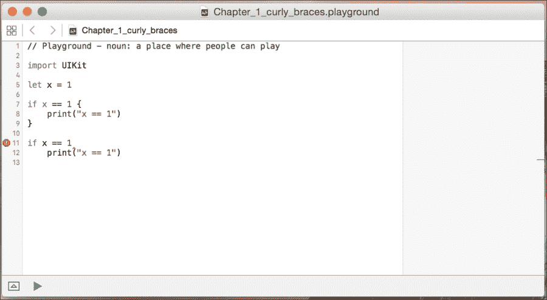

## 赋值运算符不返回值

在大多数其他语言中，以下代码行是有效的，但这可能不是开发者想要执行的操作：

```swift
if (x = 1) {}
```

### 小贴士

**下载示例代码**

你可以从你购买的所有 Packt 出版物书籍的账户中下载示例代码文件。[`www.packtpub.com`](http://www.packtpub.com)。如果你在其他地方购买了这本书，你可以访问 [`www.packtpub.com/support`](http://www.packtpub.com/support) 并注册以直接将文件通过电子邮件发送给你。

在 Swift 中，这个语句是无效的。在条件语句（`if` 和 `while`）中使用赋值运算符（`=`）会引发错误。这是 Swift 中内置的另一个安全特性。它防止开发者忘记比较语句中的第二个等号（`=`）。以下 Playground 中显示了此错误：

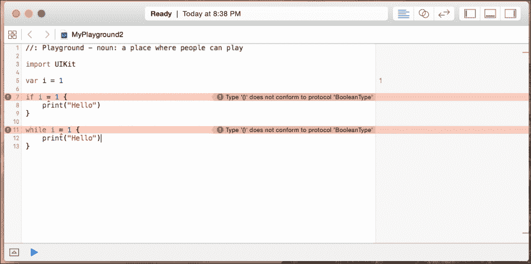

## 条件语句和赋值语句中的空白是可选的

对于条件（`if`和`while`）和赋值（`=`）语句，空白是可选的。因此，在下面的 Playground 中，代码的`The i block`和`The j block`都是有效的：

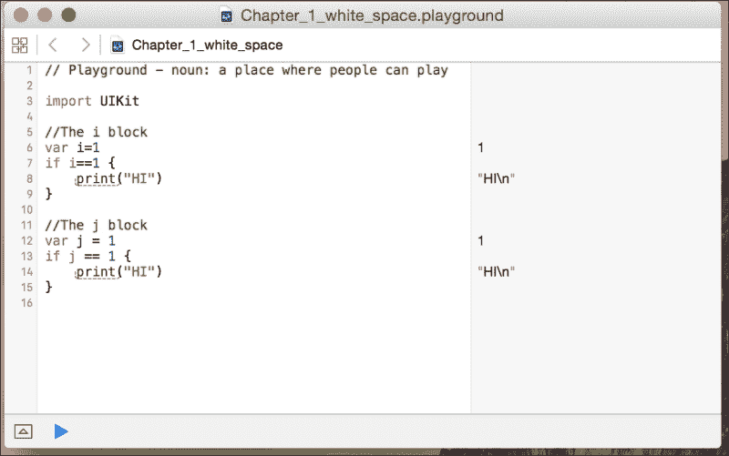

### 注意

为了风格上的考虑，我建议添加空白（例如，为了可读性，添加`The j block`），但只要您选择一种风格并保持一致，任何风格都应该是可以接受的。

# Hello World

所有旨在教授计算机语言的优秀计算机书籍都有一个部分，展示了用户如何编写 Hello World 应用程序。这本书也不例外。在本节中，我们将向您展示如何编写两个不同的 Hello World 应用程序。

我们的第一款 Hello World 应用程序将是传统的 Hello World 应用程序，它只是简单地打印 Hello World 到控制台。让我们首先创建一个新的 Playground，并将其命名为`Chapter_1_Hello_World`。这个 Playground 可以是 iOS 或 OS X 的 Playground。

在 Swift 中，要将消息打印到控制台，我们使用`print()`函数。`print()`函数在 Swift 2 中得到了极大的增强。在 Swift 2 之前，我们有两个独立的 print 函数：`print()`和`println()`。现在这两个函数都被合并成了单个`print()`函数。

在最基本的形式中，要打印一条单独的消息，我们会使用如下所示的 print 函数：

```swift
print("Hello World")
```

通常，当我们使用`print()`函数时，我们不仅想打印静态文本。我们可以使用特殊的字符序列`\( )`，或者通过在`print()`函数中用逗号分隔值，来包含变量的值和/或常量。以下代码展示了如何做到这一点：

```swift
var name = "Jon"
var language = "Swift"

var message1 = " Welcome to the wonderful world of "
var message2 = "\(name) Welcome to the wonderful world of \(language)!"

print(name, message1, language, "!")
print(message2)
```

我们也可以在 print 函数中定义两个参数，这两个参数会改变消息在控制台中的显示方式。这些参数是**分隔符**和**终止符**参数。分隔符参数定义了一个字符串，用于在`print()`函数中分隔变量/常量的值。默认情况下，`print()`函数使用空格分隔每个变量/常量。终止符参数定义了在行尾放置的字符。默认情况下，会在行尾添加换行符。

以下代码展示了如何创建一个没有换行符结尾的逗号分隔列表：

```swift
var name1 = "Jon"
var name2 = "Kim"
var name3 = "Kailey"
var name4 = "Kara"

print(name1, name2, name3, name4, separator:", ", terminator:"")
```

我们还可以向我们的`print()`函数添加另一个参数。这是**toStream**参数。这个参数将允许我们将`print()`函数的输出重定向。在以下示例中，我们将输出重定向到名为`line`的变量：

```swift
var name1 = "Jon"
var name2 = "Kim"
var name3 = "Kailey"
var name4 = "Kara"

var line = ""

print(name1, name2, name3, name4, separator:", ", terminator:"", toStream:&line)
```

`print()`函数过去只是一个有用的基本调试工具，但现在随着新的增强`print()`函数，我们可以用它做更多的事情。

# 摘要

在本章中，我们向您展示了如何启动和使用 Playgrounds 来进行 Swift 编程的实验。我们还介绍了 Swift 语言的基本语法，并讨论了合适的语言风格。本章以两个“Hello World”示例结束。

在下一章中，我们将了解如何在 Swift 中使用变量和常量。我们还将探讨各种数据类型以及如何在 Swift 中使用运算符。
