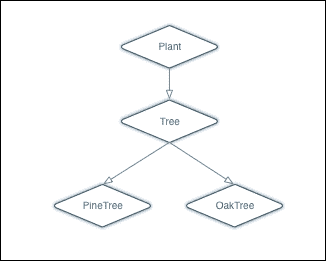

# 第五章。类和结构体

我最初学习的编程语言是 BASIC。这是一个开始编程的好语言，但当我用 Commodore Vic-20 交换成 PCjr（是的，我确实有 PCjr，并且真的很喜欢它）时，我意识到还有其他更高级的语言，于是花了很多时间学习 Pascal 和 C。直到我开始上大学，我才听到“面向对象语言”这个术语。当时，面向对象语言还非常新，没有真正的课程，但我能够尝试使用 C++ 进行一些实验。毕业后，我放弃了面向对象编程，直到几年后，当我再次开始尝试使用 C++ 时，我才真正发现了面向对象编程的强大和灵活性。

在本章中，我们将涵盖以下主题：

+   创建和使用类和结构体

+   为类和结构体添加属性和属性观察器

+   为类和结构体添加方法

+   为类和结构体添加初始化器

+   使用访问控制

+   创建类层次结构

+   扩展类

+   理解内存管理和 ARC

# 什么是类和结构体？

在 Swift 中，类和结构体非常相似。如果我们真的想精通 Swift，了解使类和结构体如此相似以及它们之间区别的原因非常重要，因为它们是应用程序的构建块。Apple 将类和结构体描述为：

> *"类和结构体是通用、灵活的构造，成为你程序代码的构建块。你通过使用已经熟悉的常量、变量和函数的语法来定义属性和方法，为你的类和结构体添加功能。"*

让我们先快速看一下类和结构体之间的一些相似之处。

## 类和结构体之间的相似性

在 Swift 中，类和结构体比其他语言，如 Objective-C，更为相似。以下是一些类和结构体共有的特性列表：

+   属性：这些用于在类和结构体中存储信息

+   方法：这些为我们的类和结构体提供功能

+   初始化器：这些用于初始化我们的类和结构体实例

+   下标：这些通过下标语法提供对值的访问

+   扩展：这些有助于扩展类和结构体

现在，让我们快速看一下类和结构体之间的一些区别。

## 类和结构体之间的区别

虽然类和结构体非常相似，但也有几个非常重要的区别。以下是在 Swift 中类和结构体之间的一些区别列表：

+   类型：结构体是一个值类型，而类是一个引用类型

+   继承：结构体不能从其他类型继承，而类可以

+   初始化器：在类存在时，结构体不能有自定义的析构器

+   多重引用：我们可以对一个类的实例有多个引用；然而，对于结构体来说，则不行

在本章中，我们将强调类和结构体之间的区别，以帮助我们了解何时使用哪一个。在我们真正深入类和结构体之前，让我们看看值类型（结构体）和引用类型（类）之间的区别。为了理解何时使用类和结构体以及如何正确使用它们，了解值类型和引用类型之间的区别是非常重要的。

## 值类型与引用类型

枚举和元组等结构体是值类型。这意味着当我们在我们应用程序中传递结构体的实例时，我们传递的是结构体的副本，而不是原始结构体。类是引用类型，这意味着当我们在我们应用程序中传递类的实例时，我们传递的是原始实例的引用。理解值类型和引用类型之间的区别非常重要。在这里，我们将提供一个非常高级的概述，并在本章末尾的 *内存管理* 部分提供更多详细信息。

当我们在应用程序中传递结构体时，我们传递的是结构体的副本，而不是原始结构体。由于函数获得的是结构体的副本，它可以按需更改它，而不会影响结构体的原始实例。

当我们在应用程序中传递类的实例时，我们传递的是该类原始实例的引用。由于我们将类的实例传递给函数，函数获得的是原始实例的引用；因此，在函数退出后，函数内所做的任何更改都将保持不变。

为了说明值类型和引用类型之间的区别，让我们看看一个现实世界的对象——一本书。如果我们有一个朋友想阅读 *Mastering Swift*，我们可以给他们买自己的副本，或者分享我们的副本。

如果我们为我们朋友买了书的副本，那么他们在书中做的任何笔记都会保留在他们自己的副本中，而不会反映在我们的副本中。这就是结构体和变量使用按值传递的方式。在函数中对结构体或变量所做的任何更改都不会反映在结构体或变量的原始实例中。

如果我们分享我们的书副本，那么他们在书中做的任何笔记在他们归还给我们时都会留在书中。这就是按引用传递的工作方式。对类的实例所做的任何更改在函数退出后都将保持不变。

要了解更多关于值类型与引用类型的信息，请参阅本章末尾的 *内存管理* 部分。

# 创建类或结构体

我们使用相同的语法来定义类和结构体。唯一的区别是我们使用 `class` 关键字定义类，使用 `struct` 关键字定义结构体。让我们看看创建类和结构体所使用的语法：

```swift
class MyClass {
  // MyClass definition
}

struct MyStruct {
  // MyStruct definition
}
```

在前面的代码中，我们定义了一个名为 `MyClass` 的新类和一个名为 `MyStruct` 的新结构体。这实际上创建了两个新的 Swift 类型，分别名为 `MyClass` 和 `MyStruct`。当我们命名一个新类型时，我们希望使用 Swift 定义的命名约定，即名称为驼峰式，首字母大写。在类或结构体内部定义的任何方法或属性也应使用驼峰式命名，首字母小写。

空类和结构体并不那么有用，因此让我们看看我们如何向我们的类和结构体添加属性。

## 属性

属性将值与类或结构体关联。属性有两种类型，如下所示：

+   存储属性：它们将变量或常量值作为类或结构体实例的一部分存储。存储属性还可以有属性观察器，可以监视属性的变化，并在属性值发生变化时执行自定义操作。

+   计算属性：它们本身不存储值，但检索并可能设置其他属性。计算属性的值也可以在请求时计算。

## 存储属性

存储属性是作为类或结构体实例的一部分存储的变量或常量。我们可以为存储属性提供默认值。这些使用 `var` 关键字定义。让我们看看如何在类和结构体中使用存储属性。在以下代码中，我们将创建一个名为 `MyStruct` 的结构体和一个名为 `MyClass` 的类。结构和类都包含两个存储属性，`c` 和 `v`。存储属性 `c` 是一个常量，因为它使用 `let` 关键字定义，而 `v` 是一个变量，因为它使用 `var` 关键字定义。让我们看一下以下代码：

```swift
struct MyStruct {
  let c = 5
  var v = ""
}

class MyClass {
  let c = 5
  var v = ""
}
```

如示例所示，定义存储属性的语法对类和结构体都是相同的。让我们看看如何创建结构和类的实例。以下代码创建了一个名为 `myStruct` 的 `MyStruct` 结构体实例和一个名为 `myClass` 的 `MyClass` 类实例：

```swift
var myStruct = MyStruct()
var myClass = MyClass()
```

结构体和类之间的一个区别是，默认情况下，结构体会创建一个初始化器，允许我们在创建结构体实例时填充存储属性。因此，我们也可以这样创建 `MyStruct` 的实例：

```swift
var myStruct = MyStruct(v: "Hello")
```

在前面的示例中，初始化器用于设置变量`v`，而`c`常量将包含在`struct`本身中设置的数字 5。例如，如果我们没有为常量提供一个初始值，如以下示例所示，则默认初始化器也会用来设置常量：

```swift
struct MyStruct {
  let c: Int
  var v = ""
}
```

以下示例显示了新`struct`的初始化器将如何工作：

```swift
var myStruct = MyStruct(c: 10, v: "Hello")
```

这允许我们在运行时初始化类或结构体时设置值，而不是在我们的代码中硬编码常量的值。

初始化器中参数出现的顺序是我们定义它们的顺序。在之前的示例中，我们首先定义了 c 常量；因此，它是初始化器中的第一个参数。我们定义了 v 参数第二个；因此它是初始化器中的第二个参数。

要设置或读取存储属性，我们使用标准的点语法。让我们看看在 Swift 中如何设置和读取存储属性：

```swift
var x = myClass.c
myClass.v = "Howdy"
```

在我们继续到计算属性之前，让我们创建一个表示员工的结构体和类。我们将在这个章节中使用和扩展这些内容，以展示类和结构体是如何相似以及它们有何不同：

```swift
struct EmployeeStruct {
  var firstName = ""
  var lastName = ""
  var salaryYear = 0.0
}

public class EmployeeClass {
  var firstName = ""
  var lastName = ""
  var salaryYear = 0.0
}
```

员工结构体命名为`EmployeeStruct`，员工类命名为`EmployeeClass`。类和结构体都有三个存储属性：`firstName`、`lastName`和`salaryYear`。

在我们的结构体或类中，我们现在可以通过使用属性名或`self`关键字来访问这些属性。结构体或类的每个实例都有一个名为`self`的属性。这个属性指向实例本身；因此，我们可以使用它来访问实例内的属性。以下示例显示了如何在结构体或类的实例中使用`self`关键字来访问属性：

```swift
self.firstName = "Jon"
self.lastName = "Hoffman"
```

## 计算属性

计算属性是没有用于存储与属性相关值的后端变量的属性。计算属性的值通常在代码请求时计算。你可以将计算属性视为一个伪装成属性的函数。让我们看看我们如何定义一个只读计算属性：

```swift
var salaryWeek: Double {
get{
  return self.salaryYear/52
  }
}
```

要创建一个只读计算属性，我们首先使用`var`关键字定义它，就像它是一个普通的变量，然后是变量名，冒号和变量类型。接下来的是不同的；我们在声明末尾添加一个花括号，然后定义一个`getter`方法，当请求计算属性的值时会被调用。在示例中，`getter`方法将`salaryYear`属性的当前值除以`52`以获取员工的周薪。

我们可以通过移除`get`关键字来简化只读计算属性的定义。我们可以将`salaryWeek`函数重写如下：

```swift
var salaryWeek: Double {
  return self.salaryYear/52
}
```

计算属性不仅限于只读，我们也可以写入它们。要使 `salaryWeek` 属性可写，我们需要添加一个 `setter` 方法。以下示例显示了如何添加一个 `setter` 方法，该方法将根据传递给 `salaryWeek` 属性的值设置 `salaryYear` 属性：

```swift
var salaryWeek: Double {
  get {
    return self.salaryYear/52
  }
  set (newSalaryWeek){
    self.salaryYear = newSalaryWeek*52
  }
}
```

我们可以通过不定义新值的名称来简化设置器的定义。在这种情况下，值将被分配给默认变量名，`newValue`。`salaryWeek` 计算属性可以重写如下：

```swift
var salaryWeek: Double {
  get{
    return self.salaryYear/52
  }	
  set{
    self.salaryYear = newValue*52
  }
}
```

如前例所示，`salaryWeek` 计算属性可以添加到 `EmployeeClass` 类或 `EmployeeStruct` 结构体中，无需任何修改。让我们通过将 `salaryWeek` 属性添加到我们的 `EmployeeClass` 类中来看如何实现这一点：

```swift
public class EmployeeClass {
  var firstName = ""
  var lastName = ""
  var salaryYear = 0.0
  var salaryWeek: Double {
    get{
      return self.salaryYear/52
    }
    set (newSalaryWeek){
      self.salaryYear = newSalaryWeek*52
    }
  }
}
```

现在，让我们看看如何将计算属性 `salaryWeek` 添加到 `EmployeeStruct` 结构体中：

```swift
struct EmployeeStruct {
    var firstName = ""
    var lastName = ""
    var salaryYear = 0.0
    var salaryWeek: Double {
        get{
            return self.salaryYear/52
        }
        set (newSalaryWeek){
            self.salaryYear = newSalaryWeek*52
        }
    }
}
```

如我们所见，类和结构体的定义到目前为止是相同的，只是使用初始的类或 `struct` 关键字来定义它们是结构体还是类。

我们对计算属性的读写方式与对存储属性的读写方式相同。类或结构体外部代码不应知道该属性是计算属性。让我们通过创建 `EmployeeStruct` 结构体的一个实例来观察这个动作：

```swift
var f = EmployeeStruct(firstName: "Jon", lastName: "Hoffman", salaryYear: 39000)

print(f.salaryWeek) //prints 750.00 to the console
f.salaryWeek = 1000
print(f.salaryWeek) //prints 1000.00 to the console
print(f.salaryYear) //prints 52000.00 to the console
```

前面的例子首先创建了一个 `EmployStruct` 结构体的实例，并将 `salaryYear` 的值设置为 `39,000`。接下来，我们将 `salaryWeek` 属性的值打印到 `console`。当前这个值是 `750.00`。然后我们将 `salaryWeek` 属性设置为 `1000.00`，并将 `salaryWeek` 和 `salaryYear` 属性的值都打印到 `console`。现在 `salaryWeek` 和 `salaryYear` 属性的值分别是 `1000.00` 和 `52000`。正如我们所看到的，在这个例子中，设置 `salaryWeek` 或 `salaryYear` 属性都会改变两个属性返回的值。

计算属性对于提供相同数据的不同视图非常有用。例如，如果我们有一个表示某物长度的值，我们可以将长度存储为厘米，然后使用计算属性来计算米、毫米和千米的值。

现在，让我们看看属性观察者。

## 属性观察者

每当属性的值被设置时，都会调用属性观察者。我们可以将属性观察者添加到任何非懒加载的存储属性。我们还可以通过在子类中重写属性来将属性观察者添加到任何继承的存储或计算属性。我们将在本章稍后的 *重写属性* 部分讨论这个问题。

在 Swift 中，我们可以设置两种属性观察者——`willSet` 和 `didSet`。`willSet` 观察者在属性被设置之前被调用，而 `didSet` 观察者在属性被设置之后被调用。

关于属性观察者需要注意的一点是，当在初始化期间设置值时，它们不会被调用。让我们看看如何向我们的`EmployeeClass`类和`EmployeeStruct`结构的工资属性添加属性观察者：

```swift
var salaryYear: Double = 0.0 {
  willSet(newSalary) {
    print("About to set salaryYear to \(newSalary)")
  }
  didSet {
    if salaryWeek > oldValue {
      print("\(firstName) got a raise")
    }
    else {
      print("\(firstName) did not get a raise")
    }
  }
}
```

当我们向存储属性添加属性观察者时，我们需要在属性的定义中包含要存储的值的类型。在先前的例子中，我们不需要将`salaryYear`属性定义为`Double`类型；然而，当我们添加属性观察者时，定义是必需的。

在属性定义之后，我们定义一个`willSet`观察者，它简单地打印出`salaryYear`属性将被设置的新值。我们还定义了一个`didSet`观察者，它将检查新值是否大于旧值；如果是，它将打印出员工得到了加薪，否则，它将打印出员工没有得到加薪。

就像计算属性中的 getter 一样，我们不需要为`willSet`观察者定义新值的名称。如果我们不定义名称，新值将被放入一个名为`newValue`的常量中。以下示例显示了如何不定义新值的名称来重写之前的`willSet`观察者：

```swift
willSet {
    print("About to set salaryYear to \(newValue)")
}
```

正如我们所见，属性主要用于存储与类或结构相关的信息，而方法主要用于向类或结构添加业务逻辑。让我们看看如何向类或结构添加方法。

## 方法

方法是与类或结构相关联的函数。方法，就像函数一样，将封装与类或结构相关联的特定任务或功能的相关代码。让我们看看如何在类和结构中定义方法。以下代码将通过使用`firstName`和`lastName`属性来返回员工的完整姓名：

```swift
func getFullName() -> String {
    return firstName + " " + lastName
}
```

我们定义这个方法就像定义任何函数一样。方法简单地说就是一个与特定类或结构相关联的函数，我们之前章节中学到的关于函数的所有内容都适用于方法。`getFullName()`函数可以直接添加到`EmployeeClass`类或`EmployeeStruct`结构中，无需任何修改。

要访问方法，我们使用与访问属性相同的点语法。以下代码显示了如何访问类和结构中的`getFullName()`方法：

```swift
var e = EmployeeClass()
var f = EmployeeStruct(firstName: "Jon", lastName: "Hoffman", salaryYear: 50000)

e.firstName = "Jon"
e.lastName = "Hoffman"
e.salaryYear = 50000.00

print(e.getFullName()) //Jon Hoffman is printed to the console
print(f.getFullName()) //Jon Hoffman is printed to the console
```

在前面的例子中，我们初始化了`EmployeeClass`类和`EmployeeStruct`结构的实例。我们用相同的信息填充结构和类，然后使用`getFullName()`方法将员工的完整姓名打印到控制台。在两种情况下，都会打印出`Jon Hoffman`到控制台。

在定义类和结构体的方法方面存在差异，我们需要在方法中更新属性值。让我们看看我们如何在 `EmployeeClass` 类中定义一个给员工加薪的方法：

```swift
func giveRaise(amount: Double) {
  self.salaryYear += amount
}
```

如果我们将前面的代码添加到我们的 `EmployeeClass` 中，它将按预期工作，并且当我们调用该方法并传递一个金额时，员工会得到加薪。然而，如果我们尝试将此方法按原样添加到 `EmployeeStruct` 结构体中，我们会收到 `Cannot invoke '+=' with an argument list of type '(Double, Double)'` 错误。默认情况下，我们不允许在结构体的方法中更新属性值。如果我们想修改属性，我们可以通过在方法声明的 `func` 关键字之前添加 `mutating` 关键字来选择该方法进入修改行为。因此，以下代码将是定义 `EmployeeStruct` 结构体的 `giveRaise()` 方法的正确方式：

```swift
mutating func giveRase(amount: Double) {
    self.salaryYear += amount
}
```

在前面的示例中，我们使用了 `self` 属性。类型的每个实例都有一个名为 `self` 的属性，它就是该实例本身。我们使用 `self` 属性来在实例本身中引用类型的当前实例，因此当我们写 `self.salaryYear` 时，我们请求当前实例的 `salaryYear` 属性的值。

可以使用 `self` 属性来区分具有相同名称的局部变量和实例变量。让我们看看一个示例，以说明这一点：

```swift
func compareFirstName(firstName: String) -> Bool {
  return self.firstName == firstName
}
```

在前面的示例中，方法接受一个名为 `firstName` 的参数。还有一个具有此名称的属性。我们使用 `self` 属性来指定我们想要具有该名称的实例属性，而不是具有此名称的局部变量。

除了需要 `mutating` 关键字来定义更改结构体属性值的函数外，方法可以像定义和使用函数一样定义和使用。因此，我们之前章节中学到的关于函数的所有内容都可以应用到方法上。

有时候，我们希望在类或结构体首次初始化时初始化属性或执行一些业务逻辑。为此，我们将使用初始化器。

# 自定义初始化器

当我们初始化特定类型（类或结构体）的新实例时，会调用初始化器。初始化是准备实例以供使用的进程。初始化过程可能包括设置存储属性的初始值、验证资源，例如网络服务、文件等是否可用，或正确设置用户界面。初始化器通常用于确保类或结构体的实例在使用前得到适当的初始化。

初始化器是用于创建类型新实例的特殊方法。我们定义初始化器的方式与定义其他方法相同，但我们必须使用 `init` 关键字作为初始化器的名称，以告诉编译器这个方法是初始化器。在其最简单的形式中，初始化器不接受任何参数。让我们看看编写简单初始化器所使用的语法：

```swift
init() {
  //Perform initialization here
}
```

这种格式适用于类和结构体。默认情况下，所有类和结构体都有一个空的默认初始化器，我们可以选择覆盖它。我们在使用 `EmployeeClass` 类和 `EmployeeStruct` 结构体时看到了这些默认初始化器。结构体还有一个额外的默认初始化器，我们在 `EmployeeStruct` 结构体中看到了，它接受每个存储属性的值并将它们初始化为这些值。让我们看看我们如何向我们的 `EmployeeClass` 类和 `EmployeeStruct` 结构体添加自定义初始化器。在下面的代码中，我们创建了三个自定义初始化器，它们将适用于 `EmployeeClass` 类和 `EmployeeStruct` 结构体：

```swift
init() {
  self.firstName = ""
  self.lastName = ""
  self.salaryYear = 0.0
}

init(firstName: String, lastName: String) {
  self.firstName = firstName
  self.lastName = lastName
  self.salaryYear = 0.0
}

init(firstName: String, lastName: String, salaryYear: Double) {
  self.firstName = firstName
  self.lastName = lastName
  self.salaryYear = salaryYear
}
```

第一个初始化器 `init()`，当使用时，将所有存储属性设置为它们的默认值。第二个初始化器 `init(firstName: String, lastName: String)`，当使用时，将 `firstName` 和 `lastName` 属性填充为参数的值。第三个初始化器 `init(firstName: String, lastName: String, salaryYear: Double)`，将所有属性填充为参数的值。

在上一个示例中，我们可以看到在 Swift 中，与 Objective-C 不同，初始化器没有返回值。这意味着我们不需要为初始化器定义返回类型，或者初始化器内部不需要有返回语句。让我们看看我们如何使用这些初始化器：

```swift
var g = EmployeeClass()
var h = EmployeeStruct(firstName: "Me", lastName: "Moe")
var i = EmployeeClass(firstName: "Me", lastName: "Moe", salaryYear: 45000)
```

变量 `g` 使用 `init()` 初始化器创建 `EmployeeClass` 类的一个实例；因此，这个 `EmployeeClass` 实例的所有属性都包含它们的默认值。

变量 `h` 使用 `init(firstName: String, lastName: String)` 初始化器创建 `EmployeeStruct` 结构体的一个实例；因此，结构体的 `firstName` 属性被设置为 `Me`，`lastName` 属性被设置为 `Moe`，这两个参数被传递到初始化器中。`salaryYear` 属性仍然设置为默认值 0.0。

`EmployeeClass` 使用 `init(firstName: String, lastName: String, salaryYear: Double)` 初始化器创建 `EmployeeClass` 类的一个实例；因此，`firstName` 属性被设置为 `Me`，`lastName` 属性被设置为 `Moe`，`salaryYear` 被设置为 `45000`。

由于所有初始化器都与`init`关键字相关联，因此参数和参数类型被用来识别要使用哪个初始化器。因此，Swift 为所有这些参数提供了自动的外部名称。在先前的例子中，我们可以看到当我们使用具有参数的初始化器时，我们会包含参数名称。让我们来看看初始化器中内部和外部参数名称。

## 内部和外部参数名称

就像函数一样，与初始化器关联的参数可以有独立的内部和外部名称。与函数不同，如果我们没有为我们的参数提供外部参数名称，Swift 会自动为我们生成它们。在先前的例子中，我们没有在初始化器的定义中包含外部参数名称，所以 Swift 使用内部参数名称作为外部参数名称。

如果我们想要提供自己的参数名称，我们会在内部函数名称之前放置外部函数名称，这与我们对任何正常函数的做法完全一样。让我们看看我们如何通过重新定义`EmployeeClass`类中的一个初始化器来定义我们自己的外部参数名称：

```swift
init(employeeWithFirstName firstName: String, lastName lastName: String, andSalary salaryYear: Double) {
  self.firstName = firstName
  self.lastName = lastName
  self.salaryYear = salaryYear
}
```

在先前的例子中，我们创建了`init(employeeWithFirstName firstName: String, lastName lastName: String, andSalary salaryYear: Double)`初始化器。这个初始化器将创建`EmployeeClass`类的一个实例，并用参数的值填充实例属性。在这个例子中，每个参数都有外部和内部属性名称。让我们看看我们如何使用这个初始化器（带有外部属性名称）来创建`EmployeeClass`类的一个实例：

```swift
var i = EmployeeClass(employeeWithFirstName: "Me", lastName: "Moe", andSalary: 45000)
```

注意我们现在正在使用我们在初始化器中定义的外部参数名称。使用外部参数名称可以帮助使我们的代码更易于阅读，并区分不同的初始化器。

那么，如果我们的初始化器失败会发生什么？例如，如果我们的类依赖于一个特定的资源，比如网络服务或当前不可用的特定文件，会怎样？这就是 failable 初始化器发挥作用的地方。

## Failable 初始化器

一个 failable 初始化器是一个可能无法初始化类或结构体所需资源的初始化器，从而使实例不可用。当使用 failable 初始化器时，初始化器的结果是可选类型，包含该类型的有效实例或 nil。

可以通过在`init`关键字后添加一个问号（`?`）来使初始化器成为 failable。让我们看看我们如何创建一个不允许新员工以每年低于$20,000 的薪水进行初始化的 failable 初始化器：

```swift
init?(firstName: String, lastName: String, salaryYear: Double) {
  self.firstName = firstName
  self.lastName = lastName
  self.salaryYear = salaryYear
  if self.salaryYear < 20000 {
    return nil
  }
}
```

在前面的示例中，我们没有在初始化器中包含 `return` 语句，因为 Swift 不需要返回初始化的实例；然而，在可失败初始化器中，如果初始化失败，我们将返回 `nil`。如果初始化器成功初始化了实例，我们不需要返回任何内容。因此，在我们的示例中，如果传入的年薪低于 `$20,000` 一年，我们返回 `nil`，表示初始化失败，否则，将不返回任何内容。让我们看看如何使用可失败初始化器来创建类或结构的实例：

```swift
if let f = EmployeeClass(firstName: "Jon", lastName: "Hoffman", 
  salaryYear: 29000) {
  print(f.getFullName())
} else {
  print("Failed to initialize")
}
```

在前面的示例中，我们使用年薪超过 $20,000 初始化 `EmployeeClass` 类的实例；因此，实例被正确初始化，并在控制台打印出 `Jon Hoffman` 的全名。现在让我们尝试使用年薪低于 $20,000 初始化 `EmployeeClass` 类的实例，以查看它如何失败：

```swift
if let f = EmployeeClass(firstName: "Jon", lastName: "Hoffman", salaryYear: 19000) {
  print(f.getFullName())
  print(f.compareFirstName("Jon"))
} else {
  print("Failed to initialize")
}
```

在示例中，我们尝试为我们的员工初始化的年薪低于 $20,000；因此，初始化失败，并在控制台打印出`Failed to initialize`消息。

有时候，我们希望限制对代码中某些部分的访问。这使我们能够隐藏实现细节，仅暴露我们希望暴露的接口。此功能通过命名访问控制来处理。

访问控制允许我们限制对代码中某些部分的访问和可见性。这使我们能够隐藏实现细节，仅暴露外部代码希望访问的接口。我们可以为类和结构体分配特定的访问级别。我们还可以为属于我们的类和结构体的属性、方法和初始化器分配特定的访问级别。

在 Swift 中，有三个访问级别：

+   **Public**：这是最可见的访问控制级别。它允许我们在任何我们想要导入模块的地方使用属性、方法、类等。基本上，任何具有公共访问控制级别的属性、方法、类等都可以使用。此级别主要用于框架，以暴露框架的公共 API。

+   **Internal**：这是默认的访问级别。此访问级别允许我们在定义源以及源所在的模块（应用程序或框架）中使用属性、方法、类等。如果在此级别中使用框架，它允许框架的其他部分使用属性、方法、类等，但框架外部的代码将无法访问它。

+   **Private**：这是最不可见的访问控制级别。它只允许我们在定义它的源文件中使用属性、方法、类等。

如果我们正在编写将在单个应用程序内自包含的代码，并且不需要将其提供给应用程序外部，那么我们可以很大程度上忽略访问控制。内部默认的访问级别已经符合这一要求。然而，我们可能仍然想隐藏实现的一部分，这可以通过将访问级别设置为私有来实现，但这应该是一个例外而不是规则。

当我们开发框架时，访问控制变得非常有用。我们需要将面向公众的接口标记为公共，以便其他模块，如导入框架的应用程序，可以使用它们。然后，我们将使用内部和私有访问控制级别来标记我们希望在框架和源文件内部使用的接口。

要定义访问级别，我们在实体的定义之前放置级别的名称。以下代码显示了如何向几个实体添加访问级别的示例：

```swift
private struct EmployeeStruct {}
public class EmployeeClass {}
internal class EmployeeClass2 {}
public var firstName = "Jon"
internal var lastName = "Hoffman"
private var salaryYear = 0.0
public func getFullName() -> String {}
private func giveRaise(amount: Double) {}
```

在访问控制方面存在一些限制，但这些限制是为了确保 Swift 中的访问级别遵循一个简单的指导原则——*没有实体可以被定义为低于（更限制性）访问级别的另一个实体的术语*。这意味着当我们依赖一个具有较低（更限制性）访问级别的实体时，我们不能将较高的（较少限制性）访问级别分配给该实体。

如以下示例所示：

+   如果其中一个参数或返回类型具有私有访问级别，我们不能将方法标记为公共，因为外部代码无法访问私有类型。

+   如果类或结构体的访问级别为私有，我们不能将方法或属性的访问级别设置为公共，因为外部代码无法在类为私有时访问构造函数。

# 继承

继承的概念是面向对象开发的基本概念。继承允许一个类被定义为具有一组特定的特征，然后其他类可以从该类派生。派生类继承了它所继承的类的所有特征（除非派生类覆盖了这些特征），然后通常还会添加它自己的额外特征。

通过继承，我们可以创建所谓的类层次结构。在类层次结构中，层次结构顶部的类被称为**基类**，派生类被称为**子类**。我们不仅限于仅从基类创建子类；我们还可以从其他子类创建子类。子类所继承的类被称为父类或超类。在 Swift 中，一个类只能有一个父类，这被称为单一继承。

### 注意

继承是区分类和结构体的基本差异之一。类可以从父类或超类派生，但结构体不能。

子类可以调用和访问其超类的属性、方法和下标。它们还可以覆盖其超类的属性、方法和下标。子类可以向从超类继承的属性添加属性观察者，以便在属性值发生变化时收到通知。让我们看看一个示例，说明 Swift 中继承是如何工作的。

我们将首先定义一个名为 `Plant` 的基类。`Plant` 类将有两个属性，`height` 和 `age`。它还将有一个方法，`growHeight()`。`height` 属性将代表植物的高度，`age` 属性将代表植物的年龄，`growHeight()` 方法将用于增加植物的高度。以下是定义 `Plant` 类的方法：

```swift
class Plant {
    var height = 0.0
    var age = 0

    func growHeight(inches: Double) {
        self.height +=  inches;
    }
}
```

现在我们有了 `Plant` 基类，让我们看看我们如何定义它的子类。我们将把这个子类命名为 `Tree`。`Tree` 类将继承 `Plant` 类的 `age` 和 `height` 属性，并添加一个额外的属性名为 `limbs`。它还将继承 `Plant` 类的 `growHeight()` 方法，并添加两个额外的方法：`limbGrow()`，用于生长新的枝条，以及 `limbFall()`，用于树枝从树上掉落。让我们看看以下代码：

```swift
class Tree: Plant {
  private var limbs = 0

  func limbGrow() {
    self.limbs++
  }
  func limbFall() {
    self.limbs--
  }
}
```

我们通过在类定义的末尾添加一个冒号和超类的名称来表示一个类有一个超类。在 `Tree` 示例中，我们表明 `Tree` 类有一个名为 `Plant` 的超类。

现在，让我们看看我们如何使用从 `Plant` 类继承来的 `age` 和 `height` 属性的 `Tree` 类：

```swift
var tree = Tree()
tree.age = 5
tree.height = 4
tree.limbGrow()
tree.limbGrow()
```

以下面的示例开始，我们创建了一个 `Tree` 类的实例。然后我们将 `age` 和 `height` 属性分别设置为 `5` 和 `4`，并通过调用 `limbGrow()` 方法两次来给树添加两个枝条。

我们现在有一个名为 `Plant` 的基类，它有一个名为 `Tree` 的子类。这意味着 `Tree` 的超类（或父类）是 `Plant` 类。这也意味着 `Plant` 的一个子类（或子类）被命名为 `Tree`。然而，世界上有各种各样的树木。让我们从 `Tree` 类创建两个子类。这两个子类将是 `PineTree` 类和 `OakTree` 类：

```swift
class PineTree: Tree {
  var needles = 0
}

class OakTree: Tree {
  var leaves = 0
}
```

现在的类层次结构看起来是这样的：



在 Swift 中，一个类可以有多个子类；然而，一个类只能有一个超类。有时子类需要为其从超类继承来的方法或属性提供自己的实现。这被称为覆盖。

# 覆盖方法和属性

要重写一个方法、属性或索引，我们需要在定义前加上`override`关键字。这告诉编译器我们打算重写超类中的某个东西，并且我们没有错误地创建了重复的定义。`override`关键字会提示 Swift 编译器验证超类（或其父类之一）中是否存在可以重写的匹配声明。如果它在一个超类中找不到匹配的声明，将会抛出错误。

## 重写方法

让我们看看如何重写一个方法。我们将首先向`Plant`类添加一个`getDetails()`方法，然后将在子类中重写它。以下代码显示了添加了`getDetails()`方法后的新`Plant`类的外观：

```swift
class Plant {
  var height = 0.0
  var age = 0

  func growHeight(inches: Double) {
    self.height +=  inches;
  }

  func getDetails() -> String {
    return "Plant Details"
  }
}
```

现在，让我们看看我们如何在`Tree`类中重写`getDetails()`方法：

```swift
class Tree: Plant {
  private var limbs = 0

  func limbGrow() {
    self.limbs++
  }
  func limbFall() {
    self.limbs--
  }

  override func getDetails() -> String {
    return "Tree Details"
  }
}
```

这里需要注意的是，我们在`Plant`类中不使用`override`关键字，因为它是最先实现此方法的类；然而，我们在`Tree`类中包含它，因为我们正在重写从`Plant`类继承的`getDetails()`方法。现在，让我们看看如果我们从一个`Plant`和`Tree`类的实例中调用`getDetails()`方法会发生什么：

```swift
var plant = Plant()
var tree = Tree()
print("Plant: \(plant.getDetails())")
print("Tree: \(tree.getDetails())")
```

之前的例子会在控制台打印以下两行：

```swift
Plant: Plant Details
Tree: Tree Details
```

如我们所见，`Tree`子类中的`getDetails()`方法重写了其父类`Plant`中的`getDetails()`方法。

在`Tree`类内部，我们仍然可以通过使用`super`前缀来调用其超类（在这种情况下是`Plant`类）的`getDetails()`方法（或任何重写的方法、属性或索引）。让我们看看如何从一个`Tree`类的实例中调用`Plant`类的`getDetails()`方法。我们将首先将`Plant`类中的`getDetails()`方法替换为以下方法，该方法将生成包含`height`和`age`属性值的字符串。让我们看一下以下代码：

```swift
func getDetails() -> String {
    return "Height:  \(height)  age:  \(age)"
}
```

在前面的代码中，我们将`getDetails()`方法更改为返回一个包含植物`height`和`age`的字符串。现在让我们用以下方法替换`Tree`类的`getDetails()`方法：

```swift
override func getDetails() -> String {
  var details = super.getDetails()
  return "\(details)  limbs:  \(limbs)"
}
```

在前面的例子中，我们首先调用超类（在这种情况下是`Plant`类）的`getDetails()`方法，以获取包含树木的`height`和`age`的字符串。然后我们构建一个新的字符串对象，包含从超类中调用`getDetails()`方法的结果，将其添加到其中，然后返回它。让我们看看如果我们调用`Tree`类的`getDetails()`方法会发生什么：

```swift
var tree = Tree()
tree.age = 5
tree.height = 4
tree.limbGrow()
tree.limbGrow()
print(tree.getDetails())
```

如果我们运行前面的代码，控制台将打印以下行：

```swift
Height:  4.0  age:  5  limbs:  2
```

如我们所见，返回的字符串包含了来自`Plant`类的`height`和`age`信息以及来自`Tree`类的树枝信息。

我们还可以链式调用重写的方法。让我们看看如果我们向`OakTree`类添加以下方法会发生什么：

```swift
override func getDetails() -> String {
  let details = super.getDetails()
  return "\(details)  Leaves:  \(leaves)"
}
```

当我们调用 `OakTree` 类实例的 `getDetails()` 方法时，它会调用其超类（`Tree` 类）的 `getDetails()` 方法。`Tree` 类的 `getDetails()` 方法也会调用其超类（`Plant` 类）的 `getDetails()` 方法。`Tree` 类的 `getDetails()` 方法最终将创建一个包含来自 `Plant` 类的 `height` 和 `age`、来自 `Tree` 类的 `limbs` 以及来自 `OakTree` 类的 `leaves` 的字符串对象。让我们看看这个例子：

```swift
var tree = OakTree()
tree.age = 5
tree.height = 4
tree.leaves = 50
tree.limbGrow()
tree.limbGrow()
print(tree.getDetails())
```

如果我们运行前面的代码，我们会在控制台看到以下行打印出来：

```swift
Height:  4.0  age:  5  limbs:  2  Leaves:  50
```

## 重写属性

我们可以提供自定义的 `getter` 和 `setter` 来重写任何继承的属性。当我们重写一个属性时，我们必须提供我们正在重写的属性名称和类型，以便编译器可以验证类层次结构中的某个类是否有一个匹配的重写属性。虽然重写属性不如重写方法常见，但当我们需要时了解如何做是好的。

让我们看看我们如何通过向我们的 `Plant` 类添加以下方法来重写属性：

```swift
var description: String {
  get {
    return "Base class is Plant."
  }
}
```

`description` 属性是一个基本的只读属性。该属性返回字符串 `Base class is Plant.`。现在让我们通过向 `Tree` 类添加以下属性来重写这个属性：

```swift
override var description: String {
  return "\(super.description)  I am a Tree class."
}
```

当我们重写一个属性时，我们使用与重写方法时相同的 `override` 关键字。`override` 关键字告诉编译器我们想要重写一个属性，因此编译器可以验证类层次结构中的另一个类是否包含一个匹配的重写属性。然后我们像实现任何其他属性一样实现该属性。调用树的 `description` 属性将返回字符串 `Base class is Plant. I am a Tree class.`。

有时候，我们可能想要防止子类重写属性和方法。也有时候，我们可能想要防止整个类被继承。让我们看看我们如何做到这一点。

## 防止重写

为了防止重写或子类化，我们使用 `final` 关键字。要使用 `final` 关键字，我们将其添加到项的定义之前。例如，有 `final func`、`final var` 和 `final class`。

任何尝试重写标记为 `final` 的项都会抛出编译时错误。

# 协议

有时候，我们可能想要描述一个类的实现（方法、属性和其他要求），而不实际提供实现。为此，我们会使用协议。

协议定义了一个类或结构的方法、属性和其他要求的蓝图。然后，类或结构可以提供一个符合这些要求的实现。提供实现的类或结构被称为符合该协议。

# 协议语法

定义协议的语法与我们定义类或结构体非常相似。以下示例显示了定义协议时使用的语法：

```swift
protocol MyProtocol {
  //protocol definition here
}
```

我们通过在类或结构体名称之后放置协议名称，并用冒号分隔来声明一个类或结构体符合特定的协议。以下是一个示例，说明我们如何声明一个类符合 `MyProtocol` 协议：

```swift
class myClass: MyProtocol {
  //class implementation here
}
```

一个类或结构体可以符合多个协议。我们会通过逗号分隔来列出类或结构体符合的协议。以下示例显示了如何声明我们的类符合多个协议：

```swift
class MyClass: MyProtocol, AnotherProtocol, ThirdProtocol {
  // class implementation here
}
```

当我们需要一个类继承自一个超类并实现一个协议时，我们会首先列出超类，然后是协议。以下示例说明了这一点：

```swift
Class MyClass: MySuperClass, MyProtocol, MyProtocol2 {
  // Class implementation here
}
```

## 属性要求

协议可以要求符合该协议的类或结构提供具有指定名称和类型的某些属性。协议没有说明属性应该是存储属性还是计算属性，因为实现细节留给了符合协议的类或结构。

在协议中定义属性时，我们必须使用 `get` 和 `set` 关键字来指定属性是只读的还是可读写的。让我们通过创建一个 `FullName` 协议来看看如何在协议中定义属性：

```swift
protocol FullName {
  var firstName: String {get set}
  var lastName: String {get set}
}
```

`FullName` 协议定义了两个属性，任何符合该协议的类或结构都必须实现这些属性。这些属性是 `firstName` 和 `lastName` 属性。在 `FullName` 协议中，这两个属性都是可读写属性。如果我们想指定属性是只读的，我们可以只使用 `get` 关键字来定义它，如下所示：

```swift
 var readOnly: String {get}
```

让我们看看我们如何创建一个符合此协议的 `Scientist` 类：

```swift
class Scientist: FullName {
  var firstName = ""
  var lastName = ""
}
```

如果我们忘记包含 `firstName` 或 `lastName` 属性中的任何一个，我们会收到 `Scientist does not conform to protocol 'FullName'` 错误信息。我们还需要确保属性的类型相同。例如，如果我们将 `Scientist` 类中的 `lastName` 定义更改为 `var lastName = 42`，我们也会收到 `Scientist does not conform to protocol 'FullName'` 错误信息，因为协议指定我们必须有一个字符串类型的 `lastName` 属性。

## 方法要求

协议可以要求符合该协议的类或结构提供某些方法。我们可以在协议中定义一个方法，就像在普通类或结构体中定义一样，只是不需要花括号或方法体。让我们向我们的 `FullName` 协议和 `Scientist` 类添加一个 `getFullName()` 方法。

以下示例显示了添加了 `getFullName()` 方法的 `FullName` 协议的外观：

```swift
protocol FullName {
  var firstName: String {get set}
  var lastName: String {get set}

  func getFullName() -> String
}
```

现在，我们需要在我们的 `Scientist` 类中添加一个 `getFullName()` 方法，以便它能够正确符合 `FullName` 协议：

```swift
class Scientist: FullName {
  var firstName = ""
  var lastName = ""
  var field = ""   

  func getFullName() -> String {
    return "\(firstName) \(lastName) studies \(field)"
  }
}
```

结构体可以像类一样符合 Swift 协议。以下示例展示了我们如何创建一个符合 `FullName` 协议的 `FootballPlayer` 结构体：

```swift
struct FootballPlayer: FullName {
    var firstName = ""
    var lastName = ""
    var number = 0

    func getFullName() -> String {
        return "\(firstName) \(lastName) has the number \(number)"
    }
}
```

当一个类或结构体符合 Swift 协议时，我们可以确信它已经实现了必需的属性和方法。这在我们想要确保在多个类中实现某些属性或方法时非常有用，如我们前面的例子所示。

协议在我们要将代码与特定的类或结构体解耦时也非常有用。以下代码展示了我们如何使用 `FullName` 协议、`Scientist` 类和已经构建的 `FootballPlayer` 结构体来解耦我们的代码：

```swift
var scientist = Scientist()
scientist.firstName = "Kara"
scientist.lastName = "Hoffman"
scientist.field = "Physics"

var player = FootballPlayer();
player.firstName = "Dan"
player.lastName = "Marino"
player.number = 13

var person: FullName
person = scientist
print(person.getFullName())
person = player
print(player.getFullName())
```

在前面的代码中，我们首先创建了一个 `Scientist` 类的实例和一个 `FootballPlayer` 结构体的实例。然后我们创建了一个 `person` 变量，其类型为 `FullName`（协议），并将其设置为刚刚创建的 `scientist` 实例。然后我们调用 `getFullName()` 方法来获取我们的描述。这将打印出 `Kara Hoffman 研究物理学` 的消息到控制台。

接着我们将 `person` 变量设置为 `player` 实例，并再次调用 `getFullName()` 方法。这将打印出 `Dan Marino 穿着号码 13` 的消息到控制台。

如我们所见，`person` 变量并不关心实际的实现类或结构体是什么。由于我们将 `person` 变量定义为 `FullName` 类型，因此我们可以将 `person` 变量设置为任何符合 `FullName` 协议的类或结构体的实例。

## 可选要求

有时候我们希望协议定义可选要求，也就是说，不是必须实现的方法或属性。要使用可选要求，我们需要首先使用 `@objc` 属性标记协议。要将属性或方法标记为可选，我们使用 `optional` 关键字。

### 注意

在使用 `@objc` 属性时，有一点非常重要需要注意，那就是只有类可以采用标记了 `@objc` 属性的协议；结构体不能采用这些协议。

让我们看看如何使用 `optional` 关键字来定义可选属性和方法：

```swift
@objc protocol Phone {
  var phoneNumber: String {get set}
  optional var emailAddress: String {get set}

  func dialNumber()
  optional func getEmail()
}
```

在我们刚刚创建的 `Phone` 协议中，我们定义了一个必需的属性名为 `phoneNumber`，以及一个可选属性名为 `emailAddress`。此外，在 `Phone` 协议中，我们还定义了一个必需的函数名为 `dialNumber()` 和一个可选函数名为 `getEmail()`。这意味着采用 `Phone` 协议的类必须提供一个 `phoneNumber` 属性和一个 `dialNumber()` 方法。采用 `Phone` 协议的类也可以选择性地提供一个 `emailAddress` 属性和一个 `getEmail()` 方法，但这不是必需的。

Swift 2 为 Swift 添加了协议扩展功能。这是 Swift 语言中一个非常激动人心且重要的特性。要了解有关协议扩展的内容，请参阅第六章，*使用协议和协议扩展*。

有时候我们需要向现有的类或结构体添加额外的功能。为此，我们使用扩展。

# 扩展

使用扩展，我们可以添加新的属性、方法、构造函数和下标，或者使现有的类或结构体符合一个协议。需要注意的是，扩展不能覆盖现有的功能。

要定义一个扩展，我们使用 `extension` 关键字，后跟我们要扩展的类型。以下示例展示了我们如何创建一个扩展来扩展字符串类：

```swift
extension String {
  //add new functionality here
}
```

让我们通过向 Swift 的标准字符串类添加一个 `reverse()` 方法和 `firstLetter` 属性来了解扩展是如何工作的：

```swift
extension String {
    var firstLetter: Character {
        get {
            return self.characters.first
        }
    }

    func reverse() -> String {
        var reverse = ""
        for letter in self.characters {
            reverse = "\(letter)" + reverse
        }
        return reverse
    }
}
```

当我们扩展一个现有的类或结构体时，我们定义属性、方法、构造函数、下标和协议的方式与我们在标准类或结构体中通常定义它们的方式完全相同。在字符串扩展示例中，我们看到我们定义 `reverse()` 方法和 `firstLetter` 属性的方式与我们在正常类中定义它们的方式完全相同。

扩展对于向外部框架中的类和结构体添加额外功能非常有用，甚至对于苹果的框架也是如此，如示例所示。我们更倾向于使用扩展来向外部框架中的类添加额外功能，而不是子类化，因为这允许我们在整个代码中使用框架提供的类。

# 内存管理

如我在本章开头提到的，结构体是值类型，而类是引用类型。这意味着当我们在我们应用程序中传递结构体的实例时，例如方法的一个参数，我们会在内存中创建结构体的一个新实例。这个结构体的新实例仅在结构体创建的作用域内有效。一旦结构体超出作用域，结构体的这个新实例就会被销毁，并且内存会被释放。这使得结构体的内存管理变得相当简单，并且相对无痛。

与此相反，类是引用类型。这意味着当类首次创建实例时，我们只为其分配一次内存。当我们想要在我们的应用程序中将类的实例传递给函数作为参数，或者将其分配给变量时，我们实际上传递的是实例在内存中存储位置的引用。由于类的实例可能在多个作用域中被引用（与结构体不同），它不能被自动销毁，如果它在另一个作用域中被引用，当它超出作用域时，内存不会被释放。因此，Swift 需要某种形式的内存管理来跟踪和释放当类不再需要时实例使用的内存。Swift 使用**自动引用计数（ARC）**来跟踪和管理内存使用。

在 ARC 中，大部分情况下，Swift 的内存管理很简单。ARC 会自动跟踪类的实例引用，当一个实例不再需要时（没有引用指向它），ARC 会自动销毁该实例并释放内存。有一些情况下，ARC 需要额外的信息来正确管理内存。在我们查看 ARC 需要帮助的实例之前，让我们看看内存管理和 ARC 是如何工作的。

## 引用类型与值类型

让我们通过一个示例来了解如何将引用类型（类的实例）和值类型（结构体或变量的实例）传递给函数。我们将首先定义一个新的类`MyClass`和一个新的结构体`MyStruct`。`MyClass`类和`MyStruct`结构体各自包含一个名为`name`的属性：

```swift
class MyClass {
  var name = ""
}

struct MyStruct {
  var name = ""
}
```

现在，我们将创建一个函数，该函数将接受一个`MyClass`类的实例和一个`MyStruct`结构体的实例作为参数。在函数内部，我们将改变`MyClass`类和`MyStruct`结构体的`name`属性的值。然后，通过在函数退出后检查该属性的值，我们将能够看到类和结构体的实例是如何传递给函数的。以下是`showPass()`函数的代码：

```swift
func showPass(myc: MyClass, var mys: MyStruct) {
    print("Received Class: \(myc.name) Struct: \(mys.name)")
    myc.name = "Set in function - class"
    mys.name = "Set in function - struct"
    print("Set  Class: \(myc.name) Struct: \(mys.name)")
}
```

在`showPass()`函数中，我们将`MyClass`和`MyStruct`实例的命名属性值打印到控制台。然后我们改变命名属性的值，并将这些值再次打印到控制台。这将显示函数开始时的属性值以及属性更改后的值（在函数退出之前）。

现在，为了了解引用类型和值类型是如何传递给函数的，我们将创建`MyClass`类和`MyStruct`结构体的实例，设置`name`属性的值，并将这些实例传递给`showPass()`函数。然后，该函数将更改`name`属性的值，并返回控制权给调用它的代码。最后，我们将在`showPass()`函数退出后检查`name`属性的值，以查看它们是否保持了原始值或函数中设置的值。以下是执行此操作的代码：

```swift
var mci = MyClass()
mci.name = "set in main - class"

var msi = MyStruct()
msi.name = "set in main - struct"

print("Main  Class: \(mci.name) Struct: \(msi.name)")

showPass(mci, msi)
print("Main  Class: \(mci.name) Struct: \(msi.name)")
```

如果我们运行此代码，我们将看到以下输出：

```swift
Received Class: set in main - class Struct: set in main - struct
Set Class: Set in function - class Struct: Set in function - struct
Main Class: Set in function - class Struct: set in main – struct
```

如我们从输出中可以看到，`showPass()`函数接收了类和结构体的实例，其`name`属性分别设置为`在 main 中设置 - class`和`在 main 中设置 - struct`。接下来，在函数退出之前，我们看到类的`name`属性被设置为`在函数中设置 - class`，而结构的`name`属性被设置为`在函数中设置 - struct`。最后，当函数退出，我们回到代码的主要部分时，我们看到类的`name`属性被设置为`在函数中设置 - class`，这是在`showPass()`函数中设置的。然而，结构的`name`属性具有在调用函数之前设置的原始值，即`在 main 中设置 - struct`。

这个例子说明，当我们向函数传递引用类型（类的实例）时，我们传递的是原始类的引用，这意味着我们在函数退出时保留所做的任何更改。当我们向函数传递值类型（结构体或变量的实例）时，我们传递的是值（实例的副本），这意味着我们对局部副本所做的任何更改都会丢失，一旦函数退出。

## 自动引用计数（ARC）的工作原理

每次我们创建一个新的类实例时，ARC 都会分配存储该类所需的内存。这确保了有足够的内存来存储与该类实例相关的信息，并且锁定内存，以防止任何东西覆盖它。当类的实例不再需要时，ARC 将释放为该类分配的内存，以便它可以用于其他目的。这确保了我们不会占用不再需要的内存。

如果 ARC 释放了我们仍然需要的类的实例的内存，将无法从内存中检索类信息。如果我们尝试在内存释放后访问类的实例，应用程序可能会崩溃。为了确保不会释放我们仍然需要的类的实例的内存，ARC 会计算实例被引用的次数（有多少活跃的属性、变量或常量指向类的实例）。一旦类的实例的引用计数为零（没有东西引用该实例），内存就会被释放。

所有的前一个示例在 Playground 中都能正常运行，下面的示例将无法运行。当我们运行 Playground 中的示例代码时，ARC 不会释放我们创建的对象；这是设计上的考虑，以便我们可以看到应用程序的运行情况以及每个步骤中对象的状态。因此，我们需要将这些样本作为 iOS 或 OS X 项目来运行。让我们看看 ARC 是如何工作的一个例子。

我们首先使用以下代码创建一个`MyClass`类：

```swift
class MyClass {
  var name = ""
  init(name: String) {
    self.name = name
    print("Initializing class with name \(self.name)")
  }
  deinit {
   print("Releasing class with name \(self.name)")
  }
}
```

这个类与我们之前的`MyClass`类非常相似，除了我们添加了一个析构器，它在类的实例被销毁并从内存中移除之前被调用。这个析构器会在控制台打印一条消息，让我们知道类的实例即将被移除。

现在，让我们看看展示 ARC 如何创建和销毁类实例的代码：

```swift
  var class1ref1: MyClass? = MyClass(name: "One")
  var class2ref1: MyClass? = MyClass(name: "Two")
  var class2ref2: MyClass? = class2ref1

  print("Setting class1ref1 to nil")
  class1ref1 = nil

  print("Setting class2ref1 to nil")
  class2ref1 = nil

  print("Setting class2ref2 to nil")
  class2ref2 = nil
```

在示例中，我们首先创建了两个`MyClass`类的实例，分别命名为`class1ref1`（代表类 1 引用 1）和`class2ref1`（代表类 2 引用 1）。然后，我们为`class2ref1`创建了一个名为`class2ref2`的第二个引用。现在，为了了解 ARC 的工作原理，我们需要开始将引用设置为 nil。我们首先将`class1ref1`设置为`nil`。由于只有一个引用指向`class1ref1`，因此将调用析构器。一旦析构器完成其任务，在我们的例子中，它会在控制台打印一条消息，让我们知道类的实例已被销毁，内存已被释放。

然后，我们将`class2ref1`设置为 nil，但还有一个指向这个类的第二个引用（`class2ref2`），这阻止了 ARC 销毁实例，因此不会调用析构器。最后，我们将`class2ref2`设置为 nil，这允许 ARC 销毁这个`MyClass`类的实例。

如果我们运行这段代码，我们将看到以下输出，它说明了 ARC 的工作原理：

```swift
Initializing class with name One
Initializing class with name Two
Setting class1ref1 to nil
Releasing class with name One
Setting class2ref1 to nil
Setting class2ref2 to nil
Releasing class with name Two
```

从示例中可以看出，ARC 处理内存管理得非常好。然而，编写防止 ARC 正常工作的代码是可能的。

## 强引用循环

强引用循环是指两个类的实例相互持有强引用，阻止 ARC 释放任一实例。通过示例来理解强引用循环要容易得多，所以让我们创建一个。再次强调，我们无法在这个例子中使用 Playground，因此我们需要创建一个 Xcode 项目。在项目中，我们首先创建两个名为`MyClass1`和`MyClass2`的类，代码如下：

```swift
class MyClass1 {
  var name = ""
  var class2: MyClass2?

  init(name: String) {
    self.name = name
    print("Initializing class with name \(self.name)")
  }
  deinit {
    print("Releaseing class with name \(self.name)")
  }

}

class MyClass2 {
  var name = ""
  var class1: MyClass1?

  init(name: String) {
    self.name = name
    print("Initializing class2 with name \(self.name)")
  }
  deinit {
    print("Releaseing class2 with name \(self.name)")
  }

}
```

如我们从代码中可以看到，`MyClass1` 包含了 `MyClass2` 的一个实例；因此，直到 `MyClass1` 被销毁，`MyClass2` 的实例都不能被释放。我们也可以从代码中看到，`MyClass2` 包含了 `MyClass1` 的一个实例；因此，直到 `MyClass2` 被销毁，`MyClass1` 的实例都不能被释放。这创建了一个依赖循环，其中两个实例都无法被销毁，直到另一个被销毁。让我们通过运行以下代码来查看这是如何工作的：

```swift
var class1: MyClass1? = MyClass1(name: "Class1")
var class2: MyClass2? = MyClass2(name: "Class2")
//class1 and class2 each have a reference count of 1
       .
class1?.class2 = class2
//Class2 now has a reference count of 2
class2?.class1 = class1
//class1 now has a reference count of 2
       .
print("Setting classes to nil")
class2 = nil
//class2 now has a reference count of 1, not destroyed
class1 = nil
//class1 now has a reference count of 1, not destroyed
```

如我们从示例中的注释中可以看到，每个实例的引用计数器从未达到零；因此，自动引用计数（ARC）无法销毁实例，从而创建了内存泄漏。内存泄漏是指应用程序继续使用内存但未正确释放它。这可能导致应用程序最终崩溃。

要解决强引用循环，我们需要防止其中一个类对另一个类的实例保持强引用，从而允许 ARC 销毁它们。Swift 通过让我们定义属性为弱引用或无主引用提供了两种方法来做这件事。

弱引用和无主引用之间的区别是，弱引用所引用的实例可以是 nil，而无主引用所引用的实例不能是 nil。这意味着当我们使用弱引用时，属性必须是可选属性，因为它可以是 nil。让我们看看如何使用无主引用和弱引用来解决强引用循环。让我们首先看看无主引用。

我们首先创建另外两个类，`MyClass3` 和 `MyClass4`：

```swift
class MyClass3 {
    var name = ""
    unowned let class4: MyClass4

    init(name: String, class4: MyClass4) {
        self.name = name
        self.class4 = class4
        print("Initializing class3 with name \(self.name)")
    }
    deinit {
        print("Releasing class3 with name \(self.name)")
    }

}

class MyClass4{
    var name = ""
    var class3: MyClass3?

    init(name: String) {
        self.name = name
        print("Initializing class4 with name \(self.name)")
    }
    deinit {
        print("Releasing class4 with name \(self.name)")
    }
}
```

`MyClass4` 类在先前的示例中看起来与 `MyClass1` 和 `MyClass2` 类非常相似。这里的不同之处在于 `MyClass3` 类。在 `MyClass3` 类中，我们将 `class4` 属性设置为 `unowned`，这意味着它不能是 nil，并且它不会保持对它所引用的 `MyClass4` 实例的强引用。由于 `class4` 属性不能是 `nil`，我们还需要在类初始化时设置它。

现在让我们看看如何使用以下代码初始化和销毁这些类的实例：

```swift
var class4 = MyClass4(name: "Class4")
var class3: MyClass3? = MyClass3(name: "class3", class4: class4)

class4.class3 = class3

print("Classes going out of scope")
```

在前面的代码中，我们创建了一个 `MyClass4` 类的实例，然后使用该实例创建了一个 `MyClass3` 类的实例。然后我们将 `MyClass4` 实例的 `class3` 属性设置为刚刚创建的 `MyClass3` 实例。这再次在两个类之间创建了一个依赖循环，但这次 `MyClass3` 实例并没有对 `MyClass4` 实例保持强引用，允许 ARC 在不再需要时释放这两个实例。

如果我们运行此代码，我们将看到以下输出，显示 `MyClass3` 和 `MyClass4` 的实例都被释放，内存也被释放了：

```swift
Initializing class4 with name Class4
Initializing class3 with name class3
Classes going out of scope.
Releasing class4 with name Class4
Releasing class3 with name class3
```

现在让我们看看如何使用弱引用来防止强引用循环。我们首先创建两个新的类：

```swift
class MyClass5 {
  var name = ""
  var class6: MyClass6?
  init(name: String) {
    self.name = name
    print("Initializing class5 with name \(self.name)")
  }
  deinit {
    print("Releasing class5 with name \(self.name)")
  }
}

class MyClass6 {
  var name = ""
  weak var class5: MyClass5?
  init(name: String) {
    self.name = name
    print("Initializing class6 with name \(self.name)")
  }
  deinit {
    print("Releasing class6 with name \(self.name)")
  }
}
```

`MyClass5`和`MyClass6`类与我们之前创建的`MyClass1`和`MyClass2`类非常相似，用以展示强引用循环的工作原理。最大的不同之处在于我们在`MyClass6`类中定义了`class5`属性为一个弱引用。

现在，让我们看看如何使用以下代码初始化和销毁这些类的实例：

```swift
var class5: MyClass5? = MyClass5(name: "Class5")
var class6: MyClass6? = MyClass6(name: "Class6")

class5?.class6 = class6
class6?.class5 = class5

print("Classes going out of scope ")
```

在前面的代码中，我们创建了`MyClass5`和`MyClass6`类的实例，并将这些类的属性设置为指向另一个类的实例。再次，这创建了一个依赖循环，但由于我们将`MyClass6`类的`class5`属性设置为弱引用，它不会创建强引用，从而允许两个实例都被释放。

如果我们运行代码，我们将看到以下输出，显示`MyClass5`和`MyClass6`实例已被释放，内存已被释放：

```swift
Initializing class5 with name Class5
Initializing class6 with name Class6
Classes going out of scope.
Releasing class5 with name Class5
Releasing class6 with name Class6
```

建议我们避免创建循环依赖，正如本节所示，但有时我们确实需要它们。对于那些时候，请记住，自动引用计数（ARC）确实需要一些帮助来释放它们。

# 摘要

随着本章的结束，我们完成了对 Swift 编程语言的介绍。到目前为止，我们对 Swift 语言已经有了足够的了解，可以开始编写自己的应用程序；然而，还有很多东西需要学习。

在接下来的章节中，我们将更深入地探讨一些我们已经讨论过的概念，例如可选值和下标。我们还将展示如何使用 Swift 执行常见任务，例如解析常见文件格式和处理并发。最后，我们还将有一些章节帮助我们编写更好的代码，例如一个 Swift 风格指南的示例，以及一个关于设计模式的章节。
