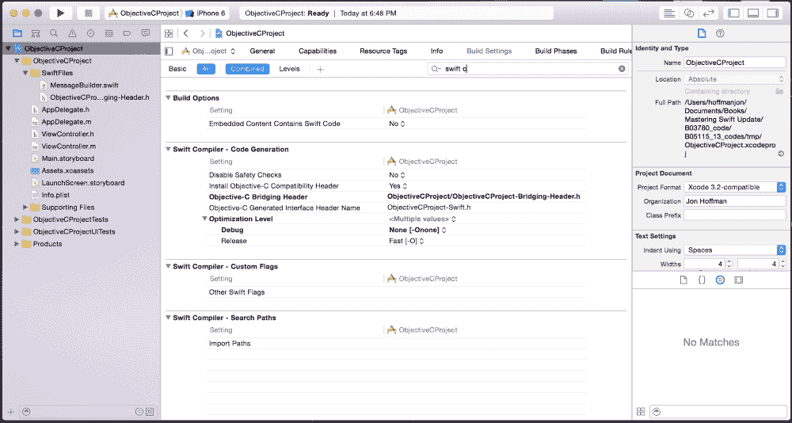

# 第十三章。使用混合匹配

当苹果在 2014 年的 WWDC 上首次介绍 Swift 时，我的第一个想法是开发者需要花费多少工作量来将已经用 Objective-C 编写的应用程序重写为 Swift。我也想知道为什么开发者会重写他们的应用程序为 Swift。这些应用程序相当复杂，重写它们需要相当大的努力。在 Swift 的某个演示中，苹果提到了混合匹配，它允许 Swift 和 Objective-C 在同一项目中交互。混合匹配听起来确实像是一个理想的解决方案，因为开发者可以在需要更新时，用 Swift 重写代码的某些部分，而不是不得不重写整个应用程序。我最大的问题是混合匹配实际上会工作得有多好，我非常惊讶；它不仅工作得很好，而且实现起来也很简单。

在本章中，我们将涵盖以下主题：

+   什么是混合匹配

+   如何在同一项目中同时使用 Swift 和 Objective-C

+   如何将 Swift 添加到 Objective-C 项目中

+   如何在 Swift 项目中使用 Objective-C

# 什么是混合匹配

Swift 与 Objective-C 的兼容性允许我们创建一个项目，并包含用另一种语言编写的文件。这个特性被称为 **混合匹配**。这可能是 Swift 诞生时最重要的特性之一。

这个特性之所以如此重要，是因为在苹果的 App Store 中，有超过一百万个用 Objective-C 编写的应用程序，开发者花费资源将这些应用程序从 Objective-C 转换为 Swift 是不可行的。没有混合匹配，Swift 语言的适应速度将会非常缓慢。有了混合匹配，开发者可以在不将整个代码库转换为 Swift 的情况下，开始在他们用 Objective-C 编写的现有应用程序中使用 Swift。

使用混合匹配，我们可以使用 Swift 更新我们的当前 Objective-C 项目。我们还可以在我们的 Swift 项目中使用用 Objective-C 编写的任何框架，并在我们的 Objective-C 项目中使用用 Swift 编写的较新框架。

对于长时间使用苹果产品的开发者来说，他们可能会发现混合匹配和苹果从 OS X 10.4.4 Tiger 开始包含的 Rosetta 之间存在相似之处。OS X 10.4.4 是苹果操作系统首次与苹果的第一款基于英特尔的处理器的机器一同发布的版本。Rosetta 的编写是为了允许许多 PowerPC 应用程序在新基于英特尔的处理器的机器上无缝运行。

对于那些刚开始接触苹果产品的开发者来说，你可能没有听说过 Rosetta。这是因为 Rosetta 自 OS X 10.7 Lion 以来就没有被包含或支持。之所以提到这一点，是因为如果混合匹配采取与 Rosetta 相似的道路，它可能永远不再是语言的一部分，并且根据苹果的说法，Swift 是未来。从技术角度来看，随着 Swift 语言的演变和成熟，苹果可能不会希望与 Objective-C 保持兼容性。

如果你维护的是用 Objective-C 编写的遗留应用程序，利用混合匹配慢慢将你的代码库升级到 Swift 可能是个好主意。

让我们看看 Swift 和 Objective-C 如何相互交互。为此，我们将创建一个非常基本的 iOS 项目，其语言将是 Objective-C，然后我们将为该项目添加一些 Swift 代码。在本书的下载代码中，我们包含了一个包含 Swift 代码的 Objective-C 项目和一个包含 Objective-C 代码的 Swift 项目。需要注意的是，无论我们的项目是 Objective-C 还是 Swift 项目，Swift 和 Objective-C 之间的交互方式都是相同的。

# 在同一项目中使用 Swift 和 Objective-C

在本节中，我们将介绍如何将 Swift 添加到 Objective-C 项目中。同样的步骤也可以用来将 Objective-C 代码添加到 Swift 项目中。在本书的下载代码中，你可以找到 Objective-C 和 Swift 项目。这些项目展示了如何将 Swift 代码添加到 Objective-C 项目中，以及如何将 Objective-C 代码添加到 Swift 项目中。在这些项目中，我们可以看到无论使用什么类型的项目，混合匹配功能都是完全相同的。

## 创建项目

让我们从创建一个用于工作的 iOS 项目开始。当我们第一次启动 Xcode 时，我们应该会看到一个类似于以下截图的屏幕：


从这个菜单中，我们将想要选择**创建一个新的 Xcode 项目**选项。这个选项将引导我们创建一个新的 Xcode 项目。一旦选择了这个选项，Xcode 将启动，我们会看到以下菜单。作为一个快捷方式，如果我们没有看到这个菜单，我们也可以在顶部的菜单栏中导航到**文件** | **新建** | **项目**，这将显示以下屏幕：


这个菜单允许我们选择将要创建的项目类型以及我们针对的平台（iOS 或 OS X）。在这个例子中，我们将针对 iOS 平台创建一个简单的单视图应用程序。一旦我们做出选择，我们应该会看到以下菜单：


在此菜单上，我们将定义有关项目的一些属性。我们需要关注的两个属性是项目的语言和产品名称。对于这个特定的项目，我们将选择 Objective-C 作为语言，并将其命名为 `ObjectiveCProject`。一旦我们定义了所有属性，我们可以点击 **下一步** 按钮。在最后一个菜单上，我们选择希望保存项目文件的路径，一旦完成，Xcode 将为我们创建项目模板文件，然后我们可以开始。

我们将要创建的应用程序将允许用户输入一个名字，然后向他们发送一个个性化的消息。用户界面将包括一个用户可以输入名字的 `UITextField` 字段，一个用户输入名字后需要按下的 `UIButton`，以及一个将显示个性化消息的 `UITextView`。由于这本书是关于 Swift 编程的，我们不会深入讲解用户界面的布局。完整的可工作应用程序作为本书可下载源代码的一部分提供。

由于我们正在逐步分析 Objective-C 项目，用户界面和将生成消息的 `Messages` 类将用 Objective-C 编写。将个性化消息的消息构建器将用 Swift 编写。这将展示我们如何在 Objective-C 项目中从 Objective-C 代码访问 Swift 类以及从 Swift 代码访问 Objective-C 资源。

让我们总结一下 Objective-C 到 Swift 的交互。用户界面后端是用 Objective-C 编写的，将调用 Swift 编写的 `MessageBuilder` 类的 `getPersonalizedMessage()` 方法。`MessageBuilder` 类的 `getPersonalizedMessage()` 方法将调用 Objective-C 编写的 `Messages` 类的 `getMessage()` 函数。

## 将 Swift 文件添加到 Objective-C 项目中

让我们首先创建 Swift 的 `MessageBuilder` 类。这个类将用于构建用户的个性化消息。在 Objective-C 项目中，我通常创建一个名为 `SwiftFiles` 的单独组来存放 Swift 文件。这使我能够很容易地看到哪些文件是用 Swift 编写的，哪些是用 Objective-C 编写的。要将 Swift 文件添加到我们的项目中，右键单击我们想要添加文件的组图标，我们应该会看到以下菜单：


从此菜单中选择 **新建文件…** 选项。此选项将引导我们创建项目的新文件。一旦选择该选项，你应该会看到以下菜单：


此菜单允许我们选择要添加到项目中的文件类型。在这种情况下，我们希望将 Swift 文件添加到项目中；因此，我们将选择 **Swift 文件** 选项。一旦我们选择了此选项，我们应该会看到以下菜单：


这个菜单允许我们命名文件并定义一些属性，例如我们将保存文件的位置以及它将属于哪个组。在这种情况下，我们命名文件为 `MessageBuilder`。一旦完成，我们将点击 **创建** 按钮。如果这是第一次将 Swift 文件添加到 Objective-C 项目（或第一次将 Objective-C 文件添加到 Swift 项目），我们应该会看到一个以下菜单弹出：


这个弹出窗口提供创建桥接头文件供使用的选项。选择 **创建桥接头** 以创建文件。

## Objective-C 桥接头文件 – 第一部分

为了让我们的 Objective-C 文件暴露给 Swift 代码，我们依赖于一个 Objective-C 头文件。当我们第一次将 Objective-C 文件添加到 Swift 项目或 Swift 文件添加到 Objective-C 项目时，Xcode 会为我们创建这个文件。让 Xcode 创建和配置这个文件比手动操作更容易，因此建议当 Xcode 提供创建它时选择 **是**。

如果由于某种原因我们需要手动创建 Objective-C 桥接头文件，以下步骤显示了我们将如何进行：

1.  使用我们之前看到的 **新建文件…** 选项在我们的项目中创建一个 Objective-C 头文件。这个文件的推荐命名约定是 `[MyProjectName]-Bridging-Header.h`，其中 `[MyProjectName]` 是我们项目的名称。这将是我们导入任何 Objective-C 头文件的文件，这些头文件是我们想要我们的 Swift 代码访问的 Objective-C 类。

1.  在项目的 **构建设置** 中，找到 **Swift 编译器 - 代码生成** 部分。在这个部分中，找到标题为 **Objective-C 桥接头** 的设置。我们将希望将其设置为我们在步骤 1 中创建的桥接头文件的路径。路径将从项目根目录开始。

我们正在工作的当前项目的 **Objective-C 桥接头** 设置看起来类似于以下截图：



即使桥接头位于 `SwiftFiles` 组中，我们也可以在设置中看到文件本身位于项目的根目录。如果我们想要将头文件放在项目中的另一个目录中，我们只需要更改这个设置中的路径。

## 将 Objective-C 文件添加到项目中

现在我们已经有了 Objective-C 的桥接头文件和 `MessageBuilder` Swift 文件，让我们创建一个 Objective-C 类，该类将向用户生成一个通用的消息。我们将把这个类命名为 `Messages`。为了创建这个文件，右键点击我们想要添加文件的组文件夹，我们应该会看到以下菜单：


从此菜单中选择 **New File…** 选项。此选项将引导我们创建一个新文件用于我们的项目。一旦选择该选项，你应该会看到以下菜单：


在我们之前添加 `MessageBuilder` Swift 文件时，我们在该菜单上选择了 **Swift File**。这次，我们将添加一个 Objective-C 文件，因此我们将选择 **Cocoa Touch Class** 选项。一旦选择该选项，我们应该会看到一个类似于下面的屏幕：


在此菜单中，我们可以输入类名，还可以为类设置语言。确保语言设置为 Objective-C。最后，我们点击 **Next** 按钮，这将带我们到一个菜单，允许我们选择保存 Objective-C 文件的位置。一旦我们选择了保存文件的位置，头文件和实现文件都将添加到我们的项目中。

现在我们已经创建了所有文件，让我们开始编写代码，让 Swift 和 Objective-C 一起工作。我们将首先向 Objective-C 的 **Messages** 头文件和实现文件中添加代码。

## `Messages` Objective-C 类

`Messages` Objective-C 类将包含一个消息数组，并公开一个名为 `getMessage` 的方法，该方法将从数组中随机选择一条消息并返回。

以下代码显示了 `Messages` 头文件：

```swift
#import <Foundation/Foundation.h>

@interface Messages : NSObject

-(NSString *)getMessage;
@end
```

在此头文件中，我们公开了一个名为 `getMessage` 的方法，当被调用时会返回一条消息。以下代码显示了 `Messages` 类的实现文件：

```swift
#import "Messages.h"

@implementation Messages

NSMutableArray *theMessages;

-(id)init {
  if ( self = [super init] ) {
    theMessages = [NSMutableArray new];
    [theMessages addObject:@"You should learn from your mistakes"];
    [theMessages addObject:@"It is in the now that we must live"];
    [theMessages addObject:@"The greatest risk is not taking 
      one"];
    [theMessages addObject:@"You will be a Swift programmer"];
  }
    return self;
}

-(NSString *)getMessage {
  int num = arc4random() % theMessages.count;

  return theMessages[num];
}
@end
```

在此代码中，我们创建了一个包含多个消息的 `NSArray` 对象。我们还创建了一个 `getMessage` 方法，该方法从 `NSArray` 对象中随机选择一条消息并返回它。

我们刚刚在 Objective-C 中创建的 `Messages` 类将需要被我们将要编写的 Swift 中的 `MessageBuilder` 类访问。要从 Swift 代码中访问 Objective-C 类，我们需要编辑 `Objective-C Bridging Header` 文件。

## Objective-C bridging header 文件 – 第二部分

现在我们已经创建了 `Messages` Objective-C 类，我们需要将其公开给我们的 Swift 代码。熟悉 Objective-C（或任何基于 C 的语言）的人会知道，在使用它之前，我们需要使用 `#import` 或 `#include` 指令导入类头文件。在相同的情况下，我们还需要在 Objective-C 头文件中导入任何 Objective-C 类的头文件，以便在 Swift 代码中使用该类。因此，为了允许我们的 Swift 代码访问 `Messages` Objective-C 类，我们需要将以下行添加到 Xcode 为我们创建的 Objective-C bridging header 文件中：

```swift
#import "Messages.h"
```

嗯，就是这样。很简单。现在，让我们看看我们如何编写将使用 `Messages` Objective-C 类的 `MessageBuilder` Swift 类。

## `MessageBuilder` Swift 类 – 从 Swift 访问 Objective-C 代码

`MessageBuilder` Swift 类将包含一个名为`getPersonalizedMessage()`的方法。这个方法将使用`Messages` Objective-C 类中的`getMessage()`方法来检索一条消息，然后在将其返回给调用它的函数之前对这条消息进行定制。以下是`MessageBuiler` Swift 类的代码：

```swift
import Foundation

class MessageBuilder: NSObject {

  func getPersonalizedMessage(name: String) -> String {
    let messages = Messages()
    let retMessage = "To: " + name + ", " + messages.getMessage()

    return retMessage;
  }
}
```

当我们定义这个类时，我们将其创建为`NSObject`类的子类。如果 Swift 类将从 Objective-C 代码中访问，那么这个类需要是`NSObject`类的子类。如果我们忘记这样做，当我们尝试在 Objective-C 代码中访问该类时，我们将收到`Use of undeclared identifier '{Class Name}'`错误。

现在，让我们看看我们如何在 Swift 代码中创建`Messages` Objective-C 类的实例。以下行创建了实例，`let messages = Messages()`。正如我们所看到的，我们创建`Messages` Objective-C 类的实例，就像我们创建任何 Swift 类的实例一样。然后我们像访问任何 Swift 类的属性一样访问`Messages`类的`getMessages()`方法。

如我们从这段代码中可以看到，当我们从用 Swift 编写的类中访问 Objective-C 类时，Objective-C 类既被初始化也被使用，就像它们是用 Swift 编写的。这使我们能够以一致的方式访问我们的 Objective-C 和 Swift 类型。

现在我们已经创建了`MessageBuilder` Swift 类，我们需要一种方法来从 Objective-C 的`ViewController`类中调用`getPersonalizedMessage()`方法。

## Objective-C 类 – 从 Objective-C 访问 Swift 代码

一旦用户输入他们的名字并按下**获取消息**按钮，我们将创建一个`MessageBuilder` Swift 类的实例，在 Objective-C 中，并调用`getPersonlizedMessage()`方法来生成要显示的消息。

当我们从 Objective-C 访问 Swift 代码时，我们依赖于 Xcode 生成的头文件来公开 Swift 类。这个自动生成的头文件声明了 Swift 类的接口。这个头文件的名称是项目名称，后跟`–Swift.h`。因此，我们项目的头文件名称是`ObjectiveCProject-Swift.h`。因此，从 Objective-C 访问 Swift 代码的第一步是导入这个头文件，如下面的代码行所示：

```swift
#import "ObjectiveCProject-Swift.h"
```

现在我们已经导入了头文件以公开我们的 Swift 类，我们可以在 Objective-C 代码中使用`MessageBuilder` Swift 类。我们创建`MessageBuilder` Swift 类的实例的方式，就像我们创建任何标准 Objective-C 类的实例一样。我们也会像调用 Objective-C 类的属性和方法一样调用 Swift 类的属性和方法。以下示例显示了我们将如何创建`MessageBuilder` Swift 类的实例，以及我们将如何调用该类的`getPersonalizedMessage()`方法：

```swift
MessageBuilder *mb = [[MessageBuilder alloc] init];
self.messageView.text = [mb getPersonalizedMessage:@"Jon"];
```

从这个代码示例中我们可以看出，当我们从 Objective-C 访问 Swift 类时，Swift 类被当作 Objective-C 类来处理。再次强调，这使我们能够以一致的方式访问我们的 Objective-C 和 Swift 类型。

# 摘要

正如我们在本章中看到的，Apple 使混合匹配变得非常容易和方便使用。为了从我们的 Objective-C 代码中访问 Swift 类，我们只需要导入 Xcode 生成的暴露 Swift 类的头文件。虽然我们不会将这个头文件视为代码的一部分，但 Xcode 会自动为混合语言项目创建它。这个头文件的名称采用格式 `{Project Name}-Swift.h`，其中 `{Project Name}` 是我们项目的名称。

在我们的 Swift 代码中使用 Objective-C 类也非常简单。为了将 Objective-C 类暴露给我们的 Swift 代码，我们只需要将 Objective-C 头文件添加到 Objective-C 桥接头文件中。Xcode 在我们第一次将 Objective-C 文件添加到 Swift 项目中，或者第一次将 Swift 文件添加到 Objective-C 项目中时，会为我们创建这个桥接头文件。

虽然 Apple 表示 iOS 和 OS X 平台的应用程序开发未来将采用 Swift，但我们可以使用混合匹配来逐步将当前的 Objective-C 代码库迁移到 Swift。混合匹配还允许我们在 Swift 项目中使用 Objective-C 框架，或者在 Objective-C 项目中使用 Swift 框架。
